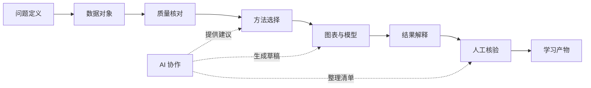
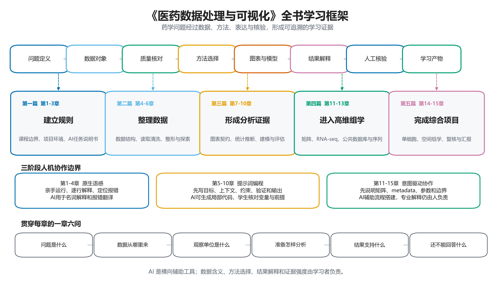
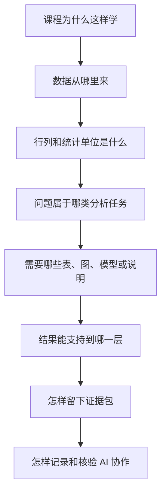
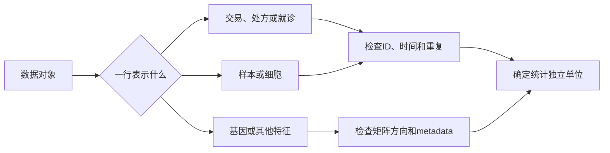

# 第1章 医药数据分析导论

## 本章定位

医药数据分析不是把文件交给软件，再从输出中挑一句结论。它是一套有顺序的工作：先界定药学问题，再确认数据对象和质量，随后选择方法、组织图表，最后判断结果能支持什么，还缺哪些证据。

本书把这套工作概括为一条课程证据链：问题定义、数据对象、质量核对、方法选择、图表与模型、结果解释、人工核验和学习产物。它是本课程的学习框架，不是所有研究都必须照搬的固定流程。面对不同数据和研究设计，具体步骤可以调整，证据责任不能省略。

### 第1章的学习范围

- 不推导统计公式，也不讲完整组学算法。
- 先辨认来源、行列、问题类型和证据边界。
- 解释为什么代码运行成功仍不等于结论可靠。

本章先建立五个判断：先问问题，再选工具；先认清对象，再处理数值；图表和模型要对应明确任务；高维结果必须连同矩阵、元数据（metadata）和参数解释；流程越复杂，越要保留样本层级与证据边界。第2-15章会依次把这些判断落实为项目、代码、图表和报告。

## 学习目标

完成本章后，学习者应能：

1. 用自己的话说明医药数据处理、分析、可视化、统计推断和专业解释之间的区别。
2. 根据来源和形态识别表格、矩阵、序列、文本及带有元数据的分析对象。
3. 区分生物学对象、测量单位、表中一行和统计独立单位。
4. 把宽泛的药学问题改写成描述、比较、关联、预测或无监督探索任务。
5. 使用“一章六问”和“三遍学习法”完成后续章节。
6. 为一个小型案例建立问题说明、数据字典、运行记录、图表设计规范卡、解释卡和 AI 协作记录。

学习目标要落到可检查产物：用一段话说明五篇路线；填写一张来源和观察单位卡；标出结局、分组与任务类型；完成一张解释卡；提交一段包含 AI 建议、人工修改和核验依据的协作记录。

## 全书要解决什么问题

全书围绕一个问题展开：怎样把药学问题转化为可核验、可追溯且解释边界清楚的分析证据。这里的“证据”不是某个漂亮图形，也不是模型给出的单个分数，而是从数据来源到结论文字都能回查的一组记录。

一项分析可以得到数值，却仍然缺少证据。例如，程序计算出月均销售金额，读者还需要知道输入文件、清洗规则、月份定义和金额字段。PCA 图上出现分离，也要回查矩阵方向、标准化、批次和样本说明。结果只有进入完整上下文，才具有可解释性。



这条链上每一步都可能改变下一步。观察单位判断错误，变量角色就会错；清洗规则没有记录，样本数量的变化便无法解释；比较方向写反，统计量和图注会一起失去含义。课程把这些风险拆到不同章节逐步训练。

## 五篇十五章学习地图

五篇内容不是五组互不相干的工具。第一篇建立规则，第二篇把原始记录整理为可信的分析对象，第三篇学习怎样比较和表达，第四篇处理高维与公共数据，第五篇把前述能力带入单细胞、空间组学和综合项目。

| 篇章 | 章节 | 主要问题 | 典型数据对象 | 学习产物 |
| --- | --- | --- | --- | --- |
| 第一篇：课程入口、工具链与 AI 协作规范 | 第1-3章 | 问题怎样定义，项目怎样组织，AI 怎样受约束 | 规则文件、任务说明书、案例字段表 | 项目目录、任务说明书、AI 协作记录 |
| 第二篇：数据结构、读取、清洗与探索性分析 | 第4-6章 | 原始记录怎样变成可分析数据 | 列表、数据框、长表、宽表 | 数据字典、清洗记录、探索性汇总 |
| 第三篇：图表表达、统计推断与基础建模 | 第7-10章 | 差异、关联和预测怎样被规范表达 | 分析表、模型矩阵、预测结果 | 图表设计规范卡、统计报告、模型评估表 |
| 第四篇：高维医药数据与 bulk 组学分析 | 第11-13章 | 大量特征、公共数据和组学流程怎样核验 | 高维矩阵、计数矩阵（count matrix）、元数据、序列文件 | 参数卡、差异结果表、下载与引用记录 |
| 第五篇：单细胞、空间组学与综合项目 | 第14-15章 | 细胞、样本、空间和多模态对象怎样整合 | 单细胞对象、空间坐标、邻接图、多模态对象 | 综合报告、复现包、图表审阅和答辩记录 |

### 五篇内容怎样前后接力

五篇内容通过产物接力：

- 第一篇解决“按什么规则工作”。第1章建立共同语言，第2章组织项目现场，第3章把提示词改为包含目标、上下文、约束、验证和输出的任务说明书。
- 第二篇解决“数据是否已经适合分析”。数据类型、ID、路径、缺失、重复、长宽表和分组汇总都在这一阶段处理，每次删除和转换都要能回查。
- 第三篇解决“怎样把数值关系写成可审阅的结果”。图表设计规范卡规定图回答什么，统计推断说明不确定性，模型章节处理关联、预测、评估与数据泄漏。
- 第四篇把相同原则带入高维数据。矩阵方向、标准化、距离、特征筛选、多重检验、数据库版本和 ID 转换都要记录。
- 第五篇把观察单位扩展到细胞、spot、切片和多模态对象。流程更长，但仍先确认 sample 或 donor 层级，再检查参数、复现状态和解释边界。

因此，第一篇交出规则和任务说明，第二篇交出分析表，第三篇交出图表与模型报告，第四篇交出组学参数和结果对象，第五篇把它们整合为可答辩的项目证据包。



图1-1. 《医药数据处理与可视化》全书学习框架。上方为课程证据链，中部为五篇内容，下方为三阶段 AI 协作路线和“一章六问”。该图表达课程结构，不代表医学研究的固定流程。矢量版见同目录 SVG 文件。

AI 使用权限随课程推进逐步开放。权限增加的前提不是“提示词写得更长”，而是学习者已经能读懂数据、检查代码并承担结果解释责任。

| 阶段 | 课程范围 | 学习者先做到什么 | AI 可承担什么 | 人仍要负责什么 |
| --- | --- | --- | --- | --- |
| 原生语感培养 | 第1-4章 | 亲手运行、逐行解释、定位报错 | 名词解释、报错翻译、代码说明 | 对象、列名、输入和输出 |
| 提示词编程（Prompt Coding） | 第5-10章 | 写清目标、上下文、约束、验证和输出 | 局部代码、调试建议、图表草稿 | 清洗规则、统计前提、图表含义 |
| 意图驱动协作（Vibe Coding） | 第11-15章 | 写清矩阵、元数据、参数和复核要求 | 较长流程、项目框架、核验清单 | 实验设计、证据强度和医学解释 |

## 怎样学习本书

### 一章六问

每学一章，先回答六个问题。它们不要求一次写得完美，但必须在项目记录中留下答案。问题越具体，后续代码、图表和 AI 协作越容易核验。

| 六问 | 要写清什么 | 回答不出时怎样处理 |
| --- | --- | --- |
| 研究问题是什么 | 对象、任务和希望得到的产物 | 缩小问题，不急着写代码 |
| 数据从哪里来 | 文件、实验、数据库、许可和取得时间 | 标记 `需补证据` |
| 观察单位是什么 | 一行、一列、一次测量或一个样本的含义 | 回查数据字典和元数据 |
| 准备怎样分析 | 描述、比较、关联、预测或无监督探索 | 先写方法类别，不猜具体函数 |
| 结果支持什么 | 当前数据可直接描述或推断到哪一层 | 使用解释卡限制动词强度 |
| 还不能回答什么 | 缺少的设计、变量、独立样本或验证 | 写入验证计划，不补造结论 |

“还不能回答什么”不是附加说明。它能防止把销售记录解释为疗效，把相关关系写成因果，也能提醒分析者区分细胞、样本和患者等层级。

### 三遍学习法

第一遍读对象。先找输入、输出、观察单位、变量角色和术语定义，不追求记住全部代码。第二遍做最小复现，从头运行本章案例，确认结果来自哪些步骤。第三遍改动一个条件，例如列名、分组顺序、缺失处理或参数，再观察结果是否变化并解释原因。

| 阅读轮次 | 核心动作 | 合格表现 |
| --- | --- | --- |
| 第一遍：读懂 | 标出问题、对象、字段和边界 | 能口头说明一行、一列和结局 |
| 第二遍：复现 | 从输入开始运行最小案例 | 能解释关键输出，保存运行记录 |
| 第三遍：核验 | 改变一个条件并比较结果 | 能指出哪些结论稳定，哪些依赖选择 |

三遍学习法把“看懂”和“会用”分开。第一次接触 PCA 或 RNA-seq 时，不必先掌握数学推导；但必须知道输入矩阵是什么、输出表示什么、哪些判断仍需回到实验设计。

### 把一次复现变成可迁移能力

复现教材输出只是起点。真正的学习证据，是换一份结构相近的数据后，仍能重新确认来源、观察单位、变量角色、方法前提和解释边界。若只能在原文件名、原列名和原参数下运行，掌握的主要是操作顺序，还没有形成可迁移的分析能力。

迁移练习每次只改变一个条件：

- 把销售文件换成另一张交易表，重新建立字段字典，不沿用原清洗规则。
- 调换分组参照顺序，检查统计量、图例和文字方向是否一起改变。
- 删除一个样本或修改一个缺失处理规则，比较结果及不确定性是否变化。
- 更换 PCA 的标准化或主成分数量，说明图形变化来自哪项选择。

改变条件后，不以“结果与教材一致”为唯一标准。合格记录应说明改了什么、为什么改、哪些输出发生变化、哪些解释仍然成立。若结果异常，先定位数据和参数，再请 AI 提供候选原因；未经运行和回查的解释不进入结论。

### 一章一份证据包

证据包是每章学习产物的集合。它不要求从第1章起就包含复杂脚本，而是随着课程推进逐步完整。期末综合项目使用同一结构，因此平时作业不是零散练习。

| 证据包文件 | 回答的问题 | 首次重点训练章节 |
| --- | --- | --- |
| `question.md` | 要解决什么问题，边界是什么 | 第1章 |
| `data_dictionary.csv` | 每列是什么，类型、单位和角色是什么 | 第4-5章 |
| `run_log.md` | 运行了什么，输入输出和报错如何变化 | 第2-6章 |
| `figure_design.md` | 图回答什么，怎样编码，如何导出 | 第7章 |
| `interpretation_card.md` | 观察、方法、解释、替代解释和验证是什么 | 第8-15章 |
| `ai_log.md` | AI 做了什么，人修改和核验了什么 | 第3章起持续使用 |

### 怎样阅读一个教材案例

教材案例不是让读者记住一组固定数字。阅读时先看它为什么被选中，再看数据如何产生、任务是什么，最后看作者怎样限制解释。若只复制运行输出，就失去了案例真正训练的判断能力。

以销售案例为例，背景是药店交易记录，来源是医药 Python 教材，目的是学习清洗和描述统计。6536、43433.57元和46.52元属于该材料在指定规则下的运行输出。它们不是跨药店通用的经营指标，也不是药品疗效指标。

| 阅读环节 | 要问的问题 | 形成的记录 |
| --- | --- | --- |
| 看背景 | 数据为什么产生，服务什么业务或实验 | 案例背景卡 |
| 看来源 | 文件、数据库或教学包来自哪里 | 来源卡和引用信息 |
| 看目的 | 案例训练清洗、统计、可视化还是流程核验 | 任务说明 |
| 看操作 | 输入经过哪些步骤变成输出 | 运行记录和参数卡 |
| 看结果 | 哪些数字或图形是材料直接给出的 | 结果表和图注 |
| 看边界 | 结果还缺哪些设计、变量或验证 | 解释卡 |

NCI60 的目的不是教学生记住癌症类型数量，而是说明无监督方法不使用标签拟合，分析后才用标签复核。airway 的目的也不是在第一章列出差异基因，而是让读者看到公共数据怎样形成计数矩阵，并与元数据和实验设计连接。

## 核心概念速查

| 概念 | 简明解释 | 本书中的使用边界 | 首先检查什么 |
| --- | --- | --- | --- |
| 数据对象 | 被程序读取和处理的表、矩阵、序列、文本或复合对象 | 文件存在不等于含义明确 | 形状、字段、ID、说明文档 |
| 样本 sample | 当前分析中被观察的单位 | 不默认是患者 | 一行或一列代表谁或什么 |
| 变量 variable | 对样本属性、状态或测量结果的记录 | 同一字段可因问题不同而改变角色 | 类型、单位、取值和缺失含义 |
| 结局 outcome | 分析主要关注的结果变量 | 应在分析前定义 | 字段是否存在，时间点是否清楚 |
| 分组 group | 用于比较或分层的变量 | 分组标签不自动具有因果含义 | 来源、参照组、是否与批次混杂 |
| 元数据 | 描述样本、批次、时间点和处理条件的信息 | 组学矩阵不能脱离元数据解释 | 样本 ID 是否对齐 |
| 统计独立单位 | 为统计推断提供独立信息的单位 | 测量次数多不等于独立样本多 | 重复测量、技术重复和主体 ID |
| 图表设计规范卡 | 作图前记录问题、数据、编码、统计和导出要求 | 图形样式服从分析问题 | 图只回答哪一个主要问题 |
| 解释卡 | 分开记录观察、方法、允许解释、替代解释和验证缺口 | 用于限制过度推断 | 每个判断能否回到数据或方法 |
| AI 协作记录 | 保存提示词、输出摘要、修改、测试和未解决事项 | AI 不是事实来源 | 哪些内容经过实际运行或回查 |

## 章节总览图



## 本章知识结构图


图1-2. AI 生成的第1章教学知识结构图。图片用于课堂读图和核验练习，不是唯一知识来源。若文字、章节号或连接关系与正文不一致，以图1-1、Mermaid 和下表为准。

人工核验时应确认五项关系：课程证据链从问题进入数据、方法、表达和解释；五篇内容按建立规则、整理数据、形成分析证据、高维组学和综合项目递进；一章六问贯穿每章；三遍学习法依次完成读懂、复现和条件核验；AI 权限随数据理解和核验能力逐步开放。

### 知识结构图生成提示词

```text
Create a clean scientific-educational knowledge map for Chapter 1 of a Chinese pharmacy data textbook.

Audience: pharmacy undergraduates and beginning graduate students.
Lesson objective: show how the whole 15-chapter book turns pharmacy questions into traceable evidence.

Required structure:
1. A horizontal evidence chain with the exact Chinese labels: “问题定义”, “数据对象”, “质量核对”, “方法选择”, “图表与模型”, “结果解释”, “人工核验”, “学习产物”.
2. Five book-part nodes below it: “第1-3章 建立规则”, “第4-6章 整理数据”, “第7-10章 形成分析证据”, “第11-13章 高维组学”, “第14-15章 综合项目”.
3. A secondary band for three AI stages: “原生语感培养”, “提示词编程（Prompt Coding）”, “意图驱动协作（Vibe Coding）”.
4. A small node labeled “一章六问”.

Visual style: white background, flat information design, generous whitespace, colorblind-friendly blue, orange, green and purple, readable Chinese typography, no gradients, no 3D, no decorative medical imagery.

Do not add patient photographs, diagnosis scenes, treatment claims, sample sizes, P values, mechanisms or clinical recommendations. Do not invent extra chapter numbers or labels. The image is a teaching display and will be checked against an authoritative Mermaid diagram.
```

## 核心内容

### 1.1 医药数据处理与可视化的课程定位

#### 课程连接的四类能力

药学问题往往同时包含专业背景、数据记录和判断责任。药品销售、安全性监测、临床检验、药效实验和组学研究产生的数据不同，但分析者都要说明对象、变量、方法和解释范围。

本课程连接四类能力。药学知识帮助界定问题和变量；定量方法帮助描述不确定性、差异和关系；可视化帮助读者检查数据与结果；研究规范要求来源、代码、图表和 AI 使用都能追溯。

| 能力 | 在课程中做什么 | 常见偏差 |
| --- | --- | --- |
| 药学问题定义 | 明确对象、结局、时间和应用场景 | 先选软件，再寻找问题 |
| 数据与定量分析 | 整理变量，选择描述、比较或模型 | 函数能运行就认为方法合适 |
| 科学表达 | 用表格、图形和文字说明结果 | 图做得复杂，却没有主要问题 |
| 研究责任 | 保存来源、规则、版本和解释边界 | 只交最终截图或 AI 答案 |

药学中的数据工作横跨多个场景。药物研发可能记录分子、实验条件和活性读数；药物使用研究可能记录处方、暴露和结局；安全性分析可能汇总不良事件和时间信息；组学研究还会产生大量特征及样本注释。课程不会在第一章展开这些方法，但先要求学习者认清每类数据回答的问题不同。

“数据驱动”也不表示问题应由数据自动决定。研究者仍要说明为什么关注某个结局，为什么采用某种比较，以及结果将服务哪类判断。没有专业问题的分析容易变成无目的筛选，看到什么就解释什么。

##### 不同场景的检查起点

- 药品销售先决定关注数量、金额、时间还是商品结构，再检查退货和折扣。
- 药效实验先确定处理、剂量、时间和主要读数，再检查重复和批次。
- 临床指标先界定人群、结局和时间点，再核对权限、随访与混杂。
- 组学研究先说明样本条件和任务，再检查矩阵、元数据、批次和 ID。

因此，本课程既不把编程当作独立于药学的技巧，也不把专业判断写成无需数据核验的意见。两者要在同一份问题说明、数据字典和解释卡中对齐。

代码能力在这四类能力中承担实现作用。会写 Python 或 R 很重要，但语法熟练不能替代样本单位判断，也不能决定一个观察能否写成疗效或机制结论。

#### 六个动作不要混成一步

“处理”“分析”“可视化”“推断”“解释”和“决策”在日常语言中容易混用。课程把它们分开，是因为每个动作依赖的证据不同。

| 动作 | 回答的问题 | 例子 | 还需要什么 |
| --- | --- | --- | --- |
| 数据处理 | 数据怎样成为可分析对象 | 类型转换、去重、长宽表转换 | 清洗规则和记录数变化 |
| 数据分析 | 数据中有什么数量关系 | 分组汇总、相关、模型拟合 | 方法前提和完整输出 |
| 可视化 | 怎样让结构或结果可检查 | 趋势图、箱线图、PCA 图 | 图表设计规范卡、单位和图注 |
| 统计推断 | 样本结果能否推向目标总体 | 置信区间、组间检验 | 设计、独立单位和模型假设 |
| 专业解释 | 结果在药学语境中表示什么 | 说明观察与已有问题的关系 | 替代解释和外部证据 |
| 决策 | 是否采取临床或管理行动 | 选择阈值或干预方案 | 更高等级证据、风险与伦理审查 |

本书主要训练前五个动作的入门能力。涉及临床决策时，只讨论数据和模型报告需要交代的风险，不提供诊疗建议。

#### 主案例起点：先看 `drugSale.csv` 是什么

贯穿案例来自医药 Python 教材中的药品销售数据清理与统计分析。`drugSale.csv` 记录某药店半年的交易。原文件第一行是标题，素材说明共有 6579 条交易记录，每条记录含购药时间、社保卡号、商品编码、商品名称、销售数量、应收金额和实收金额。

案例的教学目的很明确：学习怎样查看数据概貌，处理缺失、负值、重复和类型问题，再进行销售次数、金额和商品数量的描述性汇总。它不是临床研究，也没有患者诊断、处方适应证、随访或疗效结局。

- 若问题是“用 Python 怎么分析这个药”，应先补数据对象和目标。
- 若问题是“哪种药效果更好”，当前销售表只能改写为销售描述。
- 若任务是“画一张销量图”，要先说明按月还是按商品汇总。
- 若希望 AI 直接总结，先把用途改为检查问题拆解是否缺项。

这个案例给出全书第一个方法判断：同一份文件可以支持多个销售问题，但数据边界先于软件选择。后续章节会逐步完成读取、清洗、汇总、作图和记录，本章只先建立问题意识。

#### 本节检查

学习者应能用一句话说明课程定位：本课程训练的是从药学问题到可核验证据的分析过程，Python、R、图表和 AI 是实现与协作工具。

#### 本节学习落点

遇到新的课程任务时，先暂时隐藏软件名称，只保留对象、数据和目标。若删去“Python”“R”“机器学习”后，任务已经无法表述，通常说明问题定义仍依赖工具词，而没有形成独立的分析问题。

完成1.1后，应留下三条记录：

- 用一句话写明药学问题，不出现软件名称。
- 说明数据处理、分析和专业解释分别由谁负责。
- 列出当前最容易被误写成专业结论的一项输出。

这三条记录会进入后续 AI 任务说明书。AI 可以建议实现路径，但任务的对象、成功标准和禁止越界内容应先由学习者给出。

### 1.2 医药数据的主要来源与常见形态

#### 数据来源决定首先要查什么

数据来源指记录在哪里、怎样产生、由谁管理以及在什么条件下取得。数据形态指信息如何组织，例如行列表格、数值矩阵、序列文件、文本或包含多个槽位的分析对象。二者需要同时说明。

同样是“数值表”，药店交易表与临床检验表的含义并不相同。前者通常以交易为记录单位，后者可能以患者、就诊或检测时间点为单位。若来源和观察单位没有写清，后续统计方法即使语法正确，也可能回答错误的问题。

| 来源场景 | 常见数据形态 | 首先确认 | 主要边界 |
| --- | --- | --- | --- |
| 药品销售与处方运营 | CSV、Excel、数据库表 | 交易、处方或商品单位，退货和折扣 | 不提供药效证据 |
| 临床指标与随访 | 宽表、长表、重复测量表 | 患者、就诊、时间点、结局和权限 | 设计不清时不作因果解释 |
| 药效与安全性实验 | 实验记录、图像、仪器输出 | 实验单位、剂量、批次和重复 | 技术重复不等于独立样本 |
| 公共数据库 | 表格、序列、注释和压缩文件 | accession、版本、许可和引用 | 数据公开不等于含义已核验 |
| bulk 组学 | 计数矩阵、表达矩阵、元数据 | 行列方向、样本对齐、批次和设计 | 模式与富集不等于机制 |
| 单细胞与空间组学 | 稀疏矩阵、细胞信息、坐标、图结构 | cell、sample、donor、空间单位 | 细胞数量不等于独立样本量 |
| 文献与说明书 | 文本、表格、PDF、结构化字段 | 文档版本、段落来源和引用 | AI 摘要需要回查原文 |

#### 数据从产生到分析会经历哪些变化

原始记录通常不是直接进入统计方法。交易数据要经过导出和字段整理，临床记录可能要按时间点构成长表，测序 reads 要经过质控、比对和计数才能形成矩阵。每次转换都可能改变行数、列数、单位或 ID。

“原始数据”指尚未经过本课程分析流程修改的文件。它不表示数据绝对完整，也不表示可以直接公开。分析表是依据记录清楚的规则，从原始数据生成的工作对象。两者应分开保存。

##### 各阶段的最低记录

- 产生与取得：采集背景、系统、时间、版本和许可。
- 理解与整理：来源卡、数据字典、转换规则和行数变化。
- 分析与表达：代码、参数、环境、完整输出和图表设计规范卡。
- 解释与审阅：允许解释、替代解释、验证缺口和修改记录。

数据在阶段之间传递时，文件名和对象名要能反映状态。课程建议保留原始文件、分析表和结果表，而不是不断覆盖同一个文件。这样发现清洗错误时，才能回到上一步重新生成。

#### 同一药学问题可能需要多个数据层

“某类药物使用情况如何”可以由销售或处方数据提供数量与时间描述。“用药后某项指标是否变化”需要患者或实验对象、用药信息、结局和时间点。“哪些分子特征与处理响应相关”还可能需要组学矩阵和样本元数据。

这些问题看起来围绕同一药物，观察单位和证据层级却不同。把多个来源连接起来之前，要有可追溯 ID、明确时间关系和合法的数据使用条件。缺少其中一项时，应先把问题限制在单一数据层。

##### 不同问题层级的数据要求

- 销售描述至少需要商品、数量、金额和时间。
- 指标比较还要有主体 ID、分组、时间点和结局。
- 分子关联需要样本元数据、分子特征和明确结局。
- 机制判断需要干预、功能读数和多层验证。

这一分层能帮助学习者决定“当前先做什么”。数据不足时，合理的做法是缩小问题或列出补充需求，而不是让 AI 生成缺失字段。

#### 来源卡：拿到数据先填七项

一个数据文件不应只记录文件名。课程建议填写来源卡，至少包括来源主体、取得时间、许可、数据对象、观察单位、字段说明和预期用途。来源卡不是形式性附件，它决定后续能否引用和复现。

| 来源卡字段 | `drugSale.csv` 示例 | 公共组学示例 |
| --- | --- | --- |
| 来源 | 医药 Python 教材教学文件 | GEO、SRA 或 Bioconductor 教学对象 |
| 取得时间 | 课程材料提供时间 | 下载或安装日期 |
| 权限与许可 | 仅作课程教学，具体许可需核对 | 数据库许可和引用要求 |
| 数据对象 | 药店交易行列表 | FASTQ、计数矩阵、元数据 |
| 观察单位 | 一次交易记录 | 样本、基因或细胞，依对象而定 |
| 字段说明 | 时间、商品、数量、金额等 | sample ID、group、batch、feature ID |
| 预期用途 | 清洗与销售描述 | 数据链、矩阵结构或组学分析 |

涉及社保卡号、患者 ID 或其他敏感字段时，还要检查脱敏和访问权限。数据能被读取，不代表可以在课堂展示、上传到外部 AI 或公开发布。

#### 辅案例一：NCI60 为什么是另一种数据问题

NCI60 来自 ISLP 教材中的癌细胞系微阵列案例。数据有 64 行和 6830 列：每行是一株癌细胞系，每列是一个基因表达特征。每株细胞系还带有癌症类型标签。

该案例使用 PCA 和层次聚类探索表达结构。拟合无监督方法时不使用癌症类型标签，分析完成后再比较聚类或低维位置与已有标签的对应情况。教学目的不是预测患者癌症，而是说明大量特征怎样构成高维矩阵，以及无监督结果怎样接受外部标签复核。

| 解释层级 | NCI60 案例的合适写法 |
| --- | --- |
| 观察 | 部分同类癌细胞系在低维图或聚类中较接近 |
| 方法 | 标准化后的表达矩阵、PCA 和层次聚类 |
| 允许解释 | 当前细胞系表达数据中存在可见结构 |
| 替代解释 | 平台、培养条件、批次和高变特征可能影响结构 |
| 仍需验证 | 独立数据、实验背景和面向具体任务的验证 |

NCI60 的观察单位是癌细胞系，不是患者。PCA 图上的靠近也不是诊断准确率。这个区分会在第11章继续展开。

#### 辅案例二：airway 怎样连接公共数据和分析对象

airway 是 Bioconductor 常用的 RNA-seq 教学对象，原始数据可追溯到 GEO GSE52778 和 SRA。课程使用的对象包含 8 个样本，由 4 个细胞系分别提供 untreated 与 dexamethasone 两种条件。计数矩阵保存基因计数，元数据保存细胞系和处理状态。

这个案例的第一层任务不是找差异基因，而是检查数据链：原始 reads 怎样形成基因计数，计数矩阵的列怎样与元数据的行对齐，4 个细胞系的配对结构怎样进入后续设计。第一章只认识这些对象，第12章再讨论标准化和差异表达。

##### airway 的四层对象

- GEO/SRA 记录提供公共来源和原始测序入口。
- 计数矩阵保存基因×样本的计数。
- 元数据保存 `cell`、`dex` 和样本 ID。
- 分析设计说明控制细胞系后比较处理状态。

第一章只核对 accession、8列样本、配对结构和对象对齐，不运行差异表达模型。

销售表、NCI60 和 airway 的文件形态不同，却共享一个检查顺序：来源、对象、行列、元数据、任务和边界。这个顺序会贯穿全书。

#### 本节学习落点

识别数据来源时，不要停在“这是一个 CSV”或“这是公共数据”。CSV 只说明文件格式，公共数据只说明取得渠道。真正影响分析的是数据为何产生、谁被记录、字段如何定义、版本是否固定，以及当前是否有权使用。

完成1.2后，应能对任意案例做两次描述。第一次只描述文件形态，例如“行列表格”或“基因×样本矩阵”；第二次描述研究对象和来源，例如“药店交易记录”或“由公共 RNA-seq 数据整理的计数对象”。两种描述缺一不可。

- 文件能否打开，属于技术可用性。
- 字段能否解释，属于语义可用性。
- 权限与许可清楚，属于合规可用性。
- 数据能否回答当前问题，属于分析可用性。

四类可用性应分别核对。某一项通过，不能代替其余三项。

### 1.3 样本、变量、结局与分组

#### 四个层级要分开

样本是当前分析中被观察的单位，变量是对样本的记录，结局是主要关注的结果，分组用于比较或分层。定义并不难，难点在于同一个项目中常同时存在多个层级。

分析者需要区分生物学对象、测量单位、表中一行和统计独立单位。它们有时一致，有时不同。把测量次数当作独立样本，会夸大信息量；把基因矩阵的一行当作患者，会直接改变问题含义。

| 层级 | 要回答的问题 | `drugSale.csv` | airway |
| --- | --- | --- | --- |
| 生物学或业务对象 | 研究对象是谁或什么 | 药品、交易与购买记录 | 细胞系及其 RNA 样本 |
| 测量单位 | 一次数值来自哪次测量 | 一次交易中的数量和金额 | 一个样本中某基因的计数 |
| 表中一行 | 当前表的一行表示什么 | 一次交易 | 计数矩阵中一行是基因 |
| 统计独立单位 | 哪些单位提供相对独立的信息 | 依销售问题确定，通常是交易或时间汇总单位 | 4个细胞系，而不是8个完全无关样本 |

#### 临床记录中为什么更容易混淆单位

临床表格可能把一位患者的多次就诊、多次检测或多个用药阶段分别写成多行。若分析目标是描述检测记录数量，一行可以作为记录单位；若目标是比较患者层面的结局，独立单位通常需要回到患者或研究设计规定的主体层级。

假设某患者在治疗前、治疗后各有一次 ALT 检测。表中有两行，测量次数是2，患者数仍是1。若十位患者各测两次，数据表有20行，也不能直接把样本量写成20。实际统计方法还要考虑配对、时间和缺失，本章只先建立层级意识。

##### 记录数与独立单位的对照

- 一位患者有两个时间点时，记录数是2，患者数仍是1。
- 同一样本分两个测序 lane 时，文件数是2，生物样本仍是1。
- airway 有8个处理样本，但由4个细胞系构成配对。
- 1000个细胞来自1位供者时，跨供者推断仍只有1位供者。

每种情形都要保留主体 ID、时间、批次或 donor 信息。

统计独立单位由设计和研究问题共同决定，不能只看表有多少行。进入单细胞章节后，这一原则尤其重要：细胞数可以很大，能够支持的跨人群推断仍取决于独立供者或样本。

#### 结局、分组和协变量怎样形成问题结构

结局是主要关注的结果。分组是用于比较或分层的变量。解释变量用于描述与结局的关系，协变量用于表示需要同时考虑的其他因素。初学阶段不必先记复杂模型，但要能画出变量关系。

例如，销售问题可以把实收金额设为结局，月份设为分组或时间变量。airway 案例把处理状态作为主要关注变量，把细胞系作为需要在设计中保留的配对因素。NCI60 的无监督分析没有预设结局，癌症类型标签用于分析后的复核。

##### 不同任务的变量结构

- 月度销售以每月实收金额为输出，月份为时间分组，还要检查退款和缺失。
- 临床比较以指标或变化值为结局，以用药组与参照组为分组，同时考虑基线、时间和混杂。
- airway 关注处理状态 `dex`，并保留 `cell` 配对。
- NCI60 没有预设结局，PCA scores 和聚类成员是输出，癌症标签只用于分析后复核。

做图和建模前，应把这张结构表写好。若连主要输出是什么都说不清，增加算法不会让问题变得更明确。

#### 同一字段的角色由问题决定

变量类型描述数据怎样存储和处理，包括数值、类别、日期、文本和 ID。变量角色描述它在当前问题中做什么，包括结局、分组、解释变量、协变量、时间、批次和标识。类型与角色不能混为一谈。

`实收金额` 是数值变量。在月度销售描述中，它可以是汇总结局；在折扣核对中，它可能是待检查字段。`购药时间` 是日期变量，可用于月份分组，也可用于检查数据覆盖范围。角色改变时，数据本身没有改变，研究问题变了。

| 字段 | 类型 | 可承担的角色 | 核验问题 |
| --- | --- | --- | --- |
| 购药时间 | 日期 | 时间变量、分组依据 | 日期格式和覆盖范围是否一致 |
| 社保卡号 | ID | 标识、连接或去重辅助 | 是否脱敏，是否允许使用 |
| 商品名称 | 文本或类别 | 分组、描述变量 | 商品名与通用名是否混用 |
| 销售数量 | 数值 | 描述变量或结局 | 退货、负数和单位怎样处理 |
| 实收金额 | 数值 | 描述变量或结局 | 金额单位、折扣和退款规则 |
| batch | 类别 | 批次变量 | 是否与处理组或时间混杂 |
| sample_id | ID | 对齐矩阵和元数据 | 是否唯一，集合和顺序是否一致 |

#### 重复测量与批次为什么要提前标出

重复测量是同一主体在多个时间点或条件下被多次记录。技术重复是同一生物样本的重复测量、建库或测序。它们能提高测量稳定性，但不会自动增加独立生物样本数。

批次记录数据产生的技术或操作条件，例如实验日期、试剂批号、测序批次或中心。批次与研究分组重叠时，图上的差异可能同时包含技术来源和目标条件，单靠可视化无法分开。

| 情形 | 容易出现的误判 | 正确记录方式 |
| --- | --- | --- |
| 同一患者多次检测 | 把每次检测当作不同患者 | 保留患者 ID 和时间点 |
| 同一样本分两个测序 lane | 把两个 lane 当作两个生物样本 | 标记技术重复和合并规则 |
| 一组全在批次A，另一组全在批次B | 把批次差异写成处理差异 | 报告混杂并限制比较 |
| 组学矩阵转置 | 把基因和样本方向写反 | 同时核对形状、ID 和元数据 |

#### 三个案例怎样回答“一行是什么”

`drugSale.csv` 中一行是一笔交易。NCI60 中一行是一株癌细胞系。airway 的计数矩阵中一行是一个基因，而元数据中一行才是一个样本。任何统计或图表都要先声明当前使用的是哪张表。



本节的最低合格产物是一份数据字典草案。它至少写明变量名、含义、类型、单位、角色和需确认事项。只有列名而没有含义，不算数据字典。

#### 本节学习落点

判断观察单位时，可以先完成一句话：“在当前对象中，每一行表示___，每一列表示___，多行记录可能通过___属于同一主体，进行总体比较时相对独立的单位是___。”无法填写的位置直接标记 `需补证据`。

完成1.3后，应重点检查：

- ID 是否唯一，重复是错误还是研究设计的一部分。
- 时间点是否属于同一主体的重复测量。
- 批次是否与分组重叠。
- 矩阵和元数据是否按 ID 对齐，而不是按当前位置强行拼接。

同一句观察单位说明要分别针对原始表、分析表和结果表书写。原始临床长表的一行可能是一次检测，整理后的宽表一行可能是一位患者，模型结果表的一行又可能是一个变量或基因。文件位于同一项目，并不表示行的含义相同。

这些判断会直接影响第5章的去重、第8章的组间比较和第11章后的高维分析。

### 1.4 从医学问题到数据分析问题

#### 先判断问题属于哪种任务

医学或药学问题通常包含较大的目标，例如评价药物、寻找标志物或理解疾病过程。现有数据往往只能回答其中一部分。转化为数据分析问题时，要写清对象、来源、结局、比较或关系、时间范围、预期产物和解释边界。

本书把入门任务分为描述、比较、关联、预测和无监督探索。机制问题需要实验设计、干预或多来源证据，不能仅凭一张图或一个模型结果完成。

| 任务类型 | 主要问题 | 典型产物 | 合适动词 |
| --- | --- | --- | --- |
| 描述 | 数据中有什么，分布和趋势怎样 | 频数表、汇总表、分布图 | 描述、显示、观察到 |
| 比较 | 指定组别在结局上有何差异 | 组间汇总、效应量、区间和检验 | 比较、估计、表明 |
| 关联 | 两个变量是否共同变化 | 散点图、相关系数、回归系数 | 相关、关联、提示 |
| 预测 | 已有变量能否估计未知结局 | 训练测试结果、混淆矩阵、ROC | 预测、区分、估计 |
| 无监督探索 | 没有预设结局时是否存在结构 | PCA、聚类、热图 | 呈现、聚集、存在模式 |
| 机制研究 | 某过程为何发生 | 干预、功能实验和多层验证 | 假设、可能参与、仍需验证 |

#### 可分析问题的完整句式

一个实用句式是：“基于什么数据，在什么对象和范围内，使用哪类变量完成什么任务，得到什么产物，并明确不回答什么。”句式不是固定模板，作用是检查缺项。

以销售案例为例：“基于清理后的药店交易记录，在文件覆盖的月份内，按商品名称和月份汇总销售数量与实收金额，生成汇总表和趋势图，用于描述销售记录，不评价药效和合理用药。”

##### 三个案例的句子成分

- 销售案例使用清理后的交易记录，分析商品、月份、数量和金额，产物是汇总表与趋势图。
- NCI60 使用64×6830表达矩阵，以癌细胞系为样本进行无监督探索，产物是 PCA 图和聚类结果。
- airway 使用计数矩阵与元数据，先检查4个细胞系的8个样本及配对结构，产物是对齐检查和设计表。

完整句式还能帮助选择后续章节。若产物是趋势图，需要数据质量、分组汇总和图表设计规范卡；若产物是 PCA 图，需要矩阵、标准化和参数记录；若问题涉及条件比较，还要学习统计设计与不确定性。

#### 问题改写不是把句子变长

有些问题虽然加入许多术语，仍然不可分析。例如，“使用 AI 和多组学方法系统分析某药机制”没有指定数据、样本、结局和验证。术语数量增加，只会掩盖证据缺口。

更合适的做法是拆成阶段问题：先检查现有组学矩阵和元数据是否对齐，再预先规定比较，随后生成结果表，最后把候选发现写成需要实验验证的假设。每一步都对应清楚的输入和产物。

##### 问题改写的五项检查

- 对象过宽时，限定数据集、样本和时间。
- “有效”“重要”“更好”等词没有结局时，改为可测量字段。
- 先写深度学习、PCA 或 AI 时，回到任务类型。
- 直接写机制、诊断或临床应用时，降到观察、关联或预测。
- 只写“进行分析”时，补上表、图、模型或核验报告。

问题改写完成后，应让另一位同学仅凭这句话指出输入、输出和边界。如果对方仍需猜测，问题说明还不完整。

#### 从“某药是否有效”逐步降到可分析层

“某药是否有效”缺少对象、结局、比较、时间和设计。若手中只有销售记录，可以改成：“基于清理后的交易记录，按月份汇总指定药品的销售数量和实收金额，并描述时间变化。”这个问题只涉及销售。

若手中有临床指标表，问题可以改成：“在具有明确纳入标准和时间点的记录中，比较用药组与参照组某项指标的变化。”此时仍要判断数据来自随机试验还是观察记录，结局是否预先定义，分组是否存在混杂。

| 原始问法 | 当前数据 | 可分析问题 | 产物 | 证据边界 |
| --- | --- | --- | --- | --- |
| 哪些药卖得好 | 药店交易表 | 按商品汇总销售数量和金额 | 排名表、趋势图 | 销售表现不等于药效 |
| 某药是否改善指标 | 临床指标表 | 比较指定组别和时间点的结局 | 汇总表、分布图、效应估计 | 设计不清时只作描述或探索 |
| 癌细胞系是否存在表达结构 | NCI60 矩阵 | 用 PCA 和聚类探索样本关系 | scores 图、树状图 | 不等于患者诊断 |
| 处理是否关联转录变化 | airway 对象 | 控制细胞系后比较处理状态 | 差异结果表和组学图 | 第12章再讨论模型与阈值 |

#### 主案例运行逻辑：销售记录能产出什么

销售教材先清理数据，再计算交易次数、月份数、月均售药次数、月均销售金额、客单价、每日和每月金额，以及销售数量较高的药品。清理步骤包括删除缺失记录、处理小于0的数值、去重、类型转换和按日期排序。

素材报告清理后的记录数为6536，覆盖7个月；月均售药933次，月均销售金额43433.57元，客单价46.52元。销售数量排名前三的商品为苯磺酸氨氯地平片（安内真）、开博通和酒石酸美托洛尔片（倍他乐克）。

##### 运行输出的分项核对

- 6536条记录说明清洗改变了分析表，需要回查每一步删除原因。
- 7个月支持按月汇总，但要确认日期是否连续。
- 43433.57元和46.52元要结合金额单位、退款、月份与交易定义。
- 商品排名还要核对商品名与通用名映射。

教材将文件描述为“半年数据”，运行输出却统计到7个月。两种口径并不完全一致，正式使用前应回查最早和最晚日期。本章保留原始表述与运行输出，并把覆盖范围标为 `需人工确认`。

这些输出不包含诊断、剂量方案、患者依从性、临床结局或安全性信息，因此不足以支持疗效、合理用药和临床获益判断。

#### 证据层级：一句话最多写到哪里

同一分析结果可以被写成不同强度的句子。课程要求先定位证据层级，再选择动词。层级越高，需要的数据设计和外部验证越多。

| 层级 | 问题 | 销售案例示例 | 需要的证据 |
| --- | --- | --- | --- |
| 观察结果 | 数据直接显示什么 | 某些商品销售数量较高 | 数据表、清洗记录、汇总代码 |
| 统计结果 | 差异或关系有多大、多不确定 | 第一章不进行组间推断 | 设计、独立单位、模型和区间 |
| 科学解释 | 结果在专业问题中可能表示什么 | 可讨论运营记录特征 | 背景知识、替代解释和验证 |
| 临床或管理决策 | 是否采取行动 | 销售表不足以支持 | 风险、效益、适用人群和更高等级证据 |

#### 反向检查：如果结论先写好，会发生什么

分析者有时先希望得到“某组更好”或“某基因很重要”，再从多个图和阈值中挑选支持性结果。这会把探索过程写成预先验证，也会隐藏不一致结果。

反向检查要求在作图前写下主要问题、比较方向、核心变量和最低产物。运行后同时记录支持预期、与预期不一致和无法解释的结果。探索性发现可以保留，但要明确它产生于数据查看之后。

##### 反向检查的五项内容

- 比较方向是否在运行前写清。
- 图表是否由问题和变量类型决定。
- 阈值是否预先说明或报告敏感性。
- 不一致结果是否保留。
- AI 建议是否只作为候选方案。

看完结果再决定方向、只保留理想阈值或删除不一致输出，都要在审阅中标出。

这种记录方式并不禁止探索。它要求区分“分析前计划”和“分析后发现”，让读者知道结论是怎样形成的。

#### AI 怎样参与问题转化

AI 适合检查问题是否缺少对象、变量、任务和边界，也可以把口语化问题整理成结构化草稿。字段真实含义、分组来源和证据强度仍需回到数据字典、研究设计和课程规则。

一个合格请求应先提供自己的拆解，再请 AI 审阅。例如：“我认为一行是一笔交易，结局为实收金额，按月份分组，只做描述。请检查对象、变量、产物和边界是否缺项，不要新增医学结论。”

#### 本节学习落点

可分析问题应让读者在没有看到代码时，也能判断输入是否充分、产物是否合适。若同一句话同时要求描述、预测、解释机制和给出临床建议，应拆成多个阶段问题，并为每个阶段单独规定证据。

完成问题改写后，用三种方式自检：

- 删除方法名称，检查问题是否仍然成立。
- 交换比较方向，检查结局和参照是否仍然清楚。
- 假设结果与预期相反，检查报告是否仍能如实书写。

第三项尤其重要。一个只在得到预期结果时才“成立”的问题，往往把结论预先写进了任务。课程项目允许没有显著差异、没有清晰聚类或模型表现有限，但不允许用选择性报告掩盖这些结果。

### 1.5 学习产物与课程项目要求

#### 学习产物记录判断过程

只交最终图或最终代码，评阅者看不出分析者是否理解数据，也无法判断结果怎样产生。课程要求保存中间判断：问题为何这样定义，字段怎样解释，清洗删掉了什么，图表为何采用这种编码，AI 输出经过哪些修改。

可追溯不等于把所有临时文件都提交。应保留能解释主要决定的最小材料，并使用清楚的文件名、相对路径和版本记录。

| 产物 | 最低内容 | 评阅时检查什么 |
| --- | --- | --- |
| 问题说明 | 对象、任务、产物和边界 | 当前数据是否能回答 |
| 数据来源卡 | 来源、时间、许可、对象和观察单位 | 数据是否可追溯、可使用 |
| 数据字典 | 变量名、含义、类型、单位和角色 | 是否靠列名猜含义 |
| 清洗与运行记录 | 规则、记录数、报错、修改和输出 | 处理是否可复现 |
| 图表设计规范卡 | 问题、数据、编码、统计、图注和导出 | 图是否服务一个主要问题 |
| 解释卡 | 观察、方法、允许解释、替代解释和验证 | 结论是否越界 |
| AI 协作记录 | 提示词、输出摘要、采纳、修改和测试 | 人是否承担最终判断 |

#### 用 `drugSale.csv` 建立第一份小证据包

问题说明可以写成：“基于清理后的药店交易记录，按月份和商品名称汇总销售数量与实收金额，描述销售变化；该分析不评价疗效、适应证或用药合理性。”

数据字典标出购药时间为日期，商品名称为文本或类别，销售数量和实收金额为数值，社保卡号为敏感 ID。清洗记录依次保存缺失、负值、重复、类型转换和排序规则，并记录每一步的行数。

- `question.md`：保存销售描述问题和证据边界。
- `data_dictionary.csv`：解释7个字段、类型、单位和用途。
- `run_log.md`：记录清洗前后行数、运行输出和错误。
- `figure_design.md`：写明月份、金额、商品与汇总规则。
- `interpretation_card.md`：保存替代解释和证据缺口。
- `ai_log.md`：记录 AI 建议、人工修改和核验依据。

#### 综合项目怎样从平时作业长出来

综合项目不是在期末突然使用复杂模型。前几章建立项目规则和数据字典，中段完成清洗、统计和图表，后段再处理高维对象或复杂流程。每一步都进入同一证据包，期末报告只是对这些材料的组织和解释。

| 项目阶段 | 主要工作 | 对应课程章节 | 阶段验收 |
| --- | --- | --- | --- |
| 立项 | 定义问题、来源和边界 | 第1-3章 | 问题说明、任务说明书 |
| 数据准备 | 读取、字典、质量和整形 | 第4-6章 | 分析表、清洗记录 |
| 分析表达 | 图表、推断、模型和评估 | 第7-10章 | 图表设计规范卡、统计与模型报告 |
| 高维扩展 | 矩阵、组学和公共数据 | 第11-14章 | 参数卡、结果表、下载记录 |
| 综合复核 | 敏感性、解释、汇报和答辩 | 第15章 | 复现包、解释卡、AI 记录 |

#### 怎样判断一个课程项目质量高

高质量项目不以代码行数、模型数量或图形复杂度作为主要标准。它首先让读者知道问题是否可回答，数据是否有权使用，观察单位和变量是否准确。随后才评价方法、图表和模型。

结果部分应同时呈现主要观察和不确定性。若清洗删掉大量记录，要说明原因；若模型依赖某个阈值，要报告阈值；若图形随参数明显变化，要保留敏感性结果。发现有限并不会降低项目质量，隐藏限制才会。

| 质量维度 | 达标证据 | 常见不足 |
| --- | --- | --- |
| 问题 | 对象、任务、产物和边界明确 | 题目很大，当前数据只能回答一小部分 |
| 来源与伦理 | 来源、许可、隐私和引用可追溯 | 把可下载误认为可任意上传和公开 |
| 数据质量 | 字典、缺失、重复、行数和单位有记录 | 只提交清洗后的文件 |
| 方法 | 方法服务问题，前提和参数清楚 | 因为 AI 推荐就直接采用 |
| 图表 | 一图一问，编码、单位和图注完整 | 颜色醒目但数据含义不清 |
| 解释 | 区分观察、推断、替代解释和验证 | 把相关、预测或聚类写成机制 |
| 复现 | 输入、脚本、环境和输出能对应 | 依赖隐藏的 notebook 状态 |
| AI 协作 | 有任务、输出、修改、测试和反思 | 只附最终生成内容 |

项目汇报时，答辩者应能沿证据链反向回答：这句话来自哪张表或哪幅图，图来自哪份数据，数据经过哪些处理，处理规则为何合理。答不出时，需要回到证据包补记录，而不是再增加一张图。

#### AI 协作记录也有质量层级

最低层级只保存聊天截图，无法确认 AI 接收了什么上下文，也看不到代码是否运行。较完整的记录会保存原始任务、AI 输出摘要、人工修改、测试结果和未解决事项。

- 只保存最终答案：不通过验收。
- 有提示词和输出但缺少核验：仍需补充。
- 说明采纳和删除内容：达到基本要求。
- 记录代码结果、字段回查和边界修订：通过。
- 同时保留失败、恢复过程和未解决事项：形成完整协作记录。

AI 记录的重点不是证明“使用过 AI”，而是说明人在何处做了判断。工具生成的内容越多，验证记录越需要具体。

课程评价不按模型数量排序。问题清楚、数据可追踪、代码可运行、图表能支撑文字、解释保持边界，通常比堆叠多个方法更有说服力。

#### 三个案例在全书中的去向

`drugSale.csv` 在第4-7章继续训练读取、清洗、汇总和图表，始终不作疗效解释。NCI60 在第11章用于高维矩阵、PCA、聚类和热图，细胞系结果不外推为患者诊断。airway 在第12-13章展开公共来源、计数矩阵、元数据和配对设计，组学差异不直接写成机制或临床意义。

#### 本节学习落点

证据包的价值在于保留判断路径。它应让另一位同学在不查看聊天记录的情况下，找到原始问题、数据来源、关键处理、主要输出和解释限制。文件多并不等于证据充分，重复截图和无说明的中间文件只会增加查找成本。

第一次建立证据包时，可从最小版本开始：

- 一份问题说明，写明对象、任务和边界。
- 一份来源卡或数据字典，解释关键字段。
- 一份运行或操作记录，标出输入、步骤和输出。
- 一份解释卡，列出观察、替代解释和验证缺口。
- 一份 AI 记录，说明哪些建议被采纳以及如何核验。

后续章节再加入脚本、环境、作图数据表和参数卡。每新增一种产物，都要说明它回答证据链上的哪一个问题，而不是为了让目录看起来完整。

## 案例任务

### 任务：用一章六问审阅一个医药数据案例

从 `drugSale.csv`、NCI60 或 airway 中选择一个案例。第一章不要求完成统计模型，重点是说明问题、数据对象、观察单位、预期方法和证据边界。

| 项目 | 提交内容 |
| --- | --- |
| 案例背景 | 数据产生于什么场景，来源是什么 |
| 数据对象 | 文件或对象形态，行列分别表示什么 |
| 一章六问 | 完整回答六个问题 |
| 问题改写 | 从宽泛问题改成可分析问题 |
| 解释卡 | 观察、方法、允许解释、替代解释和验证缺口 |
| 学习路线 | 指出后续需要学习的3-5个章节 |
| AI 记录 | 提示词、输出摘要、人工修改和核验依据 |

示例可以选择 `drugSale.csv`。可分析问题写成：“基于清理后的交易记录，按月份汇总实收金额，描述当前案例中的月度销售变化。”后续学习路线可指向第5章数据质量、第6章分组汇总和第7章科研图表规范。

## 图表建议

| 图表 | 主要问题 | 必备标注 | 解释边界 |
| --- | --- | --- | --- |
| 全书学习框架图 | 十五章怎样构成课程证据链 | 篇章、章节范围、AI 阶段和一章六问 | 不是固定研究流程 |
| 数据来源卡 | 数据从哪里来、怎样使用 | 来源、时间、许可、对象和观察单位 | 公开数据也需核验 |
| 数据字典 | 每列是什么、怎样使用 | 类型、单位、角色和缺失含义 | 列名不能替代专业定义 |
| 分组汇总表 | 指定对象在组别或时间上怎样分布 | 分组、结局、记录数和规则 | 描述不等于因果 |
| 矩阵结构图 | 行、列与元数据怎样对应 | 样本、特征、ID 和方向 | 图形结构不等于机制 |
| 证据层级图 | 一句话可以写到哪一层 | 观察、统计、解释和决策 | 高层主张需要额外证据 |

## AI 协作点

| 场景 | 可让 AI 做什么 | 学习者必须核验什么 |
| --- | --- | --- |
| 概念学习 | 解释术语，比较表格和矩阵 | 是否符合课程定义和当前对象 |
| 问题改写 | 检查对象、变量、任务和产物 | 字段是否真实存在，边界是否合理 |
| 代码阅读 | 逐行解释输入、处理和输出 | 代码是否实际运行，输出是否改变 |
| 图表规划 | 生成图表设计规范卡草稿 | 编码、单位、统计和图注是否准确 |
| 结果表达 | 检查动词强度和遗漏项 | 是否新增数据不支持的因果或机制 |
| 项目归档 | 整理文件清单和核验表 | 文件是否真实存在，版本是否正确 |

## 常见误区

| 误区 | 问题所在 | 修正方式 |
| --- | --- | --- |
| 把课程理解为软件语法课 | 工具与药学问题脱节 | 先写一章六问，再选择函数 |
| 认为一行总是一个患者 | 数据对象和观察单位未核对 | 查看来源、数据字典和元数据 |
| 把测量次数当作样本量 | 忽略重复测量和独立单位 | 保留主体 ID、时间和批次 |
| 数据清洗后只保留最终表 | 无法解释删除和转换 | 保存规则、行数和中间输出 |
| 先画图再寻找结论 | 图没有明确任务 | 作图前填写图表设计规范卡 |
| 把低维分离写成已知类别 | 无监督结构被过度解释 | 比较外部标签并报告不一致 |
| 把组学差异写成机制 | 统计关系越过实验验证 | 使用解释卡并列出替代解释 |
| 让 AI 直接给最终答案 | 缺少来源、运行和专业判断 | 记录建议、修改和人工核验 |

## 核验清单

- [ ] 能用一句话说明课程证据链。
- [ ] 能指出五篇内容各自解决的主要问题。
- [ ] 已回答一章六问，没有从代码或软件开始定义任务。
- [ ] 数据来源、取得条件、权限和用途可以追溯。
- [ ] 已区分生物学对象、测量单位、表中一行和统计独立单位。
- [ ] 已标注变量类型、结局、分组、ID、时间和批次。
- [ ] 已区分描述、比较、关联、预测、无监督探索和机制问题。
- [ ] 观察结果、方法来源、允许解释、替代解释和验证缺口分开书写。
- [ ] 图表有明确问题、变量编码、单位和解释边界。
- [ ] AI 输出经过字段核对、运行测试或来源回查。
- [ ] 学习产物能从结论回到数据、代码和处理规则。

## 需补证据

| 位置 | 当前缺口 | 正文处理 |
| --- | --- | --- |
| 患者临床指标案例 | 当前材料没有可直接用于第一章的完整患者数据字典和设计说明 | 不构造疗效比较；保留结构性说明 |
| `drugSale.csv` 权限与许可 | 教材说明了教学案例，未提供本项目单独的数据许可文件 | 只引用字段和教材运行输出，标记课程使用边界 |
| `drugSale.csv` 时间覆盖 | 教材文字称半年数据，运行输出统计到7个月 | 回查日期最小值、最大值和月份定义，标记 `需人工确认` |
| 商品名与通用名映射 | 销售字段存在商品名、通用名和规格混用风险 | 不自行合并，标记 `需人工确认` |
| airway 原始流程复跑 | 第一章未重新下载 FASTQ、比对和计数 | 只介绍已核验的数据链和对象结构 |
| AI 知识结构图 | 图片文字和节点可能出现生成误差 | 以 Mermaid、SVG 和节点表为准确来源 |

## 统一课程融合接口

本章把表格、bulk RNA-seq和单细胞数据放进同一个医药数据分析框架。三类材料不是三门课，也不是三条项目路线。它们共享同一组起始问题：一行或一列代表谁，变量怎样定义，比较发生在哪个层级，输出能支持什么结论。

| 数据对象 | 本章先问什么 | AI可协助什么 | 人工必须核验什么 |
| --- | --- | --- | --- |
| 医药表格 | 一行是否为一个观察单位 | 把问题拆成样本、变量、比较和输出 | 字段含义、单位、结局定义和隐私边界 |
| airway metadata | 8行是否对应8个样本 | 生成对象辨析问题 | 4个细胞系、处理配对及样本来源 |
| airway count matrix | 行列各代表什么 | 解释矩阵术语 | 基因×样本方向、样本顺序和计数含义 |
| 单细胞矩阵 | 细胞、样本和供体如何区分 | 整理层级清单 | 细胞数不能替代生物学重复数 |

课堂保存一张任务拆解卡。学生还要写出该数据不能回答的问题。对于airway，只能把处理条件与转录本丰度变化联系起来，不能外推为临床疗效、患者结局或已证实机制。
