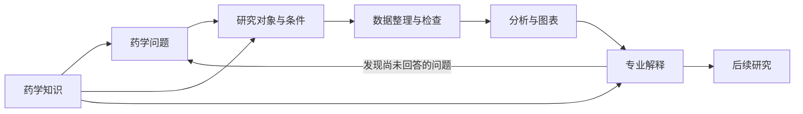
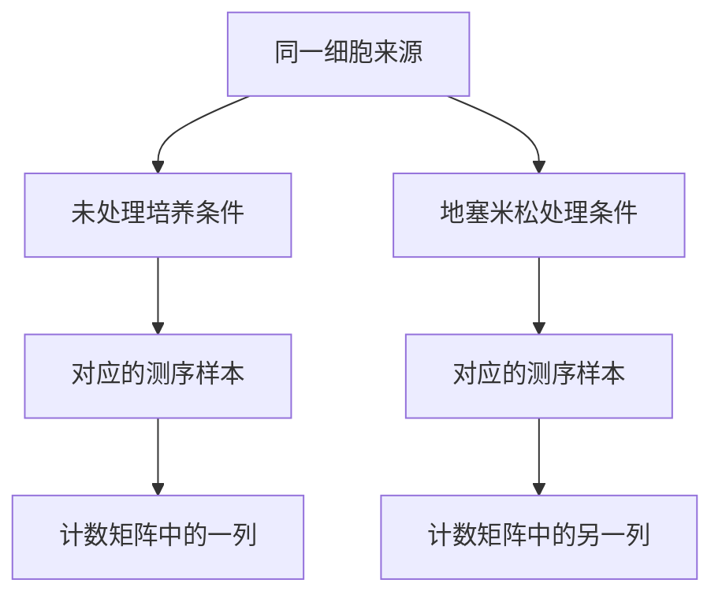

# 第1章 医药数据分析导论

## 本章定位

假设有一组化合物的性质与活性记录，要从中选出值得继续研究的对象，准备先看什么？只按某个数值排序，还不够。需要知道这个数值来自哪种测定，实验条件是否一致，以及它与想研究的问题有什么关系。药学知识从这里就开始参与分析了。

接下来，这些判断还要落实到数据里：哪些记录可以放在一起比较，哪些条件必须分开，缺少什么信息时不能继续，最后用什么结果说明自己的选择。本书从这些问题出发，介绍医药数据处理、统计、可视化和人工智能（artificial intelligence，AI）协作。学习目的不止是完成一张图，而是能够把一个专业想法做成有依据、能够继续研究的分析。

本章不要求编写程序或运行模型。先读懂几种数据，弄清对象、变量和比较关系，再完成一份自己的分析任务拆解卡。没有学过线性代数或写过完整程序，也可以从这里开始；需要的数学概念和操作将在后续问题中逐步引入。

## 学习目标

读完本章，应当能够：

- 用一个具体例子说明，药学知识怎样影响数据选择、比较方式或结果解释。
- 说明医药表格、样本元数据和计数矩阵分别记录什么，并核对它们之间的对应关系。
- 区分一条记录、一次测量和独立重复，解释为什么表格行数不一定是样本量。
- 把一个宽泛的药学问题改写为有对象、有条件、有比较、有回答范围的分析问题。
- 在样本缺失或实验条件改变后，说明应先检查哪些信息。
- 理解个人操作练习与三人合作项目各自训练什么，以及两者怎样衔接。

## 阅读指南

先顺着案例阅读，不必一开始就记住全部术语。1.1 解释为什么值得学，1.2 展示数据怎样保存，1.3 说明这些记录对应哪些实验对象，1.4 带着这些认识改写问题，1.5 再介绍学习与项目如何展开。章末有概念回查、完整练习和参考解答；遇到不熟悉的词，可以回查，但建议先独立完成练习再看解答。

## 核心内容

### 1.1 医药数据处理与可视化的课程定位

#### 专业知识怎样进入一次分析

面对化合物活性数据，先问“哪个数值最小”，和先问“这些数值能不能比较”，会走向不同的分析。前一个问题容易得到排序，后一个问题需要了解测定对象、实验方法和单位。如果记录混合了不同靶点、不同实验体系或不同测量指标，排序即使算得完全正确，也未必回答了原来的药学问题。

例如，半数抑制浓度（IC50）通常表示在给定测定条件下，使所测反应受到一半抑制时对应的浓度。它的含义依赖于所测反应和测定条件，不能脱离实验说明，把任何标成 IC50 的数值都当作同一种“药物强弱”。药学学习中接触过的浓度、作用对象、剂量与反应，在这里都不是背景知识，而是决定怎样组织数据的依据。

真正开始处理时，要把这些依据转化为明确的规则。若研究某一靶点，就要检查靶点记录；若比较同类测定，就要保留测定类型；若单位不同，就要判断能否换算，而不是直接比较数值大小。ChEMBL 的官方数据检查说明也把测定背景、单位、靶点对应和潜在重复记录列为需要核查的内容。数据库已经整理过数据，并不意味着其中所有记录都适合直接合并比较。[ChEMBL 数据检查说明](https://chembl.blogspot.com/2020/10/data-checks.html)

这也是本书选择药学问题作为起点的原因。数据处理并不是先学会一批命令，最后再找药学材料练习。知道自己在研究什么，才知道应该保留哪些列、比较哪些对象、把什么放进图里。代码把这些选择执行出来，却不会自动补上没有说明的实验含义。

专业知识也不会因为进入数据分析就自动变得充分。熟悉药物作用，并不等于已经理解缺失值、重复测量或模型评价；能够运行程序，也不等于已经理解药理。本书要连接的是这两部分能力：一方面把专业问题表达清楚，另一方面学会用数据与计算检查自己的想法。

#### AI 改变了什么，学习仍然需要做什么

当 AI 可以辅助解释概念、生成代码或整理报告时，完成某些计算步骤的起点降低了。过去因为不熟悉程序而暂时搁置的问题，现在有机会在示例、工具和反馈的帮助下逐步做出来。但“有办法开始”与“已经完成有效分析”仍然不同。一个任务没有说清对象、条件和目标，AI 即使给出了完整程序，也可能只是完整地执行了另一个问题。

以化合物比较为例，让 AI “筛出最好的药物”，并没有给出可执行的专业标准。“好”是指对某个靶点的活性、对其他靶点的选择性，还是溶解度、稳定性或某种实验条件下的表现？这些性质可能需要不同数据，也未必能够同时优化。如果只是把宽泛要求换成更长的提示词，而没有补充这些条件，分析并没有真正向前推进。

因此，本书所说的 AI 协作，首先是围绕一个具体问题使用帮助。可以请它解释一个陌生字段，比较两段代码分别做了什么，或指出一份分析说明缺少哪些条件。随着学习深入，再让它辅助生成局部代码或组织较长流程。帮助越深入，提供的数据说明和检查方法也要越具体。第3章将专门介绍任务说明书；本章先学习任务说明书里最不能含糊的部分：问题和数据。

还要区分两类常被一起称为“AI”的工作。用于预测分子性质的模型，需要围绕特定任务学习数据中的关系；用于对话的大语言模型，主要通过语言及相关输入与人交互，也可以帮助组织和调用工具。两者可以在同一个工作流程中配合，但聊天回答不自动等于经过评价的分子预测，模型预测也不自动等于实验发现。以后遇到“AI 得到了某个结果”，应继续问清楚：它执行了哪项任务，使用了什么数据，输出怎样得到检验。

由此形成的学习目标，比熟悉某个软件界面更具体，也更有延续性：自己提出问题，识别需要的数据，组织可行的比较，把分析真正完成，再用专业语言说明得到什么、还想进一步研究什么。工具更新时，需要学习新的操作；但研究对象、测量含义和比较条件不会因此失去作用。

#### 几种不同的药学工作，为什么需要相似的能力

计算可以参与药物研究，但并不是以同一种方式参与每个环节。下面几个例子分别说明候选选择、过程比较与生物响应，不能把它们理解为一条已经走完的药物研发路线。

**化合物候选选择。** 前面的活性记录问题，首先是让已有测量能够合理比较。一个很实际的初步成果，可以是整理出测定条件一致的记录，展示数值分布，再说明哪些对象值得进一步核查。这里不一定需要复杂模型。若基础记录还混杂着不同指标，先解决数据可比性，比直接增加算法更有价值。

计算参与候选发现也有公开研究实例。Stokes 等在抗菌研究中训练深度学习模型，对化合物的抗菌活性进行预测，再选择候选开展实验，halicin 是研究中的一个实例。这里保留两个不同步骤：模型给出候选线索，实验检验候选表现；论文不能简化成“AI 看过分子后就发现了可用于临床的抗生素”。[抗菌候选发现原始论文](https://pubmed.ncbi.nlm.nih.gov/32084340/)

这里的预测模型，是根据已有资料建立输入与目标结果之间关系的计算方法；深度学习使用多层神经网络学习这种关系。对初学者而言，这个例子首先需要追问的不是网络有多少层，而是模型究竟预测什么、训练资料怎样定义活性、选择哪些候选进入实验。如果目标和测量不清楚，更复杂的计算也无法让研究问题自动成立。本章不展开网络算法，也不复现该研究，而是借它理解计算结果怎样进入后续研究。

**制剂释放过程比较。** 如果关心两种处方的释放过程，只比较最后一个时间点，可能没有覆盖真正的问题。需要先确认想研究的是早期释放、整个变化过程，还是某个预先指定时点的差别。还要保留实验条件、独立重复和时间信息。把表格画成曲线只是其中一步，曲线应当帮助看清过程，而不是替代对实验条件的说明。

本章使用的制剂例子是教学情境，不给出真实处方或实验结果。它的作用是提出一个结构问题：同一实验单元在多个时点被测量，怎样保存这些记录，才不会把多个时点误当成多次独立实验？这个问题会在 1.2 和 1.3 继续展开。

**处理后的基因表达变化。** 如果关心细胞在一种处理后，哪些基因的 RNA 测量发生变化，就不再只面对几个性质或几个时间点。RNA 测序可以产生大量基因的测量，后续必须同时管理样本信息和数值矩阵。本书贯穿使用的 `airway` 教学数据，来自人气道平滑肌细胞的地塞米松处理实验；它用于学习数据读取、质量检查、图表和差异表达，不用于直接评价患者治疗效果。具体样本和研究设计将在下一节核对。[原始研究](https://pubmed.ncbi.nlm.nih.gov/24926665/)

基因表达可以涉及 RNA 和蛋白产物等层次，本案例测量的是 RNA 层面。后文所说的“转录响应”，关注处理后这一层表达模式如何变化，不代表已经测量蛋白功能；“差异表达分析”则用于比较条件之间的表达差别，并评价变化大小与不确定性。先分清研究的是哪一层，才能理解为什么一份表达结果还不是完整机制。

三个方向的对象不同，但都需要回答一些共同问题：测量了什么，哪些条件一致，哪些记录相互关联，最后的结果对应哪一种专业判断。学习这些共同能力，才能在换了数据以后继续分析，而不是只会重复一份现成脚本。

#### 没有充分的数学和编程训练，怎样开始

本书不把线性代数、高级统计或完整编程训练作为阅读第一章的前提。开始时，需要的是看懂表格中一行代表谁、一列表示什么、一个数值带什么单位。学到比较变化时，再理解差值、比值和变异；学到统计推断时，再讨论样本为什么有不确定性；学到高维数据时，再引入矩阵、距离和降维。

按问题引入数学，不等于省去定量思考。例如，“从一个水平增加到另一个水平”可以用差值描述，也可以用倍数描述，两者回答的问题并不一样。差值保留原来的计量单位，适合说明增加了多少；倍数强调相对于原值的变化，而原值为零时就不能直接计算这个比值。选择表达方式之前，要先想清楚自己希望读者理解什么。这里已经在使用数学，只是还没有开始复杂推导。

单位检查也属于定量推理。1 µmol/L 与 1000 nmol/L 表示同一浓度，不能因为数值不同就当作两个不同水平。相反，浓度与抑制率即使都写成数字，也不是换一个单位就能比较的量。数学帮助明确数量之间的关系，药学知识帮助判断这些关系是否有意义；两者需要一起使用。

矩阵的入门也可以从数据本身开始。先理解“每列是一个样本，每行是一个基因，交叉位置是一次测量”，再学习怎样取出一列或一行。以后讨论矩阵运算时，才把运算与这些对象对应起来。不必在第一章推导矩阵分解，但不能一直把矩阵当作不知道行列含义的文件。

编程同样分阶段练习。开始时能够运行一个最小示例、解释输入和输出、发现列名写错，就有明确的学习价值。之后才把读取、筛选、整理、统计和作图连接起来。AI 可以帮助解释报错，但亲自检查输入、运行修改后的代码、确认结果是否改变，仍然需要通过练习掌握。只读懂一份讲解，不能替代实际操作；反过来，暂时不会完整编程，也不妨碍先把分析问题想清楚。

#### 这门课具体学习什么

可以把本书的工作主线概括为：让药学问题进入计算，让计算结果回到生命。前半句要求把研究兴趣写成具体的对象、条件和比较；后半句要求把得到的数值与图形重新放回实验和药学背景，说明它对下一步研究意味着什么。这里的“回到生命”不意味着每次分析都能给出机制或临床结论，也包括清楚地说明某项计算尚未回答这些问题。

这条主线包含几个相互依赖的环节。提出问题后，要找到合适数据；使用数据前，要弄清字段和测量；正式比较前，要处理不一致和缺失；作图时，要选择能够表达问题的方式；解释时，要区分实际观察和进一步推断。发现数据不够，也可能需要回到问题本身，缩小范围或重新寻找资料。



图中箭头表示工作上的联系，不表示科学因果。药学知识不只出现在结尾解释部分，它从问题选择和条件界定时就已经参与。计算得到的结果如果暴露了数据不足，也应回到前面调整，而不是靠更强的措辞补足。

全书按照下面的顺序展开。这个顺序说明共同学习路径，不要求每个课程项目都用到全部方法。

| 学习部分 | 主要解决的问题 | 逐步形成的能力 |
| --- | --- | --- |
| 第一篇：课程入口、工具链与 AI 协作规范 | 想做什么，怎样准备并说明任务 | 明确问题，认识环境，组织 AI 协作 |
| 第二篇：数据结构、读取、清洗与探索性分析 | 数据怎样保存，哪些记录能使用 | 读懂对象，读取整理，检查质量 |
| 第三篇：图表表达、统计推断与基础建模 | 怎样比较和表达，怎样评价模型 | 组织统计与图表，说明不确定性 |
| 第四篇：高维医药数据与 bulk 组学分析 | 大量特征怎样一起分析 | 阅读矩阵、降维和表达分析结果 |
| 第五篇：单细胞、空间组学与综合项目 | 更细的测量层次怎样解释，怎样完成项目 | 保留样本层次，综合证据，交流成果 |

读完本章时，不需要能够完成表中所有工作。第一步是把“我想分析这些数据”改成一项别人也能理解的任务。接下来先看看，药学数据究竟以什么形式来到面前。

### 1.2 医药数据的主要来源与常见形态

#### 先问数据怎么产生，再看文件怎么打开

拿到一个 Excel 文件，只知道它能用什么软件打开，还不知道里面是什么数据。一个表格可能来自实验仪器、公开数据库、随访记录，也可能来自药品流通业务。它们都能保存成行和列，但一行记录的意义可能完全不同。

因此，认识一份数据至少要分开三件事。第一是来源：数据在哪里、通过什么过程产生。第二是内容：记录了什么对象和测量。第三是格式：这些内容怎样保存在文件中。来源帮助判断数据适合回答什么，内容决定怎样处理，格式决定怎样读取。只解决第三件事，分析还没有真正开始。

| 看到的材料 | 可能的来源 | 应先弄清的内容 | 不能只凭外观作出的判断 |
| --- | --- | --- | --- |
| 化合物性质与活性表 | 实验测定或公开数据库 | 结构、靶点、测定类型、数值和单位 | 一行就是一个不同化合物 |
| 制剂释放记录 | 释放实验及整理表 | 处方、实验单元、时间和释放测量 | 每一行都是一次独立重复 |
| 样本说明表 | 实验设计与样本登记 | 来源、处理、批次和样本编号 | 编号相邻的样本一定属于同一组 |
| 基因计数矩阵 | RNA 测序后的计算处理 | 基因、测序样本及对应计数 | 每个数字都是细胞数或患者数 |
| 药品销售记录 | 业务系统 | 一笔交易、一个品种或一个汇总周期 | 销量就代表疾病人数或治疗效果 |
| 显微图像、序列和文本 | 成像、测序、文献或记录系统 | 图像单位、序列对象、记录来源和标注 | 转成表格后就具有相同科学含义 |

这里列出的来源和内容需要由实际说明确认。例如，销售表的一行究竟是一笔交易，还是一个品种在一天内的汇总，不能只靠文件名判断。如果把汇总记录误当作原始交易，后面计算的“记录数”就已经换了含义。

CSV 和 TSV 是常见的文本表格格式，分别用逗号和制表符分隔字段；Excel 工作簿还可以包含多个工作表、公式和显示格式。它们本身不保证单位、变量类型或实验设计正确。能读出一列数字，只说明读取成功；这些数字是否应该比较，还要回到来源和字段说明。

#### 化合物数据：一个对象可能对应多条记录

初学者容易把“化合物表”理解成每行一个化合物。但如果同一化合物参加多次测定，它就可能出现多行。重复出现的化合物编号并不必然是重复错误，也可能表示不同靶点、不同条件或不同实验。

下面给出的是字段结构示意，不是实验数据，也没有给任何化合物赋予活性结果。

| 字段 | 记录什么 | 为什么不能随意删去 |
| --- | --- | --- |
| `compound_id` | 化合物标识符 | 用于识别同一化合物的不同记录 |
| `assay_id` | 测定标识符 | 用于追查测定背景和条件 |
| `target` | 测定涉及的作用对象 | 不同对象的测量未必适合合并 |
| `measurement_type` | 指标类型 | 浓度、比例或其他指标不能混为一列“分数” |
| `relation` | 等于、大于或小于等关系 | 阈值记录不是精确测量值 |
| `value`、`unit` | 数值与单位 | 脱离单位的数值不能合理解释 |
| `source` | 原始资料或数据库记录 | 用于追查方法和记录含义 |

标识符（identifier，ID）用于区分对象，本身通常不是被研究的性质。筛选记录时，可以用 `compound_id` 找到同一化合物；但不能因为编号较大，就认为它的分子量、活性或发现时间更大。编号如何编码，要由数据说明确定。

为什么还需要 `relation`？假设原记录只说明某测量“高于测定范围上限”，这与在上限处测得一个精确值不是同一件事。直接删除“大于”符号，会把有限的信息改成过于精确的数字。这里没有给出具体实验值，但已经能够决定一条处理原则：保留原始关系，等明确分析方法后再决定如何使用。

同样，合并重复编号之前，应先判断重复的是对象还是完整记录。如果同一化合物在不同条件下有不同测量，简单保留第一行会丢失信息；如果同一条结果被多次收录，又需要识别它们是否来自同一个来源。数据清洗不是把表格变得整齐，而是使处理后的结构仍然对应原来的测量。

#### 制剂数据：把时间和重复同时保留下来

再看制剂释放。假设研究记录了不同处方在多个时点的释放情况，数据可以按“一次测量一行”组织：

| 字段 | 本教学情境中的含义 |
| --- | --- |
| `formulation_id` | 处方编号 |
| `preparation_id` | 独立制备批次的编号 |
| `unit_id` | 释放实验单元编号 |
| `time`、`time_unit` | 测量时点及其单位 |
| `release_value`、`release_unit` | 释放测量及其单位 |
| `condition` | 与比较有关的实验条件 |

这称为长表的一种组织方式：同一实验单元的多个时间点占据多行，时间作为一个字段保存。也可以把不同时间点各放一列，这通常属于宽表。长表与宽表不是两种不同实验，而是同一信息的不同排列方式。后续整形操作可以改变排列，却不能凭空改变独立实验的次数。

这里同时保留 `preparation_id` 和 `unit_id`，是因为制备批次与释放测量单元未必相同。一批制备物可以分成多个实验单元；同一单元也可能在多个时点采样。如果研究关心制备过程的可重复性，就不能只保留实验单元而丢掉批次来源。反过来，不同实验方案可能对处理分配有不同安排，不能套用某一份表格就认定所有制剂研究都具有相同层次。

还应追查释放结果怎样计算。有的表保存单次测量值，有的保存已经换算的累计释放比例，有的仅保存多个重复的均值。均值表便于展示，却不足以恢复每个重复的变化。只有均值时，就应如实说明现有资料的限制，不能从均值“补出”原始重复值。

这些要求暂时不涉及复杂统计。先保留时间、来源和实验条件，后面才有可能正确比较过程。若一开始把所有重复平均后只剩一条曲线，再想研究重复之间的差别，就可能已经没有所需信息。

#### airway：为什么需要同时看两张表

`airway` 是本书贯穿使用的公开教学数据。它选取人气道平滑肌细胞的 RNA 测序样本，包含四个细胞来源，每个来源都有地塞米松处理与未处理条件，共八个测序样本。原研究在这里所用的处理条件为地塞米松 1 µmol/L、18 小时。这里讨论的是教学子集，不代表原始数据库中只有这八条记录或只有这两种实验条件。[原始研究的实验背景](https://pubmed.ncbi.nlm.nih.gov/24926665/)

RNA 测序（RNA sequencing，RNA-seq）通过测序与后续计算，获得样本中 RNA 的测量信息。bulk RNA-seq 测量的是一个样本中许多细胞的总体 RNA 信号，本章先把它理解为样本层面的表达测量，不把一个测序样本等同于一个细胞。

认识这份数据，要把样本元数据与计数矩阵放在一起。元数据（metadata）是说明数据对象的资料。在这里，它说明每个测序样本来自哪个细胞来源、接受什么处理。计数矩阵则保存基因与样本对应的数值。只有矩阵，没有样本说明，就可能知道测到了多少，却不知道在比较谁。

**表1：airway 样本说明摘录**

| 测序样本编号 | `cell`：细胞来源编号 | `dex`：处理标签 |
| --- | --- | --- |
| SRR1039508 | N61311 | untrt |
| SRR1039509 | N61311 | trt |
| SRR1039512 | N052611 | untrt |
| SRR1039513 | N052611 | trt |
| SRR1039516 | N080611 | untrt |
| SRR1039517 | N080611 | trt |
| SRR1039520 | N061011 | untrt |
| SRR1039521 | N061011 | trt |

`untrt` 表示未处理，`trt` 表示地塞米松处理。`cell` 在这份数据里是细胞来源的编号，不是细胞数量。八行记录对应八个测序样本，而细胞来源编号只有四种。这个区别将在下一节用于理解配对。

**表2：airway 原始计数矩阵摘录**

| 基因标识符 | SRR1039508 | SRR1039509 | SRR1039512 | SRR1039513 |
| --- | ---: | ---: | ---: | ---: |
| ENSG00000000003 | 679 | 448 | 873 | 408 |
| ENSG00000000419 | 467 | 515 | 621 | 365 |

表2只展示两个基因、四个样本，便于读懂结构；它不是完整矩阵，也不是筛选后的差异基因表。表1和表2的标签及计数与本书使用的教学数据一致，可对照 Bioconductor 的工作流示例核查。[airway 数据结构与计数示例](https://bioconductor.org/help/course-materials/2016/CMRI/Workflow.html)

读表2时，可以从交叉位置开始：679 表示在这套计数流程下，样本 SRR1039508 中归入基因 ENSG00000000003 的计数。它不表示 679 个患者，也不表示 679 个细胞，更不能直接解释为 679 个 RNA 分子的精确数量。计数怎样得到，与测序和上游处理方式有关。

“原始计数”也不等于未经任何处理的仪器原始文件。它已经经历测序数据整理及基因计数等步骤，只是尚未完成这里后续分析所需的标准化等处理。原始序列文件、计数矩阵和差异表达结果表处于不同阶段，不能因为都来自同一个研究，就当成可以互换的输入。

为什么不能看到 679 和 448 就宣布药物抑制了这个基因？首先，两列的整体计数水平可能不同，需要检查和标准化；其次，这里只看了一个来源的两个样本，还没有考虑其他来源的变化与不确定性；最后，单个基因的表达变化也不等于某种临床效果。第12章会解释差异分析如何处理这些问题。本章的任务是读懂数字指向什么，不是提前完成后续推断。

这里的标准化，是按相应方法调整与样本整体计数规模等有关的差异，为后续比较准备数据。它不是让每个样本具有相同的表达，也不能消除所有实验偏差。可以先记住两点：样本中测得的总量不同，原始数值的比较需要谨慎；采用某种调整后，还要说明方法适用的条件。后续再学习具体计算，就知道这些步骤在解决什么问题。

#### 标签怎样把数据连接起来

表1中的样本编号也出现在表2的列名中。这不是为了便于排版，而是两份资料之间的对应依据。假设矩阵列的顺序改变了，样本元数据仍能通过编号找到对应样本；如果只按行号或位置拼接，顺序一变，处理标签就可能贴到错误样本上。

核对时应分两步。先看需要分析的样本集合是否一致，有没有缺少、增加或重复的编号。再看实际运算时，元数据的排列是否与矩阵列顺序一致。集合相同不等于顺序相同，两项检查不能相互替代。

表2只是四列摘录，所以它与表1不具有相同样本集合，这是这里明确说明的展示选择。若处理完整数据，却发现计数矩阵只有四列，就不能用“教材只展示了四列”来解释真实文件的缺失。读懂节选与完整数据的区别，也是来源核对的一部分。

数据框（data frame）通常可以在不同列中保存不同类型的信息，例如样本编号、处理标签和数值。矩阵（matrix）通常以同一种数据类型组成规则的行列结构。表1适合保存为含多种字段的数据框，表2的计数部分适合保存为数值矩阵。但“数据框”或“矩阵”这些技术名称，仍然不能替代行列含义；矩阵可以转置，实际数据也可能以样本为行，必须查看说明。

#### 单细胞数据改变了测量层次，没有取消来源

单细胞 RNA 测序把表达测量细化到细胞层面。常见对象中，一部分数据保存基因与细胞的计数，另一部分保存细胞来自哪个样本、供体或实验条件，以及后续得到的质控和注释。这里的具体矩阵方向可能因软件而不同，先确认轴的含义，再谈行数和列数。

与 bulk 数据相比，单细胞数据中的观察对象更细，但这些细胞仍然有共同来源。同一个供体提供的许多细胞，不会因为分成许多列，就自动变成许多个独立供体。若问题是比较不同供体群体的差别，仍要保留供体层次，不能只看总细胞数。

细胞类型标签也要看来源。有些标签来自已有实验信息，有些来自后续计算与人工注释。后者是分析所得的判断，不应不加说明地当作原始事实。第一章只要求辨认“表达数值、样本来源、后续标签”属于不同信息，不要求运行单细胞分析流程。

高维（high-dimensional）描述的是同时记录了很多特征，例如大量基因。它不意味着拥有同样多的独立研究对象。用于学习高维表达结构的 NCI60 数据也体现了这种区别：表达特征与样本标签分别保存，矩阵的两个轴不是同一种对象。[NCI60 数据说明](https://islp.readthedocs.io/en/latest/datasets/NCI60.html) 本书不在这里报告其聚类结果，也不把细胞系表达资料称为患者疗效资料。

#### 保留来源，是为了知道数据能怎样继续使用

认识数据后，应留下一份简短来源说明：数据叫什么，从哪里获得，使用哪个版本或哪次下载的文件，记录了哪些对象，哪些字段需要回查原文。这些信息不必写成很长的报告，但要让后续自己或同伴能够找到同一份材料。

公开可下载也不等于可以不加判断地上传到任意工具。实际使用前，需要确认资料的使用条件，以及是否含受限内容。涉及真实个人记录或未公开研究时，不应为了方便解释字段就把整份原始资料交给外部 AI；可以先使用公开数据、去除识别信息后的字段说明或明确标注的教学结构。具体环境与权限设置将在后续章节介绍。

到这里，读者应该能说明手里的文件来自哪里、各部分记录什么，以及怎样互相对应。但还有一个容易混淆的问题：知道表格有多少行以后，究竟知道了多少个“样本”？下一节从这里继续。

### 1.3 样本、变量、结局与分组

#### 一条记录不一定就是一个独立样本

“这份数据有多少样本？”听起来只是一个计数问题，实际上需要先说明在数什么。数表格的行、数参与研究的对象、数独立制备或独立来源，可能得到不同答案。只有先确定层次，数量才有意义。

研究对象是问题关心的对象，例如某类化合物、某种制剂，或特定来源的细胞。观察单位是当前一次观察对应的单位；它可以是一个测序样本，也可以是某个实验单元在一个时点的测量。记录则是这些信息在文件中的保存形式。一个观察单位可以对应多条记录，一条汇总记录也可能已经合并多个观察单位。

实验单位进一步回答“处理施加在哪个层次”。它通常指能够独立接受实验处理的最小单位，需要根据实验设计识别。统计分析还要考虑哪些观察相互关联，不能把“存成不同行”当作“可以独立分析”。后续讨论样本量时，应明确使用的是哪一层数量。

| 层次 | 要回答的问题 | 本章中的例子 |
| --- | --- | --- |
| 研究对象 | 希望了解什么对象的什么现象 | 气道平滑肌细胞的处理响应 |
| 观察单位 | 当前一次观察测量的是谁或什么 | 一个 bulk RNA-seq 样本 |
| 实验单位 | 处理独立施加在哪个单位 | 需要由培养与处理安排确认，不能只看矩阵列数 |
| 记录 | 文件中一行或一个条目保存什么 | 样本说明表的一行，或释放表中某时点的一行 |
| 独立重复 | 哪些信息来自可用于当前推断的独立来源或实验重复 | 需要结合来源、处理分配与重复层次判断 |

这些名称不要求在任何研究里都对应不同东西。有的简单设计中，一个对象接受一次处理、测量一次、保存一行，几个层次恰好重合。容易出错的是把这种简单情况推广到所有数据。一旦出现配对、重复测量、多个细胞或多次技术读数，层次就必须分开。

“样本”因此要结合上下文使用。说“八个测序样本”，是在数测序资料；说“四个细胞来源”，是在数来源；如果写“样本量为八”，却不说明这八个是什么，就不足以判断后续统计是否合适。清楚的表述通常比一个孤立的字母 n 更有用。

#### airway 中的八个样本，怎样保留四个来源

回看表1，N61311 对应两个测序样本：SRR1039508 是未处理，SRR1039509 是地塞米松处理。其他三个细胞来源也各有两个条件。比较的两组不是来源完全无关的两批样本，而是有来源对应关系的处理与未处理资料。

这称为配对或区组结构：每个来源内部都有可以对应的条件，来源用于组织比较。区组在这里不是额外的药物分组，而是把具有共同来源的观察联系起来。分析时保留 `cell`，就是保留这项设计信息。



图示描述一个来源下的两个条件；表1共有四组这样的对应关系。它没有表示同一批细胞先后接受两次测量，也没有表示同一患者先后接受治疗。究竟怎样培养、施加处理和采样，应由实验方法确认，不能从图中自行添加操作细节。

为什么来源重要？不同来源可能在未处理时就有表达差别。若只关注两个处理组的总体数值而丢掉来源信息，就失去了区分来源差别与处理响应的一项依据。保留配对结构，才能在后续方法中考虑同一来源内的比较，再综合不同来源的信息。

本章不要求手工计算这种比较，也不把四个来源简单换成一个适用于所有分析的“真实样本量”。准确描述是：当前教学子集有八个测序样本，来自四个细胞来源，每个来源有两个处理条件。要进一步解释独立重复、估计不确定性或建立模型，还需要使用与该设计一致的方法。

矩阵中的基因数回答另一件事：每个样本同时测了多少特征。在比较处理组时，多测一些基因，不会增加细胞来源的数量。即使矩阵有许多行，也不能据此说药物在许多独立对象上得到了重复验证。基因在别的研究问题中可以成为分析对象，但在本章的处理比较里，它们是被逐一研究的表达特征。

#### 为什么重复测量不能直接增加独立重复

现在换回制剂情境。假设同一个释放实验单元在多个时间点被测量，每个时间点存一行。行数增加说明获得了更细的过程信息，但没有说明又制备了一批新的材料，也没有说明又加入了一个独立实验单元。

这些时间点的关系不是偶然的：它们共享同一个实验单元及其前面的变化过程。因此，不能把所有时点混在一起，当作来自互不关联对象的测量。否则，分析会把过程中的关联误作额外独立信息。重复测量的价值很大，但它增加的是哪种信息，要与独立重复区分。[关于重复与独立性的说明](https://www.nature.com/articles/nmeth.3091)

技术重复通常用于了解同一材料或同一来源在测量过程中的一致性；生物学重复则希望反映独立生物来源之间的变异。名称不是自动判断规则，还需要查看实际重复了哪一步。同一份 RNA 重复测量、同一细胞来源的独立培养、不同供体来源的培养，对不同研究问题提供的信息并不一样。

制剂研究也需要同样的追问，只是对象未必称为“生物学重复”。如果同一制备批次分成多个释放单元，这些单元可以帮助了解该批次的释放表现，却不能单独说明不同制备批次是否稳定。如果问题涉及制备过程的可重复性，批次本身就不能在整理时被删掉。

所以，遇到“重复了几次”，应追问“哪一步重复了几次”。是同一个样品读了多次，还是重新制备了材料？是来自同一个细胞来源，还是不同来源？处理在哪里独立分配？这些问题决定怎样组织比较，而不是在统计结束后才补写的说明。

只要保存好来源编号，后续还有机会选择恰当方法；如果把来源全部合并、只保留一长列数值，就很难恢复原来的实验关系。第一章要求理解这些区别，正是为了让后续数据整理不损失本来存在的信息。

#### 变量既有类型，也有角色

变量是对对象某一方面的记录，例如浓度、时间、处理状态或表达计数。理解变量时，需要分别判断它怎样保存，以及它在当前问题里做什么。前者是数据类型，后者是分析角色。

按内容看，数值变量用于记录有数量意义的测量；分类变量用于记录类别。有些类别具有明确顺序，有些没有。字符串是计算机保存文字的一种形式，并不代表内容一定不能计算；反过来，存成数字的字段也不一定适合求平均。

以 `dex` 为例，它记录的是处理类别。即使把 `untrt` 和 `trt` 编成 0 和 1，科学含义仍然是两个条件，不是“处理量为零和一”。如果研究处理浓度，就需要真正的浓度及单位。给类别编码只是保存方式的变化，不会产生缺少的剂量信息。

| 变量 | 数据内容 | 在当前问题中的角色 | 常见错误 |
| --- | --- | --- | --- |
| 测序样本编号 | 标识信息 | 连接元数据与矩阵 | 当作可平均的数值 |
| `cell` | 来源类别 | 保留配对或区组关系 | 因为不是结果就删除 |
| `dex` | 处理类别 | 定义比较条件 | 仅凭列顺序猜测标签 |
| 基因计数 | 数值测量 | 后续表达分析的输入 | 当作已标准化的效应量 |
| 释放时间 | 带单位的数值 | 描述测量过程 | 把不同时间当作独立组别而忽略来源 |
| 实验批次 | 实验条件类别 | 检查是否存在系统差异 | 把批次标签误认为生物类型 |

分析角色会随问题改变。若研究释放量随时间怎样变化，时间是重要的解释条件，释放量是主要关注的测量；若核对采样安排，时间本身又是检查对象。因此，不存在一份对所有任务都不变的“这一列永远是什么角色”的答案。

字段的角色还影响能否删除。对某张图而言，来源编号可能没有直接显示；但统计比较仍需要它。不能以“没有画在图上”为由删去分析依赖的列。合理的数据整理应知道每个字段为什么留下，而不是只留下最后作图所用的两列。

#### 结局与分组，要随着问题一起定义

结局（outcome）是当前研究主要关心的测量或事件。在临床研究中，它可能是某种健康结局；但在一般数据分析里，它也可以是一个实验指标。本章使用“结局”时，不默认它是患者获益，更不把任何数值变化都称作疗效。

在 airway 问题里，后续关注的是基因表达如何随处理条件变化。表达测量不是患者是否改善的替代写法；数据里没有患者症状或临床随访，模型也不能通过计算把这些结局补出来。在制剂情境中，体外释放测量同样不能直接改称体内效果。

不是每个任务都必须先指定一个结局。如果只是检查数据结构、查看分布或探索样本之间的模式，任务可能没有一个预先指定的结果变量。不能为了填满模板，强行把某个字段称为结局。只要说明当前任务是什么、预期得到什么信息即可。

分组则说明要怎样组织比较。处理组与未处理组是按实验条件分组；不同来源用于保留对象差异；后续聚类得到的标签则来自计算结果。这三者不应混在一起。实验分组先于分析存在，计算分组是分析的产物，二者依据不同。

例如，后续图上出现两个簇，只能先描述某种方法和参数下的分组模式。不能因为有两个簇，就自动把它们叫作两类疾病；也不能在看到分组后，再从很多标签中挑一个最符合图形的解释，却把它写成原先就要检验的假设。分析如何开始，会影响结果应该怎样表述。

#### 条件、批次与混杂，为什么要在开头检查

比较两个处理条件时，还可能同时存在培养批次、仪器、测量日期等差别。协变量（covariate）是分析中可能需要一并考虑的其他变量；是否纳入、如何处理，要根据问题和设计决定，不是看见一列就全部放进模型。

批次（batch）指数据在不同实验或处理批次中产生的分组信息。批次差异可能带来与研究目标无关的系统变化，但不能仅凭图上分离就断定原因一定是批次。先有实验记录，才有依据检查它是否与结果有关。

最需要警惕的情况，是处理条件与另一个因素完全重合。例如，在一个假设设计中，全部处理样本在一次实验中测量，全部未处理样本在另一次实验中测量，而且没有跨实验的对应观察。此时看到组间差别，不能只凭现有数据分开“处理差别”和“实验批次差别”。这称为混杂：不同因素的影响在现有设计中难以区分。

把批次交给某个校正算法，不会凭空产生设计中缺少的交叉信息。后续可能需要补充实验、改变问题范围，或明确报告现有资料不能分开的因素。第一章无需学习校正公式，但应能指出缺口在哪里，而不是默认任何问题都能在最后一步计算中修正。

#### 零、缺失和“没有测到”，不是同一个意思

数字 0 可能是一次有效记录，缺失值则表示当前字段没有可用数值。缺失可能来自未测量、记录失败或资料未提供，原因需要查明。如果把缺失统一填成 0，就可能把“没有信息”改成“测得为零”，从而改变分布、均值与组间比较。

在 RNA 计数矩阵中，零表示这套测量与计数流程下没有得到相应计数，不能直接证明该基因在任何条件下都不表达。在化合物测定中，“低于检测限”也不必等于精确的零。要保留检测范围或关系符号，才能在后续选择处理方法。

再区分字段缺失与整个样本缺失。前者可能只是某个样本缺少一项说明，后者可能使一组配对不完整。两者对任务的影响不同，所以不能只报告一个总的“缺失数”。检查应指向具体对象：缺哪一列、哪一条记录、哪一个样本，以及它原本参与什么比较。

至此，可以试着不用统计公式解释表1：它有八条样本记录、四个细胞来源、两个处理条件，并保留四组来源对应关系。再说明表2里每个轴是什么，以及怎样找到某一列的处理标签。若这些话仍说不清楚，应先回看两张表，不必急着给数据选择算法。

### 1.4 从医学问题到数据分析问题

#### 宽泛的问题有价值，但还不足以开始计算

“地塞米松是否有效？”可以表达一个重要的药学兴趣，却还不能直接决定分析。有效作用于什么对象，以什么指标衡量，在什么条件下，与什么比较？不同答案会对应不同研究，有的需要细胞实验，有的需要动物实验，有的需要临床资料。

把问题问具体，不是降低问题的价值，而是确定眼前这份数据能够推进其中哪一步。若真正关心患者获益，就不应把它悄悄换成一个容易得到的表达图；应该明确说，当前先研究细胞的转录响应，患者层面的问题仍需要相应研究。两项问题可以有关联，但不能因为前一项完成，就把后一项也写成已经回答。

反过来，也不能为了继续分析而忽略数据不合适。一个问题可以先于数据提出，然后寻找合适资料；也可以从已有数据出发，识别它能够支持的问题。无论从哪边开始，都需要检查两者是否一致。任务不是给任何文件配上一种算法，而是找到问题、数据和方法能够对应的范围。

#### 第一步：把研究对象与测量说清楚

根据表1和表2，能够确认的是：当前使用人气道平滑肌细胞的 bulk RNA-seq 教学子集，具有细胞来源编号和处理标签。测量的是样本层面的基因计数，不是患者症状，不是药物浓度监测，也不是直接测得的蛋白功能。

因此，可以先把原问题改为：

> 在这份人气道平滑肌细胞数据中，地塞米松处理与基因表达变化有什么关系？

这句话已经比“是否有效”具体，因为它指明了对象和测量。但它仍然没有交代处理条件、来源关系以及希望怎样描述变化，还需要继续。

如果发现实际文件里只有处理标签，没有原始方法中的浓度或时间，就应回查研究说明。本章的来源支持相应实验条件，因此可以写入问题；在自己的项目中，不能因为看起来像同一种药物实验，就复制这里的浓度和时间。

#### 第二步：把条件与比较关系补进去

根据当前教学子集，可以继续改写：

> 在四个细胞来源各有地塞米松处理与未处理样本的设计下，比较 1 µmol/L 地塞米松处理 18 小时与未处理条件的基因表达差异，并在分析中保留细胞来源的对应关系。

这里增加的每个条件都影响分析。处理时间限定观察发生在何时，浓度限定使用的处理条件；细胞来源说明比较不是把八个无关样本直接分成两组；“保留对应关系”则要求后续数据整理和统计不能丢掉 `cell`。

“比较基因表达差异”仍是一项计划，不是已经发现差异。若把“比较”提前改成“证明上调”或“证实机制”，就把待研究的问题写成了预期答案。合理的任务允许结果不符合最初猜测，也允许经过检查后发现现有数据不足以支持某项比较。

比较方向也要说明。后续如果报告“处理相对未处理”的变化，图表和文字就应保持同一方向。反过来计算会改变差值或倍数变化的表达，不能图里用一个方向，解释又用另一个方向。第一章只需写明谁相对谁，具体统计量将在后续学习。

#### 第三步：写出想得到什么，而不是指定想看到什么

一个可执行的问题还需要预期输出。这里可以计划先核对样本与数据质量，再形成表达差异结果表，并用合适图表展示变化模式。结果表应当同时呈现变化大小和不确定性，不能只留下“显著或不显著”的标签。

变化大小说明观察到的差别有多大，不确定性说明这个估计有多稳定。两者将在统计章节详细介绍。本章不用计算这些量，但可以先理解为什么要同时关注：非常小的变化与较大的变化，专业意义可能不同；看起来较大的变化，如果来源之间差别很大，也不能只凭一个数值下结论。

这里的预期输出不是“必须出现一张漂亮的火山图”，也不是“必须筛出若干个基因”。图表类型应服务于问题，结果数量应来自分析，不能反过来调条件以满足预设数量。若数据检查提示异常，先说明异常，比继续生成外观完整的结果更有帮助。

本章尚未进行标准化、统计检验或作图，所以不会在任务卡中填写分析已经成功、找到了差异基因或验证了某条通路。预期产物与实际产物要分开记录。

#### 第四步：写明当前数据不能独立回答什么

上面的任务可以研究特定细胞和处理条件下的表达响应，但不能独立回答患者接受治疗后是否改善。它没有相应临床结局，也不能代表所有组织、浓度和时间条件。

即使后续得到差异表达，也还没有直接完成机制解释。差异表达描述的是表达测量与条件之间的变化关系；若进一步讨论某个基因是否驱动某种功能，需要相应功能研究。富集分析则将一组基因与已有功能集合联系起来，其结果不能直接改写成某条通路已经被实验验证。

不要把这些限制只写成一句“结果仅供参考”。更有用的写法应指向缺少的信息。例如，“当前没有患者结局，因此不能评价临床疗效”；“当前未开展针对某基因的功能干预，因此表达差异本身不能确定其功能作用”。读者看到缺什么，也就知道下一步研究可能需要什么。

下面把问题改写的结果合在一张卡里。表中的分析与输出都是后续计划，不是本章新完成的实验结果。

| 任务拆解项 | airway 示范 |
| --- | --- |
| 研究兴趣 | 了解地塞米松处理后的细胞转录响应 |
| 研究对象 | 当前教学子集中的人气道平滑肌细胞 |
| 观察与来源层次 | 八个测序样本，来自四个细胞来源；每个来源有两个条件 |
| 数据来源 | airway 教学子集；原研究与 Bioconductor 工作流说明 |
| 已有数据 | 样本元数据与基因原始计数矩阵 |
| 主要变量 | 样本编号、细胞来源、处理标签、基因计数 |
| 比较 | 处理相对未处理，保留同一来源内的对应关系 |
| 条件 | 地塞米松 1 µmol/L、18 小时；解释限定于相应实验背景 |
| 后续分析计划 | 先检查数据，再采用与计数和设计一致的方法比较表达 |
| 预期输出 | 数据检查说明、表达差异结果表及与问题一致的图表 |
| 可以推进的问题 | 特定细胞与处理条件下的表达响应 |
| 不能独立回答的问题 | 患者临床获益、普遍适用的疗效、已证实的功能机制 |
| 当前完成情况 | 已明确问题和设计；尚未运行本次分析 |

任务卡不是把一句话拆成很多栏就算完成。它的作用是检查各栏是否一致。如果研究对象写的是患者，已有数据却是细胞计数，表格再齐全也仍然矛盾；如果比较写的是同一来源配对，数据整理却删除了来源编号，也还不能执行原计划。

#### 描述、比较、关联和预测，究竟差在哪里

把问题具体化以后，才有必要判断任务属于哪一种类型。分类不是为了先背术语，而是帮助选择后续方法与检查方式。

如果只想了解化合物记录中有哪些测定类型、单位是否一致，主要是在描述数据；如果想研究特定条件之间的测量差别，就进入比较；如果想研究两个变量怎样共同变化，可以进行关联分析；如果希望对未见过的对象估计某个结果，则需要预测与相应评价。探索任务则关注还没有明确假设时的数据结构或模式。

| 任务类型 | 问题示例 | 需要先明确什么 | 结果不能自动替代什么 |
| --- | --- | --- | --- |
| 描述 | 现有活性记录包含哪些测定与单位？ | 记录含义、缺失和汇总范围 | 对更大总体的推断 |
| 比较 | 两种条件下的测量有何差别？ | 分组、重复、比较方向与其他条件 | 未由设计支持的因果解释 |
| 关联 | 某种性质与实验响应是否共同变化？ | 对象匹配、尺度及可能的共同影响因素 | 一方导致另一方的证据 |
| 预测 | 对未参与建模的对象，能否估计目标结果？ | 预测对象、可用输入和独立评价方式 | 已具备临床应用价值的结论 |
| 探索 | 样本之间出现哪些模式？ | 输入、尺度、方法和参数 | 已经验证的生物学分型 |

相同图形可能服务于不同任务。例如，一张散点图可以描述现有变量的关系，但不能仅因为点接近一条直线，就声称对新对象预测准确。预测问题必须区分用于建立方法的数据与用于评价的数据，还要避免同一来源的信息在两边重复出现。具体拆分与评价将在模型章节学习。

本书不会为了让贯穿案例覆盖所有方法，就用 airway 的八个样本演示预测建模。学习相关、回归和分类时，会使用相应医药表格案例。共同主线是问题与数据相匹配，不是无论问题是什么都只使用一份数据。

还有一个重要区别是“分析前计划”与“看到结果后提出的新想法”。探索可以产生新的问题，这是分析的价值之一；但新问题应如实标为后续假设，再用合适材料检验，不能写成原先已经设计好的验证。保存最初的问题，就是为了能够解释分析过程中怎样改变了想法。

#### 先留下自己的尝试，再诊断一个错误方案

现在暂停阅读，依据表1和表2，独立写一段自己的分析问题。可以参考前面的改写过程，但不要照抄整张示范卡。至少说明对象、比较、来源关系，以及一个当前不能回答的问题。暂时不请求 AI 代写；写不清的地方可以标出疑问，这些疑问比一段借来的完整答案更能帮助定位下一步需要学什么。

然后阅读下面的文本。它是专门构造的教学错误方案，用于练习检查，不是真实模型对话，也不是原研究的结论：

> 现有数据来自八名患者。把每一行基因作为一个独立样本，直接比较处理前后的原始计数，筛选下降的基因，即可判断地塞米松能改善患者疾病，并据此确认药物作用机制。

不要只写“AI 可能出错”或“结论过度”。请把其中每一处问题对应到表格或实验背景：哪一项对象被写错，哪一种数量被混淆，哪一项分析步骤还没有完成，哪一种结局根本没有测量。再把原段落改成一项可以继续开展的任务。

这道练习不是让学生比模型更会措辞，而是检查是否已经读懂数据。即使同样的错误来自同伴、现成脚本或自己过去的笔记，判断依据也相同。完成后可到章末参考解答对照；若修改了初稿，简短说明为什么改。

#### 条件变了，先检查什么

能够复述示范还不够。新的资料通常不会完全保留教材中的条件，因此需要练习在条件变化后判断下一步。

**情境一：一个样本在计数矩阵中找不到。** 假设样本元数据仍有八条记录，但完整计数文件中缺少 SRR1039509。首先要确认这确实是完整文件，而不是节选或读取范围出错；再检查是否存在编号变更、过滤记录或文件版本不一致。不能为了让两个文件行列数一致，直接删除元数据中的那一行后继续分析。

如果确认这个测序样本不可用，N61311 来源对应的处理条件就不完整了。接下来应评估原来的比较是否仍可进行、应采用什么设计，以及是否需要补充资料。第一章不要求判断具体统计方案，也不要求自动删除同来源的另一份样本；要求的是先指出哪一组关系改变了，再有依据地作出选择。

**情境二：新增资料的处理时间不同。** 如果原数据是 18 小时，新增数据却来自另一处理时间，不能因为药物名称相同就合并成一个“处理组”。需要核对是否还存在浓度、来源和测量流程差别，明确研究是限定同一时间比较，还是准备提出关于时间的新问题。

若新增时间只出现在另一个研究来源中，时间与来源还可能同时变化。此时不能把合并后的差别直接解释成时间作用。可选择保持资料分开、缩小比较范围，或寻找更完整的设计；选择哪条路，要由实际数据决定。

**情境三：想把问题换成制剂释放。** airway 中的细胞来源、处理与计数不再适用，但“对象、测量、比较与回答范围”的问法仍然适用。要重新填写处方、制备或实验单元、时间和释放指标，不是把基因列名换成“释放量”就继续运行原流程。

这三种情境共同检查的是：当条件改变时，能否辨认原计划依赖的哪些信息已经改变。合理调整不一定表现为马上找到新算法，也可能是先补齐来源说明，或明确当前不能进行某种比较。

### 1.5 学习产物与课程项目要求

#### 先保存真正做过的工作

经过上一节，已经可以留下三样东西：最初怎样理解问题，怎样根据数据改写，以及为什么修改。它们还不是一份完整研究报告，但已经记录了一次真实的分析起点。

这些记录有实际用途。以后发现样本条件与预期不同，可以回看原问题依赖什么；同伴接手整理数据时，可以知道不能丢掉哪些来源字段；项目范围变化后，也能解释为什么改为另一种比较。若只保存最后一张图，就很难恢复这些选择。

第一章不要求为了形式完整而创建大量空文件。任务拆解卡、初稿和修改理由可以放在同一个文档中。没有运行代码，就写尚未运行；没有使用 AI，就写未使用。不需要补造运行日志，也不需要把还未得到的结果填进“结果解释”栏。

等到后续实际读取数据，再加入数据字典，说明字段含义和单位；实际修改记录时，再加入清洗说明；运行分析后，再保存脚本、作图数据和结果。文件随着工作产生，而不是先凑齐一套目录再假定研究已经完成。

#### 操作在个人练习中学，综合判断在项目中展开

会说明“应该检查列名”，不等于已经会在程序中检查列名。实际操作能力需要通过个人作业练习，包括读取资料、运行代码、理解输出、修改局部步骤、生成图表和检查结果。遇到报错后能否定位输入、解释修改原因、重新运行确认，也是学习的一部分。

个人作业不只是为项目准备分工。每个人都需要接触基本操作，才能理解同伴做了什么，也才能判断一个结果是否符合原来的问题。如果长期只负责写文字或排版，到了项目解释时就很难知道数字怎样产生。

合作项目则提供另一类练习：把数据、方法、图表和专业解释围绕同一个问题连接起来。一个成员可能较擅长整理数据，另一个较擅长作图，第三个较擅长查阅实验背景，这种差异可以形成分工；但分工应当促进共同理解，而不是把关键步骤变成只有一个人知道的部分。

| 学习方式 | 主要训练什么 | 可以留下什么证据 | 不能单独证明什么 |
| --- | --- | --- | --- |
| 个人操作作业 | 读取、运行、修改、作图和检查 | 实际脚本、运行结果、修改说明 | 已能独立组织完整研究 |
| 三人合作项目 | 围绕问题综合使用数据和方法 | 共同成果、关键选择、相互复核记录 | 每个人都亲自完成了全部操作 |
| 项目交流与个人追问 | 解释选择、结果及条件变化 | 对具体数据和图表的说明 | 仅凭口头回答就具备操作熟练度 |

因此，项目交流不要求现场编写或修改代码，也不把操作速度当作理解水平。实际操作由平时作业提供证据，项目交流则关注是否理解整个分析。两者结合，才能看清完成成果与掌握方法之间的关系。

#### 三个人怎样共同完成一个问题

三人项目应从共同确认问题开始，而不是先分配“一个人写代码、一个人做 PPT、一个人讲”。如果每个人理解的问题不同，最后很容易出现数据在回答一件事，图表在表现另一件事，结论又转向第三件事。

开始时，三个人先用同一份任务卡明确对象、已有数据、比较与成果形式。随后可以按任务分工，但每个关键选择都应让其他成员看得懂。例如，整理者说明为什么保留某些测定记录，分析者说明比较使用哪些变量，解释者核对文字是否与结果一致。相互检查的是具体内容，不需要把所有人都变成每一步的唯一执行者。

项目推进中，可以在几个实际节点交流：准备正式分析前核对问题与数据；生成主要结果后检查图表与比较方向；准备报告时逐项核对结论依据。节点不必写成复杂管理流程，但不能一直等到汇报前才发现样本含义不同。

个人贡献记录也应具体。例如，“核对了样本标签，并发现两张表顺序不一致”“根据单位说明修正了一项换算”“对照结果删除了无法支持的临床表述”，都能对应实际工作。“负责资料”“负责 AI”“参与讨论”则过于宽泛，难以说明究竟做了什么判断。

人人理解全流程，不意味着三个人必须重复完成所有劳动。它意味着每个人都能从问题说到主要结果，知道关键数字来自哪里，说明自己参与的一项选择，并在条件变化时提出合理调整。某一步主要由同伴实现，可以如实说明，再解释这一步解决的问题与检查方式。

#### 项目不靠方法数量证明质量

本书共同学习多种数据与方法，但单个项目应由问题决定范围。化合物数据整理项目可以重点解决测定可比性，制剂项目可以重点解释过程变化，表达项目可以围绕处理响应形成分析。不是每个项目都需要分类模型、组学分析或交互界面。

下面是选题方向，不是已经提供并完成核验的项目数据包。具体题目应在获得可用数据后确定。

| 项目方向 | 可以聚焦的工作 | 方法选择前要确认的条件 |
| --- | --- | --- |
| 化合物性质与活性记录 | 整理同类测量，展示分布，提出后续核查对象 | 测定、单位、对象和重复记录是否可比 |
| 制剂释放过程 | 保留重复和时间，比较明确条件下的变化 | 制备与测量层次、时间安排、数据是否仅有均值 |
| 公开表达数据 | 从样本设计到表达结果形成连贯说明 | 来源与分组、矩阵对应、方法与解释范围 |
| 医药业务表格 | 描述品种、时间或业务分组的变化 | 记录粒度、时间覆盖、汇总方式与使用条件 |

选择较简单的方法，并不等于降低要求。一个描述性项目如果对象明确、整理合理、图表准确、解释充分，就完成了相应问题；一个复杂模型如果数据对应关系有误，则不能因为代码较长而获得更强结论。

也不应把贯穿案例中已经生成的图表机械装入所有项目。制剂项目可以借鉴 airway 中保留来源关系的做法，但不需要把无关表达结果放进报告。可以迁移的是问题拆解、数据检查和解释方法，具体数据与结论必须重新对应。

#### 一份成果怎样让别人继续使用

随着实际工作推进，项目需要保存足以理解和复核分析的材料。这里介绍最终要形成的联系，不要求首章全部完成：

```text
项目目录/
├─ README.md          问题、资料范围与使用说明
├─ data/              按使用条件保存的数据或获取说明
├─ scripts/           实际运行的处理与分析脚本
├─ results/           结果表、作图数据和图表
├─ report.md          主要发现、专业解释与限制
└─ ai_log.md          关键 AI 协作与人工修改；未使用时注明
```

目录中的材料应互相对应。报告中的图应能找到相应作图数据与脚本；脚本应说明使用哪份输入；输入应能追查来源与处理规则。受限数据不能因为项目需要复核就直接公开，应使用相应获取说明或经过允许的交付方式。

“可复核”与“可再次运行”也不完全相同。前者要求别人能够检查问题、数据和推理；后者还要求有足够环境与操作信息，让分析再次执行。后续章节会逐步学习环境、脚本与运行记录。本章先理解为什么只交图像不足以说明一项分析，以及为什么尚未运行的任务不能声称已经复现。

报告中的解释可以按几个问题组织：实际观察到什么；经过什么处理或方法得到；允许怎样解释；还有什么替代解释；下一步需要什么资料或验证。没有证据的部分不要靠更肯定的措辞填补。若研究只完成描述，也可以明确报告描述结果，并提出由此产生的问题。

#### AI 使用随学习能力逐步展开

本书按学习阶段安排 AI 协作，目的在于让读者逐渐能够说明、执行并检查更完整的任务。以下范围按章节划分，不是要求第一章就完成所有阶段。

| 阶段 | 可以怎样使用 AI | 需要先掌握或明确什么 | 不把什么交给 AI 代替 |
| --- | --- | --- | --- |
| 第1至4章：先理解对象和基础操作 | 解释术语、翻译报错、逐行说明代码 | 能说清输入、对象、处理和输出；随后亲手运行最小代码 | 完整逻辑代码、清洗脚本、统计结论或整份作业答案 |
| 第5至10章：围绕具体任务协作 | 按明确说明生成局部代码，辅助排错与检查 | 数据字段、目标、约束、验证和输出要求 | 猜测列名、决定未知样本含义、替代统计前提判断 |
| 第11至15章及综合项目：组织较完整流程 | 在已说明的数据与设计下辅助搭建流程、复核代码 | 矩阵、来源、分组、参数、输出和检查方法 | 把流程运行成功解释成机制成立或临床有效 |

阶段安排限制的是学习中让 AI 代做什么，不是要求拒绝所有帮助。第一章如果不理解“元数据”，可以请求解释后对照表1；如果不知道 `trt` 含义，应查字段说明，而不是让它猜；如果要完成自己的问题改写，先留下个人版本，再讨论其中哪里与资料不一致。

关键协作应保留任务说明、提示词、输出摘要、人工修改、实际检查结果和未确认事项。无需保存与任务无关的全部聊天，也不要把敏感原文作为“留痕”复制到公开文件。记录多少，以能够说明影响分析的那项建议和修改为准。没有实际运行，就不能把 AI 声称“已验证”当作自己的运行记录。

#### 项目交流会追问什么

项目交流可以围绕具体成果展开，而不是临时让学生现场改程序。例如：

- 为什么保留这些记录，排除了哪些记录？如果保留规则改变，哪个结论可能受影响？
- 这张图中的点、线或颜色分别代表什么？它对应多少个来源，还是多少次测量？
- 报告中的“变化”是原始数值差别、模型估计，还是进一步的专业解释？
- 如果少了一组来源资料，或者新增数据来自另一批次，原来的比较需要怎样重新检查？
- 哪一项关键建议来自 AI？采纳或修改它的依据是什么？

回答时应当指向数据、图表或记录，不必背一段统一声明。如果无法确定某个条件，可以说明需要回查哪份材料。能够定位不确定之处，比无依据地给出一个肯定答案更接近实际研究工作。

这些追问不会替代平时操作考查，也不以算法复杂度、界面效果或代码数量决定质量。项目真正要说明的是：这组人针对什么药学问题，怎样使用了数据，结果支持什么，以及下一步还能怎样继续。

## 核心概念回查

下面的表用于读后回查。若某个概念仍然抽象，回到对应案例解释，比单独背定义更有帮助。

| 概念 | 本章中的含义 | 回查位置 |
| --- | --- | --- |
| 记录 | 文件中保存的一个条目，可能是一次测量，也可能是汇总 | 1.2 的化合物与制剂表格 |
| 观察单位 | 当前一次观察对应的对象或对象状态 | 1.3 的层次区分 |
| 实验单位 | 能够独立接受实验处理的最小单位，需由设计确认 | 1.3 的实验设计解释 |
| 独立重复 | 对当前推断提供独立来源或实验重复的信息，不能只按行数计算 | 1.3 的配对与重复测量 |
| 元数据（metadata） | 说明数据对象的资料，如来源、处理与编号 | 1.2 表1 |
| 计数矩阵（count matrix） | 以行列对应对象与特征的计数结构，需说明轴与处理阶段 | 1.2 表2 |
| 结局（outcome） | 当前问题主要关心的测量或事件，不默认是临床获益 | 1.3 的结局与分组 |
| 配对或区组 | 保留同一来源内条件对应关系的设计信息 | 1.3 的 airway 结构 |
| 混杂（confounding） | 不同因素在现有设计中难以区分影响 | 1.3 的处理与批次示例 |
| 预期输出 | 准备通过分析形成的产物，不是已经得到的发现 | 1.4 的问题改写 |

## 本章练习：把一份数据写成可以开始的任务

本练习使用本章表1、表2及其来源说明，不要求下载软件或运行分析。表2明确是节选，不应把四列误当成完整数据。化合物与制剂题是教学情境，不包含真实实验结果。

建议先保留个人初稿，再与同伴讨论。独立阅读时，可以先完成全部题目，最后再看参考解答。任务卡可以与答案保存在同一份文档中。

### 任务一：写出自己的分析起点

从化合物、制剂或细胞处理响应中任选一个方向，用一段话说明想了解什么。指出至少一项已有药学知识会怎样影响数据选择或比较条件，再写明目前还缺少什么信息。若选择化合物或制剂方向，必须注明当前只有教学情境，尚未取得实际数据；不填写虚构实验结果。

然后回到 airway，先独立写下你对“地塞米松是否有效”这句话的判断。说明它为什么还不足以直接分析，再给出一个与当前数据一致的问题。已有初稿时直接使用，不必为了格式重新制造一份“第一次判断”。

### 任务二：读懂两张表之间的关系

回答以下问题，每题给出依据，不只填词语：

1. 表1的一行、表2的一列和表2的一行分别对应什么？
2. 样本 SRR1039513 来自哪个细胞来源，接受什么条件？与它具有来源对应关系的未处理样本是哪一个？
3. 如果把计数矩阵列顺序倒过来，但元数据暂时不变，应如何核对和匹配？为什么只检查行列数还不够？
4. 能否根据表2第一行的两个数值，直接声称地塞米松有效？至少指出两个尚未解决的问题。
5. 为什么八个测序样本、四个细胞来源和许多基因分别是不同层次的信息？

### 任务三：完成任务卡并修改错误方案

填写下面的卡片。已有完整示范可供回查，但请按自己的理解表达。随后对照 1.4 的教学错误方案，指出具体错误，并写一段修订稿。未开展分析的项目一律保持为计划，不补写结果。

| 项目 | 自己填写 |
| --- | --- |
| 想研究的问题 | |
| 研究对象与观察单位 | |
| 数据来源与现有资料 | |
| 来源或重复层次 | |
| 主要变量及含义 | |
| 比较对象与方向 | |
| 需要保留的实验条件 | |
| 准备先检查什么 | |
| 预期形成什么结果或图表 | |
| 当前可以推进的问题 | |
| 当前不能独立回答的问题 | |
| AI 是否参与，参与了什么 | |
| 根据核对作出的人工修订 | |

另写简短修改说明：选择一处你原先没有想清楚的内容，说明查了什么、为什么改。如果初稿没有相应错误，也可以记录进一步核实了什么，不必为了交作业故意制造错误。

### 任务四：换一个条件再判断

分别说明先查什么、为什么查、什么情况下才能继续，不要求指定尚未学过的统计检验。

**A. 标签缺失。** 假设某一列计数仍然存在，样本元数据中相应处理标签却为空。同伴建议按前后列交替出现的规律把标签补成 `trt`。是否可以接受？应怎样处理？

**B. 只剩均值。** 假设制剂资料只提供每种处方各时点的均值曲线，没有独立制备、实验单元或各重复测量。能够描述什么？不能据此恢复或判断什么？若希望比较重复之间的差别，需要补充什么？

**C. 新数据来源。** 假设获得另一份地塞米松处理数据，但组织来源、处理时间和测量流程与 airway 不同。能否直接拼成一个更大的处理比较？请说明可以先开展的一项核对，以及一种不直接合并也有价值的工作。

### 任务五：说明个人练习与合作项目怎样衔接

假设三人准备开展一个数据项目，请写出一种围绕工作内容的分工方式，并说明大家怎样共同核对一个关键选择。再分别举例：哪项实际操作应通过个人作业考查，哪项理解适合在项目交流中追问。不要设计现场改代码环节，也不要虚构评分比例。

### 提交前自查

- 问题中的对象与实际数据一致，变量和标签有来源。
- 记录数、观察单位与来源或重复层次已经区分。
- 任务卡写的是当前能开展的计划，没有把预期写成结果。
- 不依靠临床疗效或机制词语扩大细胞实验的回答范围。
- 条件变化题说明了检查顺序与理由，不只是写“重新分析”。
- 保留了真实初稿与修订；未使用 AI 或未运行代码时如实说明。

## 参考解答与推理

以下提供一种合理的解释方式，不要求逐句一致。不同写法只要对象、依据和推理对应，也可以成立。先完成练习，再对照其中的理由。

### 任务一：专业知识应当落实到具体条件

化合物方向可以从“同类测定中哪些记录值得进一步核查”开始，使用对靶点、测定指标或浓度单位的理解，说明哪些数据能够比较。制剂方向可以关注某个明确过程，指出需要时间、实验条件和重复信息。细胞方向可以关注特定处理下的表达响应，保留对象、条件和来源关系。

“药学知识很重要”还不是充分回答，关键是写出它改变了哪项选择。例如，“先把不同测定指标分开，再讨论同一指标的分布”，比泛泛说明跨学科更具体。没有实际数据时，列出所需字段与来源缺口即可，不能声称已经选出了候选或较好处方。

对 airway 而言，“是否有效”缺少对象和结局定义。可以改写为研究给定处理条件下的细胞表达变化，并保留四个来源的对应关系。这个改写推进了转录响应问题，没有把临床疗效问题一并解决。

### 任务二：把数量放回相应层次

表1一行是一个测序样本的说明；表2一列是该测序样本的一组基因计数；表2一行是某个基因在节选样本中的计数。三者不是同一种对象，不能把其中任一维的长度都叫作独立样本数。

SRR1039513 属于 N052611，标签是 `trt`；与它具有来源对应关系的未处理样本是 SRR1039512。依据来自表1的 `cell` 与 `dex`，不是来自编号相邻这一现象。相邻在这份节选里恰好成立，不构成通用识别规则。

列顺序改变时，应按样本标识符核对集合、唯一性与实际排列，再让元数据与矩阵列顺序对应。仅检查数量，只能知道有几条记录，不能保证标签属于正确样本。两个文件数量完全相同，也可能发生样本错配。

表2中的原始计数不能直接完成表达差异推断：尚需检查整体计数水平、采用适当标准化并考虑来源和变异。即使后来支持表达变化，也没有临床结局来支持“对患者有效”。这两层理由不同，一个涉及分析是否完成，另一个涉及研究测量能回答什么。

八个测序样本说明有八份相应测量，四个细胞来源说明这些测量具有来源对应结构，基因则是同时测量的特征。增加基因不增加来源，增加同一来源的测量也不自动增加独立来源。

### 任务三：错误不只发生在最后一句

教学错误方案至少混淆了以下环节：

| 原方案中的说法 | 与资料不一致之处 | 怎样修订 |
| --- | --- | --- |
| “八名患者” | 表1是细胞实验测序样本，具有四个来源 | 写明八个测序样本及四个细胞来源 |
| “每一行基因作为一个独立样本” | 处理比较中，基因是测量特征 | 保留样本列与来源关系，不用基因数扩大重复数 |
| “处理前后” | 当前说明支持处理与未处理条件，不应擅自补成患者随访或同一材料纵向测量 | 使用“处理相对未处理”，按实际培养设计解释 |
| “直接比较原始计数” | 尚未完成数据检查、标准化与适当统计 | 写成后续检查与分析计划 |
| “下降的基因即可判断改善” | 表达方向本身不是患者结局 | 将解释限定于相应表达响应 |
| “确认作用机制” | 现有表达测量不足以独立完成机制验证 | 指出需要进一步功能研究 |

一段可接受的修订稿可以是：

> 使用当前 airway 教学子集，先核对八个测序样本的来源、处理标签与计数矩阵。在保留四个细胞来源对应关系的前提下，计划采用与计数数据及实验设计一致的方法，比较地塞米松处理相对未处理的表达变化。解释限定于该细胞与处理条件下的响应；当前任务不评价患者疗效，也不把表达差异写成已经验证的机制。

这段话没有预填差异数量、统计结果或生物学方向。它说明接下来做什么，也说明哪些问题尚未得到回答。

### 任务四：先恢复信息，再决定方法

**A 的关键是标签依据。** 不能按交替规律补标签。先核对样本编号，回查原始样本说明或可靠来源记录，确认是否读取、合并或导出时丢失。如果确实无法确认，明确标记未知，暂不把它当作已知处理组用于比较。随机猜测或让 AI 猜测，都没有增加证据。

**B 的关键是汇总不可逆。** 均值曲线可以支持对已报告平均过程的描述，前提是时间、单位与条件清楚。但均值不足以恢复每个重复的数值、重复数量或重复间差异，也不足以确定制备批次的可重复性。若想研究这些问题，需要补充原始重复记录、来源层次及相应实验说明。缺少这些材料，不意味着均值图毫无价值，而是要把问题限定在它实际包含的信息内。

**C 的关键是可比性。** 可以先核对对象、处理时间、浓度、测量与处理流程，判断两份资料中的变量是否具有相同含义。不能仅凭同一种药物就直接拼接。一种有价值的替代工作，是分别整理两项研究的设计与结果，比较它们各自在什么条件下观察到什么，并指出哪些差异可能与背景有关。这样的并列阅读不等于联合统计，更不等于已经发现共同机制。

### 任务五：分工与共同理解需要同时存在

一种可行分工是分别主要承担数据整理、分析与作图、背景核查与解释，再共同核对纳入规则和主要图表。成员可以交换检查具体输出，例如由未写整理步骤的成员，依据数据字典追查一项筛选为什么发生。这样既有专长，也能暴露理解不一致。

个人作业可以考查是否能够实际读取表格、完成局部修改并重新运行，项目交流则可以追问为什么采用这项筛选、图上的对象是什么、条件变化后应先核对什么。仅有口头解释，不能据此认定已经熟练操作；仅有运行截图，也不能据此认定已经理解完整问题。

## 从本章继续

第一章完成后，最重要的变化不是掌握了多少术语，而是能够把手中的资料与一个具体问题对应起来。还不会编程时，可以先把对象、条件和比较写清楚；开始编程后，再逐步检查程序是否忠实执行了这些选择。后续章节将从工作环境、任务说明和基础数据结构开始，把这份问题说明转化为可以实际运行的分析。
