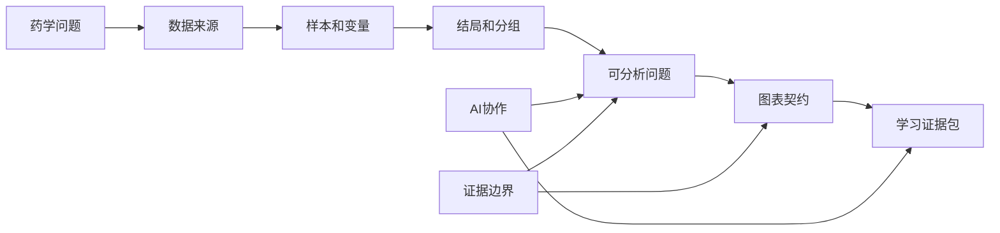

# 第1章 医药数据分析导论

## 本章定位

第 1 章是全书入口。它不急着讲代码，也不急着讲统计检验，而是先回答一个更基础的问题：药学问题怎样变成可检查的数据问题。

本章面向药学本科生和研究生入门阶段。学生不需要先掌握高级统计、生物信息学流程或编程经验，但要开始学会看懂数据表、矩阵、图表说明和 AI 输出边界。

本章会反复使用一个小线索：从药品销售记录出发，逐步连接临床指标、公共数据库、组学矩阵和文本资料。这个线索只用于建立共同语言，不用于得出药效、机制或临床建议。

| 本章任务 | 后续章节继续展开 |
| --- | --- |
| 识别医药数据从哪里来 | 第 5 章数据读取与数据字典 |
| 判断一行和一列代表什么 | 第 4-6 章数据结构与清洗 |
| 区分样本、变量、结局和分组 | 第 8-10 章统计与建模 |
| 把宽泛问题改写为可分析问题 | 第 7 章图表契约与图注 |
| 记录 AI 协作和人工核验 | 第 3 章和综合项目 |

## 学习目标

完成本章后，学生应能把一个宽泛的医药问题改写成可分析问题，并说明该问题需要哪些数据、变量、图表和核验证据。

| 学习目标 | 可检查学习证据 |
| --- | --- |
| 说明本课程为什么先讲问题和数据，再讲工具 | 写出 1 句课程定位 |
| 识别医药数据来源和形态 | 完成数据来源识别表 |
| 区分样本、变量、结局和分组 | 完成一份数据字典草案 |
| 把“某药是否有效”改写成可分析问题 | 完成问题拆解表 |
| 记录 AI 使用边界 | 提交一段 AI 协作记录 |

## 阅读指南

读本章时，不要把重点放在“会不会写代码”。第一遍先看懂三个词：数据来源、观察单位和结局变量。

第二遍再看案例。药品销售数据可以统计交易、金额和药品名称，但不能说明药物对患者是否有效。临床指标、组学矩阵和公共数据库也各有边界。

第三遍检查自己能不能填表。只要能说清“这行是谁、这列是什么、这个问题能回答什么、不能回答什么”，就已经进入数据分析的正确起点。

| 阅读顺序 | 先回答的问题 | 产物 |
| --- | --- | --- |
| 1.1 | 为什么不能先问“用什么软件” | 课程定位句 |
| 1.2 | 数据从哪里来，形态是什么 | 数据来源识别表 |
| 1.3 | 一行和一列分别代表什么 | 数据字典草案 |
| 1.4 | 原始药学问题怎样改写 | 分析问题拆解表 |
| 1.5 | 学习过程要留下什么 | 证据包目录 |

## 核心概念速查

| 概念 | 一句话解释 | 本章边界 | 学生要检查什么 |
| --- | --- | --- | --- |
| 数据来源 | 数据产生或取得的位置 | 不等于数据质量已经可靠 | 文件、数据库、实验或文本来源 |
| 数据形态 | 数据以表、矩阵、文本或图像等形式存在 | 本章只做识别，不讲完整处理流程 | 行列结构、文件格式和说明文档 |
| 样本 sample | 分析中的观察单位 | 不一定是患者 | 一行代表谁或什么 |
| 变量 variable | 对样本属性或状态的记录 | 不同类型处理方式不同 | 类型、单位、取值范围 |
| 结局 outcome | 分析最关心的结果变量 | 需在分析前写清 | 结局字段是否明确 |
| 分组 group | 用于比较或分层的变量 | 不等同于因果因素 | 分组来源是否可靠 |
| 元数据 metadata | 描述样本、分组、批次和时间点的信息表 | 组学矩阵离不开它 | 是否能解释矩阵列名 |
| 高维数据 | 变量数很多，常多于样本数的数据 | 本章只认识形态 | 是否有样本说明和变量说明 |
| 图表契约 | 作图前写清图要回答什么 | 图不能脱离问题 | 图回答哪一句话 |
| AI 协作记录 | 记录提示词、AI 输出、人工修改和核验 | AI 不是事实来源 | 哪些内容已人工确认 |

## 章节总览图



## 本章知识结构图


图 1-1 为 AI 生成的教学展示图，需人工核验。若图片中文字、节点或连接关系与正文不一致，以正文中的 Mermaid 图和下表为准。

| 节点 | 对应小节 | 准确含义 |
| --- | --- | --- |
| 课程定位 | 1.1 | 软件和 AI 服务药学问题 |
| 数据来源 | 1.2 | 先看来源、形态、权限和字段说明 |
| 样本变量结局分组 | 1.3 | 先确认行列含义，再谈方法 |
| 问题转化 | 1.4 | 把宽泛问题改写成可分析问题 |
| 学习产物 | 1.5 | 留下可追溯证据 |
| AI 核验 | 全章 | AI 输出必须由学生核对 |
| 证据边界 | 全章 | 不把观察写成医学因果 |
| 数据字典 | 1.3 和 1.5 | 解释字段含义、类型、单位和角色 |
| 图表契约 | 1.4 和 1.5 | 图表只回答明确问题 |

### 知识结构图生成提示词

```text
Create a clean, flat, scientific-educational knowledge graph for a Chinese textbook chapter titled “医药数据分析导论”.

Use a light background and clear textbook infographic style. Put “医药数据分析导论” at the center. Connect five surrounding nodes: “课程定位”, “数据来源”, “样本变量结局分组”, “问题转化”, “学习产物”. Add smaller support nodes: “AI核验”, “证据边界”, “数据字典”, “图表契约”.

Do not include patient photos, diagnosis scenes, sample sizes, statistical results, treatment claims, causal claims, or medical recommendations. The image is for teaching display only. Text labels must stay simple and readable.
```

## 核心内容

### 1.1 医药数据处理与可视化的课程定位

本课程不是单纯的 Python 或 R 语法课。它要训练学生把药学问题、数据结构、统计方法、图表表达和 AI 核验放在同一条工作线上。

“医药数据处理”指把原始记录整理成可分析表。这里的处理包括读取、清洗、类型转换、变量标注和汇总。“可视化”指用图表表达数据结构和分析结果，不等于把图做得好看。

“AI 核验”指学生使用 AI 后，还要检查列名、变量含义、代码输出、统计前提和医学解释。AI 可以帮忙解释报错或整理检查清单，但不能替学生判断药学含义。

| 学习对象 | 本课程关注什么 | 暂不追求什么 |
| --- | --- | --- |
| 药品销售记录 | 字段含义、清洗规则、销售描述 | 药物疗效判断 |
| 临床指标表 | 结局、分组、时间点、权限 | 未核验设计下的因果结论 |
| 公共数据库 | 来源、下载记录、许可、字段说明 | 直接复制数据库标签当解释 |
| 组学矩阵 | 行列含义、metadata、批次 | 单靠图形得出机制结论 |
| 文本资料 | 对象、方法、结局和限制 | 把 AI 摘要当原文证据 |

#### 嵌入案例：先别问用什么软件

假设学生手里有一份 `drugSale.csv`。字段包括购药时间、社保卡号、商品编码、商品名称、销售数量、应收金额和实收金额。

这个文件可以支持的问题是：“某药店一段时间内哪些药品销售数量较多？”或“每月实收金额如何变化？”它不能回答“某药是否有效”，因为文件没有患者诊断、用药方案、临床结局和随访信息。

如果学生继续拿到临床指标表，问题才可能改写为“在某份临床指标表中，比较用药组和对照组在指定时间点某项指标的变化”。这仍然不是疗效结论，还要核对设计、分组来源和混杂因素。

| 提问方式 | 问题在哪里 | 改写方向 |
| --- | --- | --- |
| 用 Python 怎么分析这个药？ | 没有数据对象和结局 | 先说明数据表和字段 |
| 这个药有效吗？ | 缺少对象、结局、比较和设计 | 改成指定数据内的描述或比较 |
| 画一个销售趋势图 | 不知道图回答什么 | 改成按月汇总实收金额并说明边界 |
| AI 帮我下结论 | 越过人工判断 | 让 AI 检查问题拆解是否完整 |

#### 学生操作清单

| 动作 | 要问的话 | 合格证据 |
| --- | --- | --- |
| 找对象 | 我分析的是什么记录 | 写出观察单位 |
| 找来源 | 数据从哪里来 | 有文件名、数据库名或材料名 |
| 找结局 | 最关心的结果是什么 | 能指出字段或写 `需补证据` |
| 找边界 | 这个数据不能回答什么 | 写出至少 1 条限制 |
| 找 AI 用途 | AI 可以帮哪一步 | 有人工核验方式 |

#### 本节边界

本节只建立课程定位，不讲完整代码和统计推断。涉及药效、安全性、机制或临床建议时，必须等到数据来源、设计和方法说明清楚后再判断。

### 1.2 医药数据的主要来源与常见形态

医药数据来源很多。来源不同，样本单位、变量类型、缺失原因、权限要求和解释边界也不同。学生要先识别数据形态，再决定分析路线。

“数据形态”指数据在文件或对象中的组织方式。常见形态包括表格、矩阵、序列、文本和图像。本章只要求学生能识别形态，不要求掌握完整算法。

| 来源 | 常见形态 | 入门可问的问题 | 边界 |
| --- | --- | --- | --- |
| 药品销售 | 表格 | 哪些药品销售数量较多 | 不能说明药效 |
| 临床指标 | 表格或长表 | 指标在不同分组中的分布 | 不能跳过设计谈因果 |
| 实验记录 | 表格或图片 | 不同条件下读数如何变化 | 需说明批次和重复 |
| 公共数据库 | 表、序列、矩阵、注释文件 | 字段能否支持课程项目 | 需记录来源和许可 |
| 组学数据 | 矩阵和 metadata | 样本或基因表达模式 | 不直接支持机制结论 |
| 文本资料 | 论文、报告、说明书 | 提取对象、方法和限制 | AI 摘要需回查原文 |

#### 嵌入案例：同一药学问题需要多种数据

如果问题是“某类降压药在药店销售情况如何”，药品销售表就能提供入门材料。字段中的商品名称、销售数量和实收金额可以形成分组汇总表。

如果问题改成“某类降压药是否改善患者指标”，销售表就不够。学生至少要有患者或就诊层面的临床指标、用药分组、时间点和结局字段，还要说明数据是否来自观察记录或实验设计。

如果问题再扩展到“某靶点相关基因是否参与疾病过程”，可能需要公共数据库和组学矩阵。此时本章只要求识别矩阵、metadata 和证据边界，不要求解释分子机制。

| 问题层级 | 可能数据 | 本章能做什么 |
| --- | --- | --- |
| 销售描述 | 药品销售记录 | 识别字段，设计汇总问题 |
| 指标比较 | 临床指标表 | 标注结局、分组和时间点 |
| 数据来源核对 | 公共数据库 | 记录数据库、下载时间、许可和字段 |
| 高维模式识别 | 基因表达矩阵 | 判断行列含义和 metadata |
| 文献整理 | 论文或说明书 | 提取对象、方法、结局和限制 |

#### 公共数据库入门卡

素材中列出的常用生物信息学数据库包括 NCBI、Ensembl、GenBank、DDBJ、PDB、SCOP 和 CATH 等。课程后续还会遇到 GEO、ArrayExpress、TCGA 和 SRA 等公共数据来源。

“公共数据库”不等于“可以直接下结论”。学生要记录数据库名、数据类型、下载时间、许可、字段说明和引用方式。字段名称如果不能解释，就写 `需人工确认`。

| 数据库或资源 | 常见对象 | 初学者先看什么 |
| --- | --- | --- |
| NCBI | 序列、文献、基因等 | 数据对象和 accession |
| Ensembl | 基因组注释 | 物种、版本和基因 ID |
| GenBank / DDBJ | 核酸序列 | 序列编号和来源说明 |
| PDB | 蛋白质结构 | 结构编号、链和配体 |
| GEO / ArrayExpress | 表达谱数据 | 样本说明和平台信息 |
| SRA | 测序原始数据 | FASTQ、样本和实验设计 |

#### 组学矩阵入门卡

“矩阵（matrix）”是行列结构的数据对象。在基因表达谱中，矩阵常用基因和样本组织表达量。素材中的表达谱例子把矩阵写成 `G x N`，其中 `G` 代表基因数量，`N` 代表样本数量。

矩阵离不开元数据。metadata 记录样本分组、批次、时间点、处理条件和来源。只看表达矩阵，学生往往不知道列名代表哪个样本，也不知道分组从哪里来。

| 文件 | 可能内容 | 学生先检查 |
| --- | --- | --- |
| 表达矩阵 | 基因 x 样本的数值 | 行列方向和单位 |
| metadata | 样本说明 | 分组、批次、时间点 |
| 注释表 | 基因 ID 与名称 | ID 类型和版本 |
| 结果表 | 差异、排序或模型输出 | 是否有方法和阈值说明 |

#### 本节边界

本节不展开 FASTQ、差异表达、单细胞对象或深度学习算法。组学和 AI 模型只作为数据形态示例。后续章节会讲矩阵、标准化、PCA、聚类、RNA-seq 和单细胞可视化。

### 1.3 样本、变量、结局与分组

“样本”是分析中被观察的对象。“变量”是对样本的记录。“结局”是分析最关心的结果。“分组”是用于比较或分层的字段。

这些词不能只背定义。学生要把它们写进数据字典。数据字典记录变量名、中文含义、类型、单位、角色和需确认事项。

| 概念 | 在销售表中的例子 | 在临床指标表中的例子 | 在组学矩阵中的例子 |
| --- | --- | --- | --- |
| 样本 | 一次购药交易 | 患者、就诊或一次检测 | 样本、细胞或基因 |
| 变量 | 商品名称、实收金额 | ALT、年龄、用药组 | 基因表达值、样本分组 |
| 结局 | 销售数量或实收金额 | 指定临床指标变化 | 某基因表达或模式 |
| 分组 | 药品类别、月份 | 用药组、对照组 | 疾病组、处理组、批次 |

#### 嵌入案例：一行到底代表什么

`drugSale.csv` 的一行不是一个患者，而是一次交易记录。素材中的前几行包含购药时间、社保卡号、商品编码、商品名称、销售数量、应收金额和实收金额。

例如，一行记录可以写成：`2018-01-01，1616528，236701，强力 VC 银翘片，6，82.8，69`。这说明某次交易的商品和金额，不说明患者诊断，也不说明用药后结局。

清理后的示例行中也出现了 `开博通`、`心痛定`、`苯磺酸氨氯地平片(络活喜)` 等商品名称。它们可以用于销售统计，但不能被直接写成药物疗效证据。

| 字段 | 类型 | 可能角色 | 需确认事项 |
| --- | --- | --- | --- |
| 购药时间 | 日期 | 时间变量 | 日期格式是否统一 |
| 社保卡号 | ID | 标识变量 | 是否脱敏，是否可重复 |
| 商品编码 | ID 或类别 | 标识变量 | 编码规则来源 |
| 商品名称 | 文本 | 描述变量 | 是否有通用名和商品名混用 |
| 销售数量 | 数值 | 结局或描述变量 | 是否存在退货或负数 |
| 应收金额 | 数值 | 金额变量 | 单位和折扣规则 |
| 实收金额 | 数值 | 结局或描述变量 | 是否含优惠和退货 |

#### 嵌入案例：组学矩阵的行列不能猜

在基因表达谱案例中，一个矩阵可能把每一行设为基因，把每一列设为样本。这样一列就代表某个样本中多个基因的表达水平。

也有数据会转置矩阵，把行作为样本，把列作为基因。学生不能只凭文件宽窄判断。必须查看说明文档、metadata 和代码读取方式。

| 判断点 | 销售表 | 表达矩阵 |
| --- | --- | --- |
| 一行含义 | 一次交易 | 可能是基因或样本 |
| 一列含义 | 一个字段 | 可能是样本或基因 |
| ID 风险 | 社保卡号不能当连续数值 | 基因 ID 需确认版本 |
| 分组来源 | 药品类别或月份 | metadata 中的样本分组 |

#### 变量角色怎么标

同一个字段在不同问题中可以承担不同角色。实收金额在销售趋势分析中是结局变量，在数据质量检查中也可能只是待核验字段。

结局和分组要在分析前写清。不能先画图，再为图寻找结论。这样的倒推会让图表看似完整，实际缺少问题依据。

| 变量名 | 含义 | 类型 | 角色 | 需确认事项 |
| --- | --- | --- | --- | --- |
| sale_date | 购药日期 | 日期 | 时间变量 | 日期格式是否统一 |
| drug_name | 药品名称 | 文本 | 描述变量 | 通用名与商品名是否统一 |
| drug_class | 药品类别 | 类别 | 分组变量 | 分类来源 |
| quantity | 销售数量 | 数值 | 结局或描述变量 | 是否有退货 |
| paid_amount | 实收金额 | 数值 | 结局或描述变量 | 单位和折扣 |
| buyer_id | 购买者编号 | ID | 标识变量 | 是否脱敏 |

#### 学生操作清单

| 动作 | 合格写法 | 常见错误 |
| --- | --- | --- |
| 判定样本 | 一行代表一次交易 | 默认一行就是患者 |
| 判定变量 | 每列有含义和类型 | 只复制列名 |
| 标注结局 | 写明最关心的结果字段 | 做完图后再找结局 |
| 标注分组 | 写明分组来源 | 把任意分类都当处理组 |
| 标注 ID | ID 只用于识别或连接 | 把 ID 当连续变量 |
| 标注边界 | 写清不能回答什么 | 把销售表写成临床疗效证据 |

#### 本节边界

本节只训练“看懂数据结构”。统计检验、模型选择和图表细节放到后续章节。对于临床指标和组学矩阵，必须区分观察结果、方法来源、允许解释、替代解释和仍需验证内容。

### 1.4 从医学问题到数据分析问题

医学或药学问题常常很大。数据分析需要把它改写成能在当前数据中检查的问题。一个可分析问题至少包含对象、来源、结局、比较方式、产物和边界。

“描述、比较、关联、预测、机制探索”是不同任务。描述回答“是什么样”，比较回答“分组是否不同”，关联回答“两个变量是否共同变化”，预测回答“能否区分或估计”，机制探索需要更强证据。

| 任务类型 | 问法 | 本章写法 |
| --- | --- | --- |
| 描述 | 某类药品销售情况如何 | 按月份或药品名称汇总销售数量 |
| 比较 | 两组指标是否不同 | 比较指定分组中某指标分布 |
| 关联 | 两个变量是否相关 | 检查共同变化，不写因果 |
| 预测 | 能否区分类别 | 写清训练、测试和评价指标 |
| 机制探索 | 某基因是否参与机制 | 本章只标 `需补证据` |

#### 嵌入案例：把“某药是否有效”降级

“某药是否有效”不能直接分析。它没有说明对象、结局、比较对象、时间点和数据来源。

第一轮可以改成：“在某份临床指标表中，比较用药组和对照组在指定时间点的某项指标变化。”这句话已经包含数据、分组和结局。

第二轮还要加边界：“如果数据来自观察记录，该比较只能作为描述或探索；是否能解释为疗效，取决于研究设计、混杂控制和统计方法。”缺少这些信息时写 `需补证据`。

| 原始问题 | 可分析问题 | 产物 | 不能越界写成 |
| --- | --- | --- | --- |
| 某药是否有效 | 比较指定数据内两组指标变化 | 汇总表和分布图 | 证明疗效 |
| 哪个药卖得好 | 按商品名称统计销售数量 | 排名表 | 药物更优 |
| 某基因是否重要 | 比较目标基因在分组中的表达 | 箱线图或热图说明 | 机制结论 |
| 文献怎么说 | 提取研究对象、方法和限制 | 文献摘录表 | AI 摘要即证据 |

#### 运行案例：从销售记录到描述性问题

素材中的药品销售案例先清理 `drugSale.csv`，再做统计分析。清理后记录数为 6536。统计步骤包括交易次数、月份数、月均售药次数、月均销售金额、客单价、每日金额、每月金额和药品销售数量排名。

本章不要求学生掌握完整代码。学生需要读懂输入、处理和输出三件事：输入是交易记录，处理是清理和分组汇总，输出是销售描述。

```python
# 本章只读懂逻辑，不要求背代码
total_num = len(transLs)
month_num = len(set([each[0].month for each in transLs]))
money_list = [each[6] for each in transLs]
total_money = sum(money_list)

print("一共售药 {} 次".format(total_num))
print("一共交易有 {} 月".format(month_num))
print("月均销售金额 {:.2f}元".format(total_money / month_num))
print("客单价为：{:.2f}元".format(total_money / total_num))
```

素材中的运行示例显示：

| 输出项 | 示例结果 | 可写解释 |
| --- | --- | --- |
| 清理后记录数 | 6536 | 清理规则改变了可分析记录数 |
| 交易月份数 | 7 月 | 可按月份做描述汇总 |
| 月均售药次数 | 933 次 | 销售记录层面的平均值 |
| 月均销售金额 | 43433.57 元 | 金额汇总，不代表疗效 |
| 客单价 | 46.52 元 | 每次交易平均实收金额 |

销售数量排名前 3 的药品在素材中为苯磺酸氨氯地平片(安内真)、开博通、酒石酸美托洛尔片(倍他乐克)。这只能说明该案例数据中的销售数量排序，不能说明疗效、用药合理性或临床获益。

#### 五步改写法


| 步骤 | 要写清 | 销售案例写法 |
| --- | --- | --- |
| 对象 | 分析谁或什么 | 某药店购药交易记录 |
| 数据 | 来自哪里 | `drugSale.csv` 案例数据 |
| 变量 | 结局和分组是什么 | 实收金额、月份、商品名称 |
| 产物 | 要生成什么 | 分组汇总表和趋势图说明 |
| 边界 | 不能回答什么 | 不判断药效和临床结局 |

#### AI 协作边界

AI 可以帮助学生检查问题是否包含对象、数据、变量和边界。AI 不能替学生确认字段真实含义，也不能替教师作专业判断。

| 可让 AI 做 | 学生必须做 |
| --- | --- |
| 检查问题拆解是否缺项 | 回到数据表核对字段 |
| 提醒可能的变量角色 | 判断角色是否符合任务 |
| 改写图表说明 | 删除超出数据的结论 |
| 生成核验清单 | 逐项填入人工结果 |

### 1.5 学习产物与课程项目要求

本课程不只看学生是否“听懂”。每一章都要留下可检查产物。可检查产物能说明学生知道数据从哪里来、怎样处理、结果能支持什么。

“可追溯”指别人能从结果回到数据来源、处理步骤和图表说明。只有最终截图，不能算完整证据。

| 产物 | 作用 | 最低要求 |
| --- | --- | --- |
| 数据来源表 | 说明数据从哪里来 | 来源、时间、权限、字段说明 |
| 数据字典 | 解释每列含义 | 变量名、类型、单位、角色 |
| 清洗记录 | 说明做过哪些处理 | 缺失、异常、重复和类型转换 |
| 图表契约 | 说明图回答什么 | 数据、编码、统计和边界 |
| AI 协作记录 | 说明 AI 做了什么 | 提示词、输出、人工修改和核验 |
| 需补证据表 | 暂存不确定内容 | 缺口和后续处理 |

#### 嵌入案例：一份小证据包怎样形成

以药品销售记录为例，学生先写原始问题：“我想描述某药店药品销售情况。”这句话还不够，需要改成可分析问题。

可分析问题可以写成：“基于 `drugSale.csv` 清理后的交易记录，按月份和商品名称汇总销售数量和实收金额，并说明该结果只描述销售记录。”

接着写数据字典。`购药时间` 是日期变量，`商品名称` 是文本变量，`销售数量` 和 `实收金额` 是数值变量，`社保卡号` 是 ID。社保卡号不能作为连续数值分析。

再写清洗记录。素材案例中的清洗步骤包括删除缺失记录、删除小于 0 的异常数值、去重、把日期和金额转换成合适类型、按日期排序。每一步都要说明记录数是否变化。

| 证据包文件 | 内容 | 核验问题 |
| --- | --- | --- |
| `question.md` | 原始问题和可分析问题 | 是否有对象、变量和边界 |
| `data_dictionary.md` | 字段解释 | 是否只靠列名猜含义 |
| `cleaning_log.md` | 清洗步骤和记录数变化 | 是否保留删除理由 |
| `figure_contract.md` | 图表问题和编码 | 图是否只回答一个问题 |
| `ai_log.md` | AI 提示词和人工核验 | 是否把 AI 输出当事实 |
| `evidence_gap.md` | 需补证据 | 是否标明后续确认方式 |

#### 知识结构图读图任务

学生阅读本章知识结构图后，要指出图中节点、关系和边界。图片如果出现文字错误，以正文表格为准。

| 读图问题 | 合格回答 |
| --- | --- |
| 中心节点是什么 | 医药数据分析导论 |
| 五个核心节点是什么 | 课程定位、数据来源、样本变量结局分组、问题转化、学习产物 |
| AI 节点连接到哪里 | 问题转化和学习产物 |
| 证据边界限制什么 | 限制医学因果、机制和临床建议 |
| 还缺什么 | 需人工核验图片中文字和节点 |

#### 课程项目最低要求

综合项目不按模型复杂度排序。教师更关心问题是否清楚、数据是否可追踪、图表是否能支撑解释、AI 使用是否透明。

| 项目要素 | 合格表现 | 不合格表现 |
| --- | --- | --- |
| 问题定义 | 写清对象、变量和产物 | 只写“分析这个数据” |
| 数据来源 | 有文件、数据库或材料说明 | 不说明数据来源 |
| 清洗记录 | 有规则和记录数变化 | 只交清洗后表 |
| 图表说明 | 有变量、单位、编码和边界 | 图注只重复标题 |
| AI 协作 | 有提示词和核验 | 只贴 AI 最终答案 |
| 结果解释 | 区分观察和推断 | 把模式写成因果 |

#### 本节边界

本节只说明学习产物的基本结构。完整的文件组织、命名规范、AI 任务说明书和复现流程将在第 2 章和第 3 章展开。

## 案例任务

### 任务：从药品销售记录拆解一个分析问题

本任务使用本章嵌入的药品销售记录案例。学生不需要获得完整原始文件，也不需要重写完整代码。重点是写清问题、字段、产物和边界。

| 项目 | 内容 |
| --- | --- |
| 数据背景 | 某药店半年药品销售记录案例 |
| 已知字段 | 购药时间、社保卡号、商品编码、商品名称、销售数量、应收金额、实收金额 |
| 任务目标 | 把“哪些药卖得好”改写成可分析问题 |
| 交付物 | 一页问题拆解表、一份数据字典草案、一段 AI 协作记录 |
| 禁止事项 | 不写药效、机制、临床建议或患者结论 |

#### 示例填写

| 栏目 | 示例 |
| --- | --- |
| 原始问题 | 哪些药卖得好 |
| 可分析问题 | 基于清理后的交易记录，按商品名称汇总销售数量，列出销售数量较高的药品 |
| 样本单位 | 一次购药交易 |
| 结局变量 | 销售数量 |
| 分组变量 | 商品名称 |
| 预期产物 | 排名表和文字说明 |
| 不能回答 | 不能说明疗效、适应证、用药合理性或临床获益 |

#### AI 协作记录样例

| 项目 | 内容 |
| --- | --- |
| 给 AI 的任务 | 检查我的问题拆解表是否缺少对象、变量、产物和边界 |
| AI 可输出 | 缺失项提醒和语言修改建议 |
| 学生核验 | 对照字段表确认每个变量是否存在 |
| 人工修改 | 删除“疗效更好”等越界表达 |
| 仍需确认 | 药品分类来源、商品名和通用名对应关系 |

## 图表建议

| 图表 | 目的 | 必备标注 | 不可越界解释 |
| --- | --- | --- | --- |
| 数据来源表 | 说明材料来自哪里 | 来源、时间、权限、字段 | 不替代字段解释 |
| 数据字典表 | 说明列名含义 | 类型、单位、角色、缺失含义 | 不靠列名猜医学含义 |
| 分组汇总表 | 展示组别和结局 | 分组变量、结局变量、记录数 | 不直接说明因果 |
| 趋势图 | 展示时间变化 | 时间单位、数值单位、缺失处理 | 不写成疗效变化 |
| 矩阵结构图 | 展示行列含义 | 行、列、metadata | 不写成机制证据 |
| 流程图 | 展示问题转化步骤 | 输入、处理、输出、边界 | 不替代具体记录 |

## AI 协作点

| 场景 | 可让 AI 做什么 | 学生必须核验什么 |
| --- | --- | --- |
| 概念学习 | 解释样本、变量、结局、分组 | 是否符合本章定义 |
| 数据识别 | 检查数据来源表是否缺项 | 数据来源是否真实存在 |
| 变量标注 | 提醒哪些字段可能是 ID、日期或数值 | 字段含义和单位 |
| 问题改写 | 检查问题是否可分析 | 是否越过数据边界 |
| 图表说明 | 润色图注语言 | 是否新增未支持结论 |
| 证据包整理 | 生成核验清单 | 是否完成实际核验 |

## 常见误区

| 误区 | 为什么错 | 如何纠正 |
| --- | --- | --- |
| 先问用什么软件 | 工具不能决定问题 | 先写对象、变量和产物 |
| 默认每行都是患者 | 样本单位未核对 | 查看数据来源和字段说明 |
| 把 ID 当连续变量 | ID 只是标识 | 在数据字典中标记 ID |
| 把销售数量写成疗效 | 销售记录没有临床结局 | 改写为销售描述 |
| 把公共数据库标签当结论 | 数据库字段也需解释 | 记录来源、版本和字段说明 |
| 只看矩阵不看 metadata | 分组和批次来源不明 | 同时查看样本说明 |
| 让 AI 直接下结论 | AI 不能替代专业判断 | 要求 AI 给核验清单 |
| 先画图再找结论 | 图表缺少问题契约 | 作图前写图表契约 |

## 核验清单

| 核验项 | 自查 |
| --- | --- |
| 章名和 1.1-1.5 与 `大纲.md` 一致 |  |
| 正文未放材料护照，材料追踪另存 |  |
| 每个核心术语首次出现时已解释 |  |
| 每节有案例和检查表或流程图 |  |
| 已确认样本单位 |  |
| 已标注变量类型和角色 |  |
| 已定义结局和分组 |  |
| 已写清数据不能回答什么 |  |
| 未把销售、相关、预测或图形模式写成因果 |  |
| AI 协作点包含人工核验 |  |
| 知识结构图附人工核验说明 |  |

## 需补证据

| 位置 | 缺口 | 处理方式 |
| --- | --- | --- |
| 临床指标案例 | 目前只有结构化描述，没有指定真实教学数据集 | 后续章节补充或课堂提供 |
| 公共数据库案例 | 本章只列数据库类型，没有下载记录 | 第 13 章补充检索和下载记录 |
| 组学矩阵案例 | 本章使用表达谱矩阵结构示例，没有提供可运行数据文件 | 第 11-12 章补充矩阵文件 |
| 知识结构图 | AI 图片中文字需人工核验 | 正文以 Mermaid 和节点表为准 |
| 药品通用名与商品名 | 销售案例中存在商品名和通用名混用风险 | 数据字典中标 `需人工确认` |
