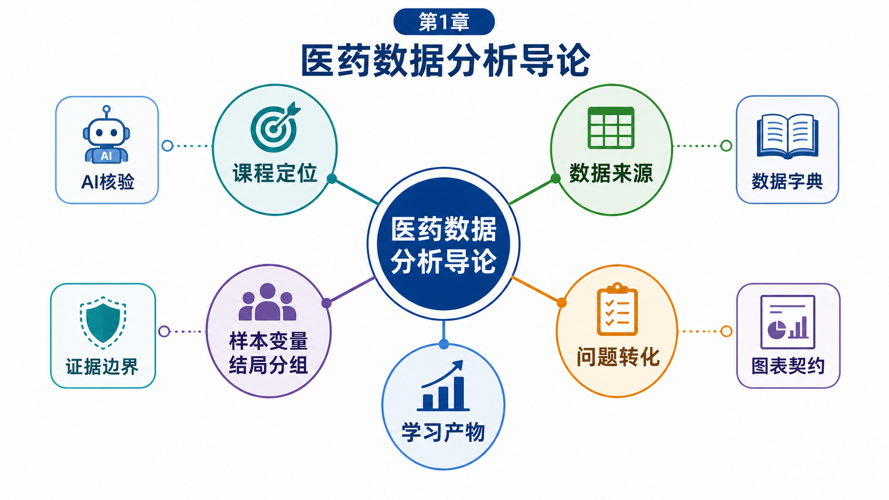
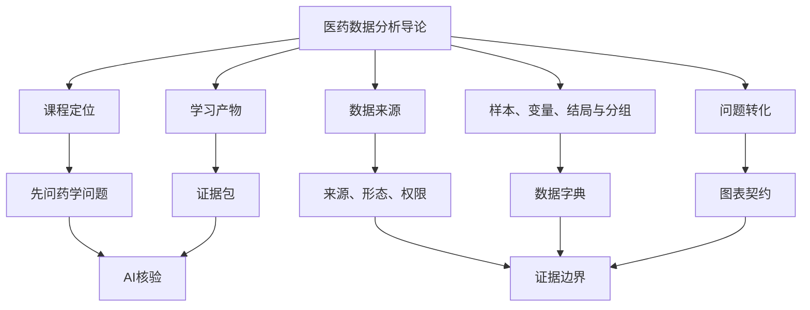
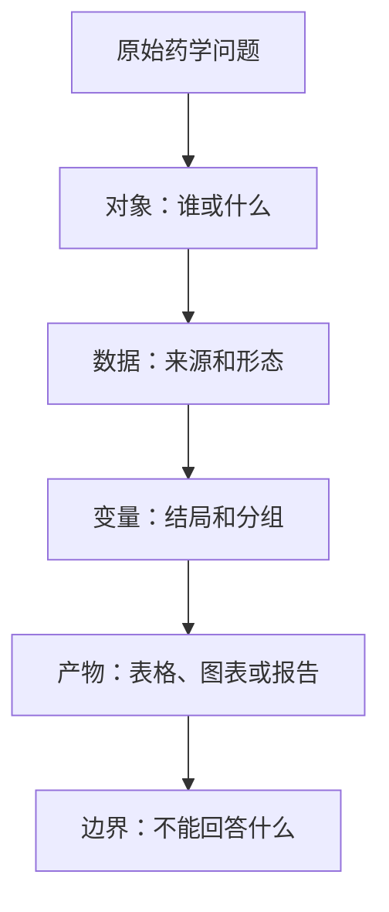

# 第1章 医药数据分析导论

## 本章定位

第 1 章是全书入口。它不讲具体代码，也不展开统计推导，而是帮助学生建立进入课程所需的共同语言。

这套共同语言包括三件事。第一，药学问题怎样写成数据问题。第二，数据分析怎样为药学判断提供证据。第三，AI 可以帮助检查和整理，但不能替代学生判断字段含义、方法选择和结论边界。

本章面向药学本科生和研究生入门阶段。学生可以暂时不会编程，但需要学会看懂一份医药数据：它来自哪里，一行代表什么，一列记录什么，哪些结论可以写，哪些内容必须标为 `需补证据`。

| 本章先建立 | 后续章节继续展开 |
|---|---|
| 课程定位和学习证据 | 第 2-3 章工具链与 AI 协作规范 |
| 数据来源和数据形态 | 第 5-6 章读取、清洗和探索 |
| 样本、变量、结局、分组 | 第 8-10 章统计推断和建模 |
| 问题转化和证据边界 | 第 7 章图表契约和后续项目 |
| 高维数据入门认识 | 第 11-15 章组学和单细胞分析 |

## 学习目标

完成本章后，学生应能把一个宽泛的医药问题改写成可分析问题，并说明该问题需要哪些数据、变量、图表和核验证据。

| 学习目标 | 可检查学习证据 |
|---|---|
| 说明本课程不是单纯软件课 | 写出课程定位说明 |
| 识别医药数据来源和形态 | 完成数据来源识别表 |
| 区分样本、变量、结局和分组 | 完成数据字典草案 |
| 把药学问题改写成分析问题 | 完成问题拆解表 |
| 判断结果解释边界 | 完成证据边界卡 |
| 记录 AI 协作过程 | 提交 AI 协作记录 |

## 阅读指南

本章建议按“问题 -> 数据 -> 证据”的顺序阅读。不要先记软件名，也不要先背统计方法。先学会问：这个问题要观察谁，记录什么，比较什么，最后能交付什么。

1.1 讲课程定位，帮助学生理解工具和专业问题的关系。1.2 讲数据来源，帮助学生判断数据能回答什么。1.3 讲数据表结构，帮助学生看懂行和列。1.4 讲问题转化，帮助学生把宽泛问题写成可分析问题。1.5 讲学习产物，帮助学生知道每次作业要留下哪些证据。

| 阅读位置 | 读前问题 | 读后产物 |
|---|---|---|
| 1.1 | 为什么不能先问“用什么软件” | 课程定位句 |
| 1.2 | 数据从哪里来，形态是什么 | 数据来源识别表 |
| 1.3 | 一行和一列分别代表什么 | 数据字典草案 |
| 1.4 | 原始药学问题怎样改写 | 分析问题拆解表 |
| 1.5 | 学习过程要留下什么 | 证据包目录 |

## 核心概念速查

| 概念 | 一句话解释 | 本章边界 | 学生要检查什么 |
|---|---|---|---|
| 医药数据 | 与药物、患者、实验、文献或生物系统有关的记录 | 数据不是结论 | 来源、字段、权限 |
| 样本 sample | 分析中被观察的对象 | 不一定是患者 | 一行代表谁或什么 |
| 观察单位 | 数据表中一条记录对应的对象 | 需按数据说明确认 | 是否有重复记录 |
| 变量 variable | 对样本属性或状态的记录 | 不同类型处理方式不同 | 类型、单位、角色 |
| ID | 用来识别记录或样本的编号 | 不按大小解释 | 是否用于连接或去重 |
| 结局 outcome | 分析最关心的结果变量 | 需在分析前写清 | 结果字段是否明确 |
| 分组 group | 用于比较或分层的变量 | 不等同于因果因素 | 分组来源是否可靠 |
| 协变量 covariate | 可能影响解释的背景变量 | 入门阶段先识别 | 是否需要记录 |
| 元数据 metadata | 解释样本、字段或文件来源的附加信息 | 组学和公共数据常依赖它 | 是否能解释矩阵 |
| 高维数据 | 变量数很多，常多于样本数的数据 | 本章只认识形态 | 是否有样本说明 |
| 数据字典 | 解释字段含义、类型、单位、角色和来源的表 | 是清洗和作图依据 | 别人能否读懂字段 |
| 图表契约 | 写清图表问题、数据来源和视觉编码的记录 | 图表不能脱离问题 | 图回答哪句话 |
| AI 协作记录 | 记录提示词、输出、采纳和人工核验 | 不能替代专业判断 | AI 哪些建议被保留 |

## 本章知识结构图

下面的图由 `imagegen` 生成，用于展示本章知识结构。图中文字和节点关系已人工核验，但准确结构仍以正文节点表和 Mermaid 图为准。



图中主节点是“医药数据分析导论”。它向外连接五个学习模块：课程定位、数据来源、样本变量结局分组、问题转化、学习产物。辅助节点包括 AI 核验、证据边界、数据字典和图表契约。

| 图中节点 | 正文对应位置 | 读图提醒 |
|---|---|---|
| 课程定位 | 1.1 | 先问药学问题，再选工具 |
| 数据来源 | 1.2 | 先看来源、形态和权限 |
| 样本变量结局分组 | 1.3 | 先确认行列含义 |
| 问题转化 | 1.4 | 把宽泛问题改写成可分析问题 |
| 学习产物 | 1.5 | 留下可检查证据 |
| AI 核验 | 全章 | AI 只协助检查 |
| 证据边界 | 全章 | 不把观察写成医学因果 |
| 数据字典 | 1.3 和 1.5 | 解释每个字段 |
| 图表契约 | 1.4 和 1.5 | 图要回答明确问题 |

### 知识结构图生成提示词

以下提示词可复用于后续章节。生成后必须人工核验标签和结构。

```text
Use case: scientific-educational
Asset type: Chinese textbook knowledge-structure illustration.
Primary request: Create a clean, flat educational infographic / knowledge graph for Chapter 1, titled “医药数据分析导论”.
Style: crisp vector-like raster illustration, white or very light background, calm academic colors, clear node-link layout, no photos, no clinical scene, no real patient, no diagnosis imagery.
Structure: central node text “医药数据分析导论”. Five surrounding nodes connected to center: “课程定位”, “数据来源”, “样本变量结局分组”, “问题转化”, “学习产物”. Smaller support nodes around them: “AI核验”, “证据边界”, “数据字典”, “图表契约”.
Constraints: Do not add sample sizes, statistics, medical causal claims, patient photos, hospital diagnosis scenes, drug efficacy claims, brand names, watermarks, or extra unsupported conclusions.
```



## 核心内容

### 1.1 医药数据处理与可视化的课程定位

本节要解决的问题是：这门课训练的到底是什么。答案不是“学会某个软件”，而是学会围绕药学问题组织数据、方法、图表和解释。

软件可以帮助学生读取文件、清洗字段、生成表格和图形。学生需要承担的判断更靠前：问题是否清楚，数据是否合适，字段是否能解释，图表是否能支撑文字。

本课程的“数据能力”包含三层。第一层是读懂数据，知道数据从哪里来、字段代表什么。第二层是整理数据，能记录清洗、转换和汇总过程。第三层是解释数据，能说清结果支持什么、不支持什么。

#### 贯穿案例：先别问用什么软件

一名学生说：“我想分析某类降糖药是不是更好，应该用 Python 还是 R？”这个问题看似进入了数据分析，实际还停在工具选择层面。

第一轮追问应是：你手头有什么数据？如果只有药品销售记录，就只能讨论购买数量、金额和时间变化。销售记录不能直接说明药物疗效或安全性。

如果有临床指标表，也要继续追问：观察单位是患者还是就诊记录？结局变量是哪一项指标？用药组如何形成？是否有时间点和基线记录？没有这些说明，分析结果只能写成探索性观察。

| 原始想法 | 应先改问 | 原因 |
|---|---|---|
| 某药是否更好 | 当前数据能回答什么 | 避免把专业判断交给软件 |
| 用 Python 还是 R | 数据字段支持什么任务 | 工具服从问题 |
| 做一张漂亮图 | 图表要支持哪句话 | 图不是装饰 |
| 让 AI 帮我分析 | 我先给 AI 哪些字段和边界 | AI 只能检查和辅助 |

#### 学生操作清单

| 操作 | 检查问题 | 合格表现 |
|---|---|---|
| 写原始问题 | 我想知道什么 | 一句话表达清楚 |
| 找数据来源 | 数据从哪里来 | 有文件名、材料名或数据库名 |
| 找结局 | 最关心的结果是什么 | 能指出字段或写 `需补证据` |
| 定产物 | 本节要交什么 | 数据字典、图表方案或短说明 |
| 写边界 | 不能回答什么 | 不写无证据结论 |

#### 本节边界

本节不比较 Python、R 或其他软件，也不评价某个 AI 工具强弱。工具链会在第 2 章和第 3 章展开。本节只要求学生形成一个顺序：先把药学问题说清楚，再选择合适的数据、方法和图表。

### 1.2 医药数据的主要来源与常见形态

本节要解决的问题是：医药数据从哪里来，常见形态是什么。不同来源的数据，能回答的问题不同，解释边界也不同。

“数据形态”指数据呈现方式。它可以是行列表格、宽表、长表、矩阵、对象文件，也可以是文本资料。“数据层级”指观察对象所在层面，例如药物、患者、样品、细胞、基因或文献。

入门阶段先认识来源和形态，比急着套用方法更重要。学生只有知道数据从哪里来，才能判断它能回答什么，哪些地方需要补证据。

#### 贯穿案例：同一问题可能需要多种数据

继续上一节的例子。学生想讨论“某类降糖药使用情况”。如果手头是药品销售记录，问题可以落到销量、金额和月份变化。

如果加入临床指标表，问题可能变成“不同用药组某项指标变化如何”。这时要记录结局、时间点、分组来源和权限，不能只看图形差异。

如果加入公共数据库，学生可以查药物靶点、基因注释或背景知识。公共数据能提供背景，但不能自动给出本课程数据中的结论。

如果加入文献资料，学生可以提取研究对象、用药方案、结局和局限。AI 可以帮助整理文本，但学生要回到原文核对。

| 数据来源 | 能支持的入门问题 | 不能直接支持的判断 |
|---|---|---|
| 药品销售记录 | 某类药品销量和金额变化 | 药物疗效 |
| 临床指标表 | 分组间某指标变化 | 未控制条件下的因果判断 |
| 实验记录 | 不同处理条件下读数差异 | 直接推广到人群 |
| 公共数据库 | 字段、注释、靶点背景 | 本课程数据的统计结论 |
| 组学矩阵 | 分组表达模式 | 单靠模式证明机制 |
| 文本资料 | 提取对象、方法和结局 | 复制 AI 摘要当证据 |

#### 常见数据形态

| 形态 | 简明解释 | 学生先检查什么 |
|---|---|---|
| 行列表格 | 一行一条记录，一列一个字段 | 一行代表什么 |
| 宽表 | 一个对象占一行，多个指标占多列 | 每列是否同一单位 |
| 长表 | 同一对象可出现多行 | 时间点和重复记录 |
| 矩阵 | 行列都是结构化对象或特征 | 行列含义和元数据 |
| 文本 | 摘要、说明书、指南或记录 | 来源和提取规则 |

#### 学生操作清单

| 操作 | 检查问题 | 合格表现 |
|---|---|---|
| 写来源 | 数据来自哪里 | 文件、数据库或材料名清楚 |
| 写时间 | 何时下载或导出 | 有日期或写 `需补证据` |
| 写权限 | 能否用于课程 | 有公开或课程授权说明 |
| 写形态 | 表格、矩阵还是文本 | 能说明行列含义 |
| 写层级 | 药物、患者、样品还是分子 | 不混用层级 |

#### 本节边界

本节不讲公共数据库检索语法，不讲组学预处理参数，也不讲单细胞分析流程。这些内容会在后续章节展开。本节只要求学生在拿到数据前先问：这份数据属于哪一类，它能回答哪一类问题。

### 1.3 样本、变量、结局与分组

本节要解决的问题是：进入数据表后，怎样判断行和列的含义。这个判断做错，后续统计、图表和解释都会偏离问题。

“样本”是被观察的对象。“变量”是对样本的记录。“结局”是分析最关心的结果。“分组”是用来比较或分层的字段。它们不是抽象名词，而是数据字典中的核心栏目。

初学者容易把“表格一行”直接当成“一个患者”。在药学数据中，一行也可能是一笔交易、一次检测、一个样品、一个细胞或一个基因特征。

#### 贯穿案例：一行到底代表什么

在药品销售记录中，一行可能是一笔交易。它不是一个患者，也不是一次疗效观察。若把它当成患者，就会把销售分析误写成临床分析。

在临床指标表中，一行可能是一名患者，也可能是某患者某次就诊或某次检测。如果同一患者多次出现，就要记录重复测量。

在组学矩阵中，一行可能是基因，也可能是样本，具体要看文件说明。矩阵不能脱离元数据解释。

| 数据场景 | 一行可能代表什么 | 先查什么 |
|---|---|---|
| 药品销售表 | 一笔交易或一条销售记录 | 是否有购买者 ID 和时间 |
| 临床指标表 | 患者、就诊或检测 | 是否有患者 ID 和时间点 |
| 实验记录 | 样品在某条件下的读数 | 批次、重复和处理条件 |
| 组学矩阵 | 样本、细胞或特征 | 行列说明和元数据 |
| 文献提取表 | 论文或研究条目 | 字段来自原文还是 AI 提取 |

#### 变量角色怎么标

同一个字段在不同问题中可能承担不同角色。销售额在销售分析中可以是结局，在数据质量检查中也可能只是待核验字段。

结局和分组要在分析前写清。不能先画出一张图，再为图寻找结论。这样的倒推会让图表看似完整，实际缺少问题依据。

| 字段 | 可能角色 | 检查重点 |
|---|---|---|
| 患者 ID | 标识变量 | 是否重复出现 |
| 销售日期 | 时间变量 | 日期格式是否一致 |
| 药品类别 | 分组变量 | 分类来源是否清楚 |
| 销售金额 | 结局或描述变量 | 单位和退货记录 |
| 检验指标 | 结局或协变量 | 单位、时间点、来源 |
| 批次 | 技术变量 | 是否影响解释 |

#### 数据字典示范

| 变量名 | 含义 | 类型 | 角色 | 需确认事项 |
|---|---|---|---|---|
| sale_date | 购药日期 | 日期 | 时间变量 | 日期格式是否统一 |
| drug_name | 药品名称 | 文本 | 描述变量 | 是否有通用名 |
| drug_class | 药品类别 | 类别 | 分组变量 | 分类来源 |
| amount | 销售金额 | 数值 | 结局或描述变量 | 单位和退货记录 |
| patient_id | 购买者编号 | ID | 标识变量 | 是否脱敏 |

#### 学生操作清单

| 操作 | 检查问题 | 合格表现 |
|---|---|---|
| 判定样本 | 一行代表什么 | 不默认患者 |
| 判定变量 | 每列记录什么 | 有含义和单位 |
| 标注角色 | 结局、分组、ID 或批次 | 角色与问题一致 |
| 查重复 | 同一对象是否多次出现 | 能说明重复含义 |
| 写字典 | 字段能否被别人读懂 | 至少含含义、类型、角色 |

#### 本节边界

本节不处理复杂重复测量模型，也不讲批次校正方法。这里只要求学生发现这些字段，并在数据字典中标出来。如何在统计模型中处理这些字段，会在后续章节继续学习。

### 1.4 从医学问题到数据分析问题

本节要解决的问题是：怎样把宽泛的医学或药学问题改写成可分析的问题。改写不是降低问题价值，而是让问题能被数据回答。

一个可分析问题至少要包含对象、数据来源、结局、比较方式、预期产物和不能回答的内容。缺少这些要素时，学生很容易从图表或 AI 输出中倒推结论。

#### 贯穿案例：把“某药是否有效”降级

“某药是否有效”听起来像药学问题，但它还不能直接分析。它没有说明对象、结局、比较对象和数据来源。

第一轮改写可以是：“在某份临床指标表中，比较用药组和对照组在指定时间点的某项指标变化。”这句话把对象、数据、分组和结局放进了问题。

这个改写仍不等于证明药物有效。若数据来自观察记录，还要说明分组方式、样本来源、时间点和潜在混杂因素。

如果数据只有药品销售记录，问题还要继续降级：“按月份描述某类药品销售数量和金额变化。”这个问题能做，但边界是不能写疗效判断。

| 原始问题 | 数据条件 | 可分析改写 | 边界 |
|---|---|---|---|
| 某药是否有效 | 临床指标表 | 比较两组指定结局变化 | 需看设计和混杂因素 |
| 某药是否有效 | 销售记录 | 描述销售变化 | 不能说明疗效 |
| 某基因是否重要 | 组学矩阵 | 比较目标基因在分组中的表达 | 不证明机制 |
| 文献怎么说 | 文本资料 | 提取对象、方法、结局和局限 | 需核对原文 |

#### 五步改写法



| 步骤 | 学生要写的话 | 示例 |
|---|---|---|
| 对象 | 分析的是谁或什么 | 某类药品销售记录 |
| 数据 | 使用哪份数据 | 课程提供的销售表 |
| 变量 | 结局和分组是什么 | 销售金额、月份、药品类别 |
| 产物 | 要生成什么 | 分组汇总表和趋势图说明 |
| 边界 | 不能写什么 | 不写疗效或安全性结论 |

#### 证据边界卡

从生物医学证据角度看，结果解释至少分五层：观察、方法、允许解释、替代解释和需验证内容。

| 证据层 | 学生要写的话 | 示例 |
|---|---|---|
| 观察 | 数据中看到了什么 | 某类药品月销售额变化 |
| 方法 | 观察来自什么处理或图表 | 按月份分组汇总 |
| 允许解释 | 当前数据能支持什么 | 描述销售记录中的变化 |
| 替代解释 | 还有哪些可能影响读法 | 促销、库存、节假日 |
| 需验证 | 后续要补什么证据 | 真实处方背景或临床数据 |

#### AI 协作边界

AI 可以帮助学生检查问题是否包含对象、数据、变量和边界。AI 不能替学生确认字段真实含义，也不能替教师作专业判断。

| AI 可做 | 学生必须做 |
|---|---|
| 提醒缺少样本单位 | 回到字段说明核对 |
| 建议任务类型 | 判断是否符合数据 |
| 改写长句 | 删除新增结论 |
| 列出潜在边界 | 只保留真实缺口 |

### 1.5 学习产物与课程项目要求

本节要解决的问题是：学习过程要留下什么。课程评价不只看学生是否听懂，还看证据是否可检查、可追溯、能复核。

“可追溯”指别人能从结果回到数据来源、处理步骤和图表说明。只有最终截图，不能算完整证据。

#### 贯穿案例：一份小证据包怎样形成

以前面的销售记录为例，学生先写原始问题：“某类药品销售是否有变化。”这句话保留了最初想法，便于后面比较修订过程。

接着写数据来源识别表，说明文件名、字段、时间范围和权限。没有信息的地方写 `需补证据`。

然后写数据字典，标出日期、药品类别、销售数量和金额。ID、批次或时间字段不能随意当普通数值解释。

最后写图表说明和 AI 协作记录。图表说明回答“图说明什么”，AI 记录回答“AI 给了什么建议，哪些被人工保留”。

| 产物 | 回答的问题 | 最低要求 |
|---|---|---|
| 数据来源表 | 数据从哪里来 | 来源、时间、权限 |
| 数据字典 | 字段是什么意思 | 含义、类型、单位、角色 |
| 清洗记录 | 改过哪些数据 | 缺失、重复、异常说明 |
| 图表源数据 | 图由什么数据生成 | 汇总表或字段清单 |
| 图表说明 | 图支持哪句话 | 问题、编码、边界 |
| AI 协作记录 | AI 怎样参与 | 提示词、输出、采纳、核验 |

#### 项目证据包目录示范

| 文件或记录 | 用途 | 检查方式 |
|---|---|---|
| `data_source.md` | 记录来源和权限 | 能否找到原始材料 |
| `data_dictionary.md` | 解释字段 | 同伴是否能读懂 |
| `cleaning_log.md` | 记录处理步骤 | 是否保留样本变化 |
| `figure_notes.md` | 说明图表 | 图是否回答问题 |
| `ai_log.md` | 记录 AI 协作 | 是否有人工作核验 |

#### 学生操作清单

| 操作 | 检查问题 | 合格表现 |
|---|---|---|
| 保存来源 | 原始材料在哪里 | 有路径或材料名 |
| 保存解释 | 字段如何理解 | 数据字典完整 |
| 保存过程 | 做了哪些处理 | 能复查 |
| 保存图表 | 图表支持哪句话 | 有图注和边界 |
| 保存 AI 记录 | AI 做了什么 | 有提示词和人工核验 |

#### 本节边界

第 1 章不要求生成正式代码、统计检验或完整项目报告。它要求学生知道每个后续任务应留下哪些证据。最终课程项目也不以模型复杂度为中心，更关键的是问题是否清楚、数据是否可追溯、图表是否支持论点、AI 使用是否透明。

## 案例任务

本章案例任务是把一个药学问题改写成数据分析问题。学生不需要运行代码，只要完成问题、数据和证据之间的对应。

| 任务步骤 | 学生活动 | 产物 |
|---|---|---|
| 1 | 写出原始问题 | 原始问题句 |
| 2 | 判断数据来源和形态 | 数据来源识别表 |
| 3 | 标注样本、变量、结局和分组 | 数据字典草案 |
| 4 | 改写为可分析问题 | 分析问题拆解表 |
| 5 | 检查知识结构图 | 节点和边界说明 |
| 6 | 用 AI 检查遗漏 | AI 协作记录 |
| 7 | 人工核验并修订 | 最终提交页 |

可选问题包括：某类药品月度销售变化、某临床指标在不同分组中的差异、某实验读数在不同处理条件下的比较、某公共数据库字段能否支持课程项目。

## 图表建议

本章不要求学生正式绘图，但要求学生能说明图表用途。每张图都要回答一个问题，并能追溯到原始字段。

| 图表或表格 | 使用场景 | 技术术语解释 | 读图边界 |
|---|---|---|---|
| 数据来源表 | 说明材料来自哪里 | source table，记录来源和权限 | 不能替代字段解释 |
| 数据字典 | 解释字段角色 | data dictionary，解释列名和含义 | 不能替代清洗记录 |
| 分组汇总表 | 展示组别和结局 | summary table，按组汇总 | 不直接说明因果 |
| 流程图 | 展示问题转化步骤 | flowchart，展示顺序 | 不替代具体记录 |
| 知识结构图 | 展示章节概念关系 | knowledge graph，显示节点关系 | 需人工核验标签 |

## AI 协作点

AI 在本章中承担辅助角色。它可以帮助学生发现表达不清、字段遗漏和边界过宽的问题，但学生要保留核验过程。

| 环节 | 可向 AI 提问 | 人工核验方式 |
|---|---|---|
| 问题定义 | 这个问题能否拆成描述、比较或关联问题 | 对照课程目标和字段 |
| 数据识别 | 这张数据来源表是否缺列 | 对照原始材料 |
| 变量标注 | 哪些字段可能是 ID、批次或时间 | 查看字段说明 |
| 图表方案 | 建议哪种图表，并说明理由 | 检查图表是否回答问题 |
| 知识结构图 | 节点关系是否完整 | 对照正文节点表 |
| 边界检查 | 哪些句子可能过度外推 | 删除或改写无证据判断 |

AI 协作记录至少包含四项：提示词、AI 输出要点、人工采纳内容、未采纳理由或仍需核验的问题。

## 常见误区

| 误区 | 问题所在 | 修正方式 |
|---|---|---|
| 一上来问用什么软件 | 工具先于问题 | 先写分析问题句 |
| 默认每行都是患者 | 样本单位未核对 | 查看数据来源和字段说明 |
| 把 ID 当连续变量 | 字段角色误判 | 在数据字典中标记 ID |
| 只保留最终图 | 过程不可追溯 | 同时保留来源、清洗和图表说明 |
| 把相关写成因果 | 证据边界过宽 | 改写为关联或趋势表达 |
| 把 AI 图当知识来源 | 图片标签可能出错 | 用正文表格核验 |
| 直接复制 AI 输出 | 缺少人工核验 | 记录核验和修改过程 |

## 核验清单

学生提交本章任务前，可用以下清单自查。

| 核验项 | 是/否 | 备注 |
|---|---|---|
| 章名和 1.1-1.5 与 `大纲.md` 一致 |  |  |
| 已写明使用材料 |  |  |
| 已解释首次出现的技术术语 |  |  |
| 每节都有解释、案例、操作和边界 |  |  |
| 已确认样本单位 |  |  |
| 已标注变量类型和角色 |  |  |
| 已定义结局和分组 |  |  |
| 已区分描述、比较、关联、预测或机制探索 |  |  |
| 已写出观察、方法、解释、替代解释和需验证内容 |  |  |
| 图表方案能回答分析问题 |  |  |
| 知识结构图已人工核验 |  |  |
| 未把相关、预测或图形模式写成因果 |  |  |
| 已记录 AI 提问、采纳和人工核验 |  |  |
| 已列出需补证据 |  |  |

## 需补证据

以下内容不在本章正文中自行补造。后续若进入正式数据操作或项目示例，需要补充材料。

| 缺口 | 当前处理 |
|---|---|
| 具体教学数据集的字段说明、样本量和下载记录 | 后续章节或课堂材料补充 |
| 公共数据库的具体版本、下载日期和许可条款 | 项目任务中要求学生记录 |
| 临床指标案例的伦理、脱敏和权限说明 | 本章不生成医学结论 |
| 组学和单细胞数据的预处理参数 | 后续章节再讲 |
| AI 工具的具体版本和输出差异 | 仅要求保留协作记录 |
| imagegen 图中文字和节点稳定性 | 已人工核验，并用正文结构表兜底 |

