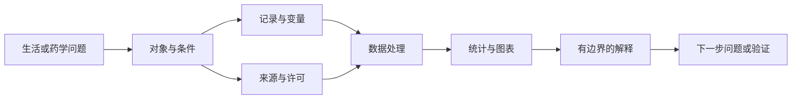

# 第1章 医药数据分析导论

你知道自己是在一天中的什么时刻出生的吗？把一个班同学的答案收集起来，出生时刻会均匀地分布在一天之中，还是有些时段多、有些时段少？这个问题离每个人都很近，也能让我们经历一次完整的数据探索：先收集答案，看看图上出现什么，再决定还需要问什么。

这些问题不需要先学统计公式，却已经决定了分析是否有意义。医药数据同样如此。两条数值能不能比较，取决于它们测量了什么、怎样得到、对应哪些对象。软件可以迅速计算，专业知识则帮助我们判断哪些计算值得做。

本章从熟悉的记录开始，逐步把“想知道什么”写成可以开展的分析任务。读完后，应能说明数据中的对象、变量与条件，区分计划和结果，并为一个药学问题列出需要核对的信息。本章不要求运行模型。

## 1.1 医药数据处理与可视化的课程定位

### 出生时刻：画完第一张图，为什么还要再发问卷

要了解一天中哪个时段出生的人多，可以收集出生时刻，按小时统计人数。如果还想比较工作日与周末，就把出生的星期也记下来。先看一份65人的调查记录：按星期一到星期日排列，每天分成24个小时，一周便有7×24＝168个时段。把每条记录放进对应时段，数出各时段的人数，以时间为横轴、人数为纵轴，就能观察出生时刻的分布。

65条记录分散在168个时段里，许多时段没有记录，相邻时段相差一两人，曲线就会明显起伏。为了看清一段时间内的变化，可以把每个小时与前后各三个小时合在一起，计算这七个小时的平均人数，再向前移动一个小时，重复计算。这种方法叫滑动平均。平滑后，每个点表示附近七个小时的平均人数，曲线上的短促起伏有所减弱，较宽的高峰和低谷就更容易辨认。

接下来值得比较的是不同分娩方式。自然分娩和剖宫产的时间分布是否相同？要回答这个问题，每条出生记录还需要对应的分娩方式。最初的问卷缺少这一项，后续调查便追加了这个问题，并扩大了调查范围。

扩展后的问卷获得434份记录，其中268人填写自然分娩，143人填写剖宫产，23人未回答此项。百分比均以434为分母：

| 分娩方式填写情况 | 人数 | 占全部记录的比例 |
| --- | --- | --- |
| 自然分娩 | 268 | 61.8% |
| 剖宫产 | 143 | 32.9% |
| 未回答此项 | 23 | 5.3% |

把填写了分娩方式的记录分成两组，分别按星期和小时统计、平滑，就能比较它们的时间分布。在这份调查中，自然分娩组在清晨附近较高，剖宫产组的高点出现在稍后的早晨时段。读图时可以沿着横轴比较高点的位置，以及高点附近的上升和回落。两组人数不同，若要比较各时段出生人数在本组所占的比例，还需要分别除以各组总人数。这样看过两组以后，再回头看合并曲线，就会想到：当两组在问卷中所占比例改变时，整体形态也会随之变化。

还有23份记录没有回答分娩方式，分组时可以暂列为“未知”。如果其中的出生时间填写完整，仍可用于描述全部回答者的时间分布。这样，按分娩方式比较与描述全部出生时刻，用到的记录范围就有所不同。第五章会继续讨论怎样保存和处理这些缺失信息。

如果想进一步了解这些时间差别从何而来，就要继续收集分娩条件，并考虑调查对象怎样选择。这里的回答来自同学问卷；研究更大范围的人群时，还需要相应地区的出生记录。一次分析常常就是这样推进的：起初只问出生时刻，看到分布后增加分娩方式，分组比较后又产生新的问题。

比较两种制剂的释放曲线时，也需要考虑数据怎样分组。两种处方是否用了同一介质、同一温度和相同测量时点？若实验条件不同，就要分别整理这些条件下的记录，再讨论处方间的差别。出生问卷中追加了“分娩方式”，制剂表中则需要保留“测量条件”，它们都为后续比较提供了依据。

### 数据、统计和可视化分别做什么

数据处理把原始记录整理成含义清楚、可以计算的形式。例如保留样品编号，把同一单位写法统一，并记录哪些数值仍需回查。它不是把所有“不整齐”的记录删除，而是让每一项改变都有理由。

统计帮助我们描述差异与变动，并在设计和条件允许时判断数据能支持多大范围的推断。数据中看到的不同，未必意味着总体差异，更未必说明一个因素造成另一个结果。后续章节会逐步讲这些判断；本章先保留这几种说法之间的区别。

可视化用位置、长度、颜色等方式呈现数据关系。它帮助我们看清变化、发现错误，也让别人检查分析。图中的坐标、单位和分组必须能回到原记录。没有说明对象和分母的图，通常还不能用于可靠比较。

专业判断贯穿这些工作。例如，化合物活性记录中相同的数字，可能对应不同测定指标、靶点或实验条件；即使单位一致，也不一定能够直接排序。专业知识不是等代码运行完才补上的解释，而是选择数据和制定比较规则的依据。

### 本课程希望你能够参与什么工作

学完本课程，你应能把一个专业想法推进到可检查的成果：找到适合的数据，说明对象和字段，完成必要整理，选择分析与图表，并解释结果及其限制。这可以是整理公开化合物记录，也可以是检查制剂实验表，或在后续章节阅读组学分析结果。

halicin的发现工作提供了一个具体例子。面对大量待研究分子，研究者要决定先把实验资源用在哪些候选物上。他们先利用已有分子的结构信息和抑制大肠杆菌生长的实验结果训练深度学习模型，再把模型用于其他化合物库，让它为候选分子给出预测评分。评分在这里帮助安排后续筛选，而不是替代实验：研究者选出候选物后，仍要实际检验它们能否抑制细菌。halicin便是在这一过程中得到进一步研究的分子，原研究随后报告了抗菌实验和小鼠感染模型中的结果。[Stokes等原研究](https://pubmed.ncbi.nlm.nih.gov/32084340/)

沿着这个过程，可以看见几种具体工作：整理分子与实验结果的对应表，查清“抑制生长”怎样定义，比较预测与实测是否一致，再决定哪些候选值得追加实验。它们需要计算，也需要药学判断。模型推荐了一个分子、实验观察到抗菌作用、患者用药获得收益，是不同层次的结论；这项研究并没有凭模型评分直接完成最后一步。本课程先训练前面这些可以由数据整理、分析和核验支持的工作。

这些工作不要求一开始就掌握所有数学和编程，但需要愿意核对数量、单位和条件。AI可以解释概念、帮助读懂代码；随着学习推进，也可以协助生成局部代码和流程。分析对象是什么、处理规则是否合理、结论有没有越过证据，仍要由你判断。

全书先学习环境、协作与数据结构，再进入整理、图表、统计和模型，最后处理高维数据与组学问题。每个单元选择适合的案例，不要求把同一份复杂数据从第一章用到最后。

## 1.2 医药数据的主要来源与常见形态

### 先问记录从哪里来

数据可能来自实验测量、业务系统、调查问卷、公开数据库或已发表论文。来源不同，形成记录的方式也不同。问卷中的空白可能是没有回答；实验表中的空白可能是未测量或仪器未给出结果；数据库里找不到某条记录，也不能立即解释为该现象不存在。

接到文件时，先找来源说明：谁收集、为了解决什么问题、覆盖哪些对象、保留了哪些记录，以及允许怎样使用。文件名中的“最终版”或“公开”都不足以代替这些信息。能够下载论文，也不意味着能自由取得或转发其全部底层数据。

文件格式是另一件事。CSV和Excel可以保存表格，图像文件保存像素，文本文件可以保存说明、序列或日志。格式告诉我们怎样读取，却不会自动告诉我们数值的科学含义。第五章再实际处理这些文件。

### 一张小表里有几种对象

下表是独立编写的教学数据，不是真实课堂调查。参与者面对同一罐糖豆作答；轮次记录回答发生在第几轮。没有提供糖豆真实总数，也没有设定两轮之间是否交流。

| record_id | participant_id | round | estimate_grains |
| --- | --- | --- | --- |
| r01 | p01 | 1 | 800 |
| r02 | p02 | 1 | 950 |
| r03 | p03 | 1 | 未记录 |
| r04 | p01 | 2 | 980 |
| r05 | p02 | 2 | 1050 |

一行是一次回答记录，`participant_id`说明由谁作答，`round`说明轮次，`estimate_grains`是以粒为单位的估计量。参与者编号和记录编号不能互相替代：同一个人可以有不同记录。配套CSV中“未记录”保存为空白，表格中的中文只是便于阅读。[数据与字典](../chapter-4/assets/case-THU-DA-L02-C01-A03/README.md)

再看一个药学字段示意，它没有提供实际测量结果：

| 字段 | 所说明的内容 |
| --- | --- |
| preparation_id | 一次独立制备的编号 |
| unit_id | 接受测量的制剂单元编号 |
| formula | 处方标签 |
| time_min | 测量时间，分钟 |
| release_percent | 在规定方法下测得的释放百分数 |
| condition_id | 指向介质、温度和方法说明 |

若同一单元在多个时点测量，一行就对应“某个单元在某个时点的测量”，不再只是“一个制剂”。应先依据实验记录确认这种结构，不能仅凭字段名猜测。

### 数据表、元数据与矩阵

用于解释数据的资料称为元数据（metadata）。它可以是另一张表，也可以是配套说明。糖豆表中的参与者编号和轮次帮助解释估计值；制剂表中的条件编号则需要关联到具体实验条件。缺少这些说明，数值仍然能被软件读入，却未必能用于比较。

矩阵是按行列组织的数值结构。例如，将同一对象在若干测量项目上的结果排成表格，可以得到“对象×指标”的矩阵。行和列的含义必须说明，转置后也会互换。第四章会学习怎样存放这些数值，并按行列位置找到其中一项。

在后面的RNA-seq案例中，计数矩阵的一行对应一个基因、一列对应一个样本；样本来源和处理条件另由元数据说明。单细胞数据还会区分细胞、供体等层次。本章只认识这种形态：特征数量、记录数量和独立来源数量是不同的量，不能彼此替代。

图像、序列和自由文本也常见于医药工作。把它们变成可分析特征，往往需要专门步骤。因此，遇到新文件时，不必急着套入熟悉的表格流程，先明确里面保存的对象，再决定怎样读取和检查。

## 1.3 样本、变量、结局与分组

### 记录数为什么不一定是样本数

“样本”在不同语境中可能指抽取的一组研究对象，也可能指一份实验材料。为避免混淆，报告数量时应直接说清楚：几名参与者、几次回答、几个制备批次、几次测量，而不是只写“n是多少”。

观察单位是当前一项观察所对应的对象或对象状态。糖豆表保存的是一次回答，回答又属于某位参与者。同一个人多答一次，增加了一条记录，但没有增加一位参与者。若研究问题是同一人如何修改估计，还必须保留两轮之间的对应关系。

实验单位则是实验设计中能够独立接受处理的最小单位。药学实验中的独立制备、同一制备内多个单元，以及同一单元的多次测量，可能处在不同层次。判断独立重复，需要看处理怎样分配、材料怎样产生，不能只看数据框有多少行。

假设同一个制剂单元测了多个时点，增加时间点可以更细致地描述过程，却不会增加独立制备次数。反过来，只保留每种处方的一条平均曲线，也不能从曲线恢复每个重复的原始结果。知道保存了哪些信息，才知道还能回答什么。

### 变量的类型与作用

变量是记录中可能随对象或条件改变的属性。估计量、测量时间和释放百分数可以是数值变量；参与者编号、处方标签是文本或类别。编号即使写成数字，也不意味着计算它的平均值有意义。

同一个变量还会在问题中承担不同作用。结局（outcome）是当前问题主要关心的测量或事件。在释放实验里，它可以是某个规定时点的释放结果，不一定是患者健康结局。分组变量说明准备比较哪些记录，例如不同处方；时间则可能是需要保留的测量条件。

不要仅凭列名把变量的作用固定下来。研究“不同轮次的回答怎样变化”时，轮次是比较条件；检查录入错误时，轮次又是识别记录的辅助信息。先写问题，再确定字段角色。

### 分组标签还不能保证可比

如果处方A只在第一天测量，处方B只在第二天测量，那么处方和日期在这份数据中无法分开。观察到差异时，不能只归因于处方。这类影响难以区分的情形涉及混杂（confounding）。本章先辨认这种设计风险，不要求计算调整模型。

糖豆回答也有类似问题。若第一轮独立估计，第二轮先看了同伴答案，轮次变化就同时包含了信息变化。即使第二轮更接近真值，也不能只写成“多想一次就会更准确”。在本章教学表中，这些条件根本没有提供，因此连这样的比较解释也暂时不能作出。

缺失值与0也要分开。0是一个明确记录的数值；空白只表示某项信息没有保存，原因还需查证。“低于检测限”又是另一种信息，不能不加说明地改成0。数据字典应保存这些区别，而不是让软件自行决定。

## 1.4 从医学问题到数据分析问题

### 把“更好”拆成能够核对的问题

“哪种制剂更好？”可以是研究兴趣，却还不是明确的分析任务。更好可能指释放更快、批间差异更小、储存更稳定，甚至使用更方便。它们需要不同的数据，也不具有相同的评价标准。

以释放过程为例，可以先改写为：

> 在规定的介质、温度和测量方法下，整理处方A与B的释放记录，保留独立制备、制剂单元和时间点的信息。先检查记录是否齐全、单位是否一致，再描述各时点的测量结果与变动。当前任务不评价体内效果或临床疗效。

为什么要这样改写？先看“释放更快”：我们需要知道在哪些时点测量，不能拿A处方的较晚时点与B处方的较早时点直接比较。再看“表现更稳定”：只有每种处方一条平均曲线，还看不出不同制备或单元之间的变动，因而要继续寻找重复测量及其来源。最后问实验条件是否一致。若A和B使用了不同介质，即使曲线分开，也还不能把差别全部归给处方。这些检查会改变我们准备索取哪些表格、保留哪些字段，以及第一张图应呈现什么。

这仍是一个假设任务，不是已完成的实验。我们尚未拿到测量结果，也没有预设哪种处方占优，但已经能向提供数据的人说清楚需要什么资料。把这些要求整理下来，就得到下面的任务卡。

| 需要明确的内容 | 本例应查的信息 | 信息不足时怎么做 |
| --- | --- | --- |
| 对象 | 独立制备与制剂单元的对应关系 | 回查实验记录，不按行数猜 |
| 条件 | 介质、温度、方法和测量时间 | 先分别整理，不急于合并 |
| 指标 | 释放百分数的定义与计算依据 | 补字典，不只写“效果” |
| 比较 | 哪些处方、哪些时间范围 | 缩小问题或补齐资料 |
| 输出 | 数据字典、质量记录、描述图表 | 写为计划，不编造结果 |
| 边界 | 实验条件下的测量表现 | 不外推患者获益 |

若暂时没有真实数据，这份卡仍有价值：它把下一步资料收集变得明确。但不能把示意字段、假设数值和实际观察混在一张结果表里。

### 计划、观察和解释要分开写

“准备比较两种处方”是计划；“表中某时点的数值不同”是对记录的观察；“这种差异是否超出抽样波动”涉及统计推断；“差异是否具有药学意义”还需要专业条件和评价依据。它们可以相互衔接，却不能跳过中间步骤。

可视化也应服务具体问题。若关心随时间变化，可以考虑让时间有明确顺序的图；若关心重复之间的差别，就需要展示重复信息，而不能只留下一个平均数。此时不必立即决定颜色或软件，先说明图必须保留什么关系。

对于化合物记录，可以用同样方式把“找最好的药”改成“在一致的靶点、测定类型和条件下整理某项活性指标，识别值得进一步核查的记录”。这个任务有专业价值，却不会把公开数据库中的排序写成疗效证据。

### 独立练习：条件改变后，计划怎样改

选择制剂或化合物方向，写一份自己的任务卡：问题、对象、来源、字段、比较条件、首次检查、预期输出和解释范围。先独立填写，再请同伴检查是否有未定义的词。可以使用AI解释术语，但不要让它代写完整答案。

随后从下面三种变化中选两种，说明先查什么，以及在什么条件下继续：

1. 一部分记录缺少处方标签。同伴建议根据前后行的规律补齐。
2. 新资料只给平均曲线，没有各重复记录和制备信息。
3. 另一项研究使用同一化合物，但测定方法与原数据不同。

提交的重点是判断依据，而不是立即选出一个统计检验。若资料不足，明确指出缺少什么，也是一项有效的分析成果。

## 1.5 学习产物与课程项目要求

### 把每一步留下来

本章可以保存的成果很简单：问题初稿、对象与字段说明、任务卡，以及一段修改理由。后续章节再逐渐加入代码、数据字典、清洗记录和图表。它们共同说明结果从哪里来，而不是只展示最终图片。

平时作业用来检查实际操作，包括读取数据、解释代码、局部修改、重新运行和核对输出。遇到报错时，应记录真实信息与修正过程；没有报错，也不必为交作业制造一条。使用AI时，保留对分析有影响的建议和自己的核验，不需要保存所有闲聊。

本书前四章先练习亲手输入、运行和解释。第五至十章可以让AI协助局部代码，但须提供真实字段和规则；后续复杂项目可以扩大协作范围，仍不能让AI补造数据来源或替代专业判断。

### 三人项目怎样体现共同学习

综合项目围绕具体药学问题展开。三个人可以分别侧重整理、分析与图表、背景核查与解释，但每个人都应理解完整流程。主要负责某一步，不等于其他人可以不知道它怎样影响结果。

共同核对一项关键决策，比泛泛写“大家参与了讨论”更能说明协作。例如，一位成员提出排除某类记录，另一位依据字典查证，第三位检查这会改变哪些图表。把依据与结果简短记录下来，便于在汇报中说明取舍。

项目交流主要检查关键选择、图表解释和条件变化后的调整，不要求现场编写或修改代码。实际操作能力由平时作业提供证据。界面更华丽、代码更多或模型更复杂，都不能代替问题清楚和结果可信；具体评分按课程要求执行。

### 本章提交物与自查

提交一份问题任务卡和修订说明，并回答：你的数据有多少记录、涉及什么对象、哪些测量彼此关联？若没有数据，明确标记为待收集，不填写想象的样本量。

检查任务卡中是否把“计划得到”写成了“已经证明”，是否把测量指标直接写成疗效，是否能够指出至少一项必须保留的专业条件。最后写出下一步最小可行的工作，例如先补一份字段说明，而不是笼统写“进一步分析”。

### 知识结构

这张图表示分析各环节之间的依赖，不是要求每个任务都跑完全部方法。第二章先准备工作环境，第三章学习清楚地交代任务，再把这里的对象和字段落实为可以运行的代码。
