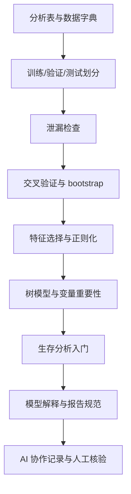
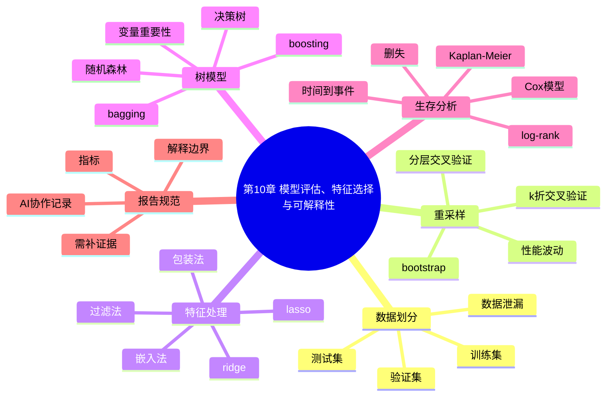

# 第10章 模型评估、特征选择与可解释性

## 本章定位

第10章把第9章的基础回归和分类模型继续向前推进。第9章关心“模型怎样建立、指标怎样计算”，本章关心“模型是否能在未见过的数据上工作、特征选择是否可信、解释是否越界”。这也是进入第11章高维矩阵和组学分析前的最后一道建模核验门槛。

本章仍处在 Prompt Coding 阶段。学生可以让 AI 辅助生成 Python 和 R 的局部代码，检查报错，整理指标表，画交叉验证曲线、变量重要性图和 Kaplan-Meier 曲线。学生必须自己核对样本单位、数据划分、特征处理、事件定义、正类定义、验证范围和医学解释。

| 前置能力 | 本章任务 | 后续承接 |
| --- | --- | --- |
| 能读取分析表并理解变量类型 | 区分训练集、验证集、测试集 | 第11章高维矩阵分析 |
| 能计算混淆矩阵、ROC 和 AUC | 用交叉验证和 bootstrap 估计不稳定性 | 第12-15章组学流程复核 |
| 能拟合基础回归和分类模型 | 做入门特征选择、正则化和树模型解释 | 综合项目模型报告 |
| 能写图表契约和 AI 协作记录 | 写出不越界的模型评估报告 | 项目汇报和代码审阅 |

本章使用教学模拟数据。字段包括 `sample_id`、`patient_id`、`group`、`ALT`、`AST`、`age`、`sex`、`dose`、`response`、`time_to_event` 和 `event`。这些字段只用于说明方法流程，不代表真实药物、疾病、疗效、诊断或预后结论。

## 学习目标

1. 学生能解释训练集、验证集、测试集和数据泄漏，并能指出常见泄漏来源。
2. 学生能说明交叉验证和 bootstrap 的用途、基本流程和局限。
3. 学生能区分过滤法、包装法、嵌入法和正则化的入门思路。
4. 学生能解释决策树、随机森林、boosting 和变量重要性的基本含义。
5. 学生能读懂时间到事件、删失、Kaplan-Meier 曲线、log-rank 检验和 Cox 模型的入门输出。
6. 学生能用 Python 和 R 完成入门模型评估代码，并核对两种语言输出的字段和解释范围。
7. 学生能写出不越界的模型报告，说明数据划分、验证方法、指标、解释图、限制和需补证据。

## 阅读指南

读本章时，先把“训练过的数据”和“没有参与训练的数据”分清楚。训练集表现再好，也不能替代测试集或外部验证。

第二个重点是流程顺序。标准化、缺失填补、特征选择、降维和参数调优都可能泄漏信息。凡是会从数据中学习规则的步骤，都应只在训练数据内部完成。

第三个重点是解释边界。系数、变量重要性和 SHAP 图解释的是模型行为，不是病因机制。生存分析中的事件和删失也必须先定义清楚，再谈曲线或模型。

## 核心概念速查

| 概念 | 本章解释 | 常见混淆 | 需保留英文 |
| --- | --- | --- | --- |
| 训练集 | 用于拟合模型参数的数据 | 用训练集指标当最终表现 | training set |
| 验证集 | 用于调参或选择模型的数据 | 和测试集混用 | validation set |
| 测试集 | 模型选择完成后用于最终评估的数据 | 反复查看后继续调参 | test set |
| 数据泄漏 | 训练过程使用了不该提前知道的信息 | 只理解为代码报错 | data leakage |
| 重采样 | 反复抽取子集评估模型或统计量 | 以为增加了真实样本 | resampling |
| 交叉验证 | 轮流留出一部分数据评估模型 | 当成外部验证 | cross-validation |
| bootstrap | 有放回抽样估计不确定性 | 当成复制真实受试者 | bootstrap |
| 特征选择 | 从候选输入变量中选出一部分 | 等同于发现机制 | feature selection |
| 正则化 | 用惩罚限制模型复杂度 | 当成任意调小系数 | regularization |
| lasso | 可把部分系数压到零的正则化方法 | 把非零系数当因果变量 | lasso |
| ridge | 缩小系数但通常不做变量剔除 | 以为能自动筛变量 | ridge |
| 决策树 | 用变量切分规则形成预测路径 | 单棵树稳定可靠 | decision tree |
| 随机森林 | 多棵树集成并在切分时随机选择变量 | 变量重要性等于病因强度 | random forest |
| OOB误差 | 用未进入某棵树训练的样本估计误差 | 当成外部测试 | out-of-bag error |
| 生存分析 | 分析从起点到事件发生时间的数据 | 只分析死亡 | survival analysis |
| 删失 | 事件时间未完整观察到 | 当作普通缺失值删除 | censoring |
| Kaplan-Meier 曲线 | 估计随时间变化的未发生事件概率 | 曲线分开就说明疗效 | Kaplan-Meier curve |
| Cox 模型 | 分析协变量与风险函数关系的模型 | hazard ratio 等于生存概率 | Cox proportional hazards model |
| 可解释性 | 帮助理解模型如何产生预测 | 等于生物机制解释 | interpretability |

## 章节总览图



## 本章证据边界

| 表述类型 | 本章可以写 | 本章不能写 |
| --- | --- | --- |
| 模型表现 | 在教学模拟数据的训练/测试划分下，模型达到某指标 | 模型可用于真实临床诊断 |
| 特征选择 | 某变量在当前模型中被选中或重要性较高 | 该变量是疾病原因或治疗靶点 |
| 交叉验证 | 内部重采样显示模型表现存在波动 | 交叉验证等同于外部验证 |
| bootstrap | 估计某统计量或指标的不确定性 | bootstrap 增加了真实样本量 |
| 生存曲线 | KM 曲线显示不同组在模拟随访数据中的事件时间分布 | 某处理延长患者生存 |
| AI 输出 | AI 辅助生成代码草稿和报告核验清单 | AI 替代变量定义、事件定义和医学解释 |

## 核心内容

## 10.1 训练集、测试集与数据泄漏

训练集（training set）用于拟合模型。验证集（validation set）用于调参或选择模型。测试集（test set）用于模型选择完成后的最终评估。三者的角色不同，不能在报告中混写。

训练集表现常常偏乐观。模型在训练集中已经见过这些样本，越灵活的模型越可能记住训练数据中的偶然模式。高维小样本数据更容易出现这种问题，因为特征很多，样本很少，模型可以在噪声里找到看似有用的规则。

| 数据集合 | 主要用途 | 不应做什么 |
| --- | --- | --- |
| 训练集 | 拟合模型、拟合预处理规则、筛选特征 | 用训练指标当最终结论 |
| 验证集 | 调参、选择模型复杂度、比较候选流程 | 在最终报告后反复重用 |
| 测试集 | 最终评估选定流程 | 参与筛特征、调参或改阈值 |
| 外部验证集 | 检查模型在新来源数据上的表现 | 与内部测试集混为一谈 |

数据泄漏（data leakage）指模型训练过程使用了不该提前知道的信息。泄漏会让模型表现看起来很好，但这种表现不能泛化到新样本。

医药数据中常见的泄漏包括：先用全部数据做标准化再切分；先用全部数据筛特征再交叉验证；同一患者的多次记录被切到训练集和测试集两边；把诊断后才产生的变量用于诊断前预测；把由结局计算出的字段放入预测变量。

### Python 示例：教学模拟数据和训练/测试切分

```python
import numpy as np
import pandas as pd
from sklearn.model_selection import train_test_split

rng = np.random.default_rng(20260607)
n = 48
df = pd.DataFrame({
    "sample_id": [f"S{i:03d}" for i in range(1, n + 1)],
    "patient_id": [f"P{i:03d}" for i in range(1, n + 1)],
    "group": rng.choice(["control", "treatment"], size=n),
    "age": rng.integers(20, 70, size=n),
    "sex": rng.choice(["female", "male"], size=n),
    "dose": rng.normal(50, 12, size=n).round(1),
    "ALT": rng.normal(42, 9, size=n).round(1),
    "AST": rng.normal(36, 8, size=n).round(1),
    "time_to_event": rng.integers(3, 36, size=n),
    "event": rng.binomial(1, 0.45, size=n)
})

linear_score = -2.0 + 0.035 * df["ALT"] + 0.018 * df["AST"] + 0.015 * df["age"]
prob = 1 / (1 + np.exp(-linear_score))
df["response"] = rng.binomial(1, prob.clip(0.05, 0.95))

features = ["ALT", "AST", "age", "dose"]
X = df[features]
y = df["response"]

X_train, X_test, y_train, y_test = train_test_split(
    X, y, test_size=0.25, random_state=20260607, stratify=y
)

print(X_train.shape, X_test.shape)
print(y_train.value_counts(normalize=True).round(2))
print(y_test.value_counts(normalize=True).round(2))
```

这段代码只用于教学模拟。真实项目中，切分前还要检查同一患者是否有多条记录，是否存在批次、中心、时间顺序或配对设计。若同一患者有多次测量，应按患者分组切分，不能按记录随机切分。

### R 示例：同一数据结构的切分思路

```r
set.seed(20260607)
n <- 48
dat <- data.frame(
  sample_id = sprintf("S%03d", 1:n),
  patient_id = sprintf("P%03d", 1:n),
  group = sample(c("control", "treatment"), n, replace = TRUE),
  age = sample(20:69, n, replace = TRUE),
  sex = sample(c("female", "male"), n, replace = TRUE),
  dose = round(rnorm(n, 50, 12), 1),
  ALT = round(rnorm(n, 42, 9), 1),
  AST = round(rnorm(n, 36, 8), 1),
  time_to_event = sample(3:35, n, replace = TRUE),
  event = rbinom(n, 1, 0.45)
)

linear_score <- -2.0 + 0.035 * dat$ALT + 0.018 * dat$AST + 0.015 * dat$age
prob <- 1 / (1 + exp(-linear_score))
dat$response <- rbinom(n, 1, pmin(pmax(prob, 0.05), 0.95))

idx_pos <- which(dat$response == 1)
idx_neg <- which(dat$response == 0)
test_idx <- c(sample(idx_pos, ceiling(length(idx_pos) * 0.25)),
              sample(idx_neg, ceiling(length(idx_neg) * 0.25)))

train_dat <- dat[-test_idx, ]
test_dat <- dat[test_idx, ]
prop.table(table(train_dat$response))
prop.table(table(test_dat$response))
```

R 代码中用手动分层抽样展示原理。正式分析可使用 `caret::createDataPartition()` 或 `rsample`，但学生仍要说明正类定义、随机种子和分层变量。

## 10.2 交叉验证与 bootstrap

重采样（resampling）指反复从已有数据中取不同子集，用来估计模型表现或统计量的不稳定性。最常见的两类方法是交叉验证和 bootstrap。

k 折交叉验证（k-fold cross-validation）把训练数据分成 k 份。每次用其中一份做验证，其余 k-1 份训练模型，重复 k 次后汇总指标。分类任务常用分层 k 折，让每一折尽量保留相近的正负类比例。

| 方法 | 主要用途 | 学生要检查 |
| --- | --- | --- |
| 留出验证 | 简单估计模型表现 | 随机切分是否稳定，训练样本是否太少 |
| k 折交叉验证 | 内部评估和调参 | 预处理是否在 fold 内完成 |
| 分层 k 折 | 类别不平衡分类 | 每折正负类比例是否接近 |
| bootstrap | 估计统计量或模型指标波动 | 抽样单位是否正确 |

交叉验证不只是把模型跑 k 次。标准化、缺失填补、特征选择和降维都必须放在每个训练 fold 内学习，再应用到对应验证 fold。若先用全部数据筛变量，再做交叉验证，验证集信息已经提前进入模型。

bootstrap 是有放回抽样。它可以估计均值、系数、AUC 或其他指标的不确定性。它不能创造新的真实受试者，也不能修复偏倚、错误标签、泄漏或样本来源不代表总体的问题。

### Python 示例：交叉验证与 bootstrap

```python
from sklearn.pipeline import Pipeline
from sklearn.preprocessing import StandardScaler
from sklearn.linear_model import LogisticRegression
from sklearn.model_selection import StratifiedKFold, cross_val_score
from sklearn.metrics import roc_auc_score

pipe = Pipeline([
    ("scale", StandardScaler()),
    ("model", LogisticRegression(max_iter=1000))
])

cv = StratifiedKFold(n_splits=5, shuffle=True, random_state=20260607)
auc_scores = cross_val_score(pipe, X_train, y_train, cv=cv, scoring="roc_auc")
print(auc_scores.round(3), auc_scores.mean().round(3))

pipe.fit(X_train, y_train)
test_prob = pipe.predict_proba(X_test)[:, 1]
test_auc = roc_auc_score(y_test, test_prob)

boot_auc = []
test_df = X_test.copy()
test_df["response"] = y_test.to_numpy()
test_df["prob"] = test_prob

for _ in range(1000):
    sample = test_df.sample(n=len(test_df), replace=True, random_state=None)
    if sample["response"].nunique() == 2:
        boot_auc.append(roc_auc_score(sample["response"], sample["prob"]))

ci_low, ci_high = np.percentile(boot_auc, [2.5, 97.5])
print(round(test_auc, 3), round(ci_low, 3), round(ci_high, 3))
```

这段代码用 `Pipeline` 把标准化放入交叉验证流程，避免先全数据标准化造成泄漏。bootstrap 部分只估计当前测试集 AUC 的波动，不能写成外部泛化能力。

### R 示例：交叉验证与 bootstrap

```r
library(glmnet)

x_train <- as.matrix(train_dat[, c("ALT", "AST", "age", "dose")])
y_train <- train_dat$response
x_test <- as.matrix(test_dat[, c("ALT", "AST", "age", "dose")])
y_test <- test_dat$response

cv_fit <- cv.glmnet(
  x = x_train,
  y = y_train,
  family = "binomial",
  alpha = 0,
  nfolds = 5,
  type.measure = "auc"
)

prob_test <- as.numeric(predict(cv_fit, newx = x_test, s = "lambda.min", type = "response"))

auc_basic <- function(y, p) {
  pos <- p[y == 1]
  neg <- p[y == 0]
  mean(outer(pos, neg, ">")) + 0.5 * mean(outer(pos, neg, "=="))
}

test_auc <- auc_basic(y_test, prob_test)
boot_auc <- replicate(1000, {
  idx <- sample(seq_along(y_test), replace = TRUE)
  if (length(unique(y_test[idx])) < 2) return(NA_real_)
  auc_basic(y_test[idx], prob_test[idx])
})

quantile(boot_auc, c(0.025, 0.975), na.rm = TRUE)
```

R 示例使用 `glmnet` 的内置交叉验证说明调参。若课程环境未安装相关包，应在课前固定环境，不在考试或作业现场临时联网安装。

## 10.3 特征选择与正则化

特征（feature）是模型输入变量。它可以是临床检验指标、药物分子描述符、基因表达量、图像特征或文本编码结果。本章用 ALT、AST、age 和 dose 做教学示例，只说明流程。

特征选择的目的包括减少噪声、降低维度、提高可解释性和改善泛化表现。特征少不一定正确，特征多也不一定全面。真正要看的是：筛选规则是否预先说明，是否只用训练集，是否通过验证流程评估。

| 方法 | 基本思路 | 优点 | 风险 |
| --- | --- | --- | --- |
| 过滤法 | 先按统计量或相关性给特征打分 | 快，易理解 | 可能忽略特征组合 |
| 包装法 | 用模型表现反复搜索特征子集 | 和目标模型贴近 | 计算量大，容易过拟合 |
| 嵌入法 | 在模型拟合过程中选择特征 | 流程较紧凑 | 解释依赖模型假设 |
| 正则化 | 用惩罚限制模型复杂度 | 可降低方差 | lambda 需在训练集内调参 |

正则化（regularization）是在模型拟合时加入惩罚，限制模型复杂度。ridge 会缩小系数，但通常不会把系数压到零。lasso 可以把部分系数压到零，因此常被用作入门特征选择方法。

高维小样本是医药数据中常见风险。基因表达谱可能有成千上万个基因，但样本数量有限。若不做严格验证，模型很容易在噪声特征中找到偶然模式。

### Python 示例：lasso 逻辑回归

```python
from sklearn.linear_model import LogisticRegressionCV
from sklearn.pipeline import Pipeline
from sklearn.preprocessing import StandardScaler

lasso_pipe = Pipeline([
    ("scale", StandardScaler()),
    ("model", LogisticRegressionCV(
        Cs=10,
        penalty="l1",
        solver="liblinear",
        cv=5,
        scoring="roc_auc",
        max_iter=1000,
        random_state=20260607
    ))
])

lasso_pipe.fit(X_train, y_train)
coef = lasso_pipe.named_steps["model"].coef_[0]
feature_table = pd.DataFrame({
    "feature": features,
    "coefficient": coef
}).sort_values("coefficient", key=lambda s: s.abs(), ascending=False)

print(feature_table)
```

若某个变量系数为零，只能说明它在当前训练数据、候选变量和模型设置下没有被 lasso 保留。不能写成该变量与生物过程无关。

### R 示例：lasso 逻辑回归

```r
library(glmnet)

x_train <- as.matrix(train_dat[, c("ALT", "AST", "age", "dose")])
y_train <- train_dat$response

lasso_cv <- cv.glmnet(
  x = x_train,
  y = y_train,
  family = "binomial",
  alpha = 1,
  nfolds = 5,
  type.measure = "auc"
)

coef(lasso_cv, s = "lambda.min")
```

R 输出中的非零系数是当前模型选择结果。报告时要同时写明训练数据、候选特征、标准化方式、交叉验证设置和 lambda 选择口径。

## 10.4 树模型与变量重要性

决策树（decision tree）用一系列切分规则形成预测路径。它的优点是直观，学生可以沿着树的节点看到模型如何分组。它的风险也明显：单棵树对数据扰动敏感，容易过拟合。

集成树模型把多棵树组合起来。bagging 用 bootstrap 生成多份训练样本，分别训练树，再平均或投票。随机森林在每次切分时只查看部分候选变量，减少树之间的相关性。boosting 顺序训练多个弱树，逐步改进前面模型的错误。

| 模型 | 基本思路 | 常见输出 | 解释边界 |
| --- | --- | --- | --- |
| 单棵决策树 | 一组切分规则 | 树结构、测试指标 | 稳定性有限 |
| bagging | 多棵 bootstrap 树投票或平均 | OOB误差、预测指标 | 解释不如单棵树直观 |
| 随机森林 | bootstrap 加随机候选变量 | 变量重要性、OOB误差 | 变量重要性不等于因果 |
| boosting | 顺序组合弱树 | 测试指标、重要性 | 参数敏感，需验证 |

变量重要性（variable importance）衡量变量对模型预测的贡献。常见口径包括分裂带来的 impurity 降低，或打乱某个变量后性能下降多少。不同口径可能给出不同排序。

变量重要性有偏倚。变量尺度、类别数、缺失处理、相关变量、随机种子和模型参数都会影响排序。多个高度相关的变量可能分摊重要性，也可能由其中一个变量“代表”其他变量。

### Python 示例：随机森林和变量重要性

```python
from sklearn.ensemble import RandomForestClassifier
from sklearn.metrics import accuracy_score, roc_auc_score

rf = RandomForestClassifier(
    n_estimators=300,
    max_depth=3,
    random_state=20260607,
    class_weight="balanced"
)

rf.fit(X_train, y_train)
rf_prob = rf.predict_proba(X_test)[:, 1]
rf_pred = (rf_prob >= 0.5).astype(int)

print("accuracy", round(accuracy_score(y_test, rf_pred), 3))
print("auc", round(roc_auc_score(y_test, rf_prob), 3))

importance = pd.DataFrame({
    "feature": features,
    "importance": rf.feature_importances_
}).sort_values("importance", ascending=False)

print(importance)
```

可写表述示例：在教学模拟数据和当前随机森林设置下，`ALT` 的变量重要性较高，说明它对模型预测贡献较大。不可写成：`ALT` 是 response 的原因或临床干预靶点。

### R 示例：随机森林和变量重要性

```r
library(randomForest)

train_dat$response_factor <- factor(train_dat$response, levels = c(0, 1))
test_dat$response_factor <- factor(test_dat$response, levels = c(0, 1))

rf_fit <- randomForest(
  response_factor ~ ALT + AST + age + dose,
  data = train_dat,
  ntree = 300,
  importance = TRUE
)

rf_prob <- predict(rf_fit, newdata = test_dat, type = "prob")[, "1"]
rf_pred <- ifelse(rf_prob >= 0.5, 1, 0)
mean(rf_pred == test_dat$response)
importance(rf_fit)
```

如果使用 `randomForest` 的 OOB 误差，也要写成内部估计。OOB 误差不能替代独立测试集或外部验证。

## 10.5 生存分析入门

生存分析（survival analysis）分析从起点到事件发生的时间。事件可以是死亡、复发、缓解、出版、设备失效或其他明确定义的终点。本教材涉及医学场景时，必须写清事件是什么。

删失（censoring）指真实事件时间没有完整观察到。例如研究结束时患者尚未发生事件，或随访中断。删失不是普通缺失值，不能简单删除。

| 字段 | 含义 | 检查问题 |
| --- | --- | --- |
| `patient_id` | 个体 ID | 是否一人多行 |
| `time_to_event` | 从起点到事件或删失的时间 | 时间单位是否明确 |
| `event` | 事件状态，1 为事件发生，0 为删失 | 编码是否反了 |
| `group` | 分组变量 | 分组是否来自研究设计 |
| 协变量 | 年龄、指标、处理等 | 是否在起点前已知 |

Kaplan-Meier 曲线估计随时间变化的未发生事件概率。图像通常呈阶梯状。每次事件发生，曲线会下降；删失通常用短线或点标记。图注应写清时间单位、事件定义、删失和风险人数。

log-rank 检验用于比较两组或多组生存曲线。它不调整多个协变量。Cox 比例风险模型用于分析协变量与风险函数的关系，常见输出包括系数、hazard ratio、置信区间和 P 值。Cox 模型需要比例风险假设，hazard ratio 不能写成个体生存概率。

### Python 示例：Kaplan-Meier 曲线

```python
# 需要 lifelines 包。若课程环境未配置，可只阅读代码结构。
from lifelines import KaplanMeierFitter
from lifelines.statistics import logrank_test

kmf = KaplanMeierFitter()

for label, part in df.groupby("group"):
    kmf.fit(
        durations=part["time_to_event"],
        event_observed=part["event"],
        label=label
    )
    ax = kmf.plot_survival_function(ci_show=True)

control = df[df["group"] == "control"]
treatment = df[df["group"] == "treatment"]
lr = logrank_test(
    control["time_to_event"], treatment["time_to_event"],
    event_observed_A=control["event"],
    event_observed_B=treatment["event"]
)
print(lr.p_value)
```

图注示例：教学模拟数据中，Kaplan-Meier 曲线展示 control 与 treatment 两组 `event` 未发生概率随 `time_to_event` 的变化。横轴为模拟随访时间，纵轴为估计未发生事件概率。该图仅用于说明生存分析读图，不支持疗效或预后结论。

### R 示例：Kaplan-Meier 曲线

```r
library(survival)

surv_obj <- Surv(time = dat$time_to_event, event = dat$event)
km_fit <- survfit(surv_obj ~ group, data = dat)
plot(km_fit, col = c("steelblue", "tomato"), lty = 1:2,
     xlab = "time_to_event", ylab = "event-free probability")
legend("bottomleft", legend = levels(factor(dat$group)),
       col = c("steelblue", "tomato"), lty = 1:2, bty = "n")

survdiff(surv_obj ~ group, data = dat)

cox_fit <- coxph(surv_obj ~ age + ALT + AST + group, data = dat)
summary(cox_fit)
```

本章不展开 Cox 模型推导。学生只需能识别时间、事件、删失、协变量、hazard ratio 和比例风险假设等报告字段。若真实数据未提供随访定义，应标 `需补证据`。

## 10.6 模型可解释性与报告规范

可解释性（interpretability）指模型输出能否被人理解和审查。简单模型、回归系数、树结构、变量重要性和局部解释图都可以帮助解释模型行为，但它们不自动提供因果证据。

全局解释概括模型整体依赖哪些变量。局部解释说明某个样本的预测可能受哪些变量影响。两者都解释模型，不解释真实生物系统本身。

| 解释材料 | 回答的问题 | 不能回答的问题 |
| --- | --- | --- |
| 回归系数 | 在模型中变量方向和大小如何 | 是否存在因果机制 |
| OR 或 HR | 模型参数转换后的关联尺度 | 个体诊断或个体生存概率 |
| 变量重要性 | 哪些变量影响模型预测更多 | 哪些变量是真正病因 |
| 单棵树路径 | 某个预测如何被切分规则生成 | 规则是否稳定适用于新中心 |
| SHAP 等局部解释图 | 某样本预测受哪些变量影响 | 生物机制是否成立 |

SHAP 可以作为可选解释工具提及。若正文或作业使用 SHAP，必须说明它解释的是当前模型的预测，不是变量的医学因果作用。若图中文字、变量名或数值解释不清，应以表格和文字说明为准，并标 `需人工确认`。

模型报告至少包含以下字段：数据来源、分析表版本、样本单位、纳入和排除规则、结局定义、正类定义或事件定义、特征列表、缺失处理、划分策略、模型与参数、验证方式、指标、区间或波动、解释材料、限制、AI 协作记录和需补证据。

### 模型报告模板

| 报告字段 | 本章建议写法 |
| --- | --- |
| 数据来源 | 教学模拟分析表，非真实医学数据 |
| 样本单位 | 每行代表一个模拟受试者 |
| 结局定义 | `response=1` 为教学正类；`event=1` 为事件发生 |
| 划分策略 | 分层训练/测试划分，随机种子已记录 |
| 特征处理 | 标准化和特征选择在训练流程内完成 |
| 模型方法 | 逻辑回归、lasso、随机森林或 KM 曲线 |
| 验证方式 | 训练集内部交叉验证，保留测试集评估 |
| 指标 | AUC、准确率、灵敏度、特异度或生存曲线字段 |
| 解释材料 | 系数表、变量重要性图或 KM 图注 |
| 边界 | 不支持诊断、疗效、机制或临床建议 |

### 结果表述阶梯

| 证据等级 | 可写表述 | 不可越界 |
| --- | --- | --- |
| 数据观察 | 教学模拟数据中，某变量分布与 response 有差异 | 写成真实医学规律 |
| 内部验证 | 交叉验证显示模型表现存在波动 | 写成外部泛化 |
| 测试集评估 | 当前测试集上 AUC 为某值 | 写成临床可用 |
| 解释图 | 某变量对模型预测贡献较高 | 写成病因或机制 |
| 生存曲线 | 两组模拟曲线形态不同 | 写成处理改善生存 |

## 案例任务

| 项目 | 内容 |
| --- | --- |
| 数据背景 | 教学模拟分析表，字段包括 `sample_id`、`patient_id`、`group`、`ALT`、`AST`、`age`、`sex`、`dose`、`response`、`time_to_event`、`event` |
| 任务目标 | 完成二分类模型的训练/测试划分、交叉验证、特征筛选、树模型变量重要性审阅，并阅读一张入门 Kaplan-Meier 曲线 |
| 操作步骤 | 核对数据字典；检查重复患者和缺失；划分训练/测试；在训练集内完成预处理和交叉验证；比较逻辑回归、lasso 和树模型；输出指标表和变量重要性图；写模型解释边界；阅读生存曲线并写图注 |
| 交付物 | 数据划分记录、泄漏检查清单、Python 与 R 代码、交叉验证结果表、bootstrap 或性能区间说明、特征选择记录、变量重要性图、模型报告、KM 图注草稿、需人工确认列表、AI 协作记录 |
| 禁止事项 | 不用测试集筛特征；不把 bootstrap 写成增加样本量；不把重要变量写成病因；不写模型可临床诊断；不让 AI 猜事件定义或阳性定义 |

## 图表建议

| 图表 | 目的 | 必备标注 | 不可越界解释 |
| --- | --- | --- | --- |
| 数据划分流程图 | 展示训练、验证、测试和最终报告关系 | 数据来源、样本单位、划分比例或规则、随机种子 | 不说明外部泛化 |
| 数据泄漏检查表 | 训练学生审阅建模流程 | 泄漏类型、风险位置、修正方式 | 不替代真实代码审查 |
| k 折交叉验证示意图 | 展示轮流训练和验证 | fold 数、训练/验证关系、汇总指标 | 不写成独立测试 |
| bootstrap 分布图 | 展示性能或参数波动 | 重抽样次数、统计量、区间口径、抽样单位 | 不写成真实总体分布 |
| 特征选择流程图 | 展示筛选必须嵌入训练流程 | 训练集、筛选规则、验证方式 | 不写成发现机制 |
| 变量重要性条形图 | 展示模型预测贡献排序 | 模型、数据集范围、重要性口径、随机种子 | 不写成因果强度 |
| Kaplan-Meier 曲线 | 展示时间到事件数据 | 时间单位、事件定义、删失、风险人数、分组 | 不写个体预后或疗效 |
| 模型报告分层表 | 区分观察、模型表现、解释和医学边界 | 证据来源、可写表述、需补证据 | 不把模型解释写成医学事实 |

## AI 协作点

| 场景 | 可让 AI 做什么 | 学生必须核验什么 |
| --- | --- | --- |
| 数据划分 | 生成 Python 与 R 的训练/测试切分代码 | 结局比例、分层变量、同一患者重复样本、时间顺序、泄漏风险 |
| 指标计算 | 整理准确率、AUC、灵敏度、特异度、MSE、MAE 等代码 | 指标适用任务、正类定义、数据集范围、阈值和置信区间 |
| 交叉验证 | 生成 k 折或分层 k 折流程 | 预处理、标准化、特征选择是否在每个 fold 内完成 |
| bootstrap | 生成重抽样和区间估计代码 | 抽样单位是否正确，是否把重复测量当独立样本 |
| 特征选择 | 生成候选筛选流程和结果表 | 是否只用训练集筛选，是否记录筛选规则，是否过度解释变量 |
| 树模型 | 生成决策树或随机森林代码和变量重要性图 | 参数、随机种子、过拟合、OOB/测试指标、解释边界 |
| 生存分析 | 生成 Kaplan-Meier 或 Cox 入门代码 | 时间单位、事件编码、删失定义、比例风险假设和医学解释 |
| 报告润色 | 改写过强表述，补充限制 | 是否新增样本量、机制、疗效、诊断或临床建议 |

## 常见误区

| 误区 | 为什么错 | 如何纠正 |
| --- | --- | --- |
| 只看训练集指标 | 训练数据已参与拟合，指标偏乐观 | 保留测试集，并记录验证方式 |
| 先全数据标准化再切分 | 测试集信息进入训练流程 | 用 pipeline 或 fold 内预处理 |
| 先全数据筛特征再交叉验证 | 验证集已参与特征选择 | 每个 fold 内重新筛特征 |
| bootstrap 当作增加样本量 | 有放回抽样仍来自原始样本 | 写成不确定性估计 |
| 变量重要性写成病因 | 它只衡量模型预测贡献 | 写清模型、数据和重要性口径 |
| KM 曲线分开就写疗效 | 曲线形态受设计、删失、混杂影响 | 写成模拟数据中的时间到事件分布 |
| AI 生成报告直接提交 | 可能新增未验证医学结论 | 按核验清单逐项审阅 |

## 核验清单

- 已核对根目录 `大纲.md` 与本章小节结构。
- 正文使用教学模拟数据，不写真实诊断、疗效、机制或临床建议。
- 训练集、验证集、测试集角色清楚，测试集未参与调参。
- 标准化、缺失填补、特征选择和降维没有在全数据上提前完成。
- 交叉验证结果写成内部评估，不写成外部验证。
- bootstrap 写成不确定性估计，不写成增加样本量。
- 特征选择和变量重要性写成模型贡献，不写成病因或靶点。
- 生存分析写清时间、事件、删失和风险人数需求。
- Python 与 R 代码的变量、正类、事件定义一致。
- AI 生成内容已记录提示词、人工修改和仍需确认事项。

## 知识结构与知识图谱生成提示词



可用于 `imagegen` 的教学展示提示词：

```text
生成一张中文教学海报风格的知识结构图，主题为“模型评估、特征选择与可解释性”。画面分为六个模块：数据划分与数据泄漏、交叉验证与 bootstrap、特征选择与正则化、树模型与变量重要性、生存分析入门、模型报告与 AI 核验。使用清晰节点和箭头，突出“训练集内完成预处理和特征选择”“测试集只做最终评估”“解释模型不等于解释疾病机制”。图片仅用于课堂展示，正文以 Mermaid 和表格为准。
```

若生成图出现文字不清、标签错误或节点缺失，课堂和正文应以本节 Mermaid 图、核心概念速查表和核验清单为准。

## 实验或作业

### 作业1：泄漏审阅

给学生一段 AI 生成的建模流程：全数据标准化、全数据筛选相关性最高的 5 个变量、再做 5 折交叉验证。要求学生指出泄漏位置，改写为正确流程，并说明为什么测试集不能参与特征选择。

提交内容：

| 项目 | 要求 |
| --- | --- |
| 泄漏清单 | 至少列出 2 个泄漏点 |
| 修正流程 | 用文字或流程图说明 fold 内处理 |
| AI 协作记录 | 保留提示词、AI 输出和人工修改 |
| 边界说明 | 不写医学结论 |

### 作业2：双语代码核验

使用教学模拟分析表，分别用 Python 和 R 完成训练/测试切分、逻辑回归或 lasso、交叉验证和测试集指标计算。要求学生核对正类定义、特征列表、随机种子、指标口径和报告字段。

提交内容：

| 项目 | 要求 |
| --- | --- |
| Python 代码 | 可从头运行，含随机种子 |
| R 代码 | 可从头运行，字段与 Python 一致 |
| 指标表 | 写明数据集范围和指标口径 |
| 差异说明 | 若两种语言结果不同，说明可能原因 |

### 作业3：模型解释报告

根据一张变量重要性图和一张 Kaplan-Meier 曲线写 300-500 字报告。报告必须区分模型贡献、时间到事件观察和医学解释边界。

禁止事项：

- 不写“模型可用于临床诊断”。
- 不写“变量重要性证明机制”。
- 不写“曲线分开说明处理有效”。
- 不让 AI 补充未提供的样本量、P 值或医学阈值。

## 需补证据

| 位置 | 缺口 | 处理方式 |
| --- | --- | --- |
| 正式课堂数据集 | 尚未指定第10章统一真实数据文件 | 正文使用教学模拟字段，并明确不代表真实医学结论 |
| 生存分析案例 | 尚未指定真实随访数据和事件定义 | 正文只做结构入门，医学解释标 `需补证据` |
| SHAP 工具细节 | 当前材料未充分支撑 SHAP 算法细节和可靠性讨论 | 只作为可选解释工具提及 |
| 外部验证 | 未提供外部队列或独立中心数据 | 所有模型表现限定为教学数据或内部验证范围 |
| R 包环境 | 未确认课程机房是否预装 `glmnet`、`randomForest`、`survival` | 正式上机前需固定环境并提供安装验收 |
| 第9章最终稿 | 第9章大纲仍处待确认状态 | 第10章避免重复第9章基础模型内容，后续可统一交叉引用 |
