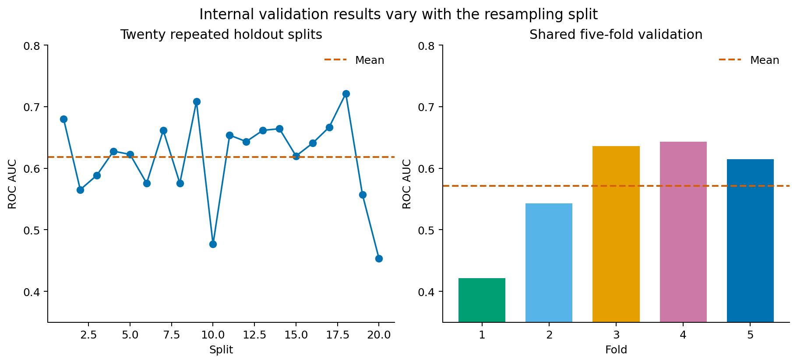
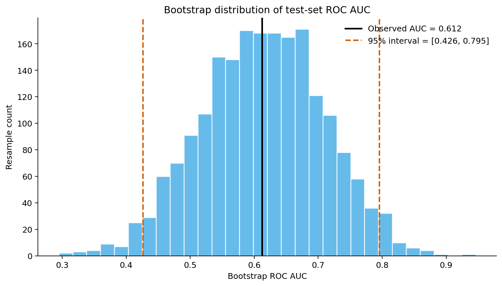
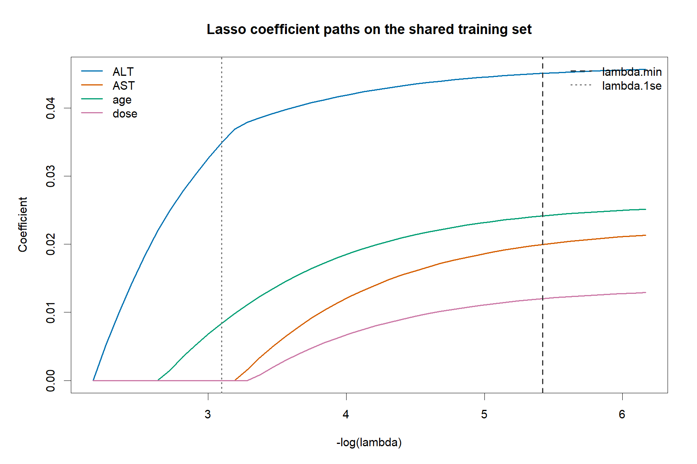
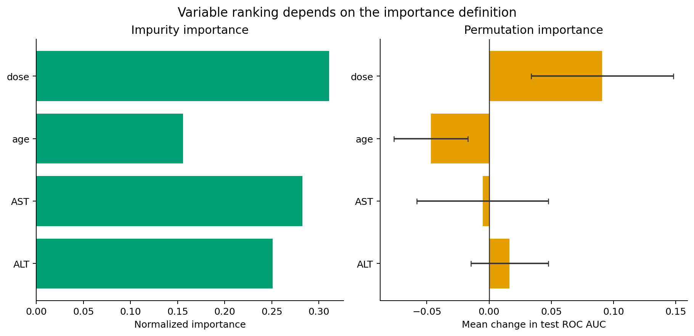
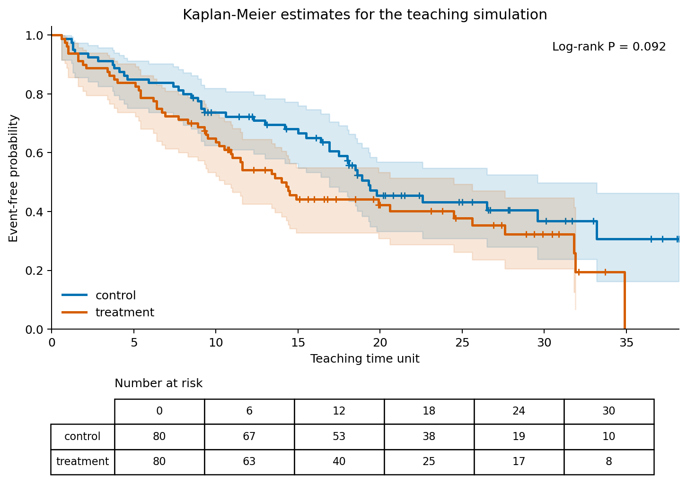

# 第10章 模型评估、特征选择与可解释性

## 本章定位

第9章介绍相关、回归和分类模型，第10章继续追问三个问题：模型在未参与训练的数据上表现怎样，进入模型的变量是否经过可靠筛选，模型输出能解释到什么程度。学生在这一章需要学会审查完整流程，不能只看一张 ROC 曲线或一列变量重要性。

本章位于提示词编程（Prompt Coding）阶段。AI 可以生成局部 Python 和 R 代码，协助整理指标表或检查报错。数据划分、泄漏风险、正类定义、事件定义、特征处理和医学解释仍由学生负责。

| 前置能力 | 本章训练 | 后续使用 |
| --- | --- | --- |
| 能读取分析表、检查缺失和重复 | 记录训练、验证和测试范围 | 第11章高维矩阵分析 |
| 能拟合逻辑回归并计算分类指标 | 交叉验证、bootstrap 和模型比较 | 第12至15章组学流程核验 |
| 能解释系数、混淆矩阵和 AUC | 特征选择、变量重要性和报告边界 | 综合项目模型报告 |
| 能保存代码与 AI 协作记录 | 跨语言结果核对和复现说明 | 课程项目答辩 |

本章使用教学模拟数据。所有统计量和模型结果只说明分析流程，不代表真实药物、疾病、疗效、诊断、预后或机制。

## 学习目标

完成本章后，学生应能：

1. 说明训练集、验证集和测试集的职责，识别常见数据泄漏。
2. 解释单次留出、k 折交叉验证和 bootstrap 分别估计什么。
3. 区分过滤法、包装法、嵌入法、ridge 和 lasso 的基本思路。
4. 读懂浅层决策树、随机森林、OOB 误差和两类变量重要性。
5. 识别生存时间、事件、删失、风险人数、Kaplan-Meier 曲线和 Cox 模型字段。
6. 用 Python 与 R 核对同一数据、同一划分和同一指标口径。
7. 写出包含模型表现、限制和医学解释边界的报告。

## 阅读指南

10.1 先确定哪些记录可以参与训练。10.2 处理内部验证和结果波动。10.3 与 10.4 讨论变量和模型复杂度。10.5 只要求读懂入门生存分析输出。10.6 把前面结果整理成可审查的模型报告。

| 小节 | 学生要回答的问题 | 学习证据 |
| --- | --- | --- |
| 10.1 | 测试集是否提前参与了任何决策 | 数据划分记录和泄漏清单 |
| 10.2 | 模型表现对数据切分有多敏感 | 各折指标与 bootstrap 区间 |
| 10.3 | 特征如何进入模型 | 特征处理和调参记录 |
| 10.4 | 变量重要性采用什么口径 | 两类重要性对照表 |
| 10.5 | 时间、事件和删失如何编码 | KM 图注和风险人数表 |
| 10.6 | 当前证据允许写到哪一级 | 模型报告和解释卡 |

## 核心概念速查

| 概念 | 本章解释 | 常见混淆 | 英文或缩写 |
| --- | --- | --- | --- |
| 训练集 | 拟合模型和预处理规则的数据 | 用训练指标报告最终表现 | training set |
| 验证集 | 选择模型或参数的数据 | 与测试集混用 | validation set |
| 测试集 | 模型确定后进行一次最终评估的数据 | 看过结果后继续调参 | test set |
| 数据泄漏 | 训练过程接触了不该提前知道的信息 | 只把泄漏理解成文件外传 | data leakage |
| 交叉验证 | 在训练数据内部轮流训练和验证 | 当成外部验证 | cross-validation, CV |
| bootstrap | 有放回重抽样，用于估计结果波动 | 当成增加真实样本 | bootstrap |
| 正则化 | 用惩罚限制模型复杂度 | 随意缩小系数 | regularization |
| OOB 误差 | 用未进入某棵树训练的记录估计误差 | 当成外部测试 | out-of-bag error |
| 变量重要性 | 变量对当前模型预测的贡献指标 | 当成病因强度 | variable importance |
| 删失 | 事件时间未被完整观察 | 当作普通缺失值删除 | censoring |
| KM 曲线 | 估计随时间变化的未发生事件概率 | 曲线分开就等于处理有效 | Kaplan-Meier curve |
| 可解释性 | 帮助人审查模型如何形成预测 | 等同于解释生物机制 | interpretability |

## 章节总览图

~~~mermaid
flowchart LR
  A["数据字典和分析表"] --> B["训练/测试划分"]
  B --> C["泄漏检查"]
  C --> D["训练集内部交叉验证"]
  D --> E["特征选择和调参"]
  E --> F["保留测试集评估"]
  F --> G["变量重要性或生存曲线"]
  G --> H["模型报告和解释边界"]
  H --> I["AI 协作记录与人工核验"]
~~~

## 本章证据边界

| 证据层级 | 可以写 | 不能写 |
| --- | --- | --- |
| 教学模拟观察 | 本次模拟数据中某变量分布或模型输出呈现某种模式 | 真实人群存在同样规律 |
| 内部验证 | 五折 AUC 在各折之间波动 | 模型已完成外部验证 |
| 测试集评估 | 固定测试集上的 AUC、灵敏度和特异度 | 模型可用于临床诊断 |
| 特征选择 | 当前 lasso 保留了某些变量 | 这些变量是疾病机制或靶点 |
| 变量重要性 | 某变量对当前随机森林预测贡献较大 | 该变量导致结局 |
| 生存分析 | 模拟分组的 KM 估计和 log-rank 结果 | 某处理改善真实患者生存 |

## 贯穿案例：一张表走完整章

教学模拟分析表包含 160 条记录，每行对应一名模拟受试者。Python 生成数据和固定的训练/测试划分；R 读取同一 CSV 和同一划分记录。共享划分比“两个软件使用相同随机种子”更可靠，因为不同软件的随机数算法和分层实现可能不同。

| 字段 | 含义 | 类型 | 本章用途 | 解释边界 |
| --- | --- | --- | --- | --- |
| sample_id | 样本编号 | ID | 连接数据和划分记录 | 不作为连续特征 |
| patient_id | 受试者编号 | ID | 检查重复受试者 | 不作为预测变量 |
| group | 教学分组 | 分类 | 分层描述和 KM 曲线 | 不写真实处理效果 |
| ALT、AST | 教学模拟检验值 | 连续 | 分类模型输入 | 不使用临床阈值 |
| age、sex、dose | 教学模拟协变量 | 连续或分类 | 变量核验和模型输入 | 不作医学解释 |
| response | 教学二分类结局 | 0/1 | 分类评估，1 为正类 | 不等同于真实疗效 |
| time_to_event | 事件或删失时间 | 连续 | 生存分析 | 时间单位为教学单位 |
| event | 事件状态 | 0/1 | 1 为事件，0 为删失 | 事件性质未对应真实结局 |

分析表前 6 行如下。学生应先看字段、编码和样本单位，再运行模型。

| sample_id | patient_id | group | ALT | AST | age | sex | dose | response | time_to_event | event |
| --- | --- | --- | ---: | ---: | ---: | --- | ---: | ---: | ---: | ---: |
| S001 | P001 | treatment | 40.3 | 34.3 | 46 | male | 57.3 | 1 | 8.9 | 1 |
| S002 | P002 | treatment | 44.1 | 35.3 | 41 | male | 63.7 | 0 | 24.5 | 1 |
| S003 | P003 | treatment | 44.8 | 35.7 | 47 | female | 49.7 | 0 | 14.5 | 1 |
| S004 | P004 | treatment | 45.9 | 34.7 | 47 | male | 45.8 | 1 | 14.9 | 1 |
| S005 | P005 | control | 32.9 | 29.3 | 62 | female | 51.7 | 0 | 30.1 | 0 |
| S006 | P006 | treatment | 41.6 | 38.7 | 52 | male | 54.0 | 0 | 5.1 | 1 |

本次数据有 65 条 <code>response=1</code> 记录和 94 个事件。control 与 treatment 各 80 条。生成脚本固定随机种子 20260710，因此教材中的运行结果可以复核。

## 10.1 训练集、测试集与数据泄漏

训练集用于拟合模型参数，也用于学习均值、标准差、缺失填补规则和特征筛选规则。验证集用于选择模型或参数。测试集只在分析流程确定后使用，作用是估计该流程在未见记录上的表现。

| 数据集合 | 可进行的操作 | 不应进行的操作 |
| --- | --- | --- |
| 训练集 | 拟合模型、学习预处理、内部交叉验证 | 把训练指标当最终结果 |
| 验证集 | 选择参数、模型和阈值 | 反复使用直到结果满意 |
| 测试集 | 对确定后的流程做最终评估 | 筛特征、调参、改阈值 |
| 外部验证集 | 检查新中心、新时间或新人群表现 | 与内部随机测试集混写 |

### 从一次错误流程开始

下面的代码先在全数据上计算标准化参数，再切分。测试集的均值和标准差已经进入预处理，形成泄漏。

~~~python
from sklearn.model_selection import train_test_split
from sklearn.preprocessing import StandardScaler

features = ["ALT", "AST", "age", "dose"]
X_all = StandardScaler().fit_transform(data[features])  # 错误：使用全数据
X_train, X_test, y_train, y_test = train_test_split(
    X_all, data["response"], test_size=0.25, stratify=data["response"]
)
~~~

正确流程先划分，再让 <code>Pipeline</code> 在每个训练数据子集内拟合标准化参数。交叉验证时，pipeline 会在每个 fold 重新计算这些参数。

~~~python
from sklearn.linear_model import LogisticRegression
from sklearn.pipeline import Pipeline
from sklearn.preprocessing import StandardScaler

model = Pipeline([
    ("scale", StandardScaler()),
    ("model", LogisticRegression(C=1e6, l1_ratio=0.0,
                                 solver="lbfgs", max_iter=3000))
])
model.fit(train[features], train["response"])
test_probability = model.predict_proba(test[features])[:, 1]
~~~

本章没有让 Python 和 R 分别随机切分。Python 保存 <code>sample_id,set</code> 两列划分记录，R 直接合并这张表。

~~~r
data <- read.csv("第10章教学模拟分析表.csv", fileEncoding = "UTF-8-BOM")
split <- read.csv("第10章数据划分记录.csv", fileEncoding = "UTF-8-BOM")
data$set <- split$set[match(data$sample_id, split$sample_id)]

train <- data[data$set == "train", ]
test <- data[data$set == "test", ]
stopifnot(length(intersect(train$sample_id, test$sample_id)) == 0)
~~~

实际划分结果如下。分层切分让训练集和测试集的正类比例接近，但分层不保证其他变量也完全平衡。

| 项目 | 训练集 | 测试集 |
| --- | ---: | ---: |
| 记录数 | 120 | 40 |
| response=1 比例 | 0.408 | 0.400 |
| 是否参与调参 | 是，仅在内部验证 | 否 |

### 贯穿案例：重复测量如何造成泄漏

为演示重复个体泄漏，本章从 160 名模拟受试者派生两次近似测量，共 320 行。两次测量共用 `patient_id` 和 `response`，ALT、AST 只加入少量教学噪声。这个派生表只用于检查划分单位，不参与后续主模型报告。

先按 320 行记录随机切分，测试集中有 64 名受试者的另一条记录已经出现在训练集。Python 随机森林测试 AUC 为 0.954，R 为 0.964。改为按 `patient_id` 成组划分后，跨集合受试者数降为 0，Python 和 R 的测试 AUC 分别为 0.705 和 0.677。

| 划分方式 | 训练/测试受试者重叠 | Python AUC | R AUC |
| --- | ---: | ---: | ---: |
| 按记录随机划分 | 64 | 0.954 | 0.964 |
| 按 patient_id 成组划分 | 0 | 0.705 | 0.677 |

这里不能写“随机森林性能下降”。两次评估回答的问题不同：按记录切分允许模型在测试阶段看到同一受试者的近似记录，指标被结构性泄漏抬高；成组切分才接近预测新受试者的任务。数值差异来自教学模拟规则，不代表真实研究中的固定偏倚幅度。

~~~r
stopifnot(length(intersect(
  group_train$patient_id, group_test$patient_id
)) == 0)

rf_fit <- randomForest::randomForest(
  x = group_train[features],
  y = factor(group_train$response),
  ntree = 500
)
group_prob <- predict(rf_fit, group_test[features], type = "prob")[, "1"]
~~~

### 划分策略由研究问题决定

随机切分适用于记录相互独立、没有时间顺序且来源相近的入门任务。医药数据常含重复测量、多个中心和随访时间，划分单位需要随数据结构改变。

| 数据结构 | 推荐划分 | 主要检查 |
| --- | --- | --- |
| 独立个体二分类 | 分层随机划分 | 正负类比例、随机种子 |
| 同一患者多次记录 | 按 patient_id 成组划分 | 患者不能跨集合 |
| 多中心数据 | 按中心留出或分层报告 | 中心差异和样本量 |
| 时间预测 | 过去训练、未来测试 | 时间界点和变量可用时点 |
| 配对或家系数据 | 配对单元或家系成组划分 | 相关记录不能拆开 |
| 外部验证 | 新中心、新设备或新时间段 | 数据字典和测量口径是否一致 |

训练集、验证集和测试集是功能角色，不是固定比例。60%/20%/20% 或 75%/25% 都可能合理，前提是说明样本量、调参需求和测试目标。样本较少时，可把训练集内部交叉验证用于调参，再保留一份测试集；不能因为样本少就让测试集参与模型选择。

外部验证也不能只看总 AUC。若新中心的测量设备、纳入标准或结局定义不同，性能变化可能来自数据分布和测量口径。报告应先核对字段映射，再解释指标。

### 医药数据中的四类泄漏

第一类来自预处理顺序，例如全数据标准化、填补缺失或筛选变量。第二类来自样本结构，例如同一患者的多次记录被分到两边。第三类来自时间，模型在预测时使用了未来才产生的信息。第四类来自变量定义，某字段由结局直接计算得到。

| 泄漏位置 | 错误示例 | 修正方式 |
| --- | --- | --- |
| 预处理 | 全数据筛出与 response 最相关的 10 个变量 | 在每个训练 fold 内重新筛选 |
| 重复个体 | P014 的基线记录进训练集，随访记录进测试集 | 按 patient_id 成组划分 |
| 时间 | 用治疗结束后的指标预测治疗前风险 | 只保留预测时点前已知变量 |
| 结局衍生字段 | 用 response_score 预测 response，而前者由后者计算 | 回查数据字典并移除 |

若每位患者有多行记录，普通的 <code>train_test_split</code> 不够。Python 可用 <code>GroupShuffleSplit</code> 按患者划分。

~~~python
from sklearn.model_selection import GroupShuffleSplit

splitter = GroupShuffleSplit(
    n_splits=1, test_size=0.25, random_state=20260710
)
train_idx, test_idx = next(
    splitter.split(records, y=records["response"],
                   groups=records["patient_id"])
)
~~~

时间预测还要保留时间顺序。若目标是用过去数据预测未来，随机切分会让训练集接触未来时期的分布。此时应按日期确定训练窗口和测试窗口，并写清时间界点。

### 泄漏检查清单

- 分析表的一行代表样本、患者还是一次测量？
- 同一患者、中心、批次或家系是否跨集合？
- 测试集是否参与标准化、填补、降维、特征选择或阈值调整？
- 特征在预测时点是否已经获得？
- 是否存在由结局、随访结果或人工诊断直接计算的字段？
- 查看测试结果后，分析流程是否又被修改？

独立测试集只能支持当前数据来源内的评估。外部泛化仍需新中心、新时间段或其他独立来源的数据。

## 10.2 交叉验证与 bootstrap

重采样（resampling）指从已有数据反复构造训练和验证子集。交叉验证主要用于估计测试误差或选择模型复杂度；bootstrap 常用于估计统计量、参数或模型指标的波动。

### 单次留出为什么不够

同一模型在不同随机切分下可能得到不同结果。贯穿案例使用 20 个随机种子重复 75%/25% 分层切分，测试 AUC 从 0.453 到 0.721，均值为 0.618，标准差为 0.069。

| 留出法汇总 | AUC |
| --- | ---: |
| 最小值 | 0.453 |
| 最大值 | 0.721 |
| 20 次均值 | 0.618 |
| 20 次标准差 | 0.069 |

素材中的 Auto 案例提供了同类证据。ISL 使用 392 条汽车记录，以 horsepower 的多项式预测 mpg。第一次切分中，线性、二次和三次模型的验证 MSE 分别为 26.14、19.82 和 19.78；更换切分后，三者变为 23.30、18.90 和 19.26。

| Auto 模型 | 第一次切分 MSE | 第二次切分 MSE |
| --- | ---: | ---: |
| 线性项 | 26.14 | 23.30 |
| 二次项 | 19.82 | 18.90 |
| 三次项 | 19.78 | 19.26 |

两次结果都支持二次模型优于线性模型，却没有给出三次模型稳定优于二次模型的证据。这个案例说明，单次留出把模型差异和切分偶然性混在了一起。

### 分层五折交叉验证

k 折交叉验证把训练集分成 k 份。每次用 k-1 份训练、1 份验证，所有记录轮流作为验证数据。分类任务常用分层 k 折，使每折保留相近的正负类比例。

~~~mermaid
flowchart TB
  A["训练集 120 条"] --> B["分层分成 5 个 fold"]
  B --> C1["1-4 训练，5 验证"]
  B --> C2["1-3、5 训练，4 验证"]
  B --> C3["其余轮次"]
  C1 --> D["汇总 5 个 AUC"]
  C2 --> D
  C3 --> D
  D --> E["均值、标准差和各折结果"]
~~~

Python 用 pipeline 保证标准化在每个 fold 内完成。

~~~python
from sklearn.model_selection import StratifiedKFold, cross_val_score

cv = StratifiedKFold(
    n_splits=5, shuffle=True, random_state=20260710
)
fold_auc = cross_val_score(
    model, train[features], train["response"],
    cv=cv, scoring="roc_auc"
)
print(fold_auc)
print(fold_auc.mean(), fold_auc.std(ddof=1))
~~~

本轮 Python 实际输出如下。

| fold | AUC |
| ---: | ---: |
| 1 | 0.421 |
| 2 | 0.543 |
| 3 | 0.636 |
| 4 | 0.643 |
| 5 | 0.615 |
| 均值 | 0.572 |
| 标准差 | 0.093 |

图10-1左侧显示 20 次留出结果，右侧显示共享五折结果。虚线为各自均值。图形用于展示内部评估对重采样划分的敏感性，不代表真实药学模型的性能分布。

本轮新增 `sample_id,fold` 记录，每折均为 24 条。Python 和 R 读取同一 fold 后，各折 AUC 均为 0.421、0.543、0.636、0.643 和 0.615，均值 0.572，标准差 0.093。逐折一致说明数据、正类、fold 和指标方向已经对齐。只共享随机种子不能保证两个软件生成相同 fold；即使 fold 相同，正则化和随机森林仍可能因目标函数或实现细节产生差异。

### fold 内预处理

任何会从数据学习规则的操作都要放进交叉验证循环。固定字典编码等不学习样本分布的操作可预先定义，但均值、标准差、插补值、PCA 载荷、特征排序和 lambda 都应在当前训练 fold 内获得。

| 操作 | 能否在交叉验证前用全数据完成 | 原因 |
| --- | --- | --- |
| 检查列名和合法取值 | 可以 | 不学习结局或样本分布 |
| 标准化 | 不可以 | 均值和标准差来自数据 |
| 缺失值填补 | 不可以 | 填补参数来自数据 |
| 按结局筛特征 | 不可以 | 直接使用结局信息 |
| PCA | 不可以 | 主成分方向来自数据 |
| 模型调参 | 不可以 | 需要训练 fold 内验证 |

### bootstrap 估计测试 AUC 的波动

固定模型在 40 条测试记录上的 AUC 为 0.612。对测试记录有放回抽样 2000 次，Python 得到百分位 95% 区间 [0.426, 0.795]；R 得到 [0.423, 0.788]。两种实现接近，细小差异来自随机抽样序列。

~~~python
rng = np.random.default_rng(20260711)
boot_auc = []
for _ in range(2000):
    idx = rng.integers(0, len(y_test), len(y_test))
    if np.unique(y_test[idx]).size == 2:
        boot_auc.append(roc_auc_score(y_test[idx], test_probability[idx]))

ci = np.quantile(boot_auc, [0.025, 0.975])
~~~

图10-2黑线是固定测试集 AUC 0.612，橙色虚线是 Python 百分位区间 [0.426, 0.795]。直方图描述当前 40 条测试记录在有放回重抽样下的指标波动，不是新受试者总体中的真实 AUC 分布。

区间很宽，原因之一是测试集只有 40 条记录。它提醒读者当前 AUC 估计不精确。bootstrap 没有增加受试者数量，也没有补救模拟数据与真实人群之间的差异。

| bootstrap 能处理 | bootstrap 不能处理 |
| --- | --- |
| 当前样本内的重抽样波动 | 错误标签 |
| 统计量的标准误或区间 | 数据泄漏 |
| 特征入选稳定性 | 非代表性样本 |
| 固定模型指标的抽样波动 | 缺少外部验证 |

### 怎样选择重采样方法

留一法（leave-one-out cross-validation, LOOCV）每次留下 1 条记录验证，训练集利用率高，但需要拟合很多次。常用 5 折或 10 折能在计算量和波动之间取得平衡。重复 k 折会更换 fold 划分，用于观察结果是否依赖某一次分折。

| 方法 | 适合回答 | 不宜承担 |
| --- | --- | --- |
| 单次留出 | 快速建立基线 | 精确比较相近模型 |
| 5 折或 10 折 | 内部评估、选择复杂度 | 外部泛化结论 |
| 重复 k 折 | 观察 fold 划分波动 | 修复样本偏倚 |
| LOOCV | 小样本下充分利用训练记录 | 计算昂贵的复杂流程 |
| bootstrap | 参数、指标或入选稳定性 | 替代独立受试者 |

ISL 的 Portfolio 案例用 1000 次 bootstrap 估计投资分配参数 alpha 的标准误。bootstrap 估计为 0.087，从已知总体重复生成 1000 个数据集得到 0.083。二者接近，说明 bootstrap 在该例中较好地再现了参数的抽样波动。这个金融案例只用于说明方法，不转写成药学结论。

bootstrap 还可用于检查系数或特征选择稳定性。若某特征在 1000 次重抽样中只进入 300 次模型，单次拟合中的非零系数缺少稳定性。入选频率仍然是内部结果，不证明变量具有生物作用。

### 调参与评估要分开

交叉验证既可用于选择参数，也可用于估计表现。若同一组 fold 被反复查看并据此修改特征、参数和代码，最终交叉验证结果也会偏乐观。严格评估可使用嵌套交叉验证：内层选择参数，外层估计选择流程的表现。

本章不要求学生实现完整嵌套交叉验证，但要理解它保护的对象。测试集保护最终评估，外层 fold 保护模型选择流程，内层 fold 负责调参。三者不能交换角色。

## 10.3 特征选择与正则化

特征（feature）是模型的输入变量。特征选择的目标可能是减少噪声、降低计算量、改善泛化或简化模型。筛出的变量仍受数据来源、候选变量、模型和验证设计影响。

| 方法 | 基本做法 | 优点 | 主要风险 |
| --- | --- | --- | --- |
| 过滤法 | 独立计算相关、差异或其他得分 | 快，容易展示 | 忽略变量组合，容易全数据泄漏 |
| 包装法 | 反复拟合模型并搜索变量子集 | 贴近目标模型 | 计算量大，容易过拟合 |
| 嵌入法 | 模型拟合时同步完成选择 | 流程集中 | 结果依赖模型和参数 |
| ridge | 用 L2 惩罚缩小系数 | 适合相关变量共同存在 | 通常不产生零系数 |
| lasso | 用 L1 惩罚缩小系数 | 可产生稀疏模型 | 不保证每次都筛掉变量 |

### 素材案例：60 个样本面对 5726 个特征

《生物医药大数据与智能分析》列出多个基因表达谱数据集。9-Tumors 有 60 个样本、5726 个特征和 9 个类别；11-Tumors 有 174 个样本、12533 个特征；Lung Cancer 有 203 个样本、12600 个特征。这里的数字来自教材素材，不是本仓库重新下载后的实测。

| 数据集 | 特征数 | 样本数 | 类别数 | 本章关注点 |
| --- | ---: | ---: | ---: | --- |
| 9-Tumors | 5726 | 60 | 9 | p 远大于 n |
| 11-Tumors | 12533 | 174 | 11 | 特征选择需放进验证 |
| Lung Cancer | 12600 | 203 | 5 | 类别比例也需检查 |

素材还报告了类别失衡：Lung Cancer 最大类别 139 个样本，最小类别 6 个，约为 23.2∶1；Brain_Tumor1 最大类别 60 个，最小类别 4 个，约为 15∶1。样本总数不小，不等于每个类别都有足够记录。分层 fold、逐类指标和混淆矩阵都应保留。

| 数据集 | 最大类别 | 最小类别 | 样本类别比 |
| --- | ---: | ---: | ---: |
| Lung Cancer | 139 | 6 | 23.2∶1 |
| Brain_Tumor1 | 60 | 4 | 15∶1 |

这类数据中，训练集可以轻易找到偶然关联。ISL 的模拟例子更直接：20 条训练记录逐步加入与结局无关的特征时，训练 R² 可趋近 1，训练 MSE 可趋近 0，独立测试 MSE 却上升。训练拟合优良不能证明模型有用。

ISL 还比较了 `n=100`、20 个真实相关特征、总特征数分别为 20、50 和 2000 的 lasso 模拟。特征增多后，需要更强正则化；当 2000 个特征中只有 20 个提供信号时，不同惩罚设置下的测试误差都较高。正则化可以限制复杂度，但不能消除极端维度带来的信息不足。本章没有 FASTQ、BAM 或计数矩阵输入，因此不启动 NGS 流程；这里只借高维表达矩阵说明评估边界，正式 RNA-seq 数据链条放在第12章。

### ridge 与 lasso

正则化（regularization）在损失函数中加入惩罚。惩罚增强时，模型复杂度下降。ridge 通常保留所有变量并缩小系数；lasso 可能把部分系数压到零。lambda 或等价参数必须通过训练集内部验证选择。

~~~mermaid
flowchart LR
  A["训练 fold"] --> B["标准化"]
  B --> C["候选 lambda"]
  C --> D["内部验证误差"]
  D --> E["选择 lambda"]
  E --> F["在当前训练数据重拟合"]
  F --> G["验证 fold 评估"]
~~~

Python 在贯穿案例的四个数值特征上运行 lasso 逻辑回归。`PredefinedSplit` 读取共享 fold，`GridSearchCV` 让标准化和模型都在每个训练 fold 内重新拟合。

~~~python
lasso = Pipeline([
    ("scale", StandardScaler()),
    ("model", LogisticRegression(
        l1_ratio=1.0, solver="liblinear", max_iter=3000
    ))
])

search = GridSearchCV(
    lasso,
    {"model__C": np.logspace(-2, 2, 12)},
    cv=shared_folds,
    scoring="roc_auc",
    refit=True
)
search.fit(train[features], train["response"])
~~~

本轮交叉验证选择的 C 为 8.111。标准化尺度上的系数如下，四个变量均未被压到零。

| 特征 | 标准化系数 | 是否保留 |
| --- | ---: | --- |
| ALT | 0.371 | 是 |
| AST | 0.123 | 是 |
| age | 0.292 | 是 |
| dose | 0.151 | 是 |

这个结果有两层教学意义。第一，lasso 具备产生零系数的能力，但不会强制得到稀疏模型。第二，非零系数只说明当前模拟数据和参数下变量进入了预测公式，不能据此确认医学作用。五个训练子集在固定 C 下均保留四个变量，入选频率均为 1.00；这仍只是内部稳定性检查。

R 安装并固定 `glmnet 5.0`，读取相同训练、测试和 fold 记录。`foldid` 明确指定每条训练记录所属 fold。

~~~r
library(glmnet)

x_train <- as.matrix(train[, c("ALT", "AST", "age", "dose")])
y_train <- train$response

lasso_cv <- cv.glmnet(
  x = x_train,
  y = y_train,
  family = "binomial",
  alpha = 1,
  foldid = fold_id,
  type.measure = "auc",
  standardize = TRUE
)
coef(lasso_cv, s = "lambda.min")
coef(lasso_cv, s = "lambda.1se")
~~~

`lambda.min` 取交叉验证指标最优处，`lambda.1se` 取距离最优值一个标准误范围内、惩罚更强的候选。二者对应不同的性能—简洁性取舍。

| R lasso 结果 | lambda.min | lambda.1se |
| --- | ---: | ---: |
| lambda | 0.004415 | 0.045190 |
| 非零特征 | ALT、AST、age、dose | ALT、age |
| 测试 AUC | 0.612 | 0.609 |

图10-3横轴向右表示惩罚减弱，四条曲线对应 ALT、AST、age 和 dose。两条竖线标出 `lambda.1se` 与 `lambda.min`。路径展示系数随惩罚变化的模型行为，不说明变量的生物作用强弱。

R 在五个外层训练子集中重新选择 `lambda.1se`，ALT、AST、age、dose 的入选频率分别为 0.60、0.20、0.40 和 0。它与全训练集结果不完全一致，说明小样本下“被选中”会随训练子集改变。

### 筛选顺序决定评估是否可信

特征筛选只能在训练数据内部完成。如果先用全部数据计算相关性，再挑选与 response 关系最强的变量，测试集结局已经参与筛选。即使后续模型只在训练集拟合，测试指标仍然偏乐观。

~~~python
# 错误：先在全体数据上筛选，再划分训练集和测试集
ranked = data.corr(numeric_only=True)["response"].abs().sort_values()
selected = ranked.tail(5).index.tolist()
~~~

改正方法是把筛选器放进交叉验证管道。每个 fold 只用该 fold 的训练部分计算筛选规则；验证部分既不参与标准化，也不参与变量排序。

~~~python
from sklearn.feature_selection import SelectKBest, f_classif
from sklearn.pipeline import make_pipeline

pipe = make_pipeline(
    StandardScaler(),
    SelectKBest(score_func=f_classif, k=2),
    LogisticRegression(max_iter=2000),
)
scores = cross_val_score(pipe, X_train, y_train, cv=cv, scoring="roc_auc")
~~~

筛选结果还应检查稳定性。可记录每个 fold 或每次 bootstrap 被选中的变量，再报告入选频率。某变量只在少数重采样中入选，说明排序依赖当前样本，不宜写成稳定特征。

### 系数大小依赖变量尺度

正则化直接作用于系数。若 ALT 以 U/L 输入，age 以年输入，二者一个单位代表的变化不同，未标准化时惩罚并不公平。本章先在训练 fold 内标准化，再拟合 lasso；测试集只使用对应训练 fold 的均值和标准差转换。

相关变量还会改变系数分配。ALT 与 AST 若提供相近信息，lasso 可能保留一个、压缩另一个，也可能在不同重采样中交替选择。零系数是当前数据和调参规则下的模型结果，不等于该变量在生物学上无作用。

### 特征选择报告至少写什么

| 报告字段 | 示例 |
| --- | --- |
| 候选特征 | ALT、AST、age、dose |
| 样本范围 | 训练集 120 条 |
| 预处理 | 每个训练 fold 内标准化 |
| 方法 | lasso 逻辑回归 |
| 调参 | 五折交叉验证选择 C |
| 选择结果 | 四个特征均为非零系数 |
| 稳定性 | 报告五个训练子集的入选频率；未做外部验证 |
| 边界 | 不支持病因、标志物或靶点结论 |

## 10.4 树模型与变量重要性

决策树（decision tree）用一系列切分规则形成预测路径。浅树便于查看规则，但单棵树对训练数据变化敏感。bagging、随机森林和 boosting 通过组合多棵树改善预测稳定性。

| 方法 | 树之间的关系 | 常见评估 | 入门边界 |
| --- | --- | --- | --- |
| 单棵树 | 一棵树 | 训练/测试指标、树深 | 结构可能不稳定 |
| bagging | bootstrap 后并行训练 | OOB 和测试指标 | 树之间可能高度相关 |
| 随机森林 | 每次切分只看部分候选变量 | OOB、测试指标、重要性 | 重要性口径影响排序 |
| boosting | 顺序拟合弱树 | 验证和测试指标 | 参数多，需谨慎调参 |

OOB（out-of-bag）记录指某条记录没有进入某棵 bootstrap 树的训练样本。模型可用这些树为该记录预测，再汇总为 OOB 误差。OOB 属于内部估计，不能替代外部验证。

### 素材案例：Heart 数据中的树

ISL 的 Heart 数据包含 303 名因胸痛就诊的患者、13 个预测变量和一个二分类结局 HD。结局依据血管造影检查编码。交叉验证得到一棵 6 个叶节点的树，定量变量和分类变量都可参与切分。

该素材的随机森林 Gini 重要性中，Thal、Ca 和 ChestPain 排名较高。这个排序描述原书模型如何使用变量。它不证明这些变量导致心脏病，也不保证在其他医院保持相同顺序。

### 贯穿案例：两种重要性口径

Python 随机森林使用 500 棵树、最大深度 4、叶节点最少 5 条训练记录。测试 AUC 为 0.586，准确率为 0.600；OOB 准确率为 0.583。

~~~python
from sklearn.ensemble import RandomForestClassifier
from sklearn.inspection import permutation_importance

rf = RandomForestClassifier(
    n_estimators=500,
    max_depth=4,
    min_samples_leaf=5,
    class_weight="balanced",
    oob_score=True,
    random_state=20260710
)
rf.fit(train[features], train["response"])

perm = permutation_importance(
    rf, test[features], test["response"],
    scoring="roc_auc", n_repeats=30,
    random_state=20260710
)
~~~

| 特征 | impurity importance | 测试集置换后 AUC 平均变化 |
| --- | ---: | ---: |
| ALT | 0.251 | 0.016 |
| AST | 0.282 | -0.005 |
| age | 0.156 | -0.047 |
| dose | 0.311 | 0.091 |

impurity importance 把所有特征的重要性归一化到总和为 1。置换重要性观察打乱某列后测试 AUC 的变化。dose 在两种口径下都较高，age 的置换重要性为负。负值说明本次有限测试样本中，打乱 age 后 AUC 反而略升，不能写成 age 具有“保护作用”。

图10-4左侧基于训练过程中节点纯度改善，右侧基于固定测试集 AUC 的置换变化和 30 次重复的标准差。两种图回答的问题不同，排序也不同。误差线跨过 0 时，不宜强调该变量具有稳定预测贡献。

R 使用同一训练集和测试集运行 <code>randomForest</code>。测试 AUC 为 0.534，测试准确率为 0.575，OOB 准确率为 0.608。

~~~r
set.seed(20260710)
rf_fit <- randomForest::randomForest(
  x = train[, c("ALT", "AST", "age", "dose")],
  y = factor(train$response, levels = c(0, 1)),
  ntree = 500,
  nodesize = 5,
  importance = TRUE
)
rf_prob <- predict(
  rf_fit, newdata = test[, c("ALT", "AST", "age", "dose")],
  type = "prob"
)[, "1"]
~~~

### 先读浅树，再读森林

随机森林给出综合预测，却不直接提供一条可复述的判断规则。教学时可先拟合限制深度的单棵树，检查切分变量、阈值和叶节点样本数，再比较森林是否改善测试表现。

~~~python
from sklearn.tree import DecisionTreeClassifier, export_text

shallow_tree = DecisionTreeClassifier(
    max_depth=3,
    min_samples_leaf=10,
    random_state=20260710,
)
shallow_tree.fit(X_train, y_train)
print(export_text(shallow_tree, feature_names=features))
~~~

本轮浅树测试 AUC 为 0.543。根节点先按 `dose <= 52.15` 切分；较高剂量分支又在 62.90 处切分，中间分支主要预测为 1，两端主要预测为 0。低剂量分支继续按 ALT 切分，却仍落入相同预测类别，提示部分规则未带来容易复述的类别变化。

~~~text
|--- dose <= 52.15
|   |--- ALT <= 31.00: class 0
|   |--- ALT > 31.00: class 0
|--- dose > 52.15
|   |--- dose <= 62.90: class 1
|   |--- dose > 62.90: class 0
~~~

这些阈值来自教学模拟数据，不能转写为剂量界值、诊断阈值或用药规则。浅树的价值在于让学生检查模型如何切分，而不是赋予切分点医学意义。

| 浅树检查项 | 要回答的问题 |
| --- | --- |
| 树深 | 规则是否已经复杂到难以复核 |
| 叶节点样本数 | 是否由少量记录决定一个分支 |
| 训练与测试表现 | 训练集提高是否伴随测试集下降 |
| 切分阈值 | 阈值附近是否有足够观测 |
| 重采样稳定性 | 换种子或 fold 后首要切分是否改变 |

森林降低单棵树的不稳定性，却失去浅树的直接规则。boosting 还涉及学习率、树数和深度的联合调参。本章只建立评估与解释边界，不展开 boosting 的算法推导。

Python 与 R 的随机森林结果不同，原因包括树生长实现、候选变量抽样、类别处理和随机数算法。跨语言核验的目标是确认输入、结局和评估范围一致，不要求两个随机森林给出完全相同的树和指标。

### 变量重要性为什么会变

- 两个高度相关变量可能分摊重要性，也可能由其中一个变量占据主要切分。
- 取值较多的连续变量在 impurity importance 中可能获得更多切分机会。
- 随机种子、树深、叶节点大小和树数会改变排序。
- 测试集较小时，置换重要性波动较大，甚至出现负值。
- 重要性只对当前模型和当前评估口径成立。

报告变量重要性时，应同时给出模型、数据范围、重要性算法、随机种子和不确定性。单独展示一张排序条形图，读者无法判断排序来自训练集、测试集还是 OOB 数据。

## 10.5 生存分析入门

生存分析（survival analysis）处理从起点到事件发生的时间。事件可以是死亡、复发、缓解、设备失效或其他预先定义的终点。正文涉及医学数据时，必须写清起点、事件、时间单位和随访结束规则。

删失（censoring）表示真实事件时间没有完整观察到。右删失最常见：研究结束或失访时尚未观察到事件，只知道事件时间晚于当前记录时间。删失记录仍提供风险集信息，不能当作普通缺失值删除。

| 字段 | 贯穿案例编码 | 检查问题 |
| --- | --- | --- |
| patient_id | 每人一行 | 是否存在重复个体 |
| time_to_event | 教学时间单位 | 起点和单位是否统一 |
| event | 1 为事件，0 为删失 | 编码是否反向 |
| group | control / treatment | 分组在起点时是否已知 |
| 协变量 | age、ALT、AST | 是否在预测起点前获得 |

### 素材案例：BrainCancer 的三个估计

ISL 的 BrainCancer 数据包含 88 名原发性脑肿瘤患者，研究结束时 53 人仍存活，35 人已观察到死亡事件。教材用 20 个月时点解释删失为何不能直接删除。

若把已知超过 20 个月的 48 人除以全部 88 人，估计为 55%。这个算法把 20 个月前删失的记录当成未存活到 20 个月。若只在 20 个月前未删失的 71 人中计算，得到 68%，又完全丢掉了早期删失记录。Kaplan-Meier 估计利用各事件时点的风险集，教材给出的 20 个月生存概率为 71%。三个结果的差异来自删失处理，不是小数位计算误差。

| BrainCancer 估计方法 | 20 个月估计 | 主要问题或特点 |
| --- | ---: | --- |
| 48 / 88 | 55% | 把早期删失隐含当作事件前失败 |
| 48 / 71 | 68% | 忽略早期删失提供的信息 |
| Kaplan-Meier | 71% | 按事件时点更新风险集 |

原书进一步比较男性和女性的 KM 曲线。Python 实验室实现的 log-rank P 值约为 0.23，未提供清晰证据支持两组曲线不同。这个素材案例不能用于个体预后，也不能脱离诊断、治疗和随访背景解释。

### 贯穿案例：读一张 KM 结果表

Python 使用 statsmodels，R 使用 survival 包。两种语言在 12 个教学时间单位处得到相同 KM 估计和风险人数。

~~~python
from statsmodels.duration.survfunc import SurvfuncRight, survdiff

for group_name, part in data.groupby("group"):
    km = SurvfuncRight(part["time_to_event"], part["event"])

chi_square, p_value = survdiff(
    data["time_to_event"].to_numpy(),
    data["event"].to_numpy(),
    data["group"].to_numpy()
)
~~~

~~~r
surv_object <- survival::Surv(data$time_to_event, data$event)
km_fit <- survival::survfit(surv_object ~ group, data = data)
summary(km_fit, times = 12, extend = TRUE)

logrank <- survival::survdiff(surv_object ~ group, data = data)
~~~

| group | n | 事件数 | 12 时点风险人数 | 12 时点 KM 估计 |
| --- | ---: | ---: | ---: | ---: |
| control | 80 | 43 | 53 | 0.723 |
| treatment | 80 | 51 | 40 | 0.542 |

图10-5中的加号为删失，阴影为逐点 95% 置信区间，下方表格给出 0、6、12、18、24 和 30 时点的风险人数。尾部人数下降、区间变宽，说明曲线末端的不确定性增加。

log-rank 卡方统计量为 2.831，P=0.092。可以写：“在本次教学模拟数据中，两组 12 时点 KM 估计不同；log-rank 检验未提供清晰证据支持整条曲线存在差异。”不能写“treatment 缩短生存”或“control 具有保护作用”。图注还应报告删失标记和风险人数；曲线尾部风险人数很少时，不能只看两条曲线最后是否分开。

### KM 曲线的五步读法

第一步确认时间起点、事件定义和时间单位。第二步查看各组起始人数及事件数。第三步沿时间轴观察阶梯下降和删失标记。第四步在目标时点读取生存概率，同时查看风险人数和置信区间。第五步再结合 log-rank 检验说明组间证据，不用肉眼分离替代统计检验。

| 图上元素 | 可以读取什么 | 不能直接推出什么 |
| --- | --- | --- |
| 曲线高度 | 某时点尚未发生事件的估计概率 | 个体未来结局 |
| 阶梯下降 | 该时点出现观察到的事件 | 事件发生原因 |
| 删失标记 | 随访在该处结束且此前未观察到事件 | 删失者之后一定无事件 |
| 风险人数 | 该时点前仍在随访且未发生事件的人数 | 原始样本量始终充足 |
| 置信区间 | 当前估计的不确定性范围 | 组间差异的单独检验结论 |

Kaplan-Meier 估计通常依赖独立删失假设，即在已知分析信息后，删失机制不应系统性地偏向更高或更低事件风险。若失访与病情变化有关，曲线可能偏倚；仅凭现有分析表不能验证这一假设，需结合随访流程判断。

当两条曲线交叉时，单一 log-rank P 值可能难以概括随时间变化的差异。此时应先报告曲线形态和风险人数，再考虑是否需要分时段效应或其他方法。本章不展开复杂生存建模。

### Cox 模型只读报告字段

Cox 比例风险模型（Cox proportional hazards model）描述协变量与瞬时风险的关系。常见输出包括系数、风险比（hazard ratio, HR）、95% CI 和 P 值。HR 不是个体生存概率，也不等于某时点风险。

贯穿案例中，R 对 group、age、ALT 和 AST 拟合入门 Cox 模型。group=treatment 的 HR 为 1.491，95% CI 为 [0.989, 2.248]，P=0.057；比例风险全局检查 P=0.923。这组数字只说明模拟数据和当前模型输出。研究设计、混杂控制、删失机制和外部验证均未满足临床解释要求，正文不据此判断 treatment 的真实风险。

| Cox 报告字段 | 学生应写什么 | 常见误读 |
| --- | --- | --- |
| 时间和事件 | 起点、单位、event 编码 | 只写“生存期” |
| HR 与 95% CI | 变量单位和参考组 | 把 HR 当概率 |
| 比例风险检查 | 检查方法和结果 | 完全不检查假设 |
| 协变量 | 纳入依据和测量时点 | 事后挑选显著变量 |
| 边界 | 内部、模拟或外部验证范围 | 直接给个体建议 |

本章不推导部分似然，不展开时间依赖协变量、竞争风险或生存随机森林。这些内容需要更完整的研究设计和统计基础。

## 10.6 模型可解释性与报告规范

可解释性（interpretability）回答“模型如何使用输入形成输出”。简单模型的系数、树的切分规则、随机森林变量重要性和局部解释图都属于解释材料。它们描述模型，不自动描述生物系统。

### 全局解释与局部解释

全局解释概括模型整体行为，例如逻辑回归系数方向或随机森林变量重要性。局部解释分析一条记录为何得到某个预测。局部解释仍受模型、背景数据和变量相关性影响。

| 解释材料 | 能回答的问题 | 不能回答的问题 |
| --- | --- | --- |
| 回归系数 | 模型中变量方向和尺度 | 变量是否导致结局 |
| OR 或 HR | 模型参数转换后的关联尺度 | 个体一定发生事件吗 |
| 浅树路径 | 某条预测经过哪些切分 | 规则能否跨中心稳定 |
| impurity importance | 变量带来多少节点纯度改善 | 变量是否有生物因果作用 |
| permutation importance | 打乱变量后评估指标改变多少 | 变量是否是治疗靶点 |
| SHAP | 单条或整体预测贡献分解 | 真实机制和临床效应 |

SHAP 在本章只作为选学工具。使用时要写清模型、背景数据、解释样本和输出尺度。若图中文字错误或节点缺失，以准确的表格、代码和文字为准，并标 <code>需人工确认</code>。

### AUC 之外还要看什么

ROC AUC 衡量模型对正负记录的整体排序能力，不固定某个分类阈值。类别比例不均衡时，还应查看精确率-召回率曲线下面积（PR-AUC）。概率用于风险分层时，可补充 Brier 分数；该分数是预测概率与实际结局平方误差的平均值，越低通常表示概率误差越小。

本章固定测试集的逻辑回归 ROC AUC 为 0.612，PR-AUC 为 0.561，Brier 分数为 0.228。在 0.5 阈值下，阳性预测值（PPV）为 0.667，阴性预测值（NPV）为 0.647。

| 指标 | 本章测试结果 | 主要回答的问题 |
| --- | ---: | --- |
| ROC AUC | 0.612 | 随机抽取一正一负时，正类排序更高的能力如何 |
| PR-AUC | 0.561 | 对正类的精确率与召回率如何权衡 |
| Brier 分数 | 0.228 | 预测概率与实际结局的平均平方误差多大 |
| 灵敏度 | 0.250 | 实际正类中识别出多少 |
| 特异度 | 0.917 | 实际负类中识别出多少 |
| PPV | 0.667 | 预测为正的记录中有多少为实际正类 |
| NPV | 0.647 | 预测为负的记录中有多少为实际负类 |

PPV、NPV 和 PR-AUC 会受结局比例影响，不能脱离测试集人群解释。Brier 分数同时受区分度与校准影响；若要判断概率是否校准，还需校准曲线、截距和斜率。本章只报告入门指标，不把单个分数写成模型“可用”。

### 用实际输出写模型报告

下面的报告只使用本章已运行结果。

| 报告字段 | 本章案例记录 |
| --- | --- |
| 数据来源 | 固定随机种子生成的教学模拟分析表 |
| 样本单位 | 每行一名模拟受试者 |
| 总记录数 | 160 |
| 结局 | response=1 为教学正类 |
| 特征 | ALT、AST、age、dose |
| 划分 | 训练 120，测试 40；共享 sample_id 划分记录 |
| 内部验证 | Python、R 共享五折；AUC 均值 0.572，SD 0.093 |
| 测试表现 | ROC AUC 0.612，PR-AUC 0.561，Brier 分数 0.228，准确率 0.650 |
| 阈值表现 | 灵敏度 0.250，特异度 0.917 |
| 预测值 | PPV 0.667，NPV 0.647 |
| 混淆矩阵 | TN=22，FP=2，FN=12，TP=4 |
| 不确定性 | 测试 AUC bootstrap 95% 区间约 [0.426, 0.795] |
| lasso | Python 最佳 C=8.111，四个非零系数；R lambda.1se 保留 ALT、age |
| 树模型 | Python 随机森林测试 AUC 0.586 |
| 主要限制 | 模拟数据、小测试集、无外部验证、无临床结局 |

可以写成：

> 本次教学模拟分析使用 120 条训练记录和 40 条固定测试记录。Python 与 R 共用五折记录，逻辑回归平均 ROC AUC 为 0.572，各折结果存在波动。固定测试集 ROC AUC 为 0.612，PR-AUC 为 0.561，Brier 分数为 0.228；在 0.5 阈值下，灵敏度为 0.250，特异度为 0.917。测试 ROC AUC 的 bootstrap 区间较宽，提示当前估计不精确。结果仅用于演示模型评估流程，不支持诊断、疗效或临床应用判断。

不能写成：

> 模型准确识别了应答患者，ALT、AST、age 和 dose 是决定治疗响应的关键因素，可用于临床筛查。

错误表述同时越过了数据来源、指标、变量解释和临床应用四条边界。

### 生物医学结果解释卡

涉及医药、组学或 AI 模型时，可用下表约束结论。

| 项目 | 本章填写示例 |
| --- | --- |
| 观察结果 | 固定测试集逻辑回归 AUC 为 0.612 |
| 方法来源 | Python scikit-learn；R glm；共享测试集 |
| 允许解释 | 当前模拟数据中的区分能力有限，估计不精确 |
| 替代解释 | 随机切分、样本量、特征设定和模拟规则影响结果 |
| 仍需验证 | 新数据、外部来源、校准、亚组失败分析 |
| 主张状态 | supported：仅支持教学流程；unsupported：临床效用 |

一项模型结果可以写入教材或报告前，应能定位到数据、代码、图表或材料来源。找不到定位信息的数字不进入正文。

### 结果表达阶梯

同一个数字可以支持多强的结论，取决于验证层级。报告时应停在证据允许的台阶，不因模型名称复杂而升级主张。

| 证据层级 | 可以写 | 尚不能写 |
| --- | --- | --- |
| 数据观察 | 模拟数据中 ALT 与 response 的分布存在差异 | ALT 决定 response |
| 内部验证 | 训练集交叉验证 AUC 有一定波动 | 模型可推广到新中心 |
| 固定测试 | 当前测试集 ROC AUC 为 0.612 | 已证明临床性能 |
| 外部验证 | 新来源数据上复现预先规定指标 | 已改善患者结局 |
| 临床效用 | 前瞻研究评估决策影响和净获益 | 机制或疗效结论 |

### 审阅一段 AI 生成解释

AI 可能把模型结果扩写为：“随机森林发现 dose 是最关键因素，说明提高剂量能够改善 response；AUC 超过 0.5，模型已经具有临床价值。”这段话至少有四处越界。

| 原表述 | 问题 | 改写 |
| --- | --- | --- |
| “发现最关键因素” | 置换重要性只反映当前模型中的预测贡献 | dose 在本次置换重要性中排序较高 |
| “提高剂量能够改善” | 预测关联不能支持干预因果 | 不作剂量效应判断 |
| “AUC 超过 0.5” | 缺少区间、阈值指标和比较基线 | 报告 ROC AUC 0.612 及其 bootstrap 区间 |
| “具有临床价值” | 没有外部验证和临床效用研究 | 仅用于教学流程演示 |
| “lasso 证实 ALT 是标志物” | 非零系数和入选频率不是标志物验证 | 报告选择规则、系数和稳定性，不作标志物判断 |
| “随机切分结果更好” | 忽略重复患者跨集合造成的泄漏 | 以 patient_id 成组划分作为新受试者评估 |

AI 可以协助检查字段、生成代码骨架和整理报告，但每个数字都要回到运行结果，每个解释都要经过主张—证据—边界核对。

### 跨语言核对

Python 与 R 在同一测试集上得到相同的逻辑回归结果：AUC 0.612、准确率 0.650、灵敏度 0.250、特异度 0.917，混淆矩阵也一致。两种语言读取同一 fold 记录后，五折 AUC 也逐折一致。Python 以 C 表示惩罚倒数，R `glmnet` 以 lambda 表示惩罚强度，两者的目标函数缩放和参数定义不同，不能直接比较数值。Python 在最佳 C 下保留四个变量；R 的 `lambda.min` 也保留四个变量，`lambda.1se` 只保留 ALT 和 age。

随机森林测试 AUC 分别为 0.586 和 0.534。随机森林包含随机抽样和实现差异，结果不要求逐位相同。学生应解释差异来源，不能挑选较高结果作为唯一报告。

| 核对对象 | 应一致 | 可以不同 |
| --- | --- | --- |
| 数据行和列 | 是 | 否 |
| 训练/测试 sample_id | 是 | 否 |
| 正类和事件编码 | 是 | 否 |
| 指标公式 | 是 | 否 |
| 共享的 CV fold 与逐折 AUC | 是 | 否 |
| C 与 lambda 数值 | 否 | 是 |
| lasso 非零变量 | 否 | 是 |
| 随机森林具体树 | 否 | 是 |
| 报告的证据边界 | 是 | 否 |

### 模型报告最低字段

1. 数据来源、分析表版本、样本单位和纳入规则。
2. 结局、正类、事件和参考组定义。
3. 特征列表、缺失处理、标准化和特征选择。
4. 训练、验证、测试或外部验证范围。
5. 模型、参数、随机种子和软件环境。
6. 指标、阈值、区间或各折波动。
7. 系数、重要性或其他解释材料及其计算口径。
8. 局限、替代解释、AI 协作记录和需补证据。

模型报告的目标是让读者能够复核分析过程。只写“模型效果良好”不构成结果报告。

## 案例任务

| 项目 | 内容 |
| --- | --- |
| 数据背景 | 160 条主分析记录；320 行重复测量泄漏演示表 |
| 任务目标 | 完成泄漏检查、共享五折、lasso、随机森林和 KM 读图 |
| 操作步骤 | 核对字段；按患者检查划分；读取共享 fold；训练集内部调参；一次测试评估；解释图表 |
| 交付物 | 划分与 fold 记录、Python/R 代码、五张图、指标表、解释卡 |
| 禁止事项 | 测试集调参、把重要性写成病因、把 KM 曲线写成疗效 |

### 案例交付顺序

~~~mermaid
flowchart TD
  A["数据字典"] --> B["泄漏检查表"]
  B --> C["数据划分记录"]
  C --> D["Python/R 运行记录"]
  D --> E["各折与测试指标表"]
  E --> F["变量重要性和 KM 图注"]
  F --> G["模型报告与解释卡"]
~~~

## AI 协作点

| 场景 | AI 可以做 | 学生必须核验 |
| --- | --- | --- |
| 数据划分 | 生成分层或分组切分代码 | 样本单位、重复患者、时间顺序 |
| 交叉验证 | 生成 pipeline 和 fold 代码 | 预处理是否在 fold 内 |
| bootstrap | 生成重抽样循环 | 抽样单位、失败重抽样、区间口径 |
| lasso | 生成调参和系数表 | 标准化、参数范围、选择稳定性 |
| 随机森林 | 生成模型和重要性图 | OOB/测试范围、重要性算法 |
| 生存分析 | 生成 KM、log-rank、Cox 代码 | 时间、事件、删失和风险人数 |
| 报告润色 | 降低过强动词 | 是否新增机制、疗效或临床建议 |

### AI 任务说明书示例

| 栏位 | 内容 |
| --- | --- |
| 目标 | 为固定训练集生成五折逻辑回归评估代码 |
| 上下文 | response=1 为正类；特征为 ALT、AST、age、dose |
| 约束 | 测试集不参与标准化、调参或特征选择 |
| 验证 | 输出每折 AUC、均值、SD；保存 fold 成员 |
| 输出 | Python 代码、R 代码、结果表和泄漏检查说明 |

学生应把 AI 生成代码中的列名、包接口和默认参数逐项核对。追问“你确定吗”不能替代运行测试。

## 常见误区

| 误区 | 问题 | 修正 |
| --- | --- | --- |
| 训练 AUC 很高就报告模型可靠 | 训练数据参与拟合 | 报告内部验证和保留测试结果 |
| 全数据筛特征后再交叉验证 | 验证 fold 已进入筛选 | 在每个训练 fold 内筛选 |
| bootstrap 增加了样本量 | 重抽样仍来自原样本 | 写成波动或区间估计 |
| lasso 一定会选出少量变量 | lambda.min 可保留全部变量，lambda.1se 可能更稀疏 | 报告选择规则、系数和稳定性 |
| OOB 等于外部验证 | OOB 仍来自训练来源 | 写成内部误差估计 |
| 重要性最高就是病因 | 重要性依赖模型和口径 | 写成当前模型预测贡献 |
| log-rank 不显著就是曲线完全相同 | 未拒绝零假设不等于相同 | 报告估计、区间和样本限制 |
| HR 等于个体风险概率 | HR 是风险函数的相对尺度 | 同时报告模型和时间定义 |

## 核验清单

- 根目录大纲与 10.1 至 10.6 结构已经核对。
- Python 与 R 使用同一数据、测试集和五折记录。
- 正类、事件、参考组和阈值已经说明。
- 标准化、填补和特征选择没有提前使用测试信息。
- 各折指标、均值和波动均有记录。
- bootstrap 的抽样单位和区间口径已经说明。
- R `glmnet` 已实跑，并报告 lambda.min、lambda.1se 和入选频率。
- lasso 非零系数没有写成病因、机制或标志物。
- 随机森林重要性写明算法和评估范围。
- KM 图注包含时间、事件、删失和风险人数。
- Cox 输出没有写成个体预后。
- 五张运行图已经核对尺寸、像素和文字遮挡。
- 素材案例与本轮实测结果已经分开。
- AI 输出保留提示词、人工修改和运行证据。

## 知识结构与知识图谱生成提示词

~~~mermaid
mindmap
  root((第10章 模型评估、特征选择与可解释性))
    数据划分
      训练集
      验证集
      测试集
      外部验证
      数据泄漏
    重采样
      留出法波动
      分层k折
      fold内预处理
      bootstrap
    特征处理
      过滤法
      包装法
      嵌入法
      ridge
      lasso
    树模型
      决策树
      bagging
      随机森林
      boosting
      OOB误差
      两类重要性
    生存分析
      时间与事件
      右删失
      风险人数
      Kaplan-Meier
      log-rank
      Cox报告字段
    报告规范
      系数
      指标与区间
      解释卡
      AI 协作记录
      需补证据
~~~

可用于 imagegen 的教学展示提示词：

~~~text
生成一张中文教材知识结构图，主题为“模型评估、特征选择与可解释性”。按分析流程排列六个模块：数据划分与泄漏检查、交叉验证与 bootstrap、特征选择与正则化、树模型与变量重要性、生存分析入门、模型报告与解释边界。突出三条规则：所有学习型预处理只在训练数据内完成；测试集只做最终评估；模型解释不等于疾病机制。图中不出现真实患者、诊疗建议或未经核验的医学结论。
~~~

图片只用于教学展示。若文字不清、标签错误或节点缺失，课堂讲解以 Mermaid、表格和核验清单为准，并在图注标 <code>需人工确认</code>。

## 实验或作业

### 作业1：找出泄漏

给出一段流程：全数据填补缺失、全数据筛选与 response 相关性最高的 10 个变量、五折交叉验证、查看测试结果后调整阈值。学生需标出每个泄漏位置，并画出修正流程。

| 提交项 | 评分点 |
| --- | --- |
| 泄漏清单 | 能定位预处理、筛选和阈值问题 |
| 修正流程 | 训练 fold 内学习规则 |
| 样本单位 | 能识别患者级分组风险 |
| AI 记录 | 保留提示词和人工修改 |

### 作业2：复现本章主案例

分别运行 Python 和 R 代码，核对数据行数、测试集 sample_id、共享 fold、正类比例、逻辑回归测试指标和 KM 12 时点结果。逻辑回归逐折 AUC 应一致；随机森林若不同，应解释软件实现和随机过程。

### 作业3：审阅模型解释

根据本章 lasso 系数、两类随机森林重要性和 KM 表，写 400 至 600 字报告。报告必须区分模拟观察、内部验证、测试评估和医学解释边界。

禁止写：

- 模型可以用于临床诊断。
- ALT 或 dose 是 response 的病因。
- 随机森林找到了治疗靶点。
- treatment 改变了真实患者生存。
- SHAP 或变量重要性证明了生物机制。

## 需补证据

| 位置 | 当前缺口 | 正文处理 |
| --- | --- | --- |
| 正式课堂数据 | 尚未指定真实可公开使用的数据文件 | 使用固定教学模拟数据 |
| 外部验证 | 没有独立中心或新时间段数据 | 所有表现限定为内部和固定测试评估 |
| 特征选择稳定性 | 只有内部训练子集入选频率 | 不写成外部稳定标志物 |
| 生存结局 | 没有真实起点、事件和随访规则 | 只做入门读图和字段识别 |
| SHAP | 没有固定解释背景和运行核验 | 只作为选学工具 |
| 临床应用 | 没有校准、决策分析、伦理和指南证据 | 不写临床建议 |
