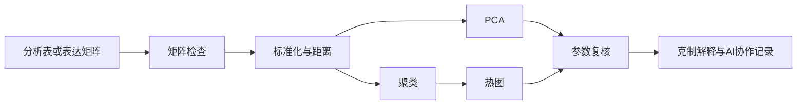
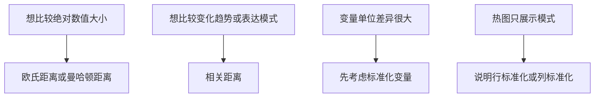
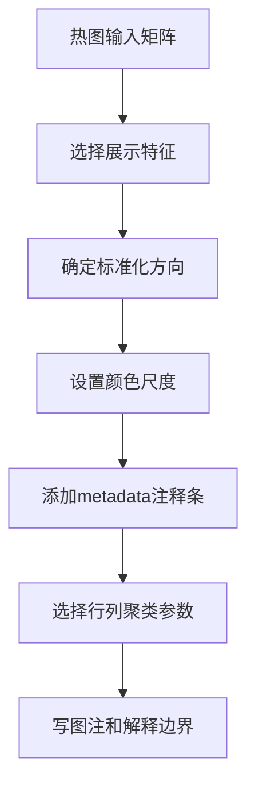
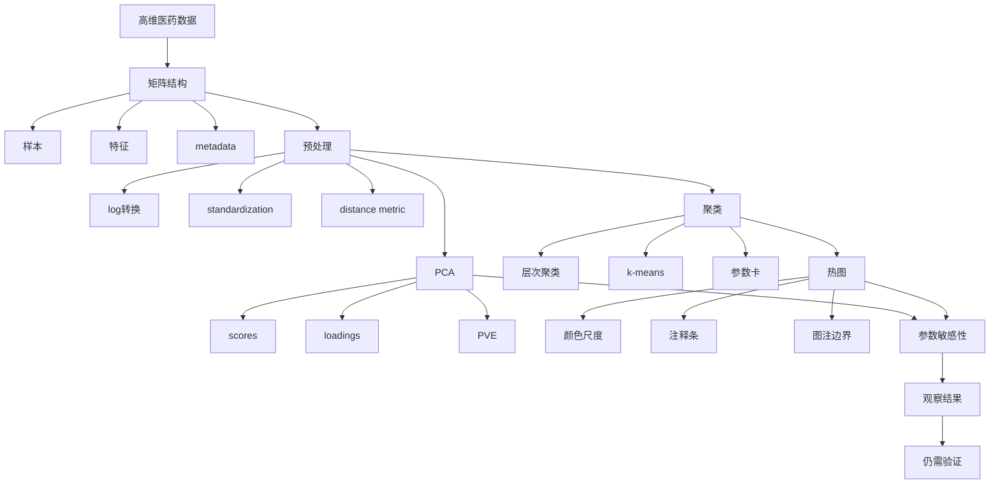

# 第11章 高维矩阵、PCA、聚类与热图

## 本章定位

从本章开始，课程进入高维医药数据。前面几章关注数据表、分组汇总、基础统计、图表契约和模型评价。本章把对象换成矩阵：一个样本不再只对应少数几个变量，而是对应成百上千个特征。

本章属于第三阶段“意图驱动协作”的起点。学生可以让 AI 辅助搭建较长的 PCA、聚类和热图代码，但必须先说明输入矩阵、metadata、分组、标准化、距离、参数、输出和解释边界。



本章不讲 FASTQ 到 count matrix 的完整链条，也不展开差异表达、火山图、功能富集、单细胞 UMAP 或细胞类型注释。这些内容留给第12章和第14章。本章只训练高维矩阵的基本读法、图表解释和参数复核。

## 学习目标

1. 学生能说明高维小样本数据的行列含义、样本数、特征数、metadata 字段和缺失处理。
2. 学生能区分 normalization 和 standardization，并能解释 log 转换、中心化、缩放和距离度量对结果的影响。
3. 学生能解读 PCA 图中的 PC1、PC2、解释比例、scores 和 loadings，并写出不越界的图注。
4. 学生能记录层次聚类和 k-means 的关键参数，包括距离、linkage、k 值、随机种子和切树规则。
5. 学生能审阅热图的行列、颜色尺度、注释条、聚类树和图注。
6. 学生能比较不同参数设置下的结果，判断哪些观察稳定，哪些观察需要进一步验证。

## 阅读指南

先看矩阵，再看图。PCA 图、聚类树和热图都只是矩阵经过特定参数处理后的输出。如果矩阵方向、样本 ID 或 metadata 对不上，后面的图再美观也不能用于解释。

本章对 PCA 和聚类只要求入门理解，不要求推导线性代数。学生需要掌握的是：输入是什么，参数是什么，图中每个元素代表什么，哪些结论不能写。

## 核心概念速查

| 概念 | 本章解释 | 常见混淆 | 需保留英文 |
| --- | --- | --- | --- |
| 矩阵 | 行列结构的数值数据对象，常用来放样本和特征 | 把任意表都叫矩阵 | matrix |
| metadata | 描述样本分组、批次、时间点、来源等信息的表 | 只看表达矩阵，不看样本信息 | metadata |
| 高维小样本 | 特征数远多于样本数的数据结构 | 以为特征越多结果越可靠 | high-dimensional small-sample data |
| 标准化 | 本章指让变量处在可比较尺度的处理 | 与 RNA-seq normalization 混用 | standardization |
| 距离度量 | 衡量两个样本或两个特征差异的规则 | 不说明距离就解释聚类 | distance metric |
| PCA | 用少数主成分概括高维数据主要变化方向 | 写成证明分组差异 | PCA |
| scores | 样本在主成分空间中的坐标 | 当成原始表达值 | scores |
| loadings | 特征对主成分方向的贡献 | 当成机制证据 | loadings |
| PVE | 主成分解释的数据变化比例 | 当成模型准确率 | proportion of variance explained |
| 聚类 | 根据相似性把样本或特征分组 | 写成已知生物类别 | clustering |
| 热图 | 用颜色展示矩阵数值模式 | 不说明颜色尺度和行列方向 | heatmap |

## 11.1 高维小样本数据的基本结构

在普通临床指标表中，一个样本可能只有年龄、性别、ALT、AST 和响应状态等少量变量。在组学或药物筛选数据中，一个样本可能对应几千个基因、蛋白、代谢物或化合物描述符。

这类数据常被整理成矩阵。矩阵的一边是样本，另一边是特征。基因表达谱材料中常见写法是“基因 × 样本”，每一行代表一个基因在不同样本中的表达水平，每一列代表一个样本的全部基因表达水平。

| 检查项 | 学生要写清 |
| --- | --- |
| 矩阵方向 | 行是样本还是特征，列是样本还是特征 |
| 样本 ID | 矩阵中的样本名是否能匹配 metadata |
| 特征 ID | 基因、蛋白、代谢物或指标名称是否唯一 |
| metadata | 分组、批次、时间点、组织来源、处理条件 |
| 数值状态 | 原始值、log 值、标准化值还是其他变换值 |
| 缺失和异常 | 缺失数量、异常观察、是否有处理记录 |

高维不等于信息充分。特征很多时，噪声、冗余特征和批次差异也会一起进入分析。样本少时，少数样本的位置变化就可能影响 PCA、聚类和热图。

本章的第一条规则是：先解释矩阵，不先解释图。没有矩阵检查表，就不能把 PCA 图、聚类树或热图写成数据结论。

**矩阵检查表模板**

| 字段 | 示例写法 |
| --- | --- |
| 数据对象 | 教学用表达矩阵，非真实医学发现 |
| 矩阵维度 | `n_samples × n_features`，具体数值需由代码输出 |
| 行含义 | 每行一个样本 |
| 列含义 | 每列一个基因或特征 |
| metadata 主键 | `sample_id` |
| 分组变量 | `group`，含义需由数据字典确认 |
| 批次变量 | `batch`，若没有需写“当前材料未提供” |
| 需人工确认 | 特征来源、单位、分组定义、许可状态 |

## 11.2 矩阵、标准化与距离度量

PCA、聚类和热图通常要求输入为数值矩阵。字符型 ID、分组标签、批次信息不能直接混入特征矩阵。它们应放在 metadata 中，用于上色、分面、注释或后续解释。

本章区分两个术语。normalization 在组学场景常指降低测序深度、总量或实验尺度差异影响。standardization 在本章主要指减均值、除标准差，让不同特征处在可比较尺度。

| 处理 | 简明解释 | 常见用途 | 核验问题 |
| --- | --- | --- | --- |
| log 转换 | 压缩大数值差异，让倍数变化更容易展示 | 表达量、强度值、偏态特征 | 是否存在 0 或负值 |
| 中心化 | 每个特征减去均值 | PCA、距离计算前处理 | 是否按列或按行中心化 |
| 缩放 | 除以标准差或范围 | 不同单位特征比较 | 是否让噪声特征权重过高 |
| 行标准化 | 每行转换到相近尺度 | 热图中比较特征模式 | 颜色不再代表原始值 |
| 列标准化 | 每列转换到相近尺度 | 比较样本或变量 | 是否改变样本总量差异 |

距离度量（distance metric）是衡量两个样本或两个特征差异的规则。欧氏距离关注数值大小差异；相关距离更关注变化模式是否相似。选择哪一种，应回到分析问题。



不同处理会给同一矩阵不同的“相似性定义”。如果两个样本在所有基因上表达量都偏高，欧氏距离可能认为它们离其他样本远；相关距离可能认为它们与表达模式相同的样本更接近。

学生不能只写“做了标准化”。至少要写清：处理对象、处理方向、函数或参数、处理前后维度、是否保存处理后矩阵、是否保留原始矩阵。

**参数记录表示例**

| 参数 | 本次设置 | 为什么这样设 | 需复核 |
| --- | --- | --- | --- |
| 输入矩阵 | `expr_matrix` | 数值型表达矩阵 | 样本 ID 是否匹配 |
| log 转换 | `log2(x + 1)` | 避免 0 值无法取 log | 是否适合该数据类型 |
| 标准化 | 按特征 z-score | 让不同特征可比较 | 是否放大低变异噪声 |
| 距离 | correlation distance | 关注表达模式 | 是否也要比较欧氏距离 |

## 11.3 PCA 的计算结果与图形解释

PCA（principal component analysis，主成分分析）用于把高维矩阵投影到少数几个新的坐标轴上。这些坐标轴称为主成分。PC1 是数据中变化最大的方向，PC2 是在与 PC1 不重复的条件下解释下一部分变化的方向。

PCA 常见输出包括 scores、loadings 和解释比例。scores 是样本在主成分空间中的坐标；loadings 是特征对主成分方向的贡献；PVE 表示每个主成分解释的数据变化比例。

| 输出 | 看什么 | 不能怎么写 |
| --- | --- | --- |
| PC1/PC2 散点图 | 样本相对位置、离群样本、分组或批次是否有结构 | 不能写成“证明两组显著不同” |
| PVE / scree plot | 每个主成分解释多少变化 | 不能当作模型准确率 |
| loadings 表 | 哪些特征对主成分贡献较大 | 不能直接写成致病基因或药物靶点 |
| 颜色分组 | 分组、批次或样本来源是否与位置相关 | 不能把颜色分离写成因果 |

PCA 对尺度敏感。如果特征单位不同或方差差别很大，不做标准化时，大方差特征可能主导主成分。ISLR 的示例用不同量纲变量说明了这一点；组学表达矩阵中是否缩放基因，也需要根据教学目标和数据特点说明理由。

**PCA 图表契约**

| 字段 | 填写要求 |
| --- | --- |
| 核心问题 | 样本在主要变化方向上是否存在可见结构 |
| 输入矩阵 | 文件名、行列含义、是否 log 转换、是否标准化 |
| 样本说明 | 样本数、分组、批次、缺失处理 |
| 视觉编码 | x=PC1，y=PC2，颜色=分组或批次 |
| 统计信息 | PC1/PC2 解释比例；不默认添加 P 值 |
| 图注边界 | 图中只展示低维投影，组间差异需另行检验 |

**图注示例**

> 图11-1. 教学表达矩阵的 PCA 展示。每个点代表一个样本，横轴和纵轴分别为 PC1 和 PC2，括号中标注对应解释比例。颜色表示 metadata 中的分组。该图用于观察样本在主要变化方向上的相对位置，不作为组间显著差异或医学机制证据。

PCA 还可以用于质量检查。若某个样本远离其他样本，应先回查样本 ID、批次、测序深度、缺失、标准化和实验记录。不要因为它“看起来离群”就直接删除。

## 11.4 聚类方法与参数选择

聚类（clustering）是无监督学习方法。它不使用已知标签来训练模型，而是根据样本或特征之间的相似性，把对象组织成若干组。

本章只要求掌握两类入门方法：层次聚类和 k-means。层次聚类常用树状图展示样本或特征如何逐步合并；k-means 需要预先给定 k 值，并把样本分配到 k 个簇。

| 方法 | 输入 | 关键参数 | 输出 | 主要风险 |
| --- | --- | --- | --- | --- |
| 层次聚类 | 距离矩阵或数值矩阵 | 距离、linkage、切树高度 | 树状图、簇标签 | 横向位置易被误读 |
| k-means | 数值矩阵或 PCA scores | k 值、随机种子、nstart | 簇标签、中心点 | k 值和初始化影响结果 |
| PCA 后聚类 | PCA scores | 主成分数量、聚类参数 | 低噪声空间中的簇 | 可能丢失后续主成分信息 |

层次聚类树的读法有一个常见误区。两个叶子在水平方向靠得近，不一定表示它们最相似。更重要的是它们在树上第一次合并的高度。合并高度低，表示距离近；合并高度高，表示差异大。

K-means 的簇编号没有固定含义。同一次分析中，簇 1、簇 2 只是算法编号，不代表“更严重”“更高级”或“真实亚型”。不同随机初始值也可能得到不同结果，所以需要设置随机种子，并用多次初始化降低局部最优风险。

**聚类参数卡**

| 参数 | 必填内容 |
| --- | --- |
| 聚类对象 | 样本还是特征 |
| 输入矩阵 | 原始矩阵、标准化矩阵还是 PCA scores |
| 特征筛选 | 全部特征、高变特征或教师指定特征 |
| 距离度量 | 欧氏、曼哈顿、相关距离或其他 |
| linkage | complete、average、single、ward 等 |
| k 值或切树规则 | 设定依据和备选值 |
| 随机种子 | k-means 或其他随机步骤需记录 |
| 复核方式 | 改变参数、重跑、比较稳定模式 |

聚类适合提出分层线索，不适合直接给出医学结论。若聚类与已知分组相近，只能写“在当前参数下，聚类结果与 metadata 中的分组有一定对应关系”。如果要写疾病亚型、治疗响应或机制，需要补充研究设计、统计检验、外部验证和生物医学证据。

## 11.5 热图、注释条与尺度说明

热图（heatmap）用颜色展示矩阵数值。它常与行聚类、列聚类和注释条一起使用，适合展示样本或特征的整体模式。

热图的第一步不是选颜色，而是说明行列。行可以是基因、蛋白、代谢物或临床指标；列可以是样本、处理条件或时间点。若行列方向没有写清，读者无法判断颜色块代表什么。

| 热图元素 | 要说明什么 | 常见问题 |
| --- | --- | --- |
| 行 | 基因、蛋白、代谢物、指标或样本 | 行标签太多且无筛选规则 |
| 列 | 样本、分组、时间点或特征 | 样本顺序被聚类改变后未说明 |
| 颜色 | 原始值、log 值、z-score 或标准化值 | 颜色越深被误写成机制越强 |
| 注释条 | 分组、批次、组织来源或处理条件 | 颜色含义和 metadata 不一致 |
| 聚类树 | 样本或特征相似性 | 未说明距离和 linkage |
| 图注 | 行列、尺度、参数和边界 | 只重复标题 |

行标准化后的热图常用于比较每个特征在不同样本之间的相对高低。此时颜色不再代表原始表达量，而代表该特征相对自身均值的偏离。正文和图注必须说清这一点。



热图最容易诱发过度解释。看到某组颜色偏高，只能说明该矩阵在该尺度下显示相对高值。不能直接写通路激活、机制成立、药物靶点明确或疾病进展加重。

**热图图注示例**

> 图11-2. 教学表达矩阵中筛选特征的聚类热图。行表示特征，列表示样本，颜色表示按行计算的 z-score。顶部注释条显示 metadata 中的分组。行列聚类使用相关距离和 average linkage。该图用于展示矩阵模式，不能单独支持通路活性、机制或临床解释。

## 11.6 参数敏感性与结果复核

高维图表不是一次运行就结束。标准化、距离、linkage、k 值、特征筛选和随机种子都会改变结果。学生需要检查主要观察是否只依赖某一种设置。

参数敏感性不是为了挑最好看的图，而是为了判断解释是否稳健。如果只有某个距离或某组筛选特征能得到“理想分组”，正文应降低语气，并记录为需进一步验证。

| 复核方向 | 建议比较 | 记录重点 |
| --- | --- | --- |
| 标准化 | 原始值、log 值、z-score | 样本位置和热图色块是否改变 |
| 距离 | 欧氏距离、相关距离 | 树状图主要分支是否稳定 |
| linkage | complete、average、ward | 聚类形状和分支高度是否改变 |
| k 值 | k=2、3、4 或教师指定范围 | 是否出现过度拆分或合并 |
| 特征筛选 | 全部特征、前若干高变特征、指定特征 | 观察是否依赖少数特征 |
| 随机种子 | 不同 seed 或多次初始化 | k-means 是否稳定 |

**参数敏感性记录模板**

| 版本 | 改动 | 稳定观察 | 变化观察 | 处理 |
| --- | --- | --- | --- | --- |
| v1 | z-score + 欧氏距离 + complete linkage | 样本 A 始终偏离主体 | 热图第二分支不稳定 | 回查样本 A，解释降级 |
| v2 | z-score + 相关距离 + average linkage | 分组颜色仍有部分聚集 | 簇数改变 | 不写固定簇数 |
| v3 | PCA 前 5 个 scores 聚类 | 批次样本更接近 | 与全矩阵聚类不同 | 标注输入差异 |

复核后仍不能把探索性观察升级成医学结论。更稳妥的写法是：“在当前教学矩阵和多个参数设置下，部分样本呈现相近的低维位置或聚类关系。该观察可作为后续检查线索，不能单独说明分组差异、机制或临床意义。”

## 案例任务

| 项目 | 内容 |
| --- | --- |
| 数据背景 | 教学用简化表达矩阵或多指标医药特征矩阵，配套 metadata。若使用模拟数据，必须标明“教学示例” |
| 任务目标 | 完成矩阵检查、标准化记录、PCA 图、聚类热图、参数敏感性复核和解释边界 |
| 操作步骤 | 核对矩阵方向；匹配 metadata；处理缺失；记录标准化和距离；绘制 PCA；绘制热图；改变参数复核；整理 AI 协作记录 |
| 交付物 | 矩阵检查表、PCA 图表契约、聚类参数卡、热图、参数敏感性记录、图注、代码、AI 协作记录 |
| 禁止事项 | 不改动原始材料；不让 AI 猜分组；不写疾病机制、治疗效果、诊断价值或临床建议 |

## 代码框架示例

以下代码只展示流程骨架。变量名、文件路径、样本数、特征数和图形结果必须由课堂数据或教师提供材料确认。

```python
import pandas as pd
from sklearn.preprocessing import StandardScaler
from sklearn.decomposition import PCA

expr = pd.read_csv("需替换为表达矩阵.csv", index_col=0)
meta = pd.read_csv("需替换为metadata.csv")

# 假设行是样本、列是特征。若不是，先转置并记录原因。
assert expr.index.is_unique
assert meta["sample_id"].is_unique
expr = expr.loc[meta["sample_id"]]

X = StandardScaler().fit_transform(expr)
pca = PCA(n_components=2)
scores = pca.fit_transform(X)

pca_table = pd.DataFrame({
    "sample_id": expr.index,
    "PC1": scores[:, 0],
    "PC2": scores[:, 1],
    "group": meta["group"].values
})
print(pca.explained_variance_ratio_)
```

```r
expr <- read.csv("需替换为表达矩阵.csv", row.names = 1, check.names = FALSE)
meta <- read.csv("需替换为metadata.csv")

# 假设行为样本，列为特征；若方向不同，先转置并记录。
stopifnot(!anyDuplicated(rownames(expr)))
stopifnot(!anyDuplicated(meta$sample_id))
expr <- expr[meta$sample_id, ]

x <- scale(expr)
pca <- prcomp(x, center = FALSE, scale. = FALSE)
head(pca$x[, 1:2])
summary(pca)$importance[, 1:2]
```

## 图表建议

| 图表 | 目的 | 必备标注 | 不可越界解释 |
| --- | --- | --- | --- |
| 高维矩阵结构图 | 展示矩阵、metadata 和输出图的关系 | 样本、特征、metadata、参数、输出 | 不替代真实数据检查 |
| PCA 散点图 | 展示样本在 PC1/PC2 空间中的位置 | 输入矩阵、标准化、PC 解释比例、颜色分组 | 不写显著分组差异 |
| PVE 折线图 | 展示各主成分解释比例 | PC 编号、PVE、累计 PVE | 不写模型准确率 |
| loading 表 | 展示对主成分贡献较大的特征 | 特征名、贡献指标、筛选规则 | 不写机制或标志物 |
| 层次聚类树 | 展示样本或特征相似性 | 距离、linkage、对象、样本范围 | 不写真实类别 |
| 聚类热图 | 展示矩阵模式、聚类和注释条 | 行列含义、颜色尺度、标准化、聚类方法 | 不写通路激活或机制成立 |
| 参数敏感性表 | 展示参数改变后的稳定性 | 参数版本、变化内容、稳定观察、变化观察 | 不写临床结论 |

## AI 协作点

| 场景 | 可让 AI 做什么 | 学生必须核验什么 |
| --- | --- | --- |
| 矩阵检查 | 根据字段生成检查清单 | 行列方向、ID 匹配、缺失和重复 |
| PCA 代码 | 生成 PCA 和绘图代码草稿 | 输入矩阵、标准化、解释比例、颜色分组 |
| 聚类代码 | 生成层次聚类或 k-means 代码 | 距离、linkage、k 值、随机种子 |
| 热图代码 | 生成热图和注释条代码 | 颜色尺度、行列标准化、注释条映射 |
| 图注润色 | 改写图注，压缩越界表述 | 是否新增样本量、统计结论或医学解释 |
| 参数复核 | 生成参数对照表模板 | 复核是否真实运行，结论是否越界 |

## 常见误区

| 误区 | 为什么错 | 如何纠正 |
| --- | --- | --- |
| 看到 PCA 分开就写“显著不同” | PCA 是探索性投影，不是组间检验 | 写“在 PC 空间中呈现分离趋势，需进一步检验” |
| 聚类编号当作真实类别 | 编号由算法生成，参数不同会变 | 写清聚类方法、参数和解释边界 |
| 热图颜色深就写机制增强 | 颜色只表示当前尺度下的数值 | 说明颜色尺度，机制解释标 `需补证据` |
| 不记录标准化方向 | 行标准化和列标准化含义不同 | 在图注和参数卡写清 |
| 让 AI 猜 metadata 含义 | AI 不能知道真实实验设计 | 回到数据字典或教师说明 |
| 删除离群样本不留记录 | 离群可能是真实生物差异或批次问题 | 先回查，再决定，保留记录 |

## 核验清单

- 已核对 `大纲.md`，第11章标题和 6 个小节未改变。
- 矩阵方向、样本 ID、特征 ID 和 metadata 已检查。
- 标准化、log 转换、缺失处理、距离和聚类参数已记录。
- PCA 图包含输入矩阵、PC 解释比例、颜色含义和图注边界。
- 聚类结果包含距离、linkage、k 值或切树规则。
- 热图包含行列含义、颜色尺度、注释条和聚类方法。
- 至少比较一组参数敏感性结果。
- AI 生成代码已经运行检查，人工修改有记录。
- 正文解释没有新增样本量、P 值、机制、疗效、诊断价值或临床建议。

## 知识结构与知识图谱生成提示词



可用于 `imagegen` 的教学展示提示词：

```text
生成一张中文教学风格的高维医药数据分析流程图。画面从左到右展示：表达矩阵和metadata、标准化与距离度量、PCA散点图、聚类树、热图、参数敏感性复核、克制解释。风格简洁，适合药学本科生教材。不要生成具体医学结论，不要出现真实患者信息。图中文字如果不清晰，以正文 Mermaid 和表格为准。
```

本章未实际调用 `imagegen`。若后续生成位图，图片只作为教学展示，准确结构以本节 Mermaid、表格和清单为准。

## 实验或作业

**任务**：给定一个教学表达矩阵和 metadata，完成 PCA、聚类热图和参数复核。

**输入**：

| 文件 | 内容 |
| --- | --- |
| `expr_matrix.csv` | 数值矩阵，需确认行列方向 |
| `metadata.csv` | `sample_id`、`group`、`batch` 等样本信息 |
| `data_dictionary.md` | 字段含义、单位、来源和需确认事项 |

**提交内容**：

1. 矩阵检查表。
2. PCA 图表契约、PCA 图和图注。
3. 聚类参数卡、热图和图注。
4. 参数敏感性记录表。
5. Python 或 R 代码。
6. AI 协作记录，包括原始提示词、AI 输出摘要、人工修改、运行结果和反思。

**评分点**：

| 维度 | 通过标准 |
| --- | --- |
| 数据结构 | 行列方向、metadata 匹配、缺失处理清楚 |
| 方法记录 | 标准化、距离、聚类和随机种子可追踪 |
| 图表规范 | PCA 图和热图有完整图注和图表契约 |
| 解释边界 | 不把探索性图形写成机制或临床结论 |
| AI 核验 | AI 代码真实运行，人工修改和仍需确认事项有记录 |

## 需补证据

| 位置 | 缺口 | 处理方式 |
| --- | --- | --- |
| 正式课堂数据集 | 当前未指定第11章统一表达矩阵或多指标矩阵文件 | 正文使用教学字段和流程，标明不代表真实医学发现 |
| 真实案例图 | 当前未生成可复现 PCA 图或热图 | 后续需补数据、脚本、图表契约和导出包 |
| 医学解释 | 当前材料不足以支持机制、疗效、诊断价值或临床建议 | 全部降级为观察或 `需补证据` |
| 软件环境 | Python/R 包版本未固定 | 后续代码输出需记录版本和随机种子 |
| 特征筛选规则 | 是否使用全部特征、高变特征或教师指定特征未确定 | 正式作业前由教师确认 |

