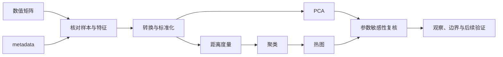
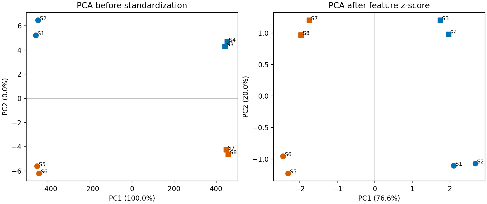
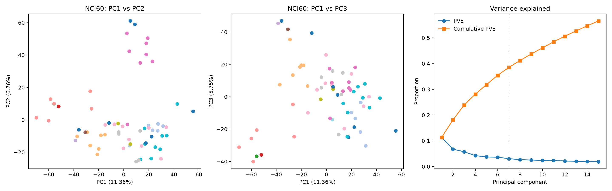
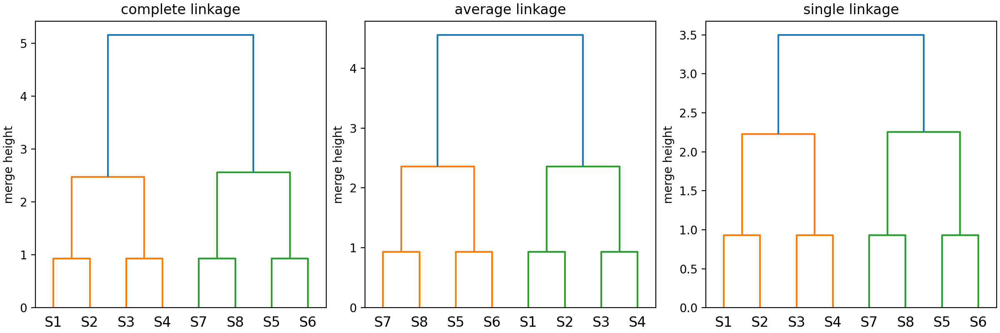
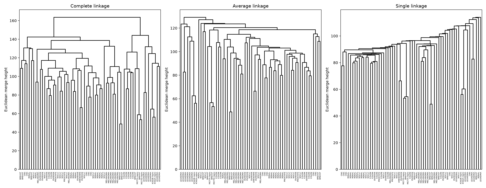
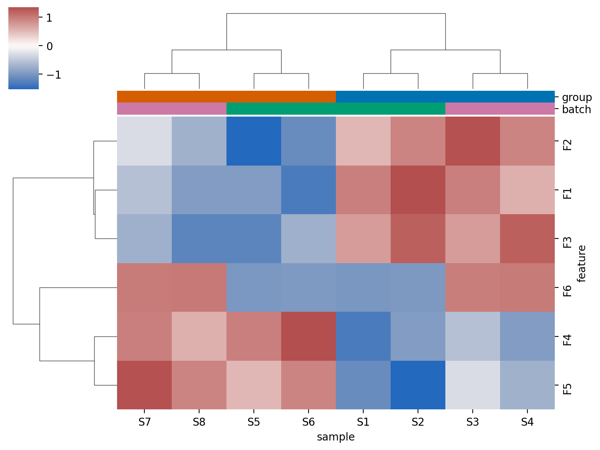
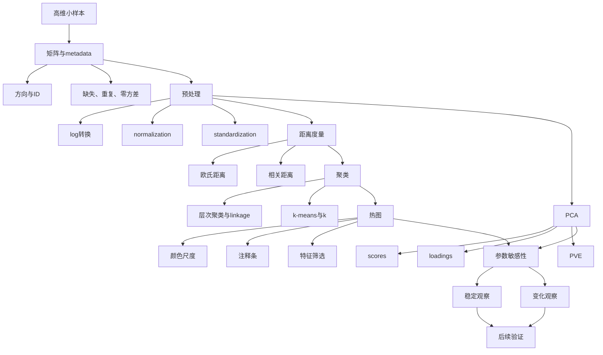

# 第11章 高维矩阵、PCA、聚类与热图

## 本章定位

前十章处理的对象多是分析表。每行对应一个样本，每列只有数量有限的变量。进入表达谱、蛋白组、代谢组或药物特征分析后，单个样本可能对应数千个特征。数据仍可写成二维表，但分析重点已经转向矩阵结构、样本间关系和高维变化方向。

第11章是第四篇的起点，也是课程进入“意图驱动协作（Vibe Coding）”的起点。学生可以让 AI 辅助生成较长的矩阵检查、PCA、聚类和热图代码，但必须先给出矩阵方向、元数据（metadata）、分组、批次、标准化、距离、输出和复核要求。



本章不讲 FASTQ 到计数矩阵的处理链，也不展开差异表达、功能富集、UMAP、marker 基因或细胞类型注释。第12章再讨论 RNA-seq 数据链条，第14章再讨论单细胞对象和图结构方法。本章只解决一个问题：拿到高维数值矩阵后，怎样得到可检查、可解释、可复核的探索性结果。

## 学习目标

完成本章后，学生应能：

1. 说明高维小样本数据中样本、特征、矩阵和元数据的关系。
2. 区分 normalization、standardization、log 转换和 z-score，并记录处理方向。
3. 根据分析问题选择欧氏距离或相关距离，说明选择带来的假设。
4. 解读 PCA 的 scores、loadings 和解释比例，不把低维分离写成统计证明。
5. 记录层次聚类和 k-means 的距离、linkage、k 值、初始化与随机种子。
6. 审阅热图的行列、颜色尺度、注释条、特征筛选和聚类参数。
7. 比较不同参数设置，区分稳定观察、变化观察和仍需验证内容。

## 阅读指南

先看输入，再看图。PCA、树状图和热图都是数值矩阵经过一组处理规则后的输出。矩阵方向错了、样本 ID 没有对齐、批次变量没有检查，图形就失去解释基础。

本章不要求推导完整线性代数。学生需要掌握四类证据：输入矩阵是什么，算法做了什么，输出数值怎样读，结果还缺哪些验证。

| 阅读对象 | 先问什么 | 再问什么 |
| --- | --- | --- |
| PCA 图 | 输入是否中心化或缩放 | PC1、PC2 各解释多少变化 |
| 树状图 | 距离和 linkage 是什么 | 分支是否随参数改变 |
| 热图 | 行列与颜色代表什么 | 标准化方向和注释条是否正确 |
| AI 代码 | AI 得到了哪些真实字段 | 代码是否运行并保存参数 |

## 本章贯穿案例

本章使用一个微型教学矩阵贯穿六节。它有 8 个样本和 6 个数值特征，规模不足以代表真实高维数据，只用于把计算步骤和输出读法讲清。`group` 与 `batch` 存在于元数据中，不参与 PCA 或聚类拟合，只在结果生成后用于着色、制表和复核。

| sample_id | group | batch | F1 | F2 | F3 | F4 | F5 | F6 |
| --- | --- | --- | ---: | ---: | ---: | ---: | ---: | ---: |
| S1 | A | B1 | 8 | 7 | 6 | 2 | 3 | 100 |
| S2 | A | B1 | 9 | 8 | 7 | 3 | 2 | 110 |
| S3 | A | B2 | 8 | 9 | 6 | 4 | 5 | 1000 |
| S4 | A | B2 | 7 | 8 | 7 | 3 | 4 | 1010 |
| S5 | B | B1 | 3 | 2 | 2 | 8 | 7 | 105 |
| S6 | B | B1 | 2 | 3 | 3 | 9 | 8 | 115 |
| S7 | B | B2 | 4 | 5 | 3 | 8 | 9 | 1005 |
| S8 | B | B2 | 3 | 4 | 2 | 7 | 8 | 1015 |

F1 至 F5 使用相近量级，F6 的数值范围大得多，并随 batch 改变。F6 不代表真实生物标志物，而是教学设置。它让学生直接观察量纲如何影响 PCA 和欧氏距离。

贯穿案例的 Python 与 R 版本均已运行。两种语言得到相同解释比例和样本几何关系，但主成分的正负号相反。这个差异不是错误，11.3 节会解释原因。

## 11.1 高维小样本数据的基本结构

### 11.1.1 怎样识别高维小样本

若样本数记为 (n)，特征数记为 (p)，高维小样本常表现为 (p\gg n)。这里的“高维”描述数据结构，不表示信息必然充分。特征增多时，冗余、噪声、缺失和多重比较问题也随之增加。

本地素材给出了多个基因表达矩阵实例。它们的共同点是特征数远多于样本数。

| 素材案例 | 样本数 | 特征数 | 本章可用信息 |
| --- | ---: | ---: | --- |
| NCI60 细胞系表达矩阵 | 64 | 6830 | 用于 PCA、层次聚类和 k-means 示例 |
| 9-Tumors 表达数据 | 60 | 5726 | 展示多类别、小样本、高维结构 |
| 11-Tumors 表达数据 | 174 | 12533 | 展示特征数明显超过样本数 |
| Prostate-Tumor 表达数据 | 102 | 10509 | 展示二分类任务也可能处于高维状态 |

这些数字来自教材素材，不是本课程新实验。NCI60 的观察单位是癌细胞系，不是患者。其他数据集在当前材料中也没有完整的数据字典、预处理记录和许可说明，因此本章不据此补写医学发现。

### 11.1.2 矩阵方向与元数据

矩阵（matrix）是行列结构的数值对象。表达谱常写成“特征 × 样本”，许多 Python 建模函数则要求“样本 × 特征”。运行前必须明确方向，必要时转置，并在分析记录中说明原因。

元数据是描述样本的表。它可以包含 `sample_id`、分组、批次、时间点、组织来源和处理条件。元数据不能混入数值特征矩阵，否则算法可能把类别编码当作连续测量值。

| 对象 | 每行 | 每列 | 主键 |
| --- | --- | --- | --- |
| 特征矩阵 | 一个样本或一个特征 | 数值特征或样本 | 样本 ID 与特征 ID |
| 元数据 | 一个样本 | 分组、批次、时间点等 | `sample_id` |
| PCA scores 表 | 一个样本 | PC1、PC2 等坐标 | `sample_id` |
| loadings 表 | 一个特征 | 各主成分载荷 | 特征 ID |

贯穿案例先把元数据与数值矩阵分开，再检查 ID、缺失和零方差特征。以下代码可以直接运行。

```python
from io import StringIO
import pandas as pd

text = """sample_id,group,batch,F1,F2,F3,F4,F5,F6
S1,A,B1,8,7,6,2,3,100
S2,A,B1,9,8,7,3,2,110
S3,A,B2,8,9,6,4,5,1000
S4,A,B2,7,8,7,3,4,1010
S5,B,B1,3,2,2,8,7,105
S6,B,B1,2,3,3,9,8,115
S7,B,B2,4,5,3,8,9,1005
S8,B,B2,3,4,2,7,8,1015
"""

data = pd.read_csv(StringIO(text)).set_index("sample_id")
metadata = data[["group", "batch"]].copy()
X = data.filter(regex=r"^F").copy()

assert X.index.is_unique
assert metadata.index.is_unique
assert X.index.equals(metadata.index)
assert X.notna().all().all()
assert (X.std(axis=0) > 0).all()

print(X.shape)
print(X.index.equals(metadata.index))
```

运行输出为：

```text
(8, 6)
True
```

这两行只证明当前对象是 8×6 数值矩阵，且元数据顺序与矩阵一致。它们没有证明分组合理，也没有证明 batch 已被控制。分组定义和实验批次仍需回到数据字典或实验记录。

### 11.1.3 矩阵检查表

| 检查项 | 检查方法 | 发现问题后怎么处理 |
| --- | --- | --- |
| 行列方向 | 查看形状、首行、首列和 ID | 转置后记录原方向与新方向 |
| 样本 ID | 检查唯一性和集合是否一致 | 列出重复、缺失和多余 ID |
| 特征 ID | 检查空值、重复名和版本后缀 | 先建立映射，不直接删名 |
| 数值类型 | 检查字符列、无穷值和缺失 | 回查来源，记录转换规则 |
| 零方差特征 | 计算每列标准差 | PCA 或 z-score 前剔除并留痕 |
| 批次与分组 | 交叉表检查是否混杂 | 在图中同时显示，必要时调整设计 |
| 重复测量 | 核对受试者或样本来源 | 保留主体 ID，避免当作独立样本 |

高维分析最常见的错误不是函数调用失败，而是输入对象含义错了。若矩阵列名和元数据样本 ID 只差一个字符，强行按位置拼接会把分组贴到错误样本上。安全做法是按主键匹配，再检查缺失和重复。

### 11.1.4 NCI60 本机复跑案例怎样进入本章

NCI60 包含 64 行和 6830 列，每行是一株癌细胞系，每列是一个基因表达特征。本机分别从 Python 的 `ISLP` 和 R 的 `ISLR` 读取数据，两个矩阵及 64 个标签逐项一致；矩阵没有缺失值或零方差特征。癌种标签不参与 PCA 和聚类拟合，只在拟合后用于交叉核对。

| 解释层级 | NCI60 案例允许怎么写 |
| --- | --- |
| 观察结果 | 本机确认矩阵规模、PVE、层次聚类结构和 k-means 对照；部分标签在聚类中集中 |
| 方法来源 | `ISLP`/`ISLR` 数据、特征标准化、PCA、层次聚类和 k-means |
| 允许解释 | 当前细胞系的表达谱存在可见结构 |
| 替代解释 | 平台、细胞培养、技术批次或少数高变特征也可能影响结构 |
| 仍需验证 | 独立数据、实验设计信息和生物学验证 |

不能把“部分同类细胞系相邻”改写成“PCA 可以诊断癌种”。NCI60 也不能代表患者队列。观察单位、实验系统和应用目的都不同。

## 11.2 矩阵、标准化与距离度量

### 11.2.1 normalization 与 standardization

本教材保留两个英文词，避免中文“标准化”覆盖不同处理。normalization 在组学章节常指降低测序深度、总量或技术尺度差异的影响。standardization 在本章主要指按特征中心化和缩放，使不同变量进入可比较的数值范围。

| 处理 | 数值操作 | 适用问题 | 必须说明的边界 |
| --- | --- | --- | --- |
| log 转换 | 如 `log2(x + 1)` | 压缩右偏的大数值范围 | 先确认 0、负值和伪计数是否合理 |
| 中心化 | 每个特征减去均值 | PCA 的常见预处理 | 说明按特征还是按样本进行 |
| z-score | 减均值后除以标准差 | 不同量纲特征的 PCA、距离和热图 | 颜色不再表示原始单位 |
| normalization | 按数据生成过程调整总体尺度 | 测序、强度或组成数据 | 方法依赖数据类型，留到第12章展开 |

对样本 (i) 的特征 (j)，按特征计算 z-score 可写为：

\[
z_{ij}=\frac{x_{ij}-\bar{x}_{j}}{s_j}
\]

其中，\(\bar{x}_{j}\) 是特征 (j) 的均值，\(s_j\) 是该特征的标准差。若 (s_j=0)，该特征无法进行 z-score，应先列入零方差检查。

标准化不是默认正确答案。若所有基因来自同一测量体系，且方差本身具有科学含义，缩放可能放大低变异噪声。NCI60 素材也明确保留了“是否缩放基因可以讨论”的空间。学生需要给出选择理由，而不是只写“按常规处理”。

### 11.2.2 距离度量定义了怎样的“相似”

欧氏距离关注数值点之间的直线距离。对两个样本 (a) 和 (b)：

\[
d_{E}(a,b)=\sqrt{\sum_{j=1}^{p}(x_{aj}-x_{bj})^2}
\]

相关距离常写为 (d_C(a,b)=1-r_{ab})，其中 (r_{ab}) 是两个样本特征向量的相关系数。它更关注变化模式，而不是整体量级。

下面三个向量给出一个可计算的小例子。P2 是 P1 的两倍，P3 的变化方向与 P1 相反。

| 对象 | T1 | T2 | T3 | T4 |
| --- | ---: | ---: | ---: | ---: |
| P1 | 1 | 2 | 3 | 4 |
| P2 | 2 | 4 | 6 | 8 |
| P3 | 4 | 3 | 2 | 1 |

```python
import numpy as np
from scipy.spatial.distance import pdist, squareform

profiles = np.array([
    [1, 2, 3, 4],
    [2, 4, 6, 8],
    [4, 3, 2, 1]
], dtype=float)

print(squareform(pdist(profiles, metric="euclidean")).round(3))
print(squareform(pdist(profiles, metric="correlation")).round(3))
```

运行结果为：

| 距离 | P1 与 P2 | P1 与 P3 | 应怎样读 |
| --- | ---: | ---: | --- |
| 欧氏距离 | 5.477 | 4.472 | P1 与 P3 的绝对数值更近 |
| 相关距离 | 0.000 | 2.000 | P1 与 P2 的变化模式相同，P3 方向相反 |

若一个向量没有变化，相关系数可能无法计算。数据包含大量常数特征、缺失或异常值时，距离结果也会失真。距离函数返回数值不等于距离选择合理。

### 11.2.3 贯穿案例中的量纲效应

贯穿案例的 F6 比其他特征大约高两个数量级。直接对原矩阵做 PCA 时，PC1 的解释比例达到 99.986%，层次聚类把 B1 与 B2 分开。此时算法主要读取了 F6 的量级和 batch 结构。

按特征进行 z-score 后，PC1 的解释比例降为 76.61%，PC2 为 19.99%。PC1 主要对应 F1 至 F5 的相反变化，PC2 的 F6 loading 为 0.908。层次聚类转而把 A 组与 B 组分开。

| 版本 | PC1 PVE | PC2 PVE | complete linkage 的两簇结构 | 允许解释 |
| --- | ---: | ---: | --- | --- |
| 原始矩阵 | 99.986% | 0.013% | B1 对 B2 | 大尺度 F6 主导结果 |
| 按特征 z-score | 76.61% | 19.99% | A 对 B | 多个特征共同进入相似性计算 |

这个结果来自教学模拟数据。它说明量纲可以改变结构，不说明真实研究中一定应该缩放。正式分析还要判断 F6 的大范围是单位差异、技术批次、真实生物变化还是记录错误。

### 11.2.4 参数记录最低要求

| 字段 | 贯穿案例写法 | 正式项目还需补什么 |
| --- | --- | --- |
| 输入对象 | 8×6 教学矩阵 | 文件名、版本、生成脚本 |
| 转换 | 未做 log 转换 | 数据类型和 0 值规则 |
| standardization | 按特征 z-score | 使用的标准差定义与软件函数 |
| 缺失处理 | 当前矩阵无缺失 | 缺失数量、机制与处理理由 |
| 距离 | 欧氏距离与相关距离对照 | 选择对应的科学问题 |
| 保存对象 | 原矩阵与 z-score 矩阵 | 校验值、输出路径和环境信息 |

## 11.3 PCA 的计算结果与图形解释

### 11.3.1 PCA 计算了什么

主成分分析（principal component analysis，PCA）寻找一组新的坐标轴。每个主成分都是原始特征的线性组合。PC1 概括数据中方差最大的方向；PC2 与 PC1 正交，并概括剩余变化中方差最大的方向。

若中心化后的矩阵记为 (X)，主成分方向记为 (w_k)，第 (k) 个主成分的 scores 可写为 (t_k=Xw_k)。本章不推导 (w_k) 的求解，只要求学生认清输入、scores、loadings 和解释比例。

| 输出 | 行代表什么 | 列代表什么 | 用途 |
| --- | --- | --- | --- |
| scores | 样本 | PC1、PC2 等 | 画样本低维位置图 |
| loadings | 特征 | 各主成分 | 查看哪些特征参与该方向 |
| PVE | 主成分 | 解释比例 | 判断每个主成分概括多少变化 |
| cumulative PVE | 主成分 | 累计解释比例 | 辅助决定查看多少个主成分 |

PVE 是 proportion of variance explained，表示主成分解释的数据方差比例。它不是分类准确率，也不是“解释了多少疾病原因”。

### 11.3.2 贯穿案例的 PCA 运行

```python
import pandas as pd
from sklearn.preprocessing import StandardScaler
from sklearn.decomposition import PCA

Z = pd.DataFrame(
    StandardScaler().fit_transform(X),
    index=X.index,
    columns=X.columns
)

pca = PCA().fit(Z)
scores = pd.DataFrame(
    pca.transform(Z)[:, :2],
    index=Z.index,
    columns=["PC1", "PC2"]
)
loadings = pd.DataFrame(
    pca.components_[:2].T,
    index=Z.columns,
    columns=["PC1", "PC2"]
)

print(pca.explained_variance_ratio_[:4].round(4))
print(scores.round(3))
print(loadings.round(3))
```

前四个主成分的解释比例为：

```text
[0.7661, 0.1999, 0.0192, 0.0105]
```

部分 scores 如下。正负号只用于定位相对方向，不代表好坏、高低或风险方向。

| 样本 | group | batch | PC1 | PC2 |
| --- | --- | --- | ---: | ---: |
| S1 | A | B1 | 2.100 | -1.106 |
| S3 | A | B2 | 1.743 | 1.206 |
| S5 | B | B1 | -2.316 | -1.227 |
| S7 | B | B2 | -1.749 | 1.204 |

PC1 的 loadings 在 F1 至 F3 上为正，在 F4、F5 上为负；PC2 主要由 F6 构成。

| 特征 | PC1 loading | PC2 loading |
| --- | ---: | ---: |
| F1 | 0.459 | 0.006 |
| F2 | 0.434 | 0.298 |
| F3 | 0.454 | 0.010 |
| F4 | -0.453 | 0.013 |
| F5 | -0.436 | 0.293 |
| F6 | -0.003 | 0.908 |

因此，贯穿案例中 PC1 主要区分 A、B 两组的特征模式，PC2 主要对应 F6 和 batch。这里使用“对应”而不是“由 batch 导致”，因为 batch 与 F6 的关系是教学设置，真实数据还需检查实验设计和其他协变量。



图11-1. 贯穿教学矩阵标准化前后的 PCA。蓝色为 A 组，橙色为 B 组；圆形为 B1，方形为 B2。左图未做特征缩放，PC1 几乎完全由 F6 的量级支配。右图按特征计算 z-score，PC1 主要呈现 group 结构，PC2 主要呈现 batch 结构。该图不包含统计检验。

### 11.3.3 主成分正负号为什么可能相反

同一主成分方向乘以 (-1) 后仍表示同一条轴。Python 运行中 A 组位于 PC1 正方向，R 的 `prcomp()` 运行中 A 组位于 PC1 负方向；两边的 loadings 也同时反号。PVE、样本间距离和相对位置没有改变。

| 比较项 | Python | R | 是否矛盾 |
| --- | --- | --- | --- |
| scaled PC1 PVE | 76.61% | 76.61% | 否 |
| A 组 PC1 方向 | 正 | 负 | 否，整条轴反向 |
| F1 PC1 loading | 0.459 | -0.459 | 否，scores 同步反向 |
| 样本间几何关系 | A 与 B 分开 | A 与 B 分开 | 一致 |

学生比较不同软件结果时，不应要求主成分符号逐项相同。正确的核验对象是解释比例、样本间相对位置、loadings 的整体方向和分析参数。

### 11.3.4 NCI60 的 PCA 结果

本机按素材流程对 6830 个特征做 z-score，再运行 PCA。下面的代码不把癌种标签传入 `fit_transform()`，标签只用于后续着色和核对。

```python
import numpy as np
from ISLP import load_data
from sklearn.decomposition import PCA
from sklearn.preprocessing import StandardScaler

nci60 = load_data("NCI60")
nci_X = np.asarray(nci60["data"], dtype=float)
nci_scaled = StandardScaler().fit_transform(nci_X)
pca = PCA().fit(nci_scaled)

print(nci_X.shape)
print(np.round(pca.explained_variance_ratio_[:3], 8))
print(round(pca.explained_variance_ratio_[:7].sum(), 8))
```

| 本机输出 | 数值 |
| --- | ---: |
| 矩阵规模 | 64 × 6830 |
| PC1 PVE | 0.11358942 |
| PC2 PVE | 0.06756203 |
| PC3 PVE | 0.05751842 |
| 前 7 个 PC 累计 PVE | 0.38534366 |

Python 冻结环境、Python 当前环境和 R 的 PVE 最大绝对差小于 (2.1\times10^{-16})。素材中的 11.4%、6.76%、5.75% 和“前 7 个约 40%”由此得到本机复现；其中“约 40%”对应精确值 38.53%。



图11-2. NCI60 标准化表达矩阵的 PC1-PC2、PC1-PC3 和 PVE。本图颜色来自既有癌种标签，但标签未参与 PCA 拟合。图中相邻关系只描述细胞系表达谱，不表示诊断性能。

| 观察 | 怎样解释 | 不能怎么写 |
| --- | --- | --- |
| 单个 PC 的 PVE 不高 | 变化分散在多个方向 | PCA 失败或数据无结构 |
| 同类细胞系常在前几个 PC 中相邻 | 表达谱模式存在一定对应 | PCA 证明癌种分类正确 |
| 前 7 个 PC 累计 38.53% | 少数 PC 只保留部分信息 | 前 7 个 PC 包含全部生物信息 |
| labels 未参与拟合 | 方法是无监督探索 | 结果完全不受研究设计影响 |

真实高维数据的前两个主成分很少覆盖全部变化。只展示 PC1 与 PC2 时，图注应报告两轴 PVE，并承认其他主成分仍包含信息。

### 11.3.5 PCA 图怎样读

| 检查顺序 | 要回答的问题 |
| --- | --- |
| 1. 输入 | 行是样本吗，是否 log 转换、中心化或缩放 |
| 2. 坐标 | 横纵轴是否写出 PC 编号和 PVE |
| 3. 点 | 每个点代表样本、细胞还是其他对象 |
| 4. 元数据 | 颜色、形状是否来自真实字段，是否存在批次混杂 |
| 5. 离群 | 可疑样本是否回查 ID、缺失、实验记录和测量质量 |
| 6. loadings | 高载荷特征是否来自少数单位、异常值或技术因素 |

PCA 图上两组点看似分开，只能写成“在当前预处理和前两个主成分下，样本呈现分离”。若要讨论组间差异，还需结合实验设计、统计推断和批次检查。

## 11.4 聚类方法与参数选择

### 11.4.1 聚类输出不是已知标签

聚类（clustering）根据相似性组织样本或特征。算法不需要预先提供 `group`，因此属于无监督方法。分析完成后可以把簇标签与元数据交叉制表，但不能把元数据放进输入特征。

聚类编号只标识算法输出。簇 1 不比簇 2 更严重，也不代表固定生物类别。重新运行后编号可能交换，而样本分组关系保持不变。

| 对象 | 可以做什么 | 不能替代什么 |
| --- | --- | --- |
| 样本聚类 | 检查样本关系、批次和异常模式 | 诊断、分型或疗效判断 |
| 特征聚类 | 组织相似变化模式 | 通路分析或机制验证 |
| 元数据对照 | 查看簇与已知变量是否对应 | 把对应关系写成因果 |

### 11.4.2 层次聚类与 linkage

层次聚类先计算对象间距离，再逐步合并最近的簇。树状图中，两个分支第一次合并的高度表示它们在当前规则下的差异。叶子在水平方向的位置可以旋转，不能用横向间隔判断远近。

| linkage | 两个簇之间怎样计算差异 | 常见表现 | 使用边界 |
| --- | --- | --- | --- |
| single | 取最近对象对 | 容易形成链状分支 | 对噪声和桥接点敏感 |
| complete | 取最远对象对 | 簇较紧凑 | 可能受离群点影响 |
| average | 取对象对平均距离 | 介于 single 与 complete 之间 | 仍依赖距离定义 |
| Ward | 选择使簇内平方和增加较小的合并 | 常形成大小较均衡的簇 | 通常与欧氏距离配合，不与任意距离混用 |

贯穿案例在特征 z-score 后，用欧氏距离分别运行三种 linkage。

```python
from scipy.spatial.distance import pdist
from scipy.cluster.hierarchy import linkage, fcluster

dist_z = pdist(Z, metric="euclidean")

for method in ["complete", "average", "single"]:
    tree = linkage(dist_z, method=method)
    labels = fcluster(tree, t=2, criterion="maxclust")
    print(method, dict(zip(Z.index, labels)))
```

三种方法在这个结构清楚的小数据中都把 S1 至 S4 与 S5 至 S8 分开，但合并高度和叶序不同。结果一致只说明当前案例较简单，不能推导三种 linkage 在真实数据中总会一致。



图11-3. 贯穿教学矩阵在特征 z-score 和欧氏距离下的层次聚类。complete、average 和 single linkage 得到相同的两大组，但合并高度与叶序不同。树状图只表达当前距离和 linkage 下的层次关系。

### 11.4.3 k-means 的 k 与初始化

k-means 需要预先指定簇数 (k)。算法通过迭代降低簇内平方和，但不同初始中心可能到达不同局部结果。应设置随机种子，并用多次初始化，如 `n_init=20` 或 R 中的 `nstart=20`。

```python
from sklearn.cluster import KMeans

for k in [2, 3]:
    fit = KMeans(n_clusters=k, random_state=42, n_init=20).fit(Z)
    print(k, dict(zip(Z.index, fit.labels_ + 1)))
```

Python 运行结果为：

| k | 聚类结果 | 解释 |
| ---: | --- | --- |
| 2 | S1-S4 为一簇，S5-S8 为一簇 | 与 group 对应，但 group 未参与拟合 |
| 3 | S1-S2、S3-S4、S5-S8 分为三簇 | 强制增加一个簇后，A 组按 batch 被拆开 |

R 对同一 z-score 矩阵运行 `kmeans(..., centers=3, nstart=20)` 时，A 组保持一簇，B 组按 batch 被拆开。这个对称案例允许两种三簇划分。它说明 (k=3) 的额外分支不稳定，不能挑选更符合预期的一次作为“真实亚型”。

### 11.4.4 NCI60 的聚类对照

本机在标准化矩阵上使用欧氏距离，分别运行 complete、average 和 single linkage。把三棵树都切成 4 簇后，簇规模如下。簇编号可以交换，因此表中只比较规模和成员关系。

| linkage | 4 个簇的样本数 | 运行观察 |
| --- | --- | --- |
| complete | 40、9、8、7 | 当前切树位置相对均衡 |
| average | 54、8、1、1 | 出现两个单样本簇 |
| single | 61、1、1、1 | 链化最明显 |



图11-4. NCI60 标准化表达矩阵在欧氏距离下的 complete、average 和 single linkage。single linkage 的长链结构最明显；average 在切成 4 簇时也产生单样本簇，不能把某种 linkage 预设为总会给出均衡结果。

在 ISLP v1 冻结环境中，complete linkage 切 4 簇与 `KMeans(n_clusters=4, random_state=0, n_init=20)` 的本机交叉表如下，和教材素材一致。

| complete linkage \ k-means | 0 | 1 | 2 | 3 |
| ---: | ---: | ---: | ---: | ---: |
| 0 | 28 | 3 | 9 | 0 |
| 1 | 7 | 0 | 0 | 0 |
| 2 | 0 | 0 | 0 | 8 |
| 3 | 0 | 9 | 0 | 0 |

表中一个 k-means 簇与一个层次聚类簇完全对应，其他成员分配不同。R 复跑得到相同结论，簇编号顺序不同。把输入改为前 5 个 PCA scores 后，complete linkage 与全矩阵结果的调整 Rand 指数为 0.270；该指标只概括两种成员分配的一致程度，不表示生物学准确性。

| 参数变化 | NCI60 中观察到什么 | 本章教学含义 |
| --- | --- | --- |
| linkage 改变 | k=4 时簇规模由 40/9/8/7 变到 61/1/1/1 | linkage 必须记录并复核 |
| 层次聚类与 k-means | 相同簇数仍有不同成员 | 方法名称不是可互换标签 |
| 全矩阵与前 5 个 PC | 调整 Rand 指数为 0.270 | PCA 可能降低噪声，也会改变输入信息 |

NCI60 中白血病细胞系在某个层次聚类簇中集中，而乳腺癌细胞系分布在多个簇。这个观察说明表达结构和已有标签并非一一对应，不能据此评价临床分类性能。

### 11.4.5 聚类参数卡

| 字段 | 贯穿案例 | 正式分析要求 |
| --- | --- | --- |
| 聚类对象 | 8 个样本 | 写清样本、特征或 PCA scores |
| 输入 | 特征 z-score 矩阵 | 保存输入矩阵及生成脚本 |
| 距离 | 欧氏距离，另做相关距离复核 | 说明对应绝对量级还是模式 |
| linkage | complete、average、single 对照 | 给出主要结果和敏感性结果 |
| k 值 | 2 与 3 | 说明候选范围和选择依据 |
| 随机性 | `random_state=42`，`n_init=20` | 记录软件、版本、seed 和初始化次数 |
| 外部标签 | group、batch 仅用于事后对照 | 不能混入无监督输入 |

## 11.5 热图、注释条与尺度说明

### 11.5.1 热图先说明行、列和颜色

热图（heatmap）用颜色编码矩阵数值。它常把行或列重新排序，并在两侧加入聚类树。读者只有知道行、列、颜色和排序规则，才能判断色块代表什么。

| 元素 | 贯穿案例 | 图注必须写明 |
| --- | --- | --- |
| 行 | F1-F6 | 特征类型和筛选规则 |
| 列 | S1-S8 | 样本范围和缺失处理 |
| 颜色 | 按特征计算的 z-score | 0 的含义、色带范围、是否截断 |
| 顶部注释条 | group 与 batch | 字段来源和颜色映射 |
| 行列树 | 欧氏距离、average linkage | 聚类对象、距离和 linkage |

贯穿案例把样本×特征的 z-score 矩阵转置为特征×样本后绘图。颜色表示某个特征在各样本中的相对高低，不再保留原单位。

```python
import pandas as pd
import seaborn as sns

group_colors = metadata["group"].map({"A": "#0072B2", "B": "#D55E00"})
batch_colors = metadata["batch"].map({"B1": "#009E73", "B2": "#CC79A7"})
annotations = pd.DataFrame({
    "group": group_colors,
    "batch": batch_colors
})

g = sns.clustermap(
    Z.T,
    method="average",
    metric="euclidean",
    cmap="vlag",
    center=0,
    col_colors=annotations
)
```



图11-5. 贯穿教学矩阵的聚类热图。行是特征，列是样本，颜色表示按特征计算的 z-score。顶部两条注释分别表示 group 和 batch。average linkage 与欧氏距离用于行列聚类。该图显示 F1-F3 与 F4-F5 的相反模式，F6 更接近 batch 结构；这些模式不代表生物通路或医学机制。

### 11.5.2 行标准化和列标准化不能只看函数参数

“按行”或“按列”取决于传给函数的矩阵方向。若先转置，原来的特征列会变成行。图注应写“按特征计算 z-score”或“按样本计算 z-score”，不要只写 `scale="row"`。

OSTA 素材在一个转置后的平均表达矩阵上使用 `pheatmap(..., scale="column")`。这个参数只有和当时矩阵的行列含义一起读才有意义。本章借用的是检查原则，不引入该空间组学案例的生物解释。

| 目标 | 处理方向 | 颜色回答的问题 |
| --- | --- | --- |
| 比较每个特征在样本间的相对高低 | 按特征 z-score | 某样本对该特征是否高于特征均值 |
| 比较每个样本内部的特征构成 | 按样本缩放 | 某特征在该样本内部是否相对较高 |
| 保留可解释单位 | 不做 z-score | 颜色对应原始值或已说明的变换值 |

### 11.5.3 特征筛选和标签规则

真实矩阵可能有数千行，不能把所有标签堆进一张热图。筛选规则应在作图前确定，例如高变特征、教师指定特征或预先登记的功能集合。不能看完图后只保留支持预期解释的基因。

| 可接受规则 | 需要记录 | 风险 |
| --- | --- | --- |
| 前 (m) 个高变特征 | 方差算法、(m)、缺失处理 | 高方差可能来自批次或异常值 |
| 预先指定特征集 | 来源、版本、选择时间 | 可能遗漏未预期模式 |
| PCA 高绝对 loading 特征 | PC、阈值、正负方向 | loading 不是机制证据 |
| 随机抽样用于教学 | seed、抽样范围 | 只适合版面演示 |

颜色范围也会影响视觉判断。若将 z-score 截断在 ([-2,2])，超过范围的值会显示为同一端颜色。图注应说明截断规则，源数据仍保留未截断数值。

### 11.5.4 热图审阅卡

| 核验问题 | 合格写法 |
| --- | --- |
| 行和列是什么 | “行是 6 个教学特征，列是 8 个样本” |
| 颜色是什么 | “按特征计算的 z-score，0 表示特征均值” |
| 注释条来自哪里 | “group 与 batch 来自元数据” |
| 聚类参数是什么 | “欧氏距离，average linkage” |
| 特征怎样选 | “本例展示全部 6 个特征；未做结果后筛选” |
| 图能支持什么 | “当前尺度下存在相对高低模式” |
| 图不能支持什么 | “不能单独证明通路激活、机制或临床分层” |

## 11.6 参数敏感性与结果复核

### 11.6.1 复核的目标

参数敏感性指结果随预处理、距离、特征集合、聚类方法、簇数或随机初始化而变化的程度。复核的目标是找出结论依赖哪些选择，不是从多个版本中挑一张最接近预期的图。

贯穿案例已经产生一个清楚的敏感性结果：不缩放时，F6 和 batch 主导；缩放后，多个特征共同决定 PC1，group 成为主要结构。换成 (k=3) 后，算法还会强制拆出一个不稳定的子簇。

| 版本 | 参数 | 稳定观察 | 变化观察 | 处理 |
| --- | --- | --- | --- | --- |
| v1 | 原始矩阵、欧氏距离、complete | B1 内样本相近，B2 内样本相近 | 两大簇按 batch 分开 | 不能写 group 结构，先处理量纲问题 |
| v2 | 特征 z-score、欧氏距离、complete | A 与 B 分开 | batch 转移到 PC2 | 记录标准化对解释的影响 |
| v3 | 特征 z-score、欧氏距离、average/single | 两大组仍为 A 与 B | 叶序和合并高度改变 | 不用叶序解释远近 |
| v4 | 特征 z-score、k-means，k=2 | A 与 B 分开 | 簇编号可交换 | 用成员关系而非编号比较 |
| v5 | 特征 z-score、k-means，k=3 | 原来的两大组仍可辨认 | Python 与 R 拆分不同组 | 额外第三簇不稳定，解释降级 |

NCI60 本机复跑还显示，固定随机种子不能消除软件版本差异。PCA 和 complete linkage 在三套环境中一致，但 k-means 到达了不同局部解。

| 环境 | PCA 与 complete linkage | k=4 的簇规模 | 与教材 Python 交叉表 |
| --- | --- | --- | --- |
| Python 3.9.25，ISLP 0.3.17，scikit-learn 1.2.2 | 一致 | 35、12、9、8 | 一致 |
| Python 3.13.13，ISLP 0.4.1，scikit-learn 1.9.0 | 一致 | 27、19、9、9 | 不一致 |
| R 4.6.0，ISLR 1.4 | 一致 | 27、20、9、8 | 方法结论一致，编号不同 |

这组结果不是让学生选择“最接近教材”的输出，而是说明复现记录必须包括 Python/R 版本、包版本、随机种子和初始化次数。若更换环境，应重新保存成员分配和交叉表。

### 11.6.2 敏感性代码不应自动选择“最好”版本

```python
from scipy.cluster.hierarchy import linkage, fcluster
from scipy.spatial.distance import pdist

results = []
for data_name, matrix in {"raw": X, "zscore": Z}.items():
    for metric in ["euclidean", "correlation"]:
        for method in ["complete", "average", "single"]:
            tree = linkage(pdist(matrix, metric=metric), method=method)
            cluster = fcluster(tree, t=2, criterion="maxclust")
            results.append({
                "data": data_name,
                "distance": metric,
                "linkage": method,
                "clusters": dict(zip(matrix.index, cluster))
            })
```

这段代码保存每个版本的成员分配，不按 group 一致率自动挑选结果。若用已知标签决定无监督参数，探索与验证会混在一起。课堂可以比较标签对应情况，但必须说明标签是在拟合后用于复核。

### 11.6.3 稳定性仍不等于真实性

某个结构在多组参数下重复出现，说明它不完全依赖单一设置。它仍可能来自批次、样本组成、重复测量、平台差异或共同的预处理偏差。

| 证据层级 | 可以写的句子 |
| --- | --- |
| 单一参数下出现 | “当前设置下观察到……” |
| 多组参数下重复 | “该结构在本次敏感性分析中相对稳定……” |
| 与元数据对应 | “该结构与已记录分组存在一定对应……” |
| 有独立数据复现 | “该结构在独立数据中得到支持……” |
| 有实验或临床验证 | 依据验证设计决定是否升级主张 |

本章只到前三层。独立数据、实验验证和临床评价超出当前材料，相关位置应标 `需补证据`。

### 11.6.4 高维结果复核清单

1. 保存原矩阵、处理后矩阵和元数据，不覆盖原始对象。
2. 记录矩阵方向、ID 对齐、缺失、零方差和特征筛选。
3. 记录 log 转换、normalization、standardization 及处理方向。
4. 记录 PCA 的 PVE、scores、loadings 和绘图字段。
5. 记录距离、linkage、k、seed、初始化次数和切树规则。
6. 比较至少两组参数，分别写稳定观察和变化观察。
7. 保存代码、源数据、图、图注、环境信息和 AI 协作记录。

## Python 与 R 的最小复现对照

R 可以用基础函数复现同一分析。以下代码假设已经按贯穿案例读入 `x` 和 `meta`。

```r
stopifnot(!anyDuplicated(rownames(x)))
stopifnot(identical(rownames(x), rownames(meta)))
stopifnot(!anyNA(x))

z <- scale(x)
pca_raw <- prcomp(x, center = TRUE, scale. = FALSE)
pca_z <- prcomp(z, center = FALSE, scale. = FALSE)

round(pca_raw$sdev^2 / sum(pca_raw$sdev^2), 4)
round(pca_z$sdev^2 / sum(pca_z$sdev^2), 4)
round(pca_z$x[, 1:2], 3)
round(pca_z$rotation[, 1:2], 3)

hc <- hclust(dist(z), method = "complete")
cutree(hc, k = 2)

set.seed(42)
kmeans(z, centers = 2, nstart = 20)$cluster

heatmap(t(z), scale = "none",
        col = hcl.colors(80, "Blue-Red 3"))
```

R 的 scaled PVE 同样为 0.7661、0.1999、0.0192 和 0.0105。PCA 轴的正负号与 Python 相反，complete linkage 的两簇和 (k=2) 的 k-means 成员关系一致。

## 案例任务

| 项目 | 内容 |
| --- | --- |
| 数据背景 | 8×6 教学模拟矩阵，另配 group 与 batch；不代表真实医学发现 |
| 核心问题 | 量纲和参数怎样改变 PCA、聚类与热图 |
| 操作顺序 | 矩阵检查、z-score、距离、PCA、层次聚类、k-means、热图、敏感性复核 |
| 交付物 | 检查表、PCA 图与图注、聚类参数卡、热图、敏感性表、代码和 AI 协作记录 |
| 解释边界 | 只解释教学矩阵中的数值结构，不写机制、疗效、诊断或临床建议 |

## AI 任务说明书

学生向 AI 请求代码时，应把输入和验收条件写完整。下面用五项骨架呈现：矩阵和元数据输入归入上下文，参数与禁止事项归入约束，人工验收条件归入验证，文件与图表格式归入输出。

```text
目标：对一个样本×特征数值矩阵完成矩阵检查、特征z-score、PCA、层次聚类、k-means和聚类热图。

上下文：
- expr 行为样本，列为数值特征；样本ID在行名。
- metadata 以 sample_id 为主键，包含 group 和 batch。
- group 和 batch 只用于结果着色和复核，不进入无监督拟合。

约束：
- 不猜测字段含义，不自动删除离群样本。
- 记录标准化方向、距离、linkage、k、seed和初始化次数。
- 输出中不生成疾病机制、疗效、诊断或临床建议。

验证：
- 检查ID唯一且一一匹配、无缺失、无零方差特征。
- 报告PCA解释比例并保存scores与loadings。
- 比较原始值与z-score、欧氏距离与相关距离、至少两种linkage。
- 运行代码后打印矩阵维度、关键参数和簇成员。

输出：
- 可运行代码、参数表、PCA图、热图、敏感性结果表和需人工确认项。
```

AI 可以生成代码框架，也可以解释报错。学生必须运行代码，核对对象维度和参数，并检查 AI 是否把元数据混进特征矩阵、把 PCA 分离写成显著差异，或把热图色块写成医学机制。

## 常见误区

| 误区 | 问题在哪里 | 改法 |
| --- | --- | --- |
| 把特征多写成证据强 | 高维可能同时增加噪声和偶然结构 | 报告 (n)、(p) 和验证范围 |
| 不说明矩阵方向 | 同一函数可能要求相反方向 | 在代码前写清样本和特征所在维度 |
| 把 normalization 与 z-score 混用 | 两者处理目标不同 | 保留英文词并说明具体运算 |
| PCA 两组分开就写显著 | PCA 没有完成组间假设检验 | 写低维位置观察，统计检验另做 |
| loading 高就写关键基因 | loading 只表示对主成分方向的贡献 | 回查单位、异常和独立证据 |
| 用树状图横向距离判断相似 | 叶子位置可以旋转 | 读取第一次合并的高度 |
| 把簇编号当严重程度 | 编号可交换且无顺序含义 | 比较成员关系，不解释编号大小 |
| 只展示最符合预期的参数 | 形成选择性报告 | 保存并报告敏感性对照 |
| 热图颜色深就写通路激活 | 颜色只编码当前矩阵数值 | 补通路分析和独立证据，当前标 `需补证据` |

## 本章知识结构



## 知识图谱生成提示词

```text
请依据下面的准确关系生成“第11章 高维矩阵、PCA、聚类与热图”知识图谱：

1. 高维小样本包含样本、特征、数值矩阵和metadata。
2. 矩阵检查包括方向、样本ID、特征ID、缺失、重复、零方差、批次和重复测量。
3. 预处理包括log转换、normalization和standardization，三者不可混用。
4. 距离度量连接矩阵与聚类；欧氏距离关注数值差异，相关距离关注模式相似。
5. PCA输出scores、loadings和PVE；PCA图是探索性投影，不是组间显著性检验。
6. 聚类包括层次聚类和k-means；结果受距离、linkage、k值、初始化和特征集合影响。
7. 热图必须连接行列含义、颜色尺度、标准化方向、注释条和聚类参数。
8. 参数敏感性比较稳定观察与变化观察，两者都指向后续验证。
9. 禁止把PCA分离、聚类分支或热图色块直接连接到机制、疗效、诊断或临床建议。

输出要求：使用中文节点；保留metadata、normalization、standardization、scores、loadings、PVE、linkage和k-means；同时输出Mermaid代码和节点清单。若生成位图，位图只作教学展示，准确关系以Mermaid和节点清单为准。
```

## 实验或作业

### 基础任务

运行贯穿案例，提交矩阵检查表、标准化前后 PCA、complete linkage 树状图、(k=2) 的 k-means、聚类热图和参数敏感性表。正文解释不超过 500 字，必须区分 group 与 batch。

### 进阶任务

教师提供airway前500高变基因rlog矩阵和样本元数据。学生比较两种距离和两种linkage，并说明哪些样本关系稳定；如另用模拟数据，须在图题、代码和报告中标明。

### 评分证据

| 维度 | 通过标准 |
| --- | --- |
| 数据结构 | 行列、ID、元数据、缺失和零方差检查完整 |
| 参数记录 | 转换、距离、linkage、k 和 seed 可追踪 |
| 代码复现 | Python 或 R 能从头运行，关键输出与报告一致 |
| 图表表达 | PCA 和热图包含必要标注、图注和源数据 |
| 敏感性 | 同时报告稳定观察和变化观察 |
| 解释边界 | 不新增机制、疗效、诊断或临床建议 |
| AI 协作 | 保留提示词、AI 输出摘要、人工修改和运行结果 |

## 核验清单

- [ ] 第11章标题和 11.1 至 11.6 与根目录 `大纲.md` 一致。
- [ ] 矩阵方向、样本 ID、特征 ID 和元数据已核对。
- [ ] 缺失、重复、零方差、批次和重复测量已检查。
- [ ] log 转换、normalization 与 standardization 没有混写。
- [ ] PCA 图报告 PVE，scores 与 loadings 的对象含义正确。
- [ ] PCA 的符号差异没有被误判为软件结果矛盾。
- [ ] 聚类记录距离、linkage、k、seed 和初始化次数。
- [ ] 热图说明行列、颜色尺度、注释条和特征筛选规则。
- [ ] 至少比较两组参数，并报告不一致结果。
- [ ] AI 代码已经真实运行，输出与正文数值一致。
- [ ] 观察、方法、允许解释、替代解释和仍需验证内容已经分开。

## 需补证据

NCI60 的本机复跑已完成，不再列为证据缺口。下面仍需在正式授课或正式分析前确认。

| 位置 | 当前缺口 | 正文处理 |
| --- | --- | --- |
| 正式课堂数据集 | 已指定airway前500高变基因rlog矩阵、metadata和数据字典 | 使用固定脚本与provenance记录复现 |
| 课堂软件环境 | Python/R 包版本尚未固定 | 本轮运行记录保存当前版本，正式开课前再锁定 |
| 特征筛选规则 | rlog矩阵跨8样本方差降序、Ensembl ID升序打破并列，固定前500个 | 不把该教学规则写成通用生物学筛选标准 |
| 医学解释 | 当前案例不能支持机制、疗效、诊断或临床建议 | 保持探索性表述，相关主张标 `需补证据` |

## 统一课程融合接口

本章统一使用`normalized_top500_variable_genes.csv`。矩阵由airway计数在设计`~ cell + dex`下进行`rlog(blind = FALSE)`变换，再按8个样本的方差降序选择500个基因；并列时按Ensembl ID升序。该规则服务课堂复现，不是通用特征选择标准。

| 分析 | AI可建议 | 人工核验 | 敏感性检查 |
| --- | --- | --- | --- |
| PCA | 中心化、展示主成分和标签 | 行列方向、方差比例、处理和细胞系编码 | 改变基因集合与盲化设置后结构是否稳定 |
| 距离 | 欧氏距离或相关距离 | 输入是否已变换、距离回答的是样本还是基因 | 比较两种距离的样本邻近关系 |
| 聚类 | linkage和簇数 | 参数、标签及树的切割方式 | 改变距离和连接方法 |
| 热图 | 行尺度、颜色和注释条 | 原始值或z-score、缺失、截断和样本顺序 | 比较缩放与未缩放结果 |

学生需分别记录稳定结构和参数敏感结构。若PCA中处理组出现分离，只能报告在所用矩阵和参数下观察到的样本结构，并同时检查细胞系；不能把分离直接写成药物机制。
