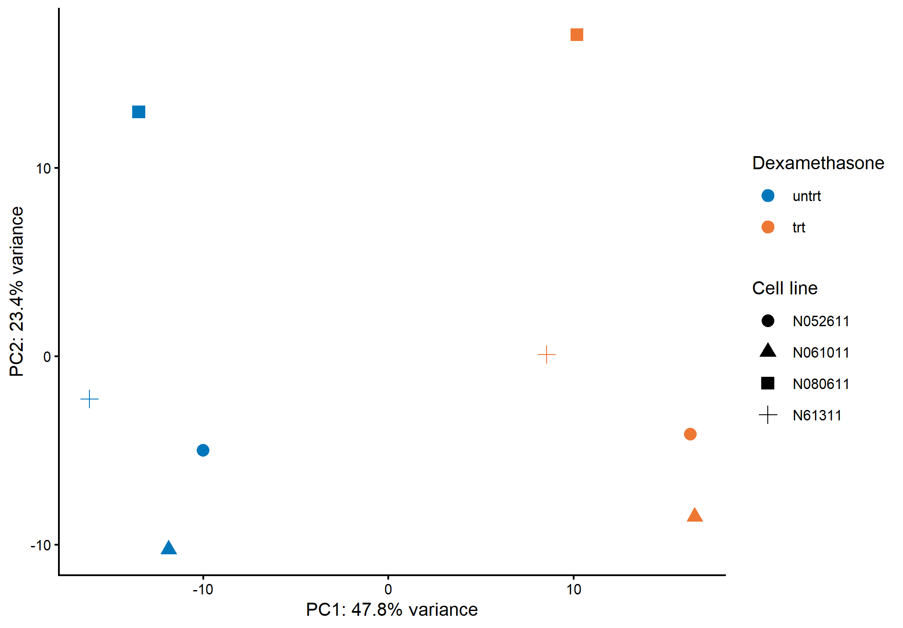
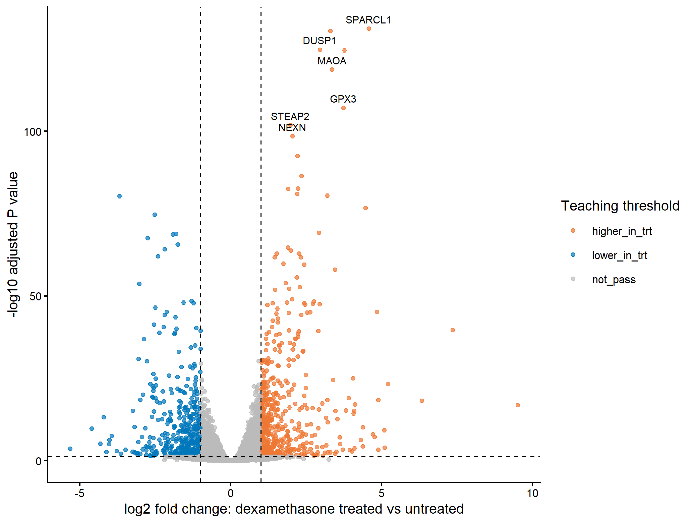
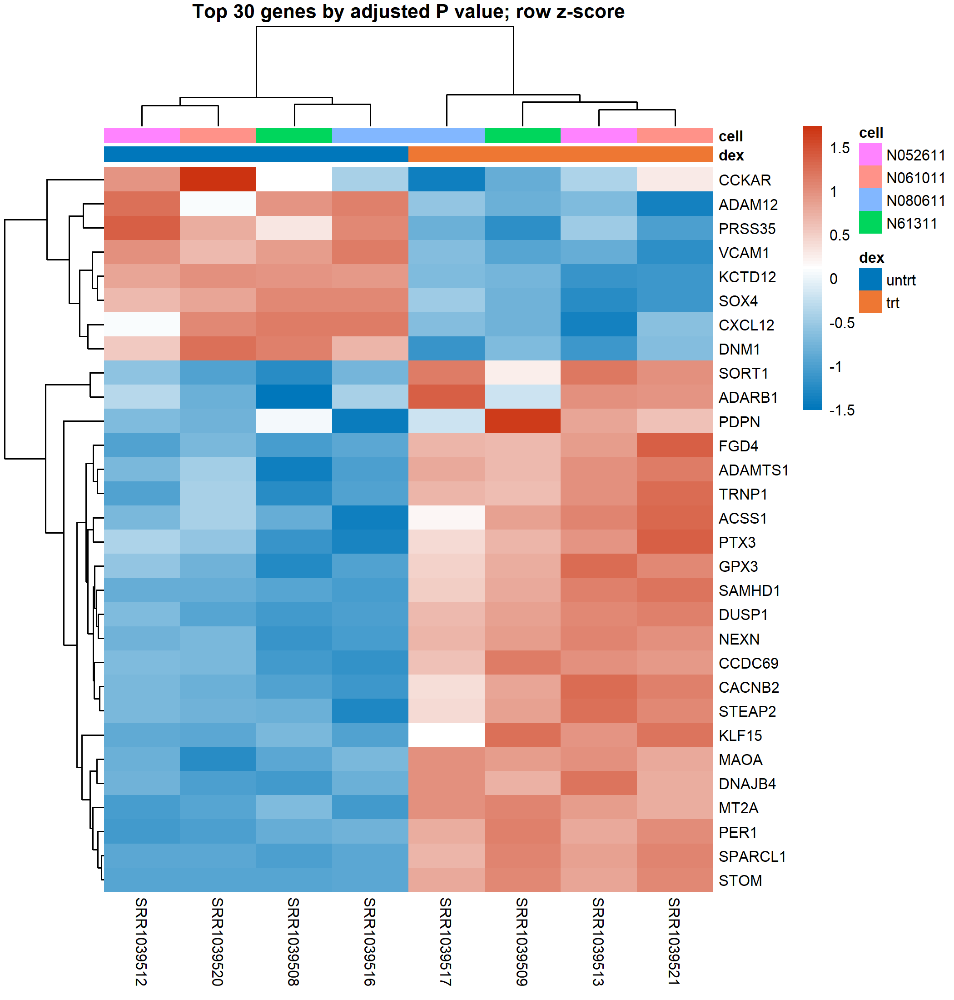
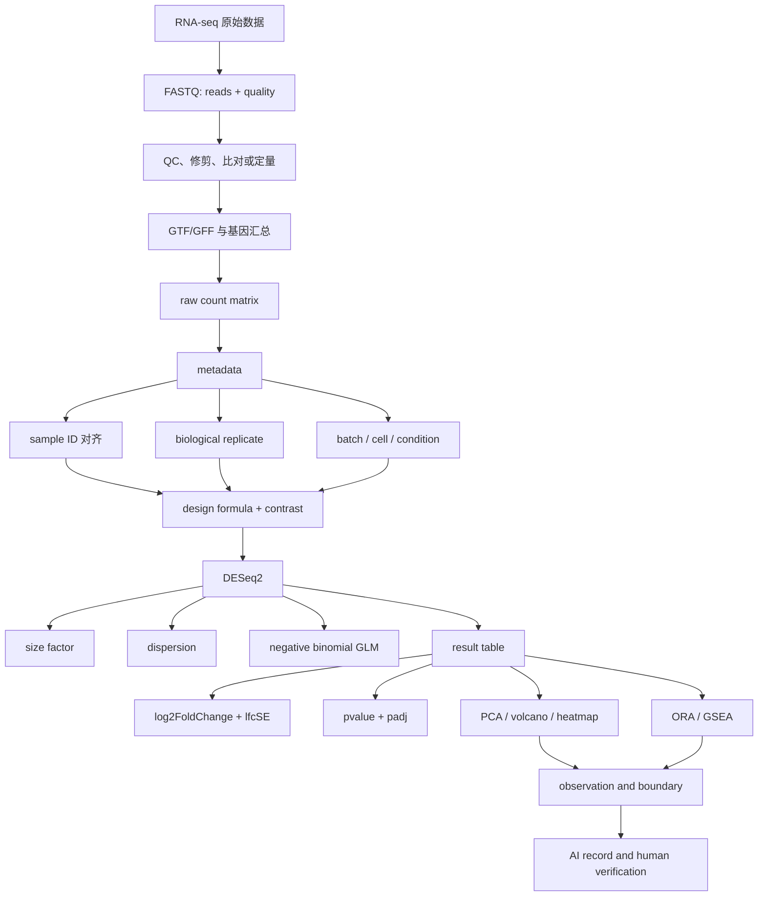

# 第12章 RNA-seq 数据链条与差异表达分析

## 本章定位

第12章把第11章学习的高维矩阵、PCA、聚类和热图放入 bulk RNA-seq 场景。学生要追踪一条完整的数据链：测序 reads 如何转成基因计数，计数矩阵如何与样本信息匹配，实验设计如何进入模型，差异表达结果又如何转成表格和图形。

本章不展开比对算法推导，也不写成生产级命令行手册。学习重点是识别输入对象、核对实验设计、理解统计输出，并把观察结果与生物医学解释分开。

| 前置知识 | 本章训练 | 后续衔接 |
| --- | --- | --- |
| 第8章的 P 值、效应大小和多重检验 | `log2FoldChange`、`pvalue`、`padj` 的联合解释 | 功能富集和组学结果审阅 |
| 第11章的矩阵、PCA、聚类和热图 | 计数矩阵（count matrix）、元数据（metadata）、VST 与样本结构检查 | 第14章单细胞矩阵和降维 |
| 第3章的 AI 任务说明书 | 让 AI 辅助流程和代码，同时保留人工核验 | 第13章公共数据和综合项目 |

本章采用 R/Bioconductor 作为分析主线。Python 只检查结果表字段、排序、阈值标记和绘图数据，不替代 DESeq2 的统计建模。

## 学习目标

完成本章后，学生应能：

1. 画出 FASTQ 到计数矩阵的主要步骤，并标注每一步的输入、输出和核验点。
2. 区分 raw count、标准化计数、VST/rlog 展示矩阵和 TPM/FPKM 等数据形态。
3. 检查计数矩阵列名与元数据行名是否一致，识别分组、批次和配对结构。
4. 读懂 DESeq2 结果表中的 `baseMean`、`log2FoldChange`、`lfcSE`、`pvalue` 和 `padj`。
5. 为 PCA、火山图和热图写出图表设计规范卡，说明输入、尺度、阈值、标签规则和解释边界。
6. 区分过度表示分析（ORA）与基因集富集分析（GSEA），审阅通路解释是否越过证据范围。
7. 保存 AI 生成代码、人工修改、运行结果和仍需确认事项。

## 阅读指南

12.1 和 12.2 先回答“数据从哪里来、样本是谁”。12.3 解释 raw count 为什么不能直接跨样本比较。12.4 到 12.6 再处理差异表达表、图形和功能富集。

本章贯穿案例使用 Bioconductor `airway` 数据包。它提供一个 `RangedSummarizedExperiment` 对象，包含基因计数、样本元数据和基因注释。案例来自人气道平滑肌细胞 RNA-seq 研究，原始研究可由 [GEO GSE52778](https://www.ncbi.nlm.nih.gov/geo/query/acc.cgi?acc=GSE52778) 和 [PMID 24926665](https://pubmed.ncbi.nlm.nih.gov/24926665/) 追溯。

| 案例层级 | 数据范围 | 本章如何使用 |
| --- | --- | --- |
| GEO 原始系列 | 4 个细胞系，untreated、dexamethasone、albuterol、联合处理，共 16 个样本 | 说明公开研究的完整设计，不在本章下载数据 |
| `airway` 教学对象 | 4 个细胞系，untreated 与 dexamethasone 两种条件，共 8 个样本 | 贯穿计数矩阵、元数据、设计、DESeq2 和图表 |
| 教学模拟数据 | 仅在解释表格字段或错误检查时使用 | 必须标注“教学模拟”，不得解释为医学发现 |

本章本地复现使用 R 4.6.0、DESeq2 1.52.0、airway 1.32.0、ggplot2 4.0.3 和 pheatmap 1.0.13。运行产物保存在 `outputs/2026-07-10-第12章正文扩写完善/`。不同版本、过滤规则或阈值可能产生不同数字。

## 核心概念速查

| 概念 | 本章定义 | 容易混淆之处 |
| --- | --- | --- |
| FASTQ | 保存测序 read 序列及每个碱基质量分数的文本格式 | FASTQ 不是表达矩阵 |
| SAM/BAM | 保存 reads 与参考序列比对结果的格式，BAM 为二进制形式 | 比对文件不是 gene count 表 |
| GTF/GFF | 描述基因、转录本、外显子等基因组特征的注释格式 | 注释版本必须与参考序列匹配 |
| 计数矩阵 | 行为基因、列为样本、值为原始或估计计数的矩阵 | 不等于标准化表达矩阵 |
| 元数据 | 描述样本条件、批次、个体和重复等属性的表 | 分组含义不能从列名猜测 |
| normalization | 降低文库大小或组成差异对样本比较的影响 | 不等于减均值除标准差 |
| differential expression | 在预先定义的设计与比较下，对转录水平差异进行估计和检验 | 不等于因果机制或靶点验证 |
| adjusted P value | 对多重检验进行校正后的 P 值，DESeq2 结果中常写作 `padj` | 不能与效应大小互相替代 |
| functional enrichment | 检查候选基因或排序基因是否集中于预定义基因集 | 富集词条不等于通路已被激活 |

## 章节总览图


## 本章证据边界

| 证据层级 | 可以写 | 暂不能写 |
| --- | --- | --- |
| 文件和 QC | 当前流程产生了 FASTQ、BAM 或计数矩阵，并记录了质量指标 | 数据已经没有技术偏差 |
| 差异表达模型 | 当前比较中某基因的转录本计数存在方向和效应估计 | 该基因导致了处理效应 |
| PCA 或热图 | 样本在给定变换和参数下呈现某种分离或聚类模式 | 已建立诊断分型 |
| 富集分析 | 候选基因或排序统计量与某些预定义基因集相关 | 通路活性、药物靶点或临床价值已被证明 |

## 12.1 从 FASTQ 到计数矩阵

### FASTQ 记录什么

FASTQ 通常以四行为一个 read 记录：标识行、碱基序列、分隔行和质量字符串。质量字符编码的是碱基判读置信度。学生不需要手工解析完整文件，但要知道 read 级质量会影响比对和计数。

```text
@read_identifier
ACGTTGCA...
+
IIIIHGF...
```

AIDD RNA-seq 素材把 FastQC、修剪、比对、SAM/BAM、GTF/GFF 和 HTSeq-count 串成一条命令行流程。该素材的字幕和演示数据较粗糙，软件名与命令要由 `TERMS.md` 校正。教材采用其流程结构，不照抄安装命令或参数。

| 步骤 | 主要输入 | 常见输出 | 至少要记录 |
| --- | --- | --- | --- |
| read 级 QC | FASTQ | FastQC/MultiQC 报告 | read 数、质量分布、接头、重复和异常样本 |
| 修剪 | FASTQ、接头序列、质量规则 | trimmed FASTQ | 工具、参数、修剪前后 read 数 |
| 比对 | FASTQ、参考基因组或转录本集 | SAM/BAM | 单端或双端、参考版本、比对率、链特异性 |
| 特征计数 | BAM、GTF/GFF | 每个样本的 gene count | 注释版本、计数工具、feature 类型、未分配 reads |
| 矩阵合并 | 多个样本计数文件 | 基因×样本计数矩阵 | 基因 ID、样本顺序、整数或估计计数、缺失样本 |

NGS Analysis 的 bulk RNA-seq 规则还要求核对 paired-end/single-end、strandedness、基因组构建、FASTA 与 GTF 是否来自同一版本。任一项不清楚，后续结果都应保留 `需人工确认`。

### 一个“全零结果”的教学意义

AIDD 的 HTSeq-count 演示只用了两条 reads。计数输出没有匹配到 feature，因此示例基因计数为零。这个结果只能说明演示文件不足以形成可解释的计数矩阵，不能写成“样本中没有基因表达”。

| 观察 | 方法来源 | 允许解释 | 仍需验证 |
| --- | --- | --- | --- |
| HTSeq-count 输出未分配 reads，基因计数为零 | 两条 read 的演示 BAM 与 GTF | 演示输入未形成可用 gene count | 完整 FASTQ、比对质量、注释匹配和计数参数 |

这类例子说明“流程运行完成”与“数据可用于生物学解释”是两件事。运行日志、退出码和输出文件只证明软件执行状态。

### airway 如何连接原始 reads 与教学矩阵

GEO GSE52778 的原始数据可追溯到 SRA。官方 `airway` 包把其中 untreated 与 dexamethasone 两种条件整理为 8 个样本的 `RangedSummarizedExperiment`。对象同时保存 count assay、样本 `colData` 和基因 `rowData`，适合从“文件链”过渡到“分析对象”。Bioconductor RNA-seq workflow 记录了该案例从 FASTQ、BAM 到 gene-level count 的处理路径；教学包已提供准备好的完整矩阵，所以本章从矩阵开始复现，不重复下载和全量比对。本地对象共有 63,677 行基因和 8 列样本，下面是实际导出的前 8 行之一部分。

| gene_id | SRR1039508 | SRR1039509 | SRR1039512 | SRR1039513 | SRR1039516 | SRR1039517 | SRR1039520 | SRR1039521 |
| --- | ---: | ---: | ---: | ---: | ---: | ---: | ---: | ---: |
| ENSG00000000003 | 679 | 448 | 873 | 408 | 1138 | 1047 | 770 | 572 |
| ENSG00000000005 | 0 | 0 | 0 | 0 | 0 | 0 | 0 | 0 |
| ENSG00000000419 | 467 | 515 | 621 | 365 | 587 | 799 | 417 | 508 |
| ENSG00000000457 | 260 | 211 | 263 | 164 | 245 | 331 | 233 | 229 |
| ENSG00000000460 | 60 | 55 | 40 | 35 | 78 | 63 | 76 | 60 |
| ENSG00000000971 | 3251 | 3679 | 6177 | 4252 | 6721 | 11027 | 5176 | 7995 |

`ENSG00000000005` 在这 8 个样本中均为 0。它可以在低计数过滤时被移除，但不能据此推断该基因在所有组织或实验条件下都不表达。

```r
library(airway)
data("airway")

dim(airway)
assay(airway)[1:8, ]
colData(airway)
rowData(airway)[1:8, c("gene_id", "symbol", "gene_biotype")]
```

### 从 reads 到 counts 的核验问题

- FASTQ 是否成对，文件命名能否对应到 sample sheet？
- 测序文库是否有链特异性，计数参数是否与之匹配？
- 参考基因组、转录本集和 GTF/GFF 是否来自同一构建与发布版本？
- 多重比对、未比对、重复和未分配 reads 如何处理？
- 计数矩阵的值是 raw count、估计 count、TPM，还是已经转换的表达量？

如果只拿到差异表达结果表，至少要回查计数矩阵、元数据、设计公式、比较方向和软件版本。缺少其中任一项，结果解释都不完整。

## 12.2 count matrix、metadata 与实验设计

### 两个输入对象必须逐列对齐

计数矩阵是以基因和样本为维度的计数表。元数据是描述样本属性的表。DESeq2 不会根据相似的名字猜测两者关系，矩阵列顺序必须与元数据行顺序一致。airway 的 8 个样本由 4 个细胞系各提供 untreated 和 dexamethasone 处理一份；`cell` 标记细胞系，`dex` 标记处理状态，`Run` 同时是计数矩阵的列名。

| sample_id | cell | dex | GEO sample | 结构角色 |
| --- | --- | --- | --- | --- |
| SRR1039508 | N61311 | untrt | GSM1275862 | N61311 未处理 |
| SRR1039509 | N61311 | trt | GSM1275863 | N61311 处理 |
| SRR1039512 | N052611 | untrt | GSM1275866 | N052611 未处理 |
| SRR1039513 | N052611 | trt | GSM1275867 | N052611 处理 |
| SRR1039516 | N080611 | untrt | GSM1275870 | N080611 未处理 |
| SRR1039517 | N080611 | trt | GSM1275871 | N080611 处理 |
| SRR1039520 | N061011 | untrt | GSM1275874 | N061011 未处理 |
| SRR1039521 | N061011 | trt | GSM1275875 | N061011 处理 |

下面的检查先验证集合一致，再强制调整顺序。`stopifnot()` 让错误在建模前暴露。

```r
counts_mat <- assay(airway)
meta <- as.data.frame(colData(airway))
meta$sample_id <- rownames(meta)

stopifnot(setequal(colnames(counts_mat), meta$sample_id))
meta <- meta[match(colnames(counts_mat), meta$sample_id), ]
stopifnot(identical(colnames(counts_mat), meta$sample_id))
stopifnot(!anyDuplicated(meta$sample_id))
stopifnot(!anyNA(meta[, c("cell", "dex")]))
```

集合相同不代表顺序相同。只写 `all(colnames(counts_mat) %in% meta$sample_id)` 只能检查成员关系，不能保证第 1 列 count 对应第 1 行元数据。

### biological replicate 与 technical replicate

生物学重复（biological replicate）来自可独立反映生物变异的实验单位。技术重复（technical replicate）是同一生物样本的重复测量或重复建库。技术重复不能无说明地当作额外生物样本。

| 情形 | 统计单位 | 处理原则 |
| --- | --- | --- |
| 4 个独立细胞系各有两种处理 | 细胞系 | 在设计中保留 `cell`，比较同一细胞系内的处理变化 |
| 同一 RNA 样本分两个 lane 测序 | 原 RNA 样本 | 先核对并按技术重复规则合并或建模 |
| 同一供体培养多个孔 | 供体或独立培养单位，依实验设计确定 | 不能只按孔数增加独立样本量 |

airway 案例中的 4 个 `cell` 水平构成处理比较的配对结构。模型用 `cell` 吸收不同细胞系的基线差异，再估计 `dex` 的平均处理效应。

### 从研究问题写出设计公式

本章的比较问题是：控制细胞系差异后，dexamethasone 处理相对 untreated 的转录计数差异是什么？对应设计为：

```r
design = ~ cell + dex
```

公式从左到右列出协变量和目标变量。DESeq2 官方文档建议把主要关注变量放在末尾，并显式设定参考水平。

```r
library(DESeq2)

dds <- DESeqDataSet(airway, design = ~ cell + dex)
dds$dex <- relevel(factor(dds$dex), ref = "untrt")
design(dds)
model.matrix(design(dds), colData(dds))
```

`contrast = c("dex", "trt", "untrt")` 表示 treated 相对 untreated。正的 `log2FoldChange` 表示处理组估计表达较高，负值表示处理组估计表达较低。

### 批次与完全混杂

如果所有处理样本都在批次 B2，所有对照都在批次 B1，`batch` 与 `dex` 传递相同信息。模型无法分别估计两者效应。这叫完全混杂（perfect confounding）。

| 元数据模式 | 能否估计处理效应 | 原因 |
| --- | --- | --- |
| 每个批次同时有 treated 和 untreated | 通常可以，仍需检查样本量和异常值 | batch 与 condition 可分离 |
| B1 全是 untreated，B2 全是 treated | 不能单独解释 treatment | batch 与 condition 完全混杂 |
| 每个细胞系有一对 treated/untreated | 可用 `~ cell + dex` | 配对结构进入设计 |
| 只有 1 个 treated 和 1 个 untreated | 不足以估计组内生物变异 | 缺少生物学重复 |

标准化不能修复完全混杂。增加 `~ batch + condition` 也不会自动产生不存在的信息；模型矩阵不满秩时，软件会报错。

### 实验设计压力测试

- 如果去掉 `cell`，`dex` 效应是否会混入细胞系基线差异？
- `trt` 和 `untrt` 的参考方向是否写入结果表和图注？
- 元数据中是否存在缺失、重复或未使用的 factor level？
- 排除样本后，设计矩阵是否仍可估计？
- 批次变量来自实验记录，还是 AI 根据文件名猜测？

AI 可以检查公式语法，不能决定哪个字段代表生物学重复。这个判断必须回到实验记录。

## 12.3 RNA-seq 标准化思想

### raw count 为什么不能直接比较

两个样本的测序深度不同，同一基因的 raw count 就可能不同。文库组成也会产生影响：少数高丰度转录本占据更多 reads 时，其他基因的相对计数可能下降。本章中的标准化（normalization）指降低文库大小或组成差异对样本比较的影响；第11章常见的标准化变量（standardization）通常指减去均值再除以标准差，两者目的不同。

| 数据形态 | 生成方式 | 主要用途 | 不应做什么 |
| --- | --- | --- | --- |
| raw count | read/fragment 汇总 | DESeq2 建模输入、原始 QC | 直接按数值大小跨样本下结论 |
| normalized count | raw count 除以 size factor | 单基因计数检查、部分展示 | 认为已校正设计中的 batch/cell |
| VST/rlog 矩阵 | 方差稳定或正则化对数变换 | PCA、距离、聚类和热图 | 替代 raw count 进行 DESeq2 检验 |
| TPM/FPKM | 按文库量和基因长度缩放 | 某些表达展示与描述 | 直接作为 DESeq2 raw-count 输入 |

DESeq2 默认用 median-ratio 方法估计每个样本的 size factor。`DESeq()` 随后估计 dispersion，并拟合负二项广义线性模型。size factor 调整样本尺度，dispersion 描述基因计数相对均值的变异程度。

### airway 的 size factor 实例

本地运行中，8 个样本的 raw library size 约为 1,516 万到 3,081 万，size factor 约为 0.67 到 1.40。它们并不等于简单的总 reads 比例。

| sample_id | cell | dex | raw library size | detected genes | size factor |
| --- | --- | --- | ---: | ---: | ---: |
| SRR1039508 | N61311 | untrt | 20,634,079 | 21,568 | 1.024 |
| SRR1039509 | N61311 | trt | 18,805,453 | 21,443 | 0.896 |
| SRR1039512 | N052611 | untrt | 25,343,413 | 21,835 | 1.180 |
| SRR1039513 | N052611 | trt | 15,160,874 | 20,985 | 0.670 |
| SRR1039516 | N080611 | untrt | 24,443,348 | 21,813 | 1.178 |
| SRR1039517 | N080611 | trt | 30,812,404 | 21,891 | 1.399 |
| SRR1039520 | N061011 | untrt | 19,122,137 | 21,552 | 0.921 |
| SRR1039521 | N061011 | trt | 21,160,749 | 21,385 | 0.945 |

这些数值支持“样本的计数规模不同”。它们不能单独判断某个样本质量差，也不能说明处理增加或减少了总 RNA。

```r
dds <- estimateSizeFactors(dds)

sample_qc <- data.frame(
  sample_id = colnames(dds),
  raw_library_size = colSums(counts(dds)),
  detected_genes = colSums(counts(dds) > 0),
  size_factor = sizeFactors(dds)
)

normalized_counts <- counts(dds, normalized = TRUE)
sample_qc
```

### 低计数过滤与 independent filtering

本地案例在建模前保留 `rowSums(counts(dds)) >= 10` 的基因，63,677 行降为 22,369 行。这个规则用于教学和运行效率，并非所有项目的固定阈值。

DESeq2 的 `results()` 还会进行 independent filtering，以提高多重检验下的检出能力。部分低信息基因的 `padj` 因此可能为 `NA`。本地结果中有 17,165 个基因获得非缺失 `padj`。

| 过滤动作 | 发生阶段 | 是否改变原始文件 | 记录要求 |
| --- | --- | --- | --- |
| 预过滤低计数基因 | 建模前 | 否 | 规则、过滤前后行数、理由 |
| independent filtering | `results()` 阶段 | 否 | 软件与参数、`padj = NA` 的处理 |
| 按 `padj` 和效应大小筛选 | 结果整理阶段 | 否 | 阈值、比较方向、完整结果表路径 |

不能先看哪些基因“符合预期”，再决定过滤规则。那会把后验生物学判断带入统计筛选。

### VST 与 rlog 用于展示

方差稳定变换（variance stabilizing transformation, VST）降低低计数区域的均值与方差依赖，使样本距离、PCA 和热图更易阅读。rlog 也用于类似目的，但在样本较多时通常更慢。

```r
dds <- DESeq(dds)
vsd <- vst(dds, blind = FALSE)
rld <- rlog(dds, blind = FALSE)

vst_mat <- assay(vsd)
rlog_mat <- assay(rld)
```

`blind = FALSE` 允许变换使用已拟合的均值与 dispersion 趋势。它不会从矩阵中删除 `cell`、batch 或处理差异。标准化计数也不会校正设计公式中的变量；设计变量只在 dispersion 和 log2 fold-change 估计中发挥作用。

### 标准化不能修复哪些问题

- 样本标签写错或分组含义不清。
- 处理与批次完全混杂。
- 样本污染、RNA 降解或建库失败。
- 技术重复被误当作生物学重复。
- 参考基因组、GTF 和基因 ID 版本不匹配。

PCA 若仍显示批次结构，应回查实验设计和 QC。不能因为 VST 后“看起来更整齐”就认定技术偏差已消除。

## 12.4 差异表达结果表

### DESeq2 的分析对象与比较

差异表达（differential expression）是在给定实验设计下估计组间转录计数差异，并评估该差异相对组内变异是否足够明确。它是一项统计分析，不是机制实验。下面代码使用 airway 的配对结构，`contrast` 明确规定 treated 相对 untreated，避免依赖默认 factor 顺序。

```r
library(airway)
library(DESeq2)

data("airway")
dds <- DESeqDataSet(airway, design = ~ cell + dex)
dds$dex <- relevel(factor(dds$dex), ref = "untrt")

keep <- rowSums(counts(dds)) >= 10
dds <- dds[keep, ]
dds <- DESeq(dds)

res <- results(
  dds,
  contrast = c("dex", "trt", "untrt"),
  alpha = 0.05
)

res_tbl <- as.data.frame(res)
res_tbl$gene_id <- rownames(res_tbl)
res_tbl$gene_symbol <- rowData(dds)$symbol
res_tbl <- res_tbl[order(res_tbl$padj, na.last = TRUE), ]
```

`DESeq()` 依次估计 size factor、dispersion，并拟合负二项模型和 Wald 检验。学生不需要推导完整似然函数，但要能把每个输出字段与分析问题对应起来。

### 结果字段怎么读

| 字段 | 统计含义 | 阅读问题 |
| --- | --- | --- |
| `baseMean` | 各样本 normalized count 的平均值 | 该基因整体计数水平是否很低？ |
| `log2FoldChange` | treated 相对 untreated 的 log2 倍数变化估计 | 方向是否与 contrast 一致？ |
| `lfcSE` | `log2FoldChange` 的标准误 | 效应估计是否不稳定？ |
| `stat` | Wald 检验统计量 | 它来自哪个模型和系数？ |
| `pvalue` | 在零假设和模型前提下的单基因检验结果 | 是否误写为“结论正确概率”？ |
| `padj` | 多重检验校正后的 P 值 | 校正方式、阈值和缺失值是否记录？ |

`log2FoldChange = 1` 对应估计表达比为 2，`log2FoldChange = -1` 对应估计表达比为 1/2。倍数变化描述效应方向和大小，P 值描述检验结果；二者不能互相替代。

### 本地运行结果片段

本轮按 `padj < 0.05` 且 `|log2FoldChange| >= 1` 设置课堂展示阈值。共有 999 个基因通过，其中 519 个在 treated 方向较高，480 个较低。这个数量由当前版本、预过滤、模型和阈值共同决定，不是 airway 研究的固定“真值”。下表为完整结果按 `padj` 排序后的前 6 行，数值来自本地运行，表中基因只用于学习结果字段和排序规则。

| gene_id | symbol | baseMean | log2FoldChange | lfcSE | padj | 方向 |
| --- | --- | ---: | ---: | ---: | ---: | --- |
| ENSG00000152583 | SPARCL1 | 997.4 | 4.575 | 0.184 | 7.06e-132 | treated 较高 |
| ENSG00000165995 | CACNB2 | 495.1 | 3.291 | 0.133 | 3.83e-131 | treated 较高 |
| ENSG00000120129 | DUSP1 | 3409.0 | 2.948 | 0.122 | 1.74e-125 | treated 较高 |
| ENSG00000101347 | SAMHD1 | 12703.4 | 3.767 | 0.156 | 3.30e-125 | treated 较高 |
| ENSG00000189221 | MAOA | 2341.8 | 3.354 | 0.142 | 1.79e-119 | treated 较高 |
| ENSG00000211445 | GPX3 | 12285.7 | 3.730 | 0.166 | 7.40e-108 | treated 较高 |

允许的结果陈述是：“在 `~ cell + dex` 设计下，上述基因在 dexamethasone treated 相对 untreated 的比较中获得正向 `log2FoldChange`，并通过本轮多重检验与展示阈值。”暂不能写“这些基因决定了药物作用”“它们是治疗靶点”或“可以预测患者疗效”，这些主张需要独立文献、功能实验和临床研究。

### P 值、padj 与效应大小

RNA-seq 会同时检验数以万计的基因。若只按未校正 P 值筛选，假阳性风险会累积。`padj` 用多重检验校正控制错误发现相关指标，本章筛选和火山图优先使用 `padj`。

| 情形 | 正确处理 | 错误处理 |
| --- | --- | --- |
| `padj` 很小，`|log2FC|` 很小 | 说明统计证据较强，但估计差异幅度有限 | 写成“强烈生物效应” |
| `|log2FC|` 很大，`padj` 不显著 | 检查低计数、标准误和重复数量 | 只按 fold-change 宣布差异 |
| `pvalue` 显著，`padj` 不显著 | 不纳入按 `padj` 定义的候选集 | 隐去 `padj` 只报告 P 值 |
| `padj = NA` | 查 independent filtering、全零行或异常值规则 | 把 NA 当成 0 或不显著的精确数值 |

阈值应在作图和读表前写入分析计划。若尝试多个阈值，应报告敏感性，不应只保留最符合预期的结果。

### 基因 ID 转换不是简单换列名

airway 使用 Ensembl gene ID，同时在 `rowData` 中提供 symbol。外部项目常需要用 `AnnotationDbi`、`biomaRt` 或固定注释表转换 ID。

| 风险 | 结果表中如何保留 |
| --- | --- |
| Ensembl ID 带版本号 | 同时保留原始 ID 与去版本号后的查询 ID |
| 一个 ID 对应多个 symbol | 保留全部映射或明确选择规则 |
| symbol 缺失或过期 | 保留稳定 ID，不删除整行 |
| 物种或注释版本错误 | 停止转换并回查数据库与构建版本 |
| 多行映射造成重复 | 在 join 后检查行数变化和重复键 |

AIDD 的 ID 转换字幕展示了 `biomaRt`、`org.Hs.eg.db` 等路线，也记录了包安装失败。教材采用“保留原始 ID、记录版本、检查一对多”的原则，不把在线查询成功当成注释已经无误。

### Python 只做结果表审计

```python
import pandas as pd

res = pd.read_csv("airway_deseq2_results.tsv", sep="\t")
required = {
    "gene_id", "baseMean", "log2FoldChange",
    "lfcSE", "pvalue", "padj"
}
missing = required.difference(res.columns)
assert not missing, f"缺少字段: {sorted(missing)}"
assert res["gene_id"].is_unique
assert res["padj"].dropna().between(0, 1).all()

res["pass_threshold"] = (
    res["padj"].lt(0.05)
    & res["log2FoldChange"].abs().ge(1)
    & res["padj"].notna()
)
```

这段 Python 不估计 size factor、dispersion 或模型系数。它只核验 R 输出表是否适合后续整理。

### 结果解释卡

| 栏目 | airway 本地复现示例 |
| --- | --- |
| 研究问题 | 控制细胞系后，treated 相对 untreated 的转录计数差异 |
| 方法来源 | DESeq2，设计 `~ cell + dex`，contrast 为 `trt` vs `untrt` |
| 观察结果 | 结果表含效应估计、标准误、P 值和 `padj`；部分基因通过教学阈值 |
| 允许解释 | 当前比较中存在候选转录差异，可供后续验证 |
| 替代解释 | 细胞培养差异、未建模技术因素、注释和过滤选择 |
| 仍需验证 | 独立数据、基因或蛋白实验、功能干预和适用场景 |

## 12.5 火山图、热图与差异基因展示

图表先回答明确问题。PCA 检查样本主要变化，火山图联合展示效应估计与统计证据，热图展示选定基因的样本模式。三类图不能互相替代。

### PCA：先看样本，再读基因

本地案例用 `vst(dds, blind = FALSE)` 生成展示矩阵。PC1 解释 47.8% 的方差，PC2 解释 23.4%。图中 4 个 treated 样本位于 PC1 右侧，4 个 untreated 样本位于左侧；形状标记细胞系。



图12-1. airway 样本的 VST-PCA。颜色表示 dexamethasone 处理状态，形状表示细胞系。该图显示当前变换与样本集中的主要变化方向，不构成处理因果、样本分型或质量合格证明。

| 规范卡检查项 | 本图设置 |
| --- | --- |
| 核心问题 | 样本的主要表达变化是否与 `dex` 或 `cell` 对应？ |
| 输入 | VST 表达矩阵，22,369 个过滤后基因，8 个样本 |
| 视觉编码 | x=PC1，y=PC2，颜色=`dex`，形状=`cell` |
| 统计信息 | 轴标题报告解释方差比例 |
| 风险 | 8 个样本较少；PCA 是探索性图；轴方向可翻转 |

PCA 的观察支持把 `dex` 纳入后续解释，也提醒学生保留 `cell` 配对结构。它不能证明所有差异都由 dexamethasone 造成。

### 火山图：效应大小与统计证据一起看

火山图横轴为 `log2FoldChange`，纵轴为 `-log10(padj)`。本图以 `padj < 0.05` 且 `|log2FoldChange| >= 1` 着色。灰色点未通过该教学阈值。



图12-2. airway 差异表达火山图。橙色表示 treated 较高，蓝色表示 treated 较低。标注基因按 `padj` 自动选择前 8 个通过阈值的条目，并非根据已知生物学意义挑选。纵轴使用调整后 P 值。

| 火山图项目 | 必须写清 | 本图处理 |
| --- | --- | --- |
| 比较方向 | 谁相对谁 | treated 相对 untreated |
| 横轴 | 效应估计及单位 | `log2FoldChange` |
| 纵轴 | `pvalue` 或 `padj` | `-log10(padj)` |
| 阈值 | 统计与效应阈值 | `padj < 0.05` 且 `|log2FC| >= 1` |
| 标签 | 预先指定或自动选择规则 | 按 `padj` 取前 8 个通过阈值条目 |
| 完整结果 | 是否保留所有基因 | 完整 TSV 单独保存 |

图上 SPARCL1、DUSP1、MAOA、GPX3、STEAP2 和 NEXN 等标签来自排序规则。课堂可据此练习查找结果行，但不能据标签位置宣布“关键机制基因”。

```r
volcano_df <- subset(res_tbl, !is.na(padj) & !is.na(log2FoldChange))
volcano_df$neg_log10_padj <- -log10(
  pmax(volcano_df$padj, .Machine$double.xmin)
)
volcano_df$pass <- volcano_df$padj < 0.05 &
  abs(volcano_df$log2FoldChange) >= 1

ggplot(volcano_df, aes(log2FoldChange, neg_log10_padj, color = pass)) +
  geom_point(alpha = 0.7) +
  geom_vline(xintercept = c(-1, 1), linetype = "dashed") +
  geom_hline(yintercept = -log10(0.05), linetype = "dashed")
```

### 热图：颜色表示行内相对高低

本图从非缺失 `padj` 的结果中选取前 30 个基因，使用 VST 矩阵，并对每个基因做行 z-score。红色表示该基因在某样本中的值高于该基因自身均值，蓝色表示低于自身均值。



图12-3. airway 前 30 个基因热图。行按基因聚类，列按样本聚类，顶部注释条显示 `cell` 和 `dex`。输入基因已经按差异表达结果选择，因此样本按处理状态分开不能作为独立验证。

| 热图项目 | 本图设置 | 解释边界 |
| --- | --- | --- |
| 基因选择 | `padj` 最小的前 30 个基因 | 不是全转录组结构 |
| 输入尺度 | VST 后按基因做 z-score | 颜色不是 raw count 或绝对表达量 |
| 距离与聚类 | pheatmap 默认距离与层次聚类 | 参数变化可能改变枝状图 |
| 样本注释 | `cell`、`dex` | 注释不参与证明分型 |
| 颜色 | 蓝到白到红 | 只能在同一基因行内比较相对高低 |

```r
vsd <- vst(dds, blind = FALSE)
top_ids <- head(res_tbl$gene_id[!is.na(res_tbl$padj)], 30)
heat_mat <- assay(vsd)[top_ids, ]
heat_mat <- t(scale(t(heat_mat)))

annotation_col <- data.frame(
  cell = colData(dds)$cell,
  dex = colData(dds)$dex,
  row.names = colnames(dds)
)

pheatmap::pheatmap(
  heat_mat,
  annotation_col = annotation_col,
  cluster_rows = TRUE,
  cluster_cols = TRUE
)
```

### 三步读图法

1. 先写图中直接观察：点的位置、样本分离、颜色模式或聚类结构。
2. 再写方法来源：输入矩阵、变换、阈值、排序、距离和比较方向。
3. 最后写边界：替代解释、选择偏倚和仍需验证内容。

| 图 | 直接观察 | 允许解释 | 不允许解释 |
| --- | --- | --- | --- |
| PCA | 两种处理在 PC1 上分离 | 处理状态对应主要表达变化方向 | 处理解释了所有变化 |
| 火山图 | 两侧存在通过阈值的基因 | 当前模型识别到双向候选差异 | 标签基因是机制或靶点 |
| 热图 | 所选基因呈现处理相关模式 | 选定基因可区分当前 8 个样本的表达模式 | 已建立普遍适用分型 |

## 12.6 功能富集与结果解释边界

功能富集（functional enrichment）检查候选基因或排序统计量是否集中于预定义功能类别、通路或基因集。输入基因、背景集、ID、数据库版本和检验类型都会改变结果。

### ORA 与 GSEA 的输入不同

过度表示分析（over-representation analysis, ORA）通常输入一个按阈值选出的候选基因集合，并与背景基因集比较。基因集富集分析（gene set enrichment analysis, GSEA）使用带名称的全基因排序统计量，检查某基因集是否集中在排序列表的上端或下端。

| 项目 | ORA | GSEA |
| --- | --- | --- |
| 主要输入 | 候选基因集合 | 全基因排序向量 |
| 是否依赖差异基因阈值 | 是 | 通常不先切成显著/不显著 |
| 背景或参照 | 所有被检测并有机会入选的基因 | 排序列表中的全部有效基因 |
| 常见输出 | gene ratio、count、P 值、`padj` | enrichment score、NES、P 值、FDR |
| 主要风险 | 阈值和背景集改变结果 | 排序统计量、基因集大小和置换策略改变结果 |

SCBP 的基因集章节还区分“基因集检验”和“单样本活性评分”。前者比较条件间的基因集统计模式，后者为单个样本或细胞计算 signature score。两者不能混写为同一种“通路激活证据”。

### 背景集决定 ORA 的参照范围

ORA 的背景集不宜直接设为“全基因组全部基因”。更合适的候选是进入本次统计检验、具有有效 ID 且有机会被选中的基因。

```r
tested_ids <- res_tbl$gene_id[!is.na(res_tbl$pvalue)]
selected_ids <- res_tbl$gene_id[
  !is.na(res_tbl$padj) &
  res_tbl$padj < 0.05 &
  abs(res_tbl$log2FoldChange) >= 1
]

length(tested_ids)
length(selected_ids)
```

若 `TERM2GENE` 使用 Entrez ID，而 `selected_ids` 是 Ensembl ID，必须先做有记录的 ID 转换。映射失败的基因、重复映射和数据库版本要进入运行记录。

```r
# TERM2GENE 必须来自已记录版本的基因集文件。
# 下列代码是接口骨架，本章未对 airway 生成具体富集结果。

ora_result <- clusterProfiler::enricher(
  gene = selected_ids,
  universe = tested_ids,
  TERM2GENE = term2gene
)
```

### GSEA 要保留完整排序向量

GSEA 可使用 Wald statistic 等带方向统计量。名称必须是与基因集一致的 ID，重复 ID 要用预先记录的规则处理。

```r
rank_stat <- res_tbl$stat
names(rank_stat) <- res_tbl$gene_id
rank_stat <- rank_stat[is.finite(rank_stat)]
rank_stat <- sort(rank_stat, decreasing = TRUE)

gsea_result <- fgsea::fgseaMultilevel(
  pathways = pathways,
  stats = rank_stat,
  minSize = 15,
  maxSize = 500
)
```

素材中的 GSEA 说明强调预定义基因集、基因排序、enrichment score、normalized enrichment score 和 FDR。SCBP 案例还显示，固定数据库版本有助于教程复现，过小或高度重叠的基因集会影响排序和解释。

### 富集结果表至少保留什么

| 字段 | 作用 | 核验问题 |
| --- | --- | --- |
| `term_id` / `description` | 基因集标识和名称 | 数据库、物种和版本是什么？ |
| `count` / `geneRatio` | 命中基因数量或比例 | 分母如何定义？ |
| `ES` / `NES` | GSEA 富集方向和标准化分数 | 排序统计量和方向是什么？ |
| `pvalue` / `padj` / `FDR` | 富集检验与多重校正 | 是否报告校正后结果？ |
| `leadingEdge` / `geneID` | 驱动统计信号的基因子集 | ID 是否可追溯，是否重复映射？ |

GO、KEGG、Reactome 和 MSigDB 提供的是整理后的知识库或基因集集合。词条名称可能很具体，但词条仍是统计参照，不是本实验直接测量的通路活性。

### 一个富集解释审阅案例

本章未对 airway 结果实际运行 ORA 或 GSEA，因此下面只审阅语言，不生成任何具体通路结论。

| AI 原句 | 问题 | 教材版改写 | 证据状态 |
| --- | --- | --- | --- |
| “富集证明该通路被 dexamethasone 激活” | 由基因集统计关系推出通路活性和因果 | “候选基因在该基因集中富集，提示该功能方向可进一步检查。” | 需补富集表、数据库版本和实验验证 |
| “SPARCL1 是药物关键靶点” | 单基因差异表达不等于靶点验证 | “SPARCL1 在当前比较中显示较大的正向表达差异。” | 差异表达支持；靶点主张不支持 |
| “热图证明患者可分为两型” | 4 个细胞系形成的 8 个样本和选择后基因不能支持临床分型 | “所选基因在当前样本中呈现处理相关表达模式。” | 仅支持本数据观察 |
| “该结果具有临床治疗意义” | 缺少患者、结局和临床验证 | 删除，或标记 `需补证据` | 不支持 |

### 富集解释阶梯

1. 统计层：候选基因或排序统计量与某基因集出现富集关系。
2. 功能层：该结果与某类已注释生物过程一致，可形成后续假设。
3. 机制层：需要独立实验、方向一致的分子证据和替代解释排除。
4. 转化层：需要人群、临床结局、外部验证和风险评估。

本章只训练前两层。机制和转化主张不能由富集图直接推出。

## 案例任务

本章案例从同一套 airway 对象产生矩阵、元数据、模型、结果表和图。学生不需要下载 FASTQ，但必须能说明原始数据链和准备后对象之间的关系。

| 阶段 | 学生活动 | 交付物 |
| --- | --- | --- |
| 1. 数据链 | 画 FASTQ、BAM、GTF、计数矩阵流程 | 输入输出图与核验点 |
| 2. 样本检查 | 对齐计数列名和元数据行名 | 样本核验表与异常列表 |
| 3. 设计 | 写 `~ cell + dex` 和 contrast | 研究问题、参考组、配对说明 |
| 4. 建模 | 运行 DESeq2 并保存完整结果 | TSV、过滤记录、sessionInfo |
| 5. 图表 | 生成 PCA、火山图和热图 | 图表设计规范卡、脚本、PNG/PDF、源数据 |
| 6. 解释 | 完成结果解释卡和富集语言审阅 | 允许主张、替代解释、需验证内容 |

禁止事项：不让 AI 猜 `cell` 和 `dex` 的含义；不覆盖原始材料；不只保存通过阈值的基因；不把标签基因写成靶点；不生成未经运行的通路结论。

## AI 协作点

### 可提交给 AI 的任务说明书

```text
目标：
检查一个 bulk RNA-seq DESeq2 工作流的输入、设计、结果字段和图表设计规范卡。

上下文：
- count matrix 的列是 8 个 SRR 样本，行为 Ensembl gene ID。
- metadata 含 cell 和 dex；每个 cell 有 untreated 与 treated 两个样本。
- 设计公式预定为 ~ cell + dex。
- 比较方向为 trt 相对 untrt。

约束：
- 不改变分组、参考水平、过滤规则或阈值。
- 不新增机制、靶点、疗效或临床结论。
- 不把 VST 矩阵用于 DESeq2 差异检验。
- 不能确认的字段标“需人工确认”。

验证：
- 检查 count 列名与 metadata 行名完全一致。
- 检查设计矩阵满秩、contrast 方向、padj 缺失和 ID 重复。
- 检查火山图与热图的输入、阈值和标签规则。

输出：
1. 风险清单；2. 最小修改建议；3. 运行检查；4. 解释边界。
```

AI 的建议必须经过运行和人工判断。若 AI 把 `cell` 删除、改用 `~ dex`，学生要说明为什么不接受该修改。

### AI 协作记录

| 字段 | 本章要求 |
| --- | --- |
| 原始提示词 | 保留目标、上下文、约束、验证和输出 |
| AI 输出摘要 | 记录建议，不把建议写成已验证事实 |
| 人工修改 | 写明设计、字段、阈值和代码改动 |
| 运行结果 | 保存退出状态、表格、图片和 sessionInfo |
| 失败记录 | 保留安装、路径、包版本和绘图设备问题 |
| 解释复核 | 标出观察、统计、允许解释和需补证据 |

本地复现曾遇到两个真实问题：项目隔离 library 隐藏了原有 `BiocManager` 路径；`ggsave()` 的 PNG 设备无法在中文工作目录写文件。前者通过补回只读依赖库解决，后者改用 base R `png()` 设备。失败过程也属于复现记录。

## 常见误区

| 误区 | 为什么错 | 如何纠正 |
| --- | --- | --- |
| 把 FASTQ 当作表达表 | FASTQ 保存 reads 和质量，不是 gene count | 追踪比对、注释和计数步骤 |
| 计数与元数据只核对集合 | 顺序错位会把表达值分配给错误样本 | 使用 `identical()` 检查顺序 |
| 直接比较 raw count | 文库大小和组成不同 | 用 count 模型及 size factor |
| VST 后再做 DESeq2 检验 | VST 为展示和距离分析设计 | DESeq2 使用 raw/estimated counts |
| 设计中遗漏配对变量 | 细胞系基线差异进入处理效应 | 使用 `~ cell + dex` |
| 只看未校正 P 值 | 同时检验大量基因 | 报告 `padj` 和多重检验规则 |
| 只保存显著基因 | 失去过滤和完整排序信息 | 保存完整结果及筛选子表 |
| 热图聚类等于分型 | 选择基因与参数会影响聚类 | 写成当前输入下的表达模式 |
| 富集词条等于通路激活 | 富集检验测量基因集统计关系 | 保留为候选功能方向 |

## 核验清单

- [ ] 章名和 12.1-12.6 顺序与根目录 `大纲.md` 一致。
- [ ] FASTQ、BAM、GTF/GFF、计数矩阵的输入输出可追溯。
- [ ] 计数矩阵列名与元数据行名完全一致且顺序相同。
- [ ] biological replicate、technical replicate 和配对单位已定义。
- [ ] 设计公式、参考水平和 contrast 方向已写清。
- [ ] raw count、normalized count、VST/rlog 和 TPM/FPKM 未混用。
- [ ] 低计数过滤、independent filtering 和样本排除有记录。
- [ ] 结果表保留效应估计、标准误、P 值、`padj` 和 ID。
- [ ] 火山图说明纵轴、阈值、比较方向和标签规则。
- [ ] 热图说明输入矩阵、基因选择、行标准化和聚类参数。
- [ ] ORA/GSEA 说明背景集或排序向量、ID、数据库版本和 FDR。
- [ ] 观察结果、方法来源、允许解释、替代解释和仍需验证内容分开书写。
- [ ] AI 输出已运行，失败和人工修改均有记录。

## 知识结构与知识图谱生成提示词



```text
请生成一张教学用知识图谱，主题为“bulk RNA-seq 数据链条与差异表达分析”。
目标读者是药学本科生和研究生。

必须包含四层：
1. 文件层：FASTQ、SAM/BAM、GTF/GFF、count matrix；
2. 设计层：metadata、sample ID、biological replicate、batch、paired design、contrast；
3. 统计层：size factor、dispersion、negative binomial GLM、log2FoldChange、lfcSE、pvalue、padj；
4. 解释层：PCA、火山图、热图、ORA、GSEA、证据边界、AI 协作记录。

用箭头标明数据流，用虚线标明人工核验。不要把富集词条画成机制证明，
不要加入临床建议。如果中文标签不清，正文以 Mermaid 图和表格为准。
```

> 本章未使用 imagegen。若后续生成教学插图，Mermaid 和表格仍是准确结构的来源。

## 实验或作业

### 作业1：数据链条审计

- 任务：给定 FASTQ 文件清单、参考基因组版本、GTF 文件和计数矩阵，画出处理链条。每一步写输入、输出、软件、版本、QC 指标和 `需人工确认`。
- 评分点：对象层级正确；参考与注释版本匹配；未把流程跑通写成数据可靠。

### 作业2：airway 设计与结果复现

- 任务：运行本章 R 代码，提交元数据对齐检查、`~ cell + dex` 设计矩阵、完整结果表、教学阈值子表、PCA、火山图、热图和 sessionInfo。
- 评分点：比较方向正确；保留完整结果；图表参数清楚；能解释 999 是本轮阈值结果，不是固定生物学事实。

### 作业3：富集解释审阅

- 任务：教师提供一张富集结果表和一段 AI 说明。学生标出输入基因、背景集、ID、数据库版本、FDR、基因集重叠和过度解释，并给出克制改写。
- 评分点：区分 ORA/GSEA；不写通路激活、靶点或临床意义；缺证据处标 `需补证据`。

## 案例资料与延伸阅读

- Bioconductor `airway` 包说明：[airway manual](https://www.bioconductor.org/packages/release/data/experiment/manuals/airway/man/airway.pdf)。
- Bioconductor RNA-seq 教学流程：[RNA-Seq workflow](https://www.bioconductor.org/help/course-materials/2015/LearnBioconductorFeb2015/B02.1.1_RNASeqLab.html)。
- DESeq2 官方 vignette：[Analyzing RNA-seq data with DESeq2](https://bioconductor.org/packages/release/bioc/vignettes/DESeq2/inst/doc/DESeq2.html)。
- GEO 数据记录：[GSE52778](https://www.ncbi.nlm.nih.gov/geo/query/acc.cgi?acc=GSE52778)。
- Himes 等原始研究：[PMID 24926665](https://pubmed.ncbi.nlm.nih.gov/24926665/)。
- DESeq2 方法论文：[10.1186/s13059-014-0550-8](https://doi.org/10.1186/s13059-014-0550-8)。

## 需补证据

| 位置 | 当前缺口 | 正文处理 |
| --- | --- | --- |
| airway 具体基因功能 | 本章未逐基因检索文献或做功能实验 | 只报告差异表达字段，不解释机制 |
| airway 功能富集 | 本轮未运行 ORA/GSEA | 只给输入结构和代码骨架，不生成通路词条 |
| 课堂阈值选择 | `padj < 0.05` 且 `|log2FC| >= 1` 为本章展示规则 | 保留完整结果，项目中需预先说明阈值依据 |
| AIDD 字幕中的软件与命令 | 字幕存在术语误识别和版本不明 | 只采用流程线索，具体命令以官方文档为准 |
| 临床意义 | airway 为细胞系 RNA-seq 教学数据，无患者结局分析 | 不写疗效、诊断、预后或临床建议 |
