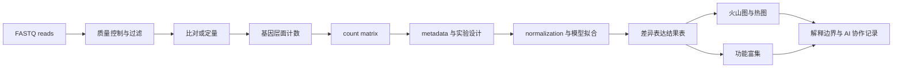
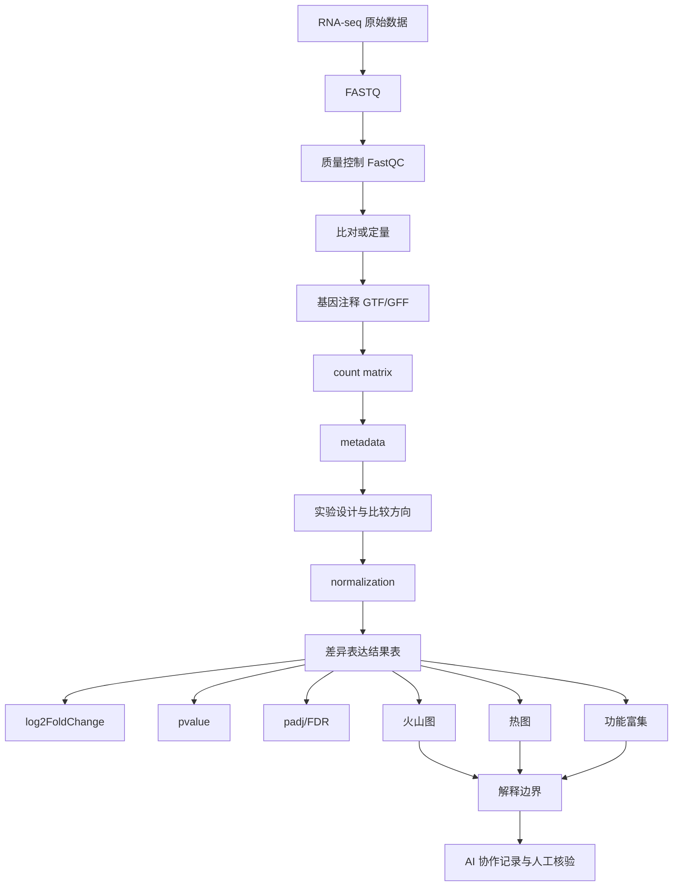

# 第12章 RNA-seq 数据链条与差异表达分析

## 本章定位

第12章把第11章学过的矩阵、标准化、PCA、聚类和热图，放入 bulk RNA-seq 的场景中使用。学生不再只看一个普通数据框，而要追踪一条更长的数据链：测序 reads 如何变成计数矩阵，样本信息如何进入实验设计，差异表达表和图形如何被解释。

本章不写成完整命令行生信教程。学生需要理解 FASTQ、质量控制、比对、计数、metadata、normalization、log2FoldChange、padj、火山图、热图和功能富集的入门含义，但不要求掌握所有底层软件参数。

| 本章承接 | 本章训练 | 后续使用 |
| --- | --- | --- |
| 第11章高维矩阵、标准化、聚类和热图 | RNA-seq 数据链条、count matrix、metadata、差异表达结果表 | 第13章公共数据库和序列数据、第14-15章单细胞和空间组学 |
| 第8章多重检验和 FDR | padj、FDR、火山图阈值、富集解释边界 | 组学结果解释、综合项目和课程汇报 |

本章处在 Vibe Coding 阶段。AI 可以帮助梳理流程、生成代码草稿、整理结果表和改写越界解释。学生必须核验样本来源、分组变量、批次、重复定义、设计公式、标准化方法、阈值、基因 ID 转换和医学解释边界。

## 学习目标

1. 能解释 FASTQ 到 count matrix 的主要步骤，并指出每一步的输入、输出和人工核验点。
2. 能区分 count matrix、metadata、标准化表达矩阵和差异表达结果表。
3. 能说明 RNA-seq normalization 的目的，并区分差异分析用的标准化和展示用的变换。
4. 能读懂差异表达结果表中的 `gene_id`、`gene_symbol`、`baseMean`、`log2FoldChange`、`pvalue` 和 `padj`。
5. 能为火山图、热图和富集图写图表契约，说明阈值、输入矩阵、标签规则和解释边界。
6. 能用克制语言解释差异表达和功能富集结果，不把统计筛选写成机制、药物靶点、疗效或临床建议。

## 阅读指南

先读 12.1 和 12.2，建立“文件到矩阵”的数据链条。再读 12.3，理解为什么 RNA-seq 不能直接比较 raw count。12.4 到 12.6 是结果解释部分，重点不在背软件函数，而在看懂字段、阈值、图表和证据边界。

本章案例采用两层材料。第一层是素材中已有的 RNA-seq/DESeq2 教学线索，其中 AIDD Bioinformatics 材料提到 DESeq2、airway 示例、count data、sample information、size factor、dispersion、火山图和基因 ID 转换。第二层是本章自建的教学模拟矩阵，用于展示字段检查和图表逻辑。模拟数据不代表真实医学发现。

## 核心概念速查

| 概念 | 本章解释 | 常见混淆 | 需保留英文 |
| --- | --- | --- | --- |
| FASTQ | 保存测序 reads 和质量信息的文本格式 | 把 FASTQ 当成表达矩阵 | FASTQ |
| read | 测序得到的一段核酸序列 | 直接等同于一个基因表达量 | read |
| GTF/GFF | 描述基因、转录本等基因组注释的文本格式 | 与 FASTQ 或 count matrix 混用 | GTF/GFF |
| 计数矩阵 | 基因和样本构成的原始计数表 | 与标准化表达矩阵混用 | count matrix |
| 元数据 | 描述样本分组、批次、时间点等信息的表 | 只看表达矩阵，不看样本信息 | metadata |
| 标准化 | 降低测序深度、尺度或组成差异影响的处理 | 与减均值除标准差混用 | normalization |
| 差异表达 | 比较预设组别后识别表达差异基因 | 写成机制证明 | differential expression |
| log2FoldChange | 两组表达差异倍数的 log2 表达 | 只看正负，不看比较方向 | log2FoldChange |
| 调整后 P 值 | 多重检验后用于控制错误发现的 P 值 | 只按未校正 P 值筛选 | adjusted P value / padj |
| 火山图 | 同时展示差异大小和统计显著性的散点图 | 只挑颜色最醒目的基因讲机制 | volcano plot |
| 功能富集 | 检查基因列表是否集中于某些基因集或通路 | 写成通路已被证明激活 | functional enrichment |

## 章节总览图



## 本章证据边界

| 表述类型 | 本章可以写 | 本章不能写 |
| --- | --- | --- |
| 流程 | FASTQ 经过 QC、比对或定量后可形成 count matrix | 某个流程适合所有 RNA-seq 项目 |
| 数据结构 | count matrix 需要与 metadata 对齐 | AI 可以根据列名自动猜分组 |
| 统计结果 | 差异表达表提示某些基因在比较中表达不同 | 差异表达证明疾病机制 |
| 图表 | 火山图展示 log2FoldChange 和 padj 关系 | 火山图中某基因就是药物靶点 |
| 富集 | 差异基因列表富集于某类功能或基因集 | 富集结果证明通路激活或可作为临床建议 |

## 核心内容

## 12.1 从 FASTQ 到计数矩阵

RNA-seq 的起点通常不是一个 Excel 表，而是测序产生的 reads。FASTQ 保存 reads 序列和每个碱基的质量信息。AIDD Bioinformatics 的 NGS 材料将 FASTQ、FastQC、比对、BAM/SAM、GTF/GFF 和 HTSeq-count 串成一条教学链条；Bioconductor OSTA 的 reads-to-counts 材料也把原始 reads 到 count matrix 的转换作为后续分析前提。

| 节点 | 输入 | 输出 | 学生要核验什么 |
| --- | --- | --- | --- |
| 原始数据 | FASTQ 文件 | reads 和质量分数 | 样本名、测序批次、文件是否完整 |
| 质量控制 | FASTQ | FastQC 报告或类似 QC 表 | 序列质量、接头污染、低质量 reads |
| 比对或定量 | reads、参考基因组或转录本集 | SAM/BAM 或定量表 | 参考版本、注释版本、比对率 |
| 特征计数 | BAM/SAM、GTF/GFF | gene-level count | 计数单位、基因 ID、样本列 |
| 矩阵整理 | 多个样本计数结果 | count matrix | 行列方向、样本 ID 是否一致 |

FASTQ 的四行结构包含 read 名称、碱基序列、分隔行和质量分数。学生不需要手工解析完整 FASTQ，但必须知道它还不是表达矩阵。只有 reads 被映射到基因或转录本，并完成计数后，才进入后续统计分析。

从 reads 到 count matrix 的路线不是唯一的。传统路线可以用比对器把 reads 对到参考基因组，再用 HTSeq-count、featureCounts 或类似工具按注释文件计数。另一类路线可以先做转录本定量，再汇总到基因层面。本章只要求理解这些路线都要留下参考版本、注释版本、参数和输出表。

```text
FASTQ -> 质量检查 -> 过滤/修剪 -> 比对或转录本定量 -> 基因注释汇总 -> count matrix
```

读到这里，学生要能回答一个基本问题：如果别人只给你一个差异表达表，你能否追溯它来自哪个 count matrix、哪个 metadata、哪个比较和哪个阈值。如果不能，后面的生物医学解释就应标 `需人工确认`。

## 12.2 count matrix、metadata 与实验设计

计数矩阵（count matrix）是 RNA-seq 差异表达分析的核心输入之一。常见结构是“行是基因，列是样本”，单元格是某个样本中分配到某个基因的 read count。这个表仍是原始计数，不是已经可以直接解释的表达差异。

metadata 是样本说明表。它至少要包含样本 ID 和分组变量，常见字段还包括批次、时间点、性别、处理、疾病状态、重复编号和是否纳入分析。没有 metadata，count matrix 只是一个矩阵，不能回答“比较谁和谁”。

| sample_id | condition | batch | replicate_type | include |
| --- | --- | --- | --- | --- |
| CTRL_1 | control | B1 | biological | TRUE |
| CTRL_2 | control | B1 | biological | TRUE |
| CTRL_3 | control | B2 | biological | TRUE |
| DRUG_1 | treated | B1 | biological | TRUE |
| DRUG_2 | treated | B2 | biological | TRUE |
| DRUG_3 | treated | B2 | biological | TRUE |

教学模拟 count matrix 可以长这样。这里的 `GENE_A` 等是假名，只用于说明结构。

| gene_id | CTRL_1 | CTRL_2 | CTRL_3 | DRUG_1 | DRUG_2 | DRUG_3 |
| --- | ---: | ---: | ---: | ---: | ---: | ---: |
| GENE_A | 120 | 132 | 115 | 260 | 248 | 275 |
| GENE_B | 540 | 510 | 575 | 490 | 505 | 470 |
| GENE_C | 18 | 12 | 15 | 44 | 39 | 52 |
| GENE_D | 900 | 870 | 940 | 920 | 910 | 895 |

实验设计不是把两个表放进软件这么简单。学生要先写出比较目标，例如“treated 相对 control 的表达差异”，再说明是否有批次、是否有生物学重复、是否需要在设计公式中纳入协变量。单个患者多个样本、同一个样本多次测序、同一培养批次多个孔，都不能不加说明地当作完全独立样本。

### R 核验代码：样本是否对齐

```r
count_matrix <- data.frame(
  gene_id = c("GENE_A", "GENE_B", "GENE_C", "GENE_D"),
  CTRL_1 = c(120, 540, 18, 900),
  CTRL_2 = c(132, 510, 12, 870),
  CTRL_3 = c(115, 575, 15, 940),
  DRUG_1 = c(260, 490, 44, 920),
  DRUG_2 = c(248, 505, 39, 910),
  DRUG_3 = c(275, 470, 52, 895)
)

metadata <- data.frame(
  sample_id = c("CTRL_1", "CTRL_2", "CTRL_3", "DRUG_1", "DRUG_2", "DRUG_3"),
  condition = c("control", "control", "control", "treated", "treated", "treated"),
  batch = c("B1", "B1", "B2", "B1", "B2", "B2")
)

gene_id <- count_matrix$gene_id
mat <- as.matrix(count_matrix[, -1])
rownames(mat) <- gene_id

stopifnot(all(colnames(mat) %in% metadata$sample_id))
metadata <- metadata[match(colnames(mat), metadata$sample_id), ]
stopifnot(identical(colnames(mat), metadata$sample_id))
```

这段代码只做结构核验，不做差异表达。它训练学生先确认“矩阵列名”和“metadata 样本 ID”一致，再进入 DESeq2 或其他差异分析工具。

## 12.3 RNA-seq 标准化思想

RNA-seq 的 raw count 不能直接跨样本比较。一个样本总 reads 多，很多基因的 count 都可能偏高；一个样本文库组成特殊，少数高表达基因也可能影响其他基因的相对计数。Bioconductor 和 AIDD 材料都把 library size、size factor、normalization 和 QC 放在差异分析前。

normalization 在本章中指降低测序深度、文库大小或组成差异对表达比较的影响。它不同于第11章 PCA/聚类常见的 standardization。standardization 往往是减均值、除标准差，用于让特征处于可比较尺度；RNA-seq normalization 关注的是测序计数如何在样本间更可比。

| 数据形态 | 主要用途 | 可否直接做图 | 可否直接解释为差异 |
| --- | --- | --- | --- |
| raw count | 差异分析模型的常见输入 | 可以做 QC 检查 | 不能直接跨样本解释 |
| normalized count | 样本间表达量检查 | 可以用于分布或趋势展示 | 仍需模型和设计 |
| log 转换表达矩阵 | PCA、热图、聚类展示 | 常用于可视化 | 不能替代正式差异分析 |
| TPM/FPKM | 表达量展示或跨基因长度校正场景 | 可用于部分展示 | 不应混作所有差异分析输入 |

DESeq2 的材料中提到 size factor 和 dispersion。size factor 用来处理测序深度或文库大小差异，dispersion 描述计数方差与均值的关系。学生不需要在本章推导负二项模型，但要知道这些步骤服务于一个目标：让高维 count 数据在实验设计下进行更合适的统计比较。

标准化也不能修复所有问题。如果病例全在一个批次，对照全在另一个批次，标准化后仍可能把批次差异当成分组差异。如果样本污染、标签错误或重复定义不清，模型结果也不能直接解释。

### 差异分析前的检查表

| 检查项 | 为什么查 | 不通过时怎么处理 |
| --- | --- | --- |
| 样本总 count | 识别测序深度差异和异常样本 | 回看 QC 报告和样本记录 |
| 检出基因数 | 识别低质量样本或低复杂度文库 | 标记低质量或 `需人工确认` |
| 分组 n | 判断是否有基本重复 | 不足时不写稳定结论 |
| 批次分布 | 检查混杂 | 修改设计或标出不可解释 |
| 低表达基因 | 降低噪声和多重检验负担 | 记录过滤规则 |

## 12.4 差异表达结果表

差异表达（differential expression）是比较预先定义的样本组后，识别在转录水平上显示统计差异的基因或转录本。它回答的是“在当前设计和数据下，哪些基因的表达差异更值得进一步查看”，不是“哪些基因导致疾病”。

AIDD 的 DESeq2 材料把分析流程概括为导入计数数据、读取样本信息、构建 DESeq2 对象、估计 size factor 和 dispersion、拟合模型、提取结果、可视化。sc_best_practices 材料也提醒：差异表达结果通常返回 log2 fold-change 和 adjusted p-value，原始 count 不是某个基因在某个样本中的绝对表达量。

### R/Bioconductor 主线代码骨架

本机环境本轮检查到 `BiocManager` 和 `ggplot2` 可用，但 `DESeq2`、`airway` 和 `pheatmap` 未安装。因此下面代码作为课程主线骨架，课堂运行前需要教师配置 Bioconductor 环境，或提前提供已运行的结果表。

```r
# 课堂运行前需安装：
# BiocManager::install(c("DESeq2", "airway", "pheatmap"))

library(DESeq2)

# mat: gene x sample 的整数 count matrix
# metadata: 行顺序与 mat 列顺序一致，包含 condition 字段
dds <- DESeqDataSetFromMatrix(
  countData = mat,
  colData = metadata,
  design = ~ condition
)

dds <- dds[rowSums(counts(dds)) >= 10, ]
dds <- DESeq(dds)

res <- results(
  dds,
  contrast = c("condition", "treated", "control")
)

res_tbl <- as.data.frame(res)
res_tbl$gene_id <- rownames(res_tbl)
res_tbl <- res_tbl[order(res_tbl$padj), ]
head(res_tbl)
```

这个代码的关键不是背函数，而是读懂每个输入。`countData` 必须是整数计数矩阵。`colData` 必须是样本信息表。`design = ~ condition` 表示模型中只放入 condition；如果存在批次而且不与分组完全混杂，可能需要写成 `design = ~ batch + condition`。比较方向由 `contrast` 决定。

### 结果表字段

| 字段 | 含义 | 学生要检查什么 |
| --- | --- | --- |
| `gene_id` | 基因稳定 ID，如 Ensembl ID | 是否有版本号，是否与注释库匹配 |
| `gene_symbol` | 常用基因名 | 是否一对多、缺失或过期 |
| `baseMean` | 所有样本标准化计数的平均水平 | 低表达基因是否被过滤 |
| `log2FoldChange` | 比较组相对参考组的 log2 倍数变化 | 比较方向是否写反 |
| `lfcSE` | log2 fold-change 的标准误 | 不确定性是否很大 |
| `stat` | 检验统计量 | 方法来源是否清楚 |
| `pvalue` | 未校正 P 值 | 不能作为唯一筛选标准 |
| `padj` | 多重检验校正后的 P 值 | 阈值和校正方式要记录 |

### Python 辅助检查结果表

Python 在本章作为结果表检查和可视化整理辅助。它不替代 DESeq2 建模。

```python
import pandas as pd
import numpy as np

res_tbl = pd.DataFrame({
    "gene_id": ["GENE_A", "GENE_B", "GENE_C", "GENE_D"],
    "gene_symbol": ["GeneA", "GeneB", "GeneC", "GeneD"],
    "baseMean": [190.0, 515.0, 30.0, 905.0],
    "log2FoldChange": [1.10, -0.12, 1.50, 0.02],
    "pvalue": [0.0008, 0.42, 0.018, 0.91],
    "padj": [0.0032, 0.56, 0.048, 0.91],
})

required = {"gene_id", "log2FoldChange", "pvalue", "padj"}
missing = required - set(res_tbl.columns)
if missing:
    raise ValueError(f"结果表缺少字段: {missing}")

res_tbl["direction"] = np.where(
    res_tbl["log2FoldChange"] > 0, "higher_in_treated",
    np.where(res_tbl["log2FoldChange"] < 0, "lower_in_treated", "no_direction")
)
res_tbl["pass_demo_threshold"] = (
    (res_tbl["padj"] < 0.05) & (res_tbl["log2FoldChange"].abs() >= 1)
)

print(res_tbl)
```

这张表是教学模拟结果。可以写“GENE_A 和 GENE_C 在模拟比较中满足示例阈值”，不能写“GeneA 和 GeneC 是药物作用机制”。

## 12.5 火山图、热图与差异基因展示

火山图（volcano plot）同时展示差异大小和统计显著性。横轴常用 `log2FoldChange`，纵轴常用 `-log10(padj)` 或 `-log10(pvalue)`。本教材建议优先使用 `padj`，并在图注里写清阈值。

| 火山图元素 | 必须说明 | 常见风险 |
| --- | --- | --- |
| 横轴 | log2FoldChange，比较方向 | treated/control 写反 |
| 纵轴 | `-log10(padj)` 或 `-log10(pvalue)` | 混用未校正 P 值和 padj |
| 颜色 | 阈值规则 | 只按颜色讲机制 |
| 标签 | 标注规则，如 top 10 或预先指定基因 | 事后挑显眼基因 |
| 图注 | 输入结果表版本和比较对象 | 不说明数据来源 |

### R 火山图示例

```r
library(ggplot2)

res_tbl <- data.frame(
  gene_id = c("GENE_A", "GENE_B", "GENE_C", "GENE_D"),
  gene_symbol = c("GeneA", "GeneB", "GeneC", "GeneD"),
  baseMean = c(190, 515, 30, 905),
  log2FoldChange = c(1.10, -0.12, 1.50, 0.02),
  pvalue = c(0.0008, 0.42, 0.018, 0.91),
  padj = c(0.0032, 0.56, 0.048, 0.91)
)

res_tbl$status <- ifelse(
  res_tbl$padj < 0.05 & abs(res_tbl$log2FoldChange) >= 1,
  "pass_demo_threshold",
  "not_pass"
)

ggplot(res_tbl, aes(log2FoldChange, -log10(padj), color = status)) +
  geom_point(size = 2) +
  geom_vline(xintercept = c(-1, 1), linetype = "dashed") +
  geom_hline(yintercept = -log10(0.05), linetype = "dashed") +
  labs(
    x = "log2FoldChange: treated vs control",
    y = "-log10(adjusted P value)",
    color = "示例阈值"
  ) +
  theme_minimal()
```

热图（heatmap）用于展示选定基因在样本中的表达模式。它不能证明正式分型，也不能替代差异分析。热图的关键是写清输入矩阵、筛选基因、标准化尺度、距离度量、聚类方法和样本注释条。

| 热图问题 | 正确处理 |
| --- | --- |
| 用哪些基因 | 预先说明：如 padj < 0.05 且 abs(log2FC) >= 1 的基因，或 top N 基因 |
| 用什么矩阵 | 用变换后的表达矩阵展示，不把 raw count 直接拿来比较颜色 |
| 是否行标准化 | 如果行标准化，说明颜色表示相对高低，不是原始表达量 |
| 是否聚类 | 写清距离和聚类方法 |
| 如何解释 | 只写“显示表达模式”，不写“证明分型” |

如果课堂环境没有 `pheatmap`，可以先使用 base R 的 `heatmap()` 或 Python 的 `seaborn.heatmap()`。正式项目建议保存源数据、绘图脚本和图表契约。

## 12.6 功能富集与结果解释边界

功能富集（functional enrichment）检查的是差异基因列表是否集中于某些功能类别、通路或基因集。它不是机制实验，也不是临床建议。输入、背景集和数据库版本会影响结果。

| 富集分析要素 | 要记录什么 | 解释边界 |
| --- | --- | --- |
| 输入基因 | 上调、下调或全部候选基因；阈值 | 不同输入会得到不同结果 |
| ID 类型 | Ensembl、Entrez、gene symbol | ID 转换错误会影响富集 |
| 背景集 | 所有可检测基因或测试过的基因 | 不能默认用全基因组 |
| 数据库 | GO、KEGG、Reactome、MSigDB 等 | 数据库词条不是实验结果 |
| 校正方式 | padj、FDR 或 q value | 不只看未校正 P 值 |
| 结果字段 | term、description、gene count、ratio、pvalue、padj、gene list | 不能只复制最漂亮词条 |

常见入门方法有两类。过度表示分析（over-representation analysis, ORA）通常输入一组候选基因，检查这些基因是否在某些基因集中出现得更多。排序型基因集分析（gene set enrichment analysis, GSEA）通常输入按统计量或 fold-change 排序的全基因列表，检查基因集是否集中在排序列表前端或后端。

生物医药大数据材料中对 GSEA 的说明强调：GSEA 使用预定义基因集，并将基因按两类样本的差异表达程度排序，再检验基因集合是否富集在排序表顶部或底部。该材料还提到多重假设检验和 FDR。正文只采用这一概念边界，不引入材料中的高性能算法细节。

| 越界说法 | 为什么不合适 | 教材建议写法 |
| --- | --- | --- |
| 富集结果证明通路被激活 | 富集是基因列表和基因集的统计关系 | 差异基因列表在该通路相关基因集中出现较多，提示该功能方向值得进一步检查 |
| 某基因是药物靶点 | 差异表达不等于靶点验证 | 该基因在当前比较中显示表达差异，是否具备靶点价值需补文献和实验 |
| 疾病由这些基因导致 | 由表达差异推出因果 | 该结果支持候选转录变化，因果关系仍需独立验证 |
| AI 总结为临床意义 | AI 越过证据层级 | 保留为 `需补证据` 或 `需人工确认` |

## 案例任务

本章案例任务使用“素材线索 + 教学模拟数据”的组合。素材线索来自 AIDD Bioinformatics 的 RNA-seq、DESeq2 和 ggplot2 材料，以及 Bioconductor/OSTA/SCBP 中 reads-to-counts、normalization、DGE、FDR 和特征集材料。教学模拟数据只服务字段核验和图表契约。

| 项目 | 内容 |
| --- | --- |
| 数据背景 | 教学模拟 bulk RNA-seq count matrix、metadata、差异表达结果表 |
| 任务目标 | 核对样本信息，解释标准化目的，整理差异表达表，设计火山图和热图契约，审阅富集解释 |
| 操作步骤 | 样本 ID 对齐；分组和批次检查；写设计公式；整理结果表；绘制或审阅图；写解释边界；保存 AI 协作记录 |
| 交付物 | 数据链条流程图、metadata 检查表、设计说明、结果字段解释、火山图契约、热图契约、富集边界表 |
| 禁止事项 | 不让 AI 猜分组；不改原始材料；不只报告显著基因；不把富集写成机制；不新增临床结论 |

## 图表建议

| 图表 | 目的 | 必备标注 | 不可越界解释 |
| --- | --- | --- | --- |
| RNA-seq 数据链条图 | 展示 FASTQ 到 count matrix 再到差异表达结果 | 输入、处理、输出、人工核验点 | 不表示所有项目都采用同一软件 |
| count matrix 与 metadata 对照表 | 展示矩阵列和样本信息匹配 | sample_id、condition、batch、replicate | 不把分组含义交给 AI 猜测 |
| 标准化前后分布示意图 | 说明 normalization 目的 | raw/normalized、样本、尺度 | 不写成消除了所有偏差 |
| 差异表达结果字段图 | 帮学生读懂结果表 | log2FoldChange、pvalue、padj、方向 | 不把结果表写成机制表 |
| 火山图 | 展示差异大小和显著性 | 阈值、比较对象、padj 口径、标签规则 | 不挑单个基因过度解释 |
| 差异基因热图 | 展示选定基因在样本中的表达模式 | 输入矩阵、行标准化、聚类方法、注释条 | 不证明分型或机制 |
| 富集结果边界表 | 区分富集统计、允许解释和需验证内容 | 数据库、背景集、padj、基因列表 | 不写临床建议 |

## AI 协作点

| 场景 | 可让 AI 做什么 | 学生必须核验什么 |
| --- | --- | --- |
| 流程梳理 | 根据任务目标生成 RNA-seq 流程图和核验清单 | 是否符合当前数据来源和课程边界 |
| 表格检查 | 找出 count matrix 和 metadata 是否缺字段 | 样本 ID、分组、批次、重复、缺失值 |
| R 代码草稿 | 生成 DESeq2 读取、设计对象、结果整理代码 | 包版本、列名、设计公式、比较方向 |
| Python 辅助 | 检查结果字段、阈值、排序和图表输入 | Python 输出是否来自真实结果表 |
| 图表生成 | 生成火山图、热图或富集图初稿 | 输入矩阵、阈值、标签规则、图注边界 |
| 结果解释 | 改写越界表述，整理“观察-统计-解释-需验证”表 | 不新增机制、疗效、临床建议或样本量 |

## 常见误区

| 误区 | 为什么错 | 如何纠正 |
| --- | --- | --- |
| 把 raw count 直接比较为表达差异 | 测序深度和文库组成会影响 count | 先说明 normalization 和模型设计 |
| 只按 P 值筛选基因 | 高维检验会产生大量假阳性 | 同时看 log2FC、padj、表达水平和阈值 |
| 不写比较方向 | log2FC 正负依赖 baseline | 写清 treated vs control 或相反方向 |
| 热图聚类后写成分型 | 聚类是可视化模式，不是诊断分型 | 写“显示表达模式”，不写“证明分型” |
| 富集词条直接写机制 | 富集不是机制实验 | 写“提示该功能方向值得进一步检查” |
| AI 自动生成结论 | AI 不知道真实实验设计 | 用核验清单逐项审阅 |

## 核验清单

- 已核对 `大纲.md` 和 `chapters/chapter-12/本章大纲.md`。
- count matrix 的列名与 metadata 的 `sample_id` 完全一致。
- metadata 中分组、批次、重复定义和纳入规则有来源。
- 设计公式和比较方向已经写清。
- 标准化方法、低表达过滤规则和异常样本处理有记录。
- 差异表达结果表保留 `log2FoldChange`、`pvalue`、`padj` 和基因 ID。
- 火山图说明阈值、纵轴口径、标签规则和比较对象。
- 热图说明输入矩阵、是否行标准化、距离和聚类方法。
- 富集分析说明输入基因、背景集、数据库版本和校正方式。
- 正文区分观察结果、统计结果、允许解释和仍需验证内容。
- AI 生成代码或文字已记录提示词、人工修改和运行结果。

## 知识结构与知识图谱生成提示词



可用于生成教学示意图的提示词：

```text
请生成一张教学用知识图谱，主题为“bulk RNA-seq 数据链条与差异表达分析”。
目标读者是药学本科生和研究生。
图中包含以下节点：FASTQ、质量控制、比对或定量、GTF/GFF 注释、count matrix、metadata、实验设计、normalization、DESeq2、差异表达结果表、log2FoldChange、padj、火山图、热图、功能富集、解释边界、AI 协作记录。
图形风格简洁、白底、节点层级清楚，不要生成复杂背景。
如果图中中文标签不清楚，正文以 Mermaid 图和表格为准。
```

本章未使用 imagegen 生成图片。若后续使用生成图，该图只作为教学展示，不能作为知识来源。

## 实验或作业

### 作业 1：RNA-seq 数据链条卡片

给定一个项目说明：已有 6 个 FASTQ 文件、一个 GTF 文件、一个计数矩阵和一个 metadata 文件。请画出从 FASTQ 到差异表达结果的流程图，并标注每一步需要核验的内容。

提交内容：流程图、核验表、`需人工确认` 列表。

评分点：流程完整、输入输出清楚、未把 FASTQ 写成表达矩阵、未遗漏 metadata。

### 作业 2：metadata 与设计公式检查

给定一个 count matrix 和 metadata，检查样本 ID 是否一致，写出比较目标和设计公式。若发现分组与批次完全混杂，应标出不能直接解释。

提交内容：样本匹配代码、设计说明、风险说明。

评分点：样本顺序正确、比较方向清楚、批次和重复定义有说明。

### 作业 3：差异表达结果解释审阅

给定一张差异表达结果表、一张火山图和一段 AI 生成解释。请指出其中是否有过度解释，并改写为克制表述。

提交内容：问题清单、修改后表述、仍需补证据。

评分点：能识别 P 值误读、log2FC 方向错误、富集越界、药物靶点或临床建议越界。

## 需补证据

| 位置 | 缺口 | 处理方式 |
| --- | --- | --- |
| 真实 bulk RNA-seq 数据文件 | 当前素材中没有可直接作为课堂输入的本地 count matrix 和 metadata | 正文使用教学模拟数据，并明确不代表真实医学结论 |
| DESeq2 本地运行 | 本机未安装 `DESeq2` 和 `airway` | 正文提供代码骨架；课堂运行前需预装包或提供结果表 |
| 医药案例结论 | 当前材料未给出可验证疾病、药物、样本量和差异表达结果 | 不写机制、靶点、疗效或临床建议 |
| 功能富集数据库 | 只读取到 GSEA、MSigDB、GO/KEGG/Reactome 等概念和边界线索 | 正文讲解释边界，不生成具体富集结论 |
| 软件版本 | 材料涉及不同来源和课程字幕，软件版本未统一 | 正文避免写死版本；正式实训需记录环境信息 |

