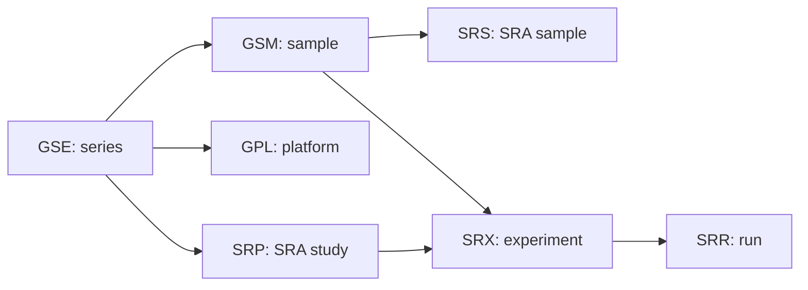

# 第12章来源拓展：airway 的 GEO 与 SRA 历史记录

本页保存2026-07-10的GEO/SRA查询及FASTQ小子集运行记录，包括样本映射、run规模、命令、软件版本和格式检查结果。2026-10-02整理这些历史记录，没有重新执行本文的SRA查询或下载命令。再次取得数据时，请把新查询日期和运行输出记入自己的记录，便于比较不同时间的数据状态。

公共数据库检索先把问题写成可查、可排除、可复核的任务，再决定下载哪些文件。比如“找哮喘相关 RNA-seq 数据”还不够清楚；更可执行的写法是：人源样本，气道相关细胞，RNA-seq，是否有原始 reads，是否有处理后表达矩阵，是否有处理条件和供体信息。

| 检索任务字段 | GSE52778 案例写法 |
| --- | --- |
| 数据库入口 | GEO series 页面、SRA run 记录、NCBI E-utilities |
| 关键词 | airway smooth muscle、Homo sapiens、RNA-seq、dexamethasone |
| series accession | `GSE52778` |
| BioProject | `PRJNA229998` |
| SRA study | `SRP033351` |
| 平台 | `GPL11154`，Illumina HiSeq 2000 |
| 完整 series | 16 个 GSM 样本 |
| 教学子集 | 8 个 GSM 样本，对应 Bioconductor `airway` 数据集常用样本 |

GEO 的 `GSE` 是 series 层级，通常描述一项研究或一组相关实验。`GSM` 是 sample 层级，描述一个样本或样本处理条件。`GPL` 是平台层级，描述测序或芯片平台。SRA 侧还会出现 `SRP`、`SRX`、`SRS` 和 `SRR`：`SRP` 接近 study/project 层级，`SRX` 对应实验，`SRS` 对应样本，`SRR` 对应一次测序 run。



下表由脚本在2026-07-10通过NCBI Entrez E-utilities查询SRA后生成，覆盖8个`airway`教学样本。`total_spots`表示run中的spot总数，`total_bases`表示碱基总数；对于paired数据，一个spot可含两端read，因此spot数与FASTQ记录数需要分别登记。2026-07-10的格式练习只从一个run抽取前20个spot。

| GSM | 样本说明 | SRP | SRX | SRS | SRR | reads 层级提示 |
| --- | --- | --- | --- | --- | --- | --- |
| `GSM1275862` | N61311_untreated | `SRP033351` | `SRX384345` | `SRS508568` | `SRR1039508` | paired，22,935,521 spots |
| `GSM1275863` | N61311_Dex | `SRP033351` | `SRX384346` | `SRS508567` | `SRR1039509` | paired，21,155,707 spots |
| `GSM1275866` | N052611_untreated | `SRP033351` | `SRX384349` | `SRS508571` | `SRR1039512` | paired，28,136,282 spots |
| `GSM1275867` | N052611_Dex | `SRP033351` | `SRX384350` | `SRS508572` | `SRR1039513` | paired，43,356,464 spots |
| `GSM1275870` | N080611_untreated | `SRP033351` | `SRX384353` | `SRS508575` | `SRR1039516` | paired，30,043,024 spots |
| `GSM1275871` | N080611_Dex | `SRP033351` | `SRX384354` | `SRS508576` | `SRR1039517` | paired，34,298,260 spots |
| `GSM1275874` | N061011_untreated | `SRP033351` | `SRX384357` | `SRS508579` | `SRR1039520` | paired，34,575,286 spots |
| `GSM1275875` | N061011_Dex | `SRP033351` | `SRX384358` | `SRS508580` | `SRR1039521` | paired，41,152,075 spots |

完整 `GSE52778` 与 `airway` 教学子集要分开写。完整 series 有 16 个样本，教学子集只取 8 个常用样本。若学生只写“GSE52778 有 8 个样本”，就把教学包范围误写成数据库记录范围。

| 层级 | 可写表述 | 不可写表述 |
| --- | --- | --- |
| GEO series | `GSE52778` 官方页面列出 16 个样本 | `GSE52778` 只有 8 个样本 |
| 教学数据 | `airway` 常用 8 个样本做 RNA-seq 差异分析教学 | 8 个样本代表完整研究 |
| SRA run | 每个教学 GSM 可追踪到一个 SRR run | SRR 编号可以替代样本说明 |
| 处理条件 | untreated 与 Dex 是样本说明中的条件信息 | 仅凭编号推断实验设计 |


2026-07-10对`SRR1039508`实际执行的是小子集命令。完整run流程按NCBI SRA Toolkit官方指南使用`prefetch + fasterq-dump`；小子集命令用`fastq-dump -X 20`抽取前20个spot，供四行结构和配对编号识读。两段命令处理的数据范围不同，运行记录应写清所选范围。

```powershell
# 完整run流程示例；2026-07-10记录未执行这组命令
prefetch SRR1039508
vdb-validate SRR1039508
fasterq-dump --split-files --threads 6 SRR1039508
```

```powershell
# 2026-07-10实际执行：抽取20个spot作为教学FASTQ子集
fastq-dump --split-files --skip-technical -X 20 --outdir case_artifacts SRR1039508
```

2026-07-10的格式练习使用SRA Toolkit `3.4.1`。`fastq-dump`输出为`Read 20 spots for SRR1039508`与`Written 20 spots for SRR1039508`；后续格式检查读取生成的两份FASTQ文件。

| 字段 | `SRR1039508` 下载登记 |
| --- | --- |
| 检索日期 | 2026-07-10 |
| 数据库 | NCBI GEO、NCBI SRA |
| 登录号 | `GSE52778`、`GSM1275862`、`SRP033351`、`SRR1039508` |
| 样本 | `GSM1275862: N61311_untreated; Homo sapiens; RNA-Seq` |
| 实验设计 | 完整 series 为 4 名供体 x 4 条件；2026-07-10格式练习只使用 untreated run |
| 数据层级 | `GSE` series -> `GSM` sample -> `SRP/SRX/SRS` -> `SRR` run -> FASTQ 子集 |
| 文件 | `SRR1039508_1.fastq`、`SRR1039508_2.fastq` |
| 工具版本 | SRA Toolkit `3.4.1` |
| 命令 | `fastq-dump --split-files --skip-technical -X 20 --outdir case_artifacts SRR1039508` |
| 校验结果 | R1/R2 各 20 条记录，四行结构有效，mate ID 对齐 |
| 引用 | GEO/SRA官方记录与原始研究：GSE52778、SRR1039508、Himes等（PMID 24926665） |
| 许可状态 | 2026-07-10查询记录未保存明确的再分发许可文本；本页提供来源与命令，不随基础包分发该FASTQ子集 |

2026-07-10查询的完整`SRR1039508`有22,935,521个spot，远大于本页的20个spot子集。基础练习先识读本地构造小文件；准备完整run拓展时，再根据当次记录规划下载与磁盘空间，登记数据使用条款、原始研究引用和完整性检查。

```text
2026-07-10下载与格式检查记录摘要
记录日期: 2026-07-10
accession: SRR1039508
命令: fastq-dump --split-files --skip-technical -X 20 ...
工具: SRA Toolkit 3.4.1
输出: SRR1039508_1.fastq, SRR1039508_2.fastq
校验: R1=20, R2=20, mate_id_aligned=true
再分发许可文本: 2026-07-10记录未保存
```

相关入口：[GSE52778官方记录](https://www.ncbi.nlm.nih.gov/geo/query/acc.cgi?acc=GSE52778)、[SRR1039508官方记录](https://www.ncbi.nlm.nih.gov/sra/?term=SRR1039508)、[Himes等原始研究](https://pubmed.ncbi.nlm.nih.gov/24926665/)、[SRA Toolkit下载指南](https://github.com/ncbi/sra-tools/wiki/HowTo:-Downloading-SRA-data-into-SRA-format)。
