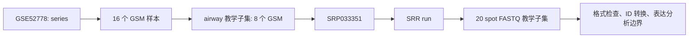
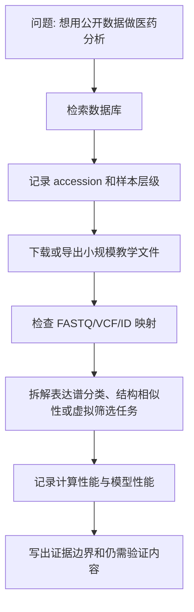
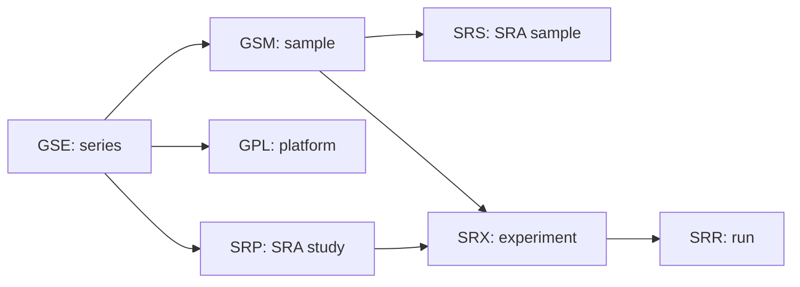
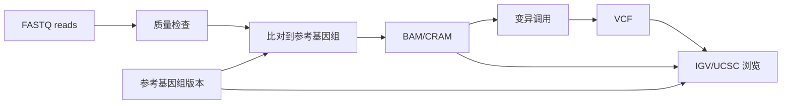
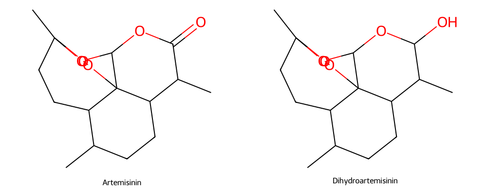
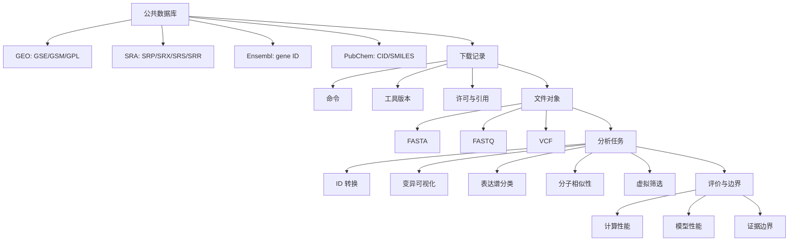

# 第13章 公共数据库、序列数据与医药大数据智能分析

## 本章定位

第12章已经说明 RNA-seq 数据怎样从 FASTQ 走向计数矩阵和差异表达结果。第13章把视角前移到公共数据来源，也把视角后移到医药 AI 任务。本章不做数据库大全，不做完整命令行生信教程，而是训练一条可复核路线：先找准数据，再记录下载和引用，再读懂文件格式，最后限定模型结果能解释到哪里。

| 本章任务 | 学生应提交的学习证据 |
| --- | --- |
| 公共数据库检索 | 检索记录卡，含 accession、数据库、检索日期和待确认事项 |
| 数据下载与引用 | 下载登记表，含命令、文件、工具版本、校验状态和许可状态 |
| 文件格式识读 | FASTA、FASTQ、VCF 与 ID 转换核验表 |
| 变异可视化入门 | FASTQ 到 VCF 再到 IGV/UCSC 的流程图和检查清单 |
| 医药 AI 任务拆解 | 输入、标签、模型、指标、边界和仍需验证内容 |
| 计算平台记录 | 运行时间、内存、磁盘、工具版本和复现边界 |

本章贯穿案例使用 [GSE52778](https://www.ncbi.nlm.nih.gov/geo/query/acc.cgi?acc=GSE52778) 的 airway RNA-seq 数据。官方页面显示，该 series 是人气道平滑肌细胞转录组项目，包含 4 名供体在 4 种处理条件下的 16 个样本，BioProject 为 `PRJNA229998`，SRA study 为 `SRP033351`。课堂只取 `airway` 教学子集中的 8 个样本，避免把完整 series 与教学子集混为一谈。



本章所有案例分为三类。第一类来自官方数据库页面或本轮实际运行结果，可以写入正文。第二类来自参考资料中的教学案例，可以作为来源时期的计算或模型例子。第三类是明确标注的教学模拟，例如 4 行 VCF，只用于讲文件结构和解析方法。

| 证据类型 | 可写内容 | 不写内容 |
| --- | --- | --- |
| 官方记录 | accession、样本层级、BioProject、SRP/SRR、PubChem CID、Ensembl 映射状态 | 数据质量结论、医学判定 |
| 本轮运行 | FASTQ 子集、VCF 解析、RDKit 版本、Tanimoto 相似度、耗时 | 大规模流程性能外推 |
| 教学模拟 | 字段结构、解析逻辑、检查清单 | 患者结论、变异意义、用药建议 |
| 参考资料案例 | 表达谱数据维度、虚拟筛选排序、计算平台经验 | 当前通用基准、真实应用结论 |

## 核心概念速查

| 术语 | 本章中的含义 | 使用边界 |
| --- | --- | --- |
| accession | 公共数据库中用于追踪 series、sample、run、compound 或基因记录的编号 | 必须和数据库、检索日期、页面 URL 一起记录 |
| GEO | Gene Expression Omnibus，常用于表达谱和功能基因组数据检索 | 不能只看标题，要核验样本、平台、分组和原始研究说明 |
| SRA | Sequence Read Archive，常用于保存测序 reads | 下载后仍要检查文件完整性、格式和质量 |
| FASTA | 记录序列名称和序列内容的文本格式 | 通常不含逐碱基质量信息 |
| FASTQ | 记录 reads、序列和质量字符的文本格式 | 有质量字符不等于样本可直接用于分析 |
| VCF | Variant Call Format，记录候选变异位点和过滤状态 | VCF 不是医学判定文件 |
| ID 转换 | 在 Ensembl ID、gene symbol、NCBI Gene ID 等体系之间映射 | 要保留原始 ID、版本、物种和未匹配项 |
| SMILES | 用字符描述分子结构的表示法 | 可用于计算结构特征，不能替代实验数据 |
| Tanimoto | 常用于比较分子指纹重叠程度的相似度 | 只反映所选指纹下的结构相似性 |

## 阅读指南



AI 在本章可以参与生成检索式、整理表格、解释字段、写检查代码和润色记录。学生必须核验数据库页面、样本分组、文件内容、工具版本、命令参数、输出数值和解释边界。AI 输出不能替代原始页面或本地运行记录。

| AI 可协助 | 人工必须核验 |
| --- | --- |
| 生成 GEO/SRA 检索式 | accession 是否真实存在，样本数是否来自页面 |
| 整理 GSM-SRR 表 | GSM、SRX、SRS、SRP、SRR 层级是否对应 |
| 写 FASTQ/VCF 解析代码 | 代码是否在当前文件上跑通 |
| 解释 Ensembl ID 转换 | 物种、数据库版本、未匹配项是否保留 |
| 设计模型指标表 | 是否有数据泄漏、类别不平衡和外部验证问题 |

## 13.1 GEO、SRA 与 NCBI 数据检索

公共数据库检索的第一步不是下载，而是把问题写成可查、可排除、可复核的任务。比如“找哮喘相关 RNA-seq 数据”还不够清楚；更可执行的写法是：人源样本，气道相关细胞，RNA-seq，是否有原始 reads，是否有处理后表达矩阵，是否有处理条件和供体信息。

| 检索任务字段 | GSE52778 案例写法 |
| --- | --- |
| 数据库入口 | GEO series 页面、SRA run 记录、NCBI E-utilities |
| 关键词 | airway smooth muscle、Homo sapiens、RNA-seq、dexamethasone |
| series accession | `GSE52778` |
| BioProject | `PRJNA229998` |
| SRA study | `SRP033351` |
| 平台 | `GPL11154`，Illumina HiSeq 2000 |
| 完整 series | 16 个 GSM 样本 |
| 教学子集 | 8 个 GSM 样本，对应 Bioconductor `airway` 数据集常用样本 |

GEO 的 `GSE` 是 series 层级，通常描述一项研究或一组相关实验。`GSM` 是 sample 层级，描述一个样本或样本处理条件。`GPL` 是平台层级，描述测序或芯片平台。SRA 侧还会出现 `SRP`、`SRX`、`SRS` 和 `SRR`：`SRP` 接近 study/project 层级，`SRX` 对应实验，`SRS` 对应样本，`SRR` 对应一次测序 run。



本轮用 NCBI Entrez E-utilities 核验了 8 个 `airway` 教学样本。下表不是从记忆中摘抄，而是脚本在 2026-07-10 查询 SRA 后生成的映射表。这里的 `total_spots` 和 `total_bases` 说明完整 run 很大，因此课堂只抽取 20 个 spot 作为格式教学数据。

| GSM | 样本说明 | SRP | SRX | SRS | SRR | reads 层级提示 |
| --- | --- | --- | --- | --- | --- | --- |
| `GSM1275862` | N61311_untreated | `SRP033351` | `SRX384345` | `SRS508568` | `SRR1039508` | paired，22,935,521 spots |
| `GSM1275863` | N61311_Dex | `SRP033351` | `SRX384346` | `SRS508567` | `SRR1039509` | paired，21,155,707 spots |
| `GSM1275866` | N052611_untreated | `SRP033351` | `SRX384349` | `SRS508571` | `SRR1039512` | paired，28,136,282 spots |
| `GSM1275867` | N052611_Dex | `SRP033351` | `SRX384350` | `SRS508572` | `SRR1039513` | paired，43,356,464 spots |
| `GSM1275870` | N080611_untreated | `SRP033351` | `SRX384353` | `SRS508575` | `SRR1039516` | paired，30,043,024 spots |
| `GSM1275871` | N080611_Dex | `SRP033351` | `SRX384354` | `SRS508576` | `SRR1039517` | paired，34,298,260 spots |
| `GSM1275874` | N061011_untreated | `SRP033351` | `SRX384357` | `SRS508579` | `SRR1039520` | paired，34,575,286 spots |
| `GSM1275875` | N061011_Dex | `SRP033351` | `SRX384358` | `SRS508580` | `SRR1039521` | paired，41,152,075 spots |

完整 `GSE52778` 与 `airway` 教学子集要分开写。完整 series 有 16 个样本，教学子集只取 8 个常用样本。若学生只写“GSE52778 有 8 个样本”，就把教学包范围误写成数据库记录范围。

| 层级 | 可写表述 | 不可写表述 |
| --- | --- | --- |
| GEO series | `GSE52778` 官方页面列出 16 个样本 | `GSE52778` 只有 8 个样本 |
| 教学数据 | `airway` 常用 8 个样本做 RNA-seq 差异分析教学 | 8 个样本代表完整研究 |
| SRA run | 每个教学 GSM 可追踪到一个 SRR run | SRR 编号可以替代样本说明 |
| 处理条件 | untreated 与 Dex 是样本说明中的条件信息 | 仅凭编号推断实验设计 |

**核验框：GSE35570。** 参考素材中出现过“GSC 35570”的写法，本章统一校正为 [GSE35570](https://www.ncbi.nlm.nih.gov/geo/query/acc.cgi?acc=GSE35570)。官方页面显示它是甲状腺乳头状癌相关表达谱数据，series 页面列出 116 条 sample 记录；overall design 描述的是 65 例病例，其中 33 例为暴露组、32 例为非暴露组。

| 项目 | 正确记录 | 解释边界 |
| --- | --- | --- |
| accession | `GSE35570` | 不是 `GSC 35570` |
| sample 记录 | 116 条 GSM 记录 | 这是数据库样本记录口径 |
| 病例口径 | 65 例甲状腺乳头状癌病例 | 这是病例层面的统计口径 |
| 教学处理 | 可作为“样本记录数”和“病例数”不同的例子 | 不用它展开医学结论 |

学生完成检索后，应提交一张记录卡。记录卡只回答“我查到了什么、下一步怎么核验”，不回答“这个数据说明什么”。写作时要把检索结果、文件对象、统计分析和医学解释放在不同层级。

| 检索记录卡字段 | 填写要求 |
| --- | --- |
| 检索日期 | 使用绝对日期，如 2026-07-10 |
| 数据库 | GEO、SRA、PubChem、Ensembl 等 |
| 检索式 | 关键词、物种、组织、技术类型 |
| 候选 accession | GSE、GSM、SRP、SRR 等编号 |
| 初筛理由 | 样本、平台、数据类型是否匹配 |
| 排除理由 | 物种不符、样本不足、无原始数据、说明不清 |
| 待确认 | 引用、许可、分组、原始论文、下载方式 |

## 13.2 数据下载记录、许可与引用

下载记录是分析的一部分。公共数据库页面可能更新，下载工具可能升级，样本说明可能被重新整理；没有下载记录，别人无法判断你使用的是哪一批文件、哪一种命令和哪一个版本的工具。

| 记录对象 | 为什么要写 |
| --- | --- |
| accession 和 URL | 让别人能找到同一条数据库记录 |
| 下载日期 | 说明数据页面和工具版本所处时间 |
| 工具版本 | 同一命令在不同版本中可能表现不同 |
| 文件名和大小 | 便于检查下载是否截断或覆盖 |
| 校验结果 | 区分“命令跑完”和“文件可读取” |
| 引用和许可 | 区分可下载、可分析、可再分发和需授权 |
| 待确认事项 | 把没有核验的部分显式留下 |

本轮对 `SRR1039508` 只执行课堂小子集命令。生产流程示范采用 NCBI SRA Toolkit 官方指南中的 `prefetch + fasterq-dump` 思路；课堂命令用 `fastq-dump -X 20` 抽取前 20 个 spot。两者不能混写：前者用于完整 run 的生产处理，后者只用于格式识读。

```powershell
# 生产流程示范：不在课堂任务中执行完整下载
prefetch SRR1039508
vdb-validate SRR1039508
fasterq-dump --split-files --threads 6 SRR1039508
```

```powershell
# 本轮实际执行：只抽取 20 个 spot 作为教学 FASTQ 子集
fastq-dump --split-files --skip-technical -X 20 --outdir case_artifacts SRR1039508
```

本轮 SRA Toolkit 采用任务目录内便携版，不修改全局 Conda 配置。`prefetch.exe`、`fasterq-dump.exe` 和 `fastq-dump.exe` 均为 `3.4.1`。`fastq-dump` 实际输出提示为 `Read 20 spots for SRR1039508` 与 `Written 20 spots for SRR1039508`，命令耗时 `9.654` 秒。

| 字段 | `SRR1039508` 下载登记 |
| --- | --- |
| 检索日期 | 2026-07-10 |
| 数据库 | NCBI GEO、NCBI SRA |
| 登录号 | `GSE52778`、`GSM1275862`、`SRP033351`、`SRR1039508` |
| 样本 | `GSM1275862: N61311_untreated; Homo sapiens; RNA-Seq` |
| 实验设计 | 完整 series 为 4 名供体 x 4 条件；本轮只用 untreated 教学 run |
| 数据层级 | `GSE` series -> `GSM` sample -> `SRP/SRX/SRS` -> `SRR` run -> FASTQ 子集 |
| 文件 | `SRR1039508_1.fastq`、`SRR1039508_2.fastq` |
| 工具版本 | SRA Toolkit `3.4.1` |
| 命令 | `fastq-dump --split-files --skip-technical -X 20 --outdir case_artifacts SRR1039508` |
| 校验结果 | R1/R2 各 20 条记录，四行结构有效，mate ID 对齐 |
| 引用 | GEO/SRA 官方记录与原始研究说明，具体引用格式需按课程项目要求整理 |
| 许可状态 | 数据页未在本轮整理出明确再使用许可文本，标 `需人工确认` |

许可记录要克制。公共数据库能访问，不等于可以无限制再分发、商业使用或脱离原始研究说明使用。若页面没有明确许可文本，课程报告应写 `需人工确认`，再附上已查看的页面和时间。

| 常见写法 | 更稳妥的写法 |
| --- | --- |
| 数据公开，所以可以随便用 | 数据可访问；再使用和引用要求需查官方页面或原始研究 |
| 下载成功，所以数据可靠 | 下载成功；仍需完整性检查、质量检查和样本说明核验 |
| 引用 GEO 即可 | 同时记录 GEO/SRA accession、原始研究、下载日期和工具版本 |
| 文件放在电脑里就算完成 | 写清文件路径、大小、命令、校验结果和待确认项 |

本章不要求学生下载完整 `SRR1039508`。该 run 官方记录显示有 22,935,521 spots，完整 FASTQ 可能带来较大下载和磁盘需求。课堂重点是能区分生产流程和教学子集，并能把命令、文件和校验结果写入记录。

```text
课堂下载记录最小合格线
accession: SRR1039508
命令: fastq-dump --split-files --skip-technical -X 20 ...
工具: SRA Toolkit 3.4.1
输出: SRR1039508_1.fastq, SRR1039508_2.fastq
校验: R1=20, R2=20, mate_id_aligned=true
许可: 需人工确认
```

## 13.3 FASTA、FASTQ、VCF 与 ID 转换

FASTA、FASTQ、BAM、VCF 和 ID 映射表处在不同数据层级。学生容易把“序列文件”“表达矩阵”“变异结果”和“基因名表”混在一起。本章先建立对象边界，再讲如何检查。

| 对象 | 记录单位 | 必需字段或结构 | 常见错误 | 检查方法 |
| --- | --- | --- | --- | --- |
| FASTA | 一条序列 | `>` 标题行，后接序列内容 | 把 FASTQ 误写成 FASTA；标题重复 | 检查标题行、序列字符、重复 ID |
| FASTQ | 一条 read | 4 行：标识、序列、`+`、质量字符串 | 记录数不是 4 的倍数；序列和质量长度不一致 | 按 4 行读取，核对长度和标识 |
| VCF | 一个候选变异 | `CHROM POS ID REF ALT QUAL FILTER INFO` | 参考版本缺失；染色体命名不一致 | 检查 header、字段数、REF/ALT 长度 |
| ID 映射表 | 一个基因或转录本 ID | 原始 ID、去版本 ID、目标 ID、状态 | 删除未匹配 ID；混用物种 | 保留原始 ID 和 unmapped 记录 |

FASTQ 每条 read 通常由四行组成。第一行以 `@` 开头，第二行是碱基序列，第三行以 `+` 开头，第四行是质量字符串。质量字符串长度应与序列长度一致。这个检查只能说明文件结构可读，不能替代完整测序质量报告。

```python
with open("SRR1039508_1.fastq", encoding="utf-8") as f:
    rows = [next(f).rstrip() for _ in range(4)]
assert rows[0].startswith("@") and rows[2].startswith("+")
assert len(rows[1]) == len(rows[3])
```

本轮实际抽取的 `SRR1039508` FASTQ 子集中，R1 与 R2 各 20 条记录。下面嵌入 R1 和 R2 的前两条记录。它们来自官方 SRA run 的小规模导出，不是手工编造。

```text
# R1: first two records
@SRR1039508.1 HWI-ST177:290:C0TECACXX:1:1101:1225:2130 length=63
CATTGCTGATACCAANNNNNNNNGCATTCCTCAAGGTCTTCCTCCTTCCCTTACGGAATTACA
+SRR1039508.1 HWI-ST177:290:C0TECACXX:1:1101:1225:2130 length=63
HJJJJJJJJJJJJJJ########00?GHIJJJJJJJIJJJJJJJJJJJJJJJJJHHHFFFFFD
@SRR1039508.2 HWI-ST177:290:C0TECACXX:1:1101:1311:2131 length=63
CCCTGGACTGCTTCTTGAAAAGTGCCATCCAAACTCTATCTTTGGGGAGAGTATGATAGAGAT
+SRR1039508.2 HWI-ST177:290:C0TECACXX:1:1101:1311:2131 length=63
HJJJJJJJJJJJJJJJJJIIJIGHIJJJJJJJJJJJJJJJJJJJJJJGHHIDHIJJHHHHHHF

# R2: first two records
@SRR1039508.1 HWI-ST177:290:C0TECACXX:1:1101:1225:2130 length=63
CAGATGAGGCGTGTTGGCCAGAGAGCCATTGTCAACAGCAGAGATGNNNNNNNNNNNNAATCC
+SRR1039508.1 HWI-ST177:290:C0TECACXX:1:1101:1225:2130 length=63
HJJJJJJJJJJHIIIJJJJJJJJJJJJJJJJJJJJJJJHIJIJHII#################
@SRR1039508.2 HWI-ST177:290:C0TECACXX:1:1101:1311:2131 length=63
TACTCCGGAGAACAGATGGGATTCCCTAGGAGACCCTTGAGGGAAAAGGGAGCCCCAATCTCT
+SRR1039508.2 HWI-ST177:290:C0TECACXX:1:1101:1311:2131 length=63
FJJJJJJJFHEHJJJHIIJJGGIIJJGIIJGJHJJJJJHGIJJIGIHHHHFFFDDDDDDDDDE
```

R1 与 R2 是双端测序的两端。教学检查要求先看记录数是否一致，再看每对 read 的主 ID 是否一致。本轮结果为：`r1_records=20`、`r2_records=20`、`mate_ids_aligned=true`、`four_line_structure_valid=true`。

| 检查项 | 本轮结果 | 可解释内容 |
| --- | --- | --- |
| R1 记录数 | 20 | R1 子集读取到 20 条 read |
| R2 记录数 | 20 | R2 子集读取到 20 条 read |
| mate ID | 对齐 | 前 20 个 spot 的双端 ID 对应 |
| 四行结构 | 有效 | 标识、序列、分隔和质量行结构通过 |
| 质量解释 | 未做完整 QC | 不能据此评价样本整体质量 |

ID 转换同样要留下原始记录。本轮用 Ensembl REST lookup 查询了 4 个 ID，其中 3 个真实人类基因映射成功，1 个模拟无效 ID 保留为 `unmatched`。真实分析中，未匹配 ID 不应被静默删除。

| 输入 ID | 去版本 ID | 映射结果 | 物种 | 组装版本 | 状态 |
| --- | --- | --- | --- | --- | --- |
| `ENSG00000141510.19` | `ENSG00000141510` | `TP53` | homo_sapiens | GRCh38 | mapped |
| `ENSG00000146648` | `ENSG00000146648` | `EGFR` | homo_sapiens | GRCh38 | mapped |
| `ENSG00000157764` | `ENSG00000157764` | `BRAF` | homo_sapiens | GRCh38 | mapped |
| `ENSG00000000000` | `ENSG00000000000` | 空 | 空 | 空 | unmatched，模拟无效 ID |

这一表格说明两件事。第一，带版本号的 Ensembl ID 可以先保留原始 ID，再派生去版本 ID 用于查询。第二，映射成功只说明数据库中有对应记录，不说明该基因在当前样本中差异表达，也不说明它参与某个过程。

| ID 转换报告字段 | 合格写法 |
| --- | --- |
| 原始 ID | 保留输入表中的完整 ID，如 `ENSG00000141510.19` |
| 规范化 ID | 记录去版本后的 ID，如 `ENSG00000141510` |
| 查询工具 | Ensembl REST lookup |
| 查询日期 | 2026-07-10 |
| 物种和版本 | homo_sapiens，GRCh38 |
| 未匹配项 | 单独列出，不自动丢弃 |
| 下游处理 | 显示名可用 symbol，统计和追踪仍保留稳定 ID |

字幕素材中有若干术语误识别，写作时要先校正再使用。例如 `FASCQ` 应写作 FASTQ，`FASTA-A` 或 `pasta` 应写作 FASTA，`Deseq2` 应写作 DESeq2，`Sketelearn` 应写作 scikit-learn。术语校正不是语言细节，它会影响学生能否正确检索工具和阅读文档。

```text
术语校正示例
FASCQ -> FASTQ
FASTA-A / pasta -> FASTA
Deseq2 -> DESeq2
Sketelearn -> scikit-learn
集合基因 ID -> Ensembl gene ID
地理数据库 -> GEO
```

## 13.4 序列变异与可视化入门

序列变异是相对于参考序列观察到的差异。本章只讲入门对象：SNP、插入、删除和 VCF 字段。课堂模拟数据不来自患者，也不对应真实样本，只用于训练学生读懂 VCF 记录、写解析代码和做可视化检查清单。

| 变异类型 | 简明说明 | VCF 中的识别线索 |
| --- | --- | --- |
| SNP | 单个碱基替换 | `REF` 和 `ALT` 长度均为 1 |
| 插入 INS | 相对参考序列多出碱基 | `ALT` 长度大于 `REF` |
| 删除 DEL | 相对参考序列少了碱基 | `REF` 长度大于 `ALT` |
| LowQual | 过滤状态提示低质量 | `FILTER=LowQual` |

教学 VCF 如下。`##reference=GRCh38_teaching_coordinate_example` 只说明坐标命名用于教学，不能和真实患者数据或真实变异数据库混用。

```text
##fileformat=VCFv4.2
##reference=GRCh38_teaching_coordinate_example
##contig=<ID=1,length=248956422>
##FILTER=<ID=LowQual,Description="Teaching low-quality record">
##INFO=<ID=TEACHING,Number=0,Type=Flag,Description="Simulated non-patient record">
#CHROM	POS	ID	REF	ALT	QUAL	FILTER	INFO
1	100101	teach_snp_pass	A	G	60	PASS	TEACHING
1	100202	teach_ins_pass	A	ATG	50	PASS	TEACHING
1	100303	teach_del_pass	ATC	A	45	PASS	TEACHING
1	100404	teach_snp_lowqual	C	T	10	LowQual	TEACHING
```

下面的 Python 解析器只使用标准库。它逐行跳过 header，按 `REF` 和 `ALT` 长度分类，再统计 `FILTER` 状态。这个代码适合教学小文件；生产 VCF 应使用成熟库或流程工具处理多等位、样本基因型和复杂注释。

```python
from collections import Counter
variant_types = Counter()
filters = Counter()
with open("teaching_variants.vcf", encoding="utf-8") as f:
    for line in f:
        if line.startswith("#"):
            continue
        chrom, pos, vid, ref, alt, qual, filt, info = line.rstrip().split("\t")[:8]
        if len(ref) == 1 and len(alt) == 1:
            variant_types["SNP"] += 1
        elif len(ref) < len(alt):
            variant_types["INS"] += 1
        elif len(ref) > len(alt):
            variant_types["DEL"] += 1
        filters[filt] += 1
print(variant_types)
print(filters)
```

本轮脚本输出与预期一致：`SNP=2`、`INS=1`、`DEL=1`、`PASS=3`、`LowQual=1`。这只说明解析规则和模拟文件一致，不说明任何样本或疾病信息。

| 统计项 | 预期 | 本轮输出 | 核对结果 |
| --- | --- | --- | --- |
| SNP | 2 | 2 | 一致 |
| INS | 1 | 1 | 一致 |
| DEL | 1 | 1 | 一致 |
| PASS | 3 | 3 | 一致 |
| LowQual | 1 | 1 | 一致 |

真实变异分析通常从 FASTQ 质量检查开始，经过比对、排序、去重复或其他处理，生成 BAM，再由工具输出 VCF。IGV 或 UCSC Genome Browser 可以把参考基因组、reads 覆盖、候选变异和注释放到同一视图中审阅。



可视化检查要记录“看到了什么”，还要记录“不能说什么”。IGV 截图如果没有参考版本、染色体命名、位置、track 来源和过滤状态，就不适合作为课程项目证据。

| 检查项 | 需要核对 | 不能越界 |
| --- | --- | --- |
| 参考版本 | GRCh37、GRCh38 或其他版本是否一致 | 不同版本坐标不能直接混用 |
| 染色体命名 | `1` 与 `chr1` 是否匹配 | 不能把命名不一致当作无变异 |
| 覆盖深度 | 候选位点是否有足够 reads | 不能只凭单条 read 写结论 |
| 等位基因 | reads 是否支持 REF/ALT，方向是否异常 | 不能忽略低质量或重复区域 |
| FILTER | `PASS`、`LowQual` 等状态 | `PASS` 也不等于医学意义明确 |
| 文件来源 | BAM、VCF、reference 是否来自同一流程 | 不能混用不同样本文件 |

按照生物医学写作框架，变异浏览结果应分五栏记录。这样做能防止学生把“文件中有一行记录”写成超出证据范围的结论。

| 观察结果 | 方法来源 | 允许解释 | 替代解释 | 仍需验证 |
| --- | --- | --- | --- | --- |
| VCF 中有 1 条 `LowQual` SNP | 教学模拟 VCF 和解析脚本 | 该行被过滤标记为低质量 | 模拟阈值、解析规则或文件构造 | 无真实样本，不做医学解释 |
| IGV 中某区域有 reads 覆盖 | BAM/VCF 与参考基因组浏览 | 当前文件在该位置有测序信号 | 比对异常、重复区域、污染、版本不匹配 | 质量报告、独立样本、注释数据库 |

## 13.5 表达谱分类、虚拟筛选与医药 AI 任务

医药 AI 任务先要拆成五个问题：输入是什么，标签是什么，模型学什么，指标怎么评价，结果能解释到哪里。少了任何一项，模型报告都容易变成无法复核的数字。

| 任务要素 | 表达谱分类 | 分子相似性 | 虚拟筛选 |
| --- | --- | --- | --- |
| 输入 | 表达矩阵、基因特征、样本元数据（metadata） | SMILES、分子指纹 | 靶标结构、化合物库、对接参数 |
| 标签或目标 | 疾病类别、组织类型、处理状态 | 无监督相似性或已知结构对 | 对接分数或候选排序 |
| 模型或算法 | SVM、KNN、随机森林、神经网络等 | RDKit 指纹、Tanimoto | docking 程序、评分函数 |
| 指标 | 混淆矩阵、召回率、macro-F1、PR-AUC、校准 | 相似度值和结构图 | RMSD、对接能、排序 |
| 边界 | 内部验证不等于实际应用 | 相似不等于活性相同 | 排序不等于实验结果 |

参考资料中的肿瘤表达谱分类案例显示，高维小样本是这类任务的常见结构。下表直接整理素材中的数据维度。`基因数` 远大于 `样本数`，因此特征选择、交叉验证设计和外部验证比单个准确率更关键。

| 数据集 | 基因数 | 样本数 | 类别数 | 课堂提示 |
| --- | ---: | ---: | ---: | --- |
| 9-Tumors | 5,726 | 60 | 9 | 多分类、小样本 |
| 11-Tumors | 12,533 | 174 | 11 | 特征维度很高 |
| Lung Cancer | 12,600 | 203 | 5 | 类别不平衡，最大类 139、最小类 6 |
| Brain_Tumor1 | 5,920 | 90 | 5 | 类别不平衡，最大类 60、最小类 4 |
| Prostate_Tumor | 10,509 | 102 | 2 | 二分类，但仍是高维小样本 |

`Lung Cancer` 中最大类与最小类约为 `139:6`，比例约 `23.2:1`。`Brain_Tumor1` 中最大类与最小类为 `60:4`，比例为 `15:1`。在这类数据上，只报告总体准确率容易掩盖少数类表现。

| 类别不平衡场景 | 单看准确率的问题 | 更合适的补充 |
| --- | --- | --- |
| `139:6` | 模型偏向大类也可能得到看似不错的准确率 | 各类召回率、macro-F1、混淆矩阵 |
| `60:4` | 少数类错误会被总体指标稀释 | PR-AUC、按类指标、重复抽样稳定性 |
| 多分类 | ROC-AUC 口径可能不清 | 明确 one-vs-rest、macro 或 weighted |
| 小样本 | 单次划分不稳定 | 重复交叉验证和外部数据核验 |

素材中出现“10 折交叉验证重复 30 次”的验证设计。它可以支持内部验证表现的描述，但不能替代独立外部数据。特征选择、标准化和参数调优必须放在每个训练折内部完成，否则会发生数据泄漏。

```text
表达谱分类报告最低要求
1. 样本数、类别数、每类样本数
2. 特征来源和预处理方式
3. 训练/验证/测试或交叉验证设计
4. 特征选择是否在训练折内部完成
5. 混淆矩阵、各类召回率、macro-F1、PR-AUC 或 AUC
6. 校准、外部验证和批次来源是否核验
7. 结果解释边界
```

药物结构数据案例采用素材中的青蒿素和双氢青蒿素 SMILES，并用本轮真实运行的 `rdkit==2026.3.3` 计算。PubChem 名称查询显示，Artemisinin 返回 1 个 CID，即 `68827`；Dihydroartemisinin 返回 12 个 CID，本轮记录选用 `CID 3000518`，PubChem 标题为 `Artenimol`。这说明名称查询存在立体异构体或身份解析歧义。

| 分子 | 素材 SMILES | PubChem 查询 | 本轮记录身份 |
| --- | --- | --- | --- |
| Artemisinin | `CC1CCC2C(C(=O)OC3C24C1CCC(O3)(OO4)C)C` | 1 个 CID | CID 68827，Artemisinin，C15H22O5，282.33 |
| Dihydroartemisinin | `CC1CCC2C(C(OC3C24C1CCC(O3)(OO4)C)O)C` | 12 个 CID | CID 3000518，Artenimol，C15H24O5，284.35 |

本轮 RDKit 使用 `Chem.RDKFingerprint` 默认拓扑指纹，Tanimoto 相似度为 `0.8122866894197952`，正文四舍五入写作 `0.812287`。运行耗时 `6.192299` 秒，Python 峰值内存约 `8,288,116` bytes。这个数值只适用于本轮指纹、SMILES 和环境，不应写成两种分子在所有性质上相近。

```python
from rdkit import Chem, DataStructs

art = Chem.MolFromSmiles("CC1CCC2C(C(=O)OC3C24C1CCC(O3)(OO4)C)C")
dha = Chem.MolFromSmiles("CC1CCC2C(C(OC3C24C1CCC(O3)(OO4)C)O)C")
fp1 = Chem.RDKFingerprint(art)
fp2 = Chem.RDKFingerprint(dha)
print(DataStructs.FingerprintSimilarity(fp1, fp2))
```



| 观察结果 | 方法来源 | 允许解释 | 替代解释 | 仍需验证 |
| --- | --- | --- | --- | --- |
| Tanimoto=0.812287 | RDKit RDKFingerprint 默认参数 | 在该指纹表示下，两者拓扑结构特征有较高重叠 | SMILES 立体信息、指纹类型和参数会改变数值 | 若讨论活性、毒性或代谢，需要实验或权威数据 |
| Dihydroartemisinin 名称返回 12 个 CID | PubChem PUG 查询 | 名称检索存在身份解析歧义 | 同义名、异构体、盐型或记录差异 | 人工核对目标结构与数据库记录 |

虚拟筛选案例使用参考资料中的 VP35 高通量筛选材料。素材记录了来源时期的计算案例：约 4200 万化合物在高性能平台上筛选约 20 小时。这个数字只能作为该材料背景中的计算案例，不能写成本章当前通用性能基准。

| 候选化合物 | RMSD | 对接能 | 教学解释 |
| --- | ---: | ---: | --- |
| ZINC03870993_0 | 12.198 | -7.51 | 在该材料的排序表中分数较前 |
| ZINC12502437_0 | 10.060 | -7.40 | 用于比较 RMSD 与对接能的字段 |
| ZINC12503234_0 | 15.151 | -7.36 | 用于说明排序仍需后续核验 |

对接能和 RMSD 是计算排序字段。它们可以帮助缩小候选范围，不能替代结合实验、细胞实验、动物研究或安全性数据。学生写报告时，应把“观察到的排序结果”和“仍需验证”放在同一张证据卡中。

| 观察结果 | 方法来源 | 允许解释 | 替代解释 | 仍需验证 |
| --- | --- | --- | --- | --- |
| 三个 ZINC 候选有对接能和 RMSD 数值 | 参考资料中的 VP35 虚拟筛选案例 | 它们在该筛选设置下进入候选排序 | 靶标构象、质子化状态、评分函数和化合物准备会影响排序 | 复现实验设置、体外结合或功能实验、安全性资料 |
| 约 4200 万化合物约 20 小时 | 来源时期高性能计算案例 | 大规模筛选依赖平台、并行和 I/O | 硬件、软件版本、队列和参数不同会改变时间 | 不能作为当前课程项目性能基准 |

## 13.6 计算平台、性能指标与应用边界

本章把性能指标分成两类：计算性能和模型性能。计算性能回答“流程跑得怎样”，例如运行时间、内存、磁盘、I/O、线程数和失败率。模型性能回答“预测或排序质量怎样”，例如混淆矩阵、召回率、macro-F1、PR-AUC、校准、RMSD 或对接能。

| 指标类别 | 记录内容 | 不能混写 |
| --- | --- | --- |
| 计算性能 | 运行时间、内存、磁盘、I/O、线程数、软件版本 | 不能把跑得快写成结果可靠 |
| 模型性能 | 分类、排序、回归或聚类指标 | 不能把指标好看写成医学应用成立 |
| 数据质量 | 样本说明、FASTQ 质量、缺失值、批次 | 不能把数据可下载写成数据适合分析 |
| 复现边界 | 命令、路径、参数、随机种子、环境 | 不能只写“用 AI 分析” |

本轮小规模资源记录如下。SRA 只抽取 20 个 spot；RDKit 只计算 2 个分子的结构图和相似度。这些记录适合课堂复现，不代表完整 RNA-seq 分析或大规模筛选的资源需求。

| 任务 | 工具和版本 | 输入规模 | 输出 | 耗时 | 资源记录 |
| --- | --- | --- | --- | ---: | --- |
| FASTQ 教学子集 | SRA Toolkit `fastq-dump` 3.4.1 | `SRR1039508` 前 20 spots | 双端 FASTQ，各 5,182 bytes | 9.654 秒 | R1/R2 各 20 条记录 |
| FASTQ/VCF 核验 | Python 标准库脚本 | 2 个 FASTQ、1 个 4 行 VCF | JSON 和预览文本 | 小规模即时完成 | 结构检查通过 |
| 分子相似性 | RDKit `2026.03.3` | 2 个 SMILES | PNG、CSV、JSON | 6.192 秒 | 峰值内存约 8.29 MB |

平台选择要根据课程任务而定。本地电脑适合小表、教学 FASTQ、可视化和轻量模型。Linux/WSL 适合命令行生信工具。Galaxy 适合展示流程参数。云平台适合临时扩展计算资源。高性能计算平台适合多样本测序、批量模型训练或大规模虚拟筛选。

| 平台 | 适合场景 | 必填记录 |
| --- | --- | --- |
| 本地 Windows 或 macOS | 小型数据表、教学脚本、可视化 | 操作系统、Python/R 版本、包版本、路径 |
| WSL/Linux | SRA Toolkit、seqtk、samtools、常见流程工具 | 发行版、工具版本、环境创建方式 |
| Galaxy | 图形界面流程演示 | 工具版本、参数、输入输出历史 |
| 云平台 | 中等规模任务或课堂统一环境 | 实例规格、费用、存储、区域、权限 |
| 高性能计算平台 | 大规模 reads、BAM、化合物库或并行任务 | 队列、节点、线程、内存、walltime、失败重试 |

模型性能要与任务风险匹配。表达谱分类若类别不平衡，应报告各类召回率、macro-F1 和混淆矩阵。二分类若关注少数类，PR-AUC 常比单独 accuracy 更有信息。虚拟筛选要说明排序字段和复现条件，不把对接分数写成实验结果。

| 任务 | 推荐记录 | 边界写法 |
| --- | --- | --- |
| 表达谱多分类 | 每类样本数、混淆矩阵、各类召回率、macro-F1 | 当前数据划分中的区分表现 |
| 二分类模型 | ROC-AUC、PR-AUC、灵敏度、特异度、校准 | 需要外部数据和场景核验 |
| 分子相似性 | 指纹类型、相似度、SMILES、CID | 结构表示下的相似性 |
| 虚拟筛选 | 靶标结构、化合物库、评分函数、候选表 | 计算排序和后续验证假设 |
| 下载与格式检查 | 命令、版本、文件大小、记录数 | 文件结构可读，不等于数据适合全部分析 |

AI 协作记录应进入课程项目。学生可以把 AI 生成的命令、代码和表格纳入附录，但正文结论必须来自已核验的页面、文件或运行输出。

```text
AI 协作记录模板
任务：
输入材料：
AI 使用方式：
AI 输出摘要：
人工核验步骤：
本地运行结果：
修改内容：
仍需人工确认：
不能从本次结果推出的内容：
```

## 知识图谱生成提示词

本章知识结构可以用 Mermaid 保存，也可以作为知识图谱提示词的输入。若使用图像生成工具，图像只作为展示，准确结构仍以 Mermaid、表格和正文为准。



可复制给 AI 的知识图谱提示词：

```text
请基于《医药数据处理与可视化》第13章正文，生成一个中文知识图谱。
中心主题为“公共数据库、序列数据与医药大数据智能分析”。
一级节点包括公共数据库、下载记录、文件格式、ID转换、变异可视化、表达谱分类、分子相似性、虚拟筛选、计算平台、性能指标和应用边界。
每个节点给出1句简明解释，说明它在课程项目中的作用。
不要加入正文没有出现的样本量、政策结论、机制解释、用药建议或医学判定。
先输出 Mermaid 或表格版结构；若再生成图片，图注必须写明需人工核验。
```

综合作业分四步完成。第一步选择一个公共表达谱数据集，提交检索记录卡。第二步为一个 SRR run 写下载登记表，只需执行小规模子集或使用教师提供文件。第三步解释 FASTQ 或 VCF 小片段，并运行一个结构检查脚本。第四步写一个医药 AI 任务说明书，说明输入、标签、模型、指标、边界和仍需验证。

| 作业 | 交付物 | 合格标准 |
| --- | --- | --- |
| 公共数据检索 | 检索记录卡 | 有数据库、检索式、accession、样本说明和待确认项 |
| 下载登记 | 下载日志 | 有命令、工具版本、文件、校验结果和许可状态 |
| 格式识读 | FASTQ 或 VCF 解释 | 能说明字段，不越过文件层级 |
| ID 转换 | 映射表 | 保留原始 ID、去版本 ID、状态和未匹配项 |
| 医药 AI 任务 | 任务说明书 | 有输入、标签、模型、指标、验证和边界 |
| 协作记录 | AI 使用记录 | 有人工核验和修改内容 |

## 需补证据

本章仍有若干 `需补证据` 或 `需人工确认` 项。它们不是正文缺陷，而是公共数据项目应主动暴露的边界。

| 项目 | 状态 | 处理方式 |
| --- | --- | --- |
| `GSE52778` 与 `SRR1039508` 的再使用许可文本 | `需人工确认` | 项目报告中附官方页面和原始研究引用 |
| 完整 `SRR1039508` 下载和质量报告 | `需补证据` | 本章只运行 20 spot 教学子集 |
| `GSE35570` 详细分组和原始论文解读 | `需补证据` | 本章只作为 accession 与统计口径核验框 |
| Ensembl ID 一对多和历史符号问题 | `需补证据` | 本轮只演示 lookup 和 unmatched 保留 |
| VCF 坐标真实性 | 教学模拟 | 不连接任何真实样本 |
| 表达谱分类外部验证 | `需补证据` | 素材中的重复交叉验证只支持内部表现描述 |
| 虚拟筛选实验验证 | `需补证据` | 仅写计算排序和后续验证需求 |

## 统一课程融合接口

本章把公共数据库和文件格式接回airway贯穿案例。学生从`sample_metadata.csv`中的Run、Experiment、Sample和BioSample编号出发，说明每个accession指向什么对象，并把来源记录连接到计数矩阵。AI可以帮助整理检索式和记录表，但编号、样本说明、许可和引用必须回到数据库或数据包provenance核验。

| 对象 | 课堂只要求看懂什么 | 必须记录 | 不能据此推出 |
| --- | --- | --- | --- |
| FASTQ | reads与质量字符 | run、read布局、来源和checksum | 表达差异可靠 |
| BAM/CRAM | 对参考基因组的比对记录 | 参考版本、排序和索引 | 变异致病或表达机制 |
| GTF/GFF | 基因与转录本注释 | 注释来源和版本 | 永久不变的基因边界 |
| BED/BigWig | 区间与连续轨迹信号 | 坐标系统、样本和尺度 | peak等于直接调控 |
| count matrix | 基因×样本计数 | 定量方法、注释和样本顺序 | 临床疗效或疾病因果 |

课堂workflow审计表至少包含输入、输出、软件与版本、参考文件、关键参数、日志、checksum和失败状态。学生不运行移交包脚本，不配置独立服务器。IGV只用于核对覆盖、位置和轨迹显示；看到信号不等于完成统计检验或功能验证。
