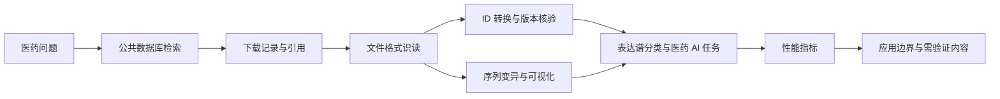
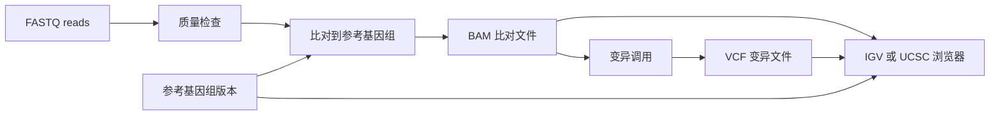
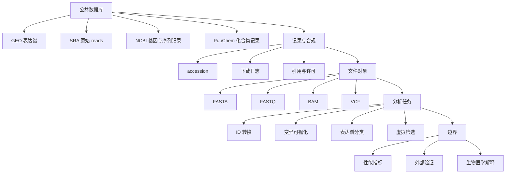

# 第13章 公共数据库、序列数据与医药大数据智能分析

## 使用材料清单

| 材料 | 本章用途 | 核验结果 |
| --- | --- | --- |
| 根目录 `大纲.md` | 确认章名和 13.1-13.6 小节结构 | 已核对，不调整全书结构 |
| `chapters/chapter-13/本章大纲.md` | 确认本章主线、学习目标、证据边界和案例任务 | 已按讨论结论更新 |
| 第12、14、15章章纲 | 控制前后章节衔接 | 第13章只作公共数据和医药 AI 任务桥接 |
| `syllabus/36课时-AI前置调整版.md` | 对齐课程项目中使用公开数据和 AI 协作记录 | 用于限定教学深度 |
| `references/术语表.md`、`图表规范.md`、`提示词样例.md` | 统一术语、图表契约和提示词写法 | 用于正文术语、图表和作业设计 |
| `参考资料/aidd_bioinformatics/` 相关讲义 | 支撑 GEO、GEO2R、SRA、FASTA、FASTQ、VCF、ID 转换、IGV/UCSC | 字幕有误识别，已用 `TERMS.md` 校正 |
| `参考资料/Python程序设计-以医药数据为例_下.md` | 支撑 PubChem、SMILES、分子指纹、Tanimoto 相似度和化合物性质预测 | 不照搬爬虫细节，保留网站政策核验要求 |
| `参考资料/生物医药大数据与智能分析_上.md`、`下.md` | 支撑生物医药大数据、表达谱分类、虚拟筛选、计算平台和性能边界 | 高级案例已降阶为教学框架 |

## 本章定位

第12章已经说明 RNA-seq 数据怎样从 reads 走向计数矩阵和差异表达结果。第13章把视角前移到公共数据来源，也把视角后移到医药 AI 任务。本章不追求把 GEO、SRA、NCBI、PubChem 或所有生信格式讲全，而是让学生形成一套可核验的工作习惯：先确认数据从哪里来，再记录下载和引用，再读懂文件格式，最后判断模型结果能说到哪里。

本章服务综合项目。学生可以用 AI 帮助生成检索式、整理 accession、解释 FASTQ 或 VCF 字段、草拟下载记录和模型评价表。但任何由 AI 生成的数据库信息、样本分组、文件字段、ID 转换结果、性能指标和医学解释，都必须回到原始页面、原始文件或课程指定材料核验。

| 本章回答的问题 | 不在本章展开的内容 |
| --- | --- |
| 如何从公共数据库找到可追踪数据 | 不做数据库大全 |
| 如何记录下载、许可、引用和版本 | 不替代官方数据库政策 |
| 如何区分 FASTA、FASTQ、VCF、BAM 和 ID 转换 | 不要求手工解析生产级大文件 |
| 如何把表达谱分类、虚拟筛选和化合物预测拆成 AI 任务 | 不把模型结果写成临床结论 |
| 如何选择计算平台和评价指标 | 不讲高性能计算算法细节 |

## 学习目标

1. 学生能区分 GEO、SRA、NCBI 和 PubChem 等公共数据入口的用途，并把一个医药问题改写成可核验检索任务。
2. 学生能记录 accession、下载时间、文件名、数据类型、样本说明、许可或引用要求，以及仍需人工确认的事项。
3. 学生能解释 FASTA、FASTQ、VCF 的基本结构，能说明 ID 转换为什么依赖物种、数据库和版本。
4. 学生能描述序列变异可视化的输入和输出，包括参考基因组、BAM、VCF、IGV 或 UCSC Genome Browser。
5. 学生能把表达谱分类、药物结构数据、虚拟筛选和化合物性质预测拆成输入、标签、模型、指标和解释边界。
6. 学生能比较本地电脑、Linux/WSL、云平台、Galaxy 和高性能计算平台在课程项目中的适用场景。

## 核心概念速查

| 术语 | 本章中的含义 | 使用边界 |
| --- | --- | --- |
| accession | 公共数据库中用于追踪数据集、样本、运行或序列记录的编号 | 编号要和数据库入口、下载日期一起记录 |
| GEO | Gene Expression Omnibus，常用于表达谱、芯片和测序相关研究数据检索 | 不能只看标题，要核验样本、平台、分组和原始论文 |
| SRA | Sequence Read Archive，用于保存测序 reads 等原始序列数据 | 下载后还需质量检查、流程记录和文件完整性检查 |
| FASTA | 保存序列名称和序列内容的文本格式 | 通常不含每个碱基的测序质量 |
| FASTQ | 保存 reads 序列和每个位置质量信息的文本格式 | 有质量分数不等于样本质量合格 |
| VCF | Variant Call Format，用于记录变异位点、参考碱基、替代碱基和质量等信息 | VCF 不是致病性判定书 |
| ID 转换 | 将 Ensembl gene ID、gene symbol 等不同标识体系互相映射 | 需核验物种、数据库版本、一对多映射和未匹配 ID |
| SMILES | Simplified Molecular Input Line Entry System，用字符描述分子结构 | 结构编码不等于药效证据 |
| AUC | ROC 曲线下面积，用于评价分类模型区分正负类的能力 | AUC 高不等于临床可用 |

## 章节总览图



## 13.1 GEO、SRA 与 NCBI 数据检索

公共数据库检索的第一步不是下载，而是把研究问题改写成可核验的问题。比如“某疾病有没有表达谱数据”还不够清楚，应进一步写成：疾病名称、物种、组织或细胞类型、实验平台、样本类型、处理条件、是否有原始 reads、是否有处理后的表达矩阵。

NCBI 是 National Center for Biotechnology Information，本章把它作为一组生物医学数据库入口来使用。GEO 常用于查找表达谱数据和样本信息，SRA 常用于查找原始测序 reads。AIDD 讲义中的 GEO2R 案例显示，学生可以在 GEO 页面定义样本组别并获得差异表达表，但这个工具只能作为入门分析和结果识读练习，不能替代完整实验设计核验。

| 入口 | 常见数据 | 适合回答的问题 | 核验点 |
| --- | --- | --- | --- |
| GEO | series、sample、platform、处理后表达表、部分原始数据链接 | 是否有某疾病、处理或组织的表达谱数据 | accession、平台、样本分组、原文、处理流程 |
| GEO2R | 基于 GEO 数据集的组间比较结果 | 入门理解差异表达表字段 | 分组是否正确、样本是否应纳入、调整 P 值口径 |
| SRA | 测序 run、FASTQ 或 SRA 格式 reads | 是否有原始测序数据可重新分析 | run 编号、测序类型、文件大小、下载方式 |
| NCBI Gene 或相关入口 | 基因记录、别名、物种和功能摘要 | 基因 ID、名称和物种信息核对 | 物种、同义名、数据库更新时间 |

检索记录卡应在下载之前完成。至少写清检索日期、数据库入口、检索式、筛选条件、候选 accession、排除原因和下一步动作。AI 可以帮忙整理表格，但不能替学生确认页面上真实存在的数据。

| 字段 | 示例写法 |
| --- | --- |
| 研究问题 | 某疾病处理前后是否有公开表达谱数据 |
| 数据库入口 | GEO，SRA |
| 检索式 | 疾病名、组织名、物种、RNA-seq 或 microarray |
| 候选记录 | accession，标题，物种，样本数需人工确认 |
| 初步判断 | 是否有原始 reads，是否有处理后矩阵 |
| 仍需确认 | 原文、许可或引用要求、分组说明、下载入口 |

## 13.2 数据下载记录、许可与引用

公共数据不是“网上找到就能直接用”。一份可复现的数据记录至少要回答四个问题：从哪里来，什么时候下载，用什么方式下载，引用和使用边界是什么。课程项目不要求学生掌握所有数据库政策，但要求学生把官方页面或原文中关于引用、许可、再使用限制的内容记录下来。没有读到官方说明时，写 `需补证据`。

accession 是公共数据的追踪线索。GEO 的 series、sample、platform，SRA 的 run、experiment、project，PubChem 的 compound 记录，都可能有不同层级编号。写作和项目报告中要避免只写“从 GEO 下载”或“来自 PubChem”，应写到能让别人找到同一批数据。

| 下载记录字段 | 为什么要记录 | 不合格写法 |
| --- | --- | --- |
| 数据库入口和 accession | 便于复查来源 | 公开数据库数据 |
| URL 或页面路径 | 便于复查页面和说明 | 网上下载 |
| 下载日期和时间 | 数据库页面可能更新 | 最近下载 |
| 文件名和大小 | 便于核对文件是否一致 | 有一个 FASTQ 文件 |
| 下载方式 | 区分网页、FTP、SRA Toolkit、API 或命令行 | 用软件下的 |
| 样本说明 | 避免分组混乱 | 病例和对照 |
| 引用和许可 | 避免不合规使用 | 免费数据 |
| 文件完整性 | 排查下载失败或截断 | 下载完成 |

SRA Toolkit 的课堂材料展示了用命令行下载 reads 的思路。课程正文只要求学生理解它的角色：SRA Toolkit 是从 SRA 获取原始测序 reads 的工具之一。实际项目中，下载命令、运行环境、文件转换、失败重试和磁盘空间都要进入日志。

```text
下载日志最小模板
项目问题：
数据库入口：
accession：
文件类型：
下载方式：
下载日期：
文件名：
文件大小：
引用要求：
许可或使用限制：
质量检查状态：
仍需人工确认：
```

## 13.3 FASTA、FASTQ、VCF 与 ID 转换

序列数据有不同层次。FASTA 主要记录序列名称和序列内容。FASTQ 在序列之外还记录每个位置的质量信息。VCF 记录变异结果，通常来自 reads 比对、变异识别和过滤之后。BAM 是比对结果的二进制格式，BED 常用于记录基因组区间。本章只要求能识读这些对象在流程中的位置。

| 文件或对象 | 常见用途 | 课堂识读重点 |
| --- | --- | --- |
| FASTA | 参考序列、基因序列、蛋白序列 | 标题行和序列内容 |
| FASTQ | 原始 reads 和质量分数 | 每条 read 的四行结构 |
| BAM | reads 与参考基因组的比对结果 | 是否能配合参考基因组查看覆盖情况 |
| VCF | 变异位点记录 | CHROM、POS、REF、ALT、QUAL、FILTER、INFO |
| BED | 基因组区间或注释区域 | 染色体、起点、终点 |

FASTQ 常见四行结构如下。第一行是 read 标识，第二行是序列，第三行通常以 `+` 开头，第四行是质量字符。质量字符需要按编码规则解释，不能只凭肉眼判断样本好坏。

| 行 | 内容 | 示例说明 |
| --- | --- | --- |
| 1 | read 标识 | 以 `@` 开头 |
| 2 | 碱基序列 | A、T、C、G、N 等 |
| 3 | 分隔行 | 通常以 `+` 开头 |
| 4 | 质量字符串 | 每个字符对应一个质量分数 |

字幕材料中有一些术语误识别，例如 `FASCQ` 应校正为 FASTQ，`FASTA-A` 或 `pasta` 应校正为 FASTA，`Deseq2` 应写作 DESeq2，`Sketelearn` 应写作 scikit-learn。正文和作业中统一使用校正后的术语。

ID 转换是公共数据分析中的高风险步骤。AIDD 材料用 Ensembl gene ID 转换为 gene symbol 作为例子。学生要理解，Ensembl ID 更适合作为稳定标识，gene symbol 更便于阅读，但符号会变化，也可能出现一对多、重复或无法匹配。

| ID 转换检查项 | 说明 |
| --- | --- |
| 物种 | 人、小鼠和其他物种不能混用 |
| 数据库 | Ensembl、NCBI、UniProt 等来源要写清 |
| 版本 | 不同版本可能映射不同 |
| 映射关系 | 一对一、一对多、多对一要分开记录 |
| 未匹配 ID | 不应直接删除，应记录数量和原因 |
| 下游影响 | 热图、富集、分类模型都可能受 ID 处理影响 |

## 13.4 序列变异与可视化入门

变异是相对于参考序列的差异。课堂只介绍入门层次：reads 先比对到参考基因组，形成 BAM 等比对文件；变异调用工具再把差异整理成 VCF；IGV 或 UCSC Genome Browser 可以把参考序列、reads 覆盖和变异位置放在同一视图中检查。



IGV 是常见本地可视化工具，UCSC Genome Browser 是在线浏览器。AIDD 讲义建议同时加载参考基因组、BAM 和 VCF 来查看变异。这个过程适合做人工检查，例如看某个位点是否有足够覆盖、reads 是否集中在某一方向、附近是否有低复杂度区域或比对异常。

| 可视化观察 | 可以支持的表述 | 不能支持的表述 |
| --- | --- | --- |
| 某个位点附近有 reads 覆盖 | 该区域在当前样本中有测序信号 | 该样本一定存在可靠致病变异 |
| VCF 中有 SNP 或 indel 记录 | 工具在该位置报告候选变异 | 该变异导致疾病 |
| IGV 中 reads 分布不均 | 需要进一步检查比对和质量 | 可以直接排除样本 |
| 多样本视图显示差异 | 可作为人工核验线索 | 可作为临床分型证据 |

序列变异解释必须分层写。观察结果来自文件和可视化；方法来源来自比对和变异调用；允许解释通常只到“候选变异”或“需进一步注释”；替代解释包括低质量 reads、参考版本不匹配、重复区域、污染或批次问题；仍需验证内容包括独立样本、功能证据、群体频率和临床表型。

## 13.5 表达谱分类、虚拟筛选与医药 AI 任务

表达谱分类把样本的基因表达特征作为输入，把疾病类型、组织来源或处理状态作为标签。`生物医药大数据与智能分析_下.md` 中的肿瘤表达谱案例显示，这类任务常有“基因数很多、样本数较少”的特点。线性 SVM、KNN、稀疏表示、字典学习、随机森林或神经网络都可以成为候选模型，但模型选择必须服从数据规模和验证设计。

高维小样本任务最容易出现过拟合。训练集和测试集混在一起、先用全数据筛特征再交叉验证、只报告最高准确率、忽略类别不平衡，都会让模型表现看起来很好，却无法推广到新样本。

| 表达谱分类任务元素 | 需要写清的内容 |
| --- | --- |
| 输入 | 表达矩阵、标准化方法、特征选择方式 |
| 标签 | 疾病、组织、处理状态或其他类别，需说明来源 |
| 划分 | 训练集、验证集、测试集或交叉验证方案 |
| 模型 | SVM、KNN、随机森林、神经网络等 |
| 指标 | 准确率、AUC、灵敏度、特异度、混淆矩阵 |
| 边界 | 是否有外部验证，是否接近真实应用场景 |

药物结构数据是 AI 辅助药物研发常见输入。`Python程序设计-以医药数据为例_下.md` 介绍了 PubChem、Canonical SMILES、分子指纹和 Tanimoto 相似度。SMILES 用字符描述分子结构；分子指纹把结构特征编码成向量；Tanimoto 相似度常用于比较两个分子指纹的重叠程度。它们可以支持结构相似性分析，不能直接证明药效相似。

虚拟筛选通常把靶标结构、化合物库和对接程序结合起来，得到候选化合物排序。`生物医药大数据与智能分析_上.md` 的高通量虚拟筛选材料说明，对接任务会受到化合物数量、文件规模、I/O 和计算平台限制。材料也明确提示，对接良好的候选小分子仍需体外活性测试和临床测试证明。

| 医药 AI 任务 | 输入 | 输出 | 允许解释 | 仍需验证 |
| --- | --- | --- | --- | --- |
| 表达谱分类 | 表达矩阵和样本标签 | 类别预测和概率或分数 | 模型在当前数据划分中的区分能力 | 外部验证、批次鲁棒性、临床场景 |
| 化合物性质预测 | 分子指纹、描述符、SMILES 和性质标签 | 水溶性等性质预测值 | 模型在当前数据上的预测误差 | 数据覆盖范围、实验测定误差 |
| 分子相似性 | 分子指纹 | Tanimoto 等相似度 | 结构特征相近程度 | 活性、毒性、药代性质 |
| 虚拟筛选 | 靶标结构和化合物库 | 对接分数和候选排序 | 计算筛选假设 | 体外实验、体内研究、临床证据 |

## 13.6 计算平台、性能指标与应用边界

公共数据和医药 AI 任务常会遇到计算资源限制。课程项目可以从本地电脑开始，但一旦涉及大 FASTQ、多样本 BAM、大规模化合物库或模型训练，就需要考虑 Linux/WSL、云平台、Galaxy 或高性能计算平台。平台选择不是为了显得高级，而是为了让数据规模、工具依赖、运行时间和复现记录匹配。

| 平台 | 适合场景 | 主要限制 |
| --- | --- | --- |
| 本地电脑 | 小型表格、可视化、轻量模型、结果整理 | 内存、磁盘和运行时间有限 |
| Linux/WSL | 命令行生信工具、SRA Toolkit、脚本复现 | 环境配置需要记录 |
| Galaxy | 图形界面运行常见生信流程 | 工具版本和参数仍需记录 |
| 云平台 | 中等规模数据、临时扩展计算资源 | 费用、权限、数据合规 |
| 高性能计算平台 | 大规模测序、虚拟筛选、并行任务 | 需要队列、脚本和资源申请 |

性能指标要服务任务。分类任务常看准确率、AUC、灵敏度、特异度和混淆矩阵；类别不平衡时还要看 PR-AUC 或按类别指标。回归任务常看 R²、MAE 或 RMSE。虚拟筛选和生信流程还要记录运行时间、内存、磁盘、I/O 和失败率。

| 指标 | 适合任务 | 解读边界 |
| --- | --- | --- |
| accuracy | 类别较均衡的分类任务 | 类别不平衡时可能误导 |
| AUC | 二分类排序能力 | 不等于临床收益 |
| sensitivity | 关注阳性检出 | 需同时看假阳性风险 |
| specificity | 关注阴性排除 | 需结合任务代价 |
| RMSE | 连续值预测 | 需看单位和数据范围 |
| runtime | 下载、比对、训练或筛选 | 需说明硬件和线程数 |

应用边界要写在结果旁边，而不是放到最后一句。表达谱模型可以提示当前数据上的分类模式，不能直接写成诊断工具。VCF 和 IGV 可以辅助检查候选变异，不能替代致病性判读。分子对接可以缩小候选化合物范围，不能证明药物有效。AI 生成的解释只有在来源、数据、代码和指标都可追踪时，才适合作为课程项目材料。

## 案例任务

| 任务 | 学生交付物 | 合格标准 |
| --- | --- | --- |
| GEO 检索记录 | 一张公共数据检索记录卡 | 有检索式、accession、样本说明和待确认事项 |
| SRA 下载日志 | 一张下载记录表 | 有 run 编号、下载方式、文件名、日期和质量检查状态 |
| 格式识读 | FASTA、FASTQ、VCF 字段说明表 | 能说明每种文件在流程中的位置 |
| ID 转换核验 | Ensembl ID 到 gene symbol 的映射记录 | 有物种、数据库版本、未匹配数量 |
| 变异可视化审阅 | IGV 或 UCSC 浏览路径图 | 能区分观察、解释和仍需验证内容 |
| 医药 AI 任务说明书 | 输入、标签、模型、指标、边界表 | 不把模型结果写成临床结论 |

## AI 协作点

| 场景 | 可让 AI 做 | 必须人工核验 |
| --- | --- | --- |
| 生成检索式 | 根据疾病、组织、物种和技术类型生成关键词 | 数据库页面是否有对应记录 |
| 整理 accession | 把候选编号做成表格 | 编号层级是否正确 |
| 解释文件格式 | 说明 FASTA、FASTQ、VCF 字段 | 当前文件是否符合说明 |
| 生成下载记录表 | 设计日志字段 | 日期、路径、大小、许可和引用 |
| 写模型任务卡 | 梳理输入、标签、模型和指标 | 标签来源、数据划分和解释边界 |
| 改写结果说明 | 去掉机制、药效或临床过度推断 | 是否仍保留材料支持范围 |

## 常见误区

| 误区 | 更稳妥的处理 |
| --- | --- |
| 只写“数据来自 GEO” | 写清 accession、样本、平台、原文和下载日期 |
| 把 GEO2R 结果当作完整差异分析 | 写成入门分析或结果识读练习，并核验分组 |
| 看到 FASTQ 就认为数据可用 | 还要看质量、样本说明、下载完整性和流程记录 |
| 把 gene symbol 当作稳定 ID | 同时保留 Ensembl ID 和转换版本 |
| 把 VCF 变异写成致病突变 | 写成候选变异，标注仍需注释和验证 |
| 把 AUC 高写成模型能临床使用 | 写成当前数据划分中的区分能力 |
| 把 docking 分数写成药效 | 写成计算筛选假设，保留实验验证要求 |

## 知识结构与知识图谱生成提示词



可复制给 AI 的知识图谱提示词：

```text
请基于《医药数据处理与可视化》第13章内容，生成一个中文知识图谱。
中心主题为“公共数据库、序列数据与医药大数据智能分析”。
一级节点包括公共数据库、下载记录、文件格式、ID转换、变异可视化、医药AI任务、计算平台、性能指标、应用边界。
每个节点给出1句简明解释，说明它在课程项目中的作用。
不要加入未在本章出现的数据库政策、样本量、临床结论或药物疗效判断。
如需生成图片，请先输出 Mermaid 或表格版结构，图片只作为教学展示，并在图注中写明需人工核验。
```

## 章节作业

1. 选择一个公共表达谱数据集，提交检索记录卡。记录 accession、数据库入口、检索日期、样本说明、平台、原文和仍需确认事项。
2. 解释一个 FASTQ 或 VCF 小片段。说明每个字段的含义，并写出不能从该片段直接推断的内容。
3. 设计一个医药 AI 任务说明书。任务可以是表达谱分类、化合物性质预测或虚拟筛选。必须包含输入、标签、划分、模型、指标和解释边界。
4. 写一段 150 到 250 字的结果说明。要求区分观察结果、方法来源、允许解释、替代解释和仍需验证内容。

## 需补证据

| 内容 | 当前处理 |
| --- | --- |
| GEO、SRA、NCBI、PubChem 的最新官方引用和许可政策 | 正文只写记录要求，不写具体政策结论；项目使用时需查官方页面 |
| 可用于课堂演示的具体 GEO 或 SRA accession | 暂不指定具体编号，避免使用未核验样本信息 |
| ID 转换示例中的数据库版本和映射结果 | 需后续用指定数据集实际运行并记录 |
| IGV 或 UCSC 浏览器截图 | 本轮未生成，正文用流程图和核验表替代 |
| 表达谱分类或虚拟筛选模型的具体性能数值 | 不写入正文结论；需来自实际课堂数据或指定文献 |

