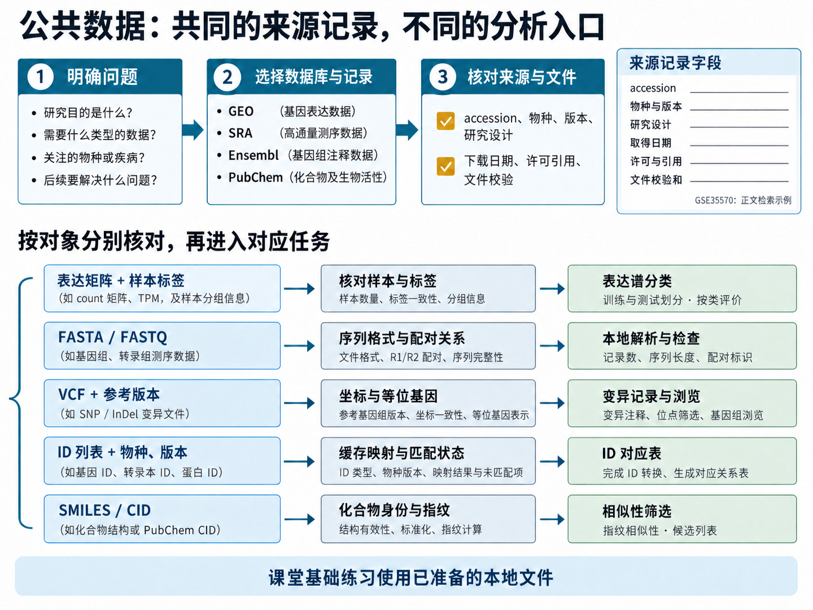
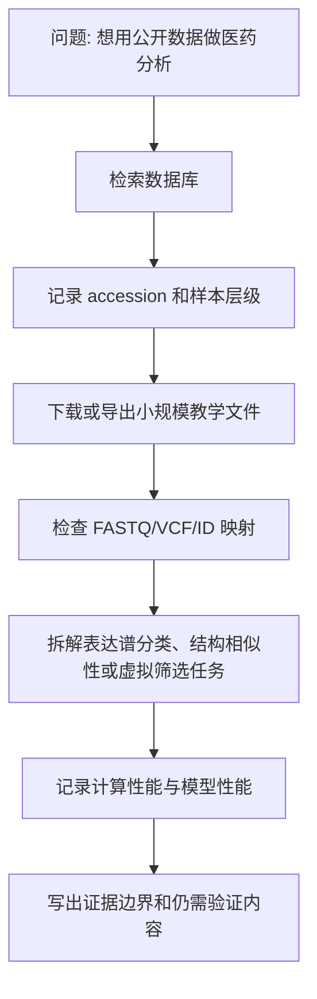
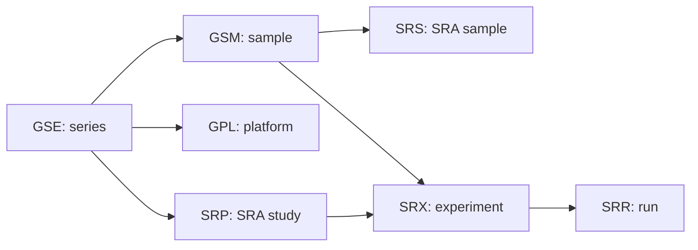
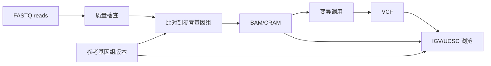
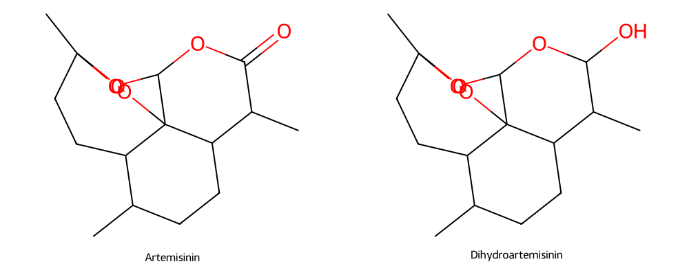
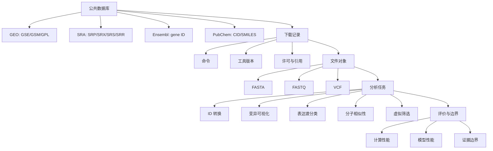

# 第13章 公共数据库、序列数据与医药大数据智能分析

## 本章定位

公共数据任务依次核对检索条件、accession、下载与引用记录、文件格式和分析边界。完成检索后，将来源记录、文件对象和分析输入逐项对应。

## 学习目标

| 本章任务 | 学生应提交的学习证据 |
| --- | --- |
| 公共数据库检索 | 检索记录卡，含 accession、数据库、检索日期和待确认事项 |
| 数据下载与引用 | 下载登记表，含命令、文件、工具版本、校验状态和许可状态 |
| 文件格式识读 | FASTA、FASTQ、VCF 与 ID 转换核验表 |
| 变异可视化入门 | FASTQ 到 VCF 再到 IGV/UCSC 的流程图和检查清单 |
| 医药 AI 任务拆解 | 输入、标签、模型、指标、边界和仍需验证内容 |
| 计算平台记录 | 运行时间、内存、磁盘、工具版本和复现边界 |

本章的公共记录案例使用GSE35570，练习区分数据库中的sample记录数与研究中的病例数。文件格式任务另用明确标注的构造FASTA、FASTQ和VCF，ID转换使用固定查询缓存；这些输入按各自目的组织，不要求同一研究覆盖全部文件格式。第12章的RNA-seq来源链可作方法回顾。



*图13-1　六个环节依次表示：1，形成可检索的问题；2，定位数据库记录和 accession；3，核对元数据、许可与引用；4，识别序列、reads、变异和 ID 映射文件；5，保存本地文件、下载清单与校验记录；6，在人工复核下开展有边界的下游任务。这些环节连接检索记录、文件身份与分析输入。*

## 核心概念速查

| 术语 | 本章中的含义 | 识读检查 |
| --- | --- | --- |
| accession | 公共数据库中用于追踪 series、sample、run、compound 或基因记录的编号 | 必须和数据库、检索日期、页面 URL 一起记录 |
| GEO | Gene Expression Omnibus，常用于表达谱和功能基因组数据检索 | 核验样本、平台、分组和原始研究说明 |
| SRA | Sequence Read Archive，常用于保存测序 reads | 下载后仍要检查文件完整性、格式和质量 |
| FASTA | 记录序列名称和序列内容的文本格式 | 通常不含逐碱基质量信息 |
| FASTQ | 记录 reads、序列和质量字符的文本格式 | 核对字符长度与质量编码，结合质量报告 |
| VCF | Variant Call Format，记录候选变异位点和过滤状态 | 核对参考坐标、等位基因与过滤状态 |
| ID 转换 | 在 Ensembl ID、gene symbol、NCBI Gene ID 等体系之间映射 | 要保留原始 ID、版本、物种和未匹配项 |
| SMILES | 用字符描述分子结构的表示法 | 保存结构表示、规范化规则和计算参数 |
| Tanimoto | 常用于比较分子指纹重叠程度的相似度 | 只反映所选指纹下的结构相似性 |

## 阅读指南


```mermaid
flowchart TB
  P["问题: 想用公开数据做医药分析"] --> S1["检索数据库"]
  S1 --> S2["记录 accession 和样本层级"]
  S2 --> S3["下载或导出小规模教学文件"]
  S3 --> S4["检查 FASTQ/VCF/ID 映射"]
  S4 --> S5["拆解表达谱分类、结构相似性或虚拟筛选任务"]
  S5 --> S6["记录计算性能与模型性能"]
  S6 --> S7["写出证据边界和仍需验证内容"]
```

## 13.1 GEO、SRA 与 NCBI 数据检索

公共数据库检索要把研究问题逐层对应到数据库记录。GEO series 通常组织一项研究，sample 记录描述具体样本，SRA project、experiment 和 run 则连接测序实验与原始文件。层级名称不能只靠记忆匹配，最终应通过 accession、页面链接和样本说明建立映射。

本节使用2026-07-10已经保存的GSE35570记录。先把检索问题写成物种、组织、条件、技术类型和可用数据层级，再查看记录。正式选题时打开官方记录核对更新，本地缓存保留其历史日期。

GEO 的 `GSE` 是 series 层级，通常描述一项研究或一组相关实验。`GSM` 是 sample 层级，描述一个样本或样本处理条件。`GPL` 是平台层级，描述测序或芯片平台。SRA 侧还会出现 `SRP`、`SRX`、`SRS` 和 `SRR`：`SRP` 接近 study/project 层级，`SRX` 对应实验，`SRS` 对应样本，`SRR` 对应一次测序 run。


```mermaid
flowchart LR
  GSE["GSE: series"] --> GSM["GSM: sample"]
  GSE --> GPL["GPL: platform"]
  GSM --> SRS["SRS: SRA sample"]
  GSM --> SRX["SRX: experiment"]
  SRX --> SRR["SRR: run"]
  GSE --> SRP["SRP: SRA study"]
  SRP --> SRX
```

**核验框：GSE35570（查询日期：2026-07-10）。** [GSE35570](https://www.ncbi.nlm.nih.gov/geo/query/acc.cgi?acc=GSE35570)的本地历史记录保存了两个计数口径。当日页面列出 116 条 sample 记录；overall design 描述 65 例病例，其中 33 例为暴露组、32 例为非暴露组。

| 项目 | 正确记录 | 解释边界 |
| --- | --- | --- |
| accession | `GSE35570` | 不是 `GSC 35570` |
| sample 记录 | 116 条 GSM 记录 | 这是数据库样本记录口径 |
| 病例口径 | 65 例甲状腺乳头状癌病例 | 这是病例层面的统计口径 |
| 教学处理 | 可作为“样本记录数”和“病例数”不同的例子 | 不用它展开医学结论 |

学生完成检索后，应提交一张记录卡。记录卡只回答“我查到了什么、下一步怎么核验”，不回答“这个数据说明什么”。写作时要把检索结果、文件对象、统计分析和医学解释放在不同层级。

| 检索记录卡字段 | 填写要求 |
| --- | --- |
| 检索日期 | 使用绝对日期，如 2026-07-10 |
| 数据库 | GEO、SRA、PubChem、Ensembl 等 |
| 检索式 | 关键词、物种、组织、技术类型 |
| 候选 accession | GSE、GSM、SRP、SRR 等编号 |
| 初筛理由 | 样本、平台、数据类型是否匹配 |
| 排除理由 | 物种不符、样本不足、无原始数据、说明不清 |
| 待确认 | 引用、许可、分组、原始论文、下载方式 |

## 13.2 数据下载记录、许可与引用

数据下载把数据库记录转成分析文件，也形成一条新的来源链。选择文件前先确认它属于哪个 accession、对应哪个样本、保存的是原始 reads 还是处理后矩阵。下载后再核对文件名、大小、校验和与解压状态，并记录取得日期和工具版本。

许可与引用解决的是使用和归属问题，校验和解决的是文件完整性问题，两者不能互相代替。公共可访问也不等于可以忽略数据使用条款或原研究引用。完整记录应让复核者知道文件从哪里来、是否允许当前用途、怎样确认下载未损坏，以及分析中实际使用了哪一份。

| 记录对象 | 为什么要写 |
| --- | --- |
| accession 和 URL | 让别人能找到同一条数据库记录 |
| 下载日期 | 说明数据页面和工具版本所处时间 |
| 工具版本 | 同一命令在不同版本中可能表现不同 |
| 文件名和大小 | 便于检查下载是否截断或覆盖 |
| 校验结果 | 区分“命令跑完”和“文件可读取” |
| 引用和许可 | 区分可下载、可分析、可再分发和需授权 |
| 待确认事项 | 把没有核验的部分显式留下 |

基础练习先使用本地构造小文件，登记来源状态、格式、文件大小和SHA-256。真实下载另以已经核验的run accession为输入，先记录数据库页面和许可，再安排所需文件；完整下载不是基础任务入口。

```powershell
# 拓展流程示意，run_accession须由已核验sample sheet填写。
prefetch $run_accession
vdb-validate $run_accession
fasterq-dump --split-files --threads 6 $run_accession
```

三个命令分别取得run、核对SRA对象、导出双端FASTQ；导出后仍需比较mate ID和记录数。它们属于完整下载路线，运行状态应与本地构造输入检查分开保存。可用磁盘、临时空间、下载许可与工具版本都要在执行前确定。

| 下载或本地输入记录 | 填写内容 |
| --- | --- |
| 数据层级 | 公共页面、原始测序、处理后矩阵、构造文件或已保存结果 |
| 取得方式 | 下载命令、导出步骤，或课程构造文件说明 |
| 版本与日期 | 页面查询日期、软件版本、文件生成日期 |
| 完整性 | 文件大小、哈希、解析记录数、成对关系 |
| 引用与许可 | 官方记录和原研究；未明确的许可继续查证 |

## 13.3 FASTA、FASTQ、VCF 与 ID 转换

FASTA、FASTQ、VCF 和 ID 映射表保存不同层级的信息。FASTA 描述参考或查询序列，FASTQ 同时保存 reads 与质量字符，VCF 记录相对参考序列的候选变异，ID 表负责把不同命名体系中的对象对应起来。文件都可以表现为文本，不表示能够互换输入位置。

处理前先确认文件格式、参考版本、物种、样本和来源；处理后检查记录数、字段结构、未匹配 ID 和一对多映射。ID 转换尤其不能只保留成功结果，未匹配与重复映射会改变后续基因集合和统计分母，应连同版本一起记录。

### 对象、输入、输出与检查

| 对象 | 输入 | 输出 | 检查 |
| --- | --- | --- | --- |
| FASTA/FASTQ/VCF/ID 表 | 文件、参考版本和来源记录 | 结构检查或映射表 | 记录数、字段、ID、未匹配项 |

FASTA、FASTQ、BAM、VCF 和 ID 映射表处在不同数据层级。学生容易把“序列文件”“表达矩阵”“变异结果”和“基因名表”混在一起。本章先建立对象边界，再讲如何检查。

| 对象 | 记录单位 | 必需字段或结构 | 常见错误 | 检查方法 |
| --- | --- | --- | --- | --- |
| FASTA | 一条序列 | `>` 标题行，后接序列内容 | 把 FASTQ 误写成 FASTA；标题重复 | 检查标题行、序列字符、重复 ID |
| FASTQ | 一条 read | 4 行：标识、序列、`+`、质量字符串 | 记录数不是 4 的倍数；序列和质量长度不一致 | 按 4 行读取，核对长度和标识 |
| VCF | 一个候选变异 | `CHROM POS ID REF ALT QUAL FILTER INFO` | 参考版本缺失；染色体命名不一致 | 检查 header、字段数、REF/ALT 长度 |
| ID 映射表 | 一个基因或转录本 ID | 原始 ID、去版本 ID、目标 ID、状态 | 删除未匹配 ID；混用物种 | 保留原始 ID 和 unmapped 记录 |

FASTQ 每条 read 通常由四行组成。第一行以 `@` 开头，第二行是碱基序列，第三行以 `+` 开头，第四行是质量字符串。质量字符串长度应与序列长度一致。这个检查只能说明文件结构可读，不能替代完整测序质量报告。

```python
with open("practice/data/raw/teaching_reads_R1.fastq", encoding="utf-8") as f:
    rows = [next(f).rstrip() for _ in range(4)]
assert rows[0].startswith("@") and rows[2].startswith("+")
assert len(rows[1]) == len(rows[3])
```

配套构造FASTQ每端有两条read，序列与质量字符串均为8字符。主ID相同、末尾的`/1`和`/2`分别标记两端。先手数四行记录，再让脚本遍历全文件比较主ID。若R2第二条名称被修改，两个文件的记录数仍相同，配对检查却会失败；这正是按字段对应关系核对的用途。

```text
@teaching_spot_1/1
ACGTTGCA
+
IIIIIIII
```

ID 转换同样要留下原始记录。本轮用 Ensembl REST lookup 查询了 4 个 ID，其中 3 个真实人类基因映射成功，1 个模拟无效 ID 保留为 `unmatched`。真实分析中，未匹配 ID 不应被静默删除。

| 输入 ID | 去版本 ID | 映射结果 | 物种 | 组装版本 | 状态 |
| --- | --- | --- | --- | --- | --- |
| `ENSG00000141510.19` | `ENSG00000141510` | `TP53` | homo_sapiens | GRCh38 | mapped |
| `ENSG00000146648` | `ENSG00000146648` | `EGFR` | homo_sapiens | GRCh38 | mapped |
| `ENSG00000157764` | `ENSG00000157764` | `BRAF` | homo_sapiens | GRCh38 | mapped |
| `ENSG00000000000` | `ENSG00000000000` | 空 | 空 | 空 | unmatched，模拟无效 ID |

这一表格说明两件事。第一，带版本号的 Ensembl ID 可以先保留原始 ID，再派生去版本 ID 用于查询。第二，映射成功只说明数据库中有对应记录，不说明该基因在当前样本中差异表达，也不说明它参与某个过程。

| ID 转换报告字段 | 合格写法 |
| --- | --- |
| 原始 ID | 保留输入表中的完整 ID，如 `ENSG00000141510.19` |
| 规范化 ID | 记录去版本后的 ID，如 `ENSG00000141510` |
| 查询工具 | Ensembl REST lookup |
| 查询日期 | 2026-07-10 |
| 物种和版本 | homo_sapiens，GRCh38 |
| 未匹配项 | 单独列出，不自动丢弃 |
| 下游处理 | 显示名可用 symbol，统计和追踪仍保留稳定 ID |

字幕素材中有若干术语误识别，写作时要先校正再使用。例如 `FASCQ` 应写作 FASTQ，`FASTA-A` 或 `pasta` 应写作 FASTA，`Deseq2` 应写作 DESeq2，`Sketelearn` 应写作 scikit-learn。术语校正不是语言细节，它会影响学生能否正确检索工具和阅读文档。

```text
术语校正示例
FASCQ -> FASTQ
FASTA-A / pasta -> FASTA
Deseq2 -> DESeq2
Sketelearn -> scikit-learn
集合基因 ID -> Ensembl gene ID
地理数据库 -> GEO
```

## 13.4 序列变异与可视化入门

变异可视化把候选位点放回参考坐标、样本比对和局部覆盖中检查。VCF 的 CHROM、POS、REF、ALT、FILTER 等字段先定义位点记录，浏览器轨迹再帮助查看该区域是否有相应 reads 和质量信息。两类对象相互补充，却都不能单独判断致病性或功能后果。

查看前要统一参考基因组、染色体命名和坐标约定，并确认轨迹属于正确样本。查看后记录支持与反对当前候选的可见信息，以及覆盖不足、比对歧义或过滤状态等替代解释。课堂模拟记录只用于练习解析和审阅，不对应真实患者结论。

### 对象、输入、输出与检查

| 对象 | 输入 | 输出 | 检查 |
| --- | --- | --- | --- |
| 候选变异与轨迹 | VCF、参考版本、样本与比对记录 | 位点表或浏览器视图 | 坐标、REF/ALT、FILTER、覆盖 |

序列变异是相对于参考序列观察到的差异。本章只讲入门对象：SNP、插入、删除和 VCF 字段。课堂模拟数据不来自患者，也不对应真实样本，只用于训练学生读懂 VCF 记录、写解析代码和做可视化检查清单。

| 变异类型 | 简明说明 | VCF 中的识别线索 |
| --- | --- | --- |
| SNP | 单个碱基替换 | `REF` 和 `ALT` 长度均为 1 |
| 插入 INS | 相对参考序列多出碱基 | `ALT` 长度大于 `REF` |
| 删除 DEL | 相对参考序列少了碱基 | `REF` 长度大于 `ALT` |
| LowQual | 过滤状态提示低质量 | `FILTER=LowQual` |

教学 VCF 如下。`##reference=GRCh38_teaching_coordinate_example` 只说明坐标命名用于教学，不能和真实患者数据或真实变异数据库混用。

```text
##fileformat=VCFv4.2
##reference=GRCh38_teaching_coordinate_example
##contig=<ID=1,length=248956422>
##FILTER=<ID=LowQual,Description="Teaching low-quality record">
##INFO=<ID=TEACHING,Number=0,Type=Flag,Description="Simulated non-patient record">
#CHROM	POS	ID	REF	ALT	QUAL	FILTER	INFO
1	100101	teach_snp_pass	A	G	60	PASS	TEACHING
1	100202	teach_ins_pass	A	ATG	50	PASS	TEACHING
1	100303	teach_del_pass	ATC	A	45	PASS	TEACHING
1	100404	teach_snp_lowqual	C	T	10	LowQual	TEACHING
```

运行前先分别数变异类别和FILTER状态。循环跳过以`#`开始的注释行，再把制表符分隔的前8项赋给字段。`Counter`记录每类出现次数；一个SNP可同时被标为LowQual，两项统计并不互斥。复制一条记录并改变FILTER时，先预测哪张计数表变化，再运行核对。

下面的 Python 解析器只使用标准库。它逐行跳过 header，按 `REF` 和 `ALT` 长度分类，再统计 `FILTER` 状态。这个代码适合教学小文件；生产 VCF 应使用成熟库或流程工具处理多等位、样本基因型和复杂注释。

```python
from collections import Counter
variant_types = Counter()
filters = Counter()
with open("teaching_variants.vcf", encoding="utf-8") as f:
    for line in f:
        if line.startswith("#"):
            continue
        chrom, pos, vid, ref, alt, qual, filt, info = line.rstrip().split("\t")[:8]
        if len(ref) == 1 and len(alt) == 1:
            variant_types["SNP"] += 1
        elif len(ref) < len(alt):
            variant_types["INS"] += 1
        elif len(ref) > len(alt):
            variant_types["DEL"] += 1
        filters[filt] += 1
print(variant_types)
print(filters)
```

本轮脚本输出与预期一致：`SNP=2`、`INS=1`、`DEL=1`、`PASS=3`、`LowQual=1`。解析结果与构造文件逐行相符。

| 统计项 | 预期 | 本轮输出 | 核对结果 |
| --- | --- | --- | --- |
| SNP | 2 | 2 | 一致 |
| INS | 1 | 1 | 一致 |
| DEL | 1 | 1 | 一致 |
| PASS | 3 | 3 | 一致 |
| LowQual | 1 | 1 | 一致 |

真实变异分析通常从 FASTQ 质量检查开始，经过比对、排序、去重复或其他处理，生成 BAM，再由工具输出 VCF。IGV 或 UCSC Genome Browser 可以把参考基因组、reads 覆盖、候选变异和注释放到同一视图中审阅。


```mermaid
flowchart LR
  FQ["FASTQ reads"] --> QC["质量检查"]
  QC --> ALN["比对到参考基因组"]
  ALN --> BAM["BAM/CRAM"]
  BAM --> CALL["变异调用"]
  CALL --> VCF["VCF"]
  REF["参考基因组版本"] --> ALN
  REF --> VIEW["IGV/UCSC 浏览"]
  BAM --> VIEW
  VCF --> VIEW
```

可视化检查要记录“看到了什么”，还要记录“不能说什么”。IGV 截图如果没有参考版本、染色体命名、位置、track 来源和过滤状态，就不适合作为课程项目证据。

| 检查项 | 需要核对 | 不能越界 |
| --- | --- | --- |
| 参考版本 | GRCh37、GRCh38 或其他版本是否一致 | 不同版本坐标不能直接混用 |
| 染色体命名 | `1` 与 `chr1` 是否匹配 | 不能把命名不一致当作无变异 |
| 覆盖深度 | 候选位点是否有足够 reads | 不能只凭单条 read 写结论 |
| 等位基因 | reads 是否支持 REF/ALT，方向是否异常 | 不能忽略低质量或重复区域 |
| FILTER | `PASS`、`LowQual` 等状态 | `PASS` 也不等于医学意义明确 |
| 文件来源 | BAM、VCF、reference 是否来自同一流程 | 不能混用不同样本文件 |

按照生物医学写作框架，变异浏览结果应分五栏记录。这样做能防止学生把“文件中有一行记录”写成超出证据范围的结论。

| 观察结果 | 方法来源 | 允许解释 | 替代解释 | 仍需验证 |
| --- | --- | --- | --- | --- |
| VCF 中有 1 条 `LowQual` SNP | 教学模拟 VCF 和解析脚本 | 该行被过滤标记为低质量 | 模拟阈值、解析规则或文件构造 | 无真实样本，不做医学解释 |
| IGV 中某区域有 reads 覆盖 | BAM/VCF 与参考基因组浏览 | 当前文件在该位置有测序信号 | 比对异常、重复区域、污染、版本不匹配 | 质量报告、独立样本、注释数据库 |

## 13.5 表达谱分类、虚拟筛选与医药 AI 任务

表达谱分类、虚拟筛选和其他医药 AI 任务都需要明确输入、目标和评价，但三者的预测单位与证据边界不同。表达谱分类可能以样本或细胞为单位，虚拟筛选通常对化合物或构象排序，生成或表征任务还可能没有直接的临床标签。共享建模词汇不能抹平这些对象差异。

任务开始前写清标签或优化目标、数据划分、基线和指标；结果产生后检查泄漏、类别比例、校准、适用域和外部验证。分类概率、候选排名、对接分数或结构相似性都属于计算结果。将这些结果用于确定候选检查与后续实验的优先顺序。

### 对象、输入、输出与检查

| 对象 | 输入 | 输出 | 检查 |
| --- | --- | --- | --- |
| 分类或筛选任务 | 数据、标签、特征与划分 | 指标、概率或候选排序 | 泄漏、类别比例、验证范围 |

医药 AI 任务先要拆成五个问题：输入是什么，标签是什么，模型学什么，指标怎么评价，结果能解释到哪里。少了任何一项，模型报告都容易变成无法复核的数字。

| 任务要素 | 表达谱分类 | 分子相似性 | 虚拟筛选 |
| --- | --- | --- | --- |
| 输入 | 表达矩阵、基因特征、样本元数据（metadata） | SMILES、分子指纹 | 靶标结构、化合物库、对接参数 |
| 标签或目标 | 疾病类别、组织类型、处理状态 | 无监督相似性或已知结构对 | 对接分数或候选排序 |
| 模型或算法 | SVM、KNN、随机森林、神经网络等 | RDKit 指纹、Tanimoto | docking 程序、评分函数 |
| 指标 | 混淆矩阵、召回率、macro-F1、PR-AUC、校准 | 相似度值和结构图 | RMSD、对接能、排序 |
| 边界 | 内部验证不等于实际应用 | 相似不等于活性相同 | 排序不等于实验结果 |

参考资料中的肿瘤表达谱分类案例显示，高维小样本是这类任务的常见结构。下表直接整理素材中的数据维度。`基因数` 远大于 `样本数`，因此特征选择、交叉验证设计和外部验证比单个准确率更关键。

| 数据集 | 基因数 | 样本数 | 类别数 | 课堂提示 |
| --- | ---: | ---: | ---: | --- |
| 9-Tumors | 5,726 | 60 | 9 | 多分类、小样本 |
| 11-Tumors | 12,533 | 174 | 11 | 特征维度很高 |
| Lung Cancer | 12,600 | 203 | 5 | 类别不平衡，最大类 139、最小类 6 |
| Brain_Tumor1 | 5,920 | 90 | 5 | 类别不平衡，最大类 60、最小类 4 |
| Prostate_Tumor | 10,509 | 102 | 2 | 二分类，但仍是高维小样本 |

`Lung Cancer` 中最大类与最小类约为 `139:6`，比例约 `23.2:1`。`Brain_Tumor1` 中最大类与最小类为 `60:4`，比例为 `15:1`。在这类数据上，只报告总体准确率容易掩盖少数类表现。

| 类别不平衡场景 | 单看准确率的问题 | 更合适的补充 |
| --- | --- | --- |
| `139:6` | 模型偏向大类也可能得到看似不错的准确率 | 各类召回率、macro-F1、混淆矩阵 |
| `60:4` | 少数类错误会被总体指标稀释 | PR-AUC、按类指标、重复抽样稳定性 |
| 多分类 | ROC-AUC 口径可能不清 | 明确 one-vs-rest、macro 或 weighted |
| 小样本 | 单次划分不稳定 | 重复交叉验证和外部数据核验 |

素材中出现“10 折交叉验证重复 30 次”的验证设计。它可以支持内部验证表现的描述，但不能替代独立外部数据。特征选择、标准化和参数调优必须放在每个训练折内部完成，否则会发生数据泄漏。

```text
表达谱分类报告最低要求
1. 样本数、类别数、每类样本数
2. 特征来源和预处理方式
3. 训练/验证/测试或交叉验证设计
4. 特征选择是否在训练折内部完成
5. 混淆矩阵、各类召回率、macro-F1、PR-AUC 或 AUC
6. 校准、外部验证和批次来源是否核验
7. 结果解释边界
```

药物结构案例使用青蒿素和双氢青蒿素 SMILES，并以 `rdkit==2026.3.3` 计算。PubChem 名称查询中，Artemisinin 返回 1 个 CID，即 `68827`；Dihydroartemisinin 返回 12 个 CID，本例选用 `CID 3000518`，标题为 `Artenimol`。名称检索因此需要进一步核对异构体和结构身份。

| 分子 | 素材 SMILES | PubChem 查询 | 本轮记录身份 |
| --- | --- | --- | --- |
| Artemisinin | `CC1CCC2C(C(=O)OC3C24C1CCC(O3)(OO4)C)C` | 1 个 CID | CID 68827，Artemisinin，C15H22O5，282.33 |
| Dihydroartemisinin | `CC1CCC2C(C(OC3C24C1CCC(O3)(OO4)C)O)C` | 12 个 CID | CID 3000518，Artenimol，C15H24O5，284.35 |

RDKit 使用 `Chem.RDKFingerprint` 默认拓扑指纹，Tanimoto 相似度为 `0.8122866894197952`，正文四舍五入写作 `0.812287`。这个数值只适用于当前指纹、SMILES 和软件版本，不能写成两种分子在所有性质上相近。

```python
from rdkit import Chem, DataStructs

art = Chem.MolFromSmiles("CC1CCC2C(C(=O)OC3C24C1CCC(O3)(OO4)C)C")
dha = Chem.MolFromSmiles("CC1CCC2C(C(OC3C24C1CCC(O3)(OO4)C)O)C")
fp1 = Chem.RDKFingerprint(art)
fp2 = Chem.RDKFingerprint(dha)
print(DataStructs.FingerprintSimilarity(fp1, fp2))
```



| 观察结果 | 方法来源 | 允许解释 | 替代解释 | 仍需验证 |
| --- | --- | --- | --- | --- |
| Tanimoto=0.812287 | RDKit RDKFingerprint 默认参数 | 在该指纹表示下，两者拓扑结构特征有较高重叠 | SMILES 立体信息、指纹类型和参数会改变数值 | 若讨论活性、毒性或代谢，需要实验或权威数据 |
| Dihydroartemisinin 名称返回 12 个 CID | PubChem PUG 查询 | 名称检索存在身份解析歧义 | 同义名、异构体、盐型或记录差异 | 人工核对目标结构与数据库记录 |

虚拟筛选案例使用参考资料中的 VP35 高通量筛选材料。素材记录了来源时期的计算案例：约 4200 万化合物在高性能平台上筛选约 20 小时。这个数字只能作为该材料背景中的计算案例，不能写成本章当前通用性能基准。

| 候选化合物 | RMSD | 对接能 | 教学解释 |
| --- | ---: | ---: | --- |
| ZINC03870993_0 | 12.198 | -7.51 | 在该材料的排序表中分数较前 |
| ZINC12502437_0 | 10.060 | -7.40 | 用于比较 RMSD 与对接能的字段 |
| ZINC12503234_0 | 15.151 | -7.36 | 用于说明排序仍需后续核验 |

对接能和RMSD是计算排序字段。按统一参数检查候选结构与排名，再记录下一步拟测的结合或活性指标，使计算结果连接到具体实验任务。

| 观察结果 | 方法来源 | 允许解释 | 替代解释 | 仍需验证 |
| --- | --- | --- | --- | --- |
| 三个 ZINC 候选有对接能和 RMSD 数值 | 参考资料中的 VP35 虚拟筛选案例 | 它们在该筛选设置下进入候选排序 | 靶标构象、质子化状态、评分函数和化合物准备会影响排序 | 复现实验设置、体外结合或功能实验、安全性资料 |
| 约 4200 万化合物约 20 小时 | 来源时期高性能计算案例 | 大规模筛选依赖平台、并行和 I/O | 硬件、软件版本、队列和参数不同会改变时间 | 不能作为当前课程项目性能基准 |

## 13.6 计算平台、性能指标与应用边界

计算平台决定任务可调用的处理器、内存、存储、软件和执行环境，性能指标则描述流程或模型在给定条件下的表现。运行时间和内存属于计算性能，AUC、F1 或排序指标属于模型性能。两类指标回答不同问题，不能用“跑得快”推断模型准确，也不能用单次高分推断流程稳定。

性能记录要绑定数据规模、版本、硬件、参数和计时口径，并保留失败状态。模型评价还要绑定预测单位、数据拆分和验证范围。只有条件相同的结果才适合直接比较；条件变化时，应先说明差异来自平台、实现、数据还是评价设计。

### 对象、输入、输出与检查

| 对象 | 输入 | 输出 | 检查 |
| --- | --- | --- | --- |
| 计算任务 | 数据规模、软件、硬件和参数 | 时间、内存、磁盘与结果文件 | 计时口径、版本、失败状态 |

本章把性能指标分成两类：计算性能和模型性能。计算性能回答“流程跑得怎样”，例如运行时间、内存、磁盘、I/O、线程数和失败率。模型性能回答“预测或排序质量怎样”，例如混淆矩阵、召回率、macro-F1、PR-AUC、校准、RMSD 或对接能。

| 指标类别 | 记录内容 | 不能混写 |
| --- | --- | --- |
| 计算性能 | 运行时间、内存、磁盘、I/O、线程数、软件版本 | 不能把跑得快写成结果可靠 |
| 模型性能 | 分类、排序、回归或聚类指标 | 不能把指标好看写成医学应用成立 |
| 数据质量 | 样本说明、FASTQ 质量、缺失值、批次 | 不能把数据可下载写成数据适合分析 |
| 复现边界 | 命令、路径、参数、随机种子、环境 | 不能只写“用 AI 分析” |

以下结果来自小规模流程检查：基础练习只解析构造小文件，RDKit历史计算只涉及2个分子的结构图和相似度。它们不代表完整 RNA-seq 分析或大规模筛选的资源需求。

| 任务 | 工具和版本 | 输入规模 | 输出与适用范围 |
| --- | --- | --- | --- |
| FASTQ构造小文件 | Python标准库 | 两端各2条read | 四行结构与mate ID核对 |
| FASTQ/VCF 核验 | Python 标准库脚本 | 2 个构造FASTQ、1 个4条记录VCF | 结构检查通过；VCF 为教学模拟 |
| 分子相似性 | RDKit `2026.03.3` | 2 个 SMILES | 结构图与 Tanimoto 值；只适用于当前指纹设置 |

平台选择要根据课程任务而定。本地电脑适合小表、教学 FASTQ、可视化和轻量模型。Linux/WSL 适合命令行生信工具。Galaxy 适合展示流程参数。云平台适合临时扩展计算资源。高性能计算平台适合多样本测序、批量模型训练或大规模虚拟筛选。

| 平台 | 适合场景 | 必填记录 |
| --- | --- | --- |
| 本地 Windows 或 macOS | 小型数据表、教学脚本、可视化 | 操作系统、Python/R 版本、包版本、路径 |
| WSL/Linux | SRA Toolkit、seqtk、samtools、常见流程工具 | 发行版、工具版本、环境创建方式 |
| Galaxy | 图形界面流程演示 | 工具版本、参数、输入输出历史 |
| 云平台 | 中等规模任务或课堂统一环境 | 实例规格、费用、存储、区域、权限 |
| 高性能计算平台 | 大规模 reads、BAM、化合物库或并行任务 | 队列、节点、线程、内存、walltime、失败重试 |

模型性能要与任务风险匹配。表达谱分类若类别不平衡，应报告各类召回率、macro-F1 和混淆矩阵。二分类若关注少数类，PR-AUC 常比单独 accuracy 更有信息。虚拟筛选要说明排序字段和复现条件，不把对接分数写成实验结果。

| 任务 | 推荐记录 | 边界写法 |
| --- | --- | --- |
| 表达谱多分类 | 每类样本数、混淆矩阵、各类召回率、macro-F1 | 当前数据划分中的区分表现 |
| 二分类模型 | ROC-AUC、PR-AUC、灵敏度、特异度、校准 | 需要外部数据和场景核验 |
| 分子相似性 | 指纹类型、相似度、SMILES、CID | 结构表示下的相似性 |
| 虚拟筛选 | 靶标结构、化合物库、评分函数、候选表 | 计算排序和后续验证假设 |
| 下载与格式检查 | 命令、版本、文件大小、记录数 | 文件结构可读，不等于数据适合全部分析 |

将检索、修改和运行过程记录在同一份表中，便于项目成员回查。

```text
AI 协作记录模板
任务：
输入材料：
AI 使用方式：
AI 输出摘要：
人工核验步骤：
本地运行结果：
修改内容：
仍需人工确认：
不能从本次结果推出的内容：
```

### 章末总结

公共记录、文件结构、计算排序与医学证据分别回答不同问题。检索和校验确定来源与完整性；FASTQ和VCF解析确定当前文件的记录与字段；ID映射确定给定日期、物种和版本下的对象对应；分类指标或虚拟筛选排序描述当前设计下的计算表现。进一步讨论变异功能、药物结合、疗效或临床应用，需相应的外部验证与实验材料。

推荐让AI帮助组织检索条件、解释格式和检查脚本。选用数据时，我们通过来源、许可、样本单位、参考版本和真实输出练习判断；将建议转成采用的代码时，留下人工修改与运行核对。基础包从[开始说明](../../teaching/chapter-practice.md#chapter-13)进入，已保存查询与构造输入都明确标注日期和状态。

## 知识结构


```mermaid
flowchart TB
  A["公共数据库"] --> A1["GEO: GSE/GSM/GPL"]
  A --> A2["SRA: SRP/SRX/SRS/SRR"]
  A --> A3["Ensembl: gene ID"]
  A --> A4["PubChem: CID/SMILES"]
  B["下载记录"] --> B1["命令"]
  B --> B2["工具版本"]
  B --> B3["许可与引用"]
  C["文件对象"] --> C1["FASTA"]
  C --> C2["FASTQ"]
  C --> C3["VCF"]
  D["分析任务"] --> D1["ID 转换"]
  D --> D2["变异可视化"]
  D --> D3["表达谱分类"]
  D --> D4["分子相似性"]
  D --> D5["虚拟筛选"]
  E["评价与边界"] --> E1["计算性能"]
  E --> E2["模型性能"]
  E --> E3["证据边界"]
  A --> B --> C --> D --> E
```

综合作业分四步完成。第一步选择一个公共表达谱数据集，提交检索记录卡。第二步为已给本地文件写来源与完整性登记表，拓展任务才选择已核验的SRR run。第三步解释 FASTQ 或 VCF 小片段，并运行一个结构检查脚本。第四步写一个医药 AI 任务说明书，说明输入、标签、模型、指标、边界和仍需验证。

| 作业 | 交付物 | 合格标准 |
| --- | --- | --- |
| 公共数据检索 | 检索记录卡 | 有数据库、检索式、accession、样本说明和待确认项 |
| 下载登记 | 下载日志 | 有命令、工具版本、文件、校验结果和许可状态 |
| 格式识读 | FASTQ 或 VCF 解释 | 能说明字段，不越过文件层级 |
| ID 转换 | 映射表 | 保留原始 ID、去版本 ID、状态和未匹配项 |
| 医药 AI 任务 | 任务说明书 | 有输入、标签、模型、指标、验证和边界 |
| 协作记录 | AI 使用记录 | 有人工核验和修改内容 |


## 本章练习包

[下载第13章学生练习包](../../downloads/chapter-13-practice.zip) · [查看全书练习包](../../teaching/chapter-practice.md)
