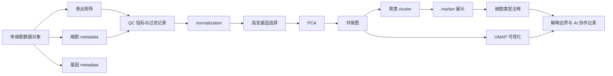
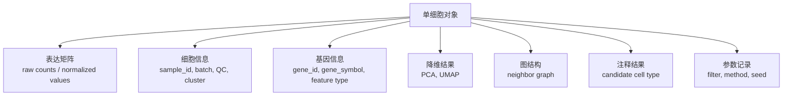
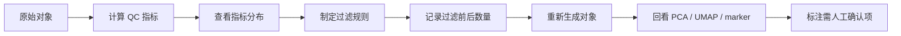
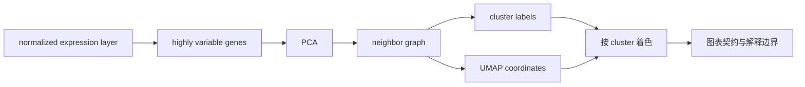

# 第14章 单细胞转录组数据处理与可视化

## 使用材料清单

| 材料类型 | 实际读取材料 | 正文用途 | 使用边界 |
| --- | --- | --- | --- |
| 章节结构 | `大纲.md`、`chapters/chapter-14/本章大纲.md` | 确认章名和 14.1-14.6 小节 | 第14章结构唯一来源是根目录 `大纲.md` |
| 相邻章节 | `chapters/chapter-11/本章大纲.md`、`chapters/chapter-12/本章大纲.md`、`chapters/chapter-15/本章大纲.md` | 衔接高维矩阵、RNA-seq 数据链条，并控制第15章边界 | 不把 bulk RNA-seq 或进阶单细胞内容提前写入本章 |
| 课程材料 | `syllabus/36课时-AI前置调整版.md` | 对齐第16周“单细胞转录组质控、降维与可视化” | 不改变课时安排 |
| 项目规范 | `references/术语表.md`、`references/图表规范.md`、`references/提示词样例.md` | 统一术语、图表契约和 AI 协作边界 | 不替代专业教材或真实案例证据 |
| 方法材料 | OSCA 单细胞对象、QC、normalization、feature selection、dimensionality reduction、clustering、marker detection、cell type annotation 本地页面 | 支撑对象结构、流程、参数记录和解释边界 | 不产生真实医学结论 |
| 实践材料 | sc-best-practices 的 AnnData、QC、normalization、feature selection、PCA/UMAP、clustering、annotation 章节 | 支撑对象字段、barcode、doublet、ambient RNA、表达层、UMAP 和注释不确定性 | 不采用固定阈值为通用标准 |
| 流程材料 | AIDD Bioinformatics 两个 scRNA-seq 文本 | 仅作为 Seurat 入门流程线索 | 原文有机器翻译和术语错误，不作为精确定义来源 |

本章没有使用真实单细胞数据对象生成新的分析结果。正文中的表格和流程用于教学，不代表任何疾病、药物或临床场景中的真实发现。

## 本章定位

第14章进入“单细胞、空间组学与综合项目”这一篇的第一章。前面章节已经训练学生看懂矩阵、metadata、PCA、聚类、热图、RNA-seq 数据链条和差异表达表。本章把这些基础放到单细胞转录组数据中，让学生理解一个更细的观察单位：细胞或 cell barcode。

单细胞转录组测序通常在细胞层面记录基因表达。它可以帮助研究者观察细胞群组成、细胞状态和表达差异线索，但基础分析本身不等于机制证明，也不等于临床建议。本章的重点是“看懂对象、记录处理、审慎解释”。

| 本章承接 | 本章训练 | 下一章再展开 |
| --- | --- | --- |
| 第11章高维矩阵、PCA、聚类和热图 | 单细胞对象、QC、normalization、高变基因、PCA、邻接图、聚类、UMAP | 批次整合、轨迹、RNA velocity、细胞通讯、空间组学 |
| 第12章 RNA-seq count matrix、metadata 和解释边界 | 从样本层面的表达矩阵转向细胞层面的表达对象 | 条件比较、pseudobulk、综合项目 |
| 第13章公共数据库和序列数据 | marker 和参考注释需要外部资料支持 | 多模态数据和项目交付 |

本章处在第三阶段 Vibe Coding。AI 可以帮助学生解释对象结构、生成 QC 记录表、整理参数和审阅图注。学生必须核验对象来源、字段含义、过滤规则、参数、随机种子、marker 来源和细胞类型注释依据。

## 学习目标

1. 能说明单细胞表达矩阵、cell barcode、gene ID、metadata、降维坐标、cluster 和 marker 表之间的关系。
2. 能记录质控指标、过滤阈值、过滤前后细胞数和需人工确认项。
3. 能解释 normalization、高变基因选择和 PCA 对后续邻接图、聚类和 UMAP 的影响。
4. 能为 UMAP 图写图表契约，说明输入对象、颜色含义、参数和解释边界。
5. 能用 marker 基因辅助细胞类型注释，并标出依据不足或需人工确认的 cluster。
6. 能把越界单细胞解释改写为“观察结果、方法来源、允许解释、替代解释、仍需验证内容”。

## 阅读指南

先读 14.1，建立单细胞对象的结构感。再读 14.2 和 14.3，理解为什么 QC、normalization 和高变基因会改变后续图形。14.4 和 14.5 是可视化和注释部分，重点不是背函数名，而是看懂图从哪里来、参数是什么、能解释到哪一步。

本章不要求学生成为单细胞分析专家。课堂要求是能读懂入门报告、检查图表是否合格、避免把 UMAP、cluster 或 marker 写成超出证据的医学结论。

| 学习任务 | 学生应提交的证据 | 常见错误 |
| --- | --- | --- |
| 对象结构识别 | 单细胞对象结构图 | 只看 UMAP，不看矩阵和 metadata |
| QC 记录 | 指标、阈值、过滤前后数量表 | 写“按默认参数过滤”，没有记录 |
| 降维聚类 | normalization、高变基因、PC、邻居图、resolution、随机种子记录 | 把参数当成无关细节 |
| UMAP 审阅 | 图表契约和图注 | 把 UMAP 距离当真实空间距离 |
| marker 注释 | cluster-marker-annotation 表 | 把 cluster 编号直接改成细胞类型 |
| 解释边界 | 观察-方法-边界-需验证表 | 把表达线索写成机制、疗效或诊断 |

## 核心概念速查

| 概念 | 本章解释 | 常见混淆 | 需保留英文 |
| --- | --- | --- | --- |
| 单细胞转录组 | 在细胞或 cell barcode 层面记录基因表达的组学数据 | 认为它天然给出细胞类型和机制 | scRNA-seq |
| cell barcode | 实验和测序流程中用于标记细胞或液滴来源的条形码 | 直接等同于一个高质量细胞 | cell barcode |
| 表达矩阵 | 基因和细胞构成的表达计数或处理后数值表 | 与 UMAP 图混为一谈 | expression matrix |
| metadata | 记录细胞、样本、批次、cluster、注释等信息的表 | 只把表达矩阵当作完整数据 | metadata |
| normalization | 降低测序深度、捕获效率或尺度差异对表达比较和可视化的影响 | 认为它消除了所有批次和技术偏差 | normalization |
| 高变基因 | 在细胞之间变化较大、用于后续降维和聚类的基因集合 | 认为高变基因就是机制基因 | highly variable genes |
| PCA | 用少数主成分概括高维表达矩阵主要变化的降维方法 | 只把 PCA 当作画图工具 | PCA |
| 邻接图 | 根据细胞相似性连接细胞的图结构，常用于聚类和 UMAP | 认为边代表真实细胞接触 | neighbor graph |
| cluster | 算法根据相似性得到的细胞群编号 | 直接等同于细胞类型 | cluster |
| UMAP | 展示高维单细胞数据低维结构的可视化方法 | 把坐标距离当真实生物距离 | UMAP |
| marker gene | 在某些细胞群中相对高表达、辅助注释的基因 | 写成绝对专属基因 | marker gene |

## 章节总览图



这张图是本章的知识结构，不是软件运行图。真实项目中，某些软件会把原始矩阵、处理后表达层、降维结果、邻接图、聚类编号和注释结果都保存在同一个对象里。学生需要知道这些结果从哪里来，而不是只记住最后一张 UMAP。

## 本章证据边界

| 表述类型 | 本章可以写 | 本章不能写 |
| --- | --- | --- |
| 数据结构 | 单细胞对象保存表达矩阵、metadata、降维结果和分析参数 | 有 UMAP 图就说明对象完整可靠 |
| 质控 | QC 指标和过滤规则会影响后续分析，需要记录 | 某个固定阈值适合所有组织和平台 |
| 降维聚类 | PCA、邻接图和聚类帮助整理高维表达结构 | cluster 编号自动代表细胞类型 |
| UMAP | UMAP 用于观察低维结构和分组显示 | UMAP 距离就是真实空间、发育距离或病理距离 |
| marker | marker gene 可辅助注释 | marker 高表达证明机制或临床意义 |
| 医学解释 | 单细胞结果可提出细胞组成和表达状态线索 | 单独给出因果、疗效、诊断或临床建议 |

## 14.1 单细胞数据对象与矩阵结构

bulk RNA-seq 常把样本作为列或观察单位。scRNA-seq 把观察单位推进到细胞或 cell barcode 层面。一个单细胞对象不只是一个表达矩阵，也不是一张 UMAP 图，它还包含细胞注释、基因注释、处理后表达层、降维坐标、聚类编号和参数记录。

cell barcode 需要谨慎理解。在液滴或高通量单细胞流程中，一个 barcode 可能对应一个细胞，也可能受到空滴、低质量细胞、双细胞或环境 RNA 影响。只有经过质控和记录后，barcode 才能进入后续解释。

| 比较点 | bulk RNA-seq | scRNA-seq |
| --- | --- | --- |
| 常见观察单位 | 样本 | 细胞或 cell barcode |
| 矩阵含义 | 基因 × 样本计数或表达量 | 基因 × 细胞，或细胞 × 基因，取决于软件对象 |
| metadata 重点 | 分组、批次、重复、样本来源 | 细胞 ID、样本 ID、批次、QC 指标、cluster、注释 |
| 数据特点 | 每个样本通常汇总许多细胞 | 稀疏、零值多、细胞质量差异明显 |
| 常见图形 | PCA、热图、火山图、富集图 | UMAP、marker 表达图、dot plot、violin plot |
| 解释风险 | 把差异表达写成机制 | 把 cluster 或 UMAP 写成细胞类型和机制 |

不同软件对象的名称不同，但保存思想相近。R/Bioconductor 中常见 `SingleCellExperiment`，它可保存表达矩阵、细胞信息、基因信息和降维结果。Python/Scanpy 中常见 `AnnData`，常用 `.X` 保存主矩阵，用 `.obs` 保存细胞信息，用 `.var` 保存基因信息，用 `.obsm` 保存 UMAP、PCA 等坐标。Seurat object 也用于保存表达矩阵、metadata、降维和聚类结果。



学生拿到单细胞对象时，第一步不是问“哪类细胞最多”，而是核对结构。至少要问：矩阵方向是什么，细胞 ID 是否能追溯到样本，metadata 是否包含批次和 QC 指标，UMAP 坐标来自哪个对象版本，cluster 是哪个参数下生成的，cell type 字段是否有注释来源。

| 核验项 | 要问的问题 | 记录方式 |
| --- | --- | --- |
| 对象来源 | 数据来自课程、公开数据库还是前人处理结果 | 写明来源、日期、许可和文件名 |
| 矩阵方向 | 行列分别是基因和细胞，还是细胞和基因 | 在对象结构图中标注 |
| 细胞标识 | cell barcode 是否能对应 sample_id 和 batch | 保存字段名和示例值 |
| 基因标识 | 使用 gene_id、gene_symbol 还是两者都有 | 记录基因 ID 版本 |
| 表达层 | 当前使用 raw counts、normalized values 还是 log-transformed layer | 在图表契约中写清 |
| 降维结果 | PCA、UMAP 是否来自当前过滤和参数 | 保存参数表 |
| 注释字段 | cell type 是否人工确认 | 标注来源和不确定项 |

**AI 协作任务 14.1**

把对象字段名、矩阵维度和 metadata 字段发给 AI，请它整理为对象结构图。学生必须检查 AI 是否把矩阵方向写反，是否把 cluster 当作细胞类型，是否遗漏 batch、sample_id、QC 指标和参数来源。

## 14.2 质控指标、过滤规则与记录

单细胞质控的目的不是“让图更好看”，而是识别低信息细胞、低质量细胞、潜在双细胞和异常 barcode，减少技术噪声对降维、聚类和注释的影响。QC 过滤一旦改变细胞集合，后面的 UMAP、cluster 和 marker 都会随之改变。

QC 指标不能只看单个数字。低基因数可能提示低质量细胞，也可能来自本来 RNA 含量较低的细胞类型。高线粒体比例可能提示细胞受损，也可能受组织和实验流程影响。材料中反复提醒，阈值不是通用常数，需要结合样本、平台、组织和课程目标记录。

| 指标 | 入门解释 | 常见用途 | 解释边界 |
| --- | --- | --- | --- |
| 检测到的基因数 | 一个 barcode 中检测到多少基因 | 识别低信息 barcode 或异常高复杂度 barcode | 不能单独判断细胞类型 |
| UMI 或 read count | 一个 barcode 的总计数深度 | 识别低深度或异常高计数 barcode | 高计数可能与双细胞有关，也可能与细胞状态有关 |
| 线粒体基因比例 | 线粒体基因计数占总计数比例 | 常用于发现受损或应激细胞线索 | 不同物种和组织的基因前缀与阈值不同 |
| 核糖体基因比例 | 核糖体相关基因表达比例 | 作为细胞状态或技术差异线索 | 不宜作为唯一过滤依据 |
| 双细胞评分 | 软件估计一个 barcode 是否可能包含两个细胞 | 辅助识别 doublet | 需要结合表达、样本和图形复核 |
| 样本来源 | barcode 所属样本、批次或处理组 | 检查是否某个样本大量丢失 | 不等同于生物学差异 |

QC 记录应同时保存“过滤前”和“过滤后”。如果只保存最终对象，后续读者无法判断有多少细胞被删、哪些样本受影响、过滤是否改变了某个细胞群的比例。

| 记录字段 | 示例写法 | 需人工确认点 |
| --- | --- | --- |
| 输入对象版本 | `raw_object_v1` | 文件路径和生成日期是否清楚 |
| 过滤指标 | `n_genes`、`total_counts`、`pct_mito`、doublet score | 字段名是否来自真实对象 |
| 阈值来源 | 课程规则、分布图、文献或教师指定 | 不能写“AI 推荐”作为唯一依据 |
| 过滤前细胞数 | 需补证据 | 必须来自真实对象 |
| 过滤后细胞数 | 需补证据 | 必须来自真实对象 |
| 样本影响 | 每个 sample_id 保留细胞数 | 检查是否某个样本几乎被过滤掉 |
| 保留疑似群体 | 稀有群体是否因阈值被误删 | 必要时保留并标注 |
| 复核记录 | 是否查看 QC 图和 UMAP 回看 | 保存图表和说明 |

QC 图本身也要有图表契约。箱线图、散点图或小提琴图都要说明对象版本、指标名称、阈值线、样本分组和过滤规则。只展示“过滤后 UMAP”不够，因为读者无法判断过滤过程是否合理。



**AI 协作任务 14.2**

让 AI 根据已有字段生成 QC 记录表模板。学生需要把真实对象中的细胞数、样本数、阈值来源和过滤后影响填入表中，并检查是否存在“自动删除所有异常点”的越界建议。

## 14.3 归一化、高变基因与降维

单细胞矩阵中的计数受捕获效率、测序深度、细胞 RNA 含量和实验流程影响。normalization 在本章中指降低这些尺度差异对表达比较、降维和可视化的影响。它不是“把数据变干净”的魔法，也不能自动消除批次效应。

许多对象会同时保存 raw counts、normalized values、log-transformed values 或其他表达层。学生要知道当前图形和分析使用的是哪一层。不同表达层适合不同任务，不能把展示用矩阵、聚类用矩阵和差异分析用矩阵混用后不说明。

| 步骤 | 解决什么问题 | 学生要记录什么 | 不能怎样解释 |
| --- | --- | --- | --- |
| normalization | 降低细胞间测序深度、捕获效率或尺度差异影响 | 方法、表达层、参数、对象版本 | 不能说消除所有技术偏差 |
| log 或其他变换 | 让数值范围更适合展示和某些下游方法 | 是否加伪计数、是否保存为新层 | 不能与 raw count 混称 |
| 高变基因选择 | 从大量基因中选择更有信息量的特征 | 选择方法、数量或规则、是否排除特定基因 | 不能说高变基因都是机制基因 |
| scaling 或回归技术变量 | 调整尺度或减少某些技术变量影响 | 变量名、方法、使用原因 | 不能无依据回归掉真实生物信号 |
| PCA | 用少数主成分概括主要表达变化 | 输入层、高变基因、PC 数、选择依据 | 不能把 PCA 直接写成细胞类型证明 |

高变基因选择是单细胞分析中的关键步骤。scRNA-seq 可以包含上万个基因，其中大量基因对区分细胞群贡献有限，或在多数细胞中接近零。高变基因选择帮助后续 PCA 和邻接图聚焦于更有信息量的表达变化。

高变基因不是结果名单。某个基因进入高变基因集合，只能说明它在当前处理对象和方法下被选为后续分析特征。它不能自动说明该基因有药物作用、疾病机制或临床价值。

| 常见误读 | 更合适的写法 |
| --- | --- |
| “归一化后数据已经没有批次效应。” | “归一化降低了部分尺度差异，批次效应仍需在图形、metadata 和后续分析中检查。” |
| “高变基因就是关键机制基因。” | “高变基因用于降维和聚类输入，机制解释需要额外证据。” |
| “PCA 选择多少个 PC 都一样。” | “PC 数会影响邻接图、聚类和 UMAP，需记录选择依据。” |
| “AI 给出的参数可以直接使用。” | “AI 可提供代码草稿，参数必须来自课程规则、分布检查或人工判断。” |

**参数记录表模板**

| 参数 | 当前值 | 来源 | 对后续影响 | 状态 |
| --- | --- | --- | --- | --- |
| 输入表达层 | 需补证据 | 对象字段 | 影响 normalization、PCA 和 marker 图 | 需人工确认 |
| normalization 方法 | 需补证据 | 运行记录 | 影响表达尺度 | 需人工确认 |
| 高变基因选择规则 | 需补证据 | 运行记录 | 影响 PCA 和邻接图 | 需人工确认 |
| PC 数 | 需补证据 | PC 检查图或课程规则 | 影响聚类和 UMAP | 需人工确认 |
| 是否回归技术变量 | 需补证据 | 分析说明 | 可能改变生物信号 | 需人工确认 |

## 14.4 PCA、邻接图、聚类与 UMAP

PCA 是从高维表达矩阵中提取主要变化方向的方法。单细胞数据经过 normalization 和高变基因选择后，常先进入 PCA，再根据 PCA 空间中细胞之间的相似性构建邻接图。

邻接图可以理解为“哪些细胞在表达空间中相近”的数据结构。图中的节点是细胞，边表示按算法定义的相似关系。它不是组织切片中的真实接触，也不是发育关系。聚类算法会在这个图上寻找细胞群结构，输出 cluster 编号。

| 步骤 | 输入 | 输出 | 关键记录 |
| --- | --- | --- | --- |
| PCA | 处理后的表达层和高变基因 | PC 坐标、载荷或方差解释信息 | 输入层、高变基因、PC 数 |
| 邻接图 | PC 空间中的细胞坐标 | 细胞相似性图 | 邻居数、距离度量、使用 PC 范围 |
| 聚类 | 邻接图 | cluster 编号 | 算法、resolution、随机种子 |
| UMAP | 邻接图或降维坐标 | 二维或三维可视化坐标 | 使用对象、参数、随机种子、颜色字段 |

cluster 编号只是算法输出。`0`、`1`、`2` 这类编号没有天然生物学含义。只有在 marker 表达、参考资料、组织背景和人工判断支持后，cluster 才能被候选注释为某类细胞。

UMAP 是教学中最容易被误读的图。UMAP 可以展示局部结构、群体分布和分组颜色，但坐标轴本身通常没有直接生物学单位。两个点在图上靠近，说明在当前算法、输入和参数下被放得较近，不等于细胞在组织中靠近，也不等于发育关系更近。



**UMAP 图表契约**

| 项目 | 必须说明 | 不应写成 |
| --- | --- | --- |
| 点 | 每个点代表细胞或 barcode | 每个点代表一个真实空间位置 |
| 颜色 | 按 cluster、sample、batch、cell type 或 marker 表达着色 | 颜色本身证明细胞类型 |
| 输入对象 | 使用哪个过滤后对象和表达层 | “默认对象” |
| 关键参数 | PC 数、邻居图参数、resolution、随机种子 | 参数无关紧要 |
| 细胞数 | 过滤后总细胞数和样本范围 | 只给图片不报告数量 |
| 解释边界 | UMAP 展示低维结构，不能单独证明机制 | UMAP 分离说明治疗反应或疾病机制 |

**图注示例**

图14-1 过滤后单细胞对象的 UMAP 可视化。每个点代表一个进入分析的 cell barcode，颜色表示算法聚类编号。该图用于展示当前参数下的低维结构；cluster 编号尚未等同于细胞类型，细胞类型注释需结合 marker 表达和人工确认。过滤后细胞数、PC 数、邻接图参数、resolution 和随机种子需由真实运行记录补充。

## 14.5 marker 基因展示与细胞类型注释

marker gene 在本教材中指某个细胞群中相对高表达、可辅助细胞类型注释的基因。它不是绝对专属基因，也不是机制证明。许多 marker 会在多个细胞群中不同程度表达，单个 marker 更容易误导。

细胞类型注释是证据整合过程。常见依据包括聚类结果、marker 表达图、marker 结果表、已知细胞标志、参考数据库、组织背景和人工判断。材料中也提醒，自动注释或参考标签转移依赖参考数据质量，不能替代人工复核。

| 图表或结果 | 用途 | 必备信息 | 解释边界 |
| --- | --- | --- | --- |
| feature plot | 显示一个基因在 UMAP 上的表达分布 | 基因名、表达尺度、对象版本、颜色含义 | 不证明该基因绝对专属 |
| violin plot | 比较不同 cluster 的表达分布 | 分组字段、表达层、基因名 | 不单独证明细胞类型 |
| dot plot | 同时展示多个 marker 在多个 cluster 中的表达 | 点大小含义、颜色含义、marker 来源 | 不自动完成注释 |
| heatmap | 展示 marker 集合在群体中的模式 | 输入矩阵、基因列表、排序规则 | 不证明机制或临床分型 |
| marker 结果表 | 列出候选 marker 和统计字段 | 比较对象、统计方法、阈值、校正方式 | 聚类后再检验的 P 值需谨慎 |

marker 展示应先服务于注释核验，而不是讲故事。学生可以先问：这个 marker 是从哪里来的，基因 ID 是否正确，表达层是什么，它在目标 cluster 中是否相对更高，它是否也在其他 cluster 表达，是否需要多个 marker 一起判断。

| cluster | 候选 marker | 表达证据 | 候选注释 | 注释依据 | 状态 |
| --- | --- | --- | --- | --- | --- |
| Cluster 0 | 需补证据 | 需补证据 | 待注释 | 需人工确认 marker 来源 | 需人工确认 |
| Cluster 1 | 需补证据 | 需补证据 | 待注释 | 需人工确认 marker 来源 | 需人工确认 |
| Cluster 2 | 需补证据 | 需补证据 | 待注释 | 需人工确认 marker 来源 | 需人工确认 |

这张表故意不填具体细胞类型。当前材料没有提供课程指定组织、真实 marker 表和人工注释记录。为了避免臆造，本章只给注释表结构。后续如果补充真实对象和 marker 依据，可以把表格更新为真实教学案例。

**越界表达改写**

| 原表述 | 问题 | 改写 |
| --- | --- | --- |
| “Cluster 4 是 T 细胞。” | 把算法编号直接写成细胞类型 | “Cluster 4 在当前聚类参数下形成独立群体，细胞类型需结合 marker 表达和参考资料确认。” |
| “该 marker 是该细胞类型专属基因。” | 把相对高表达写成绝对专属 | “该 marker 在候选群体中相对高表达，可作为注释线索之一。” |
| “该细胞群导致药物耐受。” | 从表达观察跳到机制 | “该细胞群的表达模式提示后续可关注药物耐受相关假设，仍需实验设计和外部证据验证。” |

**AI 协作任务 14.5**

学生把 marker 表、feature plot 或 dot plot 的字段发给 AI，请 AI 检查是否缺少表达尺度、比较对象、marker 来源和不确定注释。AI 不能根据一个基因名直接给出最终细胞类型。

## 14.6 单细胞结果的解释边界

单细胞基础分析可以提出细胞群结构、表达状态和注释线索。它不能单独证明机制、因果、疗效、诊断价值或临床建议。写作时要把算法输出、图形观察和医学解释分层。

本章建议使用“观察结果、方法来源、允许解释、替代解释、仍需验证内容”五栏表。这样写可以减少过度推断，也方便教师检查学生是否把 UMAP、cluster 或 marker 解释过头。

| 层级 | 可以写什么 | 需要补什么才能向下一层推进 |
| --- | --- | --- |
| 数据对象检查 | 对象包含哪些矩阵、metadata 和降维结果 | 来源、版本、字段和维度记录 |
| 质控过滤 | 哪些指标用于过滤，过滤前后数量如何变化 | 阈值来源、样本影响、疑似 doublet 或低质量细胞复核 |
| 算法输出 | PCA、邻接图、cluster 和 UMAP 的参数与结果 | 参数敏感性检查和随机种子记录 |
| 图形观察 | 哪些 cluster 分开，哪些 marker 相对高表达 | marker 来源、表达尺度、多个 marker 交叉验证 |
| 候选注释 | 某 cluster 可候选注释为某细胞类型 | 数据库、文献、组织背景和人工确认 |
| 医学解释 | 仅提出需验证的细胞组成或表达状态线索 | 严格实验设计、统计比较、批次控制和外部证据 |

**解释边界表模板**

| 观察结果 | 方法来源 | 允许解释 | 替代解释 | 仍需验证 |
| --- | --- | --- | --- | --- |
| UMAP 中部分细胞形成相对分离的区域 | 当前过滤对象、PCA、邻接图和 UMAP 参数 | 当前参数下存在低维结构差异线索 | 批次效应、样本组成差异、QC 过滤、参数选择 | 换参数复核、按 sample/batch 着色、检查 marker |
| 某 cluster 中候选 marker 相对高表达 | marker 表和表达图 | 可作为候选注释依据之一 | marker 不唯一、表达稀疏、注释数据库差异 | 多 marker 复核、参考资料和人工确认 |
| 某样本来源细胞在 UMAP 一侧更多 | sample_id 着色图 | 可能存在样本组成差异或技术差异 | 批次、细胞数量不均、解离偏倚 | 样本层面统计、批次检查、实验设计复核 |

常见越界来自三个跳跃。第一，把 UMAP 距离跳成真实生物距离。第二，把 cluster 编号跳成细胞类型。第三，把 marker 高表达跳成机制或临床意义。每次写结果时，都要问：这是观察、方法结果，还是已经需要额外证据的解释？

| 风险 | 检查问题 | 合格写法 |
| --- | --- | --- |
| UMAP 过度解释 | 是否把坐标距离写成真实距离 | “UMAP 展示当前参数下的低维结构。” |
| cluster 过度命名 | 是否没有 marker 依据就命名 | “该 cluster 暂记为待注释。” |
| marker 过度解释 | 是否把 marker 写成专属或机制 | “该 marker 是相对表达线索之一。” |
| 细胞比例过度解释 | 是否没有样本层面比较就写变化 | “当前图中观察到分布差异，需统计比较。” |
| AI 过度代写 | 是否让 AI 直接生成结论 | “AI 输出仅用于草稿，最终解释由人工核验。” |

## 本章交付物

| 交付物 | 内容 | 合格标准 |
| --- | --- | --- |
| 单细胞对象结构图 | 表达矩阵、metadata、降维、聚类、marker 表和参数记录 | 能说明每个结果来自对象中的哪个部分 |
| QC 记录表 | 指标、阈值、过滤前后数量、样本影响 | 不写通用阈值，不漏过滤前后数量 |
| 参数记录表 | normalization、高变基因、PC、邻接图、聚类、UMAP | 参数来自真实运行记录或课程规则 |
| UMAP 图表契约 | 点、颜色、输入对象、参数、细胞数、解释边界 | 不把 UMAP 写成真实空间或机制证明 |
| cluster-marker-annotation 表 | cluster、marker、表达证据、候选注释、依据和状态 | 能标出待注释和需人工确认项 |
| 解释边界表 | 观察、方法、允许解释、替代解释、仍需验证 | 不新增医学因果、疗效或临床建议 |
| AI 协作记录 | 使用提示词、AI 输出、人工修改和核验结果 | 能追踪 AI 哪些建议被采纳或拒绝 |

## 知识图谱生成提示词

以下提示词用于生成本章知识结构图。生成图只作为教学展示，不能替代本章表格、Mermaid 图和人工核验。

```text
请为《医药数据处理与可视化》第14章“单细胞转录组数据处理与可视化”生成一个知识图谱。

节点必须包括：
单细胞数据对象、表达矩阵、cell barcode、metadata、gene metadata、QC 指标、过滤规则、normalization、高变基因、PCA、邻接图、聚类 cluster、UMAP、marker gene、细胞类型注释、解释边界、AI 协作记录。

连线要求：
1. 表达矩阵、metadata 和 gene metadata 共同构成单细胞数据对象。
2. QC 指标产生过滤规则，过滤规则改变后续对象。
3. normalization 和高变基因选择共同影响 PCA。
4. PCA 影响邻接图，邻接图影响聚类和 UMAP。
5. marker gene 辅助细胞类型注释，但不能单独证明细胞类型。
6. UMAP、cluster 和 marker 的解释都必须连接到解释边界。
7. AI 协作记录只能连接到流程辅助、参数整理和图注审阅，不能连接到最终医学结论。

风格要求：
用简洁中文标签，不使用未提供的细胞类型、疾病名、药物名、样本量或统计结论。
```

## 本章小结

第14章的核心不是“画出漂亮 UMAP”，而是把单细胞对象从输入、质控、normalization、高变基因、PCA、邻接图、聚类、UMAP 到 marker 注释的路径讲清楚。学生需要能追踪每一步的输入、输出和参数，才能判断图形是否可信。

单细胞图形很容易让人产生强解释。UMAP 分离、cluster 编号、marker 高表达和细胞比例差异，都只能先写成观察或候选线索。能否进入医学解释，取决于实验设计、统计比较、批次控制、参考资料和外部验证。

AI 在本章适合做三类事：整理结构、生成记录表、审阅越界表述。AI 不适合替学生决定删哪些细胞、把 cluster 命名为细胞类型，或把单细胞图写成机制和临床建议。

## 需补证据

| 缺口 | 当前处理 | 后续建议 |
| --- | --- | --- |
| 真实课堂 scRNA-seq 对象 | 正文使用流程和模板，不写真实细胞数 | 补充小型对象、来源、许可和对象摘要 |
| 过滤前后细胞数 | 标注 `需补证据` | 运行对象后填入 QC 记录表 |
| 具体 marker 和细胞类型注释 | 不自行发明 | 补充组织背景、marker 来源和人工确认 |
| 软件版本与运行环境 | 不承诺代码复现 | 保存 R/Python 包版本和运行日志 |
| 医药案例解释 | 不写机制、疗效或诊断 | 另行提供研究背景和引用证据 |
