# 第14章 单细胞转录组数据处理与可视化

## 本章定位

单细胞 RNA 测序把一个样本中的转录本计数拆分到细胞层面。分析者由此获得“基因乘细胞”的稀疏矩阵，并需要同时管理细胞元数据、基因注释、不同处理阶段的表达矩阵、降维坐标和聚类标签。任何一步失去来源记录，后续图形都难以核验。

单细胞基础流程先核对对象结构，再记录质控、归一化和特征选择。PCA、邻接图、聚类和 UMAP 完成后，marker 与参考模型只用于提出细胞类型候选。批次整合、条件比较、轨迹、RNA velocity、细胞通讯、空间组学和多模态分析留到第15章。

## 学习目标

完成本章后，学生应能提交以下可检查证据：

1. 说明 AnnData、SingleCellExperiment 和 Seurat 中表达矩阵、细胞信息、基因信息及降维结果的存放位置。
2. 用分布图和样本背景说明质控阈值，并记录过滤前后细胞数、基因数和被标记原因。
3. 区分 raw counts、normalized expression、scaled matrix 及其适用步骤。
4. 解释 PCA、邻接图、聚类和 UMAP 的输入输出关系，并完成 resolution 敏感性检查。
5. 使用 marker 组合、参考注释与置信度信息给出候选标签，同时列出替代解释。
6. 识别细胞级检验、聚类后 marker 检验和生物学重复之间的统计边界。

### 分析主线

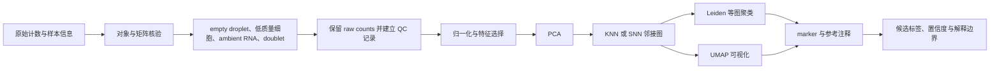

### 证据边界

| 观察或输出 | 本章允许的解释 | 本章不支持的升级 |
| --- | --- | --- |
| 某些细胞的线粒体转录本比例较高 | 这些细胞需要结合总计数、检测基因数和样本分布复核 | 直接断言这些细胞来自某种疾病状态 |
| UMAP 上形成分离区域 | 在给定预处理、邻接图和随机种子下，细胞的局部邻域结构存在差异 | 把二维距离当作真实生物距离或发育时间 |
| 一个 cluster 富集多种 B 细胞 marker | 可提出 B 细胞相关候选标签 | 仅凭一个 marker 确认精细亚型 |
| CellTypist 给出高置信度标签 | 当前表达谱与参考模型中的某一类别较相似 | 把模型置信度当作独立实验验证 |
| 细胞级 marker 检验得到很小的 P 值 | 在当前对象和检验设定下存在表达排序证据 | 把同一 donor 的大量细胞当成大量生物学重复 |

| 案例 | 本章角色 | 运行状态 | 解释边界 |
| --- | --- | --- | --- |
| 人骨髓 `site4-donor8` | 对象、QC、特征选择、聚类和注释的来源案例 | 素材已运行，本机未重跑远程对象 | 单个 donor 不支持条件推断 |
| OSCA PBMC | 对照另一套 QC、HVG、图聚类和注释路径 | 来源案例 | 参数不能照搬到其他数据 |
| Seurat `pbmc_small` | 检查本机对象、归一化、resolution 和 marker 图 | 本机复跑 | 80 个细胞且缺少完整 QC 输入，只用于流程检查 |

## 14.1 单细胞数据对象与矩阵结构

单细胞对象把表达矩阵与多层注释放在一起。矩阵中的 cell 是观测单位，sample 和 donor 则位于更高层级；基因注释、细胞 metadata、降维坐标和聚类标签又分别描述不同对象。读取对象时若只查看矩阵维度，容易把细胞数误作独立样本量，也可能忽略注释索引与矩阵顺序错位。

核验应从对象结构开始。先确认矩阵方向和稀疏存储，再检查 cell 与 gene 名称是否唯一，随后比较 metadata 行数、索引和 sample、donor、batch、condition 等字段。只有这些层级对齐，质控、降维和条件比较才使用同一批细胞与样本。

### 14.1.1 从矩阵方向开始核验

单细胞表达矩阵通常稀疏，即绝大多数“基因乘细胞”位置为零。零值可能来自该细胞中未检测到相应转录本，也可能受到测序深度和抽样影响，不能直接等同于基因绝对不表达。稀疏存储只记录非零值及其位置，能够显著减少内存占用。

不同软件对矩阵方向的显示习惯不同。AnnData 的观察为行、变量为列，常写成“细胞乘基因”；SingleCellExperiment 和 Seurat 的表达 assay 通常是“基因乘细胞”。读取对象后应同时核对维度、行列名称和元数据索引，不能只看一个数字。

| 任务 | AnnData | SingleCellExperiment | Seurat |
| --- | --- | --- | --- |
| 主表达矩阵 | `.X` | `assay(sce)` | `obj[["RNA"]]` 中的 layer |
| 原始计数 | 常存于 `.layers["counts"]` | `counts(sce)` | `layer = "counts"` |
| 归一化表达 | `.X` 或命名 layer | `logcounts(sce)` | `layer = "data"` |
| 细胞元数据 | `.obs` | `colData(sce)` | `obj[[]]` 或 `obj@meta.data` |
| 基因元数据 | `.var` | `rowData(sce)` | assay 的特征元数据（feature metadata） |
| 降维坐标 | `.obsm` | `reducedDims(sce)` | `Reductions(obj)` |
| 图与非结构化记录 | `.obsp`、`.uns` | `colPairs`、`metadata` | graphs、commands、misc |

`.X` 或 `data` 并不天然表示原始计数。对象可能已经被归一化，甚至只保留筛选后的基因。稳妥做法是检查 layer 名称、数值范围、是否包含非整数、对象创建记录和上游脚本，再决定哪个矩阵可供归一化、差异检验或绘图使用。

### 14.1.2 人骨髓对象中的字段

sc-best-practices 的贯穿案例来自 NeurIPS 2021 10x Multiome 骨髓单个核细胞数据。完整研究包含 4 个采集地点的 12 名健康供者，教程选取 `site4-donor8` 一个批次。素材载入时显示 16,934 个 barcode 和 36,601 个转录本特征，AnnData 方向为 `16934 × 36601`。

```python
print(adata.shape)
print(adata.obs.columns.tolist())
print(adata.var_names[:5])
print(adata.layers.keys())
print(adata.obsm.keys())
```

这组检查回答五个问题：对象有多少细胞和基因，细胞层有哪些质量或样本字段，基因标识采用何种体系，原始计数是否保留，PCA 或 UMAP 坐标是否已经存在。随着流程推进，案例把原始计数、归一化矩阵和注释结果分别写入 layer 或元数据（metadata），避免覆盖同一矩阵后失去追溯依据。

| 字段 | 案例中的内容 | 下游用途 |
| --- | --- | --- |
| `.X` | 当前分析阶段的表达矩阵 | 需先确认处理状态，再用于计算 |
| `.obs` | 每个 barcode 的计数、检测基因数、线粒体比例、doublet 标记等 | 过滤、分组、着色、审计 |
| `.var` | 每个基因的注释及高变或高偏差标记 | 特征筛选、基因定位 |
| `.layers` | counts、log1p 或 scran 等不同表达层 | 保留原始值并服务不同算法 |
| `.obsm` | PCA、UMAP 等细胞坐标 | 降维图和邻域检查 |

### 14.1.3 本机 Seurat 对象检查

本章脚本从 SeuratObject 自带的 `pbmc_small` 计数层重新创建对象，使默认流程不受对象中已有 PCA、t-SNE 或旧聚类标签影响。以下代码在本机 R 4.6.0、Seurat 5.5.0 和 SeuratObject 5.4.0 下运行。

```r
library(Seurat)
data("pbmc_small", package = "SeuratObject")

counts <- GetAssayData(pbmc_small, assay = "RNA", layer = "counts")
obj <- CreateSeuratObject(counts = counts, min.cells = 0, min.features = 0)

dim(obj)
Layers(obj[["RNA"]])
head(obj[[]])
```

实际输出的对象维度为 230 个特征、80 个细胞。创建后首先只有 `counts` 层；执行 `NormalizeData()` 后增加 `data` 层，执行 `ScaleData()` 后增加 `scale.data` 层。该对象只用于检验代码链能否运行和参数变化如何影响聚类，不能代表一个完整 PBMC 研究。

### 14.1.4 对象核验记录

对象检查应写入分析记录，而非停留在交互窗口。一个最低限度的记录表如下。

| 核验项 | 应记录内容 | 常见问题 |
| --- | --- | --- |
| 样本与细胞标识 | donor、sample、batch、barcode 是否唯一 | 多个样本合并后 barcode 重名 |
| 基因标识 | gene symbol、Ensembl ID、物种、版本 | 重复 symbol 或版本后缀未处理 |
| 矩阵方向 | 行和列分别代表什么 | AnnData 与 Seurat 转换后方向误判 |
| 表达层 | counts、normalized、scaled 的位置和生成方法 | 覆盖原始计数，或把 scaled 值用于计数模型 |
| 稀疏性 | 数据类型、非零值比例、是否被转为 dense | 大对象无意转为 dense 导致内存耗尽 |
| 元数据对齐 | 元数据行名与细胞列名是否同序同集 | 直接拼接导致标签错位 |

## 14.2 质控指标、过滤规则与记录

单细胞质控把 barcode 级观察转成可分析细胞集合。总 UMI、检测基因数和线粒体比例等指标可以发现低复杂度或受损候选，空液滴、环境 RNA 和双细胞还需要相应方法与背景信息。任何单一阈值都只能标记候选，不能概括所有质量问题。

过滤前先按 sample 或 batch 查看指标分布，记录阈值依据和预期影响；过滤后比较保留细胞数、各样本比例、基因分布与主要细胞群。若某一批次或条件被大量删除，应判断这是质量差异、建库差异还是阈值不适配。质控记录要保留过滤前后状态，避免只留下最终对象。

### 14.2.1 质控对象不只包括低质量细胞

液滴式单细胞数据从 barcode 开始。一个 barcode 可能对应空液滴、单个细胞、低质量细胞或多个细胞。细胞裂解释放的游离 RNA 还可能进入其他液滴，形成 ambient RNA 背景。质控需要分别识别这些问题，因为它们的成因和处理方式不同。

| 问题 | 可观察信号 | 处理与核验 |
| --- | --- | --- |
| empty droplet | 总 UMI 很低，表达谱接近环境背景 | 使用 cell calling 或 `emptyDrops`，记录输入 barcode 与保留数 |
| 低质量 barcode | 检测基因少、总计数异常、线粒体比例偏高 | 联合分布和样本背景设阈值，保留过滤原因 |
| ambient RNA | 某些高丰度转录本在不相干细胞群中广泛出现 | 结合空液滴估计背景，必要时用 SoupX 等方法校正 |
| doublet | 总计数或检测基因偏高，或表达两个不相容谱系的组合 | 计算 doublet score，先标记并在聚类后复核 |
| 样本异常 | 某个 donor 或批次整体偏离 | 按样本绘制分布，避免用全体阈值掩盖批次问题 |

`n_genes_by_counts` 表示一个细胞中计数大于零的基因数；`total_counts` 表示该细胞的总计数，也常称 library size；`pct_counts_mt` 表示线粒体基因计数占总计数的比例。三者共同描述捕获复杂度、测序量和潜在损伤信号，任何单项都不足以自动定义“合格细胞”。

### 14.2.2 人骨髓案例的过滤过程

素材先绘制总计数、线粒体比例以及总计数与检测基因数的关系。分布中存在高线粒体比例和两端异常值，因此教程用中位数绝对偏差（median absolute deviation, MAD）建立样本内规则。

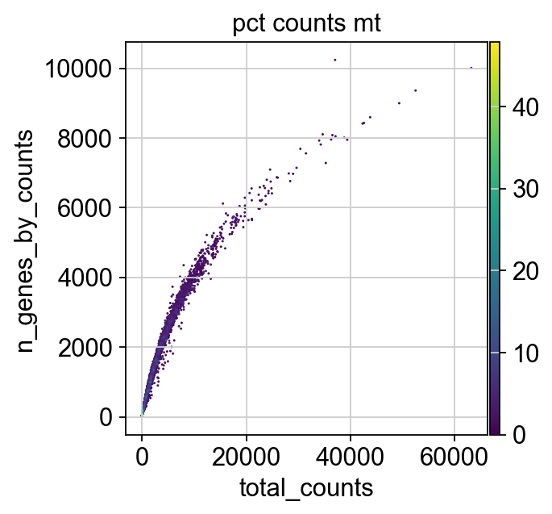

图14-1 人骨髓 `site4-donor8` 案例过滤前的 QC 分布。源图来自 sc-best-practices 已保存输出，本机未重跑远程对象；正式出版许可需人工确认。

在人骨髓 `site4-donor8` 的过滤前分布中，案例函数把低于中位数减若干倍 MAD 或高于中位数加若干倍 MAD 的观测标为异常。总计数、检测基因数和前 20 个高表达基因所占比例使用 5 MAD；线粒体比例使用 3 MAD，并附加 `pct_counts_mt > 8` 条件。规则联合应用后，barcode 从 16,934 个减至 14,814 个。

```python
def is_outlier(adata, metric: str, nmads: int):
    values = adata.obs[metric]
    lower = np.median(values) - nmads * median_abs_deviation(values)
    upper = np.median(values) + nmads * median_abs_deviation(values)
    return (values < lower) | (values > upper)

adata.obs["outlier"] = (
    is_outlier(adata, "log1p_total_counts", 5)
    | is_outlier(adata, "log1p_n_genes_by_counts", 5)
    | is_outlier(adata, "pct_counts_in_top_20_genes", 5)
)
adata.obs["mt_outlier"] = (
    is_outlier(adata, "pct_counts_mt", 3)
    | (adata.obs["pct_counts_mt"] > 8)
)
```

运行记录显示，`outlier` 标记 869 个 barcode，`mt_outlier` 标记 1,694 个。两个集合可能重叠，不能把数字直接相加。按两个标记联合过滤后，barcode 从 16,934 个减至 14,814 个；后续基因过滤使特征从 36,601 个减至 20,109 个。

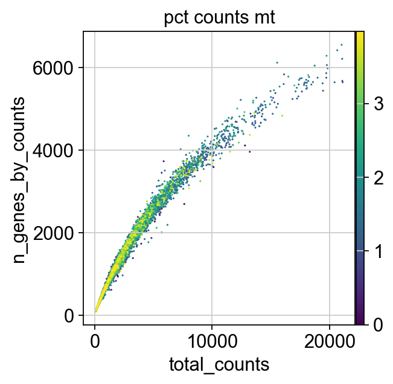

图14-2 人骨髓案例过滤后分布。图的作用是检查极端区域是否按预期减少，以及保留细胞是否仍覆盖合理范围。它不能证明过滤后的所有细胞都具有相同质量。源图出版许可需人工确认。

5 MAD、3 MAD 和 8% 只适用于该教程数据及其分布。组织、平台、物种或建库方案改变后，应重新检查指标分布并记录阈值依据和过滤前后细胞数。

### 14.2.3 doublet 与 ambient RNA

过滤低质量细胞后，素材用 scDblFinder 生成模拟 doublet，并在 PCA 邻域中计算 doublet score。14,814 个保留 barcode 中，12,322 个被标为 singlet，2,492 个被标为 doublet。教程没有立即删除 2,492 个标记，而是保留它们供降维和聚类阶段继续检查。

```r
set.seed(123)
sce <- scDblFinder(
  SingleCellExperiment(list(counts = data_mat))
)
doublet_score <- sce$scDblFinder.score
doublet_class <- sce$scDblFinder.class
```

这种处理保留了不确定性。doublet 检测是模型判断，阈值受细胞负载、样本异质性和算法假设影响。若直接删除所有高分细胞，可能误删真实过渡状态或高 RNA 含量细胞；若完全忽略，又可能产生混合谱系 cluster。记录中至少应保留 score、class、软件版本和最终是否剔除。

ambient RNA 与 doublet 的图形表现可能部分相似。前者常表现为环境中高丰度基因在多个细胞群中出现低水平信号，后者更可能呈现两个细胞表达程序的组合。SoupX 等方法需要空液滴或背景谱信息；完成校正后还要检查已知高丰度基因是否被过度扣除。本章不在 `pbmc_small` 上模拟这一步，因为小对象缺少原始空液滴。

### 14.2.4 OSCA 案例说明阈值为何不能照搬

OSCA 的 10x PBMC 工作流从 Cell Ranger 细胞判定前的原始矩阵开始，先用 `emptyDrops` 控制空液滴，再采用较宽松的细胞质控。其线粒体比例规则标记 322 个细胞，保留 4,080 个。该流程保留较低总计数和较少检测基因的细胞，以减少稀有细胞群被提前排除的风险。

| 案例 | cell calling 或过滤结果 | 教学含义 |
| --- | --- | --- |
| 人骨髓 `site4-donor8` | 16,934 个 barcode 经低质量规则保留 14,814 个，基因保留 20,109 个 | 多指标、MAD 与绝对上限可联合使用，但参数属于该案例 |
| OSCA 10x PBMC | `emptyDrops` 后结合线粒体比例，4,080 个保留、322 个标记 | 先区分空液滴，再根据稀有群体保护目标选择较宽松规则 |
| Seurat `pbmc_small` | 80 个细胞、230 个特征，`^MT-` 基因数为 0 | 缺少线粒体特征和空液滴，不能演示完整 QC |

### 14.2.5 质控记录表

推荐保留“标记”字段，再由明确的逻辑生成最终对象。例如在 `.obs` 中保存 `low_counts`、`mt_outlier`、`predicted_doublet` 和 `passes_QC`，在 Seurat 元数据中保存同名字段。这样可以回查每个细胞被排除的原因，也便于修改一项规则后重新统计。

| 记录字段 | 示例内容 |
| --- | --- |
| 输入范围 | 样本、donor、建库批次、barcode 总数、基因数 |
| 指标定义 | 总计数、检测基因数、线粒体基因集合及计算式 |
| 阈值依据 | 每样本分布、MAD 倍数、绝对界值、图号 |
| 过滤结果 | 每条规则标记数、规则交集、最终保留数 |
| 特殊问题 | ambient RNA 方法、doublet 方法、参数和版本 |
| 输出对象 | 文件名、表达层、元数据字段、生成时间 |

## 14.3 归一化、高变基因与降维

从原始计数到降维输入会经过多种表达层。原始计数保留测序分子记录，归一化值降低细胞总计数差异，高变基因限定进入降维的特征集合，scaled matrix 再调整各基因的中心和尺度。每一步都生成新的对象状态，不能用同一个“表达矩阵”名称混写。

处理前后要分别检查数值范围、零值比例、特征数和细胞顺序。高变基因表示在当前数据与选择规则下较能描述变异，不等于生物学上最重要的基因。若 cell cycle、线粒体或批次相关特征主导主成分，应记录其影响并根据研究问题决定后续处理。

### 14.3.1 三类表达值承担不同任务

原始计数是测序分子计数的离散记录，应保留给需要计数分布的方法和来源核验。归一化表达用于减小细胞总计数差异对可比性的影响。scaled matrix 通常对每个基因中心化和缩放，适合 PCA 等计算，但数值不再是原始表达量。

| 表达层 | 典型数值 | 适合的任务 | 不宜直接用于 |
| --- | --- | --- | --- |
| raw counts | 非负整数、稀疏 | 质控、size factor 估计、计数模型、重算 | 直接比较不同 library size 的细胞 |
| normalized expression | 经 size factor 和常见 log1p 变换 | marker 展示、邻域构建前处理、部分可视化 | 声称绝对分子数相等 |
| scaled matrix | 每基因中心化或标准化后的值 | PCA、热图中的相对模式 | 计数模型、表达倍数的原始单位解释 |

表达层应采用可读名称，并在对象中保留生成方法。例如 AnnData 可使用 `layers["counts"]`、`layers["log1p_norm"]`、`layers["scran_normalization"]`；Seurat v5 通常使用 `counts`、`data` 和 `scale.data`。若不同方法都写回 `.X`，分析者很难知道图形使用了哪套值。

### 14.3.2 shifted log 与 size factor

sc-best-practices 在人骨髓对象中演示 shifted log normalization。`normalize_total()` 先按每个细胞的总计数计算缩放，`log1p()` 再压缩高表达值范围，结果保存到新 layer，而不是覆盖 counts。

```python
scales_counts = sc.pp.normalize_total(
    adata, target_sum=None, inplace=False
)
adata.layers["log1p_norm"] = sc.pp.log1p(
    scales_counts["X"], copy=True
)
```

设细胞 (j) 的原始总计数为 (L_j)，目标总量为 (T)，基因 (g) 的计数为 (x_{gj})。一种常见表达形式为 `log(1 + x_gj × T / L_j)`。该变换改善不同 library size 的可比性，却不能消除所有组成偏倚，也不会补回未检测到的转录本。

scran 先把若干细胞汇集成 pool，估计 pool 的 size factor，再反卷积得到细胞级因子。这种做法可降低单个稀疏细胞对估计的影响。OSCA PBMC 工作流使用 `quickCluster()` 辅助分组，随后 `computeSumFactors()` 和 `logNormCounts()` 完成归一化。

```r
clusters <- quickCluster(sce.pbmc)
sce.pbmc <- computeSumFactors(sce.pbmc, clusters = clusters)
sce.pbmc <- logNormCounts(sce.pbmc)
```

size factor 需要从 raw counts 估计。若输入已经 log 转换或 scaled 的矩阵，模型假设会被破坏。报告中应记录因子的分布，并检查其与 library size 的关系；极端因子可能提示低质量细胞、组成偏倚或样本问题。

### 14.3.3 高变或高偏差特征

特征选择从大量基因中选出能较好描述细胞间结构的一组基因，以减少噪声、计算量和高维稀疏性的影响。名称可能是 highly variable genes（HVG）或 highly deviant genes。二者计算原则不完全相同，正文和代码应保留所用方法名称。

人骨髓案例按原始计数计算二项偏差，选取偏差最高的 4,000 个基因，并在 `.var["highly_deviant"]` 中保存布尔标记。4,000 是该教程的特征数，不是固定标准。

```python
idx = binomial_deviance.argsort()[-4000:]
mask = np.zeros(adata.var_names.shape, dtype=bool)
mask[idx] = True

adata.var["highly_deviant"] = mask
adata.var["binomial_deviance"] = binomial_deviance
```

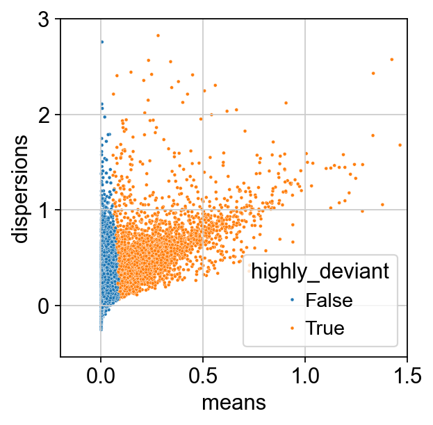

图14-3 人骨髓案例的特征选择图。点表示基因，颜色区分是否进入 4,000 个 highly deviant genes。该图用于检查选择结果与表达均值、离散度的关系。源图出版许可需人工确认。

OSCA PBMC 案例采用均值与方差趋势建模，并用 `getTopHVGs(..., prop = 0.1)` 选取排名前 10% 的特征。两种流程都把技术变化与有信息的细胞间变化区分开，但统计模型和输入层不同，因此不能只比较“选了多少基因”。

| 核验问题 | 合格记录 |
| --- | --- |
| 从哪一层选特征 | 明确写出 raw counts、logcounts 或指定 layer |
| 采用什么方法 | 写出 binomial deviance、vst 或 mean-variance model |
| 选取多少 | 记录数量或比例，并说明为案例参数 |
| 是否存在不宜进入的基因集合 | 检查线粒体、核糖体、细胞周期或技术基因是否主导，按研究目的处理 |
| 结果保存在哪里 | AnnData `.var`、SingleCellExperiment `rowData` 或 Seurat VariableFeatures |

### 14.3.4 本机 Seurat 归一化与特征选择

`pbmc_small` 运行使用 `LogNormalize`，随后以 `vst` 选择 200 个高变特征。对象总共只有 230 个特征，因此 200 只是为了保留足够信息完成演示；在完整数据中照搬这一数值通常不合适。

```r
set.seed(20260710)
obj <- NormalizeData(
  obj,
  normalization.method = "LogNormalize",
  scale.factor = 10000,
  verbose = FALSE
)
obj <- FindVariableFeatures(
  obj,
  selection.method = "vst",
  nfeatures = 200,
  verbose = FALSE
)
obj <- ScaleData(obj, features = VariableFeatures(obj), verbose = FALSE)

length(VariableFeatures(obj))
# 200
```

本机输出另存为 `chapter14_highly_variable_features.csv`，包含 rank 和 gene 两列。CSV 让学生可以核对 PCA 输入特征，也避免只在对象内部保存一个不可见的选择结果。

## 14.4 PCA、邻接图、聚类与 UMAP

PCA、邻接图、聚类和 UMAP 组成一条有依赖关系的计算链。PCA 从选定特征矩阵得到低维坐标，邻接图依据这些坐标定义局部相似关系，聚类在图上形成算法分组，UMAP 再把邻域结构投影到二维空间。后一步使用前一步的输出，因此上游特征和参数变化会传递到最终图形。

审阅结果时不要只看 UMAP 是否分成清楚岛屿。先检查主成分是否受质量或批次支配，再比较邻居数、PC 数和聚类分辨率对结果的影响，最后核对 UMAP 颜色与 metadata。聚类和二维位置都是模型化表示，不是天然细胞类型或真实组织距离。

### 14.4.1 四个步骤的输入输出

主成分分析（principal component analysis, PCA）把高维表达矩阵投影到一组正交主成分。每个细胞得到 PC 坐标，每个基因得到载荷。PCA 常使用 scaled 的高变特征，其输出服务于邻域计算，不等于细胞类型标签。

| 步骤 | 输入 | 输出 | 主要核验 |
| --- | --- | --- | --- |
| PCA | 选定特征的 scaled matrix | 细胞 PC 坐标、基因载荷、解释方差 | PC 数、主导基因、是否被 QC 或批次因素支配 |
| KNN 图 | 细胞在若干 PC 上的坐标 | 每个细胞的近邻关系 | `k`、距离度量、使用的 PC |
| SNN 图 | KNN 邻居的共享程度 | 加权细胞图 | 图是否过稀或过密、参数记录 |
| Leiden 等聚类 | 邻接图 | cluster 编号 | resolution 敏感性、稳定性、每群细胞数 |
| UMAP | PCA 或邻接图 | 二维或三维坐标 | 随机种子、输入维度、颜色字段、QC 覆盖 |

Leiden 在图上寻找连接较紧密的细胞集合。resolution 控制划分粒度，较高值通常产生更多 cluster。cluster 编号只是算法标签，编号大小、颜色和图上左右位置均没有固定生物学含义。

### 14.4.2 人骨髓案例的图构建与聚类

素材在高偏差特征上运行 PCA，再用前 30 个 PC 构建邻接图。随后基于同一邻接图计算 UMAP，并比较 Leiden resolution 为 0.25、0.5 和 1.0 时的划分。

```python
sc.pp.neighbors(adata, n_pcs=30)
sc.tl.umap(adata)

for resolution in [0.25, 0.5, 1.0]:
    sc.tl.leiden(
        adata,
        key_added=f"leiden_{resolution}",
        resolution=resolution,
    )
```

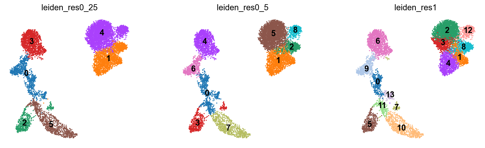

> 图14-4 人骨髓案例的 Leiden resolution 对照。三个面板使用同一对象和 UMAP 坐标，仅改变聚类粒度。图形显示某些区域在高 resolution 下继续拆分，说明 cluster 数受参数影响。源图出版许可需人工确认。

resolution 的选择应结合 marker 一致性、每群细胞数、跨样本重复性和研究问题。若某一设置只产生视觉上更整齐的边界，却把同一 marker 程序任意拆开，缺少方法学理由。相反，过低 resolution 也可能把表达程序明显不同的细胞合并。

素材还把 `total_counts`、`pct_counts_mt`、`scDblFinder_score` 和 `scDblFinder_class` 覆盖到 UMAP 上，用于观察某个 cluster 是否主要由低质量或 doublet 细胞构成。

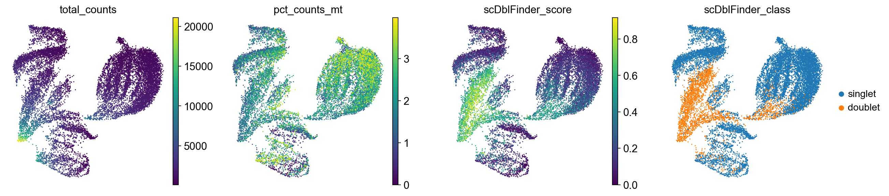

图14-5 在 UMAP 上复核 QC 指标。若一个局部区域同时具有高 doublet score 和混合谱系 marker，应回到细胞级记录复核；仅凭位置不能删除 cluster。源图出版许可需人工确认。

### 14.4.3 OSCA 的另一条图聚类路径

OSCA PBMC 案例用均值方差模型选择前 10% HVG，`denoisePCA()` 保留 8 个 PC，再以 `k = 10` 建立 SNN 图，使用 walktrap 得到 19 个 cluster。该案例说明 PCA 数、近邻参数和聚类算法都可采用不同方案。

| 参数或结果 | OSCA PBMC 记录 | 可迁移的做法 |
| --- | --- | --- |
| 特征 | 方差模型前 10% HVG | 保存特征选择依据 |
| PCA | 保留 8 个 PC | 检查保留维度，不默认固定为 30 或 50 |
| 图 | SNN，`k = 10` | 记录邻居数和使用的降维空间 |
| 聚类 | walktrap，19 个 cluster | 算法结果需结合 marker 与群大小解释 |

### 14.4.4 本机 resolution 敏感性运行

本机脚本使用 200 个高变特征完成 10 个 PC，以前 10 个 PC 建立邻接图和 UMAP。所有随机过程固定种子 `20260710`。在同一邻接图上依次运行四个 resolution，并保存每档 cluster 计数。

```r
obj <- RunPCA(obj, npcs = 10, seed.use = 20260710, verbose = FALSE)
obj <- FindNeighbors(obj, dims = 1:10, verbose = FALSE)
obj <- RunUMAP(obj, dims = 1:10, seed.use = 20260710, verbose = FALSE)

for (resolution in c(0.2, 0.5, 0.8, 1.2)) {
  obj <- FindClusters(
    obj,
    resolution = resolution,
    random.seed = 20260710,
    verbose = FALSE
  )
}
```

| resolution | cluster 数 | 各 cluster 细胞数 |
| ---: | ---: | --- |
| 0.2 | 1 | 80 |
| 0.5 | 2 | 49、31 |
| 0.8 | 3 | 31、30、19 |
| 1.2 | 4 | 31、30、10、9 |

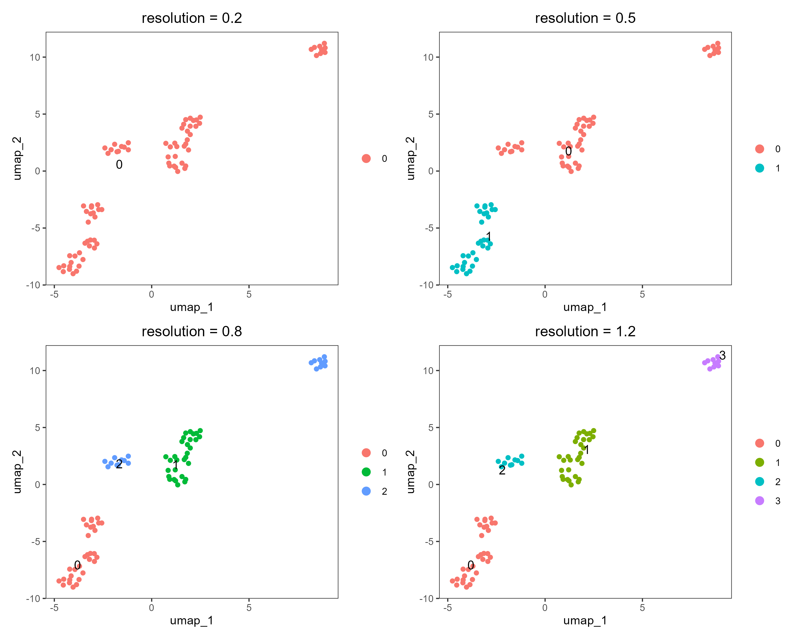

图14-6 `pbmc_small` 本机复现。UMAP 坐标固定，颜色和编号随 resolution 改变。0.2 把 80 个细胞归为一群，1.2 则拆成 4 群。该变化展示参数对粒度的影响，不用于判断哪幅图更“真实”。

本机导出的 UMAP 坐标表为 `80 × 2`，另附细胞名和 resolution 0.8 的 cluster 字段。图中相邻点表示当前模型下局部邻域相似；远距离、空白区域面积和簇间方向不应解释为连续时间、迁移路径或效应大小。

### 14.4.5 UMAP 图注最低信息

一幅可核验的单细胞 UMAP 至少注明输入对象、过滤后细胞数、使用的特征或 PC、邻居与聚类参数、随机种子及着色字段。若图用于比较处理条件，还要说明每个条件包含多少独立样本；条件比较属于第15章。

| 可以从图中检查 | 仍需回到其他输出检查 |
| --- | --- |
| 局部邻域是否与 cluster 大致一致 | cluster 的 marker 是否形成协调表达程序 |
| QC 异常是否集中在特定区域 | 是否由单一样本、批次或 donor 驱动 |
| 不同 resolution 如何拆分同一区域 | 拆分是否稳定、是否具有独立样本支持 |
| 参考标签是否出现低置信度区域 | 参考模型是否覆盖该组织与实验条件 |

## 14.5 marker 基因展示与细胞类型注释

细胞类型注释把聚类结果与表达证据、参考知识和样本背景结合起来。marker gene 反映某个比较集合中的相对表达特征，单个 marker 很少足以确定身份。可靠注释需要查看一组协调信号，同时检查相邻谱系、状态基因和不相容表达。

注释过程应保留候选标签、支持基因、反对证据、参考来源和人工决定。自动参考模型可以提供相似类别，却受训练数据、组织和平台差异限制。最终标签应能回到 cluster、sample 与 donor 层的表达证据，并允许保留较宽的类别或“待确认”状态。

### 14.5.1 marker 是相对表达证据

marker gene 指某一细胞群相对于比较对象呈现较高或较有特征表达的基因。marker 不是永久、唯一的身份标志，其表现会受组织、状态、测序深度、比较集合和分析方法影响。注释应优先检查一组协调 marker，同时检查相邻谱系 marker 和不相容信号。

| 图形 | 编码 | 适合回答的问题 | 易误读之处 |
| --- | --- | --- | --- |
| feature plot | UMAP 位置加单基因表达颜色 | 某基因信号分布在哪些局部区域 | 零值稀疏，颜色上限会改变视觉效果 |
| dot plot | 点大小表示表达细胞比例，颜色表示平均表达 | 多群、多基因表达程序是否一致 | 平均值常经缩放，不是原始分子数 |
| violin plot | 每群表达分布 | 信号是否由少数高值细胞驱动 | 大量零值和群大小差异影响形状 |
| heatmap | 基因乘群或细胞的相对表达 | marker 组合和群间模式 | 行缩放后不能比较不同基因绝对高低 |

### 14.5.2 人骨髓 B 细胞 marker 组合

sc-best-practices 在人工注释中检查 `MS4A1`、`IL4R`、`IGHD`、`FCRL1` 和 `IGHM` 等 naive B 细胞相关 marker。代码把每个基因分别投射到同一 UMAP，使用 `p99` 作为颜色上限，减少极端高值对色阶的支配。

```python
for cell_type in B_plasma_cell_types:
    sc.pl.umap(
        adata,
        color=marker_genes_in_data[cell_type],
        vmin=0,
        vmax="p99",
        sort_order=False,
        frameon=False,
        cmap="Reds",
    )
```

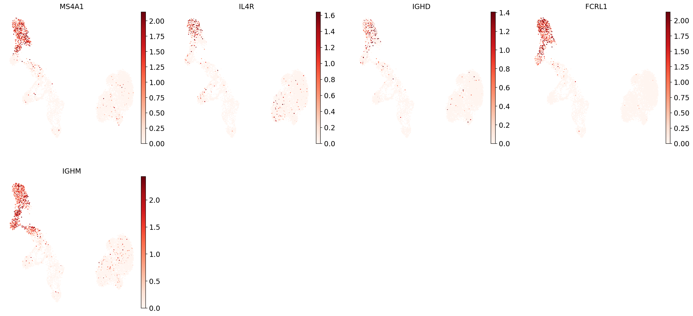

图14-7 人骨髓案例的 B 细胞相关 marker。单个基因在部分细胞中稀疏，且分布并非完全重合；多个 marker 在同一区域形成组合证据时，才支持候选注释。源图出版许可需人工确认。

以 `MS4A1` 为例，它可支持 B 细胞谱系判断，却不能单独区分所有 B 细胞状态。`IGHD` 和 `IGHM` 的共表达可补充 naive 特征，但仍需检查浆细胞、记忆 B 细胞及其他邻近谱系 marker。若群内仅少数细胞表达一个 marker，应先检查稀疏性、doublet 和 ambient RNA。

### 14.5.3 CellTypist 标签与置信度

参考注释把当前表达谱与带标签的参考模型比较。素材先从 raw counts 创建副本，将每个细胞归一化到 10,000 counts 后做 log1p，再运行 CellTypist 的粗粒度模型。预测的 `majority_voting` 和 `conf_score` 分别写入细胞元数据。

```python
adata_celltypist = adata.copy()
adata_celltypist.X = adata.layers["counts"]
sc.pp.normalize_total(adata_celltypist, target_sum=10**4)
sc.pp.log1p(adata_celltypist)

predictions = celltypist.annotate(
    adata_celltypist,
    model=model_high,
    majority_voting=True,
)
prediction_adata = predictions.to_adata()
adata.obs["celltypist_label_coarse"] = prediction_adata.obs.loc[
    adata.obs.index, "majority_voting"
]
adata.obs["celltypist_conf_score_coarse"] = prediction_adata.obs.loc[
    adata.obs.index, "conf_score"
]
```

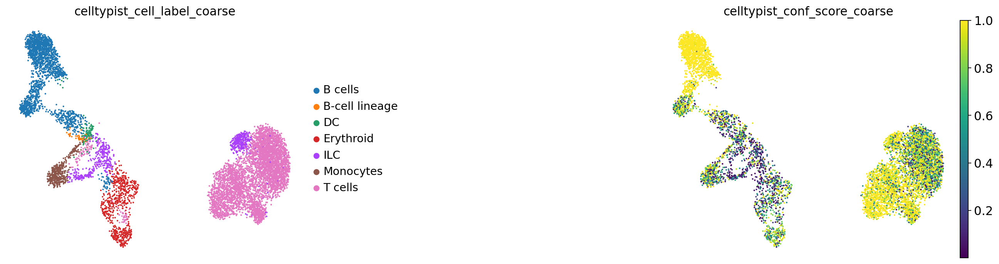

图14-8 CellTypist 粗粒度标签与置信度。置信度较低或同一 cluster 内标签混杂的区域需要回到 marker、QC 和参考覆盖范围复核。模型分数表示与训练参考的匹配程度，不是细胞类型真值。源图出版许可需人工确认。

参考模型可能缺少当前组织中的状态，也可能使用不同物种、平台或基因标识。稳妥的注释顺序是先给粗粒度谱系，再结合 marker 组合细化；无法协调解释的群可保留为 `unknown` 或 `ambiguous`，并列出后续验证需要的证据。

### 14.5.4 本机 marker dot plot

本机在 resolution 0.8 的 3 个 cluster 上运行 `FindAllMarkers()`，使用 `only.pos = TRUE`、`min.pct = 0.25` 和 `logfc.threshold = 0.25`，得到 145 条候选 marker 记录。随后选取 PBMC 常用谱系 marker 制作 dot plot。

```r
Idents(obj) <- obj[["RNA_snn_res.0.8", drop = TRUE]]
markers <- FindAllMarkers(
  obj,
  only.pos = TRUE,
  min.pct = 0.25,
  logfc.threshold = 0.25,
  verbose = FALSE
)

DotPlot(
  obj,
  features = c(
    "MS4A1", "CD79A", "CD3D", "CD3E", "CD14", "LYZ",
    "NKG7", "GNLY", "PPBP", "FCGR3A", "LST1"
  ),
  group.by = "RNA_snn_res.0.8"
)
```

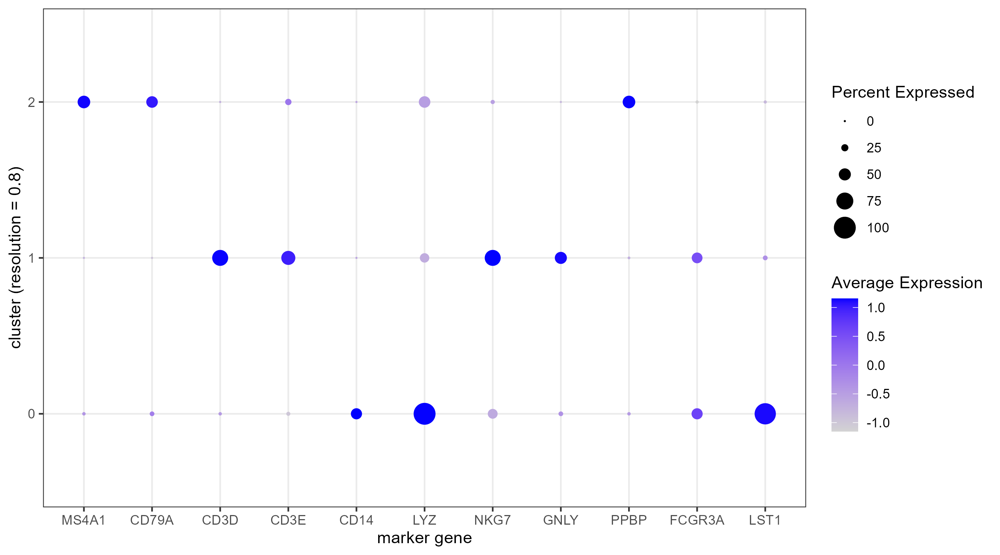

图14-9 `pbmc_small` 本机 marker 图。点大小表示群内表达比例，颜色表示每个基因跨群缩放后的平均表达。由于只有 3 群且细胞很少，Seurat 在运行中提示少量分组的缩放结果可能误导，图只用于教学检查。

cluster 0 的 `CD14`、`LYZ` 和 `LST1` 较突出，可提出髓系相关候选；cluster 1 的 `CD3D`、`CD3E`、`NKG7` 和 `GNLY` 支持 T/NK 相关候选；cluster 2 同时出现 `MS4A1`、`CD79A` 和 `PPBP`，提示该粒度把 B 细胞相关信号与血小板相关信号放在同一群中。后一现象要求调整粒度或回到单细胞表达复核，不能给出单一精细标签。

### 14.5.5 OSCA cluster 7 的候选注释

OSCA 使用 `findMarkers()` 比较 cluster 7 与其他群。其前列 marker 包括 `CSTA`、`S100A12`、`VCAN`、`MNDA`、`FCN1` 和 `CD14`；结合较低的 `FCGR3A`，素材把该群解释为单核细胞候选，并与 cluster 16 的巨噬细胞相关表达对照。

| marker | OSCA cluster 7 的记录 | 允许的教学解释 |
| --- | ---: | --- |
| `CSTA` | summary logFC 2.3449 | 位于上调候选前列，需与其他髓系 marker 合看 |
| `S100A12` | summary logFC 2.9671 | 支持炎症性单核细胞相关表达程序 |
| `VCAN` | summary logFC 2.2075 | 补充单核细胞相关候选证据 |
| `MNDA` | summary logFC 2.4570 | 与 `CD14`、`FCN1` 共同支持髓系候选 |
| `FCN1` | summary logFC 2.6310 | 支持经典单核细胞相关表达模式 |
| `CD14` | summary logFC 1.4279 | 支持单核细胞候选，单独使用仍不充分 |

该表嵌入了素材的实际输出，不把极小 P 值解释为跨 donor 的确认性证据。cluster 由同一数据建立，marker 又在同一对象上筛选，统计显著性包含选择过程影响。表中的表达模式用于候选注释，不支持炎症机制、疾病进展或治疗反应结论。

### 14.5.6 注释记录模板

| 字段 | 填写要求 |
| --- | --- |
| cluster 与参数 | 算法、resolution、细胞数、样本组成 |
| 正向 marker | 至少记录一组协调表达基因及图号 |
| 反向检查 | 邻近谱系 marker、doublet 信号、ambient RNA 可能性 |
| 参考注释 | 模型名称、版本、参考组织、粗细粒度、置信度 |
| 最终标签 | 使用“候选”“相关”或保留 unknown，避免超出证据 |
| 验证需求 | 流式、蛋白、空间定位、独立数据或专家复核等，按研究目的选择 |

## 14.6 单细胞结果的解释边界

单细胞分析同时包含细胞层观察和样本层推断。细胞可以用于描述一个对象内部的异质性、邻域和候选 marker，但条件差异或人群结论通常需要 sample 或 donor 层面的独立重复。把同一 donor 的大量细胞直接当作大量独立样本，会低估相关性并放大统计证据。

解释时先指出结果位于哪个层级，再说明方法和验证范围。cluster 丰度、差异表达、轨迹或通讯分数都可能受细胞数、质控、整合、注释和批次影响。细胞层模式可以提出需要在独立样本中检验的假设，不能直接替代供体层统计、功能实验或临床验证。

### 14.6.1 细胞不是独立的生物学重复

同一 donor 中的细胞共享遗传背景、采样过程和实验处理。一个 donor 测得数千个细胞，仍然只有一个 donor 层面的生物学单位。把每个细胞作为独立重复计算条件差异，会低估相关性并夸大有效样本量，这属于伪重复问题。

| 问题 | 合理统计单位 | 本章中的处理 |
| --- | --- | --- |
| 描述一个对象内的细胞异质性 | 细胞可作为观察单位 | 展示分布、邻域、cluster 和候选 marker |
| 比较两个 donor 组的总体表达 | donor 或样本是重复单位 | 本章不执行，转入第15章的样本级或 pseudobulk 思路 |
| 比较某一 donor 内两个 cluster 的 marker | 细胞级结果可用于探索性排序 | 明确为候选注释证据，不报告为人群推断 |
| 评价处理条件是否改变细胞比例 | 独立样本中的比例 | 需要足够样本与组成数据模型，本章不展开 |

pseudobulk 指先按 donor、样本、细胞类型等单位汇总计数，再在样本层进行条件比较。它不能凭空增加生物学重复，也不适用于所有问题。本章只指出这一方向，模型选择、设计矩阵和条件效应解释在第15章讨论。

### 14.6.2 聚类后 marker 检验的选择偏倚

cluster 通常由同一批基因表达数据构建，随后又在这些 cluster 之间筛 marker。分组和检验重复使用同一数据，会使差异看起来比独立验证更明确。细胞数很大时，微小差异也可能产生极小 P 值；这不代表效应足够大，也不代表结果能跨样本复现。

marker 表至少同时报告效应大小、表达细胞比例、比较集合、检验方法和多重检验校正。用于注释时，还应检查基因组合、群内一致性和样本分布。若要做确认性推断，需要预先定义比较、独立样本和适当的样本级模型。

| 结果信号 | 替代解释 | 进一步核验 |
| --- | --- | --- |
| 某 cluster 的 marker P 值极小 | 细胞数大、同一数据用于聚类和检验 | 看 effect size、表达比例、各 donor 一致性 |
| 某 cluster 几乎只在一个样本出现 | 真正稀有状态，或样本质量、批次、建库差异 | 按 sample 着色，复核 QC 和独立样本 |
| 两群在 UMAP 上相距较远 | UMAP 参数和局部图结构放大分离 | 检查 PCA、邻接图和 marker，不解释二维距离 |
| 自动注释置信度高 | 参考类别相似，但参考覆盖有限 | 对照人工 marker、组织背景和负向 marker |
| 某 marker 在多个群低水平出现 | ambient RNA、广泛表达或色阶设置 | 检查空液滴背景、原始 counts 和表达比例 |

### 14.6.3 用五栏框架写案例结论

单细胞结果宜按“观察、方法、允许解释、替代解释、仍需验证”组织。这样能把图形事实与生物学推断分开，也能指出下一步证据需求。

| 栏目 | 人骨髓 B 细胞区域示例 |
| --- | --- |
| 观察 | `MS4A1`、`IL4R`、`IGHD`、`FCRL1`、`IGHM` 在 UMAP 某一区域呈部分重叠表达 |
| 方法 | 经过案例 QC、归一化、特征选择、PCA、邻接图和 Leiden 聚类后绘制单基因 feature plot |
| 允许解释 | 该区域具有 naive B 细胞相关表达程序，可提出候选标签 |
| 替代解释 | marker 稀疏、邻近 B 细胞状态、doublet、ambient RNA 或参考模型覆盖不足 |
| 仍需验证 | 复核更多正向与负向 marker、donor 一致性，并按研究目的增加蛋白或独立数据证据 |

对 `pbmc_small` cluster 2，可写为：“在 resolution 0.8 下，cluster 2 含 19 个细胞，dot plot 同时显示 `MS4A1`、`CD79A` 与 `PPBP` 信号。该群可能合并了 B 细胞相关和血小板相关表达程序。由于对象仅 80 个细胞，且分辨率敏感性显示群数随参数变化，本例不赋予精细细胞类型标签。”

不宜写成：“cluster 2 是一种新型 B 细胞亚群，并通过血小板通路参与疾病。”后一句增加了新亚群、机制和疾病三层主张，而本地小对象没有独立样本、疾病分组、机制实验或外部验证。

### 14.6.4 AI 协作的责任边界

AI 可帮助生成对象检查代码、补全图注字段、把 QC 规则整理成表格、比较参数运行记录，或检查术语是否一致。分析者仍需确认输入层、样本单位、软件版本、运行日志、图中数值和每个生物医学主张的证据来源。

| 可交给 AI 的辅助任务 | 必须人工核验的内容 |
| --- | --- |
| 根据字段清单生成对象检查代码 | 字段是否真实存在、矩阵方向和表达层含义 |
| 根据运行表生成图注初稿 | 细胞数、PC、resolution、随机种子是否与脚本一致 |
| 汇总多个 resolution 的 cluster 数 | 何种粒度具有生物学和样本层支持 |
| 整理 marker 组合及候选标签 | marker 的组织背景、负向证据和参考覆盖 |
| 检查文本中的过度推断 | 最终医学解释、统计单位和验证需求 |

AI 输出中若出现未在对象、脚本或材料中找到的样本量、阈值、P 值、marker 或细胞类型，应标为 `需补证据`，不得用常识补齐。外部模型、参考图和源图进入正式出版物前还需核查许可证，标为 `需人工确认`。

## 案例任务：建立可审计的单细胞基础流程

学生以一个含 counts 和样本元数据的单细胞对象完成下列任务。若课程环境只提供 `pbmc_small`，需在报告开头声明其无空液滴、无可用线粒体基因和样本重复，因此 QC 与医学解释部分只做缺口说明。

1. 输出对象维度、矩阵方向、表达层、细胞字段、基因字段和稀疏格式。
2. 绘制总计数、检测基因数和线粒体比例分布；按样本提出规则并记录每项标记数。
3. 保存 raw counts，生成一个命名清楚的 normalized layer，并记录方法与参数。
4. 选择高变或高偏差基因，完成 PCA 和邻接图，说明输入特征和 PC 数。
5. 比较至少 3 个 resolution，报告 cluster 数、每群细胞数和参数敏感性。
6. 用 feature plot 或 dot plot 检查一组 marker，给出候选标签、替代解释和验证需求。

### 最低交付物

| 文件 | 内容 |
| --- | --- |
| `object_check.csv` | 对象维度、表达层、元数据字段和标识体系 |
| `qc_summary.csv` | 每样本阈值、各规则标记数、交集和最终保留数 |
| `resolution_summary.csv` | 参数、cluster 数和每群细胞数 |
| `marker_candidates.csv` | cluster、marker、效应、表达比例、候选标签和边界 |
| `figures/` | QC 图、resolution 对照图、marker 图及完整图注 |
| `run_record.md` | 软件版本、随机种子、关键代码、错误和处理记录 |

## AI 任务说明书

本节保留适合单细胞对象审查的扩展字段。任务目标对应目标，输入归入上下文，允许操作和禁止操作归入约束，人工验收归入验证，输出格式归入输出。

| 字段 | 要求 |
| --- | --- |
| 任务目标 | 让 AI 审查一个单细胞分析对象及其运行记录，输出缺失字段、参数不一致和解释越界清单 |
| 输入 | 对象摘要、QC 统计表、resolution 计数表、marker 表、图注和软件环境；不上传受限患者标识或无法授权的数据 |
| 允许操作 | 检查字段一致性、生成核验代码、对照图注与参数表、标记缺失信息、按五项任务骨架改写结论 |
| 禁止操作 | 补造未运行数值；把 cluster 编号当作细胞类型；把细胞级 P 值解释为 donor 级证据；根据 UMAP 位置推断发育顺序；给出药物、诊断或临床建议 |
| 输出格式 | 每条问题包含位置、原文或字段、问题类型、证据、建议修改和责任主体；无法核验内容使用 `需补证据`，出版许可、患者隐私和专业判断使用 `需人工确认` |
| 人工验收 | 逐项回查对象、脚本和 CSV；重新运行关键代码；检查 AI 是否改动数字、术语、路径或代码；由分析负责人批准最终标签和解释 |

## 知识结构

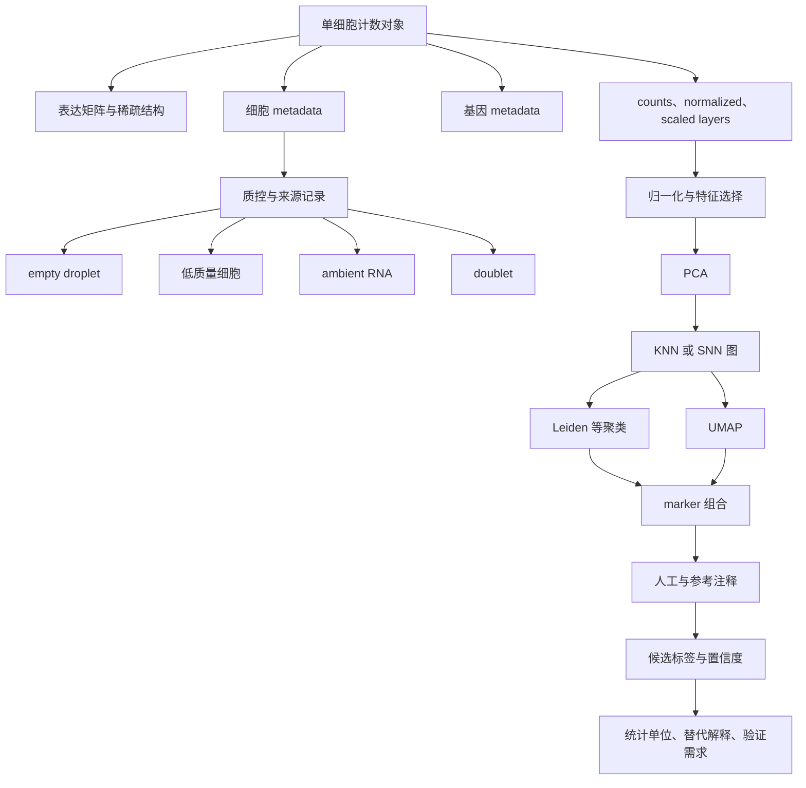

## 作业要求

| 交付项 | 可检查证据 |
| --- | --- |
| 对象与矩阵核验 | 维度、方向、layer、元数据、稀疏格式均有实际输出 |
| QC 规则与记录 | 指标定义、分布图、阈值依据、过滤前后计数和特殊问题标记完整 |
| 归一化与特征选择 | raw counts 保留，方法、输入层、参数和特征表可追溯 |
| PCA、邻接图与聚类 | PC、邻居、随机种子和至少 3 档 resolution 有运行记录 |
| marker 与注释 | 多 marker 组合、候选标签、负向检查和置信度解释合理 |
| 统计与医学边界 | 能识别伪重复、选择偏倚、UMAP 与 marker 的限制 |
| 可复现性与表达 | 文件命名清楚，图注完整，代码能从头运行，语言简洁准确 |

## 核验清单

- [ ] 维度与矩阵方向已核对，细胞名和基因名与元数据对齐。
- [ ] raw counts 未被覆盖，normalized 和 scaled 层名称及用途清楚。
- [ ] QC 阈值来自本数据分布和样本背景，过滤原因及数量可回查。
- [ ] empty droplet、ambient RNA 和 doublet 已处理或明确说明缺少何种输入。
- [ ] PCA 特征、PC 数、邻居参数、聚类算法、resolution 和随机种子已记录。
- [ ] UMAP 图注明确细胞数、输入和着色字段，未把二维距离解释为真实生物距离。
- [ ] marker 采用组合证据，自动注释包含模型、版本、参考范围和置信度。
- [ ] cluster 编号、marker、比例和细胞级 P 值未升级为机制、疗效或临床建议。
- [ ] 条件比较以样本或 donor 为统计单位；本章未生成缺少重复的显著性结论。
- [ ] 代码、CSV、图形和正文中的数字已逐项核对。
