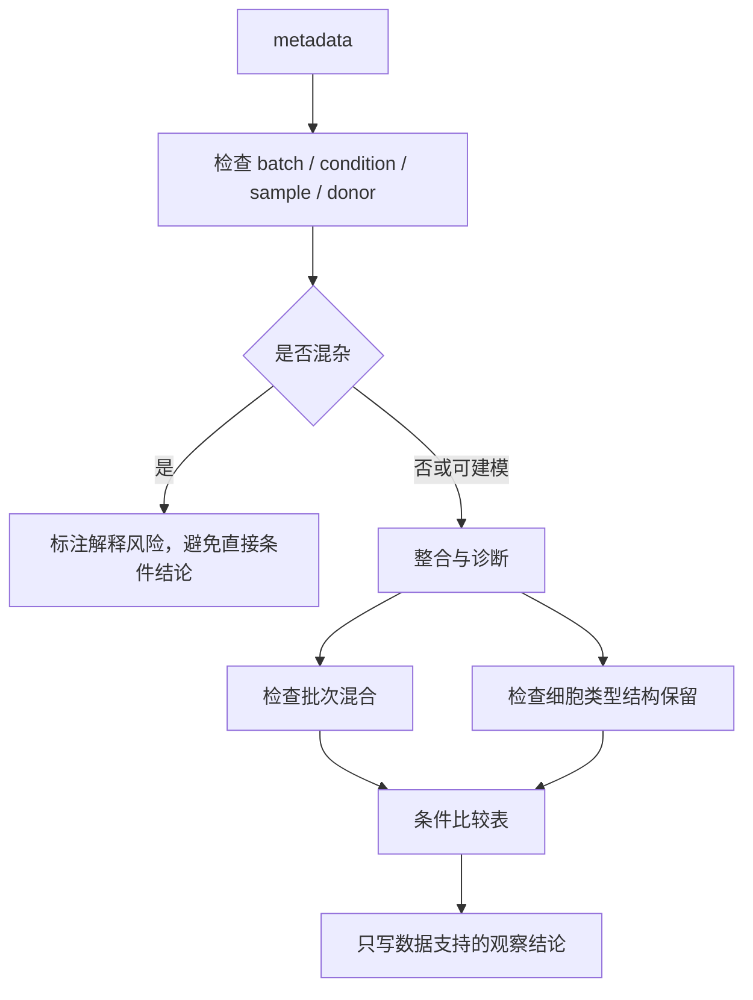
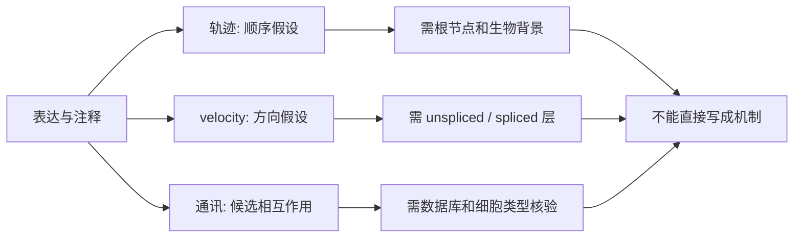
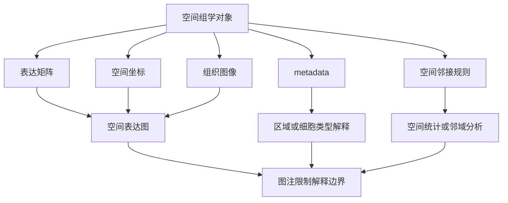
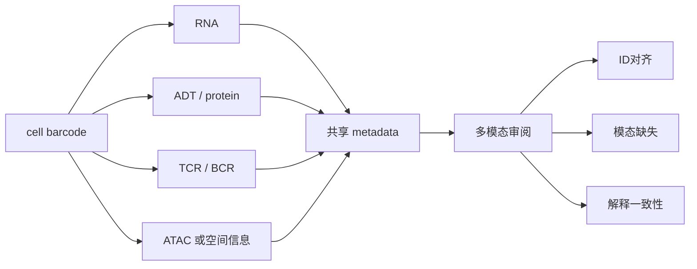
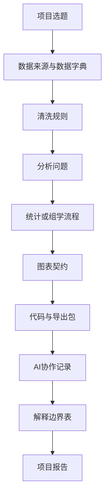
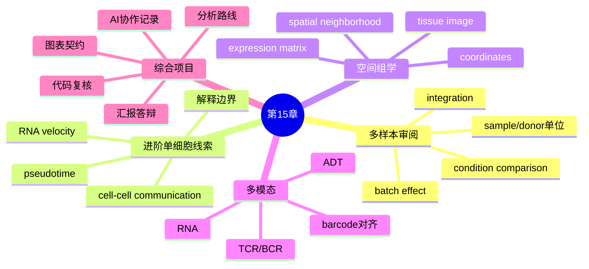

# 第15章 单细胞进阶、空间组学与综合项目

## 本章定位

第15章承接第14章“单细胞转录组数据处理与可视化”。第14章关注质控、归一化、降维、聚类、UMAP、marker gene 和细胞类型注释；本章把这些基础能力放进更复杂的审阅场景：多样本整合、条件比较、轨迹假设、RNA velocity、细胞通讯、空间组学、多模态数据和综合项目交付。

本章不把学生训练成某一种算法的开发者。课程目标是让学生会看懂进阶分析路线，能指出数据对象、分组字段、批次处理、图表契约和解释边界中的问题。学生要能说清“这张图能支持什么”“这句话是否越界”“这段代码是否可复核”。

第15章后半部分直接服务第17周综合项目工作坊和第18周项目汇报。学生需要把前面章节的数据整理、统计解释、图表表达和 AI 协作记录整合成可评分、可追踪的项目证据。

## 学习目标

1. 学生能解释批次效应、数据整合和条件比较的关系，并能检查 batch、condition、sample、donor 和 cell type 是否混杂。
2. 学生能区分轨迹分析、RNA velocity 和细胞通讯的输入、输出和解释边界。
3. 学生能说明空间转录组数据比普通表达矩阵多出空间坐标、组织图像或空间邻接信息。
4. 学生能识别 CITE-seq、免疫受体和多模态数据中的模态、细胞条形码、ID 对齐和质控风险。
5. 学生能为综合项目写出选题、数据来源、分析路线、交付物和禁止越界说明。
6. 学生能在汇报前完成代码复核、图表审阅、AI 协作记录整理和答辩准备。

## 阅读指南

本章先读 15.1，因为多样本设计会影响后面所有解释。再读 15.2-15.4，重点看每类进阶分析的输入、输出和越界风险，不要求掌握完整算法推导。

15.5-15.6 是综合项目模板。读这两节时，把自己正在做的课程项目带入进去，逐项检查数据来源、代码目录、图表契约、AI 协作记录和汇报结论。

若素材缺少可运行数据，本章使用“教学简化案例”。这类案例只用于训练审阅逻辑，不提供真实医学结论。

## 核心概念速查

| 概念 | 本章解释 | 常见混淆 | 需保留英文 |
| --- | --- | --- | --- |
| 批次效应 | 实验批次、平台、处理时间等带来的非生物差异 | 把真实生物差异也当成批次删掉 | batch effect |
| 数据整合 | 让多个样本或平台在共同空间中比较 | 只看 UMAP 混在一起就说整合成功 | integration |
| 条件比较 | 比较不同处理、疾病状态或时间点的差异 | 把每个细胞当成独立患者 | condition comparison |
| 拟时序 | 根据单细胞状态重建一种相对顺序 | 写成真实发育时间 | pseudotime |
| RNA velocity | 利用未剪接和已剪接 RNA 估计状态变化方向 | 把箭头写成已验证方向 | RNA velocity |
| 细胞通讯 | 基于表达和先验数据库推断候选配体-受体关系 | 写成功能性通讯已经发生 | cell-cell communication |
| 空间转录组 | 在组织空间位置上测量基因表达 | 把相邻位置直接写成因果作用 | spatial transcriptomics |
| CITE-seq | 同时测量 RNA 和表面蛋白标签的单细胞技术 | 用 RNA 质控规则直接套到蛋白标签 | CITE-seq / ADT |
| 免疫受体 | TCR/BCR 等适应性免疫受体序列信息 | 把克隆型直接写成疗效或抗原特异性 | TCR / BCR |
| 多模态数据 | 同一细胞或空间位置上有多类测量 | 忽略不同模态的分布和缺失差异 | multimodal data |

## 章节总览图


这张图不是软件流程图，而是本章的审阅路线。每一步都要回答三个问题：数据对象是什么，图表能说明什么，解释边界在哪里。

## 核心内容

### 15.1 批次效应、数据整合与条件比较

单细胞研究常把多个样本、多个供体、多个实验批次或多个平台放在一起分析。批次效应指非生物因素造成的差异，例如样本处理时间、实验平台、测序深度或建库流程不同。它会影响降维、聚类、细胞类型注释和后续比较。

数据整合的目标不是让所有点完全混在一起，而是在尽量减少技术差异的同时保留有意义的生物差异。SCBP 和 OSCA 都提醒我们，整合后既要看同类细胞是否跨批次混合，也要看原有生物结构是否被过度抹平。

| 审阅问题 | 要查什么 | 解释边界 |
| --- | --- | --- |
| batch 是什么 | 实验批次、平台、样本处理批、测序批 | batch 不一定等于 donor 或 condition |
| condition 是什么 | 处理组、疾病状态、时间点或暴露变量 | condition 与 batch 混杂时不能简单比较 |
| sample/donor 是否保留 | metadata 中是否有样本和供体字段 | 不能把细胞数当成独立样本数 |
| 整合前后是否可诊断 | UMAP、批次混合表、细胞类型保留情况 | 图上混合不等于所有问题解决 |
| 比较单位是什么 | cell、cluster、sample、donor 或伪 bulk | 医学比较通常需要样本/供体层面的证据 |

条件比较要先定义统计单位。若一个研究有 3 个处理组和多个供体，不能把几万个细胞直接当成几万个独立受试者。更稳妥的教学表达是：在每个样本或供体内汇总细胞类型比例、cluster abundance 或伪 bulk 表达，再比较条件间差异。

OSCA 的差异丰度示例把“每个标签或 cluster 中的细胞数”整理成 label-by-sample 表，再结合样本 metadata 建模。对学生来说，关键不是背软件函数，而是理解比较对象从“单个细胞”变成了“样本内的细胞群比例或计数”。



**教学简化案例。** 假设一个公开单细胞数据对象中有 `sample_id`、`donor_id`、`batch`、`condition`、`cell_type` 五个字段。学生不需要运行完整整合算法，先完成一张核验表：每个 condition 是否来自多个 donor，每个 batch 是否覆盖多个 condition，每个 cell_type 是否在各样本中都有足够细胞。若字段缺失，结论标为 `需补证据`。

**可写结论示例。** “整合后，同一注释细胞群在两个批次中更接近，但还需检查各供体内细胞类型比例和关键 marker 是否保留。”这句话把观察、方法和边界分开了。

**越界写法示例。** “整合证明治疗组产生了新的免疫细胞群。”这句话把整合图写成医学机制，缺少样本层面统计和独立验证。

### 15.2 轨迹分析、RNA velocity 与细胞通讯

轨迹分析用于把细胞状态排列成一条或多条相对路径。拟时序不是时钟时间，而是模型根据表达状态给出的相对顺序。它常用于发育、分化或状态转换问题，但根节点选择、方法选择和细胞采样范围都会影响结果。

RNA velocity 利用未剪接 RNA 和已剪接 RNA 的信息，估计细胞状态变化方向。它比静态 UMAP 多了方向线索，但仍是模型输出。SCBP 材料提醒，低维图上的 velocity stream 可能误导，严格解释需要结合模型假设、输入层和下游验证。

细胞通讯分析常基于配体-受体数据库和表达矩阵，推断候选 source cell 与 receiver cell 的关系。这里的“通讯”是分析术语，不等于已经证明细胞间发生了功能性信号传递。

| 方法 | 输入 | 常见输出 | 可支持表达 | 不应写成 |
| --- | --- | --- | --- | --- |
| 轨迹分析 | 表达矩阵、细胞图、起始细胞或根节点 | 拟时序、分支、轨迹图 | 某模型给出细胞状态顺序假设 | 真实发育时间或必然分化路径 |
| RNA velocity | 未剪接/已剪接 RNA 层、细胞邻接图 | 方向箭头、velocity stream、状态转移线索 | 方向性变化假设 | 已验证的细胞迁移或命运决定 |
| 细胞通讯 | 细胞类型注释、表达矩阵、配体-受体库 | 候选配体、受体、细胞对和打分 | 候选相互作用线索 | 功能通讯、药物靶点或治疗机制 |

审阅轨迹图时，先看细胞类型和采样范围。若数据只来自一个终点样本，轨迹图只能表示状态连续性，不能替代时间序列。若根节点由算法默认选择，图注必须说明，并把方向解释降级为“模型假设”。

审阅 RNA velocity 时，先看数据对象是否有 unspliced 和 spliced 层。若输入对象没有这些层，velocity 图无法成立。若图只展示 UMAP 上的箭头，正文不能把箭头方向写成真实生物过程。

审阅细胞通讯时，先看细胞类型注释是否可靠，再看使用的数据库、表达阈值和条件比较方式。不同工具或数据库可能给出不同候选结果，因此更适合写成“候选配体-受体关系”，而不是“机制已经确认”。



**教学简化案例。** 给学生一段项目报告：报告声称“velocity 箭头证明耐药细胞由敏感细胞转化而来”。学生要把它改写为四栏表：观察结果、方法来源、允许解释、仍需验证。允许解释可以写“模型提示两个状态之间存在方向性变化线索”；仍需验证应包括时间序列、谱系追踪、功能实验或独立样本。

### 15.3 空间转录组数据结构与空间可视化

空间转录组保留组织中的空间位置。普通单细胞 RNA-seq 在组织解离后失去空间上下文；空间组学则把表达信号和坐标、组织图像或空间单元连接起来。这里的空间单元可能是 spot、bead、bin、细胞、细胞核或单个 RNA 分子。

OSTA 将空间组学平台大致分为测序型和成像型。测序型平台常在规则网格或 spot 上汇总表达；成像型平台可定位单个 RNA 分子，并通过分割把分子分配到细胞或细胞核。不同平台在基因覆盖度、空间分辨率和灵敏度之间有取舍。

| 数据层 | 学生要看什么 | 常见风险 |
| --- | --- | --- |
| 表达矩阵 | 行是基因或特征，列是 spot/cell/bin | 不说明表达是否归一化 |
| 空间坐标 | x/y 坐标，必要时还有 z 坐标 | 坐标方向与图像方向不一致 |
| 组织图像 | H&E、荧光或其他成像背景 | 图像只作背景却被过度解读 |
| metadata | sample、condition、区域、细胞类型 | 区域注释来源不清 |
| 空间邻接 | 最近邻、距离阈值或网格邻接 | 邻接规则改变下游结果 |

空间图表要比普通散点图多写一个契约：坐标来自哪里，单位是什么，spot 是否含多个细胞，颜色表示表达、cluster 还是组织区域。若图中叠加组织图像，还要说明图像只用于定位，不自动提供病理诊断。

空间统计会利用邻近位置之间的依赖关系。OSTA 中的空间权重矩阵和空间自相关提醒我们，空间单位并非完全独立。学生不需要推导 Moran's I 等统计量，但要知道：如果一个分析声称“空间聚集”，必须说明邻接或距离规则。



**教学简化案例。** 假设一个空间数据表含 `spot_id`、`x`、`y`、`sample_id`、`region_label`、`gene_A_expression`。学生先画概念图，不运行真实空间软件：用 x/y 画点，颜色表示 `gene_A_expression`，分面表示 `sample_id`。图注必须写“每个点为教学简化 spot，区域标签来源需人工确认，本图只展示空间表达模式”。

**边界示例。** 可以写“某基因在标注区域 A 附近呈较高表达模式”。不能写“该基因驱动区域 A 的病理形成”，除非另有实验、病理和机制证据。

### 15.4 CITE-seq、免疫受体与多模态数据

CITE-seq 同时测量 RNA 和表面蛋白标签。表面蛋白标签常称为 ADT，即 Antibody-Derived Tags。ADT 的分布、背景噪声和质控逻辑不同于 RNA，不能直接把 RNA 的过滤规则套用到 ADT 上。

免疫受体数据常包括 TCR 或 BCR 的 V(D)J 序列、链类型、CDR3 区域、productive 状态和细胞条形码。它能帮助识别免疫细胞克隆或受体序列特征，但不能单独证明抗原特异性、治疗反应或临床预后。

多模态数据的核心问题是对齐。RNA、ADT、ATAC、TCR/BCR 或空间信息可能属于同一细胞，也可能有缺失、条形码不一致或测量尺度不同。SCBP 的 MuData 和 SpatialData 材料强调，数据结构要能保存不同模态和共享注释。

| 模态 | 常见字段或对象 | 审阅重点 | 解释边界 |
| --- | --- | --- | --- |
| RNA | gene count matrix、obs、var | 质控、归一化、marker | marker 不是绝对专属 |
| ADT | antibody tag count matrix | 背景、低蛋白捕获、样本内差异 | 蛋白信号不是单独注释证据 |
| TCR/BCR | chain、V/J/C gene、CDR3、productive | barcode 对齐、重复链、低质量 contig | 克隆型不等于功能验证 |
| ATAC | peaks、chromatin accessibility | 稀疏性、峰注释、模态对齐 | 开放区域不等于基因表达改变 |
| 空间 | image、coordinates、shapes、tables | 坐标、图像、细胞或 spot 定义 | 空间邻近不等于因果 |

审阅 CITE-seq 图时，先问蛋白面板有哪些抗体，是否有阴性或背景控制，ADT 是否单独做过质控。若 RNA 和 ADT 支持同一注释，可以写“共同支持某细胞群注释”，不要写成“已经证明细胞功能”。

审阅免疫受体结果时，先确认 VDJ 信息如何与单细胞表达矩阵对齐。若一个细胞有多条 TCR 链或 BCR 链，需要检查是否为真实生物现象、技术噪声或 doublet 风险。克隆扩增可以作为线索，但医学解释要降级。

多模态整合图常用共同嵌入、加权邻接图或模态贡献图。图注应说明整合方法、每种模态的输入、共享细胞数和缺失处理。若不同模态结论不一致，正文应保留冲突，而不是强行写成一个顺滑结论。



**教学简化案例。** 给出一张三列表：`cell_barcode`、`rna_cell_type`、`adt_marker_pattern`，再给一张 VDJ 表：`cell_barcode`、`chain`、`cdr3`、`productive`。学生任务是检查哪些细胞能成功对齐，哪些细胞缺少 VDJ 信息，哪些细胞需要人工确认。这个案例只训练 ID 对齐，不产生免疫治疗结论。

### 15.5 综合项目选题、分析路线与交付物

综合项目不是把所有方法都堆进报告。一个好项目应有清楚的问题、可追踪的数据来源、匹配的分析路线、规范图表和克制解释。若数据只支持描述统计，就不应强行做复杂模型；若只有教学简化数据，就不能写成真实医学发现。

项目选题可以来自临床指标、公开转录组、简化单细胞对象或空间组学教学表。选题要先回答四个问题：数据在哪里，变量是什么，主要图表是什么，最后结论的边界是什么。

| 项目模块 | 最低交付物 | 评分关注点 |
| --- | --- | --- |
| 选题说明 | 题目、背景、数据来源、禁止越界说明 | 问题是否适合课程能力 |
| 数据字典 | 字段、类型、单位、缺失含义、分组变量 | 变量解释是否可追踪 |
| 分析路线 | 清洗、统计、图表、核验步骤 | 方法是否服务问题 |
| 代码目录 | 脚本、依赖、运行顺序、输出路径 | 是否能从头复现 |
| 图表包 | 图片、源数据、图表契约、图注 | 图表是否只回答一个问题 |
| AI 协作记录 | 提示词、输出摘要、人工修改、测试结果 | 是否保留失败和修正过程 |
| 解释边界 | 观察、方法来源、允许解释、仍需验证 | 是否避免医学越界 |

项目路线可以按“数据表先行”设计。学生先整理数据字典和字段核验表，再决定统计方法和图表。这样能减少一个常见问题：先让 AI 生成复杂代码，最后才发现分组字段、样本单位或图表目标不清。



**综合项目任务说明书模板。**

| 字段 | 填写内容 |
| --- | --- |
| 项目题目 | 用一句话说明数据对象和问题 |
| 数据来源 | 文件、数据库、公开链接或教学简化案例 |
| 数据类型 | 临床表、RNA-seq、单细胞、空间组学或多模态 |
| 主要变量 | 结局变量、分组变量、批次变量、样本单位 |
| 核心图表 | 1-3 张主图，不超过课程能力范围 |
| 分析路线 | 清洗、描述、比较、可视化、核验 |
| AI 使用 | 让 AI 做什么，不让 AI 做什么 |
| 解释边界 | 明确不能写成因果、机制、疗效或诊断 |
| 交付物 | 报告、代码、图表包、数据字典、协作记录 |

若项目使用本章的单细胞或空间教学简化案例，报告标题和图注必须写明“教学简化案例”。这类案例可以训练对象结构、图表审阅和解释边界，但不能提供真实疾病、药效或机制结论。

### 15.6 项目汇报、代码复核与图表审阅

项目汇报的重点不是展示最多图，而是让听众相信你的过程可追踪、图表可复核、结论不过界。汇报应按“问题、数据、方法、图表、核验、边界”组织，每一步都能回到文件和证据。

代码复核要检查运行顺序、输入输出、路径、随机种子、包版本和错误处理。AI 生成的代码尤其要看变量是否存在、分组是否正确、统计单位是否合理、图表是否改变数据含义。

图表审阅要从图表契约开始。每张主图只回答一个主要问题，图注要写清样本、变量、视觉编码、统计信息和解释边界。单细胞和空间图还要写清过滤规则、细胞数或 spot 数、参数和注释依据。

| 汇报页 | 建议内容 | 审阅问题 |
| --- | --- | --- |
| 1. 题目与问题 | 数据对象、问题和课程边界 | 是否能一句话说明任务 |
| 2. 数据来源 | 数据表、样本单位、关键字段 | 来源是否可追踪 |
| 3. 分析路线 | 清洗、统计、图表和 AI 协作 | 方法是否匹配问题 |
| 4. 主图 1 | 数据概览或质量检查 | 图注是否完整 |
| 5. 主图 2 | 主要比较或模式展示 | 是否避免因果越界 |
| 6. 主图 3 | 补充图或复核图 | 是否支持主结论 |
| 7. 核验与限制 | 代码测试、图表契约、缺口 | 是否诚实写出不足 |
| 8. 结论 | 观察结论和后续验证 | 是否超过材料支持 |

**代码复核清单。**

- 数据路径是否指向课程项目内的文件，且没有写死个人临时路径。
- 原始材料是否保持只读，输出是否写入 `outputs/`。
- 清洗规则是否有记录，过滤前后数量是否可追踪。
- 分组变量、批次变量、样本单位是否和数据字典一致。
- 统计检验或模型是否有前提说明，组学图是否有参数说明。
- 代码能否从头运行，报错和修正是否写入 AI 协作记录。

**图表审阅清单。**

| 检查项 | 通过标准 |
| --- | --- |
| 图表目标 | 一张图只回答一个主要问题 |
| 视觉编码 | x、y、颜色、形状、分面和图例清楚 |
| 样本说明 | n、分组、缺失和重复定义可追踪 |
| 统计信息 | 检验、效应量、区间或参数有说明 |
| 组学参数 | 过滤规则、细胞数、marker 或空间坐标说明完整 |
| 图注边界 | 区分观察、方法来源和解释推断 |
| 导出包 | 图片、源数据、脚本、契约和环境信息齐全 |

**AI 协作记录模板。**

| 项目 | 写法 |
| --- | --- |
| 任务 | 说明让 AI 做代码解释、错误排查、图注润色还是复核 |
| 原始提示词 | 保留关键版本，不需要粘贴全部闲聊 |
| AI 输出摘要 | 摘要说明建议、代码或文字 |
| 人工核验 | 写明运行、统计、图表和解释检查 |
| 修改记录 | 说明删改了哪些 AI 输出，原因是什么 |
| 最终结果 | 放最终代码、图表或文字位置 |
| 反思 | 说明下次如何改进提示词和核验 |

## 案例任务

| 项目 | 内容 |
| --- | --- |
| 数据背景 | 使用 SCBP、OSCA/OSTA 和 AIDD 素材支持的教学简化单细胞/空间项目；若教师另给真实公开数据，以教师数据说明为准 |
| 任务目标 | 完成一份进阶分析审阅报告，而不是完整复现所有算法 |
| 操作步骤 | 核对 metadata；检查 batch/condition/sample；设计 2 张主图；写解释边界表；整理 AI 协作记录 |
| 交付物 | 项目说明书、数据字典、图表契约、审阅报告、代码或伪代码、AI 协作记录 |
| 禁止事项 | 不编造样本量，不写临床建议，不把模型线索写成机制证明 |

**案例输出结构。**

```text
project/
  README.md
  data_dictionary.md
  analysis_plan.md
  scripts/
  figures/
  figure_contracts/
  ai_collaboration_log.md
  interpretation_boundary_table.md
```

## 图表建议

| 图表 | 目的 | 必备标注 | 不可越界解释 |
| --- | --- | --- | --- |
| 整合前后 UMAP | 检查批次和细胞类型结构 | 输入对象、batch、cell type、参数、细胞数 | 不写成治疗或疾病机制 |
| batch-condition 核验表 | 检查混杂 | sample、donor、batch、condition | 不用缺失字段支持结论 |
| 轨迹图 | 展示拟时序或分支假设 | 根节点、方法、细胞范围 | 不写成真实时间或谱系 |
| velocity 图 | 展示方向性线索 | unspliced/spliced 层、模型、参数 | 不写成已验证转化方向 |
| 细胞通讯网络 | 展示候选配体-受体 | 数据库、阈值、source/receiver | 不写成功能通讯 |
| 空间表达图 | 展示空间位置上的表达模式 | spot/cell、坐标、图像、表达尺度 | 不写成病理机制 |
| 多模态对齐图 | 展示 RNA、ADT、VDJ 等关系 | barcode、模态缺失、共享细胞数 | 不写成免疫功能证明 |
| 项目交付矩阵 | 汇报交付物完成度 | 文件、状态、复核人 | 不用“已生成”代替“已核验” |

## AI 协作点

| 场景 | 可让 AI 做什么 | 学生必须核验什么 |
| --- | --- | --- |
| 读代码 | 解释函数、对象字段和运行顺序 | 变量是否真实存在，解释是否符合项目数据 |
| 整合审阅 | 生成 batch/condition 核验表模板 | metadata 是否完整，批次是否混杂 |
| 图表设计 | 建议图表类型和图注草稿 | 图表是否符合契约，是否越界 |
| 轨迹/velocity 解释 | 把结果改写成边界清楚的语言 | 输入层、根节点、模型假设和验证缺口 |
| 空间图表 | 生成空间图表检查表 | 坐标、图像、spot/cell 定义是否真实 |
| 项目汇报 | 整理汇报提纲和答辩问题 | 是否保留失败、限制和人工判断 |

AI 不能替学生决定医学解释。涉及疾病机制、药物疗效、诊断、预后、靶点或临床建议时，必须回到材料和数据。如果材料不足，写 `需补证据` 或 `需人工确认`。

## 常见误区

| 误区 | 为什么错 | 如何纠正 |
| --- | --- | --- |
| UMAP 混合就代表整合成功 | 可能同时抹掉生物差异 | 同时检查批次混合和细胞类型结构保留 |
| 把每个细胞当成独立受试者 | 会造成伪重复风险 | 回到 sample/donor 层面汇总或建模 |
| 拟时序等于真实时间 | 拟时序是模型顺序 | 写成相对状态顺序，列出验证缺口 |
| velocity 箭头等于真实方向 | 箭头受模型和低维投影影响 | 检查输入层和模型假设，降低解释强度 |
| 配体-受体高分等于通讯发生 | 多数结果来自表达和数据库规则 | 写成候选通讯线索 |
| 空间相邻等于因果作用 | 空间相关不等于机制 | 说明坐标和邻接规则，避免机制化语言 |
| 多模态结果越多越可靠 | 模态可能缺失、冲突或尺度不同 | 先做 ID 对齐和模态质控 |
| AI 写出的图注可直接使用 | AI 可能补充不存在的信息 | 用图表契约逐项核验 |

## 核验清单

- 已先核对根目录 `大纲.md`，章名和 6 个小节未改变。
- 已读取 `chapters/chapter-15/本章大纲.md`，正文与本章蓝图一致。
- 本章前四节压低算法细节，重点写审阅、图表和解释边界。
- 15.5-15.6 已写成综合项目路线和汇报模板。
- SCBP、OSCA/OSTA、AIDD Bioinformatics 素材只用于其能支持的内容。
- 没有新增素材未支持的样本量、统计结论、医学因果、临床建议或机制结论。
- 教学简化案例已明确标注，不作为真实医学证据。
- 所有 AI 协作建议都保留人工核验要求。

## 知识结构与知识图谱生成提示词



**知识图谱生成提示词。**

```text
请为《医药数据处理与可视化》第15章生成一张教学知识图谱。

读者是药学本科生和研究生，不默认具备高级统计、生信或编程背景。

必须包含这些一级节点：
1. 多样本整合与条件比较
2. 轨迹分析、RNA velocity 与细胞通讯
3. 空间转录组数据结构与空间可视化
4. CITE-seq、免疫受体与多模态数据
5. 综合项目路线
6. 项目汇报、代码复核与图表审阅

每个节点只写关键词，不写长句。请突出“审阅点”和“解释边界”，不要把模型线索画成医学因果。

如果生成图片，请把图片视为教学展示。所有文字、节点和关系必须再用 Mermaid 或表格人工核验。
```

本章未使用 `imagegen` 生成图片。若后续生成图片，图片只作为课堂展示，正文中的 Mermaid、表格和清单才是准确结构。

## 实验或作业

**作业名称：进阶单细胞/空间组学项目审阅报告。**

学生从教师提供的数据、公开案例说明或本章教学简化案例中选择一个对象。提交内容包括项目说明书、metadata 核验表、2 张图表契约、1 张主图或示意图、解释边界表和 AI 协作记录。

| 评分点 | 要求 |
| --- | --- |
| 数据来源 | 写清来源、对象、字段和是否为教学简化案例 |
| 审阅逻辑 | 能检查 batch、condition、sample、donor 或空间坐标 |
| 图表规范 | 有图表契约，图注不越界 |
| 解释边界 | 区分观察、方法来源、允许解释和仍需验证 |
| AI 协作 | 保留提示词、输出摘要、人工核验和修改记录 |
| 复现记录 | 代码、伪代码或操作步骤可追踪 |

禁止把教学简化案例写成真实医学发现。禁止写“该基因导致疾病”“该细胞群决定疗效”“该克隆型证明免疫反应”等超出材料的结论。

## 需补证据

| 位置 | 缺口 | 处理方式 |
| --- | --- | --- |
| 可运行课堂数据 | 本轮未确认有完整可运行的第15章本地数据包 | 正文使用教学简化案例；若教师提供数据，再补充运行版脚本 |
| 第14章衔接 | chapter-14 当前仍以大纲材料为主 | 第15章避免依赖第14章未完成正文 |
| 具体软件版本 | SCBP、OSCA/OSTA 和 AIDD 材料来自已摄取文本，本轮未运行软件环境 | 项目作业要求学生记录本机版本和运行结果 |
| 医学案例结论 | 本轮素材支持方法审阅，不支持新医学机制或临床建议 | 所有医学机制、疗效、诊断和靶点结论均标为需补证据 |
