# 第15章 单细胞进阶、空间组学与综合项目

## 本章定位

进阶分析审阅先检查样本能否整合、批次与条件是否混杂，再分别核对轨迹、velocity、细胞通讯、空间坐标和多模态对齐。综合项目据此形成可复核的交付物。

本章不要求学生推导全部算法。学习重点是识别数据对象、检查元数据（metadata）、确认统计单位、阅读关键代码、核对图表设计规范卡，并把结果写成证据强度合适的中文。代码成功运行只说明计算过程完成，不能自动证明生物医学解释成立。

## 学习目标

完成本章后，学生应能：

1. 区分批次效应、数据整合、条件比较和细胞丰度比较。
2. 审阅拟时序、RNA velocity 和细胞通讯分析的输入、输出与假设。
3. 识别空间组学对象中的表达、坐标、图像、注释和邻接关系。
4. 检查 CITE-seq、TCR/BCR 和配对多模态数据的 ID 对齐与质控。
5. 把分析问题、数据字典、代码、图表、AI 记录和解释边界组织成综合项目。
6. 在汇报前完成代码复核、图表审阅和结论降级。

案例统一标记为三种状态：`本机复跑`、`素材已运行`、`教学简化`。下表分别记录运行位置、可核验依据和允许解释范围。

| 状态 | 可以支持什么 | 不能写成什么 |
| --- | --- | --- |
| 本机复跑 | 本机环境、代码路径、参数和输出可核对 | 不能因代码跑通而推断真实医学机制 |
| 素材已运行 | 可讲解来源案例中的对象、代码和已有图形 | 不能称为本机复现，也不能替代原研究验证 |
| 教学简化 | 可训练字段检查、统计单位和图表阅读 | 不能作为真实疾病、药效或临床证据 |

| 方法 | 主要输入 | 主要输出 | 关键假设 | 不能单独证明 |
| --- | --- | --- | --- | --- |
| 多样本整合 | 表达矩阵、batch、sample、donor、condition | 校正表示、邻接图或整合矩阵 | 技术差异可识别且不与条件完全混杂 | 条件差异或方法普遍最优 |
| 轨迹与 velocity | 表达状态、root；spliced/unspliced | 拟时序或方向场 | 模型与采样覆盖适合当前问题 | 真实时间、命运或因果方向 |
| 细胞通讯 | 表达矩阵、细胞标签、配体受体先验 | 候选相互作用分数 | 先验和表达可支持候选筛选 | 分子已结合或信号已传递 |
| 空间分析 | 表达、坐标、图像、邻接规则 | 空间模式或邻域统计 | 坐标、分割和邻接定义可靠 | 细胞间因果通讯或组织机制 |
| 多模态整合 | RNA、ADT、TCR/BCR 与 barcode | 对齐对象、联合表示或质控表 | 细胞 ID 和模态缺失已核对 | 抗原特异性、保护或疗效 |

## 15.1 批次效应、数据整合与条件比较

### 15.1.1 先分清四个变量

批次效应（batch effect）是由实验时间、中心、试剂批号、建库流程或测序平台等技术因素造成的系统差异。数据整合（integration）尝试降低这些技术差异，同时保留与细胞身份、状态或条件有关的生物差异。条件比较回答处理组与对照组是否存在差异。三者相关，却不能相互替代。

多样本单细胞分析中，`batch`、`condition`、`sample`、`donor` 和 `cell_type` 常同时存在。`sample` 指一次独立取样或实验样本，`donor` 指受试者或供体，`cell` 是样本内部的观测单位。若研究问题是比较处理条件，独立重复通常位于 sample 或 donor 层面，不能把数千个细胞直接当作数千名独立受试者。

| 字段 | 典型含义 | 审阅问题 |
| --- | --- | --- |
| `batch` | 中心、日期、建库批次或测序批次 | 是否与 condition 完全重合 |
| `condition` | 对照、刺激、处理或疾病状态 | 每个条件是否有独立样本 |
| `sample` | 一次取样或实验样本 | 样本 ID 是否唯一，是否跨批次重复 |
| `donor` | 供者或受试者 | 是否存在配对或重复测量 |
| `cell_type` | 细胞类型或状态标签 | 标签来源是否一致，是否经过人工核验 |

分析前先生成交叉表。以下代码不会执行整合，只回答“设计是否可比较”。如果某个 condition 只出现在一个 batch 中，算法很难判断观察差异来自条件还是批次。

```python
import pandas as pd

pd.crosstab(adata.obs["batch"], adata.obs["condition"])
pd.crosstab(adata.obs["sample"], adata.obs["cell_type"])
adata.obs[["sample", "donor", "batch", "condition"]].drop_duplicates()
```

**审阅规则。** 出现完整混杂时，不能靠更强的整合算法补回实验设计中不存在的信息。报告应直接写明“批次与条件无法区分”，并把条件结论标为`需补证据`。若只有部分混杂，可以分层分析、在模型中加入协变量或采用敏感性分析，但仍要说明剩余不确定性。

### 15.1.2 案例一：三个批次的骨髓单核细胞整合

**证据状态：素材已运行。** SCBP 整合 notebook 使用 NeurIPS 2021 单细胞整合挑战中的骨髓单核细胞数据。完整对象含 13 个批次，案例选取 `s1d3`、`s2d1` 和 `s3d7` 三个批次，筛选后保留 10,270 个细胞。元数据中以 `batch` 表示批次，以 `cell_type` 表示细胞标签。

案例先保留原始计数层，再选择基因表达特征并进行批次感知的高变基因筛选。下面的短代码体现审阅顺序。学生应先检查筛选后的细胞数和标签分布，再讨论 scVI、scANVI、BBKNN 或 Seurat。

```python
label_key = "cell_type"
batch_key = "batch"
keep_batches = ["s1d3", "s2d1", "s3d7"]

adata = adata_raw[adata_raw.obs[batch_key].isin(keep_batches)].copy()
print(adata.n_obs)  # 来源 notebook 的输出为 10270
print(pd.crosstab(adata.obs[batch_key], adata.obs[label_key]))
```

这个案例比较四类输出。scVI 和 scANVI 产生校正后的低维表示，BBKNN 修改邻接图，Seurat 可产生整合表达矩阵。输出对象不同，决定了后续能做什么。只保存 UMAP 图片会丢失方法、表示层和邻接图信息，无法支持代码复核。

| 方法 | 案例中的主要输出 | 审阅边界 |
| --- | --- | --- |
| scVI | `X_scVI` 低维表示 | 输入应为原始计数；训练和版本要记录 |
| scANVI | 带标签信息的 `X_scANVI` | 标签需先统一；标签错误会进入模型 |
| BBKNN | 批次平衡邻接图 | 图可供 UMAP 或聚类，未必能供表达层分析 |
| Seurat integration | 校正表达矩阵与整合对象 | 锚点、特征和合并顺序会影响结果 |

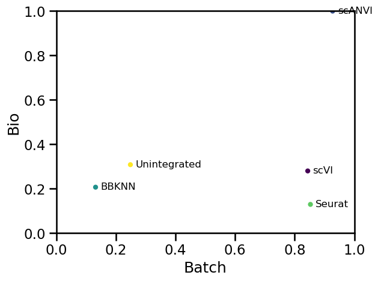

> **图15-1　整合方法的双维度审阅。** 横轴为批次去除汇总分数，纵轴为生物结构保留汇总分数。图来自 SCBP 整合 notebook 的已执行单元。该小型案例中，scANVI 的生物保留分数较高，scVI、scANVI 和 Seurat 的批次校正分数相近，BBKNN 在两个维度上较低。图只支持本数据和本参数下的比较，不支持“某方法普遍最好”。

二维嵌入图容易让人把“不同批次混在一起”当成成功。图15-1说明整合至少有两个目标：减少批次差异，同时保留已知生物结构。二者存在权衡。若只优化批次混合，真实的细胞类型或条件差异也可能被压平。

SCBP 的汇总方式给批次校正 40% 权重，给生物保留 60% 权重。这个权重属于评价选择，不是自然常数。不同研究可按任务调整，但必须在看到排名前确定规则，并报告单项指标，不能只展示一个总分。

#### 研究解释卡

| 项目 | 本案例写法 |
| --- | --- |
| 观察结果 | 不同方法在批次去除与生物保留上的位置不同 |
| 方法来源 | SCBP notebook 使用 scIB 快速指标评价四种整合方法和未整合对象 |
| 允许解释 | 本数据中，方法选择会改变技术混合和生物结构保留的平衡 |
| 替代解释 | 标签质量、参数、批次构成和指标选择均会影响排序 |
| 仍需验证 | 在目标数据上复跑、检查标签、比较参数并保留未整合基线 |

### 15.1.3 整合对象不等于条件比较对象

整合常用于可视化、聚类或标签转移。条件比较则要保留样本间真实差异。若把 condition 当作需要移除的 batch，处理效应可能被模型吸收。一个稳妥做法是保留原始计数和完整元数据，用整合表示帮助确定可比较细胞群，再回到样本层面的原始计数或合理汇总对象进行推断。

| 分析目的 | 推荐使用的对象 | 原因 |
| --- | --- | --- |
| 联合 UMAP 或聚类 | 校正表示或整合邻接图 | 降低技术差异对邻接关系的影响 |
| 标签转移 | 带批次信息的参考表示 | 需要共享细胞结构和标签映射 |
| 条件内基因表达比较 | 原始计数或适当归一化表达，按样本建模 | 避免校正值改变条件效应 |
| 细胞类型丰度比较 | 细胞类型×样本计数或比例 | 推断单位是样本，不是单个细胞 |

### 15.1.4 案例二：WT chimera 的细胞丰度比较

**证据状态：素材已运行。** OSCA 的多样本差异丰度案例读取 WT chimeric mouse embryo 数据的第 5 至第 10 个样本。代码先把细胞标签按样本计数，形成“细胞类型×样本”矩阵，再使用 edgeR 建模。此时每一列代表一个样本，每一行代表一个细胞类型。

```r
library(MouseGastrulationData)
library(edgeR)

sce.chimera <- WTChimeraData(samples = 5:10)
abundances <- table(merged$celltype.mapped, merged$sample)
abundances <- unclass(abundances)

extra.info <- colData(merged)[match(colnames(abundances), merged$sample), ]
y.ab <- DGEList(abundances, samples = extra.info)
design <- model.matrix(~ factor(pool) + factor(tomato), y.ab$samples)
```

设计矩阵中的 `pool` 用于控制来源批次，`tomato` 表示注入状态。模型中的 log-fold change 描述细胞丰度变化，不是基因表达变化。学生审阅结果表时，应先查看系数名称，再读 logFC、P 值和 FDR，避免把两类分析混写。

这个案例也暴露组成效应。若某个亚群比例大幅升高，其他亚群的相对比例会被动下降。下降在数学上成立，却不一定表示那些亚群的绝对细胞数主动减少。没有总细胞数、组织体积或独立计数信息时，报告应使用“相对丰度变化”。

| 常见写法 | 问题 | 建议改写 |
| --- | --- | --- |
| “处理使细胞类型B减少” | 可能只观察到比例下降 | “样本中细胞类型B的相对丰度下降” |
| “共有5000个细胞，因此 n=5000” | 把细胞当独立重复 | “推断以6个样本为单位，细胞用于构成样本内计数” |
| “FDR显著说明效应重要” | 未报告幅度和不确定性 | 同时报 logFC、区间或可视化，并讨论组成效应 |
| “整合矩阵用于差异表达” | 可能移除条件信号 | 回到原始计数并按样本设计模型 |

### 15.1.5 本节审阅任务

给定一个含 `donor`、`sample`、`batch`、`condition` 和 `cell_type` 的 AnnData 对象，先输出唯一组合与交叉表，再完成以下判断：

1. condition 是否在多个 batch 中出现。
2. 每个 condition 是否有多个独立 sample 或 donor。
3. 整合方法输出的是表达矩阵、低维表示还是邻接图。
4. 条件比较使用的统计单位是否回到 sample 或 donor。
5. 结论是否区分表达变化、相对丰度变化和绝对数量变化。

## 15.2 轨迹分析、RNA velocity 与细胞通讯

### 15.2.1 三类方法回答不同问题

拟时序（pseudotime）根据细胞表达状态构造相对顺序。RNA velocity 利用 spliced 与 unspliced RNA 的关系估计局部方向。细胞通讯分析把细胞群表达与配体受体等先验知识结合，生成候选相互作用。这三类结果都属于模型化线索。

| 方法 | 关键输入 | 主要输出 | 不能直接证明 |
| --- | --- | --- | --- |
| 拟时序 | 表达表示、邻接图、根细胞 | 相对顺序、分支或终末状态 | 真实时间、谱系和不可逆方向 |
| RNA velocity | spliced/unspliced 层、邻接图、动力学模型 | 速度向量、流线、转移倾向 | 真实细胞转化和命运决定 |
| 细胞通讯 | 细胞标签、表达、配体受体资源 | 候选细胞对和分子对 | 结合发生、信号传导和功能效应 |

审阅时先问输入是否存在，再看模型假设，最后解释图形。直接从箭头、渐变色或网络连线开始讲生物学，容易跳过最关键的证据环节。

### 15.2.2 案例一：DPT 与 Palantir 给出不同骨髓拟时序

**证据状态：素材已运行。** SCBP 使用成人骨髓数据比较 diffusion pseudotime（DPT）和 Palantir。两种方法都需要指定根细胞。来源代码在 diffusion map 的分量上选择一个极值细胞作为 root，并把索引写入 `adata.uns["iroot"]`。

```python
root_ix = adata.obsm["X_diffmap"][:, 3].argmin()
adata.uns["iroot"] = root_ix
sc.tl.dpt(adata)
```

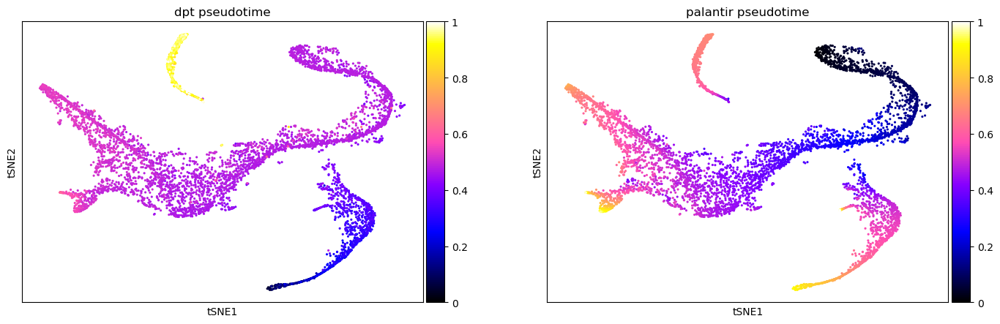

> **图15-2　同一数据的两种拟时序。** 左图为 DPT，右图为 Palantir，颜色表示各方法赋予的相对拟时序。DPT 在 CLP 群形成很高的异常值，部分早期 HSC 群也出现偏高值；Palantir 随来源材料中的发育成熟度先验呈较连续变化。图来自 SCBP 已执行 notebook。

这个案例的教学重点不是宣布 Palantir 更准确。来源作者结合骨髓发育先验，选择继续使用 Palantir。换一套数据、root、预处理或邻接图，结论可能改变。报告要交代选择依据，并把先验知识写成审阅条件。

拟时序的数值通常没有真实时间单位。`0.8` 不表示 8 小时，也不表示细胞经历了固定比例的发育过程。可以写“该细胞在模型给出的相对顺序中更靠后”。若要写真实发育方向，需要时间序列、谱系追踪、扰动或其他独立证据。

> **根细胞敏感性检查。** 选择同一早期细胞群中的多个候选 root，分别重算拟时序；比较整体相关性、终末状态和分支是否稳定。若结论随 root 大幅改变，应报告敏感性，不能只保留最符合预期的一张图。

| 观察 | 允许解释 | 仍需验证 |
| --- | --- | --- |
| DPT 中 CLP 拟时序偏高 | 当前 root 和图结构下出现异常排序 | 替换 root、检查邻接图、比较其他方法 |
| Palantir 色阶较连续 | 与来源材料采用的骨髓成熟度先验较一致 | 独立标志物、时间或谱系证据 |
| 两种方法不一致 | 轨迹结果依赖方法与假设 | 不能通过只选一张图消除不确定性 |

### 15.2.3 案例二：胰腺内分泌 RNA velocity

**证据状态：素材已运行。** SCBP 的 velocity 案例使用胰腺内分泌发育数据。对象包含 `spliced` 和 `unspliced` 层，标注包括 Ductal、Ngn3 low EP、Ngn3 high EP、Pre-endocrine 以及 Alpha、Beta、Delta、Epsilon 等细胞群。

```python
assert "spliced" in adata.layers
assert "unspliced" in adata.layers

scv.tl.velocity(adata, mode="dynamical")
scv.tl.velocity_graph(adata, n_jobs=8)
scv.pl.velocity_embedding_stream(adata, basis="umap", color="clusters")
```

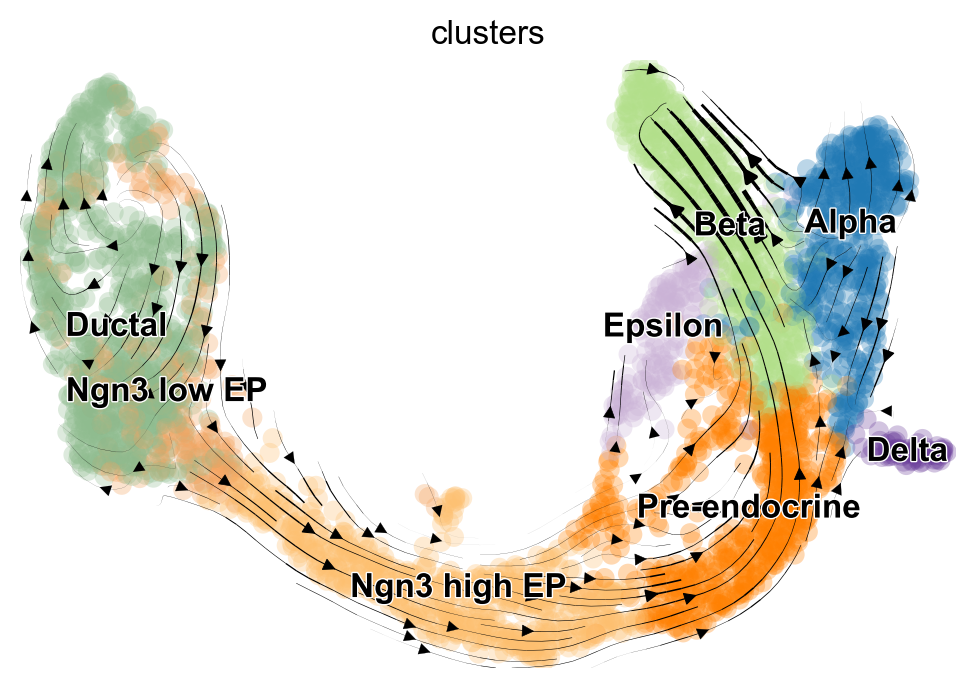

> **图15-3　RNA velocity 在 UMAP 上的流线投影。** 颜色表示来源 notebook 中的细胞群，曲线和箭头表示模型速度场投影到二维 UMAP 后的方向。该图适合检查方向是否与已知群体结构冲突，不适合单独确认细胞真实转化。

velocity 估计从每个基因的 spliced 与 unspliced 关系出发。稳态模型、动态模型、基因过滤、邻域平滑和速度图都会影响结果。来源案例指出，稳态模型的二维投影可出现从 Alpha 返回 Pre-endocrine 的“回流”，动态模型对 Ductal 细胞周期的表示更符合来源分析的判断。

二维流线经过嵌入和插值。高维向量投影后可能改变方向、汇合或分叉的视觉形态。严谨报告应同时检查 phase portrait、模型拟合质量、velocity confidence 和高维转移结果。来源材料建议使用 CellRank 等下游工具进行定量分析，而不是只凭流线图下结论。

| 审阅对象 | 最低检查 |
| --- | --- |
| 数据层 | `spliced`、`unspliced` 是否存在，是否为未处理计数 |
| 基因过滤 | 低表达基因阈值、选择基因数是否记录 |
| 模型 | steady-state、stochastic 或 dynamical 是否说明 |
| 邻接图 | 使用的表示和邻居数是否可追踪 |
| 图形 | basis、颜色、流线参数和细胞范围是否说明 |
| 结论 | 使用“方向线索”“转移倾向”，不写“已经分化为” |

### 15.2.4 案例三：干扰素刺激 PBMC 的候选细胞通讯

**证据状态：素材已运行。** SCBP 细胞通讯 notebook 使用 Kang 干扰素 β 刺激 PBMC 数据，先把对象拆成刺激组与对照组，再在刺激组运行 CellPhoneDB 和 LIANA。来源材料说明，经典配体受体方法通常在单一条件内推断候选相互作用，跨条件比较需要额外设计。

```python
adata_stim = adata[adata.obs["condition"] == "stim"].copy()

cellphonedb(
    adata_stim,
    groupby="cell_type",
    resource_name="consensus",
    expr_prop=0.1,
)

result = adata_stim.uns["liana_res"]
result[["source", "target", "ligand_complex", "receptor_complex"]].head()
```

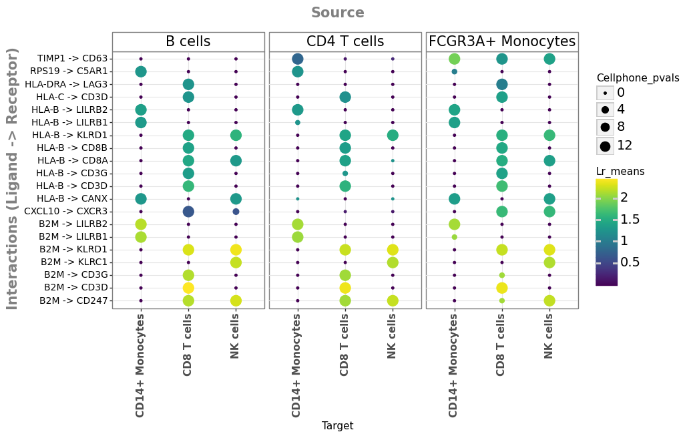

> **图15-4　候选配体受体点图。** 分面表示 source 细胞群，横轴表示 target 细胞群，纵轴为候选 ligand-receptor。颜色编码来源 notebook 中的表达均值，点大小编码置换结果。图展示筛选后的候选关系，不表示分子已结合或信号已传递。

CellPhoneDB 结合细胞群平均表达、复合物规则和标签置换。LIANA 可汇总多种方法的排名，输出 `magnitude_rank` 与 `specificity_rank`。共识能减少对单一方法的依赖，但不同数据库、复合物定义、表达阈值和细胞标签仍会改变候选列表。

NicheNet 增加配体到靶基因的先验网络，并依据受体细胞中的基因集排序配体活性。它回答“哪些配体较能解释指定基因集”，依赖用户如何定义 receiver、背景基因和目标基因集。若目标基因集来自刺激与对照的差异表达，比较仍应以 sample 或 donor 为重复单位。

| 层次 | 观察对象 | 合适写法 |
| --- | --- | --- |
| 表达层 | ligand 与 receptor 在相应细胞群中表达 | “满足当前表达与阈值条件” |
| 数据库层 | 资源记录该分子对或复合物 | “数据库支持其为候选相互作用” |
| 共识层 | 多种方法给出较高排名 | “在所选方法中排名较稳定” |
| 下游层 | NicheNet 目标基因集与配体先验相关 | “该配体可能解释部分表达变化” |
| 功能层 | 结合、信号传导和表型效应 | 需蛋白、空间、扰动或功能实验验证 |

细胞通讯领域缺少完整 ground truth，不同方法和资源的一致性有限。报告应保存数据库名称、版本、物种、阈值和细胞标签版本。图中出现 HLA、B2M 或 CD3 等分子对，只能作为候选线索，不能据此写成干扰素作用机制已经得到证明。

### 15.2.5 三类图的统一解释卡

| 项目 | 拟时序 | RNA velocity | 细胞通讯 |
| --- | --- | --- | --- |
| 观察结果 | 相对顺序或分支 | 速度场与转移方向线索 | 候选细胞对和分子对 |
| 方法来源 | 表达流形、root、图算法 | spliced/unspliced 与动力学模型 | 表达、标签与先验资源 |
| 替代解释 | root 或邻接图改变 | 模型失配或二维投影失真 | 标签、阈值或数据库改变 |
| 最小验证 | root 敏感性与方法比较 | phase portrait 和高维转移 | 蛋白、空间与独立资源 |
| 禁止越界 | 真实时间和谱系 | 已验证分化方向 | 已发生功能通讯 |

## 15.3 空间转录组数据结构与空间可视化

### 15.3.1 空间对象比表达矩阵多了什么

空间转录组把表达测量与位置联系起来。空间单位可能是 spot、bin、细胞、细胞核或单个 RNA 分子。不同单位的生物含义和独立性不同。Visium spot 可包含多个细胞；Xenium 等成像型平台可在分割后形成细胞级对象，但结果依赖分子检测和分割质量。

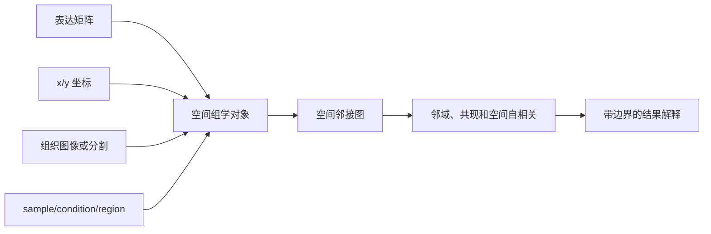

AnnData 常把观测注释放在 `.obs`，特征注释放在 `.var`，空间坐标放在 `.obsm["spatial"]`，空间邻接矩阵放在 `.obsp`。SpatialData 还能联合保存图像、点、形状和表格。Bioconductor 的 SpatialExperiment 使用 `assays`、`colData`、`spatialCoords` 和 `imgData` 组织相同类型的信息。

| 信息 | AnnData/SpatialData | SpatialExperiment | 审阅问题 |
| --- | --- | --- | --- |
| 表达 | `.X`、`.layers` 或 tables | `assays` | counts 还是 logcounts |
| 观测注释 | `.obs` | `colData` | sample、condition、region 是否完整 |
| 坐标 | `.obsm["spatial"]` 或 points | `spatialCoords` | 单位、方向和原点是什么 |
| 图像 | `.uns["spatial"]` 或 images | `imgData` | 与坐标是否同一切片并已配准 |
| 邻接 | `.obsp` 或图对象 | 邻接/权重对象 | 规则网格、距离阈值还是 kNN |

审阅空间图时，先确认点代表什么，再查看基因颜色。若一个点是 spot，图注要说明 spot 可能混合多个细胞；若一个点是分割细胞，要说明分割来源。图像背景用于定位，不自动等于病理诊断。

### 15.3.2 案例一：Visium 小鼠脑的空间邻域

**证据状态：本机复跑。** `visium_hne_adata.h5ad` 来自 scverse 示例数据服务，文件格式和来源记录已核验。对象含 2,688 个 spot、18,078 个基因和 15 个 `cluster`，`obsm["spatial"]` 为 2,688×2 坐标，`uns["spatial"]` 只含一张切片 `V1_Adult_Mouse_Brain`。

| 核验项 | 本机结果 | 解释边界 |
| --- | ---: | --- |
| AnnData 形状 | 2,688×18,078 | 行为 spot，不是单细胞 |
| cluster 数 | 15 | 沿用上游注释，不在本节重做聚类 |
| `n_rings=1` 邻接非零项 | 15,580 | 稀疏矩阵按双向连边存储 |
| `n_rings=2` 邻接非零项 | 45,944 | 扩大邻域会增加连边和富集幅度 |
| 运行环境 | Python 3.11.15；Scanpy 1.11.5；Squidpy 1.7.0 | 只对应本轮脚本与锁定对象 |

```python
import scanpy as sc
import squidpy as sq

SEED = 20260716
adata = sc.read_h5ad("visium_hne_adata.h5ad")
sq.gr.spatial_neighbors(
    adata, coord_type="grid", n_rings=1, key_added="spatial_r1"
)
result = sq.gr.nhood_enrichment(
    adata, cluster_key="cluster", connectivity_key="spatial_r1",
    n_perms=1000, seed=SEED, copy=True, n_jobs=1
)
```

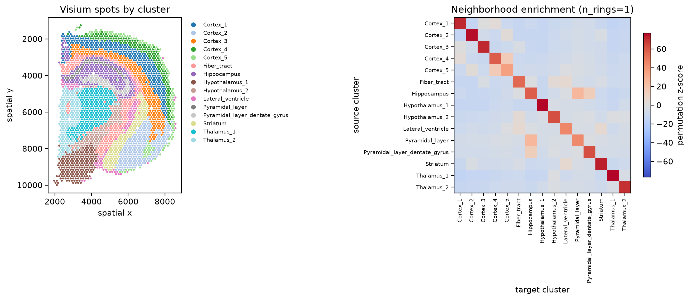

> **图15-5　真实 Visium 单切片的 cluster 与邻域富集。** 左图每个点为一个 spot，坐标来自 `obsm["spatial"]`，颜色为上游 cluster。右图行列为 cluster，颜色为 `n_rings=1`、1,000 次标签置换所得 Z 分数，随机种子为 20260716。图可用于定位当前图中的邻域模式，不能证明细胞通讯、因果关系或总体脑组织规律。

对角线普遍为正，说明相同 cluster 的 spot 常聚集。非对角元素中，Hippocampus 与 Pyramidal_layer 的 Z 分数为 25.424；Cortex_4 与 Cortex_5 为 14.497。它们是当前标签和网格邻接下高于随机标签参照的相邻模式，不等于两个脑区发生分子作用。

邻域富集比较观测连边与置换分布，interaction count 只报告原始连边数。cluster 大小不等时，两类结果可能排序不同。审阅时应同时保留 Z 分数、连边数、各 cluster 的 spot 数和完整参数，不能把热图颜色当成样本量。

### 15.3.3 教学网格：空间代码的单元测试

**证据状态：教学简化。** 10×10 网格只用于测试建图、置换和 Moran’s I 代码。它含 100 个构造 spot、三个竖向区域和两个无生物学含义的特征。真实 Visium 已完成本机复跑，因此教学网格不再替代真实数据，也不进入 15.5 项目的主结果。

```python
rng = np.random.default_rng(20260710)
x, y = np.meshgrid(np.arange(10), np.arange(10))
coordinates = np.column_stack([x.ravel(), y.ravel()])

region = np.where(x.ravel() < 4, "区域A",
                  np.where(x.ravel() < 7, "区域B", "区域C"))
gradient = x.ravel() / 9 + rng.normal(0, 0.08, x.size)
noise = rng.normal(0, 1, x.size)
```

对象建立后，代码以四邻接创建空间图，用 200 次置换计算区域邻域富集，并对两个教学特征计算 Moran’s I。固定随机种子为 `20260710`。该测试用于确认梯度信号高于随机噪声，并检查输出键和图形流程。

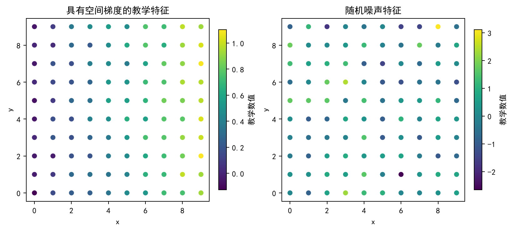

> **图15-6　两个教学特征的空间模式。** 左图颜色随 x 坐标呈梯度，右图没有稳定空间结构。点均为构造的教学 spot，颜色是无生物学单位的教学数值。

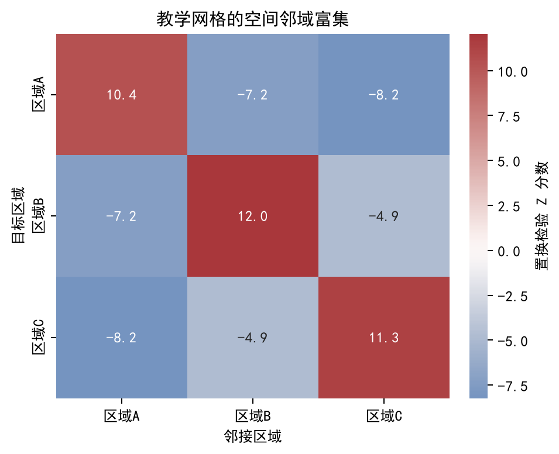

> **图15-7　三个教学区域的邻域富集。** 同一区域内部 Z 分数为正，不同区域之间为负，符合竖向区域划分和四邻接规则。该结果由标签构造决定，用于验证代码是否按预期处理邻接关系。

测试输出中，`gene_gradient` 的 Moran’s I 为 0.909，`gene_noise` 为 0.049。它们只说明代码能区分预设梯度与本次随机实现。数值、区域和坐标均为构造结果，不能写成组织发现，也不能用于验证真实 Visium 的效应大小。

| 输出 | 教学观察 | 解释边界 |
| --- | --- | --- |
| 100×2 AnnData | 100 个 spot、2 个特征 | 不是公开生物数据 |
| 邻接矩阵 360 个非零元素 | 四邻接形成双向连边 | 更换邻接规则会改变结果 |
| `gene_gradient` I=0.909 | 梯度特征有空间自相关 | 构造结果，不代表基因功能 |
| `gene_noise` I=0.049 | 随机特征无明显空间结构 | 单次教学随机实现 |

### 15.3.4 案例二：Nrgn 与 Ttr 的空间表达

**证据状态：本机复跑。** 本轮在同一 Visium 对象和 `n_rings=1` 邻接图上计算 Nrgn、Ttr 的 Moran’s I。两项分析均使用 1,000 次置换、随机种子 20260716，并对置换 P 值做 FDR 校正。颜色来自对象 `.X` 中各基因的表达值；两个面板使用各自色标，不能按亮度直接比较表达量。

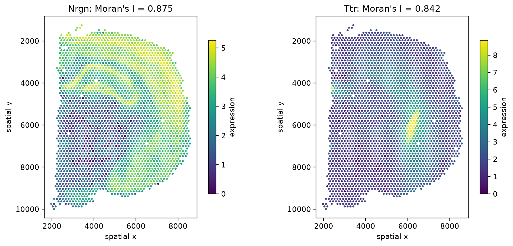

> **图15-8　Nrgn 与 Ttr 的空间表达及 Moran’s I。** 每个点为一个 Visium spot，坐标来自单张小鼠脑切片，颜色为当前对象中的基因表达值。Nrgn 的 I=0.875，Ttr 的 I=0.842；两者置换 `p_sim=0.000999`。图支持描述强正空间自相关，不支持判断基因造成区域形成、病理变化或细胞间作用。

| 基因 | Moran’s I | 置换 `p_sim` | 本案例允许解释 |
| --- | ---: | ---: | --- |
| Nrgn | 0.875 | 0.000999 | 表达相近的 spot 在当前邻接图中聚集 |
| Ttr | 0.842 | 0.000999 | 表达呈明显空间非均匀分布 |

空间变异基因可能反映细胞类型组成、组织结构、局部状态或技术因素。若某基因同时是某细胞类型 marker，空间聚集可能主要来自该细胞类型的空间分布。进一步解释前，应把基因图与 cluster、细胞比例、总计数和组织区域图对照。

### 15.3.5 OSTA 案例：成像型数据和多样本空间比较

**证据状态：素材已运行。** OSTA 将空间流程分为测序型与成像型两条路线。其 HumanBreast Janesick 示例同时包含 Chromium、Visium 和两份 Xenium 数据。Visium 案例以 spot 为单位，Xenium 案例以分割细胞和检测到的 RNA 分子为基础，空间统计对象分别更接近规则格点和点模式。

对象类型会影响邻域定义。规则格点可按网格相邻或距离建图；不规则细胞位置常按距离、k 近邻或空间权重矩阵建图。参数应由测量单位和研究问题决定，不能因为软件默认值可运行就省略说明。OSTA 的多条件空间案例使用 SpatialExperiment，示例对象包含 5,000 个基因、55,660 个细胞，`colData` 中有 `sample_id`、`condition` 和空间 domain，`spatialCoords` 保存 x/y。DESpace 先按 sample 与 domain 汇总为 pseudobulk，再检验 condition×domain 交互项。

```r
spatialCoordsNames(spe) <- c("x", "y")

dsp <- dsp_test(
    spe,
    sample_col = "sample_id",
    condition_col = "condition",
    cluster_col = "Banksy_smooth",
    verbose = TRUE
)
```

这里的核心问题是：某基因在不同条件间的变化，是否因空间 domain 而异。推断单位仍是 sample。数万个细胞提高了每个 pseudobulk 的测量信息，却没有把独立样本数扩大到数万个。若每个条件只有一个切片，condition 与 sample 无法分开。

### 15.3.6 空间图表设计规范卡

| 项目 | 图注必须回答 |
| --- | --- |
| 空间单位 | 点是 spot、bin、细胞、细胞核还是 RNA 分子 |
| 坐标 | 坐标来源、单位、方向和是否配准 |
| 图像 | H&E 或荧光图像的来源及用途 |
| 颜色 | 原始计数、归一化表达、cluster、region 或统计量 |
| 分面 | 每个面板对应哪个 sample、condition 或切片 |
| 邻接 | 网格、距离阈值、kNN 或其他权重规则 |
| 推断单位 | spot/cell 用于描述，sample 用于条件推断 |
| 边界 | 空间邻近和空间相关均不等于因果作用 |

## 15.4 CITE-seq、免疫受体与多模态数据

### 15.4.1 多模态审阅从条形码开始

CITE-seq 同时测量 RNA 与抗体衍生标签（Antibody-Derived Tags，ADT）。免疫受体数据记录 TCR 或 BCR 的链、V(D)J 基因和 CDR3。配对 multiome 还可在同一细胞中测量 RNA 与染色质可及性。多模态分析的第一步是确认哪些模态来自同一细胞，以及对齐过程中丢失了多少细胞。

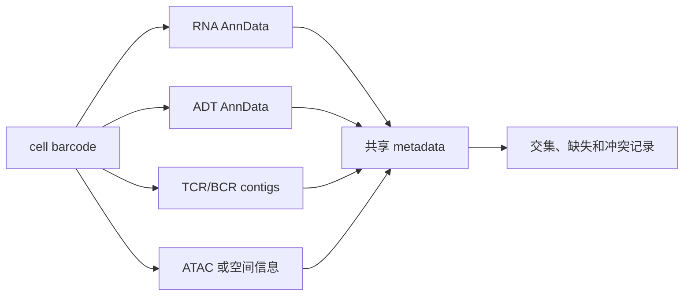

### 15.4.2 案例一：NeurIPS CITE-seq 的 ADT 质控

**证据状态：本机复跑。** MuData 通过 SCBP 的 LaminDB 键 `surface-protein/cite_filtered.h5mu` 取得，来源文件核验记录保存在任务输出。对象含 122,016 个 droplet、36,601 个 RNA 基因和 140 种 ADT，供者为 `s1d1` 至 `s4d9` 的 12 个原始 ID。

MuData 中的 `rna` 与 `prot` 各自是 AnnData。来源 notebook 记录 Python 3.13.13、lamindb-core 2.3.1、muon 0.1.7、Scanpy 1.12、NumPy 2.4.3、pandas 2.3.3、SciPy 1.16.3 和 seaborn 0.13.2；本机按同一组核心版本复跑。远端数据库模式为 2.7.0，客户端虽提示版本差异，但查询、缓存、读取和数值核验均通过。

```python
import scanpy as sc
from scipy.stats import median_abs_deviation

prot = mdata["prot"].copy()
sc.pp.calculate_qc_metrics(prot, inplace=True, percent_top=None)
prot = prot[prot.obs["total_counts"] <= 100000].copy()

def is_outlier(frame, metric, nmads=5):
    x = frame[metric]
    med = np.median(x)
    mad = median_abs_deviation(x)
    return (x < med - nmads * mad) | (x > med + nmads * mad)
```

全局上限先删除 35 个 ADT total counts 大于 100,000 的 droplet，对象由 122,016 降至 121,981。随后在每个 donor 内，对 `log1p_total_counts` 与 `log1p_n_genes_by_counts` 分别使用 5 MAD 规则，任一指标越界即标记；共删除 3,418 个 droplet，最终保留 118,563 个。

| donor | 全局过滤后 n | 供者内剔除 | 供者内过滤后 n | 过滤前中位数 | 过滤后中位数 |
| --- | ---: | ---: | ---: | ---: | ---: |
| s1d1 | 8,784 | 206 | 8,578 | 5,700.0 | 5,755.0 |
| s1d2 | 7,521 | 209 | 7,312 | 5,158.0 | 5,202.0 |
| s1d3 | 8,340 | 227 | 8,113 | 5,165.5 | 5,195.0 |
| s2d1 | 13,980 | 340 | 13,640 | 626.0 | 626.0 |
| s2d4 | 7,297 | 189 | 7,108 | 975.0 | 988.0 |
| s2d5 | 11,799 | 150 | 11,649 | 767.0 | 771.0 |
| s3d1 | 13,916 | 339 | 13,577 | 1,721.0 | 1,723.0 |
| s3d6 | 14,093 | 492 | 13,601 | 551.0 | 550.0 |
| s3d7 | 14,793 | 338 | 14,455 | 640.0 | 649.0 |
| s4d1 | 6,753 | 245 | 6,508 | 4,847.0 | 4,865.5 |
| s4d8 | 4,800 | 184 | 4,616 | 8,754.5 | 8,871.5 |
| s4d9 | 9,905 | 499 | 9,406 | 3,531.0 | 3,484.5 |

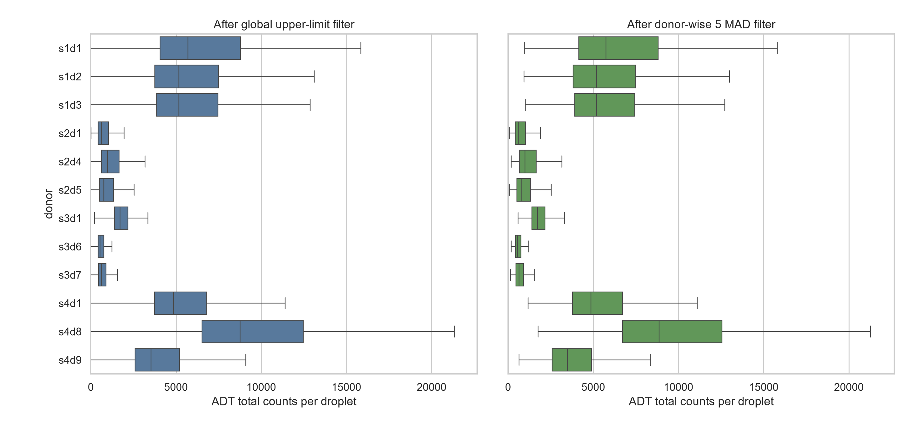

> **图15-9　CITE-seq ADT 质控的供者分布。** 两个面板均以 droplet 为分析单位，横轴为 ADT total counts，纵轴按原始中心顺序固定 12 名供者。左图为全局上限过滤后，右图为供者内 5 MAD 过滤后。箱线图设置 `showfliers=False`，只隐藏离群点符号；实际剔除数见上表。图可审阅供者间分布差异，不能把平台计数差异解释为蛋白功能差异。

来源案例还在检测到的 ADT 种类分布中观察到约 55 附近的低谷。该位置取决于本抗体面板和预处理，不是通用阈值。供者分布差异很大，说明供者内规则比单一全局下限更适合本案例；它仍可能删除真实极端细胞，需结合 RNA 质控、doublet 指标和细胞类型复核。

### 15.4.3 案例二：TCR/BCR 表格和链质控

**证据状态：本机复跑。** BCR 使用 E-MTAB-10026 的 `scbcr_cellranger_filtered_contig_annotations.csv.gz`，TCR 使用 `TCR_merged-Updated.tsv`。BCR 有 373,670 条 contig，TCR 有 547,630 条。TCR 原始表含 285,359 个 CellID；按 `is_cell` 与 `high_confidence` 过滤后为 280,045 个细胞。所有 TCR contig 均为 `full_length=True` 且 `productive=True`。

| 字段 | 含义 | 核验点 |
| --- | --- | --- |
| `barcode` | contig 所属细胞 | 多个样本中是否重复，是否加样本前缀 |
| `chain` | TRA、TRB、IGH、IGK 等链类型 | 是否与 TCR/BCR 类型一致 |
| `v_gene`、`d_gene`、`j_gene` | 重排片段注释 | 缺失是否与 `full_length` 一致 |
| `full_length` | 是否覆盖完整受体范围 | 非完整 contig 不宜进入完整受体分析 |
| `productive` | 是否可形成有效受体序列 | 混合类型需先统一为逻辑或字符串 |
| `cdr3`、`cdr3_nt` | CDR3 氨基酸或核苷酸序列 | 缺失、异常长度和重复需检查 |

为避免跨供者合并，本轮给 BCR 使用 `patient_id|barcode`，给 TCR 使用 `Centre|patient_id|CellID` 作为细胞 ID。来源 BCR barcode 未发现跨供者冲突，但仍保留显式前缀规则。Scirpy 0.24.0 将每个细胞的 AIRR 记录保存为 `obsm["airr"]` 中的 awkward array，不再把每条链展开为大量 `.obs` 列。

```python
import scirpy as ir

adata_tcr = ir.io.read_10x_vdj(tcr_input, filtered=True)
assert "airr" in adata_tcr.obsm

ir.pp.index_chains(adata_tcr)
assert "chain_indices" in adata_tcr.obsm
ir.tl.chain_qc(adata_tcr)
```

| 对象核验 | TCR | BCR |
| --- | ---: | ---: |
| contig 行数 | 547,630 | 373,670 |
| Scirpy 细胞数 | 280,045 | 159,446 |
| `airr` 与 `chain_indices` | 均存在 | 均存在 |
| chain QC 类别总数 | 280,045 | 159,446 |

| TCR chain pairing | 细胞数 |
| --- | ---: |
| single pair | 196,957 |
| orphan VDJ | 45,266 |
| extra VJ | 19,034 |
| orphan VJ | 7,937 |
| extra VDJ | 7,473 |
| two full chains | 3,356 |
| no IR | 22 |

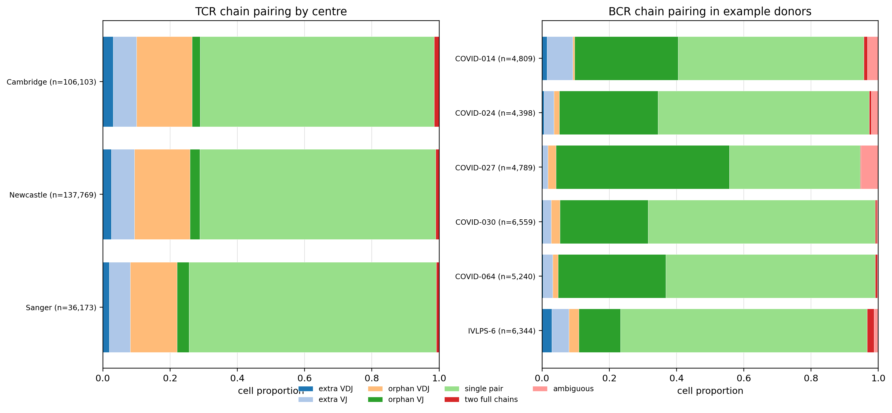

> **图15-10　现代 Scirpy 链质控结果。** 左图按 Cambridge、Newcastle、Sanger 三个中心汇总 TCR，右图展示六名示例供者的 BCR；横轴为各细胞级 chain-pairing 类别比例，括号给出细胞数。输入先做供者前缀化，再执行默认 productive 与 junction amino-acid 链索引。图可描述链检出结构，不能证明抗原特异性、免疫保护或治疗反应。

本机环境为 Python 3.12.13、Scirpy 0.24.0、Scanpy 1.12.2、AnnData 0.13.2 和 awkward 2.10.0。来源 AIRR notebook 未保存完整包版本，标记`需补证据`。TCR 的七类计数与旧 notebook 完全一致，说明本数据在默认过滤下没有出现跨版本计数漂移；BCR 另含 ambiguous、multichain 和 no IR 等少量类别。

链质控会把细胞分为 single pair、extra VJ/VDJ、two full chains 或 multichain 等状态。多链可能来自真实双受体，也可能提示 doublet。过滤标准取决于任务：只研究完整克隆型时可要求成对链；描述受体检出率时，单链细胞仍包含信息。

克隆扩增表示某些受体序列在样本中重复出现。它不自动证明抗原特异性、保护作用、治疗反应或预后价值。跨样本比较还要以 donor 或 sample 为单位，并考虑测序深度和细胞捕获数量。

### 15.4.4 案例三：RNA 与 ADT 的配对整合

**证据状态：素材已运行。** SCBP 配对多模态案例选取 `s1d1`、`s1d2` 和 `s1d3` 三个批次，比较 WNN、MOFA+ 和 totalVI。来源 notebook 使用作者机器的硬编码绝对路径；正文以占位符转写该路径。输入对象没有随 notebook 提供，因此 totalVI 排名只能作为来源案例结果，不能写成本机验证。

条形码交集是该案例最可迁移的代码。它先统一 RNA 与 ADT 的细胞名，再取交集，给蛋白特征添加 `PROT_` 前缀，最后建立 MuData。实际项目还应保存交集前后的细胞数，避免静默丢失大量细胞。

```python
batches_to_keep = ["s1d1", "s1d2", "s1d3"]
rna = rna[rna.obs["batch"].isin(batches_to_keep)].copy()
adt = adt[adt.obs["donor"].isin(batches_to_keep)].copy()

common_idx = rna.obs_names.intersection(adt.obs_names)
alignment_log = {
    "rna_before": rna.n_obs,
    "adt_before": adt.n_obs,
    "paired_after": len(common_idx),
}

rna = rna[common_idx].copy()
adt = adt[common_idx].copy()
adt.var_names = ["PROT_" + name for name in adt.var_names]
mdata = mu.MuData({"rna": rna, "adt": adt})
```

`set(...).intersection(...)` 可以求交集，却会丢失原有顺序。使用 `Index.intersection` 后仍应确认两个对象的顺序完全一致。若细胞名跨样本重复，还要先加 sample 前缀。共享元数据应从明确的主对象复制，并逐列检查缺失与冲突。

| 方法 | 主要思想 | 审阅重点 |
| --- | --- | --- |
| WNN | 合并各模态邻接图并学习模态权重 | 每个模态的预处理、维数和邻接图 |
| MOFA+ | 用低秩因子解释多个模态的共同与特异变异 | 输入尺度、批次分组和因子解释 |
| totalVI | 联合建模 RNA counts 与蛋白前景/背景 | 原始计数、batch、训练过程和模型版本 |

来源 notebook 的 scIB 汇总中 totalVI 得分最高，随后用于下游展示。这个结果受三批次子集、指标选择和参数影响；scIB 原本主要用于单模态批次整合，来源材料也说明多模态专用评价仍有限。因此正文只写“该 notebook 的汇总指标中 totalVI 较高”。

来源 notebook 未随输入对象提供完整运行环境。本节只复用条形码交集、特征前缀和 MuData 构建逻辑，并将方法排名标为来源结果，不声称已经本机复现。

### 15.4.5 多模态对齐验收表

| 检查项 | 通过标准 |
| --- | --- |
| barcode 规范 | 样本前缀、分隔符和大小写规则一致 |
| 交集记录 | 保存每个模态对齐前、交集后和丢失数量 |
| 行顺序 | 所有模态的共享细胞顺序完全相同 |
| 特征命名 | RNA、ADT、ATAC 特征不会重名 |
| 元数据 | batch、sample、donor、condition 来源清楚 |
| 缺失模态 | 明确删除、插补或保留缺失的规则 |
| 输出位置 | 不含作者机器的绝对路径，写入项目 outputs |
| 解释边界 | 模态一致用于支持注释，不等于功能或机制验证 |

## 15.5 综合项目选题、分析路线与交付物

### 15.5.1 项目主线：审阅一项空间邻域分析

本节用 15.3 的 Visium 小鼠脑数据组织一项完整项目。项目问题是：“在已有空间 cluster 注释下，哪些 cluster 组合呈现超出标签置换预期的邻近，结果对邻接圈数是否敏感？”项目不把空间邻近写成细胞通讯或组织形成机制。

**证据状态：本机复跑。** 输入是 scverse 示例库的 `visium_hne_adata.h5ad`，对象为 2,688 个 spot×18,078 个基因，包含 15 个 cluster 和单张切片的空间坐标。本机使用 Python 3.11、Scanpy 1.11.5 和 Squidpy 1.7.0，随机种子固定为 20260716。

### 15.5.2 项目任务说明书

| 字段 | 本项目填写内容 |
| --- | --- |
| 项目题目 | Visium 空间 cluster 邻域分析的复现与审阅 |
| 主要问题 | 哪些 cluster 组合呈正邻域富集，改变 `n_rings` 后是否稳定 |
| 数据来源 | scverse `visium_hne_adata.h5ad`；来源与文件核验记录见任务输出 |
| 分析单位 | spot；一张切片；无独立生物学重复 |
| 数据对象 | AnnData：`.X`、`.obs["cluster"]`、`.obsm["spatial"]`、`.obsp`、`.uns["spatial"]` |
| 核心方法 | 六边形网格邻接、邻域富集、Moran’s I、参数敏感性 |
| 主图 | cluster 与富集矩阵、Nrgn/Ttr 空间表达、邻接敏感性 |
| 禁止越界 | 不把邻近写成因果、通讯、病理机制或临床意义 |

### 15.5.3 数据字典与对象验收

分析前先输出对象摘要。本对象没有 `sample_id` 列，单切片标识 `V1_Adult_Mouse_Brain` 位于 `.uns["spatial"]`。这不是需要由 AI 补全的缺失值，而是对象的实际结构。若要比较条件，须另外引入多张切片及样本元数据。

| 字段或槽位 | 类型 | 用途 | 验收规则 |
| --- | --- | --- | --- |
| `.X` | spot×gene 稀疏矩阵 | 空间表达与 Moran’s I | 按来源对象的已处理表达值使用，不冒充原始 counts |
| `.obs["cluster"]` | 分类变量 | 邻域富集分组 | 无缺失，类别来源清楚 |
| `.obsm["spatial"]` | n×2 数组 | x/y 坐标 | 行数等于 spot 数，无非有限值 |
| `.uns["spatial"]` | 切片元数据 | 识别切片与组织图像 | 本对象只有一个 library key |
| `.obsp["spatial_connectivities"]` | 稀疏矩阵 | 空间邻接 | 对称性和孤立点可检查 |
| `.uns` 结果 | 字典 | 富集和统计结果 | key、参数和版本有记录 |

```python
required_obs = {"cluster"}
missing = required_obs.difference(adata.obs.columns)
assert not missing, f"缺少字段: {sorted(missing)}"
assert "spatial" in adata.obsm
assert adata.obsm["spatial"].shape == (adata.n_obs, 2)
assert np.isfinite(adata.obsm["spatial"]).all()
assert list(adata.uns["spatial"]) == ["V1_Adult_Mouse_Brain"]
```

### 15.5.4 分析路线

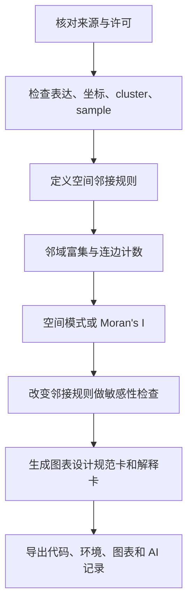

本项目先检查对象形状、坐标和 cluster，再以 `coord_type="grid"` 构建邻接图。邻域富集在 cluster 标签上做 1,000 次置换。Moran’s I 用于度量 Nrgn 和 Ttr 在当前邻接图上的全局空间自相关。

```python
SEED = 20260716
sq.gr.spatial_neighbors(
    adata, coord_type="grid", n_rings=1, key_added="spatial_r1"
)
enrichment = sq.gr.nhood_enrichment(
    adata, cluster_key="cluster", connectivity_key="spatial_r1",
    n_perms=1000, seed=SEED, copy=True, n_jobs=1
)
moran = sq.gr.spatial_autocorr(
    adata, genes=["Nrgn", "Ttr"], mode="moran",
    connectivity_key="spatial_r1_connectivities",
    n_perms=1000, seed=SEED, copy=True, n_jobs=1
)
```

若项目扩展到多切片条件比较，应按 sample×domain 汇总或使用能处理样本层级的模型。单张切片可用于空间描述，不能支持总体条件推断。加入更多 spot 不等于加入更多独立样本。

### 15.5.5 三张主图的图表设计规范卡

| 图 | 主要问题 | 数据与编码 | 必须标注 | 边界 |
| --- | --- | --- | --- | --- |
| 项目主图1 | cluster 在组织中如何分布，哪些组合富集 | spot 坐标用颜色编码 cluster；矩阵颜色编码 Z 分数 | 单切片、`n_rings=1`、1,000 次置换 | 邻近不等于通讯 |
| 项目主图2 | Nrgn 与 Ttr 是否呈空间自相关 | spot 坐标用颜色编码表达值 | Moran’s I、置换口径 | 自相关不给出因果方向 |
| 项目主图3 | 邻接圈数改变后结果是否保持结构 | `n_rings=1` 与 2 的 Z 分数散点和差值热图 | 边数、相关系数、参数 | 高相关不表示每个组合数值不变 |


> **项目主图1（本机复跑）。** 左侧的分析单位为 spot，颜色表示 cluster；右侧颜色表示 `n_rings=1`、1,000 次置换的 Z 分数。图只描述当前单切片与当前注释下的邻域模式。


> **项目主图2（本机复跑）。** 每个点为一个 spot，颜色表示来源对象中的已处理表达值。Nrgn 与 Ttr 的 Moran’s I 分别为 0.875 和 0.842，不能据此推断区域形成机制。

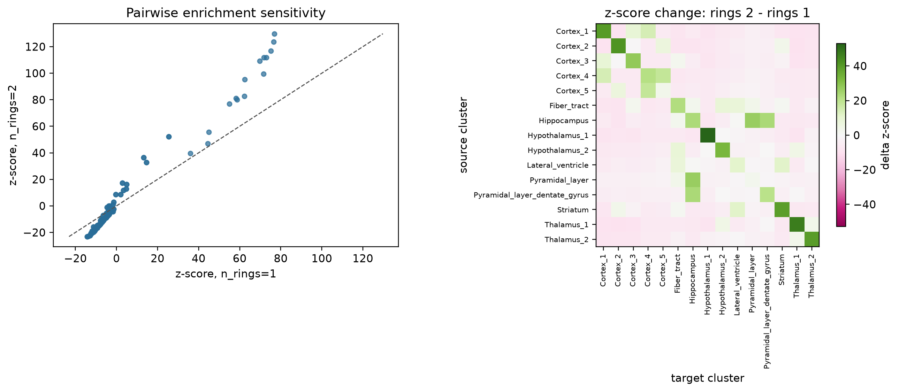

> **图15-11　邻接圈数敏感性（本机复跑）。** 左图比较完整 15×15 富集矩阵在 `n_rings=1` 和 2 时的 Z 分数，包含对角项与对称项；Spearman 相关系数为 0.991。右图用颜色表示每个 cluster 组合的 Z 分数差。高整体相关只支持矩阵排序大体稳定，不能代替对局部差值的逐项审阅。

### 15.5.6 结果表与研究解释卡

| 结果 | 状态 | 观察 | 允许解释 |
| --- | --- | --- | --- |
| 对象与空间坐标 | 本机复跑 | 2,688 个 spot、18,078 个基因、15 个 cluster；坐标为 2,688×2 | 对象满足单切片空间描述的结构要求 |
| 邻接图 | 本机复跑 | `n_rings=1` 和 2 的非零连边数为 15,580 和 45,944 | 圈数改变扩大了每个 spot 的邻域 |
| Hippocampus-Pyramidal_layer | 本机复跑 | Z 分数从 25.424 变为 52.177 | 该组合在两种邻接口径下均为正富集 |
| Nrgn / Ttr | 本机复跑 | Moran’s I 为 0.875 / 0.842，置换 `p_sim` 均为 0.000999 | 两个基因在当前图上呈强正空间自相关 |
| 富集矩阵敏感性 | 本机复跑 | 完整矩阵在两种圈数下的 Spearman 相关系数为 0.991 | 整体排序较稳定，局部幅度仍会变化 |

**项目解释卡。** 观察结果是当前切片的 cluster 邻域富集、基因空间自相关及其参数敏感性。方法来源是 Squidpy 的网格邻接、标签置换和 Moran’s I。允许解释为“识别出值得在其他切片复核的空间模式”。

替代解释包括 cluster 数量不均、组织边界、注释误差和邻接圈数。仍需验证多切片重复、病理注释和独立数据。`p_sim` 来自有限次数的置换，不应与生物学效应大小混为一谈。

### 15.5.7 代码目录与运行顺序

```text
outputs/2026-07-16-第15章残余风险完善/
  resolve_datasets.py
  run_visium.py
  validate_chapter15.py
  运行结果/
    数据访问清单.csv
    Visium-对象与结果核验.json
    Visium-MoransI.csv
    Visium-邻接敏感性.csv
    requirements-visium.txt
  2026-07-16-风险处置报告.md
```

数据解析脚本先验证 HTTP 响应、文件类型、字节数和哈希，再由 Visium 脚本读取外部缓存。结果表、标准输出和环境锁进入任务目录，章节文件夹只保存正文及成稿图。教学网格仅用于检查代码能否识别预设模式，不进入本项目的真实结果表。

### 15.5.8 AI 协作记录实例

| 项目 | 本项目实例 |
| --- | --- |
| 任务 | 解析真实 Visium 对象，运行邻域富集、Moran’s I 和邻接敏感性 |
| 提供给 AI 的上下文 | 官方数据地址、期望形状、固定版本、随机种子与验收条件 |
| AI 输出 | 数据访问脚本、分析脚本、结果表、三张图和图注草稿 |
| 人工核验 | 检查 HDF5 类型、对象形状、空间坐标、cluster、连边数、图像可读性和解释边界 |
| 修改记录 | Squidpy 1.7.0 会在 `connectivity_key` 后追加后缀；首次传入完整 key 导致重复后缀，改为基础 key 后通过 |
| 运行结果 | 真实对象、两种邻接圈数、2,000 组置换任务和三张图全部通过结构检查 |
| 仍需验证 | 多切片复现、独立病理注释与跨版本数值一致性 |

AI 可以把任务拆成脚本、解释报错、检查缺失字段和生成核验表。学生仍要决定邻接规则是否符合平台、样本是否足以比较条件、空间模式能解释到哪一层。

### 15.5.9 备选选题

| 选题 | 最小交付物 | 主要边界 |
| --- | --- | --- |
| 三批次单细胞整合审阅 | 元数据交叉表、双指标图、方法输出表 | 不评选通用最佳方法 |
| 骨髓拟时序敏感性 | 两个 root、两种方法、排序比较 | 拟时序不等于真实时间 |
| CITE-seq ADT 质控 | RNA/ADT 指标表、供者图修订、阈值依据 | 阈值不可跨面板照搬 |
| TCR/BCR 链质控 | contig 字典、barcode 对齐、链状态图 | 克隆型不等于抗原特异性 |

## 15.6 项目汇报、代码复核与图表审阅

### 15.6.2 代码复核练习一：识别不可复现路径

下面的代码保留多模态素材中的硬编码路径模式，但将作者机器的实际路径脱敏为占位符。这类代码只能在特定服务器目录下运行，也没有记录输入版本。

```python
adt = sc.read("<作者服务器绝对路径>/adt_pp.h5ad")
rna = sc.read("<作者服务器绝对路径>/rna_hvg.h5ad")
```

修订时使用项目根目录、配置文件或命令行参数。程序应在读取前检查文件存在，并在错误中报告期望路径。数据文件不能由 AI 根据文件名猜测。

```python
from pathlib import Path

project_root = Path(__file__).resolve().parents[1]
adt_path = project_root / "data" / "derived" / "adt_pp.h5ad"
rna_path = project_root / "data" / "derived" / "rna_hvg.h5ad"
seed = 20260716

for path in [adt_path, rna_path]:
    if not path.exists():
        raise FileNotFoundError(f"缺少输入文件: {path}")
```

路径修复后还要检查随机种子、包版本、输入哈希和输出目录。深度学习模型需记录训练轮数、早停、硬件和模型保存位置。只写 `random.seed()` 不足以控制 NumPy、框架和 GPU 的全部随机来源，报告应如实说明可复现程度。

| 代码项 | 复核问题 | 通过证据 |
| --- | --- | --- |
| 输入路径 | 是否依赖个人机器 | 相对路径或配置文件，存在性检查 |
| 数据版本 | 输入对象是否可追溯 | 来源、日期、哈希和预处理记录 |
| 随机性 | seed 是否覆盖关键步骤 | seed、软件版本和重复运行比较 |
| 环境 | 包版本是否固定 | lock 文件或 environment 文件 |
| 中间对象 | 是否依赖 notebook 隐藏状态 | 脚本按顺序从文件读取 |
| 输出 | 是否覆盖原始数据 | 输出进入独立任务目录 |

### 15.6.3 图表审阅练习二：修订 CITE-seq 供者图

**证据状态：素材已运行。** 下图是来源 notebook 的审阅素材，不是成稿主图。它包含真实 donor 分组和 ADT total counts，但 x 轴标签重叠，且没有在图面上区分两阶段过滤。

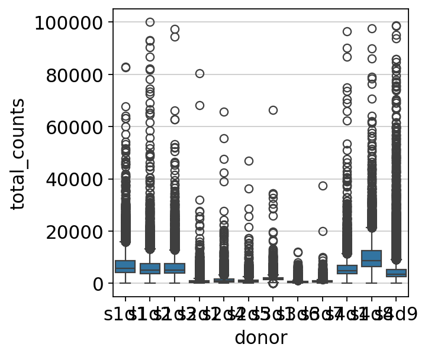

> **审阅素材（修订前）。** 数据对象为来源 CITE-seq MuData 的 ADT 模态，分析单位为 droplet。标签覆盖使供者无法稳定识别，图注也未给出每供者数量和离群点口径，因而不宜用于正式汇报。

**审阅结论。** 问题不只是“不美观”，而是分组标识丢失、过滤阶段混合和样本量不可追溯。修订时固定原始中心顺序，改用横向箱线图，分面展示全局上限过滤后与供者内 5 MAD 过滤后。

```python
order = [
    "s1d1", "s1d2", "s1d3", "s2d1", "s2d4", "s2d5",
    "s3d1", "s3d6", "s3d7", "s4d1", "s4d8", "s4d9",
]
fig, axes = plt.subplots(1, 2, figsize=(12, 6), sharey=True)
sns.boxplot(
    data=prot_after_global.obs, x="total_counts", y="donor",
    order=order, orient="h", showfliers=False, ax=axes[0]
)
sns.boxplot(
    data=prot_after_donor_mad.obs, x="total_counts", y="donor",
    order=order, orient="h", showfliers=False, ax=axes[1]
)
```

**证据状态：本机复跑。** 修订图直接来自 122,016 个 droplet、36,601 个 RNA 基因和 140 种 ADT 的 MuData。全局上限过滤后保留 121,981 个 droplet，供者内 5 MAD 过滤后保留 118,563 个。


> **修订图（本机复跑）。** 两个面板的横轴是 ADT total counts，纵轴按原始中心顺序展示 12 名供者，每个箱体的单位为 droplet。`showfliers=False` 只隐藏绘图符号；真实删除由全局上限和供者内 5 MAD 规则完成，每供者数量见 15.4.2 表。图可用于审阅计数分布，不支持蛋白功能推断。

### 15.6.4 代码复核清单

| 模块 | 检查项 | 不通过时的处理 |
| --- | --- | --- |
| 数据 | 来源、许可、哈希、只读状态 | 停止分析，补数据说明 |
| 元数据 | sample、donor、batch、condition、label | 列出缺失与混杂，不让 AI 猜 |
| 对齐 | 细胞条形码、模态交集、行顺序 | 保存对齐日志，重新构建对象 |
| 统计 | 独立单位、模型、效应量、多重检验 | 回到设计矩阵和样本层级 |
| 参数 | 邻居数、root、置换、阈值、seed | 写入配置并做敏感性分析 |
| 路径 | 输入、缓存、中间对象和输出 | 改为项目相对路径 |
| 环境 | Python/R、包版本、系统信息 | 导出 lock 文件和会话信息 |
| 错误 | 下载、缺包、内存或格式错误 | 保留原始错误和修正记录 |

### 15.6.5 图表审阅清单

| 检查项 | 单细胞或空间图的通过标准 |
| --- | --- |
| 问题 | 一张主图回答一个主要问题 |
| 数据单位 | cell、spot、sample、donor 分层写清 |
| 视觉编码 | 坐标、颜色、大小、形状和分面可解释 |
| 参数 | UMAP、邻接、root、velocity 或置换参数有记录 |
| 数量 | 过滤前后细胞或 spot 数可追踪 |
| 统计 | 效应量、区间、P 值或 FDR 与分析层级匹配 |
| 图注 | 数据来源、方法、观察和边界完整 |
| 可读性 | 标签不重叠，色标可辨，面板顺序明确 |
| 导出 | 图片、作图数据表、脚本和规范卡同时保存 |

### 15.6.6 同伴复核记录

同伴复核不直接改写原文件。复核者先记录问题、证据和建议，作者再逐项回应。AIDD 的 GitHub 协作材料可支持分支、提交、Pull Request、Issue 和冲突处理；科学判断仍由项目作者和分析负责人确认。

| 编号 | 复核问题 | 证据位置 | 建议 | 作者回应 | 状态 |
| --- | --- | --- | --- | --- | --- |
| R01 | 单切片是否被用于条件推断 | 项目数据字典与第7页 | 明确无独立重复，只作空间描述 | 已限定结论层级 | 关闭 |
| R02 | Visium 是否完成真实数据本机复跑 | 数据清单、运行日志与结果 JSON | 核对形状、坐标、连边和富集结果 | 结构与数值均通过 | 关闭 |
| R03 | 教学网格是否被当成真实结果 | 15.3.3 与 15.5.7 | 仅作代码单元测试，不进主结果表 | 已分离证据用途 | 关闭 |
| R04 | CITE-seq 供者标签重叠是否修正 | 15.6.3 修订前后图 | 改为横向分面，固定顺序并补全数量表 | 修订图已通过可读性检查 | 关闭 |
| R05 | 来源环境与当前环境是否被混写 | 材料护照与环境锁 | 逐案例记录版本、兼容结果和缺失信息 | 已保留跨版本边界 | 关闭 |

### 15.6.8 答辩中的五类问题

1. **对象问题：** 你的每一行或每一个点代表什么？
2. **设计问题：** condition、batch、sample 和 donor 是否混杂？
3. **方法问题：** 更换 root、邻接或阈值后结论是否稳定？
4. **证据问题：** 哪些结果本机复跑，哪些只来自素材？
5. **边界问题：** 你最想写但目前证据不允许写的结论是什么？

回答时应指向具体文件、表格、图和日志。无法回答时可写`需人工确认`或`需补证据`，不要用泛化语言掩盖缺口。

## 本章知识结构

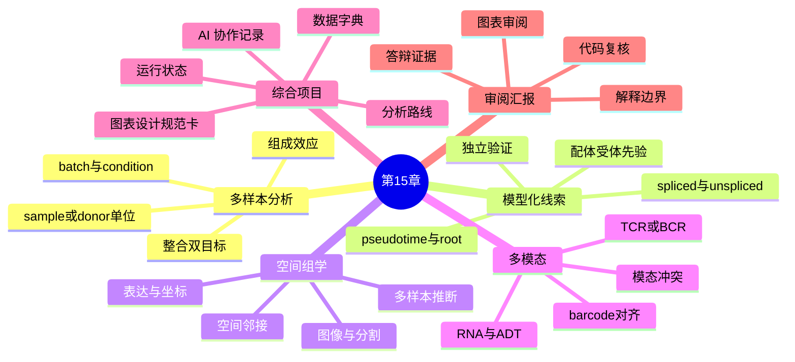

## 本章作业：进阶分析审阅报告

学生从三批次整合、骨髓拟时序、CITE-seq 质控或空间邻域中选择一项。提交项目说明书、数据字典、元数据核验表、代码或伪代码、两张图表设计规范卡、一张主图、研究解释卡和 AI 协作记录。

| 交付物 | 最低要求 |
| --- | --- |
| 项目说明书 | 问题、来源、数据类型、禁止越界内容 |
| 数据字典 | 字段、类型、单位、缺失和统计层级 |
| 代码记录 | 输入、参数、版本、seed、输出和运行状态 |
| 图表设计规范卡 | 问题、数据、编码、图注和边界 |
| 研究解释卡 | 观察、方法来源、允许解释、替代解释、验证缺口 |
| AI 协作记录 | 原始任务、AI 输出摘要、人工修改、运行结果 |

禁止把教学简化案例写成真实医学发现。禁止把 UMAP 混合、拟时序、velocity 箭头、配体受体高分、空间邻近、ADT 一致或克隆扩增直接写成机制、疗效、诊断、预后、靶点或临床建议。

## 本章小结

进阶单细胞和空间组学的共同难点，不在于图形数量，而在于对象、设计和解释是否对齐。批次整合要同时检查技术混合与生物保留；条件推断要回到 sample 或 donor；轨迹、velocity 和通讯结果要保留模型假设；空间分析要记录坐标与邻接；多模态分析要先核对 barcode 和缺失。

综合项目把这些要求变成可提交核验：数据字典说明对象，脚本和环境说明计算，图表设计规范卡说明表达，研究解释卡说明边界，AI 协作记录说明人工判断。项目结论可以有限，但证据链必须清楚。
