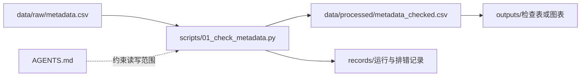
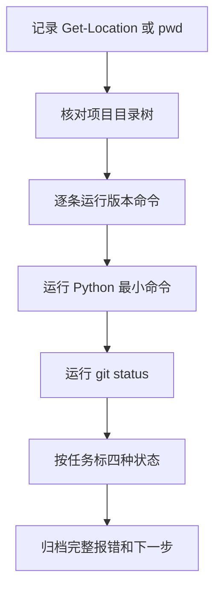
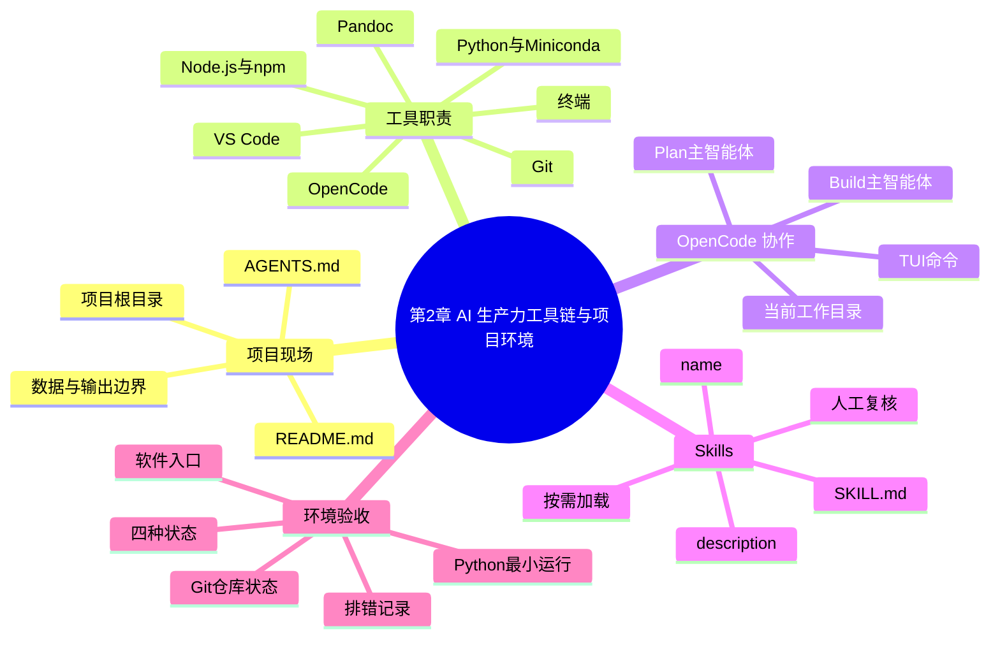

# 第2章 AI 生产力工具链与项目环境

## 本章定位

第1章说明了课程要处理哪些数据对象、回答哪些问题。真正开始上机时，学生还要先确认三件事：当前在哪个目录，哪些工具能被终端识别，运行和修改会留下什么记录。第二章处理的正是这一步。

本章的学习终点是一份环境验收包。它能让教师或同伴复核学生使用的项目目录、软件入口、最小运行结果和失败记录。第3章将在这个项目现场中编写 AI 任务说明书；第4章开始学习代码；第5章才读取和整理数据。

| 本章负责 | 交给后续章节 |
| --- | --- |
| 确认项目根目录、规则文件和输出位置 | 第3章编写目标、上下文、约束、验证和输出 |
| 检查 Git、Python 等软件入口与仓库状态 | 第3章讲版本留痕，第4章讲代码对象和语法 |
| 建立学生分析项目骨架 | 第5章读取文件并生成处理后数据 |
| 记录工具状态、真实输出和报错 | 后续各章复用运行记录与 AI 协作记录 |

## 学习目标

完成本章后，学生应能提交以下学习证据。

| 能力 | 可观察的学习证据 |
| --- | --- |
| 说明工具分工 | 一张“工具、职责、学习证据与验收方式”表 |
| 在正确目录启动 AI 工具 | 项目根目录记录和一次 OpenCode 启动记录 |
| 判断环境状态 | 软件入口检查表、Git 仓库状态和 Python 最小运行结果 |
| 理解 Skill | 一张 `SKILL.md` 阅读卡和使用边界判断表 |
| 组织项目 | 包含输入、脚本、输出、记录和规则文件的目录树 |
| 处理失败 | 一条写明命令、路径、报错、已尝试操作和下一步的排错记录 |

## 阅读指南

本章出现的软件较多，不要求学生一次掌握全部安装细节。阅读时先抓住“工具负责什么”，再看“怎样留下证据”。某个命令显示版本号，只能说明该入口当前可被终端调用；课程环境是否达标，还要结合项目路径、任务需要和最小运行结果判断。

本章案例统一使用学生分析项目 `medical-data-course/`。其中的文件和路径都是教学示例，学生应替换为本机实际路径。示例不包含真实患者数据，也不支持任何医学判断。

## 核心概念速查

| 概念 | 本章解释 | 容易混淆之处 |
| --- | --- | --- |
| 本地 AI 工作台 | 编辑器、终端、AI 助手、运行环境、版本控制和项目目录组成的工作环境 | 不等于一个聊天窗口 |
| 当前工作目录（working directory） | 终端命令和 OpenCode 默认作用的目录 | 不一定就是项目根目录 |
| 项目根目录 | 放置项目说明、规则文件和各类子目录的最高层目录 | 不等于 `data/` 或 `scripts/` 子目录 |
| 环境检查 | 查看路径、版本、仓库状态或运行结果 | 检查完成不等于环境已经通过验收 |
| 环境验收 | 按事先规定的标准判断环境能否支持当前课程任务 | 不用于证明分析或医学结论 |
| OpenCode | 在终端中读取项目上下文并协助处理文件和命令的 AI 工具 | 产品名写 `OpenCode`，命令写 `opencode` |
| Skill | 由 `SKILL.md` 定义、按需加载的可复用工作规则 | 集合或官方类别写 Skills |
| 可追溯 | 能从输出回到来源、处理步骤和记录 | 不等于可以重新运行 |
| 可复现 | 能依据输入、代码和环境记录重新运行 | 不等于结论已经被独立验证 |
| 可复核 | 他人能根据材料和标准检查过程 | 不等于复核者必须在同一电脑运行 |

## 章节总览图


## 2.1 本地 AI 工作台的基本组成

本地 AI 工作台首先是一个项目环境。编辑器让学生看见文件，终端执行命令，Python 等运行环境完成计算，Git 记录变更边界，AI 助手依据当前目录和规则协助工作。任何一项都不能单独代表完整的课程环境。

课程还要区分基础入口和按任务选用的工具。编辑器、终端、项目目录和 Python 是多数上机任务的基础。OpenCode 用于 AI 协作练习；Git 用于需要变更记录或 `/undo` 的项目；Node.js/npm、Pandoc 和特定 Skills 是否需要，要看本次任务怎样安装、运行和交付。

| 工具或对象 | 主要职责 | 学习证据 | 验收方式 |
| --- | --- | --- | --- |
| VS Code | 查看、编辑和组织项目文件 | 目录树、脚本或记录文件 | 能打开项目文件夹并保存指定文件 |
| 终端 | 执行路径、版本和运行命令 | 命令与真实输出 | 命令在项目根目录执行，输出可复制 |
| OpenCode | 读取项目上下文，辅助解释、规划和修改 | 启动记录、会话摘要、人工复核 | 能在正确目录启动，并能说明使用的主智能体 |
| Python | 执行后续数据处理代码 | 最小运行输出 | 版本命令和 `print()` 均成功 |
| Miniconda | 管理 Python 环境 | 环境名与 Python 入口记录 | 仅在课程要求 conda 时检查 |
| Git | 检查仓库状态和文件变化 | 版本输出、仓库状态 | 分开记录“已安装”和“当前目录是仓库” |
| Node.js/npm | 提供 JavaScript 运行时和包管理入口 | 版本输出 | 仅在安装方式或工具依赖它们时验收 |
| Pandoc | 转换 Markdown、Word、HTML 等文档格式 | 转换命令和导出文件 | 先检查命令，再人工核验导出内容和版式 |
| Skill | 为重复任务提供稳定检查规则 | Skill 阅读卡、调用记录 | 名称和描述匹配任务，输出经过人工复核 |

### 案例：同一句“已经安装”为什么不够

学生甲记录“已经安装 VS Code、Python 和 OpenCode”。这句话没有命令、路径和运行结果，其他人无法复核。学生乙把记录拆成三类证据，状态就清楚了。

| 检查对象 | 学生乙的记录 | 能支持的判断 |
| --- | --- | --- |
| VS Code | 能从开始菜单打开 `medical-data-course/` | 图形界面可用 |
| Python | `python --version` 有输出，`python -c` 能打印文字 | 当前终端中的 Python 入口可运行 |
| OpenCode | 在项目根目录执行 `opencode` 并进入 TUI | OpenCode 可在该目录启动 |
| 结论边界 | 尚未检查后续分析包、代码和结果 | 只支持当前任务的入口判断 |

## 2.2 OpenCode、VS Code 与终端协作

VS Code 负责呈现文件，终端负责执行命令，OpenCode 从当前工作目录取得项目上下文。启动顺序应固定为：先确认项目根目录，再启动 `opencode`，最后保存路径与会话记录。OpenCode 官方 TUI 文档说明，也可以把项目路径作为参数传入。路径判断会直接影响工具可见范围和文件写入位置。[OpenCode TUI](https://opencode.ai/docs/tui/)

### 最小启动案例

以下是 Windows PowerShell 中的教学记录。`D:\courses\medical-data-course` 只是示例路径。

```powershell
PS D:\courses\medical-data-course> Get-Location

Path
----
D:\courses\medical-data-course

PS D:\courses\medical-data-course> Get-ChildItem
PS D:\courses\medical-data-course> opencode
```

进入 TUI 前，学生应在目录列表中看到 `README.md`、`AGENTS.md`、`data/`、`scripts/`、`outputs/` 和 `records/`。若只看到下载文件或个人桌面杂项，应先退出并切换目录，不要让 AI 开始写文件。

| 步骤 | 学生要看什么 | 记录什么 |
| --- | --- | --- |
| 确认位置 | `Get-Location` 或 `pwd` 是否指向项目根目录 | 完整路径 |
| 检查结构 | 规则文件和课程目录是否存在 | 目录列表或文本树 |
| 启动工具 | `opencode` 是否进入交互界面 | 启动时间、目录、状态 |
| 开始任务 | 当前主智能体与任务风险是否匹配 | Plan 或 Build 及选择理由 |
| 结束记录 | 文件是否写入约定目录 | 会话摘要、人工修改和未解决事项 |

### Plan 与 Build 是主智能体

OpenCode 当前内置两个可直接交互的主智能体（primary agents）：Plan 和 Build。Plan 主要用于分析和规划，默认对写文件和执行命令设置限制或询问；Build 面向需要文件操作和系统命令的任务。两者不是泛指“想一想”和“做一做”的普通模式。[OpenCode Agents](https://opencode.ai/docs/agents/)

| 主智能体 | 适合本章的任务 | 学生仍要负责什么 |
| --- | --- | --- |
| Plan | 阅读目录、解释命令、列出验收步骤、审阅排错记录 | 判断建议是否符合课程规则 |
| Build | 在明确路径和权限后创建目录或写入记录文件 | 查看改动范围，核对真实输出，不允许修改原始数据 |

环境不明、目录未确认或任务边界模糊时，先用 Plan。需要 Build 时，应先写清允许修改的目录和交付文件。第3章会系统训练 AI 任务说明书，本章只要求学生能说明为什么选择某个主智能体。

### 本章需要了解的 TUI 命令

| 命令 | 用途 | 条件与边界 |
| --- | --- | --- |
| `/help` | 查看当前 TUI 可用命令 | 以本机界面为准 |
| `/new` | 新建会话 | 新会话仍继承启动目录的项目范围 |
| `/sessions` | 查看和切换会话 | 会话存在不等于任务已经归档 |
| `/undo` | 撤销最近消息及其后续文件改动 | 内部依赖 Git，项目必须是 Git 仓库 |

Skills 不通过旧教程中的技能列表斜杠命令加载。当前官方机制由原生 `skill` 工具按需加载，本章在2.4节说明。若本机教程、截图与当前 `/help` 列表不一致，应保存实际界面并标 `需人工确认`。

## 2.3 Git、Node.js、Miniconda 与 Pandoc

版本命令回答的是“终端能否找到这个入口”。课程还要继续问：当前目录是否满足工具的工作条件，最小任务是否能运行。下表把三类判断分开。

| 判断层级 | 例子 | 结论边界 |
| --- | --- | --- |
| 软件入口可用 | `git --version`、`python --version` 有输出 | 只说明命令可被调用 |
| 当前目录状态合适 | `git status` 能返回仓库状态 | 只说明这里是 Git 仓库 |
| 课程环境可以运行 | Python 最小命令成功，项目目录和输出路径可写 | 只支持当前最小任务，不代表后续包齐全 |

### 版本检查命令

学生应逐条运行，逐条记录。把多条命令粘在一行，容易看不出究竟哪一项失败。

```powershell
git --version
node --version
npm --version
opencode --version
code --version
conda --version
python --version
pandoc --version
```

各项不必全部判为“通过”。例如课程机器已经预装 OpenCode，就不一定需要学生使用 npm；本章不要求文档转换时，Pandoc 可以标为“不适用”。只有当前任务需要、入口又不可用的项目，才标为“待配置”。

### Git：已安装不等于当前目录是仓库

先执行 `git --version`。若能看到版本信息，说明 Git 入口可用。再在项目根目录执行 `git status`。若出现下面的报错，两个判断必须分开记录。

```text
fatal: not a git repository (or any of the parent directories): .git
```

这条报错说明 Git 已经运行，但当前目录不是 Git 仓库，或学生尚未进入仓库目录。它不支持“Git 没装好”的结论。是否需要初始化仓库由教师或项目规则决定，本章不要求学生自行执行 `git init`。

| 检查项 | 可能状态 | 记录示例 |
| --- | --- | --- |
| `git --version` | 通过 | Git 命令可识别 |
| `git status` | 待配置或不适用 | 当前项目不是仓库，需按教师要求处理 |
| `/undo` | 不适用 | 当前目录非仓库，不把它作为回退方案 |

### Node.js 与 npm：按安装方式判断是否需要

Node.js 是 JavaScript 运行时，npm 是常见的包管理入口。某些 OpenCode 安装方式会用到 npm，但这不表示所有课程任务都要学习 JavaScript。若 OpenCode 已通过其他方式安装并能正常启动，本章可把 Node.js/npm 记录为“不适用”，同时注明理由。

### Miniconda 与 Python：管理环境和运行代码是两件事

Miniconda 用于创建和管理 Python 环境，`python` 才执行本章的最小代码。`conda --version` 失败时，应继续检查 `python --version`。可能出现 Python 可用而 conda 未初始化，也可能出现终端调用了另一套 Python；两者都要记录，不能直接猜测。随后运行下面的命令，检查当前 Python 能否执行最小程序。

```powershell
python -c "print('欢迎来到医药数据处理与可视化')"
```

预期输出为：

```text
欢迎来到医药数据处理与可视化
```

该结果只证明当前终端可以运行这条 Python 命令。它没有检查 pandas、matplotlib、R、Jupyter 或任何组学软件，第4章以后会按任务继续检查。

### Pandoc：转换完成后仍要核验文档

Pandoc 可在多种文档格式之间转换。`pandoc --version` 通过后，学生仍需检查输出文件能否打开、中文是否正常、表格和图片是否完整、内容是否与源文件一致。格式转换成功不能代替内容复核。

| 工具 | 入口通过能证明什么 | 仍未证明什么 |
| --- | --- | --- |
| Python | 当前解释器能执行本章最小命令 | 后续分析包齐全、代码正确 |
| Pandoc | 终端能调用转换程序 | 导出内容准确、版式合格 |

## 2.4 Skills 的安装、调用与课程使用边界

Skill 是一套可复用的 AI 工作规则。每个 Skill 放在独立目录中，核心文件必须命名为 `SKILL.md`。当前 OpenCode 文档规定，`name` 和 `description` 是必填字段；系统先发现名称与描述，任务相关时再通过原生 `skill` 工具加载完整内容。[OpenCode Agent Skills](https://opencode.ai/docs/skills/)

学生本章只需看懂最小结构，不负责开发复杂 Skill。以下示例用于检查课程环境验收包是否包含真实命令、输出、状态和待确认事项。

```markdown
---
name: course-evidence-check
description: Check a course environment package for commands, actual outputs, status labels, and unresolved items.
---

# Course evidence check

1. Read the stated course task and acceptance criteria.
2. Check whether each status has a command or observable record.
3. Separate actual output from expected output.
4. Mark unsupported claims as `需人工确认`.
5. Return a concise missing-item table.
```

| 部分 | 学生要读懂什么 | 本例中的含义 |
| --- | --- | --- |
| `name` | Skill 的稳定名称 | `course-evidence-check` |
| `description` | 做什么、何时使用 | 审阅环境验收包中的证据缺口 |
| 正文步骤 | 加载后按什么顺序工作 | 先读标准，再查输出和状态 |
| 输出边界 | 哪些判断不能自动完成 | 不能编造运行结果，不能替代教师确认 |

### 按需加载怎样理解

OpenCode 会把可用 Skills 的名称和描述提供给智能体。智能体判断当前任务匹配时，调用原生 `skill` 工具读取对应 `SKILL.md`。学生通常在任务中写“请使用 `course-evidence-check` 审阅这份环境验收包”，不需要把 Skill 全文反复粘贴，也不应假设所有 Skills 已经加载。

| 场景 | 是否适合使用该 Skill | 原因 |
| --- | --- | --- |
| 检查版本表是否有真实输出 | 适合 | 规则稳定，字段明确 |
| 检查“待配置”项是否说明阻塞范围 | 适合 | 可按统一标准审阅 |
| 判断患者数据能否上传外部服务 | 不适合单独决定 | 涉及授权、隐私和机构规则 |
| 判断某药物是否有效 | 不适合 | 缺少研究设计、数据和医学证据 |
| 确认统计方法是否适合后续研究 | 只能辅助列问题 | 最终判断需结合设计、数据和课程要求 |

### 最小运行案例：审阅一条验收记录

假设学生提交：“Python 已通过，因为电脑上装过 Miniconda。”课程核验 Skill 应指出，记录缺少 `python --version` 和最小运行输出。它可以建议补做检查，但不能把预期输出写成真实结果。

| 原记录 | Skill 可指出的问题 | 学生补充后再判定 |
| --- | --- | --- |
| Python 已通过 | 没有命令和实际输出 | 运行版本命令与 `print()`，保存输出 |
| Git 不可用 | 未区分软件入口和仓库状态 | 分别运行 `git --version` 与 `git status` |
| 所有环境已完成 | Pandoc 对当前任务是否必要不清楚 | 说明本次任务需要，再选状态 |

Skill 的输出属于检查建议。学生要回到本机执行命令，教师或同伴再根据证据复核。医学、统计、组学和隐私判断仍由人负责。

## 2.5 课程项目目录、规则文件与输出约定

本章使用学生分析项目作为主案例。项目目录把原始输入、处理脚本、结果和过程记录分开，既能减少误覆盖，也让 AI 的可读写范围更清楚。

```text
medical-data-course/
├── README.md
├── AGENTS.md
├── data/
│   ├── raw/
│   └── processed/
├── scripts/
├── outputs/
├── records/
└── references/
```

| 路径 | 用途 | 基本规则 |
| --- | --- | --- |
| `README.md` | 说明项目目的、数据边界和启动方式 | 新成员先读，内容保持简明 |
| `AGENTS.md` | 记录长期有效的 AI 协作规则 | 写稳定规则，不放一次性作业要求 |
| `data/raw/` | 保存教师提供或获准使用的原始数据 | 只读，不覆盖，不放 AI 生成文件 |
| `data/processed/` | 保存脚本生成的分析表 | 每个文件能回到输入和脚本 |
| `scripts/` | 保存 Python、R 或其他处理脚本 | 文件名说明任务，避免 `final2.py` |
| `outputs/` | 保存图表、表格和报告 | 产物名称说明内容，不只写 `output` |
| `records/` | 保存环境、运行、排错和 AI 协作记录 | 记录真实命令、输出与未解决事项 |
| `references/` | 保存数据字典、任务说明和允许使用的参考材料 | 不把参考材料写成运行结果 |

### README.md 与 AGENTS.md 分工

`README.md` 面向项目使用者，回答项目做什么、怎样开始、主要目录在哪里。`AGENTS.md` 面向参与文件操作的 AI 工具和协作者，说明不能改什么、输出写到哪里、怎样验收。两者可以共享少量信息，但职责不同。

下面是一份最小规则示例。真实项目可按课程要求补充，不能照抄后就认为规则已经适合所有数据。

```markdown
# Project Rules

- Read `README.md` before changing files.
- Treat `data/raw/` as read-only.
- Write generated tables to `data/processed/`.
- Write figures and reports to `outputs/`.
- Store commands, actual outputs, and errors in `records/`.
- Do not upload human or clinical data without explicit permission.
- Mark uncertain claims as `需人工确认`.
```

### 一个文件怎样流过项目

第5章以后，学生可能从 `data/raw/metadata.csv` 读取元数据（metadata），由 `scripts/01_check_metadata.py` 进行字段检查，再把处理后表写入 `data/processed/metadata_checked.csv`。图表和报告进入 `outputs/`，命令与报错进入 `records/`。



本章只验收目录和规则，不读取 `metadata.csv`，也不讨论缺失值、异常值或清洗方法。这样能把环境问题与数据问题分开：目录缺失在本章处理，字段含义和数据质量留给第5章。

### 项目目录验收记录

| 检查项 | 通过标准 | 常见状态 |
| --- | --- | --- |
| 根目录 | `README.md` 与 `AGENTS.md` 位于同一层 | 通过或待配置 |
| 原始数据边界 | `data/raw/` 存在且规则写明只读 | 通过或待配置 |
| 脚本与处理后数据 | `scripts/` 与 `data/processed/` 分开 | 通过或待配置 |
| 结果与记录 | `outputs/` 与 `records/` 分开 | 通过或待配置 |
| 参考材料 | `references/` 用途明确 | 通过或不适用 |

## 2.6 环境验收、路径检查与常见排错

环境验收要依据当前任务。学生先检查路径和目录，再检查软件入口，随后运行 Python 最小案例和 Git 状态检查，最后把真实结果写入 `records/environment-check.md`。没有证据的“应该可以”不能判为通过。

### 四种状态

| 状态 | 使用条件 | 示例 |
| --- | --- | --- |
| 通过 | 当前任务需要，且检查达到预定标准 | Python 版本命令和最小运行均成功 |
| 待配置 | 当前任务需要，但入口、路径或权限尚未满足 | OpenCode 无法在项目目录启动 |
| 不适用 | 当前任务不需要该工具或功能 | 本次不转换文档，Pandoc 不适用 |
| 需人工确认 | 现有信息不能判断，或涉及教师、管理员、授权方决定 | 是否初始化 Git 仓库、数据能否上传 |

### 环境验收顺序



### 环境验收表

| 项目 | 检查动作 | 通过标准 | 状态 | 证据或备注 |
| --- | --- | --- | --- | --- |
| 当前工作目录 | `Get-Location` 或 `pwd` | 指向项目根目录 | 待填写 | 记录完整路径 |
| 目录结构 | 查看根目录 | 必需文件和目录存在 | 待填写 | 保存文本树 |
| VS Code | 打开项目文件夹；可选 `code --version` | 图形界面能读写指定文件 | 待填写 | CLI 失败时另查图形界面 |
| OpenCode | `opencode --version` 或启动 TUI | 能在项目根目录启动 | 待填写 | 记录目录与主智能体 |
| Git 入口 | `git --version` | 命令可识别 | 待填写 | 不等于当前目录是仓库 |
| Git 仓库 | `git status` | 返回仓库状态 | 待填写 | 非仓库时记录完整报错 |
| Node.js/npm | 运行版本命令 | 当前任务需要时可识别 | 待填写 | 不需要时填不适用 |
| conda | `conda --version` | 教师要求 conda 时可识别 | 待填写 | 与 Python 分开判断 |
| Python | 版本命令与 `python -c` | 两条命令均成功 | 待填写 | 保存真实输出 |
| Pandoc | `pandoc --version` | 当前任务需要转换时可识别 | 待填写 | 导出后仍要人工核验 |

### 运行案例一：Python 最小命令通过

```powershell
PS D:\courses\medical-data-course> python -c "print('欢迎来到医药数据处理与可视化')"
欢迎来到医药数据处理与可视化
```

这条记录可以把 Python 最小运行标为“通过”。若只运行了 `python --version`，还不能确认解释器能执行本章命令；若解释器成功但后续导入 pandas 失败，也不能反过来否定本章最小运行结果。

### 运行案例二：Git 返回非仓库报错

```powershell
PS D:\courses\medical-data-course> git --version
git version <本机版本>

PS D:\courses\medical-data-course> git status
fatal: not a git repository (or any of the parent directories): .git
```

验收表应把“Git 入口”记为通过，把“Git 仓库”记为待配置、不适用或需人工确认，具体取决于课程是否要求该项目使用 Git。学生不应把两项合并成“Git 失败”。

### 运行案例三：`code` 命令不可识别

若 `code --version` 报错，但 VS Code 能从开始菜单打开项目文件夹，当前可判断图形界面可用，命令行入口尚未配置。若作业只要求在 VS Code 中编辑文件，状态可以写“通过，CLI 待配置”；若后续脚本依赖 `code` 命令，再把该项列为待配置。

### 排错记录样例

| 字段 | 学生记录 |
| --- | --- |
| 任务 | 检查当前目录是否为 Git 仓库 |
| 当前工作目录 | `D:\courses\medical-data-course` |
| 命令 | `git status` |
| 完整报错 | `fatal: not a git repository (or any of the parent directories): .git` |
| 已尝试操作 | 运行 `git --version`，确认 Git 入口可用；重新核对当前工作目录 |
| 暂时判断 | 当前目录不是 Git 仓库，未判断是否应初始化 |
| 当前状态 | `需人工确认` |
| 下一步 | 查看课程规则或询问教师是否需要仓库，不自行初始化 |

排错时先保存现场，再处理问题。频繁重装、反复使用管理员权限或只截取报错最后一行，都会丢失判断依据。对环境问题，完整命令、当前工作目录和报错通常比一句“打不开”更有用。

### 后续组学学习边界

RNA-seq 课程可能涉及 SRA、FASTQ、FastQC、计数矩阵和样本元数据。本章只确认项目能记录这些输入及授权条件，不下载 SRA 数据，不运行 FastQC，也不解释测序质量指标。

| 后续对象 | 本章只记录什么 | 本章不做什么 |
| --- | --- | --- |
| SRA 或 FASTQ | 数据来源、许可、文件大小和存放位置 | 不把下载成功作为通用环境标准 |
| FastQC | 是否为后续任务所需，运行条件是否明确 | 不解释质量图或给出过滤阈值 |
| 计数矩阵与元数据 | 预留 `data/`、`references/` 和记录位置 | 不开展标准化或差异表达 |
| 人源或临床数据 | 是否获准本地保存、联网或上传 | 未获明确许可时不交给外部 AI |

## 案例任务：提交环境验收包

学生以 `medical-data-course/` 为根目录完成一次环境验收。软件暂未配置可以如实记录，评分重点是路径、证据和判断是否一致。

| 交付文件 | 最低内容 |
| --- | --- |
| `records/path-check.md` | 项目根目录、目录树、缺失项 |
| `records/environment-check.md` | 检查命令、实际输出摘要、四种状态、备注 |
| `records/python-smoke-test.txt` | Python 最小命令和真实输出 |
| `records/troubleshooting.md` | 至少一条失败、不适用或待确认项的记录 |
| `AGENTS.md` | 原始数据只读、输出位置、记录要求和隐私边界 |

## 图表建议

| 图表或表格 | 教学用途 | 必备信息 | 不能代替什么 |
| --- | --- | --- | --- |
| 工具职责表 | 区分软件角色 | 工具、职责、学习证据、验收方式 | 不能代替实际运行 |
| 项目目录树 | 展示读写边界 | 根目录、输入、脚本、输出、记录 | 不能证明数据质量 |
| 环境验收表 | 记录当前状态 | 命令、输出、状态、备注 | 不能证明分析正确 |
| 排错记录表 | 保存失败现场 | 路径、完整报错、尝试、下一步 | 不能自动给出唯一原因 |

## AI 协作点

| 场景 | AI 可以协助什么 | 学生必须核验什么 |
| --- | --- | --- |
| 解释版本命令 | 说明命令用途和可能输出 | 输出是否来自本机真实运行 |
| 审阅目录树 | 找出缺失目录和读写冲突 | 项目规则是否确实这样规定 |
| 整理排错记录 | 把零散信息整理成固定字段 | 命令、路径和报错是否被改写 |
| 调用课程核验 Skill | 检查证据字段是否齐全 | Skill 是否适合任务，结论是否越界 |
| 处理组学前置问题 | 列出输入、授权和资源缺口 | 数据能否使用、联网或上传 |

AI 不能把预期输出写成实际输出，也不能替学生确认隐私授权、仓库初始化、软件许可或医学解释。工具建议与本机结果不一致时，以真实输出和课程规则为准，并保留差异记录。

## 常见误区

| 误区 | 问题 | 修正方式 |
| --- | --- | --- |
| 看到版本号就写“环境全部通过” | 只检查了命令入口 | 再查项目路径、最小运行和任务需要 |
| 在桌面或下载目录直接启动 OpenCode | AI 可见范围和写入位置不清楚 | 先进入项目根目录 |
| 把 Plan 与 Build 称为普通模式 | 混淆官方智能体类型 | 写成内置主智能体并说明权限差异 |
| 用旧教程中的斜杠命令检查 Skills | 当前官方机制不采用这种加载方式 | 依据 `skill` 工具的按需加载机制 |
| `git status` 报错就重装 Git | 非仓库报错与安装状态不同 | 先运行 `git --version`，再判断目录 |
| 原始数据和处理后表放在一起 | 容易覆盖来源，难以追溯 | 分开 `data/raw/` 与 `data/processed/` |
| AI 给出排错步骤后直接写“已解决” | 没有真实复测 | 重新运行原命令并保存输出 |

## 核验清单

- [ ] 六个小节标题与根目录 `大纲.md` 一致。
- [ ] 正文产品名写 `OpenCode`，CLI 命令写 `opencode`。
- [ ] Plan 与 Build 写为内置主智能体。
- [ ] Skills 说明采用原生 `skill` 工具按需加载。
- [ ] `git --version` 与 `git status` 分开判断。
- [ ] Python 只运行最小命令，没有提前读取数据。
- [ ] 学生项目包含 `README.md`、`AGENTS.md`、`data/`、`scripts/`、`outputs/`、`records/` 和 `references/`。
- [ ] 环境状态只使用“通过、待配置、不适用、需人工确认”。
- [ ] RNA-seq、SRA 和 FastQC 只作为后续学习边界。
- [ ] 正文没有把软件入口、AI 输出或预期结果写成已经验证的科学结论。

## 知识结构与知识图谱生成提示词



如需生成课堂展示图，可使用下面的提示词。生成图仅用于教学展示，准确结构以本章 Mermaid、表格和清单为准。

```text
请生成一张中文教学信息图，主题为“学生分析项目的本地 AI 工作台”。
中心显示 medical-data-course 项目根目录。
左侧显示 VS Code、终端和 OpenCode，标出“看文件、跑命令、按项目上下文协作”。
右侧显示 Python、Git、Miniconda、Node.js/npm 和 Pandoc，标出各自职责。
下方显示 README.md、AGENTS.md、data/raw、data/processed、scripts、outputs、records、references。
流程为“确认路径 -> 检查入口 -> 最小运行 -> 判断状态 -> 保存记录”。
不得添加医学结论、软件版本号或无法辨认的小字。
```

若生成图中文字错误、节点缺失或关系不清，应以正文结构为准，并标 `需人工确认` 后再修改。

## 实验或作业

### 基础任务

1. 建立 `medical-data-course/` 项目骨架。
2. 填写环境验收表，逐条记录当前工作目录、版本命令和 Python 最小运行。
3. 分开记录 Git 软件入口与仓库状态。
4. 使用 Plan 审阅验收包缺口；如需写文件，再在明确路径和范围后使用 Build。
5. 提交一条排错记录，即使所有必需项通过，也可记录一个“不适用”项目及其理由。

### 评分证据

| 项目 | 分值 | 评分重点 |
| --- | ---: | --- |
| 项目路径与目录树 | 20 | 根目录明确，目录职责正确 |
| 环境验收表 | 30 | 命令、实际输出、状态和备注一致 |
| Python 与 Git 案例 | 20 | 最小运行真实，仓库状态判断准确 |
| 排错记录 | 20 | 保留完整现场，下一步可执行 |
| AI 协作与边界 | 10 | 说明主智能体或 Skill 用途，未编造结果 |

禁止提交他人电脑的版本输出，禁止把示例输出当作本机结果，禁止上传未获许可的人源或临床数据，禁止让 AI 代写不存在的运行记录。

## 需补证据

| 位置 | 当前缺口 | 处理方式 |
| --- | --- | --- |
| 课程统一 Python 环境 | 环境名和最低版本尚未由项目材料固定 | 教师课前发布，学生按实际命令记录 |
| 课程是否统一启用 Git | 不同教学场景可能使用非仓库目录 | 由教师决定，未决定时标 `需人工确认` |
| OpenCode 提供方与模型 | 取决于机房、账户和网络配置 | 以课堂说明和本机界面为准 |
| Pandoc 导出模板 | 中文 Word/PDF 样式尚未统一 | 后续文档交付任务单独核验 |
| 组学实操环境 | SRA、FastQC 和数据授权不属于本章验收 | 到相应组学章节再配置和检查 |

## 统一课程融合接口

课程项目采用“受限原始层、工作层和公开输出层”三层结构。受限层保留原始文件和哈希，工作层保存脱敏数据与脚本，公开层只接收已经通过隐私、凭据和授权检查的教材产物。可复现并不要求公开所有原始材料，而是让有权限的人能够追踪来源、版本、处理和输出。

| 检查对象 | AI可提出的检查项 | 学生或教师的最终判断 | 保存证据 |
| --- | --- | --- | --- |
| 文件与目录 | 命名、重复、路径和缺失文件 | 哪些文件属于受限层 | 文件清单与目录快照 |
| 来源与完整性 | checksum核对步骤 | 哈希是否对应当前文件 | SHA-256记录 |
| 凭据与隐私 | 敏感字段类别和脱敏规则 | 是否轮换、删除或阻断发布 | 不含原值的安全审计 |
| 图片与许可 | 待查来源和授权状态 | 是否允许公开或需要重绘 | 图片授权清单 |
| 脚本与环境 | 输入、输出、依赖和路径风险 | 是否改用环境变量并离线运行 | 静态审计与环境记录 |

本章的NGS内容只用于理解项目结构和数据来源。学生不执行移交包脚本，不接触课程平台凭据，也不把服务器配置作为必修学习目标。
