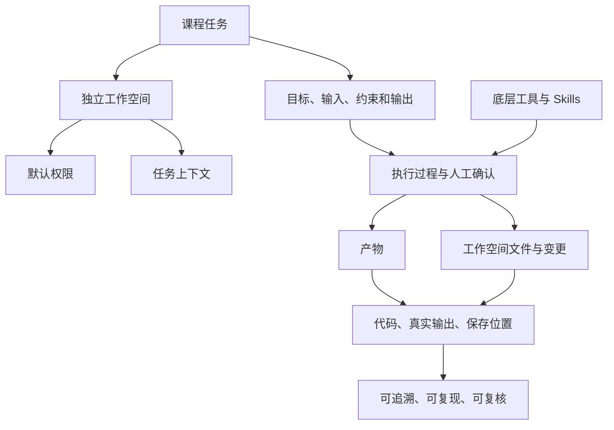

# 第2章 AI 生产力工具链与项目环境

## 本章定位

本章建立课程上机任务的共同工作环境。重点是识别工作空间、给任务补充上下文、控制文件权限、核对执行过程，并保存能够复核的结果。WorkBuddy 是课程统一使用的前台平台；Python、R、Git、Miniconda、Node.js 和 Pandoc 按任务作为底层工具调用。

本章的学习终点是一份环境验收包。它应记录工作空间位置、任务输入、权限范围、真实输出、产物位置和失败信息。后续章节在同一框架内编写任务说明、运行代码和处理数据。

## 学习目标

完成本章后，读者应能：

1. 说明 WorkBuddy、工作空间与底层工具的分工。
2. 为课程任务选择独立工作空间，并确认可读写范围。
3. 通过引用文件或上传材料补充任务上下文。
4. 按“目标、输入、约束和输出”描述一个任务。
5. 查看执行过程、人工确认事项、产物和文件变更。
6. 检查代码、真实输出和保存位置，形成可复核记录。
7. 识别 Skills 的来源、启用状态和权限风险。

## 阅读指南

本章不要求一次掌握所有工具的安装细节。先确认当前任务需要什么，再检查相应入口。软件显示版本号，只能说明当前入口可用；课程环境是否通过验收，还要结合工作空间、权限、最小运行结果和产物位置判断。

示例工作空间统一写作 `medical-data-course/`。实际操作应使用本机真实路径。示例不包含真实患者数据，也不支持医学判断。

## 核心概念速查

| 概念 | 本章含义 | 检查重点 |
| --- | --- | --- |
| WorkBuddy | 课程统一使用的 AI 任务前台，可在用户授权的工作空间内处理文件、执行多步骤任务并生成可检查的产物 | 当前任务、权限、执行过程、结果与变更 |
| 工作空间（workspace） | 一个任务可以读取和写入的项目目录 | 路径是否独立，是否包含原始数据以外的可写位置 |
| 任务上下文 | AI 完成任务时能够看到的文件、上传材料、规则和说明 | 来源是否明确，是否混入无关或敏感材料 |
| 产物（artifact） | 任务生成并需要交付或核验的文件 | 内容、格式、保存位置和可打开性 |
| 变更（changes） | 任务对工作空间文件造成的新增或修改 | 范围是否符合授权，原始数据是否保持不变 |
| 默认权限 | 平台初始提供的受限操作范围 | 每次扩大权限前确认对象、路径和必要性 |
| Skill | 为特定任务提供可复用操作规则的能力组件 | 来源、用途、启用状态和权限风险 |
| 可追溯 | 能从结果回到输入、处理步骤和记录 | 不等于能够重新运行 |
| 可复现 | 能依据输入、代码和环境记录重新运行 | 不等于结论已经独立验证 |
| 可复核 | 他人能依据材料和标准检查过程 | 不要求在同一电脑上重复全部计算 |

## 章节总览图


## 2.1 本地 AI 工作台的基本组成

本地 AI 工作台由前台平台、工作空间、底层工具和运行记录组成。WorkBuddy 负责接收任务、组织上下文、展示执行过程和结果。Python、R 等工具负责实际计算，Git 记录文件变化，Pandoc 处理文档转换。各工具是否使用，由任务需要决定。

| 层级 | 对象 | 主要作用 | 最小核验 |
| --- | --- | --- | --- |
| 前台平台 | WorkBuddy | 接收任务、调用工具、展示过程与结果 | 能识别当前工作空间并显示产物 |
| 项目现场 | 工作空间、规则文件、输入与输出目录 | 限定任务上下文和读写范围 | 路径明确，原始数据目录只读 |
| 计算工具 | Python、R、Node.js 等 | 运行脚本或处理数据 | 记录版本和最小运行结果 |
| 版本与文档工具 | Git、Pandoc | 检查变更或转换文档 | 保存状态或导出检查结果 |
| 能力组件 | Skills | 为特定任务提供操作规则 | 核对来源、状态和权限 |
| 运行记录 | 任务说明、日志、结果清单 | 支持追溯、复现和复核 | 能回到输入、步骤、输出和异常 |

VS Code 与独立终端可以用于查看文件或排错，但不构成课程必修流程。需要检查脚本、读取日志或执行诊断命令时再使用，并把关键结果带回任务记录。

### 案例：同一句“环境已经装好”为何不能验收

“WorkBuddy、Python 和 Git 已安装”没有说明工作空间、权限和运行结果，无法支持验收。可复核记录应拆成三类证据：

| 对象 | 记录 | 允许判断 |
| --- | --- | --- |
| WorkBuddy | 当前工作空间路径、一次任务结果和产物位置 | 平台能在该空间内完成最小任务 |
| Python | 版本、解释器路径和一次真实输出 | 当前入口能运行课程脚本 |
| Git | 版本与当前目录状态 | Git 可用；当前目录是否为仓库需另行判断 |

## 2.2 WorkBuddy 工作空间、任务对话与结果核验

每个课程任务使用独立工作空间。不要把桌面、下载目录或包含大量个人文件的目录直接作为工作空间。工作空间至少应区分输入、脚本、输出和记录，原始数据保持只读。

### 稳定操作顺序

1. 选择或创建独立工作空间。
2. 使用默认权限，确认平台可读写的路径。
3. 通过引用文件或上传材料补充上下文。
4. 写清目标、输入、约束和输出要求。
5. 查看执行过程以及需要人工确认的操作。
6. 在结果区核对产物、工作空间文件和变更。
7. 检查代码、真实输出和保存位置。

界面按钮和菜单位置可能随版本变化。本书只保留上述操作逻辑；具体界面以课程使用时的官方文档和本机版本为准。

### 任务对话的四项骨架

| 字段 | 要回答的问题 | 示例 |
| --- | --- | --- |
| 目标 | 这次要完成什么 | 检查环境并生成验收表 |
| 输入 | 依据哪些文件或材料 | `README.md`、`AGENTS.md`、版本输出 |
| 约束 | 哪些内容不能改，哪些结论不能写 | 不修改原始数据；不推断医学结论 |
| 输出 | 交付什么，保存到哪里 | `outputs/environment-check.md` |

### 权限与人工确认

默认权限用于限制任务的初始操作范围。需要扩大权限时，先确认对象、路径和必要性。涉及原始数据、个人信息、外部发送、安装软件或大范围改写时，应暂停并由人决定。

| 操作 | 默认处理 | 人工检查 |
| --- | --- | --- |
| 阅读工作空间内课程规则 | 允许 | 文件是否为当前任务版本 |
| 写入指定输出目录 | 在明确路径后执行 | 新增和修改文件是否符合任务 |
| 修改原始数据 | 不执行 | 如确有必要，复制到处理区后操作 |
| 访问工作空间外文件 | 不默认授权 | 路径、敏感性和必要性 |
| 安装或启用 Skill | 先核对来源 | 权限、用途和停用方式 |
| 外发数据或内容 | 不默认执行 | 数据权限、隐私和许可 |

### 结果核验

任务显示“完成”不等于结果已经通过验收。结果区、工作空间和文件内容要相互对应。

| 核验对象 | 检查问题 |
| --- | --- |
| 产物 | 文件是否存在、能否打开、格式是否符合要求 |
| 工作空间文件 | 新增和修改是否都在授权范围内 |
| 代码 | 输入路径、关键参数和输出路径是否明确 |
| 真实输出 | 数字、图表和日志是否来自实际运行 |
| 保存位置 | 报告中记录的路径是否与文件一致 |
| 解释边界 | 观察、计算、统计和医学解释是否分开 |

## 2.3 Git、Node.js、Miniconda 与 Pandoc

这些工具按任务调用，不是 WorkBuddy 的固定前置条件。验收表应允许填写“适用”“不适用”或“待配置”，并说明理由。

| 工具 | 适用任务 | 最小检查 | 不应据此声称 |
| --- | --- | --- | --- |
| Git | 需要版本留痕或变更比较 | 版本、仓库状态、变更清单 | 文件内容正确或结论可靠 |
| Node.js/npm | 脚本或具体工具明确依赖 JavaScript 运行时 | 版本与最小命令 | 所有课程任务都需要 |
| Miniconda | 需要隔离 Python/R 环境 | 环境名、解释器路径、关键包 | 环境能自动保证复现 |
| Pandoc | Markdown、Word、HTML 等格式转换 | 版本、一次转换和人工检查 | 导出内容与版式无需复核 |

### Git：已安装与当前目录是仓库要分开

```powershell
git --version
git status
```

第一条只检查 Git 入口。第二条检查当前目录是否为仓库，并显示工作区状态。报错也应原样记录，不能改写成“未安装”。

### Python 与 Miniconda：记录实际解释器

```powershell
python --version
python -c "print('environment ok')"
```

若课程使用 conda，还应记录环境名和 Python 路径。版本号与真实输出来自本机运行，教材不预填固定数值。

### Pandoc：导出后还要看内容

转换成功只说明命令执行完成。标题层级、表格、图片、公式和分页仍需人工打开检查。

## 2.4 Skills 的安装、调用与课程使用边界

Skill 为特定任务提供可复用规则。课程使用时关注五件事：从哪里获得、是否安装、是否启用、需要什么权限、何时停用或移除。产品界面和市场分类可能变化，不写成固定按钮路径。

| 检查项 | 问题 |
| --- | --- |
| 来源 | 是否来自课程指定位置或能够追溯的发布者 |
| 用途 | 描述是否与当前任务一致 |
| 状态 | 是否已安装、启用或停用 |
| 权限 | 是否要求读取额外目录、写文件、运行命令或联网 |
| 输出 | 是否能生成可检查的文件、记录或建议 |
| 退出 | 任务结束后是否需要停用或移除 |

Skill 输出仍需人工核验。它可以检查格式、列出缺口或执行重复流程，不能替代研究问题定义、证据判断、医学解释和最终责任。

### Skill 使用记录

| 字段 | 记录内容 |
| --- | --- |
| Skill 名称 | 以当前平台显示为准 |
| 来源与核验日期 | 发布页面或课程指定文件及日期 |
| 调用任务 | 为什么需要它 |
| 读取或写入范围 | 实际授权路径 |
| 关键输出 | 产物或建议摘要 |
| 人工核验 | 接受、修改或拒绝了什么 |
| 当前状态 | 启用、停用或已移除 |

## 2.5 课程项目目录、规则文件与输出约定

课程项目使用固定目录，减少路径混乱。具体文件可按任务增减，但输入、处理、输出和记录应能区分。

```text
medical-data-course/
├─ README.md
├─ AGENTS.md
├─ data/
│  ├─ raw/
│  └─ processed/
├─ scripts/
├─ outputs/
└─ records/
```

| 位置 | 作用 | 边界 |
| --- | --- | --- |
| `README.md` | 说明项目目标、数据和运行入口 | 不代替详细运行记录 |
| `AGENTS.md` | 规定 AI 的工作范围与项目约定 | 内容需与当前项目一致 |
| `data/raw/` | 保存原始输入 | 默认只读 |
| `data/processed/` | 保存清洗或转换后的数据 | 记录生成脚本和时间 |
| `scripts/` | 保存可运行代码 | 不把关键步骤只留在对话中 |
| `outputs/` | 保存表格、图和报告 | 文件名体现内容 |
| `records/` | 保存运行、环境和 AI 协作记录 | 只保留影响复核的内容 |

路径写法要与实际系统一致。报告中同时记录人能读懂的相对位置和必要的绝对路径，避免只写“保存好了”。

## 2.6 环境验收、路径检查与常见排错

环境验收应围绕当前任务。没有用到的工具可标为“不适用”；任务需要但入口或权限不满足的项目标为“待配置”。

| 状态 | 含义 |
| --- | --- |
| 通过 | 已有真实输出，满足当前任务标准 |
| 待配置 | 当前任务需要，但入口、路径或权限尚未满足 |
| 不适用 | 当前任务不需要，并已说明理由 |
| 需人工确认 | 涉及权限、隐私、许可或专业判断 |

### 最小验收表

| 对象 | 验收动作 | 当前状态 | 证据位置 |
| --- | --- | --- | --- |
| WorkBuddy | 在独立工作空间完成最小任务并检查结果 | 待填写 | 任务记录与产物路径 |
| 工作空间 | 检查输入、脚本、输出和记录目录 | 待填写 | 目录树 |
| 权限 | 确认默认可读写范围 | 待填写 | 权限记录 |
| Python/R | 运行课程需要的最小代码 | 待填写 | 版本与真实输出 |
| Git | 按任务检查版本和仓库状态 | 待填写 | 状态记录 |
| Skills | 核对来源、状态和权限 | 待填写 | Skill 使用记录 |
| 产物 | 打开并检查内容、格式和保存位置 | 待填写 | 结果清单 |

### 排错记录的最小结构

| 字段 | 内容 |
| --- | --- |
| 任务 | 当时要完成什么 |
| 工作空间 | 实际路径 |
| 操作 | 执行了什么 |
| 原始报错 | 保留完整文本 |
| 已检查 | 路径、权限、版本、输入或依赖 |
| 已尝试 | 每次只改一个条件 |
| 当前状态 | 已解决、待配置或需人工确认 |
| 下一步 | 具体可执行动作 |

### 常见问题

| 问题 | 风险 | 修改方式 |
| --- | --- | --- |
| 直接选择桌面或下载目录 | 上下文混杂，读写范围不清 | 创建独立工作空间 |
| 用完全访问代替问题定位 | 扩大不必要权限 | 先检查路径、输入和具体操作 |
| 把对话中的代码当成运行结果 | 无法确认是否执行 | 保存脚本、日志和真实输出 |
| 只看结果区摘要 | 可能漏掉文件变更 | 同时检查产物、工作空间和变更 |
| 用版本号证明环境可用 | 没有验证当前任务 | 运行最小案例并检查输出 |
| 忽略 Skill 来源 | 可能引入额外权限或不适用规则 | 记录来源、用途和状态 |

## 本章任务：提交环境验收包

提交内容包括：

1. 工作空间目录树。
2. “目标、输入、约束和输出”任务说明。
3. 权限范围记录。
4. WorkBuddy 最小任务的执行与结果核验。
5. 当前任务需要的底层工具检查。
6. 一份产物与文件变更清单。
7. 一条真实排错记录；若没有失败，说明主动测试了什么异常情形。

## AI 协作点

AI 可以帮助解释报错、整理检查表和比较文件变化。读者负责确认路径、权限、真实输出、数据来源和解释边界。涉及原始数据、个人信息、外部发送、软件安装或医学判断时，由人决定是否继续。

## 提交前检查

- [ ] 工作空间与个人目录分开。
- [ ] 原始数据目录保持只读。
- [ ] 任务写明目标、输入、约束和输出。
- [ ] 权限扩大前已确认对象、路径和必要性。
- [ ] 产物能够打开，保存位置与记录一致。
- [ ] 代码和数字来自真实运行。
- [ ] 文件变更范围符合授权。
- [ ] Skill 来源、用途、状态和权限已经记录。
- [ ] 观察、计算、统计与医学解释没有混写。

## 知识结构



## 平台资料与版本边界

本章的平台功能依据 WorkBuddy 官方概览、创建任务、结果查看、权限说明和 Skills 说明核验，核验日期为 2026-09-03。平台界面、功能名称和权限机制可能更新，正式教学前应重新检查官方文档。

- [WorkBuddy 概览](https://www.workbuddy.cn/docs/workbuddy/Overview)
- [创建任务](https://www.workbuddy.cn/docs/workbuddy/Create-Task)
- [结果查看](https://www.workbuddy.cn/docs/workbuddy/Results)
- [权限说明](https://www.workbuddy.cn/docs/workbuddy/From-Beginner-to-Expert-Guide/Function-Description/Permission-Modes)
- [Skills 说明](https://www.workbuddy.cn/docs/workbuddy/From-Beginner-to-Expert-Guide/Function-Description/Skills-Market)
