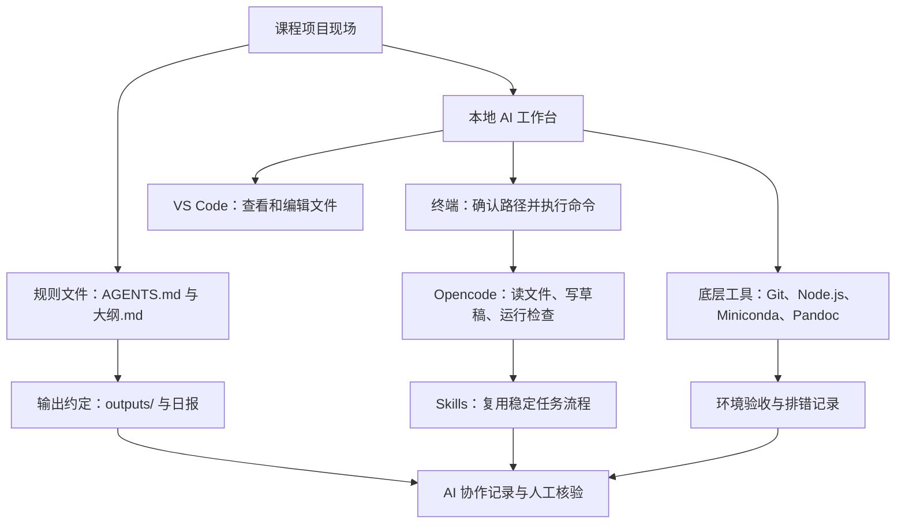
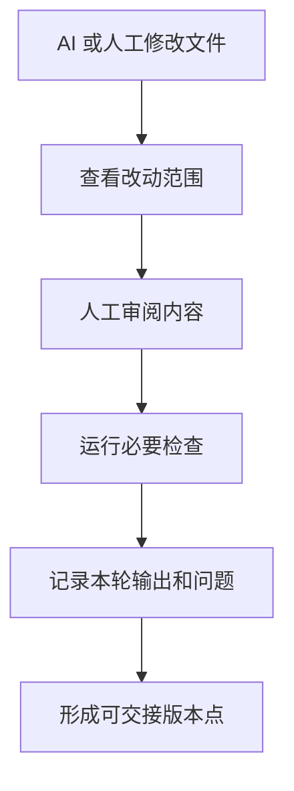
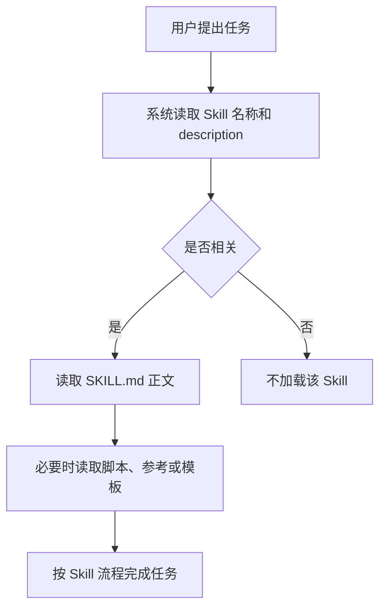
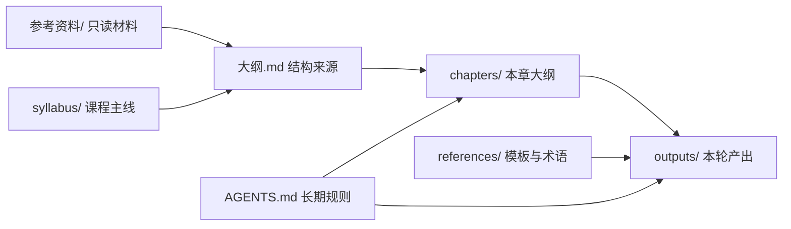
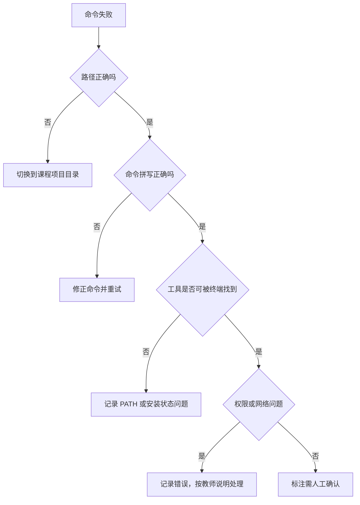

# 第2章 AI 生产力工具链与项目环境

## 材料护照与证据边界

本章使用的素材主要支撑工具链角色、项目目录、规则文件、AI 协作记录和环境验收。工具版本、模型供应商、下载地址和插件状态会变化，正文只写课程化原则和可复查检查方式。

| 主张类型 | 可写内容 | 不写内容 |
|---|---|---|
| 工具角色 | Opencode、VS Code、终端、Git、Node.js、Miniconda、Pandoc 和 Skills 在课程中的用途 | 不比较模型、平台或厂商优劣 |
| 项目环境 | 路径、目录、规则文件、输出归档和日报 | 不承诺所有学生电脑路径一致 |
| AI 协作 | AI 可辅助读文件、写草稿、解释报错、检查记录 | 不把 AI 输出写成已验证事实 |
| 复现留痕 | Git、验收表、协作记录和学习证据 | 不在本章展开复杂分支、PR 或 CI |
| 医药解释 | 本章只建立工具和项目边界 | 不新增样本量、统计推断、医学机制、临床建议或模型性能 |

## 内容要点讨论摘要

第二章本章大纲已更新为正文生成版。本章正文采用“项目现场能力”组织方式，把工具链写成可读、可写、可核验、可回退、可交接的课程环境。

| 讨论点 | 采用方案 | 写作边界 |
|---|---|---|
| 是否写成长安装手册 | 不写长教程，只保留工具角色、路径检查和验收命令 | 详细安装步骤放附录或课堂说明 |
| 工具链如何组织 | 围绕项目现场、规则文件、目录和学习证据展开 | 不写成互不相关的软件列表 |
| AI 的课程角色 | AI 是协作工具，学生负责核验、解释和伦理边界 | 不写成 AI 自动完成分析 |
| Git 的位置 | 作为变更记录、审阅、回退和交接边界 | 不展开复杂远程协作 |
| Skills 的位置 | 作为稳定重复任务的可复用规则 | 不要求学生本章开发复杂 Skill |
| 学习证据 | 工具角色表、路径记录、验收表、目录图、Skill 判断表、AI 协作记录 | 所有证据要能被教师或同伴复查 |

## 本章定位

第二章把学生带入真实项目现场。学生不只要知道有哪些工具，还要知道这些工具怎样服务课程项目：读材料、写输出、运行检查、记录过程，并回到人工判断。

本章承接第 1 章的课程定位，也为第 3 章的 AI 任务说明书做准备。第 3 章会讨论怎样给 AI 写清目标、上下文、约束、验证和输出；第二章先说明这些任务要落在哪个目录、哪个工具环境和哪个证据边界中。

| 本章回答的问题 | 本章不回答的问题 |
|---|---|
| 开始 AI 协作前怎样确认路径、规则和输出位置 | 怎样完成完整 Python 或 R 编程教学 |
| 工具链中每个工具负责什么 | 哪个模型、插件或平台长期最好 |
| AI 协作记录怎样成为学习证据 | 怎样解释统计结果或医学机制 |
| 环境失败时怎样留下可复查排错记录 | 怎样独立处理所有系统级安装故障 |

## 学习目标

完成本章后，学生应能建立最小 AI 工作台，并提交可复查的环境验收记录。

| 序号 | 学习目标 | 可检查学习证据 |
|---|---|---|
| 1 | 说明本地 AI 工作台的基本组成 | 工具角色表 |
| 2 | 在 VS Code 中打开课程项目并启动 Opencode | 当前路径记录和启动记录 |
| 3 | 解释 Git、Node.js、Miniconda 和 Pandoc 的课程用途 | 工具用途与验收命令表 |
| 4 | 判断哪些任务适合使用 Skills | Skill 使用边界表 |
| 5 | 按项目规则区分只读材料、章节工作区、输出和模板 | 项目目录图 |
| 6 | 完成环境验收和基础路径排错 | 环境验收与排错记录 |
| 7 | 记录 AI 提示词、输出、人工核验和修改 | AI 协作记录 |

## 阅读指南

阅读本章时，先看工具角色，再看协作界面，最后看验收和排错。遇到命令时，不要只复制粘贴，要先说明这个命令检查什么。

| 阅读步骤 | 重点问题 | 读后产物 |
|---|---|---|
| 第一步 | 本地 AI 工作台由哪些工具组成 | 工具角色表 |
| 第二步 | VS Code、终端和 Opencode 怎样配合 | 路径记录 |
| 第三步 | 底层工具各自解决什么问题 | 环境验收表 |
| 第四步 | Skills 什么时候该用 | Skill 判断表 |
| 第五步 | 项目文件应放在哪里 | 项目目录图 |
| 第六步 | 命令失败时怎样排查 | 排错记录 |

## 核心概念速查

| 概念 | 入门定义 | 本章使用边界 |
|---|---|---|
| 本地 AI 工作台 | 在本机或课程电脑上运行的 AI 协作环境 | 包括编辑器、终端、AI 助手和底层工具 |
| 终端 | 用文字命令控制电脑的界面 | 本章只要求会看路径、运行验收命令和启动工具 |
| VS Code | 代码和文本编辑器 | 用于查看项目、编辑文件、打开内置终端 |
| Opencode | 在终端中运行的 AI 协作助手 | 用于读文件、写草稿、运行检查和辅助排错 |
| Git | 版本控制工具 | 用于记录、审阅、回退和交接文件改动 |
| Node.js | JavaScript 运行环境 | 主要作为 Opencode 等工具的运行基础 |
| Miniconda | Python 环境管理工具 | 用于后续数据分析脚本和课程案例 |
| Pandoc | 文档格式转换工具 | 用于 Markdown、Word、PDF 或 HTML 转换 |
| Skill | 可复用的 AI 工作规则 | 适合稳定、重复、有明确输出格式的任务 |
| 规则文件 | 规定项目背景、目录约定和输出要求的文件 | 本项目以 `AGENTS.md` 和 `大纲.md` 为长期约束 |
| 环境验收 | 用命令和记录确认工具可用 | 重点是可复查，不是只写“已安装” |

## 章节总览图



## 核心内容

### 2.1 本地 AI 工作台的基本组成

本地 AI 工作台不是一个聊天窗口。它是一组配合使用的工具，帮助学生在自己的项目目录中读材料、写代码、整理文档、运行检查并留下记录。

这组工具要服务课程主线。学生学习的不是“装了多少软件”，而是能否用这些工具把医药数据项目做得可追踪、可复查、可交接。

| 工具 | 课程角色 | 学生要会检查什么 |
|---|---|---|
| Opencode | 与 AI 协作，读取本地文件，辅助生成代码或文档 | 能否启动，是否在正确项目目录 |
| VS Code | 查看和编辑项目文件 | 是否打开课程项目文件夹 |
| 终端或 PowerShell | 执行命令，检查路径和版本 | 当前路径是否正确 |
| Git | 记录、审阅和回退改动 | 是否能输出版本，是否配置身份 |
| Node.js 与 npm | 支持部分 AI 工具运行和安装 | 是否能输出版本号 |
| Miniconda 与 Python | 支持后续数据分析脚本 | 是否能输出版本号 |
| Pandoc | 支持文档格式转换 | 是否能输出版本号 |
| Skills | 复用稳定任务流程 | 是否能查看可用技能 |

第一章已经说明课程关注问题、数据和学习证据。第二章要把这些要求放进项目环境中。原始材料放在哪里，AI 可以写到哪里，输出如何命名，失败怎样记录，都是本章要解决的问题。

| 本节主张 | 材料依据 | 写作边界 |
|---|---|---|
| 工具链要整体理解 | 工具链资料、AI Lingnan 工具套装总览 | 不写成平台推广 |
| 工具服务项目现场 | `AGENTS.md`、统一模板、术语表 | 不以工具熟练度替代学习证据 |
| 本章不讲复杂代码 | 本章大纲、课程大纲 | Python 与 R 操作放到后续章节 |

本节学习证据是一张工具角色表。表中至少包含工具名称、课程用途、验收方式和对应学习产物。

### 2.2 Opencode、VS Code 与终端协作

VS Code、终端和 Opencode 分工不同。VS Code 显示项目文件，终端执行命令，Opencode 在终端中与学生对话并协助处理本地文件。

学生最先要学会的不是复杂命令，而是确认自己在正确文件夹中。当前路径错误时，AI 可能读不到课程文件，也可能把输出写到错误位置。


| 操作 | 命令或动作 | 合格现象 |
|---|---|---|
| 打开项目 | 在 VS Code 中选择课程项目文件夹 | 文件树能看到 `大纲.md`、`chapters/`、`outputs/` |
| 打开终端 | 使用 VS Code 内置 Terminal | 底部出现终端面板 |
| 确认路径 | `pwd` 或 `Get-Location` | 输出课程项目目录 |
| 启动 AI | `opencode` | 进入 Opencode 交互界面 |
| 查看技能 | `/skills` | 能看到可用 Skill，或记录待配置 |
| 新建会话 | `/new` | 当前任务与旧上下文分开 |

课程建议先让 AI 读取规则和材料，再让它写文件或执行命令。例如可以先输入：“请读取 `AGENTS.md`、`大纲.md` 和本章大纲，说明任务边界，暂时不要写文件。”

这样做能让学生先看到 AI 如何理解任务。若理解错误，可以在动手前纠正。

| 本节主张 | 材料依据 | 写作边界 |
|---|---|---|
| 三个工具要围绕同一项目目录工作 | 工具链资料、VS Code 使用资料 | 不展开全部快捷键 |
| 路径检查是启动前动作 | 工具链资料、本章大纲 | 不默认终端路径正确 |
| 先分析再执行更稳 | `AGENTS.md`、AI 工作流规则材料 | 不把 AI 输出当作已核验事实 |

本节学习证据包括当前路径记录、一次 Opencode 启动记录，以及一段“先读规则再行动”的提示词。

### 2.3 Git、Node.js、Miniconda 与 Pandoc

Opencode 等 AI 工具能读写文件和执行命令，但很多具体能力依赖底层工具。Git 负责变更记录，Node.js 支持部分命令行工具运行，Miniconda 管理 Python 环境，Pandoc 处理文档转换。

| 工具 | 解决的问题 | 课程中的用途 | 验收命令 |
|---|---|---|---|
| Git | 改动可记录、可审阅、可回退 | 查看本轮改动，形成版本节点 | `git --version` |
| Node.js | 提供 JavaScript 运行环境 | 支持部分 AI 工具运行 | `node --version` |
| npm | 安装和管理 Node.js 包 | 安装或更新部分工具 | `npm --version` |
| Miniconda | 管理 Python 环境 | 后续数据读取、清洗、统计和绘图 | `conda --version` |
| Python | 执行数据分析脚本 | 运行 pandas、matplotlib、Jupyter 等任务 | `python --version` |
| Pandoc | 转换文档格式 | Markdown 转 Word、PDF 或 HTML | `pandoc --version` |

Git 在 AI 协作中尤其重要。AI 一次可能修改多个文件，如果没有改动记录，学生很难判断哪些修改符合目标，哪些属于附带变化。



Miniconda 和 Python 会在后续章节承担主要数据分析任务。本章只要求学生知道如何检查环境是否可用，出错时先记录现象。

Pandoc 可以把 Markdown 转成其他文档格式。转换成功只说明文件格式能生成，不说明内容、图表、标题层级和证据边界已经合格。

| 本节主张 | 材料依据 | 写作边界 |
|---|---|---|
| Git 是 AI 协作中的变更边界 | AI Lingnan Git 章节 | 不展开复杂分支和 PR |
| Node.js 与 npm 是运行基础 | 工具链资料 | 不讲 JavaScript 编程 |
| Miniconda 支持数据分析环境 | 工具链资料、AIDD 环境设置材料 | 不讲完整包管理 |
| Pandoc 支持文档转换 | 工具链资料、统一模板 | 不把转换成功当成内容合格 |

本节学习证据是环境验收表。表中要写命令、输出摘要、状态和备注，不能只写“已安装”。

### 2.4 Skills 的安装、调用与课程使用边界

Skill 是一套可复用的 AI 工作规则。它适合稳定、重复、有明确输出格式的任务。

本课程中，Skill 可以帮助整理 AI 协作记录、检查图表契约、润色图注、生成课堂任务单或审阅证据边界。它不负责替学生做医学解释，也不能自动补充不存在的证据。

| 判断问题 | 适合用 Skill | 不适合用 Skill |
|---|---|---|
| 任务是否反复出现 | 每章都要整理材料清单 | 一次性临时讨论 |
| 步骤是否稳定 | 总是先读材料、再列证据、再写输出 | 每次都要重新探索方向 |
| 输出是否明确 | 固定表格、报告或清单 | 没有验收标准的开放讨论 |
| 边界是否清楚 | 能说明不该做什么 | 想让一个 Skill 包办所有写作 |

一个最小 Skill 通常由 `SKILL.md` 定义。`description` 说明何时使用，正文说明怎样执行。`scripts/`、`references/` 和 `assets/` 可以增强 Skill，但不是理解 Skill 的前提。



Skill 的边界要写清楚。若学生让 AI 解释差异表达、模型预测或临床指标，Skill 只能帮助检查结构和证据状态。材料不足时，应写 `需补证据` 或 `需人工确认`。

| 本节主张 | 材料依据 | 写作边界 |
|---|---|---|
| Skill 用于复用稳定流程 | AI Lingnan Skills 章节 | 不写成万能提示词 |
| `description` 影响触发质量 | Skill 结构和触发机制材料 | 不展开底层实现 |
| 医药课程中必须保留证据边界 | `AGENTS.md`、术语表、提示词样例 | 不让 Skill 自动生成医学结论 |

本节学习证据是一张 Skill 使用判断表。学生要写清什么时候使用、为什么使用、什么时候不用，以及人工核验什么。

### 2.5 课程项目目录、规则文件与输出约定

项目目录是 AI 协作的边界系统。目录告诉学生和 AI：哪些材料只能读，哪些位置可以写，哪些文件是结构来源，哪些文件只是辅助模板。

本项目采用以下目录约定。

| 位置 | 作用 | 处理方式 |
|---|---|---|
| `参考资料/` | 原始材料 | 只读，不改动，不写缓存 |
| `大纲.md` | 教材篇名、章名和小节结构来源 | 写正文前必须核对 |
| `syllabus/` | 课程大纲 | 用于确认课程主线和课时安排 |
| `chapters/chapter-{n}/本章大纲.md` | 章节工作区 | 先讨论内容要点，再生成正文 |
| `outputs/` | 本轮产出 | 正文、日报、任务单和报告写到这里 |
| `references/` | 模板、术语表、图表规范和提示词样例 | 用于统一写法和核验字段 |
| `AGENTS.md` | 项目规则文件 | 保存长期规则，不写临时任务 |



规则文件和当前会话要分开。会反复生效的要求写进规则文件；只对本轮有效的目标、临时优先级和阶段性说明留在当前会话。

输出文件要能从文件名看出内容。本项目要求任务文件夹采用 `{YYYY-MM-DD}-{任务名}/`，日报要记录本轮实际使用材料和核验顺序。

| 本节主张 | 材料依据 | 写作边界 |
|---|---|---|
| 目录设计服务边界管理 | `AGENTS.md`、最小项目骨架材料 | 不另行发明根目录结构 |
| `大纲.md` 是章节结构来源 | `AGENTS.md`、根目录 `大纲.md` | 不私自调整章节结构 |
| 输出要归档并记录核验顺序 | `AGENTS.md`、统一模板 | 不把产出散放到根目录 |

本节学习证据是项目目录图。图中至少标出只读区、可写区、模板区和规则文件。

### 2.6 环境验收、路径检查与常见排错

环境验收不是截图证明“装好了”。它是用可复查命令确认工具状态，并把检查过程记录下来。

| 检查类别 | 命令或动作 | 合格记录 |
|---|---|---|
| 当前路径 | `pwd` 或 `Get-Location` | 指向课程项目目录 |
| Git | `git --version` | 显示版本号 |
| Git 身份 | `git config --global user.name`、`git config --global user.email` | 能显示姓名和邮箱，或记录待配置 |
| Node.js | `node --version` | 显示版本号 |
| npm | `npm --version` | 显示版本号 |
| Opencode | `opencode --version` 或启动 `opencode` | 能显示版本或进入界面 |
| VS Code 命令 | `code --version` | 显示版本号，或记录未加入 PATH |
| conda | `conda --version` | 显示版本号 |
| Python | `python --version` | 显示版本号 |
| Pandoc | `pandoc --version` | 显示版本号 |
| Skills | 在 Opencode 中输入 `/skills` | 能列出可用技能，或记录待安装 |

常见问题先从三处排查：路径、命令、权限。路径错了，命令会在错误位置运行；命令拼写错了，检查会失败；权限或 PATH 配置有问题时，工具可能已经安装却不能被终端找到。



排错记录至少包含操作系统、当前路径、执行命令、完整报错、已尝试步骤和仍需确认事项。失败也可以成为学习证据，前提是记录清楚。

| 本节主张 | 材料依据 | 写作边界 |
|---|---|---|
| 环境验收要以命令输出为证据 | 工具链资料、统一模板 | 不要求路径完全一致 |
| 排错先查路径、拼写、工具状态和权限 | 工具链资料、AIDD 环境设置材料 | 不鼓励盲目重装 |
| 失败也要记录 | 课程大纲、AI 协作记录要求 | 不美化失败过程 |

本节学习证据是环境验收与排错记录。至少包含一个通过项和一个待确认项。

## 知识图谱生成提示词

本章不使用 `imagegen` 生成图片。学生可用下面提示词生成知识结构草案，再用 Mermaid 或表格人工核验。

```text
目标：
请为《医药数据处理与可视化》第2章“AI生产力工具链与项目环境”生成一张知识图谱草案。

上下文：
- 学生是药学本科生和研究生，不默认具备高级编程基础。
- 本章结构包括：本地AI工作台、Opencode/VS Code/终端、Git/Node.js/Miniconda/Pandoc、Skills、项目目录规则、环境验收排错。
- 课程强调原始材料只读、输出归档、AI协作记录、人工核验和医学解释边界。

约束：
- 不新增具体软件版本、医学结论或模型性能判断。
- 每个节点只写短标签。
- 必须区分“工具”“规则”“学习证据”“核验动作”。

验证：
- 检查图中是否包含 `大纲.md`、`AGENTS.md`、`参考资料/`、`outputs/`。
- 检查是否把 AI 输出和人工核验分开。

输出：
用 Mermaid flowchart 代码输出，并附一个节点说明表。
```

## 案例任务

本章案例任务是完成一次“课程项目环境验收”。学生不需要写复杂代码，但要在真实项目目录中完成路径、工具和输出规则检查。

| 任务步骤 | 学生活动 | 产物 |
|---|---|---|
| 1 | 用 VS Code 打开课程项目文件夹 | 当前项目路径记录 |
| 2 | 读取 `AGENTS.md`、`大纲.md` 和本章大纲 | 规则摘要 |
| 3 | 在终端运行基础版本检查命令 | 环境验收表 |
| 4 | 启动 Opencode 并查看 `/skills` | AI 工具状态记录 |
| 5 | 说明 `参考资料/`、`outputs/`、`references/` 的区别 | 项目目录图 |
| 6 | 让 AI 检查验收表是否缺项 | AI 协作记录 |
| 7 | 人工修订并标出仍需确认内容 | 最终验收报告 |

## 图表建议

本章图表以流程图、目录图和核验表为主。图表只服务教学组织，不承担医学或统计结论。

| 图表或表格 | 目的 | 必备标注 | 不可越界解释 |
|---|---|---|---|
| 工具链组成图 | 展示工具角色关系 | 工具名、用途、检查方式 | 不写成安装成功保证 |
| 项目目录图 | 展示读写边界 | 只读、可写、模板、规则 | 不把临时文件当正式输出 |
| 环境验收表 | 记录命令检查结果 | 命令、输出摘要、状态、备注 | 不用“正常”替代具体证据 |
| 排错流程图 | 指导路径、命令、权限排查 | 错误现象和下一步 | 不鼓励无依据重装 |
| AI 协作记录表 | 记录提示词和人工核验 | 提示词、输出、采纳、未采纳 | 不把 AI 建议写成已验证事实 |

## AI 协作点

AI 在本章中的作用是帮助学生检查步骤是否完整，而不是替学生确认电脑环境。能否运行、路径是否正确、文件是否生成，必须由学生本机检查。

| 环节 | 可向 AI 提问 | 学生必须核验 |
|---|---|---|
| 读规则 | 请概括 `AGENTS.md` 中与本章相关的规则 | 是否遗漏只读目录和输出约定 |
| 路径检查 | 请解释 `pwd` 输出代表什么 | 当前路径是否为课程项目 |
| 验收表 | 请检查我的环境验收表缺哪些项目 | 命令是否真实运行 |
| 排错 | 请根据报错列出排查顺序 | 不执行无依据的系统修改 |
| 目录设计 | 请画出我的项目目录图 | 原始材料和输出是否分开 |
| 协作记录 | 请整理本轮 AI 协作记录 | 人工采纳和未采纳理由是否清楚 |

## 常见误区

| 误区 | 问题所在 | 修正方式 |
|---|---|---|
| 只装 Opencode，不装底层工具 | AI 无法稳定运行命令、写代码或转换文档 | 按工具角色逐项验收 |
| 不确认路径就启动 AI | 输出可能写到错误目录 | 每次先运行 `pwd` 或 `Get-Location` |
| 把 `参考资料/` 当作可编辑区 | 会破坏原始材料边界 | 只读，产出写入 `outputs/` |
| 把临时任务写进规则文件 | 后续任务被过期要求干扰 | 长期规则写文件，本轮要求留会话 |
| 把 Git 当成最后提交 | AI 改动过大时难以审阅和回退 | 先建立改动记录意识 |
| 让 Skill 处理所有任务 | 触发边界模糊，质量不稳定 | 只把稳定重复任务交给 Skill |
| 看到 AI 能运行命令就完全放手 | 工具执行不等于结果正确 | 保留命令输出和人工核验 |
| 直接复制 AI 生成说明 | 缺少人工核验和来源边界 | 记录采纳内容、未采纳理由和待确认项 |

## 核验清单

学生提交本章任务前，可用以下清单自查。

| 核验项 | 是/否 | 备注 |
|---|---|---|
| 章名和六节结构与根目录 `大纲.md` 一致 |  |  |
| 已读取 `AGENTS.md`、`大纲.md` 和本章大纲 |  |  |
| 已确认当前路径指向课程项目目录 |  |  |
| 已区分 `参考资料/`、`outputs/`、`references/` 和 `chapters/` |  |  |
| 已运行 Git、Node.js、npm、Opencode、VS Code、conda、Python、Pandoc 检查 |  |  |
| 已记录不能通过或待配置的检查项 |  |  |
| 已说明 Skills 的课程使用边界 |  |  |
| 已保留 AI 提示词、输出摘要、人工核验和修改记录 |  |  |
| 未新增软件版本以外的医学、统计或临床结论 |  |  |
| 已列出 `需补证据` 或 `需人工确认` 项 |  |  |

## 实验或作业

本章作业为“AI 工作台环境验收包”。建议提交一个 Markdown 文件，文件名体现姓名、日期和任务，例如 `2026-06-07-张三-第2章环境验收.md`。

| 模块 | 最低要求 |
|---|---|
| 项目路径 | 写出 VS Code 打开的项目路径和终端当前路径 |
| 工具角色表 | 说明每个工具在课程中的用途 |
| 版本检查表 | 记录命令、输出摘要、状态和备注 |
| 项目目录图 | 用 Mermaid 或表格说明只读区、输出区和规则文件 |
| Skill 判断表 | 写明一个适合 Skill 的任务和一个不适合的任务 |
| 排错记录 | 至少记录一个真实或模拟错误的排查过程 |
| AI 协作记录 | 保留提示词、AI 输出摘要、人工修改和未采纳内容 |
| 证据边界 | 列出仍需教师或助教确认的环境问题 |

评分时不以“所有工具一次成功”为唯一标准。能清楚记录失败、解释排查过程并标出待确认项，也属于有效学习证据。

## 需补证据

以下内容当前材料不足，不能在正文中写成确定事实。

| 缺口 | 当前处理 |
|---|---|
| 学校机房或学生电脑统一安装版本 | 不写固定版本要求，课堂以教师发布版本为准 |
| Opencode、模型供应商、插件和 Skills 列表的最新状态 | 只写课程使用原则和验收方法 |
| Windows、macOS、Linux 的完整分系统安装细节 | 本章只给课程化验收框架，详细安装可放附录 A |
| Git 仓库初始化是否作为每位学生必需步骤 | 本章只说明 Git 作用，初始化按教师要求执行 |
| 真实学生环境报错案例 | 课堂收集后补充到排错案例库 |
