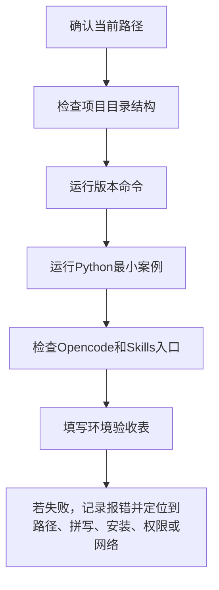
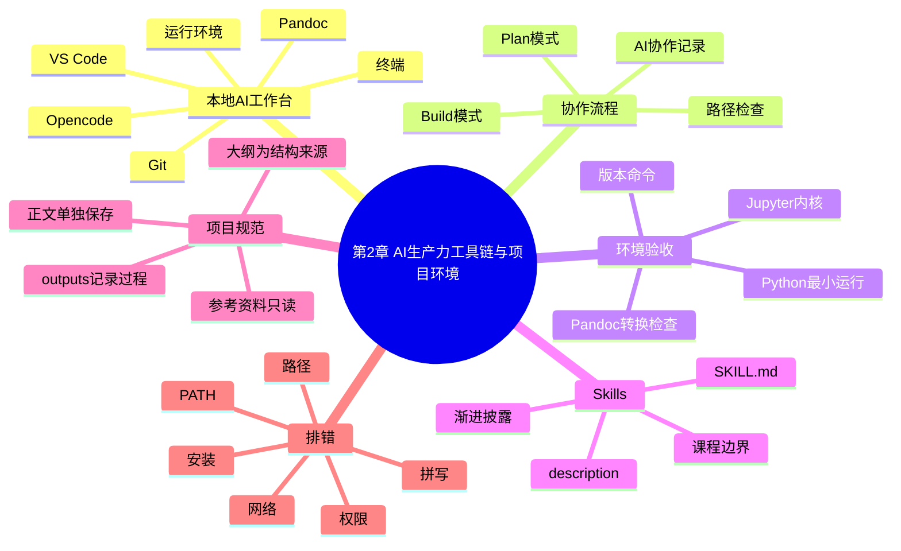

# 第2章 AI 生产力工具链与项目环境

## 本章定位

第 1 章说明医药数据的类型、课程目标和 AI 使用边界。本章进入真实项目环境：学生不只要知道有哪些工具，还要知道每个工具在项目中承担什么职责，怎样留下学习证据，怎样让 AI 协作过程可追踪、可核验、可回退。

本章不是完整安装手册。不同电脑、系统版本和网络环境会造成界面差异，教材只要求学生掌握“路径、规则、版本、记录、排错”这五件事。安装细节由教师课前说明或实验室统一环境补充。

| 本章关注 | 本章不展开 |
| --- | --- |
| 当前项目目录是否正确 | 各软件的完整安装截图 |
| 工具能否启动并显示版本 | 复杂包依赖和系统权限配置 |
| AI 是否按规则读取和修改文件 | 让 AI 自动完成全套分析 |
| 输出是否能追溯到材料和命令 | 医学结论、统计结论和组学解释 |

## 学习目标

1. 能解释本地 AI 工作台由编辑器、终端、AI 助手、运行环境、版本记录和转换工具组成。
2. 能在 VS Code 或终端中检查当前路径，并说明路径错误会怎样影响 AI 协作。
3. 能用版本命令完成 Git、Node.js、npm、Opencode、Miniconda、Python 和 Pandoc 的最小验收。
4. 能说明 `SKILL.md`、`description` 和 Skills 渐进调用的基本含义。
5. 能按课程目录规则保存正文、输出、材料清单和 AI 协作记录。
6. 能提交一份环境验收包，包含路径、命令、输出摘要、报错和人工判断。

## 阅读指南

读本章时，不要把重点放在“我是否记住所有命令”。更重要的问题是：我现在在哪个文件夹？AI 能看到什么？哪些文件不能改？我的输出保存在哪里？运行失败时，我能否把错误描述清楚？

本章的命令只用于验收。看到版本号，说明软件入口可用；看不到版本号，只能说明当前环境还未配置好，不能直接判断软件本身有问题。

| 容易混淆的问题 | 本章处理方式 |
| --- | --- |
| “装好了”和“能用于课程” | 以版本命令、路径记录和最小运行案例验收 |
| “AI 会写代码”和“代码可信” | AI 输出必须经过运行、审阅和人工解释 |
| “GitHub”和“Git” | 本章先讲本地版本记录，远程协作后续再展开 |
| “Pandoc 转 Word”和“正文完成” | 转换只改变格式，内容仍需人工核验 |

## 核心概念速查

| 概念 | 本章解释 | 常见混淆 | 需保留英文 |
| --- | --- | --- | --- |
| 本地 AI 工作台 | 在自己电脑或课程机器上协同使用编辑器、终端、AI 助手和运行环境 | 误以为只是一个聊天窗口 | local AI workspace |
| 终端 | 输入命令、查看路径、启动程序和运行脚本的界面 | 把终端当成普通文档窗口 | terminal |
| 当前路径 | 终端命令正在作用的文件夹 | 以为打开 VS Code 就等于进入正确目录 | working directory |
| 版本记录 | 用 Git 记录文件变化，便于比较和回退 | 把 Git 等同于 GitHub 网站 | Git |
| 运行环境 | Python、R、Node.js 等程序运行所需的解释器、包和配置 | 只看代码，不看环境 | runtime environment |
| Skill | 可复用的 AI 工作规则，通常由 `SKILL.md` 描述 | 当成万能提示词 | Skill |
| AI 协作记录 | 保留提示词、AI 输出、人工修改、运行结果和反思 | 只贴最终答案 | AI collaboration log |

## 章节总览图


这张图展示本章的工作顺序。先确认课程规则和章节结构，再确认工具能否在正确目录中运行。后续章节会逐步使用这些工具处理 CSV、Excel、统计表、图表脚本、RNA-seq 结果表和单细胞可视化材料。

## 2.1 本地 AI 工作台的基本组成

本地 AI 工作台不是一个软件，而是一组协作关系。VS Code 负责查看和编辑文件；终端负责运行命令；Opencode 这类 AI 助手负责读取项目上下文、解释报错、辅助修改文件；Python、R、Node.js 等运行环境负责执行代码；Git 负责记录变化；Pandoc 负责文档格式转换。

如果学生只打开 AI 聊天窗口，却没有给出项目路径、文件结构和课程规则，AI 很容易把任务写成泛泛建议。课程要求学生在项目现场工作，就是为了让每一次修改都能回到具体文件、具体命令和具体输出。

| 工具 | 在本章中的角色 | 可形成的学习证据 | 学生必须核验 |
| --- | --- | --- | --- |
| VS Code | 查看目录、编辑 Markdown、检查代码文件 | 打开的项目路径、修改后的文件 | 是否打开了课程指定文件夹 |
| 终端 | 查看路径、运行版本命令、启动工具 | 命令和输出截图或文本记录 | 命令是否在正确目录执行 |
| Opencode | 根据本地文件和规则辅助阅读、改写、排错 | 提示词、AI 输出摘要、人工修改记录 | 是否改动了不该改的文件 |
| Git | 记录文件变化，比较修改前后差异 | `git status`、提交说明或差异摘要 | 本次改动是否只包含目标文件 |
| Node.js / npm | 支撑部分 AI 或前端工具运行 | `node --version`、`npm --version` | 版本命令能否被系统识别 |
| Miniconda / Python | 支撑后续数据处理和可视化脚本 | `python --version`、最小运行结果 | 当前解释器是否是课程环境 |
| Pandoc | 将 Markdown 转换为 Word 或 PDF | 转换命令、导出文件 | 格式转换后内容是否缺失 |

### 案例 2-1：从工具清单到学习证据

一名学生写下“我已经安装了 VS Code、Python 和 Opencode”，这还不是可核验记录。更合格的写法是：

| 项目 | 记录示例 | 判定 |
| --- | --- | --- |
| 当前路径 | `E:\Course\medical-data-vis` | 可判断是否在课程目录 |
| VS Code | 已打开课程根目录，左侧能看到 `chapters/` 和 `outputs/` | 可判断项目是否完整 |
| Python | `Python 3.x.x`，能运行 `print()` | 可判断解释器入口是否可用 |
| Opencode | 能在终端启动，能读取当前目录文件 | 可进入 AI 协作练习 |
| Git | `git status` 能显示当前文件变化 | 可进行变更审阅 |

这类记录把“装好了”变成“可检查”。教师可以根据记录判断问题出在路径、软件入口、项目目录，还是学生尚未理解输出要求。

## 2.2 Opencode、VS Code 与终端协作

VS Code、终端和 Opencode 的关系可以写成一句话：VS Code 看文件，终端跑命令，Opencode 按当前项目上下文协助工作。三者协作前，必须先确认当前路径。路径不对时，AI 可能读不到课程材料，也可能把文件写到无关目录。

在 Windows PowerShell 中，可以用 `Get-Location` 或 `pwd` 查看当前路径。课程练习中，学生应先记录路径，再启动 Opencode。这样一旦生成文件位置不对，排查会快很多。

```powershell
Get-Location
pwd
opencode
```

如果终端显示的路径不是课程根目录，应先切换目录，再启动工具。不要在桌面、下载文件夹或系统目录里直接让 AI 创建课程文件。

```powershell
cd E:\Course\medical-data-vis
Get-Location
opencode
```

### 案例 2-2：一次合格的 AI 启动记录

| 字段 | 学生记录示例 |
| --- | --- |
| 日期 | 2026-07-08 |
| 系统 | Windows 11，PowerShell |
| 当前路径 | `E:\Course\medical-data-vis` |
| 启动命令 | `opencode` |
| AI 工作模式 | 先 Plan，再 Build |
| 本次任务 | 解释第 2 章大纲，不修改原始材料 |
| 人工限制 | 不改 `参考资料/`，无法确认处写 `需人工确认` |

Opencode 常见的斜杠命令可以帮助学生管理会话。`/new` 用于开启新任务，`/sessions` 用于查看会话，`/undo` 可在有 Git 支持时撤销部分修改，`/exit` 用于退出。实际命令可能随版本变化，学生应以本机显示为准。

| 操作 | 教学用途 | 学生核验 |
| --- | --- | --- |
| `/new` | 把不同作业分开，减少上下文混杂 | 新会话是否说明任务目标 |
| `/skills` | 查看可用 Skills | 是否只调用与任务相关的 Skill |
| `/undo` | 尝试撤回不合适修改 | 是否已查看 Git 状态和文件差异 |
| `/exit` | 结束会话 | 是否保存协作记录 |

Plan 和 Build 的区别也要进入协作记录。Plan 阶段适合让 AI 读文件、列方案、指出缺口；Build 阶段才允许它修改文件或运行命令。第 1 至第 4 章处于原生语感培养阶段，学生不应让 AI 直接生成完整分析脚本或替代作业答案。

### 课堂练习：把一句模糊提示词改成任务说明书

模糊写法：

```text
帮我把第二章写好。
```

课程写法：

```text
目标：
请根据 chapters/chapter-2/本章大纲.md 检查第二章正文缺少哪些教学案例。

上下文：
- 本课程面向药学本科生和研究生。
- 参考资料目录只读，不能改动。
- 第 2 章只讲工具链和项目环境，不生成统计结论。

约束：
- 不新增材料未支持的医学结论。
- 无法确认的软件版本或路径写“需人工确认”。

验证：
- 按六个小节列出缺口。
- 每条建议说明来自哪类材料。

输出：
用表格给出修改建议，不直接改文件。
```

这个练习训练的不是“写更长提示词”，而是让 AI 知道目标、上下文、约束、验证和输出。后续数据读取、统计检验和图表审阅都会沿用这种结构。

## 2.3 Git、Node.js、Miniconda 与 Pandoc

Git、Node.js、Miniconda 和 Pandoc 在本章中都只要求达到“能被系统识别，并能说明用途”的层次。学生不需要记住所有参数，但要知道失败时该记录什么。

Git 是版本记录工具。它能显示哪些文件被修改、比较修改前后差异，并在必要时帮助回到较早状态。GitHub 是远程代码托管和协作平台，常用于共享项目、提交 Pull Request 和查找公开代码。本章先讲 Git 的本地作用，不把远程协作作为必做内容。

| Git 作用 | 本章例子 | 为什么重要 |
| --- | --- | --- |
| 记录 | `git status` 查看哪些文件变化 | 防止 AI 改动超出任务范围 |
| 审阅 | 查看差异后再接受修改 | 避免只看最终文本 |
| 回退 | 出错时回到较早版本 | 支持可回退学习 |
| 交接 | 用提交信息说明本次改动 | 便于教师或组员复核 |

| 工具 | 本章说明 | 验收重点 |
| --- | --- | --- |
| Node.js / npm | Node.js 是 JavaScript 运行环境，npm 是常见配套包管理工具；部分 AI 工具、前端预览或文档工具会依赖它们 | 能显示版本号，不要求学习 JavaScript |
| Miniconda | 用于管理 Python 环境，后续章节会用 Python 读取数据、清洗表格、绘图和检查模型输出 | 能显示 conda 和 Python 版本，环境名按教师说明记录 |
| Pandoc | 用于把 Markdown 转成 Word 或 PDF；格式转换不能替代正文审稿 | 能显示版本号，导出后仍要检查标题、表格、代码块、图注和中文字体 |

### 案例 2-3：环境版本验收表

学生可在终端逐条运行下面命令，并把输出摘要填入表格。输出不需要完全相同，只要能显示版本号或明确报错即可。

```powershell
git --version
node --version
npm --version
opencode --version
code --version
conda --version
python --version
pandoc --version
```

| 命令 | 预期现象 | 若失败，先记录什么 |
| --- | --- | --- |
| `git --version` | 显示 Git 版本 | 是否提示命令不存在，是否安装 Git |
| `node --version` | 显示 Node.js 版本 | 是否安装 Node.js，PATH 是否生效 |
| `npm --version` | 显示 npm 版本 | Node.js 是否完整安装 |
| `opencode --version` | 显示 Opencode 版本或可用信息 | 工具名是否拼写正确 |
| `code --version` | 显示 VS Code 命令行入口 | VS Code 是否加入 PATH |
| `conda --version` | 显示 conda 版本 | 是否安装 Miniconda，是否打开了正确终端 |
| `python --version` | 显示 Python 版本 | 当前 Python 是否来自课程环境 |
| `pandoc --version` | 显示 Pandoc 版本 | 是否安装 Pandoc，是否能从终端调用 |

### 案例 2-4：Python 与 Jupyter 的最小运行检查

Python 环境不应只看版本号。学生至少要运行一行代码，确认解释器能执行最小任务。

```powershell
python -c "print('欢迎来到医药数据处理与可视化')"
```

预期输出：

```text
欢迎来到医药数据处理与可视化
```

如果使用 Jupyter Notebook 或 VS Code Notebook，新建一个代码单元，运行：

```python
print("欢迎来到医药数据处理与可视化")
```

这不是数据分析，只是环境入口检查。若 Notebook 无法运行，应记录当前内核名称、Python 版本、报错全文和是否能在终端运行同一行 `print()`。

| 检查对象 | 通过标准 | 常见问题 |
| --- | --- | --- |
| 终端 Python | `python -c` 能输出文字 | `python` 指向系统旧版本或未配置 PATH |
| Jupyter 内核 | 代码单元能运行并显示输出 | 内核未选择或环境未安装 Jupyter |
| VS Code Python 扩展 | 能识别解释器并运行脚本 | 打开的不是课程项目目录 |

后续章节会逐步引入 pandas、matplotlib、R、ggplot2 和组学分析工具。第 2 章只检查入口，不要求安装所有后续包。

## 2.4 Skills 的安装、调用与课程使用边界

Skill 是可复用的 AI 工作规则。它常由一个 `SKILL.md` 文件描述，文件中写明这个 Skill 何时使用、怎样执行、输出什么、哪些内容不能越界。对学生来说，Skill 的价值不是“让 AI 更强”，而是让重复任务的规则更稳定。

一个 Skill 通常依靠 `description` 被识别。描述太宽，AI 可能在不合适的场景调用；描述太窄，真正需要时又可能触发不了。课程中使用 Skills 时，学生要能说明调用原因，而不是把所有 Skill 都打开。

```markdown
---
name: course-evidence-review
description: Use when reviewing course text, figures, or AI outputs for evidence boundary, unsupported claims, and validation gaps.
---

正文步骤：
1. Read the task goal and source materials.
2. Separate observation, interpretation, and unsupported claims.
3. Mark missing evidence as `需补证据` or `需人工确认`.
4. Return a concise review table.
```

上面只是一个简化示例。学生本章不需要开发复杂 Skill，但要看懂三件事：名称说明它是什么，描述说明何时用，正文说明它怎样工作。

Skills 的调用还涉及“渐进披露”。AI 不会一开始读取所有 Skill 的完整内容，而是先看到名称和描述，判断是否相关，再读取具体规则。这能减少无关上下文，也能降低规则冲突。

| 阶段 | AI 看到什么 | 学生要判断什么 |
| --- | --- | --- |
| 发现 | Skill 名称和 `description` | 这个 Skill 是否适合当前任务 |
| 加载 | `SKILL.md` 主要步骤 | 是否与课程规则冲突 |
| 执行 | 相关脚本、模板或参考材料 | 输出是否符合本次作业 |
| 核验 | 结果、缺口和边界 | 是否新增了材料不支持的结论 |

### 案例 2-5：哪些任务适合做成 Skill

| 任务 | 是否适合 Skill | 理由 |
| --- | --- | --- |
| 整理 AI 协作记录 | 适合 | 每次作业都要记录提示词、输出、人工修改和测试结果 |
| 检查图表契约是否完整 | 适合 | 后续章节反复使用同一核验表 |
| 解释一次偶发安装报错 | 不一定 | 报错常受机器环境影响，更适合记录排查过程 |
| 自动生成医学结论 | 不适合 | 医学解释需要数据、文献、统计前提和人工判断 |
| 审阅 RNA-seq 结果表的解释边界 | 适合但要限定 | 只能检查表述是否越界，不能替代生物学验证 |

本课程涉及生物医学、药学、组学和 AI 模型时，必须区分观察结果、方法来源、允许解释、替代解释和仍需验证内容。比如后续 RNA-seq 章节中，差异表达结果可以说明某些基因在给定分组和分析流程下显示表达差异；它不能直接证明疾病机制，也不能直接推出临床用药建议。

### NGS 边界案例：不要把“帮我分析 RNA-seq”当作完整任务

后续组学章节会接触 FASTQ、计数矩阵、元数据、参考基因组、质量控制和差异表达。本章只借这个场景说明 AI 协作边界。

| 如果学生只说 | 风险 | 应补充的信息 |
| --- | --- | --- |
| 帮我分析 RNA-seq | 输入类型不明，AI 可能跳过关键步骤 | FASTQ、count matrix 还是已整理结果表 |
| 这批样本有差异吗 | 分组、批次、样本数和统计方法不明 | 元数据、分组变量、重复定义 |
| 帮我解释火山图 | 阈值和校正方式不明 | log2FoldChange、padj、筛选规则 |
| 这个基因是靶点吗 | 证据层级不足 | 文献、实验验证、疾病和药物背景 |

如果任务涉及人源数据、临床信息或大规模测序数据，还要先确认隐私、授权、计算资源和是否允许上传到云端。材料不足时，正文和作业都应写 `需补证据` 或 `需人工确认`。

## 2.5 课程项目目录、规则文件与输出约定

项目目录是 AI 协作的边界。目录结构清楚，AI 才能知道哪些是原始材料，哪些是草稿，哪些是输出，哪些是规则。目录混乱时，最常见的问题不是 AI 不会写，而是它不知道该读哪里、写哪里、不能动哪里。

本项目的关键目录如下：

| 路径 | 作用 | 本章要求 |
| --- | --- | --- |
| `参考资料/` | 原始材料，只读 | 不改动，不覆盖，不把缓存放进去 |
| `大纲.md` | 全书章名和结构的唯一来源 | 更新章节前先核对 |
| `syllabus/` | 课程大纲 | 用于核对学时、学生背景和教学目标 |
| `chapters/chapter-{n}/本章大纲.md` | 单章结构蓝图 | 正文必须按它展开 |
| `chapters/chapter-2/正文.md` | 本章后续更新的正文文件 | 本轮写入的位置 |
| `outputs/` | 材料清单、日报、导出物和中间产出 | 按日期和任务命名 |
| `references/` | 模板、术语表、提示词和图表规范 | 用于统一写法和核验 |
| `AGENTS.md` | 项目规则文件 | 每轮写作前先读 |

通用项目骨架常把文件分为输入、输出、参考和规则。本课程的映射如下：

```text
AI_MED_DataVis_Book/
├── 参考资料/                  # 输入材料，只读
├── chapters/
│   └── chapter-2/
│       ├── 本章大纲.md         # 章节结构蓝图
│       └── 正文.md             # 本章正文
├── outputs/                    # 本轮计划、材料清单、日报
├── references/                 # 模板、术语表、提示词样例、图表规范
├── syllabus/                   # 课程大纲
├── AGENTS.md                   # 项目规则
└── 大纲.md                     # 全书结构来源
```

### 案例 2-6：一次章节写作任务的文件流

这次第二章更新可以作为项目目录案例。正确流程不是直接让 AI 写正文，而是先读规则，再核对大纲，再读本章大纲和素材，最后把正文与材料记录分开保存。

| 步骤 | 文件或目录 | 操作 | 产出 |
| --- | --- | --- | --- |
| 1 | `AGENTS.md` | 读取项目规则 | 明确只读目录、写作风格和输出路径 |
| 2 | `大纲.md` | 核对章名和六节结构 | 确认不改章节结构 |
| 3 | `chapters/chapter-2/本章大纲.md` | 读取各节内容要点 | 确定正文扩写蓝图 |
| 4 | `参考资料/` 与 `references/` | 筛选工具链、Skills、Python、NGS 边界素材 | 形成案例和证据边界 |
| 5 | `chapters/chapter-2/正文.md` | 写入正文 | 后续可持续更新 |
| 6 | `outputs/2026-07-08-第二章正文扩写完善/` | 保存计划、材料清单、护照和日报 | 便于审阅和追踪 |

规则文件和当前会话也要分开。`AGENTS.md` 这类文件适合写稳定规则，例如只读目录、输出路径、证据边界和写作风格。当前会话适合写本次任务目标，例如“只更新第二章正文”“案例要嵌入文本”。

| 内容 | 放入规则文件 | 放入当前任务 |
| --- | --- | --- |
| `参考资料/` 不可改 | 是 | 可重复提醒 |
| 今天要扩写第 2 章 | 否 | 是 |
| 章节结构来自 `大纲.md` | 是 | 是 |
| 本轮正文写入 `正文.md` | 可作为目录规则 | 是 |
| 某段文字要更口语化 | 否 | 是 |

这种分工能减少规则漂移。重复有效的规范进入规则文件，一次性要求留在任务说明中。

## 2.6 环境验收、路径检查与常见排错

环境验收的目标不是把电脑调到完美状态，而是确认本章后续学习能否开始。验收记录应回答四个问题：我在哪个目录？哪些工具可被识别？最小代码能否运行？遇到错误时我记录了什么？

推荐按下面顺序检查。顺序固定，是为了降低排错成本。



### 环境验收表模板

| 项目 | 命令或检查 | 结果摘要 | 判定 | 备注 |
| --- | --- | --- | --- | --- |
| 当前路径 | `Get-Location` | 需填写 | 通过/需改 | 是否为课程根目录 |
| 项目结构 | 查看是否有 `chapters/`、`outputs/`、`参考资料/` | 需填写 | 通过/需改 | 不完整时联系教师 |
| Git | `git --version` | 需填写 | 通过/需改 | 不要求本章远程提交 |
| Node.js | `node --version` | 需填写 | 通过/需改 | 记录版本号即可 |
| npm | `npm --version` | 需填写 | 通过/需改 | 与 Node.js 配套 |
| Opencode | `opencode --version` 或启动测试 | 需填写 | 通过/需改 | 记录是否能进入会话 |
| VS Code 命令 | `code --version` | 需填写 | 通过/需改 | 失败不影响直接打开 VS Code |
| conda | `conda --version` | 需填写 | 通过/需改 | 统一环境按教师说明 |
| Python | `python --version` 和 `python -c` | 需填写 | 通过/需改 | 同时看版本和运行 |
| Pandoc | `pandoc --version` | 需填写 | 通过/需改 | 转换前仍需审稿 |

### 常见报错的第一轮排查

| 现象 | 可能原因 | 先做什么 |
| --- | --- | --- |
| `command not found` 或“不是内部或外部命令” | 未安装、PATH 未配置、命令拼写错误 | 复制完整报错，检查命令拼写和安装状态 |
| AI 找不到文件 | 当前路径不在课程根目录 | 运行 `Get-Location`，确认左侧目录 |
| 文件写到奇怪位置 | 启动 AI 前路径错误 | 记录启动路径，移动或重做输出 |
| Python 版本不对 | 系统中有多个 Python | 记录 `where python` 或教师指定检查命令 |
| Notebook 无内核 | Jupyter 未安装或环境未注册 | 记录内核列表和终端 Python 结果 |
| Pandoc 转换后表格乱 | Markdown 表格或中文字体问题 | 回到源文件检查表格和导出设置 |
| Opencode 修改范围过大 | 任务说明不够具体，未限制路径 | 先停下，查看 Git 状态和差异 |

不要一看到错误就重装软件，也不要直接用管理员权限反复尝试。课程排错先从路径、拼写、安装状态、权限、网络和 PATH 六类原因检查。能复述错误，比盲目操作更重要。

### 案例 2-7：排错记录样例

| 字段 | 记录 |
| --- | --- |
| 任务 | 检查 Python 最小运行 |
| 命令 | `python -c "print('欢迎来到医药数据处理与可视化')"` |
| 报错 | `python` 无法识别为命令 |
| 当前路径 | `C:\Users\student\Desktop` |
| 已尝试 | 在开始菜单中能打开 Python，但终端不能识别 |
| 初步判断 | 可能是 PATH 或终端未刷新，需人工确认 |
| 下一步 | 按教师安装说明检查 Python 入口，不改动课程文件 |

这种记录比“Python 坏了”更有用。教师能看到命令、路径、错误和学生已经尝试过什么，才容易判断下一步。

### 案例 2-8：为什么本章不直接运行 SRA 或 FastQC

生物信息学材料中常见的流程包括从 SRA 获取测序数据、把数据转为 FASTQ、用 FastQC 做质量控制，再进入比对、计数或差异分析。这个流程能说明项目环境的重要性，但不适合作为第 2 章必做任务。

| 原因 | 本章处理 |
| --- | --- |
| FASTQ 文件可能很大 | 只说明需要记录数据大小和存放位置 |
| SRA 下载依赖网络和外部工具 | 不把下载成功作为本章验收标准 |
| FastQC 报告需要解释质量指标 | 后续组学章节再讲 |
| 人源数据可能涉及授权和隐私 | 上传或共享前需教师确认 |
| 流程需要参考基因组和元数据 | 本章只教如何记录这些前置条件 |

如果后续作业真的使用 RNA-seq 数据，任务说明至少应写清：输入是 FASTQ、计数矩阵还是差异结果表；样本元数据在哪里；分组变量是什么；参考基因组或注释版本是什么；输出要图表、表格还是解释；是否允许联网或上传数据。

## 图表建议

本章不要求绘制统计图，但可以用结构图和验收表帮助学生建立工作流意识。

| 图表或表格 | 用途 | 必备标注 | 不可越界解释 |
| --- | --- | --- | --- |
| 工具角色表 | 说明每个工具承担的任务 | 工具名、作用、学习证据、核验项 | 不写成所有工具必须一次装好 |
| 环境验收表 | 记录版本命令和最小运行结果 | 命令、输出摘要、判定、备注 | 不把版本号高低写成学习能力 |
| 项目目录图 | 展示输入、正文、输出和规则位置 | 目录名、读写权限、用途 | 不把目录结构当成分析结论 |
| 排错流程图 | 帮助学生按顺序定位问题 | 路径、命令、错误、尝试 | 不保证所有问题都能自行解决 |

本章图表的原则是清楚，不是装饰。表格中的“判定”应允许写“需人工确认”，避免学生为了通过验收而编造输出。

## AI 协作点

AI 可以帮助学生理解命令含义、翻译报错、整理验收记录、检查目录规则和润色协作记录。AI 不能替学生决定医学解释，不能替学生确认隐私授权，也不能把没有运行过的代码写成已经通过。

| 场景 | 可让 AI 做什么 | 学生必须核验什么 |
| --- | --- | --- |
| 路径检查 | 解释 `Get-Location` 输出含义 | 当前路径是否真是课程根目录 |
| 报错解释 | 把报错拆成可能原因和排查步骤 | 是否符合本机实际情况 |
| 环境验收表 | 把命令输出整理成表格 | 输出是否来自真实运行 |
| 规则阅读 | 总结 `AGENTS.md` 中的约束 | 是否遗漏只读目录和输出路径 |
| Skill 判断 | 判断某任务是否适合做成 Skill | 是否超出课程边界 |
| 组学任务预检 | 列出 RNA-seq 任务缺少的输入信息 | 是否拥有数据授权和元数据 |

学生提交 AI 协作记录时，不要求贴完整聊天记录，但必须保留关键提示词、AI 输出摘要、人工修改、测试结果和反思。失败过程也要保留，因为它是学习证据。

## 知识结构与知识图谱生成提示词

本章知识结构可以用 Mermaid 表示，作为课堂复习和作业答辩材料。



如果需要生成教学展示图，可使用下面提示词。生成图只作为课堂展示，准确结构以 Mermaid 和正文表格为准。

```text
请生成一张中文教学信息图，主题为“医药数据处理与可视化课程的本地 AI 工作台”。图中包含六个模块：VS Code、终端、Opencode、Git、Python/Miniconda、Pandoc。用箭头表示“路径检查 -> 工具验收 -> AI协作记录 -> 项目输出”。整体风格简洁，适合药学本科生课堂展示。不要添加医学结论，不要出现无法辨认的小字。
```

若生成图中文字不清、节点缺失或工具关系错误，应以本章 Mermaid 图、表格和教师修订版为准。

## 常见误区

| 误区 | 为什么错 | 如何纠正 |
| --- | --- | --- |
| 只要 AI 能回答，就说明项目环境没问题 | AI 可以脱离本地项目给出泛泛答案 | 先检查路径和文件访问 |
| 版本号显示出来就可以开始所有分析 | 版本命令只说明入口可用 | 还要做最小运行和后续包检查 |
| 报错时直接重装 | 可能掩盖路径、拼写或环境选择问题 | 先保存命令、路径和完整报错 |
| 把 `参考资料/` 当草稿区 | 原始材料会被污染，证据来源失真 | 所有新文件写入 `chapters/` 或 `outputs/` |
| 让 AI 直接写结论 | AI 不掌握实验设计和证据边界 | 要求 AI 列缺口，人工决定解释 |
| 把 Skill 当成万能模板 | Skill 也会受描述、材料和任务边界限制 | 调用前说明原因，调用后核验输出 |

## 本章作业：环境验收包

本章作业要求提交一个“环境验收包”。它不是安装截图合集，而是一份可复核记录。

| 项目 | 提交内容 |
| --- | --- |
| 路径记录 | `Get-Location` 或 `pwd` 输出，说明是否为课程根目录 |
| 目录截图或文本 | 能看到 `chapters/`、`outputs/`、`参考资料/`、`references/` |
| 版本命令表 | Git、Node.js、npm、Opencode、VS Code、conda、Python、Pandoc |
| Python 最小运行 | `print()` 命令或 Notebook 输出 |
| AI 协作记录 | 一条用于解释报错或整理验收表的提示词 |
| 排错记录 | 如果有失败项，填写命令、报错、路径、尝试和下一步 |
| 反思 | 100 字以内说明本章最容易出错的环节 |

禁止事项：

1. 不提交别人电脑的版本输出。
2. 不把 AI 生成的“应该输出”当作真实运行结果。
3. 不改动 `参考资料/` 中任何原始文件。
4. 不在未获允许时上传人源数据、临床数据或测序原始数据。
5. 不让 AI 代写完整作业答案。

评分时优先看记录是否真实、路径是否清楚、失败是否描述完整。软件暂时失败但记录充分，可以继续排查；记录不真实则无法作为学习证据。

## 核验清单

- 已核对 `大纲.md` 中第 2 章章名和六节结构。
- 已确认正文写入 `chapters/chapter-2/正文.md`，材料清单另存 `outputs/`。
- 已区分 Git 和 GitHub，本章只要求本地版本记录入门。
- 已把 Python/Jupyter 案例限制为最小运行检查。
- 已说明 Pandoc 只负责格式转换，不负责内容质量。
- 已说明 Skills 是可复用规则，不替代人工判断。
- 已把 NGS、RNA-seq 和 FastQC 写成边界案例，不作为本章必跑流程。
- 已要求医学、统计和组学解释不足时标 `需补证据` 或 `需人工确认`。
- 已要求 AI 协作记录包含提示词、输出摘要、人工修改和测试结果。

## 需补证据与人工确认

| 位置 | 缺口 | 处理方式 |
| --- | --- | --- |
| 软件版本要求 | 本项目材料未给出统一最低版本号 | 教师课前按机房或个人电脑情况补充 |
| Opencode 命令细节 | 斜杠命令和模式名称可能随版本变化 | 以课堂实际界面和官方说明为准 |
| Miniconda 环境名 | 课程统一环境名称未在材料中固定 | 教师发布后填入作业模板 |
| Pandoc 导出格式 | 中文 Word/PDF 样式需结合模板测试 | 后续文档导出章节再细化 |
| NGS 实操数据 | 本章未提供可下载数据和授权说明 | 第 14 章后按教师指定数据执行 |
