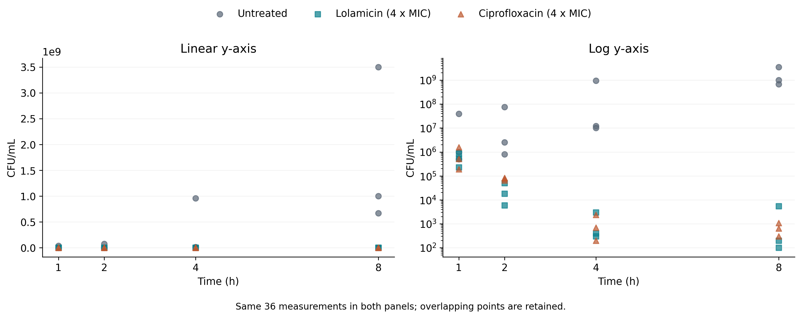
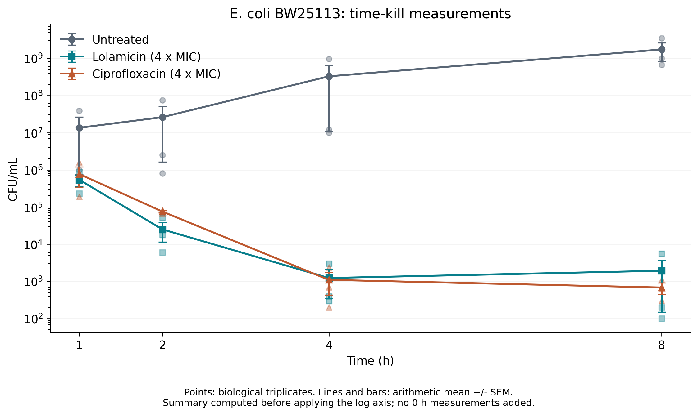
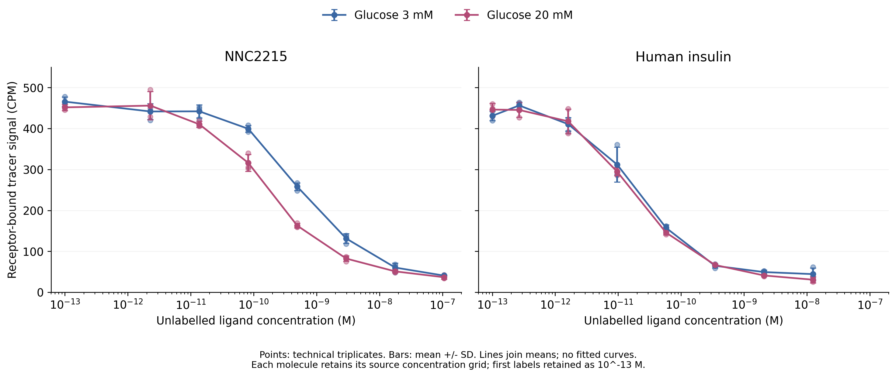
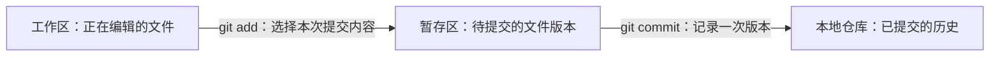
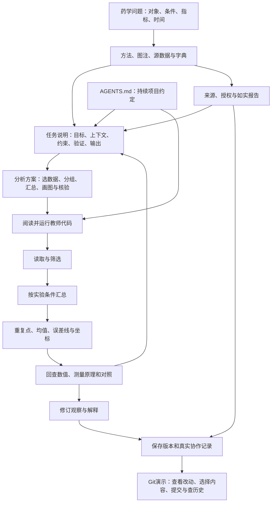

# 第3章 AI 任务说明书与协作规范

新抗生素Lolamicin和环丙沙星都能降低培养物中的可培养菌量。如果手里有一张实验表，你会怎样判断它们的表现？只看最后一个时间点，还是比较整个观察过程？用的是哪一种细菌，两种药的剂量又是怎样确定的？这些问题决定了接下来应当读什么材料、运行什么代码，也决定了怎样检查AI的回答。

前两章已经介绍课程中的药学问题、Agent与WorkBuddy环境。本章从两项真实研究出发，完成一次有输入、有运行结果、能够回查的协作任务。先用抗生素数据练习完整过程，再用葡萄糖响应胰岛素检验：换了实验，原来的提问和解释方式有哪些地方必须跟着改变。

本章配套[学生运行包](assets/student-package/README.md)含数据、字典、完整脚本与学习记录。阅读时先想清楚自己的判断，再运行代码；使用AI解释术语、已有代码或真实报错后，将解释与实验材料和输出对照。

## 3.1 从提示词到任务说明书

### “哪个药更好”还缺少什么

Muñoz等在研究Lolamicin时，比较了它与其他抗生素处理后的细菌生长情况。本章关注其中一个实验：大肠杆菌E. coli BW25113在未处理、Lolamicin和环丙沙星条件下，随时间变化的CFU/mL。原文将这一实验列在Extended Data Fig. 3a，并公开了各次重复的数值。[原论文](https://www.nature.com/articles/s41586-024-07502-0)

先弄清楚这个数怎样得到。研究者从培养物中取样，连续稀释后涂布到无药平板，培养后计数菌落，再按稀释和体积换算。CFU是colony-forming unit，即菌落形成单位；CFU/mL表示每毫升样品中能够在这些培养条件下形成菌落的单位数量。我们观察的是这一测量结果，而不是直接数出了样品中的全部细菌细胞。

两种药在该实验中均使用4×MIC。MIC是最低抑菌浓度；4×MIC分别以每种药自身的MIC为基准。即使这个倍数相同，两种药的质量浓度也不必相同。任务说明若写成“在相同μg/mL下比较”，就已经改变了实验条件。

这张表保存1、2、4、8小时的读数。每个处理、每个时间点有三个值，作者图注将实验说明为生物学三重复。以Lolamicin处理为例：

| 时间（h） | 第1列重复（CFU/mL） | 第2列重复（CFU/mL） | 第3列重复（CFU/mL） |
|---|---:|---:|---:|
| 1 | 530000 | 860000 | 230000 |
| 2 | 6000 | 18000 | 51000 |
| 4 | 300 | 3000 | 400 |
| 8 | 200 | 5500 | 100 |

可以先看出，1小时到2小时的三个读数整体降低，后两个时间点也处在较低数量级。若将问题改成“第8小时是否比第4小时继续下降”，三个重复给出的变化就不整齐了。比较另一个药时，还要把相同时间和处理条件对齐。“更好”必须进一步说明究竟指更早降低读数、某个时间点残留更少，还是其他指标。

因此，本次适合提出的问题是：

> 对E. coli BW25113，在两药各4×MIC及未处理条件下，1、2、4、8小时的CFU/mL呈现怎样的变化？请保留各次重复并用图展示，再检查早期与晚期的观察是否一致。

这个问题指定了对象、处理、时间、指标和展示方式。它没有要求单凭这一实验判定临床优劣，也没有把整篇论文关于菌群、靶点和动物实验的结论都交给这张小表承担。

### 任务说明怎样逐步形成

“帮我分析一下”是一条提示，但它没有告诉AI要比较什么。把请求补成“请画杀菌曲线”后，输出形式明确了，计算规则仍未确定：是否显示原始点，误差线表示什么，横轴有哪些时间，是否自行删掉差异较大的重复？这些选择都会改变结果的读法。

AI任务说明书将本次工作的目标、依据、操作范围和验收方式放在一起。它可以随着阅读材料不断修订，不需要一开始就写得很长。项目任务书通常还包含团队分工、阶段安排和最终交付；一次代码解释只要提供足以理解和核查的上下文即可。

现在回看你的初始问题，补上菌株、剂量口径、时间和指标，再写一句修改理由。若某项信息在材料中找不到，就保留为待确认项。源表中没有0小时实测值，方法里出现的近似起始培养浓度也不能替代三个重复的0小时记录。明确这一缺口后，仍然可以完成1-8小时已有数据的展示。

## 3.2 目标、上下文、约束、验证与输出

### 先说明项目约定，再说明这次任务

打开学生运行包后，先看三个位置：输入数据在`data/`，程序在`scripts/`，生成图与汇总表在`outputs/`。后面多次运行都会用到这些位置。如果每次对话都重新介绍，容易遗漏；可以把持续适用的约定保存在项目中的`AGENTS.md`。它是一个普通的Markdown文本文件，用来交代项目用途、文件组织、运行方式和检查要求。

例如，本课项目约定要求保留输入数据，运行生成的图写入`outputs/`，需要比较旧图时先另存到`records/`。这些要求在抗生素例和胰岛素例中都适用。今天选择哪组记录、比较什么、画什么图，则随任务变化。

| 要说明的信息 | 保存位置 | 本课例子 |
|---|---|---|
| 持续适用的项目约定 | `AGENTS.md` | 输入数据只读使用；输出写入指定目录；留下实际核验记录 |
| 本次要完成的任务 | 学习记录中的任务说明 | 比较指定菌株在三种处理下的时间-CFU/mL变化，交付图与解释 |
| 本次采用的分析方案 | 学习记录中的分析步骤 | 按处理与时间分组，保留重复点，在线性数值上计算均值与SEM，再用对数纵轴显示 |

先独立阅读运行包中的[项目约定](assets/student-package/AGENTS.md)，再让WorkBuddy读取这个指定文件：

> 请读取当前学生运行包中的AGENTS.md。指出输入、代码、输出和学习记录的位置，说明允许的协作方式，以及覆盖旧输出前需要做什么。引用对应条目；本轮只读解释，不运行程序、不修改文件。若找不到文件，请报告查找的位置。

将回答与文件逐项对照。工具是否自动读取某个文件，需要在实际环境中确认；本次直接指定文件，便于检查它读到了什么。写入“输入只读”是在表达协作要求，文件权限仍由工具与操作系统控制。请在学习记录中补充一条你认为有必要持续保留的约定，说明它会在哪次操作中起作用，再经教师确认是否写入自己的规则文件。

### 把论文、表格和代码接起来

完成任务需要的上下文，分散在不同材料中。方法段告诉我们怎样培养、处理和计数；图注说明重复和误差线；Excel提供逐重复数值；数据字典解释课堂CSV的字段。只将文章标题或截图交给AI，很容易漏掉这些直接影响计算的信息。

在[A表的数据字典](assets/student-package/data/实验与数据字典.md)中，`treatment`是处理，`time_h`是小时，`value`是CFU/mL。`repeat_column_index`保留源表中重复列的次序，`source_sheet`与`source_cell`指向原Excel位置。一行长表将一个处理、一个时间点的一次重复值放在一起。3个处理、4个时间、每处3个值，构成36条记录；这个乘法描述了表格结构，不能被改写为36个独立实验。

从一个值回查来源很具体：在CSV中找到Lolamicin的2小时记录，读取其`source_cell`，到作者工作簿的`ED Fig. 3a`中查看同一单元格。这个动作检验了输入，而不是只检验程序是否能打开文件。

### 一份可以直接使用的任务说明

在WorkBuddy中打开整个学生运行包，先独立阅读字典，再使用下面的说明。这里的目标是帮助理解已有材料和代码，运行与判断由你来核对。

> **目标**：解释E. coli BW25113时间-CFU/mL数据的字段与教师提供的读表代码，帮助我准备三处理的时间变化图。
>
> **上下文**：只读`data/A_lolamicin.csv`、`data/实验与数据字典.md`和`scripts/01_read.py`。表含未处理、Lolamicin 4×MIC、环丙沙星4×MIC，时间为1、2、4、8小时；每个处理-时间组合有三个重复读数。
>
> **约束**：解释已有材料和代码，不修改输入或脚本，不生成新的完整分析或作业结论。单位、重复性质及没有提供的条件以字典为准；找不到依据的内容列为待确认。保留所有重复，不补0小时记录。
>
> **验证**：解释必须对应真实列名或代码语句。我会运行脚本，核对36条记录、12个处理-时间组合、每组合3个值，并手算Lolamicin在2小时的均值。
>
> **输出**：按读取、计数、筛选三个动作说明输入与结果，指出仍需确认的信息。只在对话中输出，由我核查后保存学习记录。

目标告诉AI本次要帮助完成什么，上下文提供具体依据，约束划定操作范围。验证决定怎样判断回答是否符合材料，输出约定结果的形式。五项信息可以写成一个短段落；是否有效，取决于别人能否据此执行和检查。

如果任务改为“运行已确认的脚本并导出图”，说明中还应写清运行入口、允许写入的位置，以及同名输出是否可以覆盖。当前示范要求只读解释，因此没有同时要求AI创建文件。操作范围与交付要求应当一致。

### 运行之前，把分析方案说清楚

任务确定以后，还要说明怎样用当前材料完成。先在纸上画出横轴时间、纵轴CFU/mL和三种处理，再回答：哪些行应归在同一组？每次重复放在哪里？用什么数核对程序？这些选择会直接影响后面代码的含义。

教师提供的本次方案是：使用A表全部36条记录，按`treatment`与`time_h`核对12个组合、每组3个值；在原CFU/mL数值上计算算术均值和SEM；同时显示原始重复点，对照线性与对数纵轴；用Lolamicin在2小时的三个值核对25000 CFU/mL。阅读结果时分别描述早期与晚期，不将某个时间点的观察扩大为全程优劣。

现在将这段方案与任务说明并排看。任务中的“交付三处理的时间变化图”确定成果，方案中的“怎样分组、怎样汇总、怎样展示”说明完成方式。本课先理解和核对教师方案，随着后续统计与编程学习，再逐步独立选择方法。若更换实验，必须重新检查方案；胰岛素例的读数、重复和误差线就与主例不同。

### 在看到结果前安排核验

“请确保正确”没有指明怎样检查。核对一个已经知道答案的小部分更有用。Lolamicin在2小时的三个数是6000、18000、51000，其算术均值为：

\[
\bar{x}=\frac{6000+18000+51000}{3}=25000\ \text{CFU/mL}。
\]

这个人工结果可以检查程序是否选对组、是否使用了三个值、是否错误地混入其他时间点。若输出与25000不同，先看筛选条件和输入，不要直接把输出改成期望值。

还可以提前约定遇到问题时怎样处理。缺少`value`列就先显示真实列名；不清楚单位就回查字典；遇到对数轴不能显示的非正数，就核对来源。停止某项自动操作，并不妨碍保留已经确定的事实。任务说明也允许修订：当材料证明原先的比较方式不合适，就同时调整问题、代码和解释。

## 3.3 AI 辅助代码生成与人工核验

### 先运行，再解释输入与输出

本阶段使用教师提供的完整脚本。你需要亲手运行、解释关键语句，并作一处有理由的局部修改。AI可以帮助解释语法和真实报错；完整分析代码生成按课程进度在后续阶段逐步开放。

进入学生运行包，在终端执行：

```powershell
python scripts/01_read.py
```

以下代码对应脚本中的读取部分。`read_data`是教师提供的辅助函数，负责按脚本位置寻找文件、读取CSV并检查指定列是否存在；它返回pandas数据框，即按行和列组织的数据对象。路径处理细节在`lesson_support.py`中，当前先关注进入分析的对象。

```python
from lesson_support import read_data

a = read_data("A_lolamicin.csv", ["treatment", "time_h", "value", "unit", "source_cell"])
print("A records:", len(a))
```

实际输出为`A records: 36`。变量`a`保存整张表，`len(a)`取得行数。单位与重复含义并不会自动进入这个整数；它们需要结合字典来解释。

接着检查每个处理和时间的组合：

```python
counts = a.groupby(["treatment", "time_h"], sort=True).size()
print("A treatment-time groups:", len(counts))
print(counts.to_string())
```

`groupby`将相同处理、相同时间的行归到一起，`size()`数各组有几行。运行后会报告12个组合，每个组合为3。程序验证了表格分组结构；这些值为什么属于生物学重复，依据来自实验图注。

再找到用于手算的那一组：

```python
selected = a[(a["treatment"] == "Lolamicin (4X MIC)") & (a["time_h"] == 2)]
print("Lolamicin at 2 h:", selected["value"].tolist())
print("Arithmetic mean:", selected["value"].mean())
```

输出为：

```text
Lolamicin at 2 h: [6000, 18000, 51000]
Arithmetic mean: 25000.0
```

方括号内两个条件分别检查处理和时间，`&`要求两者同时成立；每个条件用括号括起来。`selected["value"]`取出筛选后记录的数值列，`mean()`计算平均数。判断代码有没有做对，既要看最后的25000，也要看参加计算的三个数。

### 原始读数怎样汇总

运行`python scripts/02_lolamicin.py`后，程序会生成汇总表和前两幅图。核心计算如下：

```python
summary = a.groupby(["treatment", "time_h"], as_index=False).agg(
    n=("value", "count"), mean=("value", "mean"), sd=("value", "std")
)
summary["sem"] = summary["sd"] / summary["n"] ** 0.5
```

这段代码仍以处理和时间分组。`agg`指定每组计算哪些量：`n`保存有效数值个数，`mean`保存算术均值，`sd`保存样本标准差。这里的`std`采用分母为\(n-1\)的样本标准差。最后一行以标准差除以\(\sqrt n\)，得到SEM。

标准差SD描述一组读数围绕均值的分散程度。标准误SEM用于描述均值估计的抽样变异，常用计算式为\(s/\sqrt n\)，其解释依赖独立实验单位等条件。原论文这幅杀菌图使用均值±SEM，因此本次按相同口径重绘；两者名称和用途要分别说明，不能为了误差线较短而任意切换。

Lolamicin在2小时的SD约23302.36，SEM约13453.62 CFU/mL，均值仍为25000。一个组的均值和误差线不能替代三个读数本身，所以图中保留重复点。后续统计章节会进一步讨论抽样变异、置信区间与检验；本次先做到读懂图注、正确计算和准确报告。

### 坐标改变了什么



**图3-1　同一份CFU/mL数据在两种纵轴上的显示。** 两个面板均显示三个处理、四个时间点的36条读数；相近的点可能重叠。左侧为线性纵轴，右侧为对数纵轴。数据来自Muñoz等，Nature 2024，Extended Data Fig. 3a源表。

未处理组的高值达到十亿量级，而处理后的部分读数只有百至千量级。线性纵轴用相同距离表示相同的数量差，因此较低读数挤在底部。对数纵轴用相同距离表示相同的倍数变化，能同时展示不同数量级的读数。例如从\(10^2\)到\(10^3\)，与从\(10^6\)到\(10^7\)，都是增加十倍。

本例改变的是显示坐标。原始值仍是CFU/mL，汇总仍在这些数值上进行。如果先对每个值取对数再计算平均数，就改变了汇总对象；那是另一项处理，需要另行说明。

在脚本中找到`ax.set_yscale(scale)`，再找到图2部分的`Y_SCALE = "log"`。保存原图后，将后者改为`"linear"`并重新运行。观察同一条曲线怎样变化，随后恢复原设置。任务中的人工修改由你解释其目的，AI可以帮助说明这条语句的作用。

### 从曲线回到原来的问题



**图3-2　E. coli BW25113的时间-CFU/mL曲线。** 浅色点为生物学三重复，实色点和连线为算术均值，误差线为SEM。均值与SEM在原数值上计算，纵轴按对数显示。连线连接观测均值；没有补入0小时记录。处理条件与来源同图3-1。

这幅图的关键绘图调用是`ax.errorbar`。完整脚本逐一选择三个处理，把该处理的时间列作为横坐标、均值作为纵坐标，并通过`yerr=part["sem"]`设置误差线；`ax.scatter`另外画出原始重复点。颜色和点形识别处理，不能从线条颜色或名称直接得出药效结论。

两种药物处理后的读数在早期下降，未处理组则随时间增加。若只读2小时，Lolamicin均值25000 CFU/mL，低于环丙沙星的约75333。把时间继续向后看，4小时两组均值约1233和1100，8小时约1933和683。这个变化要求我们把“2小时较低”和“全程表现更优”分开判断。

进一步查看Lolamicin在8小时的三个值：200、5500、100。均值高于4小时，重复之间的差异也很明显。可以描述这个现象，并提出后续核查；仅凭均值略有回升，就将其解释为细菌产生耐药，缺少相应证据。同样，误差线是否重叠不能在这里代替统计检验。

将你的初始回答改写为一段有时间限定的观察，引用一个能回查的数值，再说明还需要什么信息才能回答更大的药学问题。这比写一句“结果很好”更容易供同伴检查。

### 一处真实报错与一处含义错误

单独运行`python scripts/04_column_error.py`。这是教师预设的练习文件，其中写了`VALUE_COLUMN = "CFU"`，而表中的真实数值列是`value`。运行会产生`KeyError`，提示缺少`CFU`并列出已有列名。

先看真实列名和字典，确定CFU/mL是单位，`value`才是字段，再修正这一处设置并重跑。成功输出应恢复为2小时的三个值和25000.0。可以把报错及相关代码交给AI，请它解释查列失败的原因；保存的证据应来自修正后的实际运行。

另一种错误不会触发程序异常。`len(a)`顺利输出36，若解释却写成“36个独立实验”，程序无需修改，解释需要修改。通过这个例子区分语法或路径错误与对象含义错误：运行成功检查的是执行过程的一部分，实验设计仍要回到材料中判断。

### 换成胰岛素，先问检测的是什么

Hoeg-Jensen等研究的NNC2215是一种葡萄糖响应胰岛素。我们读取其中的受体竞争结合实验：在不同葡萄糖条件下，增加未标记的待测分子浓度，观察它对标记胰岛素结合的影响。作者用人胰岛素作比较，并公开了代表性实验的技术三重复CPM读数。[原论文](https://www.nature.com/articles/s41586-024-08042-3)

CPM是counts per minute，即每分钟计数。本实验检测与人胰岛素受体A（hIR-A）结合的放射性标记胰岛素信号。未标记配体参与竞争后，标记配体结合减少，CPM可以降低。因而“读数下降”要通过竞争实验原理解释，不能沿用“指标越高，药物作用越强”的习惯。

B表保留3与20 mM葡萄糖条件。两个分子各有八个浓度，每个条件三个技术读数，共96条。这里的`glucose_mM`是葡萄糖浓度，`concentration_M`是待测分子浓度；二者的对象和单位不同。技术重复用于观察本次检测的读数变异，不能当作三个独立生物实验。

运行`python scripts/03_insulin.py`，核心汇总为：

```python
b = read_data("B_insulin.csv", ["molecule", "glucose_mM", "concentration_M", "value", "unit"])
summary_b = b.groupby(["molecule", "glucose_mM", "concentration_M"], as_index=False).agg(
    n=("value", "count"), mean=("value", "mean"), sd=("value", "std")
)
print(len(b), len(summary_b))
```

这段代码按分子、葡萄糖条件和待测浓度三个字段分组，输出`96 32`。完整脚本还检查每组有三个值。与A例相比，分组依据改变了；若仍按`time_h`分组，就已经脱离了当前实验。原文Fig. 3a、b使用均值±SD，本次以SD绘制误差线。



**图3-3　NNC2215与人胰岛素在两种葡萄糖条件下的竞争结合读数。** 横轴为未标记配体浓度（M，对数显示），纵轴为与受体结合的标记胰岛素信号（CPM）。浅色点为技术三重复，实色点与误差线为均值±SD，折线连接观测均值。两分子使用共同显示范围，同时保留各自真实浓度。数据对应Hoeg-Jensen等，Nature 2024，Fig. 3a、3b的3与20 mM条件；未进行非线性拟合。

先只看NNC2215面板，同一浓度在两种葡萄糖条件下出现了不同读数，差别在曲线中段更清楚。20 mM条件下的信号较低，与更多标记配体被置换的方向一致。再看人胰岛素，两条曲线较接近。这个对照帮助我们检查：提高葡萄糖是否也同样改变普通胰岛素的竞争读数。它提供了比较依据，但单一对照并不能排尽所有检测干扰。

两分子的浓度梯度不同，不能拿源表中相同列号当作相同浓度。图中折线只是相邻观测均值之间的连接；定量亲和力需要结合模型与实验设置另行估计。现在可以用自己的话说明实验方向、图形差别及对照作用，再指出要讨论患者低血糖风险还需要哪一类研究。

## 3.4 AI 协作记录与版本留痕

### 让别人能够找到你检查过的结果

一次完整任务会形成几类文件。`data/`保存输入与字典，`scripts/`保存代码，`outputs/`保存生成的图和汇总表，`records/`保存任务及人工判断。各自的作用不同：有图却没有作图数据，别人难以核对；有代码却不知道输入版本，重复运行也可能得到不同结果。

本次建议保留一条简短记录，例如注明自己运行了哪个文件，核对了哪组三个值，怎样修正列名，以及为何将结论限定在某个时间点。如果使用AI，只保存影响决定的请求、建议摘要和核验依据即可。没有使用AI，就写未使用；只请它解释`groupby`，也无需将整项分析都归为AI完成。

可直接填写运行包中的[AI协作记录](assets/student-package/records/ai_log.md)。记录要能把一次决定连回证据：例如，解释中把36写成独立实验数，你回查了图注和分组结构，最后修订了表述。不要编造一个没有发生过的AI错误来填满记录。

### 用Git看清一次问题修订

假设最初保存的`任务说明.md`只有一句：“比较Lolamicin和环丙沙星，哪个药更好？”读完实验材料后，将它改为：“比较E. coli BW25113在未处理、Lolamicin 4×MIC和环丙沙星4×MIC条件下，1、2、4、8小时的CFU/mL；保留三次重复，分别描述早期与晚期观察。”修订后补齐了对象、比较条件和观察范围。怎样让别人看到这次修改，而不只拿到最后一句？

Git是版本控制工具，可以记录选定文件的版本，并比较它们的差异。教师在独立演示文件夹中提前保存原问题，再修改同一文件，带大家查看前后变化。先认识三个位置：



编辑器保存后，工作区中的文件已经改变；`git add`选择要进入下一次提交的内容；`git commit`才将暂存内容记入本地历史。暂存后若又修改文件，还需重新暂存要提交的新内容。因此提交前要检查选中了什么。这里的“提交”发生在自己的电脑上，远程仓库用于后续共享与同步，本次演示不涉及上传。

在教师已准备好基线版本的演示文件夹中，修改问题后依次查看：

```powershell
git status --short
git diff -- 任务说明.md
git add -- 任务说明.md
git diff --cached -- 任务说明.md
git commit -m "补齐菌株、处理和时间范围"
git log --oneline -2
```

第一条命令显示哪些文件发生变化。第二条显示尚未暂存的具体改动，其中减号表示旧行，加号表示新行。暂存后再检查一次即将提交的内容，确认范围，然后写下修改理由。历史中每条记录前面的短编号用于定位版本，不需要背诵，也不会在每台电脑上完全相同。提交完成后还可以用`git show --stat HEAD`查看最近一次记录涉及的文件。

请看教师演示并回答：这次补了哪些条件？为什么先查看差异？只保存文件或只执行`add`时，历史是否已经增加？能说明这三个问题，就抓住了本课使用Git的目的。学生本次无需安装Git或注册远程账号，仍按学习记录和文件要求提交成果。Git保存了改动经过，结果是否正确还要靠前面的数据与实验核验。

### 修改坐标时怎样保留版本

课堂中将`Y_SCALE`从`"log"`改成`"linear"`，会覆盖同名生成图。先把原图另存，再记录改动的文件、参数和原因，比较后恢复设置。数据文件无需跟着修改。若使用Git，可以用差异查看参数变化；尚未配置Git时，日期化副本和变更说明也能完成当前的小任务。

备份保存的是副本，变更记录说明为什么改，版本控制工具帮助组织这些历史。文件名写着“最终版”，并不自动说明它对应哪份代码和数据。

同伴复核时，让对方从`A_summary.csv`中的25000找到A表的三个响应值，再找到它们在作者工作簿中的单元格。随后运行正常入口`python run_all.py`，检查是否得到相同汇总。这个过程同时检查了来源、计算和交付，而不只是判断图片看起来是否相似。

## 3.5 学术诚信、数据伦理与隐私保护

### 如实说明数据和图形怎样形成

本章使用作者公开的逐重复数据，A中的CFU/mL已经经过稀释换算，B是作者提供的CPM表。它们比单独的均值曲线保留了更多信息，但不等于取得了全部实验日志、平板照片或仪器原生文件。描述自己使用了什么数据时，写明具体层级和来源，别人才能判断可以复核到哪里。

同样需要说明图形中的计算。图3-2保留各次重复，并由脚本计算均值和SEM；图3-3截取两个葡萄糖条件，以折线连接均值。把这样的图称为局部数据重绘是准确的，把它写成复现了原论文的全部拟合和结论，就超出了已经完成的工作。

引用时至少写明原论文、所用图号和数据范围，让读者能回到相同材料。能下载数据与能够任意转载整篇论文或原图是不同问题；对外发布材料时，应核对对应许可。本课图形由公开数值重新绘制，仍需标注数值来源。

### 给AI提供任务所需的信息

这两份表不含患者身份资料，适合用来练习本地读取和解释。将方法迁移到课题组未公开材料或患者数据时，先确认授权与服务使用要求，再决定提供哪些信息。解释列名或代码通常只需要字段说明和相关片段，不必把整个项目目录上传。

姓名改为编号后，其他字段组合仍可能识别人，因此不能只凭“已经匿名编号”作上传判断。来源或许可不清楚时，可以先使用公开资料或明确标注的教学结构；替代材料的用途要说清楚，不能将构造数值称为真实研究发现。

### 提交能够说明判断过程的成果

本章提交[学习记录](assets/student-package/records/学习记录.md)，附本人运行的主例图和汇总表。记录包括问题如何修改、一个人工核对结果、一处代码或解释修订，以及胰岛素例的读数解释。同伴应能从你的材料中看出：你用什么判断接受了一个结果，还有哪些问题需要继续查证。

退出题：如果主例换成另一种菌株，或者第二例换成荧光检测，你的任务说明中哪些部分必须重新确认？先自己作答，再与同伴比较。答案应涉及具体对象、条件、单位或测量原理，而不只写“重新检查”。

### 知识结构与生成提示词



可用以下提示词组织自己的知识图谱：

> 根据本章材料，绘制“准备材料-明确任务-制定方案-执行检查-解释与修订”的知识结构。区分AGENTS.md持续约定、本次任务、分析方案，并标明Git保存和比较修改历史的用途。分别标出抗生素例的CFU/mL、时间、重复和SEM，以及胰岛素例的CPM、竞争结合、技术重复和SD。说明二者共有的核验动作及需要重新确认的实验含义。只使用本章信息，不补充统计检验、机制或临床结论；先输出可核对的节点和关系，再输出Mermaid代码。

下一章将系统练习数值、字符串、条件和数据框。带着本章已经见过的字段与输出，继续追问每条语句究竟在操作什么对象。
