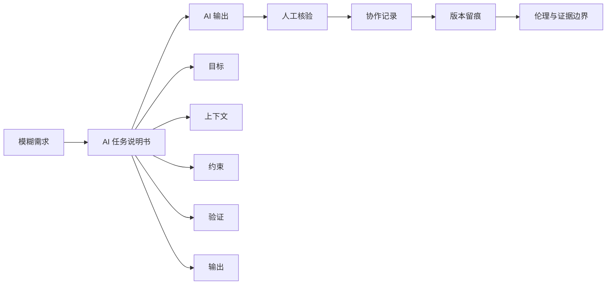

# 第3章 AI 任务说明书与协作规范

## 本章定位

本章讨论一个基础问题：学生怎样把“想让 AI 帮忙”的模糊想法，整理成 AI 可以执行、自己也能检查的任务说明书。这里的 AI 任务说明书（AI task brief）指一份结构化工作指令，至少写清目标、上下文、约束、验证和输出。

本章不追求提示词技巧堆叠。Prompt（提示词）是一次具体指令，任务说明书则是可复查、可交接的工作定义。学生后续让 AI 帮忙读数据、改代码、做图或润色报告，都应先把任务边界写清。

| 本章承接 | 本章训练 | 后续使用 |
| --- | --- | --- |
| 第2章的项目目录、规则文件和输出约定 | 任务说明书、人工核验、协作记录 | 第4章以后代码生成、图表制作、统计解释和综合项目 |

## 学习目标

学完本章后，学生应能完成四类可观察产物。

1. 能把一句模糊 Prompt 改写成五栏 AI 任务说明书。
2. 能说明 AI 生成代码后需要核验哪些位置。
3. 能记录一次 AI 协作过程，包括提示词、输出摘要、人工修改和测试结果。
4. 能识别医药数据分析中的证据边界，遇到不确定内容时标注 `需补证据` 或 `需人工确认`。

## 阅读指南

本章先讲任务说明书，再讲代码核验和留痕。顺序不能反过来。任务没有定义清楚时，后面的代码、图表和报告都会跟着偏。

读本章时，请把自己放在一个真实上机作业里：你拿到一张课堂练习数据表，想让 AI 帮你生成清洗计划或检查代码。你要做的不是让 AI 直接“给答案”，而是让它在边界内完成一项可以检查的任务。

| 阅读时要抓住 | 具体问题 |
| --- | --- |
| 任务边界 | AI 能读什么，不能改什么，不能推断什么 |
| 验证方式 | 代码怎么跑，结果怎么查，解释怎么限 |
| 协作证据 | 哪些记录能证明学生做过人工判断 |

## 核心概念速查

| 概念 | 本章解释 | 常见混淆 | 英文或缩写 |
| --- | --- | --- | --- |
| Prompt | 一次交给 AI 的具体指令文本 | 把 Prompt 当成万能公式 | Prompt |
| AI 任务说明书 | 结构化工作指令，至少含目标、上下文、约束、验证和输出 | 只写“帮我分析” | AI task brief |
| 上下文 | 影响 AI 判断和执行的必要材料 | 把所有资料都塞进去 | context |
| 约束 | 明确不能做什么、做到哪一步、何时停下 | 只写“注意准确” | constraint |
| 验证 | 检查输出是否达标的方法和标准 | 只看回答是否顺眼 | verification |
| 人在回路 | 人负责方法选择、代码审查、结果解释和伦理判断 | 让 AI 自动完成全部分析 | human in the loop |
| AI 协作记录 | 保留关键 Prompt、AI 输出、人工修改、核验和反思 | 只贴最终答案 | AI collaboration record |

## 章节总览图



这张图给出本章的工作顺序。先写清任务，再让 AI 输出；先核验，再记录；涉及医药数据解释时，最后还要回到伦理和证据边界。

## 3.1 从提示词到任务说明书

很多学生第一次使用 AI 时，会直接输入一句话：“帮我分析这个数据。”这句话可以启动对话，却很难支持一项作业。AI 不知道数据来自哪里，也不知道学生要交表格、代码、图表还是解释。

Prompt 的作用是发起一次请求。任务说明书的作用是定义一项工作。两者都可以使用自然语言，但任务说明书必须让人看得出任务范围、可用材料、禁止事项、检查方法和交付物。

| 写法 | 示例 | 主要风险 |
| --- | --- | --- |
| 模糊 Prompt | 帮我分析这个数据 | AI 自行猜目标和方法 |
| 稍清楚的 Prompt | 帮我检查 ALT 和 AST 的缺失值 | 没有说明数据边界和输出要求 |
| AI 任务说明书 | 请根据给定字段生成清洗检查表，不改原始数据，无法确认处标 `需人工确认` | 可执行，可检查，可交接 |

以课堂模拟数据为例，假设数据字段包括 `sample_id`、`group`、`age`、`sex`、`ALT`、`AST`、`adverse_event` 和 `visit_date`。这些字段足以演示清洗计划，但不能支持任何真实临床结论。正文后续涉及该数据时，都只把它当作教学场景。

一个合格的任务说明书可以这样写。

```text
目标：
请根据给定字段，生成一份医药数据清洗检查表。

上下文：
- 课程章节：第3章 AI 任务说明书与协作规范。
- 数据用途：课堂模拟练习，不用于临床判断。
- 字段包括 sample_id、group、age、sex、ALT、AST、adverse_event、visit_date。
- 学生刚开始学习数据读取和代码核验。

约束：
- 不改动原始数据。
- 不新增样本量、P 值、医学因果或药物疗效结论。
- 无法确认的字段含义或处理规则，标注 `需人工确认`。

验证：
- 每条清洗建议都要说明检查方法。
- 检查是否覆盖缺失值、异常值、重复 ID、日期格式和变量类型。
- 检查解释是否超过课堂模拟数据支持范围。

输出：
用表格输出：字段、可能问题、检查方法、处理建议、需确认事项。
```

这份说明书没有让 AI 直接判断“哪组药物更有效”。它只要求生成清洗检查表，并明确数据用途和禁止推断内容。学生随后可以用它检查 AI 输出是否跑偏。

## 3.2 目标、上下文、约束、验证与输出

五栏结构是本章最重要的工具。它不要求学生写长文，而是要求关键栏位齐全。缺目标，AI 会猜方向；缺约束，任务会扩张；缺验证，输出看上去完成了，却无法判断是否合格。

| 栏位 | 要回答的问题 | 医药数据课程写法 | 常见错误 |
| --- | --- | --- | --- |
| 目标 | 要交付什么 | 生成清洗表、审阅代码、改写图注、检查统计解释 | 只写“分析一下” |
| 上下文 | 依据什么判断 | 课程章节、数据字段、已有代码、学生背景 | 资料堆太多，重点不清 |
| 约束 | 哪些不能做 | 不改原始数据，不新增医学结论，不泄露敏感信息 | 只写“注意严谨” |
| 验证 | 怎么算完成 | 运行代码、核对列名、检查图表编码、标注疑点 | 没有通过标准 |
| 输出 | 如何交接 | 文件名、表格字段、保存路径、状态说明 | 只管格式，不管下一步 |

目标栏要具体到可以判断是否完成。比如“帮我优化图表”太宽，可以改成“请检查箱线图代码是否正确映射 `group` 和 `ALT`，并指出图注缺少哪些信息”。这样学生能根据输出逐项核验。

上下文栏只放会影响任务的信息。课程章节、数据字段、已有代码和输出要求通常是必要信息。与本次任务无关的长篇材料不宜全部塞入，避免 AI 把注意力放到无关内容上。

| 上下文类型 | 应写内容 | 不宜写入 |
| --- | --- | --- |
| 课程背景 | 第几章、学生已学什么 | 与本章无关的整份教材 |
| 数据背景 | 字段名、变量含义、数据用途 | 未核实的样本结论 |
| 工作现场 | 文件路径、已有代码、输出位置 | 临时闲聊和无关截图 |

约束栏要写成可执行规则。弱约束写“尽量不要改原始数据”，强约束写“不修改 `参考资料/` 和原始数据文件，只在 `outputs/` 生成结果”。强约束能直接变成检查标准。

验证栏要让学生知道怎样查错。对代码任务，验证包括能否运行、路径是否正确、列名是否存在、变量类型是否符合分析需求。对解释任务，验证包括是否区分观察结果、方法来源和允许解释。

输出栏解决交接问题。一个任务如果没有说明输出格式和保存位置，后续很难进入复查和评分。本课程中，建议学生写清文件名、表格字段、代码块范围和状态说明。

## 3.3 AI 辅助代码生成与人工核验

AI 可以帮助学生生成代码、解释报错、提出修改方案。这个能力很有用，但不能替代学生读代码。代码能运行，只说明语法和环境大致通过；分析是否正确，还要看路径、数据、变量、方法和解释。

生成式 AI 的输出可能不稳定，也可能在信息不足时做隐藏假设。比如列名没有给清楚时，AI 可能自己假设一个列名；数据语言、缺失值或分组规则没有说明时，AI 可能给出能运行但不适合当前数据的代码。

| 核验位置 | 学生要查什么 | 发现问题时怎么处理 |
| --- | --- | --- |
| 文件路径 | 读取的是不是指定文件 | 改路径，不改原始数据 |
| 列名 | 代码中的列名是否存在 | 对照数据字典或实际表头 |
| 数据类型 | 数值、分类、日期是否匹配 | 必要时转换并记录 |
| 缺失值 | 是否考虑空值或异常格式 | 先检查分布，再定规则 |
| 统计口径 | 分组、筛选、汇总是否符合任务 | 写明口径，避免默认处理 |
| 输出结果 | 表格、图形和解释是否对应 | 不对应时回到任务说明书 |

下面是一份课堂练习中的核验提示。它不要求学生理解所有高级语法，但要求学生能抓住关键点。

```text
请审阅下面的 Python 代码。

检查重点：
1. 是否读取指定 CSV 文件。
2. 是否使用了真实存在的列名。
3. 是否在计算 ALT、AST 汇总前处理缺失值。
4. 是否把 group 当作分类变量。
5. 是否把课堂模拟数据写成真实医学结论。

输出：
用表格列出问题、影响、修改建议和需人工确认事项。
```

涉及医药数据时，核验还要加一层解释边界。若代码输出“某组 ALT 均值更高”，这只是一个数据观察。它不能自动变成“某药导致肝损伤”。要写成医学解释，至少需要明确样本来源、分组定义、统计方法、混杂因素和研究设计。当前材料没有提供这些内容时，应标注 `需补证据`。

| 表述 | 证据状态 | 建议写法 |
| --- | --- | --- |
| 代码计算出 A 组 ALT 均值高于 B 组 | 数据观察 | A 组在该模拟表中的 ALT 均值较高 |
| A 组药物导致 ALT 升高 | 证据不足 | 需补证据 |
| 该结果提示需要复核分组和异常值 | 可写 | 建议检查分组定义、缺失值和异常值 |

## 3.4 AI 协作记录与版本留痕

课程要求学生提交 AI 协作记录与反思报告。这个记录不是为了展示“我用了 AI”，而是为了证明学生审阅过 AI 输出，并能说明哪些内容由人工修改、哪些内容仍不确定。

最低限度的 AI 协作记录应包含七项：任务、原始 Prompt、AI 输出摘要、人工核验、修改记录、最终结果和反思。记录不需要贴满所有对话，但关键版本要能追踪。

| 字段 | 记录什么 | 不合格写法 |
| --- | --- | --- |
| 任务 | 这次让 AI 做什么 | 只写“问了 AI” |
| 原始 Prompt | 关键提示词版本 | 只贴最终答案 |
| AI 输出摘要 | AI 给出的主要建议或代码 | 不区分 AI 和人工 |
| 人工核验 | 跑了什么、查了什么、发现什么 | 只写“已检查” |
| 修改记录 | 人工改了哪些内容，为什么改 | 不说明改动理由 |
| 最终结果 | 最终表格、代码、图或说明 | 结果和任务对不上 |
| 反思 | 下次如何改进任务说明书 | 空泛写“继续努力” |

版本留痕可以从文件命名做起。比如将作业输出放入指定文件夹，文件名写明日期、章节和内容。这样即使不使用 Git，也能初步追踪不同版本。

Git 是版本控制工具。对本课程来说，学生不需要一开始掌握所有命令，但要理解三个用途：记录改动、查看差异、必要时回退。AI 参与后，一轮对话可能改动多个文件，`git status` 和 `git diff` 能帮助学生看清改动范围。

| 操作 | 作用 | 本章使用边界 |
| --- | --- | --- |
| `git status` | 查看哪些文件发生变化 | 用于确认现场 |
| `git diff` | 查看文件具体改了什么 | 用于人工审阅 |
| `git add <file>` | 选择本次纳入记录的文件 | 不建议初学者直接 `git add .` |
| `git commit -m "..."` | 形成一个版本节点 | 提交信息写清本次目标 |

一条好的提交信息不需要复杂，但要看得出本次工作。例如 `docs: write chapter 3 task brief workflow` 比 `update` 更容易复查。对课程作业来说，文件命名、AI 协作记录和 Git diff 截图都可以作为版本留痕的一部分。

## 3.5 学术诚信、数据伦理与隐私保护

AI 生成的文本、代码和图表都需要人工核验。学生不能把 AI 输出包装成未经审查的个人结论，也不能让 AI 伪造数据、文献、P 值、样本量或实验结果。

学术诚信首先体现在来源和过程透明。使用 AI 辅助时，应说明 AI 参与了哪些环节，例如代码报错解释、图注初稿、清洗检查表整理。学生仍要对最终提交内容负责。

| 场景 | 可以让 AI 做什么 | 学生必须做什么 |
| --- | --- | --- |
| 代码报错 | 解释错误原因，给出修改建议 | 运行代码并核对输出 |
| 数据清洗 | 提出检查项 | 决定规则并记录理由 |
| 图表说明 | 润色图注结构 | 核对变量、编码和解释边界 |
| 结果解释 | 帮助整理可能的表述 | 区分观察、方法和仍需验证内容 |

数据伦理和隐私保护在医药课程中更敏感。涉及患者、临床检查、用药记录或其他敏感信息时，应先确认数据是否允许上传给外部 AI 工具。若无法确认，应使用脱敏后的示例、局部字段说明或本地工具完成任务。

生成式 AI 数据分析资料提醒我们，上传数据文件可能带来隐私和可靠性问题。数据格式不干净、上下文不足或预处理错误，都可能让模型产生误读。本课程默认学生不要上传含个人身份信息或敏感健康信息的数据。

| 风险 | 课程处理方式 |
| --- | --- |
| 个人身份信息泄露 | 不上传，先脱敏，无法确认时标 `需人工确认` |
| AI 编造医学解释 | 不采信，改为 `需补证据` |
| 自动标签评估自动标签 | 不用 AI 自评 AI 标注质量，保留人工核验 |
| 课堂数据被写成临床建议 | 限定为教学观察，不写诊疗建议 |

本章采用一个保守原则：凡是涉及临床建议、药物疗效、疾病风险、机制解释和患者隐私的内容，如果材料没有直接支持，就不能写成确定结论。可以提出检查方向，但要标注证据缺口。

## 案例任务：把模糊请求改成可提交任务

课堂练习可以从一条模糊请求开始。

```text
帮我看看这个医药数据怎么处理。
```

这句话的问题不在于短，而在于缺少边界。学生需要把它改写成任务说明书，并说明自己如何检查 AI 输出。

| 改写栏位 | 学生版本示例 |
| --- | --- |
| 目标 | 生成一份课堂模拟医药数据清洗检查表 |
| 上下文 | 字段包括 sample_id、group、age、sex、ALT、AST、adverse_event、visit_date |
| 约束 | 不改原始数据，不新增医学结论，疑点标 `需人工确认` |
| 验证 | 检查是否覆盖缺失、异常、重复 ID、日期格式和变量类型 |
| 输出 | 表格列出字段、可能问题、检查方法、处理建议、需确认事项 |

学生提交时，还应附一份协作记录。教师可以根据记录判断学生是否只是复制 AI 输出，还是完成了人工审阅。

## 常见误区

| 误区 | 为什么有风险 | 修正方式 |
| --- | --- | --- |
| 把 Prompt 当成万能公式 | 任务边界没有定义，AI 会补假设 | 使用五栏任务说明书 |
| 只看代码能不能运行 | 运行通过不代表统计口径正确 | 增加路径、列名、类型和结果核验 |
| 只贴 AI 最终答案 | 看不出人工判断过程 | 记录 Prompt、核验和修改 |
| 把课堂数据写成医学结论 | 材料不足，可能越界 | 写成教学观察，标注 `需补证据` |
| 上传敏感数据给 AI | 可能违反隐私要求 | 先脱敏或改用本地处理 |

## 核验清单

- 根目录 `大纲.md` 中本章标题和五个小节未改变。
- 本章正文按 `chapters/chapter-3/本章大纲.md` 展开。
- 每个关键术语首次出现时给出简明解释。
- AI 任务说明书包含目标、上下文、约束、验证和输出。
- AI 生成代码后，至少检查路径、列名、数据类型、缺失值、统计口径和输出结果。
- 医药解释区分数据观察、方法来源、允许解释和仍需验证内容。
- 证据不足处使用 `需补证据` 或 `需人工确认`。
- 协作记录包含 Prompt、AI 输出摘要、人工修改、核验结果和反思。
- 不把课堂模拟数据写成真实临床建议。

## 知识图谱生成提示词

本章没有使用 `imagegen` 生成图片。若后续需要制作教学展示图，建议先用下面的提示词生成结构草图，再用 Mermaid 或表格人工核验节点和关系。

```text
请根据《医药数据处理与可视化》第3章“AI任务说明书与协作规范”生成一张知识图谱。

节点必须包括：
1. Prompt
2. AI任务说明书
3. 目标
4. 上下文
5. 约束
6. 验证
7. 输出
8. AI辅助代码生成
9. 人工核验
10. AI协作记录
11. 版本留痕
12. 学术诚信
13. 数据伦理
14. 隐私保护
15. 需补证据
16. 需人工确认

关系要求：
- Prompt 指向 AI任务说明书，关系为“升级为”。
- AI任务说明书 包含 目标、上下文、约束、验证、输出。
- AI辅助代码生成 必须连接 人工核验。
- 人工核验 连接 AI协作记录。
- AI协作记录 连接 版本留痕。
- 学术诚信、数据伦理、隐私保护共同限制 AI协作。
- 需补证据 和 需人工确认 连接所有证据不足或无法确认的解释。

输出要求：
- 不生成医学结论。
- 不新增样本量、P 值、临床建议或机制解释。
- 若图中节点文字不清，必须另附 Mermaid 或表格版结构。
```

## 本章小结

第三章的核心不是让学生写出更漂亮的提示词，而是让每一次 AI 协作都有定义、有检查、有记录。任务说明书负责定义工作，人工核验负责判断结果，协作记录和版本留痕负责留下证据，伦理边界负责提醒学生哪些内容不能越过材料支持范围。

后续章节会继续使用这套方法。读数据前，先写任务；让 AI 生成代码后，先核验；解释医药结果时，先看证据边界。这个顺序能帮助学生把 AI 作为学习和分析工具，而不是把判断责任交出去。

## 需补证据

| 位置 | 当前缺口 | 正文处理 |
| --- | --- | --- |
| 课堂模拟数据 | 未提供真实数据文件 | 只使用字段级示例 |
| 机构 AI 使用政策 | 未提供正式政策文本 | 写作中使用 `需人工确认` 边界 |
| 平台隐私条款 | 不同平台会变化 | 不写具体平台建议 |
| AI 代码准确率 | 材料未给本课程场景下的准确率 | 不写百分比结论 |
