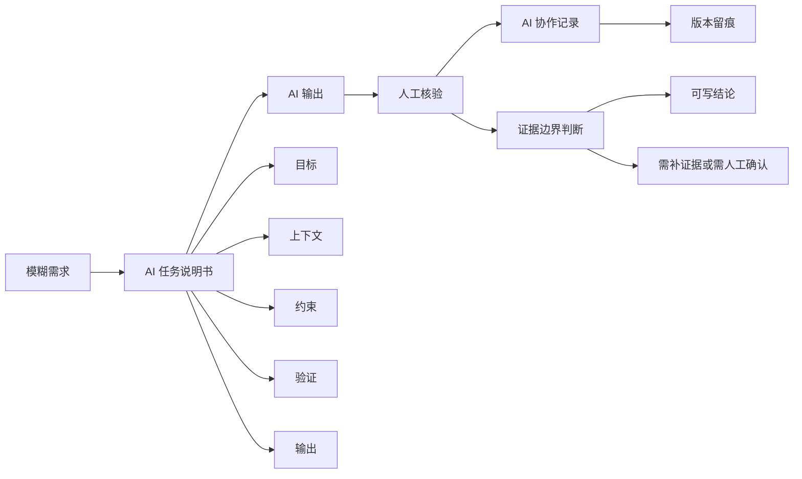
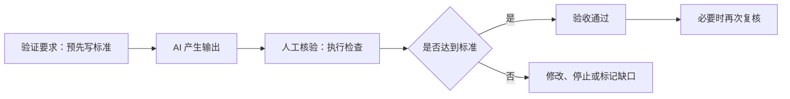

# 第3章 AI 任务说明书与协作规范

## 本章定位

第三章是全书的协作规范接口。第1章要求学生先说明问题、数据对象和证据边界，第2章把任务放入具体项目目录和工具环境。本章继续完成任务定义：学生要把提示词（Prompt）整理成 AI 能执行、自己能核验、教师能验收的任务说明书。

AI 任务说明书（AI task brief）是一份结构化工作指令，固定包含目标、上下文、约束、验证和输出。后续章节可以增加输入、参数、允许操作、禁止操作、输出格式或人工验收等字段，这些字段仍应回到五项骨架。

| 章节 | 进入本章前或离开本章后应有的学习证据 |
| --- | --- |
| 第1章 | 问题说明、数据对象、证据边界和“一章六问”记录 |
| 第2章 | 项目现场、规则文件、当前工作目录、Plan/Build 权限和输出约定 |
| 第3章 | AI 任务说明书、人工核验方法、`ai_log.md` 和版本留痕 |
| 第4章 | 按说明书亲手运行最小代码，解释输入、处理、输出和报错 |

本章处在第一阶段“原生语感培养”。AI 可以解释概念和报错，逐行说明已有短代码，生成最小检查片段，或列出核验项。学生仍要亲手运行代码、核对数据并承担解释责任。完整分析脚本、清洗规则、统计结论和作业答案不属于本阶段的 AI 代写范围。

| 课程阶段 | 章节 | AI 可以承担的工作 | 学生保留的责任 |
| --- | --- | --- | --- |
| 原生语感培养 | 第1至4章 | 名词解释、报错翻译、已有代码说明、最小检查片段 | 亲手运行、逐行解释、核对对象和输出 |
| 提示词编程（Prompt Coding） | 第5至10章 | 局部代码、调试建议、图表或结果表草稿 | 字段含义、清洗规则、统计前提和医学解释 |
| 意图驱动协作（Vibe Coding） | 第11至15章 | 较长流程框架、参数表、复核清单 | 实验设计、复现边界、证据强度和专业判断 |

## 学习目标

完成本章后，学生应能提交以下学习证据。

1. 把一句模糊提示词改写成包含五项骨架的 AI 任务说明书。
2. 审阅 AI 生成代码，检查路径、列名、数据类型、缺失值、筛选条件和输出结果。
3. 区分验证要求、人工核验、验收和复核，并在合适阶段使用这些词。
4. 用 `ai_log.md` 记录任务、提示词、AI 输出、人工核验、修改和最终结果。
5. 识别医药数据分析中的证据边界，遇到不确定内容时标注 `需补证据` 或 `需人工确认`。

## 阅读指南

本章从一次上机作业开始。学生拿到课堂练习表，希望 AI 帮助检查清洗思路或解释代码。开始协作前，学生要写清 AI 可以读取什么、可以执行什么、何时必须停止，以及自己怎样检查结果。

贯穿案例是一张模拟肝功能课堂数据表。它只演示任务说明书、代码核验、协作记录和上传决策。第8至10章另有统计教学数据，本章案例不与后续案例共享数值，也不用于临床判断。

| 阅读时要抓住 | 具体问题 |
| --- | --- |
| 任务边界 | AI 能读什么材料，不能改什么文件，不能推断什么结论 |
| 验证要求 | 预先规定检查方法、通过标准和停止条件 |
| 协作证据 | 哪些记录能证明学生做过人工判断 |
| 医药边界 | 哪些句子只是数据观察，哪些句子需要研究设计或文献支持 |

## 核心概念速查

| 概念 | 本章解释 | 常见混淆 | 英文或缩写 |
| --- | --- | --- | --- |
| 提示词 | 一次交给 AI 的具体指令文本 | 把提示词当成万能公式 | Prompt |
| AI 任务说明书 | 结构化工作指令，至少含目标、上下文、约束、验证和输出 | 只写“帮我分析” | AI task brief |
| 上下文 | 影响 AI 判断和执行的必要材料 | 把所有资料都塞进去 | context |
| 约束 | 明确不能做什么、做到哪一步、何时停下 | 只写“注意准确” | constraint |
| 验证要求 | 任务开始前写明检查方法、通过标准和停止条件 | 只写“运行一下” | verification requirements |
| 人工核验 | 对照数据、规则和真实输出检查 AI 结果 | 追问 AI“你确定吗” | human verification |
| 验收 | 根据验证要求判断交付物是否可用 | 把代码运行成功当作全部标准 | acceptance |
| 复核 | 在已有核验后再次或独立审阅 | 与第一次检查混写 | review |
| 人在回路 | 人负责方法选择、代码审查、结果解释和伦理判断 | 让 AI 自动完成全部分析 | human in the loop |
| AI 协作记录 | 保留关键提示词、AI 输出、人工修改、核验和反思 | 只贴最终答案 | AI collaboration record |
| 版本留痕 | 用文件命名、修改记录或 Git 记录保留变更证据 | 最后随手保存一个文件 | version trace |

## 章节总览图



任务从说明书开始。AI 产生输出后，学生按照预设要求完成人工核验，再决定是否验收，并把任务、修改和未解决事项写入协作记录。医药数据解释还要分开记录观察结果、方法来源、允许解释、替代解释和仍需验证内容。

## 3.1 从提示词到任务说明书

课堂练习从一句失败请求开始：“帮我看看这个医药数据怎么处理。”AI 无法从中判断数据来源、字段含义、允许操作和交付物，也不知道哪些结论需要停止生成。学生同样缺少可用于核验的标准。

提示词发起一次请求。AI 任务说明书定义一项交给 AI 的工作，必须写清任务范围、可用材料、权限、检查方法和输出。第15章的项目任务说明书覆盖完整项目，内容还包括研究问题、数据对象、分析路线和多项交付物。一项项目可以包含多份 AI 任务说明书。

| 名称 | 覆盖范围 | 本书中的用途 |
| --- | --- | --- |
| 提示词 | 一次对话或一次请求的具体文字 | 保留关键版本，作为协作记录的一部分 |
| AI 任务说明书 | 一项交给 AI 的明确工作 | 约束代码、图表、审阅或文字任务 |
| 项目任务说明书 | 跨步骤的完整项目 | 组织第15章综合项目及其交付物 |

| 写法 | 示例 | 主要风险 |
| --- | --- | --- |
| 模糊提示词 | 帮我分析这个数据 | AI 自行猜目标、字段和方法 |
| 稍清楚的提示词 | 帮我检查 ALT 和 AST 的缺失值 | 没有说明数据边界、验证和输出要求 |
| AI 任务说明书 | 请根据给定字段生成清洗检查表，不改原始数据，无法确认处标 `需人工确认` | 可执行、可检查、可交接 |

### 连续案例：模拟肝功能课堂数据

本章后续使用同一个模拟场景。假设学生拿到一张课堂数据表，字段包括 `sample_id`、`group`、`age`、`sex`、`ALT`、`AST`、`adverse_event` 和 `visit_date`。ALT 和 AST 是常见肝功能相关实验室指标，本章只把它们当作数值变量，用来演示代码核验。

这是一张独立构造的教学脏数据表，不与第8至10章统计案例共享数值。它只支持字段检查和代码核验，不能用于药物疗效、肝损伤机制或临床建议。

| 字段 | 本章使用方式 | 不能直接推出 |
| --- | --- | --- |
| `group` | 课堂分组变量 | 真实治疗分组 |
| `ALT`、`AST` | 数值变量，用于演示缺失值和汇总 | 肝损伤机制或诊断 |
| `adverse_event` | 分类变量，用于演示字段核对 | 不良反应发生率结论 |
| `visit_date` | 日期变量，用于演示格式检查 | 随访设计是否合理 |

一条模糊请求可以先改成下面这份说明书。

```text
目标：
请根据给定字段，生成一份医药数据清洗检查表。

上下文：
- 课程章节：第3章 AI 任务说明书与协作规范。
- 数据用途：课堂模拟练习，不用于临床判断。
- 字段包括 sample_id、group、age、sex、ALT、AST、adverse_event、visit_date。
- 学生刚开始学习数据读取和代码核验。

约束：
- 不改动原始数据。
- 不新增样本量、P 值、医学因果或药物疗效结论。
- 无法确认的字段含义或处理规则，标注 `需人工确认`。

验证：
- 每条清洗建议都要说明检查方法。
- 检查是否覆盖缺失值、异常值、重复 ID、日期格式和变量类型。
- 检查解释是否超过课堂模拟数据支持范围。
- 如果字段不存在、权限不明或需要医学判断，停止生成处理结论并列出缺口。

输出：
用表格输出：字段、可能问题、检查方法、处理建议、需确认事项。
```

该说明书只要求生成清洗检查表，并写清数据用途、禁止推断内容、检查方法和停止条件。AI 输出产生后，学生还要逐项完成人工核验。

### 本节学生操作

学生先圈出原请求中缺失的信息，再填写五项骨架。若目标同时包含清洗、统计检验、医学解释和报告写作，应拆成多份任务说明书。每份说明书只保留一个主要交付目标。

| 误区检查 | 判断依据 |
| --- | --- |
| 提示词写得长就等于任务清楚 | 长度不构成标准，五项信息和停止条件才可检查 |
| 一份任务说明书覆盖整个综合项目 | 综合项目需要项目说明书，并为各阶段另写 AI 任务说明书 |

## 3.2 目标、上下文、约束、验证与输出

五项骨架要求任务信息齐全，不要求始终使用五列表格。短任务可以写成五段文字，复杂任务可以拆出输入、参数、允许操作、禁止操作、输出格式和人工验收。拆分后的字段仍要能映射回目标、上下文、约束、验证和输出。

| 栏位 | 要回答的问题 | 医药数据课程写法 | 常见错误 |
| --- | --- | --- | --- |
| 目标 | 要交付什么 | 生成清洗表、审阅代码、改写图注、检查统计解释 | 只写“分析一下” |
| 上下文 | 依据什么判断 | 课程章节、数据字段、已有代码、学生背景 | 资料堆太多，重点不清 |
| 约束 | 哪些不能做 | 不改原始数据，不新增医学结论，不泄露敏感信息 | 只写“注意严谨” |
| 验证 | 怎么检查、何时通过或停止 | 运行代码、核对列名、检查图表编码、标注疑点 | 没有通过标准和停止条件 |
| 输出 | 如何交接 | 文件名、表格字段、保存路径、状态说明 | 只管排版，不管下一步 |

后续章节会按任务复杂度展开五项骨架。字段名称发生变化时，学生应先完成映射，再检查是否有信息缺口。

| 后续扩展字段 | 对应五项 | 说明 |
| --- | --- | --- |
| 输入、数据对象、已有材料 | 上下文 | 说明 AI 依据什么工作 |
| 参数、允许操作、禁止操作 | 约束 | 固定运行范围和不可越过的边界 |
| 人工验收、运行检查 | 验证 | 预设检查方法、通过标准和停止条件 |
| 输出格式、保存路径、状态 | 输出 | 说明生成什么以及如何交接 |

第14章把任务说明书展开为“任务目标、输入、允许操作、禁止操作、输出格式、人工验收”。这种写法信息更细，仍沿用本章五项骨架。第15章的项目任务说明书范围更大，一项项目中的代码审阅、图表复核和报告改写还要分别填写 AI 任务说明书。

### 目标栏：把愿望改成产物

目标栏要具体到可以判断是否完成。“帮我优化图表”范围太宽，可以改成“请检查箱线图代码是否正确映射 `group` 和 `ALT`，并指出图注缺少哪些信息”。学生可以据此逐项核验输出。

| 模糊目标 | 可执行目标 |
| --- | --- |
| 帮我分析数据 | 生成一份字段级清洗检查表 |
| 帮我写代码 | 根据给定字段写读取 CSV 并统计缺失值的最小 Python 代码 |
| 帮我看结果 | 审阅当前解释是否把模拟数据写成医学结论 |

一个目标只保留一个主要动作。读数据、清洗、建模、解释和写报告应拆成多项任务，便于定位失败步骤并分别验收。

### 上下文栏：只放会影响判断的信息

上下文只保留会改变执行或判断的信息。第三章任务通常需要课程章节、学生背景、字段名、已有代码、当前工作目录和已知数据用途。

| 上下文类型 | 应写内容 | 不宜写入 |
| --- | --- | --- |
| 课程背景 | 第几章、学生已学什么 | 与本章无关的整份教材 |
| 数据背景 | 字段名、变量含义、数据用途 | 未核实的样本结论 |
| 工作现场 | 文件路径、已有代码、输出位置 | 临时闲聊和无关截图 |
| 评价要求 | 作业要交什么、教师查什么 | “越详细越好”这类空泛要求 |

上下文还要写明当前处于 Plan 或 Build。Plan 阶段只允许读取材料、列出缺口和提出方案；Build 阶段才允许修改指定文件或运行命令。权限没有说明时，AI 应停在只读建议。

### 约束栏：把边界写成规则

约束栏要写成可执行规则。弱约束写“尽量不要改原始数据”，强约束写“不修改原始数据，只生成清洗检查表和核验清单”。强约束能直接变成检查标准。

| 边界类型 | 第三章写法 |
| --- | --- |
| 资料边界 | 只使用给定字段和课堂说明，缺失信息标 `需人工确认` |
| 文件边界 | 不修改原始数据，不覆盖旧结果 |
| 医学边界 | 不新增样本量、P 值、因果关系、疗效判断或临床建议 |
| 主动性边界 | 发现字段缺失或解释越界时先报告，不自行补结论 |
| 权限边界 | 写明 Plan/Build、可读路径、可写路径和是否允许运行命令 |
| 上传边界 | 未确认授权时不向外部平台发送患者或受限数据 |

约束应能转成核验项目。以下情况触发停止条件：缺少必需字段，无法确认数据含义，写入路径超出授权范围，需要上传受限数据，或任务要求医学、统计或伦理判断却没有相应证据。

### 验证栏：让完成状态可判定

验证栏在任务开始前填写，回答“怎样检查、达到什么标准、何时停止”。代码任务要写运行方式、预期字段和关键输出。解释任务要写允许使用的证据、越界表述和需人工确认项。

| 任务类型 | 验证方式 |
| --- | --- |
| 清洗检查表 | 是否覆盖缺失值、重复 ID、异常值、日期格式和变量类型 |
| 代码审阅 | 是否能运行，是否使用真实列名，是否保留原始数据 |
| 图表说明 | 是否说明 x、y、颜色、样本单位和解释边界 |
| 医药解释 | 是否标出 `需补证据` 或 `需人工确认` |

验证要求、人工核验和验收按时间顺序发生。复核位于验收之后，可由同伴、教师或独立流程再次检查。



### 输出栏：让结果能交接

输出栏写明 AI 或程序应生成什么，包括格式、字段、文件名、保存路径和状态。交付物是学生最后提交的文件或材料，学习证据则是交付物中能证明学生完成判断和核验的内容。

```text
输出：
1. 一张清洗检查表。
2. 一份人工核验清单。
3. 标出 `需人工确认` 的字段或规则。
4. 不写最终医学结论。
```

例如，AI 输出可以是一段代码和一张风险表；学生提交的交付物还应包括运行结果、人工修改和核验记录。这些记录构成学习证据。

### 本节学生操作

学生把第14章扩展版字段映射回五项骨架，再为本章模拟表填写 Plan 版和 Build 版说明书。两版的目标可以相同，权限、验证要求和输出状态必须不同。

## 3.3 AI 辅助代码生成与人工核验

第一阶段只开放三类代码协作：解释学生已有的短代码，生成用于核对字段或输出的最小片段，根据报错提出候选修改。完整分析脚本、清洗决策、统计方法和医学解释由后续章节逐步训练。

代码核验按五步进行。学生先保存 AI 初稿，再对照任务说明书查找假设，完成最小修改并亲手运行，最后依据验证要求决定是否验收。运行成功只能证明当前代码在当前环境中执行完毕。


生成式 AI 在信息不足时可能补入隐藏假设。未提供列名时，它可能自行构造字段；缺失值规则没有说明时，它也可能生成能运行却不符合当前数据用途的处理代码。

| 核验位置 | 学生要查什么 | 发现问题时怎么处理 |
| --- | --- | --- |
| 文件路径 | 读取的是不是指定文件 | 改路径，不改原始数据 |
| 列名 | 代码中的列名是否存在 | 对照数据字典或实际表头 |
| 数据类型 | 数值、分类、日期是否匹配 | 必要时转换并记录 |
| 缺失值 | 是否考虑空值或异常格式 | 先检查分布，再定规则 |
| 统计口径 | 分组、筛选、汇总是否符合任务 | 写明口径，避免默认处理 |
| 输出结果 | 表格、图形和解释是否对应 | 不对应时回到任务说明书 |

### AI 初稿的常见问题

下面是一段待审阅的 AI 初稿。

```python
import pandas as pd

df = pd.read_csv("data.csv")
print(df.groupby("drug").mean())
```

这段代码包含四个需要核验的假设：文件名 `data.csv` 没有对应课堂路径；字段中没有 `drug`，实际分组字段是 `group`；`mean()` 会对所有可计算数值列求均值；代码没有检查缺失值、重复 ID 和日期格式。

| 问题 | 为什么要改 | 可接受处理 |
| --- | --- | --- |
| 路径泛化 | 无法确认读取了哪个文件 | 写清文件路径或用课堂给定路径 |
| 列名猜测 | 代码会报错或错用变量 | 对照实际表头 |
| 汇总口径不清 | 均值可能包含不该汇总的变量 | 指定 `ALT`、`AST` |
| 无核验步骤 | 运行通过也可能漏掉数据问题 | 先做字段和质量检查 |

### 可运行的最小核验案例

下面的代码使用内嵌模拟数据。学生可以复制运行，并逐行标出输入、处理和输出。该代码只演示字段与质量核验。

```python
import pandas as pd
from io import StringIO

csv_text = """sample_id,group,age,sex,ALT,AST,adverse_event,visit_date
S01,control,45,F,32,28,no,2026-03-01
S02,treatment,52,M,85,67,yes,2026-03-01
S03,treatment,,F,,54,no,2026/03/08
S04,control,38,M,29,31,no,2026-03-08
S04,control,38,M,29,31,no,2026-03-08
"""

df = pd.read_csv(StringIO(csv_text))

required_cols = [
    "sample_id", "group", "age", "sex",
    "ALT", "AST", "adverse_event", "visit_date"
]

missing_cols = [col for col in required_cols if col not in df.columns]
print("缺失字段:", missing_cols)

missing_values = df[required_cols].isna().sum()
print("存在缺失值的字段:")
print(missing_values[missing_values > 0])

duplicated_rows = df["sample_id"].duplicated(keep=False).sum()
print("涉及重复 sample_id 的行数:", duplicated_rows)

nonstandard_date = (
    ~df["visit_date"].astype(str).str.match(r"^\d{4}-\d{2}-\d{2}$")
).sum()
print("非 YYYY-MM-DD 日期行数:", nonstandard_date)

alt_summary = df.groupby("group", dropna=False)["ALT"].agg(["count", "mean"])
print("按 group 汇总 ALT，供核验用:")
print(alt_summary)
```

预期输出包括：必需字段均存在；`age` 和 `ALT` 各有 1 个缺失值；2 行涉及重复 `sample_id`；1 行日期不符合 `YYYY-MM-DD`；control 组 ALT 有 3 个非缺失值、均值为 30.0，treatment 组有 1 个非缺失值、均值为 85.0。最后两项只用于核对分组代码和缺失处理。

| 输出观察 | 方法来源 | 允许解释 | 替代解释 | 仍需验证 |
| --- | --- | --- | --- | --- |
| `ALT` 有缺失值 | `isna().sum()` | 该模拟表中有 ALT 未记录 | 录入缺失、暂未检测或导入错误 | 原始记录和数据字典 |
| `sample_id` 重复 | `duplicated()` | 有重复 ID 行需要复核 | 重复录入或真实重复测量 | 是否有访视编号 |
| 日期格式不一致 | 正则检查 | 日期字段需要统一格式 | 录入习惯不同或导出格式不同 | 课程数据规范 |
| treatment 组 ALT 均值较高 | 分组汇总 | 模拟表中该组均值较高 | 缺失值、重复行、样本构造影响 | 不能做医学解释 |

这张表采用生物医学结果解释的五项边界：先写输出观察和方法来源，再限定允许解释，同时保留替代解释和仍需验证内容。教学模拟表不能支持医学因果。

| 验收项目 | 通过标准 | 未通过时的处理 |
| --- | --- | --- |
| 字段检查 | `missing_cols` 为空 | 停止后续代码，回查真实表头 |
| 缺失与重复 | 输出数量与内嵌数据逐行核对一致 | 检查列选择、重复定义和缺失规则 |
| 日期格式 | 识别出斜杠日期所在行 | 检查正则表达式和字段类型 |
| 分组汇总 | 计数和均值与手工计算一致 | 检查分组字段、缺失处理和重复行 |
| 文字解释 | 只写教学观察和数据质量问题 | 删除疗效、安全性、机制或临床表述 |

### 让 AI 审阅代码时的任务说明书

学生可以把上面的核验要求写成新的 AI 任务说明书。

```text
目标：
请审阅下面的 Python 代码，指出是否符合第3章代码核验要求。

上下文：
- 数据字段包括 sample_id、group、age、sex、ALT、AST、adverse_event、visit_date。
- 数据是课堂模拟数据，不用于临床判断。
- 学生刚学习 pandas，只需要最小可运行代码。

约束：
- 不新增真实样本量、P 值、药物疗效或医学因果。
- 不改原始数据。
- 如果代码假设了未给出的列名或分组，标注 `需人工确认`。

验证：
- 检查路径、列名、缺失值、重复 ID、日期格式和分组汇总。
- 检查代码输出是否能支持文字解释。
- 必需字段缺失、变量含义不明或输出与手工核对不一致时停止验收。

输出：
用表格列出：问题、影响、修改建议、需人工确认事项。
```

这份说明书把 AI 限定为代码审阅助手。学生亲自运行代码，将实际输出与预期结果对照，并记录采纳或拒绝的修改。

### 本节学生操作

学生在 AI 初稿上逐行批注假设，再运行最小核验代码。提交材料包括初稿、修改说明、运行输出和验收结论。仅提交修改后的代码，无法证明学生完成了人工核验。

## 3.4 AI 协作记录与版本留痕

从本章开始，每章证据包使用 `ai_log.md` 保存 AI 协作记录。教师通过这份记录检查学生是否审阅过 AI 输出，哪些建议被采纳或拒绝，哪些问题仍未解决。

`ai_log.md` 至少包含七项：任务、原始提示词、AI 输出摘要、人工核验、修改记录、最终结果和反思。涉及文件修改或命令执行时，增加“工作阶段与权限”，说明当前处于 Plan 或 Build、允许读写哪些路径、是否允许运行命令。记录只保留影响任务判断的关键版本。

| 字段 | 记录什么 | 不合格写法 |
| --- | --- | --- |
| 任务 | 这次让 AI 做什么 | 只写“问了 AI” |
| 工作阶段与权限 | Plan/Build、可读路径、可写路径、命令权限 | 没有说明 AI 能否修改文件 |
| 原始提示词 | 关键提示词版本 | 只贴最终答案 |
| AI 输出摘要 | AI 给出的主要建议或代码 | 不区分 AI 和人工 |
| 人工核验 | 跑了什么、查了什么、发现什么 | 只写“已检查” |
| 修改记录 | 人工改了哪些内容，为什么改 | 不说明改动理由 |
| 最终结果 | 最终表格、代码、图或说明 | 结果和任务对不上 |
| 反思 | 下次如何改进任务说明书 | 空泛写“继续努力” |

### 协作记录样例

下面是一份可提交的课堂记录片段。

| 字段 | 学生记录示例 |
| --- | --- |
| 任务 | 让 AI 审阅模拟肝功能数据的清洗检查代码 |
| 工作阶段与权限 | Plan；只审阅粘贴的代码，不修改文件，不运行外部命令 |
| 原始提示词 | “请检查这段 pandas 代码是否覆盖路径、列名、缺失值、重复 ID 和日期格式。” |
| AI 输出摘要 | AI 建议增加必需字段检查、缺失值统计、重复 ID 检查和日期格式检查 |
| 人工核验 | 我复制代码运行，确认 `age`、`ALT` 有缺失，`S04` 出现重复，日期中有一行斜杠格式 |
| 修改记录 | 删除了 AI 输出中“比较治疗效果”的句子，改为“仅用于教学观察” |
| 最终结果 | 保存清洗检查表和代码核验清单 |
| 反思 | 下次在提示词中提前说明“不写疗效判断”，减少越界输出 |

这份记录区分了 AI 输出和人工判断。教师可以确认学生运行过代码，并识别了医学解释边界。

`ai_log.md` 可以使用下面的最小结构。学生按任务追加记录，不覆盖之前的失败和修改过程。

```markdown
# AI 协作记录

## 任务与权限
- 任务：
- 阶段：Plan / Build
- 可读范围：
- 可写范围：
- 命令权限：

## 原始提示词

## AI 输出摘要

## 人工核验与修改

## 最终结果与反思
```

### 版本留痕：从文件命名到 Git

版本留痕可以从文件命名做起。学生把作业输出放入指定文件夹，文件名写明日期、章节和内容。未使用 Git 时，修改前后对照和带日期文件名也能形成基础留痕。

| 留痕方式 | 适用场景 | 检查重点 |
| --- | --- | --- |
| 文件名 | 初学者作业 | 是否含日期、章节和内容 |
| 修改前后对照 | 文本或代码改写 | 是否能看出人工修改 |
| 截图或导出记录 | 平台型工具 | 是否保留关键提示词和结果 |
| Git diff | 项目作业 | 是否能看到具体改动 |

Git 是版本控制工具。对本课程来说，学生不需要一开始掌握所有命令，但要理解三个用途：记录改动、查看差异、必要时回退。AI 参与后，一轮对话可能改动多个文件，`git status` 和 `git diff` 能帮助学生看清改动范围。

| 记录类型 | 回答的问题 | 典型内容 |
| --- | --- | --- |
| 运行记录 | 运行了什么，输入、输出和报错是什么 | 命令、环境、退出状态、结果摘要 |
| 版本留痕 | 文件怎样变化，谁修改了什么 | 文件名、前后对照、差异截图、提交记录 |
| 版本控制 | 怎样用工具管理和回退版本 | Git 状态、差异、暂存和提交 |

| 操作 | 作用 | 本章使用边界 |
| --- | --- | --- |
| `git status` | 查看哪些文件发生变化 | 用于确认现场 |
| `git diff` | 查看文件具体改了什么 | 用于人工审阅 |
| `git add <file>` | 选择本次纳入记录的文件 | 不建议初学者直接 `git add .` |
| `git diff --cached` | 查看准备提交的改动 | 提交前再核验一次 |
| `git commit -m "..."` | 形成一个版本节点 | 提交信息写清本次目标 |

提交信息应写明本次工作。例如 `docs: add chapter 3 AI task brief exercise` 比 `update` 更容易复查。文件命名、AI 协作记录和 Git diff 截图都可以进入版本留痕。

### 本节学生操作

学生把3.3的代码审阅过程写入 `ai_log.md`，再用文件名前后对照或 Git diff 标出人工修改。协作记录、运行记录和版本留痕应指向同一份最终结果。

## 3.5 学术诚信、数据伦理与隐私保护

AI 生成的文本、代码和图表都需要人工核验。学生要说明 AI 参与了哪些环节，并对最终提交内容负责。数据、文献、P 值、样本量和实验结果必须来自可回查材料或实际运行，不能由 AI 补造。

| 场景 | 可以让 AI 做什么 | 学生必须做什么 |
| --- | --- | --- |
| 代码报错 | 解释错误原因，给出修改建议 | 运行代码并核对输出 |
| 数据清洗 | 提出检查项 | 决定规则并记录理由 |
| 图表说明 | 润色图注结构 | 核对变量、编码和解释边界 |
| 结果解释 | 帮助整理可能表述 | 区分观察、方法和仍需验证内容 |

### 案例一：核验 AI 生成的参考文献

假设 AI 为一段教材文字给出作者、题名、期刊、年份和 PMID。学生不能直接把这条记录加入参考文献。先在课程允许的数据库或出版社页面检索题名、作者和标识符，再打开摘要或全文核对该文献是否支持当前句子。

| 核验步骤 | 通过标准 | 未通过时的记录 |
| --- | --- | --- |
| 查文献是否存在 | 题名、作者、年份和标识符可以对应 | 标 `需补证据`，不补造书目信息 |
| 查内容是否支持 | 原文直接涉及当前主张 | 降低表述强度或删除引用 |
| 查引用位置 | 引用紧邻其支持的句子 | 调整引用位置，避免一条文献支撑整段 |

AI 协作记录应保存原始提示词、AI 给出的书目信息、人工检索入口和最终处理。若本轮没有完成文献核验，正文只能保留证据缺口。

### 隐私保护和数据上传边界

医药数据常涉及个人身份信息、临床检查、用药记录或其他敏感信息。将数据交给外部 AI 工具前，学生必须先确认课程、机构和数据提供方是否允许。权限不明时，停止上传并改用字段说明、模拟数据或本地代码。

去标识化（de-identification）指去除或替换能识别个人的信息。匿名化（anonymization）强调难以重新识别个人。假名化（pseudonymization）用编码替代身份标识，但在持有映射表时仍可能恢复身份。本课程中，学生只需掌握边界：不确定能否上传时，使用模拟数据、字段说明或本地代码。

| 风险 | 课程处理方式 |
| --- | --- |
| 个人身份信息泄露 | 停止上传，按课程或机构规则处理；无法确认时标 `需人工确认` |
| AI 编造医学解释 | 不采信，改为 `需补证据` |
| 用自动标注评估自动标注 | 不接受，保留人工核验或教师校准 |
| 课堂数据被写成临床建议 | 限定为教学观察，不写诊疗建议 |
| 平台条款不清 | 不写具体平台承诺，标 `需人工确认` |

### 案例二：患者字段能否上传

学生准备让外部 AI 检查一张表，字段包括姓名、电话号码、患者编号、访视日期、ALT 和 AST。即使删除姓名和电话号码，患者编号、精确日期和多项临床信息的组合仍可能带来重新识别风险。学生应先填写上传决策表。

| 决策问题 | 本案例记录 | 处理 |
| --- | --- | --- |
| 是否有明确授权 | 当前材料未提供 | 停止上传 |
| 任务是否需要逐行原始值 | 只需检查字段和代码 | 改用字段说明和模拟数据 |
| 是否含直接或间接标识信息 | 含姓名、电话、患者编号和日期 | 不发送到外部平台 |
| 是否可在本地完成 | 可以用本地 Python 检查 | 使用本地代码并保存运行记录 |

删除部分标识符不能自动证明数据已经匿名化。是否可以共享或上传，需要课程、机构和数据提供方的明确规则。

### 案例三：自动标签需要独立复核

后续单细胞章节可能使用参考模型给细胞生成候选标签。学生不能再让同一自动系统根据自己的标签判断“标注准确”。可接受的复核依据包括人工检查、教师校准样本、marker 组合、独立参考资源和供者层面的结果复核。

| 输出 | 可写表述 | 仍需核验 |
| --- | --- | --- |
| 自动模型给出某一细胞类型标签 | 当前表达谱与参考类别较相似 | marker 组合、置信度、替代标签和人工审阅 |
| AI 判断自己的代码或标签“正确” | 这是待核验建议 | 实际运行、独立标准和责任人确认 |

### 后续组学任务的预告边界

后续章节会接触 RNA-seq、单细胞和公共数据库。第三章只要求学生在任务说明书中预留以下字段，不展开 NGS 流程。

| 后续任务字段 | 说明书中要写清 | 缺失后的风险 |
| --- | --- | --- |
| 输入类型 | FASTQ、BAM、VCF、计数矩阵（count matrix）或元数据（metadata） | AI 可能给错流程 |
| 分析目标 | 质控、计数、差异表达、可视化或注释 | 任务范围膨胀 |
| 物种和参考 | 人、小鼠或其他物种，参考版本 | 基因注释或比对错误 |
| 样本设计 | 分组、批次、配对关系、重复 | 统计解释不成立 |
| 隐私和上传 | 是否允许云端或外部平台 | 数据合规风险 |

这些字段用于判断任务能否开始。输入类型、参考版本、样本设计或上传权限缺失时，先列出缺口，不直接生成完整流程。

### 证据边界写法

临床建议、药物疗效、疾病风险、机制解释和患者隐私都需要直接材料支持。当前证据不足时，可以提出检查方向，并标注证据缺口。

| 原句 | 问题 | 教材版写法 |
| --- | --- | --- |
| treatment 组 ALT 更高，说明药物有肝毒性 | 从模拟数据推出因果和毒性 | treatment 组在该模拟表中的 ALT 均值较高，解释需补证据 |
| AI 已经分析过，所以结果可靠 | 把 AI 输出当证据 | AI 输出需经过代码运行、字段核对和人工解释 |
| 数据脱敏后都可以上传 | 脱敏不等于无风险 | 是否可上传需按课程或机构规则确认 |

## 案例任务：把模糊请求改成可提交材料

课堂练习可以从一条模糊请求开始。

```text
帮我看看这个医药数据怎么处理。
```

这句话缺少任务边界。学生需要把它改写成 AI 任务说明书，并说明预设的验证要求、实际执行的人工核验和最终验收结果。

| 改写栏位 | 学生版本示例 |
| --- | --- |
| 目标 | 生成一份课堂模拟医药数据清洗检查表 |
| 上下文 | 字段包括 sample_id、group、age、sex、ALT、AST、adverse_event、visit_date |
| 约束 | 不改原始数据，不新增医学结论，疑点标 `需人工确认` |
| 验证 | 检查是否覆盖缺失、异常、重复 ID、日期格式和变量类型；关键字段不明时停止分析 |
| 输出 | 表格列出字段、可能问题、检查方法、处理建议、需确认事项 |

学生提交时，还应附上 `ai_log.md`。教师据此核对 AI 做过什么、学生修改了什么、代码是否运行，以及验收结论由谁作出。

## 图表与板书建议

本章不需要复杂统计图。课堂可以使用流程图、检查表和修改前后对照，帮助学生看见任务定义如何影响 AI 输出。

| 图表或板书 | 目的 | 必备内容 | 不可越界解释 |
| --- | --- | --- | --- |
| 五项任务说明书结构表 | 展示任务定义结构 | 目标、上下文、约束、验证、输出 | 不写成万能提示词 |
| AI 输出核验流程图 | 展示先运行再解释 | 代码运行、字段核对、边界判断 | 不写成 AI 自动负责 |
| 协作记录样表 | 展示学习证据 | 提示词、输出摘要、人工修改 | 不要求贴所有闲聊 |
| 证据边界表 | 区分观察和解释 | 观察、方法、允许解释、仍需验证 | 不写临床建议 |

## AI 协作点

| 场景 | 可让 AI 做什么 | 学生必须核验什么 |
| --- | --- | --- |
| 写任务说明书 | 检查五项是否齐全 | 目标是否可判定，约束是否明确 |
| 解释代码 | 逐行说明代码功能 | 代码是否真的使用给定字段 |
| 修复报错 | 根据报错提出最小修改 | 修改后是否能运行，是否改变分析口径 |
| 整理协作记录 | 把提示词和修改过程整理成表 | AI 输出和人工判断是否分开 |
| 检查医学解释 | 标出可能越界句子 | 是否保留 `需补证据` 或 `需人工确认` |

AI 可以帮助学生发现遗漏，但不能替代学生确认数据、运行代码和承担解释责任。

## 常见误区

| 误区 | 为什么有风险 | 修正方式 |
| --- | --- | --- |
| 把提示词当成万能公式 | 任务边界没有定义，AI 会补假设 | 使用五项任务说明书 |
| 只看代码能不能运行 | 运行通过不代表统计口径正确 | 增加路径、列名、类型和结果核验 |
| 只贴 AI 最终答案 | 看不出人工判断过程 | 记录提示词、核验和修改 |
| 把课堂数据写成医学结论 | 材料不足，可能越界 | 写成教学观察，标注 `需补证据` |
| 上传敏感数据给 AI | 可能违反授权范围或隐私要求 | 停止上传，按机构规则处理或改用本地代码 |
| 让 AI 自评 AI 标注 | 评价标准不独立 | 使用人工标注或教师确认样本 |

## 核验清单

- 根目录 `大纲.md` 中本章标题和五个小节未改变。
- 本章正文按 `chapters/chapter-3/本章大纲.md` 展开。
- 每个关键术语首次出现时给出简明解释。
- AI 任务说明书包含目标、上下文、约束、验证和输出。
- 扩展字段能够映射回五项骨架：输入归入上下文，允许操作和禁止操作归入约束，人工验收归入验证，输出格式归入输出。
- 验证栏写预设方法、通过标准和停止条件；输出产生后执行人工核验，再作出验收判断；复核用于再次或独立审阅。
- 原生语感培养阶段只允许 AI 解释已有代码、生成最小检查片段或提出核验清单。
- AI 生成代码后，至少检查路径、列名、数据类型、缺失值、统计口径和输出结果。
- 医药解释区分数据观察、方法来源、允许解释和仍需验证内容。
- 证据不足处使用 `需补证据` 或 `需人工确认`。
- `ai_log.md` 包含七项 AI 协作记录；涉及文件修改或命令执行时，另记工作阶段与权限。
- 不把课堂模拟数据写成真实临床建议。

## 知识结构与知识图谱生成提示词

本章没有使用 `imagegen` 生成图片。若后续需要制作教学展示图，建议先用下面的提示词生成结构草图，再用 Mermaid 或表格人工核验节点和关系。

```text
请根据《医药数据处理与可视化》第3章“AI 任务说明书与协作规范”生成一张知识图谱。

节点必须包括：
1. 提示词
2. AI 任务说明书
3. 目标
4. 上下文
5. 约束
6. 验证
7. 输出
8. AI 辅助代码生成
9. 人工核验
10. 验收
11. 复核
12. AI 协作记录
13. ai_log.md
14. 版本留痕
15. 学术诚信
16. 数据伦理
17. 隐私保护
18. 需补证据
19. 需人工确认

关系要求：
- 提示词 指向 AI 任务说明书，关系为“具体化为”。
- AI 任务说明书 包含 目标、上下文、约束、验证、输出。
- AI 辅助代码生成 必须连接 人工核验。
- 验证 指向 人工核验，人工核验 指向 验收，复核 指向 人工核验。
- 人工核验 连接 AI 协作记录，AI 协作记录 写入 ai_log.md。
- ai_log.md 连接 版本留痕。
- 学术诚信、数据伦理、隐私保护共同限制 AI 协作。
- 需补证据 和 需人工确认 连接所有证据不足或无法确认的解释。

输出要求：
- 不生成医学结论。
- 不新增样本量、P 值、临床建议或机制解释。
- 若图中节点文字不清，必须另附 Mermaid 或表格版结构。
```

## 实验或作业

本章作业建议用 30 到 40 分钟完成。教师提供一段模糊提示词、一段有问题的 AI 代码初稿和一份模拟字段说明，学生提交任务说明书、核验清单和协作记录。

| 交付物 | 要求 | 评分点 |
| --- | --- | --- |
| AI 任务说明书 | 使用目标、上下文、约束、验证、输出五项 | 要素齐全，边界明确 |
| 代码核验清单 | 覆盖路径、列名、缺失值、重复 ID、日期格式和解释边界 | 能发现关键错误 |
| `ai_log.md` | 保留七项 AI 协作记录；涉及文件或命令时补记阶段与权限 | 能区分 AI 输出和人工判断 |
| 反思说明 | 写清下一次如何改进任务说明书 | 具体，不写空话 |

禁止事项：不上传真实患者数据，不写临床建议，不新增样本量、P 值、疗效结论或机制解释。

## 本章小结

第三章训练学生把 AI 协作写成可定义、可核验、可留痕的学习过程。任务说明书负责定义工作，人工核验负责审查结果，验收负责判断是否通过，协作记录和版本留痕负责保存证据，伦理边界限定解释范围。

后续章节会继续使用这套方法。读数据前先写任务；取得 AI 输出后执行人工核验；解释医药结果时检查证据边界。学生始终承担数据判断和结果解释责任。

## 需补证据

| 位置 | 当前缺口 | 正文处理 |
| --- | --- | --- |
| 课堂模拟数据 | 未提供真实数据文件 | 只使用字段级和内嵌模拟示例 |
| 机构 AI 使用政策 | 未提供正式政策文本 | 使用 `需人工确认` 边界 |
| 平台隐私条款 | 不同平台会变化 | 不写具体平台承诺 |
| AI 代码准确率 | 材料未给本课程场景下的准确率 | 不写百分比结论 |
| NGS 具体流程 | 本章不讲 FASTQ 到矩阵流程 | 只预告任务说明书应写清的边界字段 |

## 统一课程融合接口

从本章起，任务说明书使用统一教学数据包。第一次任务不是“分析RNA-seq”，而是只读探索`sample_metadata.csv`：输出文件路径、行列数、列名、类型、样本ID唯一性和处理分组计数，不修改输入文件，不生成医学结论。

| 五项骨架 | airway读取任务写法 | 验收证据 |
| --- | --- | --- |
| 目标 | 描述metadata结构并发现需核对字段 | 目标只包含可观察输出 |
| 上下文 | 文件路径、真实列名、8个样本和字段字典 | 不提供原始移交包或无关个人信息 |
| 约束 | 只读；不猜列名；不改分组；不外推临床 | 代码中没有覆盖输入的写操作 |
| 验证 | 核对8行、sample_id唯一、4个细胞系各含两种处理 | 终端输出与人工勾选记录 |
| 输出 | 脚本、检查表、错误日志和AI协作摘要 | 文件可定位、可复跑 |

AI若把列名写成并不存在的`group`，学生不能只把报错交回AI，而要先打印真实列名，再把修改和运行证据写入日志。这里训练的是“先核对对象，再接受代码”，不是提示词措辞竞赛。
