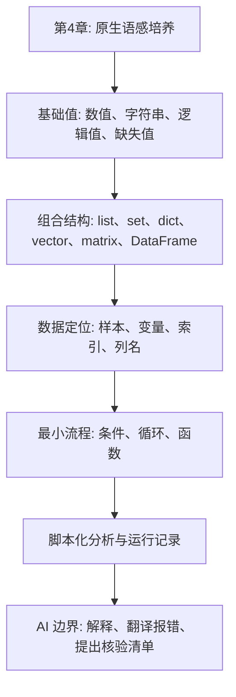
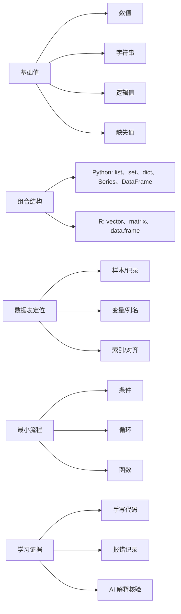

# 第4章 Python 与 R 数据结构基础

## 使用材料清单

| 类型 | 材料 | 本章用途 |
| --- | --- | --- |
| 教材总纲 | `E:\Codex_Projects\AI_MED_DataVis_Book\大纲.md` | 核对第4章属于第一阶段“原生语感培养” |
| 本章大纲 | `E:\Codex_Projects\AI_MED_DataVis_Book\chapters\chapter-4\本章大纲.md` | 固定小节结构、学习证据和 AI 使用边界 |
| 现有草稿 | `E:\Codex_Projects\AI_MED_DataVis_Book\chapters\chapter-4\第4章-Python与R数据结构基础-第二版.md` | 作为本轮正文的主线参考 |
| 主素材 | `E:\Codex_Projects\AI_MED_DataVis_Book\参考资料\实现GZ00课程中R语⾔500+⾏基础代码，一起走进Python_2072476222656184320.md` | 提取基础运算、类型、列表、集合、字典、字符串、循环、函数、Series、矩阵和 pandas 选择案例 |
| 提取记录 | `E:\Codex_Projects\AI_MED_DataVis_Book\outputs\2026-07-02-微信案例评估\微信网页素材提取与来源记录.md` | 核对来源护照、版权边界和后移内容 |
| 案例建议 | `E:\Codex_Projects\AI_MED_DataVis_Book\outputs\2026-07-02-微信案例评估\第4章案例补充建议.md` | 核对可直接进入第4章的短案例 |

本章吸收 GZ00 转换稿中“短代码、亲手运行、先看对象再处理数据”的教学经验。正文不复制原文长代码，只把可教学化的代码动作改写为短案例。所有基因名、样本名、GTF、TCGA 和表达矩阵相关内容只作为字段、字符串、索引或矩阵结构例子，不写生物功能、疾病机制、统计推断或临床解释。

## 本章定位

第4章处在全书第一阶段：原生语感培养。学生要先亲手输入、运行、解释和调试最小代码，形成对变量、对象、索引、列名、缺失值和输出结果的直接感知。

本章不是 Python 或 R 的完整教程。它只讲医药数据表入门所需的对象、数据定位、最小流程控制和运行记录。学习重点不是写很多代码，而是能说清每段代码的输入是什么、处理了什么、输出在哪里、风险在哪里。

| 承接关系 | 本章任务 |
| --- | --- |
| 第2章工具环境 | 使用本地环境、项目目录和输出约定运行最小代码 |
| 第3章 AI 任务说明书 | 把目标、上下文、约束、验证和输出落实到代码解释与报错核验 |
| 第5章数据读取 | 为列名检查、类型识别、缺失值判断和读取记录做准备 |
| 第11-15章组学内容 | 为矩阵、metadata、AnnData 和 SingleCellExperiment 建立入口概念 |

AI 在本章只承担解释和核验辅助。学生可以让 AI 解释名词、翻译报错、逐行说明已经写出的短代码，也可以让 AI 提出检查清单。学生不能让 AI 代写完整循环、函数、清洗脚本或作业答案，也不能让 AI 猜列名、猜变量单位或给医学结论。

## 学习目标与学习证据

| 学习目标 | 学习证据 |
| --- | --- |
| 识别基础值和缺失值 | 能指出教学小表中每列类型，并说明缺失值不能默认解释为 0、阴性或正常 |
| 区分 Python 与 R 常见数据结构 | 能把列名列表、变量解释字典、数值向量、表达矩阵和分析表匹配到合适对象 |
| 理解样本、变量、索引与列名 | 能输出真实列名，检查必需列是否存在，并解释筛选代码保留了哪些行列 |
| 读懂条件、循环和函数的最小逻辑 | 能逐行解释一个列名检查或缺失值检查函数 |
| 形成脚本化分析意识 | 能保存代码、报错、修正过程、输出和 AI 协作记录 |

## 人机协作边界

| 场景 | 本章允许 AI 做什么 | 学生必须做什么 |
| --- | --- | --- |
| 概念学习 | 解释数值、字符串、缺失值、列表、字典、向量、矩阵和数据框 | 用自己的例子复述概念，并手写最小代码 |
| 报错处理 | 翻译报错信息，列出可能原因 | 亲自运行修改后的代码，记录修正前后差异 |
| 代码阅读 | 对学生已经写出的短代码逐行解释 | 标出输入、处理、输出和被改变的对象 |
| Python/R 对照 | 比较对象和语法差异 | 判断当前数据更适合哪种结构 |
| 核验清单 | 根据真实列名提出检查项 | 核对列名、类型、缺失值、索引和输出文件 |

| 本章暂不允许 AI 做什么 | 原因 |
| --- | --- |
| 生成完整循环、函数或清洗脚本 | 学生还没有建立原生代码语感 |
| 代写作业答案 | 会跳过代码阅读和调试训练 |
| 猜列名、样本含义或变量单位 | 真实含义必须来自数据字典和来源材料 |
| 给出统计判断或医学解释 | 本章不处理统计推断和临床解释 |
| 把运行成功解释为结论可靠 | 运行成功只说明代码执行完毕 |

## 章节总览图



## 4.1 数值、字符串、逻辑值与缺失值

医药数据进入 Python 或 R 后，先变成基础值。常见基础值包括数值、字符串、逻辑值和缺失值。学生要先判断对象类型，再考虑能否计算、筛选或合并。

| 示例内容 | 合适类型 | 先检查什么 |
| --- | --- | --- |
| `S001` | 字符串 | 是否是样本编号，是否要保留前导零 |
| `32.0` | 数值 | 单位、范围、是否可以比较 |
| `True` / `FALSE` | 逻辑值 | 条件来自哪一列，含义是否清楚 |
| `None` / `NaN` / `NA` | 缺失值 | 缺失原因是否有记录 |

样本编号、药物编号和批次号即使含有数字，也通常按字符串处理。它们用于识别对象，不用于计算均值或差异。误当数值后，前导零、编码层级和真实含义都可能被破坏。

### 案例4-1 基础运算和类型检查

GZ00 素材先从计算、比较和 `type()` 开始。这里改写为课堂最小练习，用于区分“能运行”和“理解对象”。`TP53` 在本章只是字符串，不解释基因功能。

```python
import math

print(3 + 3)
print(22 / 7)
print(3 ** 2)
print(math.log2(16))

sample_id = "S001"
dose_mg = 10.0
gene_name = "TP53"
has_result = True

print(type(sample_id))
print(type(dose_mg))
print(type(gene_name))
print(type(has_result))
print(dose_mg > 5)
```

```r
sample_id <- "S001"
dose_mg <- 10.0
gene_name <- "TP53"
has_result <- TRUE

3 + 3
22 / 7
3^2
log2(16)

class(sample_id)
class(dose_mg)
class(gene_name)
class(has_result)
dose_mg > 5
```

学生记录：

- Python 中指数运算使用 `**`，R 中使用 `^`。
- `sample_id` 和 `gene_name` 是字符串，不能因为含有数字或基因名就直接计算。
- `dose_mg > 5` 返回逻辑值，说明条件判断成立或不成立。
- 运行结果只说明语句执行完毕，不说明剂量设计合理或医学解释成立。

### 案例4-2 缺失值不是 0

缺失值表示当前位置没有有效记录。它可能来自未测量、未填写、导入错误、合并失败或不适用。没有数据字典支持时，不能把缺失值改成 0，也不能解释为阴性、正常或无效。

```python
import pandas as pd
import math

alt_value = None
ast_value = math.nan
note = ""

print(pd.isna(alt_value))
print(pd.isna(ast_value))
print(pd.isna(note))
print(alt_value == 0)
```

```r
alt_value <- NA
ast_value <- NaN
note <- ""

is.na(alt_value)
is.na(ast_value)
is.na(note)
alt_value == 0
```

| 写法 | 课堂解释 | 本章边界 |
| --- | --- | --- |
| `None` | Python 中常见的空对象 | 需要用 `is None` 或 `pd.isna()` 检查 |
| `NaN` | 数值计算中常见的缺失标记 | 不等于 0 |
| `NA` | R 中常见的缺失标记 | 需要用 `is.na()` 检查 |
| 空字符串 `""` | 有字符位置，但内容为空 | 是否算缺失取决于数据字典 |

本节人工核验点：

- 写出每个对象类型。
- 说明缺失值和 0 的差别。
- 若 AI 建议“填充为 0”，要求它说明依据；没有数据字典时标注 `需人工确认`。

本节 AI 使用边界：

| 可问 AI | 不可问 AI |
| --- | --- |
| “请解释 `None`、`NaN` 和 `NA` 在入门数据处理中有什么区别。” | “请帮我自动处理所有缺失值。” |
| “请翻译这个类型错误，并列出我应检查的对象。” | “请直接生成清洗缺失值的完整代码。” |
| “请逐行解释我写的 8 行代码。” | “请判断缺失值是否代表阴性。” |

## 4.2 列表、字典、向量、矩阵与数据框

基础值只能保存单个信息。真实数据处理需要组合对象。Python 常用 `list`、`set`、`dict`、`Series` 和 `DataFrame`；R 常用向量、矩阵和数据框。学生不需要背所有方法，但要知道每类对象适合保存什么。

| 对象 | 常见语言 | 保存方式 | 本章用途 |
| --- | --- | --- | --- |
| 列表 `list` | Python | 有顺序的一组对象 | 列名、样本编号、基因名清单 |
| 集合 `set` | Python | 无序、不重复的一组对象 | 去重、交集、成员测试 |
| 字典 `dict` | Python | 键值映射 | 字段名到含义、编码到标签 |
| Series | Python/pandas | 带索引的一维对象 | 分组标签、单列变量 |
| 向量 `vector` | R | 一维同类数据 | 一个变量的一组取值 |
| 矩阵 `matrix` | R/Python | 二维同类数据 | 数值矩阵、表达矩阵入口 |
| 数据框 | Python/R | 二维表，多列可不同类型 | 分析表和教学小表 |

列表的重点是顺序。集合的重点是去重和集合运算，但不保留原始顺序。字典的重点是映射，适合保存字段说明、编码表或参数。数据框是前半课程最常用的分析对象。

### 案例4-3 列表和向量的增删改查

GZ00 素材用基因名列表展示列表访问、插入、删除和修改。这里保留这个低门槛动作，但把解释限制在字符串和索引层面。

```python
genes = ["TP53", "ERBB2", "BRCA2", "NRF2"]

print(genes[0])
genes.append("KRAS")
genes.insert(1, "EGFR")
genes.remove("ERBB2")
genes[3] = "PIK3CA"

print(genes)
print(genes.index("BRCA2"))
```

```r
genes <- c("TP53", "ERBB2", "BRCA2", "NRF2")

genes[1]
genes <- c(genes, "KRAS")
genes <- append(genes, "EGFR", after = 1)
genes <- genes[genes != "ERBB2"]
genes[4] <- "PIK3CA"

genes
which(genes == "BRCA2")
```

学生记录：

- Python 从 0 开始计数，R 从 1 开始计数。
- `append()` 在末尾加元素，`insert()` 在指定位置加元素。
- 删除或修改字符串不等于改变生物学事实，只改变当前对象。
- 若基因名来自真实数据库，拼写和版本需补来源。

### 案例4-4 集合用于去重和交集

素材中集合用于去重、交集、并集和差集。第4章只保留对象训练，不把共同基因名解释为通路、疾病或机制。

```python
reported_genes = ["TP53", "ERBB2", "BRCA1", "ERBB2", "EGFR"]
panel_genes = ["BRCA1", "EGFR", "KRAS", "TP53"]

unique_reported = set(reported_genes)
overlap = set(reported_genes) & set(panel_genes)
only_reported = set(reported_genes) - set(panel_genes)

print(unique_reported)
print(overlap)
print(only_reported)
print("BRCA1" in unique_reported)
```

```r
reported_genes <- c("TP53", "ERBB2", "BRCA1", "ERBB2", "EGFR")
panel_genes <- c("BRCA1", "EGFR", "KRAS", "TP53")

unique(reported_genes)
intersect(reported_genes, panel_genes)
setdiff(reported_genes, panel_genes)
"BRCA1" %in% unique(reported_genes)
```

| 操作 | Python | R | 学生要说清 |
| --- | --- | --- | --- |
| 去重 | `set(x)` | `unique(x)` | 是否保留原顺序 |
| 交集 | `set(a) & set(b)` | `intersect(a, b)` | 共同名称来自哪两个对象 |
| 差集 | `set(a) - set(b)` | `setdiff(a, b)` | 方向不能写反 |
| 成员测试 | `"BRCA1" in x` | `"BRCA1" %in% x` | 结果是逻辑值 |

### 案例4-5 字典和列表转数据框

字典可以保存“字段名到字段含义”的映射。把字典转成 DataFrame 后，学生可以看到键、列名和字段说明之间的关系。这里的字段说明是课堂模拟，真实字段必须回到数据字典确认。

```python
import pandas as pd

field_info = {
    "field_name": ["sample_id", "group_code", "batch", "ALT"],
    "meaning": ["样本编号", "分组编码", "批次编号", "丙氨酸氨基转移酶"],
    "need_check": [True, True, True, True],
}

field_df = pd.DataFrame(field_info)
print(field_df.columns.tolist())
print(field_df)
```

```r
field_info <- data.frame(
  field_name = c("sample_id", "group_code", "batch", "ALT"),
  meaning = c("样本编号", "分组编码", "批次编号", "丙氨酸氨基转移酶"),
  need_check = c(TRUE, TRUE, TRUE, TRUE)
)

names(field_info)
field_info
```

学生记录：

- Python 字典中冒号左侧是键，右侧是值。
- DataFrame 的每一列来自一个键。
- `ALT` 在这里是字段名示例；单位、检测方法和临床含义需查数据字典。
- 字段说明草稿不是正式数据字典。

### 案例4-6 Series、带名字的向量和频数检查

Series 是带索引的一维对象。它适合保存一个变量及其标签。R 中带名字的向量也能表达类似思想。第4章只把频数当作对象检查，不做组间比较。

```python
import pandas as pd

group = pd.Series(
    ["control", "case", "control", "review"],
    index=["S001", "S002", "S003", "S004"]
)

print(group["S002"])
print(group.value_counts())
print(group.isin(["control", "case"]))
```

```r
group <- c("control", "case", "control", "review")
names(group) <- c("S001", "S002", "S003", "S004")

group["S002"]
table(group)
group %in% c("control", "case")
```

学生记录：

- Series 的索引是样本编号，不是自动生成的行号。
- `value_counts()` 或 `table()` 只统计标签出现次数。
- 若 `review` 是临时编码，含义需人工确认。

### 案例4-7 矩阵、数组和转置

矩阵是二维同类数据。后续高维数据和组学章节会频繁使用矩阵，但第4章只讲行、列、形状和转置，不讲矩阵统计或生物学解释。

```python
import numpy as np

matrix = np.array([
    [1.0, 2.0, 3.0],
    [2.0, 3.0, 4.0],
    [5.0, 6.0, 7.0],
])

print(matrix.shape)
print(matrix[0, :])
print(matrix[:, 1])
print(matrix.T)
```

```r
matrix_r <- matrix(
  c(1.0, 2.0, 5.0, 2.0, 3.0, 6.0, 3.0, 4.0, 7.0),
  nrow = 3,
  ncol = 3
)

dim(matrix_r)
matrix_r[1, ]
matrix_r[, 2]
t(matrix_r)
```

| 检查项 | Python | R | 本章解释 |
| --- | --- | --- | --- |
| 形状 | `matrix.shape` | `dim(matrix_r)` | 行数和列数 |
| 第一行 | `matrix[0, :]` | `matrix_r[1, ]` | 编号规则不同 |
| 第二列 | `matrix[:, 1]` | `matrix_r[, 2]` | 逗号前是行，逗号后是列 |
| 转置 | `matrix.T` | `t(matrix_r)` | 行列交换 |

后续章节会遇到 AnnData 和 SingleCellExperiment。可以先把它们理解为“矩阵 + 注释表”的组织方式：AnnData 常用 `X` 保存主要矩阵，用 `obs` 保存观测注释，用 `var` 保存变量注释；SingleCellExperiment 常用 `assays`、`colData` 和 `rowData` 保存对应信息。本章只讲这个组织思想，不展开对象操作。

本节人工核验点：

- 判断一个对象应该用列表、字典、向量、矩阵还是数据框。
- 说明 Python 和 R 的索引起点不同。
- 说明集合去重为什么可能不保留顺序。
- 说明矩阵转置前后行列如何变化。

本节 AI 使用边界：

| 可问 AI | 不可问 AI |
| --- | --- |
| “请比较 Python list 和 R vector 的入门差异。” | “请根据这些基因名判断疾病机制。” |
| “请逐行解释我写的集合交集代码。” | “请直接生成完整表达矩阵分析流程。” |
| “请解释 DataFrame 和 data.frame 为什么适合保存表格。” | “请替我完成本节所有代码作业。” |

## 4.3 样本、变量、索引与列名

数据结构必须落回数据表。通常每行代表一个样本或记录，每列代表一个变量。行可能是人、处方、访视、细胞或基因，不能只凭代码猜测。

| 概念 | 常见位置 | 本章检查问题 |
| --- | --- | --- |
| 样本或记录 | 行 | 一行代表人、处方、访视、细胞，还是其他单位 |
| 变量 | 列 | 列名、单位、类型和取值范围是否清楚 |
| 索引 | 行标签或位置 | 筛选和合并后是否还能对齐 |
| 列名 | 列标签 | 代码使用的列名是否真实存在 |

列名是代码和数据表之间的接口。AI 生成代码常会写出看似合理但不存在的列名，如 `age`、`sex`、`treatment`。本章要求学生先输出真实列名，再写或检查代码。

### 案例4-8 先输出真实列名

这个案例用三行教学 metadata 说明列名检查。`metadata` 在本章指样本注释表，不代表任何真实研究队列。

```python
import pandas as pd

metadata = pd.DataFrame({
    "sample_id": ["S001", "S002", "S003"],
    "group_code": ["A", "B", "A"],
    "batch": [1, 1, 2],
    "note": ["ok", "check", "ok"],
})

print(metadata.columns.tolist())
print(metadata.shape)
print(metadata.dtypes)
```

```r
metadata <- data.frame(
  sample_id = c("S001", "S002", "S003"),
  group_code = c("A", "B", "A"),
  batch = c(1, 1, 2),
  note = c("ok", "check", "ok")
)

names(metadata)
dim(metadata)
str(metadata)
```

学生记录：

- 当前真实列名是 `sample_id`、`group_code`、`batch` 和 `note`。
- `shape` 或 `dim()` 返回行数和列数。
- 若 AI 写出 `group` 而不是 `group_code`，学生要先核对列名，再修改代码。

### 案例4-9 `loc`、`iloc` 和 R 中的行列选择

`loc` 按标签选择，`iloc` 按整数位置选择。R 的数据框选择也要区分列名和位置。学生要能说明筛选前后保留了哪些行和哪些列。

```python
print(metadata.loc[:, ["sample_id", "group_code"]])
print(metadata.iloc[0:2, 0:3])
print(metadata.loc[metadata["group_code"].isin(["A"]), :])
print(metadata.loc[metadata["note"].str.contains("ok"), ["sample_id", "note"]])
```

```r
metadata[, c("sample_id", "group_code")]
metadata[1:2, 1:3]
metadata[metadata$group_code %in% c("A"), ]
metadata[grepl("ok", metadata$note), c("sample_id", "note")]
```

| 操作 | Python | R | 学生要说清 |
| --- | --- | --- | --- |
| 按列名选列 | `loc[:, ["sample_id"]]` | `metadata[, "sample_id"]` | 列名是否真实存在 |
| 按位置选行列 | `iloc[0:2, 0:3]` | `metadata[1:2, 1:3]` | 编号规则不同 |
| 按合法值筛选 | `.isin(["A"])` | `%in% c("A")` | 保留哪些行 |
| 按字符串筛选 | `.str.contains("ok")` | `grepl("ok", x)` | 匹配规则是否明确 |

选中某些行列不等于完成数据清洗。学生还要记录行数是否变化、索引是否对齐、列名是否仍然可追踪。

### 案例4-10 样本编号字符串截取、替换和切割

素材中大量使用字符串长度、截取、替换和切割。第4章把它改写为样本编号练习。真实 TCGA 编码或其他数据库编码需要来源规则，本节不直接解释医学含义。

```python
sample_id = "SAMPLE-2026-01-A"

print(len(sample_id))
print(sample_id[12:14])
print(sample_id.replace("SAMPLE", "ID", 1))
print(sample_id.split("-"))

mapping = {"01": "group_A", "02": "group_B"}
code = sample_id[12:14]
print(mapping.get(code, "需人工确认"))
```

```r
sample_id <- "SAMPLE-2026-01-A"

nchar(sample_id)
substr(sample_id, 13, 14)
sub("SAMPLE", "ID", sample_id)
strsplit(sample_id, "-")

mapping <- c("01" = "group_A", "02" = "group_B")
code <- substr(sample_id, 13, 14)
ifelse(code %in% names(mapping), mapping[[code]], "需人工确认")
```

学生记录：

- 字符串切片按位置取字符，不自动理解医学含义。
- `split()` 或 `strsplit()` 会把字符串切成列表或列表型结果。
- `mapping.get()` 和 R 中的命名向量都可以减少键不存在时报错。
- 真实编码规则、分组含义和单位需查来源。

### 案例4-11 重复列名风险预览

GZ00 素材专门讨论重复列名。第5章会正式讲数据质量，本章先让学生看到问题：同名列会影响按名称选择和删除。

```python
import pandas as pd

left = pd.DataFrame({
    "sample_id": ["S001", "S002"],
    "group_code": ["A", "B"],
})
right = pd.DataFrame({
    "sample_id": ["S001", "S002"],
    "batch": [1, 1],
})

result = pd.concat([left, right], axis=1)
print(result.columns.tolist())
print(result.columns.duplicated().tolist())
print(result.loc[:, ~result.columns.duplicated()])
```

学生记录：

- `pd.concat(..., axis=1)` 按列拼接，可能制造重复列名。
- `columns.duplicated()` 返回每个列名是否重复的逻辑值。
- `~` 表示取反。
- 盲目删除重复列可能丢信息；保留哪一列要看数据字典。

本节人工核验点：

- 先输出真实列名，再检查 AI 代码。
- 对每次筛选写清保留哪些行、哪些列。
- 对字符串截取写明位置规则。
- 对重复列名标注风险，不在第4章直接做清洗决策。

本节 AI 使用边界：

| 可问 AI | 不可问 AI |
| --- | --- |
| “请解释 `loc` 和 `iloc` 的区别，并结合我给的列名说明。” | “请猜这张表有哪些列。” |
| “请逐行解释我写的字符串截取代码。” | “请把 TCGA 编码直接解释成肿瘤和正常结论。” |
| “请帮我列出筛选后应检查的行数和列名。” | “请自动决定重复列保留哪一列。” |

## 4.4 条件、循环与函数

条件、循环和函数把数据结构变成处理流程。条件回答“如果出现某种情况怎么办”，循环回答“对一组对象重复做什么”，函数回答“如何把可复用步骤保存起来”。

| 工具 | 本章最小用途 | 学生要解释什么 |
| --- | --- | --- |
| 条件 | 缺列、缺失、类型错误时给出分支 | 判断条件来自哪个对象 |
| 循环 | 对多个列名重复检查 | 循环对象、每次输出、结果保存位置 |
| 函数 | 封装列名或缺失值检查 | 输入、返回值、是否修改原对象 |

流程控制是本章最容易让 AI 越界的部分。学生可以让 AI 解释自己写的短代码，但不能让 AI 直接生成完整清洗程序。代码越短，越要写清输入、返回值和副作用。

### 案例4-12 `if` 和 `for` 检查多个列名

这个案例来自素材中的 `for`、`if` 和列表推导式。这里改写为必需字段检查，避免使用真实数据。

```python
actual_columns = ["sample_id", "group_code", "batch", "ALT"]
required_columns = ["sample_id", "group_code", "ALT", "AST"]

missing = []
for name in required_columns:
    if name not in actual_columns:
        missing.append(name)

print(missing)
```

```r
actual_columns <- c("sample_id", "group_code", "batch", "ALT")
required_columns <- c("sample_id", "group_code", "ALT", "AST")

missing <- c()
for (name in required_columns) {
  if (!(name %in% actual_columns)) {
    missing <- c(missing, name)
  }
}

missing
```

学生记录：

- 循环对象是 `required_columns`。
- 每次循环取出一个必需列名。
- 条件判断问的是“这个列名是否不在实际列名中”。
- 输出 `["AST"]` 只说明缺少字段，不说明应该如何补值。

### 案例4-13 列表推导式适合短规则

列表推导式可以把简单循环写短。它适合规则清楚、结果易检查的任务。规则一旦变复杂，应先写普通循环。

```python
raw_fields = [" sample_id ", "Group Code", "ALT", "AST "]
clean_fields = [name.strip().lower().replace(" ", "_") for name in raw_fields]

print(clean_fields)
```

```r
raw_fields <- c(" sample_id ", "Group Code", "ALT", "AST ")
clean_fields <- gsub(" ", "_", tolower(trimws(raw_fields)))

clean_fields
```

学生记录：

- `strip()` 去掉字符串两端空格。
- `lower()` 改成小写。
- `replace(" ", "_")` 把中间空格替换为下划线。
- 字段名清理可能改变原始名称，正式清洗要保留改名记录。

### 案例4-14 最小必需列检查函数

函数用于保存可重复使用的步骤。这个函数只返回缺失列，不修改原始数据，也不自动清洗。

```python
def find_missing_columns(actual_columns, required_columns):
    missing = []
    for name in required_columns:
        if name not in actual_columns:
            missing.append(name)
    return missing

actual = ["sample_id", "group_code", "batch"]
required = ["sample_id", "group_code", "age"]

print(find_missing_columns(actual, required))
```

```r
find_missing_columns <- function(actual_columns, required_columns) {
  setdiff(required_columns, actual_columns)
}

actual <- c("sample_id", "group_code", "batch")
required <- c("sample_id", "group_code", "age")

find_missing_columns(actual, required)
```

| 函数问题 | 本例答案 |
| --- | --- |
| 输入是什么 | 实际列名列表和必需列名列表 |
| 处理是什么 | 逐个检查必需列是否存在 |
| 返回值是什么 | 缺失列清单 |
| 是否修改原数据 | 不修改 |
| 输出能否解释医学含义 | 不能 |

### 案例4-15 缩进错误作为调试训练

素材中有若干 `if` 和 `for` 代码块缩进不完整。这类片段不能直接放进教材当作可运行代码，但很适合训练学生读报错。

错误片段示例：

```text
scores = [80, 90, 70, 95, 85]

for score in scores:
    if score >= 90:
    print(score)
```

修正后代码：

```python
scores = [80, 90, 70, 95, 85]

for score in scores:
    if score >= 90:
        print(score)
```

学生记录：

- Python 用缩进表示代码块。
- `print(score)` 属于 `if` 内部，也属于 `for` 循环内部。
- 修正缩进后，应重新运行并记录输出。
- AI 可以翻译 `IndentationError`，但学生要指出哪一行缩进错了。

### 案例4-16 用字典映射编码，不用硬猜

素材中用字典把编码映射为标签。本章保留这个结构，但标签只用模拟含义。若换成真实数据库编码，必须补来源规则。

```python
codes = ["01", "02", "99"]
mapping = {"01": "group_A", "02": "group_B"}

labels = []
for code in codes:
    labels.append(mapping.get(code, "需人工确认"))

print(labels)
```

```r
codes <- c("01", "02", "99")
mapping <- c("01" = "group_A", "02" = "group_B")

labels <- ifelse(codes %in% names(mapping), mapping[codes], "需人工确认")
labels
```

本节逻辑压力测试：

| 问题 | 若答不出，说明什么 |
| --- | --- |
| 条件判断用的是哪个对象 | 可能没有理解分支依据 |
| 循环每次处理哪个列名或编码 | 可能只是复制代码 |
| 输出保存在哪里 | 可能只有屏幕打印，无法复查 |
| 函数是否修改原数据 | 可能忽略副作用 |
| AI 解释是否经过运行核验 | 可能把解释当作事实 |

本节 AI 使用边界：

| 可问 AI | 不可问 AI |
| --- | --- |
| “请逐行解释这个函数的输入、循环和返回值。” | “请帮我写一个完整清洗脚本。” |
| “请翻译 `IndentationError` 并指出可能检查的缩进位置。” | “请直接给出作业答案。” |
| “请根据我给出的真实列名列一个核验清单。” | “请猜 `99` 代表什么医学分组。” |

## 4.5 脚本化分析与运行记录

交互式尝试适合学习，脚本化分析适合复查。课程项目中，学生要把临时尝试整理成脚本和运行记录，让别人能看懂和重复。

| 记录字段 | 最低要求 |
| --- | --- |
| 任务名称 | 本次代码要检查什么 |
| 输入数据 | 文件名、来源、是否为模拟数据 |
| 代码文件 | `.py`、`.R`、`.ipynb` 或 `.qmd` 路径 |
| 运行环境 | Python/R 版本和关键包 |
| 检查结果 | 列名、类型、缺失值和行数变化 |
| 报错记录 | 至少保留一条报错、原因判断和修正方式 |
| AI 协作 | 提示词、AI 解释、人工核验和修改后结果 |
| 输出文件 | 表格、日志、报告或图的路径 |

脚本化分析不是把代码写长。最小脚本只要能说明输入、检查步骤、输出对象和必要注释，就比临时复制粘贴更适合复查。

### 案例4-17 一个最小数据表核验脚本

下面的模拟小表把本章对象、列名、缺失值、循环、函数和运行记录串起来。它不代表真实医学数据。

```python
import pandas as pd
from datetime import date

df = pd.DataFrame({
    "sample_id": ["S001", "S002", "S003", "S003"],
    "group_code": ["A", "A", "B", "B"],
    "dose_mg": [10, 10, 20, 20],
    "ALT": [32, None, 45, 45],
    "note": ["baseline", "missing assay", "baseline", "duplicate id"],
})

required_columns = ["sample_id", "group_code", "dose_mg", "ALT"]

def find_missing_columns(actual_columns, required_columns):
    missing = []
    for name in required_columns:
        if name not in actual_columns:
            missing.append(name)
    return missing

audit = {
    "run_date": str(date.today()),
    "data_source": "课堂模拟数据",
    "shape": df.shape,
    "columns": df.columns.tolist(),
    "missing_required_columns": find_missing_columns(df.columns.tolist(), required_columns),
    "missing_by_column": df.isna().sum().to_dict(),
    "duplicated_sample_id": df["sample_id"].duplicated().sum(),
}

print(audit)
```

```r
df <- data.frame(
  sample_id = c("S001", "S002", "S003", "S003"),
  group_code = c("A", "A", "B", "B"),
  dose_mg = c(10, 10, 20, 20),
  ALT = c(32, NA, 45, 45),
  note = c("baseline", "missing assay", "baseline", "duplicate id")
)

required_columns <- c("sample_id", "group_code", "dose_mg", "ALT")
missing_required_columns <- setdiff(required_columns, names(df))

audit <- list(
  data_source = "课堂模拟数据",
  shape = dim(df),
  columns = names(df),
  missing_required_columns = missing_required_columns,
  missing_by_column = colSums(is.na(df)),
  duplicated_sample_id = sum(duplicated(df$sample_id))
)

audit
```

学生记录：

- 输入是课堂模拟数据，不代表真实医学数据。
- `required_columns` 是人工指定的必需列清单。
- `missing_by_column` 统计每列缺失数量，不解释缺失原因。
- `duplicated_sample_id` 说明样本编号有重复，需要查数据字典或原始记录。

### 案例4-18 报错和 AI 协作记录

本章至少保留一条真实报错。下面给出记录模板，学生应替换为自己的运行记录。

```text
任务：检查教学数据表的必需列和缺失值。
输入：课堂模拟 df，不代表真实医学数据。
原始代码：df["ALT_value"].isna().sum()
报错原文：KeyError: 'ALT_value'
AI 解释摘要：可能是列名不存在或大小写不一致。
人工核验：运行 df.columns.tolist() 后发现真实列名为 ALT。
修改：将 ALT_value 改为 ALT。
修改后结果：df["ALT"].isna().sum() 返回 1。
仍需确认：ALT 单位和缺失原因需查数据字典。
```

| AI 协作记录字段 | 合格写法 | 不合格写法 |
| --- | --- | --- |
| 提示词 | “请解释这条 `KeyError`，只列可能原因和核验步骤。” | “帮我改好代码。” |
| AI 输出摘要 | “AI 提醒列名可能不存在。” | “AI 说代码没问题。” |
| 人工核验 | “我运行 `df.columns.tolist()`，确认列名是 `ALT`。” | “我相信 AI 的解释。” |
| 修改结果 | “把 `ALT_value` 改成 `ALT`，重新运行。” | “已修复。” |
| 仍需确认 | “ALT 单位需查数据字典。” | “无。” |

### 脚本化分析的最小文件结构

课程项目可以从一个简单目录开始。第4章不要求复杂工程结构，只要求文件名、输入、输出和记录可追踪。

```text
chapter4_practice/
  scripts/
    check_metadata.py
    check_metadata.R
  outputs/
    metadata_audit.txt
  records/
    run_record_2026-07-08.md
```

学生提交时至少说明：

- 代码文件在哪里。
- 输入数据是否为模拟数据。
- 输出内容是什么。
- 报错如何修正。
- AI 做了哪一步解释，人工核验了什么。

本节 AI 使用边界：

| 可问 AI | 不可问 AI |
| --- | --- |
| “请根据我的运行记录检查是否缺少输入、输出和报错字段。” | “请替我写完整项目脚本。” |
| “请帮我把报错记录整理成表格。” | “请判断这个缺失值代表正常。” |
| “请列出我应该手工核验的列名、类型和缺失值。” | “请直接生成最终作业。” |

## 知识结构与知识图谱提示词



可使用以下提示词生成复习用知识图谱。若使用 `imagegen` 生成教学图片，图片只作为展示，准确结构仍以本章 Mermaid、表格和清单为准。

```text
目标：
生成《医药数据处理与可视化》第4章“Python 与 R 数据结构基础”的知识图谱，用于药学学生复习。

上下文：
本章属于第一阶段“原生语感培养”。学生需要亲手运行最小代码，AI 只用于名词解释、报错翻译和代码逐行解释。

约束：
必须包含数值、字符串、逻辑值、缺失值、列表、集合、字典、Series、向量、矩阵、数据框、样本、变量、索引、列名、条件、循环、函数、脚本化分析、运行记录和 AI 协作边界。
不得加入统计模型、医学因果、临床建议或真实数据结论。

验证：
检查每个节点是否能对应本章小节；缺失值不得解释为 0、阴性或正常；AI 不得被描述为作业代写工具。

输出：
先给 Mermaid 知识图，再给 10 条复习清单。
```

## 常见误区

| 误区 | 为什么错 | 如何纠正 |
| --- | --- | --- |
| 让 AI 一次生成完整代码 | 跳过原生语感训练 | 先手写 5 到 10 行最小代码 |
| 样本编号当数值 | 可能丢失编号含义 | 按字符串处理，查数据字典 |
| 缺失值直接填 0 | 0 是有效数值，缺失是无记录 | 先记录原因和处理边界 |
| 只看代码运行成功 | 运行成功不代表列名和解释正确 | 检查列名、行数、类型和缺失值 |
| 忽略索引 | 筛选和合并可能错位 | 检查样本编号和索引 |
| 把筛选结果写成医学结论 | 本章只做数据定位 | 统计和医学解释留到后续章节 |
| 复制截断代码 | 可能有未闭合括号或缩进错误 | 重写为可运行最小代码 |

## 课后作业

1. 用 Python 手写一个包含 5 列的教学数据框，输出列名、行列数、每列类型和缺失值数量。
2. 用 R 建立同一张教学数据表，输出 `names()`、`dim()`、`str()` 和 `is.na()` 检查结果。
3. 用列表或向量保存 6 个字段名，其中至少 1 个重复；分别用 Python 和 R 去重，并说明是否保留原顺序。
4. 写一个最小函数，输入实际列名和必需列名，返回缺失列清单。
5. 记录一条真实报错，写出报错原文、AI 翻译、人工核验和修正过程。
6. 写一段 100 到 150 字说明：为什么缺失值不能默认当作 0、阴性或正常。
7. 提交一份 AI 协作记录，说明 AI 只参与了哪类解释或核验。

## 需补证据与需人工确认

| 位置 | 当前状态 | 处理方式 |
| --- | --- | --- |
| 教学数据样例 | 本章使用模拟字段 | 若换成真实数据，需补数据来源、数据字典和隐私边界 |
| `ALT` 字段 | 只作为字段名和缺失值例子 | 单位、检测方法和医学解释需查数据字典 |
| 基因名列表 | 只作为字符串和集合例子 | 不解释基因功能、通路或疾病关系 |
| 样本编码 | 使用模拟 `SAMPLE-2026-01-A` | 若使用 TCGA 等真实编码，需补编码规则和来源 |
| GZ00 转换稿代码 | 原文存在截断和缩进问题 | 正文只采用教学化改写，不直接复制长代码 |
| 第4章代码运行环境 | 正文给出最小代码 | 课堂发布前需在指定 Python/R 环境中运行一遍 |
