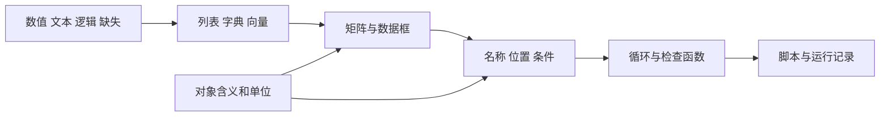

# 第4章 Python 与 R 数据结构基础

把一张表放进程序，需要决定每列怎样保存：编号用文本，估计量用数值，未填写的格子用缺失标记。接下来才能按编号找到记录、取出数值，或筛选符合条件的回答。本章从这些操作开始学习Python与R的数据结构。

本章用同一份五行猜糖豆教学表学习Python与R。两种语言不要求逐字对应，而要完成相同问题、选中相同记录。本章先亲手输入和运行；AI可以解释语法与真实报错，不代写完整循环、函数或作业答案。

配套材料见[数据对象练习包](assets/case-THU-DA-L02-C01-A03/README.md)。它与第一章的小表一致，是独立构造的教学数据，不是真实课堂调查。

## 4.1 数值、字符串、逻辑值与缺失值

### 一个值怎样保存

一罐糖豆有多少粒？先观察糖豆的大小和罐中装填的情况，写下自己的估计；再把同一批糖豆倒进透明碗里，重新观察，写下第二次估计。两次答案可能相同，也可能改变。要把这些回答保存下来，除了估计值，还需要记什么？

假设你负责整理这次活动的记录。只留一列数字，很快就会遇到麻烦：哪一个是第一次的回答，哪一个是第二次的回答？800和980是不是同一个人写的？若想比较每个人前后怎样改变估计，就需要同时保存参与者编号和轮次。可以让每次回答占一行，再给这次回答一个记录号。这样，同一个人有两行记录，通过参与者编号就能找到这两行，通过轮次就能分清先后。

第一章的五行教学表采用了这种安排。p01和p02各有两轮记录，p03有一条未填写估计值的记录。接下来把这张表放进Python和R，看看数值、编号和空白分别怎样保存，又怎样取出某个人在某一轮的回答。

变量名用于引用一个对象。例如，把估计值保存为`estimate`，随后就可以用这个名字参与计算。

```python
estimate = 950
participant_id = "001"
has_answer = True
print(type(estimate), type(participant_id), type(has_answer))
```

```r
estimate <- 950
participant_id <- "001"
has_answer <- TRUE
print(class(estimate))
print(class(participant_id))
print(class(has_answer))
```

这里有数值、字符串和逻辑值。字符串保存文字，包括看起来像数字的编号；逻辑值表示真或假，常用于条件检查。给编号加引号，可以保留“001”的写法，也提醒我们不把它当作连续测量量。

Python中的`=`和R中常用的`<-`在这里用于赋值。比较两个值是否相等时，两种语言都使用`==`。赋值是在保存对象，比较是在提出一个可以返回真假的问题，不能混用。

R中的数值还可细分为整数等类型，Python也有整数和浮点数之分。本章先关心它是否符合字段用途，不把类型名称背诵当作目标。估计量可以参与数值比较，参与者编号则主要用于匹配记录。

### 缺失不是一种普通数值

Python中可能用`None`表示没有给定对象，pandas数值列常见`NaN`表示缺失；R通常使用`NA`。不同对象中的缺失表示不完全一样，应使用相应检查函数，不凭显示样式判断。

```python
import pandas as pd

values = pd.Series([800, None, 0])
print(values.isna().tolist())
print(values.notna().tolist())
```

```r
values <- c(800, NA, 0)
print(is.na(values))
print(!is.na(values))
```

这段代码把缺失与0分开。0是明确保存的数值，`None`或`NA`则没有提供该项测量。数值列中的`NaN`不要用`==`检查；R中的`NA`参与比较时也会产生未知结果。使用`isna()`或`is.na()`，才能明确提出“这一项是否缺失”。

缺失原因仍需回到记录说明。程序只能识别标记，不能知道它来自未回答、未测量还是读取错误。本章只检查，不自动填补。把同样原则迁移到药学实验时，缺失不能擅自解释为正常、阴性或没有作用。

## 4.2 列表、字典、向量、矩阵与数据框

### 多个值为什么需要不同结构

Python列表按顺序保存多个对象；字典按键保存对应值，适合记录字段说明。R向量通常保存同一种基础类型的多个值；带名字的向量可用于简单对应，更复杂对象可以用列表。它们不完全一一对应，选择时先看要保存什么。

```python
required = ["record_id", "participant_id", "round", "estimate_grains"]
dictionary = {"participant_id": "参与者编号", "estimate_grains": "估计量，粒"}
print(required[0])
print(dictionary["estimate_grains"])
```

```r
required <- c("record_id", "participant_id", "round", "estimate_grains")
dictionary <- c(participant_id="参与者编号", estimate_grains="估计量，粒")
print(required[1])
print(dictionary[["estimate_grains"]])
```

列表或向量的顺序可以用于定位；字典的键或命名元素则用于按名称查找。若名称不存在，具体操作可能报错或返回缺失，不能假设所有结构的行为相同。先检查名称，是比猜测位置更可靠的习惯。

向量中的类型还可能因为组合而改变。例如将数字和文字放进R的同一基础向量，数字可能被转换成文本。因此，能够显示“800”，不等于它仍是可直接计算的数值。数据读入后检查类型，第五章会反复用到。

### 用数据框保存一张表

数据框（data frame）按列保存变量，每列具有相同长度，各列可以有不同类型。下面直接建立五行教学表；文件读取留到下一章。

```python
frame = pd.DataFrame({
    "record_id": ["r01", "r02", "r03", "r04", "r05"],
    "participant_id": ["p01", "p02", "p03", "p01", "p02"],
    "round": [1, 1, 1, 2, 2],
    "estimate_grains": [800, 950, None, 980, 1050]
})
print(frame)
print(frame.dtypes)
```

```r
frame <- data.frame(
  record_id=c("r01", "r02", "r03", "r04", "r05"),
  participant_id=c("p01", "p02", "p03", "p01", "p02"),
  round=c(1L, 1L, 1L, 2L, 2L),
  estimate_grains=c(800, 950, NA, 980, 1050),
  stringsAsFactors=FALSE
)
print(frame)
str(frame)
```

字典或命名参数的名称在这里成为列名，列表或向量成为各列内容。先核对打印出来的表是否与预期一致，再继续计算。输入时漏一个值，可能直接报错；把值放错行，则可能不报错，却改变了记录含义。

本表一行是一次回答。两轮中重复出现的参与者编号保留了对应关系，不是要立即清除的重复。估计列中的缺失也仍然保留，没有因为建立数据框就自动得到合理处理。

### 矩阵只保留了哪些信息

对于p01和p02完整的两轮记录，可以用一个小数值矩阵表示。行对应参与者，列依次对应第一轮、第二轮；本例只演示表示方式，不比较轮次效果。

```python
matrix_values = [[800, 980], [950, 1050]]
row_ids = ["p01", "p02"]
column_ids = ["round1", "round2"]
print(matrix_values[0][1])
```

```r
matrix_values <- matrix(c(800, 980, 950, 1050), nrow=2, byrow=TRUE)
rownames(matrix_values) <- c("p01", "p02")
colnames(matrix_values) <- c("round1", "round2")
print(matrix_values[1, 2])
```

先在原表中寻找p01：第一轮是800，第二轮是980，因此矩阵的第一行依次放800和980；p02的950和1050放在第二行。现在要取“p01第二轮的估计”，就应找到第一行、第二列。Python位置从0开始，所以写[0][1]；R位置从1开始，所以写[1, 2]。两段代码取出的都是980。理解这一步，比记住一串索引写法更重要：先确定数值属于哪个对象、哪个轮次，再把这个位置翻译成相应语言的写法。

Python此处用嵌套列表表示二维数值，不是专门的矩阵对象；R使用矩阵。这个小矩阵为了展示两轮完整记录，只选了p01和p02，没有容纳p03；它也没有保存原来的record_id。不能因为矩阵里看不到p03，就说原始数据里没有这个编号。数据框保留不同类型字段通常更方便；数值矩阵适合组织同类数值，但改变表示方式时，要清楚哪些信息另存了、哪些没有带过来。

如果将行列互换，对象与轮次的位置也会互换。无论画图还是输入后续方法，都应重新确认哪一维代表对象。矩阵有多少个数，不等于研究有多少个独立参与者。

## 4.3 样本、变量、索引与列名

### 先输出真实名称与数量

```python
print(frame.columns.tolist())
print(frame.shape)
print(frame["participant_id"].nunique())
```

```r
print(names(frame))
print(dim(frame))
print(length(unique(frame$participant_id)))
```

行列数描述表格形状，唯一参与者编号数量描述这份表中出现了多少个不同编号。两项都应能用眼睛核对这张小表。到了大数据中，不能逐行看完，仍需要保留这种明确的数量口径。

表的行号或索引是定位工具，不一定是对象标识。排序和筛选可能改变行的位置；参与者编号仍应保存在字段中。不能在重排后继续假设“第三行永远是同一个人”。

### 位置与名称是两种定位方式

```python
print(frame.iloc[0, 0])
print(frame.loc[frame["record_id"] == "r04", ["participant_id", "estimate_grains"]])
```

```r
print(frame[1, 1])
print(frame[frame$record_id == "r04", c("participant_id", "estimate_grains"), drop=FALSE])
```

Python的`iloc`按位置取值，位置从0开始；`loc`按标签或逻辑条件定位。R这里的位置从1开始。`drop=FALSE`让选择结果仍保持数据框形态，避免只选一列时对象结构意外改变。

按记录号筛选仍有前提：该编号应当完整且含义清楚。本表记录号唯一，所以可以定位一次回答；参与者编号重复，则可能选出多条记录。换到其他表时，必须重新核对这些条件。

### 把筛选条件写完整

现在提出一个明确问题：“选出有记录且估计量不少于950粒的回答。”这不是“猜得准确”的判断，因为没有真值。

```python
keep = frame["estimate_grains"].notna() & (frame["estimate_grains"] >= 950)
selected = frame.loc[keep, ["record_id", "estimate_grains"]]
print(selected)
```

```r
keep <- !is.na(frame$estimate_grains) & frame$estimate_grains >= 950
selected <- frame[keep, c("record_id", "estimate_grains"), drop=FALSE]
print(selected)
```

条件包含两部分：不是缺失，并且达到阈值。`&`在这里逐项组合逻辑结果。R若直接用含`NA`的逻辑向量筛选，可能产生未定义的结果行；明确检查缺失能避免这种误读。

先手工圈出应保留的记录，再运行两种语言，对照记录号而不只是行数。相同的行数仍可能对应不同记录，这是仅检查表格大小发现不了的问题。

## 4.4 条件、循环与函数

### 条件决定是否继续

遇到缺列时，先停止相关操作，比让程序猜一个相似列名更稳妥。条件语句让程序根据检查结果执行不同分支：

```python
if "estimate_grains" in frame.columns:
    print("可以继续检查估计量")
else:
    print("缺少必需列，先核对输入")
```

```r
if ("estimate_grains" %in% names(frame)) {
  print("可以继续检查估计量")
} else {
  print("缺少必需列，先核对输入")
}
```

这里检查的是列是否存在，还没有证明列中单位、类型或取值正确。每条检查能证明的内容有限，后续步骤仍需分别核对。

### 循环把同一个检查用于多个字段

```python
for name in required:
    print(name, name in frame.columns)
```

```r
for (name in required) {
  print(c(name, name %in% names(frame)))
}
```

循环变量`name`每次取一个必需列名。你应能指出循环重复的对象，以及每一步打印什么，而不是把整段代码看成不可拆分的指令。

不要为了练习循环，把可以直接看懂的小任务写成很长的流程。本章只用它重复明确的检查，不扩展成完整清洗脚本。

### 函数保存一段可重复调用的规则

```python
def missing_columns(table, required_names):
    missing = []
    for name in required_names:
        if name not in table.columns:
            missing.append(name)
    return missing

print(missing_columns(frame, required + ["unit"]))
```

```r
missing_columns <- function(table, required_names) {
  missing <- character()
  for (name in required_names) {
    if (!name %in% names(table)) {
      missing <- c(missing, name)
    }
  }
  return(missing)
}
print(missing_columns(frame, c(required, "unit")))
```

函数接收数据框和必需列名，返回缺少的名称。它不补列、不删行，也不修改输入；返回结果供调用者决定下一步。这里故意在检查要求中加入`unit`，是为了测试函数能否发现不存在的列，并不是说明原数据遗漏了字典要求的字段。

能说清输入、返回值和是否修改数据，就开始具备检查函数的能力。练习时，亲手把新增名称换成另一个不存在的字段，预测输出，再运行核对。AI可以解释你的代码，但不替你完成这次修改。

## 4.5 脚本化分析与运行记录

### 从头运行，检查是否依赖旧对象

交互式环境适合试一小段代码，但它可能保留之前创建的对象。某段代码能运行，可能只是因为你在前一次尝试中已经定义了变量。脚本则把必要步骤按顺序保存，便于从新会话重新执行。

将本章自己输入的代码分别保存为Python和R文件。打开新会话，从导入包、建立对象开始顺序运行。如果中间有变量尚未定义，先检查步骤是否缺失，不要随意把旧会话结果复制过来。

配套的[Python脚本](assets/case-THU-DA-L02-C01-A03/python/objects.py)与[R脚本](assets/case-THU-DA-L02-C01-A03/r/objects.R)读取同一CSV，核对表格、缺失和筛选结果。文件读取方式将在第五章解释。本章先完成内存对象练习，再用配套脚本复核，不以直接运行完整脚本代替逐行理解。

### 记录到什么程度

运行记录写清日期、程序入口、脚本与输入位置、实际输出和人工核对。若有报错，保留原始信息、定位依据与修正；没有报错，则说明怎样核对结果。不要把预期输出粘贴成运行证据。

药学迁移不需要再造一份模拟患者表。想一想：若把参与者换成制剂单元、轮次换成测量时间，哪些定位原则仍然成立？哪些含义必须重新定义？结构相似并不意味着字段能直接改名，单位和重复层次仍须依据实验说明。

### 本章任务与自查

提交自己输入的两份最小脚本、两种语言的对象对照，以及一次人工预测与实际输出的比较。应能解释：

- 为什么编号保存为文本，缺失不改成0；
- 为什么按位置取第一行时，Python与R写法不同；
- 为什么筛选后既查数量，也查记录号；
- 为什么列名检查函数不应擅自补出缺少的列；
- 为什么同一参与者的多轮记录不能自动当成更多独立样本。

先完成自己的判断，再查看配套运行结果。两种语言的显示格式可以不同，但输入、保留规则和记录应一致。

### 知识结构



软件语法可查阅[Python官方数据结构教程](https://docs.python.org/3/tutorial/datastructures.html)和[R基础手册](https://cran.r-project.org/doc/manuals/r-release/R-intro.html)。实际对象仍以当前版本运行结果为准。下一章把这些检查用于真实文件，处理读取方式、字段说明和数据质量。
