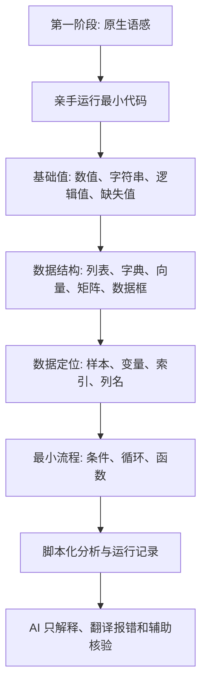
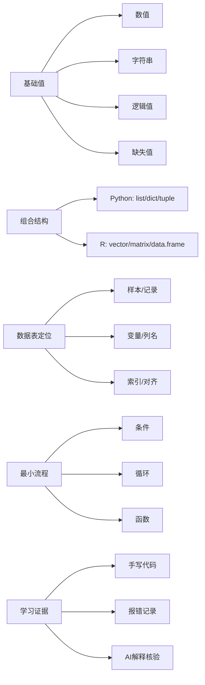

# 第4章 Python 与 R 数据结构基础

## 本章定位

本章属于全书人机协作路线中的第一阶段：原生语感培养。学生在本章先亲手输入、运行、解释和调试最小代码，建立对变量、对象、索引、列名、缺失值和输出结果的直接感知。

本章不是完整 Python 或 R 编程教程。它只讲医药数据表入门所需的基础对象、数据定位和运行记录。学习重点不是“能写很多代码”，而是能说清每段代码的输入、处理、输出和风险。

AI 在本章不作为代码生成器使用。它只用于名词解释、概念查阅、报错翻译和代码逐行解释。学生不得把 AI 生成内容直接当作作业答案、统计结论或医学解释。

| 前置章节 | 本章承接 |
| --- | --- |
| 第2章工具环境 | 使用本地环境、项目目录和输出约定运行最小代码 |
| 第3章 AI 任务说明书 | 将目标、上下文、约束、验证和输出落实到代码解释与报错核验 |
| 第5章数据读取 | 本章为列名检查、类型识别、缺失值判断和运行记录打基础 |
| 第11-15章组学内容 | 本章为矩阵、metadata、AnnData 和 SingleCellExperiment 建立入口概念 |

## 学习目标

| 学习目标 | 学习证据 |
| --- | --- |
| 识别基础值和缺失值 | 能指出教学小表中每列的类型，并说明缺失值不能默认解释为 0、阴性或正常 |
| 区分 Python 与 R 常见数据结构 | 能把列名列表、变量解释字典、数值向量、表达矩阵和分析表匹配到合适对象 |
| 理解样本、变量、索引与列名 | 能输出真实列名，检查必需列是否存在，并解释筛选代码保留了哪些行列 |
| 读懂条件、循环和函数的最小逻辑 | 能逐行解释一个列名检查或缺失值检查函数 |
| 形成脚本化分析意识 | 能保存代码、报错、修正过程、输出和 AI 协作记录 |

## 阅读指南

先读本章的人机协作边界，再读数据结构。这样可以避免一开始就把 AI 当作代码代写工具。第4章的核心训练是“自己先跑通最小代码，再让 AI 帮助解释和核验”。

阅读 4.1 和 4.2 时，不必背完整语法。重点是分清每个对象适合保存什么数据。阅读 4.3 到 4.5 时，要把代码放回数据表和运行记录中检查。

## 人机协作边界

| 场景 | 本章允许 AI 做什么 | 学生必须做什么 |
| --- | --- | --- |
| 概念学习 | 解释数值、字符串、缺失值、列表、字典、向量、矩阵和数据框 | 用自己的例子复述概念 |
| 报错处理 | 翻译报错信息，列出可能原因 | 亲自运行修改后的最小代码 |
| 代码阅读 | 对学生已写短代码逐行解释 | 标出输入、处理、输出和改变的对象 |
| Python/R 对照 | 比较对象和语法差异 | 判断当前数据更适合哪种结构 |
| 核验清单 | 根据真实列名提出检查项 | 核对列名、类型、缺失值和输出文件 |

| 本章暂不允许 AI 做什么 | 原因 |
| --- | --- |
| 生成完整循环、函数或清洗脚本 | 学生还未建立原生代码语感 |
| 代写作业答案 | 会跳过代码阅读和调试训练 |
| 猜列名、样本含义或变量单位 | 真实含义必须来自数据字典和材料 |
| 给出统计判断或医学解释 | 本章不处理统计推断和临床解释 |
| 把运行成功解释为结论可靠 | 运行成功只说明代码执行完毕 |

## 核心概念速查

| 概念 | 本章解释 | 常见混淆 | 需保留英文 |
| --- | --- | --- | --- |
| 数值 | 可参与计算的数字 | 把样本编号当连续变量 | numeric |
| 字符串 | 文本值，如编号、组名、备注 | 把文本编码直接当医学等级 | string |
| 逻辑值 | 真或假，用于条件判断 | 把筛选条件当医学诊断 | Boolean/logical |
| 缺失值 | 没有有效记录的位置 | 默认填 0、阴性或正常 | NA/NaN |
| 列表 | Python 中保存一组对象的有序结构 | 以为复制列表一定得到独立副本 | list |
| 字典 | Python 中保存键值映射的对象 | 让 AI 猜键名或变量含义 | dict |
| 向量 | R 中一维同类数据对象 | 与数据框列含义混淆 | vector |
| 矩阵 | 行列结构，常保存同类数值 | 把任何表都叫矩阵 | matrix |
| 数据框 | 多列多类型的数据表 | 忽略列名和索引 | DataFrame/data.frame |
| 索引 | 用于定位和对齐的行或元素标签 | 只看显示顺序，不看样本对齐 | index |
| 脚本 | 保存后可重复运行的代码文件 | 只在交互窗口临时运行 | script |

## 章节总览图



## 主张-证据-边界蓝图

| 小节 | 可写主张 | 材料依据 | 边界 |
| --- | --- | --- | --- |
| 4.1 | 基础值决定代码能否计算、比较或筛选 | Python 基本类型、R 向量和缺失值材料 | 不解释医学意义 |
| 4.2 | 数据结构决定数据如何保存和访问 | Python 列表/字典、R 向量/矩阵/数据框材料 | 不展开完整编程体系 |
| 4.3 | 样本、变量、索引和列名是代码核验入口 | ISLR 样本-变量矩阵、pandas/R 索引材料 | 行列含义要回到数据字典 |
| 4.4 | 条件、循环和函数用于最小重复处理 | Python 控制结构、R 函数练习材料 | 本章不让 AI 代写完整逻辑 |
| 4.5 | 脚本和运行记录让过程可追溯 | Python 文件材料、GenAI 记录和调试材料 | 记录完整不代表结论正确 |

## 4.1 数值、字符串、逻辑值与缺失值

医药数据进入 Python 或 R 后，首先会变成基础值。常见基础值包括数值、字符串、逻辑值和缺失值。学生要先能判断对象类型，再考虑是否可以计算或筛选。

| 示例内容 | 合适类型 | 先检查什么 |
| --- | --- | --- |
| `S001` | 字符串 | 是否是样本编号，是否需要保留前导零 |
| `32.0` | 数值 | 单位、范围和是否可比较 |
| `TRUE` / `False` | 逻辑值 | 条件来自哪一列，含义是否清楚 |
| `NA` / `NaN` | 缺失值 | 缺失原因是否有记录 |

样本编号、药物编号和批次号即使含有数字，也通常应按字符串处理。它们用于识别对象，不用于计算均值或差异。如果误当数值，前导零、编码层级和真实含义都可能被破坏。

缺失值表示当前位置没有有效记录。它可能来自未测量、未填写、导入错误、合并失败或不适用。没有数据字典支持时，不能把缺失值改成 0，也不能解释为阴性、正常或无效。

```python
# 教学模拟小表：只用于练习对象类型和缺失值判断
sample_id = "S001"
group = "control"
alt_value = None
is_baseline = True

print(type(sample_id))
print(type(group))
print(type(alt_value))
print(type(is_baseline))
print(alt_value is None)
```

```r
# 教学模拟小表：只用于练习对象类型和缺失值判断
sample_id <- "S001"
group <- "control"
alt_value <- NA
is_baseline <- TRUE

class(sample_id)
class(group)
is.na(alt_value)
class(is_baseline)
```

本节的原生训练不是让学生一次写出完整清洗流程，而是让学生能解释每一行代码。比如 `type(sample_id)` 或 `class(sample_id)` 的输出说明对象类型，`is.na()` 或 `is None` 只判断缺失状态，不给医学解释。

### 本节 AI 使用方式

| 可问 AI | 不可问 AI |
| --- | --- |
| “请解释 `NaN` 和 `NA` 在入门数据处理中有什么区别。” | “请帮我自动处理所有缺失值。” |
| “请翻译这个类型错误，并列出我应检查的对象。” | “请直接生成清洗缺失值的完整代码。” |
| “请逐行解释我写的 6 行代码。” | “请判断缺失值是否代表阴性。” |

### 本节学习证据

学生提交一张小表，列出 5 个变量的对象类型、是否可以数值计算、缺失值检查代码和需人工确认项。

## 4.2 列表、字典、向量、矩阵与数据框

基础值只能保存单个信息。真实数据处理需要组合对象。Python 中常见列表、元组和字典；R 中常见向量、矩阵和数据框。学生不需要记住全部方法，但要知道每类对象适合保存什么。

| 对象 | 常见语言 | 保存方式 | 适合本章保存什么 |
| --- | --- | --- | --- |
| 列表 `list` | Python | 有顺序的一组对象 | 一组列名、一组样本编号 |
| 元组 `tuple` | Python | 有顺序，通常不修改 | 固定参数或固定字段组合 |
| 字典 `dict` | Python | 键值映射 | 变量名到中文含义的映射 |
| 向量 `vector` | R | 一维同类数据 | 一个变量的一组取值 |
| 矩阵 `matrix` | R/Python | 二维同类数据 | 表达矩阵、数值矩阵 |
| 数据框 | Python/R | 二维表，多列可不同类型 | 分析表和教学小表 |

列表的重点是顺序。列名列表常用于重复检查多个变量。学生读到 `for col in columns` 时，应知道代码会按列表中的列名逐个执行。

字典的重点是映射。它适合保存变量说明、编码表或参数。字典中的键必须与真实列名或明确字段一致，不能让 AI 根据任务描述自行猜测。

```python
columns = ["sample_id", "group", "ALT"]
labels = {
    "sample_id": "样本编号",
    "group": "教学分组",
    "ALT": "检测值字段，单位需人工确认"
}

for col in columns:
    print(col, labels[col])
```

R 的向量是一维对象。一个数据框列常可以看作一个向量。矩阵是二维对象，通常保存同类数值。数据框更接近课程前半部分的分析表，因为它允许不同列保存不同类型。

```r
sample_id <- c("S001", "S002", "S003")
group <- c("control", "control", "case")
ALT <- c(32, NA, 45)

df <- data.frame(sample_id = sample_id, group = group, ALT = ALT)
str(df)
```

后续组学章节会频繁遇到矩阵和注释表。AnnData 常用 `X` 保存主要矩阵，用 `obs` 保存观测注释，用 `var` 保存变量注释。SingleCellExperiment 常用 `assays` 保存主要矩阵，用 `colData` 和 `rowData` 保存列和行的注释。

这里不展开 AnnData 或 SingleCellExperiment 的操作。它们在本章只说明一个思想：数值矩阵必须和样本、变量、注释同步保存，否则结果难以解释。

### 本节原生训练

| 任务 | 学生要写出的解释 |
| --- | --- |
| 建立列名列表 | 说明列表中每个字符串对应真实列名 |
| 建立变量解释字典 | 说明键和值分别是什么 |
| 建立 R 数据框 | 说明每列类型和每行含义 |
| 建立小矩阵 | 说明行和列分别代表什么，哪些注释还缺失 |

### 本节 AI 使用方式

AI 可以解释 `list`、`dict`、`vector`、`matrix` 和 `data.frame` 的区别。AI 不能替学生根据模糊描述生成完整数据结构，也不能把变量说明写成未经核验的医学解释。

## 4.3 样本、变量、索引与列名

数据结构必须落回数据表。通常每行代表一个样本或记录，每列代表一个变量。ISLR 材料用 `x_ij` 表示第 `i` 个观测在第 `j` 个变量上的值，这有助于学生理解行列定位。

| 概念 | 常见位置 | 本章检查问题 |
| --- | --- | --- |
| 样本或记录 | 行 | 一行代表人、处方、访视、细胞，还是其他单位 |
| 变量 | 列 | 列名、单位、类型和取值范围是否清楚 |
| 索引 | 行标签或位置 | 筛选和合并后是否还能对齐 |
| 列名 | 列标签 | 代码使用的列名是否真实存在 |

“一行一个样本”只是常见情况。药品销售表可能一行一条交易，随访表可能一行一次访视，单细胞表达矩阵可能一行一个细胞或一个基因。行含义必须查数据字典或材料说明。

列名是代码和数据表之间的接口。AI 生成代码常会写出看似合理但不存在的列名，如 `age`、`sex`、`treatment`。本章要求学生先输出真实列名，再写或检查代码。

```python
import pandas as pd

df = pd.DataFrame({
    "sample_id": ["S001", "S002", "S003"],
    "group": ["control", "control", "case"],
    "ALT": [32, None, 45]
})

print(df.columns.tolist())

required = ["sample_id", "group", "ALT"]
missing = [col for col in required if col not in df.columns]
print(missing)
```

索引用于定位和对齐。筛选以后，行顺序和原索引可能保留，也可能被重设。学生需要检查筛选前后行数、样本编号和索引，而不是只看显示在屏幕上的几行。

```python
mask = df["group"] == "control"
df_control = df.loc[mask, ["sample_id", "ALT"]]

print(df_control)
print(df_control.index)
```

```r
df <- data.frame(
  sample_id = c("S001", "S002", "S003"),
  group = c("control", "control", "case"),
  ALT = c(32, NA, 45)
)

names(df)
df[df$group == "control", c("sample_id", "ALT")]
```

本节只处理数据定位。能筛选出某组记录，不代表已经完成统计比较，也不代表可以写治疗效果、风险变化或机制解释。

### 本节 AI 使用方式

| 可问 AI | 学生核验 |
| --- | --- |
| “请解释 `KeyError: 'ALT_value'` 可能是什么意思。” | 输出 `df.columns`，确认真实列名 |
| “请逐行解释这段筛选代码。” | 检查筛选前后行数和样本编号 |
| “请帮我列出索引错位风险。” | 核对数据字典和合并键 |

## 4.4 条件、循环与函数

条件、循环和函数把数据结构变成处理流程。条件回答“如果出现某种情况怎么办”，循环回答“对一组对象重复做什么”，函数回答“如何把可复用步骤保存起来”。

| 工具 | 本章最小用途 | 学生要解释什么 |
| --- | --- | --- |
| 条件 | 缺列、缺失、类型错误时给出分支 | 判断条件来自哪个对象 |
| 循环 | 对多个列名重复检查 | 循环对象、每次输出、结果保存位置 |
| 函数 | 封装列名或缺失值检查 | 输入、返回值、是否修改原对象 |

条件语句可用于防止错误继续扩散。比如缺少必需列时，应先报告并停止，而不是让后续代码在错误对象上继续运行。

```python
required = ["sample_id", "group", "ALT"]
missing = [col for col in required if col not in df.columns]

if missing:
    print("需人工确认：缺少列名", missing)
else:
    print("必需列已找到")
```

循环适合重复检查多个变量。循环的风险是学生只看到代码很短，却不清楚它到底重复了什么。每个循环都要写明循环对象和输出对象。

```python
check_result = {}

for col in ["sample_id", "group", "ALT"]:
    check_result[col] = {
        "exists": col in df.columns,
        "missing_count": int(df[col].isna().sum()) if col in df.columns else None
    }

print(check_result)
```

函数用于封装最小核验步骤。函数应返回可保存的结果，而不只是打印到屏幕。对初学者而言，先学会写清楚输入和返回值，比追求复杂函数更重要。

```python
def check_required_columns(data, required_columns):
    missing = [col for col in required_columns if col not in data.columns]
    return {
        "required_columns": required_columns,
        "missing_columns": missing,
        "pass": len(missing) == 0
    }

check_required_columns(df, ["sample_id", "group", "ALT"])
```

```r
check_required_columns <- function(data, required_columns) {
  missing <- setdiff(required_columns, names(data))
  list(
    required_columns = required_columns,
    missing_columns = missing,
    pass = length(missing) == 0
  )
}

check_required_columns(df, c("sample_id", "group", "ALT"))
```

本节严禁让 AI 直接生成完整循环、函数或清洗脚本。学生可以让 AI 解释自己已经写出的短代码，或翻译报错，但必须亲自运行和修改。

### 本节逻辑压力测试

| 问题 | 若答不出，说明什么 |
| --- | --- |
| 条件判断用的是哪个对象 | 可能没有理解分支依据 |
| 循环每次处理哪个列名 | 可能只是复制代码 |
| 输出保存在哪里 | 可能只有屏幕打印，无法复查 |
| 函数是否修改原数据 | 可能存在隐藏副作用 |
| AI 给的解释是否检查过 | 可能把解释当作事实 |

## 4.5 脚本化分析与运行记录

交互式尝试适合学习，脚本化分析适合复查。Python 文件材料说明，程序可以通过文件保存、读取和输出数据。课程项目中，学生应逐步把临时尝试整理成脚本和运行记录。

脚本化分析不是把所有代码写得很长，而是让别人能看懂和重复。一个最小脚本应包含输入数据、检查步骤、输出对象和必要注释。

| 记录字段 | 最低要求 |
| --- | --- |
| 任务名称 | 本次代码要检查什么 |
| 输入数据 | 文件名、来源、是否为模拟数据 |
| 代码文件 | `.py`、`.R`、`.ipynb` 或 `.qmd` 路径 |
| 运行环境 | Python/R 版本和关键包 |
| 检查结果 | 列名、类型、缺失值和行数变化 |
| 报错记录 | 至少保留一条报错、原因判断和修正方式 |
| AI 协作 | 提示词、AI 解释、人工核验和修改后结果 |
| 输出文件 | 表格、日志、报告或图的路径 |

AI 协作记录是本章的重要学习证据。学生不能只写“使用 AI 修改代码”。更合适的写法是记录“问了什么、AI 说了什么、我检查了什么、我改了什么、结果是否改变”。

```text
任务：检查教学数据表的必需列和缺失值。
输入：课堂模拟 df，不代表真实医学数据。
代码：chapter4_check_columns.py
报错：KeyError: 'ALT_value'
AI 解释摘要：可能是列名不存在或大小写不一致。
人工核验：运行 df.columns.tolist() 后发现真实列名为 ALT。
修改：将 ALT_value 改为 ALT。
输出：保存 check_result 字典和运行截图。
仍需确认：ALT 单位和缺失原因需查数据字典。
```

本节也为第5章做准备。第5章会进入 CSV、Excel、路径、编码和原始数据保护。本章只要求学生知道输入输出要记录，不展开复杂文件读写。

## 教学案例任务：原生代码语感训练

本案例使用课堂模拟字段，不代表真实医学数据，不支持任何临床结论。任务目标是让学生练习基础对象、列名检查、缺失值判断、报错记录和 AI 解释核验。

| 字段 | 含义 | 检查要求 |
| --- | --- | --- |
| `sample_id` | 样本编号 | 按字符串处理，检查是否缺失 |
| `group` | 教学分组 | 检查取值，不解释组间差异 |
| `dose_mg` | 剂量字段 | 检查是否为数值，单位需记录 |
| `ALT` | 检测值字段 | 检查缺失值，不做医学判断 |
| `note` | 备注 | 检查是否有特殊说明 |

### 任务步骤

1. 亲手输入 Python 或 R 的最小教学数据表。
2. 输出列名、对象类型和前几行。
3. 检查必需列是否存在。
4. 检查每列缺失值数量。
5. 制造或记录一条真实报错，并写出排查过程。
6. 让 AI 解释报错，但不让 AI 生成完整解决脚本。
7. 保存运行记录。

```python
# 学生需亲手输入并运行
df = pd.DataFrame({
    "sample_id": ["S001", "S002", "S003"],
    "group": ["control", "control", "case"],
    "dose_mg": [10, 10, 20],
    "ALT": [32, None, 45],
    "note": ["baseline", "missing assay", "baseline"]
})

audit = {
    "columns": df.columns.tolist(),
    "shape": df.shape,
    "missing_by_column": df.isna().sum().to_dict()
}

print(audit)
```

## 知识结构与知识图谱提示词



可使用以下提示词生成复习用知识图谱。若使用 `imagegen` 生成教学图片，图片只作为展示，准确结构仍以本章 Mermaid、表格和清单为准，图中文字、节点和连接需人工核验。

```text
目标：
生成《医药数据处理与可视化》第4章“Python 与 R 数据结构基础”的知识图谱，用于药学学生复习。

上下文：
本章属于第一阶段“原生语感培养”。学生需要亲手运行最小代码，AI 只用于名词解释、报错翻译和代码逐行解释。

约束：
必须包含数值、字符串、逻辑值、缺失值、列表、字典、元组、向量、矩阵、数据框、样本、变量、索引、列名、条件、循环、函数、脚本化分析、运行记录和 AI 协作边界。
不得加入统计模型、医学因果、临床建议或真实数据结论。

验证：
检查每个节点是否能对应本章小节；缺失值不得解释为 0、阴性或正常；AI 不得被描述为作业代写工具。

输出：
先给 Mermaid 知识图，再给 10 条复习清单。
```

## AI 协作提示

本章推荐使用“解释型提示词”，不使用“生成型提示词”。提示词应围绕学生已经写出的短代码和真实报错。

| 场景 | 推荐提示词 |
| --- | --- |
| 概念解释 | “请用药学数据表入门水平解释 `DataFrame`，不要写完整代码。” |
| 报错翻译 | “请翻译这个报错，并列出我应亲自检查的 3 个对象。” |
| 逐行解释 | “请逐行解释下面 8 行代码，每行说明输入对象和输出对象。” |
| 代码核验 | “请只指出列名、缺失值、索引和输出保存风险，不要重写代码。” |
| 反思记录 | “请根据我的提示词、AI 输出和人工修改，整理成 AI 协作记录。” |

## 常见误区

| 误区 | 为什么错 | 如何纠正 |
| --- | --- | --- |
| 让 AI 一次生成完整代码 | 跳过原生语感训练 | 先手写 5-10 行最小代码 |
| 样本编号当数值 | 可能丢失编号含义 | 按字符串处理，查数据字典 |
| 缺失值直接填 0 | 0 是有效数值，缺失是无记录 | 先记录原因和处理边界 |
| 只看代码运行成功 | 运行成功不代表列名和解释正确 | 检查列名、行数、类型和缺失值 |
| 忽略索引 | 筛选和合并可能错位 | 检查样本编号和索引 |
| 把筛选结果写成医学结论 | 本章只做数据定位 | 统计和医学解释留到后续章节 |

## 核验清单

- 已确认本章属于第一阶段：原生语感培养。
- 已亲手输入并运行最小 Python/R 代码。
- 已说明每段代码的输入对象、处理步骤和输出对象。
- 已输出真实列名，没有让 AI 猜列名。
- 已检查基础类型和缺失值。
- 已记录至少 1 条报错、排查过程和修正方式。
- 已区分代码运行结果、数据观察结果和医学解释。
- 已保存 AI 提示词、AI 解释、人工核验和修改后结果。
- 没有让 AI 生成完整清洗脚本或作业答案。

## 课后作业

1. 用 Python 手写一个包含 5 列的教学数据框，输出列名、行列数和每列缺失值数量。
2. 用 R 建立同一张教学数据表，输出 `str()` 和 `is.na()` 检查结果。
3. 记录一条真实报错，写出报错原文、AI 翻译、人工核验和修正过程。
4. 写一段 100-150 字说明：为什么缺失值不能默认当作 0、阴性或正常。
5. 提交一份 AI 协作记录，说明 AI 只参与了哪类解释或核验。

## 需补证据与需人工确认

| 位置 | 当前状态 | 处理方式 |
| --- | --- | --- |
| 教学数据样例 | 本章使用模拟字段 | 若换成真实数据，需补数据来源、数据字典和隐私边界 |
| 第4章代码运行环境 | 正文给出最小代码 | 课堂发布前需在指定 Python/R 环境中运行一遍 |
| AI 使用纪律 | 已按第一阶段限制写入 | 后续作业说明需同步写入评分量表 |
| 图像生成 | 本轮未使用 `imagegen` | 如后续生成图，需用 Mermaid、表格或清单核验结构 |

