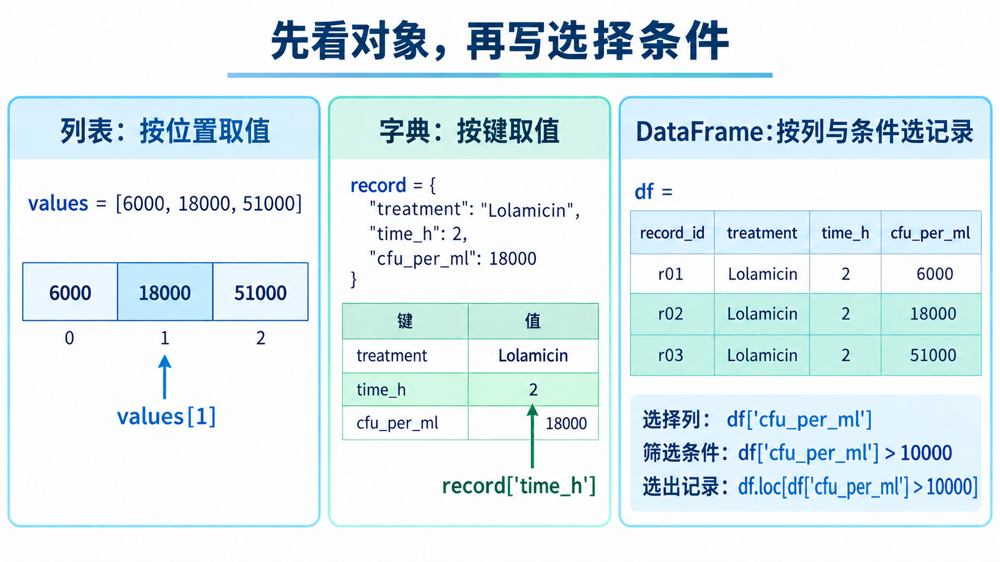
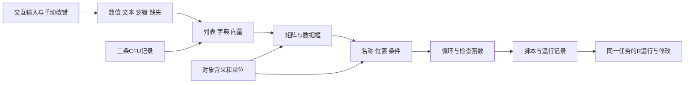

# 第4章 Python 与 R 数据结构基础

把一张表放进程序，需要决定每列怎样保存：编号用文本，估计量用数值，未填写的格子用缺失标记。接下来才能按编号找到记录、取出数值，或筛选符合条件的回答。本章从这些操作开始学习Python与R的数据结构。

本章用五行猜糖豆教学表讲清对象与定位，再用Lolamicin实验记录完成一段连续的药学练习。两种语言要完成相同问题、选中相同记录。课堂先以Python建立操作基础，第六课再实际运行和修改R代码。

配套材料见[数据对象练习包](assets/case-THU-DA-L02-C01-A03/README.md)。它与第一章的小表一致，是独立构造的教学数据，不是真实课堂调查。

本章内容分几次使用。第一次接触编程，可以先跟随4.5的“药学练习：从三条记录到一张小表”完成输入、计算和保存，再回读相应概念。教材的章次用于组织知识，课堂的课次用于安排练习。

| 课堂位置 | 本章阅读与练习 |
|---|---|
| 第四课 | 4.1的值与类型、4.2的Python列表、4.5的交互输入和短脚本；亲手输入、改错、换一组数 |
| 第五课 | 4.1的缺失、4.2的字典和数据框、4.3的列名与条件；接第5章文件读取 |
| 第六课 | 用熟悉的六行表完成R向量、索引、读取和筛选；接第6章分组汇总 |
| 后续课次 | 第七课读作图循环，第八课回读4.4的条件与检查函数；第十二课结合高维数据复用矩阵 |



列表索引从0开始，values[1]取18000；字典按time_h键取2。DataFrame的条件比较产生布尔值，用df.loc[条件]取出18000与51000两行。

## 4.1 数值、字符串、逻辑值与缺失值

### 一个值怎样保存

一罐糖豆有多少粒？先观察糖豆的大小和罐中装填的情况，写下自己的估计；再把同一批糖豆倒进透明碗里，重新观察，写下第二次估计。两次答案可能相同，也可能改变。要把这些回答保存下来，除了估计值，还需要记什么？

假设你负责整理这次活动的记录。只留一列数字，很快就会遇到麻烦：哪一个是第一次的回答，哪一个是第二次的回答？800和980是不是同一个人写的？若想比较每个人前后怎样改变估计，就需要同时保存参与者编号和轮次。可以让每次回答占一行，再给这次回答一个记录号。这样，同一个人有两行记录，通过参与者编号就能找到这两行，通过轮次就能分清先后。

第一章的五行教学表采用了这种安排。p01和p02各有两轮记录，p03有一条未填写估计值的记录。接下来把这张表放进Python和R，看看数值、编号和空白分别怎样保存，又怎样取出某个人在某一轮的回答。

变量名用于引用一个对象。例如，把估计值保存为`estimate`，随后就可以用这个名字参与计算。

```python
estimate = 950
participant_id = "001"
has_answer = True
print(type(estimate), type(participant_id), type(has_answer))
```

```r
estimate <- 950
participant_id <- "001"
has_answer <- TRUE
print(class(estimate))
print(class(participant_id))
print(class(has_answer))
```

这里有数值、字符串和逻辑值。字符串保存文字，包括看起来像数字的编号；逻辑值表示真或假，常用于条件检查。给编号加引号，可以保留“001”的写法，也提醒我们不把它当作连续测量量。

Python中的`=`和R中常用的`<-`在这里用于赋值。比较两个值是否相等时，两种语言都使用`==`。赋值是在保存对象，比较是在提出一个可以返回真假的问题，不能混用。

R中的数值还可细分为整数等类型，Python也有整数和浮点数之分。本章先关心它是否符合字段用途，不把类型名称背诵当作目标。估计量可以参与数值比较，参与者编号则主要用于匹配记录。

### 缺失不是一种普通数值

Python中可能用`None`表示没有给定对象，pandas数值列常见`NaN`表示缺失；R通常使用`NA`。不同对象中的缺失表示不完全一样，应使用相应检查函数，不凭显示样式判断。

```python
import pandas as pd

values = pd.Series([800, None, 0])
print(values.isna().tolist())
print(values.notna().tolist())
```

```r
values <- c(800, NA, 0)
print(is.na(values))
print(!is.na(values))
```

这段代码把缺失与0分开。0是明确保存的数值，`None`或`NA`则没有提供该项测量。数值列中的`NaN`不要用`==`检查；R中的`NA`参与比较时也会产生未知结果。使用`isna()`或`is.na()`，才能明确提出“这一项是否缺失”。

缺失原因仍需回到记录说明。程序只能识别标记，不能知道它来自未回答、未测量还是读取错误。本章使用这些标记检查哪些记录需要回查，缺失值保持原状。

## 4.2 列表、字典、向量、矩阵与数据框

### 多个值为什么需要不同结构

Python列表按顺序保存多个对象；字典按键保存对应值，适合记录字段说明。R向量通常保存同一种基础类型的多个值；带名字的向量可用于简单对应，更复杂对象可以用列表。它们不完全一一对应，选择时先看要保存什么。

```python
required = ["record_id", "participant_id", "round", "estimate_grains"]
dictionary = {"participant_id": "参与者编号", "estimate_grains": "估计量，粒"}
print(required[0])
print(dictionary["estimate_grains"])
```

```r
required <- c("record_id", "participant_id", "round", "estimate_grains")
dictionary <- c(participant_id="参与者编号", estimate_grains="估计量，粒")
print(required[1])
print(dictionary[["estimate_grains"]])
```

先预测上面两行print的结果。第一行取required中的第一个元素，输出record_id；第二行用estimate_grains这个键取出说明，输出“估计量，粒”。方括号内的整数和字符串完成不同的选择。字典左边的键是查找依据，右边的值保存对应内容。

列表或向量的顺序可以用于定位；字典的键或命名元素则用于按名称查找。若名称不存在，具体操作可能报错或返回缺失，不能假设所有结构的行为相同。先检查名称，是比猜测位置更可靠的习惯。

向量中的类型还可能因为组合而改变。例如将数字和文字放进R的同一基础向量，数字可能被转换成文本。因此，能够显示“800”，不等于它仍是可直接计算的数值。数据读入后检查类型，第五章会反复用到。

### 用数据框保存一张表

数据框（data frame）按列保存变量，每列具有相同长度，各列可以有不同类型。下面直接建立五行教学表；文件读取留到下一章。

```python
frame = pd.DataFrame({
    "record_id": ["r01", "r02", "r03", "r04", "r05"],
    "participant_id": ["p01", "p02", "p03", "p01", "p02"],
    "round": [1, 1, 1, 2, 2],
    "estimate_grains": [800, 950, None, 980, 1050]
})
print(frame)
print(frame.dtypes)
```

```r
frame <- data.frame(
  record_id=c("r01", "r02", "r03", "r04", "r05"),
  participant_id=c("p01", "p02", "p03", "p01", "p02"),
  round=c(1L, 1L, 1L, 2L, 2L),
  estimate_grains=c(800, 950, NA, 980, 1050),
  stringsAsFactors=FALSE
)
print(frame)
str(frame)
```

运行后，Python的shape为(5, 4)，R的dim为5和4。record_id和participant_id为文本列，round为轮次，estimate_grains为数值列。Python数值列因为包含缺失，常显示800.0等带小数的形式；这没有改变800粒这个测量单位。

字典或命名参数的名称在这里成为列名，列表或向量成为各列内容。先核对打印出来的表是否与预期一致，再继续计算。输入时漏一个值，可能直接报错；把值放错行，则可能不报错，却改变了记录含义。

本表一行是一次回答。两轮中重复出现的参与者编号保留了对应关系，不是要立即清除的重复。估计列中的缺失也仍然保留，没有因为建立数据框就自动得到合理处理。

### 矩阵只保留了哪些信息

对于p01和p02完整的两轮记录，可以用一个小数值矩阵表示。行对应参与者，列依次对应第一轮、第二轮；本例只演示表示方式，不比较轮次效果。

```python
matrix_values = [[800, 980], [950, 1050]]
row_ids = ["p01", "p02"]
column_ids = ["round1", "round2"]
print(matrix_values[0][1])
```

```r
matrix_values <- matrix(c(800, 980, 950, 1050), nrow=2, byrow=TRUE)
rownames(matrix_values) <- c("p01", "p02")
colnames(matrix_values) <- c("round1", "round2")
print(matrix_values[1, 2])
```

先在原表中寻找p01：第一轮是800，第二轮是980，因此矩阵的第一行依次放800和980；p02的950和1050放在第二行。现在要取“p01第二轮的估计”，就应找到第一行、第二列。Python位置从0开始，所以写[0][1]；R位置从1开始，所以写[1, 2]。两段代码取出的都是980。理解这一步，比记住一串索引写法更重要：先确定数值属于哪个对象、哪个轮次，再把这个位置翻译成相应语言的写法。

Python此处用嵌套列表表示二维数值，不是专门的矩阵对象；R使用矩阵。这个小矩阵为了展示两轮完整记录，只选了p01和p02，没有容纳p03；它也没有保存原来的record_id。不能因为矩阵里看不到p03，就说原始数据里没有这个编号。数据框保留不同类型字段通常更方便；数值矩阵适合组织同类数值，但改变表示方式时，要清楚哪些信息另存了、哪些没有带过来。

如果将行列互换，对象与轮次的位置也会互换。无论画图还是输入后续方法，都应重新确认哪一维代表对象。矩阵有多少个数，不等于研究有多少个独立参与者。

## 4.3 样本、变量、索引与列名

### 先输出真实名称与数量

```python
print(frame.columns.tolist())
print(frame.shape)
print(frame["participant_id"].nunique())
```

```r
print(names(frame))
print(dim(frame))
print(length(unique(frame$participant_id)))
```

行列数描述表格形状，唯一参与者编号数量描述这份表中出现了多少个不同编号。两项都应能用眼睛核对这张小表。到了大数据中，不能逐行看完，仍需要保留这种明确的数量口径。

表的行号或索引是定位工具，不一定是对象标识。排序和筛选可能改变行的位置；参与者编号仍应保存在字段中。不能在重排后继续假设“第三行永远是同一个人”。

### 位置与名称是两种定位方式

```python
print(frame.iloc[0, 0])
print(frame.loc[frame["record_id"] == "r04", ["participant_id", "estimate_grains"]])
```

```r
print(frame[1, 1])
print(frame[frame$record_id == "r04", c("participant_id", "estimate_grains"), drop=FALSE])
```

Python的`iloc`按位置取值，位置从0开始；`loc`按标签或逻辑条件定位。R这里的位置从1开始。`drop=FALSE`让选择结果仍保持数据框形态，避免只选一列时对象结构意外改变。

按记录号筛选仍有前提：该编号应当完整且含义清楚。本表记录号唯一，所以可以定位一次回答；参与者编号重复，则可能选出多条记录。换到其他表时，必须重新核对这些条件。

### 把筛选条件写完整

现在提出一个明确问题：“选出有记录且估计量不少于950粒的回答。”这不是“猜得准确”的判断，因为没有真值。

```python
keep = frame["estimate_grains"].notna() & (frame["estimate_grains"] >= 950)
selected = frame.loc[keep, ["record_id", "estimate_grains"]]
print(selected)
```

```r
keep <- !is.na(frame$estimate_grains) & frame$estimate_grains >= 950
selected <- frame[keep, c("record_id", "estimate_grains"), drop=FALSE]
print(selected)
```

先分别读两个条件。notna得到[True, True, False, True, True]；不少于950的比较得到[False, True, False, True, True]。&逐项组合后，第2、4、5行保留，selected显示r02/950、r04/980、r05/1050。keep是一列逻辑结果，selected则是取出后的两列表。

条件包含两部分：不是缺失，并且达到阈值。`&`在这里逐项组合逻辑结果。R若直接用含`NA`的逻辑向量筛选，可能产生未定义的结果行；明确检查缺失能避免这种误读。

先手工圈出应保留的记录，再运行两种语言，对照记录号而不只是行数。相同的行数仍可能对应不同记录，这是仅检查表格大小发现不了的问题。

## 4.4 条件、循环与函数

### 条件决定是否继续

遇到缺列时，先停止相关操作，比让程序猜一个相似列名更稳妥。条件语句让程序根据检查结果执行不同分支：

```python
if "estimate_grains" in frame.columns:
    print("可以继续检查估计量")
else:
    print("缺少必需列，先核对输入")
```

```r
if ("estimate_grains" %in% names(frame)) {
  print("可以继续检查估计量")
} else {
  print("缺少必需列，先核对输入")
}
```

本次输出回答“列是否存在”。下一章接着检查列中类型、单位和取值。

### 循环把同一个检查用于多个字段

```python
for name in required:
    print(name, name in frame.columns)
```

```r
for (name in required) {
  print(c(name, name %in% names(frame)))
}
```

循环变量`name`每次取一个必需列名。你应能指出循环重复的对象，以及每一步打印什么，而不是把整段代码看成不可拆分的指令。

运行后，四个必需列名各打印一次，后面均为True。for这一行每次把一个列名赋给name，然后执行缩进的print；执行完一次，再取得下一个名称。name是本次循环使用的变量名，换成field仍可运行，但循环体也要相应改名。

### 函数保存一段可重复调用的规则

```python
def missing_columns(table, required_names):
    missing = []
    for name in required_names:
        if name not in table.columns:
            missing.append(name)
    return missing

print(missing_columns(frame, required + ["unit"]))
```

```r
missing_columns <- function(table, required_names) {
  missing <- character()
  for (name in required_names) {
    if (!name %in% names(table)) {
      missing <- c(missing, name)
    }
  }
  return(missing)
}
print(missing_columns(frame, c(required, "unit")))
```

定义def时，函数体被保存，尚未开始检查frame。调用missing_columns时，frame传给table，required加上unit后的列表传给required_names。missing先是空列表；前四个名称已存在，不执行append；到unit时条件为真，append将它加入列表，return把["unit"]交给调用位置，外层print将其显示。print用于显示，return用于交回函数结果。

函数接收数据框和必需列名，返回缺少的名称。它不补列、不删行，也不修改输入；返回结果供调用者决定下一步。这里故意在检查要求中加入`unit`，是为了测试函数能否发现不存在的列，并不是说明原数据遗漏了字典要求的字段。

能说清输入、返回值和是否修改数据，就开始具备检查函数的能力。练习时，亲手把新增名称换成另一个不存在的字段，预测输出，再运行核对。

## 4.5 脚本化分析与运行记录

### 在交互输入与脚本之间切换

系统终端接收启动程序等命令。启动Python解释器后，出现`>>>`，才开始接收Python语句。解释器负责理解并执行这些语句；提示符由它显示，不是代码的一部分。使用课前核验过的入口启动Python，输入提示符后面的内容：

```pycon
>>> 2 + 2
4
```

在这种交互模式下，单独输入一个表达式通常会显示它的值。赋值语句通常不回显所赋的值；保存成脚本后，单独写一个表达式也通常不会显示结果。`print()`用于明确输出，所以后面的短脚本保留输出行。

脚本是保存为文件的一组程序语句。将代码保存为`.py`文件时，只保留代码与注释，不把`>>>`和运行结果写进文件。先用`exit()`退出Python交互模式，再在系统终端运行文件。若课前确认的启动入口为`python`，且当前目录中有`scripts`文件夹，运行形式是：

```text
python scripts/mean_cfu.py
```

本书不绑定某个编辑器的按钮位置。每次运行都要知道正在使用哪个文件、当前目录在哪里，以及屏幕显示的是哪一次结果。

### 从头运行，检查是否依赖旧对象

交互式环境适合试一小段代码，但它可能保留之前创建的对象。某段代码能运行，可能只是因为你在前一次尝试中已经定义了变量。脚本则把必要步骤按顺序保存，便于从新会话重新执行。

完成Python练习时先保存Python文件，学到R对照时再保存R文件。打开新会话，从建立本次需要的对象开始顺序运行；使用软件包的脚本还需包含相应导入。如果中间有变量尚未定义，先检查步骤是否缺失，不要随意把旧会话结果复制过来。

配套的[Python脚本](assets/case-THU-DA-L02-C01-A03/python/objects.py)与[R脚本](assets/case-THU-DA-L02-C01-A03/r/objects.R)读取同一CSV，核对表格、缺失和筛选结果。文件读取方式将在第五章解释。本章先完成内存对象练习，再用配套脚本复核，不以直接运行完整脚本代替逐行理解。

### 记录到什么程度

运行记录写清日期、程序入口、脚本与输入位置、实际输出和人工核对。若有报错，保留原始信息、定位依据与修正；没有报错，则说明怎样核对结果。不要把预期输出粘贴成运行证据。

### 药学练习：从三条记录到一张小表

一种抗生素加入培养物后，可培养的菌量会怎样变化？Muñoz等研究Lolamicin时，对E. coli BW25113设置不同处理，在多个时间取样、稀释、涂布并培养计数，再换算成CFU/mL。CFU是菌落形成单位（colony-forming unit），CFU/mL表示每毫升中的菌落形成单位数，与所用培养和测量条件有关。[论文](https://www.nature.com/articles/s41586-024-07502-0)的Extended Data Fig. 3a给出了这些记录。本练习固定Lolamicin 4×MIC处理，先计算2小时三条记录的均值。MIC为最低抑菌浓度，4×MIC指该药在相应条件下MIC的四倍。

| 时间 | 三条CFU/mL记录 | 作者工作表ED Fig. 3a中的位置 |
|---|---|---|
| 2小时 | 6000、18000、51000 | E3、F3、G3 |
| 8小时 | 200、5500、100 | E5、F5、G5 |

这些数已经完成稀释与涂布条件的换算。例如6000表示6000 CFU/mL，不是让我们在一块平板上重新数6000个菌落。作者图注将三个重复说明为生物学重复。这里先保留各个值，计算它们的算术均值；源表位置帮助核对数值，不额外提供完整的样本身份或跨时间配对信息。

2小时三个值相加为75000，再除以3，得到25000 CFU/mL。把同一个算式输入Python交互模式：

```pycon
>>> (6000 + 18000 + 51000) / 3
25000.0
```

括号使三个值先相加，`/`表示除法。本例除法的结果是浮点数，所以显示小数点；浮点数是程序中表示带小数数值的一种类型。25000.0与手算的25000数值相同。

接着亲手输入五行程序，让每个值都有可以引用的名字：

```python
cfu_1 = 6000
cfu_2 = 18000
cfu_3 = 51000
mean_cfu = (cfu_1 + cfu_2 + cfu_3) / 3
print(mean_cfu)
```

赋值先计算右边的值，再建立左边名称与这个值的对应。第4行引用前面已经建立的三个名称，求出均值后赋给`mean_cfu`；第5行显示这个值。若重新给某个输入变量赋值，还需要重新执行均值计算行，结果才会更新。

现在尝试一次名称错误：将输出行写成`print(mean_cfuu)`，比原名称多一个`u`。Python找不到这个名称时会报告`NameError`。找到报错中的名称，回到赋值行比对，自己改回去并运行。再把输出行故意写成`print(mean_cfu]`，观察括号不匹配造成的`SyntaxError`；修正为成对的圆括号后重新运行。前一种错误需要检查名称，后一种先检查语句写法。只漏掉右括号时，交互解释器也可能显示`...`等待输入，不能把所有括号问题都当作已经完成的报错。

三个值属于同一处理和时间，可以用列表放在一起：

```python
values = [6000, 18000, 51000]
print(values[0])
print(values[1])
total = sum(values)
n = len(values)
mean_cfu = total / n
print(mean_cfu)
```

列表按顺序保存这三条记录，Python用位置编号取其中的项。`values[0]`取得第1项6000，`values[1]`取得第2项18000；位置从0开始。`sum()`将列表中的数值相加，`len()`给出项数。在这里，`total`是计算均值用的算术和，`n`是列表中的3条记录，实验重复的含义仍依据原研究说明。

数字还要与条件、单位一起解释。`unit = "CFU/mL"`保存文本，`time_h = 2`保存时间值。引号会影响操作：`6000 + 18000`得到24000，而`"6000" + "18000"`得到拼接后的文本。要判断时间是不是8小时，可以运行：

```python
time_h = 2
is_eight_hours = time_h == 8
print(is_eight_hours)
```

把第1行的2改为8，再次执行这三行，输出从`False`变为`True`。`=`完成赋值，`==`产生真假判断。第五课会把同样的判断用于表中的每一行。

将列表赋值、求和、计数、相除和输出保存为`scripts/mean_cfu.py`，用`#`开头的注释写明菌株、处理、时间、单位和源表位置。退出交互模式后，从系统终端运行这个文件。再整组改用8小时的`[200, 5500, 100]`，同时更新注释，保存并重跑。先手算5800÷3，再核对约1933.33 CFU/mL的结果。均值概括了当前三条记录，原始三个值仍需保留，供后续观察组内差异。

当两个时间的记录放在同一张表中，每个值还需要带上相应的时间与来源：

| time_h | value（CFU/mL） | source_cell |
|---:|---:|---|
| 2 | 6000 | E3 |
| 2 | 18000 | F3 |
| 2 | 51000 | G3 |
| 8 | 200 | E5 |
| 8 | 5500 | F5 |
| 8 | 100 | G5 |

配套[六行表与练习程序](assets/case-lolamicin-python-r/README.md)还保留处理、单位、重复说明和工作表名称。第五课读取这张表，先核对6行、8列，再按时间挑出记录；第六课扩展到3处理、4时间、每组三条记录的36行表。此时同一时间下有不同处理，分组必须同时看处理和时间。完整表没有0小时实测行，不能把方法中的起始浓度补写成实验记录。

第六课再用R完成熟悉的三值计算：

```r
values <- c(6000, 18000, 51000)
print(values[1])
print(length(values))
print(mean(values))
```

这四行依次建立数值向量、取第一项、数项数和计算均值。R第一项的写法为`values[1]`，Python则为`values[0]`；取到的都是6000。随后运行并修改配套R筛选程序，把目标时间改为8，核对它与Python都选中了E5/F5/G5及200、5500、100。屏幕显示的小数位可以不同，选中的记录和数值应当一致。

### 本章任务与自查

按实际学到的内容分次提交：

| 完成时点 | 任务与检查 |
|---|---|
| 第四课Python入门 | 本人输入的8小时短脚本、一次实际输出、简短修改说明；记录NameError与SyntaxError分别怎样修正 |
| 第五课读表 | 按时间选中的记录表，说明行数、数值、单位和来源单元格怎样核对 |
| 第六课R对照 | 运行并修改R脚本，与Python选中相同记录；说明向量和位置选择的写法 |
| 后续结构练习 | 回读糖豆例中的缺失、矩阵和检查函数，解释对象选择与函数输入、返回 |

随着练习推进，应能解释：

- 为什么编号保存为文本，缺失不改成0；
- 为什么按位置取第一行时，Python与R写法不同；
- 为什么筛选后既查数量，也查记录号；
- 为什么列名检查函数不应擅自补出缺少的列；
- 为什么同一参与者的多轮记录不能自动当成更多独立样本。

先完成自己的判断，再查看配套运行结果。作业保留本人实际运行证据；提供了示例程序不等于已经完成练习。记录说明够用即可，不要求每个小步骤截图。

### 知识结构


```mermaid
flowchart LR
A[数值 文本 逻辑 缺失] --> B[列表 字典 向量]
B --> C[矩阵与数据框]
C --> D[名称 位置 条件]
D --> E[循环与检查函数]
E --> F[脚本与运行记录]
G[对象含义和单位] --> C
G --> D
H[交互输入与手动改错] --> A
I[三条CFU记录] --> B
F --> J[同一任务的R运行与修改]
```


软件语法可查阅[Python官方数据结构教程](https://docs.python.org/3/tutorial/datastructures.html)和[R基础手册](https://cran.r-project.org/doc/manuals/r-release/R-intro.html)。实际对象仍以当前版本运行结果为准。下一章把这些检查用于真实文件，处理读取方式、字段说明和数据质量。

### 本章总结与分析范围

本章练习建立了值、对象、定位、条件和脚本之间的关系。糖豆表有5条回答、3名参与者，记录数与对象数分别核对；Lolamicin练习保留原始CFU/mL记录，均值概括当前三条数值，实验单位及跨时间对应由源研究说明。缺失原因、编号含义和单位需要回到记录，程序显示正常不足以确认这些含义。

推荐用AI解释已经输入的语句、翻译真实报错和协助定位问题，再亲手修改并从新进程运行。作业以本人代码、实际输出及判断说明作为学习证据。读取、清洗和统计解释在后续章节继续展开。

本章的[章级练习与开始说明](../../teaching/chapter-practice.md#chapter-4)集中提供输入、完整演示脚本、R对照、条件变化任务和核对点。


## 本章练习包

[下载第4章学生练习包](../../downloads/chapter-04-practice.zip) · [查看全书练习包](../../teaching/chapter-practice.md)
