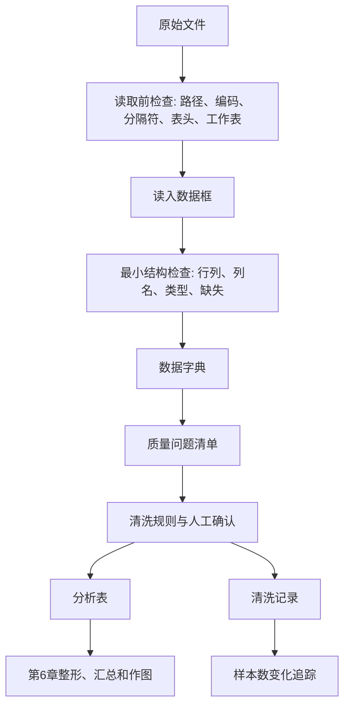
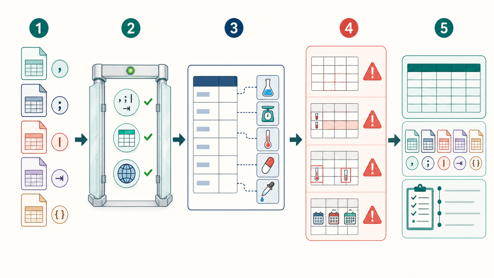
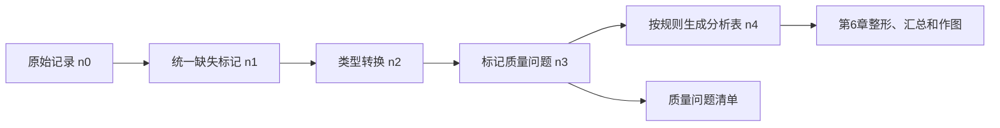

# 第5章 数据读取、数据字典与数据质量

## 本章定位

文件读取把对象、列名、索引和缺失值检查带入真实数据现场。CSV、TXT 或 Excel 读入后，还要用数据字典和质量检查判断能否继续分析。

本章主线是“原始文件 -> 读入数据框 -> 数据字典 -> 质量检查 -> 清洗记录”。代码能读入文件，只是分析开始。字段含义、单位、缺失规则、异常来源和样本数变化，才影响后续结果是否可解释。

| 前置能力 | 本章任务 | 后续承接 |
| --- | --- | --- |
| 能解释数据框、列名和缺失值 | 读入 CSV、TXT、Excel 并检查结构 | 第6章整形和描述统计 |
| 能写 AI 任务说明书 | 让 AI 辅助局部排错和核验 | 第7章的图表设计规范卡 |
| 能保留运行记录 | 记录清洗规则和样本数变化 | 综合项目报告 |

| 案例 | 本章角色 | 证据状态 | 不可外推 |
| --- | --- | --- | --- |
| airway metadata 与计数矩阵 | 贯穿主案例，用于路径、列名、ID、数据字典和合并核验 | 课程数据包已有可检查文件 | 不据此解释差异基因或临床作用 |
| 药品销售字段 | 普通表格对照，用于日期、编码、数量和金额 | 教材摘录示例，当前仓库不可复现 | 不作为真实经营或患者结果 |
| GTF 字段 | 文件格式边界，用于字段类型和注释键 | 结构示例 | 不据此解释基因功能 |

本章不提前展开长宽表转换、表连接策略、分组汇总和探索性可视化，也不写统计推断或医学结论。涉及药品销售、临床指标、GTF、TCGA 或表达矩阵时，只解释字段、单位、键、路径、行列变化和证据边界。

## 学习目标

1. 学生能解释 CSV、TXT、Excel、编码、分隔符、工作目录和路径之间的关系。
2. 学生能用 Python 或 R 读入表格，并检查行列数、列名、前几行、变量类型和缺失计数。
3. 学生能写出数据字典，说明字段含义、类型、单位、取值范围、缺失含义、字段角色和来源。
4. 学生能识别变量类型和单位风险，避免把 ID、编码和日期当普通连续数值。
5. 学生能检查缺失值、异常值、重复值和逻辑一致性，并把处理建议分为标记、回查、转换、保留、排除或需确认。
6. 学生能记录清洗前后样本数变化，说明每一步规则、影响行数和人工判断。

| 学习证据 | 最低要求 |
| --- | --- |
| 读入检查表 | 记录文件路径、读取函数、参数、行列数、列名、类型和缺失计数 |
| 数据字典 | 每个分析字段有含义、类型、单位、来源和需确认事项 |
| 质量问题清单 | 分开列出缺失、异常、重复和逻辑冲突 |
| 清洗记录 | 每一步有输入表、输出表、规则、影响行数、理由和需确认事项 |
| AI 协作记录 | 保留提示词、AI 输出摘要、人工核验和修改结果 |

## 阅读指南

先检查数据流，再检查代码。代码负责读入文件、标记问题和记录过程；字段含义与医学解释仍需依据数据字典和来源材料判断。

遇到读入报错时，不要先让 AI 重写整个脚本。先记录报错，再检查工作目录、文件是否存在、工作表是否正确、编码是否匹配、缺失标记是否统一。

| 读到的问题 | 先做的动作 |
| --- | --- |
| 读入报错 | 查路径、编码、工作表和表头 |
| 字段看不懂 | 查数据字典或标 `需人工确认` |
| 数值异常 | 先标记，再回查来源 |

读到缺失、异常或重复时，也不要马上删除。先问：这个值为什么出现？它影响哪个字段？是否集中在某个分组？有没有数据字典或数据提供者说明可以支持处理规则？

| 阅读时先问 | 对应产物 |
| --- | --- |
| 文件有没有被正确读入 | 读入检查表 |
| 字段能不能解释 | 数据字典 |
| 值有没有质量风险 | 质量问题清单 |
| 处理有没有留下证据 | 清洗记录 |

## 核心概念速查

| 概念 | 本章解释 | 常见混淆 | 使用边界 |
| --- | --- | --- | --- |
| CSV | 用分隔符保存表格的文本文件 | 把 CSV 当 Excel 工作簿 | 先检查分隔符、编码、表头 |
| TXT/TSV | 文本表格，常用制表符或空格分隔 | 看到 `.txt` 就按普通文本处理 | 需要确认分隔符和列数 |
| Excel | 工作簿文件，可含多个工作表 | 只读默认第一个工作表 | 指定工作表和表头位置 |
| 编码 | 字符保存方式，影响中文显示 | 把乱码当字段含义错误 | 先记录，再尝试读取参数 |
| 工作目录 | 相对路径的起点 | 以为脚本在哪，工作目录就在哪 | 每次运行前确认 |
| 原始数据 | 未经过课程流程修改的数据文件 | 直接手工改原始表 | 保持只读，另存输出 |
| 数据字典 | 解释字段含义、类型、单位和来源的表 | 只列列名 | 每个分析字段都要写 |
| 缺失值 | 未记录、不可用或不适用的值 | 直接等于 0 | 先判断原因 |
| 异常值 | 偏离分布或规则的观察 | 一发现就删除 | 先标记和回查 |
| 重复值 | 样本、记录或 ID 重复出现 | ID 重复就是错误 | 先定义重复对象 |
| 清洗记录 | 记录处理规则、理由和样本数变化 | 只交最终表 | 必须能回放 |

## 章节总览图





*图5-1　五个环节依次表示：1，保留原始文件；2，检查分隔符、表头、编码等导入条件；3，用数据字典解释字段；4，标记缺失、重复、范围和日期格式问题；5，分别保存分析表、原始文件与清洗记录。本图由 ImageGen 生成，只概括检查顺序。具体规则、记录数变化和处理结果以正文和实际运行为准，使用时仍需人工核对。*

## 5.1 CSV、Excel 与常见编码问题

CSV、TXT 和 TSV 都可能以文本形式保存表格，差别主要在分隔符、编码和字段引用方式。Excel 是工作簿文件，还可能包含多个工作表、公式、隐藏列、合并单元格和人工格式。扩展名只能提供初步线索，真正的读入参数应由文件内容和来源说明决定。

读取不是把文件变成数据框后就结束。代码执行前先确认文件、工作表、分隔符、编码和预期字段；执行后立即检查形状、列名、前几行与数据类型。若中文乱码、所有内容挤在一列、首行被误作数据或数字列变成文本，先调整读取条件并重新核对，不进入清洗和统计。

正式分析前，学生要把这些文件读成 Python 或 R 中的数据框。读入成功后还要检查结构。文件能打开，不等于读入正确。

| 文件 | 读取前检查 | 常见问题 | 记录内容 |
| --- | --- | --- | --- |
| CSV | 分隔符、编码、表头、缺失标记 | 中文乱码、列错位、`?` 未识别 | `encoding`、`sep`、`na_values` |
| TXT/TSV | 制表符、空格、列数 | 多空格使列错位 | `sep` 或 `read_table()` 参数 |
| Excel | 工作表名、表头行、空行空列 | 读错工作表、隐藏列、合并单元格 | `sheet_name`、表头行 |

读入检查依次使用 `os.getcwd()`、`pd.read_csv()` 或 `pd.read_table()`，再查看 `columns` 和 `dtypes`。这些动作应组成可核验流程，不宜复制无法解释的长代码。

### 实验 5-1 metadata.csv 读取与最小检查

下面使用内嵌模拟 CSV。学生可以直接运行，不依赖外部 TCGA、GTF 或 FASTQ 文件。`file_name` 只是文件名字符串，不代表文件真的存在。

```python
from io import StringIO
import os
from pathlib import Path
import pandas as pd

csv_text = """sample_id,group_code,batch,file_name,note
S1,A,1,S1_R1.fastq.gz,ok
S2,B,1,S2_R1.fastq.gz,
S3,A,2,S3_R1.fastq.gz,check_path
S4,C,2,S4_R1.fastq.gz,unknown_group
"""

print(os.getcwd())
metadata = pd.read_csv(
    StringIO(csv_text),
    na_values=["", "NA", "N/A", "?", "缺失"]
)

print(metadata.shape)
print(metadata.head())
print(metadata.columns.tolist())
print(metadata.dtypes)
print(metadata.isna().sum())
```

这段代码训练五件事：看当前目录、读入表格、看行列数、看列名、看缺失。学生要把输出写入读入检查表，而不是只说“代码跑通了”。

| 检查 | Python | R | 目的 |
| --- | --- | --- | --- |
| 当前目录 | `os.getcwd()` / `Path.cwd()` | `getwd()` | 确认相对路径起点 |
| 前几行 | `df.head()` | `head(df)` | 检查表头、错列和异常字符 |
| 行列数 | `df.shape` | `dim(df)` | 核对数据规模 |
| 列名 | `df.columns.tolist()` | `names(df)` | 避免 AI 猜列名 |
| 类型 | `df.dtypes` / `df.info()` | `str(df)` | 发现数值列被读成文本 |
| 缺失计数 | `df.isna().sum()` | `colSums(is.na(df))` | 找到缺失字段 |
| 唯一值 | `value_counts()` | `table()` | 检查分类水平 |

如果文件来自 Excel，学生还要先看工作表名。正式作业中不能只读默认工作表。

```python
# 真实 Excel 文件读取模板。运行前需把路径换成给定文件。
# excel_file = pd.ExcelFile("data/raw/example.xlsx")
# print(excel_file.sheet_names)
# df_excel = pd.read_excel("data/raw/example.xlsx", sheet_name="原始数据")
```

R 的对应写法同样要记录参数。学生不需要比较所有读取包，但要说明自己用了哪个函数。

```r
metadata <- read.csv(
  "data/raw/metadata.csv",
  fileEncoding = "UTF-8",
  na.strings = c("", "NA", "N/A", "?")
)

dim(metadata)
head(metadata)
str(metadata)
colSums(is.na(metadata))
```

中文字段或药品名出现乱码时，不要直接修改原始文件。先记录异常，再尝试 `utf-8`、`utf-8-sig`、`gb18030` 等常见编码。

```python
for enc in ["utf-8", "utf-8-sig", "gb18030"]:
    try:
        preview = pd.read_csv(StringIO(csv_text), encoding=enc, nrows=3)
        print(enc, preview.shape)
    except UnicodeDecodeError:
        print(enc, "读取失败")
```

这个示例使用内嵌文本，通常不会触发真实编码错误。真实文件中若尝试多种编码，应把尝试过程写入清洗记录。

## 5.2 工作目录、文件路径与原始数据保护

许多读入错误来自路径解析。工作目录是相对路径的起点，但终端启动位置、Notebook 当前目录和脚本保存位置可能不同。同一句读取命令在不同目录执行，可能找不到文件，也可能意外读到另一个同名文件。

排查时先输出当前目录，再把相对路径解析为实际位置，最后核对文件大小、更新时间或哈希等可识别信息。原始数据应放在只读输入区，脚本将清洗结果写入新的输出文件。路径检查与原始数据保护属于同一件事，因为读取和写入目标只有在解析后才能确认。

开始分析前，先确认工作目录、目标路径和文件是否存在。不要把桌面、下载目录或微信临时文件路径写进正式脚本。

```python
project_root = Path.cwd()
raw_path = project_root / "data" / "raw" / "metadata.csv"

print(project_root)
print(raw_path)
print(raw_path.exists())
```

```r
getwd()
file.exists("data/raw/metadata.csv")
```

本课程要求原始数据只读。学生可以从原始数据生成分析表，但不能在原始 Excel 或 CSV 上手工改错后再分析。字段改名、类型转换、缺失标记和异常筛查，都应通过脚本或清洗记录回放。

| 目录 | 用途 | 修改规则 |
| --- | --- | --- |
| `data/raw/` | 给定或下载的原始数据 | 不覆盖、不手工改 |
| `data/processed/` | 脚本生成的分析表 | 可重新生成 |
| `scripts/` | 读取、检查、清洗和导出脚本 | 可修改，需留记录 |
| `outputs/` | 数据字典、质量表、图表、日报、报告 | 按任务命名 |
| `references/` | 模板、术语表和规范 | 按项目规则维护 |

### 路径错误排查表

| 现象 | 先查什么 | 不建议做什么 |
| --- | --- | --- |
| `FileNotFoundError` | 当前工作目录、相对路径、文件名大小写 | 让 AI 猜本机路径 |
| Excel 读错表 | 工作表名、表头行、隐藏列 | 只读默认第一个工作表 |
| CSV 列数异常 | 分隔符、引号、换行、编码 | 手工删原始文件中的行 |
| 中文乱码 | 编码参数、文件来源 | 直接覆盖保存原始文件 |
| 输出覆盖 | 输出路径和文件名 | 把结果写回 `data/raw/` |

相对路径比个人绝对路径更适合作业提交。更好的命名是 `chapter5_read_check.csv`、`chapter5_quality_flags.csv`、`chapter5_cleaning_log.md`。`new.csv`、`final2.xlsx` 不能说明内容，也不利于复核。

```python
out_dir = project_root / "outputs" / "chapter-5"
print(out_dir)

# 正式脚本中可以创建输出目录，但不能把输出写回原始数据目录。
# out_dir.mkdir(parents=True, exist_ok=True)
```

## 5.3 数据字典的字段与写法

数据字典把文件中的列名连接到采集背景和分析规则。它记录变量名、中文名、含义、类型、单位、取值范围、缺失含义、字段角色和来源。仅翻译列名无法说明某个数值按什么单位记录，也无法判断空值、特殊编码或时间点怎样处理。

字典中的信息会直接进入后续步骤。类型和合法取值决定读取后的检查，单位决定数值能否合并，字段角色决定它是 ID、分组、结局还是普通测量。生成字典草稿后，要逐列与来源说明和真实取值对照；AI 可以整理字段，但不能根据列名补造单位或医学含义。

如果没有数据字典，学生容易把 ID 当数值，把编码当剂量，把时间字段当普通文本，把缺失值当 0。AI 也会在列名不清时猜字段含义。本章要求学生先写数据字典，再讨论清洗规则。

| 字段 | 说明 | 示例 |
| --- | --- | --- |
| 原始列名 | 数据表中的真实列名 | `actual_amount` |
| 中文名 | 教材或报告中使用的名称 | 实收金额 |
| 含义 | 字段记录什么 | 单次交易实际收取金额 |
| 类型 | 数值、分类、日期、文本、ID、逻辑值 | 数值 |
| 单位 | 元、岁、mg、U/L 等 | 元，需确认 |
| 取值范围 | 合法范围或常见范围 | `>= 0` |
| 缺失含义 | 未记录、不适用、无法测量等 | 未记录，需回查 |
| 字段角色 | ID、时间、分组、结局、协变量、备注 | 汇总字段 |
| 来源 | 原始文件、计算生成、人工补录 | 原始 CSV |
| 处理建议 | 保留、转换、标记、排除、需确认 | 转数值并查负值 |

### 药品销售字段示范：教材摘录示例，当前仓库不可复现

药品销售教材案例可训练学生区分日期、ID、编码、文本、数量和金额。当前仓库未发现原始 `drugSale.csv`，所以本章只把它作为教材摘录示范。

| 原始字段 | 类型判断 | 可能单位 | 质量检查 | 需确认 |
| --- | --- | --- | --- | --- |
| 购药时间 | 日期/时间 | 无 | 能否转为日期，是否在采集范围内 | 日期格式和时区 |
| 社保卡号 | ID | 无 | 是否缺失，格式是否一致 | 是否已脱敏 |
| 商品编码 | ID/分类编码 | 无 | 编码是否为空，格式是否混乱 | 编码体系 |
| 商品名称 | 文本/分类 | 无 | 同一药品是否多种写法 | 标准名称 |
| 销售数量 | 数值 | 盒/瓶/件，需确认 | 是否小于 0，是否可为小数 | 单位和退货规则 |
| 应收金额 | 数值 | 元，需确认 | 是否小于 0 | 折扣前含义 |
| 实收金额 | 数值 | 元，需确认 | 是否小于 0，是否大于应收金额 | 折扣、退款和医保规则 |

社保卡号、患者编号和样本编号都可能涉及隐私。教材和课堂展示应使用脱敏或模拟 ID。学生不能把真实身份信息粘贴进 AI 对话。

### 实验 5-2 从元数据生成数据字典草稿

下面的数据字典草稿来自实验 5-1 的模拟字段。它展示字段字典的写法，不代表真实数据说明。

```python
data_dictionary = pd.DataFrame({
    "variable_name": ["sample_id", "group_code", "batch", "file_name", "note"],
    "中文名": ["样本编号", "分组编码", "批次", "文件名", "备注"],
    "字段角色": ["主键", "分组字段", "质量核验字段", "路径字段", "辅助字段"],
    "类型": ["ID", "分类", "分类", "文本", "文本"],
    "需确认": ["是否已脱敏", "编码含义", "批次来源", "文件是否存在", "是否含隐私信息"],
})

print(data_dictionary)
```

| 字段名 | 中文名 | 类型 | 单位 | 缺失含义 | 字段角色 | 需确认 |
| --- | --- | --- | --- | --- | --- | --- |
| `sample_id` | 样本编号 | ID | 无 | 不应缺失 | 主键 | 是否已脱敏 |
| `group_code` | 分组编码 | 分类 | 无 | 需回查 | 分组字段 | 编码含义 |
| `batch` | 批次 | 分类 | 无 | 需回查 | 质量核验字段 | 批次来源 |
| `file_name` | 文件名 | 文本 | 无 | 需回查 | 路径字段 | 文件是否存在 |
| `note` | 备注 | 文本 | 无 | 可为空 | 辅助字段 | 是否含隐私信息 |

### 实验 5-3 GTF 字段表读取与质量检查

GTF、GTF 转出的 CSV 或基因注释表可以作为组学字段表的例子。第5章只检查字段、缺失和重复，不解释 `protein_coding`、`lncRNA` 或染色体基因数量的生物学意义。

```python
gtf_text = """seqnames,type,gene_type,gene_name,gene_id
chr1,gene,protein_coding,GENE1,ENSG000001
chr1,gene,lncRNA,GENE2,ENSG000002
chr2,transcript,protein_coding,GENE1,ENSG000001
chr3,gene,,GENE3,ENSG000003
"""

gtf_df = pd.read_csv(StringIO(gtf_text))

print(gtf_df.columns.tolist())
print(gtf_df["type"].value_counts(dropna=False))
print(gtf_df["gene_type"].value_counts(dropna=False))
print(gtf_df["gene_id"].isna().sum())
print(gtf_df["gene_id"].duplicated().sum())
```

| 字段名 | 中文名 | 检查规则 | 本章边界 |
| --- | --- | --- | --- |
| `seqnames` | 染色体或序列名 | 不应为空，合法值需补来源 | 不解释染色体基因分布 |
| `type` | 注释类型 | 检查是否在课程给定合法值内 | 不做功能筛选 |
| `gene_type` | 基因类型 | 检查缺失和类别拼写 | 不解释生物功能 |
| `gene_name` | 基因名 | 可缺失但需记录 | 不挑基因讲机制 |
| `gene_id` | 基因 ID | 检查缺失和重复 | 可作为合并键候选 |

真实 GTF 还需要补数据库来源、版本、下载地址、转换方式和许可。本章不承诺这些模拟数据能代表真实数据库。

## 5.4 数据类型识别与单位检查

软件会根据当前内容推断数据类型，这个结果只是读入状态。一个字段被 pandas 读成 `object`，可能因为它本来是文本，也可能因为数值列混入了 `?`、空格、单位或中文字符。反过来，数字编码的分类变量也可能被误读为连续数值。

类型转换前先查看原始取值和异常频数，明确哪些字符串代表缺失、哪些单位需要统一、哪些值应保留原样。转换后比较失败记录、非缺失数量和数值范围，确认没有把未知编码静默变成缺失。单位换算还要记录原单位、目标单位和规则，使前后数据能够对账。

变量类型要结合数据字典判断。`sample_id`、`gene_id`、`file_name`、社保卡号和药品编码都属于标识或文本字段。即使它们看起来含数字，也不能直接当连续变量计算均值。

| 目标类型 | 常见错误 | 检查方法 | 处理方向 |
| --- | --- | --- | --- |
| 数值 | 混入字符、单位、货币符号、`?` | 查看类型和唯一值 | 指定缺失标记，清理后转换 |
| 日期 | 格式混乱、含星期文本 | 抽样查看，尝试转换 | 明确格式，记录失败行 |
| 分类 | 大小写、空格、同义标签 | 统计唯一值 | 建立映射表 |
| ID | 被读成数字，前导 0 丢失 | 查看长度和原始格式 | 按文本读取 |
| 逻辑值 | 是/否、0/1、TRUE/FALSE 混用 | 统计取值 | 统一编码并保留映射 |

### 实验 5-4 字段类型和合法取值检查

```python
for col in ["sample_id", "group_code", "batch", "file_name", "note"]:
    print("\n", col)
    print(metadata[col].dtype)
    print(metadata[col].nunique(dropna=False))
    print(metadata[col].value_counts(dropna=False))
```

类型转换要留下失败记录。转换失败的行常提示缺失标记、单位、录入格式或字段含义没有写清。

```python
clinical_text = """sample_id,visit_date,age,ALT,drug_dose
S1,2026-03-01,21,35,10 mg
S2,2026/03/02,NA,?,5 mg
S3,2026-03-03,twenty,42,0 mg
"""

clinical = pd.read_csv(StringIO(clinical_text), na_values=["NA", "?", ""])
clinical["visit_date_checked"] = pd.to_datetime(clinical["visit_date"], errors="coerce")
clinical["age_checked"] = pd.to_numeric(clinical["age"], errors="coerce")
clinical["ALT_checked"] = pd.to_numeric(clinical["ALT"], errors="coerce")

print(clinical[["sample_id", "visit_date_checked", "age_checked", "ALT_checked"]])
print(clinical[["visit_date_checked", "age_checked", "ALT_checked"]].isna().sum())
```

R 里也有类似风险。因子（factor）是分类变量。把因子直接转数值时，得到的可能是内部编码，不是原始数值。

```r
x <- factor(c("18", "20", "21"))
as.numeric(x)
as.numeric(as.character(x))
```

单位检查应早于统计和作图。ALT、AST、血糖、药物剂量、金额、年龄和时间都不能只看数值。单位不清时，不能求均值，不能画比较图，也不能写结论。

| 字段场景 | 需确认内容 | 风险 |
| --- | --- | --- |
| 年龄 | 岁、月龄或天数 | 不同单位混合会误导分组 |
| 药物剂量 | mg、mg/kg、mL、浓度 | 剂量解释错误 |
| 检验指标 | U/L、mmol/L、mg/dL | 不能直接比较 |
| 金额 | 元、美元、应收、实收 | 汇总含义不同 |
| 日期 | 采样日、入组日、购药日 | 时间顺序误读 |

### 字符串编码到标签的边界

TCGA 样本编号可用于演示字符串切片和字典映射。编码映射前应先建立来源明确的映射表，本节不解释 TCGA 生物学含义。

```python
code_map = {"A": "教学组A", "B": "教学组B"}
metadata["group_label"] = metadata["group_code"].map(code_map)

print(metadata[["sample_id", "group_code", "group_label"]])
print(metadata["group_label"].isna().sum())
```

如果出现未匹配编码，比如这里的 `C`，应写入质量问题清单。真实编码含义必须来自数据字典、数据库说明或数据提供者确认。

## 5.5 缺失值、异常值、重复值与逻辑一致性

缺失值、异常值、重复值和逻辑冲突先作为质量现象记录，再进入处理决定。发现一个极端值不等于应当删除，看到相同 ID 也不一定是错误重复；它们可能分别对应真实极端观察、重复测量或数据合并后的多条记录。来源、观察单位和任务目标共同决定处置方式。

质量处理按“发现、回查、决定、执行、记录”的顺序进行。代码先生成候选清单，人工再查数据字典、原始记录或研究设计。决定保留、标记、转换、合并或排除后，记录受影响的行、字段和理由。这样，质量检查不会在不知情的情况下改变样本构成。

| 处理状态 | 适用情形 | 记录要求 |
| --- | --- | --- |
| 保留 | 当前值合理，或暂不影响任务 | 写明判断范围 |
| 标记 | 需要后续复核但不立即改变 | 保留原值和标记字段 |
| 回查 | 含义、单位或来源不清 | 指向数据字典或原始记录 |
| 转换 | 类型、编码或单位需要统一 | 保存转换规则与前后值 |
| 排除 | 有明确规则支持不纳入分析 | 记录理由和排除数量 |
| 待确认 | 资料或责任边界不足 | 不自行补值或下结论 |

缺失值是未记录、不可用或不适用的值。它不是 0，也不自动代表阴性、正常或无效。处理缺失值前，先查看哪些字段缺失、缺失比例多高、是否集中在某些样本或分组。

```python
missing_table = metadata.isna().sum().rename("missing_n").to_frame()
missing_table["missing_pct"] = missing_table["missing_n"] / len(metadata)
print(missing_table.sort_values("missing_pct", ascending=False))
```

| 缺失情形 | 可能解释 | 处理建议 |
| --- | --- | --- |
| 少量零散缺失 | 录入漏项或导入问题 | 回查；必要时排除并记录 |
| 某列大量缺失 | 字段未采集或不适用 | 先确认是否用于分析 |
| 某组集中缺失 | 采集流程差异 | 分组查看，标记风险 |
| 日期缺失 | 流程节点未发生或未记录 | 结合状态字段判断 |

异常值是偏离分布或规则的观察。异常值可能来自录入错误，也可能是真实极端观察、单位错误、退款记录或特殊样本。只有在有证据支持它来自采集或记录错误时，排除才可能成立。

```python
sales_text = """sale_id,quantity,receivable,actual
T1,2,100,95
T2,-1,50,50
T3,1,80,90
T4,0,0,0
"""

sales = pd.read_csv(StringIO(sales_text))
quality_flags = pd.DataFrame(index=sales.index)
quality_flags["数量小于0"] = sales["quantity"] < 0
quality_flags["应收金额小于0"] = sales["receivable"] < 0
quality_flags["实收金额小于0"] = sales["actual"] < 0
quality_flags["实收大于应收"] = sales["actual"] > sales["receivable"]

print(quality_flags.sum())
```

重复值要先定义重复对象。整行完全相同可能是导入重复；同一 ID 多次出现可能是真实复购、复诊或重复测量。不要一看到重复就删除。

```python
print(metadata.duplicated().sum())
print(metadata["sample_id"].duplicated().sum())
```

| 重复检查 | 适用场景 | 判断边界 |
| --- | --- | --- |
| 整行重复 | 文件合并或导入错误 | 可作为错误重复候选 |
| ID 重复 | 复购、复诊、重复测量 | 不能直接删除 |
| ID + 日期重复 | 同一天多次记录 | 需看业务规则 |
| ID + 日期 + 项目重复 | 同一检测项目重复 | 需确认是否复测 |

### 实验 5-5 表达矩阵与注释表合并前核验

`pd.merge()` 可连接表达矩阵与注释表。本节只训练合并前后的行数、键和未匹配项核验，不做差异表达，也不解释基因功能。

```python
expr_text = """gene_id,S1,S2,S3
ENSG000001,10,12,11
ENSG000002,0,1,0
ENSG000002,0,1,0
ENSG000004,5,4,6
"""

gene_map_text = """gene_id,gene_name
ENSG000001,GENE1
ENSG000002,GENE2
ENSG000003,GENE3
"""

expr = pd.read_csv(StringIO(expr_text))
gene_map = pd.read_csv(StringIO(gene_map_text))

print(expr.shape, gene_map.shape)
print(expr["gene_id"].duplicated().sum())
print(gene_map["gene_id"].duplicated().sum())

merged = pd.merge(gene_map, expr, on="gene_id", how="inner")
print(merged.shape)
print(merged["gene_id"].tolist())
```

学生需要记录合并前后行数变化、重复键数量、未匹配键和处理建议。合并成功只说明键能匹配，不说明表达数据适合统计分析。

| 核验点 | 该例结果 | 解释边界 |
| --- | --- | --- |
| 表达矩阵行数 | 4 行 | 不等于真实基因数量 |
| 注释表行数 | 3 行 | 只说明模拟映射表规模 |
| 表达矩阵重复键 | `ENSG000002` 重复 | 需确认是重复记录还是不同转录本 |
| 内连接后行数 | 3 行 | 未匹配键需记录 |

### 实验 5-6 重复列名故障排查

`pd.concat(..., axis=1)` 可能把多个表的同名列并排放在一起。若直接 `drop("sample_id", axis=1)`，可能把所有同名列都删掉。

```python
subgroup = pd.DataFrame({
    "sample_id": ["S1", "S2", "S3"],
    "subgroup": ["X", "Y", "X"],
})

metadata_small = pd.DataFrame({
    "sample_id": ["S1", "S2", "S3"],
    "batch": [1, 1, 2],
})

expr_small = pd.DataFrame({
    "sample_id": ["S1", "S2", "S3"],
    "GENE1": [10, 12, 11],
})

result = pd.concat([subgroup, metadata_small, expr_small], axis=1)
print(result.columns.tolist())
print(result.columns.duplicated().tolist())

deduped = result.loc[:, ~result.columns.duplicated()]
print(deduped.columns.tolist())
```

这个例子展示三条规则：重复列名会影响列选择、删除和导出；保留哪一列必须看数据字典、来源表和合并键；更稳妥的做法通常是合并前设置索引，或用 `merge` 明确合并键。

```python
joined = (
    subgroup
    .merge(metadata_small, on="sample_id", how="inner")
    .merge(expr_small, on="sample_id", how="inner")
)
print(joined.columns.tolist())
```

逻辑一致性检查看字段之间是否互相支持。常见规则包括日期顺序、金额关系、分类合法值、ID 完整性和单位一致性。

| 逻辑规则 | 检查思路 | 处理 |
| --- | --- | --- |
| 日期顺序 | 开始日期 <= 结束日期 | 标记异常，回查来源 |
| 金额关系 | 实收金额 <= 应收金额 | 结合折扣、退款规则确认 |
| 分类合法 | 分组只含预设水平 | 建立映射表或回查 |
| ID 完整 | 样本 ID 非空且格式一致 | 缺失 ID 通常不能进入样本级分析 |
| 单位一致 | 同一字段单位一致 | 不一致时先标准化或分层 |

### 生物医学解释边界卡

| 项目 | 本章写法 |
| --- | --- |
| 观察结果 | 读入后发现缺失、负值、重复、未匹配键或逻辑冲突 |
| 方法来源 | 表格读取、类型检查、缺失计数、重复检查、规则筛查 |
| 允许解释 | 这些记录提示数据质量风险，需要回查或记录处理 |
| 替代解释 | 可能是真实退款、复购、复测、单位差异或采集流程差异 |
| 仍需验证 | 字段说明、业务规则、原始记录、数据提供者确认 |
| 禁止越界 | 不能仅凭清洗结果写医学因果、疗效判断或临床建议 |

## 5.6 清洗记录与样本数变化追踪

清洗记录把每条处理规则与数据变化对应起来。它要说明输入表、输出表、处理规则、受影响记录、采用理由和仍需确认的内容。记录不能只写“删除异常值”或“完成清洗”，因为复核者无法据此知道使用了什么阈值、删了哪些行或是否改变了分组比例。

样本数追踪为这些记录提供对账线索。每一步先记处理前的观察数，再记排除、合并或新增标记的数量，最后计算处理后的数量。若同一记录连续触发多条规则，要避免重复扣减。最终分析表的行数、唯一 ID 数和分组计数应能回到规则级记录，否则清洗过程尚未闭合。

样本数变化追踪同时记录最终行数和每一步的数据变化。删除、标记、转换、合并和导出，都应留下输入行数、输出行数和原因。

| step_id | 输入表 | 输出表 | 规则 | 影响行数 | 处理方式 | 理由 | 需确认 |
| --- | --- | --- | --- | ---: | --- | --- | --- |
| 01 | metadata | metadata_checked | 统计缺失和重复 | 0 | 只标记 | 判断数据质量风险 | 字段含义 |
| 02 | metadata | metadata_labeled | 映射 `group_code` | 1 | 标记未匹配编码 | C 未在映射表中 | C 的真实含义 |
| 03 | expr/gene_map | merged | 按 `gene_id` 内连接 | 1 | 记录行数变化 | 检查键匹配 | 未匹配 gene_id 来源 |
| 04 | result | deduped | 标记重复列名 | 2 | 保留首次出现列 | 演示列名风险 | 保留哪列需人工确认 |

```python
cleaning_log = pd.DataFrame([
    {
        "step_id": "01",
        "input_table": "metadata",
        "output_table": "metadata_checked",
        "rule": "统计缺失值和 sample_id 重复",
        "rows_before": len(metadata),
        "rows_after": len(metadata),
        "changed_rows": int(metadata["sample_id"].duplicated().sum()),
        "need_confirm": "sample_id 是否应唯一",
    },
    {
        "step_id": "02",
        "input_table": "metadata",
        "output_table": "metadata_labeled",
        "rule": "映射 group_code 到 group_label",
        "rows_before": len(metadata),
        "rows_after": len(metadata),
        "changed_rows": int(metadata["group_label"].isna().sum()),
        "need_confirm": "未匹配分组编码的含义",
    },
    {
        "step_id": "03",
        "input_table": "expr + gene_map",
        "output_table": "merged",
        "rule": "按 gene_id 内连接",
        "rows_before": len(expr),
        "rows_after": len(merged),
        "changed_rows": len(expr) - len(merged),
        "need_confirm": "未匹配 gene_id 的来源",
    },
])

print(cleaning_log)
```

药品销售教材案例报告过样本数变化：原始数据总行数为 6580，去掉标题行后交易记录为 6579；删除缺失值后为 6575；剔除小于 0 的异常值后为 6559；去重后仍为 6559；类型转换后为 6536。当前仓库未发现 `drugSale.csv` 原始文件，这些数字只能作为教材摘录示范，不能写成当前项目的可复现实测结果。

| 步骤 | 规则 | 剩余记录数 | 变化记录数 | 证据状态 |
| --- | --- | ---: | ---: | --- |
| 原始交易记录 | 去掉标题行后计数 | 6579 | NA | 教材摘录 |
| 删除缺失 | 保留各字段非空记录 | 6575 | 4 | 教材摘录 |
| 剔除负值 | 销售数量、应收金额、实收金额均 `>= 0` | 6559 | 16 | 教材摘录 |
| 去重 | 删除完全重复记录 | 6559 | 0 | 教材摘录 |
| 类型转换 | 日期和数值可成功转换 | 6536 | 23 | 教材摘录 |

这个案例适合训练学生看样本数变化，也提醒我们删除规则需要理由。销售数量或金额小于 0，可能是录入错误，也可能是退货或退款。没有业务说明时，应写 `需人工确认`。

### 样本数流向图



正式作业中，学生应把 `n0` 到 `n4` 换成实际运行结果。若没有原始数据或没有运行代码，只能保留模板并写 `需补证据`。

## AI 协作点

AI 可以帮助学生解释报错、整理核验清单、生成局部代码和清洗日志模板。学生不能把 AI 输出当成字段含义、单位规则、医学解释或删除依据。

| 场景 | 可让 AI 做什么 | 学生必须核验什么 |
| --- | --- | --- |
| 读取报错 | 解释错误，列出路径、编码、工作表排查步骤 | 文件是否存在，参数是否符合原始文件 |
| 数据字典草稿 | 按真实列名生成字段表 | 字段含义、单位、来源、隐私等级 |
| 清洗计划 | 提出缺失、异常、重复和逻辑检查 | 每条规则是否有数据字典或人工确认依据 |
| 代码局部生成 | 生成检查行列数、缺失、重复的代码 | 是否改动原始数据，输出是否符合预期 |
| 日志整理 | 生成清洗日志模板 | 样本数变化是否来自实际运行 |

### AI 任务说明书示例

```text
目标：
请帮助我检查下面这段 pandas 读取和列名检查代码的错误。

上下文：
这是第5章数据读取练习，输入文件是模拟 metadata.csv。
学生刚开始使用 pandas，原始数据不能修改。

约束：
不要替我推断字段含义。
不要写医学解释。
不要直接给出删除记录的结论。
不能确认时写“需人工确认”。

验证：
请列出我需要人工核对的文件路径、列名、行列数、缺失值和重复值。
说明修改后应该看到什么输出。

输出：
按“可能错误-检查方法-我需要确认什么”三列输出。
```

## 知识结构


## 常见误区

| 误区 | 为什么错 | 如何纠正 |
| --- | --- | --- |
| 文件能打开就说明读入正确 | 可能存在编码、错列、表头和类型问题 | 检查行列数、列名、类型和缺失 |
| 直接在原始 Excel 中改错 | 无法复现，也难以审计 | 原始数据只读，修改写入脚本和日志 |
| 用列名猜字段含义 | 列名不能说明单位、范围和缺失原因 | 写数据字典并人工确认 |
| 把 ID 当数值分析 | ID 是标识符，不是连续测量 | 数据字典中标为 ID |
| 缺失值直接填 0 | 0 可能有真实含义 | 先判断缺失原因 |
| 异常值直接删除 | 极端值可能是真实观察 | 先标记、回查、记录 |
| 重复 ID 直接去重 | 可能是复诊、复购或重复测量 | 先定义重复对象 |
| 合并后只看是否成功 | 可能丢失未匹配键或产生重复键 | 记录合并前后行数和键状态 |
| 只交清洗后数据 | 无法知道改过什么 | 同交清洗日志和样本数流向 |

## 核验清单

- 是否先核对 `大纲.md` 和 `chapters/chapter-5/本章大纲.md`。
- 原始数据是否保持只读。
- 读取代码是否记录路径、编码、工作表、分隔符和缺失标记。
- 读入后是否检查行列数、列名、前几行、变量类型、缺失和唯一值。
- 数据字典是否包含含义、类型、单位、取值范围、缺失含义、字段角色和来源。
- ID、日期、分类、文本和数值字段是否区分清楚。
- 缺失值处理是否说明原因和样本数变化。
- 异常值是否先标记并回查。
- 重复值是否区分错误重复、复测、复诊和复购。
- 合并操作是否记录键、连接方式、合并前后行数和未匹配记录。
- 逻辑一致性规则是否有来源或人工确认。
- 清洗记录是否能回放每一步。
- AI 生成内容是否经过人工核验。
- 正文是否没有新增材料未支持的医学结论。

## 作业：从原始表到数据质量报告

使用给定的模拟药品销售表、元数据（metadata）表或简化组学字段表，完成读取、数据字典、质量检查和清洗记录，不要求做统计推断。

| 提交内容 | 要求 | 核验标准 |
| --- | --- | --- |
| 读取脚本 | 能从项目根目录运行 | 路径、编码、缺失标记 |
| 读入检查表 | 记录行列数、列名、类型、缺失和唯一值 | 不只截图代码 |
| 数据字典 | 每个字段有含义、类型、单位和角色 | 不靠列名猜解释 |
| 质量问题表 | 标记缺失、异常、重复和逻辑问题 | 规则清楚，有需确认项 |
| 清洗日志 | 写清每一步样本数变化 | 可回放 |
| 简短说明 | 说明数据能支持什么、不能支持什么 | 不越界解释 |
| AI 协作记录 | 保留提示词、输出摘要、人工核验 | 透明、具体 |

### 禁止事项

- 不得覆盖原始数据文件。
- 不得删除异常值后不说明理由。
- 不得把缺失值默认填 0。
- 不得把清洗结果写成疗效、风险或因果结论。
- 不得把 TCGA、GTF、PAM50 或表达矩阵案例写成组学结果解释。
- 不得提交只有 AI 生成代码、没有人工核验的结果。
