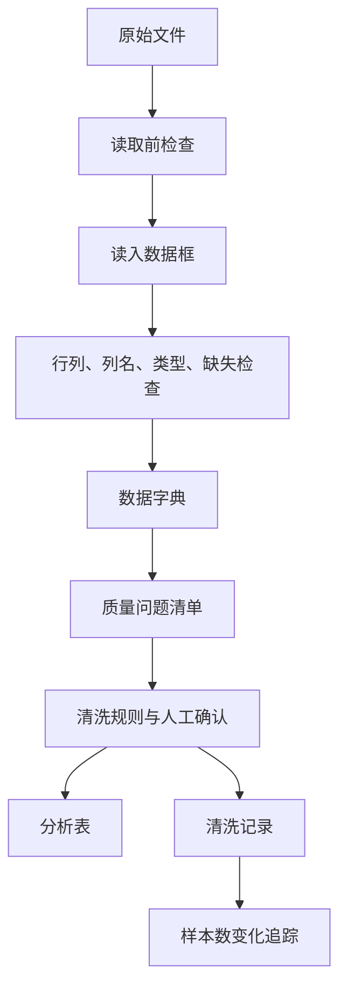
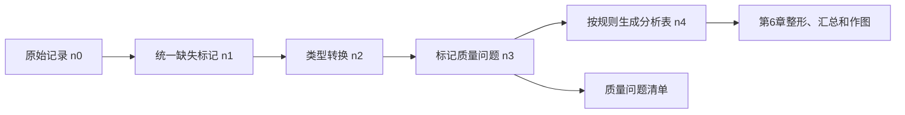

# 第5章 数据读取、数据字典与数据质量

## 本章定位

本章进入全书第二阶段：Prompt Coding 提示词编程。第4章已经训练学生识别对象、列名、索引和缺失值，本章把这些能力放到真实文件现场。学生要学习如何把 CSV 或 Excel 安全读入，再用数据字典和质量检查决定下一步能不能分析。

本章主线是“原始文件 -> 读入数据框 -> 数据字典 -> 质量检查 -> 清洗记录”。本章不提前展开长宽表转换、表连接、分组汇总和探索性可视化，也不写统计推断或医学结论。

本章最重要的学习证据不是一段看起来能运行的代码，而是可复核的读入检查表、数据字典、质量问题清单、清洗日志和 AI 协作记录。学生需要能说清每个字段来自哪里、表示什么、单位是什么、哪些规则需要人工确认。

| 前置能力 | 本章任务 | 后续承接 |
| --- | --- | --- |
| 能解释数据框、列名和缺失值 | 读入 CSV/Excel 并检查结构 | 第6章整形和描述统计 |
| 能写 AI 任务说明书 | 让AI辅助局部排错和核验 | 第7章图表契约 |
| 能保留运行记录 | 记录清洗规则和样本数变化 | 综合项目报告 |

## 内容要点讨论结论

| 讨论点 | 本章采用的处理 |
| --- | --- |
| 与第4章的关系 | 第4章讲对象语感，本章把对象放进文件读取和质量检查场景 |
| 与第6章的关系 | 第6章再讲长宽表、汇总和图表；第5章只做读入、字典和质量规则 |
| AI开放程度 | 允许局部代码、报错解释和核验清单；不允许猜字段、猜单位或替代清洗决策 |
| 案例边界 | 药品销售案例只有教材摘录，未发现原始 `drugSale.csv`，正文按示范材料处理 |
| 医药解释边界 | 只说明数据质量风险，不写医学因果、疗效、机制或临床建议 |

## 学习目标

1. 学生能解释 CSV、Excel、编码、分隔符、工作目录和路径的关系。
2. 学生能用 Python 或 R 读入表格，并检查行列数、列名、前几行、变量类型和缺失计数。
3. 学生能写出数据字典，说明字段含义、类型、单位、取值范围、缺失含义、字段角色和来源。
4. 学生能识别变量类型和单位风险，避免把 ID、编码和日期当普通连续数值。
5. 学生能检查缺失值、异常值、重复值和逻辑一致性，并把处理建议分为标记、回查、转换、保留、排除或需确认。
6. 学生能记录清洗前后样本数变化，说明每一步规则和人工判断。

## 阅读指南

读本章时先看数据流，再看代码。代码的作用是把文件读入、把问题标出来、把过程记录下来；它不能替你判断字段含义和医学解释。

遇到读入报错时，不要先让 AI 重写整个脚本。先记录报错，再检查工作目录、文件是否存在、工作表是否正确、编码是否匹配、缺失标记是否统一。

读到缺失、异常或重复时，也不要马上删除。先问：这个值为什么出现？它影响哪个字段？是否集中在某个分组？有没有数据字典或教师说明可以支持处理规则？

## 主张-证据-边界

| 本章主张 | 证据来源 | 可写程度 | 边界 |
| --- | --- | --- | --- |
| 数据质量会影响分析结果可靠性 | GenAI数据分析教材、课程大纲 | 可写成课程原则 | 不写具体医学结论 |
| 读入后先看结构、类型、缺失和唯一值 | GenAI数据分析教材、ISL读取示例 | 可给出最小检查流程 | 不承诺能发现所有问题 |
| 数据字典是清洗和作图依据 | 术语表、统一模板 | 可作为学习证据要求 | 不让AI凭列名定稿 |
| 异常值不等于错误值 | ISL异常值材料、图表规范 | 可要求先标记和回查 | 不直接删除极端观察 |
| 清洗记录必须追踪样本数变化 | 统一模板、课程大纲、药品销售案例 | 可给日志模板和流向图 | 未提供原始数据时不写实测结果 |

## 章节总览图



## 核心概念速查

| 概念 | 本章解释 | 常见混淆 | 使用边界 |
| --- | --- | --- | --- |
| CSV | 用分隔符保存表格的文本文件 | 把CSV当成Excel工作簿 | 先检查分隔符、编码、表头 |
| Excel | 常见工作簿文件，可含多个工作表 | 只读取默认第一个工作表 | 指定工作表和表头位置 |
| 编码 | 字符保存方式，影响中文显示 | 把乱码当成字段含义错误 | 先记录，再尝试参数 |
| 工作目录 | 相对路径的起点 | 以为脚本在哪，工作目录就在哪 | 每次运行前确认 |
| 原始数据 | 未经本课程流程修改的数据 | 直接手工改原始表 | 保持只读，另存输出 |
| 数据字典 | 解释字段含义、类型、单位和来源的表 | 只列列名 | 每个分析字段都要写 |
| 缺失值 | 未记录、不可用或不适用的值 | 直接等于0 | 先判断原因 |
| 异常值 | 偏离分布或规则的观察 | 一发现就删除 | 先标记和回查 |
| 重复值 | 样本、记录或ID重复出现 | ID重复就是错误 | 先定义重复对象 |
| 清洗记录 | 记录处理规则、理由和样本数变化 | 只交最终表 | 必须能回放 |

## 5.1 CSV、Excel 与常见编码问题

CSV 是用分隔符保存的文本表格，最常见的分隔符是逗号。Excel 是工作簿文件，可能包含多个工作表、公式、隐藏列、合并单元格和人工格式。二者都不是分析结果本身，正式分析前要读成 Python 或 R 中的数据框。

读文件前先看文件形态。表头在哪一行？是否有空行？是否有说明文字？是否只有一个工作表？CSV 是否真用逗号分隔？中文字段和药品名称是否能正常显示？这些问题会影响读入结果。

| 文件 | 读取前检查 | 常见问题 | 记录内容 |
| --- | --- | --- | --- |
| CSV | 分隔符、编码、表头、缺失标记 | 中文乱码、列错位、`?` 未识别 | `encoding`、`sep`、`na_values` |
| Excel | 工作表名、表头行、空行空列 | 读错工作表、合并单元格、隐藏列 | `sheet_name`、表头行 |
| TSV/TXT | 制表符、空格、列数 | 多空格使列错位 | 分隔规则 |

ISL 的 CSV 示例提示我们，读入前可以先用文本编辑器或 Excel 查看文件。这个动作不是为了手工修改原始数据，而是为了确认文件格式。示例中某列因为用 `?` 表示缺失，被读成字符串，需要在读取时用 `na_values` 指定缺失标记。

```python
from pathlib import Path
import pandas as pd

raw_path = Path("data/raw/drug_sales.csv")

sales = pd.read_csv(
    raw_path,
    encoding="utf-8",
    na_values=["", "NA", "N/A", "?", "缺失"]
)

print(sales.shape)
print(sales.head())
print(sales.info())
```

如果中文显示异常，不要先改原始文件。先记录异常，再尝试常见编码。课程作业中应把尝试过程写入清洗记录。

```python
for enc in ["utf-8", "utf-8-sig", "gb18030"]:
    try:
        preview = pd.read_csv(raw_path, encoding=enc, nrows=5)
        print(enc, preview.head())
        break
    except UnicodeDecodeError:
        print(enc, "读取失败")
```

Excel 文件需要明确工作表。若一个工作簿中有“说明”“原始数据”“清洗后数据”等多个表，只读默认第一个表很容易出错。

```python
excel_path = Path("data/raw/drug_sales.xlsx")
book = pd.ExcelFile(excel_path)
print(book.sheet_names)

sales_excel = pd.read_excel(
    excel_path,
    sheet_name="原始数据",
    na_values=["", "NA", "N/A", "?", "缺失"]
)
```

R 中可以使用 `read.csv()` 或 `readxl::read_excel()`。本章不要求学生比较所有包，只要求写清使用了哪个函数、哪些参数，以及读入后得到多少行多少列。

```r
sales <- read.csv(
  "data/raw/drug_sales.csv",
  fileEncoding = "UTF-8",
  na.strings = c("", "NA", "N/A", "?")
)

dim(sales)
head(sales)
str(sales)
```

### 读入后的最小检查

| 检查 | Python | R | 目的 |
| --- | --- | --- | --- |
| 前几行 | `df.head()` | `head(df)` | 检查表头、错列和异常字符 |
| 行列数 | `df.shape` | `dim(df)` | 核对数据规模 |
| 列名 | `df.columns` | `names(df)` | 避免 AI 猜列名 |
| 类型 | `df.info()` | `str(df)` | 发现数值列被读成文本 |
| 数值摘要 | `df.describe()` | `summary(df)` | 初步看范围和极值 |
| 缺失计数 | `df.isna().sum()` | `colSums(is.na(df))` | 找到缺失字段 |
| 唯一值 | `value_counts()` | `table()` | 检查分类水平 |

## 5.2 工作目录、文件路径与原始数据保护

许多读入错误来自路径，而不是函数。工作目录是相对路径的起点。终端打开的位置、Notebook 当前目录和脚本保存位置可能不同。开始分析前，先确认工作目录和文件是否存在。

```python
from pathlib import Path

print(Path.cwd())
print(Path("data/raw/drug_sales.csv").exists())
```

```r
getwd()
file.exists("data/raw/drug_sales.csv")
```

本课程要求原始数据只读。学生可以从原始数据生成分析表，但不能在原始 Excel 或 CSV 上手工改错后再分析。所有字段改名、类型转换、缺失标记和异常筛查都应通过脚本或清洗记录回放。

| 目录 | 用途 | 修改规则 |
| --- | --- | --- |
| `data/raw/` | 教师提供或下载的原始数据 | 不覆盖、不手工改 |
| `data/processed/` | 脚本生成的分析表 | 可重新生成 |
| `scripts/` | 读取、检查、清洗和导出脚本 | 可修改，需留记录 |
| `outputs/` | 数据字典、图表、日报、报告 | 按任务命名 |
| `references/` | 模板、术语表和规范 | 按项目规则维护 |

相对路径比个人绝对路径更适合作业提交。不要把 `C:\Users\某某\Desktop`、下载目录或微信临时文件路径写入正式脚本。别人无法复现这样的路径。

```python
PROJECT_ROOT = Path.cwd()
RAW_DIR = PROJECT_ROOT / "data" / "raw"
OUT_DIR = PROJECT_ROOT / "outputs" / "chapter-5"
OUT_DIR.mkdir(parents=True, exist_ok=True)
```

文件命名也属于数据质量。`final.csv`、`final2.xlsx`、`new_new.csv` 无法说明文件内容。更好的命名是 `chapter5_read_check.csv`、`chapter5_quality_flags.csv`、`chapter5_cleaning_log.md`。

## 5.3 数据字典的字段与写法

数据字典是解释字段的表。它记录变量名、中文名、含义、类型、单位、取值范围、缺失含义、字段角色和来源。它不是列名翻译表，而是后续清洗、统计和作图的依据。

如果没有数据字典，学生很容易把 ID 当数值，把编码当剂量，把时间字段当普通文本，把缺失值当 0。AI 也会在列名不清时猜字段含义。本章要求学生先写数据字典，再决定清洗规则。

| 字段 | 说明 | 示例 |
| --- | --- | --- |
| 原始列名 | 数据表中的真实列名 | `actual_amount` |
| 中文名 | 教材或报告中使用的名称 | 实收金额 |
| 含义 | 字段记录什么 | 单次交易实际收取金额 |
| 类型 | 数值、分类、日期、文本、ID、逻辑值 | 数值 |
| 单位 | 元、岁、mg、U/L 等 | 元，需确认 |
| 取值范围 | 合法范围或常见范围 | `>= 0` |
| 缺失含义 | 未记录、不适用、无法测量等 | 未记录，需回查 |
| 字段角色 | ID、时间、分组、结局、协变量、备注 | 汇总指标 |
| 来源 | 原始文件、计算生成、人工补录 | 原始CSV |
| 处理建议 | 保留、转换、标记、排除、需确认 | 转数值并查负值 |

药品销售教材案例包含 7 个字段：购药时间、社保卡号、商品编码、商品名称、销售数量、应收金额、实收金额。这个案例适合训练学生区分日期、ID、编码、文本、数量和金额。

| 原始字段 | 类型判断 | 可能单位 | 质量检查 | 需确认 |
| --- | --- | --- | --- | --- |
| 购药时间 | 日期/时间 | 无 | 能否转为日期，是否在采集范围内 | 星期文本是否保留 |
| 社保卡号 | ID | 无 | 是否缺失，格式是否一致 | 是否已脱敏 |
| 商品编码 | ID/分类编码 | 无 | 编码是否为空，是否格式混乱 | 编码体系 |
| 商品名称 | 文本/分类 | 无 | 同一药品是否多种写法 | 标准名称 |
| 销售数量 | 数值 | 盒/瓶/件，需确认 | 是否小于0，是否可为小数 | 单位和退货规则 |
| 应收金额 | 数值 | 元，需确认 | 是否小于0 | 折扣前含义 |
| 实收金额 | 数值 | 元，需确认 | 是否小于0，是否大于应收金额 | 折扣、退款和医保规则 |

社保卡号、患者编号和样本编号都可能涉及隐私。教材和课堂展示应使用脱敏或模拟 ID。学生不能把真实身份信息粘贴进 AI 对话，也不能把含敏感字段的原始表直接上传到外部工具。

### 数据字典模板

| variable_name | 中文名 | 含义 | 类型 | 单位 | 取值范围 | 缺失含义 | 字段角色 | 来源 | 需确认 |
| --- | --- | --- | --- | --- | --- | --- | --- | --- | --- |
| sale_date | 购药时间 | 单次交易日期 | 日期 | 无 | 采集期内 | 未记录 | 时间字段 | 原始CSV | 日期格式 |
| customer_id | 脱敏购药者ID | 购药者标识 | ID | 无 | 非空 | 未记录 | 个体ID | 原始CSV | 是否已脱敏 |
| actual_amount | 实收金额 | 实际收取金额 | 数值 | 元，需确认 | `>= 0` | 未记录 | 汇总字段 | 原始CSV | 折扣和退款规则 |

## 5.4 数据类型识别与单位检查

软件会自动推断类型，但自动推断不是最终判断。一个字段被 pandas 读成 `object`，可能因为它本来是文本，也可能因为数值列混入了 `?`、空格、单位或中文字符。

ISL 的 `Auto` 示例中，`horsepower` 因为 `?` 缺失标记被读成文本。处理方法是在读取时指定 `na_values`。这个例子提醒我们，类型错误常常不是单纯的软件问题，而是缺失标记和字段规则没有写清。

| 目标类型 | 常见错误 | 检查方法 | 处理方向 |
| --- | --- | --- | --- |
| 数值 | 混入字符、单位、货币符号、`?` | 查看类型和唯一值 | 指定缺失标记，清理后转换 |
| 日期 | 格式混乱、含星期文本 | 抽样查看，尝试转换 | 明确格式，记录失败行 |
| 分类 | 大小写、空格、同义标签 | 统计唯一值 | 建立映射表 |
| ID | 被读成数字，前导0丢失 | 查看长度和原始格式 | 按文本读取 |
| 逻辑值 | 是/否、0/1、TRUE/FALSE混用 | 统计取值 | 统一编码并保留映射 |

```python
check_cols = ["购药时间", "社保卡号", "销售数量", "应收金额", "实收金额"]

for col in check_cols:
    print("\n", col)
    print(sales[col].dtype)
    print(sales[col].head())
    print(sales[col].nunique(dropna=False))
```

类型转换要留下失败记录。转换失败的行可能提示缺失标记、单位、录入格式或字段含义存在问题。

```python
sales_checked = sales.copy()

sales_checked["购药日期"] = pd.to_datetime(
    sales_checked["购药时间"].astype(str).str.slice(0, 10),
    errors="coerce"
)

for col in ["销售数量", "应收金额", "实收金额"]:
    sales_checked[col] = pd.to_numeric(sales_checked[col], errors="coerce")

print(sales_checked["购药日期"].isna().sum())
print(sales_checked[["销售数量", "应收金额", "实收金额"]].isna().sum())
```

单位检查应早于统计和作图。ALT、AST、血糖、药物剂量、金额、年龄和时间都不能只看数值。单位不清时，不能求均值，不能画比较图，也不能写结论。

| 字段场景 | 需确认内容 | 风险 |
| --- | --- | --- |
| 年龄 | 岁、月龄或天数 | 不同单位混合会误导分组 |
| 药物剂量 | mg、mg/kg、mL、浓度 | 剂量解释错误 |
| 检验指标 | U/L、mmol/L、mg/dL | 不能直接比较 |
| 金额 | 元、美元、应收、实收 | 汇总含义不同 |
| 日期 | 采样日、入组日、购药日 | 时间顺序误读 |

## 5.5 缺失值、异常值、重复值与逻辑一致性

缺失值是未记录、不可用或不适用的值。它不是 0，也不自动代表阴性、正常或无效。处理缺失值前，先查看哪些字段缺失、缺失比例多高、是否集中在某些样本或分组。

```python
missing_table = sales_checked.isna().sum().rename("missing_n").to_frame()
missing_table["missing_pct"] = missing_table["missing_n"] / len(sales_checked)
missing_table.sort_values("missing_pct", ascending=False)
```

| 缺失情形 | 可能解释 | 处理建议 |
| --- | --- | --- |
| 少量零散缺失 | 录入漏项或导入问题 | 回查；必要时排除并记录 |
| 某列大量缺失 | 字段未采集或不适用 | 先确认是否用于分析 |
| 某组集中缺失 | 采集流程差异 | 分组查看，标记风险 |
| 日期缺失 | 流程节点未发生或未记录 | 结合状态字段判断 |

异常值是偏离分布或规则的观察。异常值可能来自录入错误，也可能是真实极端观察、单位错误、退款记录或特殊样本。ISL 对异常值的讨论提醒我们：只有在有理由认为它来自采集或记录错误时，删除才可能成立。

```python
quality_flags = pd.DataFrame(index=sales_checked.index)
quality_flags["数量小于0"] = sales_checked["销售数量"] < 0
quality_flags["应收金额小于0"] = sales_checked["应收金额"] < 0
quality_flags["实收金额小于0"] = sales_checked["实收金额"] < 0
quality_flags["实收大于应收"] = sales_checked["实收金额"] > sales_checked["应收金额"]

quality_flags.sum().sort_values(ascending=False)
```

重复值要先定义重复对象。整行完全相同可能是导入重复；同一 ID 多次出现可能是真实复购、复诊或重复测量。药品销售表中同一购药者多次购药，不等于错误重复。

```python
all_duplicate_n = sales_checked.duplicated().sum()

key_duplicate_n = sales_checked.duplicated(
    subset=["购药时间", "社保卡号", "商品编码", "销售数量", "实收金额"],
    keep=False
).sum()

print(all_duplicate_n)
print(key_duplicate_n)
```

| 重复检查 | 适用场景 | 判断边界 |
| --- | --- | --- |
| 整行重复 | 文件合并或导入错误 | 可作为错误重复候选 |
| ID重复 | 复购、复诊、重复测量 | 不能直接删除 |
| ID+日期重复 | 同一天多次记录 | 需看业务规则 |
| ID+日期+项目重复 | 同一检测项目重复 | 需确认是否复测 |

逻辑一致性检查看字段之间是否互相支持。常见规则包括日期顺序、金额关系、分类合法值、ID完整性和单位一致性。

| 逻辑规则 | 检查思路 | 处理 |
| --- | --- | --- |
| 日期顺序 | 开始日期 <= 结束日期 | 标记异常，回查来源 |
| 金额关系 | 实收金额 <= 应收金额 | 结合折扣、退款规则确认 |
| 分类合法 | 分组只含预设水平 | 建立映射表或回查 |
| ID完整 | 样本ID非空且格式一致 | 缺失ID通常不能进入样本级分析 |
| 单位一致 | 同一字段单位一致 | 不一致时先标准化或分层 |

### 生物医学解释边界卡

| 项目 | 本章写法 |
| --- | --- |
| 观察结果 | 读入后发现缺失、负值、重复或逻辑冲突 |
| 方法来源 | 表格读取、类型检查、缺失计数、重复检查、规则筛查 |
| 允许解释 | 这些记录提示数据质量风险，需要回查或记录处理 |
| 替代解释 | 可能是真实退款、复购、复测、单位差异或采集流程差异 |
| 仍需验证 | 字段说明、业务规则、原始记录、数据提供者确认 |
| 禁止越界 | 不能仅凭清洗结果写医学因果、疗效判断或临床建议 |

## 5.6 清洗记录与样本数变化追踪

清洗记录要回答六个问题：输入表是什么，输出表是什么，规则是什么，影响多少记录，为什么这样处理，还有哪些内容需要确认。没有清洗记录，清洗后的表就难以复核。

药品销售教材案例报告了样本数变化：原始数据总行数为 6580，去掉标题行后交易记录为 6579；删除缺失值后为 6575；剔除小于 0 的异常值后为 6559；去重后仍为 6559；类型转换后为 6536。由于本仓库未发现 `drugSale.csv` 原始文件，这些数字只能作为教材摘录示范，不能写成当前项目的可复现实测结果。

| 步骤 | 规则 | 剩余记录数 | 变化记录数 | 证据状态 |
| --- | --- | ---: | ---: | --- |
| 原始交易记录 | 去掉标题行后计数 | 6579 | NA | 教材摘录 |
| 删除缺失 | 保留各字段非空记录 | 6575 | 4 | 教材摘录 |
| 剔除负值 | 销售数量、应收金额、实收金额均 `>= 0` | 6559 | 16 | 教材摘录 |
| 去重 | 删除完全重复记录 | 6559 | 0 | 教材摘录 |
| 类型转换 | 日期和数值可成功转换 | 6536 | 23 | 教材摘录 |

这个案例适合训练学生看样本数变化，也提醒我们删除规则需要理由。销售数量或金额小于 0，可能是录入错误，也可能是退货或退款。没有业务说明时，应写 `需人工确认`。

### 清洗日志模板

| step_id | 输入表 | 输出表 | 规则 | 影响行数 | 处理方式 | 理由 | 需确认 |
| --- | --- | --- | --- | ---: | --- | --- | --- |
| 01 | raw_sales | sales_step01 | 统一缺失标记 | 待运行 | 转为NA | 便于后续计数 | 缺失标记列表 |
| 02 | sales_step01 | sales_step02 | 标记金额负值 | 待运行 | 仅标记 | 可能是退款或录入错误 | 业务规则 |
| 03 | sales_step02 | sales_clean | 转换日期和金额类型 | 待运行 | 转换失败单列记录 | 支持排序和后续汇总 | 日期格式 |

### 样本数流向图



正式作业中，学生应把 `n0` 到 `n4` 换成实际运行结果。若没有原始数据或没有运行代码，只能保留模板并写 `需补证据`。

## 案例任务：药品销售表的读取与质量检查

| 项目 | 内容 |
| --- | --- |
| 数据背景 | 教材摘录中的药品销售字段；原始 `drugSale.csv` 未在仓库发现 |
| 任务目标 | 生成读入检查表、数据字典、质量问题清单和清洗记录 |
| 输入字段 | 购药时间、社保卡号、商品编码、商品名称、销售数量、应收金额、实收金额 |
| 输出 | 数据字典、缺失/异常/重复检查表、清洗日志、样本数流向图 |
| 边界 | 不写药品疗效、患者行为、临床风险或医学因果解释 |

### 操作步骤

1. 将教师提供的数据放入 `data/raw/`，保留原文件不改。
2. 读入 CSV 或 Excel，记录路径、编码、工作表、行数和列数。
3. 写数据字典，标注日期、ID、分类、数值、单位和需确认项。
4. 统计缺失值、唯一值、类型转换失败行和重复候选。
5. 标记负值、金额关系异常和逻辑冲突。
6. 生成清洗日志、质量问题清单和样本数流向图。

## 图表建议

| 图表 | 目的 | 必备标注 | 不可越界解释 |
| --- | --- | --- | --- |
| 数据字典表 | 展示变量含义、单位、类型和角色 | 字段名、中文名、类型、单位、缺失含义 | 不用列名猜医学含义 |
| 缺失值条形图 | 展示变量缺失比例 | 总行数、缺失比例、变量排序 | 不把缺失写成随机缺失 |
| 质量问题清单 | 展示异常、重复和逻辑冲突 | 规则、影响行数、需确认事项 | 不把标记等同于删除 |
| 样本数流向图 | 展示每步清洗影响 | 每步规则和剩余 n | 不隐藏排除记录 |

## AI协作点

| 场景 | 可让 AI 做什么 | 学生必须核验什么 |
| --- | --- | --- |
| 读取报错 | 解释错误、列出路径和编码排查步骤 | 文件是否存在，路径是否正确，参数是否符合原始文件 |
| 数据字典草稿 | 按真实列名生成字段表 | 字段含义、单位、来源、隐私等级 |
| 清洗计划 | 提出缺失、异常、重复和逻辑检查 | 每条规则是否有数据字典或人工确认依据 |
| 代码局部生成 | 生成检查行列数、缺失、重复的代码 | 是否改动原始数据，输出是否符合预期 |
| 日志整理 | 生成清洗日志模板 | 样本数变化是否来自实际运行 |

### AI任务说明书示例

```text
目标：
请根据以下真实字段生成第5章数据质量检查计划，并给出 Python 局部检查代码。

上下文：
- 课程章节：第5章 数据读取、数据字典与数据质量。
- 字段：购药时间、脱敏购药者ID、商品编码、商品名称、销售数量、应收金额、实收金额。
- 原始数据不能修改，只能生成分析表、质量问题清单和清洗日志。

约束：
- 不猜字段单位和业务规则。
- 不直接删除异常值，只提出标记和回查规则。
- 不把缺失值默认填 0。
- 不能确认时写“需人工确认”。

验证：
- 每条规则说明检查方法。
- 代码需输出行列数、缺失计数、类型转换失败数和样本数变化。
- 说明哪些解释必须由教师或数据提供者确认。

输出：
1. 数据字典字段建议。
2. 数据质量检查表。
3. Python 局部代码。
4. 清洗记录模板。
```

## 知识图谱生成提示词

```text
目标：
请为《医药数据处理与可视化》第5章“数据读取、数据字典与数据质量”生成一张教学知识结构图。

上下文：
- 学生是药学本科生和研究生，不默认熟悉高级统计或编程。
- 图中必须包含：CSV/Excel、编码、工作目录、原始数据保护、数据字典、类型检查、单位检查、缺失值、异常值、重复值、逻辑一致性、清洗记录、样本数变化。
- 图用于教材正文，不作为唯一知识来源。

约束：
- 不加入医学因果、临床建议或未给出的样本量。
- 节点文字要短，关系要清楚。
- 如果生成图片，正文仍需保留 Mermaid 或表格版准确结构。

输出：
1. Mermaid flowchart。
2. imagegen 提示词。
3. 需人工核验的节点清单。
```

## 常见误区

| 误区 | 为什么错 | 如何纠正 |
| --- | --- | --- |
| 文件能打开就说明读入正确 | 可能存在编码、错列、表头和类型问题 | 检查行列数、列名、类型和缺失 |
| 直接在原始 Excel 中改错 | 无法复现，也难以审计 | 原始数据只读，修改写入脚本和日志 |
| 用列名猜字段含义 | 列名不能说明单位、范围和缺失原因 | 写数据字典并人工确认 |
| 把 ID 当数值分析 | ID 是标识符，不是连续测量 | 数据字典中标为 ID |
| 缺失值直接填 0 | 0 可能有真实含义 | 先判断缺失原因 |
| 异常值直接删除 | 极端值可能是真实观察 | 先标记、回查、记录 |
| 重复 ID 直接去重 | 可能是复诊、复购或重复测量 | 先定义重复对象 |
| 只交清洗后数据 | 无法知道改过什么 | 同交清洗日志和样本数流向 |

## 核验清单

- 是否先核对 `大纲.md` 和 `chapters/chapter-5/本章大纲.md`。
- 是否列出实际使用材料。
- 原始数据是否保持只读。
- 读取代码是否记录路径、编码、工作表、分隔符和缺失标记。
- 读入后是否检查行列数、列名、前几行、变量类型、缺失和唯一值。
- 数据字典是否包含含义、类型、单位、取值范围、缺失含义、字段角色和来源。
- ID、日期、分类、文本和数值字段是否区分清楚。
- 缺失值处理是否说明原因和样本数变化。
- 异常值是否先标记并回查。
- 重复值是否区分错误重复、复测、复诊和复购。
- 逻辑一致性规则是否有来源或人工确认。
- 清洗记录是否能回放每一步。
- AI生成内容是否经过人工核验。
- 正文是否没有新增材料未支持的医学结论。

## 实验或作业

### 作业：从原始表到数据质量报告

教师提供一个模拟药品销售表或简化临床指标表。学生需要完成读取、数据字典、质量检查和清洗记录，不要求做统计推断。

| 提交内容 | 要求 | 评分点 |
| --- | --- | --- |
| 读取脚本 | 能从项目根目录运行 | 路径、编码、缺失标记 |
| 数据字典 | 每个字段有含义、类型、单位和角色 | 不靠列名猜解释 |
| 质量问题表 | 标记缺失、异常、重复和逻辑问题 | 规则清楚，有需确认项 |
| 清洗日志 | 写清每一步样本数变化 | 可回放 |
| 简短说明 | 说明数据能支持什么、不能支持什么 | 不越界解释 |
| AI协作记录 | 保留提示词、输出摘要、人工核验 | 透明、具体 |

### 禁止事项

- 不得覆盖原始数据文件。
- 不得删除异常值后不说明理由。
- 不得把缺失值默认填 0。
- 不得把清洗结果写成疗效、风险或因果结论。
- 不得提交只有 AI 生成代码、没有人工核验的结果。

## 需补证据

| 位置 | 缺口 | 处理方式 |
| --- | --- | --- |
| 药品销售案例 | 未发现 `drugSale.csv` 原始数据 | 正文只作为教材摘录示范；正式作业需教师提供数据 |
| 销售数量单位 | 教材摘录未说明是盒、瓶、件或其他 | 数据字典标 `需人工确认` |
| 应收/实收金额规则 | 是否存在折扣、医保支付、退款或退货未说明 | 逻辑检查只标记，不直接删除 |
| 社保卡号字段 | 涉及敏感标识 | 教学数据应脱敏或改用模拟ID |
| Excel 示例 | 当前材料以文本和 CSV 示例为主 | 后续可补一个多工作表 Excel 练习文件 |
