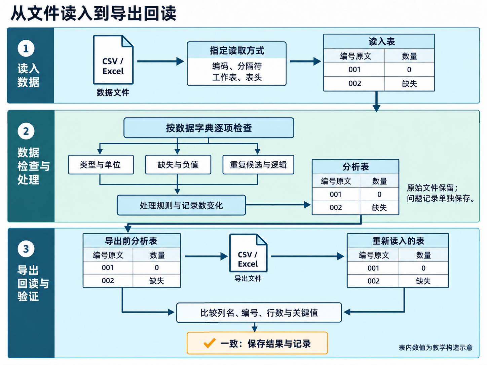
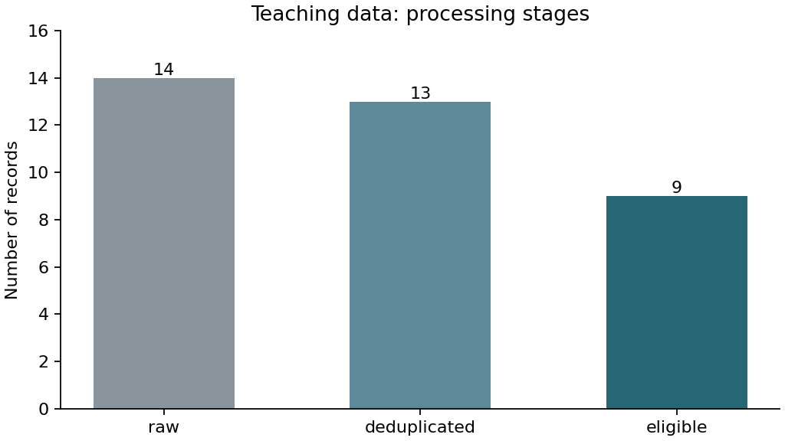
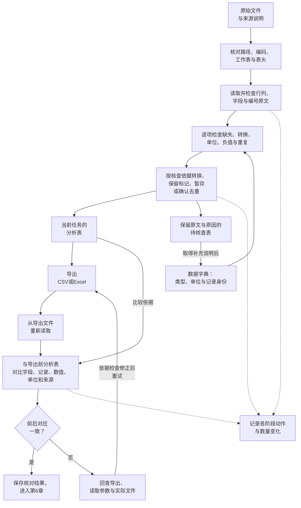

# 第5章 数据读取、数据字典与数据质量

接到一份记录表，先确认它保存了哪些对象，再选择读取方式。编号需要保留原来的文字，数值需要对应单位，空白需要有明确含义。读入后的行数、列名和原文都核对清楚，后续统计才有稳定的输入。

本章完成一项具体工作：把一份记录读进来，说明每个字段，识别需要回查的问题，并保留处理过程。下一章再根据已经核验的记录进行整形、分组汇总和作图。

接着第四章的猜糖豆情境，假设现在要接收大家填写的答案。有人用“粒”，有人用“千粒”，有的格子空着，同一条回答还可能在导出时保存了两遍。处理这些记录，需要先看清原文，再决定怎样转换、保留或回查。本章的[数据质量练习包](assets/case-THU-DA-L02-C01-A02/README.md)为此编写了14条记录，逐项练习单位、缺失和重复检查。这是独立于第四章五行表的另一份教学数据，未提供糖豆真值。



文件读取与质量检查流程。原始文件读入后，先核对路径、编码、工作表、行列和字段原文，再按字典逐项检查类型、单位及记录身份。缺失、负值与重复候选分别记录，依据明确规则形成分析表。导出后重新读取，与导出前的分析表对比字段、记录数、数值、单位和来源；对应一致后通过核对。回读比较的是这次导出的派生结果，处理记录同时保留它与原始输入之间的关系。

## 5.1 CSV、Excel 与常见编码问题

### 先看文件保存了什么

CSV是用分隔符组织字段的文本文件；Excel工作簿可以有多个工作表，还可能包含公式、合并单元格和显示格式。两者都能保存表格，但不能仅凭扩展名决定读取参数。

读取前先确认表头位置、分隔符、工作表名称和缺失写法。查看前几行可以帮助认识结构，但不是完成全表质量检查。若文件来自他人，还应保留来源说明和导出方式，不在原文件里先手工“整理一下”再开始分析。

本练习有三个同源文件：UTF-8编码的`guesses_raw.csv`、GB18030编码的`guesses_gb18030.csv`，以及工作表名为`guesses`的`guesses.xlsx`。它们保存相同的五个字段。格式副本由权威CSV生成，不代表三个独立调查。

### 先保留原文，再解释类型

以下代码的工作目录为本章练习包根目录，即能看到`data/`、`scripts/`和`outputs/`的目录。先使用第二章的方法确认当前位置，再运行。

```python
from pathlib import Path
import pandas as pd

source = Path("data/raw/guesses_raw.csv")
assert source.is_file(), "请先核对工作目录与输入路径"
raw = pd.read_csv(source, encoding="utf-8", dtype=str, keep_default_na=False)
print(raw.shape)
print(raw.columns.tolist())
print(raw.head())
```

```r
options(warn=2)
if (.Platform$OS.type == "windows" && !l10n_info()[["UTF-8"]]) {
  invisible(Sys.setlocale("LC_CTYPE", "English_United States.utf8"))
}
source <- "data/raw/guesses_raw.csv"
stopifnot(file.exists(source))
raw <- read.csv(source, fileEncoding="UTF-8", colClasses="character",
                na.strings=NULL, check.names=FALSE)
print(dim(raw))
print(names(raw))
print(head(raw))
```

这里有意先把字段读成文本，并保留空白原样。这样可以看见参与者究竟填了什么，再按字典判断哪些值能转换。它不表示所有分析都应使用文本，而是将原始表达与后续数值分开。

本练习应读入14行、5列。若数量不同，先停止，检查读取警告、表头、编码和路径。R代码把警告作为错误处理，防止不完整读取后仍继续；Windows中的字符区域设置只作用于当前会话，不改变系统配置。若该设置无法使用，应记录环境问题，不跳过报错。

编码规定文字怎样保存成字节。遇到乱码，先查看来源说明，而不是轮流尝试直到“不报错”为止；某种编码能够解码，也不证明文字已经还原正确。字形、字段和完整行数都要核对。

本章配套程序试运行时就遇到过一个具体问题：在Windows的非UTF-8字符区域环境中，R读取含中文单位的CSV出现警告，结果只读入第一条记录。如果只看表头已经出现，甚至继续让后面的程序生成文件，这份残缺输入也可能被误当成读取成功。定位问题时，先将原文件的14条记录与程序报告的行数对照，再检查警告及字符区域设置；修正当前会话的读取环境后，重新核对完整的14行5列，才继续处理。因此，代码里的行列数检查不是装饰，也不能由“已经输出了一张图”代替。遇到警告先停下来，往往比事后追查整套结果更省事。

### 核对 Excel 与编码副本

CSV的编码由本练习说明给定。Excel则明确选择工作表，并要求字段以文本读入：

```python
other = pd.read_csv("data/raw/guesses_gb18030.csv", encoding="gb18030",
                    dtype=str, keep_default_na=False)
excel = pd.read_excel("data/raw/guesses.xlsx", sheet_name="guesses",
                      dtype=str, keep_default_na=False)
pd.testing.assert_frame_equal(raw, other)
pd.testing.assert_frame_equal(raw, excel)
```

```r
other <- read.csv("data/raw/guesses_gb18030.csv", fileEncoding="GB18030",
                  colClasses="character", na.strings=NULL, check.names=FALSE)
stopifnot(requireNamespace("readxl", quietly=TRUE))
excel <- as.data.frame(readxl::read_excel("data/raw/guesses.xlsx",
                       sheet="guesses", col_types="text"))
excel[is.na(excel)] <- ""
stopifnot(identical(raw, other), identical(raw, excel))
```

Python读取Excel需要openpyxl，R使用readxl；未配置时将该练习记为待完成，不必因此停止CSV核心任务。这里将Excel读出的空单元格还原为空字符串，是为了与本练习CSV逐格比较，不能直接套作所有数据的缺失处理规则。

上面的比较没有输出差异，才说明这三份指定输入在当前读取方式下相同。真实Excel中的公式、日期和显示格式可能带来其他问题，不能据此宣称任意Excel转CSV都不会丢失信息。[pandas读取参数](https://pandas.pydata.org/docs/reference/api/pandas.read_csv.html)、[R文本读取参数](https://stat.ethz.ch/R-manual/R-devel/library/utils/html/read.table.html)及[readxl文档](https://readxl.tidyverse.org/reference/read_excel.html)可用于查阅具体行为。

### 从实验记录核对CSV与Excel

第四课已经计算过Lolamicin三条活菌计数。现在接收同一研究的文件，工作从算术转到输入核对。练习包中的`lolamicin_2_8h.csv`保存2小时和8小时各三条记录，共6行8列；`lolamicin_ecoli_timekill.csv`保存三个处理、四个时间的36条记录。每一行带有CFU/mL单位、重复列序号和源单元格。先打开字典，认清两份表的范围，再读取六行表。

```python
from pathlib import Path
import pandas as pd

input_path = Path("data/raw/lolamicin_2_8h.csv")
experiment = pd.read_csv(input_path, encoding="utf-8",
                         dtype={"treatment": "string"})
print(experiment.shape)
print(experiment[["treatment", "time_h", "value", "source_cell"]])
```

`Path`保存输入位置，`read_csv`按指定编码读表。`dtype`只对处理标签指定文本类型，其余字段仍按输入内容识别。`experiment.shape`应显示`(6, 8)`，第一项是记录数，第二项是字段数。最后一行选出四列供肉眼核对，原对象的八列仍然保留。看2小时三条记录时，应找到6000、18000、51000和E3、F3、G3；这些定位信息把程序中的数值接回作者源表。

Excel工作簿首先是一组工作表。练习工作簿第一张是说明页，数据位于`long_records`。直接读取第一张会读到文字说明，所以先列出工作表，再明确选择。

```python
book = pd.ExcelFile("data/raw/lolamicin_tables.xlsx")
print(book.sheet_names)
experiment_excel = pd.read_excel(book, sheet_name="long_records")
pd.testing.assert_frame_equal(experiment, experiment_excel,
                              check_dtype=False)
```

工作表顺序应为`说明`、`long_records`、`wide_values`、`source_map`。`sheet_name`让这次读取指向六行记录。最后的检查逐项比较列、行和内容；CSV与Excel的类型表示可以不同，故在这次核对中关闭类型完全一致要求，数值与文本仍须一致。后面还要按字典核对类型，这一步只解决两份指定格式副本的内容对应。

完整脚本`01_read_files.py`还读取UTF-8与GB18030宽表副本，再把六行记录导出并回读。每次变化都使用同一份数据内容，学生可以把文件格式、读取参数和对象结果分别检查。

## 5.2 工作目录、文件路径与原始数据保护

### 相对路径从哪里开始

`data/raw/guesses_raw.csv`是相对路径，它从当前工作目录出发，不一定从脚本所在目录出发。编辑器打开了文件、终端进入了项目，以及脚本自身存放的位置，是三件不同的事。

```python
print(Path.cwd())
print(source.resolve())
```

```r
print(getwd())
print(normalizePath(source, mustWork=TRUE))
```

绝对路径明确指向本机位置，适合诊断；可共享脚本则尽量依据项目或脚本位置构造路径，避免写死某个人的桌面目录。配套完整脚本使用自身位置确定资产包根目录，因此从其他工作目录启动也能找到指定数据。

报错“找不到文件”时，先查看实际解析出的路径，再核对文件是否存在、扩展名是否正确、有没有误用另一份同名文件。不要新建空表来让程序通过，因为这样只会隐藏输入缺失。

### 原始记录与派生结果分开

本练习的`data/raw/`保存输入，`outputs/guesses-python/`和`outputs/guesses-r/`分别保存两种语言的输出。输入与运行产物分开放置，便于重新运行和核对。

清洗过程中，保留原始文字、记录号和处理理由。发现“1.2千粒”可以换算时，应在新列保存1200粒，而不是覆盖原文；发现“盒”的容量不明时，应保留问题记录，不能自行换成粒。

文件哈希是根据文件字节计算的标识，可帮助检查输入是否发生变化。相同内容得到相同哈希；哈希匹配不证明内容真实或获得授权。本章将它用于前后保护检查，科学含义仍由来源和字典说明。

## 5.3 数据字典的字段与写法

### 字典要让另一个人能够作出相同判断

数据字典说明每个字段的含义、单位、允许的取值和空白的含义，并给出问题记录的处理规则。

本练习的原始字段如下：

| 字段 | 含义与角色 | 保存类型与单位 | 本任务规则 |
| --- | --- | --- | --- |
| record_id | 一次回答的记录号 | 文本，无数值单位 | 不得缺失；相同号若内容冲突，停止核查 |
| participant_id | 虚构参与者编号 | 文本 | 可在多轮出现，不能按它直接去重 |
| round | 回答轮次 | 原始文本，核验后整数 | 只允许1或2 |
| estimate | 填写的估计量 | 原始文本，单位另列 | 空白表示未记录；明确数值经换算后须非负 |
| unit | 估计量单位 | 文本 | 粒、千粒可换算；盒的容量未知 |

这份教学数据没有个人信息。真实调查或实验字典还应说明来源、版本、对象层次和使用权限。字段角色随问题变化，例如参与者编号既用于计数，也用于保留多轮回答的关系。

字典没有提供糖豆真值，也没有说明第二轮如何组织。因此，本章只能判断记录能否按现有规则保存为数值，不能评价准确性或交流效果。

### “出生时刻”提醒我们补问什么

第一章的调查先收出生时刻，后来为了分组比较，才在扩展问卷中追加分娩方式。这个经过说明，字典不能只把一列翻译成“出生时间”，还要告诉使用者问卷当时问了什么、回答按什么规则保存。最初未询问分娩方式，与问了但没有回答，是两种不同的资料缺口。前一种情况不能靠补一个空列就恢复信息；后一种情况可以保留已有记录，并说明这一字段缺失。

扩展问卷有434份，其中23份未回答分娩方式，留下268份自然分娩和143份剖宫产记录。如果问题是“全部回答者中有多少填写自然分娩”，分母为434；如果问题改成“已回答分娩方式的人中，自然分娩占多少”，分母就变成268＋143＝411。两个比例回答的是不同问题，不能只写一个百分数而省略范围。那23份记录是否还能用于出生时刻描述，又要查其时间字段是否可用，不能因分娩方式缺失而一概判整行无效。明确这些规则之后，负责写代码的人才知道筛选条件该作用于哪一列。

迁移到药学表时，可以问：时间从哪一事件开始计，剂量单位是什么，测量来自哪个单元，低于检测限怎样编码？这些信息不能由AI根据列名猜出。能够生成整齐字典，不代表其中解释已经有依据。

新增字段也要有字典。例如`estimate_grains`表示换算后的粒数，`review_high`表示触发人工回查规则，后者不是“数据错误”或“统计异常”标签。

### 换成库存表，字典要随任务改变

实验记录中的`value`需要CFU/mL和测量条件，库存表中的`Stock_Qty`需要数量口径与记录定义。本章另提供25行库存教学构造数据，药品标签和供应商均作为练习字段。目标先定为“按剂型汇总可用库存数量”，因此库存缺失或负值会影响当前汇总，单价缺失则保留在问题清单中，仍能参与库存数量计算。

`Drug_ID`标识一条记录，`Drug_Name`标识药品标签。两条记录标签相同，还可能来自不同批次。当前表缺少正式批次号，D002和D016在药名、库存、效期和供应商四列相同，我们把它们列为重复候选，保留两条记录并要求回查。这个任务和糖豆r10的确认导出副本处理不同，原因来自记录定义，而非软件函数的名称。

字典至少增加数量口径、字段空白含义、重复判断所需字段、当前任务的纳入规则四项。若后续目标改为计算库存金额，单价就成为必要字段，要形成另一份分析表并重新记录纳入范围。

## 5.4 数据类型识别与单位检查

### 转换失败要能追溯原值

软件自动识别类型很方便，但不应让它替我们决定含义。“001”可能是编号，“大约900”含有近似表达，“1.2”还需要配合单位才能解释。若直接删除非数字字符，可能把不确定表达变成假装精确的900。

下面只检查哪些原文符合本任务接受的十进制写法，并建立一列暂存数值；它不删除记录，也没有完成单位检查。

```python
numeric_text = raw["estimate"].str.fullmatch(r"[+-]?(?:[0-9]+(?:\.[0-9]*)?|\.[0-9]+)")
parsed = pd.to_numeric(raw["estimate"].where(numeric_text), errors="coerce")
print(raw.loc[~numeric_text, ["record_id", "estimate"]])
```

```r
numeric_text <- grepl("^[+-]?([0-9]+(\\.[0-9]*)?|\\.[0-9]+)$", raw$estimate)
parsed <- rep(NA_real_, nrow(raw))
parsed[numeric_text] <- as.numeric(raw$estimate[numeric_text])
print(raw[!numeric_text, c("record_id", "estimate"), drop=FALSE])
```

这里用正则表达式指定接受的文字模式，也就是约定数字可以怎样写。本章不要求背诵模式语法，但要能用几个已知值检查它接受或拒绝了什么。表达式检查的是数字写法，不是数值合理性。负数可能通过文本格式检查，随后仍违反本任务的非负规则。空白与“大约900”都会暂时无法数值化，但原因不同，应分别记录，不能只留一个没有来源的缺失值。

本任务不接受科学计数法、千位分隔符等其他写法，并不表示那些写法普遍错误。真实项目应依据数据说明明确支持范围，转换前后都保留可核对记录。

### 单位一致之后才考虑比较

打开本章原表，r02的estimate是950，unit是“粒”；r03的estimate是1.2，unit是“千粒”。只把estimate转换成数字再排序，1.2会排在950前面，程序没有算错，却比较了不同单位的量。要回答谁估计的粒数较多，应先读单位说明：一千粒等于1000粒，所以r03对应1.2×1000＝1200粒，实际上比r02的950粒多。换算后的1200应放进新列estimate_grains，原来的1.2和“千粒”仍保留，别人才能回查换算是否正确。

再看r08，它写的是900，单位却是“盒”。数字格式没有问题，但一盒装多少粒没有说明，不能套用刚才的换算。此时新数值列暂不填写，把记录交回核查，比把“盒”悄悄改成“粒”更准确。这两条记录放在一起，便能看清数值转换和单位换算的区别：前者确认文字能否按规则读成数，后者确认这个数对应多少指定单位。通过前一项，不代表后一项已经有答案。

药学数据中的剂量、浓度、时间和质量同样需要检查。但并非所有单位差别都能只乘一个常数解决。例如质量浓度与物质的量浓度之间的转换还需要具体物质信息；条件不同的活性指标，也不只是统一单位就可以合并。

日期也属于需要明确规则的字段。类似“03/04”的记录在不同格式中可能表示不同日期；如果源资料没有说明，应回查，而不是选一个能够解析的格式继续计算。转换的依据应能写入清洗记录。

## 5.5 缺失值、异常值、重复值与逻辑一致性

### 先辨认问题，再决定动作

查看主例时，可以先把问题分成几类。缺失意味着没有给出值；转换失败意味着给出了当前规则不能直接解释的文本；单位不明意味着数值有了但量纲不清楚。它们都可能暂时不能进入数值表，却需要不同的回查。

本练习将这类记录保存到待核查表，保留原文和问题原因。取得补充说明后，可以重新处理，再把符合条件的记录加入数值表。原始文件始终保留。

### 极端值与规则错误不同

估计数量为负，违反了本任务对估计量的定义，因此暂不纳入数值表。估计为0则是明确记录，不能当作空白填补。数值为12000虽然显得很高，但在没有真值和原始回答核查之前，不能直接判为错误。

本练习把5000粒设为人工回查阈值：超过这个数就加一个提醒，记录仍然保留。回查时需要确认单位和原始回答。第六章再结合分布学习怎样识别异常观察。

换成药品交易表时，负值可能代表退款；换成温度记录时，负值也可能完全合理。因此，本例的非负规则只能跟随“估计数量”这一含义使用，不能推广成所有数值列的通用清洗命令。

### 去重之前，定义重复的对象

本练习附带说明：第11条是第10条的重复导出副本，记录号及所有字段相同。这个说明提供了只保留首次的依据。如果没有导出背景，完全相同的两行也仍需要确认是否确为副本。

具体看两处容易混淆的“重复”。r10出现了两遍，参与者、轮次、估计值和单位也完全相同；再结合上述导出说明，才确认它们是同一次回答的两份副本，只需保留一份。另一处是u01出现了两次：记录r01属于第一轮，估计800粒；记录r11属于第二轮，估计980粒。这是同一对象的两次回答，不是同一次回答的重复保存。如果按participant_id去重，第二轮信息就会丢失，之后再也无法从处理后的表中看出这位参与者怎样改变估计。去重前要先回答“哪种东西不应该重复”，再选择用于判断的字段。

若同一记录号对应两个不同估计值，则与“一个记录号对应一次回答”的规则冲突，应停止自动处理并回查，不随意保留较新或较小的值。

实际项目还可能使用多个字段共同识别一次观察，例如单元编号、时间和测量项目。但组合键是否唯一，要由记录机制决定，不能只是为了让代码通过而不断增加列。

### 逻辑检查需要同时看多个字段

轮次不在1或2中、编号为空、单位与估计量无法对应，都可能阻止当前处理。字段各自看起来格式正常，放在一起仍可能矛盾。制剂记录中，测量时间、处方标签和单元编号之间也需要这种检查。

完成检查后，把动作写具体：保留并标记、按明确规则转换、暂存待核查、去除已确认副本，或停止流程。不要将这些动作全部写成含糊的“已清洗”。

### 分别记录缺失、负值和重复候选

先用第4章的逻辑值创建几个条件，再查看各条件选中了哪些记录。库存先以文本读取，空白原样保留。`copy()`建立派生对象，原表继续留在`inventory_raw`。

```python
inventory_raw = pd.read_csv("data/raw/inventory_teaching.csv",
                            encoding="utf-8-sig", dtype=str,
                            keep_default_na=False)
inventory = inventory_raw.copy()
inventory["stock_num"] = pd.to_numeric(inventory["Stock_Qty"],
                                       errors="coerce")
missing_stock = inventory["Stock_Qty"].eq("")
negative_stock = inventory["stock_num"].lt(0)
duplicate_keys = ["Drug_Name", "Stock_Qty", "Expiry_Date", "Supplier"]
duplicate_candidate = inventory.duplicated(duplicate_keys, keep=False)
print(inventory.loc[missing_stock, "Drug_ID"].tolist())
print(inventory.loc[negative_stock, "Drug_ID"].tolist())
print(inventory.loc[duplicate_candidate, "Drug_ID"].tolist())
```

三次输出应分别为`['D017']`、`['D018']`、`['D002', 'D016']`。`eq("")`检查原文字段为空；`lt(0)`检查转换后的数值小于0；`duplicated`依指定四列找相同内容，`keep=False`让候选组中的每条记录都被标记。输出中的编号使我们能够回到原行，解释每一个问题。

`pd.to_numeric`遇到无法转换的原文时生成缺失标记，因此完整脚本还单列“非空却无法数值化”的情况。当前输入的库存空白与负值已经分别定位。选择库存分析记录时，用“数值存在并且非负”写清条件。

```python
stock_analysis = inventory.loc[
    inventory["stock_num"].notna() & inventory["stock_num"].ge(0)
].copy()
print(len(inventory), len(stock_analysis))
print(stock_analysis["stock_num"].sum())
```

输出为25、23及25335。被暂时排除的只有D017和D018，D019的单价空白不改变这个任务的库存汇总。D002和D016保留并带有候选标记。0满足非负条件，独立练习要求加入0后再核对，避免把空白和0混在一起。后续第6章的库存统计与图使用这同一份23行分析表。

## 5.6 清洗记录与样本数变化追踪

### 哪一步改变了多少记录

配套脚本按上述规则处理同一输入。下表是演示流程的数量核对，不是调查结论：

| 阶段 | 记录数 | 不同参与者编号数 | 本阶段发生的事 |
| --- | --- | --- | --- |
| 原始读入 | 14 | 11 | 保留全部原始字段 |
| 去除已确认导出副本 | 13 | 11 | 只移除一份重复记录 |
| 当前可数值化表 | 9 | 7 | 四条暂存待核查；高值仍保留 |

参与者编号数来自本教学表，不是统计推断中的独立样本量声明。各轮回答相关性尚未定义，不能因为数值表有9行，就把它当作9名独立参与者。

问题标记数量也不等于删除数量。高值标记只新增提醒，不减少行数；单位转换改变数值表示，不减少行数。流程中前后记录数必须能对上，同时说明哪些步骤只作标记。



图5-1　教学构造数据的处理阶段。raw、deduplicated、eligible依次表示原始读入、去除已确认副本和当前可数值化表。三根柱表示先后阶段，并非互斥人群，不能相加作为总人数；纵轴为记录数。图由同包数据和Python脚本生成，表中同时给出准确数量。

### 运行完整版本，再核对文件

在练习包根目录执行：

```powershell
python scripts/03_guesses_quality.py
Rscript scripts/03_guesses_quality.R
```

学生包中的两个完整版本使用相同输入、顺序和规则，分别生成数值表、问题日志、待核查表、流向表与处理阶段图。两种语言图像的外观可以不同，记录ID、处理类别、数量和数值应一致。原有[Python版本](assets/case-THU-DA-L02-C01-A02/python/quality.py)和[R版本](assets/case-THU-DA-L02-C01-A02/r/quality.R)保留为案例单独材料；本章统一练习使用上述章级包路径。

`issues.csv`的原始序号从表头后的第一条记录开始；`quarantine.csv`保留原字段与暂不纳入的原因。当前脚本按约定顺序记录首个阻止数值化的原因，不代表一条记录最多只有一个问题。数据情况更复杂时，应扩展检查，而不是隐瞒后续问题。

清洗记录至少说明输入版本、规则、依据、改变的字段、影响行数、输出位置和待确认事项。只有清洗后的表，没有这些记录，别人就难以判断删改是否合理。

### AI 局部协作与独立任务

可以把真实列名、非负规则和预期输出写成一次局部任务，请AI协助解释或修改“列出负值记录”的片段。用D018核对输出，再说明这一条为何影响当前库存任务。

完成演示后，独立提交字典、逐条质量判断、两种语言的运行记录，以及以下条件变化题。先独立预测，再用运行结果核对：

1. 如果缺少“重复导出”的附带说明，你会怎样调整去重决定和日志？
2. 如果后来得到“盒”的正式定义，重新处理前还需要核对哪些信息？怎样保留旧结果与修订理由？
3. 如果回查阈值改成15000粒，哪些标记会改变？这是否必然改变当前数值表的记录数？
4. 把本流程迁移到制剂实验时，哪些规则可以保留，哪些必须重新依据实验说明制定？

提交前检查：输入哈希没有变化，待核查记录仍然能够找到，0没有被填成其他值，高值没有因提醒而消失，所有数量都说明数的是记录还是参与者。

### 知识结构


```mermaid
flowchart TD
    A["原始文件<br/>与来源说明"] --> B["核对路径、编码、<br/>工作表与表头"]
    B --> C["读取并检查行列、<br/>字段与编号原文"]
    D["数据字典：<br/>类型、单位与记录身份"] --> E["逐项检查缺失、转换、<br/>单位、负值与重复"]
    C --> E
    E --> RULE["按核查依据转换、<br/>保留标记、暂存<br/>或确认去重"]
    RULE --> F["当前任务的<br/>分析表"]
    RULE --> G["保留原文与原因的<br/>待核查表"]
    G -->|取得补充说明后| D
    C -.-> LOG["记录各阶段动作<br/>与数量变化"]
    RULE -.-> LOG
    F --> OUT["导出<br/>CSV或Excel"]
    OUT --> BACK["从导出文件<br/>重新读取"]
    BACK --> COMP["与导出前分析表<br/>对比字段、记录、数值、<br/>单位和来源"]
    F -->|比较依据| COMP
    COMP --> PASS{"前后对应<br/>一致？"}
    PASS -->|是| NEXT["保存核对结果，<br/>进入第6章"]
    PASS -->|否| FIX["回查导出、<br/>读取参数与实际文件"]
    FIX -->|"依据检查修正后<br/>重试"| OUT
    COMP -.-> LOG
```

清洗记录覆盖读入、转换、去重、筛选和输出核对。待核查记录取得补充说明后再重新判断，分析表导出后的回读则与导出前表逐项比较。完成这些检查后，第六章进一步整理数据形状、进行分组汇总并观察分布；遇到新问题时，回到字典和清洗记录修订规则。

## 本章总结与练习入口

本章交付的是可解释的输入表、字段字典、质量问题和数量变化记录。糖豆例从14条记录到13条确认去重记录，再形成9条可数值化记录；库存任务从25条到23条，缺失与负值分别列出，候选重复保留回查。Lolamicin记录通过处理、时间、单位和源单元格接回研究数据。记录数、观察对象和独立重复是不同层次，后续分析按记录机制确定比较单位。构造表用于训练处理方法，研究数据的专业解释依原实验条件和设计形成。AI协助局部代码与文字说明，规则、单位、纳入范围和结果解释由学习者逐项核对。

[打开本章练习说明](../../teaching/chapter-practice.md#chapter-5)。学生包包含上述数据、完整脚本、Python/R质量对照和条件变化任务。完成后保存实际输出、字典和简短学习记录，进入第6章整形与汇总。


## 本章练习包

[下载第5章学生练习包](../../downloads/chapter-05-practice.zip) · [查看全书练习包](../../teaching/chapter-practice.md)
