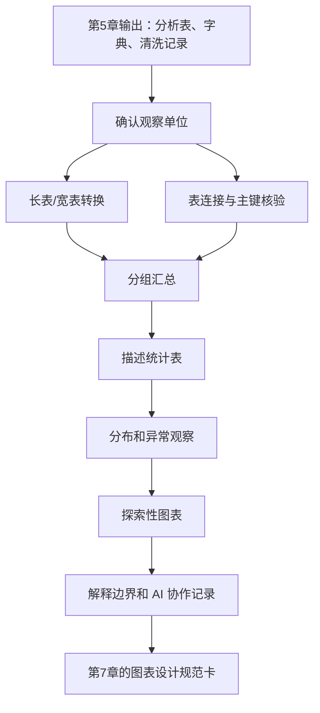
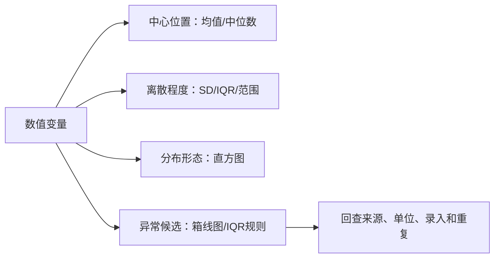

# 第6章 数据整形、描述统计与探索性可视化

## 本章定位

第5章解决“文件能否正确读入、字段能否解释、质量问题能否记录”。本章继续往前走一步：把已经读入并初步核验的表，整理成适合汇总、作图和后续分析的结构。

数据整形从确认观察单位开始，随后完成长宽转换或表连接，再汇总分组数据、计算描述统计量并绘制探索性图表。

本章不进入统计推断。均值、中位数、箱线图、趋势图只能帮助学生理解数据和发现待查问题，不能直接写成疗效、风险、机制、诊断价值或临床建议。

| 前置输入 | 本章处理 | 后续承接 |
| --- | --- | --- |
| 读入检查表 | 核对列名、类型、行列数 | 第7章的图表设计规范卡 |
| 数据字典 | 确认单位、分组、字段角色 | 第8章统计推断 |
| 质量问题清单 | 标记缺失、异常、重复和逻辑冲突 | 第9-10章建模前检查 |
| 清洗记录 | 追踪样本数变化 | 第11章以后矩阵和元数据（metadata） |

## 学习目标

1. 能区分长表、宽表和连接后的分析表，并说明每一行代表什么。
2. 能检查表连接的主键、重复键、未匹配记录和连接后行数变化。
3. 能按分组变量生成描述统计表，说明 `n`、分母、缺失处理和单位。
4. 能用直方图、箱线图和异常观察清单检查分布、离散程度和可疑记录。
5. 能为探索性图表写出问题、变量、视觉编码、图注要点和解释边界。
6. 能处理日期、分类变量和简单文本字段，并记录人工确认事项。
7. 能把 AI 生成的代码草稿转化为可运行、可核验、可追踪的学习证据。

## 阅读指南

读本章时先看“表的一行”，再看函数。`melt()`、`merge()`、`groupby()`、`hist()` 都只是工具；真正决定结果能否解释的，是观察单位、主键、分母、单位和数据来源。

遇到看似好看的图表，不要急着写结论。先问：图中每个点或柱子来自哪些记录？是否有缺失？分组是否可靠？异常点有没有回查？这些问题比图表样式更早。

## 分析流程



## 适用范围

| 分析任务 | 直接依据 | 可以说明 | 不能说明 |
| --- | --- | --- | --- |
| 长表和宽表服务不同任务 | tidy 数据思想、pandas/R 整形示例 | 可写成方法原则 | 不说某种结构永远更好 |
| 表连接需要主键和行数核验 | 组学元数据、表达矩阵、药品编码示例 | 可写成课堂检查规则 | 不让 AI 猜连接键含义 |
| 描述统计回答数据概貌 | ISL `describe()`、药品销售汇总材料 | 可写成入门流程 | 不写 P 值或组间差异结论 |
| 图表用于探索和质控 | ISL 直方图/箱线图、教材销售图示例 | 可写成图表选择建议 | 不写医学因果或临床建议 |
| 日期、分类和文本要先标准化 | 药品名称、购药日期、元数据分组字段 | 可写成清洗要求 | 文本解释需人工确认 |

## 核心概念速查

| 概念 | 本章解释 | 常见误区 | 核验动作 |
| --- | --- | --- | --- |
| 观察单位 | 一行代表的对象或事件 | 只看列名，不看一行含义 | 写入整形日志 |
| 长表 | 一行通常是一项测量或一个时间点 | 认为长表一定更高级 | 核对转换后行数 |
| 宽表 | 一行通常是一个样本或记录 | 把所有字段都堆成宽表 | 核对后续任务 |
| 主键 | 用来连接表的字段 | 用重复键直接连接 | 检查唯一性 |
| 分组汇总 | 按组计算统计量 | 把汇总写成显著差异 | 说明分母和缺失 |
| 描述统计 | 描述中心、离散和范围 | 只给均值 | 同时给 `n`、中位数、IQR |
| 异常观察 | 待回查的极端或规则冲突记录 | 看到异常点就删除 | 标记、回查、记录 |
| 探索性图表 | 分析前检查数据和模式 | 写成医学发现 | 写明解释边界 |

## 6.1 长表、宽表与表连接

数据整形前先问一个问题：这张表的一行代表什么？在医药数据中，一行可能是一个样本、一次交易、一次随访、一个检测项目、一个药品、一个基因或一个时间点。

长表和宽表没有绝对优劣。宽表适合人工检查、基线表、矩阵构建和部分模型输入；长表适合分组作图、按指标汇总和 tidy 数据流程。选择结构时要回到任务目标。

| 表结构 | 一行含义 | 适合任务 | 需要核验 |
| --- | --- | --- | --- |
| 临床指标宽表 | 一个样本的一组指标 | 人工检查、基线表 | 每列单位 |
| 临床指标长表 | 一个样本的一个指标 | 分组作图、按指标汇总 | 转换后行数 |
| 交易明细表 | 一次购药交易 | 日期、药品、金额汇总 | 交易字段含义 |
| 月度汇总表 | 一个自然月的汇总 | 时间趋势 | 汇总规则 |
| 表连接结果 | 连接后的分析单位 | 统计和作图 | 主键、行数变化 |

### 临床指标：宽表转长表

下面的宽表中，每一行是一个样本。`ALT`、`AST` 和 `creatinine` 是不同检测指标，单位需要来自数据字典。本例只演示结构转换，不解释指标高低的医学含义。

```python
import pandas as pd

wide = pd.DataFrame({
    "sample_id": ["S01", "S02", "S03", "S04"],
    "group": ["control", "control", "treatment", "treatment"],
    "ALT": [32, 36, 45, 62],
    "AST": [28, 30, 35, 58],
    "creatinine": [72, 75, 80, 88],
})

long = wide.melt(
    id_vars=["sample_id", "group"],
    value_vars=["ALT", "AST", "creatinine"],
    var_name="marker",
    value_name="value"
)

print(wide.shape)
print(long.shape)
print(long.head())
```

转换前，宽表有 4 行，每行是一个样本。转换后，长表有 12 行，每行是“一个样本的一个检测指标”。行数增加不是错误，而是观察单位改变了。

| 转换前后 | 行数 | 列数 | 一行含义 |
| --- | ---: | ---: | --- |
| `wide` | 4 | 5 | 一个样本及多个指标 |
| `long` | 12 | 4 | 一个样本的一个指标 |

R 中可用 `pivot_longer()` 完成同类任务。学生不需要背参数，但要知道 `cols` 是被拉长的指标列，`names_to` 保存原列名，`values_to` 保存指标值。

```r
library(tidyr)

long <- wide |>
  pivot_longer(
    cols = c(ALT, AST, creatinine),
    names_to = "marker",
    values_to = "value"
  )
```

### 药品销售：交易、日期和药品是不同观察单位

药品销售素材中的 `cleanedData.csv` 片段每行是一笔交易，字段顺序为销售日期、医保卡号、药品编号、药品名称、销售数量、应收金额和实收金额。当前仓库未发现原始 `cleanedData.csv`，下面只使用素材摘录行构造教学示例。

```python
from io import StringIO

sales_text = """2018-01-01,1616528,236701,强力VC银翘片,6,82.8,69
2018-01-01,101470528,236709,心痛定,4,179.2,159.2
2018-01-01,10072612028,2367011,开博通,1,28,25
2018-01-01,10074599128,2367011,开博通,5,140,125
2018-01-01,11743428,861405,苯磺酸氨氯地平片(络活喜),1,34.5,31
2018-07-19,10010733628,865099,硝苯地平片(心痛定),2,2.4,2
2018-07-19,1616528,861485,富马酸比索洛尔片(博苏),1,16.8,16.8
2018-07-19,104002228,861435,缬沙坦胶囊(代文),5,179,171.4
"""

sales = pd.read_csv(
    StringIO(sales_text),
    header=None,
    names=[
        "sale_date", "card_id", "drug_code", "drug_name",
        "quantity", "receivable", "actual"
    ]
)

print(sales.head())
print(sales.shape)
```

这张交易明细表可以生成多种汇总表。按日期汇总后，一行是一天；按药品汇总后，一行是一个药品；按月份汇总后，一行是一个月份。学生必须在表名前或图注中写清观察单位。

| 表 | 一行代表 | 可回答的问题 |
| --- | --- | --- |
| `sales` | 一笔交易 | 每条记录的药品、数量和金额 |
| `daily_sales` | 一个日期 | 当日交易数和实收金额 |
| `drug_sales` | 一个药品 | 该药品在示例中的销售数量 |
| `monthly_sales` | 一个自然月 | 该月交易数和实收金额 |

### 表连接：主键不是凭感觉选

表连接是按一个或多个键把不同表合并。药品销售表可以按 `drug_code` 连接药品分类表；临床指标表可以按 `sample_id` 连接分组表；组学表达矩阵常按 `gene_id` 连接注释表。

```python
drug_ref = pd.DataFrame({
    "drug_code": [236701, 236709, 2367011, 861405, 865099, 861485, 861435],
    "drug_class": ["感冒用药", "降压药", "降压药", "降压药", "降压药", "降压药", "降压药"]
})

print(drug_ref["drug_code"].duplicated().sum())

sales_with_class = sales.merge(
    drug_ref,
    on="drug_code",
    how="left",
    validate="many_to_one"
)

print(sales_with_class.shape)
print(sales_with_class["drug_class"].isna().sum())
```

`validate="many_to_one"` 的含义是左表可以多次出现同一药品编码，右表的药品编码必须唯一。若右表编码重复，连接可能把行数放大，后续汇总会被污染。

| 连接关系 | 医药数据例子 | 检查重点 |
| --- | --- | --- |
| 一对一 | 样本表 + 分组表 | 两边 `sample_id` 都唯一 |
| 一对多 | 样本表 + 多次随访表 | 随访表可重复，样本表应唯一 |
| 多对一 | 交易明细 + 药品分类表 | 分类表 `drug_code` 应唯一 |
| 多对多 | 两张重复键表直接连接 | 高风险，需人工确认 |

组学数据也有同类问题。表达矩阵的 `gene_id` 重复，可能是重复记录，也可能是转录本、探针或注释粒度不同。第6章只要求学生记录重复键和连接后行数，不解释基因功能。

```python
expr = pd.DataFrame({
    "gene_id": ["ENSG000001", "ENSG000002", "ENSG000002", "ENSG000004"],
    "S01": [10, 0, 0, 5],
    "S02": [12, 1, 1, 4],
})

gene_map = pd.DataFrame({
    "gene_id": ["ENSG000001", "ENSG000002", "ENSG000003"],
    "gene_name": ["GENE1", "GENE2", "GENE3"],
})

print(expr["gene_id"].duplicated().sum())
merged = gene_map.merge(expr, on="gene_id", how="inner")
print(merged.shape)
```

连接检查表至少包含主键、连接方式、连接前后行数、重复键、未匹配记录和字段冲突。若缺少这些信息，不能只写“连接成功”。

## 6.2 分组汇总与描述统计量

分组汇总是在某个分组内计算统计量。它回答“样本数据大致是什么样”，不回答“差异是否成立”。判断差异是否可靠，要等到第8章讨论统计推断。

汇总前写清三件事：分组变量是什么，数值变量是什么，分母是什么。若有缺失，`n` 要说明是总记录数还是非缺失记录数。

| 汇总目标 | 分组变量 | 数值变量 | 最低输出 |
| --- | --- | --- | --- |
| 每日销售金额 | `sale_date` | `actual` | 日期、交易数、总额 |
| 每月销售金额 | `sale_month` | `actual` | 月份、交易数、总额、均值 |
| 药品销量 | `drug_name` | `quantity` | 药品、交易数、总销量 |
| 临床指标 | `group` | `ALT`、`AST` | 组别、n、均值、中位数、SD、IQR |
| 分类变量比例 | `drug_class` | 计数 | 类别、n、比例、分母 |

均值反映平均水平，但会受极端值影响。中位数是排序后中间位置，对偏态数据更稳健。标准差（standard deviation, SD）描述数值围绕均值的波动。四分位距（interquartile range, IQR）描述中间 50% 数据的范围。

| 统计量 | 回答的问题 | 使用提醒 |
| --- | --- | --- |
| `n` | 有多少记录或样本进入统计 | 必须说明分母 |
| 均值 | 平均水平是多少 | 偏态或极端值下谨慎解释 |
| 中位数 | 中间位置是多少 | 适合偏态数据描述 |
| SD | 围绕均值波动多大 | 与均值一起解释 |
| IQR | 中间 50% 范围多宽 | 与中位数一起解释 |
| 最小值/最大值 | 范围和可疑极端值 | 不能单独决定删除 |
| 比例 | 某类别占多少 | 必须说明分母 |

### airway 文库大小与 metadata：贯穿案例

airway 课程数据包包含 8 个样本、4 个细胞系和两种处理条件。样本级 QC 表把每列计数汇总为文库大小，并通过 `sample_id` 连接 metadata。该对象用于练习连接与描述，不在本节进行差异检验。

| sample_id | cell | dex | raw_library_size | detected_genes |
| --- | --- | --- | ---: | ---: |
| `SRR1039508` | N61311 | untrt | 20,634,079 | 21,568 |
| `SRR1039509` | N61311 | trt | 18,805,453 | 21,443 |
| `SRR1039512` | N052611 | untrt | 25,343,413 | 21,835 |
| `SRR1039513` | N052611 | trt | 15,160,874 | 20,985 |
| `SRR1039516` | N080611 | untrt | 24,443,348 | 21,813 |
| `SRR1039517` | N080611 | trt | 30,812,404 | 21,891 |
| `SRR1039520` | N061011 | untrt | 19,122,137 | 21,552 |
| `SRR1039521` | N061011 | trt | 21,160,749 | 21,385 |

描述表应同时保留 `sample_id`、`cell` 和 `dex`，以便识别配对结构。文库大小差异是当前样本的 QC 观察，不能单独解释为处理效应或测序质量结论。药品销售案例随后用于普通交易表对照。

### 药品销售分组汇总

先把销售日期转成日期类型，再提取月份。日期字段若仍是字符串，排序和月份汇总都容易出错。

```python
sales_with_class["sale_date"] = pd.to_datetime(sales_with_class["sale_date"])
sales_with_class["sale_month"] = sales_with_class["sale_date"].dt.to_period("M").astype(str)

daily_sales = (
    sales_with_class
    .groupby("sale_date", as_index=False)
    .agg(
        transaction_n=("actual", "size"),
        actual_total=("actual", "sum"),
        actual_mean=("actual", "mean")
    )
)

monthly_sales = (
    sales_with_class
    .groupby("sale_month", as_index=False)
    .agg(
        transaction_n=("actual", "size"),
        actual_total=("actual", "sum"),
        quantity_total=("quantity", "sum")
    )
)

print(daily_sales)
print(monthly_sales)
```

`daily_sales` 的一行是一个日期，不再是一笔交易。`actual_total` 是示例行内的实收金额总和，只能作为内嵌示例运行结果。它不能代表真实药店、真实患者或真实销售趋势。

按药品名称汇总时，一行是一个药品。素材中的 Top20 药品销量图属于这类任务，但本章只用少量内嵌行演示流程。

```python
drug_summary = (
    sales_with_class
    .groupby(["drug_code", "drug_name"], as_index=False)
    .agg(
        transaction_n=("quantity", "size"),
        quantity_total=("quantity", "sum"),
        actual_total=("actual", "sum")
    )
    .sort_values("quantity_total", ascending=False)
)

print(drug_summary.head())
```

### 临床指标描述统计

临床指标示例用于训练描述统计表，不用于医学判断。`ALT` 和 `AST` 的单位、参考范围、采样时间和检测方法都需要数据字典或数据提供者说明。

```python
clinical_summary = (
    long
    .groupby(["group", "marker"], as_index=False)
    .agg(
        n=("value", "count"),
        mean=("value", "mean"),
        median=("value", "median"),
        sd=("value", "std"),
        q1=("value", lambda x: x.quantile(0.25)),
        q3=("value", lambda x: x.quantile(0.75)),
        min_value=("value", "min"),
        max_value=("value", "max"),
    )
)

clinical_summary["iqr"] = clinical_summary["q3"] - clinical_summary["q1"]
print(clinical_summary)
```

这张表可以写成“示例中各组指标的描述统计”。不能写成“处理组指标升高具有临床意义”。本章没有统计检验，也没有实验设计信息。

R 的对应读法如下。课堂中可任选 Python 或 R，不要求同一作业同时写两套代码。

```r
library(dplyr)

summary <- long |>
  group_by(group, marker) |>
  summarise(
    n = sum(!is.na(value)),
    mean = mean(value, na.rm = TRUE),
    median = median(value, na.rm = TRUE),
    sd = sd(value, na.rm = TRUE),
    q1 = quantile(value, 0.25, na.rm = TRUE),
    q3 = quantile(value, 0.75, na.rm = TRUE),
    iqr = q3 - q1,
    .groups = "drop"
  )
```

### 分类变量比例

分类变量比例要写清分母。下面的药品分类比例只来自内嵌示例行，不代表真实药品结构。

```python
class_counts = (
    sales_with_class["drug_class"]
    .value_counts(dropna=False)
    .rename_axis("drug_class")
    .reset_index(name="transaction_n")
)

class_counts["pct"] = class_counts["transaction_n"] / len(sales_with_class)
print(class_counts)
```

比例的分母是交易记录数，不是患者数，也不是药品种类数。若要按患者或药品统计，需要先改变观察单位。

## 6.3 分布、离散程度与异常观察

描述统计表会压缩信息。两个组的均值可能接近，但一个组很集中，另一个组波动很大；一个组的均值也可能被少数极端观察拉高。分布图能帮助学生看到这些问题。

分布检查用于观察数值位置、离散程度和待回查记录。医学结论还需要统计推断、研究设计和专业证据。



### 直方图和箱线图

ISL 材料用 `hist()` 展示连续变量分布，用 `boxplot()` 展示分类变量下的数值分布。本章采用同样思路，但使用内嵌临床指标示例。

```python
import matplotlib.pyplot as plt

fig, axes = plt.subplots(1, 2, figsize=(8, 3))

long[long["marker"] == "ALT"]["value"].hist(bins=4, ax=axes[0])
axes[0].set_title("ALT distribution")
axes[0].set_xlabel("ALT")
axes[0].set_ylabel("Count")

long[long["marker"] == "ALT"].boxplot(
    column="value",
    by="group",
    ax=axes[1]
)
axes[1].set_title("ALT by group")
axes[1].set_xlabel("Group")
axes[1].set_ylabel("ALT")
fig.suptitle("")
plt.tight_layout()
```

直方图的 `bins` 会影响视觉判断。学生需要记录分箱数量或分箱宽度。箱线图中的点只是异常候选，不是删除指令。

| 图表 | 适合问题 | 必须记录 |
| --- | --- | --- |
| 直方图 | 连续变量集中在哪里 | 变量、单位、分箱设置 |
| 箱线图 | 分组分布和异常候选 | 分组变量、箱线定义 |
| 点图 | 小样本每个观察值 | 样本数、是否抖动 |
| 时间趋势图 | 指标随日期变化 | 时间粒度、汇总规则 |

### IQR 异常候选标记

IQR 规则常用于标记异常候选。它通常把低于 `Q1 - 1.5 * IQR` 或高于 `Q3 + 1.5 * IQR` 的记录列出，供回查使用。

```python
alt = long[long["marker"] == "ALT"].copy()
q1 = alt["value"].quantile(0.25)
q3 = alt["value"].quantile(0.75)
iqr = q3 - q1
lower = q1 - 1.5 * iqr
upper = q3 + 1.5 * iqr

alt["iqr_flag"] = (alt["value"] < lower) | (alt["value"] > upper)
print(alt[["sample_id", "group", "value", "iqr_flag"]])
```

异常观察不等于错误值。它可能来自录入错误、单位错误、重复记录、仪器问题、退款记录，也可能是真实极端样本。医药数据中的异常观察需要回到数据字典、实验背景、单位、批次和原始记录。

| 异常来源 | 药品销售例子 | 临床或组学例子 | 处理动作 |
| --- | --- | --- | --- |
| 录入错误 | 金额多录一位 | 年龄为 230 | 标记并回查 |
| 单位错误 | 金额单位混用 | mmol/L 和 mg/dL 混用 | 单位确认 |
| 业务记录 | 负数可能是退款 | 复诊或复测 | 查业务规则 |
| 批次差异 | 某天全部金额异常 | 某批次指标偏移 | 查批次记录 |
| 真实极端值 | 大额交易 | 真实高表达样本 | 保留并说明 |

### 异常观察清单

异常观察处理记录至少包含字段、规则、命中数量、处理动作、理由和状态。没有回查依据时，不应直接排除。

```python
sales_flags = sales_with_class.copy()
sales_flags["quantity_negative"] = sales_flags["quantity"] < 0
sales_flags["actual_gt_receivable"] = sales_flags["actual"] > sales_flags["receivable"]
sales_flags["zero_amount"] = sales_flags["actual"] == 0

flag_summary = sales_flags[[
    "quantity_negative",
    "actual_gt_receivable",
    "zero_amount"
]].sum().rename("flag_n").reset_index()

print(flag_summary)
```

内嵌销售示例中没有负数记录。正式作业如果发现负数，应先标记。负数可能是录入错误，也可能是退货或退款。没有业务说明时，应写 `需人工确认`。

### 组学数据的边界

组学表达矩阵中也会遇到异常表达、零值集中、重复基因 ID 和批次差异。本章只把它们作为数据结构和质量检查例子，不进入差异表达、marker 解释、功能富集或细胞类型注释。

| 观察结果 | 本章允许写法 | 不写内容 |
| --- | --- | --- |
| 某基因值很高 | 该记录是异常候选，需回查单位和批次 | 该基因驱动某疾病 |
| 多个样本零值多 | 需要检查过滤规则和数据来源 | 该通路被抑制 |
| gene_id 重复 | 需确认注释粒度和合并键 | 直接删除重复基因 |

## 6.4 探索性图表的选择与解释边界

探索性图表用于正式统计推断或建模前的数据检查。它可以帮助学生查看变量分布、分组模式、异常观察、时间变化和数据质量。它不能替代统计设计，也不能替代医学证据。

每张图只回答一个主要问题。先写问题，再选图表类型。若一个图同时想回答分布、趋势、分组和相关，通常会让读者看不清。

| 主要问题 | 变量类型 | 推荐图表 | 不可越界解释 |
| --- | --- | --- | --- |
| 数值集中在哪里 | 连续变量 | 直方图 | 不写诊断结论 |
| 分组分布如何 | 分组 + 连续变量 | 箱线图或点图 | 不写组间差异成立 |
| 类别构成如何 | 分类变量 | 条形图 | 不写原因 |
| 时间是否波动 | 日期 + 汇总值 | 折线图 | 不写季节性或经营原因 |
| 两个数值变量关系如何 | 连续 + 连续 | 散点图 | 不写因果 |

### 简版图表设计规范卡

第7章会系统讲图表设计规范卡。本章使用简版版本，让学生先学会把图表问题写清楚。

| 项目 | 写法 |
| --- | --- |
| 图表问题 | 这张图回答什么问题 |
| 数据来源 | 使用哪张表，是否为模拟或教材摘录 |
| 观察单位 | 每个点、柱子或线段代表什么 |
| 视觉编码 | x、y、颜色、分面分别是什么 |
| 统计处理 | 是否汇总，汇总规则是什么 |
| 缺失处理 | 缺失是否排除，分母如何计算 |
| 解释边界 | 只能写观察，不能写医学或因果结论 |

### 药品日销售趋势图

日销售趋势图的输入应是日汇总表，而不是原始交易明细。下面代码只生成作图数据表和绘图对象，示例结果来自内嵌教材摘录行。

```python
fig, ax = plt.subplots(figsize=(6, 3))
ax.plot(daily_sales["sale_date"], daily_sales["actual_total"], marker="o")
ax.set_title("Daily actual amount")
ax.set_xlabel("Date")
ax.set_ylabel("Actual amount")
plt.tight_layout()
```

可写图注：图展示内嵌药品销售示例中不同日期的实收金额合计。该图用于说明日期汇总和折线图编码，不代表真实销售趋势。

不可写图注：某日期销售金额高，说明患者需求上升或药品疗效更好。材料没有支持这些解释。

### Top 药品销量条形图

条形图适合展示分类变量的计数或汇总值。下面图表的一根柱子代表一个药品在内嵌示例中的销售数量合计。

```python
fig, ax = plt.subplots(figsize=(7, 3))
ax.bar(drug_summary["drug_name"], drug_summary["quantity_total"])
ax.set_title("Drug quantity in teaching example")
ax.set_xlabel("Drug")
ax.set_ylabel("Quantity")
ax.tick_params(axis="x", rotation=45)
plt.tight_layout()
```

药品名称较长时，横轴文字容易拥挤。处理方式可以是旋转标签、改用横向条形图、缩短展示名称，或只显示前若干项。不要为了美观改动原始字段含义。

### 两个连续变量的散点图

散点图适合检查两个连续变量是否有共同变化趋势。它不能证明一个变量导致另一个变量。

```python
clinical_wide = wide.copy()

fig, ax = plt.subplots(figsize=(4, 3))
ax.scatter(clinical_wide["ALT"], clinical_wide["AST"])
ax.set_title("ALT and AST in teaching example")
ax.set_xlabel("ALT")
ax.set_ylabel("AST")
plt.tight_layout()
```

可写图注：图展示内嵌示例中 `ALT` 与 `AST` 的散点分布，用于演示两个连续变量的探索性可视化。样本量很小，不能据此判断医学关联。

### 图表解释边界卡

| 项目 | 本章写法 |
| --- | --- |
| 观察结果 | 图中显示某变量分布、某日期汇总值或某类别计数 |
| 方法来源 | 数据整形、分组汇总、图表编码 |
| 允许解释 | 该模式提示需要进一步核验或描述 |
| 替代解释 | 缺失、单位、批次、重复、退款、录入规则 |
| 仍需验证 | 数据来源、样本定义、业务规则、统计方法 |
| 禁止越界 | 不写疗效、风险升高、机制成立或临床可用 |

## 6.5 日期、分类变量与文本字段入门

日期、分类变量和文本字段经常决定整形和汇总是否可靠。它们看起来不像复杂统计问题，却最容易在前期留下隐性错误。

日期字段常见于购药时间、随访日期、入组日期、检测日期、批准日期和报告日期。日期不能只当普通字符串处理，应转换为日期类型后再排序、提取月份、计算间隔或做时间汇总。

### 日期解析和月份提取

```python
date_check = sales.copy()
date_check["sale_date_raw"] = date_check["sale_date"]
date_check["sale_date"] = pd.to_datetime(date_check["sale_date"], errors="coerce")
date_check["sale_month"] = date_check["sale_date"].dt.to_period("M").astype(str)

print(date_check[["sale_date_raw", "sale_date", "sale_month"]].head())
print(date_check["sale_date"].isna().sum())
```

日期转换要记录原格式、转换函数、无法解析记录和保留的时间粒度。若只保留月份，日级变化就不能再解释。

| 日期动作 | 记录内容 | 风险 |
| --- | --- | --- |
| 字符串转日期 | 原格式、转换函数、失败行数 | 错把月日顺序读反 |
| 提取月份 | 月份格式、是否跨年 | 丢失日级信息 |
| 计算间隔 | 起点日期、终点日期 | 字段含义混淆 |
| 时间汇总 | 日、周、月或季度 | 粒度改变观察单位 |

### 分类变量标准化

分类变量包括组别、性别、响应状态、药品类别、批次和样本来源。即使用数字编码，也要回到数据字典解释含义。

```python
metadata = pd.DataFrame({
    "sample_id": ["S01", "S02", "S03", "S04", "S05"],
    "group_code": [" control", "Control", "treatment", "TREATMENT", "unknown"],
    "batch": ["B1", "B1", "B2", "B2", "B3"]
})

metadata["group_clean"] = (
    metadata["group_code"]
    .str.strip()
    .str.lower()
)

group_map = {
    "control": "control",
    "treatment": "treatment",
}

metadata["group_label"] = metadata["group_clean"].map(group_map)
print(metadata)
print(metadata["group_label"].isna().sum())
```

未匹配的分类水平不能凭感觉归类。上例中的 `unknown` 应写入需人工确认清单。真实作业中，分类合并规则要来自数据字典或数据提供者说明。

### 文本字段：药品名称清理和关键词筛选

文本字段包括药品名称、适应症描述、不良反应记录、医生备注和文献摘要。本章只做入门处理：去空格、标准化名称、关键词筛选、简单词频统计和停用词说明。

```python
text_demo = sales.copy()
text_demo["drug_name_clean"] = (
    text_demo["drug_name"]
    .str.replace("（", "(", regex=False)
    .str.replace("）", ")", regex=False)
    .str.strip()
)

keyword = "硝苯地平"
text_demo["contains_keyword"] = text_demo["drug_name_clean"].str.contains(keyword, na=False)

print(text_demo[["drug_name", "drug_name_clean", "contains_keyword"]])
```

关键词筛选只能说明“字段文本中出现了某个字符串”。它不能说明药物疗效、适应症是否匹配、患者诊断或用药合理性。药品通用名、商品名和别名映射需要人工确认。

简单词频统计也要谨慎。中文药品名不宜随意按单字切分；本章只统计完整药品名称。

```python
drug_name_counts = (
    text_demo["drug_name_clean"]
    .value_counts()
    .rename_axis("drug_name_clean")
    .reset_index(name="n")
)

print(drug_name_counts)
```

| 文本任务 | 本章允许 | 本章不进入 |
| --- | --- | --- |
| 去空格和符号统一 | 可以 | 不自动改药品标准名 |
| 关键词筛选 | 可以 | 不解释诊断和疗效 |
| 简单词频 | 可以 | 不做主题模型 |
| 同义词合并 | 可列候选 | 需要人工确认 |
| 医学术语归一化 | 只说明边界 | 不做临床文本解释 |

## 案例任务：从交易明细到探索性图表

本案例把本章五个小节串起来。数据来自内嵌药品销售摘录行，字段结构来自教材材料。由于仓库未发现原始 `drugSale.csv` 或 `cleanedData.csv`，本案例不代表当前项目可复现实测结果。

| 步骤 | 输入 | 输出 | 学习证据 |
| --- | --- | --- | --- |
| 1 | 交易明细 | 读入检查表 | 行列数、列名、类型 |
| 2 | 交易明细 + 药品分类表 | 连接检查表 | 主键、重复键、未匹配 |
| 3 | 交易明细 | 日/月/药品汇总表 | 分母、单位、缺失处理 |
| 4 | 汇总表和指标表 | 探索性图表 | 图表设计规范卡和图注 |
| 5 | 文本字段 | 名称清理和关键词表 | 需人工确认项 |

教材摘录中报告过 `cleanedData.csv` 的数据总行数为 6536，且没有空值的数据总行数为 6536。这个数字来自教材运行示例，只能作为素材信息使用。正式作业必须以学生实际运行结果为准。

| 数字 | 来源状态 | 本章处理 |
| --- | --- | --- |
| 6536 行 | 教材摘录 | 可说明材料背景 |
| 内嵌示例 8 行 | 本章教学构造 | 可运行代码 |
| 日汇总和药品汇总 | 内嵌示例运行结果 | 可用于流程复核 |

## AI 协作点

第6章可以让 AI 生成局部代码，但每次都要给出真实字段、任务目标、约束、验证和输出。AI 不能猜列名、猜单位、决定异常值处理，也不能写医学解释。

| 场景 | 可让 AI 做什么 | 学生必须核验什么 |
| --- | --- | --- |
| 长宽转换 | 生成 `melt()` 或 `pivot_longer()` 草稿 | 转换前后一行含义和行数 |
| 表连接 | 生成 `merge()` 草稿 | 主键唯一性、未匹配和行数变化 |
| 分组汇总 | 生成 `groupby().agg()` 草稿 | 分组、分母、单位和缺失 |
| 探索性图表 | 建议图表类型和代码 | 是否回答单一问题 |
| 图注润色 | 帮助压缩语言 | 是否越过证据边界 |

### 本章 AI 任务说明书示例

```text
目标：
请根据我提供的字段，生成第6章“分组汇总与探索性图表”的 Python 局部代码。

上下文：
- 数据表是一张教学用药品销售摘录表。
- 字段包括 sale_date、card_id、drug_code、drug_name、quantity、receivable、actual。
- 一行代表一笔交易。

约束：
- 不猜字段单位。
- 不解释药物疗效、患者需求或临床风险。
- 不删除异常值，只生成标记和回查清单。
- 所有图注必须说明这是教学示例。

验证：
- 输出读入后行列数。
- 输出日期转换失败数。
- 输出连接前后行数和未匹配记录数。
- 输出每张图的数据来源和分母。

输出：
1. 分组汇总代码。
2. 探索性图表代码。
3. 图表设计规范卡表。
4. 需人工确认清单。
```

## 知识结构


## 常见误区

| 误区 | 为什么错 | 如何纠正 |
| --- | --- | --- |
| 长表一定比宽表好 | 表结构服务任务 | 先写观察单位和后续用途 |
| 连接代码跑通就可靠 | 重复键会放大行数 | 检查主键和行数变化 |
| 只给均值 | 均值可能被极端值影响 | 同给中位数、SD、IQR |
| 箱线图异常点直接删除 | 异常点可能是真实观察 | 标记、回查、记录 |
| 趋势图写成原因 | 图形只显示模式 | 写观察和待核验事项 |
| 分类编码当数值 | 编码不是连续测量 | 回到数据字典 |
| 关键词命中当医学解释 | 文本匹配不等于语义成立 | 人工确认语境和同义词 |
| 让 AI 写图注结论 | AI 可能越界 | 人工核对证据边界 |

## 核验清单

- 是否先核对 `大纲.md` 和 `chapters/chapter-6/本章大纲.md`。
- 是否说明每张表的一行代表什么。
- 长宽转换前后是否记录行数、列数和关键字段。
- 表连接是否检查主键、重复键、未匹配记录和行数变化。
- 每个分组汇总是否说明分组变量、统计变量、分母、单位和缺失处理。
- 描述统计是否包含 `n`、中心位置、离散程度和范围。
- 异常观察是否先标记、再回查、后决定处理。
- 每张探索性图表是否只回答一个主要问题。
- 图注是否区分观察结果和仍需核验内容。
- 日期、分类变量和文本字段是否记录标准化规则。
- AI 生成代码是否经过运行、修改和人工核验。
- 正文是否没有新增材料未支持的医学结论。

## 实验或作业

### 作业1：长宽表转换与连接检查

使用给定的临床指标宽表和样本分组表，把指标宽表转成长表，并按 `sample_id` 连接分组表。

| 提交内容 | 要求 | 核验标准 |
| --- | --- | --- |
| 整形日志 | 记录转换前后行列数 | 一行含义清楚 |
| 连接检查表 | 记录主键、重复键、未匹配 | 不隐藏行数变化 |
| 代码 | 可从项目根目录运行 | 不改原始数据 |
| 简短说明 | 说明能支持什么、不能支持什么 | 不写统计推断 |

### 作业2：描述统计和探索性图表

使用给定的模拟药品销售表或简化临床指标表，生成描述统计表、异常观察清单和两张探索性图表。

| 提交内容 | 要求 | 核验标准 |
| --- | --- | --- |
| 描述统计表 | 含 `n`、均值、中位数、SD、IQR | 分母和单位清楚 |
| 异常观察清单 | 说明规则、命中数量、处理状态 | 不直接删除 |
| 图表设计规范卡 | 每张图一个主要问题 | 视觉编码清楚 |
| 图注 | 写观察结果和边界 | 不写疗效或机制 |
| AI 协作记录 | 保留提示词、输出摘要、人工修改 | 透明、具体 |
