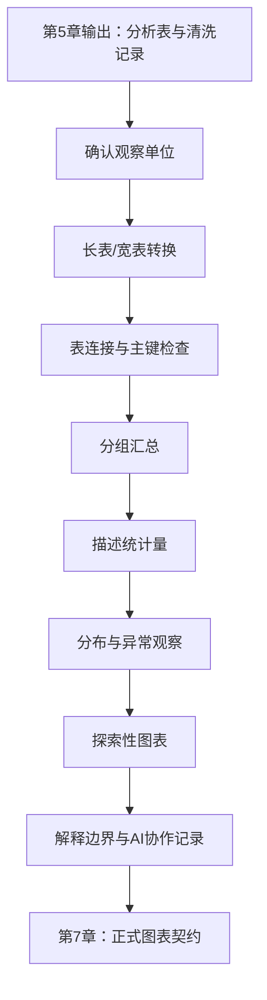
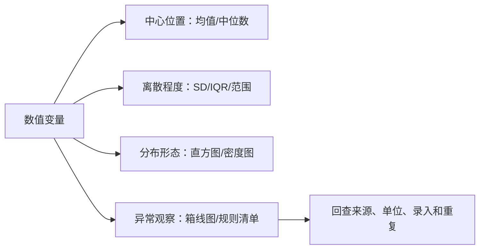

# 第6章 数据整形、描述统计与探索性可视化

## 本章定位

本章进入全书第二阶段：Prompt Coding 提示词编程。第5章已经训练学生读取文件、写数据字典、检查质量问题并记录清洗过程。本章把这些输出继续向前推进：先确认分析表的一行代表什么，再完成长宽表转换、表连接、分组汇总、描述统计和探索性图表。

本章不做统计推断。均值、中位数、标准差、直方图和箱线图可以帮助学生理解样本数据，但不能直接说明治疗有效、风险升高、机制成立或临床可用。第7章会继续讲正式图表契约和科研图表规范，第8章再讨论P值、效应量和置信区间。

| 前置能力 | 本章任务 | 后续承接 |
| --- | --- | --- |
| 能读入CSV/Excel并写数据字典 | 确认观察单位，整理长表或宽表 | 第7章图表契约 |
| 能识别变量类型和质量风险 | 按分组计算描述统计量 | 第8章统计推断 |
| 能记录清洗规则和样本数变化 | 标记异常观察并回查原因 | 第9-10章建模前检查 |
| 能写AI任务说明书 | 让AI辅助局部代码、报错解释和图注审阅 | 综合项目报告 |

## 内容要点讨论结论

| 讨论点 | 本章采用的处理 |
| --- | --- |
| 与第5章的关系 | 第5章保证数据可读、字段可解释、质量风险有记录；第6章在此基础上整理分析表并做描述性探索 |
| 与第7章的关系 | 第6章生成探索性图表和解释边界，第7章再升级为正式图表契约、图注和可复现导出 |
| 与第8章的关系 | 第6章只做描述统计和探索性图表，不写P值、置信区间、效应量或显著性结论 |
| AI开放程度 | 允许AI生成局部整形、汇总和绘图代码；不允许AI决定变量含义、删除异常值或写医学解释 |
| 案例边界 | 药品销售案例作为教材字段和流程示范；仓库未发现原始CSV，正文标注 `需补证据` |
| 医药解释边界 | 分布、异常点、词频和趋势只作为观察结果或待核验信号，不写疗效、风险、机制或临床建议 |

## 学习目标

1. 学生能区分长表、宽表和连接后的分析表，并说明每种结构适合什么任务。
2. 学生能检查表连接的主键、重复键、未匹配记录和连接后行数变化。
3. 学生能按分组变量计算 `n`、均值、中位数、标准差、四分位距、最小值、最大值或比例。
4. 学生能用直方图、箱线图、条形图、折线图和散点图检查分布、离散程度、时间变化和异常观察。
5. 学生能处理日期、分类变量和简单文本字段，并记录转换规则和需确认项。
6. 学生能说明探索性图表的解释边界，不把图中模式写成统计推断、医学因果或临床建议。
7. 学生能保留AI协作记录，说明AI生成代码和图表建议经过哪些运行测试和人工核验。

## 阅读指南

读本章时，先看数据结构，再看函数。`melt()`、`pivot_longer()`、`groupby()`、`summarise()` 和绘图函数只是工具。真正要判断的是：一行代表什么，分组变量是什么，统计量的分母是什么，图表能支持什么。

长表、宽表和表连接容易混淆。建议先对照本章总览图，再看药品销售案例：一条交易记录、一个药品、一日销售额和一月销售额是不同观察单位。观察单位一变，汇总表和图表解释也会改变。

描述统计不是统计推断。看到两组箱线图不同，只能说样本中显示出分布差异或待检查模式，不能直接写治疗有效。看到某个词频最高，也不能直接写成研究热点或药物类别结论。

## 结构蓝图

| 小节 | 主要问题 | 学习证据 | 边界 |
| --- | --- | --- | --- |
| 6.1 | 表格结构是否适合统计和作图 | 整形日志、连接检查表 | 不讲复杂数据库 |
| 6.2 | 分组后应汇总什么 | 描述统计表 | 不做P值和显著性判断 |
| 6.3 | 分布和异常观察如何检查 | 分布图、异常观察清单 | 不自动删除极端值 |
| 6.4 | 哪张图回答哪个探索性问题 | 简版图表契约和图注草稿 | 不把EDA写成因果结论 |
| 6.5 | 日期、分类和文本字段如何入门处理 | 类型转换记录、关键词表 | 不做高级自然语言处理 |

## 主张-证据-边界

| 本章主张 | 证据来源 | 可写程度 | 边界 |
| --- | --- | --- | --- |
| 整形决定后续统计和图表是否清楚 | 总纲、第6章大纲、术语表 | 分析前要明确一行代表什么 | 不承诺一种结构适合所有任务 |
| 描述统计要同时报告中心、离散和样本量 | 图表规范、GenAI数据分析材料 | 推荐报告 `n`、均值/中位数、SD/IQR、范围 | 不做显著性判断 |
| 异常观察应先标记和回查 | 术语表、图表规范、医药Python案例、生物医药大数据材料 | 可说明极端观察可能来自多种原因 | 不因影响结果而直接删除 |
| 探索性图表只支持探索性解释 | 图表规范、biomedical框架 | 可显示分布、模式和可疑点 | 不写治疗效果、机制或临床建议 |
| AI可辅助代码和图表建议 | 课程大纲、提示词样例 | 可生成代码草稿和核验清单 | 人必须核验变量含义、统计前提和医学边界 |

## 逻辑压力测试

| 压力问题 | 本章处理 |
| --- | --- |
| 表格已经能打开，还需要整形吗？ | 需要。能打开不代表能正确分组、连接和作图。 |
| AI生成了 `groupby()` 代码，能直接提交吗？ | 不能。要核验分组变量、统计量、缺失处理、分母和单位。 |
| 箱线图显示异常点，能否删除？ | 不能直接删除。先回查录入、单位、重复、批次和实验背景。 |
| 两组箱线图不同，能否写治疗有效？ | 不能。探索性图表只能提示样本模式，统计推断和医学解释留到后续章节。 |
| 词频最高，能否代表研究热点？ | 不能。词频受语料来源、分词、停用词和同义词影响，需要人工核验。 |

## 核心概念速查

| 概念 | 本章解释 | 常见混淆 | 使用边界 |
| --- | --- | --- | --- |
| 长表 | 每行记录一个观察单位下的一个变量、时间点或测量 | 以为只是行数变多 | 适合分组作图和 tidy 流程 |
| 宽表 | 每行一个样本或记录，多个测量值放在不同列 | 以为只是列很多 | 适合人工查看、基线表和矩阵输入 |
| 表连接 | 按键把两个表合并 | 把复制粘贴当连接 | 先检查主键和行数变化 |
| 主键 | 用来识别或匹配记录的字段组合 | 把姓名、药品名或自由文本当唯一ID | 连接前检查唯一性 |
| 分组汇总 | 按类别或条件计算统计量 | 只给整体均值 | 同时说明分母、缺失和单位 |
| 描述统计量 | 概括样本数据的数值指标 | 当成检验结论 | 用于理解数据，不用于证明差异 |
| 离散程度 | 数值分散或波动程度 | 只看均值 | 与图形一起解释 |
| 异常观察 | 明显偏离分布或规则的记录 | 等同于错误值 | 先标记和回查 |
| EDA | 探索性数据分析，检查分布、关系、异常和质量 | 当成最终结论 | 为后续推断生成问题清单 |
| 日期变量 | 表示时间点或时间段的变量 | 当作普通字符串 | 转为日期类型后再排序和汇总 |
| 分类变量 | 取有限类别的变量 | 当作连续数值 | 先统一水平和顺序 |
| 文本字段 | 自由文本或半结构化描述 | 直接当标准类别 | 先清理、筛选和人工核验 |

## 章节总览图



## 6.1 长表、宽表与表连接

数据整形前，先问一个问题：这张表的一行代表什么？在药品销售明细中，一行可以代表一次交易；在临床指标表中，一行可以代表一名受试者一次随访；在表达矩阵中，一行可能代表一个样本，也可能代表一个基因，具体方向取决于数据约定。

同一份资料可以整理成不同结构。结构没有绝对好坏，只有是否适合当前任务。描述统计和探索性图表通常需要变量角色清楚、分组字段清楚、观察单位清楚的分析表。

| 场景 | 一行代表 | 常见字段 | 适合任务 |
| --- | --- | --- | --- |
| 药品销售明细 | 一次交易 | `sale_date`、`drug_name`、`quantity`、`paid_amount` | 清洗、日/月汇总 |
| 临床指标随访 | 某样本某次访视 | `sample_id`、`visit_date`、`ALT`、`AST`、`group` | 趋势和分组分布检查 |
| 药品批准记录 | 一个药品或适应症记录 | `drug_name`、`approval_date`、`indication` | 日期整理和分类统计 |
| 表达矩阵 | 样本-特征矩阵 | `sample_id`、基因列或基因行 | 后续高维章节使用 |

长表（long table）指每行记录一个观察单位下的一个测量、变量或时间点。它常用于分组作图。例如同一名受试者有ALT和AST两项指标，长表会把指标名称放在一列，把指标数值放在另一列。

| sample_id | group | marker | value | unit |
| --- | --- | --- | --- | --- |
| S01 | control | ALT | 32 | U/L |
| S01 | control | AST | 28 | U/L |
| S02 | treatment | ALT | 45 | U/L |
| S02 | treatment | AST | 35 | U/L |

宽表（wide table）指每行一个样本或记录，多个测量值放在不同列。它适合人工检查、基线表展示和某些矩阵化输入。若列名同时包含指标和时间，如 `ALT_day1`、`ALT_day7`，后续作图前常需要转成长表。

| sample_id | group | ALT | AST | creatinine |
| --- | --- | --- | --- | --- |
| S01 | control | 32 | 28 | 72 |
| S02 | treatment | 45 | 35 | 80 |

长宽转换前后要记录行数、列数和一行含义。若宽表中每行是一个样本，转成长表后每行可能变成“一个样本的一个指标”。这不是简单的行数变化，而是观察单位发生了变化。

```python
import pandas as pd

wide = pd.DataFrame({
    "sample_id": ["S01", "S02"],
    "group": ["control", "treatment"],
    "ALT": [32, 45],
    "AST": [28, 35]
})

long = wide.melt(
    id_vars=["sample_id", "group"],
    value_vars=["ALT", "AST"],
    var_name="marker",
    value_name="value"
)
```

R 中可用 `tidyr::pivot_longer()` 完成同类任务。学生不需要背函数参数，但要能解释 `cols`、`names_to` 和 `values_to` 分别对应哪些变量。

```r
library(tidyr)

long <- wide |>
  pivot_longer(
    cols = c(ALT, AST),
    names_to = "marker",
    values_to = "value"
  )
```

表连接是按一个或多个键把不同表合并。医药数据常把样本信息、检测结果、用药记录和随访结局分开保存。进入统计和作图前，常需要按 `sample_id`、`visit_id`、`drug_code` 或日期等键连接。

| 连接关系 | 例子 | 检查重点 |
| --- | --- | --- |
| 一对一 | 样本表 + 分组表 | 两边主键都唯一 |
| 一对多 | 样本表 + 多次随访表 | 样本表唯一，随访表可重复 |
| 多对一 | 交易明细 + 药品分类表 | 分类表药品编码唯一 |
| 多对多 | 两张重复记录表直接连接 | 高风险，需人工确认 |

```python
samples = pd.DataFrame({
    "sample_id": ["S01", "S02"],
    "group": ["control", "treatment"]
})

labs = pd.DataFrame({
    "sample_id": ["S01", "S01", "S02"],
    "visit_date": ["2026-03-01", "2026-03-08", "2026-03-01"],
    "ALT": [32, 38, 45]
})

analysis = labs.merge(
    samples,
    on="sample_id",
    how="left",
    validate="many_to_one"
)
```

连接后不能只看代码是否运行。至少检查行数变化、未匹配记录、重复键、字段冲突和单位一致性。若连接后行数突然增加，常见原因是右表主键重复或误用了多对多连接。

## 6.2 分组汇总与描述统计量

分组汇总是在指定分组内计算统计量。它回答“样本数据大致是什么样”，不回答“组间差异是否成立”。例如，按月份汇总药品销售金额，可以看到不同月份的销售总额；按处理组汇总ALT，可以看到各组的中心位置和离散程度。

分组汇总前要写清三件事：分组变量是什么，数值变量是什么，每个统计量的分母是什么。若某列有缺失，`n` 应说明是总记录数还是非缺失记录数。

| 汇总目标 | 分组变量 | 数值变量 | 最低输出 |
| --- | --- | --- | --- |
| 每月销售金额 | 月份 | 实收金额 | 月份、交易数、总额、均值 |
| 各药品销量 | 药品名称 | 销售数量 | 药品、交易数、总销量 |
| 分组临床指标 | 处理组 | ALT、AST | 组别、n、均值、中位数、SD、IQR |
| 分类变量比例 | 性别或响应状态 | 计数 | 类别、n、比例、分母 |

均值反映平均水平，但容易受极端值影响。中位数是排序后位于中间的值，对偏态分布更稳健。标准差（standard deviation, SD）描述数值围绕均值的分散程度。四分位距（interquartile range, IQR）描述中间50%数据的范围。

| 统计量 | 回答的问题 | 使用提醒 |
| --- | --- | --- |
| `n` | 有多少记录或样本进入统计 | 必须说明缺失后分母 |
| 均值 | 平均水平是多少 | 偏态或极端值下谨慎解释 |
| 中位数 | 中间位置是多少 | 适合偏态数据描述 |
| SD | 围绕均值波动多大 | 与均值一起解释 |
| IQR | 中间50%范围多宽 | 与中位数一起解释 |
| 最小值/最大值 | 范围和可疑极端值 | 不能单独决定删除 |
| 比例 | 某类别占多少 | 必须说明分母 |

Python 中可以用 `groupby()` 和 `agg()` 生成汇总表。R 中可以用 `group_by()` 和 `summarise()`。这些函数不难，难点在于检查分组变量、分母、单位和缺失处理。

```python
summary = (
    analysis
    .groupby("group", dropna=False)
    .agg(
        n=("ALT", "count"),
        mean_ALT=("ALT", "mean"),
        median_ALT=("ALT", "median"),
        sd_ALT=("ALT", "std"),
        min_ALT=("ALT", "min"),
        max_ALT=("ALT", "max")
    )
    .reset_index()
)
```

```r
library(dplyr)

summary <- analysis |>
  group_by(group) |>
  summarise(
    n = sum(!is.na(ALT)),
    mean_ALT = mean(ALT, na.rm = TRUE),
    median_ALT = median(ALT, na.rm = TRUE),
    sd_ALT = sd(ALT, na.rm = TRUE),
    min_ALT = min(ALT, na.rm = TRUE),
    max_ALT = max(ALT, na.rm = TRUE),
    .groups = "drop"
  )
```

医药Python教材中的药品销售案例包含购药时间、社保卡号、商品编码、商品名称、销售数量、应收金额和实收金额。该材料展示了按日期、月份和药品名称汇总的基本思路。本章可以把它改写为课堂任务：先把购药时间转成日期，再提取月份，按日期汇总实收金额，按药品名称汇总销售数量。

| 课堂问题 | 可用字段 | 汇总结果 | 解释边界 |
| --- | --- | --- | --- |
| 每天销售金额如何变化 | 购药时间、实收金额 | 日期、日实收金额 | 只描述趋势，不解释经营原因 |
| 每月销售金额是多少 | 购药时间、实收金额 | 月份、月实收金额 | 不推断季节性 |
| 哪些药品销量较高 | 商品名称、销售数量 | 药品、销售数量 | 不推断疗效或临床需求 |
| 客单价如何计算 | 实收金额、交易次数 | 总金额/交易次数 | 不代表患者治疗费用 |

当前仓库未发现 `drugSale.csv` 或 `cleanedData.csv`，所以正文只使用教材中的字段和流程，不新增真实统计结果。若教师后续提供数据，学生应把运行得到的汇总表另存，并在日报中记录数据来源。

## 6.3 分布、离散程度与异常观察

描述统计表可以压缩信息，也可能隐藏分布形态。两个组的均值可能相近，但一个组很集中，另一个组波动很大；一个组的均值可能被少数极端观察拉高。分布图可以帮助学生看到这些问题。

分布检查主要回答三个问题：数值大多落在哪里，波动有多大，是否存在需要回查的异常观察。这个阶段的目标是发现问题，而不是立刻给出医学结论。



离散程度描述数据分散程度。若一组ALT值集中在30-40 U/L，另一组从10到200 U/L，即使均值接近，后者也提示更大的波动和更多需要回查的记录。

| 指标 | 适合搭配 | 解释 |
| --- | --- | --- |
| 标准差 | 均值 | 描述数值围绕均值的波动 |
| IQR | 中位数 | 描述中间50%观测的范围 |
| 范围 | 最小值/最大值 | 快速发现可疑极端值 |
| 变异系数 | 均值不接近0且单位一致时 | 入门阶段谨慎使用 |

异常观察指明显偏离分布或规则的记录。它可能来自录入错误、单位错误、重复记录、仪器问题，也可能是真实极端情况。医学数据中，真实极端观察有时正是需要关注的对象。

| 发现方式 | 例子 | 下一步 |
| --- | --- | --- |
| 范围检查 | 年龄为230，剂量为负数 | 回查录入和单位 |
| 箱线图 | 某组出现远离箱体的点 | 标记并查看原始记录 |
| 业务规则 | 给药日期早于入组日期 | 检查日期字段含义 |
| 分组检查 | 某批次全体指标偏高 | 检查批次和仪器记录 |
| 文本检查 | 同一药品多种写法 | 建立标准名称映射 |

生物医药大数据材料中，基因表达数据的异常值被放在实验误差和预处理背景下讨论。这个例子提醒学生：在组学、临床或药学数据中，异常观察处理需要方法来源、数据背景和人工判断，不能只靠图形自动决定。

```python
q1 = analysis["ALT"].quantile(0.25)
q3 = analysis["ALT"].quantile(0.75)
iqr = q3 - q1

lower = q1 - 1.5 * iqr
upper = q3 + 1.5 * iqr

flagged = analysis.loc[
    (analysis["ALT"] < lower) | (analysis["ALT"] > upper),
    ["sample_id", "visit_date", "group", "ALT"]
]
```

这段代码只用于标记可疑观察。它没有删除数据，也没有说明这些记录一定错误。学生提交作业时，应把 `flagged` 保存为回查清单，并说明是否回查原始记录。

异常观察处理记录应写成表格。若理由来自教师判断或数据提供者回复，应标出来源。

| 字段 | 规则 | 命中 | 处理 | 理由 | 状态 |
| --- | --- | --- | --- | --- | --- |
| `dose_mg` | 小于0 | 需补数据 | 标记并回查 | 剂量通常不应为负 | 需人工确认 |
| `ALT` | 箱线图异常点 | 需补数据 | 暂不删除 | 可能是真实极端观察 | 需补证据 |
| `visit_date` | 晚于报告日期 | 需补数据 | 回查日期定义 | 可能字段含义不一致 | 需人工确认 |
| `drug_name` | 同义名称不统一 | 需补数据 | 建立映射表 | 文本字段需标准化 | 需补证据 |

## 6.4 探索性图表的选择与解释边界

探索性可视化不是把所有变量都画一遍。每张图应回答一个清楚的问题，例如“ALT在各组中分布如何”“每天销售金额是否有明显波动”“某个分类变量的水平是否规范”。

本章使用简版图表契约：核心问题、数据来源、样本说明、视觉编码、统计信息、解释边界和导出文件。第7章会把这套契约扩展到正式科研图表。

| 问题 | 图表 | 视觉编码 | 图注要点 | 解释边界 |
| --- | --- | --- | --- | --- |
| 连续变量分布如何 | 直方图 | x为数值，y为频数 | 变量单位、bin数量、n | bin设置会影响视觉判断 |
| 各组分布是否不同 | 箱线图 | x为组别，y为数值 | 箱体含义、分组n、异常点定义 | 不直接写统计显著 |
| 分类变量构成如何 | 条形图 | x为类别，y为计数或比例 | 分母、排序、缺失处理 | 不把比例当风险 |
| 日期趋势如何 | 折线图 | x为日期，y为汇总值 | 汇总单位、缺失日期 | 不推断季节性或原因 |
| 两个连续变量关系如何 | 散点图 | x、y为连续变量 | 轴单位、异常点 | 不写因果关系 |

直方图适合查看连续变量分布。x轴是变量取值，y轴是频数或密度。bin数量或宽度会改变图形外观，所以图注要说明设置。若样本量很小，直方图可能不稳定，可以用点图或箱线图辅助查看。

```python
import seaborn as sns
import matplotlib.pyplot as plt

sns.histplot(data=analysis, x="ALT", bins=20)
plt.xlabel("ALT (U/L，需人工确认单位)")
plt.ylabel("样本数")
plt.title("ALT分布")
plt.show()
```

图注示例：图6-1. ALT数值分布。横轴为ALT，单位需人工确认；纵轴为样本数。该图用于查看分布形态和可疑极端值，不用于判断组间差异或临床意义。

箱线图适合比较分组分布。箱体通常表示第一四分位数到第三四分位数，中线表示中位数。箱线外的点可作为异常观察候选，但不是删除依据。

```python
sns.boxplot(data=analysis, x="group", y="ALT")
sns.stripplot(data=analysis, x="group", y="ALT", color="black", alpha=0.5)
plt.xlabel("分组")
plt.ylabel("ALT (U/L，需人工确认单位)")
plt.title("不同分组ALT分布")
plt.show()
```

图注示例：图6-2. 不同分组中ALT的分布。箱体表示四分位范围，中线表示中位数，散点表示单个样本。图中仅展示探索性分布差异，组间效应需结合后续统计检验解释。

药品销售案例中，先按日期汇总实收金额，再画日销售趋势图。该图可以帮助学生发现日期缺口、异常高峰或录入错误，但不能自动解释促销、季节或患者需求变化。

```python
sales["sale_date"] = pd.to_datetime(sales["sale_date"], errors="coerce")

daily = (
    sales
    .groupby("sale_date", dropna=False)
    .agg(
        n_transactions=("paid_amount", "count"),
        daily_paid_amount=("paid_amount", "sum")
    )
    .reset_index()
    .sort_values("sale_date")
)

sns.lineplot(data=daily, x="sale_date", y="daily_paid_amount", marker="o")
plt.xlabel("日期")
plt.ylabel("日实收金额（元）")
plt.title("药品日销售金额趋势")
plt.show()
```

AI可以根据变量类型推荐图表，也可以生成初版 `seaborn`、`matplotlib` 或 `ggplot2` 代码。AI不能替代学生判断变量含义、单位、分母和解释边界。

## 6.5 日期、分类变量与文本字段入门

日期字段常见于购药时间、随访日期、入组日期、检测日期和药物批准日期。日期若以字符串保存，排序、分组和时间间隔计算都可能出错。进入汇总前，应转换为日期类型，并检查无法解析的记录。

```python
sales["sale_date"] = pd.to_datetime(
    sales["sale_date"],
    errors="coerce"
)

bad_dates = sales.loc[sales["sale_date"].isna()]
sales["sale_month"] = sales["sale_date"].dt.to_period("M").astype(str)
```

日期处理要保留原字段或转换记录。若原始字段为“2018-01-01 星期五”，转换时应说明只保留年月日，星期信息是否保留要看任务目标。

| 检查 | 例子 | 处理 |
| --- | --- | --- |
| 无法解析 | `2026/13/01` | 标记并回查 |
| 日期顺序错误 | 随访早于入组 | 检查字段定义 |
| 缺失日期 | 未记录检测时间 | 标记缺失原因 |
| 粒度不一致 | 有的到日，有的到月 | 统一粒度并说明 |
| 周期汇总 | 日汇总到月 | 记录汇总规则 |

分类变量包括组别、性别、药品类别、响应状态、批次和样本来源。即使分类变量用数字编码，如0/1或1/2/3，也应在数据字典中说明每个编码的含义。

| 问题 | 例子 | 检查方法 |
| --- | --- | --- |
| 同义水平 | `M`、`Male`、`男` | 建立映射表 |
| 大小写不一致 | `control`、`Control` | 统一大小写 |
| 前后空格 | ` treatment ` | 去除空格 |
| 编码不明 | `group=1` | 回查数据字典 |
| 稀有水平 | 某类别只有1例 | 标记并说明 |

```python
analysis["group"] = (
    analysis["group"]
    .astype("string")
    .str.strip()
    .str.lower()
)

group_map = {
    "ctrl": "control",
    "control": "control",
    "trt": "treatment",
    "treatment": "treatment"
}

analysis["group_clean"] = analysis["group"].map(group_map)
```

文本字段包括药品名称、适应症描述、不良反应记录、医生备注和文献摘要。入门阶段只要求学生学会清理空格、统一写法、简单关键词筛选和词频统计。不要在本章直接进入复杂自然语言处理模型。

医药Python教材介绍了中文药学文献词频统计，GenAI数据分析教材讨论了关键词搜索和AI生成关键词的使用边界。两者共同提醒我们：文本字段可以统计，但关键词选择、分词方式和语境判断都需要人工核验。

| 任务 | 可做操作 | 边界 |
| --- | --- | --- |
| 药品名称统一 | 去空格、统一别名 | 需人工确认商品名和通用名 |
| 适应症关键词筛选 | 搜索“糖尿病”“肿瘤”等词 | 不代表完整医学分类 |
| 不良反应文本计数 | 统计关键词出现次数 | 不等于发生率 |
| 文献摘要词频 | 分词、去停用词、计数 | 不直接代表研究热点 |

```python
sales["drug_name_clean"] = (
    sales["drug_name"]
    .astype("string")
    .str.strip()
    .str.replace(r"\s+", "", regex=True)
)

keyword_hits = sales.loc[
    sales["drug_name_clean"].str.contains("氨氯地平", na=False),
    ["sale_date", "drug_name", "drug_name_clean", "quantity"]
]
```

AI可以帮助生成关键词候选，但学生要核验关键词是否覆盖同义词、缩写、商品名和通用名。若无法确认，应写 `需人工确认`，不能把关键词筛选结果写成完整药物类别分析。

## 案例任务：从销售明细到探索性图表

本案例改写自医药Python教材中的药品销售数据案例。材料提供字段和处理思路，但当前仓库没有原始 `drugSale.csv` 或 `cleanedData.csv`。因此，本案例用于课堂示范和作业结构设计，真实运行需教师补充数据文件或提供模拟数据。

| 项目 | 内容 |
| --- | --- |
| 数据背景 | 某药店半年的药品销售明细 |
| 字段 | 购药时间、社保卡号、商品编码、商品名称、销售数量、应收金额、实收金额 |
| 任务目标 | 生成按日期、月份和药品汇总的分析表，并绘制探索性图表 |
| 操作步骤 | 读取清洗后表；转换日期；检查分类字段；按日/月/药品分组汇总；画直方图、折线图和条形图；写解释边界 |
| 交付物 | 整形日志、汇总表、图表契约、图注、AI协作记录 |
| 解释边界 | 不推断经营策略、疾病流行、临床疗效或患者用药合理性 |

示例输出文件名应体现内容，而不是使用 `output.csv` 这类通用名称。

| 文件 | 内容 |
| --- | --- |
| `sales_reshape_log.md` | 长宽转换、日期解析、连接和字段清理记录 |
| `sales_daily_summary.csv` | 日期、交易数、日实收金额 |
| `sales_monthly_summary.csv` | 月份、交易数、月实收金额 |
| `sales_top_drugs.csv` | 药品名称、交易数、销售数量 |
| `fig01_daily_sales_contract.md` | 日销售趋势图契约 |
| `fig01_daily_sales.py` | 绘图脚本 |
| `fig01_daily_sales.png` | 预览图 |
| `ai_collaboration_record.md` | 提示词、AI输出摘要、人工核验和修改 |

## AI协作点

| 场景 | 可给AI的任务 | 学生核验 |
| --- | --- | --- |
| 长宽表转换 | 根据字段说明生成 `melt()` 或 `pivot_longer()` 代码 | 一行含义是否改变，样本数是否符合预期 |
| 表连接 | 让AI建议连接键和检查代码 | 主键是否唯一，连接关系是否正确 |
| 分组汇总 | 让AI生成汇总表代码 | 分组变量、统计量、缺失处理和单位 |
| 异常观察 | 让AI写标记规则 | 规则是否符合数据含义，是否直接删除 |
| 图表选择 | 让AI按变量类型推荐图表 | 图表是否回答单一问题 |
| 图注润色 | 让AI改写图注 | 是否新增P值、样本量、医学结论 |

### 本章AI任务说明书示例

```text
目标：
请根据给定字段，生成第6章课堂练习的数据整形、分组汇总和探索性图表方案。

上下文：
- 课程章节：第6章 数据整形、描述统计与探索性可视化。
- 学生背景：已学数据读取、数据字典和基本Python/R数据框操作。
- 字段：sample_id、group、visit_date、ALT、AST、drug_name、quantity、paid_amount。
- 原始数据不能修改，只能生成分析表和输出记录。

约束：
- 不新增样本量、P值、医学结论或临床建议。
- 异常值只能标记和回查，不能自动删除。
- 图表只用于探索性解释。
- 无法确认单位或字段含义时写“需人工确认”。

验证：
- 检查长宽转换前后行数和一行含义。
- 检查连接键唯一性和未匹配记录。
- 检查分组汇总的分母、缺失处理和单位。
- 检查图表x、y、颜色、图注和解释边界。

输出：
1. 整形流程表
2. 汇总统计表字段设计
3. 图表建议表
4. 核验清单
```

## 知识图谱生成提示词

```text
请为《医药数据处理与可视化》第6章生成一张知识结构图。

节点必须包括：
1. 分析表
2. 观察单位
3. 长表
4. 宽表
5. 表连接
6. 主键检查
7. 分组汇总
8. 描述统计量
9. 分布
10. 离散程度
11. 异常观察
12. 探索性图表
13. 日期字段
14. 分类变量
15. 文本字段
16. 解释边界
17. AI协作记录

要求：
- 用箭头表示“前置于”“生成”“用于检查”“需要核验”的关系。
- 不添加本章未覆盖的统计推断、回归、P值或临床建议。
- 输出 Mermaid flowchart TD 代码。
- 如果生成图片，图片只作教学展示，正文必须保留Mermaid或表格作为准确结构。
```

## 常见误区

| 误区 | 为什么错 | 如何纠正 |
| --- | --- | --- |
| 把长表理解成行数更多 | 长表关键是一行含义改变 | 写清观察单位和测量变量 |
| 连接后不检查行数 | 可能重复匹配或丢失样本 | 记录连接前后行数和未匹配记录 |
| 只报告均值 | 均值会隐藏偏态和极端值 | 同时报告n、离散程度和图形 |
| 看到箱线图异常点就删除 | 异常点可能是真实观察 | 标记、回查、记录理由 |
| 图表好看就算完成 | 图表必须回答问题并保留源数据 | 写简版图表契约和图注 |
| 把EDA写成结论 | EDA用于发现问题和生成假设 | 用“显示”“提示”，不写因果 |
| 把ID当连续变量 | ID只是识别符，不表示大小 | 在数据字典中标为ID |
| 让AI决定清洗和异常处理 | 处理规则涉及数据含义和责任 | AI只能建议，人负责确认 |

## 核验清单

- 已先核对 `大纲.md` 和新版 `chapters/chapter-6/本章大纲.md`。
- 每个小节名称与全书大纲一致。
- 正文以更新后的本章大纲为直接结构来源。
- 长表、宽表和表连接均说明了一行含义。
- 分组汇总说明了分组变量、统计量、分母、缺失处理和单位。
- 描述统计未写成统计推断或临床结论。
- 异常观察只作为标记和回查对象，不自动删除。
- 图表说明包含变量、单位、样本、视觉编码和解释边界。
- 日期、分类变量和文本字段均保留人工确认点。
- AI协作内容区分了可自动辅助和必须人工核验的部分。
- 未改动 `参考资料/` 中原始文件。

## 实验或作业

### 作业1：长宽表转换与连接检查

给定两个表：`sample_info.csv` 和 `lab_values_wide.csv`。前者包含 `sample_id`、`group`、`sex`、`age`，后者包含 `sample_id`、`ALT_day1`、`ALT_day7`、`AST_day1`、`AST_day7`。

学生需要完成：

1. 把 `lab_values_wide.csv` 整成长表。
2. 从列名中拆出指标名和时间点。
3. 与 `sample_info.csv` 按 `sample_id` 连接。
4. 检查连接前后行数、未匹配样本和重复键。
5. 写一段不超过200字的整形说明。

| 文件 | 要求 |
| --- | --- |
| `reshape_lab_values.py` 或 `reshape_lab_values.R` | 能从原始表生成分析表 |
| `lab_values_long.csv` | 长表输出 |
| `reshape_log.md` | 记录一行含义、转换规则和连接检查 |
| `ai_record.md` | 保留AI提示词、输出摘要、人工修改和验证 |

### 作业2：描述统计和探索性图表

使用作业1生成的长表，按 `group` 和 `marker` 汇总 `value`。至少输出 `n`、均值、中位数、SD、IQR、最小值和最大值。再为ALT绘制一张分组箱线图，为AST绘制一张直方图。

解释要求：

1. 不写P值。
2. 不写治疗效果。
3. 图注说明单位、分组、箱线含义和解释边界。
4. 异常观察只列入回查清单。

| 评分维度 | 标准 |
| --- | --- |
| 数据结构 | 长表一行含义清楚，连接检查完整 |
| 描述统计 | 分母、缺失处理和统计量准确 |
| 图表 | 图表契约完整，坐标和单位清楚 |
| 解释 | 不越界，不新增医学结论 |
| AI协作 | 有提示词、人工核验和修改记录 |

## 需补证据

| 位置 | 缺口 | 处理方式 |
| --- | --- | --- |
| 药品销售案例 | 当前项目未提供原始 `drugSale.csv` 或 `cleanedData.csv` | 教师需补充数据或改用模拟数据 |
| ALT/AST示例 | 未提供真实课堂练习数据和单位说明 | 正文中使用 `需人工确认`，不填数值结论 |
| 图表输出 | 本轮未生成实际图片 | 后续取得数据后再生成图表契约、脚本和导出包 |
| 文本字段 | 药品别名、商品名和通用名映射需领域确认 | 建立映射表并由教师审核 |
| 统计推断 | 本章不做P值、效应量或置信区间 | 留到第8章处理 |
