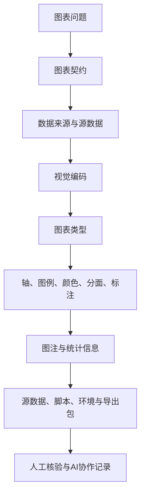

# 第7章 图表契约与科研图表规范

## 本章定位

第7章位于第三篇“图表表达、统计推断与基础建模”的开头。第6章已经讲过长表、宽表、分组汇总和探索性可视化，本章训练学生说明图表为什么这样画、图中能支持什么、图外不能推断什么。第8章会进入抽样误差、置信区间和组间比较，因此本章只介绍统计信息在图表中的呈现要求，不展开检验方法选择。

在 36 学时课程中，本章对应“科研图表规范与SCI图表表达”。课程大纲同时要求 AI 可辅助图形脚本优化和图注润色，但学生必须承担方法选择、代码正确性、图表解释和医学边界判断。本章正文围绕这个边界展开。

| 前置能力 | 本章任务 | 后续承接 |
| --- | --- | --- |
| 能读取和清洗数据表 | 写图表契约，确认数据来源和变量角色 | 第8章组间比较 |
| 能做分组汇总和基础图表 | 检查轴、图例、颜色、分面和图注 | 第9-10章回归和分类模型 |
| 能记录 AI 协作过程 | 用 AI 辅助改图、排错和润色图注 | 综合项目报告与图表审阅 |
| 知道组学数据有高维特征 | 识别热图、PCA、UMAP、火山图等图表的解释边界 | 第11-15章高维和单细胞章节 |

## 学习目标

1. 学生能写出一张正式图表的图表契约，说明核心问题、数据来源、样本说明、视觉编码、统计信息、图注要点和导出要求。
2. 学生能检查坐标轴、图例、颜色、分面和标注是否完整、一致、可读，并说明修改理由。
3. 学生能根据变量类型和分析问题选择常见医药数据图表，并说明图表能支持和不能支持的解释。
4. 学生能写出不越界的图注，区分观察结果、统计信息、医学解释和仍需验证内容。
5. 学生能整理图表源数据、绘图脚本、正式图片、环境信息、图表契约和 AI 协作记录，形成可复现导出包。

## 阅读指南

本章可按三个问题阅读。第一，图在回答什么问题？这对应 7.1。第二，图中每个视觉元素是否能被读者理解和复核？这对应 7.2 和 7.3。第三，图表能否被重新生成，图注是否限制了解释边界？这对应 7.4 和 7.5。

学习本章时不要只看软件参数。更有效的做法是每看到一张图，就问六个问题：数据从哪里来，x 轴和 y 轴是什么，颜色和图例代表什么，样本量和缺失处理在哪里，统计信息是否写清，图注有没有越界。

## 结构蓝图

| 小节 | 主要问题 | 学习证据 | 解释边界 |
| --- | --- | --- | --- |
| 7.1 | 作图前要写清什么 | 图表契约表 | 契约应在作图前完成 |
| 7.2 | 图中编码是否清楚 | 轴、图例、颜色、分面和标注检查表 | 不用配色替代统计证据 |
| 7.3 | 这类数据该用什么图 | 图表类型选择表 | 探索性图只支持观察性描述 |
| 7.4 | 图注和统计信息怎么写 | 图注模板和错误改写 | 不新增 P 值、样本量或医学结论 |
| 7.5 | 图能否重画和复核 | 导出包清单 | 截图或最终图片不足以支持复核 |

## 主张-证据-边界

| 本章主张 | 证据来源 | 可写到什么程度 | 边界 |
| --- | --- | --- | --- |
| 图表应先服务问题，再服务美观 | 本章大纲、图表规范 | 每张正式图先写图表契约，只回答一个主要问题 | 多 panel 图可以存在，但 panel 要有分工 |
| 视觉编码必须能被读者复核 | 图表规范、术语表、ISLR 作图示例 | x、y、颜色、形状、大小、分面和图例应说明含义 | 不用配色替代统计证据 |
| 常见医药图表各有解释边界 | 图表规范、课程大纲、组学素材索引 | 箱线图、散点图、ROC、PCA、热图、火山图和 UMAP 都需说明适用问题和风险 | 图形模式只支持观察性描述；因果、机制或临床建议需补独立证据 |
| 图注应独立说明对象、编码、样本和统计信息 | 图表规范、academic-chinese-style 图注规则 | 图注可说明观察结果和方法来源 | 不新增样本量、P 值、临床意义或机制解释 |
| 可复现图表需要导出包 | 图表规范、ISLR 图形导出片段、课程大纲 | 保存图像、源数据、脚本、环境、契约和 AI 协作记录 | 截图或最终图片不足以支持复核 |

## 逻辑压力测试

| 压力问题 | 本章处理 |
| --- | --- |
| 图看起来很清楚，还需要图表契约吗？ | 需要。契约记录数据来源、视觉编码、统计信息和解释边界。 |
| 两组箱线图看起来不同，能否写“药物有效”？ | 不能。本章只允许写分布观察；效应判断要到第8章结合统计检验、效应量和医学背景。 |
| AI 生成的图注语言很好，能否直接使用？ | 需先核验。检查图注是否新增未提供的样本量、P 值、临床解释、机制结论或文献判断。 |
| 只保存 PNG 是否足够？ | 不足以复核。正式图表应保存源数据、脚本、图片、环境信息和图表契约，便于重画和审阅。 |

## 核心概念速查

| 概念 | 本章解释 | 常见混淆 | 本章用法 |
| --- | --- | --- | --- |
| 图表契约 | 作图前写清问题、数据、编码、统计、图注和导出要求的记录 | 画完后补说明 | 正式作图前填写 |
| 图表问题 | 一张图要回答的单一问题 | 把研究结论写成图表目标 | 用一句话限定图的证据角色 |
| 视觉编码 | 用位置、颜色、形状、大小、线型、分面等映射变量 | 只理解成美化 | 解释变量如何进入图 |
| 图例 | 解释颜色、线型、点型或符号含义 | 图例与图中编码不一致 | 让读者不用猜编码 |
| 图注 | 说明图中对象、编码、样本、统计和边界的文字 | 只重复标题 | 让图能独立被读懂 |
| 误差线 | 展示 SD、SE 或 CI 等不确定性信息的线段 | 不说明含义 | 必须写清误差线代表什么 |
| 源数据 | 生成图所需的最小数据表 | 原始数据或最终图片 | 保存到导出包，便于重画 |
| 导出包 | 图片、脚本、源数据、环境、契约和协作记录的组合 | 只保存截图 | 综合项目必备交付 |

## 章节总览图



## 7.1 图表问题、数据来源与视觉编码

图表问题是作图前的一句话任务。它回答“这张图想让读者看见什么”。例如，“比较 control 与 treatment 两组 ALT 水平的分布”是一个图表问题；“证明药物有效”已经包含统计和医学结论，不适合作为图表问题。

图表问题要比研究问题更窄。一项研究可能关心疗效、毒性和机制，但一张图通常只承担一个主要判断。若把分布、相关、模型性能和机制示意都塞进同一张图，学生很难说明每个视觉元素服务什么证据。

| 不合格问题 | 更合格的图表问题 | 原因 |
| --- | --- | --- |
| 说明药物很好 | 展示两组 ALT 水平的分布 | 去掉未验证的疗效判断 |
| 看看数据怎么样 | 检查 ALT、AST 是否存在极端值和缺失 | 指向明确检查任务 |
| 展示模型很准确 | 展示测试集不同阈值下灵敏度和特异度变化 | 说明评价对象和数据范围 |
| 分析单细胞类型 | 展示 UMAP 上聚类编号与 marker 表达模式 | 避免直接把聚类写成细胞类型 |

数据来源是图表契约的第二个入口。正式图不能只写“来自数据表”。至少要说明文件名、表名、字段名、处理脚本和缺失处理。第5章已经讲过原始数据和分析表的区别，本章默认使用分析表作图，并要求保留能重画图的最小源数据。

```text
示例：图表契约中的数据来源写法

数据来源：outputs/项目A/analysis_table.csv
作图字段：sample_id、group、ALT、AST、visit
处理脚本：scripts/01_prepare_analysis_table.py
缺失处理：ALT 缺失样本不进入 ALT 分布图；删除前后 n 需记录
边界：该图只展示分布，不判断治疗效果
```

视觉编码（visual encoding）是把变量映射到图中元素的规则。位置通常最适合表达数值大小，颜色适合表达少量分组，形状可辅助区分分组，大小适合表达数量或权重，分面适合把同一图表按条件拆开比较。编码数量要受控，初学者应优先使用少量清楚编码。

| 变量角色 | 常见视觉编码 | 检查问题 |
| --- | --- | --- |
| 连续变量 | y 轴、x 轴、颜色深浅、点大小 | 单位是否写清，尺度是否合适 |
| 分类变量 | x 轴、颜色、形状、分面 | 类别顺序是否合理，颜色是否稳定 |
| 时间变量 | x 轴、线段、分面 | 时间单位和间隔是否清楚 |
| 样本或个体 | 点、线、透明度 | 是否会暴露隐私或造成过度拥挤 |
| 统计结果 | 误差线、区间、阈值线、注释 | 含义和计算方法是否说明 |

正式图表在作图前应填写图表契约。契约用于防止先画图、后补解释，也用于检查问题、数据、编码和边界是否匹配。

| 字段 | 写法 |
| --- | --- |
| 核心问题 | 这张图只回答一个主要问题 |
| 目标读者 | 本科生、研究生、教师或项目评阅者 |
| 图表类型 | 直方图、箱线图、散点图、ROC、热图、UMAP 等 |
| 数据来源 | 文件名、表名、字段名、处理脚本 |
| 样本说明 | n、分组变量、缺失处理、重复定义 |
| 视觉编码 | x、y、颜色、形状、大小、分面 |
| 统计信息 | 汇总指标、检验方法、校正方式、区间或误差线含义 |
| 图注要点 | 变量、单位、缩写、统计符号和解释边界 |
| 导出包 | 图片、源数据、脚本、环境信息和契约文件 |
| 风险 | 可能误读的地方，以及正文如何限制解释 |

### 课堂小练习：先写契约再画图

给定一张包含 `sample_id`、`group`、`ALT`、`AST`、`response` 的教学表。请先写出一张 ALT 箱线图的图表契约，再决定是否需要叠加散点。

| 契约字段 | 示例答案 |
| --- | --- |
| 核心问题 | 比较不同组 ALT 水平的分布 |
| 图表类型 | 箱线图叠加单个样本点 |
| 视觉编码 | x 轴为 group，y 轴为 ALT，点表示样本 |
| 样本说明 | 每组 n 和 ALT 缺失处理需由分析表确认 |
| 边界 | 只展示分布，组间效应需结合第8章统计检验 |

## 7.2 坐标轴、图例、颜色、分面与标注

坐标轴是读者理解图表的第一入口。轴标题至少要包含变量名和单位；必要时说明是否做了转换。若 y 轴写成“value”，读者无法判断它是浓度、表达量、评分还是比例。ISLR 的 R 作图材料把 `xlab` 和 `ylab` 放在基础作图示例中，这一点在医药图表中更关键。

坐标轴还会改变读者判断。截断 y 轴、使用对数尺度、反转坐标、调整直方图 bin 宽度，都会改变图形印象。这些操作并非都错误，但必须在图表契约、图注或代码中说明。

| 轴检查项 | 通过标准 | 需修改例子 |
| --- | --- | --- |
| 变量名 | 能回到数据字典字段 | `value`、`score1` 未解释 |
| 单位 | 数值变量有单位或说明无单位 | ALT 未写 U/L |
| 尺度 | 原始尺度、log 尺度或标准化尺度明确 | 热图颜色未说明 z-score |
| 范围 | 截断、放大或固定范围有理由 | y 轴从 30 开始但未说明 |
| 类别顺序 | 分组顺序符合课程任务 | control 与 treatment 顺序混乱 |

图例用于解释颜色、线型、点型或符号。若颜色表示分组，图例必须与图中颜色一致；若多图组合中同一组反复出现，应保持同一颜色。术语表中的“配色词汇表”就是为这种跨图一致性准备的。

颜色承担区分和强调，不应承担全部解释。二分类变量可优先使用蓝/橙或灰/蓝，避免红绿直接对照。连续变量应使用单调色带，并标明数值范围。显著和不显著可以用颜色区分，但不能把不显著结果隐藏掉。

| 场景 | 推荐做法 | 常见风险 |
| --- | --- | --- |
| 两组比较 | 用稳定的两色方案，图例写清组名 | 红绿对照不利于辨认 |
| 多组类别 | 建立配色词汇表，章节内一致 | 同一组在不同图中换颜色 |
| 连续数值 | 单调色带，标明范围 | 彩虹色带造成等级误读 |
| 高维热图 | 说明颜色代表原始值、标准化值还是 z-score | 只写“高低表达”但不说明尺度 |
| 显著性标注 | 说明阈值和校正方式 | 只突出显著点，隐藏其他点 |

分面适合展示同一变量在不同条件下的模式。它要求每个小图块使用同一套轴和编码，否则读者很难比较。panel 之间应有明确分工，不应重复展示同一信息。

标注可以帮助读者找到重点，但标注越多越容易遮挡数据。基因名、异常点、阈值线、统计符号都属于标注。标注规则要写清，例如“仅标注 adjusted P value 小于阈值且 log2FoldChange 超过阈值的基因”。没有规则的挑选容易变成选择性呈现。

```r
# R 基础图形：教学用示例，不代表真实医学数据
plot(
  x = analysis_table$group,
  y = analysis_table$ALT,
  xlab = "Group",
  ylab = "ALT (U/L)",
  main = "ALT distribution by group"
)
```

```python
# Python/matplotlib：教学用示例，不代表真实医学数据
import matplotlib.pyplot as plt

fig, ax = plt.subplots(figsize=(6, 4))
ax.scatter(analysis_table["age"], analysis_table["ALT"])
ax.set_xlabel("Age (years)")
ax.set_ylabel("ALT (U/L)")
ax.set_title("ALT by age")
fig.tight_layout()
fig.savefig("fig01_alt_by_age.png", dpi=300)
```

### 图表审阅小表

| 项目 | 学生自查问题 | 处理 |
| --- | --- | --- |
| 轴 | 变量和单位是否完整 | 缺单位则回查数据字典 |
| 图例 | 图例是否解释所有颜色和符号 | 缺图例或不一致则重画 |
| 颜色 | 是否适合类别数量和读者识别 | 颜色过多时改分面或排序 |
| 分面 | 每个 panel 是否回答同一类问题 | 混合问题则拆图 |
| 标注 | 标注是否有规则 | 无规则则写规则或删除标注 |

## 7.3 常见医药数据图表类型

医药数据图表类型应由问题、变量和解释边界共同决定。连续变量分布可用直方图、箱线图或小提琴图；两个连续变量关系可用散点图；模型分类结果可用混淆矩阵或 ROC；高维表达矩阵常用 PCA、聚类热图、火山图和 UMAP 等图表。图表类型选错，后续图注再流畅也很难补救。

第6章已经讲过探索性图表，本节更强调“正式图表如何选择和说明”。同一数据可以画多种图，但每张图的证据角色不同。直方图看分布，箱线图看分组分布，散点图看两个变量共同变化，热图看矩阵模式，ROC 看阈值变化下的区分能力。

| 图表 | 适用问题 | 必备标注 | 不可越界解释 |
| --- | --- | --- | --- |
| 数据字典表 | 变量含义、单位、类型和取值范围 | 变量名、中文名、类型、单位、缺失含义 | 不能靠列名猜医学含义 |
| 缺失值图 | 哪些变量或样本缺失较多 | 缺失比例、变量排序、样本范围 | 不能把缺失当随机缺失 |
| 直方图 | 连续变量分布 | 变量单位、bin 宽度或数量、n | bin 设置会影响读者判断 |
| 箱线图 | 分组分布差异 | 分组 n、箱线含义、异常点定义 | 不能只看中位数 |
| 小提琴图 | 分组分布形态 | 密度尺度、分组 n、叠加点或箱线 | 小样本下形态可能误导 |
| 散点图 | 两个连续变量关系 | 轴单位、相关方法或模型线说明 | 相关不能写成因果 |
| 误差线图 | 展示均值和不确定性 | 误差线是 SD、SE 还是 CI | 不说明误差线含义不可用 |
| 混淆矩阵 | 分类模型错误类型 | 行列含义、阈值、样本数量 | 不能只报告准确率 |
| ROC 曲线 | 阈值变化下的区分能力 | AUC、阳性定义、数据集范围 | 不能直接写成临床可用阈值 |
| PCA 图 | 高维样本主要变化 | PC 解释比例、输入矩阵、标准化方法 | 不能证明分组差异 |
| 聚类热图 | 样本或特征模式 | 距离、聚类方法、标准化尺度、颜色含义 | 不能把聚类写成已知类别 |
| 火山图 | 差异大小和统计显著性 | log2FoldChange、padj 阈值、标签规则 | 不能挑单个基因讲机制 |
| UMAP | 单细胞低维结构 | 输入对象、降维参数、颜色分组、细胞数 | 不能把距离当真实生物距离 |

### 从变量到图表

| 变量组合 | 可选图表 | 课堂判断 |
| --- | --- | --- |
| 一个连续变量 | 直方图、密度图、箱线图 | 先看分布和异常观察 |
| 一个连续变量 + 一个分组变量 | 箱线图、点图、均值区间图 | 分组 n 必须可见或可追踪 |
| 两个连续变量 | 散点图、相关图 | 只写关系，不写导致 |
| 一个分类结局 + 预测结果 | 混淆矩阵、ROC | 写清阈值和阳性定义 |
| 样本 x 基因矩阵 | 热图、PCA | 写清标准化、距离和输入矩阵 |
| 单细胞对象 | UMAP、marker 表达图 | 写清细胞数、参数和注释依据 |

AIDD 的 ggplot2 素材提醒我们，表达数据可视化前要确认数据结构。基因在行还是列、样本和条件如何记录、表达值是否为数值格式，都会影响后续图表。ggplot2 的流程通常需要把数据整理成长表，再把变量映射到 x、y、颜色或分面。

```r
# ggplot2：教学用结构示例，不代表真实表达结论
library(tidyverse)

expr_long <- expr_table |>
  pivot_longer(
    cols = starts_with("sample_"),
    names_to = "sample_id",
    values_to = "expression"
  ) |>
  left_join(metadata, by = "sample_id")

ggplot(expr_long, aes(x = condition, y = expression, color = condition)) +
  geom_boxplot(outlier.shape = NA) +
  geom_jitter(width = 0.15, alpha = 0.6) +
  labs(x = "Condition", y = "Expression value") +
  theme_classic()
```

这段代码只说明流程：整理成长表，连接样本信息，映射分组和表达值，再画箱线图和散点。它不能支持任何具体基因、疾病或治疗结论。若用于真实组学图表，还要补充输入矩阵、标准化方法、样本来源、阈值和统计方法。

## 7.4 图注写作与统计信息呈现

图注的作用是让读者不回正文也能读懂图。合格图注至少说明图中对象、视觉编码、样本或观测单位、统计信息、缩写和解释边界。图注需要提供标题之外的信息，并限制结论范围。

图注应按“图身份—视觉编码—样本—统计—缩写—边界”的顺序写。这个顺序适合初学者，也适合 AI 图注润色任务。若某一项材料不足，就写 `需补证据` 或 `需人工确认`，不要让 AI 补出看似合理的数字。

| 图注元素 | 要回答的问题 | 示例写法 |
| --- | --- | --- |
| 图身份 | 图展示什么对象和任务 | “不同处理组 ALT 水平的分布” |
| 视觉编码 | 点、颜色、线、分面代表什么 | “每个点代表一个样本，颜色表示分组” |
| 样本 | n、分组、缺失如何处理 | “分组 n 需由分析表确认” |
| 统计 | 检验、误差线、校正或阈值 | “误差线表示 95% 置信区间” |
| 缩写 | 首次出现的缩写是什么意思 | “ALT 为 alanine aminotransferase” |
| 边界 | 图不能支持什么解释 | “该图仅展示分布，不判断临床疗效” |

### 图注模板

```text
图 X. [图身份]。
[视觉编码：点、线、颜色、形状、分面代表什么]。
[样本与数据：观测单位、分组、缺失处理、n；若未确认写需人工确认]。
[统计信息：汇总指标、误差线、检验、校正、阈值；没有统计检验则明确说明]。
[边界：该图能支持什么，不能支持什么]。
```

### 图注改写示例

| 原图注 | 问题 | 教材版改写 |
| --- | --- | --- |
| “药物显著降低 ALT。” | 新增疗效和显著性，未给 P 值、检验和样本量 | “图 X. 不同处理组 ALT 水平的分布。每个点代表一个样本，箱体表示四分位范围，中线表示中位数。该图仅展示分布差异，组间效应需结合预设检验、效应量和样本量解释。” |
| “UMAP 显示三种细胞类型。” | 把聚类或颜色直接写成细胞类型，缺注释依据 | “图 X. 单细胞数据的 UMAP 展示。每个点代表一个细胞，颜色表示聚类编号或注释标签。若颜色为细胞类型，需说明 marker 或参考注释依据；UMAP 中点的距离不等同于真实空间距离。” |
| “火山图显示关键基因。” | “关键”缺标准，易过度解释 | “图 X. 差异分析结果的火山图。x 轴为 log2FoldChange，y 轴为 -log10(adjusted P value)。颜色表示预设阈值下的差异状态，标注基因按图表契约中的规则选择；单个基因的功能解释需补充文献或数据库证据。” |

统计信息要服务图表问题。两组比较至少说明 n、中心统计量、离散程度、检验方法、效应量或置信区间；多组比较要说明总体检验或多重比较策略；相关分析要说明相关方法、样本量和异常值处理；模型图要说明数据划分、阈值和指标定义。

| 场景 | 图中或图注至少说明 | 常见错误 |
| --- | --- | --- |
| 两组比较 | n、中心统计量、离散程度、检验方法、效应量或区间 | 只放星号 |
| 多组比较 | n、总体检验或多重比较策略、校正方式 | 多次两两比较不校正 |
| 相关分析 | 相关方法、样本量、异常值处理 | 把相关写成因果 |
| 回归模型 | 结局、自变量、系数、区间和诊断 | 只展示拟合线 |
| 分类模型 | 阳性定义、训练/测试划分、阈值、混淆矩阵、AUC | 把 AUC 写成临床可用 |
| 高维筛选 | 多重检验校正、阈值、输入矩阵、样本分组 | 用未校正 P 值下结论 |

图注中的动词也要受证据强度限制。图能直接显示的内容可以写“显示”“表明”；图中模式可写“提示”；涉及机制、临床意义或因果时，通常要写“仍需验证”或“需补证据”。不要把“看起来分开”“颜色更深”“点更集中”直接写成机制解释。

## 7.5 图表源数据、脚本与可复现导出

可复现导出包含图片、源数据、绘图脚本、图表契约和环境信息。若图由 AI 协助生成或修改，还要保留关键提示词、AI 输出摘要、人工修改和运行结果。

ISLR 的 R 作图片段展示了一个基础习惯：用 `pdf()` 或 `jpeg()` 打开输出设备，绘图后用 `dev.off()` 结束保存。无论使用 R、Python 还是其他工具，课程要求都相同：不要只依赖屏幕截图，导出的图要能从脚本和源数据重新生成。

| 文件 | 要求 | 推荐命名 |
| --- | --- | --- |
| 图表契约 | 与图片同名，说明问题、数据、编码、统计和风险 | `fig01_alt_boxplot_contract.md` |
| 源数据 | 生成图所需的最小表，不包含无关字段 | `fig01_alt_boxplot_source.csv` |
| 绘图脚本 | 能从源数据重画图，不写死个人临时路径 | `fig01_alt_boxplot.py` 或 `fig01_alt_boxplot.R` |
| 正式图片 | PDF 或 SVG 优先；PNG 预览至少 300 dpi | `fig01_alt_boxplot.svg`、`fig01_alt_boxplot.png` |
| 环境信息 | Python/R 版本和关键包版本 | `fig01_alt_boxplot_session.txt` |
| AI 协作记录 | 提示词、输出摘要、人工核验、修改记录 | `fig01_alt_boxplot_ai_record.md` |

```r
# R 导出示例：教学用最小结构
pdf("fig01_alt_boxplot.pdf", width = 6, height = 4)
boxplot(ALT ~ group, data = fig_source,
        xlab = "Group", ylab = "ALT (U/L)")
dev.off()
```

```python
# Python 导出示例：教学用最小结构
from pathlib import Path
import matplotlib.pyplot as plt

out_dir = Path("outputs/figures")
out_dir.mkdir(parents=True, exist_ok=True)

fig, ax = plt.subplots(figsize=(6, 4))
ax.boxplot([
    fig_source.loc[fig_source["group"] == "control", "ALT"].dropna(),
    fig_source.loc[fig_source["group"] == "treatment", "ALT"].dropna()
])
ax.set_xticklabels(["control", "treatment"])
ax.set_ylabel("ALT (U/L)")
fig.tight_layout()
fig.savefig(out_dir / "fig01_alt_boxplot.png", dpi=300)
fig.savefig(out_dir / "fig01_alt_boxplot.svg")
```

源数据应保存“生成图所需的最小表”。例如 ALT 箱线图只需 `sample_id`、`group`、`ALT` 和用于缺失筛选的必要字段，不应把完整原始临床表全部复制进图表文件夹。这样既便于复核，也减少隐私和无关字段传播。

绘图脚本要避免个人路径。不要写 `C:\Users\某人\Desktop\final_final\data.csv`。课程项目中建议从项目根目录或脚本所在目录构造相对路径，并在运行记录中写清当前工作目录。第2章和第3章已经建立的路径、Git 和 AI 协作记录，在这里会变成图表复现能力。

### 图表导出包最小验收

| 核验项 | 通过标准 |
| --- | --- |
| 能重画 | 重新运行脚本能生成同名图像 |
| 能追溯 | 源数据、脚本、契约和环境信息在同一输出包内 |
| 能解释 | 图注说明变量、编码、样本、统计和边界 |
| 不越界 | 图表说明没有新增样本量、P 值、临床结论或机制解释 |
| AI 透明 | AI 参与代码或图注时，有协作记录和人工核验 |

## 案例任务：为 ALT 分布图制作导出包

本案例使用教学模拟字段，不代表真实医学数据，也不支持任何临床判断。任务目标是让学生练习从契约到导出的完整流程。

| 项目 | 内容 |
| --- | --- |
| 数据背景 | 教学用分析表，字段包括 `sample_id`、`group`、`ALT`、`AST`、`age`、`response` |
| 任务目标 | 为 ALT 分组分布制作箱线图叠加散点 |
| 操作步骤 | 写图表契约；检查 `group` 和 `ALT`；保存源数据；绘图；写图注；导出 SVG/PNG；记录 AI 协作 |
| 交付物 | 契约、源数据、脚本、图像、图注、环境信息、核验清单 |
| 禁止事项 | 不得写“治疗有效”；不得新增 P 值；不得把缺失值改为 0；不得覆盖原始数据 |

### 案例图注草稿

```text
图 7-1. 教学分析表中不同组 ALT 水平的分布。
每个点代表一个样本，箱体表示四分位范围，中线表示中位数。
ALT 缺失记录未进入该图，删除前后样本数需由源数据表确认。
该图仅展示分布形态和可能的组间差异，统计检验、效应量和医学解释需在第8章框架下进一步说明。
```

## 图表建议

| 图表 | 目的 | 必备标注 | 不可越界解释 |
| --- | --- | --- | --- |
| 图表契约流程图 | 展示正式作图流程 | 问题、数据、编码、图注、导出、核验 | 不替代真实图表契约 |
| ALT 箱线图叠加散点 | 说明分组分布图的规范 | 分组 n、ALT 单位、箱线含义、缺失处理 | 不写治疗效果 |
| 散点图 | 说明两个连续变量关系 | 轴单位、点含义、相关方法若使用需说明 | 不写因果 |
| 火山图字段示意表 | 说明高维差异图表字段要求 | log2FoldChange、padj、阈值、标签规则 | 不做基因机制解释 |
| UMAP 审阅清单 | 训练单细胞图表边界 | 点、颜色、参数、细胞数、注释依据 | UMAP 距离不等同于真实空间距离 |

## AI 协作点

| 场景 | 可让 AI 做什么 | 学生必须核验什么 |
| --- | --- | --- |
| 图表契约初稿 | 根据字段生成契约表 | 字段含义、单位、样本量和缺失处理 |
| 绘图代码排错 | 解释报错，给出最小修改 | 代码是否读对文件、列名和分组 |
| 标签和配色优化 | 建议轴标题、图例和颜色 | 是否改变数据含义或隐藏结果 |
| 图注润色 | 改写成通顺中文 | 是否新增 P 值、样本量、临床意义 |
| 图表审阅 | 按清单指出缺口 | 统计前提、医学解释和最终判断 |

### AI 图表代码审阅提示词

```text
目标：
请审阅下面的图表代码，判断是否符合《医药数据处理与可视化》第7章图表契约要求。

上下文：
- 学生背景：刚学完数据清洗、分组汇总和基础可视化。
- 图表任务：[写明图表问题]
- 数据字段：[列出字段和单位]
- 图表代码：[粘贴代码]

约束：
- 不新增样本量、P 值、医学结论或机制解释。
- 不改动原始数据。
- 如果缺少图表契约字段，请列出缺口。

验证：
- 检查 x、y、颜色、图例、单位、图注、导出格式。
- 检查结论是否超过图表能支持的范围。

输出：
用表格输出：问题、影响、修改建议、需人工确认。
```

## 常见误区

| 误区 | 为什么错 | 如何纠正 |
| --- | --- | --- |
| 先画图，再反推问题 | 图表容易变成好看的结果展示，缺少证据角色 | 作图前先写图表契约 |
| 图例和颜色不一致 | 读者会误解分组或条件 | 建立配色词汇表并复查 |
| 误差线不说明含义 | SD、SE、CI 代表不同信息 | 图注写明误差线定义 |
| 只保存 PNG 截图 | 无法复核数据和代码 | 保存源数据、脚本、契约和环境 |
| 把 UMAP 距离当真实距离 | 降维图不能直接代表真实生物空间 | 写清降维参数和解释边界 |
| AI 图注直接使用 | 可能新增不存在的统计或医学结论 | 用图注清单逐项核验 |

## 核验清单

- 已核对图表问题，且每张图只回答一个主要问题。
- 图表契约包含数据来源、样本说明、视觉编码、统计信息和风险。
- x 轴、y 轴、颜色、图例、分面和标注都能被读者理解。
- 变量单位、分组 n、缺失处理和重复定义可追踪。
- 统计检验、误差线、阈值和校正方式在图注或正文中说明。
- 图注区分观察结果、方法来源、允许解释和仍需验证内容。
- 图表源数据、绘图脚本、正式图像、环境信息和契约已一起保存。
- AI 参与代码或图注时，已记录提示词、输出摘要、人工修改和核验结果。

## 知识结构与知识图谱生成提示词

本章已经用 Mermaid 给出准确结构。若需要用 `imagegen` 生成教学展示图，可使用下面提示词。生成图只作为课堂展示，不作为唯一知识来源；若图中文字不清、标签错误或节点缺失，应以本章 Mermaid、表格和清单为准。

```text
请生成一张中文教学知识图谱，主题为“图表契约与科研图表规范”。
画面应包含 7 个清晰节点：图表问题、数据来源、视觉编码、图表类型、图注与统计信息、可复现导出、人工核验与AI协作记录。
用箭头表示流程：图表问题 -> 数据来源 -> 视觉编码 -> 图表类型 -> 图注与统计信息 -> 可复现导出 -> 人工核验。
风格简洁、适合药学本科生课堂使用，不要加入医学结论、P 值、样本量或真实疾病信息。
如果文字无法稳定显示，请只生成无文字结构图，正文用 Mermaid 和表格提供准确内容。
```

## 实验或作业

### 作业：审阅并重做一张图

| 项目 | 要求 |
| --- | --- |
| 输入 | 教师提供的教学分析表和一张存在问题的图 |
| 任务1 | 写出图表契约，标出缺失字段 |
| 任务2 | 修改图表代码，补全轴、图例、单位、颜色和导出格式 |
| 任务3 | 写一版合格图注，标出解释边界 |
| 任务4 | 整理导出包和 AI 协作记录 |
| 提交 | `fig01_contract.md`、`fig01_source.csv`、`fig01_plot.R/py`、`fig01.svg/png`、`fig01_caption.md`、`ai_record.md` |
| 评分点 | 契约完整性、图表规范性、解释克制性、复现能力、AI 核验质量 |

### 禁止事项

- 不改动原始数据。
- 不新增材料未支持的样本量、P 值、临床建议、机制解释或文献结论。
- 不用截图替代正式导出。
- AI 生成内容不得写成人工已验证事实。
- 不用颜色或星号隐藏非显著、缺失或不符合预期的结果。

## 需补证据

| 位置 | 缺口 | 处理方式 |
| --- | --- | --- |
| 正式课堂数据集 | 尚未指定第7章统一案例数据 | 正文使用教学模拟字段，并明确不代表真实医学结论 |
| 全书配色词汇表 | 尚未建立固定色板 | 本章先写原则，后续可在 `references/` 补充 |
| 出版级格式参数 | 未指定目标期刊或出版社模板 | 使用通用 PDF/SVG、300 dpi 和导出包要求 |
| 统计检验细节 | 第8章才展开检验选择 | 本章只写图中统计信息呈现要求 |
| 组学图表实例 | 本章不展开 RNA-seq 或单细胞完整流程 | 只写解释边界和需记录字段 |
