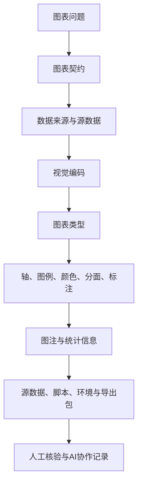

# 第7章 图表契约与科研图表规范

## 本章定位

第7章位于第三篇“图表表达、统计推断与基础建模”的开头。第6章已经讲过长表、宽表、分组汇总和探索性可视化。第8章会进入抽样误差、置信区间、P 值和组间比较。本章处理中间这一步：一张图怎样从“能画出来”变成“能被复核、能写进报告、不会误导读者”。

本章不展开检验方法选择，也不判断真实疗效、机制或临床意义。学生需要学会三件事：作图前写清图表问题和数据来源；作图时检查视觉编码、坐标轴、图例、颜色和标注；导出后保存源数据、脚本、图注、环境信息和 AI 协作记录。

| 前置能力 | 本章任务 | 后续承接 |
| --- | --- | --- |
| 会读取和清洗数据表 | 写图表契约，确认数据来源和变量角色 | 第8章组间比较 |
| 会做分组汇总和探索性图表 | 检查轴、图例、颜色、分面和标注 | 第9章相关与回归 |
| 会记录 AI 协作过程 | 让 AI 辅助改图、排错和润色图注，并人工核验 | 综合项目报告 |
| 知道组学数据有高维矩阵 | 识别热图、PCA、UMAP、火山图的解释边界 | 第11-15章高维和单细胞章节 |

本章所有案例都用于教学演示。ALT、AST、表达值和单细胞代码片段只训练图表规范，不支持真实医学判断。材料不足的位置用 `需补证据` 或 `需人工确认` 标出。

## 学习目标

1. 学生能写出一张正式图表的图表契约，说明图表问题、数据来源、样本说明、视觉编码、统计信息、图注要点和导出要求。
2. 学生能检查坐标轴、图例、颜色、分面和标注是否完整、一致、可读，并能说明修改理由。
3. 学生能根据变量类型和分析问题选择常见医药数据图表，并说明图表能支持和不能支持的解释。
4. 学生能写出不越界的图注，区分观察结果、统计信息、医学解释和仍需验证内容。
5. 学生能整理图表源数据、绘图脚本、正式图片、环境信息、图表契约和 AI 协作记录，形成可复现导出包。

## 阅读指南

读本章时先抓住三个问题。第一，图回答什么问题？这对应 7.1。第二，图中每个视觉元素代表什么？这对应 7.2 和 7.3。第三，图能否重画，图注有没有越界？这对应 7.4 和 7.5。

每看到一张图，都先问六件事：数据从哪里来，x 轴和 y 轴是什么，颜色和图例代表什么，样本量和缺失处理在哪里，统计信息是否写清，图注有没有超出图中证据。

## 结构蓝图

| 小节 | 主要问题 | 学习证据 | 解释边界 |
| --- | --- | --- | --- |
| 7.1 | 作图前要写清什么 | 图表契约表、源数据说明 | 图表契约应在作图前完成 |
| 7.2 | 图中编码是否清楚 | 坐标轴、图例、颜色、分面和标注检查表 | 配色和标注不能替代统计证据 |
| 7.3 | 这类数据该用什么图 | 图表类型选择表、表达矩阵案例 | 探索性图只支持观察性描述 |
| 7.4 | 图注和统计信息怎么写 | 图注改写表、统计信息最低要求 | 不新增 P 值、样本量或医学结论 |
| 7.5 | 图能否重画和复核 | 导出包清单、AI 协作记录 | 截图或最终图片不足以支持复核 |

## 主张-证据-边界

| 本章主张 | 证据来源 | 可写到什么程度 | 边界 |
| --- | --- | --- | --- |
| 图表先服务问题，再处理视觉呈现 | 本章大纲、图表规范 | 每张正式图先写图表契约，只回答一个主要问题 | 多 panel 图可以存在，但每个 panel 要有明确分工 |
| 视觉编码必须能被读者复核 | 图表规范、术语表、ISLR 作图示例 | x、y、颜色、形状、大小、分面和图例应说明含义 | 颜色、大小和标签不能替代统计证据 |
| 医药数据图表有解释边界 | 图表规范、课程大纲、组学素材索引 | 箱线图、散点图、ROC、PCA、热图、火山图和 UMAP 都需说明适用问题和风险 | 图形模式只支持观察性描述；因果、机制或临床建议需补独立证据 |
| 图注应独立说明对象、编码、样本和统计信息 | 图表规范、academic-chinese-style 图注规则 | 图注可说明观察结果和方法来源 | 不新增样本量、P 值、临床意义或机制解释 |
| 可复现图表需要导出包 | 图表规范、ISLR 图形导出片段、课程大纲 | 保存图像、源数据、脚本、环境、契约和 AI 协作记录 | 截图或最终图片不足以支持复核 |

## 核心概念速查

| 概念 | 本章解释 | 常见混淆 | 本章用法 |
| --- | --- | --- | --- |
| 图表契约 | 作图前写清问题、数据、编码、统计、图注和导出要求的记录 | 画完图后补一句说明 | 正式作图前填写 |
| 图表问题 | 一张图要回答的单一问题 | 把研究结论写成图表目标 | 用一句话限定图的证据角色 |
| 视觉编码 | 用位置、颜色、形状、大小、线型、分面等映射变量 | 只理解成美化 | 解释变量如何进入图 |
| 图例 | 解释颜色、线型、点型或符号含义 | 图例与图中编码不一致 | 让读者不用猜颜色和符号 |
| 图注 | 说明图中对象、编码、样本、统计和边界的文字 | 只重复标题 | 让图能独立被读懂 |
| 误差线 | 展示 SD、SE 或 CI 等不确定性信息的线段 | 不说明误差线含义 | 必须写清误差线代表什么 |
| 源数据 | 生成图所需的最小数据表 | 原始数据或最终图片 | 保存到导出包，便于重画 |
| 导出包 | 图片、脚本、源数据、环境、契约和协作记录的组合 | 只保存截图 | 综合项目必备交付 |

## 章节总览图



## 7.1 图表问题、数据来源与视觉编码

图表问题是作图前的一句话任务。它回答“这张图让读者看见什么”。例如，“比较 control 与 treatment 两组 ALT 水平的分布”是图表问题；“证明药物有效”已经包含疗效判断，不适合作为图表问题。

图表问题要比研究问题窄。一项研究可能关心疗效、毒性和机制。一张图通常只承担一个主要判断。若把分布、相关、模型性能和机制示意放进同一张图，学生很难说明每个视觉元素服务哪条证据。

| 不合格写法 | 可用的图表问题 | 为什么这样改 |
| --- | --- | --- |
| 说明药物很好 | 展示两组 ALT 水平的分布 | 去掉未验证的疗效判断 |
| 看看数据怎么样 | 检查 ALT、AST 是否存在极端值和缺失 | 指向明确检查任务 |
| 展示模型很准确 | 展示测试集不同阈值下灵敏度和特异度变化 | 说明评价对象和数据范围 |
| 分析单细胞类型 | 展示 UMAP 上聚类编号与 marker 表达模式 | 避免直接把聚类写成细胞类型 |

数据来源是图表契约的第二项。正式图不能只写“来自数据表”。至少要说明文件名、表名、字段名、处理脚本和缺失处理。第5章已经讲过原始数据和分析表的区别。本章默认使用分析表作图，并要求保留能重画图的最小源数据。

| 数据层级 | 含义 | 可否直接作图 | 本章要求 |
| --- | --- | --- | --- |
| 原始数据 | 未经课程分析流程修改的文件 | 通常不直接作图 | 只读保存，不覆盖 |
| 分析表 | 清洗、筛选、整形后用于统计和作图的数据表 | 可以作图 | 记录生成脚本和清洗规则 |
| 图表源数据 | 生成某一张图所需的最小表 | 正式图应保存 | 与图和脚本一起导出 |

视觉编码（visual encoding）是把变量映射到图中元素的规则。位置通常用于表达数值大小，颜色用于表达少量分组，形状可辅助区分类别，大小可表达数量或权重，分面用于按同一规则拆开比较。编码数量要受控。初学者先保证 x、y、颜色和图例清楚，再考虑更复杂的标注。

| 变量角色 | 常见视觉编码 | 检查问题 |
| --- | --- | --- |
| 连续变量 | y 轴、x 轴、颜色深浅、点大小 | 单位是否写清，尺度是否合适 |
| 分类变量 | x 轴、颜色、形状、分面 | 类别顺序是否合理，颜色是否稳定 |
| 时间变量 | x 轴、线段、分面 | 时间单位和间隔是否清楚 |
| 样本或个体 | 点、线、透明度 | 是否会暴露隐私或造成过度拥挤 |
| 统计结果 | 误差线、区间、阈值线、注释 | 含义和计算方法是否说明 |

### 案例7-1：ALT 分布图从问题到契约

下面是一张教学模拟分析表。字段不来自真实患者，也不支持治疗效果判断。它只用于练习图表契约和可复现导出。

| sample_id | group | ALT | AST | age |
| --- | --- | ---: | ---: | ---: |
| S01 | control | 31 | 28 | 21 |
| S02 | control | 44 | 35 | 22 |
| S03 | control | 38 | 30 | 20 |
| S04 | control | 需人工确认 | 33 | 24 |
| S05 | control | 52 | 42 | 23 |
| S06 | control | 47 | 37 | 22 |
| S07 | treatment | 36 | 32 | 21 |
| S08 | treatment | 58 | 45 | 25 |
| S09 | treatment | 62 | 50 | 24 |
| S10 | treatment | 49 | 41 | 23 |
| S11 | treatment | 71 | 55 | 26 |
| S12 | treatment | 需人工确认 | 46 | 22 |

先写图表问题：

```text
展示 control 与 treatment 两组 ALT 水平的分布，并记录 ALT 缺失样本是否进入作图。
```

对应的图表契约如下。

| 契约字段 | 示例填写 |
| --- | --- |
| 核心问题 | 两组 ALT 水平的分布是否存在可观察差异 |
| 图表类型 | 箱线图叠加单个样本点 |
| 数据来源 | 教学模拟分析表，字段为 `sample_id`、`group`、`ALT` |
| 样本说明 | ALT 缺失样本不进入本图；删除前后 n 需记录 |
| 视觉编码 | x 轴为 `group`，y 轴为 `ALT`，点表示样本 |
| 统计信息 | 本图只展示分布；不添加 P 值 |
| 图注要点 | 说明点、箱体、中线、缺失处理和解释边界 |
| 导出包 | PNG/SVG、源数据 CSV、绘图脚本、契约和环境信息 |
| 风险 | 读者可能把两组分布差异写成治疗效果，需要在图注中限制 |

下面的 Python 代码可直接运行。它会生成图表源数据、PNG 和 SVG。代码使用 `tick_labels`，可避免新版 matplotlib 对旧参数名的提示。

```python
from pathlib import Path

import matplotlib.pyplot as plt
import numpy as np
import pandas as pd

out_dir = Path("outputs/chapter7_case_alt")
out_dir.mkdir(parents=True, exist_ok=True)

analysis_table = pd.DataFrame(
    {
        "sample_id": [f"S{i:02d}" for i in range(1, 13)],
        "group": ["control"] * 6 + ["treatment"] * 6,
        "ALT": [31, 44, 38, None, 52, 47, 36, 58, 62, 49, 71, None],
        "AST": [28, 35, 30, 33, 42, 37, 32, 45, 50, 41, 55, 46],
        "age": [21, 22, 20, 24, 23, 22, 21, 25, 24, 23, 26, 22],
    }
)

fig_source = analysis_table[["sample_id", "group", "ALT"]].dropna()
fig_source.to_csv(out_dir / "fig7_1_alt_boxplot_source.csv", index=False)

groups = [
    fig_source.loc[fig_source["group"] == "control", "ALT"],
    fig_source.loc[fig_source["group"] == "treatment", "ALT"],
]

fig, ax = plt.subplots(figsize=(5, 3.5))
ax.boxplot(groups, tick_labels=["control", "treatment"], showfliers=False)

colors = {"control": "#4C78A8", "treatment": "#F58518"}
positions = {"control": 1, "treatment": 2}
rng = np.random.default_rng(7)

for group_name in ["control", "treatment"]:
    values = fig_source.loc[fig_source["group"] == group_name, "ALT"].to_numpy()
    x = np.full(len(values), positions[group_name]) + rng.normal(0, 0.035, len(values))
    ax.scatter(
        x,
        values,
        color=colors[group_name],
        edgecolor="black",
        linewidth=0.4,
        zorder=3,
    )

ax.set_xlabel("Group")
ax.set_ylabel("ALT (U/L)")
ax.set_title("ALT distribution by group")
fig.tight_layout()
fig.savefig(out_dir / "fig7_1_alt_boxplot.png", dpi=300)
fig.savefig(out_dir / "fig7_1_alt_boxplot.svg")
```

运行后应看到三个文件：

| 文件 | 作用 |
| --- | --- |
| `fig7_1_alt_boxplot_source.csv` | 生成图所需的最小源数据 |
| `fig7_1_alt_boxplot.png` | 课堂预览图 |
| `fig7_1_alt_boxplot.svg` | 可编辑矢量图 |

这张图可以写“教学分析表中两组 ALT 水平的分布”。它不能写“treatment 改善肝功能”或“药物有效”。效应判断需要第8章的统计检验、效应量、样本来源和医学背景。

## 7.2 坐标轴、图例、颜色、分面与标注

坐标轴是读者理解图表的第一检查项。轴标题至少包含变量名和单位。必要时说明尺度是否经过转换。若 y 轴写成 `value`，读者无法判断它是浓度、表达量、评分还是比例。

坐标轴还会影响读者判断。截断 y 轴、使用对数尺度、反转坐标、调整直方图 bin 宽度，都会改变图形外观。这些操作可以使用，但必须在图表契约、图注或代码注释中说明。

| 轴检查项 | 通过标准 | 需修改例子 |
| --- | --- | --- |
| 变量名 | 能回到数据字典字段 | `value`、`score1` 未解释 |
| 单位 | 数值变量有单位，或说明无单位 | ALT 未写 U/L |
| 尺度 | 原始尺度、log 尺度或标准化尺度明确 | 热图颜色未说明 z-score |
| 范围 | 截断、放大或固定范围有理由 | y 轴从 30 开始但未说明 |
| 类别顺序 | 分组顺序符合课程任务 | control 与 treatment 顺序混乱 |

图例用于解释颜色、线型、点型或符号。若颜色表示分组，图例必须与图中颜色一致。若同一组在多张图中反复出现，应保持同一颜色。术语表中的“配色词汇表”就是为这种跨图一致性准备的。

颜色承担区分和强调，不承担统计判断。二分类变量可优先使用蓝/橙或灰/蓝，避免红绿直接对照。连续变量应使用单调色带，并标明数值范围。显著和不显著可以用颜色区分，但不能把不显著结果隐藏掉。

| 场景 | 推荐做法 | 常见风险 |
| --- | --- | --- |
| 两组比较 | 用稳定的两色方案，图例写清组名 | 红绿对照不利于辨认 |
| 多组类别 | 建立配色词汇表，章节内一致 | 同一组在不同图中换颜色 |
| 连续数值 | 单调色带，标明范围 | 彩虹色带造成等级误读 |
| 高维热图 | 说明颜色代表原始值、标准化值还是 z-score | 只写“高低表达”，不说明尺度 |
| 显著性标注 | 说明阈值和校正方式 | 只突出显著点，隐藏其他点 |

分面用于同一问题在不同条件下比较。每个分面应使用同一套轴和编码。若一个 panel 展示 ALT，另一个 panel 展示 ROC，读者很难按同一规则比较，应拆成两张图。

标注包括基因名、异常点、阈值线、统计符号和重点样本。标注要有规则。例如“仅标注 adjusted P value 小于阈值且 log2FoldChange 超过阈值的基因”。没有规则的挑选容易造成选择性呈现。

### 案例7-2：审阅一段图表代码

下面的代码能画图，但不适合直接交作业。

```python
plt.scatter(analysis_table["age"], analysis_table["ALT"])
plt.savefig("plot.png")
```

主要问题在于图表信息不足。代码短只是表面现象。

| 缺口 | 影响 | 修改方向 |
| --- | --- | --- |
| 没有轴标题 | 读者不知道 x、y 的含义和单位 | 添加 `Age (years)` 和 `ALT (U/L)` |
| 没有图表问题 | 图只是一组点，没有说明任务 | 写明“展示年龄与 ALT 的共同变化” |
| 没有缺失处理 | ALT 缺失是否进入作图不清楚 | 作图前 `dropna()` 并记录 n |
| 没有导出参数 | 位图分辨率不清楚 | 设置 `dpi=300`，另存 SVG |
| 没有图表源数据 | 无法复核点是否来自同一数据表 | 保存最小源数据 |

修改后的最小代码如下。

```python
from pathlib import Path

import matplotlib.pyplot as plt

out_dir = Path("outputs/chapter7_case_alt_age")
out_dir.mkdir(parents=True, exist_ok=True)

fig_source = analysis_table[["sample_id", "age", "ALT"]].dropna()
fig_source.to_csv(out_dir / "fig7_2_alt_age_source.csv", index=False)

fig, ax = plt.subplots(figsize=(5, 3.5))
ax.scatter(fig_source["age"], fig_source["ALT"], color="#4C78A8", edgecolor="black")
ax.set_xlabel("Age (years)")
ax.set_ylabel("ALT (U/L)")
ax.set_title("ALT by age")
fig.tight_layout()
fig.savefig(out_dir / "fig7_2_alt_age.png", dpi=300)
fig.savefig(out_dir / "fig7_2_alt_age.svg")
```

这张散点图只支持一句谨慎说明：在这张教学表中，点展示了年龄和 ALT 的共同分布。它不能支持“年龄导致 ALT 升高”。若要判断相关或回归关系，需要第9章的方法。

## 7.3 常见医药数据图表类型

图表类型由问题、变量和解释边界共同决定。连续变量分布可用直方图、箱线图或小提琴图。两个连续变量关系可用散点图。分类模型结果可用混淆矩阵或 ROC。高维表达矩阵常用 PCA、聚类热图、火山图和 UMAP 等图表。

同一数据可以画多种图，但每张图的证据角色不同。直方图看分布，箱线图看分组分布，散点图看两个变量共同变化，热图看矩阵模式，ROC 看阈值变化下的区分能力。

| 图表 | 适用问题 | 必备标注 | 不可越界解释 |
| --- | --- | --- | --- |
| 数据字典表 | 变量含义、单位、类型和取值范围 | 变量名、中文名、类型、单位、缺失含义 | 不能靠列名猜医学含义 |
| 缺失值图 | 哪些变量或样本缺失较多 | 缺失比例、变量排序、样本范围 | 不能把缺失当随机缺失 |
| 直方图 | 连续变量分布 | 变量单位、bin 宽度或数量、n | bin 设置会影响读者判断 |
| 箱线图 | 分组分布差异 | 分组 n、箱线含义、异常点定义 | 不能只看中位数 |
| 小提琴图 | 分组分布形态 | 密度尺度、分组 n、叠加点或箱线 | 小样本下形态可能误导 |
| 散点图 | 两个连续变量关系 | 轴单位、相关方法或模型线说明 | 相关不能写成因果 |
| 误差线图 | 展示均值和不确定性 | 误差线是 SD、SE 还是 CI | 不说明误差线含义不可用 |
| 混淆矩阵 | 分类模型错误类型 | 行列含义、阈值、样本数量 | 不能只报告准确率 |
| ROC 曲线 | 阈值变化下的区分能力 | AUC、阳性定义、数据集范围 | 不能直接写成临床可用阈值 |
| PCA 图 | 高维样本主要变化 | PC 解释比例、输入矩阵、标准化方法 | 不能证明分组差异 |
| 聚类热图 | 样本或特征模式 | 距离、聚类方法、标准化尺度、颜色含义 | 不能把聚类写成已知类别 |
| 火山图 | 差异大小和统计显著性 | log2FoldChange、padj 阈值、标签规则 | 不能挑单个基因讲机制 |
| UMAP | 单细胞低维结构 | 输入对象、降维参数、颜色分组、细胞数 | UMAP 距离不等同于真实生物距离 |

### 从变量组合选择图表

| 变量组合 | 可选图表 | 课堂判断 |
| --- | --- | --- |
| 一个连续变量 | 直方图、密度图、箱线图 | 先看分布、缺失和异常观察 |
| 一个连续变量 + 一个分组变量 | 箱线图、点图、均值区间图 | 分组 n 必须可见或可追踪 |
| 两个连续变量 | 散点图、相关图 | 只写共同变化，不写导致 |
| 一个分类结局 + 预测结果 | 混淆矩阵、ROC | 写清阈值和阳性定义 |
| 样本 x 基因矩阵 | 热图、PCA | 写清标准化、距离和输入矩阵 |
| 单细胞对象 | UMAP、marker 表达图 | 写清细胞数、参数和注释依据 |

### 案例7-3：表达矩阵重塑后再作图

AIDD ggplot2 素材展示了一个常见流程：表达数据通常先以矩阵或数据框保存，行是基因，列是样本；另有样本分组信息；作图前需要整理成长表，再映射 x、y、颜色和图例。原素材中出现了 FPK、FPKM、基因名和数值转写不一致的问题，本章只保留数据结构和作图流程。具体基因名、样本来源和表达值需回查原始文件。

下面使用教学模拟表达矩阵。`GENE_A` 到 `GENE_D` 不是实际基因名。

| gene | N01 | N02 | N03 | T01 | T02 | T03 |
| --- | ---: | ---: | ---: | ---: | ---: | ---: |
| GENE_A | 8.1 | 7.8 | 8.4 | 10.2 | 11.0 | 9.8 |
| GENE_B | 3.2 | 3.5 | 3.1 | 2.9 | 2.7 | 3.0 |
| GENE_C | 0.5 | 0.4 | 0.6 | 1.4 | 1.2 | 1.6 |
| GENE_D | 6.3 | 6.8 | 6.1 | 5.7 | 5.5 | 5.9 |

样本分组表如下。

| sample_id | condition |
| --- | --- |
| N01 | normal |
| N02 | normal |
| N03 | normal |
| T01 | tumor |
| T02 | tumor |
| T03 | tumor |

Python 可运行版本如下。它会把矩阵转成长表，保存图表源数据，并画出每个基因在两组中的平均表达。该图只训练“表达矩阵怎样进入图表”。它不支持任何癌症机制解释。

```python
from pathlib import Path

import matplotlib.pyplot as plt
import numpy as np
import pandas as pd

out_dir = Path("outputs/chapter7_case_expression")
out_dir.mkdir(parents=True, exist_ok=True)

expr_table = pd.DataFrame(
    {
        "gene": ["GENE_A", "GENE_B", "GENE_C", "GENE_D"],
        "N01": [8.1, 3.2, 0.5, 6.3],
        "N02": [7.8, 3.5, 0.4, 6.8],
        "N03": [8.4, 3.1, 0.6, 6.1],
        "T01": [10.2, 2.9, 1.4, 5.7],
        "T02": [11.0, 2.7, 1.2, 5.5],
        "T03": [9.8, 3.0, 1.6, 5.9],
    }
)

metadata = pd.DataFrame(
    {
        "sample_id": ["N01", "N02", "N03", "T01", "T02", "T03"],
        "condition": ["normal", "normal", "normal", "tumor", "tumor", "tumor"],
    }
)

expr_long = (
    expr_table.melt(id_vars="gene", var_name="sample_id", value_name="expression")
    .merge(metadata, on="sample_id", how="left")
)
expr_long.to_csv(out_dir / "fig7_3_expression_long_source.csv", index=False)

means = (
    expr_long.groupby(["gene", "condition"])["expression"]
    .mean()
    .unstack()
    .loc[expr_table["gene"]]
)

genes = list(expr_table["gene"])
x = np.arange(len(genes))
width = 0.35

fig, ax = plt.subplots(figsize=(6, 3.5))
ax.bar(x - width / 2, means["normal"], width, label="normal", color="#4C78A8")
ax.bar(x + width / 2, means["tumor"], width, label="tumor", color="#F58518")
ax.set_xticks(x)
ax.set_xticklabels(genes)
ax.set_xlabel("Gene")
ax.set_ylabel("Expression value")
ax.legend(title="Condition")
fig.tight_layout()
fig.savefig(out_dir / "fig7_3_expression_bar.png", dpi=300)
fig.savefig(out_dir / "fig7_3_expression_bar.svg")
```

如果使用 R 和 ggplot2，同一个流程可以写成下面的结构。学生需要把文件路径、列名和分组表改成自己的作业数据。

```r
library(tidyverse)

expr_long <- expr_table |>
  pivot_longer(
    cols = -gene,
    names_to = "sample_id",
    values_to = "expression"
  ) |>
  left_join(metadata, by = "sample_id")

ggplot(expr_long, aes(x = gene, y = expression, fill = condition)) +
  stat_summary(fun = mean, geom = "col", position = position_dodge(width = 0.8)) +
  labs(x = "Gene", y = "Expression value", fill = "Condition") +
  theme_classic()
```

这个案例的图表契约应写清三件事。第一，输入是教学表达矩阵，不是原始 FASTQ，也不是 count matrix。第二，颜色表示 `condition`，不表示统计显著性。第三，图只展示平均表达的可视化结果；是否存在差异需要第12章和第8章中的标准化、差异分析和统计解释支持。

### 组学图表的最低说明字段

| 图表 | 必须说明 | 常见越界 |
| --- | --- | --- |
| 表达箱线图 | 表达单位、基因名、样本分组、是否标准化 | 写成基因导致疾病 |
| 热图 | 输入矩阵、是否 z-score、聚类距离、颜色含义 | 按颜色深浅直接讲机制 |
| 火山图 | log2FoldChange、adjusted P value、阈值、标签规则 | 挑单个基因写成药物靶点 |
| PCA 图 | 输入矩阵、标准化方法、PC 解释比例、颜色分组 | 写成证明分组差异 |
| UMAP 图 | 细胞数、过滤规则、邻居图参数、颜色含义 | 把距离写成真实生物距离 |

## 7.4 图注写作与统计信息呈现

图注要让读者不回正文也能读懂图。合格图注至少说明图中对象、视觉编码、样本或观测单位、统计信息、缩写和解释边界。图注需要提供标题之外的信息，并限制结论范围。

图注可按“图身份、视觉编码、样本、统计、缩写、边界”的顺序写。这个顺序适合初学者，也适合 AI 图注润色任务。若某一项材料不足，就写 `需补证据` 或 `需人工确认`，不要让 AI 补出看似合理的数字。

| 图注元素 | 要回答的问题 | 示例写法 |
| --- | --- | --- |
| 图身份 | 图展示什么对象和任务 | “不同处理组 ALT 水平的分布” |
| 视觉编码 | 点、颜色、线、分面代表什么 | “每个点代表一个样本，颜色表示分组” |
| 样本 | n、分组、缺失如何处理 | “ALT 缺失样本未进入本图，删除前后 n 需由源数据确认” |
| 统计 | 检验、误差线、校正或阈值 | “误差线表示 95% 置信区间” |
| 缩写 | 首次出现的缩写是什么意思 | “ALT 为 alanine aminotransferase” |
| 边界 | 图不能支持什么解释 | “该图仅展示分布，不判断临床疗效” |

### 图注模板

```text
图 X. [图身份]。
[视觉编码：点、线、颜色、形状、分面代表什么]。
[样本与数据：观测单位、分组、缺失处理、n；若未确认写需人工确认]。
[统计信息：汇总指标、误差线、检验、校正、阈值；没有统计检验则明确说明]。
[边界：该图能支持什么，不能支持什么]。
```

### 图注改写示例

| 原图注 | 问题 | 教材版改写 |
| --- | --- | --- |
| “药物显著降低 ALT。” | 新增疗效和显著性，未给 P 值、检验和样本量 | “图 X. 教学分析表中不同处理组 ALT 水平的分布。每个点代表一个样本，箱体表示四分位范围，中线表示中位数。ALT 缺失记录未进入本图。该图仅展示分布，组间效应需结合预设检验、效应量和样本量解释。” |
| “GENE_A 在肿瘤中发挥关键作用。” | 从表达图跳到机制判断 | “图 X. 教学表达矩阵中 GENE_A 在 normal 和 tumor 两组中的表达值。柱高表示组内平均表达。该图只展示表达值差异的可视化结果，基因功能和疾病机制需补充独立证据。” |
| “UMAP 显示三种细胞类型。” | 把聚类或颜色直接写成细胞类型，缺注释依据 | “图 X. 单细胞数据的 UMAP 展示。每个点代表一个细胞，颜色表示聚类编号或注释标签。若颜色为细胞类型，需说明 marker 或参考注释依据。UMAP 中点的距离不等同于真实空间距离。” |
| “火山图显示关键基因。” | “关键”缺标准，容易过度解释 | “图 X. 差异分析结果的火山图。x 轴为 log2FoldChange，y 轴为 -log10(adjusted P value)。颜色表示预设阈值下的差异状态，标注基因按图表契约中的规则选择。单个基因的功能解释需补充文献或数据库证据。” |

统计信息要服务图表问题。两组比较至少说明 n、中心统计量、离散程度、检验方法、效应量或置信区间。多组比较要说明总体检验或多重比较策略。相关分析要说明相关方法、样本量和异常值处理。模型图要说明数据划分、阈值和指标定义。

| 场景 | 图中或图注至少说明 | 常见错误 |
| --- | --- | --- |
| 两组比较 | n、中心统计量、离散程度、检验方法、效应量或区间 | 只放星号 |
| 多组比较 | n、总体检验或多重比较策略、校正方式 | 多次两两比较不校正 |
| 相关分析 | 相关方法、样本量、异常值处理 | 把相关写成因果 |
| 回归模型 | 结局、自变量、系数、区间和诊断 | 只展示拟合线 |
| 分类模型 | 阳性定义、训练/测试划分、阈值、混淆矩阵、AUC | 把 AUC 写成临床可用 |
| 高维筛选 | 多重检验校正、阈值、输入矩阵、样本分组 | 用未校正 P 值下结论 |

图注中的动词要受证据强度限制。图能直接展示的内容可以写“显示”。图中模式可写“提示”。涉及机制、临床意义或因果时，通常要写“仍需验证”或“需补证据”。

| 证据情形 | 推荐动词 | 避免动词 |
| --- | --- | --- |
| 图中直接可见 | 显示、展示、说明 | 彻底证明 |
| 关联或模式 | 提示、支持、与……相关 | 导致、决定 |
| 模型输出 | 预测、区分、估计 | 诊断、确认 |
| 富集或通路结果 | 富集于、可能涉及 | 揭示机制 |
| 证据不足 | 需进一步验证、需回查原文 | 强行下结论 |

## 7.5 图表源数据、脚本与可复现导出

可复现导出包含图片、源数据、绘图脚本、图表契约和环境信息。若图由 AI 协助生成或修改，还要保留关键提示词、AI 输出摘要、人工修改和运行结果。

ISLR 的 R 作图素材展示了基础习惯：用绘图函数生成图，并用输出设备保存图像。无论使用 R、Python 还是其他工具，课程要求都相同：不要依赖屏幕截图，导出的图要能从脚本和源数据重新生成。

| 文件 | 要求 | 推荐命名 |
| --- | --- | --- |
| 图表契约 | 与图片同名，说明问题、数据、编码、统计和风险 | `fig7_1_alt_boxplot_contract.md` |
| 源数据 | 生成图所需的最小表，不包含无关字段 | `fig7_1_alt_boxplot_source.csv` |
| 绘图脚本 | 能从源数据重画图，不写死个人临时路径 | `fig7_1_alt_boxplot.py` 或 `fig7_1_alt_boxplot.R` |
| 正式图片 | PDF 或 SVG 优先；PNG 预览至少 300 dpi | `fig7_1_alt_boxplot.svg`、`fig7_1_alt_boxplot.png` |
| 环境信息 | Python/R 版本和关键包版本 | `fig7_1_alt_boxplot_session.txt` |
| AI 协作记录 | 提示词、输出摘要、人工核验、修改记录 | `fig7_1_alt_boxplot_ai_record.md` |

源数据应保存“生成图所需的最小表”。例如 ALT 箱线图只需 `sample_id`、`group`、`ALT` 和用于缺失筛选的必要字段，不应把完整原始临床表全部复制进图表文件夹。这样便于复核，也减少隐私和无关字段传播。

绘图脚本要避免个人路径。不要写 `C:\Users\某人\Desktop\final_final\data.csv`。课程项目中建议从项目根目录或脚本所在目录构造相对路径，并在运行记录中写清当前工作目录。

### 导出包目录示例

```text
outputs/chapter7_case_alt/
  fig7_1_alt_boxplot_contract.md
  fig7_1_alt_boxplot_source.csv
  fig7_1_alt_boxplot.py
  fig7_1_alt_boxplot.svg
  fig7_1_alt_boxplot.png
  fig7_1_alt_boxplot_session.txt
  fig7_1_alt_boxplot_ai_record.md
```

### AI 协作记录最小模板

| 字段 | 写法 |
| --- | --- |
| 任务 | 让 AI 做什么，例如“检查箱线图代码是否符合第7章图表契约” |
| 原始提示词 | 保留关键版本，不要求贴所有闲聊 |
| AI 输出摘要 | 摘要即可，必要时附关键代码 |
| 人工核验 | 写清运行、变量、统计、图注和解释边界检查 |
| 修改记录 | 写清人工改了什么，为什么改 |
| 结果 | 放最终图、源数据、脚本和图注路径 |
| 反思 | 写清下次会如何改进提示词或核验 |

### 案例7-4：单细胞 UMAP 图的审阅

Single-cell Best Practices 素材中有一类典型流程：先用 PCA 得到低维表达表示，再基于主成分计算邻居图，随后运行 UMAP 和 Leiden 聚类。素材中的示例代码包括：

```python
sc.pp.neighbors(adata, n_pcs=30)
sc.tl.umap(adata)
sc.tl.leiden(adata, flavor="igraph", n_iterations=2)
sc.pl.umap(
    adata,
    color=["leiden_res0_25", "leiden_res0_5", "leiden_res1"],
    legend_loc="on data",
)
```

这段代码可用于第11-15章的完整单细胞流程。本章只把它作为图表审阅案例。审阅时要检查参数和图注，不要求学生完成完整 scRNA-seq 分析。

| 契约字段 | 单细胞 UMAP 审阅要点 |
| --- | --- |
| 图表问题 | 展示不同 Leiden 分辨率下聚类编号在 UMAP 上的分布 |
| 数据来源 | `adata` 对象；需说明过滤、归一化、特征选择和 PCA 是否完成 |
| 视觉编码 | 每个点为一个细胞；颜色为聚类编号；不同 panel 对应不同分辨率 |
| 参数 | `n_pcs=30`、UMAP 参数、Leiden `resolution`、`n_iterations` |
| 图例 | 聚类编号颜色需与图例一致；`legend_loc="on data"` 可能遮挡点 |
| 边界 | UMAP 距离不等同于真实生物距离；聚类编号不等同于细胞类型 |
| 需补证据 | 若写细胞类型，需 marker、参考注释或人工注释依据 |

可接受的图注写法：

```text
图 X. 不同 Leiden 分辨率下的单细胞 UMAP 展示。
每个点代表一个细胞，颜色表示对应分辨率下的聚类编号。
邻居图基于前 30 个主成分计算；UMAP 用于低维展示。
该图用于比较聚类分辨率对编号分布的影响，不把 UMAP 距离解释为真实生物距离。
若需命名细胞类型，应补充 marker 或参考注释依据。
```

图表导出包最小验收如下。

| 核验项 | 通过标准 |
| --- | --- |
| 能重画 | 重新运行脚本能生成同名图像 |
| 能追溯 | 源数据、脚本、契约和环境信息在同一输出包内 |
| 能解释 | 图注说明变量、编码、样本、统计和边界 |
| 不越界 | 图表说明没有新增样本量、P 值、临床结论或机制解释 |
| AI 透明 | AI 参与代码或图注时，有协作记录和人工核验 |

## 常见误区

| 误区 | 为什么错 | 如何纠正 |
| --- | --- | --- |
| 先画图，再反推问题 | 图表缺少证据角色，图注容易补出结论 | 作图前先写图表契约 |
| 图例和颜色不一致 | 读者会误解分组或条件 | 建立配色词汇表并复查 |
| 误差线不说明含义 | SD、SE、CI 代表不同信息 | 图注写明误差线定义 |
| 只保存 PNG 截图 | 无法复核数据和代码 | 保存源数据、脚本、契约和环境 |
| 把 UMAP 距离当真实距离 | 降维图不能直接代表真实生物空间 | 写清降维参数和解释边界 |
| AI 图注直接使用 | 可能新增不存在的统计或医学结论 | 用图注清单逐项核验 |

## AI 协作点

| 场景 | 可让 AI 做什么 | 学生必须核验什么 |
| --- | --- | --- |
| 图表契约初稿 | 根据字段生成契约表 | 字段含义、单位、样本量和缺失处理 |
| 绘图代码排错 | 解释报错，给出最小修改 | 代码是否读对文件、列名和分组 |
| 标签和配色优化 | 建议轴标题、图例和颜色 | 是否改变数据含义或隐藏结果 |
| 图注润色 | 改写成通顺中文 | 是否新增 P 值、样本量、临床意义 |
| 图表审阅 | 按清单指出缺口 | 统计前提、医学解释和最终判断 |

### AI 图表代码审阅提示词

```text
目标：
请审阅下面的图表代码，判断是否符合《医药数据处理与可视化》第7章图表契约要求。

上下文：
- 学生背景：刚学完数据清洗、分组汇总和基础可视化。
- 图表任务：[写明图表问题]
- 数据字段：[列出字段和单位]
- 图表代码：[粘贴代码]

约束：
- 不新增样本量、P 值、医学结论或机制解释。
- 不改动原始数据。
- 如果缺少图表契约字段，请列出缺口。

验证：
- 检查 x、y、颜色、图例、单位、图注、导出格式。
- 检查结论是否超过图表能支持的范围。

输出：
用表格输出：问题、影响、修改建议、需人工确认。
```

## 核验清单

- 已核对图表问题，且每张图只回答一个主要问题。
- 图表契约包含数据来源、样本说明、视觉编码、统计信息和风险。
- x 轴、y 轴、颜色、图例、分面和标注都能被读者理解。
- 变量单位、分组 n、缺失处理和重复定义可追踪。
- 统计检验、误差线、阈值和校正方式在图注或正文中说明。
- 图注区分观察结果、方法来源、允许解释和仍需验证内容。
- 图表源数据、绘图脚本、正式图像、环境信息和契约已一起保存。
- AI 参与代码或图注时，已记录提示词、输出摘要、人工修改和核验结果。

## 知识结构与知识图谱生成提示词

本章已经用 Mermaid 给出准确结构。若需要用 `imagegen` 生成教学展示图，可使用下面提示词。生成图只作为课堂展示，不作为唯一知识来源；若图中文字不清、标签错误或节点缺失，应以本章 Mermaid、表格和清单为准。

```text
请生成一张中文教学知识图谱，主题为“图表契约与科研图表规范”。
画面应包含 7 个清晰节点：图表问题、数据来源、视觉编码、图表类型、图注与统计信息、可复现导出、人工核验与 AI 协作记录。
用箭头表示流程：图表问题 -> 数据来源 -> 视觉编码 -> 图表类型 -> 图注与统计信息 -> 可复现导出 -> 人工核验。
风格简洁，适合药学本科生课堂使用。不要加入医学结论、P 值、样本量或真实疾病信息。
如果文字无法稳定显示，请只生成无文字结构图，正文用 Mermaid 和表格提供准确内容。
```

## 实验或作业

### 作业：审阅并重做一张图

| 项目 | 要求 |
| --- | --- |
| 输入 | 教师提供的教学分析表和一张存在问题的图 |
| 任务1 | 写出图表契约，标出缺失字段 |
| 任务2 | 修改图表代码，补全轴、图例、单位、颜色和导出格式 |
| 任务3 | 写一版合格图注，标出解释边界 |
| 任务4 | 整理导出包和 AI 协作记录 |
| 提交 | `fig01_contract.md`、`fig01_source.csv`、`fig01_plot.R/py`、`fig01.svg/png`、`fig01_caption.md`、`ai_record.md` |
| 评分点 | 契约完整性、图表规范性、解释克制性、复现能力、AI 核验质量 |

### 禁止事项

- 不改动原始数据。
- 不新增材料未支持的样本量、P 值、临床建议、机制解释或文献结论。
- 不用截图替代正式导出。
- AI 生成内容不得写成人工已验证事实。
- 不用颜色或星号隐藏非显著、缺失或不符合预期的结果。

## 需补证据

| 位置 | 缺口 | 处理方式 |
| --- | --- | --- |
| 正式课堂数据集 | 尚未指定第7章统一案例数据 | 正文使用教学模拟字段，并明确不代表真实医学结论 |
| AIDD 表达案例 | 字幕转写中 FPK/FPKM、基因名和样本描述不稳定 | 正文只使用数据结构和作图流程；具体基因与数值需人工确认 |
| 全书配色词汇表 | 尚未建立固定色板 | 本章先写原则，后续可在 `references/` 补充 |
| 出版级格式参数 | 未指定目标期刊或出版社模板 | 使用通用 PDF/SVG、300 dpi 和导出包要求 |
| 统计检验细节 | 第8章才展开检验选择 | 本章只写图中统计信息呈现要求 |
| 组学完整流程 | 本章不展开 RNA-seq 或单细胞完整分析 | 只写图表契约、参数记录和解释边界 |
