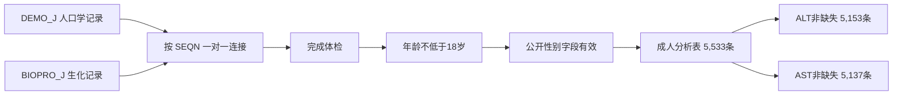
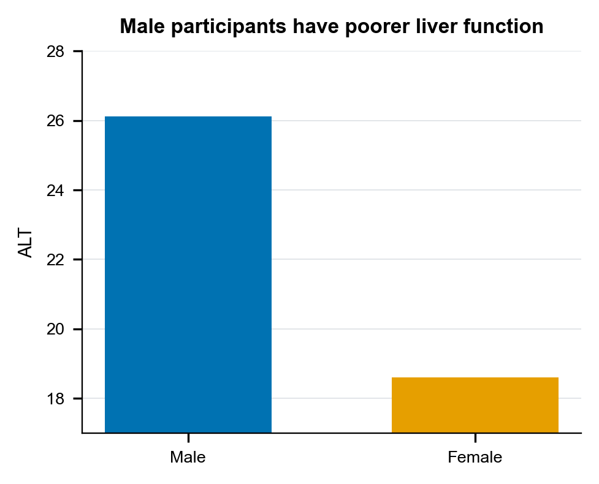
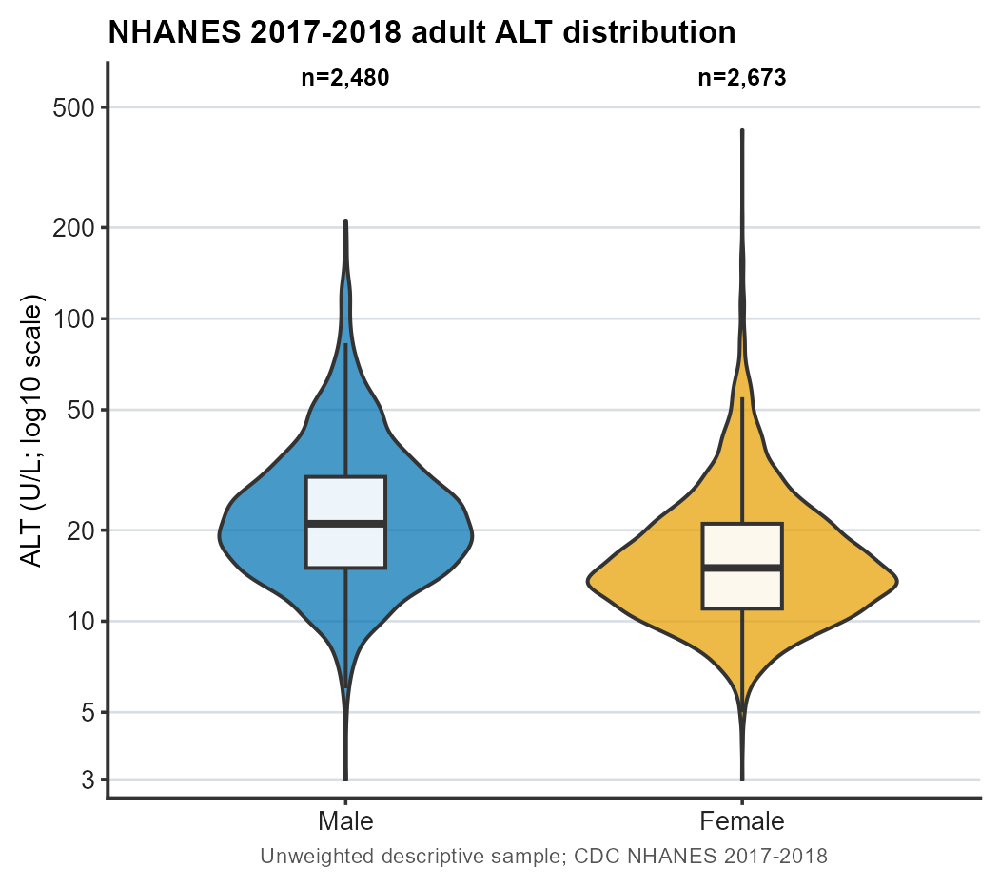
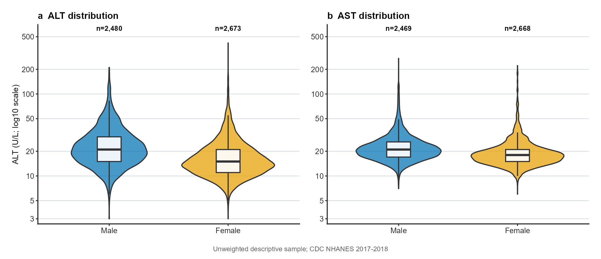
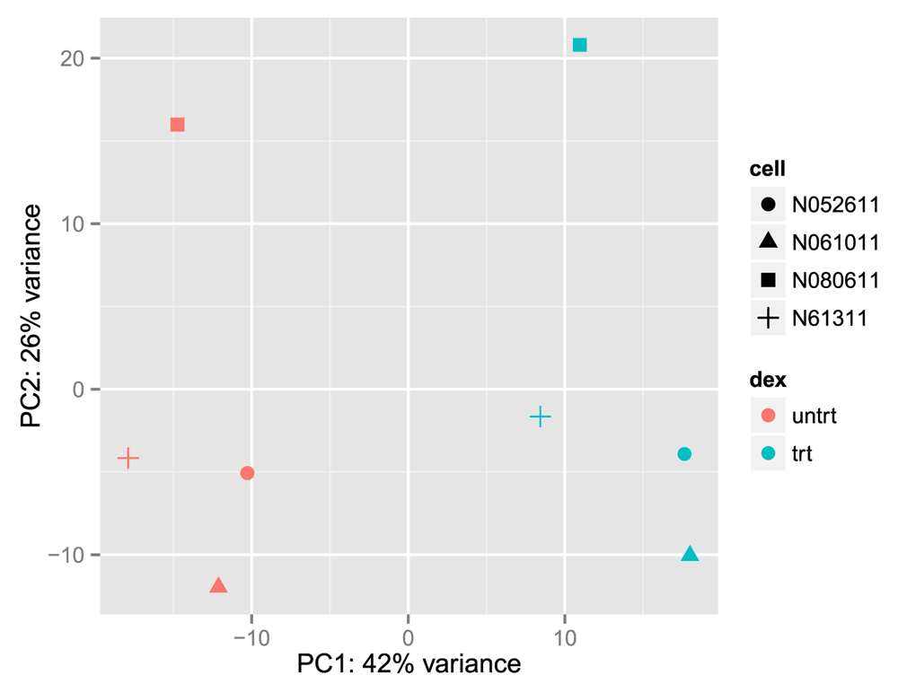
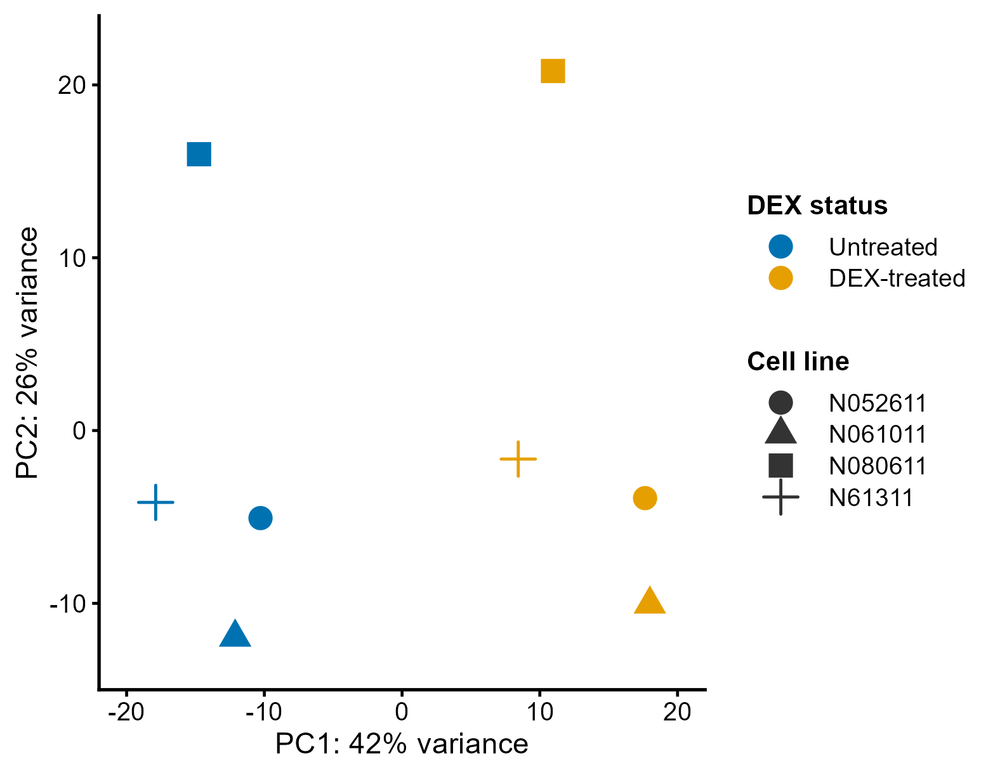
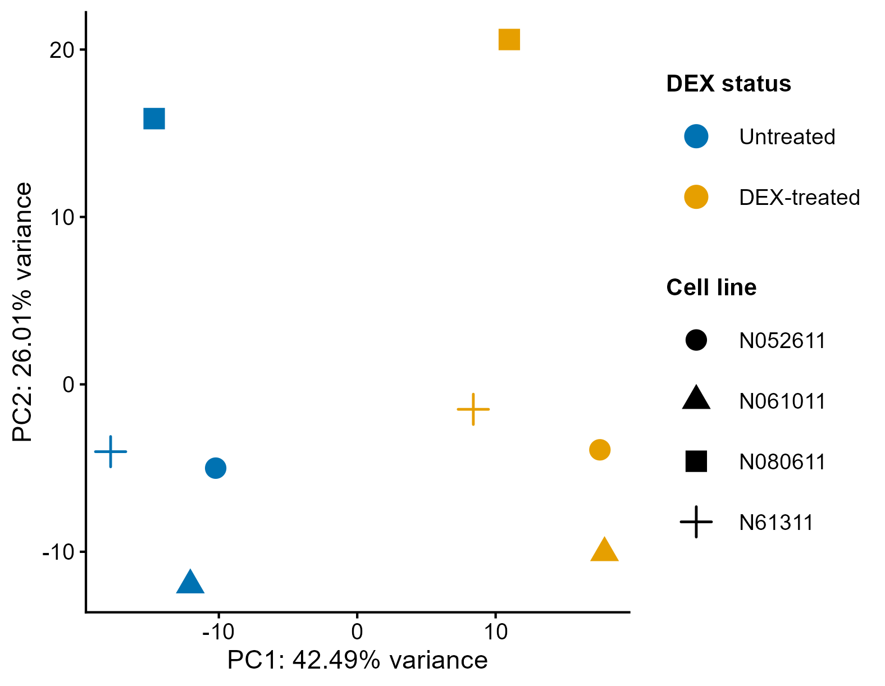
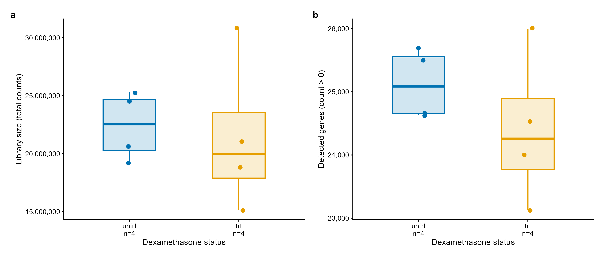
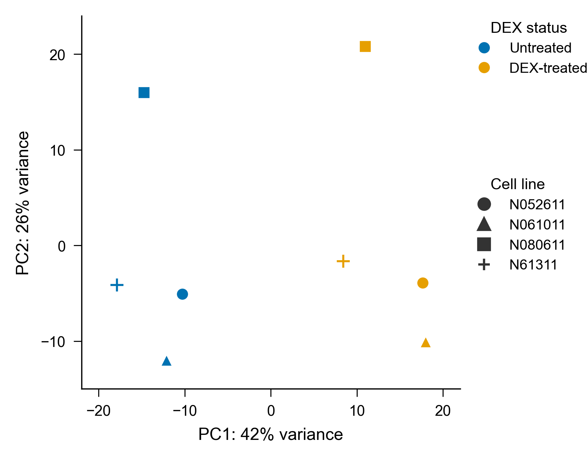

# 第7章 科研图表规范与 SCI 图表表达

## 本章定位

第5章已经说明数据从哪里来，字段代表什么，单位和缺失怎样记录。第6章把分析表整理成长表或宽表，计算描述统计量，并用图形探索分布和关系。第7章继续处理一个实际问题：怎样把探索结果整理成可审阅、可复核、可重画的科研图表。

本章是全书的科研表达接口。第8至10章会增加置信区间、效应量、P 值、回归和模型评价。第11至15章会使用 PCA、热图、火山图、UMAP 和空间图。后续方法和数据对象不断变化，本章建立的检查顺序保持不变：先确认问题和数据，再检查编码和图注，最后核对导出文件与人工记录。

| 前置章节 | 本章接收的内容 | 本章交给后续章节 |
| --- | --- | --- |
| 第3章 AI 任务说明书 | 目标、上下文、约束、验证和输出 | AI 作图任务与人工核验记录 |
| 第5章 数据质量 | 文件、字段、单位、缺失和样本数变化 | 可追踪的数据来源与纳入规则 |
| 第6章 探索性可视化 | 分布、汇总表和初步图形 | 规范图、图注和可复现图表包 |
| 第8至10章 | 统计与模型方法尚未展开 | 图中统计信息和模型图的检查位置 |
| 第11至15章 | 高维矩阵与组学对象尚未展开 | PCA、热图、火山图、UMAP 等图形接口 |

教材顺序与课堂安排有一处差异。教材把第7章放在统计推断之前，让学生先掌握图表表达的基本规则。36 学时课程在第11周集中讲“科研图表规范与 SCI 图表表达”，学生此时已经学过统计推断和基础模型。第一次阅读时，学生先学会检查图中信息。课堂回看时，再把统计量、模型指标和误差线纳入同一套规范。

“SCI 图表表达”是课程主题名称。SCI 是文献索引体系，没有一套适用于所有期刊的统一图表参数。本章讲可迁移的科研图表原则。具体尺寸、字体、线宽、颜色空间和文件格式应以目标期刊的最新指南为准。

## 学习目标

完成本章后，学生应能：

1. 填写一张图表设计规范卡，写清问题、数据、编码、图注和导出要求。
2. 从原始文件追踪到分析表和作图数据表，说明纳入规则、缺失和样本数变化。
3. 检查坐标轴、单位、尺度、图例、颜色、标注、子图和分面。
4. 根据问题和变量结构选择图形，并说明图形的解释边界。
5. 写出可独立阅读的图注，区分观察、统计信息、医学解释和待验证内容。
6. 整理规范卡、作图数据表、脚本、图形、环境和人工核验记录。
7. 比较 ggplot2 与 matplotlib 输出，判断数据语义是否一致。

## 阅读指南

本章用两套真实公开数据。NHANES 2017-2018 是贯穿案例，用于说明记录怎样进入图、错误图形怎样影响判断、ALT 和 AST 怎样组成多子图。Bioconductor `airway` 用于组学迁移、论文图复现和 R/Python 跨工具核验。

学生不需要在课堂上完整运行所有代码。先读数据表和图，再识别代码中的三个动作：读入哪张表，哪些字段映射到图，图保存到哪里。完整脚本用于课后复现和教师核验。

## 核心概念

| 概念 | 本章定义 | 检查方法 |
| --- | --- | --- |
| 图表问题 | 一张图让读者观察的单一问题 | 句子中应有对象、变量和观察任务 |
| 图表设计规范卡 | 作图前记录问题、数据、编码、图注和导出的表格 | 五项均可回到文件、字段或输出 |
| 视觉编码 | 变量映射到位置、颜色、形状、大小、线型等图形属性的规则 | 逐项核对字段与图中元素 |
| 作图数据表 | 生成某张图所需的最小数据表 | 每个点、线或箱体能回到一条或一组记录 |
| 子图 | 组合图中的独立图块，英文常写 panel | 子图标签、顺序和正文引用一致 |
| 分面 | 按变量拆分数据并共享绘图规则，英文为 facet | 各分面使用同一编码和可比尺度 |
| 图注 | 让读者离开正文也能理解图中对象、编码和边界的文字 | 对照图逐项核验，不补图外结论 |
| 可复现图表包 | 规范卡、数据、脚本、图、环境和核验记录的组合 | 换一个目录后仍能重画和检查 |

## 章节总览


## 7.1 图表问题、数据来源与视觉编码

### 从真实数据背景开始

NHANES 是美国国家健康与营养检查调查。公开文件按调查周期发布。每位参与者使用 `SEQN` 作为连接键。人口学文件 `DEMO_J` 包含年龄、公开性别字段、体检状态和调查设计字段；生化文件 `BIOPRO_J` 包含 ALT、AST 等检测指标。

本章使用 2017-2018 周期。分析脚本按 `SEQN` 一对一连接两张表，再保留完成体检、年龄不低于 18 岁且公开性别字段有效的记录。该规则得到 5,533 条成人体检记录。ALT 非缺失记录为 5,153 条，AST 非缺失记录为 5,137 条。

| 文件或表 | 本章使用字段 | 含义 |
| --- | --- | --- |
| `DEMO_J.xpt` | `SEQN` | 参与者编号和连接键 |
| `DEMO_J.xpt` | `RIDSTATR` | 是否完成体检 |
| `DEMO_J.xpt` | `RIDAGEYR` | 筛查年龄，单位为年 |
| `DEMO_J.xpt` | `RIAGENDR` | 公开人口学文件中的性别编码 |
| `DEMO_J.xpt` | `WTMEC2YR`、`SDMVPSU`、`SDMVSTRA` | 调查权重和复杂抽样设计字段 |
| `BIOPRO_J.xpt` | `LBXSATSI` | ALT，单位 U/L |
| `BIOPRO_J.xpt` | `LBXSASSI` | AST，单位 U/L |

数据进入图形前经过四次明确选择。每次选择都会改变分母，必须记录数量和理由。



| 数据口径 | 男性 | 女性 | 合计或说明 |
| --- | ---: | ---: | --- |
| 成人体检记录 | 2,672 | 2,861 | 5,533 |
| ALT 非缺失 | 2,480 | 2,673 | 5,153 |
| ALT 缺失 | 192 | 188 | 380 |
| AST 非缺失 | 2,469 | 2,668 | 5,137 |
| AST 缺失 | 203 | 193 | 396 |

同一张成人分析表生成 ALT 图和 AST 图时，分母已经发生变化。多子图若只写一个总样本量，读者无法判断每个指标实际使用了多少记录。

本章保留调查设计字段，但图形只做未加权记录描述。图中的男性、女性分组来自公开人口学字段。图形不代表美国成人总体估计，也不提供肝病诊断、参考区间判断或临床建议。

### 先看记录怎样进入分析表

下面 8 行来自实际分析表。前 6 行同时有 ALT 和 AST，后 2 行的检测值缺失。空白保持为空，没有填成 0。

| SEQN | sex | age_years | ALT_U_L | AST_U_L |
| ---: | --- | ---: | ---: | ---: |
| 93705 | Female | 66 | 16 | 20 |
| 93706 | Male | 18 | 10 | 14 |
| 93708 | Female | 66 | 19 | 21 |
| 93709 | Female | 75 | 15 | 17 |
| 93711 | Male | 56 | 20 | 23 |
| 93712 | Male | 18 | 46 | 35 |
| 93727 | Male | 70 | 缺失 | 缺失 |
| 93732 | Male | 72 | 缺失 | 缺失 |

一张图的可信度从这些记录开始。学生先确认一行代表谁，再确认变量来自哪个文件，随后检查连接、筛选和缺失。只看最终图，无法判断缺失值是否被删除、填补或误写为 0。

### 四项统计思维

统计思维在本章表现为四个检查动作。第一，先定对象和分母。本例的对象是完成体检且符合年龄和字段规则的成人记录。第二，保留缺失。ALT 与 AST 的缺失数不同，两张图的有效样本数也不同。第三，区分样本与总体。本章未使用调查权重，描述范围限于当前分析记录。第四，区分观察与推断。分布图可以显示数值位置和形态，不能单独给出显著性、因果或诊断判断。

| 检查动作 | NHANES 案例中的问题 | 通过标准 |
| --- | --- | --- |
| 定对象和分母 | 哪些参与者进入成人分析表 | 写出体检、年龄和字段规则 |
| 保留缺失 | ALT、AST 缺失怎样处理 | 空值不改成 0，分别报告有效 n |
| 区分样本与总体 | 当前图能否代表美国成人 | 明确“未加权描述” |
| 区分观察与推断 | 图上差异能否写成显著 | 只描述分布，推断转到第8章 |

这些动作也用于文献阅读、科研汇报、质量沟通和项目交接。提问者可以沿着同一顺序核对对象、口径、证据和结论范围。

### 原始数据、分析表与作图数据表

三类数据文件承担不同任务。原始数据用于保存来源，分析表用于统计和多项任务，作图数据表只保留生成某张图所需的字段与记录。

| 数据层级 | 本例文件 | 本章要求 |
| --- | --- | --- |
| 原始数据 | `DEMO_J.xpt`、`BIOPRO_J.xpt` | 只读保存，记录网址、大小和校验值 |
| 分析表 | `nhanes_2017_2018_adult_alt_ast.csv` | 保留连接、筛选、缺失和调查设计字段 |
| 作图数据表 | `nhanes_alt_plot_source.csv` | 只保留 `SEQN`、分组、年龄和 ALT |

下面的代码展示三个关键动作：读表、筛选和计数。代码输出应与材料护照中的 5,533、5,153 和 5,137 一致。

```python
import pandas as pd

df = pd.read_csv("assets/data/nhanes_2017_2018_adult_alt_ast.csv")
print(len(df))                         # 5533
print(df["ALT_U_L"].notna().sum())    # 5153
print(df["AST_U_L"].notna().sum())    # 5137
```

### 图表问题要写成可观察任务

图表问题回答“读者需要从图中观察什么”。问题应具体到对象、变量和任务。它不能预先写入疗效、诊断、机制或显著性。

| 写法 | 审阅结果 | 修改建议 |
| --- | --- | --- |
| 男性肝功能更差 | 含诊断式判断，数据和图形无法支持 | 展示当前成人记录中 ALT 按公开性别字段分组的分布 |
| 看看 ALT 情况 | 对象和任务不清 | 检查 ALT 的分布、高值、缺失和分组样本数 |
| 证明某组 ALT 显著升高 | 预设统计结论 | 比较两组 ALT 分布，并把统计推断留给第8章 |
| 画一张好看的图 | 没有分析问题 | 制作可显示样本点、单位、尺度和 n 的分布图 |

### 填写图表设计规范卡

图表设计规范卡固定使用五项。卡片短，要求具体。每一项都应能回到数据、代码或输出文件。

| 规范卡检查项 | NHANES ALT 案例填写 |
| --- | --- |
| 问题 | 展示当前成人体检记录中 ALT 按公开性别字段分组的未加权分布 |
| 数据 | `DEMO_J` 与 `BIOPRO_J` 按 `SEQN` 连接；成人体检记录 5,533 条；ALT 非缺失 5,153 条 |
| 编码 | x 为 sex，y 为 ALT（U/L）；使用明确标注的 log10 尺度；男性蓝色、女性橙色；显示单个记录 |
| 图注 | 说明数据周期、纳入规则、未加权范围、点与箱体含义、两组 n 和尺度；不写诊断或总体推断 |
| 导出 | 保存作图数据表、R/Python 脚本、SVG/PDF、300 dpi PNG、环境和人工核验记录 |

视觉编码（visual encoding）指变量怎样进入图。数值可以映射到位置或颜色深浅，分类变量可以映射到颜色、形状或分面，样本可以显示为点。初学者先保证位置、颜色和图例清楚，再增加其他编码。

| 变量角色 | 本例字段 | 视觉编码 | 检查问题 |
| --- | --- | --- | --- |
| 连续变量 | `ALT_U_L` | y 轴位置 | 单位与尺度是否写清 |
| 分类变量 | `sex` | x 轴和颜色 | 组序和配色是否稳定 |
| 样本标识 | `SEQN` | 单个点对应一条记录 | 点是否能回到原表 |
| 多个指标 | ALT、AST | 子图 a、b | 各子图 n 是否分别报告 |

### 规范卡与第3章任务说明书怎样配合

第3章的 AI 任务说明书固定包含目标、上下文、约束、验证和输出。图表设计规范卡是绘图任务的专业附件。两者可以按下表对应，但不能互相替代。

| AI 任务说明书 | 图表设计规范卡提供的信息 | NHANES 例子 |
| --- | --- | --- |
| 目标 | 图表问题 | 展示 ALT 未加权分布 |
| 上下文 | 数据来源和纳入规则 | `DEMO_J`、`BIOPRO_J`、成人体检记录 |
| 约束 | 编码与图注边界 | 蓝橙配色、log10、不写诊断 |
| 验证 | 图表规范检查 | 核对 5,153 条记录和两组 n |
| 输出 | 可复现图表包 | CSV、R/Python、SVG、PNG、session、核验记录 |

学生向 AI 提交绘图任务时，应把规范卡中的真实字段复制到上下文和约束中。AI 不应自行猜测 `LBXSATSI` 的含义，也不应把公开性别字段改写成生物学机制变量。

## 7.2 坐标轴、图例、颜色、标注与多子图

### 真实数值也会被错误表达误导

下面的问题图使用 NHANES 的真实 ALT 组均值。图形故意截断纵轴，并使用诊断式英文标题。它没有显示单个记录、单位、缺失和样本数。



图7-1　NHANES ALT 问题图。数据值来自真实公开记录，图形用于审阅错误表达。标题、纵轴范围和信息缺口均为教学设计，不应作为分析结论。

学生先找信息缺口，再讨论样式。下面六项可以直接从页面检查。

| 检查项 | 问题图现状 | 规范要求 |
| --- | --- | --- |
| 标题 | 写成“男性肝功能较差” | 标题只说明对象和变量 |
| 纵轴 | 从 17 开始，放大均值差异 | 范围和转换有明确理由并写入图注 |
| 单位 | 未写 ALT 单位 | 纵轴写 `ALT (U/L)` |
| 分布 | 只显示两个均值柱 | 显示样本分布或个体点 |
| 样本数 | 未报告 n | 图中或图注写明每组有效 n |
| 数据范围 | 未说明未加权 | 图注明确当前分析记录范围 |

### 规范图保留分布和高值

规范图使用同一批 ALT 非缺失记录。男性 2,480 条，女性 2,673 条。图中叠加单个记录和箱体，并标注 log10 尺度。对数尺度用于容纳长尾分布，图注必须说明。



图7-2　NHANES 2017-2018 成人体检记录中 ALT 的未加权分布。每个点代表一条 ALT 非缺失记录；箱体表示四分位范围，中线表示中位数；纵轴使用 log10 尺度。男性 n=2,480，女性 n=2,673。本图描述当前记录，不作总体估计或临床判断。

这次修改没有删除高值，也没有把分布压缩成两个均值。读者可以看到中心位置、离散程度、重叠范围和长尾。图形仍然不回答组间差异是否具有统计意义，第8章会处理预设比较、效应量和不确定性。

### 同一作图数据表生成 R 与 Python 图

本章保留两种语言，因为课程后续会同时使用 R/Bioconductor 和 Python 数据工具。学生无需背诵全部语法，先核对三组动作：读表、编码、导出。

#### R/ggplot2 的关键动作

```r
alt <- read.csv("assets/data/nhanes_alt_plot_source.csv")
alt$sex <- factor(alt$sex, levels = c("Male", "Female"))
p <- ggplot(alt, aes(sex, ALT_U_L, fill = sex)) +
  geom_violin(trim = FALSE) + geom_boxplot(width = 0.16) +
  scale_fill_manual(values = c(Male = "#0072B2", Female = "#E69F00")) +
  scale_y_log10() + labs(x = NULL, y = "ALT (U/L)")
ggsave("fig_nhanes_alt_ggplot2.svg", p, width = 89, height = 78, units = "mm")
```

#### Python/matplotlib 的关键动作

```python
alt = pd.read_csv("assets/data/nhanes_alt_plot_source.csv")
groups = [alt.loc[alt["sex"] == s, "ALT_U_L"] for s in ["Male", "Female"]]
fig, ax = plt.subplots(figsize=(3.5, 3.1))
ax.violinplot(groups, showmedians=True)
ax.set_yscale("log")
ax.set_xticks([1, 2], ["Male", "Female"])
ax.set_ylabel("ALT (U/L)")
fig.savefig("fig_nhanes_alt_matplotlib.svg", bbox_inches="tight")
```

两段代码都读取 `nhanes_alt_plot_source.csv`，使用相同组序、单位和 log 尺度。正式脚本还要叠加样本点、固定颜色、控制随机抖动、写入图注信息，并同时导出 PNG 和矢量图。

| 运行后检查 | R 图 | Python 图 |
| --- | --- | --- |
| 记录数 | 5,153 | 5,153 |
| 组序 | Male、Female | Male、Female |
| 颜色含义 | 男蓝、女橙 | 男蓝、女橙 |
| 纵轴 | ALT（U/L），log10 | ALT（U/L），log10 |
| 输出 | SVG/PDF/PNG | SVG/PDF/PNG |

### 坐标轴和尺度

轴标题至少包含变量名和单位。使用对数转换、标准化、截断或固定范围时，图注和代码要写清。`value`、`score1` 等内部列名不能直接充当正式轴标题。

| 轴检查项 | 通过标准 | 需修改例子 |
| --- | --- | --- |
| 变量 | 能回到数据字典字段 | 只写 `value` |
| 单位 | 数值单位明确，或说明无量纲 | ALT 未写 U/L |
| 尺度 | 原始、log 或标准化尺度明确 | 热图未说明 z-score |
| 范围 | 截断和固定范围有理由 | y 轴从 17 开始且未说明 |
| 类别顺序 | 任务、图例和多图保持一致 | 同一分组顺序反复变化 |

### 颜色、图例和标注

颜色表示变量，不承担统计判断。本章使用蓝色 `#0072B2` 和橙色 `#E69F00` 区分两组。相同组别在单图、多子图和跨工具输出中保持一致。正式项目可使用其他色板，但应通过色觉可辨认性和灰度打印检查。

图例解释颜色、形状、线型和符号。若轴标签已经完整说明两组，图例可以简化；若颜色或形状承载额外变量，图例必须保留。基因名、阈值线和重点样本等标注需要预设规则，不能只挑符合预期的点。

| 元素 | 本章要求 | 人工核验 |
| --- | --- | --- |
| 颜色 | 同一变量使用稳定颜色 | 查看所有输出是否换色 |
| 图例 | 文本与图中编码一致 | 对照类别、形状和线型 |
| 样本点 | 不遮住主体，仍可看出密度 | 缩放后检查点是否成块 |
| 文字标注 | 有选择规则，避免遮挡 | 记录标签生成条件 |
| 阈值线 | 写明来源和数值 | 不把教学阈值写成临床标准 |

### 子图和分面分开检查

子图（panel）是组合图中的独立图块，常用 a、b、c 标识。分面（facet）按某个分类变量拆分同一张图，通常共享绘图规则。两者可能同时出现，含义不能混写。

ALT 和 AST 属于两个指标，适合组成两个子图。它们来自同一成人分析表，但缺失数不同。ALT 男性 n=2,480、女性 n=2,673；AST 男性 n=2,469、女性 n=2,668。图注需要逐图报告。



图7-3　NHANES 2017-2018 成人体检记录中 ALT 与 AST 的未加权分布。a，ALT；男性 n=2,480，女性 n=2,673。b，AST；男性 n=2,469，女性 n=2,668。点、箱体和中线含义同图7-2。两图使用一致配色和 log10 尺度，仅描述当前记录。

| 多子图检查 | 问题 |
| --- | --- |
| 标签 | a、b 是否与正文和图注一致 |
| 顺序 | 指标顺序是否符合阅读逻辑 |
| 编码 | 同一组的颜色、形状和线型是否一致 |
| 尺度 | 轴范围是否需要共享，若不同是否说明 |
| 样本数 | 每个子图的有效 n 是否分别报告 |
| 图例 | 是否可以共享，文字是否完整 |

### 在最终尺寸下检查

屏幕上可读的图，缩到期刊栏宽后可能出现字体过小、线条消失、图例拥挤和标签裁切。最终检查应使用实际导出文件和目标尺寸。

Nature 的研究图形指南可作为教学示例：常见栏宽示例为 89 mm 和 183 mm；正文图中文字常见 5-7 pt，子图标签可使用约 8 pt；线宽示例为 0.25-1 pt；矢量图可用 PDF 或 SVG，位图预览可用 300 dpi PNG，颜色空间按目标要求检查。参数可能更新，投稿前需查目标期刊指南。

## 7.3 按问题和变量选择医药数据图表

图表类型由问题、变量结构和解释边界共同决定。学生先说明要观察分布、比较组别、检查关系，还是查看高维样本结构，再选择图形。

### 问题类型与变量结构选择矩阵

| 图表问题 | 变量结构 | 首选图形 | 必备信息 | 解释边界 |
| --- | --- | --- | --- | --- |
| 一个连续变量怎样分布 | 一个连续变量 | 直方图、点图、经验分布 | 单位、样本范围、n、bin 或点含义 | 分布形态受尺度和 bin 影响 |
| 不同组的连续变量怎样分布 | 连续变量加分组 | 箱线图、小提琴图、散点或区间图 | 每组 n、样本点、中心和离散定义 | 图形重叠不能直接写成无差异 |
| 两个连续变量怎样共同变化 | 两个连续变量 | 散点图 | 两轴单位、缺失、分组和模型线含义 | 共同变化不等于因果 |
| 多个同类指标怎样并列查看 | 多个指标加共同分组 | 多子图 | 子图标签、共同编码、各图 n | 不同指标缺失和尺度需分别说明 |
| 高维样本的主要变化方向 | 矩阵加样本信息 | PCA | 输入矩阵、转换、解释率和分组 | PCA 不证明组间差异 |
| 分类模型在阈值变化下怎样表现 | 真实标签加预测分数 | ROC | 数据范围、阳性定义、AUC 和阈值 | ROC 不直接给出临床阈值 |
| 大量特征的差异大小和证据怎样分布 | 效应量加校正后 P 值 | 火山图 | 阈值、标签规则、输入比较 | 单个点不支持机制结论 |
| 单细胞低维结构怎样展示 | 降维坐标加细胞信息 | UMAP | 输入对象、参数、细胞数和颜色含义 | 二维距离不等于真实生物距离 |

### 一个连续变量：先看分布

ALT 分布具有长尾。若使用直方图，bin 宽度会改变图形细节；若使用箱线图，读者难以看到完整密度；若使用小提琴图，小样本时核密度形态可能不稳定。对 NHANES 这种记录数较多的案例，小提琴图叠加抽样后的透明点可以帮助阅读。对小样本实验，优先显示全部点，并配合箱体或区间。

学生选择图形时要回答两个问题：这个图保留了哪些信息，隐藏了哪些信息。柱形图只显示汇总高度；箱线图概括四分位数；散点或条带图保留个体位置。选择依据来自任务，不来自软件默认主题。

### 两个连续变量：散点图先检查共同变化

年龄与 ALT 可以画成散点图。作图前应删除两列中缺失的记录并报告有效 n。若增加趋势线，需要说明模型或平滑方法。第9章会继续讲相关系数、线性回归、异常点和残差，本章只检查轴、单位、分组、缺失和趋势线说明。

```python
source = df[["SEQN", "sex", "age_years", "ALT_U_L"]].dropna()
ax.scatter(source["age_years"], source["ALT_U_L"], alpha=0.35)
ax.set_xlabel("Age (years)")
ax.set_ylabel("ALT (U/L)")
```

这段代码生成点的位置，但还没有完成正式图。学生仍要决定是否按组着色、是否使用 log 尺度、怎样处理密集重叠、怎样写图注，以及导出哪些文件。

### 高维图形保留检查接口

PCA、热图、火山图和 UMAP 会在后续章节详细讲解。本章只建立检查接口，避免学生把复杂图形当成自动结论。

| 图形 | 本章检查接口 | 后续章节 |
| --- | --- | --- |
| PCA | 输入矩阵、转换或标准化、PC解释率、样本颜色和形状 | 第11章 |
| 聚类热图 | 行列对象、数值尺度、距离、聚类方法、注释条 | 第11、12章 |
| 火山图 | 效应量、校正后 P 值、阈值和标签规则 | 第12章 |
| ROC | 阳性定义、数据划分、阈值、AUC 和置信区间 | 第9、10章 |
| UMAP | 输入对象、邻居图、参数、细胞数、颜色和注释依据 | 第14章 |

学生在第7章完成“看图和查字段”。后续章节再学习这些图形背后的统计方法、算法参数和专业解释。

### 同一数据可以提出不同图表问题

同一份 NHANES 分析表可以生成多张图。图形不同，问题也不同。学生不能先浏览软件图形库，再挑一张看起来复杂的图。

| 图表问题 | 使用字段 | 建议图形 | 本章能写的观察 |
| --- | --- | --- | --- |
| ALT 在当前记录中怎样分布 | `ALT_U_L` | 直方图或经验分布 | 分布范围、长尾和高值位置 |
| ALT 在两个公开分组中怎样分布 | `sex`、`ALT_U_L` | 小提琴图、箱线和点 | 两组中心、离散和重叠 |
| 年龄与 ALT 怎样共同变化 | `age_years`、`ALT_U_L` | 散点图 | 点云范围和可能的非线性结构 |
| ALT 与 AST 是否同时出现高值 | `ALT_U_L`、`AST_U_L` | 散点图 | 两指标的共同分布 |
| ALT 和 AST 怎样并列展示 | 指标、数值、分组 | 多子图 | 两指标分布与各自有效 n |

图形选择还要考虑记录数。8 个 `airway` 样本适合显示全部点。5,153 条 ALT 记录若全部使用不透明点，中心区域会严重重叠。可以降低透明度、使用抖动或显示分布轮廓，但不能因此删除高值记录。

### 图形审阅按三层推进

学生面对陌生图形时，可先完成三层检查。第一层看数据对象，确认一行或一个点代表什么。第二层看编码，确认位置、颜色、形状和子图对应哪些字段。第三层看解释边界，判断图形观察是否被写成统计、因果或医学结论。

| 层级 | 核心提问 | 常见错误 |
| --- | --- | --- |
| 数据对象 | 一个点、一条线或一个箱体来自哪些记录 | 把细胞数当样本数 |
| 视觉编码 | 颜色、形状、尺度和分面映射哪些变量 | 同一颜色在不同图中表示不同组 |
| 解释边界 | 当前图直接支持什么 | 把 PCA 分离写成显著差异 |

## 7.4 图注写作与统计信息呈现

### 图注要让图可以独立阅读

图注承担六项信息：图的对象、视觉编码、样本与缺失、统计或尺度、缩写、解释边界。标题只说明图的身份，图注需要解释读图规则。

| 图注部分 | 应回答的问题 | NHANES ALT 示例 |
| --- | --- | --- |
| 对象 | 图展示谁和什么变量 | 2017-2018 成人体检记录中的 ALT |
| 编码 | 点、箱体、颜色和子图表示什么 | 点为记录，箱体为四分位范围，颜色为公开性别字段 |
| 样本与缺失 | 哪些记录进入图 | ALT 非缺失；男性 2,480，女性 2,673 |
| 统计或尺度 | 中线、误差线和坐标怎样定义 | 中线为中位数，纵轴为 log10 尺度 |
| 缩写 | 首次出现的缩写怎样解释 | ALT，alanine aminotransferase |
| 边界 | 图不能支持什么 | 未加权描述，不作总体估计或诊断 |

### 逐句改写越界图注

问题图注可以写成：“男性参与者肝功能显著较差，提示更高的肝病风险。”这句话加入了显著性、诊断和风险判断。当前图形没有统计检验、临床诊断、参考区间或风险模型，无法支持这些内容。

| 原句成分 | 问题 | 改写动作 |
| --- | --- | --- |
| 男性参与者肝功能较差 | ALT 被直接替换成诊断判断 | 写回具体变量和数据范围 |
| 显著 | 未提供检验、效应量和区间 | 删除，统计推断交给第8章 |
| 提示更高肝病风险 | 未提供结局和风险模型 | 删除，不补临床判断 |
| 未说明样本数和缺失 | 读者无法核对分母 | 补两组 n 和非缺失规则 |
| 未说明尺度 | 图形外观难以复核 | 写明 log10 纵轴 |

合格图注可写为：

> 图7-2　NHANES 2017-2018 成人体检记录中 ALT 的未加权分布。每个点代表一条 ALT 非缺失记录；箱体表示四分位范围，中线表示中位数。男性 n=2,480，女性 n=2,673。纵轴使用 log10 尺度。图中分组来自公开人口学字段，结果限于当前分析记录，不作美国成人总体估计或临床诊断。

### 统计信息的最低说明

本章不提前讲检验选择，但图注要给统计信息留出明确位置。SD、SE 和 CI 含义不同，不能只写“误差线”。

| 场景 | 图注至少说明 | 方法学习位置 |
| --- | --- | --- |
| 描述分布 | n、中心统计量、离散定义、缺失和尺度 | 第6章与本章 |
| 两组比较 | 每组 n、比较指标、效应量或区间、检验方法 | 第8章 |
| 多组比较 | 每组 n、总体检验、多重比较或校正方法 | 第8章 |
| 相关与回归 | 有效 n、相关或模型方法、区间和异常处理 | 第9章 |
| 分类模型 | 阳性定义、训练/测试范围、阈值、AUC 或混淆矩阵 | 第9、10章 |
| 高维筛选 | 输入矩阵、比较、效应量、校正方法、标签规则 | 第12章 |
| 单细胞图 | 样本与细胞数、过滤、参数、注释依据 | 第14章 |

图注中的数字必须来自数据、脚本输出或文献来源。不能根据图上点的位置估算样本量、P 值或效应量。

### SD、SE 和 CI 要写出全称与含义

标准差（standard deviation, SD）描述当前数据的离散程度。标准误（standard error, SE）描述某个估计量在重复抽样意义下的不确定性。置信区间（confidence interval, CI）给出按指定方法构造的区间。三者回答的问题不同。

| 图注写法 | 审阅结果 | 修改 |
| --- | --- | --- |
| 点为均值，线为误差 | 不清楚误差线类型 | 写明 mean ± SD、mean ± SE 或 95% CI |
| 阴影表示可信范围 | 缺计算对象和方法 | 写明回归均值的 95% CI 或预测区间 |
| 星号表示显著 | 缺检验、阈值和校正 | 写明检验、比较、P 值口径和多重校正 |
| 箱体表示误差 | 混淆箱线图与误差线 | 写明四分位范围、中位数和须线规则 |

第7章要求把这些信息写进图注。第8章再解释它们怎样计算、何时使用以及怎样联系效应量和实际意义。

### 图注动词按证据层级选择

图注以描述为主。动词应对应当前证据层级，避免用一个强动词代替缺失的方法或证据。

| 证据层级 | 可用表达 | 使用边界 |
| --- | --- | --- |
| 图中直接观察 | 显示、分布于、位于、重叠 | 只写图上可见对象和位置 |
| 统计结果 | 估计、比较、相关、区间为 | 同时给方法、数值和数据范围 |
| 支持性模式 | 提示、与……一致 | 明确替代解释和仍需验证内容 |
| 医学或机制判断 | 需进一步证据 | 不由单张图注完成 |

### 论文图复现分三层核对

Love 等发表的 RNA-seq workflow 使用 `airway` 数据展示差异表达流程。Figure 6 是 PCA 图，横轴 PC1 解释 42% 的变化，纵轴 PC2 解释 26%。原图标出处理状态和细胞系。文章采用 CC BY 许可，教材使用时保留作者、年份、DOI 和来源。

| 论文原图 | 依据公开坐标生成的规范复现图 |
| --- | --- |
|  |  |

图7-4　Love 等 RNA-seq workflow Figure 6 与依据公开坐标生成的规范复现图。来源：Love MI, Anders S, Kim V, Huber W. RNA-Seq workflow: gene-level exploratory analysis and differential expression. F1000Research. 2016;4:1070. DOI: `10.12688/f1000research.7035.2`，CC BY。

#### 复现的三层记录

复现需要分开核对三层。数据层检查 8 个样本和坐标是否一致。计算层检查坐标来自论文公开结果，还是由当前软件环境重新计算。表达层检查颜色、形状、轴范围、图例和标签。样式调整不能被写成新的计算结果。

公开坐标表如下。每行对应一个样本，`dex` 表示处理状态，`cell_line` 表示细胞系。PC1 和 PC2 的解释率来自论文图。

| sample_id | PC1 | PC2 | dex | cell_line |
| --- | ---: | ---: | --- | --- |
| SRR1039508 | -17.889 | -4.158 | untrt | N61311 |
| SRR1039509 | 8.437 | -1.651 | trt | N61311 |
| SRR1039512 | -10.278 | -5.067 | untrt | N052611 |
| SRR1039513 | 17.643 | -3.911 | trt | N052611 |
| SRR1039516 | -14.741 | 15.990 | untrt | N080611 |
| SRR1039517 | 10.956 | 20.806 | trt | N080611 |
| SRR1039520 | -12.120 | -11.963 | untrt | N061011 |
| SRR1039521 | 17.992 | -10.047 | trt | N061011 |

| 层级 | 本例核验内容 | 记录方式 |
| --- | --- | --- |
| 数据层 | 8 个样本、PC1/PC2 坐标、处理状态和细胞系 | 保存坐标 CSV |
| 计算层 | 公开坐标或当前 DESeq2 环境重算 | 文件名和 session 分开记录 |
| 表达层 | 颜色、形状、图例、轴和标签 | 保存绘图脚本与规范卡 |

公开坐标复现与当前环境重算可能因软件版本、预处理和随机性出现差异。正文应说明差异来源，不能只挑更接近原图的版本。



图7-5　当前本机 R/DESeq2 环境重新计算的 `airway` PCA 图。该图与公开坐标复现图分开保存。比较时检查样本关系、处理状态和细胞系，不把坐标数值差异解释成新的生物学发现。

复现报告应写清采用哪一条路线。若使用论文公开坐标，报告重点是图形编码和版式复现。若从计数矩阵重算，报告还要记录过滤、转换、PCA 输入和软件版本。两种路线不能共用同一文件名。

## 7.5 作图数据表、脚本与可复现导出

### 从计数矩阵整理出样本级 QC 表

Bioconductor `airway` 数据包包含人气道平滑肌细胞的 bulk RNA-seq 计数数据。教学子集有 8 个样本，4 个细胞系各包含未处理和 dexamethasone 处理样本。原始计数矩阵有 63,677 行基因和 8 列样本。

样本级 QC 图不需要把 63,677 行全部交给绘图函数。先为每个样本计算总计数 `library_size`，再计算计数大于 0 的基因数 `detected_genes`，得到 8×5 作图数据表。

| sample_id | cell_line | dex | library_size | detected_genes |
| --- | --- | --- | ---: | ---: |
| SRR1039508 | N61311 | untrt | 20,637,971 | 24,633 |
| SRR1039509 | N61311 | trt | 18,809,481 | 24,527 |
| SRR1039512 | N052611 | untrt | 25,348,649 | 25,699 |
| SRR1039513 | N052611 | trt | 15,163,415 | 23,124 |
| SRR1039516 | N080611 | untrt | 24,448,408 | 25,508 |
| SRR1039517 | N080611 | trt | 30,818,215 | 25,998 |
| SRR1039520 | N061011 | untrt | 19,126,151 | 24,662 |
| SRR1039521 | N061011 | trt | 21,164,133 | 23,991 |

`library_size` 是每个样本计数列的总和。`detected_genes` 是该样本中计数大于 0 的基因数。它们用于回查样本，不直接判定实验失败或生物学异常。判断异常还需要实验设计、测序质控和其他预设指标。



图7-6　`airway` 8 个样本的样本级 QC。a，总计数；b，检测基因数。点代表样本，颜色表示 `dex` 状态。两项指标用于样本回查，不支持差异表达或机制结论。

课堂短检查可以指定样本 `SRR1039517`。学生先在表中找到总计数 30,818,215 和检测基因数 25,998，再回到图中定位该点。这个动作说明图中的点可以追溯到具体记录。

### ggplot2 与 matplotlib 读取同一份 CSV

两种工具的语法不同，图中的数据语义应一致。它们读取同一份 `airway_pca_published_coordinates.csv`，使用同一组序、颜色、形状、坐标和轴说明。

#### R/ggplot2 的三个动作

```r
qc <- read.csv("assets/data/airway_pca_published_coordinates.csv")
p <- ggplot(qc, aes(PC1, PC2, colour = dex, shape = cell_line)) +
  geom_point(size = 2.4) + labs(x = "PC1: 42% variance", y = "PC2: 26% variance")
ggsave("fig_airway_pca_ggplot2.svg", p, width = 89, height = 72, units = "mm")
```

#### Python/matplotlib 的三个动作

```python
qc = pd.read_csv("assets/data/airway_pca_published_coordinates.csv")
for (dex, cell), part in qc.groupby(["dex", "cell_line"]):
    ax.scatter(part["PC1"], part["PC2"], label=f"{dex}, {cell}")
fig.savefig("fig_airway_pca_matplotlib.svg", bbox_inches="tight")
```

上面的 R 片段需要读取 PCA 坐标表，正式脚本已经使用对应文件名。课堂阅读时关注 `read`、`aes` 或 `scatter`、`save` 三类动作。完整脚本保存在配套材料包，避免学生现场处理安装和环境问题。

| ggplot2输出 | matplotlib输出 |
| --- | --- |
|  |  |

图7-7　同一公开 PCA 坐标表生成的 ggplot2 与 matplotlib 输出。样本、坐标、处理状态、细胞系、颜色、形状和轴解释率应一致。字体、留白、图例位置和默认线宽可以不同。

跨工具核验不要求像素完全相同。学生应优先检查以下信息。

| 必须一致 | 可以不同 |
| --- | --- |
| 输入 CSV 和有效记录 | 字体家族 |
| 样本与坐标 | 图例位置 |
| 分组顺序和标签 | 留白和边距 |
| 颜色和形状含义 | 默认线宽 |
| 轴标题、单位和解释率 | 图层实现方式 |
| 坐标范围和被标注样本 | 文件内部结构 |

### 可复现图表包

一张可提交图应配套保存规范卡、作图数据表、脚本、正式图、预览图、环境和核验记录。PNG 便于预览，SVG 或 PDF 便于编辑和正式使用。截图不能替代脚本导出。

```text
fig_airway_pca/
├── fig_airway_pca_design.md
├── airway_pca_published_coordinates.csv
├── fig_airway_pca_ggplot2.R
├── fig_airway_pca_matplotlib.py
├── fig_airway_pca.svg
├── fig_airway_pca.pdf
├── fig_airway_pca_preview.png
├── session.txt
└── ai_review.md
```

| 文件 | 最低要求 |
| --- | --- |
| `*_design.md` | 问题、数据、编码、图注和导出五项 |
| 作图数据表 | 只含重画所需记录和字段，不覆盖原始文件 |
| R/Python 脚本 | 使用相对路径，能独立重画，记录随机种子和关键参数 |
| SVG/PDF | 正式矢量输出，重新打开检查字体和裁切 |
| PNG | 预览图，按目标用途设置分辨率 |
| `session.txt` | R/Python 版本和关键包版本 |
| `ai_review.md` | AI 输出摘要、警告、人工修改和最终核验 |

### AI 作图后的人工核验

AI 可以根据自然语言生成绘图代码。任务说明应带上图表设计规范卡，避免 AI 猜字段、单位和类别顺序。生成图以后，学生逐项核验数据、编码、文字、警告和文件。


| 核验项 | 学生检查什么 | 常见问题 |
| --- | --- | --- |
| 数据 | 文件、行数、缺失和筛选 | AI 自动删除缺失却未记录 |
| 编码 | 字段、组序、颜色、形状和尺度 | 类别顺序改变，颜色含义互换 |
| 文字 | 标题、轴、图例、图注和缩写 | AI 补写显著性或诊断 |
| 运行 | 警告、字体替换、裁切和空图 | 导出成功但文字被截断 |
| 留痕 | 提示词、修改、版本和最终文件 | 只保存最后一张图片 |

第3章的 AI 任务说明书仍然有效。图表设计规范卡说明图要怎样表达；AI 任务说明书说明 AI 可以做什么、怎样验证和输出到哪里。两份文件承担不同责任，应一起进入课程项目记录。

### 一份可执行的 AI 作图说明

零基础学生可以用自然语言写任务，不需要先学习 JSON 或复杂配置。任务中必须给出真实字段、允许操作和验收条件。

```text
目标：
根据 airway_pca_published_coordinates.csv 生成 PCA 散点图。

数据：
每行是一个样本。坐标字段为 PC1、PC2；颜色字段为 dex；
形状字段为 cell_line；共有 8 行，不得删除或新增样本。

编码：
untrt 使用蓝色 #0072B2，trt 使用橙色 #E69F00。
横轴写 PC1: 42% variance，纵轴写 PC2: 26% variance。
样本标签和图例不得交换。

图注：
只描述 8 个样本在 PCA 坐标中的位置及编码。
不写差异表达、机制、疗效或临床建议。

导出：
输出 SVG、PDF 和 300 dpi PNG；保存运行警告和软件版本。
```

AI 返回代码后，学生先运行，再填写核验记录。下面是一份最小记录样例。

| 记录项 | 样例填写 |
| --- | --- |
| 输入检查 | CSV 为 8 行、7 列；8 个 `sample_id` 均唯一 |
| AI 初稿问题 | 图例按字母顺序重排；未固定颜色；PNG 未设置 dpi |
| 人工修改 | 固定 `dex` 顺序和颜色；补 PC 解释率；增加 SVG/PDF/PNG 导出 |
| 运行结果 | 三种文件均生成；无缺失样本；SVG 重新打开正常 |
| 解释检查 | 删除“处理导致样本明显分离”的句子 |
| 最终状态 | 通过数据、编码、文字、运行和留痕检查 |

### 先处理阻断项，再处理样式

图表审阅可以分成三个等级。阻断项会改变数据或结论，必须先修正。修改项影响可读和复核，应在提交前完成。润色项只影响版式，可在数据语义确认后处理。

| 等级 | 例子 | 处理 |
| --- | --- | --- |
| 阻断项 | 读错文件、删除样本、组别互换、单位错误、图注新增显著性 | 停止提交，回到数据和脚本 |
| 修改项 | 轴标题不全、颜色不稳定、子图 n 缺失、字体过小、图例遮挡 | 修订后重新导出并复核 |
| 润色项 | 图例位置、边距、轻微线宽和留白差异 | 数据语义确认后调整 |

这种分级也适用于教师和同伴审阅。先指出会改变结论的问题，再处理美观。反馈需要写明对象和修改理由，例如“子图 b 的 AST 有效样本数应单独报告”，避免只写“图不好看”。

### 可复现故障排查

图表包文件齐全后，还要验证能否在新的工作目录中运行。常见失败来自路径、依赖、字体、随机性和导出设备。

| 故障 | 检查位置 | 修复要求 |
| --- | --- | --- |
| 找不到 CSV | 当前工作目录和相对路径 | 从项目根目录或脚本位置构造路径 |
| R/Python 图样本数不同 | 筛选、缺失和类别处理 | 打印行数和每组 n，比较作图数据表 |
| 颜色顺序变化 | factor/category 顺序 | 在代码中固定类别和颜色映射 |
| 点的位置每次变化 | 抖动或随机抽样 | 固定随机种子并记录 |
| SVG 字体替换 | 系统字体和导出设备 | 使用可用字体，重新打开检查 |
| PDF 或 PNG 被裁切 | 画布、边距和 `bbox` | 在最终尺寸下检查完整边界 |
| 脚本运行但图为空 | 字段类型、筛选结果和坐标范围 | 打印数据摘要，停止空结果导出 |

重画测试不要求在所有计算机上得到字节完全相同的文件。数据记录、坐标、分组、标签和解释应一致。软件版本造成的细微渲染差异需要记录，不能隐去。

### 文件名也承担核验功能

文件名应能区分数据、工具、计算路线和用途。`final2.png`、`new_new.svg` 无法说明文件来源。下面的命名可以直接用于课程项目。

| 文件 | 建议命名 | 说明 |
| --- | --- | --- |
| 规范卡 | `fig07_airway_pca_design.md` | 图7的五项规范 |
| 作图数据表 | `fig07_airway_pca_source.csv` | 8行公开坐标 |
| R脚本 | `fig07_airway_pca_ggplot2.R` | ggplot2实现 |
| Python脚本 | `fig07_airway_pca_matplotlib.py` | matplotlib实现 |
| 正式图 | `fig07_airway_pca.svg` | 可编辑矢量图 |
| 预览图 | `fig07_airway_pca_preview.png` | 快速审阅 |
| 环境记录 | `fig07_airway_pca_session.txt` | 软件与包版本 |
| 人工核验 | `fig07_airway_pca_ai_review.md` | AI参与和修改记录 |

若同一图同时保留公开坐标复现和当前环境重算，可在文件名加入 `published_coordinates` 与 `recomputed`。两条计算路线不覆盖彼此。

## 常见误区

| 误区 | 具体风险 | 修改动作 |
| --- | --- | --- |
| 先画图，再寻找问题 | 图形容易服务预设结论 | 先填写问题和数据两项 |
| 缺失值直接删除 | 分母和样本数变化不可追踪 | 保存筛选规则并报告有效 n |
| 只显示均值柱 | 分布、重叠和高值被隐藏 | 显示样本点或分布图 |
| 颜色每页变化 | 读者可能误读分组 | 建立项目配色表 |
| 子图共用一个 n | 指标缺失不同，样本数被混写 | 每个子图分别报告 |
| 图注加入显著或诊断 | 结论超出图中证据 | 回到数据、方法和边界逐句核验 |
| R 与 Python 图像素不同就判错 | 把样式差异当成数据差异 | 先检查数据语义和坐标 |
| 只保存 PNG 或截图 | 无法重画和审阅 | 整理可复现图表包 |
| AI 生成后直接提交 | 字段、筛选和文字可能被改动 | 本地运行并签署核验记录 |

## 核验清单

- 图表问题说明对象、变量和观察任务，没有预设统计或医学结论。
- 数据来源能回到文件、字段、连接、筛选和缺失规则。
- 原始数据、分析表和作图数据表分开保存。
- 坐标轴包含变量、单位和尺度。
- 颜色、形状、线型、图例和类别顺序在项目内一致。
- 子图与分面的含义明确，子图标签和正文引用一致。
- 每个图或子图的有效样本数可以复核。
- 误差线、区间、阈值和模型线写明定义或来源。
- 图注说明对象、编码、样本、统计或尺度、缩写和解释边界。
- R 与 Python 输出使用同一数据和编码规则。
- 正式图在最终尺寸下重新打开，文字、线条和裁切正常。
- 图表包包含规范卡、数据、脚本、图、环境和人工核验记录。
- AI 参与作图或图注时，保留原始任务、输出摘要、人工修改和最终结果。

## 知识结构与知识图谱生成提示词

本章的 Mermaid、表格和清单提供准确结构。若使用 `imagegen` 生成课堂展示图，图片需要人工核验文字、节点和箭头。生成图不能替代正文中的准确结构。

```text
生成一张中文教学知识结构图，主题为“科研图表规范与 SCI 图表表达”。

中心节点：可审阅、可复核、可重画的科研图表。

一级节点：
1. 图表问题与数据范围
2. 图表设计规范卡
3. 视觉编码与图形选择
4. 坐标轴、颜色、标注和多子图
5. 图注与统计信息
6. 作图数据表、脚本和可复现图表包
7. AI 生成后的人工核验

在“数据范围”下列出原始数据、分析表、作图数据表。
在“规范卡”下列出问题、数据、编码、图注、导出。
在“多子图”下区分子图 panel 与分面 facet。
在“人工核验”下列出数据、编码、文字、运行和留痕。

使用白色背景和清楚的层级。不要加入疾病诊断、P 值、机制或临床建议。
所有中文标签需人工核验；若有错误，以本章 Mermaid 和表格为准。
```

## 实验或作业

### 作业：审阅并重做两张真实数据图

| 项目 | 要求 |
| --- | --- |
| 输入1 | NHANES ALT 问题图、分析表和作图数据表 |
| 输入2 | `airway` PCA 坐标表及 ggplot2、matplotlib 输出 |
| 任务1 | 为 NHANES ALT 图填写五项图表设计规范卡 |
| 任务2 | 修改标题、轴、单位、尺度、样本点、颜色和样本数说明 |
| 任务3 | 为 ALT/AST 多子图写完整图注 |
| 任务4 | 比较 R 与 Python 图，列出必须一致和可以不同的信息 |
| 任务5 | 提交一份可复现图表包和 AI 人工核验记录 |

### 评分证据

| 评分项 | 通过标准 |
| --- | --- |
| 数据追踪 | 文件、字段、纳入、缺失和有效 n 准确 |
| 规范卡 | 五项完整，内容能回到数据或输出 |
| 图形表达 | 轴、单位、尺度、颜色、点和子图清楚 |
| 图注 | 对象、编码、样本、尺度和边界完整 |
| 跨工具核验 | 能区分数据语义与样式差异 |
| 可复现性 | 数据、脚本、图、环境和记录齐全 |
| AI 责任 | 能说明 AI 做了什么、人工改了什么 |

## 案例来源与复现入口

本章数据和图形均保留来源与脚本。教材正文呈现必要数值、图和检查方法，完整文件进入配套材料包。

| 材料 | 官方或论文来源 | 本章用途 |
| --- | --- | --- |
| NHANES 2017-2018 demographics | [CDC DEMO_J](https://wwwn.cdc.gov/Nchs/Data/Nhanes/Public/2017/DataFiles/DEMO_J.xpt) | 年龄、公开性别字段、体检状态和调查设计字段 |
| NHANES 2017-2018 biochemistry | [CDC BIOPRO_J](https://wwwn.cdc.gov/Nchs/Data/Nhanes/Public/2017/DataFiles/BIOPRO_J.xpt) | ALT、AST 和单位 |
| Bioconductor `airway` | [airway package](https://bioconductor.org/packages/airway/) | 8个样本的计数矩阵与样本信息 |
| RNA-seq workflow | [Love et al., 2016](https://doi.org/10.12688/f1000research.7035.2) | Figure 6、PCA坐标和复现讨论 |
| Nature图形指南 | [Building and exporting figure panels](https://research-figure-guide.nature.com/figures/building-and-exporting-figure-panels/) | 最终尺寸、字体、线宽和导出示例 |

配套材料包保留以下复现入口：

| 脚本 | 功能 | 主要输出 |
| --- | --- | --- |
| `prepare_nhanes_alt_ast.py` | 读取XPT、连接文件、筛选成人记录并生成摘要 | 成人分析表、ALT/AST作图数据表、元数据JSON |
| `generate_nhanes_figures_ggplot2.R` | 生成ALT规范图和ALT/AST多子图 | SVG/PDF/PNG和R session |
| `generate_nhanes_figures_matplotlib.py` | 生成问题图与Python版本图形 | SVG/PDF/PNG和Python环境记录 |
| `generate_airway_figures.R` | 从`airway`对象派生样本级QC | 8×5 QC表和双子图 |
| `generate_airway_pca_ggplot2.R` | 根据公开坐标生成PCA图 | ggplot2版SVG/PDF/PNG |
| `generate_airway_pca_matplotlib.py` | 读取同一坐标表生成PCA图 | matplotlib版SVG/PDF/PNG |
| `recompute_airway_pca_deseq2.R` | 在当前环境重算PCA | 重算坐标、图和session |

原始XPT文件的SHA-256、文件大小、下载网址、连接键和纳入规则写入 `nhanes_source_metadata.json`。论文原图保留CC BY来源说明。代码、数据和图形的具体运行状态以材料护照和验收记录为准。

## 本章小结

| 环节 | 本章结论 |
| --- | --- |
| 数据 | 科研图表从记录开始。读者需要知道哪些记录进入图、哪些记录因缺失没有进入图，以及视觉元素对应哪个字段。 |
| 规范卡 | 五项固定为问题、数据、编码、图注、导出。规范卡也用于AI生成后的人工核验。 |
| 图形 | 坐标轴、单位、尺度、颜色和多子图影响阅读。ALT与AST的有效样本数不同，组合图需要逐图报告。 |
| 方法边界 | 图形选择服从问题和变量结构。第8至15章继续补充统计、模型和组学方法。图形观察不能替代统计推断或医学论证。 |
| 图注 | 图注说明对象、编码、样本、统计或尺度、缩写和解释边界。数字来自数据、脚本输出或文献来源。 |
| 复现与责任 | 图表包保存规范卡、作图数据表、脚本、图、环境和核验记录。学生负责核对数据语义和最终表述。 |

## 需补证据

1. 本章未计算 NHANES 调查权重和复杂抽样总体估计，所有 NHANES 图只作未加权记录描述。
2. 本章未引入 ALT 或 AST 临床参考区间，不对单个记录作疾病或异常诊断。
3. Nature 参数为教学示例，正式投稿前需核对目标期刊的最新作者指南。
4. `airway` 案例只讲样本级 QC、PCA 表达和图形复现，差异表达与功能解释在第12章展开。
5. 论文原图、公开坐标复现和当前环境重算应使用不同文件名，并在材料护照中记录来源。

## 统一课程融合接口

课程中的基础统计图和组学图共用一个图表契约。图形外观不同，但都要回答“谁是观察单位、输入表是什么、位置和颜色编码什么、统计量如何计算、图能支持什么”。

| 图表 | 观察单位 | 统一教学数据输入 | AI图注常见遗漏 | 不允许直接推出 |
| --- | --- | --- | --- | --- |
| 箱线图 | 表格中的样本或记录 | 现有医药表格案例 | 单位、组别、箱体定义 | 个体诊断或因果 |
| PCA | bulk样本 | 前500高变基因rlog矩阵 | 方差比例、处理和细胞系编码 | 唯一批次来源或药物机制 |
| 热图 | 行为基因、列为样本 | 同一500基因矩阵的选定子集 | 行尺度、距离、聚类方法 | 基因直接调控关系 |
| 火山图 | 受检基因 | 差异表达结果表 | 对比方向、效应和FDR阈值 | 临床重要性或机制成立 |
| 基因组轨迹图 | 基因组位置上的信号 | 结构化轨迹结果或授权重绘图 | 基因组版本、轨道尺度、样本来源 | peak等于功能调控 |

学生提交图时同时提交作图数据表、脚本和图注。AI提出的“突出差异”修改若改变纵轴、筛选点或颜色含义，必须在图表设计规范卡中记录并核验。
