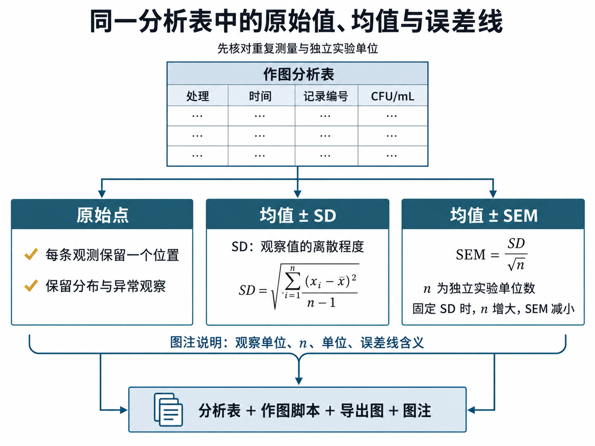
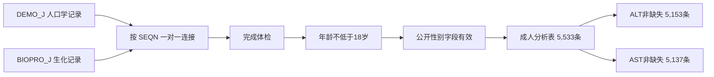
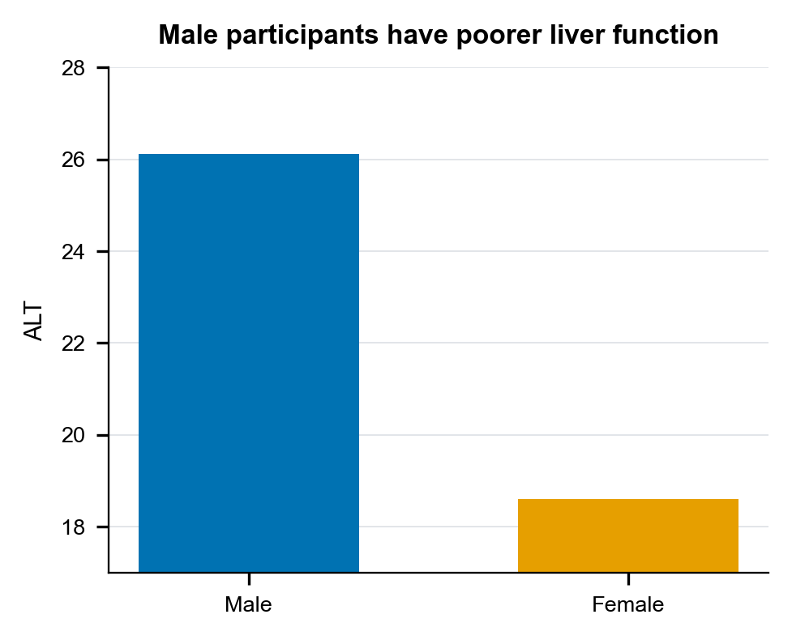
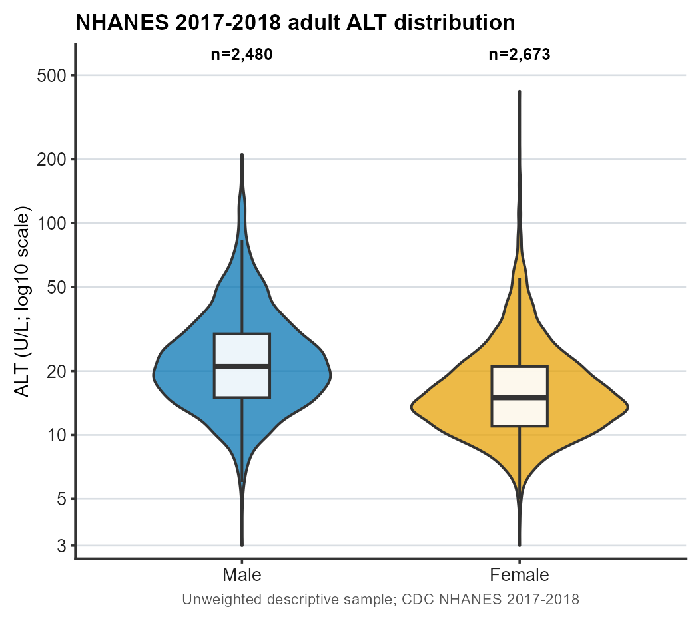
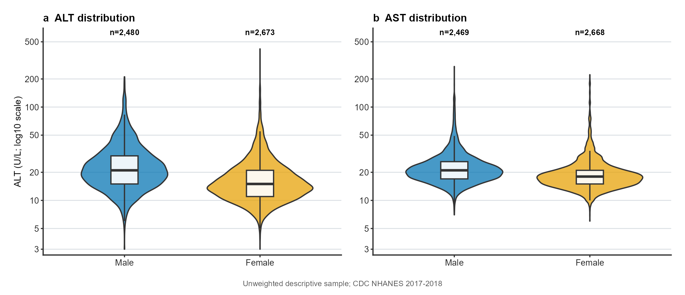
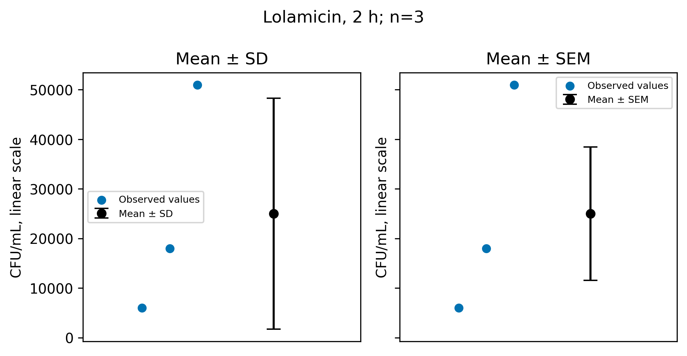
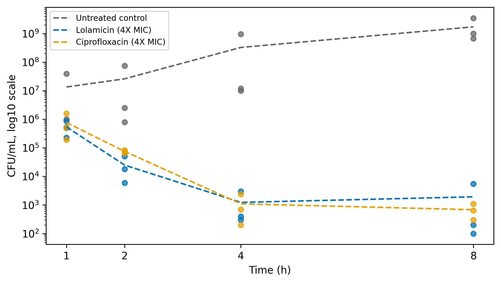

# 第7章 科研图表规范与 SCI 图表表达

## 本章定位

第5章已经说明数据从哪里来，字段代表什么，单位和缺失怎样记录。第6章把分析表整理成长表或宽表，计算描述统计量，并用图形探索分布和关系。第7章继续处理一个实际问题：怎样把探索结果整理成可审阅、可复核、可重画的科研图表。

科研图表统一按问题、数据、视觉编码、图注、导出和人工核验六项检查。该顺序同样适用于基础统计图、PCA、热图、火山图、UMAP 和空间图。

| 前置章节 | 本章接收的内容 | 本章交给后续章节 |
| --- | --- | --- |
| 第3章 AI 任务说明书 | 目标、上下文、约束、验证和输出 | AI 作图任务与人工核验记录 |
| 第5章 数据质量 | 文件、字段、单位、缺失和样本数变化 | 可追踪的数据来源与纳入规则 |
| 第6章 探索性可视化 | 分布、汇总表和初步图形 | 规范图、图注和可复现图表包 |
| 第8至10章 | 统计与模型方法尚未展开 | 图中统计信息和模型图的检查位置 |
| 第11至15章 | 高维矩阵与组学对象尚未展开 | PCA、热图、火山图、UMAP 等图形接口 |

教材顺序与课堂安排有一处差异。教材把第7章放在统计推断之前，让学生先掌握图表表达的基本规则。36 学时课程在第11周集中讲“科研图表规范与 SCI 图表表达”，学生此时已经学过统计推断和基础模型。第一次阅读时，学生先学会检查图中信息。课堂回看时，再把统计量、模型指标和误差线纳入同一套规范。

“SCI 图表表达”是课程主题名称。SCI 是文献索引体系，没有一套适用于所有期刊的统一图表参数。本章讲可迁移的科研图表原则。具体尺寸、字体、线宽、颜色空间和文件格式应以目标期刊的最新指南为准。

## 学习目标

完成本章后，学生应能：

1. 填写一张图表设计规范卡，写清问题、数据、编码、图注和导出要求。
2. 从原始文件追踪到分析表和作图数据表，说明纳入规则、缺失和样本数变化。
3. 检查坐标轴、单位、尺度、图例、颜色、标注、子图和分面。
4. 根据问题和变量结构选择图形，并说明图形的分析信息。
5. 写出可独立阅读的图注，区分观察、统计信息、医学解释和待验证内容。
6. 整理规范卡、作图数据表、脚本、图形、环境和人工核验记录。
7. 比较 ggplot2 与 matplotlib 输出，判断数据语义是否一致。

## 阅读指南

NHANES 2017-2018用于演示记录筛选、ALT/AST图表和图注；Lolamicin时间杀菌记录承接第4至6章，比较全部原始点、均值与不同误差线。两套数据分别回答各自的图表问题。

不必一次运行所有代码。先读数据表和图，再识别代码中的三个动作：读入哪张表，哪些字段映射到图，图保存到哪里。完整脚本用于后续复现和独立核验。

## 核心概念

| 概念 | 本章定义 | 检查方法 |
| --- | --- | --- |
| 图表问题 | 一张图让读者观察的单一问题 | 句子中应有对象、变量和观察任务 |
| 图表设计规范卡 | 作图前记录问题、数据、编码、图注和导出的表格 | 五项均可回到文件、字段或输出 |
| 视觉编码 | 变量映射到位置、颜色、形状、大小、线型等图形属性的规则 | 逐项核对字段与图中元素 |
| 作图数据表 | 生成某张图所需的最小数据表 | 每个点、线或箱体能回到一条或一组记录 |
| 子图 | 组合图中的独立图块，英文常写 panel | 子图标签、顺序和正文引用一致 |
| 分面 | 按变量拆分数据并共享绘图规则，英文为 facet | 各分面使用同一编码和可比尺度 |
| 图注 | 让读者离开正文也能理解图中对象、编码和边界的文字 | 对照图逐项核验，不补图外结论 |
| 可复现图表包 | 规范卡、数据、脚本、图、环境和核验记录的组合 | 换一个目录后仍能重画和检查 |

## 章节总览


```mermaid
flowchart LR
  A["图表问题"] --> B["数据与纳入规则"]
  B --> C["图表设计规范卡"]
  C --> D["视觉编码与图形选择"]
  D --> E["坐标轴、颜色与多子图"]
  E --> F["图注与统计信息"]
  F --> G["作图数据表与脚本"]
  G --> H["渲染和人工核验"]
  H --> I["可复现图表包"]
```



图中点位用于说明图形编码。SD描述观察值的离散程度；SEM为SD除以样本量平方根，表示均值的标准误。正文与练习代码用实际实验表计算。

## 7.1 图表问题、数据来源与视觉编码

一张科研图应先有可观察的问题，再有与问题匹配的数据和视觉编码。若问题是查看分布，图中需要保留个体值或分布形状；若问题是比较组别，分组、样本量和不确定性就要能够被识别。先选图形再寻找数据，容易让熟悉的模板替代真正的分析目标。

数据来源限定图中每个点、柱或色块能够代表什么。视觉编码只把变量映射到位置、颜色、形状或大小，不能补足缺失的研究设计。开始作图前，应把图表问题、观察单位、纳入规则和主要编码写在同一张规范卡中；出图后再逐项核对。

### 从真实数据背景开始

NHANES 是美国国家健康与营养检查调查。公开文件按调查周期发布。每位参与者使用 `SEQN` 作为连接键。人口学文件 `DEMO_J` 包含年龄、公开性别字段、体检状态和调查设计字段；生化文件 `BIOPRO_J` 包含 ALT、AST 等检测指标。

本章使用 2017-2018 周期。分析脚本按 `SEQN` 一对一连接两张表，再保留完成体检、年龄不低于 18 岁且公开性别字段有效的记录。该规则得到 5,533 条成人体检记录。ALT 非缺失记录为 5,153 条，AST 非缺失记录为 5,137 条。

| 文件或表 | 本章使用字段 | 含义 |
| --- | --- | --- |
| `DEMO_J.xpt` | `SEQN` | 参与者编号和连接键 |
| `DEMO_J.xpt` | `RIDSTATR` | 是否完成体检 |
| `DEMO_J.xpt` | `RIDAGEYR` | 筛查年龄，单位为年 |
| `DEMO_J.xpt` | `RIAGENDR` | 公开人口学文件中的性别编码 |
| `DEMO_J.xpt` | `WTMEC2YR`、`SDMVPSU`、`SDMVSTRA` | 调查权重和复杂抽样设计字段 |
| `BIOPRO_J.xpt` | `LBXSATSI` | ALT，单位 U/L |
| `BIOPRO_J.xpt` | `LBXSASSI` | AST，单位 U/L |

数据进入图形前经过四次明确选择。每次选择都会改变分母，必须记录数量和理由。


```mermaid
flowchart LR
  A["DEMO_J 人口学记录"] --> C["按 SEQN 一对一连接"]
  B["BIOPRO_J 生化记录"] --> C
  C --> D["完成体检"]
  D --> E["年龄不低于18岁"]
  E --> F["公开性别字段有效"]
  F --> G["成人分析表 5,533条"]
  G --> H["ALT非缺失 5,153条"]
  G --> I["AST非缺失 5,137条"]
```

表7-1汇总当前纳入记录，所有数量均为未加权记录数，不代表美国成人总体估计。

| 数据口径 | 男性 | 女性 | 合计或说明 |
| --- | ---: | ---: | --- |
| 成人体检记录 | 2,672 | 2,861 | 5,533 |
| ALT 非缺失 | 2,480 | 2,673 | 5,153 |
| ALT 缺失 | 192 | 188 | 380 |
| AST 非缺失 | 2,469 | 2,668 | 5,137 |
| AST 缺失 | 203 | 193 | 396 |

同一张成人分析表生成 ALT 图和 AST 图时，分母已经发生变化。多子图若只写一个总样本量，读者无法判断每个指标实际使用了多少记录。

本章保留调查设计字段，但图形只做未加权记录描述。图中的男性、女性分组来自公开人口学字段。

### 先看记录怎样进入分析表

下面 8 行来自实际分析表。前 6 行同时有 ALT 和 AST，后 2 行的检测值缺失。空白保持为空，没有填成 0。

| SEQN | sex | age_years | ALT_U_L | AST_U_L |
| ---: | --- | ---: | ---: | ---: |
| 93705 | Female | 66 | 16 | 20 |
| 93706 | Male | 18 | 10 | 14 |
| 93708 | Female | 66 | 19 | 21 |
| 93709 | Female | 75 | 15 | 17 |
| 93711 | Male | 56 | 20 | 23 |
| 93712 | Male | 18 | 46 | 35 |
| 93727 | Male | 70 | 缺失 | 缺失 |
| 93732 | Male | 72 | 缺失 | 缺失 |

一张图的可信度从这些记录开始。学生先确认一行代表谁，再确认变量来自哪个文件，随后检查连接、筛选和缺失。只看最终图，无法判断缺失值是否被删除、填补或误写为 0。

### 四项统计思维

统计思维在本章表现为四个检查动作。第一，先定对象和分母。本例的对象是完成体检且符合年龄和字段规则的成人记录。第二，保留缺失。ALT 与 AST 的缺失数不同，两张图的有效样本数也不同。第三，区分样本与总体。本章未使用调查权重，描述范围限于当前分析记录。第四，区分观察与推断。分布图可以显示数值位置和形态，不能单独给出显著性、因果或诊断判断。

| 检查动作 | NHANES 案例中的问题 | 通过标准 |
| --- | --- | --- |
| 定对象和分母 | 哪些参与者进入成人分析表 | 写出体检、年龄和字段规则 |
| 保留缺失 | ALT、AST 缺失怎样处理 | 空值不改成 0，分别报告有效 n |
| 区分样本与总体 | 当前图能否代表美国成人 | 明确“未加权描述” |
| 区分观察与推断 | 图上差异能否写成显著 | 只描述分布，推断转到第8章 |

这些动作也用于文献阅读、科研汇报、质量沟通和项目交接。提问者可以沿着同一顺序核对对象、口径、证据和结论范围。

### 原始数据、分析表与作图数据表

三类数据文件承担不同任务。原始数据用于保存来源，分析表用于统计和多项任务，作图数据表只保留生成某张图所需的字段与记录。

| 数据层级 | 本例文件 | 本章要求 |
| --- | --- | --- |
| 原始数据 | `DEMO_J.xpt`、`BIOPRO_J.xpt` | 只读保存，记录网址、大小和校验值 |
| 分析表 | `nhanes_2017_2018_adult_alt_ast.csv` | 保留连接、筛选、缺失和调查设计字段 |
| 作图数据表 | `nhanes_alt_plot_source.csv` | 只保留 `SEQN`、分组、年龄和 ALT |

下面的代码展示三个关键动作：读表、筛选和计数。代码输出应与材料护照中的 5,533、5,153 和 5,137 一致。

```python
import pandas as pd

df = pd.read_csv("data/raw/nhanes_2017_2018_adult_alt_ast.csv")
print(len(df))                         # 5533
print(df["ALT_U_L"].notna().sum())    # 5153
print(df["AST_U_L"].notna().sum())    # 5137
```

### 图表问题要写成可观察任务

图表问题回答“读者需要从图中观察什么”。问题应具体到对象、变量和任务。它不能预先写入疗效、诊断、机制或显著性。

| 写法 | 审阅结果 | 修改建议 |
| --- | --- | --- |
| 男性肝功能更差 | 含诊断式判断，数据和图形无法支持 | 展示当前成人记录中 ALT 按公开性别字段分组的分布 |
| 看看 ALT 情况 | 对象和任务不清 | 检查 ALT 的分布、高值、缺失和分组样本数 |
| 证明某组 ALT 显著升高 | 预设统计结论 | 比较两组 ALT 分布，并把统计推断留给第8章 |
| 画一张好看的图 | 没有分析问题 | 制作可显示样本点、单位、尺度和 n 的分布图 |

### 填写图表设计规范卡

图表设计规范卡固定使用五项。卡片短，要求具体。每一项都应能回到数据、代码或输出文件。

| 规范卡检查项 | NHANES ALT 案例填写 |
| --- | --- |
| 问题 | 展示当前成人体检记录中 ALT 按公开性别字段分组的未加权分布 |
| 数据 | `DEMO_J` 与 `BIOPRO_J` 按 `SEQN` 连接；成人体检记录 5,533 条；ALT 非缺失 5,153 条 |
| 编码 | x 为 sex，y 为 ALT（U/L）；使用明确标注的 log10 尺度；男性蓝色、女性橙色；显示单个记录 |
| 图注 | 说明数据周期、纳入规则、未加权范围、点与箱体含义、两组 n 和尺度；保留实际数据口径 |
| 导出 | 保存作图数据表、R/Python 脚本、SVG/PDF、300 dpi PNG、环境和人工核验记录 |

视觉编码（visual encoding）指变量怎样进入图。数值可以映射到位置或颜色深浅，分类变量可以映射到颜色、形状或分面，样本可以显示为点。初学者先保证位置、颜色和图例清楚，再增加其他编码。

| 变量角色 | 本例字段 | 视觉编码 | 检查问题 |
| --- | --- | --- | --- |
| 连续变量 | `ALT_U_L` | y 轴位置 | 单位与尺度是否写清 |
| 分类变量 | `sex` | x 轴和颜色 | 组序和配色是否稳定 |
| 样本标识 | `SEQN` | 单个点对应一条记录 | 点是否能回到原表 |
| 多个指标 | ALT、AST | 子图 a、b | 各子图 n 是否分别报告 |

### 规范卡与第3章任务说明书怎样配合

第3章的 AI 任务说明书固定包含目标、上下文、约束、验证和输出。图表设计规范卡是绘图任务的专业附件。两者可以按下表对应，但不能互相替代。

| AI 任务说明书 | 图表设计规范卡提供的信息 | NHANES 例子 |
| --- | --- | --- |
| 目标 | 图表问题 | 展示 ALT 未加权分布 |
| 上下文 | 数据来源和纳入规则 | `DEMO_J`、`BIOPRO_J`、成人体检记录 |
| 约束 | 编码与图注边界 | 蓝橙配色、log10及有效n |
| 验证 | 图表规范检查 | 核对 5,153 条记录和两组 n |
| 输出 | 可复现图表包 | CSV、R/Python、SVG、PNG、session、核验记录 |

学生向 AI 提交绘图任务时，应把规范卡中的真实字段复制到上下文和约束中。LBXSATSI的定义来自数据字典，公开性别字段按原数据标签保存。

## 7.2 坐标轴、图例、颜色、标注与多子图

坐标轴、图例、颜色和标注共同规定读图方式。轴的范围与变换影响差异看起来有多大，图例说明颜色或形状对应哪个变量，标注帮助定位关键对象，多子图则要求不同面板之间保持可比较的尺度和编码。任一元素含义不清，真实数据也可能被错误呈现。

下面先审阅一张故意设置问题的图，再逐项修正。审阅时先确认单位、零点或变换和分组映射，再看标题与注释是否超出数据能够支持的范围。装饰性调整放在这些检查之后，不能用配色或版式掩盖样本量、缺失和不确定性。

### 真实数值也会被错误表达误导

下面的问题图使用 NHANES 的真实 ALT 组均值。图形故意截断纵轴，并使用诊断式英文标题。它没有显示单个记录、单位、缺失和样本数。



图7-1　NHANES ALT 问题图。数据值来自真实公开记录，标题、纵轴范围和信息缺口则是为审阅练习设置的错误表达，不应作为分析结论。

学生先找信息缺口，再讨论样式。下面六项可以直接从页面检查。

| 检查项 | 问题图现状 | 规范要求 |
| --- | --- | --- |
| 标题 | 写成“男性肝功能较差” | 标题只说明对象和变量 |
| 纵轴 | 从 17 开始，放大均值差异 | 范围和转换有明确理由并写入图注 |
| 单位 | 未写 ALT 单位 | 纵轴写 `ALT (U/L)` |
| 分布 | 只显示两个均值柱 | 显示样本分布或个体点 |
| 样本数 | 未报告 n | 图中或图注写明每组有效 n |
| 数据范围 | 未说明未加权 | 图注明确当前分析记录范围 |

### 规范图保留分布和高值

规范图使用同一批 ALT 非缺失记录。男性 2,480 条，女性 2,673 条。图中叠加单个记录和箱体，并标注 log10 尺度。对数尺度用于容纳长尾分布，图注必须说明。



图7-2　NHANES 2017-2018 成人体检记录中 ALT 的未加权分布。每个点代表一条 ALT 非缺失记录；箱体表示四分位范围，中线表示中位数；纵轴使用 log10 尺度。男性 n=2,480，女性 n=2,673。

这次修改没有删除高值，也没有把分布压缩成两个均值。读者可以看到中心位置、离散程度、重叠范围和长尾。第8章继续处理预设比较、效应量和不确定性。

### 同一作图数据表生成 R 与 Python 图

本章保留两种语言，因为课程后续会同时使用 R/Bioconductor 和 Python 数据工具。学生无需背诵全部语法，先核对三组动作：读表、编码、导出。

#### R/ggplot2 的关键动作

```r
alt <- read.csv("outputs/nhanes_ALT_U_L_plot_source.csv")
alt$sex <- factor(alt$sex, levels = c("Male", "Female"))
p <- ggplot(alt, aes(sex, ALT_U_L, fill = sex)) +
  geom_violin(trim = FALSE) + geom_boxplot(width = 0.16) +
  scale_fill_manual(values = c(Male = "#0072B2", Female = "#E69F00")) +
  scale_y_log10() + labs(x = NULL, y = "ALT (U/L)")
ggsave("fig_nhanes_alt_ggplot2.svg", p, width = 89, height = 78, units = "mm")
```

#### Python/matplotlib 的关键动作

```python
alt = pd.read_csv("outputs/nhanes_ALT_U_L_plot_source.csv")
groups = [alt.loc[alt["sex"] == s, "ALT_U_L"] for s in ["Male", "Female"]]
fig, ax = plt.subplots(figsize=(3.5, 3.1))
ax.violinplot(groups, showmedians=True)
ax.set_yscale("log")
ax.set_xticks([1, 2], ["Male", "Female"])
ax.set_ylabel("ALT (U/L)")
fig.savefig("fig_nhanes_alt_matplotlib.svg", bbox_inches="tight")
```

两段代码都读取 `nhanes_alt_plot_source.csv`，使用相同组序、单位和 log 尺度。正式脚本还要叠加样本点、固定颜色、控制随机抖动、写入图注信息，并同时导出 PNG 和矢量图。

| 运行后检查 | R 图 | Python 图 |
| --- | --- | --- |
| 记录数 | 5,153 | 5,153 |
| 组序 | Male、Female | Male、Female |
| 颜色含义 | 男蓝、女橙 | 男蓝、女橙 |
| 纵轴 | ALT（U/L），log10 | ALT（U/L），log10 |
| 输出 | SVG/PDF/PNG | SVG/PDF/PNG |

### 坐标轴和尺度

轴标题至少包含变量名和单位。使用对数转换、标准化、截断或固定范围时，图注和代码要写清。`value`、`score1` 等内部列名不能直接充当正式轴标题。

| 轴检查项 | 通过标准 | 需修改例子 |
| --- | --- | --- |
| 变量 | 能回到数据字典字段 | 只写 `value` |
| 单位 | 数值单位明确，或说明无量纲 | ALT 未写 U/L |
| 尺度 | 原始、log 或标准化尺度明确 | 热图未说明 z-score |
| 范围 | 截断和固定范围有理由 | y 轴从 17 开始且未说明 |
| 类别顺序 | 任务、图例和多图保持一致 | 同一分组顺序反复变化 |

### 颜色、图例和标注

颜色表示变量，不承担统计判断。本章使用蓝色 `#0072B2` 和橙色 `#E69F00` 区分两组。相同组别在单图、多子图和跨工具输出中保持一致。正式项目可使用其他色板，但应通过色觉可辨认性和灰度打印检查。

图例解释颜色、形状、线型和符号。若轴标签已经完整说明两组，图例可以简化；若颜色或形状承载额外变量，图例必须保留。基因名、阈值线和重点样本等标注需要预设规则，不能只挑符合预期的点。

| 元素 | 本章要求 | 人工核验 |
| --- | --- | --- |
| 颜色 | 同一变量使用稳定颜色 | 查看所有输出是否换色 |
| 图例 | 文本与图中编码一致 | 对照类别、形状和线型 |
| 样本点 | 不遮住主体，仍可看出密度 | 缩放后检查点是否成块 |
| 文字标注 | 有选择规则，避免遮挡 | 记录标签生成条件 |
| 阈值线 | 写明来源和数值 | 不把教学阈值写成临床标准 |

### 子图和分面分开检查

子图（panel）是组合图中的独立图块，常用 a、b、c 标识。分面（facet）按某个分类变量拆分同一张图，通常共享绘图规则。两者可能同时出现，含义不能混写。

ALT 和 AST 属于两个指标，适合组成两个子图。它们来自同一成人分析表，但缺失数不同。ALT 男性 n=2,480、女性 n=2,673；AST 男性 n=2,469、女性 n=2,668。图注需要逐图报告。



图7-3　NHANES 2017-2018 成人体检记录中 ALT 与 AST 的未加权分布。a，ALT；男性 n=2,480，女性 n=2,673。b，AST；男性 n=2,469，女性 n=2,668。点、箱体和中线含义同图7-2。两图使用一致配色和 log10 尺度，仅描述当前记录。

| 多子图检查 | 问题 |
| --- | --- |
| 标签 | a、b 是否与正文和图注一致 |
| 顺序 | 指标顺序是否符合阅读逻辑 |
| 编码 | 同一组的颜色、形状和线型是否一致 |
| 尺度 | 轴范围是否需要共享，若不同是否说明 |
| 样本数 | 每个子图的有效 n 是否分别报告 |
| 图例 | 是否可以共享，文字是否完整 |

### 在最终尺寸下检查

屏幕上可读的图，缩到期刊栏宽后可能出现字体过小、线条消失、图例拥挤和标签裁切。最终检查应使用实际导出文件和目标尺寸。

Nature 的研究图形指南可作为教学示例：常见栏宽示例为 89 mm 和 183 mm；正文图中文字常见 5-7 pt，子图标签可使用约 8 pt；线宽示例为 0.25-1 pt；矢量图可用 PDF 或 SVG，位图预览可用 300 dpi PNG，颜色空间按目标要求检查。参数可能更新，投稿前需查目标期刊指南。

## 7.3 按问题和变量选择医药数据图表

图表类型由问题、变量结构和分析信息共同决定。选择前先明确要观察分布、比较组别、检查关系，还是查看高维样本结构；随后确认变量是连续、分类、时间、空间还是矩阵特征。图形名称相同，也可能因观察单位和聚合方式不同而表达完全不同的问题。

选定图形后，还要检查它保留了哪些信息。均值图会隐藏分布，平滑趋势可能弱化原始点；降维坐标则省略了高维距离的构成。合适的图形应让当前问题所需的比较可以被看见，同时把样本、尺度和限制交代清楚，无须容纳与问题无关的信息。

### 问题类型与变量结构选择矩阵

| 图表问题 | 变量结构 | 首选图形 | 必备信息 | 分析信息 |
| --- | --- | --- | --- | --- |
| 一个连续变量怎样分布 | 一个连续变量 | 直方图、点图、经验分布 | 单位、样本范围、n、bin 或点含义 | 分布形态受尺度和 bin 影响 |
| 不同组的连续变量怎样分布 | 连续变量加分组 | 箱线图、小提琴图、散点或区间图 | 每组 n、样本点、中心和离散定义 | 图形重叠不能直接写成无差异 |
| 两个连续变量怎样共同变化 | 两个连续变量 | 散点图 | 两轴单位、缺失、分组和模型线含义 | 共同变化不等于因果 |
| 多个同类指标怎样并列查看 | 多个指标加共同分组 | 多子图 | 子图标签、共同编码、各图 n | 不同指标缺失和尺度需分别说明 |
| 高维样本的主要变化方向 | 矩阵加样本信息 | PCA | 输入矩阵、转换、解释率和分组 | PCA 不证明组间差异 |
| 分类模型在阈值变化下怎样表现 | 真实标签加预测分数 | ROC | 数据范围、阳性定义、AUC 和阈值 | ROC 不直接给出临床阈值 |
| 大量特征的差异大小和证据怎样分布 | 效应量加校正后 P 值 | 火山图 | 阈值、标签规则、输入比较 | 单个点不支持机制结论 |
| 单细胞低维结构怎样展示 | 降维坐标加细胞信息 | UMAP | 输入对象、参数、细胞数和颜色含义 | 二维距离不等于真实生物距离 |

### 一个连续变量：先看分布

ALT 分布具有长尾。若使用直方图，bin 宽度会改变图形细节；若使用箱线图，读者难以看到完整密度；若使用小提琴图，小样本时核密度形态可能不稳定。对 NHANES 这种记录数较多的案例，小提琴图叠加抽样后的透明点可以帮助阅读。对小样本实验，优先显示全部点，并配合箱体或区间。

学生选择图形时要回答两个问题：这个图保留了哪些信息，隐藏了哪些信息。柱形图只显示汇总高度；箱线图概括四分位数；散点或条带图保留个体位置。选择依据来自任务，不来自软件默认主题。

### 两个连续变量：散点图先检查共同变化

年龄与 ALT 可以画成散点图。作图前应删除两列中缺失的记录并报告有效 n。若增加趋势线，需要说明模型或平滑方法。第9章会继续讲相关系数、线性回归、异常点和残差，本章只检查轴、单位、分组、缺失和趋势线说明。

```python
source = df[["SEQN", "sex", "age_years", "ALT_U_L"]].dropna()
ax.scatter(source["age_years"], source["ALT_U_L"], alpha=0.35)
ax.set_xlabel("Age (years)")
ax.set_ylabel("ALT (U/L)")
```

这段代码生成点的位置，但还没有完成正式图。学生仍要决定是否按组着色、是否使用 log 尺度、怎样处理密集重叠、怎样写图注，以及导出哪些文件。

### 高维图形保留检查接口

PCA、热图、火山图和 UMAP 会在后续章节详细讲解。本章只建立检查接口，避免学生把复杂图形当成自动结论。

| 图形 | 本章检查接口 | 后续章节 |
| --- | --- | --- |
| PCA | 输入矩阵、转换或标准化、PC解释率、样本颜色和形状 | 第11章 |
| 聚类热图 | 行列对象、数值尺度、距离、聚类方法、注释条 | 第11、12章 |
| 火山图 | 效应量、校正后 P 值、阈值和标签规则 | 第12章 |
| ROC | 阳性定义、数据划分、阈值、AUC 和置信区间 | 第9、10章 |
| UMAP | 输入对象、邻居图、参数、细胞数、颜色和注释依据 | 第14章 |

学生在第7章完成“看图和查字段”。后续章节再学习这些图形背后的统计方法、算法参数和专业解释。

### 同一数据可以提出不同图表问题

同一份 NHANES 分析表可以生成多张图。图形不同，问题也不同。学生不能先浏览软件图形库，再挑一张看起来复杂的图。

| 图表问题 | 使用字段 | 建议图形 | 本章能写的观察 |
| --- | --- | --- | --- |
| ALT 在当前记录中怎样分布 | `ALT_U_L` | 直方图或经验分布 | 分布范围、长尾和高值位置 |
| ALT 在两个公开分组中怎样分布 | `sex`、`ALT_U_L` | 小提琴图、箱线和点 | 两组中心、离散和重叠 |
| 年龄与 ALT 怎样共同变化 | `age_years`、`ALT_U_L` | 散点图 | 点云范围和可能的非线性结构 |
| ALT 与 AST 是否同时出现高值 | `ALT_U_L`、`AST_U_L` | 散点图 | 两指标的共同分布 |
| ALT 和 AST 怎样并列展示 | 指标、数值、分组 | 多子图 | 两指标分布与各自有效 n |

图形选择还要考虑记录数。Lolamicin每个处理和时间的3条记录适合显示全部点。5,153 条 ALT 记录若全部使用不透明点，中心区域会严重重叠。可以降低透明度、使用抖动或显示分布轮廓，但不能因此删除高值记录。

### 图形审阅按三层推进

学生面对陌生图形时，可先完成三层检查。第一层看数据对象，确认一行或一个点代表什么。第二层看编码，确认位置、颜色、形状和子图对应哪些字段。第三层看分析信息，判断图形观察是否被写成统计、因果或医学结论。

| 层级 | 核心提问 | 常见错误 |
| --- | --- | --- |
| 数据对象 | 一个点、一条线或一个箱体来自哪些记录 | 把细胞数当样本数 |
| 视觉编码 | 颜色、形状、尺度和分面映射哪些变量 | 同一颜色在不同图中表示不同组 |
| 分析信息 | 当前图直接支持什么 | 把 PCA 分离写成显著差异 |

## 7.4 图注写作与统计信息呈现

图注把图中的视觉对象重新连接到数据和方法。读者不查看正文时，也应能从图注知道每个面板展示什么、颜色和符号怎样编码、样本如何纳入、误差线或统计符号代表什么。图注缺少这些信息时，图形往往只能提供印象，不能独立复核。

统计信息应与图中实际呈现相匹配。若图显示描述性分布，就报告观察数和汇总口径；若加入检验结果，则说明比较对象、方法、多重校正和不确定性。图注只报告已经由输出支持的结果，不把视觉趋势扩写成因果、疗效或机制判断。

### 图注要让图可以独立阅读

图注承担六项信息：图的对象、视觉编码、样本与缺失、统计或尺度、缩写、分析信息。标题只说明图的身份，图注需要解释读图规则。

| 图注部分 | 应回答的问题 | NHANES ALT 示例 |
| --- | --- | --- |
| 对象 | 图展示谁和什么变量 | 2017-2018 成人体检记录中的 ALT |
| 编码 | 点、箱体、颜色和子图表示什么 | 点为记录，箱体为四分位范围，颜色为公开性别字段 |
| 样本与缺失 | 哪些记录进入图 | ALT 非缺失；男性 2,480，女性 2,673 |
| 统计或尺度 | 中线、误差线和坐标怎样定义 | 中线为中位数，纵轴为 log10 尺度 |
| 缩写 | 首次出现的缩写怎样解释 | ALT，alanine aminotransferase |
| 边界 | 图不能支持什么 | 未加权描述，不作总体估计或诊断 |

### 逐句改写越界图注

问题图注可以写成：“男性参与者肝功能显著较差，提示更高的肝病风险。”这句话加入了显著性、诊断和风险判断。当前图形没有统计检验、临床诊断、参考区间或风险模型，无法支持这些内容。

| 原句成分 | 问题 | 改写动作 |
| --- | --- | --- |
| 男性参与者肝功能较差 | ALT 被直接替换成诊断判断 | 写回具体变量和数据范围 |
| 显著 | 未提供检验、效应量和区间 | 删除，统计推断交给第8章 |
| 提示更高肝病风险 | 未提供结局和风险模型 | 删除，不补临床判断 |
| 未说明样本数和缺失 | 读者无法核对分母 | 补两组 n 和非缺失规则 |
| 未说明尺度 | 图形外观难以复核 | 写明 log10 纵轴 |

合格图注可写为：

> 图7-2　NHANES 2017-2018 成人体检记录中 ALT 的未加权分布。每个点代表一条 ALT 非缺失记录；箱体表示四分位范围，中线表示中位数。男性 n=2,480，女性 n=2,673。纵轴使用 log10 尺度。图中分组来自公开人口学字段。

### 统计信息的最低说明

本章不提前讲检验选择，但图注要给统计信息留出明确位置。SD、SE 和 CI 含义不同，不能只写“误差线”。

| 场景 | 图注至少说明 | 方法学习位置 |
| --- | --- | --- |
| 描述分布 | n、中心统计量、离散定义、缺失和尺度 | 第6章与本章 |
| 两组比较 | 每组 n、比较指标、效应量或区间、检验方法 | 第8章 |
| 多组比较 | 每组 n、总体检验、多重比较或校正方法 | 第8章 |
| 相关与回归 | 有效 n、相关或模型方法、区间和异常处理 | 第9章 |
| 分类模型 | 阳性定义、训练/测试范围、阈值、AUC 或混淆矩阵 | 第9、10章 |
| 高维筛选 | 输入矩阵、比较、效应量、校正方法、标签规则 | 第12章 |
| 单细胞图 | 样本与细胞数、过滤、参数、注释依据 | 第14章 |

图注中的数字必须来自数据、脚本输出或文献来源。不能根据图上点的位置估算样本量、P 值或效应量。

### SD、SE 和 CI 要写出全称与含义

标准差（standard deviation, SD）描述当前数据的离散程度。标准误（standard error, SE）描述某个估计量在重复抽样意义下的不确定性。置信区间（confidence interval, CI）给出按指定方法构造的区间。三者回答的问题不同。

| 图注写法 | 审阅结果 | 修改 |
| --- | --- | --- |
| 点为均值，线为误差 | 不清楚误差线类型 | 写明 mean ± SD、mean ± SE 或 95% CI |
| 阴影表示可信范围 | 缺计算对象和方法 | 写明回归均值的 95% CI 或预测区间 |
| 星号表示显著 | 缺检验、阈值和校正 | 写明检验、比较、P 值口径和多重校正 |
| 箱体表示误差 | 混淆箱线图与误差线 | 写明四分位范围、中位数和须线规则 |

第7章要求把这些信息写进图注。第8章再解释它们怎样计算、何时使用以及怎样联系效应量和实际意义。

### 图注动词按证据层级选择

图注以描述为主。动词应对应当前证据层级，避免用一个强动词代替缺失的方法或证据。

| 证据层级 | 可用表达 | 使用边界 |
| --- | --- | --- |
| 图中直接观察 | 显示、分布于、位于、重叠 | 只写图上可见对象和位置 |
| 统计结果 | 估计、比较、相关、区间为 | 同时给方法、数值和数据范围 |
| 支持性模式 | 提示、与……一致 | 明确替代解释和仍需验证内容 |
| 医学或机制判断 | 需进一步证据 | 不由单张图注完成 |

### 同一组三条值，怎样选择误差线

第4章从Lolamicin 2小时的6000、18000、51000 CFU/mL计算均值25000。第6章按处理和时间汇总36行记录，本章接着决定怎样把这些数放进图中。先保留三条原始值，再讨论汇总和误差线，读者便能看到每个统计量来自哪里。

样本标准差SD的计算先求每个值与均值的差。这三个差依次为−19000、−7000、26000；平方后相加得到1086000000。用n−1=2作分母，再开平方，得到SD约23302.36 CFU/mL。均值标准误SEM按SD/√n计算，在本例中约13453.62 CFU/mL。

```python
values = pd.Series([6000, 18000, 51000])
n = values.count()
mean_cfu = values.mean()
sd_cfu = values.std(ddof=1)
sem_cfu = sd_cfu / n ** 0.5
print(n, mean_cfu, sd_cfu, sem_cfu)
```

count数非缺失值，所以n为3；mean计算算术均值；std的ddof=1令方差分母为n−1。`n ** 0.5`计算n的平方根。程序依次输出3、25000、约23302.36和13453.62，与前面的手算对应。SD概括这三条值的离散，SEM用于表示在相应抽样和独立重复条件下均值的不确定性。图注须写出使用哪一个统计量。



图7-4　Lolamicin 4×MIC、2小时记录的两种汇总表示。蓝点分别为6000、18000、51000 CFU/mL。黑点为算术均值25000，左图误差线为均值±样本SD，右图为均值±SEM；每图使用同一组三条值，纵轴为线性尺度。重复说明沿用作者原图注。

两个面板的原始点和黑点均相同，右侧误差线较短来自除以√3。判断图是否被改变时，应分别核对原始值、中心统计量和误差线定义。把SD换成SEM会改变图中线的长度，输入数据没有发生变化。

现有36行表保留处理、时间、单位及source_cell。每个处理和时间都先取出三条值，再以相同规则计算n、mean、sd、sem。2小时这组三条值可以作为整张汇总表的手算核对点；还可选Ciprofloxacin 4小时的700、2400、200，核对均值1100。

### 对数纵轴下先确定计算尺度

CFU/mL跨越多个数量级，原始点图使用对数纵轴可以同时展示高值和低值。本章先在原始CFU/mL上求算术均值，再把这个均值画到对数纵轴上。它与先对每个值取log、再计算平均的做法不同。

```python
arithmetic_mean = values.mean()
mean_log10 = np.log10(values).mean()
geometric_mean = 10 ** mean_log10
print(arithmetic_mean, geometric_mean)
```

算术均值先相加再除以3。另一段计算先把三个值转换成log10，平均后取10的相应次方，得到几何均值。学生可以分别运行并核对两个结果，再在图注写清中心统计量及计算尺度。纵轴显示方式由set_yscale设置，统计量由前面的代码计算；二者分别检查。

SD误差线有时会给出低于0的下端点。例如8小时三条值为200、5500、100，算术均值约1933.33，而SD大于均值。mean−SD是对称误差线的计算端点；原始三条观测仍都是正数。对数轴无法表示这个非正端点。此时先查看数据和计算定义，再选择线性图、单独展示原始点，或适合当前统计目标的区间方法。独立练习会让你实际修改时间并查看输出。

### 由记录核对复现的三层信息

复现图表时，数据层核对每个值与来源位置；计算层核对分组和统计量；表达层核对颜色、点、线、单位及尺度。Lolamicin三条值对应E3/F3/G3，均值25000可由手算复核；画图的点形和字体则属于表达层。

| 层级 | 本例核对对象 | 保留文件 |
| --- | --- | --- |
| 数据 | 36个值、处理、时间、CFU/mL与源单元格 | 原始CSV与作图数据表 |
| 计算 | 12组，每组三条；n、均值、SD、SEM与计算尺度 | 汇总CSV与脚本 |
| 表达 | 颜色、原始点、中心线、误差线、轴与图注 | PNG、SVG/PDF与规范卡 |

同一CSV在R和Python中重新汇总后，比较相同处理和时间的数值。改变颜色或字号后，12组统计量应保持不变；改变分组字段或统计尺度后，输出需要重新核对。这样能分辨一次修改发生在计算过程还是图形呈现。

## 7.5 作图数据表、脚本与可复现导出

可复现图表由作图数据、脚本、参数、图注和导出文件共同组成。作图数据说明哪些记录进入图，脚本落实转换和编码，参数固定统计或尺度选择，图注解释读图规则，导出文件则保存最终呈现。只保留图片会丢失生成过程，只保留脚本也无法证明使用了哪一版输入。

复核时按这条依赖链逆向检查。先确认最终图片和图注一致，再回查视觉编码与脚本，最后核对作图数据、纳入规则和来源许可。R 与 Python 只需保持数据语义、坐标和分组一致，不要求像素完全一致。任何输入或规则改变后，都应判断图表是否需要重新生成。

| 核验项 | 最低记录 |
| --- | --- |
| 数据 | 来源、纳入规则、缺失、分组和每图有效 n |
| 参数 | 转换、统计量、阈值、随机种子和软件版本 |
| 图形 | 坐标、单位、尺度、颜色、形状、子图和标签 |
| 来源 | 图注、引用、许可或重绘说明 |
| 导出 | 作图数据、脚本、SVG/PDF、PNG 和最终尺寸检查 |

### 从36行记录到12组汇总，保留两张作图表

原始点图需要36条value及处理、时间；均值线需要12组汇总。将二者分别保存，能够解释图中哪一层使用原始记录，哪一层使用汇总值。

```python
df = pd.read_csv("data/raw/lolamicin_ecoli_timekill.csv")
summary = (df.groupby(["treatment", "time_h"], sort=False)["value"]
             .agg(n="count", mean="mean", sd="std").reset_index())
summary["sem"] = summary["sd"] / np.sqrt(summary["n"])
df.to_csv("outputs/lolamicin_plot_source.csv", index=False)
summary.to_csv("outputs/lolamicin_summary_python.csv", index=False)
```

groupby中的两个字段共同定义一组，因此同一时间不同处理分别汇总。方括号取value列；agg一次生成n、mean、sd三列，左边名称决定输出列名，右边指定计算。reset_index把分组字段恢复为普通列，后续按treatment选择仍使用列名。SEM列由已经算出的SD和n逐行计算。运行后summary为12行，df仍为36行；保存时index=False避免将程序行号写成新的数据字段。

接着画全部原始点及12组算术均值。先按处理逐次取出一张part，再将time_h与value送入scatter；均值线从summary中选同一处理，按时间排序后交给plot。

```python
fig, ax = plt.subplots(figsize=(7, 4))
for treatment, part in df.groupby("treatment", sort=False):
    ax.scatter(part["time_h"], part["value"], color=colors[treatment])
    means = summary.loc[summary["treatment"] == treatment].sort_values("time_h")
    ax.plot(means["time_h"], means["mean"], "--",
            color=colors[treatment], label=treatment)
ax.set_yscale("log")
ax.set_xlabel("Time (h)")
ax.set_ylabel("CFU/mL, log10 scale")
ax.legend()
```

本循环重复3次，每次scatter取得12条原始记录，plot取得4个时间均值。colors是处理名称与色值的字典，点和均值线都从同一字典查颜色。`"--"`设置虚线；这条线连接同一处理的各时间均值。source_cell保留在作图数据表中，读者仍能回查某个点，例如2小时Lolamicin的51000来自G3。



图7-5　E. coli BW25113时间杀菌记录。点代表作者表中的CFU/mL值，每个处理和时间各三条；虚线连接各时间的算术均值。横轴为取样时间1、2、4、8小时，纵轴为对数尺度；处理标签与配色保持一致。来源为作者ED Fig.3a工作表。

图中对照组的数值跨度较大，原始点显示了这部分差异。若只画均值线，读者会失去同一时间内的离散信息。因此点和线分别保留。检查时先回到CSV核对三个点，再检查汇总行，最后观察图中位置。

### R与Python读取同一份CSV

R对照使用同一36行表，分别按处理和时间切成12组。在每组中数非缺失值、求mean和sd，再计算sem。完整演示采用基础R，免去绘图扩展包安装；既有NHANES例仍展示ggplot2写法。

```r
df <- read.csv("data/raw/lolamicin_ecoli_timekill.csv")
parts <- split(df, list(df$treatment, df$time_h), drop=TRUE)
summary <- do.call(rbind, lapply(parts, function(x) {
  data.frame(treatment=x$treatment[1], time_h=x$time_h[1],
             n=sum(!is.na(x$value)), mean=mean(x$value), sd=sd(x$value))
}))
summary$sem <- summary$sd / sqrt(summary$n)
```

split的结果是由多张组内小表组成的列表。lapply依次把每张小表传给函数中的x，返回一行结果；rbind把12行结果接成一张表。R的sd与Python默认分母n−1相同。两张汇总表的行序可能不同，比较时按treatment和time_h对齐，逐组核对n、mean、sd、sem。

| 必须一致 | 可以不同 |
| --- | --- |
| 同一36行输入与来源字段 | 表格打印的小数位 |
| 每组处理、时间、n与统计量 | 汇总行的显示顺序 |
| 点的值、轴单位与尺度 | 字体与留白 |
| 颜色和处理标签的含义 | 图例位置与内部文件结构 |

### 导出也是脚本中的一步

PNG供预览，SVG/PDF保存可缩放的线和文字。下面把同一fig依次导出三种格式。

```python
fig.tight_layout()
for extension in ["png", "svg", "pdf"]:
    fig.savefig(f"outputs/lolamicin_points_means_python.{extension}",
                dpi=300, bbox_inches="tight")
plt.close(fig)
```

tight_layout调整子图与标签的间距；循环中的extension依次为三个扩展名，f字符串把它接入文件名。dpi设置PNG像素密度，SVG/PDF中的矢量线和文字仍按矢量保存；bbox_inches缩紧输出边界，导出后仍需实际打开检查图例、长标签和裁切。close结束当前画布，后续再创建新图。

### 可复现图表包

一张可提交图应配套保存规范卡、作图数据表、脚本、正式图、预览图、环境和核验记录。PNG 便于预览，SVG 或 PDF 便于编辑和正式使用。截图不能替代脚本导出。

```text
fig_lolamicin_timekill/
├── fig_lolamicin_timekill_design.md
├── lolamicin_ecoli_timekill.csv
├── fig_lolamicin_timekill_ggplot2.R
├── fig_lolamicin_timekill_matplotlib.py
├── fig_lolamicin_timekill.svg
├── fig_lolamicin_timekill.pdf
├── fig_lolamicin_timekill_preview.png
├── session.txt
└── ai_review.md
```

| 文件 | 最低要求 |
| --- | --- |
| `*_design.md` | 问题、数据、编码、图注和导出五项 |
| 作图数据表 | 只含重画所需记录和字段，不覆盖原始文件 |
| R/Python 脚本 | 使用相对路径，能独立重画，记录随机种子和关键参数 |
| SVG/PDF | 正式矢量输出，重新打开检查字体和裁切 |
| PNG | 预览图，按目标用途设置分辨率 |
| `session.txt` | R/Python 版本和关键包版本 |
| `ai_review.md` | AI 输出摘要、警告、人工修改和最终核验 |

### AI 作图后的人工核验

AI 可以根据自然语言生成绘图代码。任务说明应带上图表设计规范卡，避免 AI 猜字段、单位和类别顺序。生成图以后，学生逐项核验数据、编码、文字、警告和文件。


```mermaid
flowchart LR
  A["填写规范卡"] --> B["提交真实字段和约束"]
  B --> C["AI生成局部代码"]
  C --> D["本地运行和渲染"]
  D --> E["核对数据、编码和图注"]
  E --> F["修改并重新导出"]
  F --> G["保存人工核验记录"]
```

| 核验项 | 学生检查什么 | 常见问题 |
| --- | --- | --- |
| 数据 | 文件、行数、缺失和筛选 | AI 自动删除缺失却未记录 |
| 编码 | 字段、组序、颜色、形状和尺度 | 类别顺序改变，颜色含义互换 |
| 文字 | 标题、轴、图例、图注和缩写 | AI 补写显著性或诊断 |
| 运行 | 警告、字体替换、裁切和空图 | 导出成功但文字被截断 |
| 留痕 | 提示词、修改、版本和最终文件 | 只保存最后一张图片 |

第3章的 AI 任务说明书仍然有效。图表设计规范卡说明图要怎样表达；AI 任务说明书说明 AI 可以做什么、怎样验证和输出到哪里。两份文件承担不同责任，应一起进入课程项目记录。

### 一份可执行的AI作图说明

完成规范卡后，再把真实字段和核对值传给AI。下面的任务只调整已经学会的图形表达。

```text
根据lolamicin_ecoli_timekill.csv生成原始点与均值线图。
输入36行，一行是指定处理、时间及源列中的CFU/mL值。
横轴time_h，纵轴value，颜色对应treatment。
保留全部36个点；按treatment和time_h计算12组算术均值。
灰色对照，蓝色Lolamicin，橙色Ciprofloxacin。
纵轴用对数尺度，轴写Time (h)和CFU/mL。
保存原始作图表、12组汇总、SVG/PDF/300 dpi PNG。
核对Lolamicin 2小时均值25000，Ciprofloxacin 4小时均值1100。
```

运行后，记录自己的实际检查。规范卡规定数据和表达，记录表说明AI进行了哪项修改、本人怎样核对。没有发现错误时，写出检查依据即可。

| 记录项 | 本人应填写 |
| --- | --- |
| 输入 | 文件版本、36行、真实字段及来源位置 |
| 修改 | AI建议与本人采用的具体语句 |
| 计算 | 12组、每组三条、指定均值核对 |
| 图形 | 全部点、颜色、单位、尺度、图例 |
| 导出 | 文件是否生成并实际打开 |

### 先处理阻断项，再处理样式

图表审阅可以分成三个等级。阻断项会改变数据或结论，必须先修正。修改项影响可读和复核，应在提交前完成。润色项只影响版式，可在数据语义确认后处理。

| 等级 | 例子 | 处理 |
| --- | --- | --- |
| 阻断项 | 读错文件、删除样本、组别互换、单位错误、图注新增显著性 | 停止提交，回到数据和脚本 |
| 修改项 | 轴标题不全、颜色不稳定、子图 n 缺失、字体过小、图例遮挡 | 修订后重新导出并复核 |
| 润色项 | 图例位置、边距、轻微线宽和留白差异 | 数据语义确认后调整 |

这种分级也适用于同伴审阅。先指出会改变结论的问题，再处理美观。反馈需要写明对象和修改理由，例如“子图 b 的 AST 有效样本数应单独报告”，避免只写“图不好看”。

### 可复现故障排查

图表包文件齐全后，还要验证能否在新的工作目录中运行。常见失败来自路径、依赖、字体、随机性和导出设备。

| 故障 | 检查位置 | 修复要求 |
| --- | --- | --- |
| 找不到 CSV | 当前工作目录和相对路径 | 从项目根目录或脚本位置构造路径 |
| R/Python 图样本数不同 | 筛选、缺失和类别处理 | 打印行数和每组 n，比较作图数据表 |
| 颜色顺序变化 | factor/category 顺序 | 在代码中固定类别和颜色映射 |
| 点的位置每次变化 | 抖动或随机抽样 | 固定随机种子并记录 |
| SVG 字体替换 | 系统字体和导出设备 | 使用可用字体，重新打开检查 |
| PDF 或 PNG 被裁切 | 画布、边距和 `bbox` | 在最终尺寸下检查完整边界 |
| 脚本运行但图为空 | 字段类型、筛选结果和坐标范围 | 打印数据摘要，停止空结果导出 |

重画测试不要求在所有计算机上得到字节完全相同的文件。数据记录、坐标、分组、标签和解释应一致。软件版本造成的细微渲染差异需要记录，不能隐去。

### 文件名也承担核验功能

文件名应能区分数据、工具、计算路线和用途。`final2.png`、`new_new.svg` 无法说明文件来源。下面的命名可以直接用于课程项目。

| 文件 | 建议命名 | 说明 |
| --- | --- | --- |
| 规范卡 | `fig07_lolamicin_timekill_design.md` | 本图的五项规范 |
| 作图数据表 | `fig07_lolamicin_timekill_source.csv` | 36行时间杀菌记录 |
| R脚本 | `fig07_lolamicin_timekill_ggplot2.R` | ggplot2实现 |
| Python脚本 | `fig07_lolamicin_timekill_matplotlib.py` | matplotlib实现 |
| 正式图 | `fig07_lolamicin_timekill.svg` | 可编辑矢量图 |
| 预览图 | `fig07_lolamicin_timekill_preview.png` | 快速审阅 |
| 环境记录 | `fig07_lolamicin_timekill_session.txt` | 软件与包版本 |
| 人工核验 | `fig07_lolamicin_timekill_ai_review.md` | AI参与和修改记录 |

若同一图同时保留不同数据版本或统计尺度，可在文件名加入 `raw_scale`与`log_scale`。两条计算路线不覆盖彼此。

## 常见误区

| 误区 | 具体风险 | 修改动作 |
| --- | --- | --- |
| 先画图，再寻找问题 | 图形容易服务预设结论 | 先填写问题和数据两项 |
| 缺失值直接删除 | 分母和样本数变化不可追踪 | 保存筛选规则并报告有效 n |
| 只显示均值柱 | 分布、重叠和高值被隐藏 | 显示样本点或分布图 |
| 颜色每页变化 | 读者可能误读分组 | 建立项目配色表 |
| 子图共用一个 n | 指标缺失不同，样本数被混写 | 每个子图分别报告 |
| 图注加入显著或诊断 | 结论超出图中证据 | 回到数据、方法和边界逐句核验 |
| R 与 Python 图像素不同就判错 | 把样式差异当成数据差异 | 先检查数据语义和坐标 |
| 只保存 PNG 或截图 | 无法重画和审阅 | 整理可复现图表包 |
| AI 生成后直接提交 | 字段、筛选和文字可能被改动 | 本地运行并签署核验记录 |

## 核验清单

- 图表问题说明对象、变量和观察任务，没有预设统计或医学结论。
- 数据来源能回到文件、字段、连接、筛选和缺失规则。
- 原始数据、分析表和作图数据表分开保存。
- 坐标轴包含变量、单位和尺度。
- 颜色、形状、线型、图例和类别顺序在项目内一致。
- 子图与分面的含义明确，子图标签和正文引用一致。
- 每个图或子图的有效样本数可以复核。
- 误差线、区间、阈值和模型线写明定义或来源。
- 图注说明对象、编码、样本、统计或尺度、缩写和分析信息。
- R 与 Python 输出使用同一数据和编码规则。
- 正式图在最终尺寸下重新打开，文字、线条和裁切正常。
- 图表包包含规范卡、数据、脚本、图、环境和人工核验记录。
- AI 参与作图或图注时，保留原始任务、输出摘要、人工修改和最终结果。

## 知识结构


```mermaid
flowchart LR
  R["第7章"] --> N1["7.1 图表问题、数据来源与视觉编码"]
  N1["7.1 图表问题、数据来源与视觉编码"] --> N2["7.2 坐标轴、图例、颜色、标注与多子图"]
  N2["7.2 坐标轴、图例、颜色、标注与多子图"] --> N3["7.3 按问题和变量选择医药数据图表"]
  N3["7.3 按问题和变量选择医药数据图表"] --> N4["7.4 图注写作与统计信息呈现"]
  N4["7.4 图注写作与统计信息呈现"] --> N5["7.5 作图数据表、脚本与可复现导出"]
```

## 实验或作业

### 作业：审阅并重做两张真实数据图

| 项目 | 要求 |
| --- | --- |
| 输入1 | NHANES ALT 问题图、分析表和作图数据表 |
| 输入2 | Lolamicin36行表与Python/R输出 |
| 任务1 | 为 NHANES ALT 图填写五项图表设计规范卡 |
| 任务2 | 修改标题、轴、单位、尺度、样本点、颜色和样本数说明 |
| 任务3 | 为 ALT/AST 多子图写完整图注 |
| 任务4 | 比较Lolamicin的R与Python汇总和图形，列出必须一致和可以不同的信息 |
| 任务5 | 提交一份可复现图表包和 AI 人工核验记录 |

### 提交核验

| 交付项 | 通过标准 |
| --- | --- |
| 数据追踪 | 文件、字段、纳入、缺失和有效 n 准确 |
| 规范卡 | 五项完整，内容能回到数据或输出 |
| 图形表达 | 轴、单位、尺度、颜色、点和子图清楚 |
| 图注 | 对象、编码、样本、尺度和边界完整 |
| 跨工具核验 | 能区分数据语义与样式差异 |
| 可复现性 | 数据、脚本、图、环境和记录齐全 |
| AI 责任 | 能说明 AI 做了什么、人工改了什么 |

## 练习入口

本章[练习包开始说明](../../teaching/chapter-practice.md#chapter-7)提供NHANES5533行成人分析表、Lolamicin36行来源记录、数据字典、图表规范卡、Python/R完整脚本与独立修改任务。脚本从解压根目录运行，输出到outputs。数据来源详见包内sources.md；原始NHANES文件哈希和纳入规则保存于来源元数据。

先运行演示并核对指定数值，再完成一次只改变数据筛选或图形参数的任务。向同伴交付作图数据与脚本，让对方在新目录重画并解释某一个点对应的记录。

## 本章总结与分析范围

科研图表从明确的问题和同一分析表出发，保留观察值、统计量、编码和导出之间的对应。NHANES的ALT和AST有效记录数分别核对；Lolamicin的36个原始值与12组汇总分别保存，SD、SEM和计算尺度写清。图表包让同伴从图片回到数据，并在新目录重新生成结果。

NHANES本章采用未加权记录描述，总体推断需要复杂抽样设计及相应方法；ALT/AST分布本身不提供诊断或临床建议。Lolamicin图描述原研究条件下的培养计数记录，时间均值线没有补充跨时间样本身份，也不将图形外观推广为临床疗效。PCA、热图、ROC、火山图和UMAP的计算与专业解释在相应章节展开。图注中的统计、医学和机制判断须与实际数据和方法相符。

推荐让AI协助局部绘图、排错或文字调整，规范卡先给出真实字段与核对要求。学生检查数据记录、统计定义、视觉编码和实际导出，说明采用了哪些修改，并对最后的图与解释负责。


## 本章练习包

[下载第7章学生练习包](../../downloads/chapter-07-practice.zip) · [查看全书练习包](../../teaching/chapter-practice.md)
