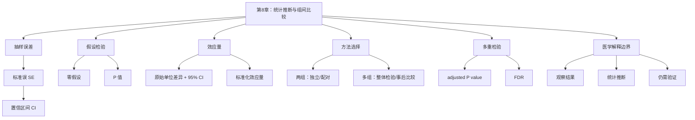

# 第8章 统计推断与组间比较

## 本章定位

第8章把分组汇总、箱线图、误差线和图注规范推进到统计推断。学生不再只回答“两组看起来是否不同”，还要说明差异大小、不确定性、检验前提、报告字段和医学解释边界。

本章仍处在提示词编程（Prompt Coding）阶段。AI 可以辅助生成局部 Python 和 R 代码、解释报错、整理结果表、审阅统计说明。变量含义、分组独立性、检验前提、样本重复结构和医学边界，必须由学生人工核验。

| 本章承接 | 本章训练 | 后续使用 |
| --- | --- | --- |
| 第6章分组汇总、描述统计和探索性图表 | 抽样误差、置信区间、P 值、效应量、两组和多组比较 | 第9章相关与回归、第10章模型评估、第12-15章组学结果解释 |
| 第7章的图表设计规范和图注要求 | 在图表之外补充样本量、方法、区间、效应量和边界 | 科研图表、课程项目报告和综合答辩 |

本章贯穿案例采用一张教学模拟 ALT/AST 分组比较表。`control` 和 `treatment` 只是教学分组名，ALT、AST 单位写作 U/L 也只用于演示统计表达。本章不提供临床阈值、疗效判断、诊断建议或机制解释。

## 学习目标

1. 学生能解释抽样误差、标准误和置信区间，并说明置信区间不是个体取值范围。
2. 学生能解释 P 值依赖零假设和检验前提，避免把 P 值写成“结论正确概率”。
3. 学生能根据变量类型、组数、配对关系和前提检查选择基础组间比较方法。
4. 学生能报告原始单位差异和 95% CI，把标准化效应量作为补充信息。
5. 学生能说明多重检验为什么会增加偶然阳性风险，并能解释调整后 P 值和 FDR 的入门含义。
6. 学生能写出不越界的统计结论，区分观察结果、统计检验、医学解释和仍需验证内容。

## 阅读指南

先读 8.1 和 8.2，掌握估计不确定性和 P 值的边界。再读 8.3，把两组比较拆成变量类型、分组结构和检验前提。8.4 处理多组、多指标和组学结果中的多重检验。8.5 是报告门槛，课程项目中的统计结论都要按这一节审阅。

| 读到哪里 | 应能回答的问题 | 学习证据 |
| --- | --- | --- |
| 8.1 | 均值、SD、SE、95% CI 分别回答什么 | 写出一张分组汇总表的解释 |
| 8.2 | P 值、效应量和实际意义有什么区别 | 改写一句越界结论 |
| 8.3 | 为什么不能直接把两列数丢进 t 检验 | 提交检验前检查表 |
| 8.4 | 为什么多个指标不能只挑 P < 0.05 | 解释 BH 校正前后差异 |
| 8.5 | 统计结论怎样不越过医学证据 | 审阅一段统计说明 |

## 核心概念速查

| 概念 | 本章解释 | 常见混淆 | 需保留英文 |
| --- | --- | --- | --- |
| 抽样误差 | 样本统计量因抽样而产生的波动 | 把一次样本均值当总体真值 | sampling error |
| 标准差 | 样本内个体值的分散程度 | 与标准误混用 | standard deviation, SD |
| 标准误 | 估计量不确定性的量化，常写作 SE | 写成个体差异 | standard error, SE |
| 置信区间 | 参数估计的不确定范围 | 写成个体取值范围 | confidence interval, CI |
| 零假设 | 检验时设定的“无差异”或“无关联”参考模型 | 写成研究者真正相信的结论 | null hypothesis |
| P 值 | 在零假设和前提成立时，观察到当前或更极端结果的概率 | 写成结果正确概率 | p-value |
| 效应量 | 差异或关联强度的量化指标 | 只看 P 值，不看大小 | effect size |
| 调整后 P 值 | 多重检验校正后的 P 值 | 把未校正 P 值当最终筛选标准 | adjusted P value, padj |
| FDR | 错误发现率，常用于高维筛选 | 写成所有阳性结果都为假 | false discovery rate |

## 章节总览图


## 本章证据边界

| 表述类型 | 本章可以写 | 本章不能写 |
| --- | --- | --- |
| 数据观察 | 模拟数据中 treatment 组 ALT 均值低于 control 组 | treatment 有真实治疗效果 |
| 统计检验 | 在 Welch t 检验前提下，ALT 均值差与零差异不相容 | 统计检验证明医学机制 |
| 效应大小 | 报告原始单位差异和 95% CI | 只写星号或只写 P 值 |
| 多重检验 | 多个指标同时比较需说明校正方式 | 只挑未校正 P < 0.05 的指标汇报 |
| 医学解释 | 若要写临床意义，需要额外设计和证据 | 仅凭模拟数据给诊疗建议 |

## 贯穿案例：ALT/AST 教学模拟数据

本章使用一张固定的教学模拟分析表。每行代表一个样本，字段包括 `sample_id`、`group`、`ALT`、`AST`、`age`、`sex` 和 `response`。`response` 只用于说明字段核验和后续多指标比较，不在本章写成疗效结论。

| 字段 | 含义 | 类型 | 本章用途 | 解释边界 |
| --- | --- | --- | --- | --- |
| `sample_id` | 样本编号 | ID | 检查是否重复 | 不作为连续变量分析 |
| `group` | 教学分组 | 分类 | control 与 treatment 比较 | 分组含义需人工确认 |
| `ALT` | 丙氨酸氨基转移酶教学值，U/L | 连续 | 贯穿两组比较 | 不写临床阈值 |
| `AST` | 天门冬氨酸氨基转移酶教学值，U/L | 连续 | 对照 ALT 的不确定性示例 | 不写诊断结论 |
| `age` | 年龄教学值 | 连续 | 多指标校正演示 | 不做协变量建模 |
| `sex` | 性别教学标签 | 分类 | 字段核验 | 不做医学解释 |
| `response` | 教学反应标签 | 分类 | 说明选择性报告风险 | 不写治疗反应 |

```python
import pandas as pd

data = pd.DataFrame({
    "sample_id": [f"C{i:02d}" for i in range(1, 13)] + [f"T{i:02d}" for i in range(1, 13)],
    "group": ["control"] * 12 + ["treatment"] * 12,
    "ALT": [42, 38, 45, 51, 39, 48, 44, 55, 41, 47, 50, 43,
            35, 33, 40, 37, 31, 39, 36, 42, 34, 38, 41, 32],
    "AST": [35, 36, 32, 41, 38, 34, 40, 37, 39, 33, 42, 36,
            34, 33, 35, 37, 31, 36, 38, 32, 40, 35, 34, 33],
    "age": [42, 39, 45, 51, 37, 48, 44, 53, 40, 46, 50, 43,
            41, 38, 47, 49, 36, 45, 42, 50, 39, 44, 48, 37],
    "sex": ["F", "M", "F", "M", "F", "M", "F", "M", "F", "M", "F", "M",
            "F", "M", "F", "M", "F", "M", "F", "M", "F", "M", "F", "M"],
    "response": ["no", "no", "yes", "no", "no", "yes", "no", "no", "yes", "no", "no", "no",
                 "yes", "no", "yes", "yes", "no", "yes", "no", "yes", "yes", "no", "yes", "no"]
})
```

## 核心内容

## 8.1 抽样误差与置信区间

抽样误差指样本统计量因抽样而产生的波动。同一个总体中抽取不同样本，均值、中位数、比例等统计量通常不会完全一样。统计推断要处理的第一个问题，是单次样本结果离目标参数可能有多远。

标准误（standard error, SE）描述估计量的不确定性。以均值为例，样本内个体差异越大，均值的不确定性通常越大；样本量越大，均值的不确定性通常越小。常用计算式是 `SE = SD / sqrt(n)`。

| 指标 | 回答的问题 | 在本章中的写法 | 不应写成 |
| --- | --- | --- | --- |
| SD | 样本内个体值分散到什么程度 | control 组 ALT 均值 45.25，SD 5.12 | 均值估计误差 |
| SE | 样本均值估计有多不确定 | control 组 ALT SE 1.48 | 个体差异 |
| 95% CI | 参数估计范围有多宽 | control 组 ALT 均值 95% CI [42.00, 48.50] | 95% 个体都在区间内 |

置信区间（confidence interval, CI）用于表达估计值的不确定范围。对初学者，可以先用这句话检查理解：点估计给出当前样本看到的值，置信区间提醒我们这个估计还有多宽的不确定性。

| 指标 | group | n | 均值 | SD | SE | 均值 95% CI |
| --- | --- | ---: | ---: | ---: | ---: | --- |
| ALT | control | 12 | 45.25 | 5.12 | 1.48 | [42.00, 48.50] |
| ALT | treatment | 12 | 36.50 | 3.61 | 1.04 | [34.21, 38.79] |
| AST | control | 12 | 36.92 | 3.18 | 0.92 | [34.90, 38.93] |
| AST | treatment | 12 | 34.83 | 2.59 | 0.75 | [33.19, 36.48] |

这张表只能说明教学模拟数据中的组内概况。ALT 的两组均值看起来相差较大，AST 的两组均值相差较小。是否把差异写成统计推断，还需要检验方法、均值差 CI 和 P 值。

在图表中，误差线必须写清含义。误差线可以表示 SD、SE 或 CI，但三者不能互换。第7章讲过图表设计规范卡，本章继续要求学生在结果表和图注中说明误差线含义。

```text
图注示例：
图 8-1. 教学模拟 ALT 在 control 与 treatment 两组中的分布。每个点代表一个样本，箱体表示四分位范围，中线表示中位数。图中只展示分布观察；组间效应需结合均值差、95% CI 和检验结果解释。
```

## 8.2 P 值、效应量与实际意义

假设检验从零假设开始。零假设（null hypothesis）通常写成“没有差异”“没有关联”或“参数等于某个值”。备择假设写成研究者希望检测的方向或不等于零的状态。

P 值（p-value）是在零假设和检验前提成立时，观察到当前或更极端结果的概率。这个定义包含两个限制：它依赖零假设，也依赖所选检验的前提。P 值小，不等于结果自动有医学意义。

| 常见说法 | 问题 | 教材建议写法 |
| --- | --- | --- |
| P < 0.05，说明治疗有效 | 把统计差异写成疗效 | 模拟数据中两组 ALT 均值差在统计检验下与零差异不相容；是否有医学意义需补证据 |
| P = 0.08，说明没有差异 | 把不显著写成无差异 | 当前样本未提供足够证据支持两组均值存在差异，仍需看样本量、效应量和 CI |
| P 值越小，效应越大 | 混淆显著性和效应大小 | P 值受样本量和变异影响；差异大小需看效应量和原始单位差异 |
| AI 说结果显著，可以直接写 | 忽略人工核验 | 先核对数据、方法、参数和输出，再审定表述 |

效应量（effect size）用于描述差异或关联强度。本章优先报告原始单位差异和 95% CI，因为它最接近变量单位。例如 ALT 的 treatment-control 均值差可以写成 `-8.75 U/L`。Cohen's d 这类标准化效应量可作为补充，但不能替代原始单位解释。

| 指标 | treatment-control 均值差 | 95% CI | Welch t 检验 P 值 | Cohen's d | 教材解释 |
| --- | ---: | --- | ---: | ---: | --- |
| ALT | -8.75 | [-12.52, -4.98] | 0.0001 | -1.98 | 模拟数据中 treatment 组 ALT 均值低于 control 组 |
| AST | -2.08 | [-4.54, 0.37] | 0.0926 | -0.72 | 当前模拟样本未提供足够证据支持 AST 均值差异 |

ALT 的均值差 CI 没有跨过 0，且 P 值很小。可以写“在这组教学模拟数据中，treatment 组 ALT 均值低于 control 组”，不能写“treatment 降低肝损伤风险”或“药物有效”。AST 的均值差 CI 跨过 0，P 值为 0.0926。更稳妥的写法是“当前模拟样本未提供足够证据支持两组 AST 均值存在差异”，不能写“两组完全没有差异”。

实际意义需要专业背景。对于 ALT、AST 这类指标，差异是否重要，取决于测量单位、研究设计、基线状态、测量误差、临床阈值和外部证据。本章材料没有提供临床阈值，因此正文不写诊疗判断。

## 8.3 两组比较与方法选择

两组比较不能从“有两列数字”直接跳到 t 检验。学生要先回答四个问题：结局变量是什么类型，分组是否独立，是否存在配对关系，检验前提是否基本可接受。

| 数据结构 | 先检查 | 常见方法 | 报告字段 |
| --- | --- | --- | --- |
| 独立两组连续变量 | n、缺失、分布、异常值、方差 | Student t 检验或 Welch t 检验；不适合时考虑 Mann-Whitney U | 均值差、95% CI、P 值、方法 |
| 配对两组连续变量 | 配对 ID、差值分布、缺失配对 | 配对 t 检验；不适合时考虑 Wilcoxon 符号秩检验 | 平均差、95% CI、P 值、配对说明 |
| 两组分类变量 | 计数表、期望频数、比例分母 | 卡方检验或 Fisher 精确检验 | 计数、比例、P 值、分母 |
| 等级或偏态变量 | 分布形态、极端值、测量尺度 | 秩和检验等非参数方法 | 中位数、IQR、检验方法 |
| 三组及以上连续变量 | 组数、独立性、分布、方差 | 转入 8.4：先做整体检验，再按研究设计选择事后比较 | 整体检验、效应量、事后比较与校正 |

本章示例选择 Welch t 检验作为默认教学方法。原因是它不要求两组方差完全相等，比 Student t 检验更适合作为入门时的保守选择。若真实数据存在强偏态、极端异常值或等级变量，应重新选择方法。

### 检验前检查表

| 检查项 | ALT 模拟数据结果 | 对方法选择的影响 |
| --- | --- | --- |
| 分组数量 | control 和 treatment 两组 | 可考虑两组比较方法 |
| 每组 n | 每组 12 | 样本量较小，CI 与图表都要报告 |
| 缺失值 | 教学表中 ALT/AST 无缺失 | 不需要因缺失改变 n |
| 配对关系 | 无配对 ID，按独立两组演示 | 不使用配对 t 检验 |
| 变量类型 | ALT/AST 为连续变量 | 可考虑 t 检验或非参数方法 |
| 方差完全相等 | 未作为确定前提 | 使用 Welch t 检验 |
| 医学阈值 | 当前材料未提供 | 不写临床判断 |

### Python 示例

```python
import numpy as np
import pandas as pd
from scipy import stats

required_columns = {"sample_id", "group", "ALT", "AST"}
missing_columns = required_columns - set(data.columns)
assert not missing_columns, f"缺少必需字段：{sorted(missing_columns)}"
assert data["sample_id"].notna().all(), "sample_id 存在缺失"
assert not data["sample_id"].duplicated().any(), "sample_id 存在重复"
assert data[["group", "ALT", "AST"]].notna().all().all(), "分组或指标存在缺失"
assert set(data["group"].unique()) == {"control", "treatment"}, "分组水平不符合预期"

group_counts = data.groupby("group", observed=True).size().rename("n")
assert (group_counts > 1).all(), "每组至少需要 2 个观测值"
print(group_counts)

def welch_result(frame, indicator):
    control = frame.loc[frame["group"] == "control", indicator].to_numpy(dtype=float)
    treatment = frame.loc[frame["group"] == "treatment", indicator].to_numpy(dtype=float)
    diff = treatment.mean() - control.mean()
    v1 = control.var(ddof=1) / len(control)
    v2 = treatment.var(ddof=1) / len(treatment)
    se = np.sqrt(v1 + v2)
    df = (v1 + v2) ** 2 / (v1 ** 2 / (len(control) - 1) + v2 ** 2 / (len(treatment) - 1))
    ci_low, ci_high = stats.t.interval(0.95, df, loc=diff, scale=se)
    t_stat, p_value = stats.ttest_ind(treatment, control, equal_var=False)
    pooled_sd = np.sqrt(((len(control) - 1) * control.var(ddof=1) +
                         (len(treatment) - 1) * treatment.var(ddof=1)) /
                        (len(control) + len(treatment) - 2))
    cohen_d = diff / pooled_sd
    return {
        "indicator": indicator,
        "control_n": len(control),
        "treatment_n": len(treatment),
        "control_mean": control.mean(),
        "treatment_mean": treatment.mean(),
        "mean_diff": diff,
        "ci_low": ci_low,
        "ci_high": ci_high,
        "t_value": t_stat,
        "df": df,
        "p_value": p_value,
        "cohen_d": cohen_d,
    }

result_table = pd.DataFrame(
    [welch_result(data, indicator) for indicator in ["ALT", "AST"]]
)
print(result_table.round(6).to_string(index=False))
```

代码先检查必需字段、重复样本编号、缺失值、分组水平和各组样本量，再计算结果。输出表把两组 n、两组均值、treatment-control 均值差、95% CI、t 值、自由度、P 值和 Cohen's d 放在同一行。若均值差顺序写反，符号和解释也会反向。

### R 示例

```r
analysis_data <- data.frame(
  sample_id = c(sprintf("C%02d", 1:12), sprintf("T%02d", 1:12)),
  group = rep(c("control", "treatment"), each = 12),
  ALT = c(42,38,45,51,39,48,44,55,41,47,50,43,
          35,33,40,37,31,39,36,42,34,38,41,32),
  AST = c(35,36,32,41,38,34,40,37,39,33,42,36,
          34,33,35,37,31,36,38,32,40,35,34,33),
  stringsAsFactors = FALSE
)

required_columns <- c("sample_id", "group", "ALT", "AST")
missing_columns <- setdiff(required_columns, names(analysis_data))
if (length(missing_columns) > 0) stop("缺少必需字段")
if (anyNA(analysis_data$sample_id)) stop("sample_id 存在缺失")
if (anyDuplicated(analysis_data$sample_id)) stop("sample_id 存在重复")
if (anyNA(analysis_data[c("group", "ALT", "AST")])) stop("分组或指标存在缺失")
if (!setequal(unique(analysis_data$group), c("control", "treatment"))) {
  stop("分组水平不符合预期")
}

group_counts <- table(analysis_data$group)
if (any(group_counts <= 1)) stop("每组至少需要 2 个观测值")
print(group_counts)

welch_result <- function(frame, indicator) {
  control <- frame[frame$group == "control", indicator]
  treatment <- frame[frame$group == "treatment", indicator]
  tt <- t.test(treatment, control, var.equal = FALSE)
  pooled_sd <- sqrt(((length(control) - 1) * var(control) +
                     (length(treatment) - 1) * var(treatment)) /
                    (length(control) + length(treatment) - 2))
  diff <- mean(treatment) - mean(control)
  data.frame(
    indicator = indicator,
    control_n = length(control),
    treatment_n = length(treatment),
    control_mean = mean(control),
    treatment_mean = mean(treatment),
    mean_diff = diff,
    ci_low = tt$conf.int[1],
    ci_high = tt$conf.int[2],
    t_value = unname(tt$statistic),
    df = unname(tt$parameter),
    p_value = tt$p.value,
    cohen_d = diff / pooled_sd,
    row.names = NULL
  )
}

result_table <- do.call(
  rbind,
  lapply(c("ALT", "AST"), function(x) welch_result(analysis_data, x))
)
print(result_table, digits = 6, row.names = FALSE)
```

R 代码采用同一字段、检查顺序和差值方向，并用 `print()` 显式输出分组样本量与结果表。`t.test(treatment, control)` 的 CI 对应 treatment-control；跨语言核验时应逐列比较方向和数值，不能只比较 P 值。

### 统计说明模板

```text
在教学模拟数据中，control 组和 treatment 组各包含 12 个样本。采用 Welch t 检验比较两组 ALT 均值，treatment-control 均值差为 -8.75 U/L，95% CI 为 [-12.52, -4.98]，P = 0.0001。该结果说明模拟数据中 treatment 组 ALT 均值较低，但不能据此写出真实疗效、机制或临床建议。
```

这段模板包含数据对象、n、方法、效应方向、原始单位差异、95% CI、P 值和边界。学生写作时不得省略方法和方向，也不得用“有效”“改善”“保护”等词替代统计描述。

## 8.4 多组比较与多重检验

当比较从两组扩展到三组及以上，或从一个指标扩展到多个指标时，错误发现风险会上升。最常见的问题是把很多次检验分开做，然后只汇报 P < 0.05 的结果。

多组比较可以先用整体检验。连续变量多组均值比较常见入门方法是 ANOVA；如果前提不合适，可以考虑 Kruskal-Wallis 等非参数方法。整体检验之后若做两两比较，还要说明事后比较和校正方式。

| 场景 | 风险 | 更稳妥做法 |
| --- | --- | --- |
| 三组 ALT 两两做 3 次 t 检验 | 偶然阳性风险增加 | 先做整体检验，再说明事后比较和校正 |
| 同时比较 ALT、AST、age、response 等多个指标 | 只挑阳性结果会误导 | 列出比较总数，报告校正方法 |
| 高维基因表达筛选 | 成千上万个检验会产生大量偶然阳性 | 同时报告 fold change 和 adjusted P value / FDR |
| 单细胞每个细胞都当独立样本 | 伪重复会低估不确定性 | 回到样本或受试者层面，说明重复定义 |

问题族（family of hypotheses）是为共同回答同一预设研究问题而实施的一组检验。应在查看 P 值前根据研究设计确定问题族，不能因某个结果达到显著性阈值而事后拆分。本例把同一份教学报告中的六个指标视为一个问题族。

调整后 P 值（adjusted P value / padj）用于多重检验后的错误控制。FDR（false discovery rate，错误发现率）常用于高维筛选任务，例如差异表达分析。本章只讲直觉和报告边界，不展开 RNA-seq 或单细胞差异表达模型。

### 多指标校正示例

下面 6 个 P 值用于教学演示。ALT 与 AST 来自本章模拟数据；其余指标是同一张教学练习表中可扩展的练习指标，用来说明“只挑 P < 0.05”会改变结论口径。

```python
from statsmodels.stats.multitest import multipletests

p_values = [0.0001, 0.0926, 0.1800, 0.0410, 0.2200, 0.0090]
names = ["ALT", "AST", "age", "response_rate", "AST_ALT_ratio", "marker_X"]

reject, padj, _, _ = multipletests(p_values, method="fdr_bh")

for name, p, q, keep in zip(names, p_values, padj, reject):
    print(name, round(p, 4), round(q, 4), keep)
```

```r
p_values <- c(0.0001, 0.0926, 0.1800, 0.0410, 0.2200, 0.0090)
names <- c("ALT", "AST", "age", "response_rate", "AST_ALT_ratio", "marker_X")

padj <- p.adjust(p_values, method = "BH")
print(data.frame(endpoint = names, p_value = p_values, padj = padj),
      row.names = FALSE)
```

| 指标 | 未校正 P 值 | BH 校正后 P 值 | 教材解释 |
| --- | ---: | ---: | --- |
| ALT | 0.0001 | 0.0006 | 模拟数据中仍可作为统计差异示例 |
| AST | 0.0926 | 0.1389 | 当前模拟样本未提供足够证据 |
| age | 0.1800 | 0.2160 | 不按差异结果解释 |
| response_rate | 0.0410 | 0.0820 | 未校正时小于 0.05，校正后不应单独按阳性结果汇报 |
| AST_ALT_ratio | 0.2200 | 0.2200 | 不按差异结果解释 |
| marker_X | 0.0090 | 0.0270 | 可作为校正后仍保留的教学示例 |

这个例子说明，`response_rate` 的未校正 P 值为 0.041，单独看似可以被挑出来。把 6 个比较放在同一个问题族里控制 FDR 后，BH 校正后 P 值变为 0.082。课程报告应写清比较数量和校正方式，而不是把这个指标单独拿出来讲。

### 组学结果中的多重检验边界

组学材料中，差异表达结果表通常同时包含差异大小和多重校正字段。单细胞差异表达示例中，结果表字段包括 `variable`、`baseMean`、`log_fc`、`lfcSE`、`stat`、`p_value` 和 `adj_p_value`，并按 `adj_p_value` 排序。

| 字段 | 入门解释 | 第8章能讲什么 | 第8章不展开什么 |
| --- | --- | --- | --- |
| `log_fc` | log2 fold change，表示两组表达差异方向和大小 | 差异大小不能只看 P 值 | 不解释完整 RNA-seq 建模 |
| `lfcSE` | log fold change 的标准误 | 不确定性仍需报告 | 不推导模型方差 |
| `p_value` | 未校正检验 P 值 | 多个基因同时检验时不能单独用它筛选 | 不给基因机制结论 |
| `adj_p_value` | Benjamini-Hochberg 校正后 P 值 | 高维筛选需控制错误发现 | 不把 padj 写成生物学证明 |

同一材料中，IFITM2 在 stimulated 相比 control 的 CD14+ monocytes 中 `log_fc` 约为 +4.7，VCAN 约为 -4.4。第8章只把它们作为字段解释案例：正负号表示相对于基线组的方向，数值大小表示差异幅度。若要解释免疫机制、疾病意义或药物作用，需回到第12-15章的实验设计、样本重复、批次控制、数据库证据和文献支持。

单细胞差异分析还有伪重复风险。同一受试者贡献的多个细胞并不等于多个完全独立受试者。如果把每个细胞都当作独立样本，可能低估不确定性并推高 FDR。第8章要让学生先建立这个边界：统计检验的独立单位通常是患者、动物、培养批次或实验样本，而不一定是表中的每一行。

## 8.5 统计结论的医学解释边界

统计结论应分层书写。第一层是观察结果，说明图表或汇总表看到什么。第二层是统计检验结果，说明方法、样本量、效应量、CI 和 P 值。第三层才是医学解释，而且必须有额外证据支持。

| 层级 | 可写表述 | 需要材料 | 不可越界 |
| --- | --- | --- | --- |
| 观察结果 | treatment 组 ALT 均值低于 control 组 | 分组汇总表、图表 | 写成治疗有效 |
| 统计检验 | Welch t 检验显示均值差与零差异不相容 | 代码、前提检查、结果表 | 写成机制证明 |
| 医学解释 | 该差异是否有实践意义需结合阈值和研究设计 | 临床背景、研究设计、外部证据 | 仅凭 P 值给建议 |
| 验证需求 | 需在真实数据、明确设计和独立样本中复核 | 原始数据、方案、重复验证 | 把模拟结果当事实 |

写统计结论时，至少保留十个字段：数据来源、分析表版本、样本量、分组定义、缺失处理、重复定义、检验方法、原始单位差异和 95% CI、P 值或校正后 P 值、解释边界。缺少关键字段时，应标 `需人工确认`。

### 组合比例案例：看似下降不一定是绝对下降

单细胞组成分析材料提供了一个很适合第8章的边界案例。假设健康组织有 A、B、C 三类细胞，各 2000 个，总数 6000。疾病组织中 A 增加到 4000，B 和 C 仍为 2000，总数 8000。

| 组织状态 | A 细胞数 | B 细胞数 | C 细胞数 | 总数 | A 比例 | B 比例 | C 比例 |
| --- | ---: | ---: | ---: | ---: | ---: | ---: | ---: |
| healthy | 2000 | 2000 | 2000 | 6000 | 33.3% | 33.3% | 33.3% |
| diseased | 4000 | 2000 | 2000 | 8000 | 50.0% | 25.0% | 25.0% |

B 和 C 的绝对数量没有变，但比例从 33.3% 变为 25.0%。如果测序只能在每个样本中抽取 600 个细胞，期望计数会接近 healthy 的 200/200/200 和 diseased 的 300/150/150。此时 B、C 看起来减少，原因可能只是 A 占比变高后总和约束带来的比例变化。

这个案例不要求学生掌握组合数据模型。第8章只要让学生记住：比例、构成、单细胞细胞类型占比这类数据不能按普通独立指标随意检验；解释时要说明总量、分母、重复样本、校正方式和替代解释。

### 独立性和重复定义

医药数据常见的重复结构包括同一患者多个样本、同一动物多个切片、同一培养批次多个孔、同一供体的多个细胞。表格里的行数不一定等于独立样本数。若独立单位不清，统计检验和 P 值都要标 `需人工确认`。

| 表格行 | 可能的独立单位 | 风险 | 报告处理 |
| --- | --- | --- | --- |
| 每个孔一行 | 可能是培养批次 | 多孔来自同一批次，不能当完全独立 | 说明批次和重复层级 |
| 每个切片一行 | 可能是动物或患者 | 同一动物多个切片相关 | 回到动物或患者层面 |
| 每个细胞一行 | 通常不是独立受试者 | 同一供体细胞相关 | 使用样本层面或随机效应思路 |
| 每次测量一行 | 可能是同一对象反复测量 | 需要配对或重复测量方法 | 核对配对 ID |

小样本还会带来宽置信区间和检验功效不足。结果不支持差异时，只能说当前样本未提供足够证据，不能写成“确认无差异”。结果支持差异时，也要看效应大小、区间宽度、数据质量和研究设计。

### 医学解释阶梯

| 证据强度 | 推荐动词 | 示例 | 仍需补什么 |
| --- | --- | --- | --- |
| 图表和汇总表 | 显示、观察到 | 模拟数据中 treatment 组 ALT 均值较低 | 统计检验 |
| 检验和区间 | 支持、提示 | Welch t 检验支持两组 ALT 均值存在差异 | 研究设计、重复验证 |
| 专业解释 | 可能具有实践意义 | 需结合检测条件、阈值和研究背景判断 | 临床或实验依据 |
| 医学结论 | 需进一步验证 | 本章不直接给出 | 随机化、混杂控制、机制实验或外部验证 |

本章建议学生把“治疗有效”“诊断准确”“机制明确”“临床可用”等词从统计结果段落中删掉。没有随机化、盲法、混杂控制、外部验证或机制实验时，不写疗效、因果、机制或临床建议。

## 案例任务

| 项目 | 内容 |
| --- | --- |
| 数据背景 | 教学模拟分析表，字段包括 `sample_id`、`group`、`ALT`、`AST`、`age`、`sex`、`response` |
| 任务目标 | 比较 control 与 treatment 两组 ALT/AST 水平，完成检验前检查、方法选择、统计结果表和克制解释 |
| 操作步骤 | 核对数据字典；检查缺失和分组 n；绘制分组分布图；选择 Welch t 检验或说明替代方法；报告原始单位差异和 95% CI；补充标准化效应量；检查多重检验；写解释边界 |
| 交付物 | 检验前检查表、图表设计规范卡、Python 代码、R 代码、结果表、统计说明、需人工确认列表、AI 协作记录 |
| 禁止事项 | 不写治疗有效；不把 P 值写成临床意义；不隐藏未支持差异的结果；不让 AI 猜列名、单位或分组含义 |

## 图表建议

| 图表 | 目的 | 必备标注 | 不可越界解释 |
| --- | --- | --- | --- |
| ALT 箱线图叠加散点 | 展示两组分布和异常观察 | 分组 n、ALT 单位、箱线含义 | 不写治疗效果 |
| 均值差与 95% CI 图 | 展示差异方向和不确定性 | 均值差、CI、方法、n | 不写临床意义 |
| 检验方法选择流程图 | 帮学生按变量类型和设计选择方法 | 变量类型、组数、配对关系、前提检查 | 不替代人工判断 |
| 多重检验结果表 | 展示未校正和校正后 P 值差异 | 检验数量、校正方法、阈值 | 不隐藏未支持差异的指标 |
| 统计结论分层表 | 区分观察、统计和医学解释 | 证据状态、可写表述、需补证据 | 不把统计差异写成机制 |

## AI 协作点

| 场景 | 可让 AI 做什么 | 学生必须核验什么 |
| --- | --- | --- |
| 检验前检查 | 根据字段生成检查清单 | 变量类型、分组 n、缺失值、单位、配对关系 |
| 代码生成 | 给出 Python 和 R 的 t 检验或校正代码 | 列名、函数参数、分组顺序、输出方向 |
| 报错解释 | 解释包缺失、列名错误、类型错误 | 修改是否改变数据含义 |
| 结果润色 | 把过度表述改成克制语言 | 是否新增疗效、机制、样本量或 P 值 |
| 多重检验提醒 | 检查是否有多个指标同时比较 | 校正方法是否适合任务，是否完整报告 |

### AI 任务说明书示例

```text
目标：
请检查下面的 ALT/AST 两组比较代码和解释是否适合第8章教材示例。

上下文：
- 课程章节：第8章统计推断与组间比较。
- 数据为教学模拟数据，不代表真实临床研究。
- 字段包括 group、ALT、AST。
- 需要同时保留 Python 和 R 的代码思路。

约束：
- 不新增医学结论、临床阈值、机制解释或样本量。
- 不把 P 值写成临床意义。
- 优先报告原始单位差异和 95% CI，标准化效应量只作补充。

验证：
- 检查分组 n、缺失值、分布、方差假设和分组顺序。
- 检查结果表述是否区分观察结果、统计检验和医学解释。
- 如比较多个指标，说明是否需要多重检验校正。

输出：
1. 代码风险
2. 解释风险
3. 建议修改
4. 学生核验清单
```

## 常见误区

| 误区 | 为什么错 | 如何纠正 |
| --- | --- | --- |
| 只要 P < 0.05 就写有意义 | P 值不等于效应大小或医学意义 | 同时报告原始单位差异、95% CI 和解释边界 |
| P >= 0.05 就写没有差异 | 不支持差异可能来自样本量小或不确定性大 | 写“当前样本未提供足够证据” |
| 把 SD、SE、CI 当成同一种误差线 | 三者回答的问题不同 | 图注和结果表中写清误差线含义 |
| 让 AI 自动选择检验方法 | AI 不知道真实设计和重复结构 | 学生先写方法选择理由 |
| 多个指标只挑阳性者 | 选择性报告会放大偶然结果 | 列出比较数量和校正方式 |
| 单细胞或多孔实验把每个细胞/孔都当独立样本 | 可能形成伪重复 | 明确独立实验单位和重复层级 |

## 核验清单

- 已核对根目录 `大纲.md` 和第8章本章大纲。
- 数据来源、字段含义、单位和分组定义已说明。
- 原始数据或教学模拟数据没有被覆盖修改。
- 每个统计检验都有样本量、缺失处理和方法说明。
- 两组比较报告了原始单位差异和 95% CI。
- P 值没有被写成医学意义、临床建议或机制证明。
- 多个指标比较时说明了校正方法或标出 `需人工确认`。
- 图表说明了误差线含义、样本量和解释边界。
- AI 生成代码或文字经过人工核验，并保留协作记录。

## 知识结构与知识图谱生成提示词



可用于生成教学展示图的提示词：

```text
请生成一张中文教学知识图谱，用于《医药数据处理与可视化》第8章“统计推断与组间比较”。中心节点为“统计推断与组间比较”。一级节点包括“抽样误差与置信区间”“P 值与效应量”“两组比较方法选择”“多组比较与多重检验”“医学解释边界”。每个一级节点下放 2-3 个短标签，例如“SE”“95% CI”“零假设”“原始单位差异”“Welch t 检验”“BH/FDR”“不写疗效”。风格简洁，适合课堂投影，不要加入临床结论、药物机制或真实患者信息。
```

若使用 imagegen 生成图片，图片只作为教学展示。若图中文字不清、标签错误或节点缺失，以本节 Mermaid 图和表格为准，并在图注中写明“需人工核验”。

## 实验或作业

### 作业：ALT/AST 分组比较与解释边界

| 项目 | 要求 |
| --- | --- |
| 输入 | 教师提供或学生复制本章教学模拟 ALT/AST 数据 |
| 任务 1 | 用 Python 和 R 分别完成分组 n、均值、SD、SE、95% CI 的计算 |
| 任务 2 | 对 ALT 和 AST 进行两组比较，说明为什么选择 Welch t 检验或提出替代方法 |
| 任务 3 | 报告原始单位差异、95% CI、P 值和 Cohen's d |
| 任务 4 | 对 6 个模拟指标做 BH 校正，并解释未校正和校正后结论差异 |
| 任务 5 | 写一段不超过 200 字的统计说明，必须包含解释边界 |
| 提交 | 代码、结果表、图表设计规范卡、统计说明、AI 协作记录、需人工确认列表 |
| 禁止 | 不写真实疗效、诊断建议、机制解释或临床阈值 |

### 评分提示

| 维度 | 满分表现 | 常见扣分 |
| --- | --- | --- |
| 数据检查 | 说明字段、n、缺失、单位和分组方向 | 只贴检验输出 |
| 方法选择 | 说明独立两组、连续变量和 Welch t 检验理由 | 让 AI 直接决定方法 |
| 结果报告 | 原始单位差异、95% CI、P 值和边界完整 | 只写 P < 0.05 |
| 多重检验 | 说明比较数量和 BH 校正 | 只挑未校正 P 值 |
| 医学边界 | 不写疗效、机制或建议 | 把模拟结果当真实医学结论 |

## 需补证据

| 位置 | 缺口 | 处理方式 |
| --- | --- | --- |
| 正式课堂数据集 | 两组比较使用既有教学模拟表格，多重检验使用airway差异结果表 | 两类设计分开讲解，并明确不代表临床结论 |
| ALT/AST 临床阈值 | 当前材料未提供阈值、适用人群和检测条件 | 不写诊疗判断，标 `需补证据` |
| 检验前提诊断 | 正文只展示基础检查思路 | 真实作业需学生提交分布图、缺失检查和方法选择理由 |
| 标准化效应量 | Cohen's d 只是入门补充 | 项目报告仍优先解释原始单位差异和 95% CI |
| 组学多重检验 | 本章只说明校正风险 | RNA-seq 和单细胞差异分析留到第12-15章 |

## 统一课程融合接口

本章用两层材料建立连续认识：医药表格小案例用于理解两组比较、置信区间和原始单位效应；airway差异表达表用于理解一次检验扩展到数万个基因后为何需要FDR。两者不混成同一种统计设计。

| 审阅字段 | 要回答的问题 | AI常见误读 |
| --- | --- | --- |
| `log2_fold_change` | 对比方向和变化大小是什么 | 绝对值大即宣称医学重要 |
| `p_value` | 在模型和零假设下结果有多不相容 | 把P值当效应概率 |
| `p_adjust_bh` | 多重检验后控制哪类错误比例 | 与单次检验P值混用 |
| `cell + dex`设计 | 是否控制细胞系配对结构 | 忽略cell line只做非配对比较 |
| 独立单位 | 推断建立在哪些独立样本上 | 在单细胞中把每个细胞当独立重复 |

课程展示阈值`p_adjust_bh < 0.05`且`|log2FC| >= 1`只是一项预先记录的教学筛选规则，不是普适医学阈值。完整结果表必须保留，筛选后仍不能把差异写成直接调控或临床效应。
