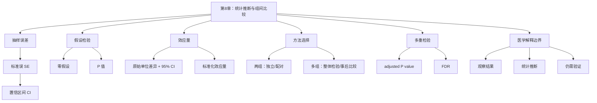

# 第8章 统计推断与组间比较

## 本章定位

第8章把前面已经学过的分组汇总、箱线图和图表规范，推进到统计推断。学生不再只回答“两个组看起来是否不同”，还要回答“差异有多大”“不确定性有多宽”“检验方法是否匹配数据结构”“能不能写成医学解释”。

本章仍处在 Prompt Coding 阶段。AI 可以辅助生成局部 Python 和 R 代码、解释报错、整理结果表、审阅统计说明，但不能替学生判断变量含义、分组独立性、检验前提和医学边界。

| 本章承接 | 本章训练 | 后续使用 |
| --- | --- | --- |
| 第6章的分组汇总和探索性图表 | 置信区间、P 值、效应量、两组和多组比较 | 第9章相关和回归、第10章模型评估、第12-15章组学差异结果解释 |
| 第7章的图表契约和图注规范 | 在图表之外补充统计方法、样本量、区间和解释边界 | 科研图表、项目报告和综合答辩 |

## 学习目标

1. 能解释抽样误差、标准误和置信区间，并说明置信区间不是个体取值范围。
2. 能解释 P 值的含义，避免把 P 值写成“结论正确的概率”或“治疗有效的概率”。
3. 能根据变量类型、组数、配对关系和前提检查选择基础组间比较方法。
4. 能报告原始单位差异和 95% 置信区间，并把标准化效应量作为补充信息。
5. 能说明多重检验为什么会增加假阳性风险，并理解调整后 P 值和 FDR 的入门含义。
6. 能写出不越界的统计结论，区分观察结果、统计检验、医学解释和仍需验证内容。

## 阅读指南

本章先读 8.1 和 8.2，掌握“估计不确定性”和“P 值不是结论本身”。再读 8.3，把两组比较拆成变量类型、分组结构和检验前提。8.4 用多组和多指标任务说明多重检验风险。8.5 是本章的写作门槛，所有项目报告都要按这一节检查结论。

本章贯穿案例使用教学模拟 ALT/AST 分组比较。`control` 和 `treatment` 只是教学分组名，不代表真实临床处理，也不支持疗效、诊断价值或机制解释。

## 核心概念速查

| 概念 | 本章解释 | 常见混淆 | 需保留英文 |
| --- | --- | --- | --- |
| 抽样误差 | 样本统计量因抽样而产生的波动 | 把一次样本均值当总体真值 | sampling error |
| 标准误 | 估计量不确定性的量化，常写作 SE | 与标准差混用 | standard error, SE |
| 置信区间 | 参数估计的不确定范围 | 写成个体取值范围 | confidence interval, CI |
| 零假设 | 检验时设定的“无差异”或“无关联”参考模型 | 写成研究者真正相信的结论 | null hypothesis |
| P 值 | 在零假设和前提成立时，观察到当前或更极端结果的概率 | 写成结果正确概率 | p-value |
| 效应量 | 差异或关联强度的量化指标 | 只看 P 值，不看大小 | effect size |
| 调整后 P 值 | 多重检验校正后的 P 值 | 把未校正 P 值当最终筛选标准 | adjusted P value / padj |
| FDR | 错误发现率，常用于高维筛选 | 写成所有显著结果都为假 | false discovery rate |

## 章节总览图


## 本章证据边界

| 表述类型 | 本章可以写 | 本章不能写 |
| --- | --- | --- |
| 数据观察 | 模拟数据中 treatment 组 ALT 均值低于 control 组 | treatment 有真实治疗效果 |
| 统计检验 | 在 Welch t 检验前提下，ALT 均值差与零差异不相容 | 统计检验证明医学机制 |
| 效应大小 | 报告原始单位差异和 95% CI | 只写星号或只写 P 值 |
| 多重检验 | 多个指标同时比较需说明校正方式 | 挑显著指标单独汇报 |
| 医学解释 | 若要写临床意义，需要额外设计和证据 | 仅凭模拟数据给诊疗建议 |

## 核心内容

## 8.1 抽样误差与置信区间

抽样误差指样本统计量因抽样而产生的波动。同一个总体中抽取不同样本，均值、中位数、比例等统计量通常不会完全一样。统计推断要处理的第一个问题，就是单次样本结果离目标参数可能有多远。

标准误（standard error, SE）用于描述估计量的不确定性。以均值为例，样本内个体差异越大，均值的不确定性通常越大；样本量越大，均值的不确定性通常越小。

| 指标 | 回答的问题 | 常见写法 | 不应写成 |
| --- | --- | --- | --- |
| 标准差 SD | 样本内个体值分散到什么程度 | ALT 均值 45.25，SD 5.01 | 均值估计误差 |
| 标准误 SE | 样本均值估计不确定性有多大 | SE = SD / sqrt(n) | 个体差异 |
| 95% CI | 参数估计可能落在哪个区间 | 均值差 -8.75，95% CI [-12.52, -4.98] | 95% 个体都在区间内 |

置信区间（confidence interval, CI）用于表达参数估计的不确定范围。对于初学者，可以先记住一句话：点估计给出“当前样本看到的值”，置信区间提醒我们“这个估计还有多宽的不确定性”。

在图表中，误差线必须写清含义。误差线可以表示 SD、SE 或 CI，但三者不能互换。第7章已经讲过图表契约，本章继续要求学生在统计结果表和图注中说明误差线含义。

## 8.2 P 值、效应量与实际意义

假设检验从零假设开始。零假设（null hypothesis）通常写成“没有差异”“没有关联”或“参数等于某个值”。备择假设则写成研究者希望检测的方向或不等于零的状态。

P 值（p-value）是在零假设和检验前提成立时，观察到当前或更极端结果的概率。这个定义有两个限制：第一，它依赖零假设；第二，它依赖所选检验的前提。P 值小，不等于结论自动有医学意义。

| 常见说法 | 问题 | 教材建议写法 |
| --- | --- | --- |
| P < 0.05，说明治疗有效 | 把统计差异写成疗效 | 模拟数据中两组 ALT 均值差异在统计检验下与零差异不相容；是否具有医学意义需补证据 |
| P = 0.08，说明没有差异 | 把不显著写成无差异 | 当前样本未提供足够证据支持两组均值存在差异，仍需结合样本量、效应量和 CI |
| P 值越小，效应越大 | 混淆显著性和效应大小 | P 值受样本量和变异影响；差异大小需看效应量和原始单位差异 |
| AI 说结果显著，可以直接写 | 忽略人工核验 | 先核对数据、方法、参数和输出，再审定表述 |

效应量（effect size）用于描述差异或关联强度。本章优先使用原始单位差异和 95% CI，因为它最接近学生能理解的变量单位。例如 ALT 的 treatment-control 均值差可以写成 `-8.75 U/L`。标准化效应量如 Cohen's d 可以作为补充，但不能替代原始单位解释。

实际意义需要结合专业背景。对于 ALT、AST 这类指标，统计差异是否重要，取决于测量单位、研究设计、基线状态、测量误差、临床阈值和外部证据。本章材料没有提供临床阈值，因此正文不写诊疗判断。

## 8.3 两组比较与方法选择

两组比较不能从“有两列数字”直接跳到 t 检验。学生要先回答四个问题：结局变量是什么类型，分组是否独立，是否存在配对关系，检验前提是否基本可接受。

| 数据结构 | 先检查 | 常见方法 | 报告字段 |
| --- | --- | --- | --- |
| 独立两组连续变量 | n、缺失、分布、异常值、方差 | Student t 检验或 Welch t 检验；不适合时考虑 Mann-Whitney U | 均值差、95% CI、P 值、方法 |
| 配对两组连续变量 | 配对 ID、差值分布、缺失配对 | 配对 t 检验；不适合时考虑 Wilcoxon 符号秩检验 | 平均差、95% CI、P 值、配对说明 |
| 两组分类变量 | 计数表、期望频数、比例分母 | 卡方检验或 Fisher 精确检验 | 计数、比例、P 值、分母 |
| 等级或偏态变量 | 分布形态、极端值、测量尺度 | 秩和检验等非参数方法 | 中位数、IQR、检验方法 |

本章示例使用固定的教学模拟数据。每组各 12 个样本，字段包括 `group`、`ALT` 和 `AST`。数值只用于演示统计流程，不代表真实医药研究。

### Python 示例

```python
import numpy as np
import pandas as pd
from scipy import stats
from statsmodels.stats.multitest import multipletests

control_alt = [42, 38, 45, 51, 39, 48, 44, 55, 41, 47, 50, 43]
treat_alt   = [35, 33, 40, 37, 31, 39, 36, 42, 34, 38, 41, 32]
control_ast = [35, 36, 32, 41, 38, 34, 40, 37, 39, 33, 42, 36]
treat_ast   = [34, 33, 35, 37, 31, 36, 38, 32, 40, 35, 34, 33]

def welch_result(control, treatment):
    control = np.asarray(control, dtype=float)
    treatment = np.asarray(treatment, dtype=float)
    diff = treatment.mean() - control.mean()
    se = np.sqrt(control.var(ddof=1) / len(control) +
                 treatment.var(ddof=1) / len(treatment))
    df_num = (control.var(ddof=1) / len(control) +
              treatment.var(ddof=1) / len(treatment)) ** 2
    df_den = ((control.var(ddof=1) / len(control)) ** 2 / (len(control) - 1) +
              (treatment.var(ddof=1) / len(treatment)) ** 2 / (len(treatment) - 1))
    df = df_num / df_den
    ci_low, ci_high = stats.t.interval(0.95, df, loc=diff, scale=se)
    t_stat, p_value = stats.ttest_ind(treatment, control, equal_var=False)
    pooled_sd = np.sqrt(((len(control)-1) * control.var(ddof=1) +
                         (len(treatment)-1) * treatment.var(ddof=1)) /
                        (len(control) + len(treatment) - 2))
    return diff, ci_low, ci_high, t_stat, p_value, diff / pooled_sd

for name, c, t in [("ALT", control_alt, treat_alt), ("AST", control_ast, treat_ast)]:
    print(name, welch_result(c, t))
```

### R 示例

```r
control_alt <- c(42,38,45,51,39,48,44,55,41,47,50,43)
treat_alt   <- c(35,33,40,37,31,39,36,42,34,38,41,32)
control_ast <- c(35,36,32,41,38,34,40,37,39,33,42,36)
treat_ast   <- c(34,33,35,37,31,36,38,32,40,35,34,33)

summ <- function(control, treatment) {
  tt <- t.test(treatment, control, var.equal = FALSE)
  pooled_sd <- sqrt(((length(control)-1) * var(control) +
                     (length(treatment)-1) * var(treatment)) /
                    (length(control) + length(treatment) - 2))
  diff <- mean(treatment) - mean(control)
  list(
    mean_diff = diff,
    ci = tt$conf.int,
    p_value = tt$p.value,
    cohen_d = diff / pooled_sd
  )
}

summ(control_alt, treat_alt)
summ(control_ast, treat_ast)
```

### 模拟结果的报告方式

| 指标 | control 均值 | treatment 均值 | treatment-control 均值差 | 95% CI | Welch t 检验 P 值 | Cohen's d |
| --- | ---: | ---: | ---: | --- | ---: | ---: |
| ALT | 45.25 | 36.50 | -8.75 | [-12.52, -4.98] | 0.0001 | -1.98 |
| AST | 36.92 | 34.83 | -2.08 | [-4.54, 0.37] | 0.0926 | -0.72 |

教材表述应写成：在这组教学模拟数据中，treatment 组 ALT 均值低于 control 组，均值差为 -8.75，95% CI 为 [-12.52, -4.98]，Welch t 检验 P 值为 0.0001。该结果只说明模拟数据中的组间差异，不支持真实疗效、机制或临床建议。

AST 的 95% CI 跨过 0，P 值为 0.0926。更稳妥的写法是：当前模拟样本未提供足够证据支持两组 AST 均值存在差异。不能写成“两组完全没有差异”。

## 8.4 多组比较与多重检验

当比较从两组扩展到三组及以上，或从一个指标扩展到多个指标时，错误发现风险会上升。学生最常见的问题是把很多次两组检验分开做，然后只汇报 P < 0.05 的结果。

多组比较可以先用整体检验。连续变量多组均值比较常见入门方法是 ANOVA；如果前提不合适，可以考虑 Kruskal-Wallis 等非参数方法。整体检验之后若要做两两比较，还要说明事后比较和校正方式。

| 场景 | 风险 | 更稳妥做法 |
| --- | --- | --- |
| 三组 ALT 两两做 3 次 t 检验 | 假阳性风险增加 | 先做整体检验，再说明事后比较和校正 |
| 同时比较 ALT、AST、age、response 等多个指标 | 只挑显著结果会误导 | 列出比较总数，报告校正方法 |
| 高维基因表达筛选 | 成千上万个检验会产生大量偶然显著 | 同时报告 fold change 和 adjusted P value / FDR |
| 单细胞每个细胞都当独立样本 | 伪重复会低估不确定性 | 回到样本或受试者层面，说明重复定义 |

调整后 P 值（adjusted P value / padj）用于多重检验后的错误控制。FDR（false discovery rate，错误发现率）常用于高维筛选任务，例如差异表达分析。本章只讲直觉和报告边界，不展开 RNA-seq 或单细胞差异表达模型。

### Python 多重检验示例

```python
from statsmodels.stats.multitest import multipletests

p_values = [0.0001, 0.0926, 0.1800, 0.0410, 0.2200, 0.0090]
names = ["ALT", "AST", "age", "response_rate", "AST_ALT_ratio", "marker_X"]

reject, padj, _, _ = multipletests(p_values, method="fdr_bh")

for name, p, q, keep in zip(names, p_values, padj, reject):
    print(name, round(p, 4), round(q, 4), keep)
```

### R 多重检验示例

```r
p_values <- c(0.0001, 0.0926, 0.1800, 0.0410, 0.2200, 0.0090)
names <- c("ALT", "AST", "age", "response_rate", "AST_ALT_ratio", "marker_X")

padj <- p.adjust(p_values, method = "BH")
data.frame(endpoint = names, p_value = p_values, padj = padj)
```

| 指标 | 未校正 P 值 | BH 校正后 P 值 | 教材解释 |
| --- | ---: | ---: | --- |
| ALT | 0.0001 | 0.0006 | 模拟数据中仍可作为统计差异示例 |
| AST | 0.0926 | 0.1388 | 当前模拟样本未提供足够证据 |
| age | 0.1800 | 0.2160 | 不按显著差异解释 |
| response_rate | 0.0410 | 0.0820 | 未校正时小于 0.05，校正后不应按显著结果汇报 |
| AST_ALT_ratio | 0.2200 | 0.2200 | 不按显著差异解释 |
| marker_X | 0.0090 | 0.0270 | 可作为多重校正后仍保留的教学示例 |

组学材料中，差异表达结果通常同时包含 `log2FoldChange` 和 `adjusted P value`。这提醒学生：高维结果不能只按未校正 P 值排序，也不能挑出一个基因后直接写机制。若要做生物学解释，还需要样本设计、批次控制、重复定义、阈值、数据库或文献证据。

## 8.5 统计结论的医学解释边界

统计结论应分层书写。第一层是观察结果，说明图表或汇总表看到了什么。第二层是统计检验结果，说明用了什么方法、样本量是多少、效应量和 P 值如何。第三层才是医学解释，而且必须有额外证据支持。

| 层级 | 可写表述 | 需要材料 | 不可越界 |
| --- | --- | --- | --- |
| 观察结果 | treatment 组 ALT 均值低于 control 组 | 分组汇总表、图表 | 写成治疗有效 |
| 统计检验 | Welch t 检验显示均值差与零差异不相容 | 代码、前提检查、结果表 | 写成机制证明 |
| 医学解释 | 该差异是否有实践意义需结合阈值和研究设计 | 临床背景、研究设计、外部证据 | 仅凭 P 值给建议 |
| 验证需求 | 需在真实数据、明确设计和独立样本中复核 | 原始数据、方案、重复验证 | 把模拟结果当事实 |

写统计结论时，至少保留八个字段：数据来源、分析表版本、样本量、分组定义、缺失处理、检验方法、原始单位差异和 95% CI、P 值或校正后 P 值。缺少其中任何关键字段，都应标 `需人工确认`。

独立性是医药数据中常见风险。同一患者多个样本、同一动物多个切片、同一培养批次多个孔、同一供体的多个细胞，都不能简单当作完全独立样本。单细胞资料中提到的伪重复问题，就属于这一类统计边界。

小样本还会带来宽置信区间和检验功效不足。若结果不显著，只能说当前样本未提供足够证据，不能写成“确认无差异”。若结果显著，也要看效应大小、区间宽度和数据质量。

## 案例任务

| 项目 | 内容 |
| --- | --- |
| 数据背景 | 教学模拟分析表，字段包括 `sample_id`、`group`、`ALT`、`AST`、`age`、`sex`、`response` |
| 任务目标 | 比较 control 与 treatment 两组 ALT/AST 水平，完成检验前检查、方法选择、统计结果表和克制解释 |
| 操作步骤 | 核对数据字典；检查缺失和分组 n；绘制分组分布图；选择 Welch t 检验或说明替代方法；报告原始单位差异和 95% CI；补充标准化效应量；检查多重检验；写解释边界 |
| 交付物 | 检验前检查表、图表契约、Python 代码、R 代码、结果表、统计说明、需人工确认列表、AI 协作记录 |
| 禁止事项 | 不写治疗有效；不把 P 值写成临床意义；不隐藏未显著结果；不让 AI 猜列名、单位或分组含义 |

## 图表建议

| 图表 | 目的 | 必备标注 | 不可越界解释 |
| --- | --- | --- | --- |
| ALT 箱线图叠加散点 | 展示两组分布和异常观察 | 分组 n、ALT 单位、箱线含义 | 不写治疗效果 |
| 均值差与 95% CI 图 | 展示差异方向和不确定性 | 均值差、CI、方法、n | 不写临床意义 |
| 检验方法选择流程图 | 帮学生按变量类型和设计选择方法 | 变量类型、组数、配对关系、前提检查 | 不替代人工判断 |
| 多重检验结果表 | 展示未校正和校正后 P 值差异 | 检验数量、校正方法、阈值 | 不隐藏未显著指标 |
| 统计结论分层表 | 区分观察、统计和医学解释 | 证据状态、可写表述、需补证据 | 不把统计差异写成机制 |

## AI 协作点

| 场景 | 可让 AI 做什么 | 学生必须核验什么 |
| --- | --- | --- |
| 检验前检查 | 根据字段生成检查清单 | 变量类型、分组 n、缺失值、单位、配对关系 |
| 代码生成 | 给出 Python 和 R 的 t 检验或校正代码 | 列名、函数参数、分组顺序、输出方向 |
| 报错解释 | 解释包缺失、列名错误、类型错误 | 修改是否改变数据含义 |
| 结果润色 | 把过度表述改成克制语言 | 是否新增疗效、机制、样本量或 P 值 |
| 多重检验提醒 | 检查是否有多个指标同时比较 | 校正方法是否适合任务，是否完整报告 |

### AI 任务说明书示例

```text
目标：
请检查下面的 ALT/AST 两组比较代码和解释是否适合第8章教材示例。

上下文：
- 课程章节：第8章统计推断与组间比较。
- 数据为教学模拟数据，不代表真实临床研究。
- 字段包括 group、ALT、AST。
- 需要同时保留 Python 和 R 的代码思路。

约束：
- 不新增医学结论、临床阈值、机制解释或样本量。
- 不把 P 值写成临床意义。
- 优先报告原始单位差异和 95% CI，标准化效应量只作补充。

验证：
- 检查分组 n、缺失值、分布、方差假设和分组顺序。
- 检查结果表述是否区分观察结果、统计检验和医学解释。
- 如比较多个指标，说明是否需要多重检验校正。

输出：
1. 代码风险
2. 解释风险
3. 建议修改
4. 学生核验清单
```

## 常见误区

| 误区 | 为什么错 | 如何纠正 |
| --- | --- | --- |
| 只要 P < 0.05 就写有意义 | P 值不等于效应大小或医学意义 | 同时报告原始单位差异、95% CI 和解释边界 |
| P >= 0.05 就写没有差异 | 不显著可能来自样本量小或不确定性大 | 写“当前样本未提供足够证据” |
| 把 SD、SE、CI 当成同一种误差线 | 三者回答的问题不同 | 图注和结果表中写清误差线含义 |
| 让 AI 自动选择检验方法 | AI 不知道真实设计和重复结构 | 学生先写方法选择理由 |
| 多个指标只挑显著者 | 选择性报告会放大偶然结果 | 列出比较数量和校正方式 |
| 单细胞或多孔实验把每个细胞/孔都当独立样本 | 可能形成伪重复 | 明确独立实验单位和重复层级 |

## 核验清单

- 已核对根目录 `大纲.md` 和第8章本章大纲。
- 数据来源、字段含义、单位和分组定义已说明。
- 原始数据或教学模拟数据没有被覆盖修改。
- 每个统计检验都有样本量、缺失处理和方法说明。
- 两组比较报告了原始单位差异和 95% CI。
- P 值没有被写成医学意义、临床建议或机制证明。
- 多个指标比较时说明了校正方法或标出 `需人工确认`。
- 图表说明了误差线含义、样本量和解释边界。
- AI 生成代码或文字经过人工核验，并保留协作记录。

## 知识结构与知识图谱生成提示词



可用于生成教学展示图的提示词：

```text
请生成一张中文教学知识图谱，用于《医药数据处理与可视化》第8章“统计推断与组间比较”。中心节点为“统计推断与组间比较”。一级节点包括“抽样误差与置信区间”“P 值与效应量”“两组比较方法选择”“多组比较与多重检验”“医学解释边界”。每个一级节点下放 2-3 个短标签，例如“SE”“95% CI”“零假设”“原始单位差异”“Welch t 检验”“BH/FDR”“不写疗效”。风格简洁，适合课堂投影，不要加入临床结论、药物机制或真实患者信息。
```

若使用 imagegen 生成图片，图片只作为教学展示。若图中文字不清、标签错误或节点缺失，以本节 Mermaid 图和表格为准，并在图注中写明“需人工核验”。

## 实验或作业

### 作业：ALT/AST 分组比较与解释边界

| 项目 | 要求 |
| --- | --- |
| 输入 | 教师提供或学生复制本章教学模拟 ALT/AST 数据 |
| 任务 1 | 用 Python 和 R 分别完成分组 n、均值、SD、SE、95% CI 的计算 |
| 任务 2 | 对 ALT 和 AST 进行两组比较，说明为什么选择 Welch t 检验或提出替代方法 |
| 任务 3 | 报告原始单位差异、95% CI、P 值和 Cohen's d |
| 任务 4 | 对 6 个模拟指标做 BH 校正，并解释未校正和校正后结论差异 |
| 任务 5 | 写一段不超过 200 字的统计说明，必须包含解释边界 |
| 提交 | 代码、结果表、图表契约、统计说明、AI 协作记录、需人工确认列表 |
| 禁止 | 不写真实疗效、诊断建议、机制解释或临床阈值 |

## 需补证据

| 位置 | 缺口 | 处理方式 |
| --- | --- | --- |
| 正式课堂数据集 | 尚未指定第8章真实课堂数据文件 | 正文使用教学模拟数据，并明确不代表真实医学结论 |
| ALT/AST 临床阈值 | 当前材料未提供阈值、适用人群和检测条件 | 不写诊疗判断，标 `需补证据` |
| 检验前提诊断 | 正文只展示基础检查思路 | 真实作业需学生提交分布图、缺失检查和方法选择理由 |
| 标准化效应量 | Cohen's d 只是入门补充 | 项目报告仍优先解释原始单位差异和 95% CI |
| 组学多重检验 | 本章只说明校正风险 | RNA-seq 和单细胞差异分析留到第12-15章 |
