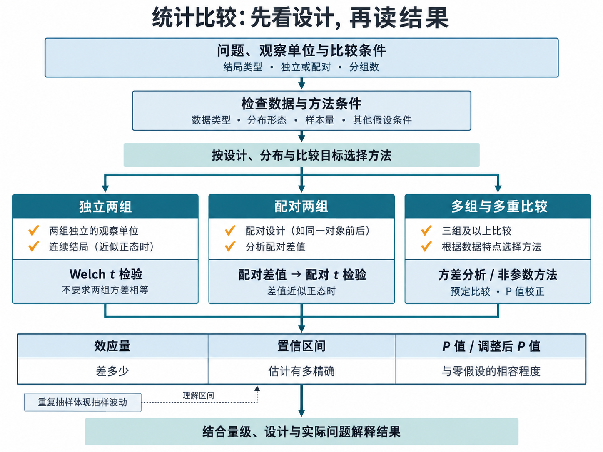
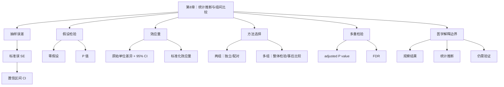

# 第8章 统计推断与组间比较

## 本章定位

第8章把分组汇总、箱线图、误差线和图注规范推进到统计推断。学生不再只回答“两组看起来是否不同”，还要说明差异大小、不确定性、检验前提、报告字段和医学解释边界。

| 本章承接 | 本章训练 | 后续使用 |
| --- | --- | --- |
| 第6章分组汇总、描述统计和探索性图表 | 抽样误差、置信区间、P 值、效应量、两组和多组比较 | 第9章相关与回归、第10章模型评估、第12-15章组学结果解释 |
| 第7章的图表设计规范和图注要求 | 在图表之外补充样本量、方法、区间、效应量和边界 | 科研图表、课程项目报告和综合答辩 |

本章用ALT/AST教学模拟表完成连续计算，再用茶杯分配、历史睡眠配对记录和A/B教学汇总比较不同的推断问题。`control` 和 `treatment` 只是教学分组名，ALT、AST 单位写作 U/L 也只用于演示统计表达。

## 学习目标

1. 学生能解释抽样误差、标准误和置信区间，并说明置信区间不是个体取值范围。
2. 学生能解释 P 值依赖零假设和检验前提，避免把 P 值写成“结论正确概率”。
3. 学生能根据变量类型、组数、配对关系和前提检查选择基础组间比较方法。
4. 学生能报告原始单位差异和 95% CI，把标准化效应量作为补充信息。
5. 学生能说明多重检验为什么会增加偶然阳性风险，并能解释调整后 P 值和 FDR 的入门含义。
6. 学生能写出不越界的统计结论，区分观察结果、统计检验、医学解释和仍需验证内容。

## 阅读指南

先读 8.1 和 8.2，掌握估计不确定性和 P 值的边界。再读 8.3，把两组比较拆成变量类型、分组结构和检验前提。8.4 处理多组、多指标和组学结果中的多重检验。8.5 是报告门槛，课程项目中的统计结论都要按这一节审阅。

| 读到哪里 | 应能回答的问题 | 学习证据 |
| --- | --- | --- |
| 8.1 | 均值、SD、SE、95% CI 分别回答什么 | 写出一张分组汇总表的解释 |
| 8.2 | P 值、效应量和实际意义有什么区别 | 改写一句越界结论 |
| 8.3 | 为什么不能直接把两列数丢进 t 检验 | 提交检验前检查表 |
| 8.4 | 为什么多个指标不能只挑 P < 0.05 | 解释 BH 校正前后差异 |
| 8.5 | 统计结论怎样不越过医学证据 | 审阅一段统计说明 |

## 核心概念速查

| 概念 | 本章解释 | 常见混淆 | 需保留英文 |
| --- | --- | --- | --- |
| 抽样误差 | 样本统计量因抽样而产生的波动 | 把一次样本均值当总体真值 | sampling error |
| 标准差 | 样本内个体值的分散程度 | 与标准误混用 | standard deviation, SD |
| 标准误 | 估计量不确定性的量化，常写作 SE | 写成个体差异 | standard error, SE |
| 置信区间 | 参数估计的不确定范围 | 写成个体取值范围 | confidence interval, CI |
| 零假设 | 检验时设定的“无差异”或“无关联”参考模型 | 写成研究者真正相信的结论 | null hypothesis |
| P 值 | 在零假设和前提成立时，观察到当前或更极端结果的概率 | 写成结果正确概率 | p-value |
| 效应量 | 差异或关联强度的量化指标 | 只看 P 值，不看大小 | effect size |
| 调整后 P 值 | 多重检验校正后的 P 值 | 把未校正 P 值当最终筛选标准 | adjusted P value, padj |
| FDR | 错误发现率，常用于高维筛选 | 写成所有阳性结果都为假 | false discovery rate |

## 章节总览图


```mermaid
flowchart LR
  A["分组汇总与图表观察"] --> B["抽样误差"]
  B --> C["标准误 SE"]
  C --> D["置信区间 CI"]
  D --> E["P 值与效应量"]
  E --> F["两组比较方法选择"]
  F --> G["多组比较与多重检验"]
  G --> H["医学解释边界"]
  H --> I["AI 协作记录与人工核验"]
```



*图8-1　五个环节依次表示：1，从目标总体获得样本；2，描述样本和分布；3，表达估计的不确定性；4，并列考虑效应大小与统计证据；5，由人写出包含限制和替代解释的结论。准确概念与计算见正文及对应代码。*

## 贯穿案例：ALT/AST 教学模拟数据

本章使用一张固定的教学模拟分析表。每行代表一个样本，字段包括 `sample_id`、`group`、`ALT`、`AST`、`age`、`sex` 和 `response`。`response` 为教学反应标签，用于字段核对。

| 字段 | 含义 | 类型 | 本章用途 |
| --- | --- | --- | --- |
| `sample_id` | 样本编号 | ID | 检查是否重复 |
| `group` | 教学分组 | 分类 | control 与 treatment 比较 |
| `ALT` | 丙氨酸氨基转移酶教学值，U/L | 连续 | 贯穿两组比较 |
| `AST` | 天门冬氨酸氨基转移酶教学值，U/L | 连续 | 对照 ALT 的不确定性示例 |
| `age` | 年龄教学值 | 连续 | 多指标校正演示 |
| `sex` | 性别教学标签 | 分类 | 字段核验 |
| `response` | 教学反应标签 | 分类 | 说明选择性报告风险 |

```python
import pandas as pd

data = pd.DataFrame({
    "sample_id": [f"C{i:02d}" for i in range(1, 13)] + [f"T{i:02d}" for i in range(1, 13)],
    "group": ["control"] * 12 + ["treatment"] * 12,
    "ALT": [42, 38, 45, 51, 39, 48, 44, 55, 41, 47, 50, 43,
            35, 33, 40, 37, 31, 39, 36, 42, 34, 38, 41, 32],
    "AST": [35, 36, 32, 41, 38, 34, 40, 37, 39, 33, 42, 36,
            34, 33, 35, 37, 31, 36, 38, 32, 40, 35, 34, 33],
    "age": [42, 39, 45, 51, 37, 48, 44, 53, 40, 46, 50, 43,
            41, 38, 47, 49, 36, 45, 42, 50, 39, 44, 48, 37],
    "sex": ["F", "M", "F", "M", "F", "M", "F", "M", "F", "M", "F", "M",
            "F", "M", "F", "M", "F", "M", "F", "M", "F", "M", "F", "M"],
    "response": ["no", "no", "yes", "no", "no", "yes", "no", "no", "yes", "no", "no", "no",
                 "yes", "no", "yes", "yes", "no", "yes", "no", "yes", "yes", "no", "yes", "no"]
})
```

## 核心内容

## 本章练习资源

[练习包说明](../../teaching/chapter-practice.md#chapter-8)列出本章数据、演示与独立练习。解压后按说明运行，输入保存在data/raw，新结果写入outputs。先完成小数据预测和手算，再核对实际输出，保存一次局部修改及解释。

## 8.1 抽样误差与置信区间

抽样误差指样本统计量因抽样而产生的波动。同一个总体中抽取不同样本，均值、中位数或比例通常不会完全相同。统计推断先承认这种波动，再估计当前样本结果对目标参数提供了多少信息。单次计算得到的均值因此只是一个点估计，还需要不确定性描述。

标准误（standard error, SE）描述估计量在重复抽样中的波动。以均值为例，样本内个体差异越大，均值的不确定性通常越大；样本量越大，均值的不确定性通常越小。常用计算式是 `SE = SD / sqrt(n)`。这里的 n 应对应统计独立单位，不能用同一受试者的重复测量或同一供体的大量细胞替代独立样本。

置信区间把点估计与不确定性放在一起。读区间时先确认估计对象和置信水平，再看上下限是否跨过研究关心的参考值。区间宽窄受数据变异、样本量和方法前提共同影响；它不表示大多数个体值位于其中，也不等于参数落入区间的简单概率陈述。

| 指标 | 回答的问题 | 在本章中的写法 | 不应写成 |
| --- | --- | --- | --- |
| SD | 样本内个体值分散到什么程度 | control 组 ALT 均值 45.25，SD 5.12 | 均值估计误差 |
| SE | 样本均值估计有多不确定 | control 组 ALT SE 1.48 | 个体差异 |
| 95% CI | 参数估计范围有多宽 | control 组 ALT 均值 95% CI [42.00, 48.50] | 95% 个体都在区间内 |

置信区间（confidence interval, CI）用于表达估计值的不确定范围。对初学者，可以先用这句话检查理解：点估计给出当前样本看到的值，置信区间提醒我们这个估计还有多宽的不确定性。

| 指标 | group | n | 均值 | SD | SE | 均值 95% CI |
| --- | --- | ---: | ---: | ---: | ---: | --- |
| ALT | control | 12 | 45.25 | 5.12 | 1.48 | [42.00, 48.50] |
| ALT | treatment | 12 | 36.50 | 3.61 | 1.04 | [34.21, 38.79] |
| AST | control | 12 | 36.92 | 3.18 | 0.92 | [34.90, 38.93] |
| AST | treatment | 12 | 34.83 | 2.59 | 0.75 | [33.19, 36.48] |

这张表只能说明教学模拟数据中的组内概况。ALT 的两组均值看起来相差较大，AST 的两组均值相差较小。是否把差异写成统计推断，还需要检验方法、均值差 CI 和 P 值。

在图表中，误差线必须写清含义。误差线可以表示 SD、SE 或 CI，但三者不能互换。第7章讲过图表设计规范卡，本章继续要求学生在结果表和图注中说明误差线含义。

```text
图注示例：
图 8-1. 教学模拟 ALT 在 control 与 treatment 两组中的分布。每个点代表一个样本，箱体表示四分位范围，中线表示中位数。图中只展示分布观察；组间效应需结合均值差、95% CI 和检验结果解释。
```

### 从12个数算到一条区间

先取control组的12个ALT值。求和得到543，除以12得到均值45.25。接着计算每个值与45.25的差，平方后相加，再除以11并开平方，得到样本标准差5.119。分母11来自`n-1`，Python以`ddof=1`明确指定这个口径。

```python
import numpy as np
from scipy import stats

x = data.loc[data["group"] == "control", "ALT"].to_numpy(dtype=float)
n = len(x)
mean = x.mean()
sd = x.std(ddof=1)
se = sd / np.sqrt(n)
ci = stats.t.interval(0.95, df=n-1, loc=mean, scale=se)
print(n, mean, sd, se, ci)
```

`loc`先用12个真假值确定行，再选出ALT列。`to_numpy`把这一列变为12个浮点数，后面的均值和标准差都在这个一维数组上计算。`se`等于5.119除以平方根12，得到1.477739。它仍使用U/L，便于把区间放回原单位解释。

`stats.t.interval`先取自由度11的t分布中间95%范围，再以`loc=mean`确定中心、以`scale=se`换回均值估计的尺度。t临界值约2.201，半宽约为2.201×1.477739=3.252481，因此区间为[41.997519,48.502481]。代码产生的是两个端点，表中将其显示为[42.00,48.50]。读取实际结果时，应保留计算精度，再决定展示小数位。

这里估计的对象是该构造模型中均值的不确定性。若按同一抽样模型反复抽取独立样本并生成区间，95%指这套区间方法的长期覆盖率；个体ALT分布由SD及原始点描述。把同样12行复制成24行，不改变独立样本数，也不能据此把SE减小。

## 8.2 P 值、效应量与实际意义

假设检验从预先写明的零假设开始。零假设（null hypothesis）通常表示没有差异、没有关联或参数等于某个参考值。检验方法再根据数据和模型前提，计算当前结果在这一假设下有多异常。若比较对象、方向或停止规则在看过结果后才改变，P 值的解释会失去原来的条件。

P 值（p-value）是在零假设和检验前提成立时，观察到当前或更极端结果的概率。它描述数据与假设模型之间的关系，不给出差异大小，也不直接给出零假设为真的概率。样本量、变异和检验选择都可能影响 P 值，因此不能脱离设计与方法单独阅读。

效应量回答差异或关联有多大，置信区间说明这一估计有多不确定，P 值提供假设检验下的统计证据。结果阅读应先看方向和大小，再看区间与 P 值，最后讨论这一大小在当前药学问题中是否具有实际意义。医学意义还需要结局定义、测量质量、研究设计和外部证据支持。

| 常见说法 | 问题 | 教材建议写法 |
| --- | --- | --- |
| P < 0.05，说明治疗有效 | 把统计差异写成疗效 | 模拟数据中两组 ALT 均值差在统计检验下与零差异不相容；是否有医学意义需补证据 |
| P = 0.08，说明没有差异 | 把不显著写成无差异 | 当前样本未提供足够证据支持两组均值存在差异，仍需看样本量、效应量和 CI |
| P 值越小，效应越大 | 混淆显著性和效应大小 | P 值受样本量和变异影响；差异大小需看效应量和原始单位差异 |

效应量（effect size）用于描述差异或关联强度。本章优先报告原始单位差异和 95% CI，因为它最接近变量单位。例如 ALT 的 treatment-control 均值差可以写成 `-8.75 U/L`。Cohen's d 这类标准化效应量可作为补充，但不能替代原始单位解释。

| 指标 | treatment-control 均值差 | 95% CI | Welch t 检验 P 值 | Cohen's d | 教材解释 |
| --- | ---: | --- | ---: | ---: | --- |
| ALT | -8.75 | [-12.52, -4.98] | 0.0001 | -1.98 | 模拟数据中 treatment 组 ALT 均值低于 control 组 |
| AST | -2.08 | [-4.54, 0.37] | 0.0926 | -0.72 | 当前模拟样本未提供足够证据支持 AST 均值差异 |

ALT 的均值差 CI 没有跨过 0，且 P 值很小。可以写“在这组教学模拟数据中，treatment 组 ALT 均值低于 control 组”。AST 的均值差 CI 跨过 0，P 值为 0.0926。更稳妥的写法是“当前模拟样本未提供足够证据支持两组 AST 均值存在差异”，不能写“两组完全没有差异”。

### 八杯茶怎样给出零假设下的参照

设8杯茶中4杯先加奶、4杯先加茶，辨别者必须选出4杯“先加奶”的茶。现在暂设辨别没有提供信息，每一种选择4杯的组合等可能。可能组合数为`8×7×6×5/(4×3×2×1)=70`。把杯号1、4设为实际先加奶，逐一数出每种选择命中几杯。

```python
import pandas as pd

tea = pd.read_csv("data/raw/tea.csv")
counts = tea["correct_milk"].value_counts().sort_index()
print(counts)
p_all_correct = (tea["correct_milk"] == 4).mean()
print(p_all_correct)
```

文件是教材枚举表，每行一种选择，包含全部70种。`value_counts`把命中数0、4各出现多少次列出来，`sort_index`按命中数排序，输出依次为1、16、36、16、1。只有`1-2-3-4`一种分配全部命中，因此随机选择下全对概率为1/70，即0.014286。

计算前已经把“命中更多”设为支持辨别能力的方向。观察到4杯全部命中时，朝这个方向至少同样极端的结果也只有全对，单侧P值即1/70。若任务改成双侧、允许不同杯数或看完结果再改变统计量，参照集合需要重新定义。这个可枚举问题把P值的三项条件讲清了，零假设、统计量和极端方向都来自明确方案。

## 8.3 两组比较与方法选择

两组比较从研究设计开始。先确认结局变量类型，再判断两组来自不同独立单位还是同一单位的配对测量，随后查看缺失、分布、异常值和方差。表格中出现两列数字，只能说明数据被排成两组，不能自动确定检验方法。

独立与配对的区别会改变误差结构。若同一受试者治疗前后各有一次测量，分析应利用成对差值；若两组来自不同受试者，则需要独立组方法。把配对数据拆开会丢失个体内信息，把独立数据强行配对则会制造不存在的关系。

代码运行前写清比较方向、方法和纳入记录；运行后同时读取组别汇总、效应估计、置信区间、检验统计量和 P 值。若前提检查或异常观察改变了方法选择，应在记录中说明理由。任何检验输出都要回到原始分组和观察单位复核。

| 数据结构 | 先检查 | 常见方法 | 报告字段 |
| --- | --- | --- | --- |
| 独立两组连续变量 | n、缺失、分布、异常值、方差 | Student t 检验或 Welch t 检验；不适合时考虑 Mann-Whitney U | 均值差、95% CI、P 值、方法 |
| 配对两组连续变量 | 配对 ID、差值分布、缺失配对 | 配对 t 检验；不适合时考虑 Wilcoxon 符号秩检验 | 平均差、95% CI、P 值、配对说明 |
| 两组分类变量 | 计数表、期望频数、比例分母 | 卡方检验或 Fisher 精确检验 | 计数、比例、P 值、分母 |
| 等级或偏态变量 | 分布形态、极端值、测量尺度 | 秩和检验等非参数方法 | 中位数、IQR、检验方法 |
| 三组及以上连续变量 | 组数、独立性、分布、方差 | 转入 8.4：先做整体检验，再按研究设计选择事后比较 | 整体检验、效应量、事后比较与校正 |

示例采用 Welch t 检验，因为它不要求两组方差相等，并据此估计自由度。真实任务仍应结合研究设计、分布、异常值和样本量选择方法。

### 检验前检查表

| 检查项 | ALT 模拟数据结果 | 对方法选择的影响 |
| --- | --- | --- |
| 分组数量 | control 和 treatment 两组 | 可考虑两组比较方法 |
| 每组 n | 每组 12 | 样本量较小，CI 与图表都要报告 |
| 缺失值 | 教学表中 ALT/AST 无缺失 | 不需要因缺失改变 n |
| 配对关系 | 无配对 ID，按独立两组演示 | 不使用配对 t 检验 |
| 变量类型 | ALT/AST 为连续变量 | 可考虑 t 检验或非参数方法 |
| 方差完全相等 | 未作为确定前提 | 使用 Welch t 检验 |

### Python 示例

```python
import numpy as np
import pandas as pd
from scipy import stats

required_columns = {"sample_id", "group", "ALT", "AST"}
missing_columns = required_columns - set(data.columns)
assert not missing_columns, f"缺少必需字段：{sorted(missing_columns)}"
assert data["sample_id"].notna().all(), "sample_id 存在缺失"
assert not data["sample_id"].duplicated().any(), "sample_id 存在重复"
assert data[["group", "ALT", "AST"]].notna().all().all(), "分组或指标存在缺失"
assert set(data["group"].unique()) == {"control", "treatment"}, "分组水平不符合预期"

group_counts = data.groupby("group", observed=True).size().rename("n")
assert (group_counts > 1).all(), "每组至少需要 2 个观测值"
print(group_counts)

def welch_result(frame, indicator):
    control = frame.loc[frame["group"] == "control", indicator].to_numpy(dtype=float)
    treatment = frame.loc[frame["group"] == "treatment", indicator].to_numpy(dtype=float)
    diff = treatment.mean() - control.mean()
    v1 = control.var(ddof=1) / len(control)
    v2 = treatment.var(ddof=1) / len(treatment)
    se = np.sqrt(v1 + v2)
    df = (v1 + v2) ** 2 / (v1 ** 2 / (len(control) - 1) + v2 ** 2 / (len(treatment) - 1))
    ci_low, ci_high = stats.t.interval(0.95, df, loc=diff, scale=se)
    t_stat, p_value = stats.ttest_ind(treatment, control, equal_var=False)
    pooled_sd = np.sqrt(((len(control) - 1) * control.var(ddof=1) +
                         (len(treatment) - 1) * treatment.var(ddof=1)) /
                        (len(control) + len(treatment) - 2))
    cohen_d = diff / pooled_sd
    return {
        "indicator": indicator,
        "control_n": len(control),
        "treatment_n": len(treatment),
        "control_mean": control.mean(),
        "treatment_mean": treatment.mean(),
        "mean_diff": diff,
        "ci_low": ci_low,
        "ci_high": ci_high,
        "t_value": t_stat,
        "df": df,
        "p_value": p_value,
        "cohen_d": cohen_d,
    }

result_table = pd.DataFrame(
    [welch_result(data, indicator) for indicator in ["ALT", "AST"]]
)
print(result_table.round(6).to_string(index=False))
```

代码先检查必需字段、重复样本编号、缺失值、分组水平和各组样本量，再计算结果。输出表把两组 n、两组均值、treatment-control 均值差、95% CI、t 值、自由度、P 值和 Cohen's d 放在同一行。若均值差顺序写反，符号和解释也会反向。

### 逐项读取Welch函数

`welch_result(frame, indicator)`把“用哪张表、比较哪一列”作为两个输入。第一次传入`ALT`，第二次传入`AST`，相同计算返回各自一行结果。`control`与`treatment`分别包含12个值；`diff`固定为后者均值减前者，所以ALT是36.50−45.25=−8.75 U/L。

`v1`和`v2`分别是两组均值估计的方差，即样本方差除以各自样本数。相加再开平方得到差值SE=1.807497。Welch自由度用两项的大小共同计算，ALT为19.758550，允许两组方差不同，因此一般不是整数22。把这个自由度、差值和SE交给`t.interval`，得到[−12.523329,−4.976671]。

`ttest_ind(treatment, control, equal_var=False)`的第一个数组仍是treatment。输出t=−4.840949，与负差值一致；双侧P=0.0001023721。函数默认双侧，学生应将这个方向写进记录。最后的`pooled_sd`是合并组内SD，`cohen_d=diff/pooled_sd`把差值转为无量纲标准化效应，约−1.976。它是另一个描述尺度，不改变原单位差值。

`return`返回的是一个字典。外层列表推导式得到两个字典，再由`pd.DataFrame`组成两行结果表。查看列名和每组n之后，再把ALT、AST与原数据逐一核对。资源包脚本把该表保存到`outputs/welch_results.csv`，不会覆盖输入。

### R 示例

```r
analysis_data <- data.frame(
  sample_id = c(sprintf("C%02d", 1:12), sprintf("T%02d", 1:12)),
  group = rep(c("control", "treatment"), each = 12),
  ALT = c(42,38,45,51,39,48,44,55,41,47,50,43,
          35,33,40,37,31,39,36,42,34,38,41,32),
  AST = c(35,36,32,41,38,34,40,37,39,33,42,36,
          34,33,35,37,31,36,38,32,40,35,34,33),
  stringsAsFactors = FALSE
)

required_columns <- c("sample_id", "group", "ALT", "AST")
missing_columns <- setdiff(required_columns, names(analysis_data))
if (length(missing_columns) > 0) stop("缺少必需字段")
if (anyNA(analysis_data$sample_id)) stop("sample_id 存在缺失")
if (anyDuplicated(analysis_data$sample_id)) stop("sample_id 存在重复")
if (anyNA(analysis_data[c("group", "ALT", "AST")])) stop("分组或指标存在缺失")
if (!setequal(unique(analysis_data$group), c("control", "treatment"))) {
  stop("分组水平不符合预期")
}

group_counts <- table(analysis_data$group)
if (any(group_counts <= 1)) stop("每组至少需要 2 个观测值")
print(group_counts)

welch_result <- function(frame, indicator) {
  control <- frame[frame$group == "control", indicator]
  treatment <- frame[frame$group == "treatment", indicator]
  tt <- t.test(treatment, control, var.equal = FALSE)
  pooled_sd <- sqrt(((length(control) - 1) * var(control) +
                     (length(treatment) - 1) * var(treatment)) /
                    (length(control) + length(treatment) - 2))
  diff <- mean(treatment) - mean(control)
  data.frame(
    indicator = indicator,
    control_n = length(control),
    treatment_n = length(treatment),
    control_mean = mean(control),
    treatment_mean = mean(treatment),
    mean_diff = diff,
    ci_low = tt$conf.int[1],
    ci_high = tt$conf.int[2],
    t_value = unname(tt$statistic),
    df = unname(tt$parameter),
    p_value = tt$p.value,
    cohen_d = diff / pooled_sd,
    row.names = NULL
  )
}

result_table <- do.call(
  rbind,
  lapply(c("ALT", "AST"), function(x) welch_result(analysis_data, x))
)
print(result_table, digits = 6, row.names = FALSE)
```

R 代码采用同一字段、检查顺序和差值方向，并用 `print()` 显式输出分组样本量与结果表。`t.test(treatment, control)` 的 CI 对应 treatment-control；跨语言核验时应逐列比较方向和数值，不能只比较 P 值。

### 统计说明模板

```text
在教学模拟数据中，control 组和 treatment 组各包含 12 个样本。采用 Welch t 检验比较两组 ALT 均值，treatment-control 均值差为 -8.75 U/L，95% CI 为 [-12.52, -4.98]，P = 0.0001。该结果说明模拟数据中 treatment 组 ALT 均值较低。
```

这段模板把数据对象、n、方法、效应方向、原始单位差异、95% CI和P值写在一起。读者能从文字还原比较方向，并回到表中核对各项结果。

### 同一个人的两次睡眠记录

`sleep`保存10名历史受试者在两种条件下相对对照增加的睡眠小时数。表中20行是20次测量，ID有10个。条件1的extra依次为0.7、−1.6、−0.2、−1.2、−0.1、3.4、3.7、0.8、0、2.0；条件2为1.9、0.8、1.1、0.1、−0.1、4.4、5.5、1.6、4.6、3.4。负值表示该次记录的睡眠时长低于对照。

先按ID把同一个人的两条记录放在一行，再计算条件2减条件1。第1人的差为1.2小时，第2人为2.4小时，第5人为0小时。分析变量由两个原始值转为10个个体差值。

```python
from scipy import stats

sleep = pd.read_csv("data/raw/sleep.csv", dtype={"ID": str, "group": str})
paired = sleep.pivot(index="ID", columns="group", values="extra")
assert paired[["1", "2"]].notna().all().all()
difference = paired["2"] - paired["1"]
test = stats.ttest_rel(paired["2"], paired["1"])
print(len(difference), difference.mean(), test.statistic, test.pvalue)
```

`pivot`将ID设为行、条件设为列，行顺序即使改变，同一个人仍由ID连接。`ttest_rel`检查两列对应差值的均值是否与0相容。本次输出n=10、平均差1.58小时、t=4.062128、P=0.002832890；差值95% CI为[0.700114,2.459886]小时。独立组检验会忽略个体内联系，计算的是另一种误差结构。配对来源必须来自实验记录，不能按数值大小人工凑对。

### 从连续测量换成成功比例

图书馆预约页的教学A/B汇总设两组各5000名不同用户，A组1350人、B组1450人在固定观察期内至少完成一次预约。两个成功比例分别是0.27和0.29，B−A为0.02，即2个百分点。这里的分析单位是用户，单个用户的多次点击不增加分母。

两组比例差的标准误使用各自的成功比例。按大样本正态近似，95% CI约为[0.002404,0.037596]，换成百分点是[0.2404,3.7596]。检验零差异时则在零假设下合并成功数，合并比例为2800/10000=0.28。用这个共同概率算出零假设下SE，得到z=2.227177、双侧P=0.025935。

```python
import numpy as np
from scipy import stats

p_a, p_b, n_a, n_b = 1350/5000, 1450/5000, 5000, 5000
se = np.sqrt(p_a*(1-p_a)/n_a + p_b*(1-p_b)/n_b)
pooled = (1350 + 1450) / (n_a + n_b)
null_se = np.sqrt(pooled*(1-pooled)*(1/n_a + 1/n_b))
z = (p_b-p_a) / null_se
print(p_b-p_a, (p_b-p_a-1.96*se, p_b-p_a+1.96*se))
print(z, 2*stats.norm.sf(abs(z)))
```

`sf`给出标准正态分布的右尾概率，`abs(z)`同时处理正负方向，再乘2得到双侧P值。95%区间的SE与零假设检验SE承担不同任务，代码分成两个对象保存。这个例子从连续测量推进到分类计数，方法变化来自结局和观察单位，而非表格有几行。

## 8.4 多组比较与多重检验

当比较从两组扩展到三组及以上，或从一个指标扩展到多个指标时，发生偶然小 P 值的机会随之增加。若把许多检验分别执行，再只挑出 `P < 0.05` 的结果，报告中的证据强度会被高估。比较集合和校正策略应在查看显著结果前确定。

多组比较可以先用整体检验判断是否存在组间差异。连续变量多组均值比较常见入门方法是 ANOVA；如果前提不合适，可以考虑 Kruskal-Wallis 等非参数方法。整体检验并不指出哪些组不同，后续两两比较仍要说明事后比较范围和校正方式。

高维数据会把这一问题放大。差异表达结果中的 adjusted P value 或 `padj` 反映多重检验校正后的统计证据，但筛选阈值仍需与效应量、表达水平和研究目的共同解释。通过阈值的条目是后续核验候选，不能直接写成已经证实的机制。

| 场景 | 风险 | 更稳妥做法 |
| --- | --- | --- |
| 三组 ALT 两两做 3 次 t 检验 | 偶然阳性风险增加 | 先做整体检验，再说明事后比较和校正 |
| 同时比较 ALT、AST、age、response 等多个指标 | 只挑阳性结果会误导 | 列出比较总数，报告校正方法 |
| 高维基因表达筛选 | 成千上万个检验会产生大量偶然阳性 | 同时报告 fold change 和 adjusted P value / FDR |
| 单细胞每个细胞都当独立样本 | 伪重复会低估不确定性 | 回到样本或受试者层面，说明重复定义 |

问题族（family of hypotheses）是为共同回答同一预设研究问题而实施的一组检验。应在查看 P 值前根据研究设计确定问题族，不能因某个结果达到显著性阈值而事后拆分。本例把同一份教学报告中的六个指标视为一个问题族。

调整后 P 值（adjusted P value / padj）用于多重检验后的错误控制。FDR（false discovery rate，错误发现率）常用于高维筛选任务，例如差异表达分析。本章只讲直觉和报告边界，不展开 RNA-seq 或单细胞差异表达模型。

### 多指标校正示例

下面 6 个 P 值用于教学演示。ALT 与 AST 来自本章模拟数据；其余指标是同一张教学练习表中可扩展的练习指标，用来说明“只挑 P < 0.05”会改变结论口径。

```python
from statsmodels.stats.multitest import multipletests

p_values = [0.0001, 0.0926, 0.1800, 0.0410, 0.2200, 0.0090]
names = ["ALT", "AST", "age", "response_rate", "AST_ALT_ratio", "marker_X"]

reject, padj, _, _ = multipletests(p_values, method="fdr_bh")

for name, p, q, keep in zip(names, p_values, padj, reject):
    print(name, round(p, 4), round(q, 4), keep)
```

```r
p_values <- c(0.0001, 0.0926, 0.1800, 0.0410, 0.2200, 0.0090)
names <- c("ALT", "AST", "age", "response_rate", "AST_ALT_ratio", "marker_X")

padj <- p.adjust(p_values, method = "BH")
print(data.frame(endpoint = names, p_value = p_values, padj = padj),
      row.names = FALSE)
```

| 指标 | 未校正 P 值 | BH 校正后 P 值 | 教材解释 |
| --- | ---: | ---: | --- |
| ALT | 0.0001 | 0.0006 | 模拟数据中仍可作为统计差异示例 |
| AST | 0.0926 | 0.1389 | 当前模拟样本未提供足够证据 |
| age | 0.1800 | 0.2160 | 不按差异结果解释 |
| response_rate | 0.0410 | 0.0820 | 未校正时小于 0.05，校正后不应单独按阳性结果汇报 |
| AST_ALT_ratio | 0.2200 | 0.2200 | 不按差异结果解释 |
| marker_X | 0.0090 | 0.0270 | 可作为校正后仍保留的教学示例 |

这个例子说明，`response_rate` 的未校正 P 值为 0.041，单独看似可以被挑出来。把 6 个比较放在同一个问题族里控制 FDR 后，BH 校正后 P 值变为 0.082。课程报告应写清比较数量和校正方式，而不是把这个指标单独拿出来讲。

### 对照一次BH计算

把六个输入P值从小到大排列，得到0.0001、0.0090、0.0410、0.0926、0.1800、0.2200。第3个输入0.0410的`6/3×P`为0.082；第2个0.0090的`6/2×P`为0.027。BH还从较大排序位置向前检查单调关系，保证排序较小的P值不会产生比后面更大的调整值，并把结果恢复到原指标顺序。

`multipletests`接收整个问题族，返回是否达到默认0.05判定线、调整值及其他校正阈值。赋值中的两个下划线接住此处不使用的返回对象。`zip`把指标名、原P值、调整值和判定按对应位置取出，所以不能单独对P值排序而忘记指标名。

表中ALT和AST使用已四舍五入的演示P值；资源包的Welch结果保留全精度，BH练习另读固定`multiple_tests.csv`。如果把全精度Welch结果代入BH，末位数会随输入变化，记录应明确采用哪一组P值。

### 组学结果中的多重检验边界

组学材料中，差异表达结果表通常同时包含差异大小和多重校正字段。单细胞差异表达示例中，结果表字段包括 `variable`、`baseMean`、`log_fc`、`lfcSE`、`stat`、`p_value` 和 `adj_p_value`，并按 `adj_p_value` 排序。

| 字段 | 入门解释 | 第8章能讲什么 | 延后学习的内容 |
| --- | --- | --- | --- |
| `log_fc` | log2 fold change，表示两组表达差异方向和大小 | 差异大小不能只看 P 值 | 不解释完整 RNA-seq 建模 |
| `lfcSE` | log fold change 的标准误 | 不确定性仍需报告 | 不推导模型方差 |
| `p_value` | 未校正检验 P 值 | 多个基因同时检验时不能单独用它筛选 | 不给基因机制结论 |
| `adj_p_value` | Benjamini-Hochberg 校正后 P 值 | 高维筛选需控制错误发现 | 不把 padj 写成生物学证明 |

同一材料中，IFITM2 在 stimulated 相比 control 的 CD14+ monocytes 中 `log_fc` 约为 +4.7，VCAN 约为 -4.4。第8章只把它们作为字段解释案例：正负号表示相对于基线组的方向，数值大小表示差异幅度。若要解释免疫机制、疾病意义或药物作用，需回到第12-15章的实验设计、样本重复、批次控制、数据库证据和文献支持。

单细胞差异分析还有伪重复风险。同一受试者贡献的多个细胞并不等于多个完全独立受试者。如果把每个细胞都当作独立样本，可能低估不确定性并推高 FDR。第8章要让学生先建立这个边界：统计检验的独立单位通常是患者、动物、培养批次或实验样本，而不一定是表中的每一行。

## 案例任务

| 项目 | 内容 |
| --- | --- |
| 数据背景 | 教学模拟分析表，字段包括 `sample_id`、`group`、`ALT`、`AST`、`age`、`sex`、`response` |
| 任务目标 | 比较 control 与 treatment 两组 ALT/AST 水平，完成检验前检查、方法选择、统计结果表和克制解释 |
| 操作步骤 | 核对数据字典；检查缺失和分组 n；绘制分组分布图；选择 Welch t 检验或说明替代方法；报告原始单位差异和 95% CI；补充标准化效应量；检查多重检验；写解释边界 |
| 交付物 | 检验前检查表、图表设计规范卡、Python 代码、R 代码、结果表、统计说明、需人工确认列表、AI 协作记录 |

## 知识结构


```mermaid
flowchart TD
  A["第8章：统计推断与组间比较"] --> B["抽样误差"]
  B --> C["标准误 SE"]
  C --> D["置信区间 CI"]
  A --> E["假设检验"]
  E --> F["零假设"]
  E --> G["P 值"]
  A --> H["效应量"]
  H --> I["原始单位差异 + 95% CI"]
  H --> J["标准化效应量"]
  A --> K["方法选择"]
  K --> L["两组：独立/配对"]
  K --> M["多组：整体检验/事后比较"]
  A --> N["多重检验"]
  N --> O["adjusted P value"]
  N --> P["FDR"]
  A --> Q["医学解释边界"]
  Q --> R["观察结果"]
  Q --> S["统计推断"]
  Q --> T["仍需验证"]
```

## 实验或作业

### 作业：ALT/AST 分组比较与解释边界

| 项目 | 要求 |
| --- | --- |
| 输入 | 给定或从本章复制的模拟 ALT/AST 数据 |
| 任务 1 | 用 Python 和 R 分别完成分组 n、均值、SD、SE、95% CI 的计算 |
| 任务 2 | 对 ALT 和 AST 进行两组比较，说明为什么选择 Welch t 检验或提出替代方法 |
| 任务 3 | 报告原始单位差异、95% CI、P 值和 Cohen's d |
| 任务 4 | 对 6 个模拟指标做 BH 校正，并解释未校正和校正后结论差异 |
| 任务 5 | 写一段不超过 200 字的统计说明，必须包含解释边界 |
| 提交 | 代码、结果表、图表设计规范卡、统计说明、AI 协作记录、需人工确认列表 |

### 提交核验

| 维度 | 满分表现 | 常见扣分 |
| --- | --- | --- |
| 数据检查 | 说明字段、n、缺失、单位和分组方向 | 只贴检验输出 |
| 方法选择 | 说明独立两组、连续变量和 Welch t 检验理由 | 让 AI 直接决定方法 |
| 结果报告 | 原始单位差异、95% CI、P 值和边界完整 | 只写 P < 0.05 |
| 多重检验 | 说明比较数量和 BH 校正 | 只挑未校正 P 值 |
| 医学边界 | 不写疗效、机制或建议 | 把模拟结果当真实医学结论 |

## 8.5 统计结论的医学解释边界

统计结果应按证据层级书写。观察层先说明图表或汇总表中直接看到的方向和分布；推断层报告方法、独立样本量、效应量、置信区间和 P 值；医学解释层再把结果放回研究设计、结局意义和外部证据。层级分开，读者才能判断哪一句来自当前数据，哪一句还需要其他材料。

统计显著性不能修复设计缺陷。分组与批次混杂、选择性缺失、测量误差或伪重复都可能使精确的 P 值对应错误问题。医学解释还要考虑效应大小是否达到实际关心的程度、结果能否推广到目标人群，以及替代解释是否仍然存在。

| 层级 | 可写表述 | 需要材料 | 不可越界 |
| --- | --- | --- | --- |
| 观察结果 | treatment 组 ALT 均值低于 control 组 | 分组汇总表、图表 | 写成治疗有效 |
| 统计检验 | Welch t 检验显示均值差与零差异不相容 | 代码、前提检查、结果表 | 写成机制证明 |
| 医学解释 | 该差异是否有实践意义需结合阈值和研究设计 | 临床背景、研究设计、外部证据 | 仅凭 P 值给建议 |
| 验证需求 | 需在真实数据、明确设计和独立样本中复核 | 原始数据、方案、重复验证 | 把模拟结果当事实 |

写统计结论时，至少保留十个字段：数据来源、分析表版本、样本量、分组定义、缺失处理、重复定义、检验方法、原始单位差异和 95% CI、P 值或校正后 P 值、解释边界。缺少关键字段时，应标 `需人工确认`。

### 组合比例案例：看似下降不一定是绝对下降

单细胞组成分析材料提供了一个很适合第8章的边界案例。假设健康组织有 A、B、C 三类细胞，各 2000 个，总数 6000。疾病组织中 A 增加到 4000，B 和 C 仍为 2000，总数 8000。

| 组织状态 | A 细胞数 | B 细胞数 | C 细胞数 | 总数 | A 比例 | B 比例 | C 比例 |
| --- | ---: | ---: | ---: | ---: | ---: | ---: | ---: |
| healthy | 2000 | 2000 | 2000 | 6000 | 33.3% | 33.3% | 33.3% |
| diseased | 4000 | 2000 | 2000 | 8000 | 50.0% | 25.0% | 25.0% |

B 和 C 的绝对数量没有变，但比例从 33.3% 变为 25.0%。如果测序只能在每个样本中抽取 600 个细胞，期望计数会接近 healthy 的 200/200/200 和 diseased 的 300/150/150。此时 B、C 看起来减少，原因可能只是 A 占比变高后总和约束带来的比例变化。

这个案例不要求学生掌握组合数据模型。第8章只要让学生记住：比例、构成、单细胞细胞类型占比这类数据不能按普通独立指标随意检验；解释时要说明总量、分母、重复样本、校正方式和替代解释。

### 独立性和重复定义

医药数据常见的重复结构包括同一患者多个样本、同一动物多个切片、同一培养批次多个孔、同一供体的多个细胞。表格里的行数不一定等于独立样本数。若独立单位不清，统计检验和 P 值都要标 `需人工确认`。

| 表格行 | 可能的独立单位 | 风险 | 报告处理 |
| --- | --- | --- | --- |
| 每个孔一行 | 可能是培养批次 | 多孔来自同一批次，不能当完全独立 | 说明批次和重复层级 |
| 每个切片一行 | 可能是动物或患者 | 同一动物多个切片相关 | 回到动物或患者层面 |
| 每个细胞一行 | 通常不是独立受试者 | 同一供体细胞相关 | 使用样本层面或随机效应思路 |
| 每次测量一行 | 可能是同一对象反复测量 | 需要配对或重复测量方法 | 核对配对 ID |

小样本还会带来宽置信区间和检验功效不足。结果不支持差异时，只能说当前样本未提供足够证据，不能写成“确认无差异”。结果支持差异时，也要看效应大小、区间宽度、数据质量和研究设计。

### 医学解释阶梯

| 证据强度 | 推荐动词 | 示例 | 仍需补什么 |
| --- | --- | --- | --- |
| 图表和汇总表 | 显示、观察到 | 模拟数据中 treatment 组 ALT 均值较低 | 统计检验 |
| 检验和区间 | 支持、提示 | Welch t 检验支持两组 ALT 均值存在差异 | 研究设计、重复验证 |
| 专业解释 | 可能具有实践意义 | 需结合检测条件、阈值和研究背景判断 | 临床或实验依据 |
| 医学结论 | 需进一步验证 | 本章不直接给出 | 随机化、混杂控制、机制实验或外部验证 |


### 章末总结与协作要求

本章报告把观察单位、比较方向、原单位效应、区间及检验写在一起。ALT/AST与A/B为教学构造；茶表为随机分配枚举；sleep为历史配对记录。它们分别支持本次统计学习任务。真实药学意义需要对应的测量、设计、专业背景与验证，统计显著性不提供这些材料，未达到判定线也不等于已证明没有差异。

比较集合、样本独立性和缺失处理决定检验回答什么问题。多重校正不能修复伪重复、批次混杂或事后选择。AI适合解释检验函数、帮助整理结果及检查格式；学习者要亲自确认观察单位、方法前提、单位和结果方向，保存运行输出与自己的判断，再形成专业解释。


## 本章练习包

[下载第8章学生练习包](../../downloads/chapter-08-practice.zip) · [查看全书练习包](../../teaching/chapter-practice.md)
