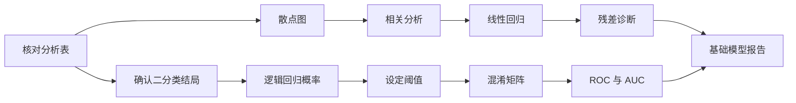
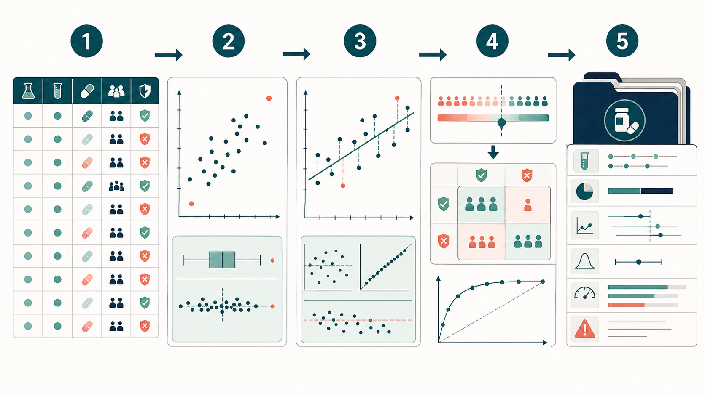
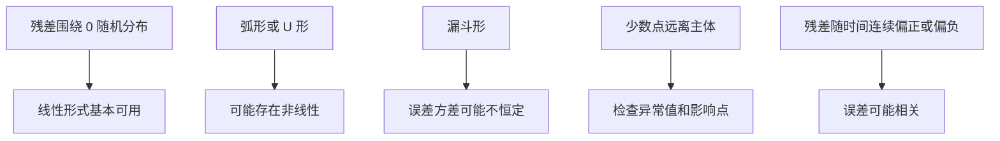
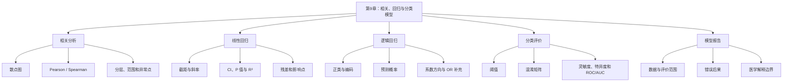

# 第9章 相关、回归与分类模型

## 本章定位

第8章主要回答组间差异如何估计和报告。本章把问题推进一步：两个连续变量是否共同变化，连续结局能否用若干变量描述，二分类结局如何转化为预测概率，分类错误又该怎样报告。

相关、回归和分类模型都建立在分析表之上。模型运行成功只说明软件完成了计算。变量含义、数据结构、模型前提、正类定义和医学解释仍需分析者判断。

| 本章承接 | 本章训练 | 第10章继续 |
| --- | --- | --- |
| P 值、置信区间、效应量 | 相关系数、回归系数、残差和 R² | 训练集与测试集 |
| 图表设计规范卡与统计图 | 散点图、残差图、混淆矩阵和 ROC | 交叉验证与 bootstrap |
| 观察结果与医学解释边界 | 预测概率、阈值和基础模型报告 | 特征选择、正则化和可解释性 |

本章只做基础模型报告。代码中计算的分类指标来自当前教学模拟数据，不代表测试集表现、外部验证结果或临床应用能力。

## 学习目标

完成本章后，学生应能：

1. 先用散点图检查趋势、异常点、分层和非线性，再选择 Pearson 或 Spearman 相关。
2. 解释线性回归中的截距、斜率、95% CI、P 值、残差和 R²，并识别明显模型风险。
3. 说明逻辑回归输出预测概率，写清正类、类别编码、阈值和系数方向。
4. 根据混淆矩阵计算准确率、灵敏度、特异度、阳性预测值和阴性预测值。
5. 解释阈值变化如何改变漏判和误报，并说明 ROC/AUC 的使用边界。
6. 写出包含数据、模型、指标、限制和证据状态的基础模型报告。

## 阅读指南





*图9-1　五个环节依次表示：1，核对分析表；2，用散点图检查关联、分层和异常点；3，拟合回归并检查残差；4，将预测概率与阈值、混淆矩阵和 ROC 对照；5，形成包含数据定义、模型、指标和限制的报告。本图由 ImageGen 生成，不展示真实模型性能。相关不等于因果，预测概率也不等于诊断，准确计算以正文和代码输出为准。*

这条路线包含两个反复出现的动作。第一，计算前先核对变量和数据结构。第二，解释结果时回到当前数据范围，不把统计关系直接写成医学因果或临床建议。

## 贯穿案例：教学模拟 ALT/AST/dose/response 分析表

本章使用两张相互独立的教学模拟表。24 行表用于手算、相关和线性回归；200 行表按固定规则生成，用于逻辑回归、阈值和 ROC。两表均不是真实患者数据，也不能合并成研究样本。

| 字段 | 数据类型 | 教学含义 | 本章边界 |
| --- | --- | --- | --- |
| `sample_id` | 标识符 | 样本编号 | 不作为预测变量 |
| `group` | 分类变量 | `control` 或 `treatment` | 不代表真实治疗分组 |
| `dose` | 连续变量 | 教学剂量 | 不代表真实给药剂量 |
| `ALT` | 连续变量 | 教学肝酶指标，U/L | 不使用临床阈值 |
| `AST` | 连续变量 | 教学肝酶指标，U/L | 不解释肝损伤机制 |
| `age` | 连续变量 | 年龄，岁 | 只作模型协变量 |
| `sex` | 分类变量 | F/M | 本章不作人群差异推断 |
| `response` | 二分类变量 | 0 为模拟阴性，1 为模拟阳性 | 不代表疗效、诊断或预后 |

### 24 行基础表

Python 代码如下。数据直接写在代码中，便于核对每一行。

```python
import pandas as pd

df = pd.DataFrame({
    "sample_id": [f"S{i:02d}" for i in range(1, 25)],
    "group": ["control"] * 12 + ["treatment"] * 12,
    "dose": [0] * 12 + [5, 5, 10, 10, 15, 15, 20, 20, 25, 25, 30, 30],
    "ALT": [42, 38, 45, 51, 39, 48, 44, 55, 41, 47, 50, 43,
            35, 33, 40, 37, 31, 39, 36, 42, 34, 38, 41, 32],
    "AST": [35, 36, 32, 41, 38, 34, 40, 37, 39, 33, 42, 36,
            34, 33, 35, 37, 31, 36, 38, 32, 40, 35, 34, 33],
    "age": [46, 52, 41, 59, 48, 55, 44, 62, 50, 57, 53, 45,
            43, 49, 39, 58, 47, 54, 42, 60, 51, 56, 52, 44],
    "sex": ["F", "M"] * 12,
    "response": [0, 0, 0, 1, 0, 1, 0, 0, 0, 1, 0, 0,
                 1, 1, 0, 1, 1, 0, 1, 0, 1, 1, 0, 1],
})
```

R 使用相同数据。运行后应得到 24 行、8 列和 11 个 `response=1`。

```r
df <- data.frame(
  sample_id = sprintf("S%02d", 1:24),
  group = c(rep("control", 12), rep("treatment", 12)),
  dose = c(rep(0, 12), c(5,5,10,10,15,15,20,20,25,25,30,30)),
  ALT = c(42,38,45,51,39,48,44,55,41,47,50,43,
          35,33,40,37,31,39,36,42,34,38,41,32),
  AST = c(35,36,32,41,38,34,40,37,39,33,42,36,
          34,33,35,37,31,36,38,32,40,35,34,33),
  age = c(46,52,41,59,48,55,44,62,50,57,53,45,
          43,49,39,58,47,54,42,60,51,56,52,44),
  sex = rep(c("F", "M"), 12),
  response = c(0,0,0,1,0,1,0,0,0,1,0,0,
               1,1,0,1,1,0,1,0,1,1,0,1)
)
```

### 建模前最低检查

建模前至少核对行数、数据类型、缺失、重复 ID、变量范围和类别编码。下面的输出不直接回答研究问题，但能阻止许多由列类型或编码错误引起的假结果。

```python
print(df.shape)
print(df.dtypes)
print(df.isna().sum())
print(df["sample_id"].duplicated().sum())
print(df[["dose", "ALT", "AST", "age"]].describe())
print(df["response"].value_counts().sort_index())
```

```r
dim(df)
str(df)
colSums(is.na(df))
sum(duplicated(df$sample_id))
summary(df[c("dose", "ALT", "AST", "age")])
table(df$response)
```

若 `response` 被读成字符，软件可能改变正类顺序；若 `dose` 被读成文本，散点图和模型公式也可能产生错误。AI 可以生成检查代码，但学生必须读懂输出并确认每一列的实际含义。

## 9.1 相关分析与散点图

### 9.1.1 相关分析回答什么

相关（correlation）描述两个变量共同变化的方向和程度。本章主要讨论两个连续变量之间的线性关系或单调关系。相关系数为正表示总体上同向变化，为负表示总体上反向变化，接近 0 表示当前方法没有捕捉到明显关系。

相关系数不是因果效应。即使相关系数较大且 P 值较小，也可能来自分组结构、共同原因、测量范围、批次差异或少数异常点。

| 问题 | 散点图提供的信息 | 相关系数不能单独回答 |
| --- | --- | --- |
| 关系是否近似直线 | 点云和趋势线形状 | 因果方向 |
| 是否单调但不线性 | 排序趋势 | 生物机制 |
| 是否存在分层 | 不同颜色或形状形成的组群 | 组间差异来源 |
| 是否有极端点 | 个别点远离主体 | 是否应删除该点 |
| 变量范围是否受限 | 横轴或纵轴取值集中 | 其他人群中的关系 |

### 9.1.2 先画散点图

以 `dose` 为横轴、`ALT` 为纵轴，并用颜色标记 `group`。图中必须保留单位、样本量和分组说明。趋势线只帮助观察，不提供因果证据。

```python
import matplotlib.pyplot as plt

colors = {"control": "#3B6FB6", "treatment": "#D55E00"}
for group_name, part in df.groupby("group"):
    plt.scatter(
        part["dose"], part["ALT"],
        label=group_name, color=colors[group_name], alpha=0.85
    )

plt.xlabel("dose (teaching unit)")
plt.ylabel("ALT (U/L)")
plt.title("Teaching simulation: dose and ALT, n=24")
plt.legend(title="group")
plt.tight_layout()
plt.show()
```

```r
group_color <- ifelse(df$group == "control", "#3B6FB6", "#D55E00")

plot(
  df$dose, df$ALT,
  col = group_color, pch = 19,
  xlab = "dose (teaching unit)",
  ylab = "ALT (U/L)",
  main = "Teaching simulation: dose and ALT, n=24"
)
legend(
  "topright", legend = c("control", "treatment"),
  col = c("#3B6FB6", "#D55E00"), pch = 19, bty = "n"
)
```

图中有一个必须先处理的结构问题：12 个 `control` 样本的 `dose` 都是 0，`treatment` 样本的 `dose` 才在 5 至 30 之间变化。因此，全体样本中的剂量趋势同时包含组间差异和组内剂量变化。

### 9.1.3 Pearson 与 Spearman

Pearson 相关主要描述线性关系，对极端值较敏感。Spearman 相关先把数值转为排序，再描述单调关系，对数值距离和部分极端值较不敏感。方法选择应结合散点图、变量类型和分析目的。

| 数据表现 | 优先考虑 | 仍需检查 |
| --- | --- | --- |
| 点云近似直线、无明显极端点 | Pearson | 分层、范围限制和样本独立性 |
| 单调但有弯曲趋势 | Spearman | 是否存在多个亚组 |
| 明显偏态或等级数据 | Spearman | 大量并列值对排序的影响 |
| 关系呈 U 形 | 两者都可能接近 0 | 改用图形描述并重新定义模型 |

Python 同时计算两种相关。SciPy 的 Pearson 结果还可以给出 95% CI。

```python
from scipy import stats

pearson = stats.pearsonr(df["dose"], df["ALT"])
spearman = stats.spearmanr(df["dose"], df["ALT"])

print("Pearson r:", pearson.statistic)
print("Pearson 95% CI:", pearson.confidence_interval())
print("Pearson P:", pearson.pvalue)
print("Spearman rho:", spearman.statistic)
print("Spearman P:", spearman.pvalue)
```

R 的 `cor.test()` 同样给出系数和检验结果。Spearman 检验设置 `exact=FALSE`，用于处理本例中的并列剂量值。

```r
cor.test(df$dose, df$ALT, method = "pearson")
cor.test(df$dose, df$ALT, method = "spearman", exact = FALSE)
```

两种语言得到一致结果。

| 方法 | 系数 | 95% CI | P 值 | 当前数据中的描述 |
| --- | ---: | --- | ---: | --- |
| Pearson | -0.562 | [-0.787, -0.205] | 0.0042 | 存在中等程度负向线性关系 |
| Spearman | -0.667 | 本例未计算 | 0.0004 | 排序上存在负向单调关系 |

可报告为：在 24 行教学模拟数据中，`dose` 与 `ALT` 呈负相关。Pearson 相关系数为 -0.562，95% CI 为 [-0.787, -0.205]，双侧 P=0.0042。该结果描述当前模拟表中的共同变化，不支持剂量导致 ALT 变化。

### 9.1.4 分组结构会改变结论

只分析 12 个 `treatment` 样本，Pearson 和 Spearman 系数都约为 0.127，P 约为 0.694。`control` 组的 `dose` 全部为 0，组内相关无法计算。

```python
treatment = df.loc[df["group"] == "treatment"]
print(stats.pearsonr(treatment["dose"], treatment["ALT"]))
print(stats.spearmanr(treatment["dose"], treatment["ALT"]))
```

```r
treatment <- subset(df, group == "treatment")
cor.test(treatment$dose, treatment$ALT, method = "pearson")
cor.test(treatment$dose, treatment$ALT, method = "spearman", exact = FALSE)
```

| 分析范围 | Pearson r | P 值 | 允许解释 |
| --- | ---: | ---: | --- |
| 全部 24 个样本 | -0.562 | 0.0042 | 整张模拟表中呈负相关 |
| 12 个 treatment 样本 | 0.127 | 0.6936 | 组内未观察到明确线性关系 |
| 12 个 control 样本 | 无法计算 | 无法计算 | `dose` 没有变异 |

这组结果说明，全体样本的负相关主要受到分组结构影响。不能把总体相关系数直接解释为 treatment 组内部的剂量关系，更不能写成真实药物效应。

### 9.1.5 异常点敏感性

复制数据后把 S08 的 `ALT` 增加 20 U/L，可模拟一次录入异常。原始表不作修改。Pearson r 从 -0.562 变为 -0.470，而 Spearman 仍约为 -0.667，因为 S08 原本已处在 ALT 排序的高位。

```python
sensitivity_df = df.copy()
sensitivity_df.loc[sensitivity_df["sample_id"] == "S08", "ALT"] += 20

print(stats.pearsonr(sensitivity_df["dose"], sensitivity_df["ALT"]))
print(stats.spearmanr(sensitivity_df["dose"], sensitivity_df["ALT"]))
```

敏感性分析不是删除异常点的理由。正确流程是回查原始记录、测量单位和录入过程，再同时报告保留与修正后的影响。若没有数据来源支持，不得仅因结果不理想而删除样本。

### 9.1.6 相关分析最低报告字段

| 字段 | 本例写法 | 常见遗漏 |
| --- | --- | --- |
| 数据范围 | 24 行教学模拟表 | 不写样本量 |
| 变量与单位 | dose，教学单位；ALT，U/L | 只写列名 |
| 缺失处理 | 本例无缺失 | 默认软件自动删除 |
| 方法 | Pearson；Spearman 作敏感性对照 | 不说明方法 |
| 结果 | r、95% CI、P 值 | 只写“显著相关” |
| 图形检查 | 分组散点图 | 不看分层和异常点 |
| 边界 | 相关不等于因果 | 写成剂量作用 |

AI 可以帮助生成绘图和计算代码。学生必须检查列名、单位、并列值、缺失处理、分组结构和结果表述。若 AI 只返回一个相关系数，应要求它补充散点图、样本量和解释边界。

## 9.2 线性回归与模型诊断

### 9.2.1 从相关进入回归

线性回归（linear regression）用一个或多个自变量估计连续结局。本节先拟合 `ALT ~ dose`，再加入 `age` 和 `group`，观察系数如何随模型定义变化。

简单线性回归中的截距表示 `dose=0` 时模型估计的 ALT。斜率表示 `dose` 每增加 1 个教学单位，ALT 的模型平均变化量。这里的“变化量”是模型中的关联，不是给药后的个体变化。

| 输出 | 本章解释 | 不能写成 |
| --- | --- | --- |
| 截距 | 自变量取 0 时的模型估计值 | 所有人真实基线 |
| 斜率 | 自变量增加 1 单位时结局的平均模型差异 | 因果效应 |
| 95% CI | 系数估计的不确定范围 | 个体结局范围 |
| P 值 | 当前模型下，数据与零系数假设的相容程度 | 医学重要性 |
| R² | 模型解释当前结局变异的比例 | 机制强度或可靠性 |
| 残差 | 观察值减去拟合值 | 新的医学指标 |

### 9.2.2 拟合简单线性回归

Python 使用 `statsmodels`。模型矩阵中需要显式加入截距列。

```python
import statsmodels.api as sm

X_simple = sm.add_constant(df[["dose"]])
fit_simple = sm.OLS(df["ALT"], X_simple).fit()

print(fit_simple.summary())
print(fit_simple.conf_int())
```

R 的 `lm()` 默认包含截距。`summary()` 给出系数、P 值和 R²，`confint()` 给出系数区间。

```r
fit_simple <- lm(ALT ~ dose, data = df)
summary(fit_simple)
confint(fit_simple)
```

Python 与 R 的结果一致。

| 模型 | 系数 | 估计值 | 95% CI | P 值 |
| --- | --- | ---: | --- | ---: |
| `ALT ~ dose` | 截距 | 43.694 | [40.808, 46.579] | <0.0001 |
| `ALT ~ dose` | `dose` | -0.322 | [-0.532, -0.113] | 0.0042 |

模型 R² 为 0.316。可写为：在 24 行教学模拟数据中，`dose` 每增加 1 个教学单位，模型估计 ALT 平均降低 0.322 U/L，95% CI 为 [-0.532, -0.113]。该模型解释约 31.6% 的 ALT 变异。

这段报告仍不完整。散点图已经显示 `group` 与 `dose` 的结构性关联，后续还要检查加入协变量后的系数变化和残差表现。

### 9.2.3 加入协变量后，系数为什么会变

多元线性回归（multiple linear regression）在同一模型中放入多个自变量。某个系数表示其他入模变量保持不变时，该变量与结局的模型关系。

本例加入 `age` 和 `group`。R 会自动把 `group` 转为虚拟变量；Python 需要先生成 `group_treatment`，其中 treatment 为 1、control 为 0。

```python
df_adjusted = df.assign(
    group_treatment=(df["group"] == "treatment").astype(int)
)

X_adjusted = sm.add_constant(
    df_adjusted[["dose", "age", "group_treatment"]]
)
fit_adjusted = sm.OLS(df_adjusted["ALT"], X_adjusted).fit()

print(fit_adjusted.summary())
print(fit_adjusted.conf_int())
```

```r
fit_adjusted <- lm(ALT ~ dose + age + group, data = df)
summary(fit_adjusted)
confint(fit_adjusted)
```

| 模型 | 变量 | 系数估计 | 课堂解释 |
| --- | --- | ---: | --- |
| `ALT ~ dose` | `dose` | -0.322 | 未区分组别和年龄的总体关联 |
| `ALT ~ dose + age + group` | `dose` | -0.001 | 控制年龄和组别后，剂量系数接近 0 |
| 同上 | `age` | 0.363 | 其他变量不变时，年龄系数为正 |
| 同上 | `group=treatment` | -8.211 | treatment 相对 control 的模型差异为负 |

调整模型的 R² 为 0.658。R² 上升不代表模型获得了因果解释。`control` 组的剂量全部为 0，`treatment` 组才有非零剂量，`dose` 与 `group` 在设计上紧密关联。24 个样本很难稳定拆分两者的贡献。

ISLR 的 `Advertising` 案例给出同类警示。分别用电视、广播和报纸预算做三个简单回归时，每个模型都忽略了另外两个预算；如果几个预算彼此相关，单变量系数会包含其他变量的信息。多变量模型可以减少这种混合，但前提是数据中有足够独立变化。

| 看到的现象 | 可以提出的问题 | 不能直接下的结论 |
| --- | --- | --- |
| `dose` 系数由 -0.322 变为接近 0 | 总体关系是否主要来自分组结构 | 剂量完全没有作用 |
| `group` 系数为负 | 两组是否存在未建模差异 | treatment 导致 ALT 降低 |
| R² 从 0.316 升至 0.658 | 新变量是否解释更多表内变异 | 调整模型更接近医学真相 |

多元模型不是“变量越多越好”。变量应来自研究问题、数据字典和事先定义。把所有可用列都交给 AI 自动入模，会增加共线性、过拟合和解释越界风险。

### 9.2.4 拟合值、残差和诊断图

拟合值（fitted value）是模型对每个样本 ALT 的估计。残差（residual）是观察 ALT 减去拟合 ALT。若线性模型基本合适，残差图通常围绕 0 分布，不应出现稳定曲线或随拟合值扩大的漏斗形。



Python 同时画残差图和正态 Q-Q 图。Q-Q 图只检查残差分布形状，不决定模型是否具有医学意义。

```python
import matplotlib.pyplot as plt
import statsmodels.api as sm

df["ALT_fitted"] = fit_simple.fittedvalues
df["ALT_resid"] = fit_simple.resid

fig, axes = plt.subplots(1, 2, figsize=(10, 4))
axes[0].scatter(df["ALT_fitted"], df["ALT_resid"], color="#3B6FB6")
axes[0].axhline(0, color="black", linestyle="--", linewidth=1)
axes[0].set_xlabel("Fitted ALT (U/L)")
axes[0].set_ylabel("Residual (U/L)")
axes[0].set_title("Residuals vs fitted values")

sm.qqplot(df["ALT_resid"], line="45", ax=axes[1])
axes[1].set_title("Normal Q-Q plot")
plt.tight_layout()
plt.show()
```

```r
par(mfrow = c(1, 2))

plot(
  fitted(fit_simple), resid(fit_simple),
  xlab = "Fitted ALT (U/L)",
  ylab = "Residual (U/L)",
  main = "Residuals vs fitted values",
  pch = 19, col = "#3B6FB6"
)
abline(h = 0, lty = 2)

qqnorm(resid(fit_simple), pch = 19, col = "#3B6FB6")
qqline(resid(fit_simple), lty = 2)

par(mfrow = c(1, 1))
```

### 素材案例：U 形残差不是随机散布

ISLR 的 `Auto` 数据用 `horsepower` 预测 `mpg`。简单直线模型的残差呈明显 U 形，说明一条直线没有捕捉数据关系。加入平方项后，残差中的曲线模式减弱。

本章不展开多项式回归。这个案例只训练一个判断：残差出现稳定形状时，不能继续机械解释直线斜率。应先标记模型形式风险，再考虑变量变换、非线性模型或新的研究问题。

| 诊断问题 | 可能来源 | 本章处理 |
| --- | --- | --- |
| 非线性 | 真实关系不是直线 | 标记风险，不强行解释斜率 |
| 误差相关 | 时间序列、重复测量、重复复制数据 | 回查样本单位和采集顺序 |
| 异方差 | 结局波动随拟合值变化 | 报告漏斗形，考虑后续修正 |
| 异常值 | 录入、测量或真实极端样本 | 回查来源，不自动删除 |
| 高杠杆点 | 自变量组合远离多数样本 | 查看对系数的影响 |
| 共线性 | 自变量彼此高度相关 | 谨慎解释单个系数 |

误差相关在医药数据中很常见。若同一受试者有多次测量，却被当成独立样本，普通线性回归的标准误可能过小。把数据表复制一遍不会得到新的独立样本，也不会使证据加倍。

### 9.2.5 影响点和异方差的辅助检查

Cook 距离用于观察单个样本对模型拟合的影响。经验阈值 `4/n` 只能作为筛查线索，不能作为自动删除规则。本例中 S08 和 S23 超过 `4/24`，其中 S23 的 Cook 距离最大，约为 0.291。

```python
from statsmodels.stats.diagnostic import het_breuschpagan

influence = fit_simple.get_influence()
cooks_d = influence.cooks_distance[0]
screening_cutoff = 4 / len(df)

print(df.loc[cooks_d > screening_cutoff, ["sample_id", "dose", "ALT"]])
print(cooks_d[cooks_d > screening_cutoff])

bp = het_breuschpagan(fit_simple.resid, fit_simple.model.exog)
print("Breusch-Pagan P:", bp[1])
```

```r
cook <- cooks.distance(fit_simple)
screening_cutoff <- 4 / nrow(df)

df[cook > screening_cutoff, c("sample_id", "dose", "ALT")]
cook[cook > screening_cutoff]
```

Breusch-Pagan 检验 P 约为 0.409。本例没有得到明确异方差证据，但 24 个样本的检验能力有限。“未发现显著异方差”不能改写成“方差恒定已得到证明”。图形检查仍是本章重点。

删除 S23 后，简单回归斜率从 -0.322 变为 -0.391。方向未变，但估计量发生变化。报告时应写明影响点检查和敏感性结果，而不是只保留更符合预期的版本。

### 9.2.6 线性回归最低报告字段

| 字段 | 本例内容 |
| --- | --- |
| 数据和样本量 | 24 行教学模拟基础表 |
| 结局与单位 | ALT，U/L |
| 自变量与编码 | dose，教学单位；调整模型另含 age、group |
| 模型 | 简单线性回归；少量协变量线性回归 |
| 估计和区间 | 系数、95% CI、P 值 |
| 整体拟合 | R² |
| 诊断 | 残差图、Q-Q 图、Cook 距离；异方差辅助检查 |
| 边界 | 分组与剂量紧密关联，小样本，不作因果解释 |

完整表述可以写成：在 24 行教学模拟数据中，简单线性回归估计 `dose` 的斜率为 -0.322 U/L/教学单位，95% CI 为 [-0.532, -0.113]，P=0.0042，R²=0.316。加入 `age` 和 `group` 后，`dose` 系数接近 0，提示单变量关系受到分组结构影响。残差和影响点检查发现 S08、S23 需要复核。所有结果仅描述当前模拟表。

## 9.3 分类问题与逻辑回归

### 9.3.1 二分类模型输出概率

分类（classification）的结局是离散类别。本章只讨论二分类，例如 `response=0` 与 `response=1`。建模前必须把正类写清，本例正类固定为 `response=1`，含义仅为“模拟阳性”。

逻辑回归（logistic regression）估计正类的预测概率。概率位于 0 与 1 之间。模型不会自动给出医学决策；把概率转为类别还需要一个阈值。

| 比较项 | 线性回归 | 逻辑回归 |
| --- | --- | --- |
| 结局 | 连续变量 | 二分类变量 |
| 本例 | ALT | response |
| 主要输出 | 连续拟合值 | `response=1` 的预测概率 |
| 系数解释 | 结局平均变化 | 概率方向或 odds 方向 |
| 重点检查 | 残差和线性形式 | 正类、编码、概率和阈值 |

不能用普通线性回归直接拟合 0/1 结局，因为线性预测值可能小于 0 或大于 1，误差结构也不符合二分类数据。逻辑回归通过专门的概率模型处理这类结局。本章不推导其数学形式。

### 9.3.2 为什么增加一张扩展模拟表

24 行基础表只有 11 个模拟阳性。若同时放入 ALT、AST 和 age，系数容易受少数样本影响。旧稿可以用它演示函数调用，但不宜把输出写成稳定关系。

扩展表保留相同字段，用确定性公式生成 200 个样本，其中 `response=1` 有 62 个。确定性规则的目的不是模拟真实疾病分布，而是让 Python 和 R 得到同一数据，便于复算阈值和分类指标。

```python
import numpy as np
import pandas as pd

def make_expanded_data(n=200):
    i = np.arange(1, n + 1)
    dose_values = np.array([0, 5, 10, 15, 20, 25, 30, 35])
    dose = dose_values[(i - 1) % len(dose_values)]
    group_num = (dose > 0).astype(int)
    group = np.where(group_num == 1, "treatment", "control")
    age = 35 + (7 * i) % 31
    sex = np.where(i % 2 == 0, "M", "F")

    alt_noise = np.array([-5, -3, -1, 0, 2, 4, 1, -2, 3])[(i - 1) % 9]
    ast_noise = np.array([-4, -2, 2, 0, 4, -3, 1])[(i - 1) % 7]
    ALT = 54 - 0.28 * dose + 0.12 * (age - 50) + 0.8 * group_num + alt_noise
    AST = 35 - 0.10 * dose + 0.05 * (age - 50) + ast_noise

    score = -0.3 - 0.24 * (ALT - 48) + 0.15 * (AST - 34) + 0.10 * (age - 50)
    true_prob = 1 / (1 + np.exp(-score))
    pseudo_uniform = (((37 * i) % 199) + 0.5) / 199
    response = (pseudo_uniform < true_prob).astype(int)

    return pd.DataFrame({
        "sample_id": [f"E{x:03d}" for x in i],
        "group": group,
        "dose": dose,
        "ALT": ALT,
        "AST": AST,
        "age": age,
        "sex": sex,
        "response": response,
    })

expanded = make_expanded_data()
print(expanded.shape)
print(expanded["response"].value_counts().sort_index())
```

R 使用相同的取模、周期扰动和概率规则。

```r
make_expanded_data <- function(n = 200) {
  i <- seq_len(n)
  dose_values <- c(0, 5, 10, 15, 20, 25, 30, 35)
  dose <- dose_values[((i - 1) %% length(dose_values)) + 1]
  group_num <- as.integer(dose > 0)
  group <- ifelse(group_num == 1, "treatment", "control")
  age <- 35 + (7 * i) %% 31
  sex <- ifelse(i %% 2 == 0, "M", "F")

  alt_noise_values <- c(-5, -3, -1, 0, 2, 4, 1, -2, 3)
  ast_noise_values <- c(-4, -2, 2, 0, 4, -3, 1)
  alt_noise <- alt_noise_values[((i - 1) %% length(alt_noise_values)) + 1]
  ast_noise <- ast_noise_values[((i - 1) %% length(ast_noise_values)) + 1]
  ALT <- 54 - 0.28 * dose + 0.12 * (age - 50) + 0.8 * group_num + alt_noise
  AST <- 35 - 0.10 * dose + 0.05 * (age - 50) + ast_noise

  score <- -0.3 - 0.24 * (ALT - 48) + 0.15 * (AST - 34) + 0.10 * (age - 50)
  true_prob <- plogis(score)
  pseudo_uniform <- (((37 * i) %% 199) + 0.5) / 199
  response <- as.integer(pseudo_uniform < true_prob)

  data.frame(
    sample_id = sprintf("E%03d", i),
    group = group, dose = dose, ALT = ALT, AST = AST,
    age = age, sex = sex, response = response
  )
}

expanded <- make_expanded_data()
dim(expanded)
table(expanded$response)
```

交叉核验可使用列合计。两种语言都应得到 `dose=3500`、`ALT=9929.76`、`AST=6589.90`、`age=9998`、`response=62`。任一合计不一致，都说明代码、索引或取模规则存在差异。

### 9.3.3 拟合逻辑回归

本例用 ALT、AST 和 age 估计 `response=1` 的概率。变量来自教学任务预先指定，不根据当前结果自动筛选。

```python
import numpy as np
import statsmodels.api as sm

X_logit = sm.add_constant(expanded[["ALT", "AST", "age"]])
logit_fit = sm.Logit(expanded["response"], X_logit).fit(disp=False)

expanded["prob_response"] = logit_fit.predict(X_logit)
print(logit_fit.summary())
print(logit_fit.conf_int())
print(np.exp(logit_fit.params))  # OR 仅作补充
```

```r
logit_fit <- glm(
  response ~ ALT + AST + age,
  data = expanded,
  family = binomial()
)

expanded$prob_response <- predict(logit_fit, type = "response")
summary(logit_fit)
confint.default(logit_fit)
exp(coef(logit_fit))  # OR 仅作补充
```

| 变量 | 系数 | 95% CI | OR | 本章解释 |
| --- | ---: | --- | ---: | --- |
| ALT | -0.219 | [-0.317, -0.120] | 0.804 | 其他变量不变时，ALT 越高，预测概率方向越低 |
| AST | 0.148 | [0.022, 0.274] | 1.159 | 其他变量不变时，AST 越高，预测概率方向越高 |
| age | 0.122 | [0.077, 0.167] | 1.130 | 其他变量不变时，age 越高，预测概率方向越高 |

系数正负首先用于判断方向。负系数使 `response=1` 的模型概率下降，正系数使其上升。系数大小受变量单位影响，不能直接用绝对值比较“谁更重要”。

odds ratio（OR）是系数取指数后的补充表达。OR 大于 1 表示 odds 随变量增加而上升，OR 小于 1 表示下降。OR 不是风险比，也不是因果效应。本章不作公式推导。

### 9.3.4 概率不是实际类别

下面五个样本覆盖了从低概率到高概率的范围。实际 `response` 可能与模型概率对应，也可能不同。概率为 0.70 不是“70% 确诊”，只表示当前模型和当前变量下的数值输出。

| 样本 | ALT | AST | age | 实际 response | 模型概率 |
| --- | ---: | ---: | ---: | ---: | ---: |
| E195 | 54.32 | 30.3 | 36 | 0 | 0.015 |
| E189 | 52.92 | 34.3 | 56 | 1 | 0.301 |
| E091 | 47.24 | 35.1 | 52 | 0 | 0.508 |
| E075 | 52.68 | 38.7 | 64 | 0 | 0.698 |
| E199 | 43.08 | 34.7 | 64 | 1 | 0.913 |

若阈值为 0.5，E091 会被预测为 1；阈值改为 0.7，它会被预测为 0。实际标签没有改变，改变的是决策规则。

### 9.3.5 逻辑回归最低报告字段

| 字段 | 本例内容 |
| --- | --- |
| 数据 | 200 行确定性教学模拟扩展表 |
| 结局 | `response`，0/1 |
| 正类 | `response=1`，模拟阳性 |
| 类别比例 | 62 个阳性，138 个阴性 |
| 预测变量 | ALT、AST、age |
| 模型 | 二项逻辑回归 |
| 主要输出 | 预测概率、系数方向 |
| 补充输出 | 95% CI、P 值和 OR |
| 后续规则 | 阈值必须单独写明 |
| 边界 | 在当前拟合数据上计算，不代表诊断或泛化能力 |

本章不对模型进行训练/测试划分，也不通过当前数据选择变量或阈值。这些内容留到第10章。第9章报告中的 AUC 和混淆矩阵必须标注为“在当前拟合数据上计算的结果”。

## 9.4 混淆矩阵、灵敏度、特异度与 ROC

### 9.4.1 从预测概率到混淆矩阵

阈值把预测概率转为类别。若阈值为 0.5，概率大于或等于 0.5 的样本被预测为 1，其余预测为 0。阈值改变后，逻辑回归系数和预测概率不变，预测类别和分类指标会改变。

混淆矩阵（confusion matrix）把真实类别和预测类别交叉排列。阅读矩阵前先看行、列分别表示什么，再定位 TP、FP、TN、FN。

| 记号 | 条件 | 本例含义 | 可能后果 |
| --- | --- | --- | --- |
| TP | 真实 1，预测 1 | 正确识别模拟阳性 | 正确分类 |
| FP | 真实 0，预测 1 | 把模拟阴性报为阳性 | 误报 |
| TN | 真实 0，预测 0 | 正确识别模拟阴性 | 正确分类 |
| FN | 真实 1，预测 0 | 把模拟阳性报为阴性 | 漏判 |

不同指标使用不同分母。灵敏度从所有实际阳性出发，特异度从所有实际阴性出发；阳性预测值从所有预测阳性出发，阴性预测值从所有预测阴性出发。

| 指标 | 计算 | 回答的问题 |
| --- | --- | --- |
| 准确率 | `(TP+TN)/全部样本` | 所有样本中有多少分类正确 |
| 灵敏度 | `TP/(TP+FN)` | 实际阳性中识别出多少 |
| 特异度 | `TN/(TN+FP)` | 实际阴性中识别出多少 |
| 阳性预测值 | `TP/(TP+FP)` | 预测阳性中有多少实际阳性 |
| 阴性预测值 | `TN/(TN+FN)` | 预测阴性中有多少实际阴性 |

### 9.4.2 Python 计算

`scikit-learn` 的混淆矩阵默认以真实类别为行、预测类别为列。显式设置 `labels=[0, 1]` 可以固定类别顺序。

```python
from sklearn.metrics import confusion_matrix

def classification_metrics(y_true, probability, threshold):
    y_pred = (probability >= threshold).astype(int)
    cm = confusion_matrix(y_true, y_pred, labels=[0, 1])
    tn, fp, fn, tp = cm.ravel()

    return {
        "threshold": threshold,
        "TN": tn, "FP": fp, "FN": fn, "TP": tp,
        "accuracy": (tp + tn) / cm.sum(),
        "sensitivity": tp / (tp + fn),
        "specificity": tn / (tn + fp),
        "PPV": tp / (tp + fp) if (tp + fp) else float("nan"),
        "NPV": tn / (tn + fn) if (tn + fn) else float("nan"),
    }

for threshold in (0.3, 0.5, 0.7):
    result = classification_metrics(
        expanded["response"],
        expanded["prob_response"],
        threshold
    )
    print(result)
```

阈值 0.5 时，Python 矩阵为 `[[122, 16], [28, 34]]`。第一行对应真实 0，第二行对应真实 1；第一列是预测 0，第二列是预测 1。

### 9.4.3 R 计算

下面的 R 代码把预测类别放在行、真实类别放在列，因此矩阵外观与 Python 转置。TP、FP、TN、FN 的含义不变。

```r
classification_metrics <- function(y_true, probability, threshold) {
  y_pred <- as.integer(probability >= threshold)
  cm <- table(
    predicted = factor(y_pred, levels = c(0, 1)),
    true = factor(y_true, levels = c(0, 1))
  )

  tn <- unname(cm["0", "0"])
  fn <- unname(cm["0", "1"])
  fp <- unname(cm["1", "0"])
  tp <- unname(cm["1", "1"])

  c(
    threshold = threshold,
    TN = tn, FP = fp, FN = fn, TP = tp,
    accuracy = (tp + tn) / sum(cm),
    sensitivity = tp / (tp + fn),
    specificity = tn / (tn + fp),
    PPV = ifelse(tp + fp > 0, tp / (tp + fp), NA_real_),
    NPV = ifelse(tn + fn > 0, tn / (tn + fn), NA_real_)
  )
}

for (threshold in c(0.3, 0.5, 0.7)) {
  print(classification_metrics(
    expanded$response,
    expanded$prob_response,
    threshold
  ))
}
```

阈值 0.5 时，R 矩阵为 `[[122, 28], [16, 34]]`，因为行列定义与 Python 不同。若只把四个数字抄到报告中而不写行列含义，很容易把 FP 和 FN 对调。

### 9.4.4 三个阈值的实际结果

下表指标均由 200 行教学模拟表的拟合数据计算，没有独立测试或外部验证。

| 阈值 | TN | FP | FN | TP | 准确率 | 灵敏度 | 特异度 | PPV | NPV |
| ---: | ---: | ---: | ---: | ---: | ---: | ---: | ---: | ---: | ---: |
| 0.3 | 102 | 36 | 13 | 49 | 0.755 | 0.790 | 0.739 | 0.576 | 0.887 |
| 0.5 | 122 | 16 | 28 | 34 | 0.780 | 0.548 | 0.884 | 0.680 | 0.813 |
| 0.7 | 135 | 3 | 53 | 9 | 0.720 | 0.145 | 0.978 | 0.750 | 0.718 |

阈值从 0.3 升至 0.7 后，FP 从 36 降至 3，FN 从 13 增至 53。特异度升高，灵敏度下降。阈值 0.5 的准确率最高，但这不表示它一定更适合具体任务。

扩展表有 138 个模拟阴性。若始终预测 0，准确率也能达到 `138/200=0.690`，但灵敏度为 0。只报告 0.780 的准确率，会掩盖 28 个模拟阳性漏判。

| 任务偏好 | 阈值移动方向 | 常见变化 | 仍需确认 |
| --- | --- | --- | --- |
| 更少漏判 | 降低阈值 | 灵敏度上升，FP 增加 | 误报后果能否接受 |
| 更少误报 | 提高阈值 | 特异度上升，FN 增加 | 漏判后果能否接受 |
| 追求总体正确数 | 可能接近某个中间阈值 | 准确率可能较高 | 类别不平衡是否掩盖错误 |

医学任务中的阈值需要结合用途、样本来源、漏判后果、误报后果和后续行动。本章没有真实任务定义，不能指定“最佳医学阈值”。

### 素材案例：总体错误率低，阳性仍可能大量漏判

ISLR 的 `Default` 数据包含 10,000 个信用记录，其中 333 个为实际违约。材料使用分类器展示类别不平衡。阈值 0.5 时，模型只预测 104 个违约，其中 TP=81、FP=23；实际违约者中有 252 个被漏掉。

| 阈值 | TN | FP | FN | TP | 准确率 | 灵敏度 | 特异度 |
| ---: | ---: | ---: | ---: | ---: | ---: | ---: | ---: |
| 0.5 | 9,644 | 23 | 252 | 81 | 0.9725 | 0.243 | 0.9976 |
| 0.2 | 9,432 | 235 | 138 | 195 | 0.9627 | 0.586 | 0.9757 |

阈值 0.5 的总体准确率超过 97%，但漏掉 75.7% 的实际违约者。阈值降至 0.2 后，FN 从 252 降至 138，FP 从 23 增至 235，总体准确率略降。这个金融案例不能改写成疾病诊断结论，但它清楚说明准确率、灵敏度和特异度必须同时报告。

### 9.4.5 ROC 曲线和 AUC

ROC 曲线（receiver operating characteristic curve）展示所有候选阈值下的灵敏度与假阳性率。横轴是假阳性率，即 `1-特异度`；纵轴是真阳性率，即灵敏度。

AUC 是 ROC 曲线下面积，用一个数概括模型对阳性和阴性的排序或区分能力。AUC 不给出具体阈值，也不评价概率校准，更不能单独证明模型可以进入临床应用。

```python
import matplotlib.pyplot as plt
from sklearn.metrics import roc_curve, roc_auc_score

fpr, tpr, thresholds = roc_curve(
    expanded["response"],
    expanded["prob_response"],
    pos_label=1
)
auc_value = roc_auc_score(
    expanded["response"],
    expanded["prob_response"]
)

plt.plot(fpr, tpr, color="#D55E00", label=f"AUC = {auc_value:.3f}")
plt.plot([0, 1], [0, 1], color="gray", linestyle="--")
plt.xlabel("False positive rate (1 - specificity)")
plt.ylabel("True positive rate (sensitivity)")
plt.title("ROC on the current teaching-simulation table")
plt.legend(loc="lower right")
plt.tight_layout()
plt.show()
```

基础 R 可以逐个阈值计算 ROC 点，并用秩和方法计算 AUC。

```r
roc_thresholds <- sort(
  unique(c(Inf, expanded$prob_response, -Inf)),
  decreasing = TRUE
)

roc_points <- t(sapply(roc_thresholds, function(threshold) {
  pred <- as.integer(expanded$prob_response >= threshold)
  tp <- sum(pred == 1 & expanded$response == 1)
  fp <- sum(pred == 1 & expanded$response == 0)
  fn <- sum(pred == 0 & expanded$response == 1)
  tn <- sum(pred == 0 & expanded$response == 0)
  c(FPR = fp / (fp + tn), TPR = tp / (tp + fn))
}))

rank_prob <- rank(expanded$prob_response)
n_pos <- sum(expanded$response == 1)
n_neg <- sum(expanded$response == 0)
auc_value <- (
  sum(rank_prob[expanded$response == 1]) - n_pos * (n_pos + 1) / 2
) / (n_pos * n_neg)

plot(
  roc_points[, "FPR"], roc_points[, "TPR"], type = "l",
  xlab = "False positive rate (1 - specificity)",
  ylab = "True positive rate (sensitivity)",
  main = sprintf("Current simulation ROC, AUC = %.3f", auc_value)
)
abline(0, 1, lty = 2, col = "gray")
```

两种语言得到 AUC=0.795。正确表述是：在当前 200 行教学模拟拟合数据上，逻辑回归预测概率的 AUC 为 0.795。这里没有独立测试或外部验证，不能把该数值写成模型泛化能力。

ISLR 的 `Default` 案例在训练数据上报告 AUC=0.95。材料本身明确说明，无信息分类器的 AUC 约为 0.5 应在未用于训练的独立测试集上评价。这也提示学生区分“训练数据上的图”与“独立评价”。本章只建立这项边界，第10章再系统处理数据划分。

### 9.4.6 预测值还受类别比例影响

灵敏度和特异度以实际类别为分母。PPV 和 NPV 以预测类别为分母，会随样本中的类别比例变化。相同灵敏度和特异度放到不同人群中，PPV 与 NPV 可能不同。

因此，报告 PPV 或 NPV 时必须同时写样本来源和正类比例。本章扩展表的正类比例为 `62/200=31%`，这是模拟规则的结果，不能替代任何真实疾病发生率或治疗反应率。

| 报告句 | 问题 | 修改方式 |
| --- | --- | --- |
| 模型准确率为 78%，表现可靠 | 未报告类别比例和错误类型 | 补充混淆矩阵、灵敏度和特异度 |
| 阈值 0.5 最佳 | 没有任务代价定义 | 写成教学默认阈值 |
| AUC 0.795，可用于诊断 | 把拟合数据内的区分能力写成临床能力 | 限定当前模拟数据，标出验证缺口 |
| PPV 为 0.68，阳性判断可信 | 忽略正类比例和模拟属性 | 同时报正类比例并删除临床语言 |

## 9.5 医学决策风险与模型报告

### 9.5.1 四类问题不能混写

模型报告应区分数据观察、统计模型、预测表现和医学决策。这四个层级使用不同证据，也需要不同动词。

| 层级 | 本章例子 | 所需证据 | 可用表述 |
| --- | --- | --- | --- |
| 数据观察 | dose 与 ALT 的散点趋势 | 数据字典、图形和相关结果 | 呈相关、观察到趋势 |
| 统计模型 | `ALT ~ dose` 的斜率 | 模型公式、系数、CI 和诊断 | 模型估计、与……相关 |
| 预测表现 | 阈值 0.5 的混淆矩阵和 AUC | 正类、概率、阈值和指标 | 当前数据中区分、分类 |
| 医学决策 | 是否用于筛查、诊断或干预 | 外部验证、校准、决策影响、伦理和专业依据 | 本章证据不足 |

统计显著性说明数据与检验模型的关系；AUC 描述区分能力。实际意义、概率校准和临床用途还需分别评价。模型报告应把已完成的分析与尚未完成的验证分开写。

### 9.5.2 基础模型报告最低字段

| 模块 | 必填内容 | 本例 |
| --- | --- | --- |
| 数据 | 来源、版本、样本单位、样本量 | 教学模拟基础表 n=24；扩展表 n=200 |
| 变量 | 结局、预测变量、单位和编码 | ALT、AST、age、dose、response |
| 缺失与重复 | 处理规则 | 本例无缺失和重复 ID |
| 模型 | 模型类型和公式 | 线性回归；二项逻辑回归 |
| 统计输出 | 系数、CI、P 值、R² | 用于线性模型基础报告 |
| 分类输出 | 正类、概率、阈值、混淆矩阵、指标、AUC | 正类为 response=1 |
| 诊断 | 残差、影响点、明显模型问题 | S08、S23 需复核 |
| 评价范围 | 指标使用拟合数据、独立测试数据还是外部数据 | 本章只报告拟合数据上的结果 |
| 限制 | 小样本、模拟数据、变量结构和缺少验证 | 不作医学外推 |
| AI 协作 | AI 任务、运行、复算和人工修改 | 保留协作记录 |

### 9.5.3 贯穿案例的完整基础报告

本分析使用两张教学模拟分析表。24 行基础表用于相关和线性回归，200 行扩展表用于逻辑回归和分类指标。`response=1` 定义为模拟阳性。两张表均无缺失和重复样本 ID，不代表真实患者、药物处理或临床结局。

在基础表中，`dose` 与 ALT 的 Pearson 相关系数为 -0.562，95% CI 为 [-0.787, -0.205]，P=0.0042；Spearman 相关系数为 -0.667，P=0.0004。只分析 treatment 组时，Pearson r 为 0.127，P=0.6936，说明总体负相关受到分组结构影响。

| 线性模型结果 | 数值 | 解释范围 |
| --- | ---: | --- |
| 简单模型 dose 系数 | -0.322 | 当前模拟表的总体线性关联 |
| 95% CI | [-0.532, -0.113] | 系数估计的不确定范围 |
| P 值 | 0.0042 | 当前模型下的统计证据 |
| R² | 0.316 | 解释 31.6% 的表内 ALT 变异 |
| 调整后 dose 系数 | -0.001 | 加入 age、group 后接近 0 |

残差和影响点检查发现 S08、S23 的 Cook 距离超过经验筛查值 `4/n`。Breusch-Pagan 检验 P=0.409，未观察到明确异方差证据，但小样本不能证明模型前提完全成立。线性结果只描述当前模拟数据中的关联。

扩展表包含 200 个样本，其中 62 个为模拟阳性。逻辑回归使用 ALT、AST 和 age 估计 `response=1` 的概率。ALT 系数方向为负，AST 和 age 系数方向为正。OR 仅用于补充方向，不解释为风险比或因果效应。

| 分类模型结果（拟合数据，无独立测试） | 阈值 0.5 |
| --- | ---: |
| TN / FP / FN / TP | 122 / 16 / 28 / 34 |
| 准确率 | 0.780 |
| 灵敏度 | 0.548 |
| 特异度 | 0.884 |
| PPV / NPV | 0.680 / 0.813 |
| 拟合数据内 AUC | 0.795 |

阈值从 0.3 提高到 0.7 后，FP 从 36 降至 3，FN 从 13 增至 53。这个变化说明阈值选择涉及漏判与误报的取舍。本章没有定义真实医学任务，也没有独立测试、校准或外部验证，因此不提出临床阈值或应用建议。

### 9.5.4 高维小样本边界案例

`生物医药大数据与智能分析` 中的 `9_Tumors` 数据有 60 个样本、5,726 个特征和 9 个类别。特征数远大于样本数，模型很容易在当前数据中找到偶然关系。

| 数据集特征 | 数值 | 对第9章的提醒 |
| --- | ---: | --- |
| 样本数 | 60 | 单个样本对模型影响可能很大 |
| 特征数 | 5,726 | 不能把所有特征直接放入基础回归 |
| 类别数 | 9 | 已超出本章二分类范围 |

这个案例不用于本章运行模型。它说明基础回归报告必须限制预测变量数量并说明模型范围。如何在训练流程内做特征选择、正则化和验证，属于第10章；高维矩阵的专门处理还会在后续章节展开。

### 9.5.5 AI 生成代码的核验案例

生成式 AI 可以写出语法正确的混淆矩阵代码，但可能误读行列。Python 本例输出 `[[122,16],[28,34]]`，R 输出 `[[122,28],[16,34]]`。两者数字相同，排列不同。

```text
Python: 行=真实类别，列=预测类别
[[TN, FP],
 [FN, TP]]

R 本例: 行=预测类别，列=真实类别
[[TN, FN],
 [FP, TP]]
```

若 AI 没有说明行列，学生不能仅凭位置给四个数命名。应先打印因子水平和维度名称，再手工检查至少一个实际阳性和一个实际阴性样本。

| 核验层 | 操作 | 通过标准 |
| --- | --- | --- |
| 输入 | 检查列名、类型、缺失和正类 | 与数据字典一致 |
| 代码 | 检查模型公式、阈值和函数参数 | 没有猜测变量或编码 |
| 运行 | Python 与 R 实际执行 | 无报错，样本数和类别数一致 |
| 复算 | 手算混淆矩阵和至少两个指标 | 与程序输出一致 |
| 解释 | 检查因果、诊断和临床措辞 | 只写当前证据支持的范围 |
| 留痕 | 保存提示词、输出摘要和人工修改 | 他人可以复核 |

生成式 AI 素材中的代码案例显示，模型可能先给出错误的复杂度解释，在用户质疑后又生成相互矛盾的说明。这类错误不一定表现为语法报错。模型代码也要通过数据、运行结果和人工复算三条路径核验。

### AI 任务说明书示例

```text
目标：审阅第9章教学模拟逻辑回归代码和模型报告。

上下文：
- 数据为教学模拟表，不含真实患者。
- response=1 表示模拟阳性。
- 模型为 response ~ ALT + AST + age。
- 本章只报告当前数据上的基础结果。

约束：
- 不新增医学阈值、疗效、诊断、机制或临床建议。
- 不进行训练/测试划分、交叉验证或特征选择。
- 不把 OR 写成风险比。
- 不把 AUC 写成临床可用性。

验证：
1. 检查类别编码、正类、预测概率和阈值。
2. 写清混淆矩阵的行列含义。
3. 手算灵敏度和特异度。
4. 标出所有超出当前模拟数据的表述。

输出：
代码问题、统计问题、医学边界问题、修改建议、学生核验清单。
```

### 9.5.6 常见越界表述

| 原句 | 问题 | 建议改写 |
| --- | --- | --- |
| dose 显著降低 ALT | 把关联写成因果 | 在模拟数据中，dose 与 ALT 呈负相关 |
| 调整后 dose 无效 | 把接近 0 的系数写成效果否定 | 调整模型中 dose 系数接近 0，且变量结构限制解释 |
| age 是 response 的危险因素 | 把预测方向写成病因 | 当前模拟模型中 age 系数方向为正 |
| 阈值 0.5 最适合筛查 | 未定义筛查任务和错误代价 | 0.5 是教学阈值，真实任务需另行确定 |
| AUC 为 0.795，模型可用于临床 | 拟合数据内指标越界到临床应用 | 当前模拟拟合数据的 AUC 为 0.795，尚无外部验证 |
| 模型证明 ALT 和 AST 的机制 | 回归不能证明机制 | 模型描述变量与模拟结局的统计关系 |

## 案例任务

学生以两张教学模拟表完成一个可复核的基础模型报告。代码可以由 AI 辅助起草，但结果必须在 Python 和 R 中运行，并保留人工核验记录。

| 步骤 | 操作 | 交付证据 |
| --- | --- | --- |
| 1 | 核对数据字典、类型、缺失和重复 ID | 数据检查表 |
| 2 | 画 dose 与 ALT 的分组散点图 | 图表设计规范卡和图注 |
| 3 | 计算总体和 treatment 组内相关 | 相关结果表和边界说明 |
| 4 | 拟合简单与调整线性模型 | 系数表、CI、P 值和 R² |
| 5 | 画残差图并检查影响点 | 诊断图和复核清单 |
| 6 | 生成 200 行扩展模拟表 | Python/R 列合计核对 |
| 7 | 拟合逻辑回归并解释概率和方向 | 系数方向表 |
| 8 | 比较 0.3、0.5、0.7 三个阈值 | 混淆矩阵和指标表 |
| 9 | 画 ROC 并计算 AUC | 图注写明指标在拟合数据上计算 |
| 10 | 写完整基础模型报告 | 限制、需补证据和 AI 协作记录 |

### 图表设计规范卡示例

| 图表 | 分析问题 | 必备标注 | 禁止解释 |
| --- | --- | --- | --- |
| 分组散点图 | dose 与 ALT 如何共同变化 | 单位、n、group、相关方法 | 剂量作用 |
| 残差图 | 线性形式是否出现明显问题 | 模型公式、拟合值、残差、0 线 | 医学结论 |
| 混淆矩阵 | 阈值下有哪些错误 | 正类、阈值、行列、n | 只报准确率 |
| ROC | 各阈值下灵敏度与假阳性率关系 | 正类、数据范围、AUC | 最佳临床阈值 |

## 知识结构



## 核验清单

- [ ] 已核对根目录大纲和第9章本章大纲。
- [ ] 已说明两张分析表均为教学模拟数据。
- [ ] 已写清样本单位、变量类型、单位、缺失和重复情况。
- [ ] 相关分析先看散点图，并检查分组结构和异常点。
- [ ] 相关结果包含方法、系数、样本量、CI 或 P 值和边界。
- [ ] 线性回归包含系数、CI、P 值、R² 和残差诊断。
- [ ] 影响点只用于复核，没有因结果方向而自动删除。
- [ ] 逻辑回归写清正类、类别编码、预测概率和系数方向。
- [ ] OR 只作补充，没有写成风险比或因果效应。
- [ ] 混淆矩阵写清行、列、阈值和 TP/FP/TN/FN。
- [ ] 分类报告同时包含准确率、灵敏度和特异度。
- [ ] ROC/AUC 标明为在当前模拟拟合数据上计算的结果。
- [ ] 没有提前展开训练/测试、交叉验证或特征选择。
- [ ] 没有写真实疗效、诊断、机制、临床阈值或治疗建议。
- [ ] AI 生成代码已在 Python 和 R 中运行，并保留人工复算记录。
