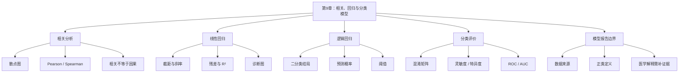

# 第9章 相关、回归与分类模型

## 本章定位

第9章把第8章的统计推断推进到基础建模。学生不再只比较两组是否不同，还要学习如何描述两个连续变量的关系，如何用线性回归估计连续结局，如何用逻辑回归处理二分类结局，以及如何用混淆矩阵和 ROC 检查分类模型的错误类型。

本章仍处在 Prompt Coding 阶段。AI 可以辅助生成 Python 和 R 的局部模型代码、解释报错、整理系数表、生成混淆矩阵和 ROC 图，但不能替学生判断变量含义、正类定义、阈值选择、模型适用性和医学解释边界。

| 本章承接 | 本章训练 | 后续使用 |
| --- | --- | --- |
| 第8章的 P 值、效应量、置信区间和解释边界 | 相关、线性回归、逻辑回归、分类指标、模型报告 | 第10章训练/测试、交叉验证、特征选择和可解释性 |
| 第7章的图表契约 | 散点图、残差图、混淆矩阵和 ROC 图 | 科研图表、项目汇报和模型审阅 |

## 学习目标

1. 能解释相关分析的用途和边界，并用散点图检查两个连续变量是否存在共同变化。
2. 能拟合入门线性回归模型，解释截距、斜率、置信区间、P 值、残差和 R²。
3. 能说明逻辑回归用于二分类结局，输出是预测概率和系数方向，不是诊断结论。
4. 能根据混淆矩阵计算准确率、灵敏度、特异度、阳性预测值、阴性预测值。
5. 能解释 ROC 曲线和 AUC 的基本含义，并说明阈值选择的漏判和误判风险。
6. 能写出不越界的模型报告，标明数据来源、正类定义、阈值、评价范围和需补证据。

## 阅读指南

先读 9.1，理解相关分析不能越过散点图和变量单位。再读 9.2，把回归系数、残差和 R² 放在模型语境中解释。9.3 和 9.4 是分类任务入门，重点不是追求最高准确率，而是看清正类、阈值和错误类型。9.5 用于检查所有模型报告。

本章贯穿案例使用教学模拟分析表。`control`、`treatment`、`dose` 和 `response` 都是课堂演示字段，不代表真实药物处理、真实治疗反应或临床结局。

## 核心概念速查

| 概念 | 本章解释 | 常见混淆 | 需保留英文 |
| --- | --- | --- | --- |
| 相关 | 两个变量共同变化的统计关系 | 写成因果或机制 | correlation |
| Pearson 相关 | 描述两个连续变量的线性关系 | 不看散点图直接计算 | Pearson correlation |
| Spearman 相关 | 描述两个变量排序上的单调关系 | 当成因果证据 | Spearman correlation |
| 线性回归 | 用线性模型估计连续结局 | 只看 P 值，不看残差 | linear regression |
| 残差 | 观察值与模型拟合值的差 | 当作新的医学结局 | residual |
| R² | 模型解释结局变异的比例 | 写成医学机制强度 | R-squared |
| 逻辑回归 | 用于二分类结局的概率模型 | 当作线性概率模型 | logistic regression |
| 阈值 | 把预测概率转成类别的分界值 | 默认 0.5 就是临床阈值 | threshold |
| 混淆矩阵 | 交叉展示真实类别和预测类别 | 只看准确率 | confusion matrix |
| 灵敏度 | 实际阳性中被预测为阳性的比例 | 与特异度混用 | sensitivity |
| 特异度 | 实际阴性中被预测为阴性的比例 | 与灵敏度混用 | specificity |
| ROC 曲线 | 展示不同阈值下灵敏度和 1-特异度的关系 | 当作临床应用证明 | ROC curve |
| AUC | ROC 曲线下面积，概括区分能力 | 写成模型可诊断疾病 | AUC |

## 章节总览图


## 教学模拟分析表

本章示例使用 24 行教学模拟数据。每一行代表一个样本，`response` 是教学二分类标签，1 表示“模拟阳性”，0 表示“模拟阴性”。这些字段只用于练习，不支持真实医学解释。

| 字段 | 含义 | 类型 | 单位或取值 | 边界 |
| --- | --- | --- | --- | --- |
| `sample_id` | 样本编号 | ID | S01-S24 | 不参与建模 |
| `group` | 教学分组 | 分类 | control/treatment | 不解释为真实处理 |
| `dose` | 教学剂量变量 | 连续 | 任意教学单位 | 不代表真实用药剂量 |
| `ALT` | 教学肝酶指标 | 连续 | U/L | 不写临床阈值 |
| `AST` | 教学肝酶指标 | 连续 | U/L | 不写临床阈值 |
| `age` | 年龄 | 连续 | 岁 | 只作模型变量 |
| `sex` | 性别 | 分类 | F/M | 本章不展开性别分层 |
| `response` | 教学二分类标签 | 分类 | 0/1 | 不代表真实疗效或诊断 |

```python
import pandas as pd

df = pd.DataFrame({
    "sample_id": [f"S{i:02d}" for i in range(1, 25)],
    "group": ["control"] * 12 + ["treatment"] * 12,
    "dose": [0] * 12 + [5, 5, 10, 10, 15, 15, 20, 20, 25, 25, 30, 30],
    "ALT": [42,38,45,51,39,48,44,55,41,47,50,43,
            35,33,40,37,31,39,36,42,34,38,41,32],
    "AST": [35,36,32,41,38,34,40,37,39,33,42,36,
            34,33,35,37,31,36,38,32,40,35,34,33],
    "age": [46,52,41,59,48,55,44,62,50,57,53,45,
            43,49,39,58,47,54,42,60,51,56,52,44],
    "sex": ["F","M"] * 12,
    "response": [0,0,0,1,0,1,0,0,0,1,0,0,
                 1,1,0,1,1,0,1,0,1,1,0,1]
})
```

R 也使用同一张分析表。学生提交作业时，应确认 Python 和 R 的数据行数、列名和 `response` 编码完全一致。

```r
df <- data.frame(
  sample_id = sprintf("S%02d", 1:24),
  group = c(rep("control", 12), rep("treatment", 12)),
  dose = c(rep(0, 12), c(5,5,10,10,15,15,20,20,25,25,30,30)),
  ALT = c(42,38,45,51,39,48,44,55,41,47,50,43,
          35,33,40,37,31,39,36,42,34,38,41,32),
  AST = c(35,36,32,41,38,34,40,37,39,33,42,36,
          34,33,35,37,31,36,38,32,40,35,34,33),
  age = c(46,52,41,59,48,55,44,62,50,57,53,45,
          43,49,39,58,47,54,42,60,51,56,52,44),
  sex = rep(c("F", "M"), 12),
  response = c(0,0,0,1,0,1,0,0,0,1,0,0,
               1,1,0,1,1,0,1,0,1,1,0,1)
)
```

## 9.1 相关分析与散点图

相关（correlation）用于描述两个变量是否共同变化。两个变量一起升高，可以是正相关；一个升高、另一个降低，可以是负相关；如果共同变化很弱，相关系数可能接近 0。

相关分析必须先看散点图。散点图能显示趋势、异常点、分层、非线性和测量范围。只看一个相关系数，容易漏掉分组结构或极端值。

| 检查项 | 为什么检查 | 课堂处理 |
| --- | --- | --- |
| 变量类型 | 相关分析通常用于连续变量 | 先确认 `dose` 和 `ALT` 是数值变量 |
| 单位 | 单位决定解释口径 | `ALT` 以 U/L 表示，`dose` 是教学单位 |
| 散点趋势 | 判断线性或单调关系 | 先画散点图再算相关 |
| 异常点 | 极端点会影响 Pearson 相关 | 标出异常点，不能直接删除 |
| 分层因素 | 组别可能改变关系 | 可用颜色区分 `group` |

### Python 示例

```python
import matplotlib.pyplot as plt
from scipy import stats

plt.scatter(df["dose"], df["ALT"])
plt.xlabel("dose (teaching unit)")
plt.ylabel("ALT (U/L)")
plt.title("Teaching example: dose and ALT")
plt.show()

pearson = stats.pearsonr(df["dose"], df["ALT"])
spearman = stats.spearmanr(df["dose"], df["ALT"])

print("Pearson r:", round(pearson.statistic, 3), "P:", round(pearson.pvalue, 4))
print("Spearman rho:", round(spearman.statistic, 3), "P:", round(spearman.pvalue, 4))
```

### R 示例

```r
plot(df$dose, df$ALT,
     xlab = "dose (teaching unit)",
     ylab = "ALT (U/L)",
     main = "Teaching example: dose and ALT")

cor.test(df$dose, df$ALT, method = "pearson")
cor.test(df$dose, df$ALT, method = "spearman")
```

本轮 Python 和 R 核验结果显示，`dose` 与 `ALT` 的 Pearson 相关系数约为 -0.562，P 值约为 0.0042；Spearman 相关系数约为 -0.667，P 值约为 0.0004。

教材表述应写成：在教学模拟数据中，`dose` 与 `ALT` 呈负相关趋势。该结果只能说明两个变量在这张模拟表中共同变化，不能写成 `dose` 导致 `ALT` 降低。

## 9.2 线性回归与模型诊断

线性回归（linear regression）用于估计连续结局变量与一个或多个自变量之间的线性关系。最简单的形式是 `ALT ~ dose`，意思是用 `dose` 解释或预测 `ALT`。

线性回归结果中，截距表示自变量为 0 时模型估计的结局值。斜率表示自变量增加一个单位时，结局平均变化多少。截距是否有实际意义，要看自变量为 0 是否在合理范围内。

| 输出 | 解释 | 常见误读 |
| --- | --- | --- |
| 截距 | `dose = 0` 时的模型估计 ALT | 不看变量范围就强行解释 |
| 斜率 | `dose` 增加 1 单位时 ALT 的平均变化 | 写成因果效应 |
| 95% CI | 系数估计的不确定范围 | 写成个体 ALT 范围 |
| P 值 | 检验系数是否与 0 不相容 | 写成医学意义 |
| R² | 当前模型解释 ALT 变异的比例 | 写成机制强度 |
| 残差 | 观察值与拟合值之差 | 当成新结局 |

### Python 示例

```python
import statsmodels.api as sm

X = sm.add_constant(df[["dose"]])
fit = sm.OLS(df["ALT"], X).fit()

print(fit.summary())
print(fit.conf_int())

df["ALT_fitted"] = fit.fittedvalues
df["ALT_resid"] = fit.resid

plt.scatter(df["ALT_fitted"], df["ALT_resid"])
plt.axhline(0, color="gray", linestyle="--")
plt.xlabel("Fitted ALT")
plt.ylabel("Residual")
plt.title("Residual plot for ALT ~ dose")
plt.show()
```

### R 示例

```r
fit <- lm(ALT ~ dose, data = df)
summary(fit)
confint(fit)

plot(fitted(fit), resid(fit),
     xlab = "Fitted ALT",
     ylab = "Residual",
     main = "Residual plot for ALT ~ dose")
abline(h = 0, lty = 2, col = "gray")
```

本轮核验结果如下。

| 模型 | 系数 | 估计值 | 95% CI | P 值 | R² |
| --- | --- | ---: | --- | ---: | ---: |
| `ALT ~ dose` | 截距 | 43.69 | [40.81, 46.58] | < 0.0001 | 0.316 |
| `ALT ~ dose` | `dose` 斜率 | -0.322 | [-0.532, -0.113] | 0.0042 | 0.316 |

可写表述：在教学模拟数据中，`dose` 每增加 1 个教学单位，模型估计 `ALT` 平均降低约 0.322 U/L，95% CI 为 [-0.532, -0.113]。该模型的 R² 约为 0.316，说明单变量线性模型解释了部分 ALT 变异。

不能写成：剂量导致 ALT 降低，或该剂量具有治疗作用。这里没有随机化、真实剂量定义、临床结局或机制证据。

### 残差诊断入门

残差图用于检查模型是否明显不合适。理想情况下，残差围绕 0 随机分布，不应出现明显弧形、漏斗形或几个点完全支配模型。

| 图中现象 | 可能提示 | 本章处理 |
| --- | --- | --- |
| 弧形或 U 形 | 线性关系可能不够 | 标 `需人工确认`，不强行解释 |
| 漏斗形 | 方差可能不恒定 | 说明模型前提风险 |
| 极端残差 | 异常点或记录错误 | 回查数据来源，不直接删除 |
| 少数点影响很大 | 高杠杆点 | 标出并复核 |
| 残差按时间连续偏高或偏低 | 误差可能相关 | 检查重复测量或时间结构 |

## 9.3 分类问题与逻辑回归

分类问题（classification）的目标是预测类别。本章只讲二分类，也就是结局只有两个状态，例如 `response = 1` 或 `response = 0`。

逻辑回归（logistic regression）用于估计二分类结局发生的概率。它不直接输出“诊断阳性”，而是输出一个 0 到 1 之间的预测概率。要把概率变成类别，还需要人为设定阈值。

| 项目 | 线性回归 | 逻辑回归 |
| --- | --- | --- |
| 结局变量 | 连续变量，如 ALT | 二分类变量，如 response |
| 输出 | 拟合值或连续预测值 | 预测概率 |
| 常见代码 | `lm()`、`OLS` | `glm(..., family=binomial())`、`Logit` |
| 核心检查 | 残差、线性、异方差 | 正类定义、阈值、混淆矩阵 |
| 解释边界 | 不写因果 | 不写诊断或治疗建议 |

### Python 示例

```python
import numpy as np
import statsmodels.api as sm

X_logit = sm.add_constant(df[["ALT", "AST", "age"]])
logit_fit = sm.Logit(df["response"], X_logit).fit()

print(logit_fit.summary())
print("Odds ratio:")
print(np.exp(logit_fit.params))

df["prob_response"] = logit_fit.predict(X_logit)
df["pred_response"] = (df["prob_response"] >= 0.5).astype(int)
```

### R 示例

```r
logfit <- glm(response ~ ALT + AST + age, data = df, family = binomial())
summary(logfit)

# odds ratio 只作为补充，不作为因果效应解释
exp(coef(logfit))

df$prob_response <- predict(logfit, type = "response")
df$pred_response <- ifelse(df$prob_response >= 0.5, 1, 0)
```

本轮核验结果中，`response ~ ALT + AST + age` 的逻辑回归系数方向如下。

| 变量 | 系数估计 | odds ratio | 教材解释 |
| --- | ---: | ---: | --- |
| `ALT` | -0.204 | 0.815 | 在当前模拟模型中，ALT 较高与 response=1 的预测概率较低相关 |
| `AST` | -0.018 | 0.982 | 当前模拟数据中方向不稳定，不作重点解释 |
| `age` | 0.130 | 1.139 | 当前模拟数据中 age 较高与预测概率较高相关，但证据不足 |

odds ratio 可以帮助学生看到方向：大于 1 表示 odds 增加，小于 1 表示 odds 降低。但本章不做数学推导，也不把 odds ratio 写成风险比、因果效应或临床结论。

## 9.4 混淆矩阵、灵敏度、特异度与 ROC

逻辑回归给出的是预测概率。若设定阈值 0.5，概率大于或等于 0.5 的样本被预测为 1，低于 0.5 的样本被预测为 0。阈值改变，分类结果也会改变。

混淆矩阵（confusion matrix）把真实类别和预测类别交叉展示。它能告诉我们模型错在哪里，而不仅是错了多少。

| 记号 | 含义 | 医药任务中的常见风险 |
| --- | --- | --- |
| TP | 真实阳性，预测阳性 | 正确识别阳性 |
| FP | 真实阴性，预测阳性 | 误报，可能带来不必要检查 |
| TN | 真实阴性，预测阴性 | 正确识别阴性 |
| FN | 真实阳性，预测阴性 | 漏判，可能延误后续处理 |

### Python 示例

```python
from sklearn.metrics import confusion_matrix, roc_auc_score, roc_curve

cm = confusion_matrix(df["response"], df["pred_response"], labels=[0, 1])
tn, fp, fn, tp = cm.ravel()

accuracy = (tp + tn) / (tp + tn + fp + fn)
sensitivity = tp / (tp + fn)
specificity = tn / (tn + fp)
ppv = tp / (tp + fp)
npv = tn / (tn + fn)
auc = roc_auc_score(df["response"], df["prob_response"])

print(cm)
print(accuracy, sensitivity, specificity, ppv, npv, auc)
```

### R 示例

```r
cm <- table(
  predicted = factor(df$pred_response, levels = c(0, 1)),
  true = factor(df$response, levels = c(0, 1))
)
cm

tn <- cm["0", "0"]
fn <- cm["0", "1"]
fp <- cm["1", "0"]
tp <- cm["1", "1"]

accuracy <- (tp + tn) / sum(cm)
sensitivity <- tp / (tp + fn)
specificity <- tn / (tn + fp)
ppv <- tp / (tp + fp)
npv <- tn / (tn + fn)

# 基础 R 计算 AUC：用预测概率排序，等价于秩和法
rank_prob <- rank(df$prob_response)
n_pos <- sum(df$response == 1)
n_neg <- sum(df$response == 0)
auc <- (sum(rank_prob[df$response == 1]) - n_pos * (n_pos + 1) / 2) /
       (n_pos * n_neg)

c(accuracy = accuracy,
  sensitivity = sensitivity,
  specificity = specificity,
  ppv = ppv,
  npv = npv,
  auc = auc)
```

在阈值 0.5 下，本轮模拟结果如下。

| 指标 | 结果 |
| --- | ---: |
| TN | 9 |
| FP | 4 |
| FN | 4 |
| TP | 7 |
| 准确率 | 0.667 |
| 灵敏度 | 0.636 |
| 特异度 | 0.692 |
| 阳性预测值 | 0.636 |
| 阴性预测值 | 0.692 |
| AUC | 0.797 |

这个结果不能只写“准确率 66.7%”。还要写：在这组模拟数据中，阈值 0.5 下有 4 个假阳性和 4 个假阴性。若任务更害怕漏判，可能需要降低阈值；若任务更害怕误报，可能需要提高阈值。

| 阈值 | 灵敏度 | 特异度 | 解释 |
| ---: | ---: | ---: | --- |
| 0.3 | 0.818 | 0.538 | 更少漏判，但误报增加 |
| 0.5 | 0.636 | 0.692 | 教学默认阈值，未必适合医学任务 |
| 0.7 | 0.455 | 0.923 | 更少误报，但漏判增加 |

ROC 曲线把不同阈值下的灵敏度和 1-特异度放在同一张图里。AUC 用一个数概括区分能力，但它不告诉我们应该选哪个阈值。阈值选择必须回到任务背景。

## 9.5 医学决策风险与模型报告

模型报告不能只贴代码输出。对于医药数据，学生至少要说明数据来源、变量含义、结局定义、正类定义、模型方法、阈值、评价指标和解释边界。

| 报告层级 | 可写表述 | 需要证据 | 不可越界 |
| --- | --- | --- | --- |
| 数据观察 | `dose` 与 `ALT` 在模拟数据中呈负相关 | 散点图、相关系数 | 写成剂量作用 |
| 模型描述 | `ALT ~ dose` 的斜率为 -0.322 | 回归系数表、CI、残差图 | 写成因果效应 |
| 分类表现 | 阈值 0.5 下 TN=9、FP=4、FN=4、TP=7 | 混淆矩阵 | 只写准确率 |
| 医学解释 | 真实应用需外部验证和专业判断 | 研究设计、验证数据、临床背景 | 写成可诊断或可指导治疗 |

### 模型报告模板

```text
本分析使用教学模拟分析表，共 24 个样本。结局变量为 response，正类定义为 response=1。
线性回归示例中，ALT 为连续结局，dose 为教学剂量变量。模型 ALT ~ dose 的斜率为 -0.322，
95% CI 为 [-0.532, -0.113]，R² 为 0.316。该结果只说明当前模拟数据中的线性关联。

逻辑回归示例中，使用 ALT、AST 和 age 预测 response。阈值设为 0.5 时，混淆矩阵为
TN=9、FP=4、FN=4、TP=7，灵敏度为 0.636，特异度为 0.692，AUC 为 0.797。
这些指标只反映当前模拟数据，不能写成临床诊断能力。
```

### 常见越界表述审阅

| 原句 | 问题 | 建议改写 |
| --- | --- | --- |
| dose 显著降低 ALT | 把相关和回归写成因果 | 在教学模拟数据中，dose 与 ALT 呈负相关，线性模型估计斜率为负 |
| R² 为 0.316，说明机制明确 | R² 不是机制证据 | R² 表示该模型解释了部分 ALT 变异 |
| response=1 可视为治疗有效 | 未定义真实结局 | response 只是教学二分类标签 |
| AUC 接近 0.8，模型可用于诊断 | AUC 不是临床应用证明 | 当前模拟数据中模型有一定区分能力，仍需独立验证 |
| 阈值 0.5 是最佳阈值 | 阈值未经过任务风险判断 | 0.5 只是教学默认阈值，真实任务需根据漏判和误判成本设定 |

## 案例任务

| 项目 | 内容 |
| --- | --- |
| 数据背景 | 24 行教学模拟分析表，字段包括 `sample_id`、`group`、`ALT`、`AST`、`age`、`sex`、`dose`、`response` |
| 任务目标 | 分析 `dose` 与 `ALT` 的关系，建立 `response` 二分类入门模型，整理模型报告 |
| 操作步骤 | 核对数据字典；检查变量类型和缺失；绘制散点图；计算相关；拟合线性回归；检查残差；拟合逻辑回归；设定阈值；计算混淆矩阵和 AUC；写解释边界 |
| 交付物 | 图表契约、Python 代码、R 代码、相关结果表、回归系数表、残差图、混淆矩阵、ROC 图、模型报告、AI 协作记录 |
| 禁止事项 | 不写真实疗效；不把 response 写成真实诊断；不让 AI 猜阳性定义；不只报告准确率；不把 AUC 写成临床有效 |

## 图表建议

| 图表 | 目的 | 必备标注 | 不可越界解释 |
| --- | --- | --- | --- |
| `dose` 与 `ALT` 散点图 | 展示两个连续变量关系 | 轴单位、n、分组颜色、相关方法 | 不写因果 |
| 线性回归趋势线图 | 展示模型拟合方向 | 模型公式、CI 或趋势线说明 | 不写机制 |
| 残差图 | 检查非线性、异方差和异常点 | 残差定义、拟合值、0 线 | 不作为医学结论 |
| 系数森林图或表 | 展示系数和不确定性 | 系数、CI、单位、样本量 | 不写成因果效应 |
| 混淆矩阵热图 | 展示 TP/FP/TN/FN | 正类定义、阈值、n | 不只看准确率 |
| ROC 曲线 | 展示阈值变化下区分能力 | AUC、正类定义、数据范围 | 不写成临床可用阈值 |

## AI 协作点

| 场景 | 可让 AI 做什么 | 学生必须核验什么 |
| --- | --- | --- |
| 相关分析 | 生成散点图代码、相关系数代码和图注草稿 | 变量类型、单位、异常点、方法选择 |
| 线性回归 | 生成 Python/R 模型代码和残差图代码 | 结局变量、自变量、系数方向、残差图 |
| 逻辑回归 | 生成概率预测和阈值分类代码 | 正类定义、类别编码、阈值和概率范围 |
| 分类指标 | 生成混淆矩阵、灵敏度、特异度和 AUC 代码 | 行列含义、TP/FP/TN/FN 分母 |
| 报告润色 | 改写越界表达，补充限制 | 是否新增医学结论或临床建议 |

### AI 任务说明书示例

```text
目标：
请审阅下面的第9章教学模拟模型代码和模型报告，指出代码、统计解释和医学边界风险。

上下文：
- 课程章节：第9章相关、回归与分类模型。
- 数据为教学模拟分析表，不代表真实患者或真实药物处理。
- 字段包括 sample_id、group、dose、ALT、AST、age、sex、response。
- response=1 只表示教学模拟阳性。

约束：
- 不新增临床阈值、疗效、诊断、机制或样本来源。
- 不把相关或回归写成因果。
- 不把 AUC 写成临床可用。
- Python 和 R 代码都要保留可核验字段。

验证：
- 检查列名、变量类型、缺失值、正类定义和阈值。
- 检查混淆矩阵行列含义。
- 检查结论是否超过教学模拟数据。

输出：
1. 代码风险
2. 统计解释风险
3. 医学越界风险
4. 建议改写
5. 学生核验清单
```

## 常见误区

| 误区 | 为什么错 | 如何纠正 |
| --- | --- | --- |
| 相关显著就写因果 | 相关只描述共同变化 | 写“相关”或“关联”，不写“导致” |
| 不画散点图直接算相关 | 可能漏掉非线性、异常点和分层 | 先画图，再算 Pearson 或 Spearman |
| 回归系数显著就写机制 | 回归不是机制实验 | 写模型关联和需补证据 |
| R² 高就说明模型可靠 | R² 只描述拟合或解释比例 | 还要看残差、数据质量和验证范围 |
| 逻辑回归概率就是诊断 | 预测概率需要阈值和验证 | 写“模型预测概率”，不写“诊断结果” |
| 只报告准确率 | 准确率可能掩盖少数类错误 | 同时报告混淆矩阵、灵敏度和特异度 |
| AUC 高就可临床应用 | AUC 不代表校准、阈值、外部验证或决策收益 | 标出验证缺口和应用边界 |
| AI 生成代码后直接提交 | AI 可能猜错列名、正类或函数参数 | 运行、核验、记录修改 |

## 核验清单

- 已核对根目录 `大纲.md` 和第9章本章大纲。
- 数据为教学模拟数据，未写成真实医学事实。
- 每个变量的类型、单位或取值已说明。
- 相关分析先看散点图，再解释相关系数。
- 线性回归报告了系数、CI、P 值、R² 和残差检查。
- 逻辑回归写清正类定义、预测概率和阈值。
- 混淆矩阵写清 TP、FP、TN、FN。
- 分类报告不只包含准确率，还包含灵敏度和特异度。
- ROC/AUC 没有被写成临床可用性证明。
- AI 生成代码或文字已人工核验，并保留协作记录。

## 知识结构与知识图谱生成提示词



可用于生成教学展示图的提示词：

```text
请生成一张中文教学知识图谱，用于《医药数据处理与可视化》第9章“相关、回归与分类模型”。中心节点为“基础建模与模型报告”。一级节点包括“相关分析”“线性回归”“逻辑回归”“混淆矩阵与 ROC”“医学解释边界”。每个一级节点下放 2-3 个短标签，例如“散点图”“Pearson/Spearman”“截距/斜率”“残差图”“预测概率”“阈值”“灵敏度/特异度”“AUC”“不写因果”“需外部验证”。图形风格简洁，适合课堂投影，不加入真实患者、临床建议或药物机制。
```

若使用 imagegen 生成图片，图片只作为教学展示。若图中文字不清、标签错误或节点缺失，以本节 Mermaid 图、表格和清单为准，并在图注中写明“需人工核验”。

## 实验或作业

### 作业：教学模拟模型报告

| 项目 | 要求 |
| --- | --- |
| 输入 | 本章 24 行教学模拟分析表 |
| 任务 1 | 用 Python 和 R 分别计算 `dose` 与 `ALT` 的 Pearson 和 Spearman 相关 |
| 任务 2 | 绘制 `dose` 与 `ALT` 散点图，写图表契约 |
| 任务 3 | 拟合 `ALT ~ dose`，报告斜率、95% CI、P 值、R² 和残差图 |
| 任务 4 | 拟合 `response ~ ALT + AST + age` 逻辑回归，说明正类和阈值 |
| 任务 5 | 在阈值 0.5 下计算混淆矩阵、灵敏度、特异度和 AUC |
| 任务 6 | 比较阈值 0.3、0.5、0.7 下的漏判和误判变化 |
| 提交 | Python 代码、R 代码、图表、结果表、模型报告、AI 协作记录、需人工确认列表 |
| 禁止 | 不写真实疗效、诊断、机制、临床阈值或临床建议 |

## 需补证据

| 位置 | 缺口 | 处理方式 |
| --- | --- | --- |
| 正式课堂数据集 | 尚未指定第9章真实课堂数据文件 | 正文使用教学模拟数据，并明确不代表真实医学结论 |
| `dose` 含义 | 当前只是教学变量 | 不写真实剂量、药效或机制 |
| `response` 含义 | 当前只是教学二分类标签 | 不写治疗反应、诊断阳性或预后结局 |
| ALT/AST 临床阈值 | 当前材料未提供适用人群、检测条件和阈值 | 不写诊疗判断，标 `需补证据` |
| 外部验证 | 本章未做独立验证和校准评估 | 第10章继续讲训练/测试、交叉验证和模型评估 |
| 类别不平衡真实案例 | 本章未指定真实疾病分类任务 | 用教学例子说明指标分母和错误类型 |
